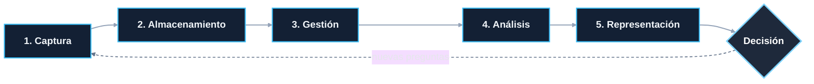
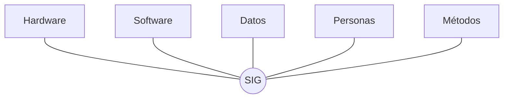
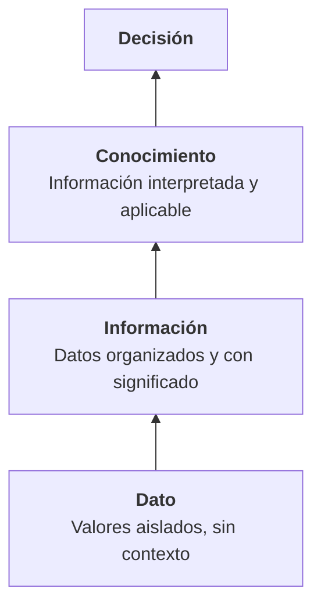

# 1.1 Introducción a los Sistemas de Información Geográfica

!!! abstract "Objetivos de aprendizaje"

    Al finalizar este tema, el estudiante será capaz de:

    - Definir qué es un SIG y distinguirlo de un simple programa para hacer mapas.
    - Identificar el tipo de preguntas que un SIG permite responder.
    - Reconocer los componentes de un SIG y el rol de cada uno.
    - Diferenciar entre dato, información y conocimiento geográfico.
    - Relacionar los SIG con aplicaciones reales en su contexto profesional.

---

## ¿Qué es un SIG?

Casi todas las decisiones que tomamos sobre el territorio tienen una pregunta de fondo: **¿dónde?** Dónde construir una escuela, dónde se concentran los accidentes de tránsito, dónde hay riesgo de inundación, dónde vive la población que no tiene acceso a agua potable.

Un Sistema de Información Geográfica existe precisamente para trabajar con ese tipo de preguntas.

!!! info "Definición"

    Un **Sistema de Información Geográfica (SIG)** —en inglés *Geographic Information System, GIS*— es un sistema integrado por **personas, métodos, datos, software y hardware**, que permite **capturar, almacenar, gestionar, analizar y representar** información vinculada a una localización sobre la superficie terrestre, con el propósito de apoyar la comprensión del territorio y la toma de decisiones.

### La "G" es lo que marca la diferencia

Existen muchos sistemas de información: contables, académicos, de recursos humanos. Lo que distingue a un SIG es que **cada elemento que gestiona tiene una localización explícita**, y esa localización se puede usar para relacionar, medir y analizar.

Veamos la diferencia con un ejemplo:

| Registro tradicional de centros de salud | Registro en un SIG |
|---|---|
| Nombre, dirección, nivel de atención, número de camas | Lo mismo **+ la geometría (ubicación) en un sistema de referencia conocido** |
| Permite preguntar: *¿cuántos centros de segundo nivel hay?* | Permite preguntar además: *¿qué barrios están a más de 3 km de un centro de salud?* |
| La dirección es solo un texto | La ubicación es un dato que se puede medir y cruzar con otras capas |

La segunda pregunta es imposible de responder con una tabla convencional, aunque tenga la dirección escrita. Para responderla hace falta **geometría, un sistema de referencia y operaciones espaciales**. Eso es un SIG.

### Distintas formas de entender un SIG

A lo largo de la historia, el concepto se ha definido desde diferentes enfoques. Ninguno es incorrecto; cada uno pone el acento en algo distinto.

=== "Como caja de herramientas"

    Un SIG es un conjunto de herramientas para recolectar, almacenar, recuperar, transformar y visualizar datos espaciales del mundo real con un propósito determinado.

    Es la visión clásica de **Burrough**, centrada en las **funciones** que el sistema permite realizar.

=== "Como base de datos"

    Un SIG es una base de datos en la que los registros están indexados espacialmente, y sobre la cual se realizan consultas y operaciones que consideran la posición de los objetos.

    Esta visión pone el acento en la **organización de los datos** y es la base de tecnologías como PostGIS.

=== "Como sistema organizacional"

    Un SIG es un sistema de apoyo a la decisión dentro de una institución, que integra datos, procedimientos y personas para resolver problemas territoriales.

    Es la visión más completa y la que adoptaremos en este curso: **el SIG no es el programa, es todo el sistema**.

### El ciclo funcional de un SIG

Independientemente del enfoque, todo SIG sigue un flujo general de trabajo:

| Función | Qué implica | Ejemplo |
|---|---|---|
| **Captura** | Obtener datos del territorio | Levantamiento con GNSS, digitalización, imágenes de dron |
| **Almacenamiento** | Guardar los datos de forma estructurada | Archivos GeoPackage, base de datos PostGIS |
| **Gestión** | Mantener, actualizar, controlar calidad | Editar predios, validar geometrías, documentar metadatos |
| **Análisis** | Generar nueva información a partir de los datos | Áreas de influencia, superposición de capas, rutas óptimas |
| **Representación** | Comunicar los resultados | Mapas, gráficos, visores web, reportes |

El ciclo no termina en el mapa: termina en una **decisión**, que casi siempre genera nuevas preguntas.

---

## ¿Qué problemas resuelve un SIG?

Un SIG resuelve **problemas espaciales**, es decir, problemas en los que la ubicación importa.

!!! tip "¿Cómo saber si un problema es espacial?"

    Pregúntate: **¿la respuesta cambia si cambia la ubicación?**

    - *¿Cuál es el presupuesto anual de salud del municipio?* → No es espacial.
    - *¿Qué distritos tienen menor cobertura de salud por habitante?* → **Es espacial.**

### Las cinco preguntas clásicas

Una clasificación muy difundida en la literatura SIG, atribuida a David Rhind, agrupa las preguntas que un SIG puede responder en cinco tipos, de menor a mayor complejidad:

| Tipo | Pregunta genérica | Ejemplo en gestión territorial |
|---|---|---|
| **Localización** | ¿Qué hay en este lugar? | ¿A qué predio y propietario corresponde esta coordenada? |
| **Condición** | ¿Dónde se cumplen ciertas condiciones? | ¿Dónde hay terrenos con pendiente menor al 15 %, fuera de zona de riesgo y a menos de 500 m de una vía? |
| **Tendencia** | ¿Qué ha cambiado a lo largo del tiempo? | ¿Cómo creció la mancha urbana entre 2000 y 2025? |
| **Patrón** | ¿Existe algún patrón espacial? | ¿Los accidentes de tránsito se concentran en ciertas intersecciones? |
| **Modelado** | ¿Qué pasaría si...? | ¿Qué zonas se verían afectadas si una torrentera se desborda? |

Las dos primeras son **consultas**; las tres últimas ya son **análisis**. Gran parte del valor de un SIG está en llegar a estas últimas.

!!! example "Ejemplo integrador: ubicar un nuevo centro de salud"

    Un gobierno municipal necesita definir dónde construir un nuevo centro de salud. Con un SIG, el problema se descompone así:

    1. **Localización:** ubicar los centros de salud existentes.
    2. **Condición:** identificar terrenos municipales disponibles, fuera de zonas de riesgo.
    3. **Tendencia:** analizar hacia dónde está creciendo la población.
    4. **Patrón:** detectar las zonas con mayor población sin cobertura.
    5. **Modelado:** simular cuánta población quedaría cubierta con cada terreno candidato.

    El resultado no es "un mapa bonito", sino una **propuesta argumentada** para la toma de decisiones.

---

## Componentes de un SIG

Un SIG funciona gracias a la interacción de cinco componentes. Si falta cualquiera de ellos, el sistema no funciona, aunque el software esté instalado.

-   :material-desktop-classic:{ .lg .middle } **Hardware**

    ---

    Equipos físicos donde se captura, procesa y visualiza la información: computadoras, servidores, receptores GNSS, drones, tabletas y celulares para trabajo de campo.

-   :material-application-cog:{ .lg .middle } **Software**

    ---

    Programas que permiten trabajar con datos espaciales: SIG de escritorio (QGIS), bases de datos espaciales (PostGIS), aplicaciones móviles (QField), servidores de mapas (GeoServer).

-   :material-database:{ .lg .middle } **Datos**

    ---

    La materia prima del sistema: capas vectoriales, imágenes ráster, tablas de atributos y metadatos. Suelen ser el componente **más costoso y más duradero**.

-   :material-account-group:{ .lg .middle } **Personas**

    ---

    Quienes diseñan, operan, mantienen y usan el sistema: técnicos, analistas, desarrolladores y, sobre todo, quienes toman decisiones con sus resultados.

-   :material-clipboard-flow:{ .lg .middle } **Métodos**

    ---

    Procedimientos, normas y flujos de trabajo que garantizan que los datos se capturen, procesen y analicen de forma correcta y repetible.

### Detalle de cada componente

??? note "Hardware"

    - **Captura:** receptores GNSS, estaciones totales, drones, escáneres.
    - **Procesamiento:** computadoras de escritorio, servidores, servicios en la nube.
    - **Campo:** tabletas y teléfonos con aplicaciones de levantamiento.
    - **Salida:** monitores, impresoras y plotters.

    El hardware se ha abaratado muchísimo: hoy un teléfono celular tiene GNSS, cámara y capacidad para ejecutar un SIG móvil.

??? note "Software"

    | Categoría | Software libre | Software propietario |
    |---|---|---|
    | SIG de escritorio | QGIS, GRASS GIS, gvSIG | ArcGIS Pro |
    | Base de datos espacial | PostgreSQL + PostGIS, SpatiaLite | Oracle Spatial |
    | Servidor de mapas | GeoServer, MapServer, QGIS Server | ArcGIS Server |
    | SIG móvil | QField, Mergin Maps | ArcGIS Field Maps |
    | Web mapping | Leaflet, OpenLayers, MapLibre | ArcGIS Online |

    En este curso trabajaremos con **QGIS**, pero los conceptos son transferibles a cualquier otro software.

??? note "Datos"

    - **Vectoriales:** puntos, líneas y polígonos (predios, vías, ríos).
    - **Ráster:** matrices de celdas (imágenes satelitales, modelos digitales de elevación).
    - **Tabulares:** atributos asociados a elementos geográficos (censos, padrones).
    - **Metadatos:** información sobre los datos (quién los produjo, cuándo, con qué precisión, en qué sistema de referencia).

    Algunas fuentes de datos oficiales en Bolivia son el **Instituto Geográfico Militar (IGM)**, el **Instituto Nacional de Estadística (INE)** y la infraestructura de datos espaciales **GeoBolivia**. A nivel global, destacan **OpenStreetMap**, las imágenes **Sentinel** y **Landsat**, y los modelos de elevación globales.

??? note "Personas"

    | Rol | Función |
    |---|---|
    | Usuario final / tomador de decisiones | Usa los resultados para decidir |
    | Analista SIG | Formula preguntas espaciales y aplica métodos de análisis |
    | Técnico SIG | Captura, edita y mantiene los datos |
    | Administrador de datos | Garantiza calidad, estándares y respaldo |
    | Desarrollador | Automatiza procesos y construye aplicaciones |

    Sin personas capacitadas, un SIG se convierte rápidamente en un conjunto de archivos desordenados.

??? note "Métodos"

    - Protocolos de captura de datos en campo.
    - Normas de nomenclatura y estructura de capas.
    - Uso de sistemas de referencia oficiales.
    - Procedimientos de control de calidad.
    - Estándares internacionales (ISO 19100, especificaciones OGC).
    - Documentación mediante metadatos.

    Los métodos son lo que hace que el trabajo sea **reproducible**: que otra persona pueda repetir el proceso y llegar al mismo resultado.

!!! warning "El componente más subestimado"

    Muchas instituciones invierten en software y equipos, pero no en **datos de calidad, personas capacitadas ni métodos documentados**. El resultado es un SIG que depende de una sola persona y que colapsa cuando esa persona se va.

---

## Dato, información y conocimiento geográfico

Estos tres términos se usan como sinónimos en el lenguaje cotidiano, pero representan niveles distintos de valor.

| Nivel | Descripción | Ejemplo |
|---|---|---|
| **Dato** | Valor crudo, sin contexto. Por sí solo no dice nada. | `-17.3935, -66.1570, 1.2` |
| **Información** | Dato estructurado, georreferenciado y con significado. | Punto de control ubicado en la zona sur de Cochabamba, donde se registró una lámina de agua de 1,2 m el 12 de febrero. |
| **Conocimiento** | Información analizada, relacionada con otras variables e interpretada. | Los puntos ubicados por debajo de cierta cota en la zona sur se inundan de forma recurrente en época de lluvias, debido a la obstrucción de una torrentera. |
| **Decisión** | Acción basada en el conocimiento. | Priorizar la limpieza de la torrentera y restringir nuevas construcciones en esa franja. |

### ¿Qué papel juega el SIG?

- El SIG **transforma datos en información** al estructurarlos, georreferenciarlos y relacionarlos con atributos.
- El SIG **facilita la generación de conocimiento** mediante el análisis espacial y la visualización.
- Pero el conocimiento **requiere interpretación humana**, experiencia y contexto.

!!! danger "Un SIG no piensa por nosotros"

    Un SIG puede producir un mapa técnicamente impecable a partir de datos erróneos o de un análisis mal planteado. El software ejecuta operaciones; **la responsabilidad de formular bien la pregunta e interpretar el resultado es del profesional**.

---

## El SIG como sistema y no solo como software

Uno de los errores más comunes al aprender SIG es pensar que **saber SIG es saber usar QGIS** (o cualquier otro programa).

!!! quote "Una analogía útil"

    QGIS es al SIG lo que el bisturí es a la cirugía. Es una herramienta indispensable, pero saber sostenerlo no convierte a nadie en cirujano.

| Visión como software | Visión como sistema |
|---|---|
| "Trabajo con QGIS" | "Gestiono información territorial" |
| El foco está en los botones y menús | El foco está en el problema y los datos |
| Se aprende haciendo clics | Se aprende comprendiendo conceptos |
| Si cambia el software, hay que aprender todo de nuevo | Los conceptos se mantienen, solo cambia la herramienta |
| El resultado es un mapa | El resultado es una decisión mejor fundamentada |

### La ciencia detrás del sistema

En 1992, Michael Goodchild propuso diferenciar entre los **sistemas** de información geográfica (la tecnología) y la **ciencia** de la información geográfica (*GIScience*): el conjunto de preguntas teóricas que surgen al usar esa tecnología. Por ejemplo:

- ¿Cómo representar un fenómeno continuo, como la temperatura, en una computadora?
- ¿Cómo afecta la escala de los datos al resultado de un análisis?
- ¿Cómo medir y comunicar la incertidumbre de un mapa?

Estas preguntas son las que trabajaremos a lo largo del **Módulo 1**, antes de abrir el software. Por eso este curso empieza por la teoría: **primero entender qué estamos representando, después aprender a hacerlo con la herramienta.**

---

## Aplicaciones de los SIG

Los SIG se utilizan prácticamente en cualquier disciplina que trabaje con el territorio.

=== "Gestión municipal"

    - Catastro urbano y rural.
    - Planes de ordenamiento territorial y uso de suelo.
    - Gestión de permisos de construcción.
    - Planificación de rutas de recolección de residuos.
    - Inventario de áreas verdes, alumbrado público y equipamiento.

=== "Gestión de riesgos"

    - Mapas de amenaza, vulnerabilidad y riesgo.
    - Identificación de zonas inundables y de deslizamientos.
    - Monitoreo de incendios forestales.
    - Planificación de rutas de evacuación y albergues.
    - Evaluación de daños después de un desastre.

=== "Medio ambiente"

    - Monitoreo de deforestación y cambio de uso de suelo.
    - Delimitación y gestión de cuencas hidrográficas.
    - Gestión de áreas protegidas.
    - Evaluación de impacto ambiental.
    - Análisis de calidad del agua y del aire.

=== "Salud"

    - Análisis de cobertura de servicios de salud.
    - Vigilancia epidemiológica (dengue, enfermedades transmisibles).
    - Localización óptima de nuevos establecimientos.
    - Planificación de campañas de vacunación.

=== "Agricultura"

    - Zonificación agroecológica.
    - Agricultura de precisión.
    - Estimación de superficies cultivadas.
    - Monitoreo de sequías mediante imágenes satelitales.

=== "Infraestructura y transporte"

    - Diseño y trazado de carreteras.
    - Gestión de redes de agua potable, alcantarillado y electricidad.
    - Análisis de accesibilidad y movilidad urbana.
    - Planificación de transporte público.

=== "Recursos naturales"

    - Gestión de concesiones mineras.
    - Exploración y gestión de hidrocarburos.
    - Inventarios forestales.
    - Gestión de recursos hídricos.

---

??? info "Para saber más: breve historia de los SIG"

    | Época | Hito |
    |---|---|
    | **1854** | John Snow mapea los casos de cólera en Londres y relaciona su concentración con una bomba de agua. Es el ejemplo clásico de análisis espacial antes de las computadoras. |
    | **Década de 1960** | Roger Tomlinson desarrolla el *Canada Geographic Information System* (CGIS) para el inventario de tierras de Canadá. Se le considera el "padre de los SIG". |
    | **Décadas de 1970 y 1980** | Surgen los primeros SIG comerciales y los centros de investigación universitarios. |
    | **Década de 1990** | Las computadoras personales hacen accesibles los SIG de escritorio. Se consolida la *GIScience*. |
    | **2000–2005** | Se liberan señales GPS más precisas para uso civil (2000), nacen QGIS (2002) y OpenStreetMap (2004), y Google Earth populariza la visualización geográfica (2005). |
    | **Actualidad** | SIG en la nube, Web GIS, datos satelitales abiertos, drones, bases de datos espaciales, automatización con Python y GeoAI. |

---

## Ideas clave

!!! success "Para recordar"

    - Un SIG es un **sistema** formado por hardware, software, datos, personas y métodos.
    - Lo que distingue a un SIG es que trabaja con **información localizada** y permite **analizar relaciones espaciales**.
    - Un SIG resuelve **problemas espaciales**: aquellos en los que la respuesta cambia según la ubicación.
    - Las preguntas que responde van desde la **localización** hasta el **modelado**.
    - El SIG transforma **datos en información**, pero el **conocimiento** requiere interpretación humana.
    - **QGIS no es el SIG**: es una herramienta dentro del sistema.

---

## Autoevaluación

??? question "1. ¿Por qué una tabla de centros de salud con la dirección escrita no es suficiente para un análisis espacial?"

    Porque la dirección es solo un texto. Para medir distancias, calcular áreas de influencia o cruzar la información con otras capas, se necesita una **geometría** en un **sistema de referencia conocido**.

??? question "2. Clasifica la siguiente pregunta según las cinco preguntas clásicas: *¿Qué zonas quedarían sin servicio de agua si falla el tanque de distribución norte?*"

    Es una pregunta de **modelado** (*¿qué pasaría si...?*), porque plantea un escenario hipotético y evalúa sus consecuencias.

??? question "3. Una institución compró licencias de software y computadoras de alto rendimiento, pero dos años después su SIG no funciona. ¿Qué componentes pudieron haber fallado?"

    Probablemente **datos** (desactualizados, sin metadatos o sin control de calidad), **personas** (sin capacitación o dependencia de un solo técnico) y **métodos** (sin procedimientos documentados ni estándares).

??? question "4. Indica si cada elemento es dato, información o conocimiento"

    - `2558` → **Dato**.
    - "La plaza principal se encuentra a 2558 m s. n. m." → **Información**.
    - "Las zonas ubicadas por encima de cierta altitud requieren sistemas de bombeo para el abastecimiento de agua" → **Conocimiento**.

---

## Actividad propuesta

!!! example "Actividad 1.1 — Identificar un problema espacial (sin software)"

    Piensa en tu municipio, institución o área de trabajo y desarrolla lo siguiente:

    1. Describe un **problema territorial real** en dos o tres líneas.
    2. Justifica por qué es un **problema espacial**.
    3. Formula **una pregunta** para cada uno de los cinco tipos (localización, condición, tendencia, patrón y modelado).
    4. Identifica qué **datos** necesitarías y dónde podrías conseguirlos.
    5. Describe qué **personas** y qué **métodos** serían necesarios para resolverlo.

    Esta actividad se retomará a lo largo del curso como proyecto integrador.

---

## Referencias

- Burrough, P. A., & McDonnell, R. A. (1998). *Principles of Geographical Information Systems*. Oxford University Press.
- Goodchild, M. F. (1992). Geographical information science. *International Journal of Geographical Information Systems*, 6(1), 31–45.
- Longley, P. A., Goodchild, M. F., Maguire, D. J., & Rhind, D. W. (2015). *Geographic Information Science and Systems* (4.ª ed.). Wiley.
- Olaya, V. (2020). *Sistemas de Información Geográfica*. Libro libre disponible en línea.
