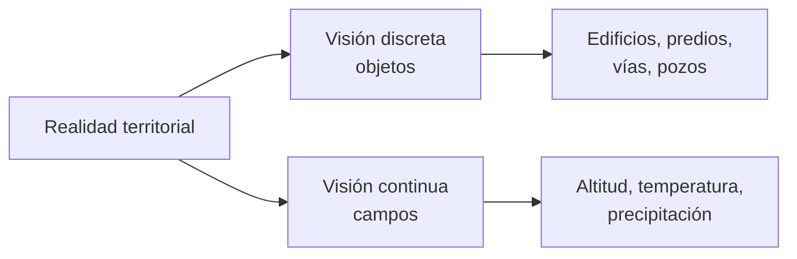
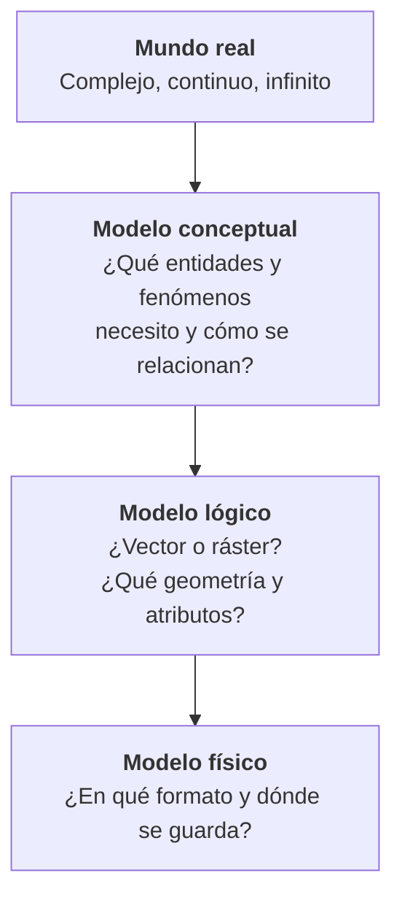

# 1.2 El espacio geográfico y la representación del territorio

!!! abstract "Objetivos de aprendizaje"

    Al finalizar este tema, el estudiante será capaz de:

    - Explicar qué es el espacio geográfico y en qué se diferencia del territorio.
    - Distinguir entre objetos, fenómenos y procesos territoriales.
    - Diferenciar localización absoluta, relativa e indirecta.
    - Reconocer los principales tipos de relaciones espaciales.
    - Diferenciar una representación discreta de una continua.
    - Describir el proceso de abstracción que lleva del mundo real a un modelo en el SIG.

---

## ¿Por qué empezar por aquí?

En el tema anterior vimos que un SIG trabaja con información localizada. Pero antes de hablar de coordenadas, capas o software, hay una pregunta más básica:

**¿Qué es exactamente lo que estamos intentando representar?**

Un SIG no guarda "el mundo". Guarda una **versión simplificada** del mundo, construida a partir de decisiones: qué incluir, qué dejar fuera, cómo describirlo y dónde ubicarlo. Entender esas decisiones es la base para usar bien cualquier dato geográfico.

---

## Concepto de espacio geográfico

!!! info "Definición"

    El **espacio geográfico** es la superficie terrestre entendida como resultado de la interacción entre los elementos naturales y la acción humana a lo largo del tiempo.

No es solo "el lugar donde ocurren las cosas". El espacio geográfico **se construye y se transforma**: un valle agrícola se convierte en zona urbana, un río se canaliza, un bosque se deforesta, una carretera conecta dos comunidades que antes estaban aisladas.

El geógrafo brasileño Milton Santos propuso entender el espacio como la combinación inseparable de dos sistemas:

| Sistema | Qué incluye | Ejemplos |
|---|---|---|
| **Sistema de objetos** | Elementos naturales y construidos | Ríos, cerros, viviendas, vías, redes de agua |
| **Sistema de acciones** | Actividades humanas que usan y transforman esos objetos | Habitar, producir, transportar, regular, planificar |

Un SIG captura muy bien el **sistema de objetos**. El **sistema de acciones** aparece de forma indirecta, a través de atributos (uso de suelo, tipo de actividad) y de los cambios que observamos en el tiempo.

### Conceptos cercanos que conviene diferenciar

| Concepto | Qué enfatiza | Ejemplo |
|---|---|---|
| **Espacio geográfico** | La superficie terrestre como producto social y natural | El valle central de Cochabamba |
| **Territorio** | Un espacio **apropiado, gestionado o bajo una jurisdicción** | El municipio, el territorio indígena, el área protegida |
| **Paisaje** | Lo que se **percibe** visualmente de un espacio | La vista del valle desde la cordillera |
| **Lugar** | Un espacio con **significado o identidad** para las personas | Una plaza, un mercado tradicional, un barrio |
| **Región** | Un espacio definido por **criterios de homogeneidad o función** | El Altiplano, la Chiquitanía, una cuenca hidrográfica |

!!! tip "¿Por qué importa el territorio en un SIG?"

    Casi todo el trabajo profesional con SIG ocurre **dentro de un territorio**: un municipio, una concesión, una cuenca, un área protegida. Los límites de ese territorio definen qué datos se necesitan, quién es responsable de ellos y qué decisiones se pueden tomar.

---

## Objetos, fenómenos y procesos territoriales

Todo lo que queremos representar en un SIG puede clasificarse, de forma general, en tres categorías.

<div class="grid cards" markdown>

-   :material-home-city-outline:{ .lg .middle } **Objetos**

    ---

    Entidades con **límites definidos** e identidad propia. Se pueden contar y señalar.

    *Edificios, predios, pozos, puentes, postes de alumbrado.*

-   :material-weather-partly-rainy:{ .lg .middle } **Fenómenos**

    ---

    Manifestaciones que **varían en el espacio** y que se miden en cualquier punto, sin límites claros.

    *Temperatura, precipitación, altitud, concentración de contaminantes.*

-   :material-timeline-clock-outline:{ .lg .middle } **Procesos**

    ---

    **Cambios en el tiempo** que transforman objetos y fenómenos.

    *Expansión urbana, erosión, deforestación, migración, inundaciones.*

</div>

| Categoría | Pregunta que lo identifica | ¿Tiene límites claros? | Dimensión temporal |
|---|---|---|---|
| Objeto | *¿Qué es y dónde está?* | Sí | Suele ser estable |
| Fenómeno | *¿Cuánto vale en cada lugar?* | No | Puede variar |
| Proceso | *¿Cómo cambia?* | No aplica | Es su esencia |

!!! example "Un mismo tema, tres miradas"

    Tomemos como ejemplo el agua en una ciudad:

    - **Objetos:** tanques de almacenamiento, tuberías, pozos, ríos.
    - **Fenómenos:** profundidad del nivel freático, precipitación anual, calidad del agua.
    - **Procesos:** descenso del nivel freático por sobreexplotación, contaminación progresiva de un río, crecimiento de la demanda.

    Un buen proyecto SIG suele necesitar las tres miradas.

!!! warning "Los límites no siempre son evidentes"

    Muchos elementos que representamos como objetos **no tienen límites nítidos en la realidad**. ¿Dónde termina exactamente un bosque y empieza una sabana? ¿Dónde termina la ciudad y empieza el área rural? Cuando dibujamos esa línea en un SIG, estamos **tomando una decisión**, no registrando un hecho.

---

## Localización

Localizar es responder a la pregunta **¿dónde?** Existen distintas formas de hacerlo, y un SIG trabaja con todas ellas.

### Localización absoluta

Ubica un elemento mediante **coordenadas** en un sistema de referencia definido. Es única, precisa y no depende de otros objetos.

```text
Plaza Murillo, La Paz (aproximadamente)
Latitud:  -16.4958°
Longitud: -68.1336°
```

Es la forma de localización que necesita un SIG para medir, calcular y cruzar información. Cómo se definen esas coordenadas lo veremos en los temas **1.3 a 1.6**.

### Localización relativa

Ubica un elemento **en relación con otros**: distancia, dirección o posición respecto a referencias conocidas.

- "A dos cuadras al norte de la plaza principal."
- "A 5 km del puente, siguiendo el río aguas abajo."
- "Entre el mercado y la terminal de buses."

Es la forma en que las personas se orientan en la vida cotidiana, y es fundamental en el análisis espacial: **distancia, proximidad y accesibilidad son formas de localización relativa**.

### Localización indirecta

Ubica un elemento mediante un **identificador asociado** a un lugar, sin coordenadas explícitas.

- Dirección postal: *Av. Ejemplo N.º 123*.
- Código catastral de un predio.
- Nombre de un barrio, distrito o comunidad.
- Código de un área censal.

!!! tip "Geocodificación"

    El proceso de convertir una localización indirecta (una dirección, un nombre de lugar) en coordenadas se llama **geocodificación**. Es una tarea muy común cuando se trabaja con registros administrativos que no fueron diseñados para un SIG.

| Tipo | Se expresa con | Fortaleza | Limitación |
|---|---|---|---|
| Absoluta | Coordenadas | Precisa y medible | Poco intuitiva para las personas |
| Relativa | Distancia, dirección, referencia | Intuitiva y útil para el análisis | Depende de otros objetos |
| Indirecta | Dirección, código, nombre | Muy común en registros existentes | Requiere geocodificación |

---

## Relaciones espaciales

La verdadera potencia de un SIG no está en saber dónde está cada cosa, sino en **cómo se relacionan las cosas entre sí en el espacio**.

!!! quote "Primera ley de la Geografía (Tobler, 1970)"

    Todo está relacionado con todo lo demás, pero las cosas cercanas están más relacionadas que las distantes.

Esta idea, aparentemente simple, sustenta buena parte del análisis espacial: la interpolación, la autocorrelación espacial y los análisis de vecindad parten de ella.

### Tipos de relaciones espaciales

<div class="grid cards" markdown>

-   :material-vector-intersection:{ .lg .middle } **Topológicas**

    ---

    Describen cómo se **conectan, tocan o contienen** los objetos. No cambian aunque el mapa se estire o deforme.

    *El predio está dentro del distrito. Dos predios son colindantes.*

-   :material-ruler:{ .lg .middle } **De distancia**

    ---

    Describen **qué tan lejos o cerca** está un objeto de otro.

    *La escuela está a 800 m del centro de salud.*

-   :material-compass-outline:{ .lg .middle } **Direccionales**

    ---

    Describen la **orientación** de un objeto respecto a otro.

    *La zona industrial está al sur de la ciudad.*

-   :material-transit-connection-variant:{ .lg .middle } **De conectividad**

    ---

    Describen si los objetos están **unidos a través de una red**.

    *Esta comunidad está conectada a la capital por un camino vecinal.*

</div>

### Relaciones topológicas más usadas

Estas relaciones son las que usaremos más adelante en QGIS, por ejemplo con la herramienta **Seleccionar por localización**.

| Relación | Significado | Ejemplo |
|---|---|---|
| **Contiene** | A encierra completamente a B | El municipio contiene la escuela |
| **Está dentro** | A está completamente dentro de B | La escuela está dentro del municipio |
| **Interseca** | A y B comparten al menos un punto | La carretera interseca la zona de riesgo |
| **Toca** | A y B comparten borde, pero no interior | Dos predios colindantes |
| **Se superpone** | A y B comparten parte de su interior | Una concesión minera y un área protegida |
| **Cruza** | Una línea atraviesa otro objeto | Un río cruza una vía |
| **Disjunto** | A y B no comparten ningún punto | Dos comunidades separadas |
| **Igual** | A y B ocupan exactamente el mismo espacio | Dos capas con el mismo límite |

??? info "Para saber más: el modelo DE-9IM"

    Las relaciones topológicas en los SIG se formalizan mediante el modelo **DE-9IM** (*Dimensionally Extended 9-Intersection Model*), desarrollado a partir de los trabajos de Max Egenhofer y colaboradores.

    El modelo compara el **interior**, el **borde** y el **exterior** de dos geometrías, lo que da nueve combinaciones posibles. A partir de ellas se definen las relaciones de la tabla anterior.

    Es el mismo modelo que utilizan PostGIS, GEOS y QGIS internamente. No es necesario dominarlo para usar un SIG, pero explica por qué, por ejemplo, dos polígonos que solo **se tocan** no **se superponen**.

---

## Representación discreta y continua

Al representar el territorio, existen dos formas fundamentales de concebir la realidad.

=== "Visión discreta (objetos)"

    El mundo está formado por **entidades individuales** con límites definidos, ubicadas sobre un espacio vacío.

    - Cada entidad tiene identidad propia.
    - Entre una entidad y otra no hay "nada" que representar.
    - Se pueden contar.

    **Ejemplos:** edificios, predios, pozos, vías, límites administrativos.

    **Pregunta típica:** *¿Qué hay aquí?*

=== "Visión continua (campos)"

    El mundo es una **superficie** donde cada punto del espacio tiene un valor.

    - No hay "vacíos": en cualquier lugar se puede medir algo.
    - Los valores cambian gradualmente.
    - No se cuentan, se miden.

    **Ejemplos:** altitud, temperatura, precipitación, pendiente, contaminación del aire.

    **Pregunta típica:** *¿Cuánto vale aquí?*



!!! danger "Error común: discreto = vector y continuo = ráster"

    Es frecuente asociar la visión discreta con el modelo vectorial y la continua con el modelo ráster. Suele coincidir, pero **no es una regla**:

    - Un fenómeno continuo como la altitud puede representarse con **curvas de nivel** (vector).
    - Un conjunto de objetos discretos como las coberturas de suelo puede representarse como **ráster clasificado**.

    La visión (discreta o continua) es una forma de **entender la realidad**; el modelo (vector o ráster) es una forma de **almacenarla**. Profundizaremos en esto en el tema **1.11**.

---

## Abstracción y modelización del mundo real

La realidad es infinitamente compleja. Para llevarla a un SIG es necesario **abstraerla**: seleccionar lo relevante, simplificarlo y describirlo de forma estructurada.

!!! quote "El mapa no es el territorio"

    La expresión, atribuida a Alfred Korzybski, recuerda que toda representación es necesariamente incompleta. Un modelo útil no es el que lo incluye todo, sino el que incluye **lo necesario para un propósito**.

### Niveles de modelización

<div style="display: flex; justify-content: center;" markdown>



</div>

| Nivel | Pregunta central | Ejemplo: red de agua potable |
|---|---|---|
| **Mundo real** | ¿Qué existe? | Tuberías, válvulas, tanques, medidores, usuarios, fugas, presión |
| **Modelo conceptual** | ¿Qué necesito representar? | Tanques, tuberías y válvulas; la presión no se incluye por ahora |
| **Modelo lógico** | ¿Cómo lo estructuro? | Tanques y válvulas como puntos; tuberías como líneas con diámetro y material |
| **Modelo físico** | ¿Cómo lo almaceno? | Tablas en PostGIS o capas en un GeoPackage |

### Decisiones que implica abstraer

Toda abstracción implica decisiones que afectan directamente al resultado del análisis:

- **Selección:** qué elementos se incluyen y cuáles se omiten.
- **Clasificación:** cómo se agrupan los elementos en categorías.
- **Simplificación:** cuánto detalle geométrico se conserva.
- **Representación geométrica:** qué tipo de geometría se usa para cada elemento.

!!! example "¿Un río es una línea o un polígono?"

    Depende del **propósito** y de la **escala**:

    - Para un mapa departamental, el río Rocha puede representarse como una **línea**.
    - Para estudiar su desborde en un tramo urbano, necesitamos un **polígono** que represente su cauce.
    - Para modelar su caudal, quizás necesitemos una **red** de líneas conectadas con dirección de flujo.

    Ninguna opción es "la correcta". **Cada una responde a una pregunta distinta.**

!!! warning "Las decisiones de modelización viajan con los datos"

    Cuando usamos datos producidos por otra institución, **heredamos sus decisiones de abstracción**: qué incluyeron, cómo clasificaron y a qué escala trabajaron. Por eso los metadatos son tan importantes, como veremos en los temas **1.12** y **1.13**.

---

## Ideas clave

!!! success "Para recordar"

    - El **espacio geográfico** es producto de la interacción entre naturaleza y sociedad; el **territorio** es un espacio apropiado o gestionado.
    - En un SIG representamos **objetos** (con límites), **fenómenos** (valores que varían en el espacio) y **procesos** (cambios en el tiempo).
    - La localización puede ser **absoluta** (coordenadas), **relativa** (respecto a otros objetos) o **indirecta** (direcciones, códigos).
    - La potencia del SIG está en las **relaciones espaciales**: topológicas, de distancia, direccionales y de conectividad.
    - La realidad se puede concebir de forma **discreta** (objetos) o **continua** (campos), y eso no equivale automáticamente a vector o ráster.
    - Todo dato geográfico es resultado de un proceso de **abstracción** con decisiones que condicionan su uso.

---

## Autoevaluación

??? question "1. ¿En qué se diferencia el espacio geográfico del territorio?"

    El espacio geográfico es la superficie terrestre como resultado de la interacción entre naturaleza y sociedad. El territorio es un espacio **apropiado, gestionado o bajo una jurisdicción**, por ejemplo un municipio o un área protegida.

??? question "2. Clasifica cada elemento como objeto, fenómeno o proceso"

    - Un pozo de agua → **Objeto**.
    - La precipitación anual → **Fenómeno**.
    - El avance de la mancha urbana sobre tierras agrícolas → **Proceso**.
    - La concentración de material particulado en el aire → **Fenómeno**.
    - Un puente → **Objeto**.

??? question "3. ¿Qué tipo de localización es cada una?"

    - "Código catastral 01-02-035-012" → **Indirecta**.
    - "A 300 m de la unidad educativa" → **Relativa**.
    - "-17.3935, -66.1570" → **Absoluta**.

??? question "4. Dos predios comparten un lindero, pero no se superponen. ¿Qué relación topológica tienen?"

    **Se tocan.** Comparten el borde, pero no su interior. Por eso también **intersecan**, pero **no se superponen**.

??? question "5. ¿Por qué es incorrecto afirmar que todo fenómeno continuo debe representarse en formato ráster?"

    Porque la visión continua es una forma de entender la realidad, no un formato de almacenamiento. Un fenómeno continuo como la altitud puede representarse también con curvas de nivel o redes de triángulos, que son modelos vectoriales.

---

## Actividad propuesta

!!! example "Actividad 1.2 — Modelar el problema del proyecto integrador (sin software)"

    Retoma el problema territorial que identificaste en la **Actividad 1.1** y desarrolla lo siguiente:

    1. Define el **territorio** de estudio: ¿cuáles son sus límites y quién lo gestiona?
    2. Identifica al menos tres **objetos**, dos **fenómenos** y un **proceso** relevantes para tu problema.
    3. Para cada objeto, indica qué **tipo de localización** tienen hoy los datos disponibles (absoluta, relativa o indirecta).
    4. Menciona dos **relaciones espaciales** que necesitarías analizar.
    5. Elabora un **modelo conceptual** sencillo: qué elementos incluirías, cuáles dejarías fuera y por qué.

---

## Referencias

- Couclelis, H. (1992). People manipulate objects (but cultivate fields): Beyond the raster-vector debate in GIS. En A. U. Frank, I. Campari y U. Formentini (Eds.), *Theories and Methods of Spatio-Temporal Reasoning in Geographic Space* (pp. 65–77). Springer.
- Egenhofer, M. J., & Franzosa, R. D. (1991). Point-set topological spatial relations. *International Journal of Geographical Information Systems*, 5(2), 161–174.
- Goodchild, M. F., Yuan, M., & Cova, T. J. (2007). Towards a general theory of geographic representation in GIS. *International Journal of Geographical Information Science*, 21(3), 239–260.
- Longley, P. A., Goodchild, M. F., Maguire, D. J., & Rhind, D. W. (2015). *Geographic Information Science and Systems* (4.ª ed.). Wiley.
- Olaya, V. (2020). *Sistemas de Información Geográfica*. Libro libre disponible en línea.
- Santos, M. (2000). *La naturaleza del espacio: técnica y tiempo, razón y emoción*. Ariel.
- Tobler, W. R. (1970). A computer movie simulating urban growth in the Detroit region. *Economic Geography*, 46(sup1), 234–240.
