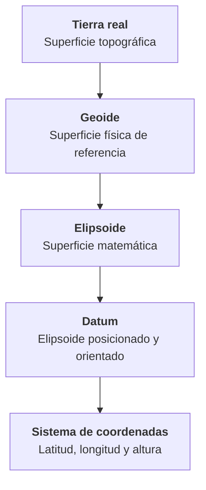
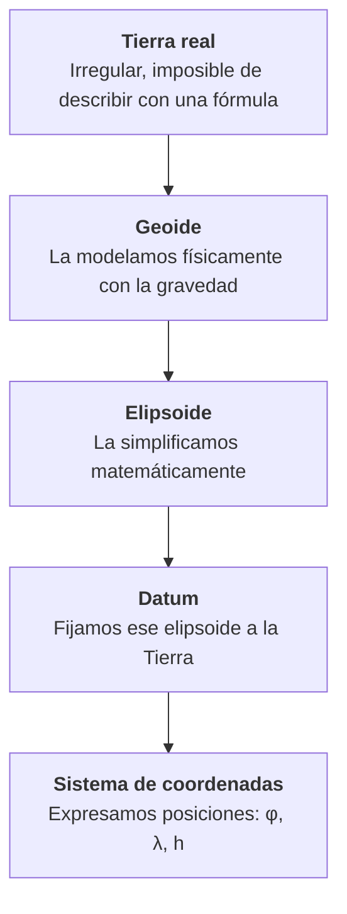

# 1.3 Fundamentos de Geodesia

!!! abstract "Objetivos de aprendizaje"

    Al finalizar este tema, el estudiante será capaz de:

    - Explicar por qué la Tierra no es una esfera ni un elipsoide perfecto.
    - Diferenciar la superficie topográfica, el geoide y el elipsoide.
    - Describir las coordenadas geocéntricas y las coordenadas geográficas (latitud y longitud).
    - Diferenciar altura elipsoidal y altura ortométrica, y relacionarlas mediante la ondulación del geoide.
    - Explicar qué es un datum geodésico y diferenciar un datum local de uno global.

---

## ¿Por qué un curso de SIG necesita geodesia?

Toda coordenada que aparece en un SIG responde, aunque no lo veamos, a una pregunta previa: **¿respecto a qué modelo de la Tierra se midió?**

Si ese modelo cambia, **las coordenadas de un mismo punto cambian**. En Sudamérica, por ejemplo, un mismo punto expresado en el antiguo datum PSAD56 y en WGS 84 puede tener coordenadas que difieren en cientos de metros. No es un error del software: son dos formas distintas de describir la Tierra.

!!! info "Definición"

    La **geodesia** es la ciencia que estudia la **forma, las dimensiones y el campo de gravedad de la Tierra**, así como sus variaciones en el tiempo. Proporciona el marco de referencia sobre el cual se miden y expresan todas las posiciones del territorio.

No necesitamos convertirnos en geodestas, pero sí comprender los conceptos básicos. Sin ellos, temas como **sistemas de referencia, proyecciones o UTM** se vuelven una lista de códigos que se usan sin entender.

Este tema construye la siguiente cadena conceptual:



---

## La forma real de la Tierra

### De la esfera al elipsoide

La idea de una Tierra esférica es muy antigua. Hacia el año 240 a. C., **Eratóstenes** estimó la circunferencia terrestre comparando el ángulo de los rayos del Sol en Siena y en Alejandría. Su resultado fue sorprendentemente cercano al valor real.

Siglos después, **Isaac Newton** (1687) planteó que, por efecto de su rotación, la Tierra debía estar **achatada en los polos y ensanchada en el ecuador**. Para comprobarlo, la Academia de Ciencias de Francia organizó dos expediciones para medir la longitud de un grado de latitud en lugares muy distintos:

- **Laponia** (1736–1737), cerca del círculo polar ártico.
- **Virreinato del Perú**, en el actual Ecuador (1735–1744), cerca de la línea ecuatorial.

Las mediciones confirmaron la hipótesis de Newton: **la Tierra es achatada**. Es uno de los primeros grandes trabajos geodésicos de la historia, y se realizó en parte en los Andes.

### Dimensiones de la Tierra

| Magnitud | Valor aproximado (elipsoide WGS 84) |
|---|---|
| Radio ecuatorial (*a*) | 6 378 137 m |
| Radio polar (*b*) | 6 356 752 m |
| Diferencia entre ambos | ≈ 21,4 km |
| Achatamiento (*f*) | ≈ 1/298,257 |
| Radio medio | ≈ 6 371 km |

!!! example "¿Cuánto pesa el relieve a escala planetaria?"

    Si la Tierra fuera una bola de **1 metro de diámetro**:

    - El monte Everest (8 849 m) tendría una altura de apenas **0,7 mm**.
    - La diferencia entre el diámetro ecuatorial y el polar sería de unos **3,4 mm**.

    A simple vista parecería una esfera perfecta. Sin embargo, para medir posiciones con precisión de metros o centímetros, **esas pequeñas diferencias son enormes**.

??? info "Para saber más: el punto más alejado del centro de la Tierra"

    Por el ensanchamiento ecuatorial, la cumbre más alejada del centro de la Tierra **no es el Everest**, sino el **Chimborazo** (Ecuador). Aunque es mucho más bajo sobre el nivel del mar, al estar casi sobre el ecuador su cumbre queda unos **2 km más lejos del centro** que la del Everest.

    Es un buen ejemplo de que "altura" depende de **respecto a qué superficie** se mide.

### La Tierra no es ni esfera ni elipsoide

En realidad, la Tierra tiene una forma **irregular**: montañas, valles, fosas oceánicas y, además, una distribución desigual de masas en su interior que hace que la gravedad no sea igual en todas partes.

Para trabajar con esa realidad, la geodesia utiliza **tres superficies**, cada una con un propósito distinto.

---

## Las tres superficies de referencia

<div class="grid cards" markdown>

-   :material-terrain:{ .lg .middle } **Superficie topográfica**

    ---

    La superficie **real** del terreno, donde caminamos, construimos y medimos. Es irregular y no se puede describir con una fórmula.

-   :material-waves:{ .lg .middle } **Geoide**

    ---

    Superficie **física** definida por la gravedad, que se aproxima al nivel medio del mar prolongado bajo los continentes. Es ondulada.

-   :material-ellipse-outline:{ .lg .middle } **Elipsoide**

    ---

    Superficie **matemática**, lisa y regular, que se ajusta a la forma general de la Tierra. Permite calcular coordenadas.

</div>

<figure class="figura">
<svg viewBox="0 0 720 330" xmlns="http://www.w3.org/2000/svg" role="img" aria-label="Superficie topográfica, geoide y elipsoide, con las alturas h, H y N">
<path d="M 20 215 L 80 195 L 140 200 L 220 120 L 280 90 L 340 140 L 400 170 L 470 150 L 540 190 L 620 180 L 700 200 L 700 320 L 20 320 Z" fill="currentColor" fill-opacity="0.07" stroke="none"/>
<path d="M 20 215 L 80 195 L 140 200 L 220 120 L 280 90 L 340 140 L 400 170 L 470 150 L 540 190 L 620 180 L 700 200" fill="none" stroke="currentColor" stroke-width="2.5" stroke-linejoin="round"/>
<path d="M 20 250 C 90 240, 160 225, 280 205 C 380 190, 470 225, 560 250 C 620 262, 670 262, 700 256" fill="none" stroke="#2e9e5b" stroke-width="2.5" stroke-dasharray="8 5"/>
<path d="M 20 260 Q 360 200 700 260" fill="none" stroke="#3f6fd8" stroke-width="2.5"/>
<line x1="280" y1="90" x2="280" y2="232" stroke="currentColor" stroke-opacity="0.45" stroke-dasharray="2 3"/>
<circle cx="280" cy="90" r="5" fill="#e0823d"/>
<text x="274" y="78" text-anchor="end" font-size="14" font-weight="bold" fill="currentColor">P</text>
<line x1="250" y1="90" x2="250" y2="205" stroke="#e0823d" stroke-width="2"/>
<line x1="243" y1="90" x2="257" y2="90" stroke="#e0823d" stroke-width="2"/>
<line x1="243" y1="205" x2="257" y2="205" stroke="#e0823d" stroke-width="2"/>
<text x="238" y="152" text-anchor="end" font-size="15" font-weight="bold" fill="#e0823d">H</text>
<line x1="250" y1="205" x2="250" y2="232" stroke="#2e9e5b" stroke-width="2"/>
<line x1="243" y1="232" x2="257" y2="232" stroke="#2e9e5b" stroke-width="2"/>
<text x="262" y="224" font-size="15" font-weight="bold" fill="#2e9e5b">N</text>
<line x1="315" y1="90" x2="315" y2="232" stroke="#9b59b6" stroke-width="2"/>
<line x1="308" y1="90" x2="322" y2="90" stroke="#9b59b6" stroke-width="2"/>
<line x1="308" y1="232" x2="322" y2="232" stroke="#9b59b6" stroke-width="2"/>
<text x="327" y="166" font-size="15" font-weight="bold" fill="#9b59b6">h</text>
<text x="620" y="288" text-anchor="middle" font-size="12" fill="currentColor">N &lt; 0</text>
<line x1="440" y1="30" x2="475" y2="30" stroke="currentColor" stroke-width="2.5"/>
<text x="485" y="34" font-size="13" fill="currentColor">Superficie topográfica</text>
<line x1="440" y1="55" x2="475" y2="55" stroke="#2e9e5b" stroke-width="2.5" stroke-dasharray="8 5"/>
<text x="485" y="59" font-size="13" fill="currentColor">Geoide (≈ nivel medio del mar)</text>
<line x1="440" y1="80" x2="475" y2="80" stroke="#3f6fd8" stroke-width="2.5"/>
<text x="485" y="84" font-size="13" fill="currentColor">Elipsoide de referencia</text>
<text x="600" y="310" text-anchor="middle" font-size="16" font-weight="bold" fill="currentColor">h = H + N</text>
</svg>
<figcaption>Relación entre las tres superficies. Las ondulaciones del geoide están muy exageradas.</figcaption>
</figure>

### Superficie topográfica

Es la superficie física del terreno: cerros, valles, quebradas y el fondo de los océanos. Es la que representamos en un **modelo digital de elevación** o con **curvas de nivel**.

Su problema es que es **demasiado irregular** para servir como base de cálculo. No existe una ecuación que la describa.

### Geoide

!!! info "Definición"

    El **geoide** es la superficie **equipotencial del campo de gravedad terrestre** que mejor se aproxima al **nivel medio del mar**, extendida de forma imaginaria por debajo de los continentes.

Una superficie equipotencial es aquella en la que la gravedad "empuja" de forma perpendicular en todos sus puntos. En la práctica, **es la superficie sobre la que el agua quedaría en reposo** si solo actuara la gravedad.

Características importantes:

- Es una superficie **física**, no matemática: depende de la distribución de masas en el interior de la Tierra.
- Es **ondulada**: sube donde hay exceso de masa y baja donde hay déficit.
- Sus ondulaciones respecto al elipsoide van, aproximadamente, desde **−106 m** (océano Índico, al sur de la India) hasta **+85 m** (región de Nueva Guinea).
- Es la referencia de las **alturas sobre el nivel del mar** que usamos en topografía y cartografía.

!!! tip "La papa de Potsdam"

    Las representaciones del geoide suelen exagerar miles de veces sus ondulaciones, lo que le da un aspecto de papa deforme. La más conocida fue publicada por el centro de investigación GFZ de Potsdam (Alemania), y por eso se la conoce como **"la papa de Potsdam"**. Recuerda que esas deformaciones están exageradas: en realidad, el geoide es casi indistinguible de un elipsoide a simple vista.

El geoide se calcula a partir de mediciones de gravedad (terrestres, aéreas y satelitales) y se distribuye como **modelos geoidales**. Los modelos globales más usados son **EGM96** y **EGM2008**. Muchos países, además, desarrollan modelos nacionales más precisos.

### Elipsoide

!!! info "Definición"

    El **elipsoide de referencia** es una superficie matemática generada al **rotar una elipse alrededor de su eje menor**. Se utiliza como aproximación regular de la forma de la Tierra para calcular posiciones.

Un elipsoide queda definido por dos parámetros:

| Parámetro | Símbolo | Significado |
|---|---|---|
| Semieje mayor | *a* | Radio ecuatorial |
| Semieje menor | *b* | Radio polar |
| Achatamiento | *f* | `f = (a − b) / a` |

En la práctica, se suele definir con *a* y *f*, y el resto se calcula.

A lo largo de la historia se han definido muchos elipsoides, cada uno ajustado con las mediciones disponibles en su época o para una región determinada:

| Elipsoide | Semieje mayor (*a*) | Achatamiento inverso (1/*f*) | Uso |
|---|---|---|---|
| Clarke 1866 | 6 378 206,4 m | 294,979 | Norteamérica (NAD27) |
| Internacional 1924 (Hayford) | 6 378 388 m | 297 | Sudamérica (PSAD56), Europa (ED50) |
| GRS80 | 6 378 137 m | 298,257222101 | SIRGAS, ETRS89, NAD83 |
| WGS 84 | 6 378 137 m | 298,257223563 | Sistema GPS |

!!! note "GRS80 y WGS 84"

    GRS80 y WGS 84 tienen el mismo semieje mayor y un achatamiento casi idéntico. La diferencia en el semieje menor es de aproximadamente **0,1 mm**, por lo que, para cualquier trabajo con SIG, **pueden considerarse equivalentes**.

### Diferencia entre geoide y elipsoide

| Característica | Geoide | Elipsoide |
|---|---|---|
| Naturaleza | Física (gravedad) | Matemática (geometría) |
| Forma | Ondulada e irregular | Lisa y regular |
| Se describe con | Modelos de gravedad | Dos parámetros (*a* y *f*) |
| Sirve para | Referencia de **alturas** | Referencia de **latitud y longitud** |
| Se relaciona con | Nivel medio del mar | Forma general de la Tierra |
| Se obtiene mediante | Gravimetría y satélites | Definición convencional |

!!! success "La idea central"

    - El **geoide** es la forma "real" de la Tierra desde el punto de vista de la gravedad, pero es demasiado irregular para calcular coordenadas.
    - El **elipsoide** es una simplificación matemática que permite calcular coordenadas, pero no representa la gravedad.
    - Por eso **usamos los dos**: el elipsoide para ubicar posiciones horizontales y el geoide para las alturas.

---

## Coordenadas geocéntricas

La forma más directa de ubicar un punto respecto a la Tierra es mediante un sistema cartesiano tridimensional con origen en su centro.

!!! info "Definición"

    Las **coordenadas geocéntricas** (también llamadas **cartesianas** o **ECEF**, *Earth-Centered, Earth-Fixed*) expresan la posición de un punto mediante tres valores **X, Y, Z**, en metros, respecto a un origen situado en el **centro de masas de la Tierra**.

| Eje | Orientación |
|---|---|
| **Origen** | Centro de masas de la Tierra |
| **Eje Z** | Hacia el polo norte, a lo largo del eje de rotación |
| **Eje X** | Hacia la intersección del ecuador con el meridiano de Greenwich |
| **Eje Y** | Perpendicular a X y Z, hacia los 90° de longitud este |

!!! example "Ejemplo: Plaza Murillo, La Paz (valores aproximados)"

    ```text
    X ≈  2 279 658 m
    Y ≈ −5 680 452 m
    Z ≈ −1 800 453 m
    ```

    La coordenada Z es negativa porque el punto está en el **hemisferio sur**, e Y es negativa porque está al **oeste** de Greenwich.

¿Por qué casi no las vemos en un SIG? Porque son **poco intuitivas**: no dicen a simple vista si un punto está al norte o al sur, ni a qué altura. Sin embargo, son **fundamentales internamente**:

- Los receptores **GNSS** calculan primero coordenadas geocéntricas.
- Las **transformaciones entre datums** se realizan en este sistema.
- Los marcos de referencia modernos (ITRF, SIRGAS) se definen con coordenadas geocéntricas.

---

## Latitud y longitud

Las **coordenadas geográficas** expresan la posición de un punto mediante **ángulos** medidos sobre el elipsoide. Son la forma más conocida de localización absoluta.
### Explora la latitud y la longitud

Modifica las coordenadas y observa simultáneamente el **paralelo**, el **meridiano** y la posición del punto **P** sobre la superficie terrestre.
<figure class="figura">
<div class="latlon-lab">

  <div class="latlon-visual">
    <!-- generado por JavaScript -->
  </div>

  <div class="latlon-controls">

    <label>
      Latitud
      <input
        type="range"
        min="-90"
        max="90"
        step="0.1"
        data-latitude
      >
    </label>

    <label>
      Longitud
      <input
        type="range"
        min="-180"
        max="180"
        step="0.1"
        data-longitude
      >
    </label>

  </div>

</div>
<figcaption>Latitud y longitud de un punto P. El esquema de latitud está simplificado: la latitud geodésica se mide con la normal al elipsoide, no con la línea al centro.</figcaption>
</figure>

### Latitud (φ)

!!! info "Definición"

    La **latitud geodésica** es el ángulo entre el **plano del ecuador** y la **normal al elipsoide** (la línea perpendicular a su superficie) que pasa por el punto.

- Varía de **0°** en el ecuador a **90°** en los polos.
- Es **positiva en el hemisferio norte** y **negativa en el hemisferio sur**.
- Las líneas que unen puntos de igual latitud se llaman **paralelos**.

??? info "Para saber más: latitud geodésica y latitud geocéntrica"

    Como el elipsoide está achatado, la normal a su superficie **no pasa por el centro de la Tierra** (salvo en el ecuador y los polos).

    - **Latitud geodésica:** ángulo de la normal al elipsoide. Es la que usan los mapas, los GNSS y los SIG.
    - **Latitud geocéntrica:** ángulo de la línea que une el punto con el centro de la Tierra.

    La diferencia máxima entre ambas es de unos **0,19°** (unos 11,5 minutos de arco) cerca de los 45° de latitud, lo que equivale a más de 20 km sobre el terreno. Cuando un SIG habla de "latitud", **siempre se refiere a la geodésica**.

### Longitud (λ)

!!! info "Definición"

    La **longitud** es el ángulo entre el **plano del meridiano de Greenwich** y el **plano del meridiano** que pasa por el punto.

- Varía de **0°** en Greenwich a **180°** hacia el este o el oeste.
- Es **positiva hacia el este** y **negativa hacia el oeste**.
- Las líneas que unen puntos de igual longitud se llaman **meridianos**.

Bolivia se encuentra en el **hemisferio sur** y al **oeste de Greenwich**, por lo que **ambas coordenadas son negativas**.


### Formatos de expresión

Una misma coordenada puede escribirse de varias formas:

| Formato | Latitud | Longitud |
|---|---|---|
| Grados decimales (GD) | −16.4958° | −68.1336° |
| Grados, minutos y segundos (GMS) | 16° 29′ 44.88″ S | 68° 08′ 00.96″ O |
| Grados y minutos decimales (GMD) | 16° 29.748′ S | 68° 08.016′ O |

!!! example "Convertir de grados decimales a GMS"

    Tomemos la latitud **−16.4958°**:

    1. Los **grados** son la parte entera: **16°**. Como es negativa, está en el hemisferio **sur**.
    2. Multiplicamos la parte decimal por 60: `0.4958 × 60 = 29.748` → **29′**.
    3. Multiplicamos la nueva parte decimal por 60: `0.748 × 60 = 44.88` → **44.88″**.

    Resultado: **16° 29′ 44.88″ S**.

    Para el camino inverso: `GD = grados + minutos / 60 + segundos / 3600`, con signo negativo si es sur u oeste.

!!! tip "Los SIG trabajan en grados decimales"

    QGIS, las bases de datos espaciales y la mayoría de los formatos usan **grados decimales**. El formato GMS es habitual en cartas topográficas, documentos legales y algunos receptores GNSS, por lo que convertir entre ambos es una habilidad básica.

### ¿Cuánto mide un grado sobre el terreno?

Un grado de **latitud** mide casi lo mismo en cualquier lugar (unos **111 km**). Un grado de **longitud**, en cambio, **se reduce al acercarse a los polos**, porque los meridianos convergen.

| Latitud | 1° de latitud | 1° de longitud |
|---|---|---|
| 0° (ecuador) | 110,6 km | 111,3 km |
| 10° | 110,6 km | 109,6 km |
| 17° (centro de Bolivia) | 110,7 km | 106,5 km |
| 22° (sur de Bolivia) | 110,7 km | 103,3 km |
| 45° | 111,1 km | 78,8 km |
| 60° | 111,4 km | 55,8 km |
| 90° (polo) | 111,7 km | 0 km |

Esto tiene una consecuencia importante: **los grados no son una unidad de distancia**. Medir áreas o distancias directamente en grados produce resultados incorrectos. Por eso, para medir, usaremos coordenadas **proyectadas** (temas **1.5** y **1.6**).

### ¿Cuántos decimales necesito?

A partir de la tabla anterior, podemos estimar la precisión que representa cada decimal en latitudes como las de Bolivia:

| Decimales | Ejemplo | Precisión aproximada |
|---|---|---|
| 0 | −17° | ≈ 111 km |
| 1 | −17.4° | ≈ 11 km |
| 2 | −17.39° | ≈ 1,1 km |
| 3 | −17.394° | ≈ 110 m |
| 4 | −17.3935° | ≈ 11 m |
| 5 | −17.39352° | ≈ 1,1 m |
| 6 | −17.393521° | ≈ 11 cm |

!!! warning "Más decimales no significa más exactitud"

    Escribir una coordenada con 8 decimales no la vuelve más exacta. Si fue tomada con un celular (precisión de algunos metros), **los decimales más allá del quinto no aportan información real**. Profundizaremos en la diferencia entre precisión y exactitud en el tema **1.9**.

!!! danger "¿Latitud-longitud o longitud-latitud?"

    En el lenguaje cotidiano se dice "latitud, longitud". Pero en un SIG las coordenadas se tratan como **X, Y**, y la **longitud es X** (este-oeste) mientras que la **latitud es Y** (norte-sur). Formatos como GeoJSON y la mayoría de las herramientas usan el orden **longitud, latitud**.

    Invertir el orden es uno de los errores más comunes: un punto de Bolivia termina ubicado en medio del océano Antártico.

---

## Alturas: elipsoidal y ortométrica

Así como la posición horizontal necesita una referencia, **la altura también**. Y aquí aparece una de las confusiones más frecuentes: **no existe una única "altura"**.

### Altura elipsoidal (h)

!!! info "Definición"

    La **altura elipsoidal (h)** es la distancia entre un punto y el **elipsoide de referencia**, medida sobre la normal al elipsoide.

- Es la altura que **calculan directamente los receptores GNSS**.
- Es puramente **geométrica**: no tiene en cuenta la gravedad.
- Puede ser **negativa** aunque el punto esté sobre el nivel del mar.

### Altura ortométrica (H)

!!! info "Definición"

    La **altura ortométrica (H)** es la distancia entre un punto y el **geoide**, medida a lo largo de la línea de la plomada.

- Es lo que llamamos comúnmente **altura sobre el nivel del mar (m s. n. m.)**.
- Es la que aparece en las **cartas topográficas**, las curvas de nivel y los hitos de nivelación.
- Tiene **sentido físico**: el agua fluye de mayor a menor altura ortométrica.

### Ondulación del geoide (N)

La **ondulación del geoide (N)** es la separación entre el geoide y el elipsoide en un lugar determinado. Las tres magnitudes se relacionan mediante una fórmula muy simple:

<div style="text-align: center; font-size: 1.3em;" markdown>

**h = H + N**

</div>

De donde se obtiene:

<div style="text-align: center; font-size: 1.3em;" markdown>

**H = h − N**

</div>

!!! note "Una aproximación suficiente"

    La fórmula es una aproximación, porque la normal al elipsoide y la línea de la plomada no coinciden exactamente. Sin embargo, la diferencia es despreciable para la gran mayoría de las aplicaciones SIG.

| Altura | Símbolo | Referencia | Se obtiene con | Sentido físico |
|---|---|---|---|---|
| Elipsoidal | h | Elipsoide | GNSS | No |
| Ortométrica | H | Geoide | Nivelación, cartas topográficas | Sí |
| Ondulación | N | Separación geoide-elipsoide | Modelos geoidales | — |

!!! example "Ejemplo con valores ilustrativos"

    Un receptor GNSS registra en un punto una altura elipsoidal **h = 2 590 m**. El modelo geoidal indica, para ese lugar, una ondulación **N = +32 m**.

    ```text
    H = h − N
    H = 2 590 − 32
    H = 2 558 m s. n. m.
    ```

    Si usáramos directamente la altura del GNSS, **cometeríamos un error de 32 m** respecto a la altura de las cartas topográficas.

    *Los valores son ilustrativos. El valor real de N en cada lugar se obtiene de un modelo geoidal, como EGM2008 o un modelo nacional.*

!!! warning "¿Qué altura muestra mi celular o mi GNSS?"

    Depende del equipo y de la aplicación: algunos muestran la altura **elipsoidal** y otros aplican un modelo geoidal para mostrar la **ortométrica**. Antes de usar alturas de campo, **verifica siempre qué altura estás registrando**.

??? info "Para saber más: nivel medio del mar y geoide no son exactamente lo mismo"

    El nivel medio del mar no coincide perfectamente con el geoide: corrientes, temperatura, salinidad y vientos generan diferencias de hasta unos 2 m, conocidas como **topografía dinámica del océano**.

    Por eso, históricamente, cada país definió su referencia de alturas a partir de uno o varios **mareógrafos**, lo que da lugar a los **datums verticales**. Los veremos en el tema **1.4**.

---

## Concepto de datum geodésico

Ya tenemos un elipsoide. Pero un elipsoide, por sí solo, es solo una figura geométrica con cierto tamaño y achatamiento. Falta responder: **¿dónde se ubica respecto a la Tierra real?**

!!! info "Definición"

    Un **datum geodésico** es el conjunto de parámetros que define **la forma y el tamaño del elipsoide** y **su posición y orientación respecto a la Tierra**. Es la base sobre la cual se calculan las coordenadas.

Un datum responde a tres preguntas:

1. **¿Qué elipsoide se usa?** (su tamaño y achatamiento).
2. **¿Dónde está su centro?** (respecto al centro de masas de la Tierra).
3. **¿Cómo están orientados sus ejes?** (respecto al eje de rotación y a Greenwich).

Si cambia cualquiera de estas respuestas, **las coordenadas de todos los puntos cambian**, aunque el terreno no se haya movido.

<figure class="figura">
<svg viewBox="0 0 720 340" xmlns="http://www.w3.org/2000/svg" role="img" aria-label="Comparación entre un datum global geocéntrico y un datum local ajustado a una región">
<path d="M 290 160 C 292 215, 248 268, 182 272 C 118 276, 66 222, 70 160 C 74 100, 120 50, 178 48 C 244 46, 288 102, 290 160 Z" fill="#2e9e5b" fill-opacity="0.07" stroke="#2e9e5b" stroke-width="2.5" stroke-dasharray="8 5"/>
<ellipse cx="180" cy="160" rx="112" ry="106" fill="none" stroke="#3f6fd8" stroke-width="2.5"/>
<circle cx="180" cy="160" r="5" fill="#3f6fd8"/>
<text x="180" y="185" text-anchor="middle" font-size="12" fill="currentColor">centro de masas</text>
<text x="180" y="200" text-anchor="middle" font-size="12" fill="currentColor">= centro del elipsoide</text>
<text x="180" y="315" text-anchor="middle" font-size="15" font-weight="bold" fill="currentColor">Datum global (geocéntrico)</text>
<g transform="translate(360,0)">
<path d="M 290 160 C 292 215, 248 268, 182 272 C 118 276, 66 222, 70 160 C 74 100, 120 50, 178 48 C 244 46, 288 102, 290 160 Z" fill="#2e9e5b" fill-opacity="0.07" stroke="#2e9e5b" stroke-width="2.5" stroke-dasharray="8 5"/>
<ellipse cx="192" cy="150" rx="100" ry="96" fill="none" stroke="#3f6fd8" stroke-width="2.5"/>
<path d="M 286 117.2 A 100 96 0 0 0 226.2 59.8" fill="none" stroke="#e0823d" stroke-width="6" stroke-linecap="round"/>
<text x="250" y="28" text-anchor="middle" font-size="12" fill="#e0823d">zona de mejor ajuste</text>
<line x1="173" y1="155" x2="187" y2="165" stroke="currentColor" stroke-width="2"/>
<line x1="173" y1="165" x2="187" y2="155" stroke="currentColor" stroke-width="2"/>
<circle cx="192" cy="150" r="5" fill="#3f6fd8"/>
<text x="180" y="185" text-anchor="middle" font-size="12" fill="currentColor">centro de masas</text>
<text x="192" y="132" text-anchor="middle" font-size="12" fill="#3f6fd8">centro del elipsoide</text>
<text x="180" y="315" text-anchor="middle" font-size="15" font-weight="bold" fill="currentColor">Datum local</text>
</g>
</svg>
<figcaption>En verde, el geoide (exagerado); en azul, el elipsoide. El datum global se ajusta a toda la Tierra; el datum local, solo a una región.</figcaption>
</figure>

### Datum local

Antes de los satélites, no era posible conocer con precisión el centro de masas de la Tierra. Cada país o región eligió un elipsoide y lo **ajustó para que coincidiera lo mejor posible con el geoide en su territorio**.

- Se fija a partir de un **punto de origen** (punto fundamental) sobre el terreno.
- Funciona muy bien **dentro de su región**, pero se aleja del geoide fuera de ella.
- Su centro **no coincide** con el centro de masas de la Tierra.

!!! example "PSAD56"

    El **Datum Provisional Sudamericano de 1956 (PSAD56)** utiliza el elipsoide **Internacional 1924** y tiene su punto de origen en **La Canoa, Venezuela**. Fue ampliamente utilizado en la cartografía de varios países sudamericanos, incluida Bolivia.

    Muchos mapas y datos antiguos siguen referidos a este datum. Mezclarlos con datos actuales sin transformarlos produce **desplazamientos de cientos de metros**.

### Datum global (geocéntrico)

Con la geodesia satelital fue posible determinar el centro de masas de la Tierra y definir datums **válidos para todo el planeta**.

- Su centro **coincide con el centro de masas** de la Tierra.
- Se ajusta al geoide de **forma global**, no a una región.
- Es **compatible con los sistemas GNSS**.

Ejemplos: **WGS 84** (el sistema del GPS) y los sistemas basados en el **Marco Internacional de Referencia Terrestre (ITRF)**, como **SIRGAS** en América Latina. Los estudiaremos en detalle en el tema **1.4**.

| Característica | Datum local | Datum global |
|---|---|---|
| Ajuste | A una región | A toda la Tierra |
| Centro del elipsoide | Desplazado del centro de masas | En el centro de masas |
| Definido a partir de | Un punto de origen en el terreno | Observaciones satelitales |
| Compatible con GNSS | No directamente | Sí |
| Ejemplos | PSAD56, NAD27, ED50 | WGS 84, SIRGAS, ITRF |

!!! danger "Coordenadas sin datum son coordenadas incompletas"

    Una coordenada como `-16.4958, -68.1336` **no está completa** si no se indica su datum. En PSAD56 y en WGS 84, esos mismos números corresponden a **lugares diferentes** del terreno.

---

## Del planeta al sistema de coordenadas

Ahora podemos leer con sentido la cadena conceptual del inicio del tema:



| Paso | Pregunta que responde |
|---|---|
| Tierra real | ¿Qué queremos medir? |
| Geoide | ¿Cuál es la referencia física de las alturas? |
| Elipsoide | ¿Qué figura matemática usamos para calcular? |
| Datum | ¿Dónde y cómo se ubica esa figura respecto a la Tierra? |
| Sistema de coordenadas | ¿Cómo expresamos la posición de un punto? |

---

## Ideas clave

!!! success "Para recordar"

    - La Tierra es **irregular**; para trabajar con ella usamos tres superficies: **topográfica, geoide y elipsoide**.
    - El **geoide** es una superficie física ligada a la gravedad y es la referencia de las **alturas sobre el nivel del mar**.
    - El **elipsoide** es una superficie matemática y es la referencia de la **latitud y la longitud**.
    - Las **coordenadas geocéntricas (X, Y, Z)** tienen su origen en el centro de masas de la Tierra y son la base del posicionamiento GNSS.
    - La **latitud** y la **longitud** son ángulos; **los grados no son una unidad de distancia**.
    - El GNSS entrega **altura elipsoidal (h)**; los mapas usan **altura ortométrica (H)**; se relacionan con **h = H + N**.
    - Un **datum** fija el elipsoide a la Tierra. **Una coordenada sin datum está incompleta.**

---

## Autoevaluación

??? question "1. ¿Por qué no se usa directamente el geoide para calcular latitud y longitud?"

    Porque el geoide es una superficie **irregular** que depende de la distribución de masas de la Tierra y no puede describirse con una fórmula sencilla. El elipsoide, en cambio, es una superficie **matemática** definida con dos parámetros, lo que permite calcular coordenadas de forma consistente.

??? question "2. Convierte la coordenada −66.1570° a grados, minutos y segundos"

    1. Grados: **66°** (negativa → **oeste**).
    2. `0.1570 × 60 = 9.42` → **9′**.
    3. `0.42 × 60 = 25.2` → **25.2″**.

    Resultado: **66° 09′ 25.2″ O**.

??? question "3. Un GNSS registra h = 3 680 m en un punto donde N = +28 m. ¿Cuál es la altura sobre el nivel del mar?"

    `H = h − N = 3 680 − 28 = 3 652 m s. n. m.`

??? question "4. ¿Por qué un grado de longitud mide menos en Tarija que en Pando?"

    Porque los meridianos **convergen hacia los polos**. Tarija está más al sur (más lejos del ecuador) que Pando, por lo que la distancia entre dos meridianos separados un grado es menor.

??? question "5. Dos capas de un mismo municipio aparecen desplazadas unos 300 m entre sí, aunque ambas muestran coordenadas en grados. ¿Cuál es una causa probable?"

    Que estén en **datums diferentes**, por ejemplo una en **PSAD56** y otra en **WGS 84**. Los números pueden parecer del mismo tipo, pero corresponden a modelos de la Tierra distintos. Es necesario transformar una de ellas al datum de la otra.

??? question "6. ¿En qué se diferencia un datum local de uno global?"

    Un **datum local** ajusta el elipsoide a una región a partir de un punto de origen, y su centro no coincide con el centro de masas de la Tierra. Un **datum global** ajusta el elipsoide a todo el planeta, con su centro en el centro de masas, y es compatible con GNSS.

---

## Actividad propuesta

!!! example "Actividad 1.3 — Revisar las referencias geodésicas del proyecto integrador (sin software)"

    Retoma el problema territorial de las actividades anteriores y desarrolla lo siguiente:

    1. Escoge **tres puntos** representativos de tu área de estudio y anota sus coordenadas en **grados decimales**. Conviértelas a **GMS**.
    2. Calcula cuántos **kilómetros** mide aproximadamente un grado de longitud en la latitud de tu área de estudio, usando la tabla de este tema.
    3. Revisa al menos **dos fuentes de datos** que pienses usar (cartas topográficas, capas descargadas, levantamientos anteriores) e identifica **qué datum declaran**. Si no lo declaran, anótalo como un problema.
    4. Si tu proyecto usa alturas, indica si provienen de **GNSS (h)** o de **cartografía (H)**.
    5. Si tienes un celular con GNSS, registra la altura de un punto conocido y compárala con la altura de una carta topográfica. Explica la posible causa de la diferencia.

---

## Referencias

- Hofmann-Wellenhof, B., & Moritz, H. (2006). *Physical Geodesy* (2.ª ed.). Springer.
- Moritz, H. (2000). Geodetic Reference System 1980. *Journal of Geodesy*, 74(1), 128–133.
- National Imagery and Mapping Agency (2000). *Department of Defense World Geodetic System 1984: Its Definition and Relationships with Local Geodetic Systems* (TR8350.2, 3.ª ed.).
- Olaya, V. (2020). *Sistemas de Información Geográfica*. Libro libre disponible en línea.
- Pavlis, N. K., Holmes, S. A., Kenyon, S. C., & Factor, J. K. (2012). The development and evaluation of the Earth Gravitational Model 2008 (EGM2008). *Journal of Geophysical Research: Solid Earth*, 117(B4).
- Torge, W., & Müller, J. (2012). *Geodesy* (4.ª ed.). De Gruyter.
