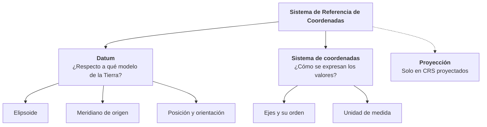
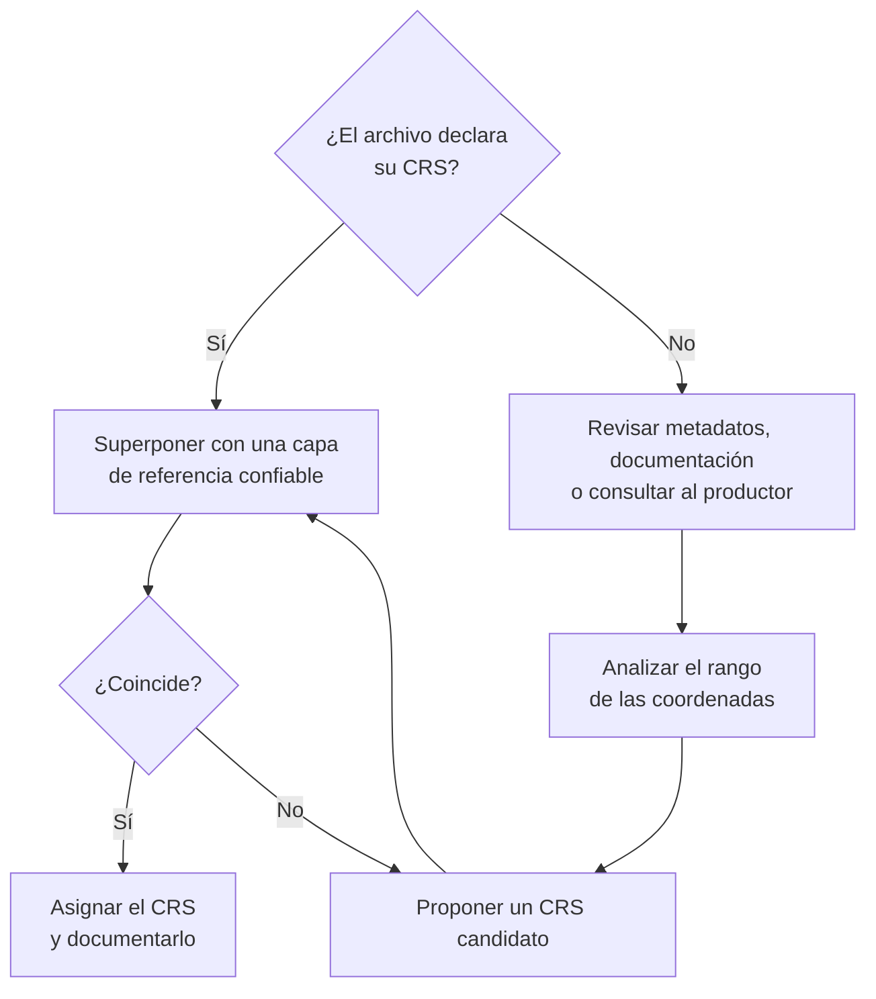

# 1.4 Sistemas de Referencia de Coordenadas

!!! abstract "Objetivos de aprendizaje"

    Al finalizar este tema, el estudiante será capaz de:

    - Explicar qué es un Sistema de Referencia de Coordenadas (CRS) y cuáles son sus componentes.
    - Diferenciar un CRS geográfico de uno proyectado, y las coordenadas angulares de las métricas.
    - Distinguir entre datum horizontal y datum vertical.
    - Diferenciar sistemas de referencia locales, regionales y globales.
    - Describir WGS 84 y SIRGAS, y su relación con el marco geodésico de Bolivia.
    - Interpretar un código EPSG e identificar el CRS de un conjunto de datos.

---

## Un número no es una ubicación

En el tema anterior vimos que un **datum** fija un elipsoide a la Tierra. Ahora completamos la idea: para que un par de números represente un lugar, hay que saber **exactamente cómo interpretarlos**.

Observa el mismo punto, la Plaza Murillo de La Paz, expresado en cinco sistemas distintos:

| Sistema de referencia | Código EPSG | X | Y |
|---|---|---|---|
| WGS 84 (geográfico) | 4326 | −68.1336 | −16.4958 |
| SIRGAS 2000 (geográfico) | 4674 | −68.1336 | −16.4958 |
| WGS 84 / UTM zona 19S | 32719 | 592 468 | 8 176 022 |
| WGS 84 / Pseudo-Mercator | 3857 | −7 584 598 | −1 862 211 |
| PSAD56 / UTM zona 19S | 24879 | ≈ 592 654 | ≈ 8 176 400 |

Cinco pares de números para **un solo lugar**. Y hay dos detalles que conviene notar:

- WGS 84 y SIRGAS 2000 dan **los mismos números** a esta precisión, aunque son sistemas distintos.
- Las coordenadas en PSAD56 / UTM **se parecen mucho** a las de WGS 84 / UTM, pero corresponden a puntos separados por **unos 400 metros** sobre el terreno.

!!! danger "La regla fundamental"

    **Una coordenada sin su sistema de referencia no es una ubicación: es solo un par de números.**

---

## ¿Qué es un Sistema de Referencia de Coordenadas?

!!! info "Definición"

    Un **Sistema de Referencia de Coordenadas** (*Coordinate Reference System*, **CRS**) es un sistema de coordenadas vinculado a la Tierra mediante un **datum**. Define de forma completa y sin ambigüedad cómo interpretar los valores de una coordenada para ubicar un punto sobre el territorio.

En español también se le llama **Sistema de Referencia Espacial** (SRS) o, de forma abreviada, **sistema de referencia**. En QGIS verás casi siempre la sigla **SRC** (Sistema de Referencia de Coordenadas) o **CRS**.

### Componentes de un CRS



| Componente | Qué define | Ejemplo en WGS 84 / UTM zona 19S |
|---|---|---|
| **Datum** | El modelo de la Tierra y su ubicación | WGS 84 |
| **Elipsoide** | Tamaño y forma de la figura de referencia | WGS 84 (*a* = 6 378 137 m) |
| **Meridiano de origen** | Dónde está la longitud 0° | Greenwich |
| **Sistema de coordenadas** | Número de ejes, su dirección y su orden | Este (E), Norte (N) |
| **Unidad de medida** | En qué se expresan los valores | Metros |
| **Proyección** | Cómo se pasa del elipsoide al plano | Transversa de Mercator, meridiano central −69° |

!!! note "Sistema de coordenadas no es lo mismo que sistema de referencia"

    - Un **sistema de coordenadas** es solo una regla matemática: ejes, orden y unidades. "Dos ejes perpendiculares en metros" es un sistema de coordenadas, pero no dice nada sobre la Tierra.
    - Un **sistema de referencia de coordenadas** vincula ese sistema a la Tierra mediante un datum.

    En el lenguaje cotidiano se usan como sinónimos, pero la diferencia es importante: sin datum, las coordenadas no tienen un lugar al cual referirse.

---

## CRS geográficos y CRS proyectados

Los CRS que usaremos casi siempre en un SIG pertenecen a una de estas dos familias.

<figure class="figura">
<svg viewBox="0 0 720 370" xmlns="http://www.w3.org/2000/svg" role="img" aria-label="Comparación entre un CRS geográfico sobre el globo y un CRS proyectado sobre un plano">
<circle cx="170" cy="170" r="120" fill="currentColor" fill-opacity="0.05" stroke="currentColor" stroke-width="2"/>
<ellipse cx="170" cy="170" rx="60" ry="120" fill="none" stroke="#3f6fd8" stroke-width="1.2"/>
<ellipse cx="170" cy="170" rx="103.9" ry="120" fill="none" stroke="#3f6fd8" stroke-width="1.2"/>
<line x1="170" y1="50" x2="170" y2="290" stroke="#3f6fd8" stroke-width="1.2"/>
<line x1="50" y1="170" x2="290" y2="170" stroke="#2e9e5b" stroke-width="1.2"/>
<line x1="66.1" y1="110" x2="273.9" y2="110" stroke="#2e9e5b" stroke-width="1.2"/>
<line x1="66.1" y1="230" x2="273.9" y2="230" stroke="#2e9e5b" stroke-width="1.2"/>
<line x1="110" y1="66.1" x2="230" y2="66.1" stroke="#2e9e5b" stroke-width="1.2"/>
<line x1="110" y1="273.9" x2="230" y2="273.9" stroke="#2e9e5b" stroke-width="1.2"/>
<circle cx="118" cy="230" r="6" fill="#e0823d"/>
<text x="118" y="258" text-anchor="middle" font-size="13" font-weight="bold" fill="#e0823d">(λ, φ)</text>
<line x1="318" y1="170" x2="392" y2="170" stroke="currentColor" stroke-width="2.5"/>
<polygon points="404,170 390,162 390,178" fill="currentColor"/>
<text x="361" y="158" text-anchor="middle" font-size="13" fill="currentColor">Proyección</text>
<rect x="430" y="50" width="260" height="240" fill="currentColor" fill-opacity="0.05" stroke="currentColor" stroke-width="2"/>
<line x1="482" y1="50" x2="482" y2="290" stroke="#3f6fd8" stroke-width="1.2"/>
<line x1="534" y1="50" x2="534" y2="290" stroke="#3f6fd8" stroke-width="1.2"/>
<line x1="586" y1="50" x2="586" y2="290" stroke="#3f6fd8" stroke-width="1.2"/>
<line x1="638" y1="50" x2="638" y2="290" stroke="#3f6fd8" stroke-width="1.2"/>
<line x1="430" y1="98" x2="690" y2="98" stroke="#2e9e5b" stroke-width="1.2"/>
<line x1="430" y1="146" x2="690" y2="146" stroke="#2e9e5b" stroke-width="1.2"/>
<line x1="430" y1="194" x2="690" y2="194" stroke="#2e9e5b" stroke-width="1.2"/>
<line x1="430" y1="242" x2="690" y2="242" stroke="#2e9e5b" stroke-width="1.2"/>
<circle cx="508" cy="218" r="6" fill="#e0823d"/>
<text x="508" y="208" text-anchor="middle" font-size="13" font-weight="bold" fill="#e0823d">(E, N)</text>
<text x="560" y="310" text-anchor="middle" font-size="12" fill="currentColor">Este (m) →</text>
<text x="418" y="170" text-anchor="middle" font-size="12" fill="currentColor" transform="rotate(-90 418 170)">Norte (m) →</text>
<text x="170" y="335" text-anchor="middle" font-size="15" font-weight="bold" fill="currentColor">CRS geográfico</text>
<text x="170" y="356" text-anchor="middle" font-size="13" fill="currentColor">Coordenadas angulares (grados)</text>
<text x="560" y="335" text-anchor="middle" font-size="15" font-weight="bold" fill="currentColor">CRS proyectado</text>
<text x="560" y="356" text-anchor="middle" font-size="13" fill="currentColor">Coordenadas métricas (metros)</text>
</svg>
<figcaption>Un CRS geográfico ubica puntos con ángulos sobre el elipsoide; un CRS proyectado los ubica con distancias sobre un plano.</figcaption>
</figure>

### CRS geográficos

Un **CRS geográfico** expresa la posición mediante **latitud y longitud** sobre el elipsoide del datum, tal como vimos en el tema 1.3.

- Sus coordenadas son **angulares**: se expresan en **grados**.
- La superficie de referencia es **curva** (el elipsoide).
- La grilla de meridianos y paralelos **no forma cuadrados iguales**: los meridianos convergen hacia los polos.
- Son ideales para **almacenar e intercambiar** datos, porque no introducen deformaciones.

**Ejemplos:** WGS 84 (EPSG:4326), SIRGAS 2000 (EPSG:4674), PSAD56 (EPSG:4248).

### CRS proyectados

Un **CRS proyectado** toma un CRS geográfico y le aplica una **proyección cartográfica** para representar la superficie curva en un plano.

- Sus coordenadas son **métricas**: se expresan normalmente en **metros**.
- La superficie de referencia es **plana**.
- La grilla forma **cuadrados iguales**, lo que permite medir con geometría plana.
- Son ideales para **medir, analizar y hacer cartografía** a escala local o regional.
- Siempre introducen **alguna deformación**, que estudiaremos en el tema 1.5.

**Ejemplos:** WGS 84 / UTM zona 19S (EPSG:32719), SIRGAS 2000 / UTM zona 20S (EPSG:31980).

!!! tip "Todo CRS proyectado se apoya en uno geográfico"

    Un CRS proyectado **no reemplaza** al geográfico: lo **contiene**. WGS 84 / UTM zona 19S es el CRS geográfico WGS 84 más una proyección UTM. Por eso decimos que tiene un **CRS geográfico base**.

### Coordenadas angulares y coordenadas métricas

| Característica | Coordenadas angulares | Coordenadas métricas |
|---|---|---|
| Tipo de CRS | Geográfico | Proyectado |
| Unidades | Grados | Metros (o pies) |
| Ejes | Longitud (λ), latitud (φ) | Este (E o X), Norte (N o Y) |
| Superficie | Elipsoide (curva) | Plano |
| Distancia de 1 unidad | Variable según la latitud | Constante |
| Medir distancias y áreas | Requiere cálculos sobre el elipsoide | Directo con geometría plana |
| Deformaciones | Ninguna por proyección | Siempre existen, en mayor o menor grado |
| Uso típico | Almacenar, intercambiar, GNSS, mapas globales | Medición, análisis, catastro, cartografía detallada |

!!! danger "No midas en grados"

    Si calculas el área de un predio en un CRS geográfico usando geometría plana, el resultado estará en **grados cuadrados**, una unidad sin sentido práctico. Como vimos en el tema 1.3, un grado de longitud mide unos 106 km en el centro de Bolivia y 111 km en el ecuador.

    Para medir, usa un **CRS proyectado adecuado** o herramientas que calculen sobre el **elipsoide**. Veremos cómo hacerlo en QGIS en el **Módulo 3**.

### Otros tipos de CRS

Además de los geográficos y los proyectados, existen otros tipos que conviene reconocer:

| Tipo | Coordenadas | Ejemplo | Uso |
|---|---|---|---|
| **Geocéntrico** | X, Y, Z en metros desde el centro de la Tierra | WGS 84 (EPSG:4978) | GNSS, transformaciones entre datums |
| **Geográfico 3D** | Latitud, longitud y altura elipsoidal | WGS 84 (EPSG:4979) | Posicionamiento GNSS con altura |
| **Vertical** | Solo altura | EGM96 height (EPSG:5773) | Alturas sobre el geoide |
| **Compuesto** | Horizontal + vertical | WGS 84 + EGM96 height (EPSG:9707) | Datos 3D con alturas ortométricas |
| **Local o de ingeniería** | Sistema arbitrario sin vínculo a la Tierra | Coordenadas de obra | Planos de construcción |

---

## Datum horizontal y datum vertical

En el tema 1.3 vimos que la posición horizontal y la altura tienen **superficies de referencia distintas**: el elipsoide y el geoide. Por eso existen dos tipos de datum.

<div class="grid cards" markdown>

-   :material-arrow-expand-horizontal:{ .lg .middle } **Datum horizontal**

    ---

    Define la referencia para la **posición horizontal** (latitud y longitud, o Este y Norte). Se basa en un **elipsoide** posicionado y orientado respecto a la Tierra.

    *Ejemplos: WGS 84, SIRGAS 2000, PSAD56.*

-   :material-arrow-expand-vertical:{ .lg .middle } **Datum vertical**

    ---

    Define la referencia para las **alturas**. Puede basarse en el nivel medio del mar registrado por mareógrafos, en un modelo geoidal o en el elipsoide.

    *Ejemplos: EGM96, EGM2008, datums nacionales de nivelación.*

</div>

### Tipos de datum vertical

| Tipo | Superficie de referencia | Cómo se materializa | Ejemplo |
|---|---|---|---|
| **Basado en mareógrafos** | Nivel medio del mar en uno o varios puertos | Red de nivelación referida a ese nivel | Datums verticales nacionales tradicionales |
| **Basado en modelo geoidal** | Geoide calculado con datos de gravedad | Modelo global o nacional | EGM96 height, EGM2008 height |
| **Elipsoidal** | Elipsoide del datum horizontal | Directamente con GNSS | Alturas de WGS 84 (EPSG:4979) |

!!! example "El componente vertical en Bolivia"

    El sistema de referencia oficial de Bolivia tiene un **componente vertical** propio, el **Marco Vertical de Referencia Nacional (MARVEREN)**, materializado mediante la **red de nivelación de primer orden** del Instituto Geográfico Militar.

    Las alturas de las cartas topográficas y de los hitos de nivelación del IGM están referidas a esa red, no al elipsoide.

!!! warning "Un dato 3D necesita dos referencias"

    Un modelo digital de elevación, una nube de puntos de dron o un levantamiento GNSS con alturas requieren conocer **ambos datums**. Es frecuente que un archivo declare correctamente su CRS horizontal pero no indique si sus alturas son **elipsoidales u ortométricas**, lo que puede generar diferencias de decenas de metros.

---

## Sistemas locales, regionales y globales

Los sistemas de referencia pueden clasificarse según **el área para la que fueron diseñados**.

| Alcance | Características | Ejemplos |
|---|---|---|
| **Local** | Válido para un área pequeña: una obra, una ciudad, un proyecto. Puede no estar vinculado a la Tierra. | Coordenadas de obra, planos topográficos con origen arbitrario |
| **Regional o nacional** | Ajustado a un continente o país. Puede ser un datum clásico o una densificación de un sistema global. | PSAD56, SIRGAS, MARGEN-SIRGAS, NAD83, ETRS89 |
| **Global** | Válido para todo el planeta, geocéntrico y compatible con GNSS. | WGS 84, ITRF |

### Coordenadas locales o de obra

Es muy común en proyectos de ingeniería y en planos elaborados en CAD trabajar con **coordenadas arbitrarias**, por ejemplo con origen en un punto al que se le asignan los valores `(1000, 1000)`.

- Son **cómodas** para el trabajo en campo y el diseño.
- Permiten medir **distancias y ángulos** dentro del proyecto.
- Pero **no están vinculadas a la Tierra**: no se pueden superponer con otras capas ni ubicar en un mapa sin un proceso de **georreferenciación**.

!!! warning "Un problema frecuente en gestión municipal"

    Muchos planos de urbanizaciones, loteamientos u obras públicas llegan en formato CAD con coordenadas locales. Cuando se intenta cargarlos en un SIG, **aparecen en cualquier lugar** o no aparecen. Antes de usarlos, hay que identificar puntos de control con coordenadas conocidas y georreferenciarlos.

### Sistema de referencia y marco de referencia

En geodesia se distinguen dos conceptos que en el uso cotidiano suelen mezclarse:

| Concepto | Qué es | Analogía |
|---|---|---|
| **Sistema de referencia** | La **definición teórica**: origen, orientación de los ejes, escala, elipsoide. | El reglamento de un campeonato |
| **Marco de referencia** | La **materialización física**: un conjunto de estaciones y vértices con coordenadas calculadas. | Las canchas construidas según ese reglamento |

Un mismo sistema puede tener **varias realizaciones** a lo largo del tiempo, a medida que mejoran las mediciones. Por ejemplo, SIRGAS tiene las realizaciones SIRGAS95 y SIRGAS2000, y WGS 84 ha tenido varias versiones.

??? info "Para saber más: la Tierra se mueve, y las coordenadas también"

    Las placas tectónicas se desplazan de forma continua. En Sudamérica, ese movimiento es del orden de **uno o dos centímetros por año**, y los terremotos pueden causar desplazamientos bruscos.

    Por eso los marcos de referencia modernos asocian las coordenadas a una **época de referencia**: la fecha a la que corresponden. SIRGAS2000, por ejemplo, tiene su época de referencia en el año 2000.4.

    Para la mayoría de las aplicaciones SIG, este movimiento es despreciable. Pero en **geodesia, catastro de precisión o monitoreo de deformaciones**, décadas de desplazamiento acumulan diferencias de varios decímetros que sí importan.

---

## WGS 84

!!! info "Definición"

    **WGS 84** (*World Geodetic System 1984*) es un sistema de referencia **global y geocéntrico** desarrollado por el Departamento de Defensa de los Estados Unidos. Es el sistema de referencia del **GPS**.

### Características

- **Geocéntrico:** su origen está en el centro de masas de la Tierra.
- **Elipsoide:** WGS 84 (*a* = 6 378 137 m; 1/*f* = 298,257223563).
- **Meridiano de origen:** Greenwich.
- **Cobertura:** todo el planeta.
- **Realizaciones:** se ha actualizado varias veces (G730, G873, G1150, G1674, G1762, G2139, G2296). Las versiones recientes coinciden con el Marco Internacional de Referencia Terrestre (ITRF) al nivel de pocos centímetros.

### ¿Por qué es tan usado?

- Es el sistema que entregan **directamente los receptores GPS** y los celulares.
- Es el sistema por defecto de **Google Earth, KML y GeoJSON**.
- Es el CRS más reconocido por cualquier software.
- Su código EPSG:4326 es, probablemente, **el más usado del mundo**.

### Códigos EPSG más usados de WGS 84

| Código | Nombre | Tipo | Uso |
|---|---|---|---|
| **4326** | WGS 84 | Geográfico 2D | Almacenamiento e intercambio |
| **4979** | WGS 84 | Geográfico 3D | GNSS con altura elipsoidal |
| **4978** | WGS 84 | Geocéntrico | Cálculos geodésicos |
| **32719** | WGS 84 / UTM zona 19S | Proyectado | Occidente de Bolivia |
| **32720** | WGS 84 / UTM zona 20S | Proyectado | Centro de Bolivia |
| **32721** | WGS 84 / UTM zona 21S | Proyectado | Extremo oriental de Bolivia |
| **3857** | WGS 84 / Pseudo-Mercator | Proyectado | Mapas web (OpenStreetMap, Google Maps) |

!!! warning "EPSG:3857 no sirve para medir"

    **Pseudo-Mercator** (o *Web Mercator*) es la proyección de los mapas base web. Es excelente para **visualizar**, pero **deforma enormemente las áreas y distancias** a medida que nos alejamos del ecuador. Nunca la uses para calcular superficies o longitudes.

??? info "Para saber más: EPSG:4326 es un conjunto de versiones"

    En la base de datos EPSG actual, el código 4326 no corresponde a una realización específica de WGS 84, sino a un **conjunto (*ensemble*)** que agrupa todas sus versiones, con una exactitud declarada de **2 metros**.

    En la práctica, esto significa que decir "WGS 84" a secas **no garantiza precisión mejor que unos 2 m**. Para trabajos geodésicos de alta precisión se debe usar una realización específica o un marco como ITRF o SIRGAS con su época. Para la gran mayoría de trabajos SIG, EPSG:4326 es perfectamente adecuado.

---

## SIRGAS

!!! info "Definición"

    **SIRGAS** (*Sistema de Referencia Geocéntrico para las Américas*) es el sistema de referencia **geocéntrico regional** para el continente americano. Es una **densificación del ITRF** en la región y es la base de los sistemas de referencia oficiales de la mayoría de los países de América Latina.

### Origen y evolución

- Surgió en **1993**, en una conferencia internacional celebrada en **Asunción, Paraguay**, con el objetivo de definir un sistema de referencia geocéntrico común para América del Sur. Posteriormente amplió su alcance a todo el continente.
- Su propósito fue **reemplazar los datums locales** (como PSAD56 y SAD69) por un sistema geocéntrico, homogéneo y compatible con GNSS.
- También es una **organización** que reúne a agencias geográficas nacionales, universidades y centros de investigación de las Américas.

### Realizaciones

| Realización | Época de referencia | Características |
|---|---|---|
| **SIRGAS95** | 1995.4 | Primera red continental, en América del Sur |
| **SIRGAS2000** | 2000.4 | Red ampliada a todo el continente |
| **SIRGAS-CON** | Actualizada continuamente | Red de estaciones GNSS de operación continua en todo el continente |

### SIRGAS y WGS 84

SIRGAS usa el elipsoide **GRS80**, prácticamente idéntico al de WGS 84 (tema 1.3), y ambos están alineados con el ITRF. Por eso:

- Para la **mayoría de los trabajos SIG**, las coordenadas en SIRGAS y en WGS 84 pueden considerarse **equivalentes**: sus diferencias son del orden de decímetros.
- Para **geodesia, catastro de precisión o redes de control**, esas diferencias sí importan y deben tratarse con los parámetros oficiales.

### El marco geodésico de Bolivia

Bolivia materializa SIRGAS a través del **Marco de Referencia Geodésico Nacional (MARGEN-SIRGAS)**, a cargo del **Instituto Geográfico Militar (IGM)**.

- Es la **referencia oficial** para los proyectos geodésicos, de posicionamiento y cartográficos del país.
- Está compuesto por una red de **vértices pasivos** y una red de **estaciones GNSS de operación continua (MARGEN-ROC)**.
- Fue la base para **migrar la información antigua** referida a **PSAD56** mediante parámetros oficiales de transformación.
- Forma parte del **Sistema de Referencia Geodésico del Estado Plurinacional de Bolivia**, que incluye además el componente vertical (MARVEREN) y la red gravimétrica.

### Códigos EPSG de SIRGAS

| Código | Nombre | Tipo |
|---|---|---|
| **4674** | SIRGAS 2000 | Geográfico 2D |
| **4989** | SIRGAS 2000 | Geográfico 3D |
| **4988** | SIRGAS 2000 | Geocéntrico |
| **31979** | SIRGAS 2000 / UTM zona 19S | Proyectado |
| **31980** | SIRGAS 2000 / UTM zona 20S | Proyectado |
| **31981** | SIRGAS 2000 / UTM zona 21S | Proyectado |
| **4170** | SIRGAS 1995 | Geográfico 2D |

!!! tip "¿Qué CRS usar en un proyecto en Bolivia?"

    1. **Revisa primero la normativa o el estándar de la institución** para la que trabajas o de la que recibes los datos.
    2. En la práctica, gran parte de la información geográfica en Bolivia se intercambia en **WGS 84**, en coordenadas geográficas (EPSG:4326) o en **UTM zonas 19S, 20S o 21S** (EPSG:32719, 32720 y 32721).
    3. Para trabajos de **precisión geodésica o catastral**, utiliza el marco oficial **MARGEN-SIRGAS** y los parámetros publicados por el IGM.
    4. Sea cual sea el CRS elegido, **documéntalo** en los metadatos del proyecto.

---

## Código EPSG

Escribir todos los parámetros de un CRS cada vez que se usa sería impráctico y propenso a errores. Por eso existen **registros** que asignan un **código único** a cada CRS.

!!! info "Definición"

    Un **código EPSG** es un identificador numérico de la **base de datos de parámetros geodésicos EPSG**, que describe sistemas de referencia, datums, elipsoides, proyecciones y transformaciones. Fue creada por el *European Petroleum Survey Group* y actualmente es mantenida por la **IOGP** (Asociación Internacional de Productores de Petróleo y Gas).

Con un solo número, el software sabe **todo** lo que necesita:

```text
EPSG:32719
│
├── Nombre:          WGS 84 / UTM zona 19S
├── Tipo:            CRS proyectado
├── CRS base:        WGS 84 (EPSG:4326)
├── Elipsoide:       WGS 84
├── Proyección:      Transversa de Mercator
│   ├── Meridiano central:  −69°
│   ├── Factor de escala:   0,9996
│   ├── Falso Este:         500 000 m
│   └── Falso Norte:        10 000 000 m
├── Ejes:            Este (E), Norte (N)
└── Unidad:          metro
```

No te preocupes todavía por el meridiano central, el factor de escala o los falsos Este y Norte: los veremos en detalle en el tema **1.6**.

### Los códigos EPSG no son solo CRS

La base de datos EPSG también identifica los componentes de un CRS:

| Tipo de objeto | Ejemplo | Código |
|---|---|---|
| CRS geográfico | WGS 84 | EPSG:4326 |
| CRS proyectado | WGS 84 / UTM zona 19S | EPSG:32719 |
| CRS vertical | EGM2008 height | EPSG:3855 |
| CRS compuesto | WGS 84 + EGM2008 height | EPSG:9518 |
| Elipsoide | WGS 84 | EPSG:7030 |
| Datum | World Geodetic System 1984 | EPSG:6326 |

Cuando en QGIS o en cualquier software elegimos un CRS, casi siempre lo haremos por su **código de CRS**. Los demás códigos se usan internamente.

### Otras formas de describir un CRS

El código EPSG es la forma más cómoda, pero no la única:

=== "WKT"

    **WKT** (*Well-Known Text*) es un formato de texto estandarizado (ISO 19162) que describe el CRS de forma completa. Es el formato que se guarda, por ejemplo, en los archivos `.prj` y en las bases de datos espaciales.

    ```text
    PROJCRS["WGS 84 / UTM zone 19S",
        BASEGEOGCRS["WGS 84",
            ...
            ELLIPSOID["WGS 84",6378137,298.257223563,
                LENGTHUNIT["metre",1]]],
        CONVERSION["UTM zone 19S",
            METHOD["Transverse Mercator"],
            PARAMETER["Longitude of natural origin",-69],
            PARAMETER["Scale factor at natural origin",0.9996],
            PARAMETER["False easting",500000],
            PARAMETER["False northing",10000000]],
        CS[Cartesian,2],
            AXIS["(E)",east],
            AXIS["(N)",north],
        ID["EPSG",32719]]
    ```

    *Versión simplificada: el WKT completo incluye más parámetros.*

=== "PROJ"

    **PROJ** es la biblioteca que usan QGIS, GDAL y PostGIS para transformar coordenadas. Históricamente, los CRS se describían con una cadena de parámetros:

    ```text
    +proj=utm +zone=19 +south +datum=WGS84 +units=m +no_defs
    ```

    Es compacta y fácil de leer, pero **puede perder información** importante. Hoy se recomienda usar códigos EPSG o WKT.

=== "Otras autoridades"

    Además de EPSG, existen otros registros:

    - **ESRI:** códigos propios del software ArcGIS para CRS que no están en EPSG.
    - **IGNF:** registro del Instituto Geográfico Nacional de Francia.
    - **Personalizados:** QGIS permite crear CRS propios, que aparecen con el prefijo `USER:`.

---

## Identificación de un CRS

En el trabajo real, es muy común recibir datos **sin saber en qué CRS están**. Identificarlo correctamente es una habilidad fundamental.

### Dónde se guarda el CRS según el formato

| Formato | ¿Guarda el CRS? | Dónde |
|---|---|---|
| **GeoPackage** (`.gpkg`) | Sí, obligatorio | En una tabla interna del archivo |
| **Shapefile** (`.shp`) | Opcional | En el archivo `.prj` que lo acompaña |
| **GeoTIFF** (`.tif`) | Sí, normalmente | En etiquetas internas del archivo |
| **GeoJSON** (`.geojson`) | Asumido | El estándar actual establece WGS 84 con orden longitud, latitud |
| **KML / KMZ** | Asumido | Siempre WGS 84 |
| **CSV / Excel** | No | Hay que conocerlo por otra vía |
| **DXF / DWG** (CAD) | Normalmente no | Hay que conocerlo por otra vía |
| **PostGIS** | Sí | Mediante un identificador de sistema de referencia (SRID) |

!!! danger "El caso más común: un Shapefile sin `.prj`"

    Un Shapefile está formado por varios archivos. Si alguien comparte solo `.shp`, `.shx` y `.dbf`, **el CRS se pierde**. El software no puede saber cómo interpretar las coordenadas. Por eso se recomienda preferir **GeoPackage**, que guarda todo en un solo archivo.

### Pistas a partir de los valores de las coordenadas

Si el CRS no está declarado, los **rangos de los valores** dan pistas muy útiles. Para datos ubicados en Bolivia:

| Si las coordenadas se parecen a... | Probablemente es | Rango aproximado en Bolivia |
|---|---|---|
| `-66.1570, -17.3935` | CRS **geográfico** (grados) | X: −69,7 a −57,4 · Y: −9,6 a −22,9 |
| `592468, 8176022` | CRS **UTM sur** (metros) | E: 6 dígitos (≈ 170 000 a 830 000) · N: 7 dígitos (≈ 7 460 000 a 8 930 000) |
| `-7584598, -1862211` | **Pseudo-Mercator** (EPSG:3857) | X: ≈ −7 750 000 a −6 400 000 · Y: ≈ −1 080 000 a −2 620 000 |
| `1000.00, 1523.45` | **Coordenadas locales** o de obra | Valores pequeños y arbitrarios |

!!! warning "Lo que los rangos no pueden decirte"

    Los valores permiten identificar el **tipo** de CRS, pero **no el datum**. Unas coordenadas en PSAD56 / UTM 19S y en WGS 84 / UTM 19S tienen el mismo aspecto y difieren en apenas unos cientos de metros. Tampoco permiten saber con certeza la **zona UTM**.

    Para resolverlo, hay que revisar **metadatos** o **superponer** los datos con una capa de referencia confiable.

### Procedimiento para identificar un CRS



!!! tip "Verificar incluso cuando el CRS está declarado"

    Que un archivo declare un CRS **no garantiza que sea el correcto**. Es frecuente encontrar capas con un CRS mal asignado por error. Superponer siempre con una referencia confiable (imágenes satelitales, límites oficiales, puntos de control) es una buena práctica.

### Síntomas de un CRS mal definido

| Síntoma | Causa probable |
|---|---|
| La capa aparece en medio del océano, cerca del ecuador y de Greenwich | Coordenadas en **grados** interpretadas como **metros** |
| La capa no aparece o el software indica coordenadas inválidas | Coordenadas en **metros** (por ejemplo, UTM) interpretadas como **grados** |
| La capa aparece desplazada unos cientos de metros | **Datum** incorrecto (por ejemplo, PSAD56 tratado como WGS 84) |
| La capa aparece desplazada cientos de kilómetros al este u oeste | **Zona UTM** incorrecta |
| La capa aparece en el hemisferio norte | Se usó una zona UTM **norte** en lugar de **sur** |
| La capa aparece en la Antártida o en otro continente | **Latitud y longitud invertidas** |

!!! note "Asignar un CRS no es lo mismo que transformarlo"

    Hay dos operaciones que suelen confundirse:

    - **Asignar (definir) un CRS:** le dice al software cómo **interpretar** las coordenadas existentes. Los números **no cambian**. Se usa cuando el CRS falta o está mal declarado.
    - **Reproyectar (transformar):** **calcula nuevas coordenadas** en otro CRS. Los números **sí cambian**, pero el lugar representado es el mismo.

    Confundirlas es uno de los errores más frecuentes en SIG. Practicaremos ambas operaciones en QGIS en el **Módulo 3**.

---

## Ideas clave

!!! success "Para recordar"

    - Un **CRS** define completamente cómo interpretar una coordenada: **datum**, **sistema de coordenadas**, **unidades** y, si corresponde, **proyección**.
    - Un **CRS geográfico** usa coordenadas **angulares** (grados); un **CRS proyectado** usa coordenadas **métricas** (metros). Todo CRS proyectado se basa en uno geográfico.
    - El **datum horizontal** es la referencia de la posición; el **datum vertical**, de las alturas.
    - Los sistemas pueden ser **locales**, **regionales** o **globales**. Las coordenadas de obra no están vinculadas a la Tierra.
    - **WGS 84** es el sistema global del GPS; **SIRGAS** es su equivalente regional para las Américas, y en Bolivia se materializa mediante **MARGEN-SIRGAS**.
    - Un **código EPSG** resume todos los parámetros de un CRS en un número.
    - Identificar un CRS requiere revisar metadatos, analizar rangos de coordenadas y **verificar superponiendo con una referencia confiable**.

---

## Autoevaluación

??? question "1. ¿Por qué el par de valores `592468, 8176022` no es suficiente para ubicar un punto?"

    Porque no indica **en qué sistema de referencia** están expresados. Por su rango parecen coordenadas UTM del hemisferio sur, pero no sabemos la **zona** ni el **datum**. Con PSAD56 o con WGS 84, por ejemplo, esos mismos números corresponden a lugares separados por cientos de metros.

??? question "2. ¿Cuál es la diferencia entre EPSG:4326 y EPSG:32719?"

    - **EPSG:4326** es el CRS **geográfico** WGS 84: coordenadas angulares (latitud y longitud) en grados.
    - **EPSG:32719** es el CRS **proyectado** WGS 84 / UTM zona 19S: coordenadas métricas (Este y Norte) en metros.

    Ambos comparten el mismo datum (WGS 84). El segundo se construye a partir del primero aplicando la proyección UTM.

??? question "3. Un compañero calcula el área de un terreno en EPSG:4326 y obtiene 0,000085. ¿Qué error cometió?"

    Calculó el área con geometría plana en un **CRS geográfico**, por lo que el resultado está en **grados cuadrados**, una unidad sin significado práctico. Debía usar un **CRS proyectado** adecuado (por ejemplo, UTM de la zona correspondiente) o un cálculo sobre el elipsoide.

??? question "4. ¿Por qué SIRGAS y WGS 84 pueden considerarse equivalentes en un SIG, pero no en un trabajo geodésico?"

    Porque ambos son geocéntricos, usan elipsoides prácticamente idénticos y están alineados con el ITRF, de modo que sus diferencias son del orden de **decímetros**. Esa diferencia es despreciable para la mayoría de los análisis SIG, pero **no para geodesia o catastro de precisión**, donde se trabaja con precisiones centimétricas.

??? question "5. Recibes una capa de predios en formato DXF con coordenadas como `1250.35, 980.12`. ¿Qué puedes concluir?"

    Que probablemente está en **coordenadas locales o de obra**, sin vínculo con un sistema de referencia terrestre. No basta con asignarle un CRS: es necesario **georreferenciarla** usando puntos de control con coordenadas conocidas.

??? question "6. Una capa que debería estar en Cochabamba aparece unos 400 m desplazada respecto a una imagen satelital. ¿Cuál es la causa más probable?"

    Un problema de **datum**: por ejemplo, datos en **PSAD56** interpretados como si estuvieran en **WGS 84**. Los desplazamientos de cientos de metros son característicos de ese error. Un error de zona UTM produciría desplazamientos de cientos de **kilómetros**.

??? question "7. ¿Qué diferencia hay entre asignar un CRS y reproyectar una capa?"

    **Asignar** un CRS solo cambia la forma en que el software **interpreta** las coordenadas; los valores no cambian. **Reproyectar** calcula **nuevas coordenadas** en otro CRS; los valores cambian, pero el lugar representado es el mismo.

---

## Actividad propuesta

!!! example "Actividad 1.4 — Inventario de sistemas de referencia del proyecto integrador (sin software)"

    Retoma los datos que identificaste en las actividades anteriores y elabora una tabla con las siguientes columnas:

    | Dato | Fuente | Formato | CRS declarado | Código EPSG | ¿Geográfico o proyectado? | Datum vertical (si tiene alturas) |
    |---|---|---|---|---|---|---|

    Luego responde:

    1. ¿Todos tus datos están en el **mismo CRS**? Si no, ¿cuáles habría que transformar?
    2. ¿Algún dato **no declara su CRS**? Propón un CRS candidato a partir del rango de sus coordenadas.
    3. ¿Hay datos antiguos que podrían estar en **PSAD56**?
    4. ¿Hay planos con **coordenadas locales**?
    5. Propón el **CRS de trabajo** para tu proyecto y justifica tu elección.

---

## Referencias

- Butler, H., Daly, M., Doyle, A., Gillies, S., Hagen, S., & Schaub, T. (2016). *The GeoJSON Format* (RFC 7946). Internet Engineering Task Force.
- Echalar, A., et al. (2014). *Estado actual del sistema geodésico nacional del Estado Plurinacional de Bolivia*. Boletín SIRGAS, 19.
- Instituto Geográfico Militar de Bolivia. *Marco de Referencia Geodésico Nacional (MARGEN-SIRGAS)*. <http://margen-igmbolivia.geo.gob.bo/>
- International Association of Oil & Gas Producers (IOGP). *EPSG Geodetic Parameter Dataset*. <https://epsg.org>
- ISO 19111:2019. *Geographic information — Referencing by coordinates*. International Organization for Standardization.
- National Geospatial-Intelligence Agency (2014). *World Geodetic System 1984: Its Definition and Relationships with Local Geodetic Systems* (NGA.STND.0036_1.0.0_WGS84).
- Olaya, V. (2020). *Sistemas de Información Geográfica*. Libro libre disponible en línea.
- SIRGAS. *Sistema de Referencia Geocéntrico para las Américas*. <https://sirgas.org>
