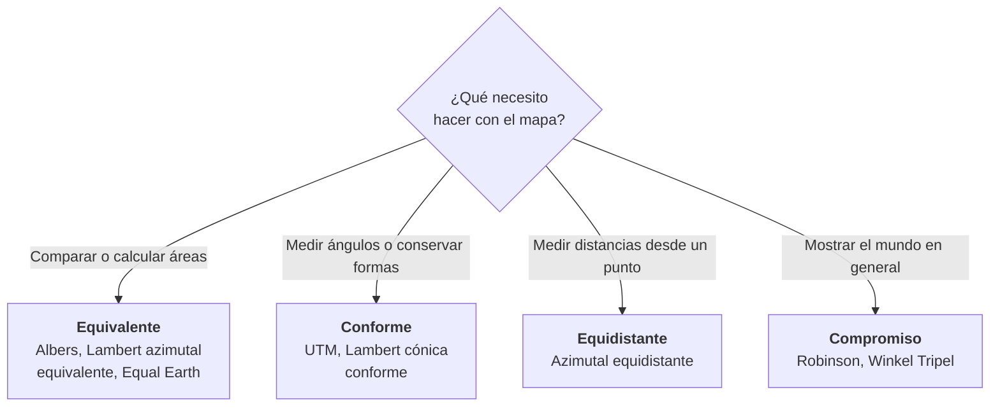

# 1.5 Proyecciones cartográficas

!!! abstract "Objetivos de aprendizaje"

    Al finalizar este tema, el estudiante será capaz de:

    - Explicar por qué es necesario proyectar y por qué toda proyección introduce deformaciones.
    - Clasificar las proyecciones según su superficie desarrollable, su tipo de contacto y su aspecto.
    - Diferenciar proyecciones conformes, equivalentes, equidistantes y de compromiso.
    - Reconocer las deformaciones de área, distancia, forma y dirección, e interpretar el factor de escala.
    - Elegir una proyección adecuada según el propósito y la extensión del área de trabajo.

---

## ¿Por qué necesitamos proyectar?

En el tema 1.4 vimos que los CRS geográficos ubican puntos con **ángulos sobre un elipsoide**. Es la forma más fiel de describir posiciones, pero tiene dos problemas prácticos:

- **Los mapas son planos.** El papel, las pantallas y los planos de ingeniería no son curvos.
- **Medir sobre el elipsoide es complejo.** Calcular distancias, áreas y ángulos con geometría plana es mucho más simple y es lo que usan la mayoría de las herramientas de análisis.

!!! info "Definición"

    Una **proyección cartográfica** es un procedimiento matemático que transforma las coordenadas geográficas (**latitud y longitud**) de la superficie curva del elipsoide en coordenadas planas (**X e Y**, o **Este y Norte**).

Por ejemplo, la proyección más simple posible, llamada **equirectangular**, se limita a usar los ángulos como si fueran distancias:

```text
x = R · λ
y = R · φ
```

Otras, como la de Mercator, usan fórmulas más elaboradas para conservar ciertas propiedades:

```text
x = R · λ
y = R · ln( tan(45° + φ/2) )
```

No necesitamos memorizar fórmulas. Lo importante es entender que **cada fórmula decide qué se conserva y qué se deforma**.

### La imposibilidad de aplanar una esfera

!!! example "El experimento de la cáscara de naranja"

    Pela una naranja intentando conservar la cáscara en una sola pieza y trata de aplanarla sobre la mesa. Solo lo lograrás de dos maneras: **rompiéndola** o **estirándola**.

    Con la superficie de la Tierra ocurre exactamente lo mismo.

Este problema no es una limitación técnica que algún día se resolverá: es una **imposibilidad matemática**. En 1827, Carl Friedrich Gauss demostró que una superficie curva como la esfera **no puede representarse en un plano sin deformar** sus distancias.

!!! danger "La idea central del tema"

    **No existe una proyección cartográfica perfecta; existe una proyección adecuada para un determinado propósito.**

    Toda proyección deforma algo. Elegir una proyección es decidir **qué deformación es aceptable** para lo que necesitamos hacer.

---

## Superficies desarrollables

Para entender las proyecciones de forma intuitiva, se usa la idea de una **superficie desarrollable**: una figura que puede envolver al globo y luego **desenrollarse** sobre un plano sin estirarse ni romperse.

Existen tres superficies desarrollables básicas:

<figure class="figura">
<svg viewBox="0 0 720 320" xmlns="http://www.w3.org/2000/svg" role="img" aria-label="Superficies desarrollables: cilindro tangente en el ecuador, cono tangente en un paralelo y plano tangente en el polo">
<circle cx="120" cy="150" r="70" fill="currentColor" fill-opacity="0.06" stroke="currentColor" stroke-width="2"/>
<line x1="50" y1="50" x2="50" y2="250" stroke="#3f6fd8" stroke-width="2"/>
<line x1="190" y1="50" x2="190" y2="250" stroke="#3f6fd8" stroke-width="2"/>
<ellipse cx="120" cy="50" rx="70" ry="14" fill="#3f6fd8" fill-opacity="0.08" stroke="#3f6fd8" stroke-width="2"/>
<ellipse cx="120" cy="250" rx="70" ry="14" fill="none" stroke="#3f6fd8" stroke-width="2"/>
<ellipse cx="120" cy="150" rx="70" ry="14" fill="none" stroke="#e0823d" stroke-width="3"/>
<text x="120" y="288" text-anchor="middle" font-size="15" font-weight="bold" fill="currentColor">Cilíndrica</text>
<text x="120" y="307" text-anchor="middle" font-size="12" fill="currentColor">Tangente en el ecuador</text>
<circle cx="360" cy="170" r="70" fill="currentColor" fill-opacity="0.06" stroke="currentColor" stroke-width="2"/>
<line x1="360" y1="30" x2="238" y2="241" stroke="#3f6fd8" stroke-width="2"/>
<line x1="360" y1="30" x2="482" y2="241" stroke="#3f6fd8" stroke-width="2"/>
<ellipse cx="360" cy="241" rx="122" ry="18" fill="none" stroke="#3f6fd8" stroke-width="2"/>
<ellipse cx="360" cy="135" rx="60.6" ry="10" fill="none" stroke="#e0823d" stroke-width="3"/>
<text x="360" y="288" text-anchor="middle" font-size="15" font-weight="bold" fill="currentColor">Cónica</text>
<text x="360" y="307" text-anchor="middle" font-size="12" fill="currentColor">Tangente en un paralelo</text>
<circle cx="600" cy="170" r="70" fill="currentColor" fill-opacity="0.06" stroke="currentColor" stroke-width="2"/>
<polygon points="505,112 665,112 695,88 535,88" fill="#3f6fd8" fill-opacity="0.12" stroke="#3f6fd8" stroke-width="2"/>
<circle cx="600" cy="100" r="5" fill="#e0823d"/>
<text x="600" y="288" text-anchor="middle" font-size="15" font-weight="bold" fill="currentColor">Azimutal (plana)</text>
<text x="600" y="307" text-anchor="middle" font-size="12" fill="currentColor">Tangente en el polo</text>
</svg>
<figcaption>Las tres superficies desarrollables. En naranja, la línea o el punto de contacto con el globo.</figcaption>
</figure>

=== "Cilíndrica"

    El globo se envuelve con un **cilindro**, que luego se corta y se desenrolla.

    - En el aspecto normal, los **meridianos** son rectas verticales paralelas y los **paralelos**, rectas horizontales.
    - La deformación es mínima cerca de la línea de contacto (normalmente el ecuador) y **aumenta hacia los polos**.
    - Adecuada para zonas **cercanas al ecuador** o para franjas alargadas a lo largo de la línea de contacto.

    **Ejemplos:** Mercator, Transversa de Mercator (base de UTM), equirectangular.

=== "Cónica"

    El globo se cubre con un **cono**, que toca la Tierra a lo largo de un paralelo.

    - Los **meridianos** son rectas que convergen hacia un punto y los **paralelos**, arcos de circunferencia.
    - La deformación es mínima cerca del paralelo de contacto.
    - Adecuada para zonas de **latitudes medias** extendidas de **este a oeste**.

    **Ejemplos:** Lambert cónica conforme, Albers equivalente.

=== "Azimutal"

    Se proyecta sobre un **plano** que toca el globo en un solo punto.

    - Las **direcciones desde el punto central** se conservan.
    - La deformación aumenta en círculos concéntricos alrededor del punto de contacto.
    - Adecuada para **regiones polares** o para áreas aproximadamente **circulares**.

    **Ejemplos:** estereográfica polar, Lambert azimutal equivalente, azimutal equidistante.

!!! note "Una analogía, no un procedimiento"

    En la práctica, las proyecciones se calculan con fórmulas matemáticas y no proyectando literalmente sobre un cilindro o un cono. Muchas proyecciones modernas, como Robinson o Mollweide, **ni siquiera corresponden** a una superficie desarrollable. Aun así, la analogía es muy útil para entender dónde está la zona de menor deformación.

### Tipo de contacto: tangente o secante

La superficie desarrollable puede **tocar** el globo o **atravesarlo**.

<figure class="figura">
<svg viewBox="0 0 720 345" xmlns="http://www.w3.org/2000/svg" role="img" aria-label="Cilindro tangente con una línea estándar y cilindro secante con dos líneas estándar">
<circle cx="180" cy="160" r="90" fill="currentColor" fill-opacity="0.06" stroke="currentColor" stroke-width="2"/>
<rect x="90" y="40" width="180" height="240" fill="#3f6fd8" fill-opacity="0.06" stroke="#3f6fd8" stroke-width="2"/>
<line x1="90" y1="160" x2="270" y2="160" stroke="#e0823d" stroke-width="2" stroke-dasharray="6 4"/>
<circle cx="90" cy="160" r="5" fill="#e0823d"/>
<circle cx="270" cy="160" r="5" fill="#e0823d"/>
<text x="280" y="165" font-size="13" font-weight="bold" fill="#e0823d">k = 1</text>
<text x="180" y="100" text-anchor="middle" font-size="13" fill="currentColor">k &gt; 1</text>
<text x="180" y="230" text-anchor="middle" font-size="13" fill="currentColor">k &gt; 1</text>
<text x="180" y="312" text-anchor="middle" font-size="15" font-weight="bold" fill="currentColor">Tangente</text>
<text x="180" y="331" text-anchor="middle" font-size="12" fill="currentColor">Una línea sin deformación</text>
<circle cx="540" cy="160" r="90" fill="currentColor" fill-opacity="0.06" stroke="currentColor" stroke-width="2"/>
<rect x="468" y="40" width="144" height="240" fill="#3f6fd8" fill-opacity="0.06" stroke="#3f6fd8" stroke-width="2"/>
<line x1="468" y1="106" x2="612" y2="106" stroke="#e0823d" stroke-width="2" stroke-dasharray="6 4"/>
<line x1="468" y1="214" x2="612" y2="214" stroke="#e0823d" stroke-width="2" stroke-dasharray="6 4"/>
<circle cx="468" cy="106" r="5" fill="#e0823d"/>
<circle cx="612" cy="106" r="5" fill="#e0823d"/>
<circle cx="468" cy="214" r="5" fill="#e0823d"/>
<circle cx="612" cy="214" r="5" fill="#e0823d"/>
<text x="624" y="111" font-size="13" font-weight="bold" fill="#e0823d">k = 1</text>
<text x="624" y="219" font-size="13" font-weight="bold" fill="#e0823d">k = 1</text>
<text x="540" y="165" text-anchor="middle" font-size="13" fill="currentColor">k &lt; 1</text>
<text x="540" y="88" text-anchor="middle" font-size="13" fill="currentColor">k &gt; 1</text>
<text x="540" y="246" text-anchor="middle" font-size="13" fill="currentColor">k &gt; 1</text>
<text x="540" y="312" text-anchor="middle" font-size="15" font-weight="bold" fill="currentColor">Secante</text>
<text x="540" y="331" text-anchor="middle" font-size="12" fill="currentColor">Dos líneas sin deformación</text>
</svg>
<figcaption>Factor de escala (k) en un cilindro tangente y en uno secante. Sobre las líneas estándar, k = 1.</figcaption>
</figure>

- **Tangente:** toca el globo en **una línea** (o un punto). Sobre esa línea no hay deformación, y la deformación crece a medida que nos alejamos.
- **Secante:** atraviesa el globo y lo corta en **dos líneas**. Sobre ambas no hay deformación; entre ellas la escala se reduce ligeramente y fuera de ellas aumenta. El resultado es una **deformación mejor repartida** en toda la zona.

Las líneas donde la escala es exacta se llaman **líneas estándar** (paralelos estándar o meridianos estándar, según el caso).

### El factor de escala

Para medir la deformación se usa el **factor de escala (k)**:

```text
k = distancia en la proyección / distancia real sobre el elipsoide
```

| Valor de k | Significado |
|---|---|
| **k = 1** | Sin deformación: la distancia es exacta |
| **k > 1** | La proyección **amplía** las distancias |
| **k < 1** | La proyección **reduce** las distancias |

!!! example "Cuánto deforma Mercator"

    En la proyección de Mercator, el factor de escala crece con la latitud, y el área se deforma con el cuadrado de ese factor:

    | Latitud | Factor de escala (k) | Factor de área (k²) |
    |---|---|---|
    | 0° (ecuador) | 1,000 | 1,00 |
    | 17° (centro de Bolivia) | 1,046 | 1,09 |
    | 30° | 1,155 | 1,33 |
    | 45° | 1,414 | 2,00 |
    | 60° | 2,000 | 4,00 |
    | 75° | 3,864 | 14,93 |

    A 60° de latitud, las superficies aparecen **cuatro veces más grandes** de lo que son. A 75°, casi **quince veces**.

### Aspecto

El **aspecto** es la orientación de la superficie desarrollable respecto al eje de rotación de la Tierra.

| Aspecto | Orientación | Línea o punto de contacto | Ejemplo |
|---|---|---|---|
| **Normal** | Alineada con el eje de rotación | Ecuador o un paralelo | Mercator |
| **Transversa** | Perpendicular al eje de rotación | Un meridiano | Transversa de Mercator (UTM) |
| **Oblicua** | Con cualquier otra inclinación | Una línea inclinada | Mercator oblicua (usada en Suiza) |

!!! tip "UTM en una frase"

    Con lo visto hasta aquí ya podemos describir la proyección UTM: es una proyección **cilíndrica**, **transversa** y **secante**. Es decir, un cilindro "acostado" que corta al globo a lo largo de dos líneas paralelas a un meridiano central. La estudiaremos en detalle en el tema **1.6**.

---

## Deformaciones

Toda proyección deforma, en mayor o menor medida, cuatro propiedades geométricas.

<div class="grid cards" markdown>

-   :material-texture-box:{ .lg .middle } **Área**

    ---

    Las superficies aparecen **más grandes o más pequeñas** de lo que son.

    *En Mercator, Groenlandia parece tan grande como África, aunque África es unas 14 veces mayor.*

-   :material-ruler:{ .lg .middle } **Distancia**

    ---

    La **escala no es constante** en todo el mapa: la misma distancia en el mapa representa distancias reales distintas según el lugar.

-   :material-shape-outline:{ .lg .middle } **Forma**

    ---

    Los contornos se **estiran o comprimen**, y las figuras se distorsionan, sobre todo en áreas grandes.

-   :material-compass-outline:{ .lg .middle } **Dirección**

    ---

    Los **ángulos y rumbos** entre puntos no coinciden con los reales.

</div>

!!! example "Groenlandia, África y Bolivia"

    - **África** tiene unos 30 millones de km²; **Groenlandia**, unos 2,2 millones. África es **unas 14 veces** más grande.
    - Groenlandia tiene aproximadamente el **doble de superficie que Bolivia**.
    - Sin embargo, en un mapa Mercator, Groenlandia parece comparable a África y **mucho más grande** que Bolivia.

    Herramientas web como *The True Size Of* permiten arrastrar países sobre un mapa Mercator y ver cómo cambia su tamaño aparente con la latitud. Es una excelente actividad para la clase.

### La indicatriz de Tissot

En 1859, el matemático francés Nicolas Auguste Tissot propuso una forma elegante de **visualizar las deformaciones**: dibujar sobre el globo pequeños **círculos del mismo tamaño** y observar en qué se convierten al proyectarlos.

- Si los círculos **cambian de tamaño**, la proyección deforma **áreas**.
- Si los círculos se convierten en **elipses**, la proyección deforma **formas y ángulos**.

<figure class="figura">
<svg viewBox="0 0 720 255" xmlns="http://www.w3.org/2000/svg" role="img" aria-label="Indicatrices de Tissot en las proyecciones Mercator, Lambert cilíndrica equivalente y equirectangular">
<rect x="15" y="52.2" width="210" height="135.5" fill="currentColor" fill-opacity="0.05" stroke="currentColor" stroke-width="1.5"/>
<line x1="50.0" y1="52.2" x2="50.0" y2="187.8" stroke="#3f6fd8" stroke-width="0.8" stroke-opacity="0.7"/>
<line x1="85.0" y1="52.2" x2="85.0" y2="187.8" stroke="#3f6fd8" stroke-width="0.8" stroke-opacity="0.7"/>
<line x1="120.0" y1="52.2" x2="120.0" y2="187.8" stroke="#3f6fd8" stroke-width="0.8" stroke-opacity="0.7"/>
<line x1="155.0" y1="52.2" x2="155.0" y2="187.8" stroke="#3f6fd8" stroke-width="0.8" stroke-opacity="0.7"/>
<line x1="190.0" y1="52.2" x2="190.0" y2="187.8" stroke="#3f6fd8" stroke-width="0.8" stroke-opacity="0.7"/>
<line x1="15" y1="164.0" x2="225" y2="164.0" stroke="#2e9e5b" stroke-width="0.8" stroke-opacity="0.7"/>
<line x1="15" y1="138.4" x2="225" y2="138.4" stroke="#2e9e5b" stroke-width="0.8" stroke-opacity="0.7"/>
<line x1="15" y1="120.0" x2="225" y2="120.0" stroke="#2e9e5b" stroke-width="0.8" stroke-opacity="0.7"/>
<line x1="15" y1="101.6" x2="225" y2="101.6" stroke="#2e9e5b" stroke-width="0.8" stroke-opacity="0.7"/>
<line x1="15" y1="76.0" x2="225" y2="76.0" stroke="#2e9e5b" stroke-width="0.8" stroke-opacity="0.7"/>
<ellipse cx="50.0" cy="164.0" rx="14.0" ry="14.0" fill="#e0823d" fill-opacity="0.45" stroke="#e0823d" stroke-width="1"/>
<ellipse cx="85.0" cy="164.0" rx="14.0" ry="14.0" fill="#e0823d" fill-opacity="0.45" stroke="#e0823d" stroke-width="1"/>
<ellipse cx="120.0" cy="164.0" rx="14.0" ry="14.0" fill="#e0823d" fill-opacity="0.45" stroke="#e0823d" stroke-width="1"/>
<ellipse cx="155.0" cy="164.0" rx="14.0" ry="14.0" fill="#e0823d" fill-opacity="0.45" stroke="#e0823d" stroke-width="1"/>
<ellipse cx="190.0" cy="164.0" rx="14.0" ry="14.0" fill="#e0823d" fill-opacity="0.45" stroke="#e0823d" stroke-width="1"/>
<ellipse cx="50.0" cy="138.4" rx="8.1" ry="8.1" fill="#e0823d" fill-opacity="0.45" stroke="#e0823d" stroke-width="1"/>
<ellipse cx="85.0" cy="138.4" rx="8.1" ry="8.1" fill="#e0823d" fill-opacity="0.45" stroke="#e0823d" stroke-width="1"/>
<ellipse cx="120.0" cy="138.4" rx="8.1" ry="8.1" fill="#e0823d" fill-opacity="0.45" stroke="#e0823d" stroke-width="1"/>
<ellipse cx="155.0" cy="138.4" rx="8.1" ry="8.1" fill="#e0823d" fill-opacity="0.45" stroke="#e0823d" stroke-width="1"/>
<ellipse cx="190.0" cy="138.4" rx="8.1" ry="8.1" fill="#e0823d" fill-opacity="0.45" stroke="#e0823d" stroke-width="1"/>
<ellipse cx="50.0" cy="120.0" rx="7.0" ry="7.0" fill="#e0823d" fill-opacity="0.45" stroke="#e0823d" stroke-width="1"/>
<ellipse cx="85.0" cy="120.0" rx="7.0" ry="7.0" fill="#e0823d" fill-opacity="0.45" stroke="#e0823d" stroke-width="1"/>
<ellipse cx="120.0" cy="120.0" rx="7.0" ry="7.0" fill="#e0823d" fill-opacity="0.45" stroke="#e0823d" stroke-width="1"/>
<ellipse cx="155.0" cy="120.0" rx="7.0" ry="7.0" fill="#e0823d" fill-opacity="0.45" stroke="#e0823d" stroke-width="1"/>
<ellipse cx="190.0" cy="120.0" rx="7.0" ry="7.0" fill="#e0823d" fill-opacity="0.45" stroke="#e0823d" stroke-width="1"/>
<ellipse cx="50.0" cy="101.6" rx="8.1" ry="8.1" fill="#e0823d" fill-opacity="0.45" stroke="#e0823d" stroke-width="1"/>
<ellipse cx="85.0" cy="101.6" rx="8.1" ry="8.1" fill="#e0823d" fill-opacity="0.45" stroke="#e0823d" stroke-width="1"/>
<ellipse cx="120.0" cy="101.6" rx="8.1" ry="8.1" fill="#e0823d" fill-opacity="0.45" stroke="#e0823d" stroke-width="1"/>
<ellipse cx="155.0" cy="101.6" rx="8.1" ry="8.1" fill="#e0823d" fill-opacity="0.45" stroke="#e0823d" stroke-width="1"/>
<ellipse cx="190.0" cy="101.6" rx="8.1" ry="8.1" fill="#e0823d" fill-opacity="0.45" stroke="#e0823d" stroke-width="1"/>
<ellipse cx="50.0" cy="76.0" rx="14.0" ry="14.0" fill="#e0823d" fill-opacity="0.45" stroke="#e0823d" stroke-width="1"/>
<ellipse cx="85.0" cy="76.0" rx="14.0" ry="14.0" fill="#e0823d" fill-opacity="0.45" stroke="#e0823d" stroke-width="1"/>
<ellipse cx="120.0" cy="76.0" rx="14.0" ry="14.0" fill="#e0823d" fill-opacity="0.45" stroke="#e0823d" stroke-width="1"/>
<ellipse cx="155.0" cy="76.0" rx="14.0" ry="14.0" fill="#e0823d" fill-opacity="0.45" stroke="#e0823d" stroke-width="1"/>
<ellipse cx="190.0" cy="76.0" rx="14.0" ry="14.0" fill="#e0823d" fill-opacity="0.45" stroke="#e0823d" stroke-width="1"/>
<text x="120.0" y="222" text-anchor="middle" font-size="14" font-weight="bold" fill="currentColor">Mercator</text>
<text x="120.0" y="241" text-anchor="middle" font-size="12" fill="currentColor">Conforme: conserva formas</text>
<rect x="255" y="86.6" width="210" height="66.8" fill="currentColor" fill-opacity="0.05" stroke="currentColor" stroke-width="1.5"/>
<line x1="290.0" y1="86.6" x2="290.0" y2="153.4" stroke="#3f6fd8" stroke-width="0.8" stroke-opacity="0.7"/>
<line x1="325.0" y1="86.6" x2="325.0" y2="153.4" stroke="#3f6fd8" stroke-width="0.8" stroke-opacity="0.7"/>
<line x1="360.0" y1="86.6" x2="360.0" y2="153.4" stroke="#3f6fd8" stroke-width="0.8" stroke-opacity="0.7"/>
<line x1="395.0" y1="86.6" x2="395.0" y2="153.4" stroke="#3f6fd8" stroke-width="0.8" stroke-opacity="0.7"/>
<line x1="430.0" y1="86.6" x2="430.0" y2="153.4" stroke="#3f6fd8" stroke-width="0.8" stroke-opacity="0.7"/>
<line x1="255" y1="148.9" x2="465" y2="148.9" stroke="#2e9e5b" stroke-width="0.8" stroke-opacity="0.7"/>
<line x1="255" y1="136.7" x2="465" y2="136.7" stroke="#2e9e5b" stroke-width="0.8" stroke-opacity="0.7"/>
<line x1="255" y1="120.0" x2="465" y2="120.0" stroke="#2e9e5b" stroke-width="0.8" stroke-opacity="0.7"/>
<line x1="255" y1="103.3" x2="465" y2="103.3" stroke="#2e9e5b" stroke-width="0.8" stroke-opacity="0.7"/>
<line x1="255" y1="91.1" x2="465" y2="91.1" stroke="#2e9e5b" stroke-width="0.8" stroke-opacity="0.7"/>
<ellipse cx="290.0" cy="148.9" rx="14.0" ry="3.5" fill="#e0823d" fill-opacity="0.45" stroke="#e0823d" stroke-width="1"/>
<ellipse cx="325.0" cy="148.9" rx="14.0" ry="3.5" fill="#e0823d" fill-opacity="0.45" stroke="#e0823d" stroke-width="1"/>
<ellipse cx="360.0" cy="148.9" rx="14.0" ry="3.5" fill="#e0823d" fill-opacity="0.45" stroke="#e0823d" stroke-width="1"/>
<ellipse cx="395.0" cy="148.9" rx="14.0" ry="3.5" fill="#e0823d" fill-opacity="0.45" stroke="#e0823d" stroke-width="1"/>
<ellipse cx="430.0" cy="148.9" rx="14.0" ry="3.5" fill="#e0823d" fill-opacity="0.45" stroke="#e0823d" stroke-width="1"/>
<ellipse cx="290.0" cy="136.7" rx="8.1" ry="6.1" fill="#e0823d" fill-opacity="0.45" stroke="#e0823d" stroke-width="1"/>
<ellipse cx="325.0" cy="136.7" rx="8.1" ry="6.1" fill="#e0823d" fill-opacity="0.45" stroke="#e0823d" stroke-width="1"/>
<ellipse cx="360.0" cy="136.7" rx="8.1" ry="6.1" fill="#e0823d" fill-opacity="0.45" stroke="#e0823d" stroke-width="1"/>
<ellipse cx="395.0" cy="136.7" rx="8.1" ry="6.1" fill="#e0823d" fill-opacity="0.45" stroke="#e0823d" stroke-width="1"/>
<ellipse cx="430.0" cy="136.7" rx="8.1" ry="6.1" fill="#e0823d" fill-opacity="0.45" stroke="#e0823d" stroke-width="1"/>
<ellipse cx="290.0" cy="120.0" rx="7.0" ry="7.0" fill="#e0823d" fill-opacity="0.45" stroke="#e0823d" stroke-width="1"/>
<ellipse cx="325.0" cy="120.0" rx="7.0" ry="7.0" fill="#e0823d" fill-opacity="0.45" stroke="#e0823d" stroke-width="1"/>
<ellipse cx="360.0" cy="120.0" rx="7.0" ry="7.0" fill="#e0823d" fill-opacity="0.45" stroke="#e0823d" stroke-width="1"/>
<ellipse cx="395.0" cy="120.0" rx="7.0" ry="7.0" fill="#e0823d" fill-opacity="0.45" stroke="#e0823d" stroke-width="1"/>
<ellipse cx="430.0" cy="120.0" rx="7.0" ry="7.0" fill="#e0823d" fill-opacity="0.45" stroke="#e0823d" stroke-width="1"/>
<ellipse cx="290.0" cy="103.3" rx="8.1" ry="6.1" fill="#e0823d" fill-opacity="0.45" stroke="#e0823d" stroke-width="1"/>
<ellipse cx="325.0" cy="103.3" rx="8.1" ry="6.1" fill="#e0823d" fill-opacity="0.45" stroke="#e0823d" stroke-width="1"/>
<ellipse cx="360.0" cy="103.3" rx="8.1" ry="6.1" fill="#e0823d" fill-opacity="0.45" stroke="#e0823d" stroke-width="1"/>
<ellipse cx="395.0" cy="103.3" rx="8.1" ry="6.1" fill="#e0823d" fill-opacity="0.45" stroke="#e0823d" stroke-width="1"/>
<ellipse cx="430.0" cy="103.3" rx="8.1" ry="6.1" fill="#e0823d" fill-opacity="0.45" stroke="#e0823d" stroke-width="1"/>
<ellipse cx="290.0" cy="91.1" rx="14.0" ry="3.5" fill="#e0823d" fill-opacity="0.45" stroke="#e0823d" stroke-width="1"/>
<ellipse cx="325.0" cy="91.1" rx="14.0" ry="3.5" fill="#e0823d" fill-opacity="0.45" stroke="#e0823d" stroke-width="1"/>
<ellipse cx="360.0" cy="91.1" rx="14.0" ry="3.5" fill="#e0823d" fill-opacity="0.45" stroke="#e0823d" stroke-width="1"/>
<ellipse cx="395.0" cy="91.1" rx="14.0" ry="3.5" fill="#e0823d" fill-opacity="0.45" stroke="#e0823d" stroke-width="1"/>
<ellipse cx="430.0" cy="91.1" rx="14.0" ry="3.5" fill="#e0823d" fill-opacity="0.45" stroke="#e0823d" stroke-width="1"/>
<text x="360.0" y="222" text-anchor="middle" font-size="14" font-weight="bold" fill="currentColor">Lambert cilíndrica</text>
<text x="360.0" y="241" text-anchor="middle" font-size="12" fill="currentColor">Equivalente: conserva áreas</text>
<rect x="495" y="67.5" width="210" height="105.0" fill="currentColor" fill-opacity="0.05" stroke="currentColor" stroke-width="1.5"/>
<line x1="530.0" y1="67.5" x2="530.0" y2="172.5" stroke="#3f6fd8" stroke-width="0.8" stroke-opacity="0.7"/>
<line x1="565.0" y1="67.5" x2="565.0" y2="172.5" stroke="#3f6fd8" stroke-width="0.8" stroke-opacity="0.7"/>
<line x1="600.0" y1="67.5" x2="600.0" y2="172.5" stroke="#3f6fd8" stroke-width="0.8" stroke-opacity="0.7"/>
<line x1="635.0" y1="67.5" x2="635.0" y2="172.5" stroke="#3f6fd8" stroke-width="0.8" stroke-opacity="0.7"/>
<line x1="670.0" y1="67.5" x2="670.0" y2="172.5" stroke="#3f6fd8" stroke-width="0.8" stroke-opacity="0.7"/>
<line x1="495" y1="155.0" x2="705" y2="155.0" stroke="#2e9e5b" stroke-width="0.8" stroke-opacity="0.7"/>
<line x1="495" y1="137.5" x2="705" y2="137.5" stroke="#2e9e5b" stroke-width="0.8" stroke-opacity="0.7"/>
<line x1="495" y1="120.0" x2="705" y2="120.0" stroke="#2e9e5b" stroke-width="0.8" stroke-opacity="0.7"/>
<line x1="495" y1="102.5" x2="705" y2="102.5" stroke="#2e9e5b" stroke-width="0.8" stroke-opacity="0.7"/>
<line x1="495" y1="85.0" x2="705" y2="85.0" stroke="#2e9e5b" stroke-width="0.8" stroke-opacity="0.7"/>
<ellipse cx="530.0" cy="155.0" rx="14.0" ry="7.0" fill="#e0823d" fill-opacity="0.45" stroke="#e0823d" stroke-width="1"/>
<ellipse cx="565.0" cy="155.0" rx="14.0" ry="7.0" fill="#e0823d" fill-opacity="0.45" stroke="#e0823d" stroke-width="1"/>
<ellipse cx="600.0" cy="155.0" rx="14.0" ry="7.0" fill="#e0823d" fill-opacity="0.45" stroke="#e0823d" stroke-width="1"/>
<ellipse cx="635.0" cy="155.0" rx="14.0" ry="7.0" fill="#e0823d" fill-opacity="0.45" stroke="#e0823d" stroke-width="1"/>
<ellipse cx="670.0" cy="155.0" rx="14.0" ry="7.0" fill="#e0823d" fill-opacity="0.45" stroke="#e0823d" stroke-width="1"/>
<ellipse cx="530.0" cy="137.5" rx="8.1" ry="7.0" fill="#e0823d" fill-opacity="0.45" stroke="#e0823d" stroke-width="1"/>
<ellipse cx="565.0" cy="137.5" rx="8.1" ry="7.0" fill="#e0823d" fill-opacity="0.45" stroke="#e0823d" stroke-width="1"/>
<ellipse cx="600.0" cy="137.5" rx="8.1" ry="7.0" fill="#e0823d" fill-opacity="0.45" stroke="#e0823d" stroke-width="1"/>
<ellipse cx="635.0" cy="137.5" rx="8.1" ry="7.0" fill="#e0823d" fill-opacity="0.45" stroke="#e0823d" stroke-width="1"/>
<ellipse cx="670.0" cy="137.5" rx="8.1" ry="7.0" fill="#e0823d" fill-opacity="0.45" stroke="#e0823d" stroke-width="1"/>
<ellipse cx="530.0" cy="120.0" rx="7.0" ry="7.0" fill="#e0823d" fill-opacity="0.45" stroke="#e0823d" stroke-width="1"/>
<ellipse cx="565.0" cy="120.0" rx="7.0" ry="7.0" fill="#e0823d" fill-opacity="0.45" stroke="#e0823d" stroke-width="1"/>
<ellipse cx="600.0" cy="120.0" rx="7.0" ry="7.0" fill="#e0823d" fill-opacity="0.45" stroke="#e0823d" stroke-width="1"/>
<ellipse cx="635.0" cy="120.0" rx="7.0" ry="7.0" fill="#e0823d" fill-opacity="0.45" stroke="#e0823d" stroke-width="1"/>
<ellipse cx="670.0" cy="120.0" rx="7.0" ry="7.0" fill="#e0823d" fill-opacity="0.45" stroke="#e0823d" stroke-width="1"/>
<ellipse cx="530.0" cy="102.5" rx="8.1" ry="7.0" fill="#e0823d" fill-opacity="0.45" stroke="#e0823d" stroke-width="1"/>
<ellipse cx="565.0" cy="102.5" rx="8.1" ry="7.0" fill="#e0823d" fill-opacity="0.45" stroke="#e0823d" stroke-width="1"/>
<ellipse cx="600.0" cy="102.5" rx="8.1" ry="7.0" fill="#e0823d" fill-opacity="0.45" stroke="#e0823d" stroke-width="1"/>
<ellipse cx="635.0" cy="102.5" rx="8.1" ry="7.0" fill="#e0823d" fill-opacity="0.45" stroke="#e0823d" stroke-width="1"/>
<ellipse cx="670.0" cy="102.5" rx="8.1" ry="7.0" fill="#e0823d" fill-opacity="0.45" stroke="#e0823d" stroke-width="1"/>
<ellipse cx="530.0" cy="85.0" rx="14.0" ry="7.0" fill="#e0823d" fill-opacity="0.45" stroke="#e0823d" stroke-width="1"/>
<ellipse cx="565.0" cy="85.0" rx="14.0" ry="7.0" fill="#e0823d" fill-opacity="0.45" stroke="#e0823d" stroke-width="1"/>
<ellipse cx="600.0" cy="85.0" rx="14.0" ry="7.0" fill="#e0823d" fill-opacity="0.45" stroke="#e0823d" stroke-width="1"/>
<ellipse cx="635.0" cy="85.0" rx="14.0" ry="7.0" fill="#e0823d" fill-opacity="0.45" stroke="#e0823d" stroke-width="1"/>
<ellipse cx="670.0" cy="85.0" rx="14.0" ry="7.0" fill="#e0823d" fill-opacity="0.45" stroke="#e0823d" stroke-width="1"/>
<text x="600.0" y="222" text-anchor="middle" font-size="14" font-weight="bold" fill="currentColor">Equirectangular</text>
<text x="600.0" y="241" text-anchor="middle" font-size="12" fill="currentColor">Equidistante en meridianos</text>
</svg><figcaption>Indicatrices de Tissot en tres proyecciones cilíndricas. Todos los círculos tienen el mismo tamaño sobre el globo.</figcaption>
</figure>

| Proyección | ¿Qué les pasa a los círculos? | Interpretación |
|---|---|---|
| **Mercator** | Siguen siendo **círculos**, pero **crecen** hacia los polos | Conserva las formas locales; deforma mucho las áreas |
| **Lambert cilíndrica** | Se convierten en **elipses** achatadas, pero con la **misma área** | Conserva las áreas; deforma las formas |
| **Equirectangular** | Se **estiran** horizontalmente; su altura no cambia | Conserva las distancias a lo largo de los meridianos |

---

## Propiedades de las proyecciones

Como ninguna proyección puede conservarlo todo, se diseñan para **conservar una propiedad** a costa de las demás.

=== "Conformes"

    Conservan los **ángulos** y, por lo tanto, las **formas locales**.

    - Un círculo pequeño sigue siendo un círculo.
    - Las áreas **sí se deforman**, a veces de forma extrema.
    - Útiles para **navegación**, **cartografía topográfica** y **catastro**, donde importan los ángulos y la forma de los objetos.

    **Ejemplos:** Mercator, Transversa de Mercator (UTM), Lambert cónica conforme, estereográfica.

=== "Equivalentes"

    Conservan las **áreas**: una superficie ocupa en el mapa un espacio proporcional a su tamaño real.

    - Las formas **sí se deforman**, sobre todo lejos de las líneas estándar.
    - Imprescindibles para **comparar superficies**, calcular densidades o representar datos estadísticos por área.

    **Ejemplos:** Albers cónica equivalente, Lambert azimutal equivalente, Mollweide, Equal Earth.

=== "Equidistantes"

    Conservan las **distancias**, pero **solo** a lo largo de ciertas líneas o desde un punto determinado. Ninguna proyección conserva todas las distancias.

    - Útiles para medir distancias **desde un punto central** o a lo largo de determinadas direcciones.

    **Ejemplos:** azimutal equidistante (distancias desde el centro), equirectangular (distancias a lo largo de los meridianos), cónica equidistante.

=== "De compromiso"

    **No conservan exactamente** ninguna propiedad, pero **reparten las deformaciones** para que ninguna sea extrema.

    - Producen mapas visualmente equilibrados.
    - Útiles para **mapas generales del mundo** con fines educativos o de divulgación.

    **Ejemplos:** Robinson, Winkel Tripel.

!!! warning "No se puede tener todo"

    Una proyección **no puede ser conforme y equivalente al mismo tiempo**. Si conserva las formas, deforma las áreas, y viceversa. Esta es la decisión más importante al elegir una proyección.

### Resumen de propiedades

| Propiedad | Conserva | Deforma | Usar cuando se necesita... |
|---|---|---|---|
| **Conforme** | Ángulos y formas locales | Áreas | Medir ángulos, navegar, cartografía detallada |
| **Equivalente** | Áreas | Formas y ángulos | Comparar superficies, densidades, estadísticas |
| **Equidistante** | Distancias en ciertas líneas | Áreas y formas | Distancias desde un punto o a lo largo de una línea |
| **Azimutal** | Direcciones desde el centro | Depende de la variante | Rumbos desde un punto, regiones polares |
| **Compromiso** | Nada exactamente | Todo, pero moderadamente | Mapas generales y de divulgación |

---

## Proyecciones más utilizadas

| Proyección | Superficie | Propiedad | Uso habitual | Código |
|---|---|---|---|---|
| **Mercator** | Cilíndrica normal | Conforme | Navegación marítima | EPSG:3395 |
| **Pseudo-Mercator** | Cilíndrica normal | Ninguna exacta | Mapas web | EPSG:3857 |
| **Transversa de Mercator (UTM)** | Cilíndrica transversa secante | Conforme | Cartografía topográfica, catastro | EPSG:32719 a 32721 (Bolivia) |
| **Equirectangular** | Cilíndrica normal | Equidistante en meridianos | Visualización rápida de datos globales | EPSG:4087 |
| **Lambert cilíndrica equivalente** | Cilíndrica normal | Equivalente | Mapas temáticos globales | ESRI:54034 |
| **Lambert cónica conforme** | Cónica secante | Conforme | Cartografía aeronáutica y de países extensos | — |
| **Albers cónica equivalente** | Cónica secante | Equivalente | Mapas temáticos de continentes y países | ESRI:102033 (Sudamérica) |
| **Lambert azimutal equivalente** | Azimutal | Equivalente | Estadísticas por área (por ejemplo, Europa) | EPSG:3035 |
| **Estereográfica polar** | Azimutal | Conforme | Regiones polares | EPSG:3031 (Antártida) |
| **Mollweide** | Pseudocilíndrica | Equivalente | Mapas globales de distribución | ESRI:54009 |
| **Equal Earth** | Pseudocilíndrica | Equivalente | Mapas globales temáticos | EPSG:8857 |
| **Robinson** | Pseudocilíndrica | Compromiso | Mapas generales del mundo | ESRI:54030 |
| **Winkel Tripel** | Pseudoazimutal | Compromiso | Mapas generales del mundo | ESRI:54042 |

!!! note "Proyecciones con y sin código"

    Algunas proyecciones, como la Lambert cónica conforme, **no tienen un código universal** porque sus parámetros (paralelos estándar, meridiano central) se ajustan a cada región. Existen códigos para versiones concretas, o se pueden definir CRS personalizados en QGIS.

??? info "Para saber más: breve historia de algunas proyecciones"

    | Año | Proyección | Autor |
    |---|---|---|
    | 1569 | Mercator | Gerardus Mercator |
    | 1772 | Lambert cónica conforme y Lambert azimutal equivalente | Johann Heinrich Lambert |
    | 1805 | Albers cónica equivalente | Heinrich C. Albers |
    | 1805 | Mollweide | Karl B. Mollweide |
    | 1921 | Winkel Tripel | Oswald Winkel |
    | 1963 | Robinson | Arthur H. Robinson |
    | 2018 | Equal Earth | Bojan Šavrič, Tom Patterson y Bernhard Jenny |

    Mercator diseñó su proyección para la navegación: en ella, una línea de **rumbo constante** es una recta, lo que permitía trazar rutas con una regla y una brújula. Su uso en mapas escolares del mundo, sin embargo, contribuyó a una percepción distorsionada del tamaño de los continentes.

---

## ¿Cómo elegir una proyección?

No hay una respuesta única, pero sí **criterios** claros. Conviene responder tres preguntas.

### 1. ¿Qué propiedad necesito conservar?



### 2. ¿Qué tan grande es el área?

| Extensión | Recomendación |
|---|---|
| **Local** (un municipio, una obra) | Casi cualquier proyección conforme adecuada funciona bien; las deformaciones son mínimas. En Bolivia, lo habitual es **UTM** de la zona correspondiente. |
| **Regional** (un departamento, un país) | La elección importa. Conviene una proyección ajustada a la región. |
| **Continental o mundial** | Las deformaciones son inevitables y grandes. La propiedad a conservar es la decisión principal. |

### 3. ¿Dónde está y qué forma tiene?

| Ubicación y forma del área | Superficie más adecuada |
|---|---|
| Cerca del **ecuador** | Cilíndrica normal |
| Alargada de **norte a sur** | Cilíndrica transversa |
| En **latitudes medias**, alargada de **este a oeste** | Cónica |
| **Polar** o aproximadamente **circular** | Azimutal |

!!! tip "Recomendaciones prácticas para Bolivia"

    - **Proyectos municipales o locales:** UTM de la zona correspondiente (19S, 20S o 21S). Es conforme y su deformación es muy pequeña a esa escala.
    - **Cálculo de superficies a escala departamental o nacional:** una proyección **equivalente** ajustada a la región, como **Albers cónica equivalente para Sudamérica** (ESRI:102033). UTM no es adecuada cuando el área abarca varias zonas.
    - **Mapas temáticos nacionales de densidad o distribución:** también una proyección **equivalente**.
    - **Visores web:** Pseudo-Mercator (EPSG:3857), **solo para visualizar**, nunca para medir.

!!! note "Almacenar en un CRS y trabajar en otro"

    Es habitual **almacenar e intercambiar** los datos en un CRS geográfico (por ejemplo, EPSG:4326) y **proyectarlos** al CRS más adecuado para cada análisis o mapa. QGIS permite incluso mostrar capas en distintos CRS en un mismo proyecto, reproyectándolas al vuelo. Lo practicaremos en el **Módulo 3**.

---

## Ideas clave

!!! success "Para recordar"

    - Proyectar es transformar coordenadas del elipsoide en coordenadas planas. **Es imposible hacerlo sin deformar.**
    - Las proyecciones se clasifican según su **superficie** (cilíndrica, cónica, azimutal), su **contacto** (tangente o secante) y su **aspecto** (normal, transversa, oblicua).
    - La deformación se mide con el **factor de escala (k)**: vale 1 sobre las líneas estándar.
    - Las deformaciones afectan el **área**, la **distancia**, la **forma** y la **dirección**.
    - Una proyección puede ser **conforme**, **equivalente**, **equidistante** o **de compromiso**, pero **nunca conforme y equivalente a la vez**.
    - **No existe una proyección perfecta; existe una proyección adecuada para cada propósito.**

---

## Autoevaluación

??? question "1. ¿Por qué no se puede crear una proyección sin deformaciones?"

    Porque la superficie de la Tierra es **curva** y un mapa es **plano**. Gauss demostró que una superficie con curvatura como la esfera no puede representarse en un plano conservando todas las distancias. Siempre habrá que estirar o comprimir alguna parte.

??? question "2. Describe la proyección UTM usando la clasificación de este tema"

    Es una proyección **cilíndrica** (superficie desarrollable), **transversa** (aspecto: el cilindro es perpendicular al eje de rotación y se ajusta a un meridiano), **secante** (contacto: corta al globo en dos líneas) y **conforme** (propiedad: conserva ángulos y formas locales).

??? question "3. ¿Qué indica un factor de escala k = 0,9996?"

    Que en ese lugar la proyección **reduce** ligeramente las distancias: 1 000 m reales se representan como 999,6 m. Es decir, una diferencia de 40 cm por kilómetro. Veremos en el tema 1.6 que es el factor de escala en el meridiano central de UTM.

??? question "4. Necesitas comparar la superficie deforestada en los nueve departamentos de Bolivia. ¿Qué tipo de proyección usarías y por qué?"

    Una proyección **equivalente**, como Albers cónica equivalente ajustada a Sudamérica, porque el objetivo es **comparar áreas** y el territorio abarca varias zonas UTM. Una proyección conforme deformaría las superficies de manera distinta en cada región.

??? question "5. En las indicatrices de Tissot de una proyección, los círculos se mantienen como círculos, pero su tamaño aumenta hacia los polos. ¿Qué tipo de proyección es?"

    Una proyección **conforme**, porque conserva la forma de los círculos (es decir, los ángulos), pero **no equivalente**, porque las áreas cambian. Es el caso de Mercator.

??? question "6. ¿Por qué no se debe usar EPSG:3857 para calcular el área de un municipio?"

    Porque Pseudo-Mercator **deforma las áreas** en función de la latitud. A la latitud de Bolivia, las superficies aparecen entre un 3 % (en el norte) y un 18 % (en el sur) más grandes de lo que son, lo que produciría resultados incorrectos. Para medir se debe usar una proyección adecuada, como UTM a escala local o una equivalente a escala regional.

---

## Actividad propuesta

!!! example "Actividad 1.5 — Elegir la proyección del proyecto integrador (sin software)"

    Retoma el problema territorial de las actividades anteriores y desarrolla lo siguiente:

    1. Describe la **extensión** de tu área de estudio: ¿es local, regional o nacional?
    2. Describe su **forma** y **ubicación**: ¿es compacta o alargada? ¿En qué dirección?
    3. Identifica qué **análisis** necesitarás realizar: ¿calcularás áreas, distancias, rumbos o solo harás mapas de ubicación?
    4. Con base en lo anterior, indica qué **propiedad** debe conservar la proyección.
    5. Propón una **proyección** (y, si es posible, su código) para:
        - El **análisis**.
        - Los **mapas finales**.
        - La **publicación web**, si la hubiera.
    6. Compara tu elección con el CRS de trabajo que propusiste en la **Actividad 1.4**. ¿Se mantiene o cambia?

---

## Referencias

- Olaya, V. (2020). *Sistemas de Información Geográfica*. Libro libre disponible en línea.
- PROJ contributors. *PROJ coordinate transformation software library: Projections*. <https://proj.org/en/latest/operations/projections/>
- Šavrič, B., Patterson, T., & Jenny, B. (2019). The Equal Earth map projection. *International Journal of Geographical Information Science*, 33(3), 454–465.
- Snyder, J. P. (1987). *Map Projections: A Working Manual* (U.S. Geological Survey Professional Paper 1395). U.S. Government Printing Office.
- Snyder, J. P. (1993). *Flattening the Earth: Two Thousand Years of Map Projections*. University of Chicago Press.
