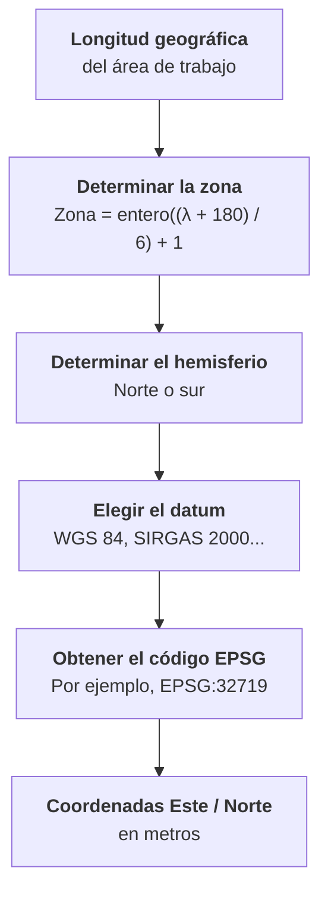

# 1.6 Sistema UTM

!!! abstract "Objetivos de aprendizaje"

    Al finalizar este tema, el estudiante será capaz de:

    - Explicar qué es el sistema UTM y en qué proyección se basa.
    - Describir la división del mundo en 60 zonas y calcular la zona y el meridiano central de cualquier punto.
    - Interpretar el factor de escala, el falso Este y el falso Norte.
    - Leer y escribir correctamente coordenadas UTM, diferenciando los hemisferios norte y sur.
    - Identificar las zonas UTM que cubren Bolivia y sus códigos EPSG.
    - Seleccionar la zona UTM adecuada para un proyecto, incluso cuando el área abarca más de una zona.

---

## ¿Qué es UTM?

En el tema 1.5 llegamos a una descripción muy precisa: UTM es una proyección **cilíndrica, transversa, secante y conforme**. Ahora veremos cómo esa proyección se convierte en un **sistema de coordenadas** usado en todo el mundo.

!!! info "Definición"

    El sistema **UTM** (*Universal Transverse Mercator*, **Universal Transversa de Mercator**) es un sistema de coordenadas planas que divide la Tierra en **60 zonas** de 6° de longitud y aplica en cada una la **proyección Transversa de Mercator**, expresando las posiciones en **metros** mediante coordenadas **Este (E)** y **Norte (N)**.

Cada palabra del nombre tiene un significado:

| Término | Significado |
|---|---|
| **Universal** | Cubre casi todo el planeta, entre los 80° S y los 84° N, con las mismas reglas en todas partes |
| **Transversa** | El cilindro de proyección está "acostado": se ajusta a un **meridiano**, no al ecuador |
| **Mercator** | Usa la misma lógica matemática que la proyección de Mercator, por lo que es **conforme** |

El sistema fue desarrollado por el Ejército de los Estados Unidos a fines de la década de 1940 para disponer de una cuadrícula métrica común para la cartografía militar. Con el tiempo se convirtió en el **sistema de coordenadas planas más utilizado del mundo** en topografía, catastro, cartografía y SIG.

---

## La proyección Transversa de Mercator

Recordemos cómo funciona la proyección de Mercator **normal**: un cilindro tangente al **ecuador**, con deformación mínima cerca del ecuador y creciente hacia los polos.

La **Transversa de Mercator** gira ese cilindro 90°, de modo que queda tangente (o secante) a lo largo de un **meridiano**:

| Característica | Mercator normal | Transversa de Mercator |
|---|---|---|
| Orientación del cilindro | Paralela al eje de rotación | Perpendicular al eje de rotación |
| Línea de contacto | Ecuador | Un meridiano |
| Zona de menor deformación | Franja a lo largo del ecuador | Franja a lo largo del meridiano |
| La deformación crece | Hacia los polos | Hacia el este y el oeste del meridiano |
| Propiedad | Conforme | Conforme |

Esto tiene una consecuencia clave: la deformación es muy pequeña **cerca del meridiano de contacto**, pero crece rápidamente al alejarse de él. Por eso la proyección solo es útil en una **franja estrecha**.

!!! tip "La solución de UTM"

    En lugar de usar una sola proyección para todo el mundo, UTM usa **60 proyecciones Transversas de Mercator**, cada una con su propio meridiano central y aplicada solo a una franja de 6° de ancho. Así, la deformación se mantiene pequeña en todas partes.

---

## Zonas UTM

### Las 60 zonas

- La Tierra se divide en **60 zonas** (también llamadas **husos**) de **6° de longitud** cada una.
- Se numeran del **1 al 60**, de oeste a este, empezando en el meridiano **180°**.
- La zona 1 va de 180° O a 174° O; la zona 60, de 174° E a 180° E.
- En sentido norte-sur, cubren desde los **80° S** hasta los **84° N**. Las regiones polares usan otro sistema, llamado **UPS** (*Universal Polar Stereographic*).

### Cómo calcular la zona

Para cualquier longitud λ (negativa al oeste de Greenwich):

```text
Zona = parte entera de ((λ + 180) / 6) + 1
```

Y el meridiano central de esa zona es:

```text
Meridiano central = 6 × Zona − 183
```

!!! example "Ejemplo: La Paz"

    Longitud de La Paz: **−68,1336°**

    ```text
    Zona = parte entera de ((−68,1336 + 180) / 6) + 1
         = parte entera de (111,8664 / 6) + 1
         = parte entera de (18,64) + 1
         = 18 + 1
         = 19
    ```

    ```text
    Meridiano central = 6 × 19 − 183 = −69°
    ```

    La Paz está en la **zona 19**, cuyo meridiano central es **69° O**.

### Zonas de Sudamérica

| Zona | Desde | Hasta | Meridiano central |
|---|---|---|---|
| 17 | 84° O | 78° O | 81° O |
| 18 | 78° O | 72° O | 75° O |
| **19** | **72° O** | **66° O** | **69° O** |
| **20** | **66° O** | **60° O** | **63° O** |
| **21** | **60° O** | **54° O** | **57° O** |
| 22 | 54° O | 48° O | 51° O |
| 23 | 48° O | 42° O | 45° O |
| 24 | 42° O | 36° O | 39° O |
| 25 | 36° O | 30° O | 33° O |

En negrita, las zonas que cubren el territorio de Bolivia.

??? info "Para saber más: bandas de latitud y excepciones"

    **Bandas de latitud.** Además de las zonas, el sistema divide el mundo en **bandas de latitud** de 8°, identificadas con letras de la **C** a la **X** (sin la I ni la O). Las bandas de la C a la M están en el hemisferio sur y las de la N a la X, en el norte. Bolivia está en las bandas **K** (24° S a 16° S) y **L** (16° S a 8° S).

    Estas letras se usan en el sistema **MGRS** (*Military Grid Reference System*) y aparecen en algunos receptores GNSS, que muestran coordenadas como `19K 592468 8176022`.

    **Excepciones.** Hay algunas zonas con límites modificados en el norte de Europa: la zona 32V se amplió para cubrir el suroeste de Noruega, y las zonas de la banda X alrededor del archipiélago de Svalbard tienen anchos distintos. No afectan a Sudamérica.

---

## Meridiano central y factor de escala

Cada zona tiene su propio **meridiano central (MC)**, ubicado exactamente en el centro de la franja, 3° al este y 3° al oeste de sus límites.

<figure class="figura">
<svg viewBox="0 0 720 400" xmlns="http://www.w3.org/2000/svg" role="img" aria-label="Esquema de una zona UTM del hemisferio sur con meridiano central, líneas estándar, falso Este y falso Norte">
<rect x="160" y="50" width="400" height="280" fill="currentColor" fill-opacity="0.05" stroke="currentColor" stroke-width="2"/>
<line x1="30" y1="50" x2="690" y2="50" stroke="#2e9e5b" stroke-width="2.5"/>
<text x="690" y="40" text-anchor="end" font-size="13" font-weight="bold" fill="#2e9e5b">Ecuador · N = 10 000 000 m</text>
<text x="578" y="185" font-size="12" fill="currentColor">N disminuye</text>
<text x="578" y="203" font-size="12" fill="currentColor">hacia el sur ↓</text>
<line x1="61" y1="50" x2="61" y2="330" stroke="currentColor" stroke-opacity="0.6" stroke-width="1.5" stroke-dasharray="3 4"/>
<text x="53" y="190" text-anchor="middle" font-size="12" fill="currentColor" transform="rotate(-90 53 190)">Origen falso (E = 0)</text>
<line x1="360" y1="50" x2="360" y2="330" stroke="#3f6fd8" stroke-width="2.5"/>
<text x="350" y="250" text-anchor="middle" font-size="12" font-weight="bold" fill="#3f6fd8" transform="rotate(-90 350 250)">Meridiano central</text>
<line x1="252" y1="50" x2="252" y2="330" stroke="#e0823d" stroke-width="2" stroke-dasharray="7 5"/>
<line x1="468" y1="50" x2="468" y2="330" stroke="#e0823d" stroke-width="2" stroke-dasharray="7 5"/>
<text x="244" y="250" text-anchor="middle" font-size="12" fill="#e0823d" transform="rotate(-90 244 250)">Línea estándar</text>
<text x="460" y="250" text-anchor="middle" font-size="12" fill="#e0823d" transform="rotate(-90 460 250)">Línea estándar</text>
<text x="360" y="95" text-anchor="middle" font-size="12" fill="currentColor">6°</text>
<line x1="166" y1="80" x2="554" y2="80" stroke="currentColor" stroke-opacity="0.6" stroke-width="1"/>
<polygon points="162,80 172,75 172,85" fill="currentColor" fill-opacity="0.6"/>
<polygon points="558,80 548,75 548,85" fill="currentColor" fill-opacity="0.6"/>
<line x1="360" y1="200" x2="515" y2="200" stroke="currentColor" stroke-opacity="0.5" stroke-dasharray="2 3"/>
<line x1="515" y1="50" x2="515" y2="200" stroke="currentColor" stroke-opacity="0.5" stroke-dasharray="2 3"/>
<circle cx="515" cy="200" r="6" fill="#9b59b6"/>
<text x="523" y="195" font-size="14" font-weight="bold" fill="#9b59b6">P</text>
<text x="437" y="193" text-anchor="middle" font-size="11" fill="#9b59b6">E &gt; 500 000</text>
<text x="61" y="352" text-anchor="middle" font-size="12" fill="currentColor">0</text>
<text x="160" y="352" text-anchor="middle" font-size="12" fill="currentColor">≈ 166 000</text>
<text x="252" y="352" text-anchor="middle" font-size="12" fill="#e0823d">≈ 320 000</text>
<text x="360" y="352" text-anchor="middle" font-size="12" font-weight="bold" fill="#3f6fd8">500 000</text>
<text x="468" y="352" text-anchor="middle" font-size="12" fill="#e0823d">≈ 680 000</text>
<text x="560" y="352" text-anchor="middle" font-size="12" fill="currentColor">≈ 834 000</text>
<text x="160" y="375" text-anchor="middle" font-size="12" fill="currentColor">k ≈ 1,001</text>
<text x="252" y="375" text-anchor="middle" font-size="12" fill="#e0823d">k = 1</text>
<text x="360" y="375" text-anchor="middle" font-size="12" font-weight="bold" fill="#3f6fd8">k = 0,9996</text>
<text x="468" y="375" text-anchor="middle" font-size="12" fill="#e0823d">k = 1</text>
<text x="560" y="375" text-anchor="middle" font-size="12" fill="currentColor">k ≈ 1,001</text>
<text x="360" y="396" text-anchor="middle" font-size="12" fill="currentColor">Este (m), valores aproximados sobre el ecuador</text>
</svg>
<figcaption>Esquema de una zona UTM del hemisferio sur. Los valores de Este y del factor de escala son aproximados sobre el ecuador.</figcaption>
</figure>

### ¿Por qué 0,9996?

Si el cilindro fuera **tangente** al meridiano central, la escala sería exacta allí y crecería hasta cerca de 1,0014 en los bordes de la zona. Para repartir mejor la deformación, UTM usa un cilindro **secante**:

- En el **meridiano central**, el factor de escala es **k₀ = 0,9996**: las distancias se reducen 40 cm por kilómetro.
- A unos **180 km** al este y al oeste del meridiano central están las **líneas estándar**, donde **k = 1**.
- En los **bordes de la zona**, el factor alcanza aproximadamente **1,0010**: las distancias aumentan alrededor de 1 m por kilómetro.

Así, en toda la zona el error de escala se mantiene por debajo de **1 parte en 1 000**.

| Posición (a 17° S) | Distancia al MC | Factor de escala (k) | Diferencia por kilómetro |
|---|---|---|---|
| Meridiano central | 0 km | 0,99960 | −40 cm |
| Línea estándar | ≈ 180 km | ≈ 1,00000 | ≈ 0 cm |
| Borde de la zona | 3° (≈ 320 km) | 1,00086 | +86 cm |
| 1° fuera de la zona | 4° (≈ 425 km) | 1,00185 | +1,85 m |
| 1,5° fuera de la zona | 4,5° (≈ 480 km) | 1,00244 | +2,44 m |

---

## Falso Este y Falso Norte

Si el origen de coordenadas estuviera en el cruce del meridiano central con el ecuador, la mitad de los puntos tendría coordenadas **Este negativas**, y todo el hemisferio sur tendría coordenadas **Norte negativas**. Para evitarlo, se suman valores constantes llamados **falsos**.

### Falso Este

Al meridiano central se le asigna el valor **E = 500 000 m**.

- Como la zona tiene como máximo unos 334 km a cada lado del meridiano central (en el ecuador), **todas las coordenadas Este son positivas**.
- El origen "real" (E = 0) queda fuera de la zona, unos 500 km al oeste del meridiano central.

| Si la coordenada Este es... | El punto está... |
|---|---|
| **Menor que 500 000** | Al **oeste** del meridiano central |
| **Igual a 500 000** | Sobre el meridiano central |
| **Mayor que 500 000** | Al **este** del meridiano central |

!!! example "Leer la coordenada Este"

    La Paz tiene **E = 592 468 m** en la zona 19. Como es mayor que 500 000, está **al este** del meridiano central (69° O), a unos **92 km** de él.

### Falso Norte

El valor asignado al ecuador depende del hemisferio:

| Hemisferio | Falso Norte | Coordenada Norte en el ecuador | Qué ocurre al alejarse del ecuador |
|---|---|---|---|
| **Norte** | 0 m | 0 | N **aumenta** hacia el norte |
| **Sur** | 10 000 000 m | 10 000 000 | N **disminuye** hacia el sur |

!!! example "Leer la coordenada Norte"

    La Paz tiene **N = 8 176 022 m**. Como está en el hemisferio sur:

    ```text
    Distancia aproximada al ecuador = 10 000 000 − 8 176 022 = 1 823 978 m ≈ 1 824 km
    ```

    La Paz está a unos **1 824 km al sur del ecuador**.

---

## Hemisferio norte y hemisferio sur

Como el falso Norte cambia según el hemisferio, **la misma zona tiene dos versiones**, y cada una tiene su propio código EPSG:

| Zona | Hemisferio norte (WGS 84) | Hemisferio sur (WGS 84) |
|---|---|---|
| 19 | EPSG:32619 | **EPSG:32719** |
| 20 | EPSG:32620 | **EPSG:32720** |
| 21 | EPSG:32621 | **EPSG:32721** |

!!! tip "Cómo recordar los códigos de WGS 84 / UTM"

    - **326** + número de zona → hemisferio **norte**.
    - **327** + número de zona → hemisferio **sur**.

    Así, la zona 19 sur es **327** + **19** = **EPSG:32719**.

!!! danger "Error frecuente: usar la zona norte en el hemisferio sur"

    Si las coordenadas de La Paz (`592468, 8176022`) se interpretan con **EPSG:32619** (zona 19 **norte**) en lugar de **EPSG:32719**, el software las ubica a unos **8 176 km al norte del ecuador**, cerca de los **73° N**, en el Ártico.

    Las coordenadas Norte de Bolivia, con 7 dígitos y valores entre unos 7,4 y 8,9 millones, **solo tienen sentido en el hemisferio sur**.

---

## Coordenadas Este/Norte

### Cómo expresar una coordenada UTM completa

Una coordenada UTM solo está completa si incluye **cinco elementos**:

```text
WGS 84 / UTM zona 19S    E 592 468 m    N 8 176 022 m
└─┬──┘       └┬┘ │       └────┬────┘   └─────┬─────┘
Datum      Zona  Hemisferio   Este          Norte
```

| Elemento | Por qué es necesario |
|---|---|
| **Datum** | Los mismos números en PSAD56 y en WGS 84 corresponden a lugares separados unos 400 m |
| **Zona** | Los mismos números en zonas distintas corresponden a lugares separados cientos de kilómetros |
| **Hemisferio** | Los mismos números en el norte y en el sur corresponden a lugares en hemisferios opuestos |
| **Este** | Posición en sentido oeste-este |
| **Norte** | Posición en sentido norte-sur |

!!! warning "La letra que acompaña a la zona"

    Existen dos convenciones que usan una letra después del número de zona, y es fácil confundirlas:

    - En los códigos EPSG y en la mayoría de los SIG, **19S** significa zona 19, hemisferio **sur**.
    - En MGRS y en algunos receptores GNSS, la letra indica la **banda de latitud**. Allí, **19K** es una zona del hemisferio sur, pero **19S** sería una banda del **hemisferio norte** (entre 32° N y 40° N).

    Ante la duda, verifica siempre qué convención usa el equipo o el documento.

### Medir distancias con coordenadas UTM

Como las coordenadas UTM están en metros sobre un plano, la distancia entre dos puntos de la **misma zona** se calcula con el **teorema de Pitágoras**:

```text
distancia = √( (E₂ − E₁)² + (N₂ − N₁)² )
```

!!! example "Distancia entre La Paz y Oruro (zona 19S)"

    | Ciudad | Este (m) | Norte (m) |
    |---|---|---|
    | La Paz | 592 468 | 8 176 022 |
    | Oruro | 700 169 | 8 012 480 |

    ```text
    ΔE = 700 169 − 592 468 = 107 701 m
    ΔN = 8 012 480 − 8 176 022 = −163 542 m

    distancia = √(107 701² + 163 542²) ≈ 195 820 m ≈ 195,8 km
    ```

    La distancia calculada sobre el elipsoide es de **195 844 m**. La diferencia, de unos **24 m** en casi 200 km, se debe al factor de escala: la línea pasa cerca del meridiano central, donde k es menor que 1.

    Para la mayoría de los análisis SIG, esa diferencia es despreciable. Para topografía de precisión, no.

??? info "Para saber más: factor combinado y convergencia de cuadrícula"

    **Factor de elevación.** Las distancias UTM están referidas al **elipsoide**, pero en campo medimos sobre el **terreno**, que en buena parte de Bolivia está a gran altura. Para pasar de una distancia medida en el terreno a una distancia UTM se aplica, además del factor de escala, un **factor de elevación** que depende de la altura:

    | Altura | Factor de elevación aproximado | Diferencia por kilómetro |
    |---|---|---|
    | 400 m (llanos orientales) | 0,99994 | −6 cm |
    | 2 560 m (valle de Cochabamba) | 0,99960 | −40 cm |
    | 3 640 m (La Paz) | 0,99943 | −57 cm |
    | 4 000 m (El Alto, altiplano) | 0,99937 | −63 cm |

    El producto del factor de escala por el factor de elevación se llama **factor combinado**. En el altiplano, cerca del meridiano central, puede superar **1 m de diferencia por kilómetro** entre la distancia medida con estación total y la distancia calculada con coordenadas UTM. Por eso es un aspecto crítico en **topografía y catastro**.

    **Convergencia de cuadrícula.** En UTM, las líneas de la cuadrícula son paralelas al meridiano central, pero los meridianos reales convergen hacia los polos. Por eso el **norte de cuadrícula** no coincide exactamente con el **norte geográfico**, salvo sobre el meridiano central. En Bolivia, cerca de los bordes de una zona, la diferencia puede alcanzar casi **1°**.

---

## Uso de UTM en Bolivia

El territorio boliviano abarca **tres zonas UTM**, todas en el hemisferio sur.

<figure class="figura">
<svg viewBox="0 0 720 596" xmlns="http://www.w3.org/2000/svg" role="img" aria-label="Zonas UTM 19S, 20S y 21S sobre el territorio de Bolivia, con capitales de departamento">
<defs>
<clipPath id="utm-bol-z19"><rect x="20.0" y="60" width="151.1" height="506.4"/></clipPath>
<clipPath id="utm-bol-z20"><rect x="171.1" y="60" width="201.4" height="506.4"/></clipPath>
<clipPath id="utm-bol-z21"><rect x="372.5" y="60" width="117.5" height="506.4"/></clipPath>
</defs>
<rect x="20" y="60" width="470" height="506.4" fill="currentColor" fill-opacity="0.03" stroke="currentColor" stroke-opacity="0.4" stroke-width="1"/>
<path d="M 53.2 357.1 L 53.2 357.0 L 53.2 355.5 L 52.8 353.0 L 51.4 351.0 L 49.3 349.7 L 48.7 348.1 L 49.4 346.4 L 53.5 343.1 L 55.6 342.5 L 56.2 340.8 L 57.5 339.4 L 61.4 334.5 L 63.6 331.3 L 65.9 329.4 L 68.5 328.0 L 69.7 326.9 L 69.1 323.4 L 69.3 321.1 L 70.1 319.6 L 72.8 318.1 L 75.1 316.9 L 75.6 316.3 L 75.4 315.4 L 73.3 313.6 L 68.8 312.1 L 65.9 312.2 L 64.0 310.9 L 63.1 309.7 L 57.2 295.3 L 56.2 291.9 L 56.3 290.6 L 60.2 283.5 L 61.8 281.2 L 64.6 277.8 L 64.1 276.5 L 59.3 270.9 L 57.8 268.3 L 57.8 265.6 L 58.3 262.4 L 61.1 260.7 L 61.9 258.1 L 62.5 255.5 L 63.7 254.6 L 64.9 253.2 L 66.3 251.0 L 68.6 249.2 L 69.9 247.8 L 70.2 243.9 L 71.3 242.8 L 74.4 241.6 L 74.7 240.5 L 74.0 237.9 L 72.5 235.1 L 71.2 233.8 L 69.6 226.9 L 67.9 223.5 L 68.6 222.2 L 69.8 220.5 L 70.9 217.0 L 71.3 213.0 L 71.0 198.4 L 71.1 195.5 L 72.6 193.5 L 74.8 191.1 L 76.7 190.3 L 78.4 188.8 L 78.3 186.0 L 79.5 184.4 L 80.9 182.3 L 76.4 174.2 L 72.5 167.1 L 68.8 160.4 L 64.5 152.7 L 61.7 147.6 L 58.2 141.3 L 55.1 135.7 L 50.9 128.2 L 54.8 128.0 L 62.7 128.3 L 70.3 129.7 L 75.4 130.2 L 77.6 131.4 L 78.1 133.3 L 79.5 134.1 L 81.2 133.8 L 83.0 133.7 L 87.2 131.8 L 90.6 130.5 L 93.5 129.0 L 95.0 127.5 L 98.6 122.3 L 101.5 119.5 L 104.2 118.5 L 109.5 118.1 L 111.1 118.9 L 113.3 118.8 L 115.1 115.8 L 117.9 112.6 L 123.5 108.5 L 126.3 107.4 L 128.1 106.0 L 131.1 105.8 L 133.8 104.3 L 146.6 94.1 L 151.8 91.4 L 155.0 90.9 L 157.7 90.3 L 162.2 88.9 L 173.6 87.4 L 180.9 86.8 L 183.3 88.3 L 185.9 87.9 L 188.1 85.6 L 190.0 84.8 L 191.3 84.9 L 193.3 87.6 L 194.3 90.5 L 193.6 92.7 L 193.7 95.9 L 194.6 100.1 L 194.1 103.8 L 191.4 108.6 L 190.0 110.6 L 189.6 112.6 L 189.9 115.4 L 191.1 119.9 L 193.4 126.1 L 193.8 130.7 L 192.2 133.7 L 191.4 136.3 L 191.6 138.5 L 192.1 140.0 L 193.1 140.9 L 193.7 142.6 L 193.8 145.2 L 195.2 147.7 L 197.7 150.1 L 198.8 152.4 L 198.3 154.6 L 198.4 156.0 L 199.2 156.6 L 199.9 156.1 L 200.8 155.5 L 201.6 155.7 L 203.4 158.8 L 203.6 159.4 L 204.6 162.0 L 204.9 163.9 L 207.5 165.0 L 210.4 165.8 L 211.9 166.8 L 215.0 169.9 L 217.7 171.9 L 221.0 173.5 L 222.1 176.2 L 224.1 180.1 L 229.7 181.7 L 236.1 182.4 L 240.3 183.3 L 245.3 181.2 L 248.7 181.5 L 252.1 182.9 L 253.6 183.9 L 256.2 185.9 L 260.1 188.5 L 263.4 189.5 L 265.7 188.0 L 267.9 187.5 L 269.5 188.1 L 270.4 191.0 L 271.3 192.9 L 273.2 194.4 L 277.3 198.1 L 279.7 199.6 L 282.3 199.5 L 287.7 201.9 L 293.5 204.3 L 296.5 204.7 L 299.4 204.4 L 301.4 205.3 L 302.2 208.1 L 307.2 213.9 L 309.6 216.1 L 312.4 218.1 L 319.6 218.0 L 321.8 218.6 L 325.0 218.1 L 334.6 217.1 L 336.3 216.8 L 341.8 219.3 L 348.2 222.9 L 352.5 225.7 L 355.5 227.3 L 357.1 229.8 L 358.3 232.5 L 358.9 235.3 L 358.1 238.1 L 357.0 239.2 L 356.6 241.1 L 357.1 243.8 L 359.2 246.2 L 360.0 249.2 L 361.2 254.5 L 362.5 256.2 L 363.3 272.6 L 359.0 272.8 L 352.9 273.0 L 354.7 274.5 L 359.7 280.7 L 364.4 286.3 L 365.1 295.3 L 365.6 301.0 L 366.2 309.1 L 366.6 313.9 L 378.2 314.3 L 391.5 314.8 L 407.5 315.4 L 421.6 315.9 L 423.0 315.9 L 425.4 315.2 L 427.0 314.4 L 428.0 314.4 L 428.2 316.3 L 427.9 318.8 L 427.9 321.6 L 423.8 327.2 L 423.6 328.9 L 424.2 336.3 L 425.6 342.2 L 426.3 347.6 L 428.0 349.2 L 432.7 352.1 L 439.9 357.3 L 442.8 358.0 L 445.3 357.3 L 446.7 359.4 L 447.0 362.9 L 451.0 372.5 L 453.5 378.6 L 454.7 380.7 L 456.6 381.8 L 456.2 382.6 L 454.6 382.9 L 453.9 384.1 L 451.8 390.9 L 448.9 399.9 L 446.9 406.2 L 448.7 406.4 L 448.8 408.1 L 449.2 410.8 L 447.0 411.1 L 446.3 412.1 L 443.9 417.3 L 440.6 424.1 L 437.2 431.1 L 435.2 435.2 L 438.6 438.3 L 444.3 443.5 L 443.4 444.9 L 441.0 445.6 L 438.9 446.1 L 437.4 448.0 L 436.5 449.4 L 434.3 449.9 L 434.9 444.1 L 434.3 439.1 L 433.6 437.8 L 423.7 431.8 L 414.8 426.4 L 403.0 419.2 L 387.9 419.4 L 372.3 419.6 L 357.3 422.8 L 342.7 426.0 L 335.7 427.4 L 321.7 430.4 L 313.5 431.8 L 311.4 437.5 L 308.1 446.1 L 305.0 451.1 L 301.3 456.4 L 296.1 463.8 L 296.1 472.8 L 296.1 481.4 L 292.4 493.5 L 289.3 503.7 L 286.3 513.6 L 284.3 520.4 L 283.5 522.2 L 283.0 521.6 L 280.4 519.6 L 278.0 515.7 L 277.3 514.0 L 277.0 513.9 L 262.8 514.0 L 249.1 514.2 L 247.7 515.0 L 245.7 515.0 L 244.3 514.2 L 242.9 514.3 L 240.8 515.0 L 239.0 516.6 L 233.8 526.8 L 231.2 531.2 L 229.3 535.1 L 227.9 541.8 L 227.3 542.9 L 225.7 540.6 L 223.3 534.5 L 222.2 531.0 L 220.6 527.0 L 217.9 522.0 L 214.7 520.5 L 212.7 520.0 L 209.9 519.0 L 204.9 517.8 L 202.7 517.6 L 188.4 517.4 L 187.2 517.3 L 181.6 517.9 L 178.8 517.5 L 175.8 514.7 L 169.1 509.8 L 167.8 508.3 L 165.2 507.2 L 163.7 507.1 L 162.8 508.1 L 161.6 512.2 L 160.2 515.9 L 158.8 518.0 L 154.1 519.5 L 149.6 521.2 L 147.2 521.6 L 145.9 523.4 L 145.3 526.0 L 144.2 528.3 L 137.8 531.8 L 136.4 533.3 L 135.6 536.7 L 132.1 541.0 L 131.0 542.7 L 125.3 543.9 L 118.0 545.2 L 113.8 545.1 L 110.8 544.7 L 110.0 544.0 L 108.0 542.8 L 107.6 541.4 L 107.6 539.5 L 108.2 536.0 L 107.9 531.2 L 105.6 525.7 L 105.8 523.9 L 105.5 521.1 L 104.3 516.0 L 101.4 513.4 L 100.5 509.1 L 100.2 505.4 L 97.7 500.7 L 97.3 494.7 L 97.3 489.6 L 93.4 483.6 L 89.3 477.3 L 86.0 476.4 L 85.2 475.7 L 84.8 473.8 L 84.8 471.0 L 85.0 469.3 L 87.6 466.5 L 87.7 466.1 L 87.1 465.5 L 80.6 461.4 L 78.9 460.2 L 78.4 458.7 L 78.4 457.4 L 80.0 456.0 L 80.8 455.0 L 79.3 452.0 L 79.4 449.4 L 78.4 448.2 L 78.6 447.3 L 79.5 446.6 L 83.8 445.7 L 85.1 443.0 L 85.1 440.8 L 84.5 439.2 L 80.6 435.1 L 80.5 434.4 L 84.6 428.8 L 87.6 425.1 L 88.4 424.4 L 88.1 423.6 L 87.4 422.6 L 85.5 421.2 L 83.1 419.6 L 81.1 417.7 L 78.4 414.9 L 75.1 412.5 L 72.7 410.1 L 71.4 408.1 L 71.4 406.1 L 71.1 402.7 L 69.5 397.2 L 69.0 393.5 L 68.3 389.4 L 67.6 386.8 L 67.3 384.2 L 66.1 381.4 L 65.5 379.3 L 66.4 377.9 L 67.3 376.8 L 67.2 376.1 L 60.9 373.1 L 59.8 372.3 L 58.3 366.3 L 53.7 361.0 L 53.2 357.1 Z" fill="#3f6fd8" fill-opacity="0.28" stroke="none" clip-path="url(#utm-bol-z19)"/>
<path d="M 53.2 357.1 L 53.2 357.0 L 53.2 355.5 L 52.8 353.0 L 51.4 351.0 L 49.3 349.7 L 48.7 348.1 L 49.4 346.4 L 53.5 343.1 L 55.6 342.5 L 56.2 340.8 L 57.5 339.4 L 61.4 334.5 L 63.6 331.3 L 65.9 329.4 L 68.5 328.0 L 69.7 326.9 L 69.1 323.4 L 69.3 321.1 L 70.1 319.6 L 72.8 318.1 L 75.1 316.9 L 75.6 316.3 L 75.4 315.4 L 73.3 313.6 L 68.8 312.1 L 65.9 312.2 L 64.0 310.9 L 63.1 309.7 L 57.2 295.3 L 56.2 291.9 L 56.3 290.6 L 60.2 283.5 L 61.8 281.2 L 64.6 277.8 L 64.1 276.5 L 59.3 270.9 L 57.8 268.3 L 57.8 265.6 L 58.3 262.4 L 61.1 260.7 L 61.9 258.1 L 62.5 255.5 L 63.7 254.6 L 64.9 253.2 L 66.3 251.0 L 68.6 249.2 L 69.9 247.8 L 70.2 243.9 L 71.3 242.8 L 74.4 241.6 L 74.7 240.5 L 74.0 237.9 L 72.5 235.1 L 71.2 233.8 L 69.6 226.9 L 67.9 223.5 L 68.6 222.2 L 69.8 220.5 L 70.9 217.0 L 71.3 213.0 L 71.0 198.4 L 71.1 195.5 L 72.6 193.5 L 74.8 191.1 L 76.7 190.3 L 78.4 188.8 L 78.3 186.0 L 79.5 184.4 L 80.9 182.3 L 76.4 174.2 L 72.5 167.1 L 68.8 160.4 L 64.5 152.7 L 61.7 147.6 L 58.2 141.3 L 55.1 135.7 L 50.9 128.2 L 54.8 128.0 L 62.7 128.3 L 70.3 129.7 L 75.4 130.2 L 77.6 131.4 L 78.1 133.3 L 79.5 134.1 L 81.2 133.8 L 83.0 133.7 L 87.2 131.8 L 90.6 130.5 L 93.5 129.0 L 95.0 127.5 L 98.6 122.3 L 101.5 119.5 L 104.2 118.5 L 109.5 118.1 L 111.1 118.9 L 113.3 118.8 L 115.1 115.8 L 117.9 112.6 L 123.5 108.5 L 126.3 107.4 L 128.1 106.0 L 131.1 105.8 L 133.8 104.3 L 146.6 94.1 L 151.8 91.4 L 155.0 90.9 L 157.7 90.3 L 162.2 88.9 L 173.6 87.4 L 180.9 86.8 L 183.3 88.3 L 185.9 87.9 L 188.1 85.6 L 190.0 84.8 L 191.3 84.9 L 193.3 87.6 L 194.3 90.5 L 193.6 92.7 L 193.7 95.9 L 194.6 100.1 L 194.1 103.8 L 191.4 108.6 L 190.0 110.6 L 189.6 112.6 L 189.9 115.4 L 191.1 119.9 L 193.4 126.1 L 193.8 130.7 L 192.2 133.7 L 191.4 136.3 L 191.6 138.5 L 192.1 140.0 L 193.1 140.9 L 193.7 142.6 L 193.8 145.2 L 195.2 147.7 L 197.7 150.1 L 198.8 152.4 L 198.3 154.6 L 198.4 156.0 L 199.2 156.6 L 199.9 156.1 L 200.8 155.5 L 201.6 155.7 L 203.4 158.8 L 203.6 159.4 L 204.6 162.0 L 204.9 163.9 L 207.5 165.0 L 210.4 165.8 L 211.9 166.8 L 215.0 169.9 L 217.7 171.9 L 221.0 173.5 L 222.1 176.2 L 224.1 180.1 L 229.7 181.7 L 236.1 182.4 L 240.3 183.3 L 245.3 181.2 L 248.7 181.5 L 252.1 182.9 L 253.6 183.9 L 256.2 185.9 L 260.1 188.5 L 263.4 189.5 L 265.7 188.0 L 267.9 187.5 L 269.5 188.1 L 270.4 191.0 L 271.3 192.9 L 273.2 194.4 L 277.3 198.1 L 279.7 199.6 L 282.3 199.5 L 287.7 201.9 L 293.5 204.3 L 296.5 204.7 L 299.4 204.4 L 301.4 205.3 L 302.2 208.1 L 307.2 213.9 L 309.6 216.1 L 312.4 218.1 L 319.6 218.0 L 321.8 218.6 L 325.0 218.1 L 334.6 217.1 L 336.3 216.8 L 341.8 219.3 L 348.2 222.9 L 352.5 225.7 L 355.5 227.3 L 357.1 229.8 L 358.3 232.5 L 358.9 235.3 L 358.1 238.1 L 357.0 239.2 L 356.6 241.1 L 357.1 243.8 L 359.2 246.2 L 360.0 249.2 L 361.2 254.5 L 362.5 256.2 L 363.3 272.6 L 359.0 272.8 L 352.9 273.0 L 354.7 274.5 L 359.7 280.7 L 364.4 286.3 L 365.1 295.3 L 365.6 301.0 L 366.2 309.1 L 366.6 313.9 L 378.2 314.3 L 391.5 314.8 L 407.5 315.4 L 421.6 315.9 L 423.0 315.9 L 425.4 315.2 L 427.0 314.4 L 428.0 314.4 L 428.2 316.3 L 427.9 318.8 L 427.9 321.6 L 423.8 327.2 L 423.6 328.9 L 424.2 336.3 L 425.6 342.2 L 426.3 347.6 L 428.0 349.2 L 432.7 352.1 L 439.9 357.3 L 442.8 358.0 L 445.3 357.3 L 446.7 359.4 L 447.0 362.9 L 451.0 372.5 L 453.5 378.6 L 454.7 380.7 L 456.6 381.8 L 456.2 382.6 L 454.6 382.9 L 453.9 384.1 L 451.8 390.9 L 448.9 399.9 L 446.9 406.2 L 448.7 406.4 L 448.8 408.1 L 449.2 410.8 L 447.0 411.1 L 446.3 412.1 L 443.9 417.3 L 440.6 424.1 L 437.2 431.1 L 435.2 435.2 L 438.6 438.3 L 444.3 443.5 L 443.4 444.9 L 441.0 445.6 L 438.9 446.1 L 437.4 448.0 L 436.5 449.4 L 434.3 449.9 L 434.9 444.1 L 434.3 439.1 L 433.6 437.8 L 423.7 431.8 L 414.8 426.4 L 403.0 419.2 L 387.9 419.4 L 372.3 419.6 L 357.3 422.8 L 342.7 426.0 L 335.7 427.4 L 321.7 430.4 L 313.5 431.8 L 311.4 437.5 L 308.1 446.1 L 305.0 451.1 L 301.3 456.4 L 296.1 463.8 L 296.1 472.8 L 296.1 481.4 L 292.4 493.5 L 289.3 503.7 L 286.3 513.6 L 284.3 520.4 L 283.5 522.2 L 283.0 521.6 L 280.4 519.6 L 278.0 515.7 L 277.3 514.0 L 277.0 513.9 L 262.8 514.0 L 249.1 514.2 L 247.7 515.0 L 245.7 515.0 L 244.3 514.2 L 242.9 514.3 L 240.8 515.0 L 239.0 516.6 L 233.8 526.8 L 231.2 531.2 L 229.3 535.1 L 227.9 541.8 L 227.3 542.9 L 225.7 540.6 L 223.3 534.5 L 222.2 531.0 L 220.6 527.0 L 217.9 522.0 L 214.7 520.5 L 212.7 520.0 L 209.9 519.0 L 204.9 517.8 L 202.7 517.6 L 188.4 517.4 L 187.2 517.3 L 181.6 517.9 L 178.8 517.5 L 175.8 514.7 L 169.1 509.8 L 167.8 508.3 L 165.2 507.2 L 163.7 507.1 L 162.8 508.1 L 161.6 512.2 L 160.2 515.9 L 158.8 518.0 L 154.1 519.5 L 149.6 521.2 L 147.2 521.6 L 145.9 523.4 L 145.3 526.0 L 144.2 528.3 L 137.8 531.8 L 136.4 533.3 L 135.6 536.7 L 132.1 541.0 L 131.0 542.7 L 125.3 543.9 L 118.0 545.2 L 113.8 545.1 L 110.8 544.7 L 110.0 544.0 L 108.0 542.8 L 107.6 541.4 L 107.6 539.5 L 108.2 536.0 L 107.9 531.2 L 105.6 525.7 L 105.8 523.9 L 105.5 521.1 L 104.3 516.0 L 101.4 513.4 L 100.5 509.1 L 100.2 505.4 L 97.7 500.7 L 97.3 494.7 L 97.3 489.6 L 93.4 483.6 L 89.3 477.3 L 86.0 476.4 L 85.2 475.7 L 84.8 473.8 L 84.8 471.0 L 85.0 469.3 L 87.6 466.5 L 87.7 466.1 L 87.1 465.5 L 80.6 461.4 L 78.9 460.2 L 78.4 458.7 L 78.4 457.4 L 80.0 456.0 L 80.8 455.0 L 79.3 452.0 L 79.4 449.4 L 78.4 448.2 L 78.6 447.3 L 79.5 446.6 L 83.8 445.7 L 85.1 443.0 L 85.1 440.8 L 84.5 439.2 L 80.6 435.1 L 80.5 434.4 L 84.6 428.8 L 87.6 425.1 L 88.4 424.4 L 88.1 423.6 L 87.4 422.6 L 85.5 421.2 L 83.1 419.6 L 81.1 417.7 L 78.4 414.9 L 75.1 412.5 L 72.7 410.1 L 71.4 408.1 L 71.4 406.1 L 71.1 402.7 L 69.5 397.2 L 69.0 393.5 L 68.3 389.4 L 67.6 386.8 L 67.3 384.2 L 66.1 381.4 L 65.5 379.3 L 66.4 377.9 L 67.3 376.8 L 67.2 376.1 L 60.9 373.1 L 59.8 372.3 L 58.3 366.3 L 53.7 361.0 L 53.2 357.1 Z" fill="#2e9e5b" fill-opacity="0.28" stroke="none" clip-path="url(#utm-bol-z20)"/>
<path d="M 53.2 357.1 L 53.2 357.0 L 53.2 355.5 L 52.8 353.0 L 51.4 351.0 L 49.3 349.7 L 48.7 348.1 L 49.4 346.4 L 53.5 343.1 L 55.6 342.5 L 56.2 340.8 L 57.5 339.4 L 61.4 334.5 L 63.6 331.3 L 65.9 329.4 L 68.5 328.0 L 69.7 326.9 L 69.1 323.4 L 69.3 321.1 L 70.1 319.6 L 72.8 318.1 L 75.1 316.9 L 75.6 316.3 L 75.4 315.4 L 73.3 313.6 L 68.8 312.1 L 65.9 312.2 L 64.0 310.9 L 63.1 309.7 L 57.2 295.3 L 56.2 291.9 L 56.3 290.6 L 60.2 283.5 L 61.8 281.2 L 64.6 277.8 L 64.1 276.5 L 59.3 270.9 L 57.8 268.3 L 57.8 265.6 L 58.3 262.4 L 61.1 260.7 L 61.9 258.1 L 62.5 255.5 L 63.7 254.6 L 64.9 253.2 L 66.3 251.0 L 68.6 249.2 L 69.9 247.8 L 70.2 243.9 L 71.3 242.8 L 74.4 241.6 L 74.7 240.5 L 74.0 237.9 L 72.5 235.1 L 71.2 233.8 L 69.6 226.9 L 67.9 223.5 L 68.6 222.2 L 69.8 220.5 L 70.9 217.0 L 71.3 213.0 L 71.0 198.4 L 71.1 195.5 L 72.6 193.5 L 74.8 191.1 L 76.7 190.3 L 78.4 188.8 L 78.3 186.0 L 79.5 184.4 L 80.9 182.3 L 76.4 174.2 L 72.5 167.1 L 68.8 160.4 L 64.5 152.7 L 61.7 147.6 L 58.2 141.3 L 55.1 135.7 L 50.9 128.2 L 54.8 128.0 L 62.7 128.3 L 70.3 129.7 L 75.4 130.2 L 77.6 131.4 L 78.1 133.3 L 79.5 134.1 L 81.2 133.8 L 83.0 133.7 L 87.2 131.8 L 90.6 130.5 L 93.5 129.0 L 95.0 127.5 L 98.6 122.3 L 101.5 119.5 L 104.2 118.5 L 109.5 118.1 L 111.1 118.9 L 113.3 118.8 L 115.1 115.8 L 117.9 112.6 L 123.5 108.5 L 126.3 107.4 L 128.1 106.0 L 131.1 105.8 L 133.8 104.3 L 146.6 94.1 L 151.8 91.4 L 155.0 90.9 L 157.7 90.3 L 162.2 88.9 L 173.6 87.4 L 180.9 86.8 L 183.3 88.3 L 185.9 87.9 L 188.1 85.6 L 190.0 84.8 L 191.3 84.9 L 193.3 87.6 L 194.3 90.5 L 193.6 92.7 L 193.7 95.9 L 194.6 100.1 L 194.1 103.8 L 191.4 108.6 L 190.0 110.6 L 189.6 112.6 L 189.9 115.4 L 191.1 119.9 L 193.4 126.1 L 193.8 130.7 L 192.2 133.7 L 191.4 136.3 L 191.6 138.5 L 192.1 140.0 L 193.1 140.9 L 193.7 142.6 L 193.8 145.2 L 195.2 147.7 L 197.7 150.1 L 198.8 152.4 L 198.3 154.6 L 198.4 156.0 L 199.2 156.6 L 199.9 156.1 L 200.8 155.5 L 201.6 155.7 L 203.4 158.8 L 203.6 159.4 L 204.6 162.0 L 204.9 163.9 L 207.5 165.0 L 210.4 165.8 L 211.9 166.8 L 215.0 169.9 L 217.7 171.9 L 221.0 173.5 L 222.1 176.2 L 224.1 180.1 L 229.7 181.7 L 236.1 182.4 L 240.3 183.3 L 245.3 181.2 L 248.7 181.5 L 252.1 182.9 L 253.6 183.9 L 256.2 185.9 L 260.1 188.5 L 263.4 189.5 L 265.7 188.0 L 267.9 187.5 L 269.5 188.1 L 270.4 191.0 L 271.3 192.9 L 273.2 194.4 L 277.3 198.1 L 279.7 199.6 L 282.3 199.5 L 287.7 201.9 L 293.5 204.3 L 296.5 204.7 L 299.4 204.4 L 301.4 205.3 L 302.2 208.1 L 307.2 213.9 L 309.6 216.1 L 312.4 218.1 L 319.6 218.0 L 321.8 218.6 L 325.0 218.1 L 334.6 217.1 L 336.3 216.8 L 341.8 219.3 L 348.2 222.9 L 352.5 225.7 L 355.5 227.3 L 357.1 229.8 L 358.3 232.5 L 358.9 235.3 L 358.1 238.1 L 357.0 239.2 L 356.6 241.1 L 357.1 243.8 L 359.2 246.2 L 360.0 249.2 L 361.2 254.5 L 362.5 256.2 L 363.3 272.6 L 359.0 272.8 L 352.9 273.0 L 354.7 274.5 L 359.7 280.7 L 364.4 286.3 L 365.1 295.3 L 365.6 301.0 L 366.2 309.1 L 366.6 313.9 L 378.2 314.3 L 391.5 314.8 L 407.5 315.4 L 421.6 315.9 L 423.0 315.9 L 425.4 315.2 L 427.0 314.4 L 428.0 314.4 L 428.2 316.3 L 427.9 318.8 L 427.9 321.6 L 423.8 327.2 L 423.6 328.9 L 424.2 336.3 L 425.6 342.2 L 426.3 347.6 L 428.0 349.2 L 432.7 352.1 L 439.9 357.3 L 442.8 358.0 L 445.3 357.3 L 446.7 359.4 L 447.0 362.9 L 451.0 372.5 L 453.5 378.6 L 454.7 380.7 L 456.6 381.8 L 456.2 382.6 L 454.6 382.9 L 453.9 384.1 L 451.8 390.9 L 448.9 399.9 L 446.9 406.2 L 448.7 406.4 L 448.8 408.1 L 449.2 410.8 L 447.0 411.1 L 446.3 412.1 L 443.9 417.3 L 440.6 424.1 L 437.2 431.1 L 435.2 435.2 L 438.6 438.3 L 444.3 443.5 L 443.4 444.9 L 441.0 445.6 L 438.9 446.1 L 437.4 448.0 L 436.5 449.4 L 434.3 449.9 L 434.9 444.1 L 434.3 439.1 L 433.6 437.8 L 423.7 431.8 L 414.8 426.4 L 403.0 419.2 L 387.9 419.4 L 372.3 419.6 L 357.3 422.8 L 342.7 426.0 L 335.7 427.4 L 321.7 430.4 L 313.5 431.8 L 311.4 437.5 L 308.1 446.1 L 305.0 451.1 L 301.3 456.4 L 296.1 463.8 L 296.1 472.8 L 296.1 481.4 L 292.4 493.5 L 289.3 503.7 L 286.3 513.6 L 284.3 520.4 L 283.5 522.2 L 283.0 521.6 L 280.4 519.6 L 278.0 515.7 L 277.3 514.0 L 277.0 513.9 L 262.8 514.0 L 249.1 514.2 L 247.7 515.0 L 245.7 515.0 L 244.3 514.2 L 242.9 514.3 L 240.8 515.0 L 239.0 516.6 L 233.8 526.8 L 231.2 531.2 L 229.3 535.1 L 227.9 541.8 L 227.3 542.9 L 225.7 540.6 L 223.3 534.5 L 222.2 531.0 L 220.6 527.0 L 217.9 522.0 L 214.7 520.5 L 212.7 520.0 L 209.9 519.0 L 204.9 517.8 L 202.7 517.6 L 188.4 517.4 L 187.2 517.3 L 181.6 517.9 L 178.8 517.5 L 175.8 514.7 L 169.1 509.8 L 167.8 508.3 L 165.2 507.2 L 163.7 507.1 L 162.8 508.1 L 161.6 512.2 L 160.2 515.9 L 158.8 518.0 L 154.1 519.5 L 149.6 521.2 L 147.2 521.6 L 145.9 523.4 L 145.3 526.0 L 144.2 528.3 L 137.8 531.8 L 136.4 533.3 L 135.6 536.7 L 132.1 541.0 L 131.0 542.7 L 125.3 543.9 L 118.0 545.2 L 113.8 545.1 L 110.8 544.7 L 110.0 544.0 L 108.0 542.8 L 107.6 541.4 L 107.6 539.5 L 108.2 536.0 L 107.9 531.2 L 105.6 525.7 L 105.8 523.9 L 105.5 521.1 L 104.3 516.0 L 101.4 513.4 L 100.5 509.1 L 100.2 505.4 L 97.7 500.7 L 97.3 494.7 L 97.3 489.6 L 93.4 483.6 L 89.3 477.3 L 86.0 476.4 L 85.2 475.7 L 84.8 473.8 L 84.8 471.0 L 85.0 469.3 L 87.6 466.5 L 87.7 466.1 L 87.1 465.5 L 80.6 461.4 L 78.9 460.2 L 78.4 458.7 L 78.4 457.4 L 80.0 456.0 L 80.8 455.0 L 79.3 452.0 L 79.4 449.4 L 78.4 448.2 L 78.6 447.3 L 79.5 446.6 L 83.8 445.7 L 85.1 443.0 L 85.1 440.8 L 84.5 439.2 L 80.6 435.1 L 80.5 434.4 L 84.6 428.8 L 87.6 425.1 L 88.4 424.4 L 88.1 423.6 L 87.4 422.6 L 85.5 421.2 L 83.1 419.6 L 81.1 417.7 L 78.4 414.9 L 75.1 412.5 L 72.7 410.1 L 71.4 408.1 L 71.4 406.1 L 71.1 402.7 L 69.5 397.2 L 69.0 393.5 L 68.3 389.4 L 67.6 386.8 L 67.3 384.2 L 66.1 381.4 L 65.5 379.3 L 66.4 377.9 L 67.3 376.8 L 67.2 376.1 L 60.9 373.1 L 59.8 372.3 L 58.3 366.3 L 53.7 361.0 L 53.2 357.1 Z" fill="#e0823d" fill-opacity="0.28" stroke="none" clip-path="url(#utm-bol-z21)"/>
<path d="M 53.2 357.1 L 53.2 357.0 L 53.2 355.5 L 52.8 353.0 L 51.4 351.0 L 49.3 349.7 L 48.7 348.1 L 49.4 346.4 L 53.5 343.1 L 55.6 342.5 L 56.2 340.8 L 57.5 339.4 L 61.4 334.5 L 63.6 331.3 L 65.9 329.4 L 68.5 328.0 L 69.7 326.9 L 69.1 323.4 L 69.3 321.1 L 70.1 319.6 L 72.8 318.1 L 75.1 316.9 L 75.6 316.3 L 75.4 315.4 L 73.3 313.6 L 68.8 312.1 L 65.9 312.2 L 64.0 310.9 L 63.1 309.7 L 57.2 295.3 L 56.2 291.9 L 56.3 290.6 L 60.2 283.5 L 61.8 281.2 L 64.6 277.8 L 64.1 276.5 L 59.3 270.9 L 57.8 268.3 L 57.8 265.6 L 58.3 262.4 L 61.1 260.7 L 61.9 258.1 L 62.5 255.5 L 63.7 254.6 L 64.9 253.2 L 66.3 251.0 L 68.6 249.2 L 69.9 247.8 L 70.2 243.9 L 71.3 242.8 L 74.4 241.6 L 74.7 240.5 L 74.0 237.9 L 72.5 235.1 L 71.2 233.8 L 69.6 226.9 L 67.9 223.5 L 68.6 222.2 L 69.8 220.5 L 70.9 217.0 L 71.3 213.0 L 71.0 198.4 L 71.1 195.5 L 72.6 193.5 L 74.8 191.1 L 76.7 190.3 L 78.4 188.8 L 78.3 186.0 L 79.5 184.4 L 80.9 182.3 L 76.4 174.2 L 72.5 167.1 L 68.8 160.4 L 64.5 152.7 L 61.7 147.6 L 58.2 141.3 L 55.1 135.7 L 50.9 128.2 L 54.8 128.0 L 62.7 128.3 L 70.3 129.7 L 75.4 130.2 L 77.6 131.4 L 78.1 133.3 L 79.5 134.1 L 81.2 133.8 L 83.0 133.7 L 87.2 131.8 L 90.6 130.5 L 93.5 129.0 L 95.0 127.5 L 98.6 122.3 L 101.5 119.5 L 104.2 118.5 L 109.5 118.1 L 111.1 118.9 L 113.3 118.8 L 115.1 115.8 L 117.9 112.6 L 123.5 108.5 L 126.3 107.4 L 128.1 106.0 L 131.1 105.8 L 133.8 104.3 L 146.6 94.1 L 151.8 91.4 L 155.0 90.9 L 157.7 90.3 L 162.2 88.9 L 173.6 87.4 L 180.9 86.8 L 183.3 88.3 L 185.9 87.9 L 188.1 85.6 L 190.0 84.8 L 191.3 84.9 L 193.3 87.6 L 194.3 90.5 L 193.6 92.7 L 193.7 95.9 L 194.6 100.1 L 194.1 103.8 L 191.4 108.6 L 190.0 110.6 L 189.6 112.6 L 189.9 115.4 L 191.1 119.9 L 193.4 126.1 L 193.8 130.7 L 192.2 133.7 L 191.4 136.3 L 191.6 138.5 L 192.1 140.0 L 193.1 140.9 L 193.7 142.6 L 193.8 145.2 L 195.2 147.7 L 197.7 150.1 L 198.8 152.4 L 198.3 154.6 L 198.4 156.0 L 199.2 156.6 L 199.9 156.1 L 200.8 155.5 L 201.6 155.7 L 203.4 158.8 L 203.6 159.4 L 204.6 162.0 L 204.9 163.9 L 207.5 165.0 L 210.4 165.8 L 211.9 166.8 L 215.0 169.9 L 217.7 171.9 L 221.0 173.5 L 222.1 176.2 L 224.1 180.1 L 229.7 181.7 L 236.1 182.4 L 240.3 183.3 L 245.3 181.2 L 248.7 181.5 L 252.1 182.9 L 253.6 183.9 L 256.2 185.9 L 260.1 188.5 L 263.4 189.5 L 265.7 188.0 L 267.9 187.5 L 269.5 188.1 L 270.4 191.0 L 271.3 192.9 L 273.2 194.4 L 277.3 198.1 L 279.7 199.6 L 282.3 199.5 L 287.7 201.9 L 293.5 204.3 L 296.5 204.7 L 299.4 204.4 L 301.4 205.3 L 302.2 208.1 L 307.2 213.9 L 309.6 216.1 L 312.4 218.1 L 319.6 218.0 L 321.8 218.6 L 325.0 218.1 L 334.6 217.1 L 336.3 216.8 L 341.8 219.3 L 348.2 222.9 L 352.5 225.7 L 355.5 227.3 L 357.1 229.8 L 358.3 232.5 L 358.9 235.3 L 358.1 238.1 L 357.0 239.2 L 356.6 241.1 L 357.1 243.8 L 359.2 246.2 L 360.0 249.2 L 361.2 254.5 L 362.5 256.2 L 363.3 272.6 L 359.0 272.8 L 352.9 273.0 L 354.7 274.5 L 359.7 280.7 L 364.4 286.3 L 365.1 295.3 L 365.6 301.0 L 366.2 309.1 L 366.6 313.9 L 378.2 314.3 L 391.5 314.8 L 407.5 315.4 L 421.6 315.9 L 423.0 315.9 L 425.4 315.2 L 427.0 314.4 L 428.0 314.4 L 428.2 316.3 L 427.9 318.8 L 427.9 321.6 L 423.8 327.2 L 423.6 328.9 L 424.2 336.3 L 425.6 342.2 L 426.3 347.6 L 428.0 349.2 L 432.7 352.1 L 439.9 357.3 L 442.8 358.0 L 445.3 357.3 L 446.7 359.4 L 447.0 362.9 L 451.0 372.5 L 453.5 378.6 L 454.7 380.7 L 456.6 381.8 L 456.2 382.6 L 454.6 382.9 L 453.9 384.1 L 451.8 390.9 L 448.9 399.9 L 446.9 406.2 L 448.7 406.4 L 448.8 408.1 L 449.2 410.8 L 447.0 411.1 L 446.3 412.1 L 443.9 417.3 L 440.6 424.1 L 437.2 431.1 L 435.2 435.2 L 438.6 438.3 L 444.3 443.5 L 443.4 444.9 L 441.0 445.6 L 438.9 446.1 L 437.4 448.0 L 436.5 449.4 L 434.3 449.9 L 434.9 444.1 L 434.3 439.1 L 433.6 437.8 L 423.7 431.8 L 414.8 426.4 L 403.0 419.2 L 387.9 419.4 L 372.3 419.6 L 357.3 422.8 L 342.7 426.0 L 335.7 427.4 L 321.7 430.4 L 313.5 431.8 L 311.4 437.5 L 308.1 446.1 L 305.0 451.1 L 301.3 456.4 L 296.1 463.8 L 296.1 472.8 L 296.1 481.4 L 292.4 493.5 L 289.3 503.7 L 286.3 513.6 L 284.3 520.4 L 283.5 522.2 L 283.0 521.6 L 280.4 519.6 L 278.0 515.7 L 277.3 514.0 L 277.0 513.9 L 262.8 514.0 L 249.1 514.2 L 247.7 515.0 L 245.7 515.0 L 244.3 514.2 L 242.9 514.3 L 240.8 515.0 L 239.0 516.6 L 233.8 526.8 L 231.2 531.2 L 229.3 535.1 L 227.9 541.8 L 227.3 542.9 L 225.7 540.6 L 223.3 534.5 L 222.2 531.0 L 220.6 527.0 L 217.9 522.0 L 214.7 520.5 L 212.7 520.0 L 209.9 519.0 L 204.9 517.8 L 202.7 517.6 L 188.4 517.4 L 187.2 517.3 L 181.6 517.9 L 178.8 517.5 L 175.8 514.7 L 169.1 509.8 L 167.8 508.3 L 165.2 507.2 L 163.7 507.1 L 162.8 508.1 L 161.6 512.2 L 160.2 515.9 L 158.8 518.0 L 154.1 519.5 L 149.6 521.2 L 147.2 521.6 L 145.9 523.4 L 145.3 526.0 L 144.2 528.3 L 137.8 531.8 L 136.4 533.3 L 135.6 536.7 L 132.1 541.0 L 131.0 542.7 L 125.3 543.9 L 118.0 545.2 L 113.8 545.1 L 110.8 544.7 L 110.0 544.0 L 108.0 542.8 L 107.6 541.4 L 107.6 539.5 L 108.2 536.0 L 107.9 531.2 L 105.6 525.7 L 105.8 523.9 L 105.5 521.1 L 104.3 516.0 L 101.4 513.4 L 100.5 509.1 L 100.2 505.4 L 97.7 500.7 L 97.3 494.7 L 97.3 489.6 L 93.4 483.6 L 89.3 477.3 L 86.0 476.4 L 85.2 475.7 L 84.8 473.8 L 84.8 471.0 L 85.0 469.3 L 87.6 466.5 L 87.7 466.1 L 87.1 465.5 L 80.6 461.4 L 78.9 460.2 L 78.4 458.7 L 78.4 457.4 L 80.0 456.0 L 80.8 455.0 L 79.3 452.0 L 79.4 449.4 L 78.4 448.2 L 78.6 447.3 L 79.5 446.6 L 83.8 445.7 L 85.1 443.0 L 85.1 440.8 L 84.5 439.2 L 80.6 435.1 L 80.5 434.4 L 84.6 428.8 L 87.6 425.1 L 88.4 424.4 L 88.1 423.6 L 87.4 422.6 L 85.5 421.2 L 83.1 419.6 L 81.1 417.7 L 78.4 414.9 L 75.1 412.5 L 72.7 410.1 L 71.4 408.1 L 71.4 406.1 L 71.1 402.7 L 69.5 397.2 L 69.0 393.5 L 68.3 389.4 L 67.6 386.8 L 67.3 384.2 L 66.1 381.4 L 65.5 379.3 L 66.4 377.9 L 67.3 376.8 L 67.2 376.1 L 60.9 373.1 L 59.8 372.3 L 58.3 366.3 L 53.7 361.0 L 53.2 357.1 Z" fill="none" stroke="currentColor" stroke-width="1.8" stroke-linejoin="round"/>
<line x1="171.1" y1="60" x2="171.1" y2="566.4" stroke="currentColor" stroke-width="2"/>
<text x="171.1" y="584.4" text-anchor="middle" font-size="12" fill="currentColor">−66°</text>
<line x1="372.5" y1="60" x2="372.5" y2="566.4" stroke="currentColor" stroke-width="2"/>
<text x="372.5" y="584.4" text-anchor="middle" font-size="12" fill="currentColor">−60°</text>
<line x1="70.4" y1="60" x2="70.4" y2="566.4" stroke="#3f6fd8" stroke-width="1.5" stroke-dasharray="6 4"/>
<text x="70.4" y="36" text-anchor="middle" font-size="15" font-weight="bold" fill="#3f6fd8">Zona 19S</text>
<text x="70.4" y="52" text-anchor="middle" font-size="11" fill="currentColor">MC −69°</text>
<line x1="271.8" y1="60" x2="271.8" y2="566.4" stroke="#2e9e5b" stroke-width="1.5" stroke-dasharray="6 4"/>
<text x="271.8" y="36" text-anchor="middle" font-size="15" font-weight="bold" fill="#2e9e5b">Zona 20S</text>
<text x="271.8" y="52" text-anchor="middle" font-size="11" fill="currentColor">MC −63°</text>
<line x1="473.2" y1="60" x2="473.2" y2="566.4" stroke="#e0823d" stroke-width="1.5" stroke-dasharray="6 4"/>
<text x="473.2" y="36" text-anchor="middle" font-size="15" font-weight="bold" fill="#e0823d">Zona 21S</text>
<text x="473.2" y="52" text-anchor="middle" font-size="11" fill="currentColor">MC −57°</text>
<circle cx="99.4" cy="321.8" r="4" fill="currentColor"/>
<text x="107.4" y="325.8" text-anchor="start" font-size="12" fill="currentColor">La Paz</text>
<circle cx="133.8" cy="373.2" r="4" fill="currentColor"/>
<text x="125.8" y="377.2" text-anchor="end" font-size="12" fill="currentColor">Oruro</text>
<circle cx="165.8" cy="353.0" r="4" fill="currentColor"/>
<text x="157.8" y="347.0" text-anchor="end" font-size="12" fill="currentColor">Cochabamba</text>
<circle cx="78.1" cy="130.8" r="4" fill="currentColor"/>
<text x="86.1" y="134.8" text-anchor="start" font-size="12" fill="currentColor">Cobija</text>
<circle cx="179.3" cy="429.6" r="4" fill="currentColor"/>
<text x="187.3" y="443.6" text-anchor="start" font-size="12" fill="currentColor">Potosí</text>
<circle cx="195.8" cy="409.9" r="4" fill="currentColor"/>
<text x="203.8" y="409.9" text-anchor="start" font-size="12" fill="currentColor">Sucre</text>
<circle cx="213.7" cy="497.8" r="4" fill="currentColor"/>
<text x="221.7" y="501.8" text-anchor="start" font-size="12" fill="currentColor">Tarija</text>
<circle cx="208.0" cy="263.7" r="4" fill="currentColor"/>
<text x="216.0" y="267.7" text-anchor="start" font-size="12" fill="currentColor">Trinidad</text>
<circle cx="265.7" cy="366.8" r="4" fill="currentColor"/>
<text x="273.7" y="370.8" text-anchor="start" font-size="12" fill="currentColor">Santa Cruz</text>
<circle cx="446.4" cy="407.5" r="4" fill="currentColor"/>
<text x="438.4" y="399.5" text-anchor="end" font-size="12" fill="currentColor">Puerto Suárez</text>
<text x="525" y="90" font-size="14" font-weight="bold" fill="currentColor">Códigos EPSG</text>
<rect x="525" y="108" width="16" height="16" fill="#3f6fd8" fill-opacity="0.5" stroke="#3f6fd8"/>
<text x="549" y="121" font-size="14" font-weight="bold" fill="currentColor">Zona 19S</text>
<text x="549" y="141" font-size="12" fill="currentColor">Meridiano central −69°</text>
<text x="549" y="159" font-size="12" fill="currentColor">WGS 84: EPSG:32719</text>
<text x="549" y="177" font-size="12" fill="currentColor">SIRGAS 2000: EPSG:31979</text>
<rect x="525" y="203" width="16" height="16" fill="#2e9e5b" fill-opacity="0.5" stroke="#2e9e5b"/>
<text x="549" y="216" font-size="14" font-weight="bold" fill="currentColor">Zona 20S</text>
<text x="549" y="236" font-size="12" fill="currentColor">Meridiano central −63°</text>
<text x="549" y="254" font-size="12" fill="currentColor">WGS 84: EPSG:32720</text>
<text x="549" y="272" font-size="12" fill="currentColor">SIRGAS 2000: EPSG:31980</text>
<rect x="525" y="298" width="16" height="16" fill="#e0823d" fill-opacity="0.5" stroke="#e0823d"/>
<text x="549" y="311" font-size="14" font-weight="bold" fill="currentColor">Zona 21S</text>
<text x="549" y="331" font-size="12" fill="currentColor">Meridiano central −57°</text>
<text x="549" y="349" font-size="12" fill="currentColor">WGS 84: EPSG:32721</text>
<text x="549" y="367" font-size="12" fill="currentColor">SIRGAS 2000: EPSG:31981</text>
<line x1="525" y1="390" x2="555" y2="390" stroke="currentColor" stroke-width="2"/>
<text x="563" y="394" font-size="12" fill="currentColor">Límite de zona</text>
<line x1="525" y1="415" x2="555" y2="415" stroke="currentColor" stroke-width="1.5" stroke-dasharray="6 4"/>
<text x="563" y="419" font-size="12" fill="currentColor">Meridiano central (MC)</text>
</svg><figcaption>Zonas UTM sobre el territorio de Bolivia. Esquema con contorno simplificado (Natural Earth).</figcaption>
</figure>

| Zona | Rango de longitud | Meridiano central | WGS 84 | SIRGAS 2000 | Territorio aproximado |
|---|---|---|---|---|---|
| **19S** | 72° O a 66° O | 69° O | EPSG:32719 | EPSG:31979 | Occidente: La Paz, Oruro, Pando, oeste de Cochabamba y Potosí |
| **20S** | 66° O a 60° O | 63° O | EPSG:32720 | EPSG:31980 | Centro y oriente: Chuquisaca, Tarija, la mayor parte de Beni y Santa Cruz |
| **21S** | 60° O a 54° O | 57° O | EPSG:32721 | EPSG:31981 | Extremo oriental de Santa Cruz |

### Capitales y ciudades de referencia

| Ciudad | Longitud | Zona | Este (m) | Norte (m) |
|---|---|---|---|---|
| Cobija | −68,77° | 19S | 525 233 | 8 781 059 |
| La Paz | −68,13° | 19S | 592 468 | 8 176 022 |
| Oruro | −67,11° | 19S | 700 169 | 8 012 480 |
| Cochabamba | −66,16° | 19S | 802 110 | 8 075 114 |
| Potosí | −65,75° | 20S | 211 133 | 7 832 269 |
| Sucre | −65,26° | 20S | 261 830 | 7 895 471 |
| Trinidad | −64,90° | 20S | 295 546 | 8 359 244 |
| Tarija | −64,73° | 20S | 320 874 | 7 617 593 |
| Santa Cruz de la Sierra | −63,18° | 20S | 480 794 | 8 033 769 |
| Puerto Suárez | −57,80° | 21S | 415 773 | 7 904 514 |

*Coordenadas aproximadas en WGS 84, calculadas a partir del centro de cada ciudad.*

!!! warning "Departamentos divididos entre zonas"

    Varios departamentos quedan **atravesados por un límite de zona**: **Cochabamba**, **Potosí** y **Beni** están divididos por el meridiano 66° O, y **Santa Cruz** por el meridiano 60° O.

    Un caso especialmente delicado es el **área metropolitana de Cochabamba**: la ciudad está a unos **17 km** al oeste del límite entre las zonas 19 y 20, y **Sacaba** apenas a unos **4 km**. Es muy común encontrar datos de la región en **ambas zonas**, por lo que siempre hay que verificar cuál se usó.

---

## Selección correcta de la zona UTM

### El procedimiento básico



### ¿Qué hacer si el área abarca más de una zona?

| Situación | Recomendación |
|---|---|
| **Toda el área está en una sola zona** | Usar esa zona. |
| **El área cruza ligeramente un límite de zona** | Usar la zona que contiene **la mayor parte** del área. Extender una zona hasta 1° más allá de su límite mantiene el error de escala por debajo de unos 2 m por kilómetro, aceptable para la mayoría de los trabajos SIG. |
| **El área abarca varias zonas** (un departamento grande, todo el país) | **No usar UTM** para medir o comparar áreas en todo el territorio. Usar una proyección **equivalente** adecuada (tema 1.5), o trabajar cada zona por separado. |
| **Existe una norma institucional** | Seguir la norma, aunque no coincida con la zona "matemáticamente" correcta, y documentarlo. |

!!! example "Un mismo punto, dos zonas"

    El centro de Cochabamba, expresado en dos zonas distintas:

    | CRS | Este (m) | Norte (m) |
    |---|---|---|
    | WGS 84 / UTM zona **19S** (EPSG:32719) | 802 110 | 8 075 114 |
    | WGS 84 / UTM zona **20S** (EPSG:32720) | 164 541 | 8 074 592 |

    Las coordenadas Norte son parecidas, pero las Este difieren en **más de 600 km**. Si una capa en 19S se interpreta como 20S, aparecerá desplazada unos 640 km hacia el este.

    Observa además que en la zona 20S el Este es **menor que 166 000**, el valor aproximado del borde de la zona en el ecuador: el punto está **fuera** de la zona 20.

!!! danger "Nunca mezcles zonas en una misma capa"

    Las coordenadas de distintas zonas **no son compatibles entre sí**: cada zona es un plano distinto con su propio origen. Si en una misma tabla hay puntos en 19S y en 20S, las distancias, áreas y superposiciones calculadas serán **completamente erróneas**. Antes de combinarlos, hay que **reproyectar** todos los datos a un mismo CRS.

---

## Ventajas y limitaciones de UTM

| Ventajas | Limitaciones |
|---|---|
| Coordenadas en **metros**, fáciles de interpretar | Solo es válido **dentro de cada zona** |
| Permite medir distancias y áreas con **geometría plana** | Los datos de zonas distintas **no se pueden combinar** directamente |
| **Deformación pequeña** en toda la zona (menos de 1 por 1 000) | No es adecuado para áreas extensas que abarcan **varias zonas** |
| Proyección **conforme**: conserva ángulos y formas locales | No es **equivalente**: las áreas tienen una ligera deformación |
| Es un **estándar mundial**, reconocido por todo software y equipo GNSS | No cubre las **regiones polares** |
| Sistema **uniforme**: las mismas reglas en todo el mundo | Requiere indicar **zona, hemisferio y datum** para que la coordenada sea válida |

---

## Ideas clave

!!! success "Para recordar"

    - **UTM** divide el mundo en **60 zonas de 6°** y aplica en cada una la **proyección Transversa de Mercator**.
    - Cada zona tiene un **meridiano central** con factor de escala **0,9996** y dos **líneas estándar** a unos 180 km, donde k = 1.
    - El **falso Este** (500 000 m) evita coordenadas Este negativas; el **falso Norte** es 0 en el hemisferio norte y **10 000 000 m en el sur**.
    - Una coordenada UTM completa requiere **datum, zona, hemisferio, Este y Norte**.
    - Bolivia abarca las zonas **19S, 20S y 21S** (EPSG:32719, 32720 y 32721 en WGS 84).
    - Varios departamentos están divididos entre zonas: **siempre hay que verificar qué zona usan los datos**.
    - **Nunca se deben mezclar coordenadas de distintas zonas** sin reproyectarlas.

---

## Autoevaluación

??? question "1. ¿En qué zona UTM está Santa Cruz de la Sierra (longitud −63,18°) y cuál es su meridiano central?"

    ```text
    Zona = entero((−63,18 + 180) / 6) + 1 = entero(19,47) + 1 = 20
    Meridiano central = 6 × 20 − 183 = −63°
    ```

    Está en la **zona 20**, con meridiano central **63° O**. En WGS 84, su código es **EPSG:32720**.

??? question "2. Un punto tiene E = 420 000 m. ¿Dónde está respecto al meridiano central?"

    Al **oeste**, a unos **80 km** (500 000 − 420 000 = 80 000 m).

??? question "3. ¿Por qué el factor de escala en el meridiano central es 0,9996 y no 1?"

    Porque UTM usa un cilindro **secante** en lugar de tangente. Al reducir ligeramente la escala en el centro, se crean dos líneas estándar donde k = 1 y se **reparte mejor la deformación** en toda la zona, manteniéndola por debajo de 1 parte en 1 000.

??? question "4. Calcula la distancia entre dos puntos de la zona 20S: A (E 480 794, N 8 033 769) y B (E 485 794, N 8 021 769)"

    ```text
    ΔE = 485 794 − 480 794 = 5 000 m
    ΔN = 8 021 769 − 8 033 769 = −12 000 m
    distancia = √(5 000² + 12 000²) = √(169 000 000) = 13 000 m
    ```

    La distancia es de **13 km**.

??? question "5. Una capa de predios de Sacaba, cargada con EPSG:32720, aparece unos 640 km al este de donde debería estar. ¿Qué pasó?"

    La capa estaba realmente en la **zona 19S** (EPSG:32719), pero se le asignó la **zona 20S**. Hay que **asignarle el CRS correcto** (no reproyectarla), porque sus coordenadas originales ya estaban en 19S.

??? question "6. Necesitas calcular la superficie de las áreas protegidas de todo Bolivia. ¿Es adecuado usar UTM?"

    **No.** Bolivia abarca tres zonas UTM, y los datos no se pueden combinar en una sola zona sin que la deformación crezca mucho en los extremos. Lo adecuado es usar una proyección **equivalente** ajustada a la región, como Albers cónica equivalente para Sudamérica.

??? question "7. ¿Qué información falta en la coordenada `E 802110, N 8075114`?"

    Faltan el **datum**, la **zona** y el **hemisferio**. Por el número de dígitos parece una coordenada UTM del hemisferio sur, pero sin la zona y el datum no es posible ubicarla con certeza.

---

## Actividad propuesta

!!! example "Actividad 1.6 — Definir la zona UTM del proyecto integrador (sin software)"

    Retoma el área de estudio de las actividades anteriores y desarrolla lo siguiente:

    1. Identifica las **longitudes mínima y máxima** de tu área de estudio.
    2. Calcula la **zona UTM** de ambos extremos y su **meridiano central**.
    3. ¿Tu área está en **una sola zona** o cruza un límite? Si lo cruza, ¿qué porcentaje aproximado queda en cada zona?
    4. Escribe el **código EPSG** que usarías en WGS 84 y en SIRGAS 2000.
    5. Toma un punto representativo de tu área e interpreta su coordenada Este: ¿está al este o al oeste del meridiano central? ¿A qué distancia?
    6. Revisa el inventario de la **Actividad 1.4**: ¿algún dato está en una zona UTM distinta a la que elegiste?

---

## Referencias

- International Association of Oil & Gas Producers (IOGP). *EPSG Geodetic Parameter Dataset*. <https://epsg.org>
- Karney, C. F. F. (2011). Transverse Mercator with an accuracy of a few nanometers. *Journal of Geodesy*, 85(8), 475–485.
- National Geospatial-Intelligence Agency (2014). *The Universal Grids and the Transverse Mercator and Polar Stereographic Map Projections* (NGA.SIG.0012_2.0.0_UTMUPS).
- Natural Earth. *Admin 0 – Countries, 1:50m*. <https://www.naturalearthdata.com>
- Olaya, V. (2020). *Sistemas de Información Geográfica*. Libro libre disponible en línea.
- Snyder, J. P. (1987). *Map Projections: A Working Manual* (U.S. Geological Survey Professional Paper 1395). U.S. Government Printing Office.
