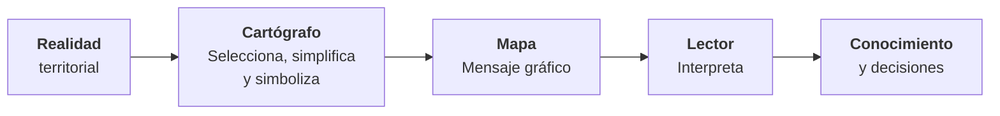
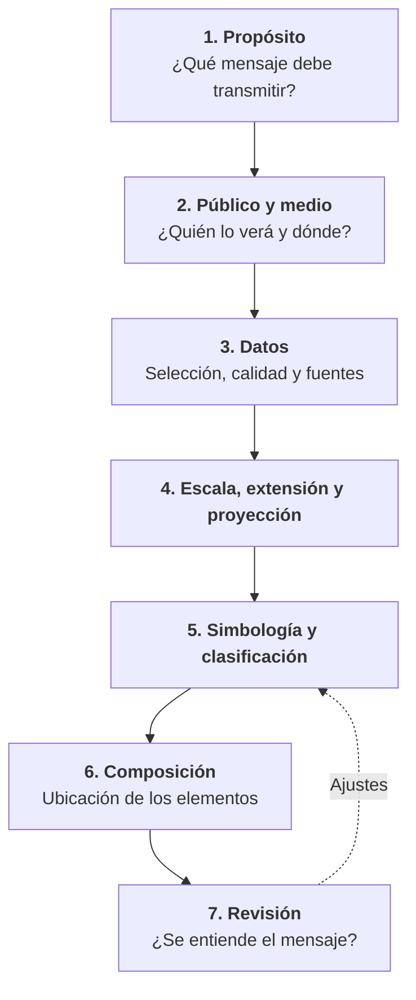

# 1.7 Fundamentos de Cartografía

!!! abstract "Objetivos de aprendizaje"

    Al finalizar este tema, el estudiante será capaz de:

    - Explicar qué es la cartografía y por qué no se limita a "hacer mapas".
    - Comprender el mapa como un modelo del territorio y como un lenguaje gráfico.
    - Diferenciar la cartografía topográfica, la de referencia y la temática.
    - Identificar los elementos que componen un mapa y su función.
    - Aplicar las variables visuales para simbolizar distintos tipos de datos.
    - Utilizar la jerarquía visual y los principios de diseño para construir mapas claros.

---

## ¿Qué es la cartografía?

Hasta ahora nos hemos ocupado de **cómo medir y ubicar** el territorio: geodesia, sistemas de referencia y proyecciones. A partir de este tema nos preguntamos **cómo representarlo y comunicarlo**.

!!! info "Definición"

    La **cartografía** es la disciplina que integra el **arte, la ciencia y la técnica** de elaborar y utilizar mapas.

    Un **mapa** es una representación simbólica de la realidad geográfica, que muestra **elementos seleccionados** y es resultado de las **decisiones de su autor**, diseñada para usarse cuando las **relaciones espaciales** son lo más importante.

Estas definiciones, basadas en las propuestas por la Asociación Cartográfica Internacional (ICA), contienen tres ideas fundamentales:

| Idea | Qué significa |
|---|---|
| **Arte, ciencia y técnica** | Un buen mapa requiere rigor técnico (datos, proyección, escala) y también criterio estético y comunicativo. |
| **Elementos seleccionados** | Un mapa nunca muestra todo: siempre elige qué incluir y qué omitir. |
| **Decisiones del autor** | Dos cartógrafos con los mismos datos pueden producir mapas muy distintos. |

!!! quote "La idea central del tema"

    **Un mapa es una representación selectiva y deliberadamente simplificada de la realidad.**

### La cartografía no es solo "hacer mapas"

Con un SIG, cualquier persona puede generar un mapa en pocos minutos. Pero **producir un mapa no es lo mismo que hacer cartografía**. La cartografía implica responder preguntas antes de abrir el software:

- ¿**Para qué** sirve este mapa?
- ¿**Quién** lo va a leer?
- ¿**Qué mensaje** debe transmitir?
- ¿**Dónde** se va a ver: impreso, en pantalla, en una presentación, en un visor web?
- ¿Qué **escala** y qué **nivel de detalle** requiere?

Un mapa técnicamente correcto puede ser un **mal mapa** si no comunica lo que necesita comunicar.

---

## El mapa como modelo del territorio

En el tema 1.2 vimos que todo dato geográfico es resultado de un proceso de **abstracción**. El mapa es la expresión visual de ese proceso.

!!! example "El mapa del tamaño del imperio"

    En su breve relato *Del rigor en la ciencia* (1946), Jorge Luis Borges imagina un imperio cuyos cartógrafos, en busca de la perfección, construyen un mapa **del mismo tamaño que el territorio**, que coincide punto por punto con él. Las generaciones siguientes lo consideran inútil y lo abandonan.

    La paradoja muestra que **un mapa es útil precisamente porque no es igual al territorio**: su valor está en seleccionar, simplificar y organizar.

Todo mapa implica decisiones sobre:

| Decisión | Pregunta | Ejemplo |
|---|---|---|
| **Selección** | ¿Qué se incluye? | Mostrar solo las vías principales y omitir las secundarias |
| **Clasificación** | ¿Cómo se agrupa? | Agrupar 40 tipos de uso de suelo en 6 categorías |
| **Simplificación** | ¿Cuánto detalle se conserva? | Suavizar el contorno de un río |
| **Simbolización** | ¿Cómo se representa visualmente? | Representar las escuelas con un símbolo puntual |
| **Proyección y escala** | ¿Sobre qué superficie y a qué tamaño? | UTM a escala 1:10 000 |

!!! warning "Los mapas también pueden engañar"

    Como todo mapa es resultado de decisiones, también puede **distorsionar** la realidad, por error o de forma intencional: eligiendo una proyección que exagera ciertas áreas, agrupando los datos en clases que ocultan diferencias, o usando colores que sugieren alarma donde no la hay. El geógrafo Mark Monmonier dedicó un libro entero a este tema: *How to Lie with Maps* (*Cómo mentir con mapas*).

    Leer un mapa de forma crítica es tan importante como saber hacerlo.

---

## La cartografía como lenguaje gráfico

Un mapa es un **mensaje**. Como todo lenguaje, tiene un vocabulario (los **símbolos**), una gramática (las **reglas de uso**) y una intención (**lo que se quiere comunicar**).

El proceso funciona si el lector **interpreta el mapa como el cartógrafo pretendía**. Si los símbolos son confusos, la leyenda es ambigua o el tema principal no se distingue, el mensaje se pierde.

### Las variables visuales

En 1967, el cartógrafo francés **Jacques Bertin** publicó *Sémiologie graphique*, donde sistematizó los recursos gráficos disponibles para representar información. Los llamó **variables visuales**.

Además de la **posición** (dónde está el símbolo), Bertin identificó seis variables que se pueden modificar:

<figure class="figura">
<svg viewBox="0 0 720 330" xmlns="http://www.w3.org/2000/svg" role="img" aria-label="Variables visuales de Bertin aplicadas a puntos, líneas y áreas">
<defs>
<pattern id="vv-h0" width="6" height="6" patternUnits="userSpaceOnUse" patternTransform="rotate(0)"><line x1="0" y1="0" x2="0" y2="6" stroke="#3f6fd8" stroke-width="2"/></pattern>
<pattern id="vv-h45" width="6" height="6" patternUnits="userSpaceOnUse" patternTransform="rotate(45)"><line x1="0" y1="0" x2="0" y2="6" stroke="#3f6fd8" stroke-width="2"/></pattern>
<pattern id="vv-h90" width="6" height="6" patternUnits="userSpaceOnUse" patternTransform="rotate(90)"><line x1="0" y1="0" x2="0" y2="6" stroke="#3f6fd8" stroke-width="2"/></pattern>
<pattern id="vv-t0" width="10" height="10" patternUnits="userSpaceOnUse"><circle cx="5.0" cy="5.0" r="1.5" fill="#3f6fd8"/></pattern>
<pattern id="vv-t1" width="7" height="7" patternUnits="userSpaceOnUse"><circle cx="3.5" cy="3.5" r="1.5" fill="#3f6fd8"/></pattern>
<pattern id="vv-t2" width="4" height="4" patternUnits="userSpaceOnUse"><circle cx="2.0" cy="2.0" r="1.5" fill="#3f6fd8"/></pattern>
</defs>
<text x="160.0" y="40" text-anchor="middle" font-size="13" font-weight="bold" fill="currentColor">Tamaño</text>
<text x="260.0" y="40" text-anchor="middle" font-size="13" font-weight="bold" fill="currentColor">Valor</text>
<text x="360.0" y="40" text-anchor="middle" font-size="13" font-weight="bold" fill="currentColor">Tono</text>
<text x="460.0" y="40" text-anchor="middle" font-size="13" font-weight="bold" fill="currentColor">Forma</text>
<text x="560.0" y="40" text-anchor="middle" font-size="13" font-weight="bold" fill="currentColor">Orientación</text>
<text x="660.0" y="40" text-anchor="middle" font-size="13" font-weight="bold" fill="currentColor">Textura</text>
<text x="15" y="109.0" font-size="13" font-weight="bold" fill="currentColor">Punto</text>
<line x1="10" y1="60" x2="710" y2="60" stroke="currentColor" stroke-opacity="0.15"/>
<text x="15" y="197.0" font-size="13" font-weight="bold" fill="currentColor">Línea</text>
<line x1="10" y1="148" x2="710" y2="148" stroke="currentColor" stroke-opacity="0.15"/>
<text x="15" y="285.0" font-size="13" font-weight="bold" fill="currentColor">Área</text>
<line x1="10" y1="236" x2="710" y2="236" stroke="currentColor" stroke-opacity="0.15"/>
<line x1="10" y1="324" x2="710" y2="324" stroke="currentColor" stroke-opacity="0.15"/>
<circle cx="130.0" cy="104.0" r="4" fill="#3f6fd8"/>
<circle cx="160.0" cy="104.0" r="8" fill="#3f6fd8"/>
<circle cx="190.0" cy="104.0" r="12" fill="#3f6fd8"/>
<line x1="120.0" y1="170.0" x2="200.0" y2="170.0" stroke="#3f6fd8" stroke-width="1.5"/>
<line x1="120.0" y1="192.0" x2="200.0" y2="192.0" stroke="#3f6fd8" stroke-width="4"/>
<line x1="120.0" y1="214.0" x2="200.0" y2="214.0" stroke="#3f6fd8" stroke-width="8"/>
<text x="160.0" y="285.0" text-anchor="middle" font-size="14" fill="currentColor" fill-opacity="0.4">—</text>
<circle cx="230.0" cy="104.0" r="9" fill="#c6d4f5" stroke="#3f6fd8" stroke-width="0.8"/>
<circle cx="260.0" cy="104.0" r="9" fill="#7f9fe6" stroke="#3f6fd8" stroke-width="0.8"/>
<circle cx="290.0" cy="104.0" r="9" fill="#2346a8" stroke="#3f6fd8" stroke-width="0.8"/>
<line x1="220.0" y1="170.0" x2="300.0" y2="170.0" stroke="#c6d4f5" stroke-width="5"/>
<line x1="220.0" y1="192.0" x2="300.0" y2="192.0" stroke="#7f9fe6" stroke-width="5"/>
<line x1="220.0" y1="214.0" x2="300.0" y2="214.0" stroke="#2346a8" stroke-width="5"/>
<rect x="217.0" y="267.0" width="26" height="26" fill="#c6d4f5" stroke="#3f6fd8" stroke-width="1"/>
<rect x="247.0" y="267.0" width="26" height="26" fill="#7f9fe6" stroke="#3f6fd8" stroke-width="1"/>
<rect x="277.0" y="267.0" width="26" height="26" fill="#2346a8" stroke="#3f6fd8" stroke-width="1"/>
<circle cx="330.0" cy="104.0" r="9" fill="#3f6fd8"/>
<circle cx="360.0" cy="104.0" r="9" fill="#2e9e5b"/>
<circle cx="390.0" cy="104.0" r="9" fill="#e0823d"/>
<line x1="320.0" y1="170.0" x2="400.0" y2="170.0" stroke="#3f6fd8" stroke-width="5"/>
<line x1="320.0" y1="192.0" x2="400.0" y2="192.0" stroke="#2e9e5b" stroke-width="5"/>
<line x1="320.0" y1="214.0" x2="400.0" y2="214.0" stroke="#e0823d" stroke-width="5"/>
<rect x="317.0" y="267.0" width="26" height="26" fill="#3f6fd8" stroke="#3f6fd8" stroke-width="1"/>
<rect x="347.0" y="267.0" width="26" height="26" fill="#2e9e5b" stroke="#2e9e5b" stroke-width="1"/>
<rect x="377.0" y="267.0" width="26" height="26" fill="#e0823d" stroke="#e0823d" stroke-width="1"/>
<circle cx="430.0" cy="104.0" r="9" fill="#3f6fd8"/>
<rect x="452.0" y="96.0" width="16" height="16" fill="#3f6fd8"/>
<polygon points="490.0,94.0 480.0,112.0 500.0,112.0" fill="#3f6fd8"/>
<line x1="420.0" y1="170.0" x2="500.0" y2="170.0" stroke="#3f6fd8" stroke-width="4" stroke-dasharray="none"/>
<line x1="420.0" y1="192.0" x2="500.0" y2="192.0" stroke="#3f6fd8" stroke-width="4" stroke-dasharray="10 5"/>
<line x1="420.0" y1="214.0" x2="500.0" y2="214.0" stroke="#3f6fd8" stroke-width="4" stroke-dasharray="2 4"/>
<text x="460.0" y="285.0" text-anchor="middle" font-size="14" fill="currentColor" fill-opacity="0.4">—</text>
<rect x="519.0" y="101.0" width="22" height="6" fill="#3f6fd8" transform="rotate(0 530.0 104.0)"/>
<rect x="549.0" y="101.0" width="22" height="6" fill="#3f6fd8" transform="rotate(-45 560.0 104.0)"/>
<rect x="579.0" y="101.0" width="22" height="6" fill="#3f6fd8" transform="rotate(-90 590.0 104.0)"/>
<text x="560.0" y="197.0" text-anchor="middle" font-size="14" fill="currentColor" fill-opacity="0.4">—</text>
<rect x="517.0" y="267.0" width="26" height="26" fill="url(#vv-h0)" stroke="#3f6fd8" stroke-width="1"/>
<rect x="547.0" y="267.0" width="26" height="26" fill="url(#vv-h45)" stroke="#3f6fd8" stroke-width="1"/>
<rect x="577.0" y="267.0" width="26" height="26" fill="url(#vv-h90)" stroke="#3f6fd8" stroke-width="1"/>
<text x="660.0" y="109.0" text-anchor="middle" font-size="14" fill="currentColor" fill-opacity="0.4">—</text>
<text x="660.0" y="197.0" text-anchor="middle" font-size="14" fill="currentColor" fill-opacity="0.4">—</text>
<rect x="617.0" y="267.0" width="26" height="26" fill="url(#vv-t0)" stroke="#3f6fd8" stroke-width="1"/>
<rect x="647.0" y="267.0" width="26" height="26" fill="url(#vv-t1)" stroke="#3f6fd8" stroke-width="1"/>
<rect x="677.0" y="267.0" width="26" height="26" fill="url(#vv-t2)" stroke="#3f6fd8" stroke-width="1"/>
</svg><figcaption>Variables visuales aplicadas a puntos, líneas y áreas. Los guiones indican combinaciones poco habituales o no aplicables.</figcaption>
</figure>

| Variable | Qué cambia | Adecuada para |
|---|---|---|
| **Tamaño** | Dimensión del símbolo o grosor de la línea | **Cantidades** (población, caudal, volumen) |
| **Valor** | Claridad u oscuridad de un mismo color | **Orden** e **intensidad** (densidad, porcentajes) |
| **Tono (color)** | Color propiamente dicho: azul, verde, naranja | **Categorías** (tipos de uso de suelo) |
| **Forma** | Figura del símbolo | **Categorías** (tipos de equipamiento) |
| **Orientación** | Dirección o ángulo del símbolo o de un rayado | **Categorías** o dirección (orientación de laderas) |
| **Textura** | Densidad de un patrón o trama | **Orden** o categorías, sobre todo en impresión en blanco y negro |

!!! tip "La regla más importante de las variables visuales"

    **Cada tipo de dato tiene variables adecuadas.**

    - Datos **cualitativos** (categorías sin orden): usa **tono** o **forma**.
    - Datos **ordinales** (bajo, medio, alto): usa **valor**.
    - Datos **cuantitativos** (cantidades): usa **tamaño**, o **valor** si son tasas o densidades.

    Usar tonos distintos (rojo, verde, azul) para representar cantidades es uno de los errores más comunes: el lector no puede saber intuitivamente si el verde es "más" o "menos" que el azul.

??? info "Para saber más: variables visuales adicionales"

    Otros autores ampliaron la propuesta de Bertin. Alan MacEachren (1995) añadió, entre otras, la **saturación** del color (su intensidad o pureza), la **nitidez** de los bordes, la **resolución** y la **transparencia**. Estas variables son especialmente útiles para representar la **incertidumbre** de los datos: por ejemplo, mostrar con bordes difusos o mayor transparencia las zonas donde los datos son menos confiables.

---

## Tipos de cartografía

Según su propósito y contenido, la cartografía se suele dividir en tres grandes grupos, aunque los límites entre ellos no son estrictos.

=== "Topográfica"

    Representa con **precisión geométrica** los elementos naturales y artificiales del terreno, incluido el **relieve**.

    - Muestra relieve (curvas de nivel), hidrografía, vías, poblados, límites y vegetación.
    - Se elabora a **escalas grandes y medianas**, con normas técnicas estrictas.
    - Suele organizarse en **series** de hojas que cubren un país. En Bolivia, el **Instituto Geográfico Militar (IGM)** produce, entre otras, la serie de cartas topográficas a escala **1:50 000**.
    - Sirve como **base** para la ingeniería, la planificación y la elaboración de otros mapas.

=== "De referencia"

    Muestra la **ubicación** de una variedad de elementos geográficos **sin destacar uno en particular**. Su objetivo es **orientar y localizar**.

    - Mapas político-administrativos, callejeros, atlas generales, mapas de carreteras, mapas base de visores web.
    - Responde a la pregunta: *¿dónde está...?*
    - La cartografía topográfica puede considerarse un tipo especializado de cartografía de referencia.

=== "Temática"

    Representa la **distribución espacial de un tema específico** sobre una base de referencia simplificada.

    - Mapas de población, pobreza, uso de suelo, riesgo, geología, precipitación, cobertura de servicios.
    - Responde a preguntas como: *¿cómo se distribuye...?*, *¿dónde hay más...?*
    - Es el tipo de cartografía que más se produce con un SIG.

| Característica | Topográfica | De referencia | Temática |
|---|---|---|---|
| Propósito | Describir el terreno con precisión | Localizar y orientar | Mostrar un tema |
| Contenido | Muchos elementos, con exactitud | Muchos elementos, sin énfasis | Un tema principal sobre una base |
| Protagonista | El territorio | La ubicación | El fenómeno |
| Ejemplo | Carta topográfica IGM 1:50 000 | Mapa político de Bolivia | Mapa de densidad poblacional por municipio |

### Principales tipos de mapas temáticos

| Tipo | Cómo representa el dato | Uso típico | Precaución |
|---|---|---|---|
| **Coropletas** | Colorea áreas (municipios, distritos) según un valor | Tasas, porcentajes, densidades | **Nunca usar valores absolutos** |
| **Símbolos proporcionales** | Símbolos cuyo tamaño depende del valor | Población total, producción, cantidades absolutas | Evitar superposiciones excesivas |
| **Puntos (densidad de puntos)** | Cada punto representa una cantidad fija | Distribución de población o ganado | Los puntos no son ubicaciones exactas |
| **Isolíneas** | Líneas que unen puntos de igual valor | Relieve, temperatura, precipitación | Requiere un fenómeno continuo |
| **Cualitativos o categóricos** | Colores o tramas por categoría | Uso de suelo, geología, zonificación | Limitar el número de categorías |
| **De flujo** | Líneas cuyo grosor representa movimiento | Migraciones, transporte, comercio | Evitar el exceso de líneas cruzadas |
| **De calor (densidad)** | Superficie continua de concentración | Concentración de delitos o accidentes | Depende mucho del radio elegido |

!!! danger "El error más frecuente en mapas de coropletas"

    Colorear municipios según su **población total** es incorrecto, porque los municipios más grandes tienden a tener más población simplemente por su tamaño, y el color de toda la superficie sugiere una intensidad que no existe.

    En un mapa de coropletas se deben usar **valores relativos**: **densidad** (habitantes por km²), **tasas** o **porcentajes**. Para cantidades absolutas, se usan **símbolos proporcionales**.

---

## Elementos cartográficos

Un mapa terminado no es solo el dibujo del territorio: incluye un conjunto de **elementos** que permiten entenderlo, ubicarlo y evaluar su confiabilidad.

<figure class="figura">
<svg viewBox="0 0 720 500" xmlns="http://www.w3.org/2000/svg" role="img" aria-label="Composición de un mapa con sus elementos cartográficos numerados">
<rect x="15" y="15" width="690" height="470" fill="currentColor" fill-opacity="0.03" stroke="currentColor" stroke-width="1.5"/>
<text x="260" y="48" text-anchor="middle" font-size="17" font-weight="bold" fill="currentColor">ZONAS DE RIESGO DE INUNDACIÓN</text>
<text x="260" y="68" text-anchor="middle" font-size="12" fill="currentColor">Municipio de ejemplo · 2026</text>
<circle cx="60" cy="52" r="11" fill="#9b59b6"/>
<text x="60" y="56.5" text-anchor="middle" font-size="12" font-weight="bold" fill="#ffffff">1</text>
<defs><clipPath id="lay-body"><rect x="45" y="90" width="430" height="360"/></clipPath></defs>
<g clip-path="url(#lay-body)">
<rect x="45" y="90" width="430" height="360" fill="#2e9e5b" fill-opacity="0.08"/>
<path d="M 150 90 C 170 160, 120 220, 190 280 S 300 360, 280 450 L 520 450 L 520 90 Z" fill="currentColor" fill-opacity="0.06"/>
<path d="M 120 90 C 150 170, 110 230, 180 290 C 240 340, 300 370, 290 450 L 350 450 C 360 380, 300 330, 240 290 C 180 250, 210 170, 190 90 Z" fill="#e0823d" fill-opacity="0.35" stroke="#e0823d" stroke-width="1.5"/>
<path d="M 130 90 C 175 170, 125 230, 195 285 C 255 335, 310 370, 310 450" fill="none" stroke="#e0823d" stroke-opacity="0" />
<path d="M 150 90 C 180 170, 140 230, 205 285 C 265 335, 320 375, 318 450" fill="none" stroke="#3f6fd8" stroke-width="4"/>
<path d="M 45 200 L 475 170" fill="none" stroke="currentColor" stroke-opacity="0.55" stroke-width="2.5"/>
<path d="M 45 360 L 250 330 L 475 380" fill="none" stroke="currentColor" stroke-opacity="0.55" stroke-width="2.5"/>
<path d="M 380 90 L 360 250 L 400 450" fill="none" stroke="currentColor" stroke-opacity="0.55" stroke-width="2.5"/>
<path d="M 250 330 L 360 250" fill="none" stroke="currentColor" stroke-opacity="0.55" stroke-width="2.5"/>
<rect x="325" y="185" width="10" height="10" fill="currentColor"/>
<rect x="235" y="375" width="10" height="10" fill="currentColor"/>
<rect x="405" y="315" width="10" height="10" fill="currentColor"/>
</g>
<rect x="45" y="90" width="430" height="360" fill="none" stroke="currentColor" stroke-width="1.5"/>
<circle cx="440" cy="125" r="11" fill="#9b59b6"/>
<text x="440" y="129.5" text-anchor="middle" font-size="12" font-weight="bold" fill="#ffffff">2</text>
<line x1="130" y1="90" x2="130" y2="96" stroke="currentColor"/>
<line x1="130" y1="450" x2="130" y2="444" stroke="currentColor"/>
<text x="130" y="464" text-anchor="middle" font-size="9" fill="currentColor">806 000 E</text>
<line x1="260" y1="90" x2="260" y2="96" stroke="currentColor"/>
<line x1="260" y1="450" x2="260" y2="444" stroke="currentColor"/>
<text x="260" y="464" text-anchor="middle" font-size="9" fill="currentColor">808 000 E</text>
<line x1="390" y1="90" x2="390" y2="96" stroke="currentColor"/>
<line x1="390" y1="450" x2="390" y2="444" stroke="currentColor"/>
<text x="390" y="464" text-anchor="middle" font-size="9" fill="currentColor">810 000 E</text>
<line x1="45" y1="180" x2="51" y2="180" stroke="currentColor"/>
<line x1="45" y1="300" x2="51" y2="300" stroke="currentColor"/>
<line x1="45" y1="420" x2="51" y2="420" stroke="currentColor"/>
<circle cx="30" cy="240" r="11" fill="#9b59b6"/>
<text x="30" y="244.5" text-anchor="middle" font-size="12" font-weight="bold" fill="#ffffff">3</text>
<rect x="495" y="90" width="195" height="105" fill="none" stroke="currentColor" stroke-width="1"/>
<text x="503" y="105" font-size="10" font-weight="bold" fill="currentColor">Ubicación</text>
<path d="M 555.5 156.9 L 555.5 156.9 L 555.5 156.6 L 555.4 156.2 L 555.2 155.9 L 554.8 155.7 L 554.7 155.4 L 554.8 155.1 L 555.6 154.5 L 556.0 154.4 L 556.1 154.1 L 556.3 153.9 L 557.0 153.1 L 557.4 152.5 L 557.8 152.2 L 558.3 151.9 L 558.5 151.7 L 558.4 151.2 L 558.5 150.8 L 558.6 150.5 L 559.1 150.2 L 559.5 150.0 L 559.6 149.9 L 559.6 149.8 L 559.2 149.5 L 558.4 149.2 L 557.8 149.2 L 557.5 149.0 L 557.3 148.8 L 556.2 146.3 L 556.1 145.8 L 556.1 145.5 L 556.8 144.3 L 557.1 143.9 L 557.6 143.3 L 557.5 143.1 L 556.6 142.2 L 556.3 141.7 L 556.4 141.2 L 556.4 140.7 L 557.0 140.4 L 557.1 140.0 L 557.2 139.5 L 557.4 139.4 L 557.7 139.1 L 557.9 138.7 L 558.3 138.4 L 558.6 138.2 L 558.6 137.5 L 558.8 137.3 L 559.4 137.1 L 559.4 137.0 L 559.3 136.5 L 559.0 136.0 L 558.8 135.8 L 558.5 134.6 L 558.2 134.0 L 558.3 133.8 L 558.5 133.5 L 558.8 132.9 L 558.8 132.2 L 558.8 129.7 L 558.8 129.2 L 559.1 128.9 L 559.5 128.5 L 559.8 128.3 L 560.1 128.1 L 560.1 127.6 L 560.3 127.3 L 560.6 127.0 L 559.8 125.6 L 559.0 124.4 L 558.4 123.2 L 557.6 121.9 L 557.1 121.0 L 556.4 119.9 L 555.9 119.0 L 555.1 117.7 L 555.8 117.7 L 557.2 117.7 L 558.6 117.9 L 559.6 118.0 L 560.0 118.2 L 560.1 118.6 L 560.3 118.7 L 560.6 118.7 L 561.0 118.6 L 561.7 118.3 L 562.4 118.1 L 562.9 117.8 L 563.2 117.6 L 563.8 116.7 L 564.4 116.2 L 564.9 116.0 L 565.8 116.0 L 566.1 116.1 L 566.5 116.1 L 566.9 115.6 L 567.4 115.0 L 568.4 114.3 L 568.9 114.1 L 569.2 113.9 L 569.8 113.9 L 570.3 113.6 L 572.6 111.8 L 573.6 111.4 L 574.2 111.3 L 574.7 111.2 L 575.5 111.0 L 577.6 110.7 L 578.9 110.6 L 579.3 110.8 L 579.8 110.8 L 580.2 110.4 L 580.6 110.3 L 580.8 110.3 L 581.2 110.7 L 581.4 111.2 L 581.2 111.6 L 581.3 112.2 L 581.4 112.9 L 581.3 113.5 L 580.8 114.3 L 580.6 114.7 L 580.5 115.0 L 580.6 115.5 L 580.8 116.3 L 581.2 117.3 L 581.3 118.1 L 581.0 118.6 L 580.8 119.1 L 580.9 119.5 L 581.0 119.7 L 581.2 119.9 L 581.3 120.2 L 581.3 120.6 L 581.5 121.0 L 582.0 121.5 L 582.2 121.8 L 582.1 122.2 L 582.1 122.5 L 582.3 122.6 L 582.4 122.5 L 582.6 122.4 L 582.7 122.4 L 583.0 122.9 L 583.1 123.0 L 583.3 123.5 L 583.3 123.8 L 583.8 124.0 L 584.3 124.1 L 584.6 124.3 L 585.2 124.8 L 585.7 125.2 L 586.3 125.5 L 586.5 125.9 L 586.8 126.6 L 587.9 126.9 L 589.0 127.0 L 589.8 127.1 L 590.7 126.8 L 591.3 126.8 L 592.0 127.1 L 592.2 127.2 L 592.7 127.6 L 593.4 128.0 L 594.0 128.2 L 594.5 128.0 L 594.9 127.9 L 595.2 128.0 L 595.3 128.5 L 595.5 128.8 L 595.8 129.0 L 596.6 129.7 L 597.0 129.9 L 597.5 129.9 L 598.5 130.3 L 599.6 130.7 L 600.1 130.8 L 600.6 130.7 L 601.0 130.9 L 601.1 131.4 L 602.1 132.4 L 602.5 132.8 L 603.0 133.1 L 604.3 133.1 L 604.7 133.2 L 605.3 133.1 L 607.1 132.9 L 607.4 132.9 L 608.4 133.3 L 609.6 133.9 L 610.4 134.4 L 610.9 134.7 L 611.2 135.1 L 611.4 135.6 L 611.5 136.0 L 611.4 136.5 L 611.2 136.7 L 611.1 137.0 L 611.2 137.5 L 611.6 137.9 L 611.7 138.4 L 612.0 139.3 L 612.2 139.6 L 612.4 142.5 L 611.6 142.5 L 610.4 142.5 L 610.8 142.8 L 611.7 143.8 L 612.5 144.8 L 612.7 146.3 L 612.8 147.3 L 612.9 148.7 L 613.0 149.5 L 615.1 149.6 L 617.5 149.7 L 620.5 149.8 L 623.0 149.9 L 623.3 149.9 L 623.7 149.7 L 624.0 149.6 L 624.2 149.6 L 624.3 149.9 L 624.2 150.4 L 624.2 150.8 L 623.5 151.8 L 623.4 152.1 L 623.5 153.4 L 623.8 154.4 L 623.9 155.3 L 624.2 155.6 L 625.1 156.1 L 626.4 157.0 L 626.9 157.1 L 627.4 157.0 L 627.6 157.3 L 627.7 157.9 L 628.4 159.6 L 628.9 160.6 L 629.1 161.0 L 629.4 161.2 L 629.4 161.3 L 629.1 161.4 L 629.0 161.5 L 628.6 162.7 L 628.0 164.3 L 627.7 165.3 L 628.0 165.4 L 628.0 165.7 L 628.1 166.1 L 627.7 166.2 L 627.6 166.3 L 627.1 167.2 L 626.5 168.4 L 625.9 169.6 L 625.5 170.3 L 626.2 170.8 L 627.2 171.7 L 627.0 172.0 L 626.6 172.1 L 626.2 172.2 L 625.9 172.5 L 625.8 172.8 L 625.4 172.8 L 625.5 171.8 L 625.4 171.0 L 625.2 170.8 L 623.4 169.7 L 621.8 168.8 L 619.6 167.6 L 616.9 167.6 L 614.0 167.6 L 611.3 168.2 L 608.6 168.7 L 607.3 169.0 L 604.7 169.5 L 603.2 169.7 L 602.8 170.7 L 602.2 172.2 L 601.7 173.0 L 601.0 173.9 L 600.0 175.2 L 600.0 176.8 L 600.0 178.2 L 599.4 180.3 L 598.8 182.1 L 598.2 183.7 L 597.9 184.9 L 597.7 185.2 L 597.6 185.1 L 597.1 184.8 L 596.7 184.1 L 596.6 183.8 L 596.5 183.8 L 593.9 183.8 L 591.4 183.8 L 591.2 184.0 L 590.8 184.0 L 590.5 183.9 L 590.3 183.9 L 589.9 184.0 L 589.6 184.3 L 588.6 186.0 L 588.1 186.8 L 587.8 187.4 L 587.5 188.6 L 587.4 188.8 L 587.1 188.4 L 586.7 187.3 L 586.5 186.7 L 586.2 186.0 L 585.7 185.2 L 585.1 184.9 L 584.8 184.8 L 584.2 184.7 L 583.3 184.5 L 582.9 184.4 L 580.3 184.4 L 580.1 184.4 L 579.0 184.5 L 578.5 184.4 L 578.0 183.9 L 576.8 183.1 L 576.5 182.8 L 576.0 182.7 L 575.8 182.6 L 575.6 182.8 L 575.4 183.5 L 575.1 184.1 L 574.9 184.5 L 574.0 184.8 L 573.2 185.0 L 572.7 185.1 L 572.5 185.4 L 572.4 185.9 L 572.2 186.3 L 571.0 186.9 L 570.8 187.1 L 570.6 187.7 L 570.0 188.4 L 569.8 188.7 L 568.7 188.9 L 567.4 189.2 L 566.6 189.1 L 566.1 189.1 L 565.9 189.0 L 565.5 188.7 L 565.5 188.5 L 565.5 188.2 L 565.6 187.6 L 565.5 186.8 L 565.1 185.8 L 565.1 185.5 L 565.1 185.0 L 564.9 184.2 L 564.3 183.7 L 564.2 183.0 L 564.1 182.3 L 563.7 181.5 L 563.6 180.5 L 563.6 179.6 L 562.9 178.6 L 562.1 177.5 L 561.5 177.4 L 561.4 177.2 L 561.3 176.9 L 561.3 176.5 L 561.3 176.2 L 561.8 175.7 L 561.8 175.6 L 561.7 175.5 L 560.5 174.8 L 560.2 174.6 L 560.1 174.3 L 560.1 174.1 L 560.4 173.9 L 560.6 173.7 L 560.3 173.2 L 560.3 172.7 L 560.1 172.5 L 560.2 172.4 L 560.3 172.3 L 561.1 172.1 L 561.4 171.6 L 561.4 171.3 L 561.2 171.0 L 560.5 170.3 L 560.5 170.2 L 561.3 169.2 L 561.8 168.6 L 562.0 168.5 L 561.9 168.3 L 561.8 168.1 L 561.4 167.9 L 561.0 167.6 L 560.6 167.3 L 560.1 166.8 L 559.5 166.4 L 559.1 166.0 L 558.8 165.7 L 558.8 165.3 L 558.8 164.7 L 558.5 163.8 L 558.4 163.2 L 558.3 162.5 L 558.2 162.0 L 558.1 161.6 L 557.9 161.1 L 557.8 160.7 L 557.9 160.5 L 558.1 160.3 L 558.1 160.2 L 556.9 159.7 L 556.7 159.5 L 556.5 158.5 L 555.6 157.6 L 555.5 156.9 Z" fill="currentColor" fill-opacity="0.12" stroke="currentColor" stroke-width="1"/>
<rect x="572.5" y="152.28467153284672" width="8" height="8" fill="none" stroke="#d63b3b" stroke-width="2"/>
<circle cx="676" cy="104" r="11" fill="#9b59b6"/>
<text x="676" y="108.5" text-anchor="middle" font-size="12" font-weight="bold" fill="#ffffff">4</text>
<rect x="495" y="205" width="195" height="120" fill="none" stroke="currentColor" stroke-width="1"/>
<text x="503" y="221" font-size="11" font-weight="bold" fill="currentColor">Leyenda</text>
<rect x="507" y="233" width="20" height="12" fill="#e0823d" fill-opacity="0.35" stroke="#e0823d"/>
<text x="537" y="243" font-size="11" fill="currentColor">Zona de riesgo alto</text>
<line x1="507" y1="257" x2="527" y2="257" stroke="#3f6fd8" stroke-width="4"/>
<text x="537" y="261" font-size="11" fill="currentColor">Río</text>
<line x1="507" y1="275" x2="527" y2="275" stroke="currentColor" stroke-opacity="0.55" stroke-width="2.5"/>
<text x="537" y="279" font-size="11" fill="currentColor">Vía principal</text>
<rect x="512" y="288" width="10" height="10" fill="currentColor"/>
<text x="537" y="297" font-size="11" fill="currentColor">Unidad educativa</text>
<rect x="507" y="305" width="20" height="12" fill="#2e9e5b" fill-opacity="0.15"/>
<text x="537" y="315" font-size="11" fill="currentColor">Área verde</text>
<circle cx="676" cy="219" r="11" fill="#9b59b6"/>
<text x="676" y="223.5" text-anchor="middle" font-size="12" font-weight="bold" fill="#ffffff">5</text>
<rect x="495" y="335" width="195" height="56" fill="none" stroke="currentColor" stroke-width="1"/>
<rect x="507.0" y="355" width="16.25" height="6" fill="currentColor" stroke="currentColor" stroke-width="1"/>
<rect x="523.25" y="355" width="16.25" height="6" fill="none" stroke="currentColor" stroke-width="1"/>
<rect x="539.5" y="355" width="16.25" height="6" fill="currentColor" stroke="currentColor" stroke-width="1"/>
<rect x="555.75" y="355" width="16.25" height="6" fill="none" stroke="currentColor" stroke-width="1"/>
<text x="507.0" y="375" text-anchor="middle" font-size="9" fill="currentColor">0</text>
<text x="539.5" y="375" text-anchor="middle" font-size="9" fill="currentColor">0,5</text>
<text x="572.0" y="375" text-anchor="middle" font-size="9" fill="currentColor">1 km</text>
<text x="547" y="387" text-anchor="middle" font-size="10" fill="currentColor">Escala 1:50 000</text>
<circle cx="602" cy="358" r="11" fill="#9b59b6"/>
<text x="602" y="362.5" text-anchor="middle" font-size="12" font-weight="bold" fill="#ffffff">6</text>
<polygon points="655,351 646,383 655,376 664,383" fill="currentColor"/>
<text x="655" y="347" text-anchor="middle" font-size="11" font-weight="bold" fill="currentColor">N</text>
<circle cx="681" cy="353" r="11" fill="#9b59b6"/>
<text x="681" y="357.5" text-anchor="middle" font-size="12" font-weight="bold" fill="#ffffff">7</text>
<rect x="495" y="401" width="195" height="72" fill="none" stroke="currentColor" stroke-width="1"/>
<text x="503" y="418" font-size="10" fill="currentColor">SRC: WGS 84 / UTM zona 19S</text>
<text x="503" y="434" font-size="10" fill="currentColor">Fuente: datos de ejemplo</text>
<text x="503" y="450" font-size="10" fill="currentColor">Elaboró: Nombre del autor</text>
<text x="503" y="466" font-size="10" fill="currentColor">Fecha: septiembre de 2026</text>
<circle cx="676" cy="415" r="11" fill="#9b59b6"/>
<text x="676" y="419.5" text-anchor="middle" font-size="12" font-weight="bold" fill="#ffffff">8</text>
</svg><figcaption>Composición de un mapa con sus principales elementos. Datos ficticios.</figcaption>
</figure>

| N.º | Elemento | Función | ¿Obligatorio? |
|---|---|---|---|
| 1 | **Título** | Indica **qué**, **dónde** y, si corresponde, **cuándo** | Sí |
| 2 | **Cuerpo del mapa** | Contiene la representación del territorio; es el elemento principal | Sí |
| 3 | **Cuadrícula o coordenadas** | Permite ubicar posiciones y relacionar el mapa con un sistema de referencia | En mapas técnicos |
| 4 | **Mapa de ubicación** | Sitúa el área representada dentro de un contexto mayor | Recomendado |
| 5 | **Leyenda** | Explica el significado de los símbolos | Sí, salvo símbolos evidentes |
| 6 | **Escala** | Indica la relación entre las distancias del mapa y las reales | Sí |
| 7 | **Orientación (norte)** | Indica la dirección del norte | Sí, en mapas técnicos |
| 8 | **Información complementaria** | Sistema de referencia, fuente de datos, autor, fecha, institución | Sí |

### Recomendaciones para cada elemento

??? note "Título"

    - Debe responder: **¿qué muestra?**, **¿dónde?** y, si el dato cambia en el tiempo, **¿cuándo?**
    - Evita títulos genéricos como "Mapa" o "Mapa temático".
    - ✗ *Mapa del municipio* → ✓ *Densidad de población por distrito, municipio de ejemplo, 2024*.

??? note "Leyenda"

    - Incluye **solo** los símbolos que aparecen en el mapa.
    - Usa **términos comprensibles**, no nombres de archivos ni de campos (✗ `uso_suelo_v3`, ✓ *Uso de suelo*).
    - Ordena los elementos de forma lógica: del más importante al menos importante, o de menor a mayor valor.
    - No es necesario escribir la palabra "Leyenda" si el recuadro es evidente.

??? note "Escala"

    - La **escala gráfica** (barra) sigue siendo válida aunque el mapa se amplíe o se reduzca; la numérica, no.
    - En mapas digitales o que se van a imprimir en distintos tamaños, prioriza la **escala gráfica**.
    - Usa valores redondos: 0, 500, 1 000 m, no 0, 437, 874 m.
    - Veremos la escala en detalle en el tema **1.8**.

??? note "Orientación"

    - En la mayoría de los mapas, el **norte está arriba**.
    - La flecha del norte debe ser **discreta**: no es un elemento decorativo ni debe competir con el tema.
    - Si el mapa está rotado, la indicación del norte es imprescindible.

??? note "Información complementaria"

    - **Sistema de referencia:** por ejemplo, *WGS 84 / UTM zona 19S* (tema 1.4).
    - **Fuente de los datos:** institución y año. Sin fuente, el mapa no es verificable.
    - **Autor e institución**, **fecha de elaboración** y, si corresponde, notas sobre limitaciones de los datos.

---

## Simbología

La **simbología** es el conjunto de símbolos que representan los elementos del mapa. Un símbolo combina una **geometría** con una o más **variables visuales**.

### Tipos de símbolos

| Tipo | Representa | Ejemplos | Variables más usadas |
|---|---|---|---|
| **Puntuales** | Elementos localizados en un punto | Escuelas, pozos, centros de salud | Forma, tono, tamaño |
| **Lineales** | Elementos con longitud | Ríos, vías, redes de agua, límites | Grosor, tono, patrón de trazo |
| **De área** | Elementos con superficie | Predios, uso de suelo, distritos | Tono, valor, trama |
| **Textuales** | Nombres y etiquetas | Nombres de ríos, ciudades, calles | Tamaño, estilo, color de la fuente |

### Convenciones cartográficas

Algunas asociaciones entre color y significado están tan difundidas que **contradecirlas confunde al lector**:

| Elemento | Convención |
|---|---|
| Agua (ríos, lagos, mar) | **Azul** |
| Vegetación, bosques, áreas verdes | **Verde** |
| Relieve y curvas de nivel | **Marrón** o sepia |
| Vías principales | **Rojo**, naranja o negro |
| Áreas urbanas, construcciones | **Gris**, negro o rosado |
| Temperatura alta, riesgo, peligro | **Rojo** y naranja |
| Nombres de elementos hidrográficos | Texto en **azul** y en *cursiva* |

### Esquemas de color

Según el tipo de dato, se usan tres tipos de esquemas de color:

=== "Secuencial"

    Un solo tono que va de **claro a oscuro**. Representa datos ordenados de **menor a mayor**.

    

      

      

      

      

      

    

    *Ejemplos: densidad de población, porcentaje de cobertura de agua potable.*

=== "Divergente"

    Dos tonos que se alejan desde un **valor central** (claro) hacia dos extremos (oscuros).

    

      

      

      

      

      

    

    *Ejemplos: variación de la población (crecimiento o disminución), diferencia respecto al promedio.*

=== "Cualitativo"

    Tonos **distintos entre sí**, con claridad similar, sin sugerir orden.

    

      

      

      

      

      

    

    *Ejemplos: uso de suelo, tipos de equipamiento, unidades geológicas.*

!!! tip "ColorBrewer"

    La cartógrafa Cynthia Brewer desarrolló **ColorBrewer**, un conjunto de esquemas de color diseñados específicamente para mapas, que indica cuáles son aptos para impresión, fotocopias y personas con daltonismo. Muchos de ellos vienen **incluidos en QGIS** como rampas de color.

!!! warning "Piensa en quienes no distinguen todos los colores"

    Aproximadamente el **8 % de los hombres** y el **0,5 % de las mujeres** tienen algún tipo de deficiencia en la visión del color, la más común entre el rojo y el verde. Evita que la información dependa **solo** de distinguir rojo de verde, y combina el color con otras variables (valor, forma, etiquetas).

---

## Jerarquía visual

No todos los elementos de un mapa tienen la misma importancia. La **jerarquía visual** es la organización de los elementos para que el ojo del lector perciba **primero lo más importante** y después lo secundario.

<figure class="figura">
<svg viewBox="0 0 720 330" xmlns="http://www.w3.org/2000/svg" role="img" aria-label="Comparación de un mapa sin jerarquía visual y un mapa con jerarquía visual">
<g transform="translate(0,0)">
<defs><clipPath id="jer-0"><rect x="10" y="20" width="330" height="250"/></clipPath></defs>
<g clip-path="url(#jer-0)">
<path d="M 10 20 L 170 20 L 140 140 L 10 170 Z" fill="#1fbf2f" fill-opacity="0.85" stroke="#000" stroke-width="2"/>
<path d="M 170 20 L 340 20 L 340 150 L 210 170 L 140 140 Z" fill="#f2d000" fill-opacity="0.85" stroke="#000" stroke-width="2"/>
<path d="M 10 170 L 140 140 L 210 170 L 340 150 L 340 270 L 10 270 Z" fill="#c040c0" fill-opacity="0.8" stroke="#000" stroke-width="2"/>
<path d="M 60 20 C 90 90, 70 150, 140 190 C 200 225, 250 240, 260 270 L 320 270 C 300 220, 240 190, 180 160 C 120 130, 130 80, 120 20 Z" fill="#ff3b3b" fill-opacity="0.9" stroke="#000" stroke-width="3"/>
<path d="M 90 20 C 115 95, 95 150, 160 180 C 220 210, 275 235, 292 270" fill="none" stroke="#0020ff" stroke-width="6"/>
<path d="M 10 110 L 340 80" fill="none" stroke="#000" stroke-width="6"/>
<path d="M 10 230 L 180 205 L 340 245" fill="none" stroke="#000" stroke-width="6"/>
<path d="M 250 20 L 230 140 L 270 270" fill="none" stroke="#000" stroke-width="6"/>
<rect x="192" y="112" width="16" height="16" fill="#00e5ff" stroke="#000" stroke-width="2"/>
<rect x="102" y="207" width="16" height="16" fill="#00e5ff" stroke="#000" stroke-width="2"/>
<rect x="292" y="182" width="16" height="16" fill="#00e5ff" stroke="#000" stroke-width="2"/>
<text x="60" y="60" text-anchor="middle" font-size="15" font-weight="bold" fill="#000">RÍO</text>
<text x="250" y="60" text-anchor="middle" font-size="15" font-weight="bold" fill="#000">ZONA NORTE</text>
<text x="80" y="255" text-anchor="middle" font-size="15" font-weight="bold" fill="#000">ZONA SUR</text>
<text x="290" y="120" text-anchor="middle" font-size="15" font-weight="bold" fill="#000">VÍA</text>
</g>
<rect x="10" y="20" width="330" height="250" fill="none" stroke="currentColor" stroke-width="1.5"/>
<text x="175" y="298" text-anchor="middle" font-size="15" font-weight="bold" fill="currentColor">Sin jerarquía visual</text>
<text x="175" y="317" text-anchor="middle" font-size="12" fill="currentColor">Todo compite por la atención</text>
</g>
<g transform="translate(370,0)">
<defs><clipPath id="jer-1"><rect x="10" y="20" width="330" height="250"/></clipPath></defs>
<g clip-path="url(#jer-1)">
<path d="M 10 20 L 170 20 L 140 140 L 10 170 Z" fill="#8a8a8a" fill-opacity="0.1" stroke="none" stroke-width="2"/>
<path d="M 170 20 L 340 20 L 340 150 L 210 170 L 140 140 Z" fill="#8a8a8a" fill-opacity="0.18" stroke="none" stroke-width="2"/>
<path d="M 10 170 L 140 140 L 210 170 L 340 150 L 340 270 L 10 270 Z" fill="#8a8a8a" fill-opacity="0.05" stroke="none" stroke-width="2"/>
<path d="M 60 20 C 90 90, 70 150, 140 190 C 200 225, 250 240, 260 270 L 320 270 C 300 220, 240 190, 180 160 C 120 130, 130 80, 120 20 Z" fill="#e0823d" fill-opacity="0.75" stroke="#b85c14" stroke-width="2"/>
<path d="M 90 20 C 115 95, 95 150, 160 180 C 220 210, 275 235, 292 270" fill="none" stroke="#7fa8e8" stroke-width="3"/>
<path d="M 10 110 L 340 80" fill="none" stroke="#9a9a9a" stroke-width="2"/>
<path d="M 10 230 L 180 205 L 340 245" fill="none" stroke="#9a9a9a" stroke-width="2"/>
<path d="M 250 20 L 230 140 L 270 270" fill="none" stroke="#9a9a9a" stroke-width="2"/>
<circle cx="200" cy="120" r="6" fill="#222" stroke="#fff" stroke-width="2"/>
<circle cx="110" cy="215" r="6" fill="#222" stroke="#fff" stroke-width="2"/>
<circle cx="300" cy="190" r="6" fill="#222" stroke="#fff" stroke-width="2"/>
<text x="40" y="60" text-anchor="middle" font-size="11" fill="#666" font-style="italic">Río</text>
</g>
<rect x="10" y="20" width="330" height="250" fill="none" stroke="currentColor" stroke-width="1.5"/>
<text x="175" y="298" text-anchor="middle" font-size="15" font-weight="bold" fill="currentColor">Con jerarquía visual</text>
<text x="175" y="317" text-anchor="middle" font-size="12" fill="currentColor">El tema resalta; la base acompaña</text>
</g>
</svg><figcaption>Los mismos datos con dos simbologías. En la derecha, la zona de riesgo es claramente el tema principal.</figcaption>
</figure>

### Niveles de jerarquía

| Nivel | Contenido | Tratamiento visual |
|---|---|---|
| **1. Tema principal** | Lo que el mapa quiere comunicar | Mayor contraste, colores saturados, bordes definidos |
| **2. Información de apoyo** | Elementos que ayudan a interpretar el tema | Contraste intermedio |
| **3. Base de referencia** | Vías, límites, hidrografía, relieve | Colores suaves, líneas finas, grises |
| **4. Elementos del mapa** | Leyenda, escala, norte, fuente | Discretos, ordenados, sin competir con el cuerpo del mapa |

### Recursos para construir jerarquía

- **Contraste:** lo importante se diferencia con fuerza del fondo; lo secundario, poco.
- **Saturación del color:** colores intensos para el tema; apagados o grises para la base.
- **Tamaño y grosor:** símbolos y líneas más grandes para lo principal.
- **Figura y fondo:** el tema debe "saltar" sobre el fondo, que acompaña sin llamar la atención.
- **Orden de dibujo:** en general, áreas abajo, líneas encima y puntos y etiquetas arriba.
- **Tipografía:** el título y los nombres principales, más grandes; el resto, más pequeños y ligeros.

!!! tip "La prueba de los ojos entrecerrados"

    Aléjate de la pantalla o entrecierra los ojos mirando tu mapa. **Lo primero que distingas debería ser el tema principal.** Si lo que ves primero es la red vial, el marco o la flecha del norte, la jerarquía está mal construida.

---

## Generalización cartográfica

Al representar el territorio a una escala menor, no es posible mantener todo el detalle: los elementos se superponen, las líneas se vuelven ilegibles y los símbolos se amontonan. La **generalización** es el proceso de **adaptar el contenido del mapa a su escala y propósito** mediante operaciones como seleccionar, simplificar, agregar, desplazar o exagerar elementos.

Es un tema tan importante que le dedicaremos el tema **1.10** completo.

---

## Diseño cartográfico

El **diseño cartográfico** es el proceso de planificar y construir un mapa para que cumpla su propósito de la forma más clara y eficaz posible.

### El proceso de diseño

### Principios de diseño

| Principio | Qué significa | Cómo aplicarlo |
|---|---|---|
| **Claridad** | El mensaje se entiende sin esfuerzo | Un tema principal por mapa; eliminar lo innecesario |
| **Legibilidad** | Todo se puede leer y distinguir | Textos de tamaño suficiente, contraste adecuado, símbolos diferenciables |
| **Jerarquía** | Lo importante se ve primero | Contraste y tamaño según importancia |
| **Equilibrio** | La composición se ve ordenada | Distribuir los elementos sin dejar zonas vacías o saturadas |
| **Simplicidad** | Menos es más | Evitar efectos, sombras, marcos y decoraciones innecesarias |
| **Coherencia** | Lo similar se ve similar | Mismos estilos en una serie de mapas |
| **Honestidad** | El mapa no distorsiona | Clasificación, proyección y colores que no exageren ni oculten |

### Tipografía en los mapas

- Usa **una o dos familias tipográficas** como máximo.
- Las fuentes **sin serifa** suelen leerse mejor en pantalla; las **con serifa** funcionan bien en impresión y para rasgos naturales.
- Varía el **tamaño** según la importancia: capital de departamento más grande que un poblado.
- Escribe los nombres de **áreas extensas** en mayúsculas espaciadas, y los de **ríos** en cursiva, siguiendo su curso.
- En mapas impresos, evita textos menores a **7 u 8 puntos**.
- Coloca las etiquetas de modo que **no tapen** elementos importantes y queden claramente asociadas al objeto que nombran.

### Errores comunes

| Error | Consecuencia | Solución |
|---|---|---|
| Coropletas con valores absolutos | Interpretación distorsionada | Usar densidades, tasas o porcentajes |
| Demasiadas clases (más de 7) | El ojo no distingue los colores | Usar entre 4 y 7 clases |
| Rampa arcoíris para datos ordenados | No se percibe el orden | Usar un esquema secuencial |
| Leyenda con nombres de campos o archivos | El lector no entiende | Usar términos claros |
| Mapa sin fuente ni fecha | No es verificable | Incluir siempre la información complementaria |
| Flecha del norte o marco exagerados | Distraen del tema | Elementos discretos |
| Todo con colores intensos | No hay jerarquía | Base en tonos suaves, tema resaltado |
| Rojo y verde como única diferencia | Ilegible para personas con daltonismo | Combinar color con valor o forma |

!!! note "Del concepto al software"

    En QGIS, la simbología se configura en las **propiedades de cada capa**, y la composición final del mapa, con título, leyenda, escala y demás elementos, se realiza en el **diseñador de impresión**. Lo practicaremos más adelante en el curso, aplicando los principios de este tema.

---

## Ideas clave

!!! success "Para recordar"

    - La cartografía integra **arte, ciencia y técnica**. Producir un mapa no es lo mismo que hacer cartografía.
    - **Un mapa es una representación selectiva y deliberadamente simplificada de la realidad**, resultado de decisiones de su autor.
    - El mapa es un **lenguaje gráfico** que se construye con **variables visuales**: tamaño, valor, tono, forma, orientación y textura.
    - Cada tipo de dato requiere variables adecuadas: **tono y forma** para categorías, **valor** para orden, **tamaño** para cantidades.
    - La cartografía puede ser **topográfica**, **de referencia** o **temática**.
    - Un mapa completo incluye **título, cuerpo, leyenda, escala, orientación, sistema de referencia, fuente, autor y fecha**.
    - La **jerarquía visual** hace que el tema principal se perciba primero.
    - El **diseño cartográfico** empieza por el propósito y el público, no por el software.

---

## Autoevaluación

??? question "1. ¿Por qué se dice que un mapa es una representación selectiva?"

    Porque **nunca muestra toda la realidad**: su autor decide qué elementos incluir, cuáles omitir, cómo clasificarlos y cómo representarlos, según el propósito y la escala del mapa.

??? question "2. ¿Qué variable visual usarías para representar cada dato?"

    - Tipo de establecimiento de salud (hospital, centro de salud, puesto de salud) → **Forma** o **tono** (dato cualitativo).
    - Nivel de riesgo (bajo, medio, alto) → **Valor** (dato ordinal).
    - Población total de cada capital municipal → **Tamaño** (dato cuantitativo absoluto).
    - Porcentaje de hogares con alcantarillado por distrito → **Valor** en un esquema secuencial (tasa).

??? question "3. Un compañero hizo un mapa de coropletas con la cantidad total de habitantes por municipio. ¿Qué le recomendarías?"

    Que no use valores absolutos en un mapa de coropletas. Puede **calcular la densidad** (habitantes por km²) y mantener las coropletas, o representar la **población total con símbolos proporcionales**.

??? question "4. ¿En qué se diferencia un mapa temático de uno de referencia?"

    El mapa de **referencia** muestra la ubicación de muchos elementos **sin destacar ninguno**, con el fin de localizar y orientar. El mapa **temático** muestra la **distribución de un tema específico** sobre una base simplificada, que queda en segundo plano.

??? question "5. En un mapa de zonas de riesgo, lo primero que se ve es la red vial en negro grueso. ¿Qué problema tiene y cómo lo resolverías?"

    Tiene un problema de **jerarquía visual**: un elemento de la base de referencia compite con el tema principal. Se resuelve representando las vías con **líneas más finas y en gris**, y dando a las zonas de riesgo **mayor contraste y saturación**.

??? question "6. ¿Qué elementos le faltan a un mapa que solo tiene el cuerpo del mapa, una leyenda y una flecha del norte?"

    Le faltan el **título**, la **escala**, el **sistema de referencia**, la **fuente de los datos**, el **autor** y la **fecha**. Según el caso, también sería recomendable un **mapa de ubicación** y una **cuadrícula de coordenadas**.

---

## Actividad propuesta

!!! example "Actividad 1.7 — Diseñar el mapa del proyecto integrador (sin software)"

    Retoma el problema territorial de las actividades anteriores y planifica el **mapa principal** de tu proyecto:

    1. **Propósito:** escribe en una sola frase el mensaje que debe transmitir el mapa.
    2. **Público y medio:** ¿quién lo va a leer? ¿Será impreso, en pantalla o en una presentación?
    3. **Tipo de mapa:** ¿topográfico, de referencia o temático? Si es temático, ¿de qué tipo (coropletas, símbolos proporcionales, categórico...)?
    4. **Datos y variables visuales:** para cada capa, indica si es punto, línea o área, qué tipo de dato representa y qué variable visual usarás.
    5. **Jerarquía:** clasifica tus capas en tema principal, información de apoyo y base de referencia.
    6. **Boceto:** dibuja a mano la composición del mapa, ubicando título, cuerpo, leyenda, escala, norte, mapa de ubicación e información complementaria.
    7. **Título:** redacta un título que responda qué, dónde y cuándo.

    Además, busca un mapa publicado (en un informe, un periódico o un sitio web institucional) y **evalúalo** con los principios de este tema.

---

## Referencias

- Bertin, J. (1967). *Sémiologie graphique: Les diagrammes, les réseaux, les cartes*. Gauthier-Villars.
- Brewer, C. A. (2005). *Designing Better Maps: A Guide for GIS Users*. ESRI Press.
- Dent, B. D., Torguson, J. S., & Hodler, T. W. (2009). *Cartography: Thematic Map Design* (6.ª ed.). McGraw-Hill.
- International Cartographic Association (ICA). <https://icaci.org>
- Kraak, M.-J., & Ormeling, F. (2020). *Cartography: Visualization of Geospatial Data* (4.ª ed.). CRC Press.
- MacEachren, A. M. (1995). *How Maps Work: Representation, Visualization, and Design*. Guilford Press.
- Monmonier, M. (1991). *How to Lie with Maps*. University of Chicago Press.
- Olaya, V. (2020). *Sistemas de Información Geográfica*. Libro libre disponible en línea.
- Slocum, T. A., McMaster, R. B., Kessler, F. C., & Howard, H. H. (2009). *Thematic Cartography and Geovisualization* (3.ª ed.). Pearson Prentice Hall.
