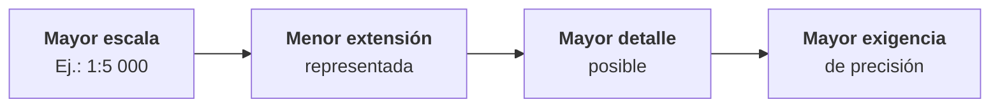

# 1.8 Escala cartográfica

!!! abstract "Objetivos de aprendizaje"

    Al finalizar este tema, el estudiante será capaz de:

    - Definir qué es la escala cartográfica y expresarla en forma numérica, verbal y gráfica.
    - Calcular distancias reales, distancias en el mapa y escalas desconocidas.
    - Calcular superficies a partir de un mapa, considerando que el área no varía de forma lineal.
    - Diferenciar escalas grandes y escalas pequeñas sin confundirlas.
    - Relacionar la escala con la extensión, el nivel de detalle y la precisión gráfica.
    - Comprender qué significa la escala en un entorno SIG digital.

---

## ¿Qué es la escala?

Todo mapa representa el territorio **reducido**. La escala indica **cuánto** se redujo.

!!! info "Definición"

    La **escala cartográfica** es la relación entre una **distancia medida en el mapa** y la **distancia correspondiente en la realidad**, ambas expresadas en la **misma unidad**.

```text
Escala = distancia en el mapa / distancia real
```

Normalmente se expresa como una fracción con numerador 1:

```text
1 : D     o     1 / D
```

donde **D** es el **denominador de la escala**: el número de veces que la realidad fue reducida.

!!! example "Leer una escala"

    Una escala **1:50 000** significa que:

    - **1 unidad** en el mapa representa **50 000 unidades** iguales en la realidad.
    - 1 cm en el mapa representa 50 000 cm en el terreno, es decir, **500 m**.
    - 1 mm en el mapa representa 50 000 mm, es decir, **50 m**.

    La escala **no tiene unidades**: la relación es la misma en centímetros, milímetros o pulgadas.

!!! note "La escala nominal y la proyección"

    Como vimos en el tema 1.5, toda proyección introduce deformaciones, por lo que la escala **no es exactamente igual en todo el mapa**. La escala indicada es la **escala nominal**. En mapas de áreas pequeñas, la diferencia es despreciable; en mapas de continentes o del mundo, puede ser muy grande.

---

## Formas de expresar la escala

<div class="grid cards" markdown>

-   :material-numeric:{ .lg .middle } **Numérica**

    ---

    Expresada como fracción o razón.

    `1:50 000` o `1/50 000`

-   :material-format-quote-open:{ .lg .middle } **Verbal**

    ---

    Expresada con palabras y unidades.

    *"1 centímetro representa 500 metros"*

-   :material-ruler:{ .lg .middle } **Gráfica**

    ---

    Expresada con una barra dividida en tramos que representan distancias reales.

</div>

### Escala numérica

Es la forma **más precisa y universal**. Permite hacer cálculos directamente y no depende de ningún idioma ni sistema de unidades.

Su gran limitación es que **deja de ser válida si el mapa cambia de tamaño**.

### Escala verbal

Es la forma **más intuitiva** para el público general, porque traduce la escala a unidades cotidianas.

- *1 cm = 500 m*
- *1 cm representa 5 km*

Tiene la misma limitación que la numérica: si el mapa se amplía o reduce, la frase deja de ser cierta.

### Escala gráfica

Es una **barra graduada** dibujada en el mapa, en la que cada tramo representa una distancia real.

<figure class="figura">
<svg viewBox="0 0 720 150" xmlns="http://www.w3.org/2000/svg" role="img" aria-label="Partes de una escala gráfica: talón y divisiones principales">
<rect x="80" y="55" width="20" height="12" fill="currentColor" stroke="currentColor" stroke-width="1.2"/>
<rect x="100" y="55" width="20" height="12" fill="none" stroke="currentColor" stroke-width="1.2"/>
<rect x="120" y="55" width="20" height="12" fill="currentColor" stroke="currentColor" stroke-width="1.2"/>
<rect x="140" y="55" width="20" height="12" fill="none" stroke="currentColor" stroke-width="1.2"/>
<rect x="160" y="55" width="20" height="12" fill="currentColor" stroke="currentColor" stroke-width="1.2"/>
<rect x="180" y="55" width="100" height="12" fill="none" stroke="currentColor" stroke-width="1.2"/>
<rect x="280" y="55" width="100" height="12" fill="currentColor" stroke="currentColor" stroke-width="1.2"/>
<rect x="380" y="55" width="100" height="12" fill="none" stroke="currentColor" stroke-width="1.2"/>
<rect x="480" y="55" width="100" height="12" fill="currentColor" stroke="currentColor" stroke-width="1.2"/>
<text x="80" y="45" text-anchor="middle" font-size="13" fill="currentColor">500</text>
<text x="180" y="45" text-anchor="middle" font-size="13" font-weight="bold" fill="currentColor">0</text>
<text x="280" y="45" text-anchor="middle" font-size="13" fill="currentColor">500</text>
<text x="380" y="45" text-anchor="middle" font-size="13" fill="currentColor">1 000</text>
<text x="480" y="45" text-anchor="middle" font-size="13" fill="currentColor">1 500</text>
<text x="580" y="45" text-anchor="middle" font-size="13" fill="currentColor">2 000</text>
<text x="600" y="66" font-size="13" fill="currentColor">metros</text>
<line x1="80" y1="82" x2="180" y2="82" stroke="#e0823d" stroke-width="2"/>
<line x1="80" y1="76" x2="80" y2="88" stroke="#e0823d" stroke-width="2"/>
<line x1="180" y1="76" x2="180" y2="88" stroke="#e0823d" stroke-width="2"/>
<text x="130" y="105" text-anchor="middle" font-size="13" font-weight="bold" fill="#e0823d">Talón</text>
<text x="130" y="123" text-anchor="middle" font-size="11" fill="currentColor">Subdivisiones para</text>
<text x="130" y="138" text-anchor="middle" font-size="11" fill="currentColor">medir con más detalle</text>
<line x1="180" y1="82" x2="580" y2="82" stroke="#3f6fd8" stroke-width="2"/>
<line x1="580" y1="76" x2="580" y2="88" stroke="#3f6fd8" stroke-width="2"/>
<text x="380" y="105" text-anchor="middle" font-size="13" font-weight="bold" fill="#3f6fd8">Divisiones principales</text>
<text x="380" y="123" text-anchor="middle" font-size="11" fill="currentColor">Cada tramo representa 500 m sobre el terreno</text>
</svg>
<figcaption>Partes de una escala gráfica.</figcaption>
</figure>

- Las **divisiones principales** comienzan en **0** y avanzan con valores redondos.
- El **talón**, a la izquierda del 0, se subdivide para medir distancias con más detalle.
- Se usa **midiendo** una distancia en el mapa (con una regla, un compás o un papel) y **comparándola** con la barra.

!!! tip "La gran ventaja de la escala gráfica"

    La escala gráfica **se amplía o reduce junto con el mapa**. Si un mapa se fotocopia reducido, se proyecta en una pantalla o se muestra en un celular, la barra **sigue siendo correcta**, mientras que la escala numérica ya no.

    Por eso, en mapas digitales o que pueden reproducirse en distintos tamaños, **la escala gráfica es imprescindible**.

### Comparación

| Forma | Ejemplo | Ventajas | Limitaciones |
|---|---|---|---|
| **Numérica** | 1:50 000 | Precisa, universal, permite cálculos | Deja de ser válida si el mapa cambia de tamaño |
| **Verbal** | 1 cm = 500 m | Intuitiva y fácil de entender | Depende del idioma; deja de ser válida si el mapa cambia de tamaño |
| **Gráfica** | Barra graduada | Sigue siendo válida al ampliar o reducir | Menos precisa para hacer cálculos |

!!! warning "El mapa fotocopiado"

    Un mapa impreso a escala **1:50 000** se fotocopia **reducido al 50 %**. Ahora, 1 cm del mapa fotocopiado representa **1 km**, no 500 m: su escala real es **1:100 000**. Sin embargo, el texto sigue diciendo "1:50 000".

    Quien use la escala numérica cometerá un error del **doble**. Quien use la escala gráfica medirá correctamente.

---

## Cálculos con la escala

Todos los cálculos con escala se basan en una misma relación, que puede despejarse de tres formas:

| Para calcular... | Fórmula |
|---|---|
| La **distancia real** | `distancia real = distancia en el mapa × D` |
| La **distancia en el mapa** | `distancia en el mapa = distancia real / D` |
| El **denominador de la escala** | `D = distancia real / distancia en el mapa` |

!!! danger "La regla de oro"

    **Antes de calcular, convierte ambas distancias a la misma unidad.** La mayoría de los errores con escalas se deben a mezclar centímetros, metros y kilómetros.

### Equivalencias útiles

| Unidad | Equivale a |
|---|---|
| 1 km | 1 000 m = 100 000 cm = 1 000 000 mm |
| 1 m | 100 cm = 1 000 mm |

Un atajo muy práctico: **en una escala 1:D, 1 cm del mapa representa D / 100 metros**.

| Escala | 1 mm representa | 1 cm representa |
|---|---|---|
| 1:1 000 | 1 m | 10 m |
| 1:5 000 | 5 m | 50 m |
| 1:10 000 | 10 m | 100 m |
| 1:25 000 | 25 m | 250 m |
| 1:50 000 | 50 m | 500 m |
| 1:100 000 | 100 m | 1 km |
| 1:250 000 | 250 m | 2,5 km |
| 1:1 000 000 | 1 km | 10 km |

### Calcular una distancia real

!!! example "Ejemplo 1"

    En una carta topográfica a escala **1:25 000**, la distancia entre dos puentes mide **8,4 cm**. ¿Cuál es la distancia real?

    ```text
    distancia real = 8,4 cm × 25 000
                   = 210 000 cm
                   = 2 100 m
                   = 2,1 km
    ```

### Calcular una distancia en el mapa

!!! example "Ejemplo 2"

    Una vía de **3,5 km** debe dibujarse en un mapa a escala **1:50 000**. ¿Cuánto medirá en el mapa?

    ```text
    3,5 km = 350 000 cm

    distancia en el mapa = 350 000 cm / 50 000
                         = 7 cm
    ```

### Calcular la escala

!!! example "Ejemplo 3"

    Dos poblados separados por **12 km** en la realidad aparecen a **24 cm** de distancia en un mapa sin escala. ¿Cuál es la escala del mapa?

    ```text
    12 km = 1 200 000 cm

    D = 1 200 000 cm / 24 cm
      = 50 000
    ```

    La escala es **1:50 000**.

### Calcular superficies

Al trabajar con áreas hay que tener en cuenta que **la escala se aplica a cada dimensión**. Si las longitudes se reducen D veces, las superficies se reducen **D² veces**.

```text
superficie real = superficie en el mapa × D²
```

!!! example "Ejemplo 4"

    Un predio rectangular mide **2 cm × 3 cm** en un plano a escala **1:10 000**. ¿Cuál es su superficie real?

    **Método 1: convertir primero las longitudes**

    ```text
    2 cm × 10 000 = 20 000 cm = 200 m
    3 cm × 10 000 = 30 000 cm = 300 m

    superficie = 200 m × 300 m = 60 000 m² = 6 ha
    ```

    **Método 2: aplicar D² al área**

    ```text
    superficie en el mapa = 2 cm × 3 cm = 6 cm²
    superficie real = 6 cm² × 10 000² = 600 000 000 cm² = 60 000 m² = 6 ha
    ```

!!! warning "Error frecuente con las áreas"

    Multiplicar el área del mapa **solo por D** (y no por D²) produce un resultado **D veces menor** que el real. En el ejemplo anterior, se obtendrían 6 m² en lugar de 60 000 m².

    Recuerda también que **1 cm² a escala 1:50 000 representa 25 ha**, no 500 m².

---

## Escala grande y escala pequeña

Esta es, probablemente, la confusión más común en cartografía.

!!! danger "La idea que hay que fijar"

    **1:5 000 es una escala mayor que 1:1 000 000.**

    Porque representa una **menor extensión** del territorio con **mayor detalle**.

La clave está en recordar que **la escala es una fracción**:

```text
1 / 5 000      = 0,0002
1 / 1 000 000  = 0,000001
```

**0,0002 es mayor que 0,000001**. Por lo tanto, 1:5 000 es una escala **mayor**.

Dicho de otra forma: **cuanto más grande es el denominador, más pequeña es la escala**.

<figure class="figura">
<svg viewBox="0 0 720 345" xmlns="http://www.w3.org/2000/svg" role="img" aria-label="Un mismo lugar representado a escalas 1:500 000, 1:50 000 y 1:5 000">
<defs><clipPath id="esc-p1"><rect x="20" y="30" width="200" height="200"/></clipPath></defs>
<g clip-path="url(#esc-p1)">
<rect x="20" y="30" width="200" height="200" fill="#2e9e5b" fill-opacity="0.08"/>
<path d="M 20 70 C 80 90, 100 160, 160 170 S 210 220, 220 230" fill="none" stroke="#3f6fd8" stroke-width="2"/>
<line x1="120" y1="130" x2="20" y2="130" stroke="currentColor" stroke-opacity="0.6" stroke-width="1.5"/>
<line x1="120" y1="130" x2="220" y2="130" stroke="currentColor" stroke-opacity="0.6" stroke-width="1.5"/>
<line x1="120" y1="130" x2="140" y2="30" stroke="currentColor" stroke-opacity="0.6" stroke-width="1.5"/>
<line x1="120" y1="130" x2="80" y2="230" stroke="currentColor" stroke-opacity="0.6" stroke-width="1.5"/>
<polygon points="138.6,130.0 135.4,136.4 135.7,145.7 126.0,144.6 120.0,150.9 112.7,147.6 108.9,141.1 101.0,137.9 104.6,130.0 101.7,122.4 108.9,118.9 113.9,115.2 120.0,110.3 129.2,107.7 131.6,118.4 136.1,123.3" fill="currentColor" fill-opacity="0.35"/>
<circle cx="50" cy="180" r="3.5" fill="currentColor" fill-opacity="0.6"/>
<circle cx="190" cy="100" r="3.5" fill="currentColor" fill-opacity="0.6"/>
<circle cx="145" cy="52" r="3.5" fill="currentColor" fill-opacity="0.6"/>
<circle cx="90" cy="215" r="3.5" fill="currentColor" fill-opacity="0.6"/>
<circle cx="180" cy="195" r="3.5" fill="currentColor" fill-opacity="0.6"/>
</g>
<rect x="20" y="30" width="200" height="200" fill="none" stroke="currentColor" stroke-width="1.5"/>
<rect x="110" y="120" width="20" height="20" fill="none" stroke="#e0823d" stroke-width="2.5"/>
<defs><clipPath id="esc-p2"><rect x="260" y="30" width="200" height="200"/></clipPath></defs>
<g clip-path="url(#esc-p2)">
<rect x="260" y="30" width="200" height="200" fill="#2e9e5b" fill-opacity="0.08"/>
<rect x="268.5" y="89.5" width="13" height="13" fill="currentColor" fill-opacity="0.3"/>
<rect x="268.5" y="106.5" width="13" height="13" fill="currentColor" fill-opacity="0.3"/>
<rect x="268.5" y="157.5" width="13" height="13" fill="currentColor" fill-opacity="0.3"/>
<rect x="285.5" y="72.5" width="13" height="13" fill="currentColor" fill-opacity="0.3"/>
<rect x="285.5" y="89.5" width="13" height="13" fill="currentColor" fill-opacity="0.3"/>
<rect x="285.5" y="106.5" width="13" height="13" fill="currentColor" fill-opacity="0.3"/>
<rect x="285.5" y="123.5" width="13" height="13" fill="currentColor" fill-opacity="0.3"/>
<rect x="285.5" y="140.5" width="13" height="13" fill="currentColor" fill-opacity="0.3"/>
<rect x="285.5" y="157.5" width="13" height="13" fill="currentColor" fill-opacity="0.3"/>
<rect x="285.5" y="174.5" width="13" height="13" fill="currentColor" fill-opacity="0.3"/>
<rect x="302.5" y="72.5" width="13" height="13" fill="currentColor" fill-opacity="0.3"/>
<rect x="302.5" y="89.5" width="13" height="13" fill="currentColor" fill-opacity="0.3"/>
<rect x="302.5" y="106.5" width="13" height="13" fill="currentColor" fill-opacity="0.3"/>
<rect x="302.5" y="123.5" width="13" height="13" fill="currentColor" fill-opacity="0.3"/>
<rect x="302.5" y="140.5" width="13" height="13" fill="currentColor" fill-opacity="0.3"/>
<rect x="302.5" y="157.5" width="13" height="13" fill="currentColor" fill-opacity="0.3"/>
<rect x="302.5" y="174.5" width="13" height="13" fill="currentColor" fill-opacity="0.3"/>
<rect x="302.5" y="191.5" width="13" height="13" fill="currentColor" fill-opacity="0.3"/>
<rect x="319.5" y="55.5" width="13" height="13" fill="currentColor" fill-opacity="0.3"/>
<rect x="319.5" y="72.5" width="13" height="13" fill="currentColor" fill-opacity="0.3"/>
<rect x="319.5" y="89.5" width="13" height="13" fill="currentColor" fill-opacity="0.3"/>
<rect x="319.5" y="106.5" width="13" height="13" fill="currentColor" fill-opacity="0.3"/>
<rect x="319.5" y="123.5" width="13" height="13" fill="currentColor" fill-opacity="0.3"/>
<rect x="319.5" y="140.5" width="13" height="13" fill="currentColor" fill-opacity="0.3"/>
<rect x="319.5" y="157.5" width="13" height="13" fill="currentColor" fill-opacity="0.3"/>
<rect x="319.5" y="174.5" width="13" height="13" fill="currentColor" fill-opacity="0.3"/>
<rect x="336.5" y="55.5" width="13" height="13" fill="currentColor" fill-opacity="0.3"/>
<rect x="336.5" y="72.5" width="13" height="13" fill="currentColor" fill-opacity="0.3"/>
<rect x="336.5" y="89.5" width="13" height="13" fill="currentColor" fill-opacity="0.3"/>
<rect x="336.5" y="106.5" width="13" height="13" fill="currentColor" fill-opacity="0.3"/>
<rect x="336.5" y="123.5" width="13" height="13" fill="currentColor" fill-opacity="0.3"/>
<rect x="336.5" y="140.5" width="13" height="13" fill="currentColor" fill-opacity="0.3"/>
<rect x="336.5" y="157.5" width="13" height="13" fill="currentColor" fill-opacity="0.3"/>
<rect x="336.5" y="174.5" width="13" height="13" fill="currentColor" fill-opacity="0.3"/>
<rect x="336.5" y="191.5" width="13" height="13" fill="currentColor" fill-opacity="0.3"/>
<rect x="353.5" y="55.5" width="13" height="13" fill="currentColor" fill-opacity="0.3"/>
<rect x="353.5" y="72.5" width="13" height="13" fill="currentColor" fill-opacity="0.3"/>
<rect x="353.5" y="89.5" width="13" height="13" fill="currentColor" fill-opacity="0.3"/>
<rect x="353.5" y="106.5" width="13" height="13" fill="currentColor" fill-opacity="0.3"/>
<rect x="353.5" y="123.5" width="13" height="13" fill="currentColor" fill-opacity="0.3"/>
<rect x="353.5" y="140.5" width="13" height="13" fill="currentColor" fill-opacity="0.3"/>
<rect x="353.5" y="157.5" width="13" height="13" fill="currentColor" fill-opacity="0.3"/>
<rect x="353.5" y="174.5" width="13" height="13" fill="currentColor" fill-opacity="0.3"/>
<rect x="353.5" y="191.5" width="13" height="13" fill="currentColor" fill-opacity="0.3"/>
<rect x="353.5" y="208.5" width="13" height="13" fill="currentColor" fill-opacity="0.3"/>
<rect x="370.5" y="38.5" width="13" height="13" fill="currentColor" fill-opacity="0.3"/>
<rect x="370.5" y="55.5" width="13" height="13" fill="currentColor" fill-opacity="0.3"/>
<rect x="370.5" y="72.5" width="13" height="13" fill="currentColor" fill-opacity="0.3"/>
<rect x="370.5" y="89.5" width="13" height="13" fill="currentColor" fill-opacity="0.3"/>
<rect x="370.5" y="106.5" width="13" height="13" fill="currentColor" fill-opacity="0.3"/>
<rect x="370.5" y="123.5" width="13" height="13" fill="currentColor" fill-opacity="0.3"/>
<rect x="370.5" y="140.5" width="13" height="13" fill="currentColor" fill-opacity="0.3"/>
<rect x="370.5" y="157.5" width="13" height="13" fill="currentColor" fill-opacity="0.3"/>
<rect x="370.5" y="174.5" width="13" height="13" fill="currentColor" fill-opacity="0.3"/>
<rect x="370.5" y="191.5" width="13" height="13" fill="currentColor" fill-opacity="0.3"/>
<rect x="387.5" y="55.5" width="13" height="13" fill="currentColor" fill-opacity="0.3"/>
<rect x="387.5" y="72.5" width="13" height="13" fill="currentColor" fill-opacity="0.3"/>
<rect x="387.5" y="89.5" width="13" height="13" fill="currentColor" fill-opacity="0.3"/>
<rect x="387.5" y="106.5" width="13" height="13" fill="currentColor" fill-opacity="0.3"/>
<rect x="387.5" y="123.5" width="13" height="13" fill="currentColor" fill-opacity="0.3"/>
<rect x="387.5" y="140.5" width="13" height="13" fill="currentColor" fill-opacity="0.3"/>
<rect x="387.5" y="157.5" width="13" height="13" fill="currentColor" fill-opacity="0.3"/>
<rect x="387.5" y="174.5" width="13" height="13" fill="currentColor" fill-opacity="0.3"/>
<rect x="387.5" y="191.5" width="13" height="13" fill="currentColor" fill-opacity="0.3"/>
<rect x="387.5" y="208.5" width="13" height="13" fill="currentColor" fill-opacity="0.3"/>
<rect x="404.5" y="55.5" width="13" height="13" fill="currentColor" fill-opacity="0.3"/>
<rect x="404.5" y="72.5" width="13" height="13" fill="currentColor" fill-opacity="0.3"/>
<rect x="404.5" y="89.5" width="13" height="13" fill="currentColor" fill-opacity="0.3"/>
<rect x="404.5" y="106.5" width="13" height="13" fill="currentColor" fill-opacity="0.3"/>
<rect x="404.5" y="123.5" width="13" height="13" fill="currentColor" fill-opacity="0.3"/>
<rect x="404.5" y="140.5" width="13" height="13" fill="currentColor" fill-opacity="0.3"/>
<rect x="404.5" y="157.5" width="13" height="13" fill="currentColor" fill-opacity="0.3"/>
<rect x="404.5" y="174.5" width="13" height="13" fill="currentColor" fill-opacity="0.3"/>
<rect x="421.5" y="72.5" width="13" height="13" fill="currentColor" fill-opacity="0.3"/>
<rect x="421.5" y="89.5" width="13" height="13" fill="currentColor" fill-opacity="0.3"/>
<rect x="421.5" y="106.5" width="13" height="13" fill="currentColor" fill-opacity="0.3"/>
<rect x="421.5" y="123.5" width="13" height="13" fill="currentColor" fill-opacity="0.3"/>
<rect x="421.5" y="140.5" width="13" height="13" fill="currentColor" fill-opacity="0.3"/>
<rect x="421.5" y="157.5" width="13" height="13" fill="currentColor" fill-opacity="0.3"/>
<rect x="421.5" y="174.5" width="13" height="13" fill="currentColor" fill-opacity="0.3"/>
<rect x="438.5" y="89.5" width="13" height="13" fill="currentColor" fill-opacity="0.3"/>
<rect x="438.5" y="123.5" width="13" height="13" fill="currentColor" fill-opacity="0.3"/>
<rect x="438.5" y="140.5" width="13" height="13" fill="currentColor" fill-opacity="0.3"/>
<rect x="438.5" y="157.5" width="13" height="13" fill="currentColor" fill-opacity="0.3"/>
<path d="M 410 30 C 420 90, 460 110, 455 170 S 430 230, 440 230" fill="none" stroke="#3f6fd8" stroke-width="5"/>
<line x1="260" y1="138.5" x2="460" y2="138.5" stroke="#e0823d" stroke-opacity="0.85" stroke-width="3"/>
<line x1="300" y1="138.5" x2="290" y2="230" stroke="#e0823d" stroke-opacity="0.85" stroke-width="3"/>
<line x1="418.5" y1="138.5" x2="410" y2="30" stroke="#e0823d" stroke-opacity="0.85" stroke-width="3"/>
</g>
<rect x="260" y="30" width="200" height="200" fill="none" stroke="#e0823d" stroke-width="2.5"/>
<rect x="358.5" y="128.5" width="20" height="20" fill="none" stroke="#9b59b6" stroke-width="2.5"/>
<defs><clipPath id="esc-p3"><rect x="500" y="30" width="200" height="200"/></clipPath></defs>
<g clip-path="url(#esc-p3)">
<rect x="500" y="30" width="200" height="200" fill="currentColor" fill-opacity="0.12"/>
<rect x="460" y="-10" width="120" height="120" fill="currentColor" fill-opacity="0.06" stroke="currentColor" stroke-opacity="0.3"/>
<rect x="464.0" y="-7.0" width="19.7" height="16.2" fill="currentColor" fill-opacity="0.45" stroke="currentColor" stroke-opacity="0.7" stroke-width="0.6"/>
<rect x="485.7" y="-7.0" width="19.5" height="18.0" fill="currentColor" fill-opacity="0.45" stroke="currentColor" stroke-opacity="0.7" stroke-width="0.6"/>
<rect x="507.2" y="-7.0" width="14.9" height="23.9" fill="currentColor" fill-opacity="0.45" stroke="currentColor" stroke-opacity="0.7" stroke-width="0.6"/>
<rect x="524.1" y="-7.0" width="18.3" height="15.6" fill="currentColor" fill-opacity="0.45" stroke="currentColor" stroke-opacity="0.7" stroke-width="0.6"/>
<rect x="544.4" y="-7.0" width="14.3" height="19.2" fill="currentColor" fill-opacity="0.45" stroke="currentColor" stroke-opacity="0.7" stroke-width="0.6"/>
<rect x="560.7" y="-7.0" width="13.4" height="16.0" fill="currentColor" fill-opacity="0.45" stroke="currentColor" stroke-opacity="0.7" stroke-width="0.6"/>
<rect x="562.8" y="21.4" width="14.2" height="14.4" fill="currentColor" fill-opacity="0.45" stroke="currentColor" stroke-opacity="0.7" stroke-width="0.6"/>
<rect x="556.8" y="37.8" width="20.2" height="13.3" fill="currentColor" fill-opacity="0.45" stroke="currentColor" stroke-opacity="0.7" stroke-width="0.6"/>
<rect x="562.4" y="53.1" width="14.6" height="15.1" fill="currentColor" fill-opacity="0.45" stroke="currentColor" stroke-opacity="0.7" stroke-width="0.6"/>
<rect x="464.0" y="92.6" width="12.7" height="14.4" fill="currentColor" fill-opacity="0.45" stroke="currentColor" stroke-opacity="0.7" stroke-width="0.6"/>
<rect x="478.7" y="90.3" width="17.8" height="16.7" fill="currentColor" fill-opacity="0.45" stroke="currentColor" stroke-opacity="0.7" stroke-width="0.6"/>
<rect x="498.4" y="88.8" width="11.3" height="18.2" fill="currentColor" fill-opacity="0.45" stroke="currentColor" stroke-opacity="0.7" stroke-width="0.6"/>
<rect x="511.7" y="84.8" width="19.1" height="22.2" fill="currentColor" fill-opacity="0.45" stroke="currentColor" stroke-opacity="0.7" stroke-width="0.6"/>
<rect x="532.9" y="91.5" width="12.6" height="15.5" fill="currentColor" fill-opacity="0.45" stroke="currentColor" stroke-opacity="0.7" stroke-width="0.6"/>
<rect x="547.4" y="87.3" width="19.2" height="19.7" fill="currentColor" fill-opacity="0.45" stroke="currentColor" stroke-opacity="0.7" stroke-width="0.6"/>
<rect x="463.0" y="25.6" width="14.7" height="14.3" fill="currentColor" fill-opacity="0.45" stroke="currentColor" stroke-opacity="0.7" stroke-width="0.6"/>
<rect x="463.0" y="41.8" width="20.3" height="19.4" fill="currentColor" fill-opacity="0.45" stroke="currentColor" stroke-opacity="0.7" stroke-width="0.6"/>
<rect x="463.0" y="63.2" width="14.8" height="18.0" fill="currentColor" fill-opacity="0.45" stroke="currentColor" stroke-opacity="0.7" stroke-width="0.6"/>
<rect x="620" y="-10" width="120" height="120" fill="currentColor" fill-opacity="0.06" stroke="currentColor" stroke-opacity="0.3"/>
<rect x="624.0" y="-7.0" width="18.6" height="18.5" fill="currentColor" fill-opacity="0.45" stroke="currentColor" stroke-opacity="0.7" stroke-width="0.6"/>
<rect x="644.6" y="-7.0" width="13.4" height="19.5" fill="currentColor" fill-opacity="0.45" stroke="currentColor" stroke-opacity="0.7" stroke-width="0.6"/>
<rect x="660.0" y="-7.0" width="19.3" height="16.7" fill="currentColor" fill-opacity="0.45" stroke="currentColor" stroke-opacity="0.7" stroke-width="0.6"/>
<rect x="681.3" y="-7.0" width="11.3" height="19.3" fill="currentColor" fill-opacity="0.45" stroke="currentColor" stroke-opacity="0.7" stroke-width="0.6"/>
<rect x="694.6" y="-7.0" width="12.4" height="15.1" fill="currentColor" fill-opacity="0.45" stroke="currentColor" stroke-opacity="0.7" stroke-width="0.6"/>
<rect x="709.0" y="-7.0" width="11.6" height="14.5" fill="currentColor" fill-opacity="0.45" stroke="currentColor" stroke-opacity="0.7" stroke-width="0.6"/>
<rect x="722.6" y="-7.0" width="12.0" height="17.1" fill="currentColor" fill-opacity="0.45" stroke="currentColor" stroke-opacity="0.7" stroke-width="0.6"/>
<rect x="719.5" y="23.9" width="17.5" height="11.8" fill="currentColor" fill-opacity="0.45" stroke="currentColor" stroke-opacity="0.7" stroke-width="0.6"/>
<rect x="720.5" y="37.7" width="16.5" height="10.2" fill="currentColor" fill-opacity="0.45" stroke="currentColor" stroke-opacity="0.7" stroke-width="0.6"/>
<rect x="715.7" y="49.9" width="21.3" height="10.2" fill="currentColor" fill-opacity="0.45" stroke="currentColor" stroke-opacity="0.7" stroke-width="0.6"/>
<rect x="721.1" y="62.1" width="15.9" height="15.5" fill="currentColor" fill-opacity="0.45" stroke="currentColor" stroke-opacity="0.7" stroke-width="0.6"/>
<rect x="624.0" y="84.8" width="11.1" height="22.2" fill="currentColor" fill-opacity="0.45" stroke="currentColor" stroke-opacity="0.7" stroke-width="0.6"/>
<rect x="637.1" y="88.0" width="14.3" height="19.0" fill="currentColor" fill-opacity="0.45" stroke="currentColor" stroke-opacity="0.7" stroke-width="0.6"/>
<rect x="653.4" y="89.1" width="18.3" height="17.9" fill="currentColor" fill-opacity="0.45" stroke="currentColor" stroke-opacity="0.7" stroke-width="0.6"/>
<rect x="673.7" y="86.1" width="15.1" height="20.9" fill="currentColor" fill-opacity="0.45" stroke="currentColor" stroke-opacity="0.7" stroke-width="0.6"/>
<rect x="690.8" y="89.6" width="19.8" height="17.4" fill="currentColor" fill-opacity="0.45" stroke="currentColor" stroke-opacity="0.7" stroke-width="0.6"/>
<rect x="712.6" y="85.9" width="18.3" height="21.1" fill="currentColor" fill-opacity="0.45" stroke="currentColor" stroke-opacity="0.7" stroke-width="0.6"/>
<rect x="623.0" y="27.8" width="14.7" height="11.3" fill="currentColor" fill-opacity="0.45" stroke="currentColor" stroke-opacity="0.7" stroke-width="0.6"/>
<rect x="623.0" y="41.1" width="16.6" height="17.4" fill="currentColor" fill-opacity="0.45" stroke="currentColor" stroke-opacity="0.7" stroke-width="0.6"/>
<rect x="623.0" y="60.5" width="14.8" height="11.6" fill="currentColor" fill-opacity="0.45" stroke="currentColor" stroke-opacity="0.7" stroke-width="0.6"/>
<rect x="460" y="150" width="120" height="120" fill="currentColor" fill-opacity="0.06" stroke="currentColor" stroke-opacity="0.3"/>
<rect x="464.0" y="153.0" width="16.7" height="16.8" fill="currentColor" fill-opacity="0.45" stroke="currentColor" stroke-opacity="0.7" stroke-width="0.6"/>
<rect x="482.7" y="153.0" width="12.4" height="16.9" fill="currentColor" fill-opacity="0.45" stroke="currentColor" stroke-opacity="0.7" stroke-width="0.6"/>
<rect x="497.1" y="153.0" width="14.6" height="15.6" fill="currentColor" fill-opacity="0.45" stroke="currentColor" stroke-opacity="0.7" stroke-width="0.6"/>
<rect x="513.7" y="153.0" width="14.5" height="16.6" fill="currentColor" fill-opacity="0.45" stroke="currentColor" stroke-opacity="0.7" stroke-width="0.6"/>
<rect x="530.2" y="153.0" width="19.6" height="23.7" fill="currentColor" fill-opacity="0.45" stroke="currentColor" stroke-opacity="0.7" stroke-width="0.6"/>
<rect x="551.8" y="153.0" width="15.5" height="16.4" fill="currentColor" fill-opacity="0.45" stroke="currentColor" stroke-opacity="0.7" stroke-width="0.6"/>
<rect x="563.0" y="175.7" width="14.0" height="13.6" fill="currentColor" fill-opacity="0.45" stroke="currentColor" stroke-opacity="0.7" stroke-width="0.6"/>
<rect x="558.3" y="191.2" width="18.7" height="13.8" fill="currentColor" fill-opacity="0.45" stroke="currentColor" stroke-opacity="0.7" stroke-width="0.6"/>
<rect x="561.0" y="207.0" width="16.0" height="15.0" fill="currentColor" fill-opacity="0.45" stroke="currentColor" stroke-opacity="0.7" stroke-width="0.6"/>
<rect x="563.0" y="224.1" width="14.0" height="15.0" fill="currentColor" fill-opacity="0.45" stroke="currentColor" stroke-opacity="0.7" stroke-width="0.6"/>
<rect x="464.0" y="252.6" width="14.0" height="14.4" fill="currentColor" fill-opacity="0.45" stroke="currentColor" stroke-opacity="0.7" stroke-width="0.6"/>
<rect x="480.0" y="250.0" width="10.2" height="17.0" fill="currentColor" fill-opacity="0.45" stroke="currentColor" stroke-opacity="0.7" stroke-width="0.6"/>
<rect x="492.2" y="247.1" width="12.3" height="19.9" fill="currentColor" fill-opacity="0.45" stroke="currentColor" stroke-opacity="0.7" stroke-width="0.6"/>
<rect x="506.5" y="245.5" width="15.3" height="21.5" fill="currentColor" fill-opacity="0.45" stroke="currentColor" stroke-opacity="0.7" stroke-width="0.6"/>
<rect x="523.8" y="245.8" width="16.6" height="21.2" fill="currentColor" fill-opacity="0.45" stroke="currentColor" stroke-opacity="0.7" stroke-width="0.6"/>
<rect x="542.4" y="249.1" width="18.8" height="17.9" fill="currentColor" fill-opacity="0.45" stroke="currentColor" stroke-opacity="0.7" stroke-width="0.6"/>
<rect x="563.2" y="243.2" width="13.3" height="23.8" fill="currentColor" fill-opacity="0.45" stroke="currentColor" stroke-opacity="0.7" stroke-width="0.6"/>
<rect x="463.0" y="185.9" width="22.9" height="18.4" fill="currentColor" fill-opacity="0.45" stroke="currentColor" stroke-opacity="0.7" stroke-width="0.6"/>
<rect x="463.0" y="206.3" width="21.3" height="16.3" fill="currentColor" fill-opacity="0.45" stroke="currentColor" stroke-opacity="0.7" stroke-width="0.6"/>
<rect x="463.0" y="224.6" width="15.4" height="18.1" fill="currentColor" fill-opacity="0.45" stroke="currentColor" stroke-opacity="0.7" stroke-width="0.6"/>
<rect x="620" y="150" width="120" height="120" fill="currentColor" fill-opacity="0.06" stroke="currentColor" stroke-opacity="0.3"/>
<rect x="630" y="160" width="100" height="100" fill="#2e9e5b" fill-opacity="0.3"/>
<circle cx="705.5" cy="233.2" r="5" fill="#2e9e5b" fill-opacity="0.8"/>
<circle cx="704.8" cy="216.4" r="5" fill="#2e9e5b" fill-opacity="0.8"/>
<circle cx="709.9" cy="223.9" r="5" fill="#2e9e5b" fill-opacity="0.8"/>
<circle cx="694.7" cy="189.5" r="5" fill="#2e9e5b" fill-opacity="0.8"/>
<circle cx="644.4" cy="182.1" r="5" fill="#2e9e5b" fill-opacity="0.8"/>
<circle cx="669.4" cy="180.0" r="5" fill="#2e9e5b" fill-opacity="0.8"/>
<circle cx="705.5" cy="214.4" r="5" fill="#2e9e5b" fill-opacity="0.8"/>
<circle cx="689.7" cy="219.6" r="5" fill="#2e9e5b" fill-opacity="0.8"/>
<circle cx="693.7" cy="209.2" r="5" fill="#2e9e5b" fill-opacity="0.8"/>
<line x1="500" y1="130" x2="700" y2="130" stroke="#e0823d" stroke-opacity="0.35" stroke-width="34"/>
</g>
<rect x="500" y="30" width="200" height="200" fill="none" stroke="#9b59b6" stroke-width="2.5"/>
<line x1="228" y1="130" x2="248" y2="130" stroke="currentColor" stroke-width="2"/>
<polygon points="256,130 246,124 246,136" fill="currentColor"/>
<line x1="468" y1="130" x2="488" y2="130" stroke="currentColor" stroke-width="2"/>
<polygon points="496,130 486,124 486,136" fill="currentColor"/>
<text x="120" y="258" text-anchor="middle" font-size="16" font-weight="bold" fill="currentColor">1:500 000</text>
<text x="120" y="277" text-anchor="middle" font-size="13" fill="currentColor">Escala pequeña</text>
<text x="120" y="295" text-anchor="middle" font-size="12" fill="currentColor" fill-opacity="0.8">1 cm = 5 km</text>
<text x="360" y="258" text-anchor="middle" font-size="16" font-weight="bold" fill="currentColor">1:50 000</text>
<text x="360" y="277" text-anchor="middle" font-size="13" fill="currentColor">Escala media</text>
<text x="360" y="295" text-anchor="middle" font-size="12" fill="currentColor" fill-opacity="0.8">1 cm = 500 m</text>
<text x="600" y="258" text-anchor="middle" font-size="16" font-weight="bold" fill="currentColor">1:5 000</text>
<text x="600" y="277" text-anchor="middle" font-size="13" fill="currentColor">Escala grande</text>
<text x="600" y="295" text-anchor="middle" font-size="12" fill="currentColor" fill-opacity="0.8">1 cm = 50 m</text>
<line x1="40" y1="318" x2="680" y2="318" stroke="currentColor" stroke-opacity="0.5" stroke-width="1.5"/>
<polygon points="30,318 42,312 42,324" fill="currentColor" fill-opacity="0.5"/>
<polygon points="690,318 678,312 678,324" fill="currentColor" fill-opacity="0.5"/>
<text x="48" y="337" font-size="12" fill="currentColor">Mayor extensión · menor detalle</text>
<text x="672" y="337" text-anchor="end" font-size="12" fill="currentColor">Menor extensión · mayor detalle</text>
</svg><figcaption>Un mismo lugar representado a tres escalas en un recuadro del mismo tamaño. Cada recuadro de color indica la extensión del siguiente. Datos ficticios.</figcaption>
</figure>

| | Escala grande | Escala pequeña |
|---|---|---|
| **Denominador** | Pequeño (1:1 000, 1:5 000) | Grande (1:250 000, 1:1 000 000) |
| **Valor de la fracción** | Mayor | Menor |
| **Extensión representada** | Pequeña | Grande |
| **Nivel de detalle** | Alto | Bajo |
| **Reducción de la realidad** | Poca | Mucha |
| **Ejemplo** | Plano catastral de un barrio | Mapa de Bolivia |

!!! tip "Una forma de recordarlo"

    Piensa en el **tamaño con el que se ven los objetos**. En un plano a escala 1:1 000, una casa se ve **grande**; en un mapa a escala 1:1 000 000, ni siquiera se ve la ciudad completa como algo más que un punto. **Escala grande: objetos grandes. Escala pequeña: objetos pequeños.**

### ¿Cuánto territorio cabe en una hoja?

Una forma muy concreta de entender la escala es calcular qué extensión cubre una hoja **A4 (29,7 × 21 cm)**:

| Escala | Extensión de una hoja A4 | Qué cabe aproximadamente |
|---|---|---|
| 1:1 000 | 297 m × 210 m | Unas pocas manzanas |
| 1:5 000 | 1,5 km × 1,05 km | Un barrio |
| 1:10 000 | 3 km × 2,1 km | Un distrito urbano |
| 1:25 000 | 7,4 km × 5,3 km | Una ciudad pequeña |
| 1:50 000 | 14,9 km × 10,5 km | Una ciudad y sus alrededores |
| 1:100 000 | 29,7 km × 21 km | Un área metropolitana |
| 1:250 000 | 74 km × 53 km | Una región o provincia |
| 1:1 000 000 | 297 km × 210 km | Varias provincias de un departamento |
| 1:7 000 000 | 2 079 km × 1 470 km | Bolivia completa |

### Clasificación de escalas

No existe una clasificación única: los límites varían según la disciplina y el país. Una clasificación orientativa es:

| Tipo | Rango aproximado | Productos típicos |
|---|---|---|
| **Muy grande** | Mayor que 1:5 000 (1:500, 1:1 000, 1:2 000) | Planos de obra, catastro urbano, levantamientos topográficos |
| **Grande** | 1:5 000 a 1:25 000 | Planos urbanos, planificación municipal, catastro rural |
| **Media** | 1:25 000 a 1:250 000 | Cartas topográficas, mapas provinciales y departamentales |
| **Pequeña** | Menor que 1:250 000 | Mapas nacionales, continentales y mundiales |

!!! example "Escalas de uso frecuente en Bolivia"

    - **1:500 a 1:2 000:** proyectos de obra, levantamientos topográficos y catastro urbano.
    - **1:5 000 a 1:10 000:** planos urbanos y planificación territorial municipal.
    - **1:50 000:** serie de cartas topográficas del Instituto Geográfico Militar (IGM), base de numerosos estudios.
    - **1:250 000:** cartografía regional del IGM.
    - **1:1 000 000 y menores:** mapas departamentales y nacionales.

---

## Escala, extensión y detalle

La escala condiciona tres aspectos del mapa que están **estrechamente relacionados**:



A escala grande se **pueden** mostrar más elementos y con más exactitud geométrica, pero eso también **exige** datos más precisos: un error de 10 m pasa inadvertido en un mapa a escala 1:250 000, pero es enorme en un plano a escala 1:1 000.

### La precisión gráfica

El ojo humano, en condiciones normales, no distingue detalles menores a unos **0,2 mm** en un mapa impreso. Ese valor se conoce como **límite de percepción visual** y permite calcular la **precisión gráfica** de una escala: la distancia real más pequeña que se puede representar de forma distinguible.

```text
precisión gráfica = 0,2 mm × D
```

| Escala | Precisión gráfica |
|---|---|
| 1:1 000 | 0,2 m |
| 1:5 000 | 1 m |
| 1:10 000 | 2 m |
| 1:25 000 | 5 m |
| 1:50 000 | 10 m |
| 1:100 000 | 20 m |
| 1:250 000 | 50 m |
| 1:1 000 000 | 200 m |

!!! example "¿Qué significa en la práctica?"

    - En una carta topográfica a escala **1:50 000**, un error de posición menor a **10 m** no se percibe.
    - Por eso, **no tiene sentido** levantar datos con precisión centimétrica para un mapa a escala 1:50 000, **ni es válido** usar datos derivados de una carta 1:50 000 para diseñar una obra a escala 1:500.

    Profundizaremos en la relación entre escala, resolución y precisión en el tema **1.9**.

---

## La escala en un SIG

En la cartografía impresa, la escala es un valor fijo. En un SIG, en cambio, podemos **acercarnos y alejarnos** libremente. Esto cambia el significado de la escala.

### Los datos digitales no tienen una escala fija

Un archivo vectorial o ráster **no tiene escala** en el sentido tradicional: las coordenadas están en metros o grados, y el software puede mostrarlas a cualquier tamaño. Sin embargo, los datos **sí tienen una escala de origen** (o de captura): la escala a la que fueron digitalizados, levantados o para la que fueron diseñados.

| Concepto | Qué es | Ejemplo |
|---|---|---|
| **Escala de visualización** | La escala a la que se está viendo el mapa en pantalla en un momento dado | El usuario se acerca hasta 1:2 000 |
| **Escala de origen o de captura** | La escala para la que los datos fueron elaborados | Ríos digitalizados de una carta 1:250 000 |
| **Escala de salida** | La escala del mapa final impreso o exportado | Mapa impreso en A3 a 1:25 000 |

!!! danger "Acercarse no crea detalle"

    Si una capa de ríos fue digitalizada a partir de un mapa a escala **1:250 000**, acercarse en el SIG hasta **1:5 000** no la vuelve más precisa. Solo muestra **ampliado el error** que ya tenía, que puede ser de **50 m o más**.

    Un SIG permite combinar capas de escalas muy distintas en un mismo mapa, y eso es tan útil como peligroso: **conocer la escala de origen de cada dato es fundamental**.

### La escala en pantalla

El software calcula la escala de visualización a partir del tamaño del mapa en la pantalla y de la **resolución del monitor**. Como cada pantalla es distinta, esa escala es **aproximada**: un mapa que se ve a "1:10 000" en una computadora puede verse a otra escala real en un monitor o un proyector diferente.

- Para **explorar datos**, la escala en pantalla es una referencia útil.
- Para **producir mapas con una escala exacta**, se debe usar la composición de impresión, donde la escala se define respecto al tamaño del papel.

!!! note "Escala en QGIS"

    QGIS muestra la escala de visualización actual en la **barra de estado**, y permite escribir directamente una escala para ir a ella. También permite definir **rangos de escala** en los que una capa es visible, algo muy útil para mostrar u ocultar detalles según el nivel de acercamiento. Lo practicaremos en los módulos siguientes.

---

## Ideas clave

!!! success "Para recordar"

    - La **escala** es la relación entre una distancia en el mapa y la distancia real, en la misma unidad.
    - Puede expresarse en forma **numérica**, **verbal** o **gráfica**. Solo la **gráfica** sigue siendo válida si el mapa cambia de tamaño.
    - En una escala 1:D, **1 cm representa D / 100 metros**.
    - Las superficies se calculan multiplicando por **D²**, no por D.
    - **1:5 000 es una escala mayor que 1:1 000 000**: menor extensión, mayor detalle.
    - La **precisión gráfica** (0,2 mm × D) indica el detalle mínimo que tiene sentido representar a una escala.
    - En un SIG, **acercarse no crea detalle**: la calidad de un dato depende de su escala de origen.

---

## Autoevaluación

??? question "1. ¿Cuál es la escala mayor: 1:10 000 o 1:250 000? ¿Por qué?"

    **1:10 000**, porque la fracción 1/10 000 es mayor que 1/250 000. Representa una **menor extensión** con **mayor detalle**.

??? question "2. En un mapa a escala 1:250 000, ¿qué distancia real representa 1 cm?"

    ```text
    1 cm × 250 000 = 250 000 cm = 2 500 m = 2,5 km
    ```

??? question "3. En una carta 1:50 000 mides 6,3 cm entre dos comunidades. ¿Cuál es la distancia real?"

    ```text
    6,3 cm × 50 000 = 315 000 cm = 3 150 m = 3,15 km
    ```

??? question "4. Una laguna ocupa 4 cm² en un mapa a escala 1:25 000. ¿Cuál es su superficie real en hectáreas?"

    ```text
    superficie real = 4 cm² × 25 000²
                    = 4 × 625 000 000 cm²
                    = 2 500 000 000 cm²
                    = 250 000 m²
                    = 25 ha
    ```

    Otra forma: 1 cm a esa escala son 250 m, así que 1 cm² son 250 m × 250 m = 62 500 m². Por lo tanto, 4 cm² son 250 000 m² = **25 ha**.

??? question "5. Un plano a escala 1:50 000 se imprime ampliado al 200 %. ¿Cuál es su nueva escala real? ¿Qué escala sigue siendo correcta?"

    Al duplicar su tamaño, 1 cm del plano ampliado representa 250 m, por lo que su escala real es **1:25 000**. La escala numérica impresa (1:50 000) ya **no es correcta**; la **escala gráfica** sí, porque también se amplió.

??? question "6. ¿Cuál es la precisión gráfica de una escala 1:25 000? ¿Qué implica?"

    ```text
    0,2 mm × 25 000 = 5 000 mm = 5 m
    ```

    Implica que a esa escala **no se distinguen detalles menores a unos 5 m**, y que los datos usados deberían tener una exactitud acorde a ese valor.

??? question "7. Un compañero descarga una capa de límites digitalizada de un mapa 1:1 000 000 y la usa para definir los linderos de predios en un plano 1:1 000. ¿Qué problema tiene?"

    La capa tiene una **escala de origen** 1:1 000 000, con una precisión gráfica del orden de **200 m**. Usarla a escala 1:1 000, donde la precisión esperada es de unos **20 cm**, produce errores enormes. Acercarse en el SIG no mejora la precisión de los datos.

---

## Actividad propuesta

!!! example "Actividad 1.8 — Trabajar con escalas en el proyecto integrador (sin software)"

    Retoma el área de estudio de las actividades anteriores y desarrolla lo siguiente:

    1. Estima la **extensión** de tu área de estudio (largo y ancho en kilómetros).
    2. Calcula a qué **escala** cabría completa en una hoja **A4** y en una hoja **A3** (42 × 29,7 cm), dejando un margen para los elementos del mapa.
    3. Redondea esa escala a un valor estándar (1:5 000, 1:10 000, 1:25 000, 1:50 000...).
    4. Calcula la **precisión gráfica** de la escala elegida.
    5. Revisa las fuentes de datos de la **Actividad 1.4** e identifica, si es posible, su **escala de origen**. ¿Son adecuadas para la escala de tu mapa?
    6. Si tienes acceso a una **carta topográfica** impresa, mide la distancia entre dos puntos y calcula la distancia real usando la escala numérica y la escala gráfica. Compara los resultados.

---

## Referencias

- Dent, B. D., Torguson, J. S., & Hodler, T. W. (2009). *Cartography: Thematic Map Design* (6.ª ed.). McGraw-Hill.
- Kraak, M.-J., & Ormeling, F. (2020). *Cartography: Visualization of Geospatial Data* (4.ª ed.). CRC Press.
- Olaya, V. (2020). *Sistemas de Información Geográfica*. Libro libre disponible en línea.
- Robinson, A. H., Morrison, J. L., Muehrcke, P. C., Kimerling, A. J., & Guptill, S. C. (1995). *Elements of Cartography* (6.ª ed.). John Wiley & Sons.
