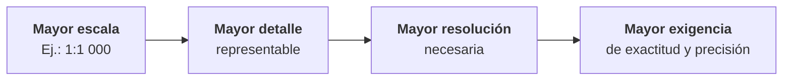

# 1.9 Escala, resolución y precisión

!!! abstract "Objetivos de aprendizaje"

    Al finalizar este tema, el estudiante será capaz de:

    - Diferenciar con claridad escala, resolución, precisión, exactitud y nivel de detalle.
    - Reconocer los distintos tipos de resolución de los datos geográficos.
    - Distinguir entre errores sistemáticos, aleatorios y groseros.
    - Interpretar el error cuadrático medio como medida de exactitud posicional.
    - Identificar la falsa precisión en coordenadas, áreas y distancias.
    - Evaluar si un conjunto de datos es adecuado para una escala y un propósito determinados.

---

## Cinco conceptos que suelen confundirse

Observa esta afirmación:

> *"Levanté el punto con el celular y tengo la coordenada con ocho decimales, así que es muy precisa."*

La coordenada puede tener ocho decimales y, aun así, estar **a cinco metros** de la posición real. Tener muchos decimales no la vuelve correcta, y ni siquiera garantiza que al repetir la medición se obtenga el mismo valor.

En el lenguaje cotidiano, **escala**, **resolución**, **precisión**, **exactitud** y **detalle** se usan casi como sinónimos. En SIG, cada uno describe algo distinto, y confundirlos lleva a usar datos de forma inadecuada.

| Concepto | Pregunta que responde | Se aplica a |
|---|---|---|
| **Escala** | ¿Cuánto se redujo la realidad en el mapa? | Una representación (mapa, plano) |
| **Resolución** | ¿Cuál es el elemento más pequeño que se puede distinguir o representar? | Un dato o un sensor |
| **Precisión** | ¿Qué tan consistentes son las mediciones repetidas? | Un método de medición |
| **Exactitud** | ¿Qué tan cerca está el valor medido del valor real? | Un dato o una medición |
| **Nivel de detalle** | ¿Cuántos elementos y con qué complejidad se representan? | Un dato o un mapa |

---

## Escala

Como vimos en el tema 1.8, la **escala** es la relación entre las distancias del mapa y las distancias reales.

Hay que recordar dos ideas:

- La escala es una propiedad de la **representación**: un mapa impreso tiene escala; un archivo digital, en sentido estricto, no.
- Los datos digitales sí tienen una **escala de origen**, que condiciona su resolución, su exactitud y su nivel de detalle.

---

## Resolución

!!! info "Definición"

    La **resolución** es el **tamaño del elemento más pequeño que se puede distinguir o representar** en un conjunto de datos.

Cuanto **menor** es ese tamaño, **mayor** es la resolución. Una imagen con píxeles de 10 m tiene **mayor resolución** que una con píxeles de 30 m.

### Resolución espacial en datos ráster

En un ráster, la resolución espacial es el **tamaño de la celda o píxel** sobre el terreno. Nada más pequeño que un píxel puede representarse de forma individual.

<figure class="figura">
<svg viewBox="0 0 720 290" xmlns="http://www.w3.org/2000/svg" role="img" aria-label="Los mismos elementos representados en ráster con píxeles de 10, 25 y 50 metros">
<rect x="20" y="30" width="200" height="200" fill="currentColor" fill-opacity="0.04"/>
<path d="M55 150h5v5h-5zM55 155h5v5h-5zM55 160h5v5h-5zM55 165h5v5h-5zM60 130h5v5h-5zM60 135h5v5h-5zM60 140h5v5h-5zM60 145h5v5h-5zM60 150h5v5h-5zM60 155h5v5h-5zM60 160h5v5h-5zM60 165h5v5h-5zM65 125h5v5h-5zM65 130h5v5h-5zM65 135h5v5h-5zM65 140h5v5h-5zM65 145h5v5h-5zM65 150h5v5h-5zM65 155h5v5h-5zM65 160h5v5h-5zM65 165h5v5h-5zM65 170h5v5h-5zM70 120h5v5h-5zM70 125h5v5h-5zM70 130h5v5h-5zM70 135h5v5h-5zM70 140h5v5h-5zM70 145h5v5h-5zM70 150h5v5h-5zM70 155h5v5h-5zM70 160h5v5h-5zM70 165h5v5h-5zM70 170h5v5h-5zM75 115h5v5h-5zM75 120h5v5h-5zM75 125h5v5h-5zM75 130h5v5h-5zM75 135h5v5h-5zM75 140h5v5h-5zM75 145h5v5h-5zM75 150h5v5h-5zM75 155h5v5h-5zM75 160h5v5h-5zM75 165h5v5h-5zM75 170h5v5h-5zM80 110h5v5h-5zM80 115h5v5h-5zM80 120h5v5h-5zM80 125h5v5h-5zM80 130h5v5h-5zM80 135h5v5h-5zM80 140h5v5h-5zM80 145h5v5h-5zM80 150h5v5h-5zM80 155h5v5h-5zM80 160h5v5h-5zM80 165h5v5h-5zM80 170h5v5h-5zM85 105h5v5h-5zM85 110h5v5h-5zM85 115h5v5h-5zM85 120h5v5h-5zM85 125h5v5h-5zM85 130h5v5h-5zM85 135h5v5h-5zM85 140h5v5h-5zM85 145h5v5h-5zM85 150h5v5h-5zM85 155h5v5h-5zM85 160h5v5h-5zM85 165h5v5h-5zM90 100h5v5h-5zM90 105h5v5h-5zM90 110h5v5h-5zM90 115h5v5h-5zM90 120h5v5h-5zM90 125h5v5h-5zM90 130h5v5h-5zM90 135h5v5h-5zM90 140h5v5h-5zM90 145h5v5h-5zM90 150h5v5h-5zM90 155h5v5h-5zM90 160h5v5h-5zM90 165h5v5h-5zM95 95h5v5h-5zM95 100h5v5h-5zM95 105h5v5h-5zM95 110h5v5h-5zM95 115h5v5h-5zM95 120h5v5h-5zM95 125h5v5h-5zM95 130h5v5h-5zM95 135h5v5h-5zM95 140h5v5h-5zM95 145h5v5h-5zM95 150h5v5h-5zM95 155h5v5h-5zM95 160h5v5h-5zM95 165h5v5h-5zM100 95h5v5h-5zM100 100h5v5h-5zM100 105h5v5h-5zM100 110h5v5h-5zM100 115h5v5h-5zM100 120h5v5h-5zM100 125h5v5h-5zM100 130h5v5h-5zM100 135h5v5h-5zM100 140h5v5h-5zM100 145h5v5h-5zM100 150h5v5h-5zM100 155h5v5h-5zM100 160h5v5h-5zM105 90h5v5h-5zM105 95h5v5h-5zM105 100h5v5h-5zM105 105h5v5h-5zM105 110h5v5h-5zM105 115h5v5h-5zM105 120h5v5h-5zM105 125h5v5h-5zM105 130h5v5h-5zM105 135h5v5h-5zM105 140h5v5h-5zM105 145h5v5h-5zM105 150h5v5h-5zM105 155h5v5h-5zM105 160h5v5h-5zM105 165h5v5h-5zM110 90h5v5h-5zM110 95h5v5h-5zM110 100h5v5h-5zM110 105h5v5h-5zM110 110h5v5h-5zM110 115h5v5h-5zM110 120h5v5h-5zM110 125h5v5h-5zM110 130h5v5h-5zM110 135h5v5h-5zM110 140h5v5h-5zM110 145h5v5h-5zM110 150h5v5h-5zM110 155h5v5h-5zM110 160h5v5h-5zM110 165h5v5h-5zM115 95h5v5h-5zM115 100h5v5h-5zM115 105h5v5h-5zM115 110h5v5h-5zM115 115h5v5h-5zM115 120h5v5h-5zM115 125h5v5h-5zM115 130h5v5h-5zM115 135h5v5h-5zM115 140h5v5h-5zM115 145h5v5h-5zM115 150h5v5h-5zM115 155h5v5h-5zM115 160h5v5h-5zM115 165h5v5h-5zM115 170h5v5h-5zM120 100h5v5h-5zM120 105h5v5h-5zM120 110h5v5h-5zM120 115h5v5h-5zM120 120h5v5h-5zM120 125h5v5h-5zM120 130h5v5h-5zM120 135h5v5h-5zM120 140h5v5h-5zM120 145h5v5h-5zM120 150h5v5h-5zM120 155h5v5h-5zM120 160h5v5h-5zM120 165h5v5h-5zM120 170h5v5h-5zM125 110h5v5h-5zM125 115h5v5h-5zM125 120h5v5h-5zM125 125h5v5h-5zM125 130h5v5h-5zM125 135h5v5h-5zM125 140h5v5h-5zM125 145h5v5h-5zM125 150h5v5h-5zM125 155h5v5h-5zM125 160h5v5h-5zM125 165h5v5h-5zM125 170h5v5h-5zM130 120h5v5h-5zM130 125h5v5h-5zM130 130h5v5h-5zM130 135h5v5h-5zM130 140h5v5h-5zM130 145h5v5h-5zM130 150h5v5h-5zM130 155h5v5h-5zM130 160h5v5h-5zM130 165h5v5h-5zM130 170h5v5h-5zM135 120h5v5h-5zM135 125h5v5h-5zM135 130h5v5h-5zM135 135h5v5h-5zM135 140h5v5h-5zM135 145h5v5h-5zM135 150h5v5h-5zM135 155h5v5h-5zM135 160h5v5h-5zM135 165h5v5h-5zM135 170h5v5h-5zM140 115h5v5h-5zM140 120h5v5h-5zM140 125h5v5h-5zM140 130h5v5h-5zM140 135h5v5h-5zM140 140h5v5h-5zM140 145h5v5h-5zM140 150h5v5h-5zM140 155h5v5h-5zM140 160h5v5h-5zM140 165h5v5h-5zM145 110h5v5h-5zM145 115h5v5h-5zM145 130h5v5h-5zM145 135h5v5h-5zM145 140h5v5h-5zM145 145h5v5h-5zM145 150h5v5h-5zM145 155h5v5h-5zM145 160h5v5h-5zM150 105h5v5h-5zM150 110h5v5h-5zM150 135h5v5h-5zM150 140h5v5h-5zM150 145h5v5h-5zM150 150h5v5h-5zM155 100h5v5h-5zM155 105h5v5h-5zM160 80h5v5h-5zM160 85h5v5h-5zM160 90h5v5h-5zM160 95h5v5h-5zM160 100h5v5h-5zM165 45h5v5h-5zM165 50h5v5h-5zM165 55h5v5h-5zM165 60h5v5h-5zM165 65h5v5h-5zM165 70h5v5h-5zM165 75h5v5h-5zM165 80h5v5h-5zM170 30h5v5h-5zM170 35h5v5h-5zM170 40h5v5h-5zM170 45h5v5h-5z" fill="#3f6fd8" fill-opacity="0.75"/>
<path d="M185 180h5v5h-5zM185 185h5v5h-5zM190 180h5v5h-5zM190 185h5v5h-5zM195 180h5v5h-5zM195 185h5v5h-5z" fill="#e0823d" fill-opacity="0.75"/>
<path d="M20 30V230M20 30H220M25 30V230M20 35H220M30 30V230M20 40H220M35 30V230M20 45H220M40 30V230M20 50H220M45 30V230M20 55H220M50 30V230M20 60H220M55 30V230M20 65H220M60 30V230M20 70H220M65 30V230M20 75H220M70 30V230M20 80H220M75 30V230M20 85H220M80 30V230M20 90H220M85 30V230M20 95H220M90 30V230M20 100H220M95 30V230M20 105H220M100 30V230M20 110H220M105 30V230M20 115H220M110 30V230M20 120H220M115 30V230M20 125H220M120 30V230M20 130H220M125 30V230M20 135H220M130 30V230M20 140H220M135 30V230M20 145H220M140 30V230M20 150H220M145 30V230M20 155H220M150 30V230M20 160H220M155 30V230M20 165H220M160 30V230M20 170H220M165 30V230M20 175H220M170 30V230M20 180H220M175 30V230M20 185H220M180 30V230M20 190H220M185 30V230M20 195H220M190 30V230M20 200H220M195 30V230M20 205H220M200 30V230M20 210H220M205 30V230M20 215H220M210 30V230M20 220H220M215 30V230M20 225H220M220 30V230M20 230H220" stroke="currentColor" stroke-opacity="0.12" stroke-width="0.6" fill="none"/>
<polygon points="155.2,140.0 154.9,146.3 153.1,152.5 150.9,158.7 148.2,165.1 143.8,171.1 137.0,175.3 128.1,176.3 118.9,174.2 111.0,170.4 105.0,167.4 99.6,167.3 92.8,170.1 83.6,173.6 73.0,175.3 63.5,173.2 57.5,167.6 55.7,160.1 56.9,152.5 58.9,145.8 60.2,140.0 61.1,134.4 62.7,129.0 66.2,124.2 71.3,120.4 76.7,117.3 81.2,113.8 85.0,108.6 89.5,101.9 96.1,95.3 105.0,91.4 114.4,92.3 122.1,97.8 126.7,105.9 128.8,113.8 130.6,119.5 134.3,123.0 140.4,125.6 147.3,129.0 152.7,134.0" fill="none" stroke="currentColor" stroke-width="1.3" stroke-dasharray="3 2"/>
<polygon points="170.0,30.0 176.0,30.0 165.0,100.0 145.0,125.0 140.0,130.0 136.0,123.0 160.0,97.0" fill="none" stroke="currentColor" stroke-width="1.3" stroke-dasharray="3 2"/>
<polygon points="185.0,180.0 200.0,180.0 200.0,190.0 185.0,190.0" fill="none" stroke="currentColor" stroke-width="1.3" stroke-dasharray="3 2"/>
<rect x="20" y="30" width="200" height="200" fill="none" stroke="currentColor" stroke-width="1.5"/>
<text x="120" y="254" text-anchor="middle" font-size="15" font-weight="bold" fill="currentColor">Píxel de 10 m</text>
<rect x="260" y="30" width="200" height="200" fill="currentColor" fill-opacity="0.04"/>
<path d="M297.5 130h12.5v12.5h-12.5zM297.5 142.5h12.5v12.5h-12.5zM297.5 155h12.5v12.5h-12.5zM310 117.5h12.5v12.5h-12.5zM310 130h12.5v12.5h-12.5zM310 142.5h12.5v12.5h-12.5zM310 155h12.5v12.5h-12.5zM310 167.5h12.5v12.5h-12.5zM322.5 105h12.5v12.5h-12.5zM322.5 117.5h12.5v12.5h-12.5zM322.5 130h12.5v12.5h-12.5zM322.5 142.5h12.5v12.5h-12.5zM322.5 155h12.5v12.5h-12.5zM335 92.5h12.5v12.5h-12.5zM335 105h12.5v12.5h-12.5zM335 117.5h12.5v12.5h-12.5zM335 130h12.5v12.5h-12.5zM335 142.5h12.5v12.5h-12.5zM335 155h12.5v12.5h-12.5zM347.5 92.5h12.5v12.5h-12.5zM347.5 105h12.5v12.5h-12.5zM347.5 117.5h12.5v12.5h-12.5zM347.5 130h12.5v12.5h-12.5zM347.5 142.5h12.5v12.5h-12.5zM347.5 155h12.5v12.5h-12.5zM360 105h12.5v12.5h-12.5zM360 117.5h12.5v12.5h-12.5zM360 130h12.5v12.5h-12.5zM360 142.5h12.5v12.5h-12.5zM360 155h12.5v12.5h-12.5zM360 167.5h12.5v12.5h-12.5zM372.5 117.5h12.5v12.5h-12.5zM372.5 130h12.5v12.5h-12.5zM372.5 142.5h12.5v12.5h-12.5zM372.5 155h12.5v12.5h-12.5zM372.5 167.5h12.5v12.5h-12.5zM385 105h12.5v12.5h-12.5zM385 130h12.5v12.5h-12.5zM385 142.5h12.5v12.5h-12.5zM397.5 67.5h12.5v12.5h-12.5zM397.5 80h12.5v12.5h-12.5zM397.5 92.5h12.5v12.5h-12.5z" fill="#3f6fd8" fill-opacity="0.75"/>
<path d="M422.5 180h12.5v12.5h-12.5z" fill="#e0823d" fill-opacity="0.75"/>
<path d="M260 30V230M260 30H460M272.5 30V230M260 42.5H460M285 30V230M260 55H460M297.5 30V230M260 67.5H460M310 30V230M260 80H460M322.5 30V230M260 92.5H460M335 30V230M260 105H460M347.5 30V230M260 117.5H460M360 30V230M260 130H460M372.5 30V230M260 142.5H460M385 30V230M260 155H460M397.5 30V230M260 167.5H460M410 30V230M260 180H460M422.5 30V230M260 192.5H460M435 30V230M260 205H460M447.5 30V230M260 217.5H460M460 30V230M260 230H460" stroke="currentColor" stroke-opacity="0.12" stroke-width="0.6" fill="none"/>
<polygon points="395.2,140.0 394.9,146.3 393.1,152.5 390.9,158.7 388.2,165.1 383.8,171.1 377.0,175.3 368.1,176.3 358.9,174.2 351.0,170.4 345.0,167.4 339.6,167.3 332.8,170.1 323.6,173.6 313.0,175.3 303.5,173.2 297.5,167.6 295.7,160.1 296.9,152.5 298.9,145.8 300.2,140.0 301.1,134.4 302.7,129.0 306.2,124.2 311.3,120.4 316.7,117.3 321.2,113.8 325.0,108.6 329.5,101.9 336.1,95.3 345.0,91.4 354.4,92.3 362.1,97.8 366.7,105.9 368.8,113.8 370.6,119.5 374.3,123.0 380.4,125.6 387.3,129.0 392.7,134.0" fill="none" stroke="currentColor" stroke-width="1.3" stroke-dasharray="3 2"/>
<polygon points="410.0,30.0 416.0,30.0 405.0,100.0 385.0,125.0 380.0,130.0 376.0,123.0 400.0,97.0" fill="none" stroke="currentColor" stroke-width="1.3" stroke-dasharray="3 2"/>
<polygon points="425.0,180.0 440.0,180.0 440.0,190.0 425.0,190.0" fill="none" stroke="currentColor" stroke-width="1.3" stroke-dasharray="3 2"/>
<rect x="260" y="30" width="200" height="200" fill="none" stroke="currentColor" stroke-width="1.5"/>
<text x="360" y="254" text-anchor="middle" font-size="15" font-weight="bold" fill="currentColor">Píxel de 25 m</text>
<rect x="500" y="30" width="200" height="200" fill="currentColor" fill-opacity="0.04"/>
<path d="M525 155h25v25h-25zM550 105h25v25h-25zM550 130h25v25h-25zM550 155h25v25h-25zM575 80h25v25h-25zM575 105h25v25h-25zM575 130h25v25h-25zM575 155h25v25h-25zM600 130h25v25h-25zM600 155h25v25h-25z" fill="#3f6fd8" fill-opacity="0.75"/>
<path d="M500 30V230M500 30H700M525 30V230M500 55H700M550 30V230M500 80H700M575 30V230M500 105H700M600 30V230M500 130H700M625 30V230M500 155H700M650 30V230M500 180H700M675 30V230M500 205H700M700 30V230M500 230H700" stroke="currentColor" stroke-opacity="0.12" stroke-width="0.6" fill="none"/>
<polygon points="635.2,140.0 634.9,146.3 633.1,152.5 630.9,158.7 628.2,165.1 623.8,171.1 617.0,175.3 608.1,176.3 598.9,174.2 591.0,170.4 585.0,167.4 579.6,167.3 572.8,170.1 563.6,173.6 553.0,175.3 543.5,173.2 537.5,167.6 535.7,160.1 536.9,152.5 538.9,145.8 540.2,140.0 541.1,134.4 542.7,129.0 546.2,124.2 551.3,120.4 556.7,117.3 561.2,113.8 565.0,108.6 569.5,101.9 576.1,95.3 585.0,91.4 594.4,92.3 602.1,97.8 606.7,105.9 608.8,113.8 610.6,119.5 614.3,123.0 620.4,125.6 627.3,129.0 632.7,134.0" fill="none" stroke="currentColor" stroke-width="1.3" stroke-dasharray="3 2"/>
<polygon points="650.0,30.0 656.0,30.0 645.0,100.0 625.0,125.0 620.0,130.0 616.0,123.0 640.0,97.0" fill="none" stroke="currentColor" stroke-width="1.3" stroke-dasharray="3 2"/>
<polygon points="665.0,180.0 680.0,180.0 680.0,190.0 665.0,190.0" fill="none" stroke="currentColor" stroke-width="1.3" stroke-dasharray="3 2"/>
<rect x="500" y="30" width="200" height="200" fill="none" stroke="currentColor" stroke-width="1.5"/>
<text x="600" y="254" text-anchor="middle" font-size="15" font-weight="bold" fill="currentColor">Píxel de 50 m</text>
<text x="120" y="273" text-anchor="middle" font-size="12" fill="currentColor">La casa y el río se reconocen</text>
<text x="360" y="273" text-anchor="middle" font-size="12" fill="currentColor">El río se fragmenta</text>
<text x="600" y="273" text-anchor="middle" font-size="12" fill="currentColor">La casa y el río desaparecen</text>
</svg><figcaption>Un lago, un río angosto y una vivienda representados en ráster con tres resoluciones. La línea discontinua indica la forma real. Datos ficticios.</figcaption>
</figure>

!!! warning "Un píxel no basta para identificar un objeto"

    Que un objeto sea más grande que un píxel **no garantiza** que se pueda reconocer. Para identificar su forma, un objeto debe ocupar **varios píxeles**. Una vivienda de 10 × 10 m apenas ocupa un píxel en una imagen de 10 m: se puede detectar una mancha, pero no reconocer que es una vivienda.

| Fuente | Resolución espacial aproximada | Uso típico |
|---|---|---|
| Ortofoto de dron | 2 a 10 cm | Catastro, obras, levantamientos detallados |
| Imágenes satelitales comerciales de muy alta resolución | 30 cm a 1 m | Planificación urbana, identificación de construcciones |
| Sentinel-2 | 10, 20 y 60 m según la banda | Uso de suelo, vegetación, agricultura, cuerpos de agua |
| Landsat 8 y 9 | 30 m (15 m en la banda pancromática) | Cambios de cobertura a lo largo de décadas |
| Modelos de elevación globales (SRTM, Copernicus DEM) | Unos 30 m | Relieve, cuencas, pendientes a escala regional |

### Otros tipos de resolución

En teledetección se consideran, además, otras tres resoluciones:

| Tipo | Qué mide | Ejemplo |
|---|---|---|
| **Espacial** | Tamaño del píxel sobre el terreno | Sentinel-2: 10 m en sus bandas visibles |
| **Espectral** | Cantidad y amplitud de las bandas del espectro que registra el sensor | Sentinel-2: 13 bandas |
| **Radiométrica** | Cantidad de niveles de intensidad que puede distinguir el sensor | 8 bits = 256 niveles; 12 bits = 4 096 niveles |
| **Temporal** | Frecuencia con la que se obtiene una imagen del mismo lugar | Sentinel-2: aproximadamente cada 5 días |

Estas resoluciones las estudiaremos con más detalle al trabajar con imágenes satelitales.

### Resolución en datos vectoriales

Los datos vectoriales no tienen píxeles, pero **también tienen resolución**, que se manifiesta de otras formas:

- **Distancia entre vértices:** cuántos puntos se usaron para dibujar una línea o un contorno. Un río digitalizado con un vértice cada 200 m no puede representar curvas menores.
- **Unidad mínima cartografiable (UMC):** la superficie más pequeña que se decidió representar como un polígono independiente. Las áreas menores se incorporan a los polígonos vecinos.
- **Elementos omitidos:** los objetos más pequeños que cierto tamaño simplemente no se capturaron.

!!! example "La unidad mínima cartografiable"

    Un criterio frecuente es no delinear polígonos menores a unos **2 × 2 mm en el mapa**. A escala **1:50 000**, eso equivale a 100 × 100 m, es decir, **1 ha**: cualquier parcela de cultivo, bosquete o construcción menor a una hectárea no aparecerá como polígono propio.

    El proyecto europeo **CORINE Land Cover**, elaborado a escala 1:100 000, usa una unidad mínima cartografiable de **25 ha**.

### Relación entre escala y resolución

El geógrafo Waldo Tobler propuso una regla práctica para relacionar la escala de un mapa con la resolución de un ráster:

```text
tamaño de píxel adecuado (m) ≈ denominador de la escala / 2 000
```

| Escala del mapa | Tamaño de píxel adecuado | Ejemplo de fuente |
|---|---|---|
| 1:1 000 | 0,5 m | Ortofoto de dron o de alta resolución |
| 1:5 000 | 2,5 m | Imagen de muy alta resolución |
| 1:10 000 | 5 m | Imagen de alta resolución |
| 1:25 000 | 12,5 m | Sentinel-2 (10 m) |
| 1:50 000 | 25 m | Landsat (30 m), modelos de elevación globales |
| 1:250 000 | 125 m | Productos regionales y globales |

Es una regla **orientativa**, útil para evitar dos errores opuestos: usar imágenes de 30 m para un plano urbano detallado, o procesar imágenes de 10 cm para un mapa nacional.

---

## Precisión y exactitud

Son los dos conceptos más confundidos, incluso en documentos técnicos.

<figure class="figura">
<svg viewBox="0 0 720 230" xmlns="http://www.w3.org/2000/svg" role="img" aria-label="Diferencia entre exactitud y precisión representada con dianas">
<circle cx="95" cy="100" r="70" fill="#e0823d" fill-opacity="0.05" stroke="currentColor" stroke-opacity="0.35" stroke-width="1"/>
<circle cx="95" cy="100" r="52" fill="#e0823d" fill-opacity="0.08" stroke="currentColor" stroke-opacity="0.35" stroke-width="1"/>
<circle cx="95" cy="100" r="34" fill="#e0823d" fill-opacity="0.12" stroke="currentColor" stroke-opacity="0.35" stroke-width="1"/>
<circle cx="95" cy="100" r="16" fill="#e0823d" fill-opacity="0.2" stroke="currentColor" stroke-opacity="0.35" stroke-width="1"/>
<circle cx="95" cy="100" r="3" fill="currentColor"/>
<circle cx="90.1" cy="101.5" r="4.5" fill="#3f6fd8" stroke="#ffffff" stroke-width="1"/>
<circle cx="99.0" cy="97.9" r="4.5" fill="#3f6fd8" stroke="#ffffff" stroke-width="1"/>
<circle cx="89.7" cy="99.7" r="4.5" fill="#3f6fd8" stroke="#ffffff" stroke-width="1"/>
<circle cx="96.9" cy="104.4" r="4.5" fill="#3f6fd8" stroke="#ffffff" stroke-width="1"/>
<circle cx="90.1" cy="94.8" r="4.5" fill="#3f6fd8" stroke="#ffffff" stroke-width="1"/>
<circle cx="97.8" cy="101.9" r="4.5" fill="#3f6fd8" stroke="#ffffff" stroke-width="1"/>
<circle cx="101.1" cy="103.9" r="4.5" fill="#3f6fd8" stroke="#ffffff" stroke-width="1"/>
<text x="95" y="198" text-anchor="middle" font-size="13" font-weight="bold" fill="currentColor">Exacto y preciso</text>
<text x="95" y="216" text-anchor="middle" font-size="11" fill="currentColor">Correcto y consistente</text>
<circle cx="275" cy="100" r="70" fill="#e0823d" fill-opacity="0.05" stroke="currentColor" stroke-opacity="0.35" stroke-width="1"/>
<circle cx="275" cy="100" r="52" fill="#e0823d" fill-opacity="0.08" stroke="currentColor" stroke-opacity="0.35" stroke-width="1"/>
<circle cx="275" cy="100" r="34" fill="#e0823d" fill-opacity="0.12" stroke="currentColor" stroke-opacity="0.35" stroke-width="1"/>
<circle cx="275" cy="100" r="16" fill="#e0823d" fill-opacity="0.2" stroke="currentColor" stroke-opacity="0.35" stroke-width="1"/>
<circle cx="275" cy="100" r="3" fill="currentColor"/>
<circle cx="296.6" cy="78.9" r="4.5" fill="#3f6fd8" stroke="#ffffff" stroke-width="1"/>
<circle cx="307.3" cy="78.8" r="4.5" fill="#3f6fd8" stroke="#ffffff" stroke-width="1"/>
<circle cx="293.9" cy="75.4" r="4.5" fill="#3f6fd8" stroke="#ffffff" stroke-width="1"/>
<circle cx="297.4" cy="80.6" r="4.5" fill="#3f6fd8" stroke="#ffffff" stroke-width="1"/>
<circle cx="295.6" cy="79.8" r="4.5" fill="#3f6fd8" stroke="#ffffff" stroke-width="1"/>
<circle cx="298.1" cy="82.8" r="4.5" fill="#3f6fd8" stroke="#ffffff" stroke-width="1"/>
<circle cx="301.4" cy="80.8" r="4.5" fill="#3f6fd8" stroke="#ffffff" stroke-width="1"/>
<text x="275" y="198" text-anchor="middle" font-size="13" font-weight="bold" fill="currentColor">Preciso, no exacto</text>
<text x="275" y="216" text-anchor="middle" font-size="11" fill="currentColor">Error sistemático (sesgo)</text>
<circle cx="455" cy="100" r="70" fill="#e0823d" fill-opacity="0.05" stroke="currentColor" stroke-opacity="0.35" stroke-width="1"/>
<circle cx="455" cy="100" r="52" fill="#e0823d" fill-opacity="0.08" stroke="currentColor" stroke-opacity="0.35" stroke-width="1"/>
<circle cx="455" cy="100" r="34" fill="#e0823d" fill-opacity="0.12" stroke="currentColor" stroke-opacity="0.35" stroke-width="1"/>
<circle cx="455" cy="100" r="16" fill="#e0823d" fill-opacity="0.2" stroke="currentColor" stroke-opacity="0.35" stroke-width="1"/>
<circle cx="455" cy="100" r="3" fill="currentColor"/>
<circle cx="494.8" cy="98.6" r="4.5" fill="#3f6fd8" stroke="#ffffff" stroke-width="1"/>
<circle cx="476.8" cy="128.0" r="4.5" fill="#3f6fd8" stroke="#ffffff" stroke-width="1"/>
<circle cx="447.0" cy="135.0" r="4.5" fill="#3f6fd8" stroke="#ffffff" stroke-width="1"/>
<circle cx="430.4" cy="112.6" r="4.5" fill="#3f6fd8" stroke="#ffffff" stroke-width="1"/>
<circle cx="423.4" cy="70.7" r="4.5" fill="#3f6fd8" stroke="#ffffff" stroke-width="1"/>
<circle cx="454.3" cy="63.1" r="4.5" fill="#3f6fd8" stroke="#ffffff" stroke-width="1"/>
<circle cx="469.2" cy="77.5" r="4.5" fill="#3f6fd8" stroke="#ffffff" stroke-width="1"/>
<text x="455" y="198" text-anchor="middle" font-size="13" font-weight="bold" fill="currentColor">Exacto, no preciso</text>
<text x="455" y="216" text-anchor="middle" font-size="11" fill="currentColor">Error aleatorio alto</text>
<circle cx="635" cy="100" r="70" fill="#e0823d" fill-opacity="0.05" stroke="currentColor" stroke-opacity="0.35" stroke-width="1"/>
<circle cx="635" cy="100" r="52" fill="#e0823d" fill-opacity="0.08" stroke="currentColor" stroke-opacity="0.35" stroke-width="1"/>
<circle cx="635" cy="100" r="34" fill="#e0823d" fill-opacity="0.12" stroke="currentColor" stroke-opacity="0.35" stroke-width="1"/>
<circle cx="635" cy="100" r="16" fill="#e0823d" fill-opacity="0.2" stroke="currentColor" stroke-opacity="0.35" stroke-width="1"/>
<circle cx="635" cy="100" r="3" fill="currentColor"/>
<circle cx="624.1" cy="121.6" r="4.5" fill="#3f6fd8" stroke="#ffffff" stroke-width="1"/>
<circle cx="617.4" cy="146.0" r="4.5" fill="#3f6fd8" stroke="#ffffff" stroke-width="1"/>
<circle cx="594.5" cy="146.7" r="4.5" fill="#3f6fd8" stroke="#ffffff" stroke-width="1"/>
<circle cx="572.3" cy="129.8" r="4.5" fill="#3f6fd8" stroke="#ffffff" stroke-width="1"/>
<circle cx="583.5" cy="120.8" r="4.5" fill="#3f6fd8" stroke="#ffffff" stroke-width="1"/>
<circle cx="605.6" cy="97.5" r="4.5" fill="#3f6fd8" stroke="#ffffff" stroke-width="1"/>
<circle cx="625.6" cy="109.6" r="4.5" fill="#3f6fd8" stroke="#ffffff" stroke-width="1"/>
<text x="635" y="198" text-anchor="middle" font-size="13" font-weight="bold" fill="currentColor">Ni exacto ni preciso</text>
<text x="635" y="216" text-anchor="middle" font-size="11" fill="currentColor">Sesgo y dispersión</text>
</svg><figcaption>El centro de la diana representa el valor real; los puntos azules, mediciones repetidas.</figcaption>
</figure>

### Exactitud

!!! info "Definición"

    La **exactitud** es el grado de **proximidad** entre el valor medido y el **valor real** (o el valor de referencia aceptado como real).

- Una medición es **exacta** si, en promedio, coincide con el valor real.
- Se evalúa comparando los datos con una **referencia más confiable**: puntos de control levantados con mayor precisión, límites oficiales, mediciones de campo.

### Precisión

!!! info "Definición"

    La **precisión** es el grado de **concordancia entre mediciones repetidas** del mismo objeto, realizadas en las mismas condiciones.

- Una medición es **precisa** si, al repetirla, se obtienen valores **muy parecidos entre sí**.
- La precisión **no dice nada** sobre si esos valores son correctos.

!!! note "Precisión en el lenguaje cotidiano"

    En el uso cotidiano, e incluso en muchos textos de SIG, se habla de "precisión" para referirse al **grado de detalle** de un valor, por ejemplo, la cantidad de decimales de una coordenada. En metrología, en cambio, la precisión se refiere a la **consistencia de mediciones repetidas**, y la exactitud, a la **cercanía con el valor real**.

    En este curso usaremos las definiciones de la metrología, porque son las que permiten evaluar correctamente la calidad de los datos. Al grado de detalle numérico lo llamaremos **resolución numérica**.

### Un ejemplo con el datum

Recuerda el caso del tema 1.4: un levantamiento **en PSAD56** tratado como si estuviera **en WGS 84**.

- Si el levantamiento se hizo con buenos equipos, los puntos son **muy precisos**: están bien ubicados unos respecto a otros.
- Pero **todos** están desplazados unos 400 m en la misma dirección: los datos son **inexactos**.

Es exactamente la segunda diana: **preciso, pero no exacto**. El error no se reduce repitiendo la medición, porque su causa es sistemática.

### Tipos de error

| Tipo de error | Características | Ejemplos | ¿Cómo se trata? |
|---|---|---|---|
| **Sistemático** | Afecta a todas las mediciones en la **misma dirección y magnitud**. Produce falta de exactitud. | Datum incorrecto, zona UTM equivocada, instrumento mal calibrado, desplazamiento de una imagen | Identificar la causa y **corregirla** (transformar, recalibrar, georreferenciar) |
| **Aleatorio** | Varía de forma impredecible entre mediciones. Produce falta de precisión. | Ruido de la señal GNSS, pulso al digitalizar, condiciones atmosféricas | **Reducirlo** con mejores métodos o **promediando** varias mediciones |
| **Grosero** | Equivocaciones importantes, poco frecuentes. | Invertir latitud y longitud, digitar mal una coordenada, confundir unidades | **Detectarlo** con controles de calidad y **eliminarlo** |

---

## Cómo se mide la exactitud posicional

La forma más habitual de expresar la exactitud posicional de un conjunto de datos es el **error cuadrático medio** (**RMSE**, por sus siglas en inglés).

El procedimiento consiste en:

1. Seleccionar **puntos de control** bien identificables (esquinas de construcciones, cruces de vías, hitos).
2. Medir sus coordenadas con un método **mucho más exacto** que el que se quiere evaluar.
3. Comparar esas coordenadas con las del conjunto de datos.
4. Calcular el error de cada punto y resumirlos en un único valor.

```text
error de cada punto² = ΔE² + ΔN²

RMSE = √( suma de los errores² / número de puntos )
```

!!! example "Evaluar la exactitud de una capa de manzanos"

    Se comparan 5 esquinas de manzanos digitalizadas con sus coordenadas levantadas con GNSS de precisión:

    | Punto | ΔE (m) | ΔN (m) | ΔE² + ΔN² |
    |---|---|---|---|
    | 1 | 1,2 | −0,8 | 2,08 |
    | 2 | −0,5 | 1,1 | 1,46 |
    | 3 | 0,9 | 0,4 | 0,97 |
    | 4 | −1,4 | −0,6 | 2,32 |
    | 5 | 0,3 | 1,3 | 1,78 |
    | **Suma** | | | **8,61** |

    ```text
    RMSE = √(8,61 / 5) = √1,722 ≈ 1,31 m
    ```

    La capa tiene un error cuadrático medio de aproximadamente **1,3 m**.

    *En la práctica se usan muchos más puntos de control: los estándares suelen recomendar al menos 20, bien distribuidos en toda el área.*

??? info "Para saber más: exactitud al 95 %"

    El estándar estadounidense **NSSDA** (*National Standard for Spatial Data Accuracy*) expresa la exactitud horizontal como el valor dentro del cual se encuentra el **95 %** de los errores. Cuando los errores en Este y en Norte son similares, se calcula así:

    ```text
    exactitud al 95 % ≈ 1,7308 × RMSE
    ```

    En el ejemplo anterior, la exactitud sería de unos **2,3 m al 95 % de confianza**. Veremos más sobre la evaluación de calidad en el tema **1.13**.

### Exactitud típica según el método de captura

| Método de captura | Exactitud horizontal orientativa |
|---|---|
| Estación total | Milímetros a pocos centímetros |
| GNSS con corrección en tiempo real (RTK) o posprocesamiento | 1 a 3 cm |
| GNSS diferencial de precisión submétrica | 30 cm a 1 m |
| GNSS de navegación (navegador portátil) | 3 a 5 m |
| GNSS de teléfono celular | 3 a 10 m o más, según las condiciones |
| Digitalización sobre una carta 1:50 000 | 10 a 25 m |
| Digitalización sobre mapas base web | Desde pocos metros hasta decenas de metros, según la zona |

*Valores orientativos: la exactitud real depende del equipo, las condiciones del terreno, la cobertura de satélites y el procedimiento.*

---

## La falsa precisión

Un SIG calcula con muchos decimales, pero **los decimales que muestra no reflejan la calidad del dato**.

!!! danger "Tres ejemplos de falsa precisión"

    - **Coordenadas:** un punto levantado con un celular (exactitud de unos 5 m) se guarda como `-17.39352184, -66.15701927`. Como vimos en el tema 1.3, el octavo decimal equivale a **milímetros**.
    - **Áreas:** un predio digitalizado sobre una carta 1:50 000 aparece con una superficie de `12 345,678912 m²`. Con una exactitud de unos 10 m, informar **décimas de milímetro cuadrado** no tiene sentido.
    - **Distancias:** un informe indica que una escuela está a `1 247,38 m` de una zona de riesgo, cuando la capa de riesgo tiene una exactitud de 50 m.

**Regla práctica:** informa los valores con una cantidad de cifras **coherente con la exactitud de los datos de origen**.

| Exactitud de los datos | Forma adecuada de informar |
|---|---|
| Unos 10 m | Distancias redondeadas a la decena de metros: *1 250 m* |
| Unos 5 m (GNSS de celular) | Coordenadas geográficas con 5 decimales; UTM en metros enteros |
| Unos 2 cm (GNSS RTK) | Coordenadas UTM con 2 decimales |
| Unos 25 m (carta 1:50 000) | Superficies redondeadas a la hectárea o a la décima de hectárea |

---

## Nivel de detalle

!!! info "Definición"

    El **nivel de detalle** es la **cantidad de elementos** y la **complejidad** con la que se representan en un conjunto de datos o en un mapa.

Tiene dos dimensiones:

=== "Detalle geométrico"

    Cuánta **complejidad de forma** se conserva.

    - Un río como una línea simple o con todos sus meandros.
    - Una ciudad como un punto, como una mancha urbana o como edificios individuales.
    - Una vía como una línea o como un polígono con aceras y calzada.

=== "Detalle temático"

    Cuántas **categorías** o **atributos** se distinguen.

    - Uso de suelo en 5 clases (urbano, agrícola, bosque, agua, otros) o en 40 subclases.
    - Vías clasificadas solo como "vía" o como autopista, avenida, calle, sendero.
    - Predios solo con su código o con propietario, uso, avalúo y superficie.

El nivel de detalle está condicionado por la **escala**, la **resolución** de los datos y, sobre todo, por el **propósito**. Más detalle no siempre es mejor: un mapa nacional con cada edificio sería ilegible.

!!! example "Del edificio a la ciudad"

    | Escala | Representación de una ciudad |
    |---|---|
    | 1:1 000 | Edificios individuales, con su forma |
    | 1:10 000 | Manzanos y vías |
    | 1:100 000 | Mancha urbana y vías principales |
    | 1:1 000 000 | Un punto con el nombre de la ciudad |

    El proceso de reducir el detalle al disminuir la escala se llama **generalización**, y es el tema de la sección **1.10**.

??? info "Para saber más: niveles de detalle en modelos 3D"

    En los modelos tridimensionales de ciudades, el nivel de detalle se estandariza. El estándar **CityGML** define niveles (*Level of Detail*, **LOD**) que van desde la simple huella de las construcciones hasta modelos con techos detallados, fachadas y, en algunas versiones, interiores. Es un buen ejemplo de cómo el nivel de detalle debe definirse **según el uso previsto** de los datos.

---

## Cómo se relacionan

Los cinco conceptos son distintos, pero están **encadenados**:



| | Escala | Resolución | Precisión | Exactitud | Nivel de detalle |
|---|---|---|---|---|---|
| **Qué describe** | Relación mapa-realidad | Tamaño mínimo distinguible | Consistencia de mediciones | Cercanía al valor real | Cantidad y complejidad de elementos |
| **Se expresa como** | 1:D | Tamaño de píxel, UMC | Desviación entre mediciones | RMSE, error al 95 % | Número de clases, complejidad geométrica |
| **Ejemplo** | 1:25 000 | Píxel de 10 m | ±2 cm entre mediciones | RMSE de 1,3 m | Uso de suelo en 12 clases |

!!! warning "La relación no es automática"

    Que los conceptos estén relacionados **no significa que se cumplan solos**. Es perfectamente posible hacer un mapa a escala 1:1 000 con datos de muy baja exactitud, o mostrar una imagen de 30 m a escala 1:2 000. El software no lo impide. **Es responsabilidad del profesional** verificar que la escala, la resolución y la exactitud de los datos sean coherentes con el propósito.

### Datos adecuados para cada escala

Combinando lo visto en este tema y en el anterior, se puede construir una guía orientativa:

| Escala de trabajo | Exactitud esperada (precisión gráfica) | Píxel adecuado | Métodos de captura habituales |
|---|---|---|---|
| 1:1 000 | 0,2 m | 0,5 m | Estación total, GNSS RTK, ortofoto de dron |
| 1:5 000 | 1 m | 2,5 m | GNSS de precisión, ortofoto de alta resolución |
| 1:10 000 | 2 m | 5 m | GNSS submétrico, imágenes de alta resolución |
| 1:25 000 | 5 m | 12,5 m | GNSS de navegación, Sentinel-2 |
| 1:50 000 | 10 m | 25 m | Carta topográfica, Landsat, modelos de elevación globales |
| 1:250 000 | 50 m | 125 m | Cartografía regional, productos globales |

!!! tip "La pregunta clave antes de usar un dato"

    **¿Este dato es adecuado para lo que quiero hacer?**

    Un dato no es "bueno" o "malo" en abstracto. Una capa de ríos digitalizada a 1:250 000 es **excelente** para un mapa departamental e **inadecuada** para diseñar un puente. Esta idea, llamada **aptitud para el uso**, es la base de la evaluación de calidad que veremos en el tema **1.13**.

---

## Ideas clave

!!! success "Para recordar"

    - **Escala**, **resolución**, **precisión**, **exactitud** y **nivel de detalle** describen cosas distintas.
    - La **resolución** es el tamaño del elemento más pequeño que se puede distinguir. En ráster es el tamaño del píxel; en vectorial se manifiesta en la distancia entre vértices y en la unidad mínima cartografiable.
    - La **exactitud** es la cercanía al valor real; la **precisión**, la consistencia entre mediciones repetidas.
    - Los errores **sistemáticos** afectan la exactitud; los **aleatorios**, la precisión; los **groseros** deben detectarse y eliminarse.
    - La exactitud posicional se expresa habitualmente con el **RMSE**.
    - **Muchos decimales no significan buena calidad**: los valores deben informarse de forma coherente con la exactitud del dato.
    - La coherencia entre escala, resolución y exactitud **no es automática**: es responsabilidad del profesional.

---

## Autoevaluación

??? question "1. Un GNSS registra diez veces el mismo punto y todas las mediciones quedan dentro de un círculo de 5 cm, pero a 3 m del punto real. ¿Las mediciones son precisas, exactas, ambas o ninguna?"

    Son **precisas** (muy consistentes entre sí), pero **no exactas** (están lejos del valor real). Es probable que exista un **error sistemático**, por ejemplo, un problema de datum o de configuración del equipo.

??? question "2. ¿Qué imagen tiene mayor resolución espacial: una con píxeles de 30 m o una con píxeles de 10 m?"

    La de **10 m**, porque permite distinguir elementos más pequeños. A menor tamaño de píxel, **mayor resolución**.

??? question "3. Según la regla de Tobler, ¿qué tamaño de píxel sería adecuado para un mapa a escala 1:50 000? ¿Y para uno a 1:10 000?"

    ```text
    1:50 000 → 50 000 / 2 000 = 25 m
    1:10 000 → 10 000 / 2 000 = 5 m
    ```

??? question "4. Clasifica cada error como sistemático, aleatorio o grosero"

    - Una capa asignada a la zona UTM 20S cuando estaba en 19S → **Sistemático**.
    - La variación de pocos metros entre lecturas sucesivas de un GNSS de celular → **Aleatorio**.
    - Un punto registrado con la coordenada Norte 8 176 022 digitada como 8 716 022 → **Grosero**.
    - Una imagen satelital desplazada 15 m hacia el este en toda su extensión → **Sistemático**.

??? question "5. Un informe indica que un terreno digitalizado sobre una carta 1:50 000 tiene 48 732,5461 m². ¿Qué problema tiene y cómo lo corregirías?"

    Tiene **falsa precisión**: los datos tienen una exactitud del orden de 10 a 25 m, por lo que informar la superficie hasta la décima de milímetro cuadrado no tiene sentido. Lo adecuado sería informar aproximadamente **4,9 ha**.

??? question "6. Cinco puntos de control tienen errores totales (ΔE² + ΔN²) de 4, 1, 9, 4 y 2 m². ¿Cuál es el RMSE?"

    ```text
    RMSE = √((4 + 1 + 9 + 4 + 2) / 5) = √(20 / 5) = √4 = 2 m
    ```

??? question "7. ¿Por qué no es adecuado usar Sentinel-2 para identificar construcciones individuales en un plano catastral a escala 1:1 000?"

    Porque su resolución espacial (10 m) es **muy baja** para esa escala: una construcción típica ocupa uno o pocos píxeles y no puede reconocerse su forma. Para una escala 1:1 000, se requieren píxeles del orden de **0,5 m o menos**, como los de una ortofoto de dron.

---

## Actividad propuesta

!!! example "Actividad 1.9 — Evaluar la aptitud de los datos del proyecto integrador (sin software)"

    Retoma el inventario de datos de la **Actividad 1.4** y la escala que elegiste en la **Actividad 1.8**, y completa la siguiente tabla:

    | Dato | Tipo (vector o ráster) | Resolución (píxel, UMC o escala de origen) | Método de captura | Exactitud estimada | Nivel de detalle temático | ¿Es adecuado para mi escala? |
    |---|---|---|---|---|---|---|

    Luego responde:

    1. ¿Cuál es el dato **menos exacto** de tu proyecto? ¿Condiciona la calidad de todo el análisis?
    2. ¿Algún dato tiene **más resolución de la necesaria**? ¿Conviene simplificarlo o reducir su resolución?
    3. ¿Algún dato tiene **resolución o exactitud insuficiente**? ¿Qué alternativa podrías conseguir?
    4. Si tu proyecto incluye trabajo de campo, ¿qué **método de captura** necesitarías para lograr la exactitud requerida?
    5. Define con **cuántos decimales** o cifras informarás coordenadas, distancias y superficies en tus resultados.

---

## Referencias

- Federal Geographic Data Committee (1998). *Geospatial Positioning Accuracy Standards, Part 3: National Standard for Spatial Data Accuracy* (FGDC-STD-007.3-1998).
- Goodchild, M. F. (2011). Scale in GIS: An overview. *Geomorphology*, 130(1–2), 5–9.
- ISO 5725-1. *Accuracy (trueness and precision) of measurement methods and results — Part 1: General principles and definitions*. International Organization for Standardization.
- Joint Committee for Guides in Metrology (2012). *International Vocabulary of Metrology — Basic and General Concepts and Associated Terms (VIM)* (JCGM 200:2012, 3.ª ed.).
- Olaya, V. (2020). *Sistemas de Información Geográfica*. Libro libre disponible en línea.
- Tobler, W. (1987). Measuring spatial resolution. En *Proceedings, Land Resources Information Systems Conference* (pp. 12–16). Beijing.
