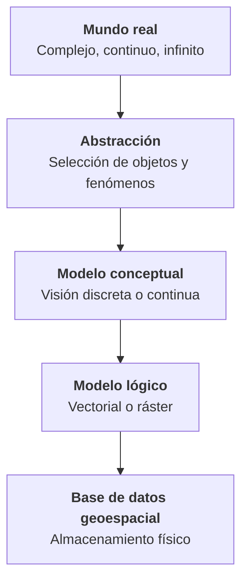

# 1.11 Modelos de representación espacial

!!! abstract "Objetivos de aprendizaje"

    Al finalizar este tema, el estudiante será capaz de:

    - Explicar el proceso que lleva del mundo real a una base de datos geoespacial.
    - Describir el modelo vectorial y sus geometrías: punto, línea y polígono.
    - Describir el modelo ráster: celda, matriz, bandas y resolución espacial.
    - Comprender cómo se ubica un ráster en el territorio.
    - Comparar ambos modelos y elegir el más adecuado según el fenómeno y el análisis.
    - Reconocer otros modelos de representación, como las redes de triángulos y las nubes de puntos.

---

## Del mundo real al modelo

Con este tema pasamos de la cartografía al **SIG propiamente dicho**. Ya sabemos cómo ubicar el territorio (geodesia, sistemas de referencia, proyecciones) y cómo representarlo en un mapa (cartografía, escala, generalización). Ahora nos preguntamos: **¿cómo se almacena el territorio dentro de una computadora?**

En el tema 1.2 vimos que la realidad se puede concebir de dos formas: como un conjunto de **objetos discretos** o como **campos continuos**. Y vimos que modelar implica pasar por varios niveles de abstracción. Este tema se ocupa del **modelo lógico**: la estructura con la que se organizan los datos.



Existen dos grandes modelos lógicos:

<div class="grid cards" markdown>

-   :material-vector-polyline:{ .lg .middle } **Modelo vectorial**

    ---

    Representa el territorio mediante **geometrías** definidas por coordenadas: **puntos**, **líneas** y **polígonos**.

    *Pregunta típica: ¿qué hay y dónde está exactamente?*

-   :material-grid:{ .lg .middle } **Modelo ráster**

    ---

    Representa el territorio mediante una **malla regular de celdas**, cada una con un valor.

    *Pregunta típica: ¿qué valor hay en cada lugar?*

</div>

<figure class="figura">
<svg viewBox="0 0 720 290" xmlns="http://www.w3.org/2000/svg" role="img" aria-label="Una misma realidad representada con el modelo vectorial y con el modelo ráster">
<defs><clipPath id="mr-c1"><rect x="20" y="30" width="200" height="200"/></clipPath></defs><g clip-path="url(#mr-c1)">
<polygon points="137.2,155.0 137.3,158.3 136.6,161.6 135.6,164.9 134.4,168.2 133.1,171.5 131.4,174.8 129.1,178.0 125.9,180.8 121.9,182.7 117.0,183.6 111.8,183.3 106.7,181.9 102.1,180.0 98.2,178.1 95.0,176.9 92.0,176.5 88.7,177.3 84.7,178.8 79.7,180.7 74.1,182.2 68.1,182.7 62.6,182.0 58.1,179.9 55.1,176.7 53.7,172.9 53.6,168.8 54.4,164.9 55.5,161.3 56.4,158.0 57.2,155.0 57.7,152.1 58.4,149.2 59.5,146.4 61.3,143.8 63.8,141.5 66.7,139.6 69.6,137.9 72.4,136.2 74.8,134.2 77.0,131.6 79.2,128.4 81.9,124.9 85.5,121.3 89.9,118.5 95.0,116.9 100.3,116.9 105.3,118.6 109.4,121.8 112.3,125.9 114.1,130.2 115.2,134.2 116.1,137.4 117.6,139.8 119.8,141.5 123.0,142.9 126.7,144.4 130.5,146.4 133.7,148.8 136.0,151.8" fill="#3f6fd8" fill-opacity="0.55" stroke="none"/>
<path d="M 220.0 30 C 190 60, 160 100, 127.5 127.5" fill="none" stroke="#3f6fd8" stroke-opacity="0.7" stroke-width="5" stroke-linecap="round"/>
<rect x="164.0" y="175.0" width="12" height="10" fill="#e0823d" stroke="#7a4a1d" stroke-width="0.8"/>
<polygon points="162.0,175.0 170.0,169.0 178.0,175.0" fill="#b85c14"/>
<rect x="181.5" y="190.0" width="12" height="10" fill="#e0823d" stroke="#7a4a1d" stroke-width="0.8"/>
<polygon points="179.5,190.0 187.5,184.0 195.5,190.0" fill="#b85c14"/>
<rect x="191.5" y="167.5" width="12" height="10" fill="#e0823d" stroke="#7a4a1d" stroke-width="0.8"/>
<polygon points="189.5,167.5 197.5,161.5 205.5,167.5" fill="#b85c14"/>
</g>
<rect x="20" y="30" width="200" height="200" fill="currentColor" fill-opacity="0.04" stroke="currentColor" stroke-width="1.5"/>
<text x="120" y="254" text-anchor="middle" font-size="15" font-weight="bold" fill="currentColor">Realidad</text>
<text x="120" y="273" text-anchor="middle" font-size="12" fill="currentColor">Formas continuas y complejas</text>
<polygon points="377.2,155.0 373.1,171.5 357.0,183.6 335.0,176.9 314.1,182.2 293.7,172.9 297.2,155.0 303.8,141.5 317.0,131.6 335.0,116.9 354.1,130.2 363.0,142.9" fill="#3f6fd8" fill-opacity="0.3" stroke="#3f6fd8" stroke-width="2"/>
<circle cx="377.2" cy="155.0" r="2.6" fill="#e0823d"/>
<circle cx="373.1" cy="171.5" r="2.6" fill="#e0823d"/>
<circle cx="357.0" cy="183.6" r="2.6" fill="#e0823d"/>
<circle cx="335.0" cy="176.9" r="2.6" fill="#e0823d"/>
<circle cx="314.1" cy="182.2" r="2.6" fill="#e0823d"/>
<circle cx="293.7" cy="172.9" r="2.6" fill="#e0823d"/>
<circle cx="297.2" cy="155.0" r="2.6" fill="#e0823d"/>
<circle cx="303.8" cy="141.5" r="2.6" fill="#e0823d"/>
<circle cx="317.0" cy="131.6" r="2.6" fill="#e0823d"/>
<circle cx="335.0" cy="116.9" r="2.6" fill="#e0823d"/>
<circle cx="354.1" cy="130.2" r="2.6" fill="#e0823d"/>
<circle cx="363.0" cy="142.9" r="2.6" fill="#e0823d"/>
<defs><clipPath id="mr-c2"><rect x="260" y="30" width="200" height="200"/></clipPath></defs><g clip-path="url(#mr-c2)">
<polyline points="460.0,30.0 430.0,65.0 410.0,90.0 385.0,112.5 367.5,127.5" fill="none" stroke="#3f6fd8" stroke-width="2.5"/>
<circle cx="460.0" cy="30.0" r="2.6" fill="#e0823d"/>
<circle cx="430.0" cy="65.0" r="2.6" fill="#e0823d"/>
<circle cx="410.0" cy="90.0" r="2.6" fill="#e0823d"/>
<circle cx="385.0" cy="112.5" r="2.6" fill="#e0823d"/>
<circle cx="367.5" cy="127.5" r="2.6" fill="#e0823d"/>
</g>
<circle cx="410.0" cy="180.0" r="5" fill="#9b59b6" stroke="#fff" stroke-width="1.2"/>
<circle cx="427.5" cy="195.0" r="5" fill="#9b59b6" stroke="#fff" stroke-width="1.2"/>
<circle cx="437.5" cy="172.5" r="5" fill="#9b59b6" stroke="#fff" stroke-width="1.2"/>
<rect x="260" y="30" width="200" height="200" fill="currentColor" fill-opacity="0.04" stroke="currentColor" stroke-width="1.5"/>
<text x="360" y="254" text-anchor="middle" font-size="15" font-weight="bold" fill="currentColor">Modelo vectorial</text>
<text x="360" y="273" text-anchor="middle" font-size="12" fill="currentColor">Polígono, línea y puntos</text>
<path d="M540 140h10v10h-10zM540 150h10v10h-10zM540 160h10v10h-10zM540 170h10v10h-10zM550 130h10v10h-10zM550 140h10v10h-10zM550 150h10v10h-10zM550 160h10v10h-10zM550 170h10v10h-10zM560 130h10v10h-10zM560 140h10v10h-10zM560 150h10v10h-10zM560 160h10v10h-10zM560 170h10v10h-10zM570 120h10v10h-10zM570 130h10v10h-10zM570 140h10v10h-10zM570 150h10v10h-10zM570 160h10v10h-10zM570 170h10v10h-10zM580 120h10v10h-10zM580 130h10v10h-10zM580 140h10v10h-10zM580 150h10v10h-10zM580 160h10v10h-10zM580 170h10v10h-10zM590 130h10v10h-10zM590 140h10v10h-10zM590 150h10v10h-10zM590 160h10v10h-10zM590 170h10v10h-10zM600 120h10v10h-10zM600 140h10v10h-10zM600 150h10v10h-10zM600 160h10v10h-10zM600 170h10v10h-10zM610 110h10v10h-10zM610 120h10v10h-10zM610 150h10v10h-10zM620 110h10v10h-10zM630 100h10v10h-10zM640 90h10v10h-10zM650 70h10v10h-10zM650 80h10v10h-10zM660 60h10v10h-10zM660 70h10v10h-10zM670 50h10v10h-10zM670 60h10v10h-10zM680 40h10v10h-10zM680 50h10v10h-10zM690 30h10v10h-10z" fill="#3f6fd8" fill-opacity="0.55"/>
<path d="M640 170h10v10h-10zM640 180h10v10h-10zM650 170h10v10h-10zM650 180h10v10h-10zM660 190h10v10h-10zM670 170h10v10h-10z" fill="#9b59b6" fill-opacity="0.8"/>
<path d="M500 30V230M500 30H700M510 30V230M500 40H700M520 30V230M500 50H700M530 30V230M500 60H700M540 30V230M500 70H700M550 30V230M500 80H700M560 30V230M500 90H700M570 30V230M500 100H700M580 30V230M500 110H700M590 30V230M500 120H700M600 30V230M500 130H700M610 30V230M500 140H700M620 30V230M500 150H700M630 30V230M500 160H700M640 30V230M500 170H700M650 30V230M500 180H700M660 30V230M500 190H700M670 30V230M500 200H700M680 30V230M500 210H700M690 30V230M500 220H700M700 30V230M500 230H700" stroke="currentColor" stroke-opacity="0.15" stroke-width="0.6" fill="none"/>
<rect x="500" y="30" width="200" height="200" fill="currentColor" fill-opacity="0.04" stroke="currentColor" stroke-width="1.5"/>
<text x="600" y="254" text-anchor="middle" font-size="15" font-weight="bold" fill="currentColor">Modelo ráster</text>
<text x="600" y="273" text-anchor="middle" font-size="12" fill="currentColor">Celdas con un valor cada una</text>
</svg><figcaption>Un lago, un río y tres viviendas representados con ambos modelos. Datos ficticios.</figcaption>
</figure>

---

## Modelo vectorial

!!! info "Definición"

    El **modelo vectorial** representa los elementos geográficos mediante **geometrías** construidas a partir de **pares de coordenadas** (vértices). Cada elemento es una **entidad** con identidad propia, a la que se asocian **atributos**.

La lógica del modelo vectorial es la de los **objetos**: cada escuela, cada vía y cada predio es un elemento individual, con límites definidos y una fila en una tabla de atributos.

### Geometrías básicas

<figure class="figura">
<svg viewBox="0 0 720 250" xmlns="http://www.w3.org/2000/svg" role="img" aria-label="Geometrías del modelo vectorial: punto, línea, polígono y multipolígono con hueco">
<rect x="10" y="40" width="170" height="180" fill="currentColor" fill-opacity="0.04" stroke="currentColor" stroke-opacity="0.4"/>
<text x="95.0" y="26" text-anchor="middle" font-size="14" font-weight="bold" fill="currentColor">Punto</text>
<text x="95.0" y="240" text-anchor="middle" font-size="12" fill="currentColor">0 dimensiones</text>
<rect x="187" y="40" width="170" height="180" fill="currentColor" fill-opacity="0.04" stroke="currentColor" stroke-opacity="0.4"/>
<text x="272.0" y="26" text-anchor="middle" font-size="14" font-weight="bold" fill="currentColor">Línea</text>
<text x="272.0" y="240" text-anchor="middle" font-size="12" fill="currentColor">1 dimensión</text>
<rect x="364" y="40" width="170" height="180" fill="currentColor" fill-opacity="0.04" stroke="currentColor" stroke-opacity="0.4"/>
<text x="449.0" y="26" text-anchor="middle" font-size="14" font-weight="bold" fill="currentColor">Polígono</text>
<text x="449.0" y="240" text-anchor="middle" font-size="12" fill="currentColor">2 dimensiones</text>
<rect x="541" y="40" width="170" height="180" fill="currentColor" fill-opacity="0.04" stroke="currentColor" stroke-opacity="0.4"/>
<text x="626.0" y="26" text-anchor="middle" font-size="14" font-weight="bold" fill="currentColor">Multipolígono</text>
<text x="626.0" y="240" text-anchor="middle" font-size="12" fill="currentColor">Varias partes y un hueco</text>
<circle cx="60" cy="80" r="7" fill="#9b59b6" stroke="#fff" stroke-width="1.5"/>
<circle cx="130" cy="95" r="7" fill="#9b59b6" stroke="#fff" stroke-width="1.5"/>
<circle cx="85" cy="150" r="7" fill="#9b59b6" stroke="#fff" stroke-width="1.5"/>
<circle cx="150" cy="170" r="7" fill="#9b59b6" stroke="#fff" stroke-width="1.5"/>
<text x="68" y="75" font-size="12" fill="currentColor">(x, y)</text>
<polyline points="207,190 242,150 257,110 297,95 317,60 342,55" fill="none" stroke="#3f6fd8" stroke-width="3"/>
<rect x="202" y="185" width="10" height="10" fill="#9b59b6" stroke="#fff"/>
<circle cx="242" cy="150" r="4" fill="#e0823d" stroke="#fff" stroke-width="1"/>
<circle cx="257" cy="110" r="4" fill="#e0823d" stroke="#fff" stroke-width="1"/>
<circle cx="297" cy="95" r="4" fill="#e0823d" stroke="#fff" stroke-width="1"/>
<circle cx="317" cy="60" r="4" fill="#e0823d" stroke="#fff" stroke-width="1"/>
<rect x="337" y="50" width="10" height="10" fill="#9b59b6" stroke="#fff"/>
<text x="229" y="200" font-size="11" fill="currentColor">nodo inicial</text>
<text x="287" y="48" font-size="11" fill="currentColor">nodo final</text>
<text x="267" y="140" font-size="11" fill="#e0823d">vértice</text>
<text x="199" y="130" font-size="11" fill="#3f6fd8">segmento</text>
<polygon points="394,80 459,55 514,95 499,170 434,190 389,140" fill="#2e9e5b" fill-opacity="0.3" stroke="#2e9e5b" stroke-width="2.5"/>
<circle cx="394" cy="80" r="4" fill="#e0823d" stroke="#fff" stroke-width="1"/>
<circle cx="459" cy="55" r="4" fill="#e0823d" stroke="#fff" stroke-width="1"/>
<circle cx="514" cy="95" r="4" fill="#e0823d" stroke="#fff" stroke-width="1"/>
<circle cx="499" cy="170" r="4" fill="#e0823d" stroke="#fff" stroke-width="1"/>
<circle cx="434" cy="190" r="4" fill="#e0823d" stroke="#fff" stroke-width="1"/>
<circle cx="389" cy="140" r="4" fill="#e0823d" stroke="#fff" stroke-width="1"/>
<rect x="388" y="74" width="12" height="12" fill="#9b59b6" stroke="#fff"/>
<text x="404" y="72" font-size="11" fill="currentColor">inicio = fin</text>
<text x="452" y="130" text-anchor="middle" font-size="11" fill="currentColor">anillo exterior</text>
<path d="M 556 70 L 641 55 L 656 130 L 601 190 L 561 160 Z M 586 100 L 621 95 L 616 135 L 591 140 Z" fill="#2e9e5b" fill-opacity="0.3" fill-rule="evenodd" stroke="#2e9e5b" stroke-width="2.5"/>
<polygon points="671,150 699,145 701,180 676,188" fill="#2e9e5b" fill-opacity="0.3" stroke="#2e9e5b" stroke-width="2.5"/>
<circle cx="556" cy="70" r="3.2" fill="#e0823d" stroke="#fff" stroke-width="1"/>
<circle cx="641" cy="55" r="3.2" fill="#e0823d" stroke="#fff" stroke-width="1"/>
<circle cx="656" cy="130" r="3.2" fill="#e0823d" stroke="#fff" stroke-width="1"/>
<circle cx="601" cy="190" r="3.2" fill="#e0823d" stroke="#fff" stroke-width="1"/>
<circle cx="561" cy="160" r="3.2" fill="#e0823d" stroke="#fff" stroke-width="1"/>
<circle cx="671" cy="150" r="3.2" fill="#e0823d" stroke="#fff" stroke-width="1"/>
<circle cx="699" cy="145" r="3.2" fill="#e0823d" stroke="#fff" stroke-width="1"/>
<circle cx="701" cy="180" r="3.2" fill="#e0823d" stroke="#fff" stroke-width="1"/>
<circle cx="676" cy="188" r="3.2" fill="#e0823d" stroke="#fff" stroke-width="1"/>
<circle cx="586" cy="100" r="3.2" fill="#3f6fd8" stroke="#fff" stroke-width="1"/>
<circle cx="621" cy="95" r="3.2" fill="#3f6fd8" stroke="#fff" stroke-width="1"/>
<circle cx="616" cy="135" r="3.2" fill="#3f6fd8" stroke="#fff" stroke-width="1"/>
<circle cx="591" cy="140" r="3.2" fill="#3f6fd8" stroke="#fff" stroke-width="1"/>
<text x="603" y="122" text-anchor="middle" font-size="10" fill="#3f6fd8">hueco</text>
<text x="686" y="137" text-anchor="middle" font-size="10" fill="currentColor">parte 2</text>
<text x="603" y="50" text-anchor="middle" font-size="10" fill="currentColor">parte 1</text>
</svg><figcaption>Geometrías del modelo vectorial y sus componentes.</figcaption>
</figure>

=== "Punto"

    Un **punto** se define con **un solo par de coordenadas** (x, y).

    - Tiene **0 dimensiones**: no tiene longitud ni superficie.
    - Representa elementos cuya forma **no es relevante** a la escala de trabajo, o que se consideran localizados en un lugar.
    - Ejemplos: pozos, postes, unidades educativas, centros de salud, puntos de muestreo, árboles.

    ```text
    POINT (802110 8075114)
    ```

=== "Línea"

    Una **línea** (o **polilínea**) se define con una **secuencia ordenada de vértices** unidos por segmentos rectos.

    - Tiene **1 dimensión**: tiene longitud, pero no superficie.
    - Sus extremos se llaman **nodos**, y los puntos intermedios, **vértices**.
    - El orden de los vértices define una **dirección**, importante en redes (por ejemplo, el sentido del flujo de un río).
    - Ejemplos: ríos, vías, redes de agua potable y alcantarillado, líneas eléctricas, curvas de nivel.

    ```text
    LINESTRING (801950 8075320, 802040 8075210, 802110 8075114)
    ```

=== "Polígono"

    Un **polígono** se define con una **secuencia cerrada de vértices**: el primer vértice coincide con el último.

    - Tiene **2 dimensiones**: tiene perímetro y superficie.
    - Su contorno se llama **anillo exterior**. Puede tener **anillos interiores** que representan **huecos**.
    - Ejemplos: predios, manzanos, distritos, municipios, lagos, áreas protegidas, zonas de riesgo.

    ```text
    POLYGON ((802000 8075000, 802100 8075000, 802100 8075080,
              802000 8075080, 802000 8075000))
    ```

=== "Geometrías múltiples"

    Una **geometría múltiple** agrupa varias geometrías del mismo tipo en **un solo elemento**, con un único registro de atributos.

    - **Multipunto:** varios puntos que forman una sola entidad (por ejemplo, los surtidores de una misma estación de servicio).
    - **Multilínea:** varios tramos de una misma vía separados por un puente o un túnel no representado.
    - **Multipolígono:** una entidad formada por varias partes separadas.

    !!! example "Un multipolígono en Bolivia"

        Un municipio a orillas del lago Titicaca que incluye **islas** dentro de su territorio se representa como un **multipolígono**: una parte continental y varias partes insulares, todas asociadas a un único registro con el nombre y el código del municipio.

!!! note "WKT: las geometrías como texto"

    Los ejemplos anteriores usan **WKT** (*Well-Known Text*), un formato estándar para escribir geometrías como texto, definido en la especificación *Simple Features* del Open Geospatial Consortium (OGC) y en la norma ISO 19125. Lo encontrarás con frecuencia en QGIS, PostGIS y en los archivos CSV con geometrías.

??? info "Para saber más: coordenadas Z y M"

    Además de las coordenadas X e Y, cada vértice puede almacenar dos valores más:

    - **Z:** la **altura** del vértice. Se usa en redes de alcantarillado, levantamientos topográficos o modelos 3D. Por ejemplo, `POINT Z (802110 8075114 2558)`.
    - **M:** una **medida** asociada al vértice, como el kilometraje a lo largo de una carretera. Se usa en sistemas de referencia lineal.

### La geometría depende de la escala

Como vimos en los temas 1.2 y 1.10, **el tipo de geometría no es una propiedad del objeto real**, sino una **decisión de modelado**:

| Elemento | A escala grande | A escala pequeña |
|---|---|---|
| Unidad educativa | Polígono (terreno o edificio) | Punto |
| Río | Polígono (cauce con márgenes) | Línea |
| Ciudad | Polígonos (manzanos, predios) | Punto |
| Vía | Polígono (calzada) | Línea |

### Atributos

Cada entidad vectorial tiene asociada una **fila** en una **tabla de atributos**, que describe sus características no espaciales:

| id | nombre | tipo | nivel | estudiantes |
|---|---|---|---|---|
| 1 | U.E. Ejemplo A | Fiscal | Secundario | 820 |
| 2 | U.E. Ejemplo B | Convenio | Primario | 460 |
| 3 | U.E. Ejemplo C | Privada | Inicial y primario | 190 |

La combinación de **geometría + atributos** es lo que hace tan poderoso al modelo vectorial: permite preguntar tanto *¿dónde está?* como *¿qué características tiene?* Profundizaremos en el tema **1.12**.

### Formatos vectoriales habituales

| Formato | Extensión | Características |
|---|---|---|
| **GeoPackage** | `.gpkg` | Estándar abierto del OGC. Un solo archivo con varias capas, estilos y tablas. Recomendado. |
| **Shapefile** | `.shp` (+ `.shx`, `.dbf`, `.prj`...) | Muy difundido, pero con limitaciones: varios archivos por capa, nombres de campo de hasta 10 caracteres, un solo tipo de geometría y un tamaño máximo de 2 GB. |
| **GeoJSON** | `.geojson` | Texto legible, muy usado en la web. Coordenadas en WGS 84. |
| **KML / KMZ** | `.kml`, `.kmz` | Formato de Google Earth. Coordenadas en WGS 84. |
| **PostGIS** | Base de datos | Extensión espacial de PostgreSQL, para trabajo multiusuario y grandes volúmenes. |
| **DXF / DWG** | `.dxf`, `.dwg` | Formatos CAD. Suelen carecer de atributos estructurados y de sistema de referencia. |

---

## Modelo ráster

!!! info "Definición"

    El **modelo ráster** representa el territorio mediante una **malla regular de celdas** del mismo tamaño, organizadas en **filas y columnas**. Cada celda contiene **un valor** que describe el fenómeno en esa porción del espacio.

La lógica del modelo ráster es la de los **campos**: el espacio se recorre de forma sistemática y en cada lugar hay un valor, aunque sea "sin dato".

### Celda, píxel y matriz

<figure class="figura">
<svg viewBox="0 0 720 400" xmlns="http://www.w3.org/2000/svg" role="img" aria-label="Estructura de un ráster: matriz de celdas con filas, columnas, origen, tamaño de celda y valores de elevación">
<defs><pattern id="mr-nd" width="6" height="6" patternUnits="userSpaceOnUse" patternTransform="rotate(45)"><line x1="0" y1="0" x2="0" y2="6" stroke="currentColor" stroke-opacity="0.4" stroke-width="2"/></pattern></defs>
<text x="108" y="90.0" text-anchor="end" font-size="12" fill="currentColor">0</text>
<rect x="120" y="60" width="52" height="52" fill="#a6611a" stroke="#ffffff" stroke-width="1.5"/>
<text x="146.0" y="90.0" text-anchor="middle" font-size="12" fill="#222">2612</text>
<rect x="172" y="60" width="52" height="52" fill="#a6611a" stroke="#ffffff" stroke-width="1.5"/>
<text x="198.0" y="90.0" text-anchor="middle" font-size="12" fill="#222">2608</text>
<rect x="224" y="60" width="52" height="52" fill="#d8b365" stroke="#ffffff" stroke-width="1.5"/>
<text x="250.0" y="90.0" text-anchor="middle" font-size="12" fill="#222">2601</text>
<rect x="276" y="60" width="52" height="52" fill="#d8b365" stroke="#ffffff" stroke-width="1.5"/>
<text x="302.0" y="90.0" text-anchor="middle" font-size="12" fill="#222">2594</text>
<rect x="328" y="60" width="52" height="52" fill="#78c679" stroke="#ffffff" stroke-width="1.5"/>
<text x="354.0" y="90.0" text-anchor="middle" font-size="12" fill="#222">2588</text>
<rect x="380" y="60" width="52" height="52" fill="#78c679" stroke="#ffffff" stroke-width="1.5"/>
<text x="406.0" y="90.0" text-anchor="middle" font-size="12" fill="#222">2583</text>
<text x="108" y="142.0" text-anchor="end" font-size="12" fill="currentColor">1</text>
<rect x="120" y="112" width="52" height="52" fill="#a6611a" stroke="#ffffff" stroke-width="1.5"/>
<text x="146.0" y="142.0" text-anchor="middle" font-size="12" fill="#222">2605</text>
<rect x="172" y="112" width="52" height="52" fill="#d8b365" stroke="#ffffff" stroke-width="1.5"/>
<text x="198.0" y="142.0" text-anchor="middle" font-size="12" fill="#222">2598</text>
<rect x="224" y="112" width="52" height="52" fill="#d8b365" stroke="#ffffff" stroke-width="1.5"/>
<text x="250.0" y="142.0" text-anchor="middle" font-size="12" fill="#222">2590</text>
<rect x="276" y="112" width="52" height="52" fill="#78c679" stroke="#ffffff" stroke-width="1.5"/>
<text x="302.0" y="142.0" text-anchor="middle" font-size="12" fill="#222">2582</text>
<rect x="328" y="112" width="52" height="52" fill="#78c679" stroke="#ffffff" stroke-width="1.5"/>
<text x="354.0" y="142.0" text-anchor="middle" font-size="12" fill="#222">2577</text>
<rect x="380" y="112" width="52" height="52" fill="#addd8e" stroke="#ffffff" stroke-width="1.5"/>
<text x="406.0" y="142.0" text-anchor="middle" font-size="12" fill="#222">2574</text>
<text x="108" y="194.0" text-anchor="end" font-size="12" fill="currentColor">2</text>
<rect x="120" y="164" width="52" height="52" fill="#d8b365" stroke="#ffffff" stroke-width="1.5"/>
<text x="146.0" y="194.0" text-anchor="middle" font-size="12" fill="#222">2597</text>
<rect x="172" y="164" width="52" height="52" fill="#d8b365" stroke="#ffffff" stroke-width="1.5"/>
<text x="198.0" y="194.0" text-anchor="middle" font-size="12" fill="#222">2589</text>
<rect x="224" y="164" width="52" height="52" fill="#78c679" stroke="#ffffff" stroke-width="1.5"/>
<text x="250.0" y="194.0" text-anchor="middle" font-size="12" fill="#222">2580</text>
<rect x="276" y="164" width="52" height="52" fill="#addd8e" stroke="#ffffff" stroke-width="1.5"/>
<text x="302.0" y="194.0" text-anchor="middle" font-size="12" fill="#222">2571</text>
<rect x="328" y="164" width="52" height="52" fill="#addd8e" stroke="#ffffff" stroke-width="1.5"/>
<text x="354.0" y="194.0" text-anchor="middle" font-size="12" fill="#222">2566</text>
<rect x="380" y="164" width="52" height="52" fill="#addd8e" stroke="#ffffff" stroke-width="1.5"/>
<text x="406.0" y="194.0" text-anchor="middle" font-size="12" fill="#222">2565</text>
<text x="108" y="246.0" text-anchor="end" font-size="12" fill="currentColor">3</text>
<rect x="120" y="216" width="52" height="52" fill="#d8b365" stroke="#ffffff" stroke-width="1.5"/>
<text x="146.0" y="246.0" text-anchor="middle" font-size="12" fill="#222">2590</text>
<rect x="172" y="216" width="52" height="52" fill="#78c679" stroke="#ffffff" stroke-width="1.5"/>
<text x="198.0" y="246.0" text-anchor="middle" font-size="12" fill="#222">2581</text>
<rect x="224" y="216" width="52" height="52" fill="#addd8e" stroke="#ffffff" stroke-width="1.5"/>
<text x="250.0" y="246.0" text-anchor="middle" font-size="12" fill="#222">2572</text>
<rect x="276" y="216" width="52" height="52" fill="#addd8e" stroke="#ffffff" stroke-width="1.5"/>
<text x="302.0" y="246.0" text-anchor="middle" font-size="12" fill="#222">2563</text>
<rect x="328" y="216" width="52" height="52" fill="#d9f0a3" stroke="#ffffff" stroke-width="1.5"/>
<text x="354.0" y="246.0" text-anchor="middle" font-size="12" fill="#222">2558</text>
<rect x="380" y="216" width="52" height="52" fill="url(#mr-nd)" stroke="currentColor" stroke-opacity="0.5"/>
<text x="108" y="298.0" text-anchor="end" font-size="12" fill="currentColor">4</text>
<rect x="120" y="268" width="52" height="52" fill="#78c679" stroke="#ffffff" stroke-width="1.5"/>
<text x="146.0" y="298.0" text-anchor="middle" font-size="12" fill="#222">2584</text>
<rect x="172" y="268" width="52" height="52" fill="#addd8e" stroke="#ffffff" stroke-width="1.5"/>
<text x="198.0" y="298.0" text-anchor="middle" font-size="12" fill="#222">2575</text>
<rect x="224" y="268" width="52" height="52" fill="#addd8e" stroke="#ffffff" stroke-width="1.5"/>
<text x="250.0" y="298.0" text-anchor="middle" font-size="12" fill="#222">2566</text>
<rect x="276" y="268" width="52" height="52" fill="#d9f0a3" stroke="#ffffff" stroke-width="1.5"/>
<text x="302.0" y="298.0" text-anchor="middle" font-size="12" fill="#222">2558</text>
<rect x="328" y="268" width="52" height="52" fill="url(#mr-nd)" stroke="currentColor" stroke-opacity="0.5"/>
<rect x="380" y="268" width="52" height="52" fill="url(#mr-nd)" stroke="currentColor" stroke-opacity="0.5"/>
<text x="108" y="350.0" text-anchor="end" font-size="12" fill="currentColor">5</text>
<rect x="120" y="320" width="52" height="52" fill="#78c679" stroke="#ffffff" stroke-width="1.5"/>
<text x="146.0" y="350.0" text-anchor="middle" font-size="12" fill="#222">2579</text>
<rect x="172" y="320" width="52" height="52" fill="#addd8e" stroke="#ffffff" stroke-width="1.5"/>
<text x="198.0" y="350.0" text-anchor="middle" font-size="12" fill="#222">2570</text>
<rect x="224" y="320" width="52" height="52" fill="#d9f0a3" stroke="#ffffff" stroke-width="1.5"/>
<text x="250.0" y="350.0" text-anchor="middle" font-size="12" fill="#222">2562</text>
<rect x="276" y="320" width="52" height="52" fill="#d9f0a3" stroke="#ffffff" stroke-width="1.5"/>
<text x="302.0" y="350.0" text-anchor="middle" font-size="12" fill="#222">2555</text>
<rect x="328" y="320" width="52" height="52" fill="#d9f0a3" stroke="#ffffff" stroke-width="1.5"/>
<text x="354.0" y="350.0" text-anchor="middle" font-size="12" fill="#222">2551</text>
<rect x="380" y="320" width="52" height="52" fill="url(#mr-nd)" stroke="currentColor" stroke-opacity="0.5"/>
<text x="146.0" y="50" text-anchor="middle" font-size="12" fill="currentColor">0</text>
<text x="198.0" y="50" text-anchor="middle" font-size="12" fill="currentColor">1</text>
<text x="250.0" y="50" text-anchor="middle" font-size="12" fill="currentColor">2</text>
<text x="302.0" y="50" text-anchor="middle" font-size="12" fill="currentColor">3</text>
<text x="354.0" y="50" text-anchor="middle" font-size="12" fill="currentColor">4</text>
<text x="406.0" y="50" text-anchor="middle" font-size="12" fill="currentColor">5</text>
<text x="276" y="30" text-anchor="middle" font-size="13" font-weight="bold" fill="currentColor">Columnas →</text>
<text x="68" y="212" text-anchor="middle" font-size="13" font-weight="bold" fill="currentColor">Filas</text>
<text x="68" y="232" text-anchor="middle" font-size="15" font-weight="bold" fill="currentColor">↓</text>
<rect x="276" y="164" width="52" height="52" fill="none" stroke="#9b59b6" stroke-width="3.5"/>
<circle cx="302.0" cy="204.0" r="3" fill="#9b59b6"/>
<circle cx="120" cy="60" r="6" fill="#e0823d"/>
<text x="110" y="44" text-anchor="end" font-size="12" font-weight="bold" fill="#e0823d">Origen (X₀, Y₀)</text>
<line x1="120" y1="386" x2="172" y2="386" stroke="currentColor" stroke-width="1.5"/>
<line x1="120" y1="381" x2="120" y2="391" stroke="currentColor" stroke-width="1.5"/>
<line x1="172" y1="381" x2="172" y2="391" stroke="currentColor" stroke-width="1.5"/>
<text x="180" y="390" font-size="12" fill="currentColor">Tamaño de celda (resolución)</text>
<text x="470" y="70" font-size="13" font-weight="bold" fill="currentColor">Celda: fila 2, columna 3</text>
<rect x="470" y="78" width="14" height="14" fill="none" stroke="#9b59b6" stroke-width="3"/>
<text x="492" y="90" font-size="12" fill="currentColor">Valor: 2 571 m</text>
<text x="470" y="120" font-size="12" fill="currentColor">Centro de la celda:</text>
<text x="470" y="138" font-size="12" fill="currentColor">X = X₀ + (3 + 0,5) × tamaño</text>
<text x="470" y="156" font-size="12" fill="currentColor">Y = Y₀ − (2 + 0,5) × tamaño</text>
<text x="470" y="200" font-size="13" font-weight="bold" fill="currentColor">Elevación (m)</text>
<rect x="470" y="210" width="36" height="16" fill="#d9f0a3"/>
<rect x="506" y="210" width="36" height="16" fill="#addd8e"/>
<rect x="542" y="210" width="36" height="16" fill="#78c679"/>
<rect x="578" y="210" width="36" height="16" fill="#d8b365"/>
<rect x="614" y="210" width="36" height="16" fill="#a6611a"/>
<text x="470" y="242" font-size="11" fill="currentColor">2 550</text>
<text x="650" y="242" text-anchor="end" font-size="11" fill="currentColor">2 615</text>
<rect x="470" y="268" width="16" height="16" fill="url(#mr-nd)" stroke="currentColor" stroke-opacity="0.5"/>
<text x="494" y="281" font-size="12" fill="currentColor">Sin dato (NoData)</text>
</svg><figcaption>Estructura de un ráster de elevación de 6 × 6 celdas. Valores ficticios.</figcaption>
</figure>

| Concepto | Qué es |
|---|---|
| **Celda** | La unidad mínima del ráster: una porción cuadrada del territorio con un único valor. |
| **Píxel** | Término que proviene de las imágenes (*picture element*). En la práctica se usa como sinónimo de celda. |
| **Matriz** | La organización de las celdas en **filas** y **columnas**. Cada celda se identifica por su posición (fila, columna). |
| **Resolución espacial** | El **tamaño de la celda** sobre el terreno (tema 1.9). |
| **Extensión** | El área total que cubre el ráster: número de filas y columnas multiplicado por el tamaño de celda. |

!!! tip "Filas y columnas empiezan arriba a la izquierda"

    En un ráster, la numeración de filas y columnas comienza en la **esquina superior izquierda**. Las filas **aumentan hacia abajo**, mientras que la coordenada Norte **disminuye**. Es una fuente frecuente de confusión al programar o al leer valores de celdas.

### ¿Cómo se ubica un ráster en el territorio?

Una matriz de números, por sí sola, no está en ningún lugar. Para **georreferenciarla** se necesitan:

1. Las **coordenadas del origen** (X₀, Y₀): normalmente, la esquina superior izquierda.
2. El **tamaño de celda** en X y en Y.
3. El **sistema de referencia de coordenadas** (tema 1.4).

Con esos datos, el software calcula la posición de cualquier celda.

!!! example "Calcular la coordenada de una celda"

    Un ráster en WGS 84 / UTM zona 19S tiene su origen en **X₀ = 800 000 m** e **Y₀ = 8 076 000 m**, con celdas de **10 m**. ¿Cuál es la coordenada del centro de la celda de la **fila 2, columna 3**?

    ```text
    X = X₀ + (columna + 0,5) × tamaño = 800 000 + 3,5 × 10 = 800 035 m
    Y = Y₀ − (fila + 0,5) × tamaño    = 8 076 000 − 2,5 × 10 = 8 075 975 m
    ```

    Se suma 0,5 para llegar al **centro** de la celda, y la coordenada Y se **resta** porque las filas avanzan hacia el sur.

### Resolución y volumen de datos

La resolución espacial determina **cuántas celdas** tiene un ráster, y el número de celdas crece con el **cuadrado** de la resolución.

| Área de 10 × 10 km con celdas de... | Filas × columnas | Número de celdas |
|---|---|---|
| 30 m | 334 × 334 | ≈ 111 000 |
| 10 m | 1 000 × 1 000 | 1 000 000 |
| 1 m | 10 000 × 10 000 | 100 000 000 |
| 10 cm | 100 000 × 100 000 | 10 000 000 000 |

!!! warning "Reducir a la mitad el tamaño de celda cuadruplica los datos"

    Pasar de celdas de 10 m a celdas de 5 m **multiplica por cuatro** la cantidad de celdas, el tamaño del archivo y, en general, el tiempo de procesamiento. Antes de elegir la máxima resolución disponible, conviene preguntarse qué resolución **necesita realmente** el análisis (tema 1.9).

### Valores de las celdas

Cada celda almacena un número. Según el fenómeno, ese número puede significar cosas muy distintas:

| Tipo de ráster | Qué representan los valores | Tipo de dato habitual | Ejemplo |
|---|---|---|---|
| **Continuo** | Una magnitud que varía de forma gradual | Decimal | Elevación, temperatura, precipitación, pendiente |
| **Temático o discreto** | Un **código** de categoría | Entero | Uso de suelo: 1 = urbano, 2 = agrícola, 3 = bosque |
| **Imagen** | La **reflectancia** o intensidad registrada por un sensor | Entero | Imágenes satelitales, ortofotos |

Además, conviene conocer dos conceptos:

- **Sin dato (NoData):** un valor reservado que indica que la celda **no tiene información** (fuera del área de estudio, cubierta por nubes, sin medición). Es fundamental definirlo bien, para que no se confunda con un valor real como 0.
- **Profundidad de bits:** determina el rango de valores posibles. Un ráster de **8 bits sin signo** admite valores de 0 a 255; uno de **16 bits**, de 0 a 65 535; y uno de **32 bits decimal**, valores con decimales.

!!! danger "El cero no es lo mismo que sin dato"

    En un ráster de precipitación, **0** significa "no llovió", mientras que **NoData** significa "no hay información". Si el valor NoData no está bien definido, las celdas sin información se interpretarán como ceros y **alterarán** promedios, sumas y cualquier análisis.

### Bandas

Un ráster puede tener **una o varias bandas**: capas de valores que comparten la misma malla.

- **Una banda:** un modelo digital de elevación, un mapa de pendientes, un ráster de uso de suelo.
- **Tres bandas:** una fotografía aérea en color, con bandas roja, verde y azul.
- **Muchas bandas:** una imagen satelital multiespectral. Sentinel-2, por ejemplo, registra 13 bandas.

### Formatos ráster habituales

| Formato | Extensión | Características |
|---|---|---|
| **GeoTIFF** | `.tif`, `.tiff` | El estándar más difundido. Guarda la georreferenciación y el sistema de referencia dentro del archivo. |
| **Cloud Optimized GeoTIFF (COG)** | `.tif` | Variante de GeoTIFF organizada para leerse por partes desde internet sin descargar el archivo completo. |
| **JPEG 2000** | `.jp2` | Formato comprimido usado, por ejemplo, para distribuir imágenes Sentinel-2. |
| **ASCII Grid** | `.asc` | Texto plano, legible, pero de gran tamaño. |
| **NetCDF** | `.nc` | Datos multidimensionales, muy usados en clima y oceanografía. |
| **GeoPackage** | `.gpkg` | También puede almacenar ráster en forma de teselas. |

---

## Comparación entre ambos modelos

| Aspecto | Modelo vectorial | Modelo ráster |
|---|---|---|
| **Unidad básica** | Geometría (punto, línea, polígono) | Celda |
| **Visión de la realidad** | Objetos discretos | Campos continuos |
| **Exactitud geométrica** | Alta: no depende de una malla | Limitada por el tamaño de celda |
| **Fenómenos continuos** | Poco adecuado | Muy adecuado |
| **Atributos** | Muchos atributos por entidad | Un valor por celda y por banda |
| **Volumen de datos** | Compacto para elementos discretos | Grande, crece con la resolución |
| **Relaciones topológicas y redes** | Muy adecuado | Poco adecuado |
| **Superposición de capas** | Cálculos geométricos complejos | Muy eficiente (álgebra de mapas) |
| **Teledetección** | No es su formato nativo | Formato nativo de las imágenes |
| **Calidad cartográfica** | Líneas nítidas a cualquier acercamiento | Aspecto "escalonado" al acercarse |

!!! quote "Un dicho entre profesionales SIG"

    *"El ráster es más rápido; el vectorial, más exacto."*

    Como toda simplificación, no siempre es cierta, pero resume bien la tendencia general de cada modelo.

### ¿Qué modelo elegir?

La elección depende del **fenómeno** y, sobre todo, del **análisis** que se quiere realizar:

| Necesidad | Modelo recomendado | Por qué |
|---|---|---|
| Registro de predios y catastro | Vectorial | Límites exactos y muchos atributos por predio |
| Red de agua potable o alcantarillado | Vectorial | Conectividad, dirección y atributos por tramo |
| Cálculo de rutas | Vectorial | Análisis de redes |
| Relieve, pendientes y cuencas | Ráster | Fenómeno continuo |
| Clasificación de uso de suelo desde imágenes | Ráster | Las imágenes son ráster en origen |
| Modelos de aptitud o de riesgo que combinan muchos factores | Ráster | Superposición eficiente mediante álgebra de mapas |
| Interpolación de lluvia a partir de estaciones | Punto (vectorial) → Ráster | Se parte de mediciones puntuales para obtener una superficie |
| Mapa final de zonas de riesgo para un plan municipal | Ráster → Vectorial | Se analiza en ráster y se entregan polígonos editables |

!!! note "Recuerda el matiz del tema 1.2"

    La visión **discreta** suele coincidir con el modelo **vectorial**, y la **continua**, con el **ráster**, pero no es una regla. La elevación, que es continua, también se representa con **curvas de nivel** (vectorial); y el uso de suelo, que es discreto, se representa muy a menudo como **ráster clasificado**.

### Conversión entre modelos

Es habitual transformar datos de un modelo a otro:

=== "Rasterización"

    Convierte datos **vectoriales en ráster**, asignando a cada celda el valor de la entidad que la ocupa.

    - Permite combinar datos vectoriales con otros ráster en un análisis.
    - **Pierde exactitud geométrica**: los contornos quedan escalonados según el tamaño de celda.
    - Los elementos más pequeños que una celda pueden **desaparecer**.

    *En QGIS: Ráster → Conversión → Rasterizar (vectorial a ráster).*

=== "Vectorización"

    Convierte datos **ráster en vectoriales**, agrupando celdas contiguas con el mismo valor en polígonos.

    - Permite editar, calcular superficies por polígono y producir cartografía final.
    - Los contornos resultantes **conservan el escalonado** de las celdas.
    - Suele requerir **limpieza** posterior: eliminar polígonos muy pequeños y simplificar o suavizar los bordes (tema 1.10).

    *En QGIS: Ráster → Conversión → Poligonizar (ráster a vectorial).*

!!! warning "Convertir no recupera información"

    Si un ráster de 30 m se vectoriza, los polígonos resultantes tienen **la exactitud de un ráster de 30 m**, aunque ahora sean vectoriales. Cambiar de modelo **no mejora** la calidad de los datos.

---

## Otros modelos de representación

Además de los dos modelos clásicos, existen otros que encontrarás con frecuencia:

| Modelo | Descripción | Uso típico |
|---|---|---|
| **TIN** (red irregular de triángulos) | Superficie formada por triángulos que unen puntos con elevación conocida. Los triángulos son más pequeños donde el relieve es más complejo. | Modelos de terreno para ingeniería y topografía |
| **Nube de puntos** | Millones de puntos con coordenadas X, Y, Z y, a veces, color e intensidad. | Levantamientos LiDAR y fotogrametría con drones (formatos LAS y LAZ) |
| **Modelos 3D** | Objetos tridimensionales con volumen y fachadas. | Modelos de ciudades, patrimonio, gestión de edificios |
| **Teselas vectoriales** | Datos vectoriales divididos y generalizados por nivel de acercamiento. | Mapas base web |

---

## Hacia la base de datos geoespacial

Los modelos vectorial y ráster definen **cómo se estructuran** los datos. El último paso de la cadena es **almacenarlos** en un formato o una base de datos que, además de la geometría o las celdas, guarde toda la información necesaria para usarlos correctamente:

- El **sistema de referencia de coordenadas** (tema 1.4).
- Los **atributos** de cada entidad.
- Los **metadatos**: fuente, fecha, escala de origen, exactitud y generalización aplicada (temas 1.8 a 1.10).

Ese conjunto es lo que llamamos **dato geoespacial**, y es el tema de la sección **1.12**.

---

## Ideas clave

!!! success "Para recordar"

    - Pasar del mundo real a un SIG requiere **abstraer**, elegir una visión (**discreta o continua**) y un **modelo lógico** (**vectorial o ráster**).
    - El **modelo vectorial** representa objetos con **puntos**, **líneas** y **polígonos** definidos por coordenadas, con atributos asociados.
    - El **modelo ráster** representa el territorio con una **matriz de celdas** del mismo tamaño, cada una con un valor.
    - Un ráster se ubica en el territorio con su **origen**, su **tamaño de celda** y su **sistema de referencia**.
    - Reducir a la mitad el tamaño de celda **cuadruplica** la cantidad de datos.
    - **NoData** no es lo mismo que cero.
    - La elección del modelo depende del **fenómeno** y del **análisis**. Convertir entre modelos **no mejora** la calidad de los datos.

---

## Autoevaluación

??? question "1. ¿Qué geometría usarías para representar cada elemento a escala municipal (1:10 000)?"

    - Pozos de agua → **Punto**.
    - Red de alcantarillado → **Línea**.
    - Predios → **Polígono**.
    - Paradas de transporte público → **Punto**.
    - Área protegida municipal → **Polígono**.
    - Río principal que atraviesa la ciudad → **Polígono** si interesa su cauce y sus márgenes, o **línea** si solo interesa su trazado.

??? question "2. ¿Qué diferencia hay entre un polígono con un hueco y un multipolígono?"

    Un **polígono con hueco** es una sola superficie continua con un **anillo interior** que excluye una parte (por ejemplo, un predio con un patio que pertenece a otro propietario). Un **multipolígono** es una entidad formada por **varias superficies separadas** (por ejemplo, un municipio con islas).

??? question "3. Un ráster tiene su origen en X₀ = 250 000 m, Y₀ = 7 900 000 m y celdas de 30 m. ¿Cuál es la coordenada del centro de la celda de la fila 10, columna 4?"

    ```text
    X = 250 000 + (4 + 0,5) × 30 = 250 000 + 135 = 250 135 m
    Y = 7 900 000 − (10 + 0,5) × 30 = 7 900 000 − 315 = 7 899 685 m
    ```

??? question "4. ¿Cuántas celdas tiene un ráster que cubre un área de 5 × 5 km con celdas de 5 m?"

    ```text
    5 000 m / 5 m = 1 000 filas y 1 000 columnas
    1 000 × 1 000 = 1 000 000 de celdas
    ```

??? question "5. En un ráster de precipitación, las celdas fuera del municipio tienen valor 0 porque no se definió el valor NoData. ¿Qué problema produce?"

    Al calcular estadísticas, esas celdas se tomarán como zonas **sin lluvia**, lo que **reducirá** el promedio de precipitación y alterará cualquier análisis. Se debe definir un valor **NoData** para las celdas sin información.

??? question "6. ¿Qué modelo usarías para calcular la pendiente de un terreno y para registrar los medidores de agua de una ciudad? ¿Por qué?"

    - **Pendiente:** **ráster**, porque el relieve es un fenómeno continuo y la pendiente se calcula a partir de las celdas vecinas de un modelo digital de elevación.
    - **Medidores de agua:** **vectorial** (puntos), porque son objetos discretos con ubicación exacta y muchos atributos (número de medidor, usuario, lecturas).

??? question "7. Un técnico vectoriza un ráster de uso de suelo con celdas de 30 m y afirma que ahora tiene límites exactos para un plano catastral. ¿Tiene razón?"

    **No.** Los polígonos resultantes conservan la **exactitud de un ráster de 30 m**: sus bordes son escalonados y su posición tiene errores del orden del tamaño de celda. Cambiar de modelo **no mejora** la calidad de los datos.

---

## Actividad propuesta

!!! example "Actividad 1.11 — Definir el modelo lógico del proyecto integrador (sin software)"

    Retoma el modelo conceptual de la **Actividad 1.2** y el inventario de datos de la **Actividad 1.4**, y desarrolla lo siguiente:

    1. Para cada elemento o fenómeno de tu proyecto, indica si usarás el **modelo vectorial** o el **ráster**, y justifica la elección.
    2. Para los elementos vectoriales, define el **tipo de geometría** (punto, línea, polígono o geometría múltiple) y al menos **cuatro atributos**.
    3. Para los datos ráster, indica la **resolución** necesaria, el **tipo de valor** (continuo, temático o imagen), el número de **bandas** y cómo se definirá el valor **NoData**.
    4. Identifica si alguna capa requerirá **rasterización** o **vectorización** durante el análisis.
    5. Elige el **formato** en el que almacenarás cada capa y justifica tu elección.

---

## Referencias

- Burrough, P. A., & McDonnell, R. A. (1998). *Principles of Geographical Information Systems*. Oxford University Press.
- GDAL/OGR contributors. *GDAL/OGR Geospatial Data Abstraction Software Library*. Open Source Geospatial Foundation. <https://gdal.org>
- Goodchild, M. F., Yuan, M., & Cova, T. J. (2007). Towards a general theory of geographic representation in GIS. *International Journal of Geographical Information Science*, 21(3), 239–260.
- ISO 19125-1:2004. *Geographic information — Simple feature access — Part 1: Common architecture*. International Organization for Standardization.
- Longley, P. A., Goodchild, M. F., Maguire, D. J., & Rhind, D. W. (2015). *Geographic Information Science and Systems* (4.ª ed.). Wiley.
- Olaya, V. (2020). *Sistemas de Información Geográfica*. Libro libre disponible en línea.
- Open Geospatial Consortium. *GeoPackage Encoding Standard*. <https://www.geopackage.org>
