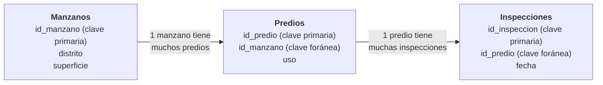

# 1.12 El dato geoespacial

!!! abstract "Objetivos de aprendizaje"

    Al finalizar este tema, el estudiante será capaz de:

    - Identificar los componentes de un dato geoespacial y la función de cada uno.
    - Reconocer geometrías inválidas y sus consecuencias.
    - Diseñar tablas de atributos con tipos de campo adecuados y buenas prácticas.
    - Explicar la importancia de los identificadores y de las relaciones entre tablas.
    - Comprender la topología y detectar errores topológicos frecuentes.
    - Elaborar metadatos básicos y un diccionario de datos.

---

## ¿Qué es un dato geoespacial?

A lo largo del módulo hemos visto, por separado, las piezas que forman un dato geográfico: su **ubicación** y su **sistema de referencia** (temas 1.3 a 1.6), su **escala** y su **exactitud** (temas 1.8 y 1.9), su **generalización** (tema 1.10) y su **modelo** (tema 1.11). En este tema las reunimos.

!!! info "Definición"

    Un **dato geoespacial** es un dato que describe un **elemento o fenómeno** del territorio junto con su **localización** en un sistema de referencia conocido. Está formado, como mínimo, por:

    ```text
    Geometría  +  Atributos  +  Sistema de referencia  +  Metadatos
    ```

<figure class="figura">
<svg viewBox="0 0 720 420" xmlns="http://www.w3.org/2000/svg" role="img" aria-label="Componentes de un dato geoespacial: geometría, atributos, sistema de referencia y metadatos">
<text x="20" y="32" font-size="15" font-weight="bold" fill="currentColor">Geometría</text>
<rect x="20" y="50" width="300" height="300" fill="currentColor" fill-opacity="0.04" stroke="currentColor" stroke-opacity="0.5"/>
<polygon points="40,100 140,95 145,190 45,195" fill="#2e9e5b" fill-opacity="0.18" stroke="#2e9e5b" stroke-width="1.2"/>
<text x="92" y="150" text-anchor="middle" font-size="14" font-weight="bold" fill="currentColor">1</text>
<polygon points="140,95 230,90 235,180 145,190" fill="#2e9e5b" fill-opacity="0.18" stroke="#2e9e5b" stroke-width="1.2"/>
<text x="188" y="144" text-anchor="middle" font-size="14" font-weight="bold" fill="currentColor">2</text>
<polygon points="230,90 300,88 302,178 235,180" fill="#2e9e5b" fill-opacity="0.18" stroke="#2e9e5b" stroke-width="1.2"/>
<text x="267" y="139" text-anchor="middle" font-size="14" font-weight="bold" fill="currentColor">3</text>
<polygon points="45,215 145,210 150,320 50,330" fill="#2e9e5b" fill-opacity="0.18" stroke="#2e9e5b" stroke-width="1.2"/>
<text x="98" y="274" text-anchor="middle" font-size="14" font-weight="bold" fill="currentColor">4</text>
<polygon points="145,210 240,202 245,315 150,320" fill="#e0823d" fill-opacity="0.55" stroke="#e0823d" stroke-width="2.5"/>
<text x="195" y="267" text-anchor="middle" font-size="14" font-weight="bold" fill="currentColor">5</text>
<polygon points="240,202 302,200 304,312 245,315" fill="#2e9e5b" fill-opacity="0.18" stroke="#2e9e5b" stroke-width="1.2"/>
<text x="273" y="262" text-anchor="middle" font-size="14" font-weight="bold" fill="currentColor">6</text>
<text x="360" y="32" font-size="15" font-weight="bold" fill="currentColor">Atributos</text>
<rect x="360" y="50" width="40" height="30" fill="currentColor" fill-opacity="0.12" stroke="currentColor" stroke-opacity="0.35"/>
<text x="368" y="70" font-size="12" font-weight="bold" fill="currentColor" font-family="monospace">id</text>
<rect x="400" y="50" width="110" height="30" fill="currentColor" fill-opacity="0.12" stroke="currentColor" stroke-opacity="0.35"/>
<text x="408" y="70" font-size="12" font-weight="bold" fill="currentColor" font-family="monospace">codigo</text>
<rect x="510" y="50" width="100" height="30" fill="currentColor" fill-opacity="0.12" stroke="currentColor" stroke-opacity="0.35"/>
<text x="518" y="70" font-size="12" font-weight="bold" fill="currentColor" font-family="monospace">uso</text>
<rect x="610" y="50" width="90" height="30" fill="currentColor" fill-opacity="0.12" stroke="currentColor" stroke-opacity="0.35"/>
<text x="618" y="70" font-size="12" font-weight="bold" fill="currentColor" font-family="monospace">sup_m2</text>
<rect x="360" y="80" width="40" height="30" fill="none" fill-opacity="0" stroke="currentColor" stroke-opacity="0.35"/>
<text x="368" y="100" font-size="12" fill="currentColor" font-family="monospace">3</text>
<rect x="400" y="80" width="110" height="30" fill="none" fill-opacity="0" stroke="currentColor" stroke-opacity="0.35"/>
<text x="408" y="100" font-size="12" fill="currentColor" font-family="monospace">D05-M12-003</text>
<rect x="510" y="80" width="100" height="30" fill="none" fill-opacity="0" stroke="currentColor" stroke-opacity="0.35"/>
<text x="518" y="100" font-size="12" fill="currentColor" font-family="monospace">Vivienda</text>
<rect x="610" y="80" width="90" height="30" fill="none" fill-opacity="0" stroke="currentColor" stroke-opacity="0.35"/>
<text x="618" y="100" font-size="12" fill="currentColor" font-family="monospace">6 380</text>
<rect x="360" y="110" width="40" height="30" fill="none" fill-opacity="0" stroke="currentColor" stroke-opacity="0.35"/>
<text x="368" y="130" font-size="12" fill="currentColor" font-family="monospace">4</text>
<rect x="400" y="110" width="110" height="30" fill="none" fill-opacity="0" stroke="currentColor" stroke-opacity="0.35"/>
<text x="408" y="130" font-size="12" fill="currentColor" font-family="monospace">D05-M13-001</text>
<rect x="510" y="110" width="100" height="30" fill="none" fill-opacity="0" stroke="currentColor" stroke-opacity="0.35"/>
<text x="518" y="130" font-size="12" fill="currentColor" font-family="monospace">Comercio</text>
<rect x="610" y="110" width="90" height="30" fill="none" fill-opacity="0" stroke="currentColor" stroke-opacity="0.35"/>
<text x="618" y="130" font-size="12" fill="currentColor" font-family="monospace">9 920</text>
<rect x="360" y="140" width="40" height="30" fill="#e0823d" fill-opacity="0.3" stroke="currentColor" stroke-opacity="0.35"/>
<text x="368" y="160" font-size="12" fill="currentColor" font-family="monospace">5</text>
<rect x="400" y="140" width="110" height="30" fill="#e0823d" fill-opacity="0.3" stroke="currentColor" stroke-opacity="0.35"/>
<text x="408" y="160" font-size="12" fill="currentColor" font-family="monospace">D05-M13-002</text>
<rect x="510" y="140" width="100" height="30" fill="#e0823d" fill-opacity="0.3" stroke="currentColor" stroke-opacity="0.35"/>
<text x="518" y="160" font-size="12" fill="currentColor" font-family="monospace">Educativo</text>
<rect x="610" y="140" width="90" height="30" fill="#e0823d" fill-opacity="0.3" stroke="currentColor" stroke-opacity="0.35"/>
<text x="618" y="160" font-size="12" fill="currentColor" font-family="monospace">8 870</text>
<rect x="360" y="170" width="40" height="30" fill="none" fill-opacity="0" stroke="currentColor" stroke-opacity="0.35"/>
<text x="368" y="190" font-size="12" fill="currentColor" font-family="monospace">6</text>
<rect x="400" y="170" width="110" height="30" fill="none" fill-opacity="0" stroke="currentColor" stroke-opacity="0.35"/>
<text x="408" y="190" font-size="12" fill="currentColor" font-family="monospace">D05-M13-003</text>
<rect x="510" y="170" width="100" height="30" fill="none" fill-opacity="0" stroke="currentColor" stroke-opacity="0.35"/>
<text x="518" y="190" font-size="12" fill="currentColor" font-family="monospace">Vivienda</text>
<rect x="610" y="170" width="90" height="30" fill="none" fill-opacity="0" stroke="currentColor" stroke-opacity="0.35"/>
<text x="618" y="190" font-size="12" fill="currentColor" font-family="monospace">6 510</text>
<path d="M 222 232 C 262 175, 320 155, 360 155" fill="none" stroke="#e0823d" stroke-width="2" stroke-dasharray="5 4"/>
<circle cx="222" cy="232" r="4" fill="#e0823d"/>
<circle cx="360" cy="155" r="4" fill="#e0823d"/>
<rect x="360" y="240" width="340" height="52" rx="6" fill="#3f6fd8" fill-opacity="0.1" stroke="#3f6fd8" stroke-width="1.5"/>
<text x="372" y="261" font-size="13" font-weight="bold" fill="#3f6fd8">Sistema de referencia</text>
<text x="372" y="281" font-size="12" fill="currentColor">WGS 84 / UTM zona 19S · EPSG:32719</text>
<rect x="360" y="306" width="340" height="96" rx="6" fill="#9b59b6" fill-opacity="0.1" stroke="#9b59b6" stroke-width="1.5"/>
<text x="372" y="327" font-size="13" font-weight="bold" fill="#9b59b6">Metadatos</text>
<text x="372" y="347" font-size="11.5" fill="currentColor">Fuente: levantamiento catastral municipal</text>
<text x="372" y="363" font-size="11.5" fill="currentColor">Fecha: marzo de 2026 · Escala de origen: 1:1 000</text>
<text x="372" y="379" font-size="11.5" fill="currentColor">Exactitud posicional: RMSE 0,3 m</text>
<text x="372" y="395" font-size="11.5" fill="currentColor">Responsable: unidad de catastro</text>
<text x="170" y="380" text-anchor="middle" font-size="12" fill="currentColor">¿Dónde? ¿Qué forma tiene?</text>
</svg><figcaption>Componentes de un dato geoespacial en una capa de predios. Datos ficticios.</figcaption>
</figure>

| Componente | Pregunta que responde | Qué ocurre si falta |
|---|---|---|
| **Geometría** | ¿Dónde está y qué forma tiene? | No es un dato espacial: es solo una tabla |
| **Atributos** | ¿Qué es y qué características tiene? | Se sabe dónde hay algo, pero no qué es |
| **Sistema de referencia** | ¿Cómo interpretar las coordenadas? | Las coordenadas no corresponden a ningún lugar concreto |
| **Metadatos** | ¿Quién lo hizo, cuándo, cómo y con qué calidad? | No se puede evaluar si el dato es adecuado para un uso |

!!! note "Y el tiempo"

    Muchos autores añaden un quinto componente: el **tiempo**. Un dato describe el territorio **en un momento determinado**: la cobertura de bosque de 2015 no es la de 2025. La dimensión temporal puede registrarse como un **atributo** (fecha de registro, fecha de construcción) o en los **metadatos** (fecha de captura, período de validez).

---

## Geometría

La geometría describe la **ubicación y la forma** del elemento. En el tema 1.11 vimos sus tipos: puntos, líneas, polígonos y geometrías múltiples. Aquí nos interesa otro aspecto: que la geometría sea **válida**.

### Geometrías válidas e inválidas

Las normas de *Simple Features* del OGC definen reglas que una geometría debe cumplir para que los algoritmos funcionen correctamente. Una geometría que no las cumple es **inválida**.

<figure class="figura">
<svg viewBox="0 0 720 250" xmlns="http://www.w3.org/2000/svg" role="img" aria-label="Ejemplos de geometrías de polígonos inválidas">
<rect x="20" y="40" width="210" height="170" fill="currentColor" fill-opacity="0.04" stroke="currentColor" stroke-opacity="0.4"/>
<text x="125.0" y="26" text-anchor="middle" font-size="14" font-weight="bold" fill="currentColor">Autointersección</text>
<text x="125.0" y="232" text-anchor="middle" font-size="12" fill="currentColor">El contorno se cruza a sí mismo</text>
<polygon points="60,70 190,180 190,70 60,180" fill="#d63b3b" fill-opacity="0.2" stroke="#d63b3b" stroke-width="2.5"/>
<circle cx="125" cy="125" r="7" fill="none" stroke="currentColor" stroke-width="2"/>
<rect x="260" y="40" width="210" height="170" fill="currentColor" fill-opacity="0.04" stroke="currentColor" stroke-opacity="0.4"/>
<text x="365.0" y="26" text-anchor="middle" font-size="14" font-weight="bold" fill="currentColor">Hueco fuera del contorno</text>
<text x="365.0" y="232" text-anchor="middle" font-size="12" fill="currentColor">El anillo interior no está dentro</text>
<polygon points="285,75 385,70 390,180 290,185" fill="#d63b3b" fill-opacity="0.2" stroke="#d63b3b" stroke-width="2.5"/>
<polygon points="405,105 450,100 452,150 408,152" fill="none" stroke="#d63b3b" stroke-width="2.5" stroke-dasharray="6 4"/>
<rect x="500" y="40" width="210" height="170" fill="currentColor" fill-opacity="0.04" stroke="currentColor" stroke-opacity="0.4"/>
<text x="605.0" y="26" text-anchor="middle" font-size="14" font-weight="bold" fill="currentColor">Huecos superpuestos</text>
<text x="605.0" y="232" text-anchor="middle" font-size="12" fill="currentColor">Dos anillos interiores se cruzan</text>
<path d="M 525 65 L 685 65 L 685 190 L 525 190 Z" fill="#d63b3b" fill-opacity="0.2" stroke="#d63b3b" stroke-width="2.5"/>
<rect x="550" y="95" width="70" height="60" fill="currentColor" fill-opacity="0.04" stroke="#d63b3b" stroke-width="2.5" stroke-dasharray="6 4"/>
<rect x="595" y="115" width="65" height="55" fill="currentColor" fill-opacity="0.04" stroke="#d63b3b" stroke-width="2.5" stroke-dasharray="6 4"/>
</svg><figcaption>Ejemplos de polígonos inválidos.</figcaption>
</figure>

| Problema | Descripción | Causa frecuente |
|---|---|---|
| **Autointersección** | El contorno se cruza a sí mismo, formando un "moño" | Error al digitalizar, orden incorrecto de vértices |
| **Hueco fuera del contorno** | Un anillo interior queda fuera del anillo exterior | Errores de conversión entre formatos |
| **Huecos superpuestos** | Dos anillos interiores se cruzan | Ediciones sucesivas sin control |
| **Vértices duplicados** | Dos vértices consecutivos en la misma posición | Importación desde CAD o GNSS |
| **Geometría vacía o nula** | Un registro sin geometría | Registros incompletos, errores de carga |

!!! danger "Por qué importan las geometrías inválidas"

    Una geometría inválida puede producir **áreas incorrectas**, hacer que una herramienta **falle** o, lo que es peor, que devuelva un **resultado erróneo sin avisar**. Herramientas como la intersección, la unión o el recorte son especialmente sensibles.

    **Antes de cualquier análisis, verifica la validez de las geometrías.** En QGIS se hace con las herramientas *Comprobar validez* y *Corregir geometrías*.

---

## Atributos

Los atributos describen **las características no espaciales** de cada elemento. Se organizan en una **tabla de atributos**:

- Cada **fila** (o registro) corresponde a una **entidad**.
- Cada **columna** (o campo) corresponde a una **característica**.
- Cada **celda** contiene el **valor** de esa característica para esa entidad.

### Tipos de campo

Cada campo tiene un **tipo de dato** que define qué valores admite y qué operaciones permite.

| Tipo | Admite | Ejemplos | Precaución |
|---|---|---|---|
| **Entero** | Números sin decimales | Número de habitantes, número de pisos | No sirve para códigos con ceros a la izquierda |
| **Decimal (real)** | Números con decimales | Superficie, caudal, elevación | Definir unidades y cantidad de decimales coherente con la exactitud |
| **Texto (cadena)** | Letras, números y símbolos | Nombre, dirección, código catastral | Evitar variaciones de escritura ("La Paz", "LA PAZ", "La paz") |
| **Fecha / fecha y hora** | Fechas y horas | Fecha de registro, fecha de inspección | Usar un tipo fecha, no texto, para poder ordenar y filtrar |
| **Booleano** | Verdadero o falso | ¿Tiene alcantarillado? | Definir claramente qué significa un valor vacío |
| **Binario** | Archivos | Fotografías, documentos | Aumenta mucho el tamaño de la capa |

!!! warning "El código que perdió un cero"

    Muchos códigos geográficos, catastrales o estadísticos **comienzan con cero**, como `010101`. Si se guardan en un campo **entero**, se convierten en `10101`, y dejan de coincidir con otras tablas.

    **Regla:** los códigos se guardan como **texto**, aunque estén formados solo por números. Un código no se suma ni se promedia.

### Escalas de medición

Además del tipo de campo, importa **qué tipo de información** representa el valor. El psicólogo Stanley Stevens propuso en 1946 cuatro escalas de medición, que determinan qué operaciones tienen sentido:

| Escala | Qué expresa | Ejemplos | Operaciones válidas |
|---|---|---|---|
| **Nominal** | Categorías sin orden | Uso de suelo, tipo de vía, código de municipio | Contar, moda, igualdad |
| **Ordinal** | Categorías con orden | Nivel de riesgo (bajo, medio, alto), jerarquía vial | Lo anterior + ordenar, mediana |
| **De intervalo** | Cantidades sin cero absoluto | Temperatura en °C, año | Lo anterior + sumar y restar, promedio |
| **De razón** | Cantidades con cero absoluto | Población, superficie, precipitación, distancia | Todas, incluidas multiplicación, división y proporciones |

!!! example "Operaciones sin sentido"

    - Calcular el **promedio** de los códigos de uso de suelo (escala nominal).
    - Afirmar que un día a **20 °C** es "el doble de caluroso" que uno a **10 °C** (escala de intervalo: el 0 °C no significa ausencia de temperatura).
    - Sumar niveles de riesgo "alto + bajo" (escala ordinal).

    Recuerda que la escala de medición también determina qué **variable visual** usar en un mapa (tema 1.7).

### Buenas prácticas en el diseño de atributos

!!! tip "Recomendaciones"

    - **Nombres de campo claros y consistentes:** en minúsculas, sin espacios, sin tildes ni ñ, separados por guion bajo. ✓ `sup_m2`, `fecha_registro` · ✗ `Superficie (m²)`, `Fecha Registro`.
    - **Un solo dato por campo:** no mezclar en una celda "Vivienda y comercio"; crear campos o categorías adecuadas.
    - **Unidades explícitas:** en el nombre del campo (`sup_m2`, `caudal_ls`) o en el diccionario de datos.
    - **Listas de valores permitidos (dominios):** para campos como `uso` o `estado`, definir las opciones posibles evita errores de escritura.
    - **Distinguir vacío, cero y "no aplica":** un campo vacío (nulo) significa "sin información", no "cero".
    - **No guardar valores que se pueden calcular:** si la superficie se calcula desde la geometría, conviene recalcularla cuando la geometría cambia, o documentar cuándo se calculó.

### Unir atributos

Con frecuencia, los atributos que necesitamos están en **otra tabla**. Existen dos formas de unirlos:

=== "Unión por atributos"

    Se unen dos tablas mediante un **campo común**.

    *Ejemplo:* una tabla con datos de un censo por municipio se une a la capa de municipios mediante el **código de municipio**.

    Requiere que el campo común tenga **exactamente** el mismo valor y el mismo tipo en ambas tablas: aquí es donde el "código que perdió un cero" causa problemas.

=== "Unión espacial"

    Se unen dos capas según su **relación espacial**, sin necesidad de un campo común.

    *Ejemplo:* asignar a cada unidad educativa el **distrito** en el que se encuentra, o contar cuántos centros de salud hay **dentro** de cada distrito.

    Requiere que ambas capas estén en un **sistema de referencia compatible** y que tengan una **exactitud y generalización** coherentes (temas 1.9 y 1.10).

---

## Identificador

Cada entidad debe poder distinguirse de todas las demás de forma **inequívoca**. Para eso existe el **identificador**.

!!! info "Definición"

    Un **identificador** es un valor que distingue **de forma única** a cada entidad dentro de un conjunto de datos, y que permite referirse a ella, relacionarla con otras tablas y seguir sus cambios en el tiempo.

### Características de un buen identificador

| Característica | Significado |
|---|---|
| **Único** | No existen dos entidades con el mismo identificador |
| **Estable** | No cambia aunque cambien la geometría o los atributos |
| **No reutilizable** | Si una entidad se elimina, su identificador no se asigna a otra |
| **Obligatorio** | Ninguna entidad puede quedar sin identificador |

### Tipos de identificador

| Tipo | Descripción | Ejemplo | Limitación |
|---|---|---|---|
| **Interno** | Número que asigna el software o el formato | `fid` en GeoPackage, número de fila | Puede cambiar al exportar o copiar la capa |
| **Temático** | Código definido por la institución, con significado | Código catastral, código de municipio | Puede requerir cambios si se reorganiza el territorio |
| **Universal (UUID)** | Código aleatorio que es único en cualquier lugar | `3f2b8c1e-7a4d-4e9b-...` | No tiene significado para las personas |

!!! danger "Un nombre no es un identificador"

    Hay muchas comunidades llamadas **San José**, muchas unidades educativas **Simón Bolívar** y muchas calles **Sucre**. Usar el nombre para relacionar tablas produce **uniones erróneas**. Los nombres cambian, se escriben de distintas formas y se repiten.

!!! tip "Identificadores en el trabajo de campo"

    Cuando varias personas capturan datos **sin conexión**, por ejemplo con QField en distintos dispositivos, los identificadores numéricos consecutivos pueden **repetirse** al sincronizar. Por eso se recomienda usar **identificadores universales (UUID)**, que se generan de forma independiente en cada dispositivo sin riesgo de duplicarse.

### Relaciones entre tablas

Los identificadores permiten **relacionar** tablas:

- La **clave primaria** es el identificador de cada entidad en su propia tabla.
- La **clave foránea** es un campo de otra tabla que **apunta** a esa clave primaria.



Así se evita repetir información y se mantiene la coherencia entre tablas. QGIS permite definir estas **relaciones** en las propiedades del proyecto.

---

## Topología

!!! info "Definición"

    La **topología** estudia las relaciones espaciales que **no cambian** aunque el espacio se deforme de manera continua, como si fuera una lámina de goma: **adyacencia** (qué elementos son vecinos), **conectividad** (qué elementos están unidos) y **contención** (qué elementos están dentro de otros).

Si se estira un mapa, las distancias y las formas cambian, pero dos predios vecinos **siguen siendo vecinos** y una calle conectada a otra **sigue conectada**. Esas son relaciones topológicas.

### Topología almacenada y topología calculada

| Enfoque | Cómo funciona | Ejemplos |
|---|---|---|
| **Geometrías independientes** | Cada entidad guarda su propia geometría completa. Un límite compartido se almacena **dos veces**, una en cada polígono. La topología se **calcula** cuando se necesita. | GeoPackage, Shapefile, GeoJSON, tablas de PostGIS |
| **Modelo topológico** | Los límites compartidos se almacenan **una sola vez** y los polígonos se construyen a partir de ellos. La topología está **almacenada**. | Vectores de GRASS GIS, extensión topológica de PostGIS |

La mayoría de los formatos actuales usan geometrías independientes. Eso los hace simples y flexibles, pero también permite que se produzcan **errores topológicos**: nada impide, por ejemplo, que dos polígonos vecinos se superpongan.

### Errores topológicos frecuentes

<figure class="figura">
<svg viewBox="0 0 720 240" xmlns="http://www.w3.org/2000/svg" role="img" aria-label="Errores topológicos frecuentes: huecos, superposiciones y líneas mal conectadas">
<rect x="10" y="40" width="160" height="160" fill="currentColor" fill-opacity="0.04" stroke="currentColor" stroke-opacity="0.4"/>
<text x="90.0" y="26" text-anchor="middle" font-size="14" font-weight="bold" fill="currentColor">Hueco</text>
<text x="90.0" y="222" text-anchor="middle" font-size="11.5" fill="currentColor">Espacio sin asignar</text>
<polygon points="25,60 88,60 82,180 25,180" fill="#2e9e5b" fill-opacity="0.3" stroke="#2e9e5b" stroke-width="2"/>
<polygon points="96,60 155,60 155,180 88,180" fill="#3f6fd8" fill-opacity="0.3" stroke="#3f6fd8" stroke-width="2"/>
<polygon points="88,60 96,60 88,180 82,180" fill="#d63b3b" fill-opacity="0.8"/>
<rect x="188" y="40" width="160" height="160" fill="currentColor" fill-opacity="0.04" stroke="currentColor" stroke-opacity="0.4"/>
<text x="268.0" y="26" text-anchor="middle" font-size="14" font-weight="bold" fill="currentColor">Superposición</text>
<text x="268.0" y="222" text-anchor="middle" font-size="11.5" fill="currentColor">Área contada dos veces</text>
<polygon points="203,60 283,60 283,180 203,180" fill="#2e9e5b" fill-opacity="0.3" stroke="#2e9e5b" stroke-width="2"/>
<polygon points="258,60 333,60 333,180 258,180" fill="#3f6fd8" fill-opacity="0.3" stroke="#3f6fd8" stroke-width="2"/>
<rect x="258" y="60" width="25" height="120" fill="#d63b3b" fill-opacity="0.55"/>
<rect x="366" y="40" width="160" height="160" fill="currentColor" fill-opacity="0.04" stroke="currentColor" stroke-opacity="0.4"/>
<text x="446.0" y="26" text-anchor="middle" font-size="14" font-weight="bold" fill="currentColor">Línea que no llega</text>
<text x="446.0" y="222" text-anchor="middle" font-size="11.5" fill="currentColor">El tramo no se conecta</text>
<line x1="386" y1="120" x2="506" y2="120" stroke="#3f6fd8" stroke-width="3"/>
<line x1="446" y1="185" x2="446" y2="132" stroke="#3f6fd8" stroke-width="3"/>
<circle cx="446" cy="132" r="6" fill="none" stroke="#d63b3b" stroke-width="2.5"/>
<rect x="544" y="40" width="160" height="160" fill="currentColor" fill-opacity="0.04" stroke="currentColor" stroke-opacity="0.4"/>
<text x="624.0" y="26" text-anchor="middle" font-size="14" font-weight="bold" fill="currentColor">Línea que se pasa</text>
<text x="624.0" y="222" text-anchor="middle" font-size="11.5" fill="currentColor">El tramo sobrepasa el cruce</text>
<line x1="564" y1="120" x2="684" y2="120" stroke="#3f6fd8" stroke-width="3"/>
<line x1="624" y1="185" x2="624" y2="102" stroke="#3f6fd8" stroke-width="3"/>
<circle cx="624" cy="102" r="6" fill="none" stroke="#d63b3b" stroke-width="2.5"/>
</svg><figcaption>Errores topológicos frecuentes entre polígonos y entre líneas. En rojo, la zona con error.</figcaption>
</figure>

| Error | Tipo de dato | Consecuencia |
|---|---|---|
| **Huecos** entre polígonos vecinos | Predios, distritos, uso de suelo | Superficie sin asignar; la suma de áreas no coincide con el total |
| **Superposiciones** entre polígonos | Predios, zonas | Superficie **contada dos veces**; conflictos de propiedad o de jurisdicción |
| **Líneas que no llegan** al cruce | Vías, redes de agua, ríos | La red queda **desconectada**: el cálculo de rutas o de flujo falla |
| **Líneas que se pasan** del cruce | Vías, redes | Tramos colgantes que no pertenecen a la red |
| **Entidades duplicadas** | Cualquiera | Conteos y sumas incorrectos |
| **Polígonos astilla** | Resultado de superposiciones o conversiones | Polígonos muy delgados y sin sentido que alteran estadísticas |

!!! example "Reglas topológicas según el tipo de dato"

    | Capa | Reglas que debería cumplir |
    |---|---|
    | Predios | Sin huecos ni superposiciones entre predios; cada predio dentro de un manzano |
    | Distritos municipales | Sin huecos ni superposiciones; cubren todo el municipio |
    | Red vial | Tramos conectados en sus extremos; sin tramos duplicados |
    | Red de alcantarillado | Tramos conectados; flujo en el sentido correcto |
    | Unidades educativas | Cada punto dentro de un distrito |

!!! tip "Topología en QGIS"

    QGIS ofrece varias herramientas para trabajar con topología:

    - **Autoensamblado (*snapping*)** y **edición topológica**, para evitar errores al digitalizar: los vértices se unen automáticamente a los de las entidades vecinas.
    - Opción para **evitar superposiciones** al dibujar nuevos polígonos.
    - **Verificador de topología** y **Comprobador de geometrías**, para detectar errores en capas existentes.

    Prevenir los errores al digitalizar es mucho más sencillo que corregirlos después.

---

## Relaciones espaciales

En el tema 1.2 estudiamos los tipos de relaciones espaciales: **topológicas** (contiene, interseca, toca), **de distancia**, **direccionales** y **de conectividad**. En un dato geoespacial, esas relaciones **no se guardan en la tabla de atributos**: se **calculan** a partir de las geometrías cuando se necesitan.

Esto permite responder preguntas como:

| Pregunta | Relación espacial | Operación en un SIG |
|---|---|---|
| ¿Qué predios están dentro de la zona de riesgo? | Contención / intersección | Selección por localización |
| ¿En qué distrito está cada unidad educativa? | Contención | Unión espacial |
| ¿Cuántos centros de salud hay en cada distrito? | Contención | Contar puntos en polígonos |
| ¿Qué viviendas están a menos de 500 m de un pozo? | Distancia | Área de influencia (*buffer*) y selección |
| ¿Qué predios colindan con este predio? | Adyacencia | Selección por localización (*tocan*) |

!!! note "Condiciones para que funcionen bien"

    Para que el cálculo de relaciones espaciales sea confiable, las capas deben tener:

    - **Geometrías válidas.**
    - **Sistemas de referencia** compatibles (tema 1.4).
    - **Exactitud y generalización** coherentes entre sí (temas 1.9 y 1.10).

    Además, los SIG usan **índices espaciales** para acelerar estas consultas: estructuras que permiten descartar rápidamente las entidades lejanas sin compararlas una por una. En capas grandes, crear un índice espacial puede reducir el tiempo de un análisis de minutos a segundos.

---

## Sistema de referencia

El sistema de referencia es lo que convierte las coordenadas en **ubicaciones reales**. Lo estudiamos en detalle en el tema 1.4. Recordemos lo esencial:

- Forma parte del dato: debe estar **declarado** en el archivo y en los metadatos.
- Un dato sin sistema de referencia **no es interpretable** con certeza.
- Declarar un sistema de referencia **incorrecto** es tan grave como no declararlo.
- Los datos que se combinan en un análisis deben estar en sistemas de referencia **compatibles**.

---

## Metadatos

!!! info "Definición"

    Los **metadatos** son **datos sobre los datos**: información que describe el contenido, el origen, la calidad, la vigencia, las condiciones de uso y los responsables de un conjunto de datos.

Una analogía útil es la **etiqueta de un alimento**: no es el alimento, pero dice qué contiene, quién lo produjo, cuándo vence y cómo debe conservarse. Sin etiqueta, uno no sabe si puede consumirlo con seguridad. Sin metadatos, no se sabe si un dato **puede usarse** para un propósito determinado.

### ¿Qué preguntas responden?

| Pregunta | Información |
|---|---|
| **¿Qué es?** | Título, resumen, propósito, palabras clave |
| **¿Dónde?** | Extensión geográfica, sistema de referencia |
| **¿Cuándo?** | Fecha de captura, de publicación y de actualización; período de validez |
| **¿Quién?** | Institución productora, responsable, datos de contacto |
| **¿Cómo?** | Fuente, método de captura, procesos aplicados (**linaje**) |
| **¿Con qué calidad?** | Escala de origen, resolución, exactitud, completitud |
| **¿Qué contiene?** | Descripción de campos, unidades y valores permitidos (diccionario de datos) |
| **¿Cómo se puede usar?** | Licencia, restricciones de uso y de acceso |

### Estándares de metadatos

Para que los metadatos puedan compartirse e interpretarse entre instituciones, existen **normas**:

- **ISO 19115:** la norma internacional de metadatos geográficos, la más utilizada.
- **ISO 19139 e ISO 19115-3:** definen cómo escribir esos metadatos en formato XML para intercambiarlos.
- **Dublin Core:** un conjunto más simple de elementos, usado para describir recursos de información en general.

Las **infraestructuras de datos espaciales**, como **GeoBolivia**, publican catálogos de metadatos basados en estas normas, que permiten buscar datos y evaluar su utilidad antes de descargarlos.

### Metadatos mínimos recomendados

Aunque las normas incluyen cientos de elementos, en la práctica institucional conviene asegurar al menos los siguientes:

| Elemento | Ejemplo |
|---|---|
| **Título** | Predios urbanos del distrito 5 |
| **Resumen** | Polígonos de predios urbanos con uso de suelo y superficie, obtenidos por levantamiento catastral |
| **Fecha** | Levantamiento: marzo de 2026 · Última actualización: agosto de 2026 |
| **Responsable** | Unidad de catastro, gobierno municipal · correo de contacto |
| **Fuente y método** | Levantamiento con GNSS RTK y estación total |
| **Escala de origen o resolución** | 1:1 000 |
| **Exactitud posicional** | RMSE de 0,3 m |
| **Sistema de referencia** | WGS 84 / UTM zona 19S (EPSG:32719) |
| **Extensión geográfica** | Distrito 5 del municipio |
| **Diccionario de datos** | Descripción de cada campo (ver ejemplo abajo) |
| **Restricciones de uso** | Uso institucional; los datos de propietarios son confidenciales |

### Diccionario de datos

El **diccionario de datos** describe cada campo de la tabla de atributos. Es, probablemente, el metadato **más útil en el trabajo diario**.

| Campo | Tipo | Descripción | Unidad o valores permitidos | Obligatorio |
|---|---|---|---|---|
| `id_predio` | Texto | Identificador único del predio (UUID) | — | Sí |
| `codigo` | Texto | Código catastral | Formato `D00-M00-000` | Sí |
| `uso` | Texto | Uso principal del predio | Vivienda, Comercio, Educativo, Salud, Industrial, Baldío | Sí |
| `sup_m2` | Decimal | Superficie calculada a partir de la geometría | m², sin decimales | Sí |
| `fecha_registro` | Fecha | Fecha de registro en el sistema | AAAA-MM-DD | Sí |
| `observ` | Texto | Observaciones del levantamiento | Texto libre | No |

!!! tip "Metadatos en QGIS"

    QGIS permite registrar los metadatos de cada capa en la pestaña **Metadatos** de sus propiedades, siguiendo una estructura compatible con las normas ISO. También permite documentar los metadatos del **proyecto** completo.

!!! danger "Un dato sin metadatos es un dato huérfano"

    Es muy común encontrar en las instituciones carpetas llenas de archivos como `predios_final_v3_corregido.shp`, sin ninguna información sobre su origen. Esos datos pueden ser excelentes o completamente inadecuados, pero **no hay forma de saberlo**. Con el tiempo, nadie se atreve a usarlos ni a borrarlos.

    Documentar los metadatos **en el momento de crear el dato** toma pocos minutos. Reconstruirlos años después suele ser imposible.

---

## Calidad de los datos

Los componentes anteriores permiten evaluar la **calidad** de un dato geoespacial. La calidad no es una propiedad absoluta, sino la **aptitud del dato para un uso determinado**, y se describe a partir de varios elementos:

| Elemento de calidad | Pregunta |
|---|---|
| **Exactitud posicional** | ¿Las posiciones son correctas? |
| **Exactitud temática** | ¿Los atributos y las clasificaciones son correctos? |
| **Exactitud temporal** | ¿Las fechas son correctas y el dato está vigente? |
| **Completitud** | ¿Están todos los elementos que deberían estar, y ninguno de más? |
| **Consistencia lógica** | ¿Se cumplen las reglas: geometrías válidas, topología, dominios de atributos? |
| **Linaje** | ¿De dónde proviene el dato y qué procesos se le aplicaron? |

Estudiaremos cada uno de ellos en el tema **1.13**.

---

## Lista de verificación antes de usar un dato

!!! success "Antes de usar un dato geoespacial, verifica que:"

    - Tiene **sistema de referencia** declarado y es el correcto.
    - Las **geometrías son válidas**.
    - Cumple las **reglas topológicas** que requiere su tipo.
    - Cada entidad tiene un **identificador único**.
    - Los **campos** tienen tipos adecuados y están documentados.
    - Tiene **metadatos**: fuente, fecha, escala de origen y exactitud.
    - Su **escala, resolución y exactitud** son adecuadas para el uso previsto.
    - Está **vigente** para el período que se analiza.
    - Tienes **permiso** para usarlo con ese propósito.

---

## Ideas clave

!!! success "Para recordar"

    - Un **dato geoespacial** está formado por **geometría**, **atributos**, **sistema de referencia** y **metadatos**, y describe el territorio en un **momento** determinado.
    - Las **geometrías inválidas** pueden producir resultados erróneos sin aviso: hay que verificarlas antes de analizar.
    - Los **atributos** requieren tipos de campo adecuados. Los **códigos se guardan como texto**.
    - La **escala de medición** (nominal, ordinal, de intervalo o de razón) determina qué operaciones tienen sentido.
    - Un buen **identificador** es único, estable y no reutilizable. **Un nombre no es un identificador.**
    - La **topología** describe adyacencia, conectividad y contención. Los **errores topológicos** alteran áreas, conteos y análisis de redes.
    - Los **metadatos** permiten saber si un dato es adecuado para un uso. **Un dato sin metadatos es un dato huérfano.**

---

## Autoevaluación

??? question "1. Recibes una tabla de Excel con nombres y direcciones de comercios, sin coordenadas. ¿Es un dato geoespacial?"

    **No en sentido estricto**, porque no tiene **geometría** ni **sistema de referencia**. Tiene una localización **indirecta** (tema 1.2). Para convertirlo en dato geoespacial habría que **geocodificar** las direcciones y documentar el proceso en los **metadatos**.

??? question "2. Una unión entre una tabla censal y la capa de municipios deja muchos municipios sin datos, aunque los códigos parecen iguales. ¿Cuál puede ser la causa?"

    Lo más probable es que el campo de código tenga **tipos distintos** en ambas tablas: en una como **texto** (`010101`) y en la otra como **entero** (`10101`), que perdió el cero inicial. También pueden existir espacios en blanco o diferencias de formato. Los códigos deben guardarse como **texto** en ambas tablas.

??? question "3. Indica la escala de medición de cada atributo"

    - Número de habitantes de una comunidad → **De razón**.
    - Categoría de vía (principal, secundaria, terciaria) → **Ordinal**.
    - Tipo de establecimiento de salud → **Nominal**.
    - Temperatura media anual en °C → **De intervalo**.
    - Superficie de un predio → **De razón**.

??? question "4. ¿Por qué no es recomendable usar el nombre de una unidad educativa como identificador?"

    Porque los nombres **se repiten** (hay muchas unidades educativas con el mismo nombre), **se escriben de distintas formas** y **pueden cambiar**. Un identificador debe ser **único y estable**.

??? question "5. Al sumar la superficie de todos los predios de un manzano, el resultado supera la superficie del manzano. ¿Qué error topológico puede existir?"

    **Superposiciones** entre predios: algunas áreas están contadas dos veces. También podría haber predios que **sobresalen** del límite del manzano o **entidades duplicadas**.

??? question "6. Un análisis de rutas indica que no existe camino entre dos puntos que en la realidad están conectados por una vía. ¿Qué pudo haber pasado?"

    Probablemente existe una **línea que no llega** al cruce: dos tramos de la red que visualmente parecen unidos, pero cuyos extremos no coinciden exactamente. La red está **desconectada topológicamente**.

??? question "7. ¿Qué información mínima de metadatos necesitarías para decidir si una capa de ríos sirve para delimitar zonas de riesgo en un plan municipal?"

    Como mínimo: **fuente y método de captura**, **escala de origen**, **exactitud posicional**, **fecha**, **sistema de referencia** y, si corresponde, **generalización aplicada**. Con esa información se puede evaluar si la capa es adecuada para la escala del plan.

---

## Actividad propuesta

!!! example "Actividad 1.12 — Documentar un dato del proyecto integrador (sin software)"

    Elige la **capa principal** de tu proyecto integrador y desarrolla lo siguiente:

    1. Elabora su **diccionario de datos** completo: nombre del campo, tipo, descripción, unidades o valores permitidos, y si es obligatorio.
    2. Define su **identificador**: ¿de qué tipo será y por qué?
    3. Si tu proyecto tiene varias tablas relacionadas, dibuja un **diagrama de relaciones** con claves primarias y foráneas.
    4. Enumera las **reglas topológicas** que debería cumplir la capa.
    5. Redacta sus **metadatos mínimos**: título, resumen, fecha, responsable, fuente y método, escala o resolución, exactitud, sistema de referencia, extensión y restricciones de uso.
    6. Aplica la **lista de verificación** de este tema a una de las capas que descargaste o recibiste. ¿Qué información falta?

---

## Referencias

- ISO 19115-1:2014. *Geographic information — Metadata — Part 1: Fundamentals*. International Organization for Standardization.
- ISO 19125-1:2004. *Geographic information — Simple feature access — Part 1: Common architecture*. International Organization for Standardization.
- ISO 19157-1:2023. *Geographic information — Data quality — Part 1: General requirements*. International Organization for Standardization.
- Longley, P. A., Goodchild, M. F., Maguire, D. J., & Rhind, D. W. (2015). *Geographic Information Science and Systems* (4.ª ed.). Wiley.
- Olaya, V. (2020). *Sistemas de Información Geográfica*. Libro libre disponible en línea.
- QGIS Project. *QGIS User Guide*. <https://docs.qgis.org>
- Stevens, S. S. (1946). On the theory of scales of measurement. *Science*, 103(2684), 677–680.
