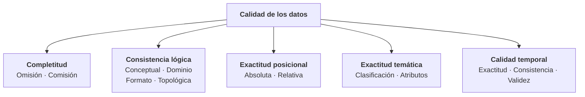
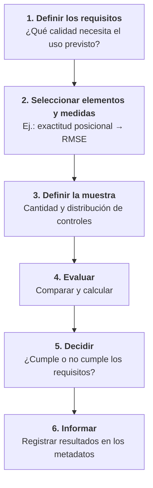

# 1.13 Calidad de la información geográfica

!!! abstract "Objetivos de aprendizaje"

    Al finalizar este tema, el estudiante será capaz de:

    - Explicar qué es la calidad de la información geográfica y por qué depende del uso.
    - Describir los elementos de calidad: exactitud posicional, temática y temporal, completitud y consistencia lógica.
    - Relacionar la resolución, la escala de captura y el linaje con la calidad de los datos.
    - Calcular medidas básicas de calidad: RMSE, tasas de omisión y comisión, y exactitud de una clasificación.
    - Comprender cómo se propagan los errores al combinar datos en un análisis.
    - Comunicar adecuadamente la incertidumbre de los resultados.

---

## La regla que hay que recordar siempre

!!! danger "La idea central del tema"

    **Un análisis espacial nunca puede ser mejor que la calidad de los datos que lo sustentan.**

En informática existe una expresión muy conocida: *garbage in, garbage out* ("si entra basura, sale basura"). Un SIG puede ejecutar el análisis más sofisticado con total precisión matemática, producir un mapa impecable y reportar resultados con muchos decimales, pero si los datos de entrada tienen errores, **el resultado también los tendrá**. Y lo más peligroso es que **no se notará a simple vista**.

A lo largo del módulo hemos visto muchas fuentes de error: sistemas de referencia mal definidos (tema 1.4), escalas inadecuadas (tema 1.8), falta de exactitud (tema 1.9), generalización (tema 1.10), geometrías inválidas y errores topológicos (tema 1.12). Este tema organiza todo eso en un **marco para evaluar la calidad**.

---

## ¿Qué es la calidad?

!!! info "Definición"

    La **calidad de la información geográfica** es el grado en que un conjunto de datos cumple con los **requisitos** necesarios para un **uso determinado**.

Esta definición tiene una consecuencia importante: **la calidad no es absoluta**. Un mismo dato puede ser de excelente calidad para un propósito e inadecuado para otro. Esta idea se conoce como **aptitud para el uso**.

!!! example "Un mismo dato, dos evaluaciones"

    Una capa de límites municipales derivada de cartografía a escala 1:250 000:

    - Para un **mapa nacional** de indicadores sociales por municipio → **calidad adecuada**.
    - Para determinar si un **predio concreto** pertenece a un municipio u otro → **calidad inadecuada**.

    El dato es el mismo. Lo que cambia son los **requisitos** del uso.

### Dos perspectivas

| Perspectiva | Pregunta | Quién la aplica |
|---|---|---|
| **Calidad interna** | ¿El dato cumple con las especificaciones con las que fue producido? | El **productor** del dato |
| **Calidad externa** | ¿El dato sirve para lo que yo necesito hacer? | El **usuario** del dato |

Un dato puede tener una calidad interna excelente (cumple todo lo que su productor se propuso) y, aun así, no servir para un uso que su productor nunca imaginó.

---

## Elementos de calidad

La norma internacional **ISO 19157** establece un marco común para describir y evaluar la calidad de los datos geográficos. Sus principales elementos son:



A estos elementos se suman tres aspectos que **no son errores en sí mismos**, pero que condicionan fuertemente la calidad y deben registrarse en los metadatos: la **resolución**, la **escala de captura** y el **linaje**.

| Elemento | Pregunta que responde |
|---|---|
| **Exactitud posicional** | ¿Los elementos están donde deberían estar? |
| **Exactitud temática** | ¿Los atributos y las clasificaciones son correctos? |
| **Calidad temporal** | ¿Las fechas son correctas y el dato está vigente? |
| **Completitud** | ¿Están todos los elementos que deberían estar, y solo esos? |
| **Consistencia lógica** | ¿El dato respeta las reglas de su estructura? |
| **Resolución** | ¿Cuál es el detalle mínimo representado? |
| **Escala de captura** | ¿Para qué escala fue elaborado? |
| **Linaje** | ¿De dónde proviene y qué procesos se le aplicaron? |

---

## Exactitud posicional

!!! info "Definición"

    La **exactitud posicional** es la cercanía entre la **posición registrada** de los elementos y su **posición real** (o aceptada como real).

### Exactitud absoluta y relativa

<figure class="figura">
<svg viewBox="0 0 720 300" xmlns="http://www.w3.org/2000/svg" role="img" aria-label="Exactitud posicional absoluta y relativa">
<rect x="20" y="40" width="200" height="200" fill="currentColor" fill-opacity="0.04" stroke="currentColor" stroke-opacity="0.4"/>
<text x="120.0" y="26" text-anchor="middle" font-size="14" font-weight="bold" fill="currentColor">Exactitud alta</text>
<text x="120.0" y="262" text-anchor="middle" font-size="12" fill="currentColor">Absoluta y relativa buenas</text>
<polygon points="50,70 100,70 100,105 50,105" fill="currentColor" fill-opacity="0.12" stroke="currentColor" stroke-opacity="0.6" stroke-width="1.2"/>
<polygon points="49.4,69.0 99.8,69.2 99.0,104.8 51.0,105.7" fill="none" stroke="#e0823d" stroke-width="2.2"/>
<polygon points="120,62 165,62 165,117 120,117" fill="currentColor" fill-opacity="0.12" stroke="currentColor" stroke-opacity="0.6" stroke-width="1.2"/>
<polygon points="120.6,61.3 165.1,61.5 164.2,116.1 119.3,118.0" fill="none" stroke="#e0823d" stroke-width="2.2"/>
<polygon points="60,140 120,140 120,180 60,180" fill="currentColor" fill-opacity="0.12" stroke="currentColor" stroke-opacity="0.6" stroke-width="1.2"/>
<polygon points="60.8,140.7 120.7,139.3 119.5,180.3 60.6,180.9" fill="none" stroke="#e0823d" stroke-width="2.2"/>
<polygon points="140,140 190,140 190,185 140,185" fill="currentColor" fill-opacity="0.12" stroke="currentColor" stroke-opacity="0.6" stroke-width="1.2"/>
<polygon points="140.9,139.0 190.3,140.4 190.0,184.2 139.9,184.0" fill="none" stroke="#e0823d" stroke-width="2.2"/>
<polygon points="80,198 120,198 120,226 80,226" fill="currentColor" fill-opacity="0.12" stroke="currentColor" stroke-opacity="0.6" stroke-width="1.2"/>
<polygon points="81.0,198.9 120.1,197.5 121.0,226.2 80.9,226.8" fill="none" stroke="#e0823d" stroke-width="2.2"/>
<polygon points="150,200 195,200 195,224 150,224" fill="currentColor" fill-opacity="0.12" stroke="currentColor" stroke-opacity="0.6" stroke-width="1.2"/>
<polygon points="150.0,199.8 195.2,199.8 194.2,223.5 150.8,222.9" fill="none" stroke="#e0823d" stroke-width="2.2"/>
<rect x="260" y="40" width="200" height="200" fill="currentColor" fill-opacity="0.04" stroke="currentColor" stroke-opacity="0.4"/>
<text x="360.0" y="26" text-anchor="middle" font-size="14" font-weight="bold" fill="currentColor">Desplazamiento uniforme</text>
<text x="360.0" y="262" text-anchor="middle" font-size="12" fill="currentColor">Relativa buena · absoluta mala</text>
<polygon points="290,70 340,70 340,105 290,105" fill="currentColor" fill-opacity="0.12" stroke="currentColor" stroke-opacity="0.6" stroke-width="1.2"/>
<polygon points="304.0,61.0 354.0,61.0 354.0,96.0 304.0,96.0" fill="none" stroke="#e0823d" stroke-width="2.2"/>
<polygon points="360,62 405,62 405,117 360,117" fill="currentColor" fill-opacity="0.12" stroke="currentColor" stroke-opacity="0.6" stroke-width="1.2"/>
<polygon points="374.0,53.0 419.0,53.0 419.0,108.0 374.0,108.0" fill="none" stroke="#e0823d" stroke-width="2.2"/>
<polygon points="300,140 360,140 360,180 300,180" fill="currentColor" fill-opacity="0.12" stroke="currentColor" stroke-opacity="0.6" stroke-width="1.2"/>
<polygon points="314.0,131.0 374.0,131.0 374.0,171.0 314.0,171.0" fill="none" stroke="#e0823d" stroke-width="2.2"/>
<polygon points="380,140 430,140 430,185 380,185" fill="currentColor" fill-opacity="0.12" stroke="currentColor" stroke-opacity="0.6" stroke-width="1.2"/>
<polygon points="394.0,131.0 444.0,131.0 444.0,176.0 394.0,176.0" fill="none" stroke="#e0823d" stroke-width="2.2"/>
<polygon points="320,198 360,198 360,226 320,226" fill="currentColor" fill-opacity="0.12" stroke="currentColor" stroke-opacity="0.6" stroke-width="1.2"/>
<polygon points="334.0,189.0 374.0,189.0 374.0,217.0 334.0,217.0" fill="none" stroke="#e0823d" stroke-width="2.2"/>
<polygon points="390,200 435,200 435,224 390,224" fill="currentColor" fill-opacity="0.12" stroke="currentColor" stroke-opacity="0.6" stroke-width="1.2"/>
<polygon points="404.0,191.0 449.0,191.0 449.0,215.0 404.0,215.0" fill="none" stroke="#e0823d" stroke-width="2.2"/>
<rect x="500" y="40" width="200" height="200" fill="currentColor" fill-opacity="0.04" stroke="currentColor" stroke-opacity="0.4"/>
<text x="600.0" y="26" text-anchor="middle" font-size="14" font-weight="bold" fill="currentColor">Distorsión irregular</text>
<text x="600.0" y="262" text-anchor="middle" font-size="12" fill="currentColor">Relativa y absoluta malas</text>
<polygon points="530,70 580,70 580,105 530,105" fill="currentColor" fill-opacity="0.12" stroke="currentColor" stroke-opacity="0.6" stroke-width="1.2"/>
<polygon points="516.5,73.4 568.8,71.1 575.1,104.4 518.1,104.5" fill="none" stroke="#e0823d" stroke-width="2.2"/>
<polygon points="600,62 645,62 645,117 600,117" fill="currentColor" fill-opacity="0.12" stroke="currentColor" stroke-opacity="0.6" stroke-width="1.2"/>
<polygon points="601.5,59.6 646.0,57.3 653.0,106.8 597.9,108.4" fill="none" stroke="#e0823d" stroke-width="2.2"/>
<polygon points="540,140 600,140 600,180 540,180" fill="currentColor" fill-opacity="0.12" stroke="currentColor" stroke-opacity="0.6" stroke-width="1.2"/>
<polygon points="543.2,140.7 602.5,142.3 600.9,185.1 551.1,188.2" fill="none" stroke="#e0823d" stroke-width="2.2"/>
<polygon points="620,140 670,140 670,185 620,185" fill="currentColor" fill-opacity="0.12" stroke="currentColor" stroke-opacity="0.6" stroke-width="1.2"/>
<polygon points="619.9,148.5 681.2,154.3 674.6,201.4 627.1,199.9" fill="none" stroke="#e0823d" stroke-width="2.2"/>
<polygon points="560,198 600,198 600,226 560,226" fill="currentColor" fill-opacity="0.12" stroke="currentColor" stroke-opacity="0.6" stroke-width="1.2"/>
<polygon points="554.4,186.2 593.6,196.1 593.0,212.7 549.6,214.6" fill="none" stroke="#e0823d" stroke-width="2.2"/>
<polygon points="630,200 675,200 675,224 630,224" fill="currentColor" fill-opacity="0.12" stroke="currentColor" stroke-opacity="0.6" stroke-width="1.2"/>
<polygon points="634.3,191.9 687.6,195.8 678.3,215.4 631.5,216.7" fill="none" stroke="#e0823d" stroke-width="2.2"/>
<rect x="220" y="278" width="20" height="12" fill="currentColor" fill-opacity="0.12" stroke="currentColor" stroke-opacity="0.6"/>
<text x="248" y="288" font-size="12" fill="currentColor">Posición real (referencia)</text>
<rect x="420" y="278" width="20" height="12" fill="none" stroke="#e0823d" stroke-width="2.2"/>
<text x="448" y="288" font-size="12" fill="currentColor">Dato evaluado</text>
</svg><figcaption>Exactitud posicional absoluta y relativa. Datos ficticios.</figcaption>
</figure>

| Tipo | Qué evalúa | Ejemplo de error |
|---|---|---|
| **Absoluta** (o externa) | La posición de los elementos respecto a su **posición real** en el sistema de referencia | Toda la capa desplazada 400 m por un datum incorrecto |
| **Relativa** (o interna) | La posición de los elementos **entre sí**: distancias y orientaciones relativas | Predios deformados de manera distinta por una mala georreferenciación |

!!! example "¿Cuándo importa cada una?"

    - Para **medir la superficie** de un predio o la **distancia** entre dos postes de una red, basta con una buena exactitud **relativa**.
    - Para **superponer** una capa con otras fuentes, o **replantear** un punto en el terreno, se necesita exactitud **absoluta**.

    Un plano topográfico en coordenadas locales (tema 1.4) puede tener una exactitud relativa excelente y ninguna exactitud absoluta.

### Cómo se evalúa

Como vimos en el tema 1.9, la exactitud posicional se evalúa comparando el dato con **puntos de control** y calculando el **RMSE**. Para que la evaluación sea confiable:

- Los puntos de control deben medirse con un método **considerablemente más exacto** que el del dato evaluado.
- Deben ser **independientes**: no pueden ser los mismos puntos usados para producir o georreferenciar el dato.
- Deben estar **bien distribuidos** en toda el área, no concentrados en una zona.
- Se recomienda usar **al menos 20 puntos**.
- Deben ser elementos **bien identificables** en el dato y en el terreno: esquinas de construcciones, cruces de vías, hitos.

---

## Exactitud temática

!!! info "Definición"

    La **exactitud temática** es la corrección de los **atributos** y de las **clasificaciones** de los elementos.

Tiene tres componentes:

| Componente | Qué evalúa | Ejemplo | Cómo se mide |
|---|---|---|---|
| **Corrección de la clasificación** | Si cada elemento está en la categoría correcta | Un bosque clasificado como cultivo | Matriz de confusión |
| **Corrección de atributos cualitativos** | Si los valores de texto o categoría son correctos | Nombre de calle equivocado | Porcentaje de valores correctos |
| **Exactitud de atributos cuantitativos** | Si los valores numéricos son correctos | Elevación de un modelo digital frente a la medida con GNSS | RMSE de los valores |

### La matriz de confusión

La **matriz de confusión** es la herramienta estándar para evaluar la exactitud de una clasificación, por ejemplo, un mapa de uso de suelo obtenido de imágenes satelitales. Compara, para una muestra de puntos, la **clase asignada** en el mapa con la **clase real** verificada en campo o en imágenes de mayor detalle.

!!! example "Evaluar un mapa de cobertura del suelo"

    Se verificaron 120 puntos de muestra:

    | Clasificado \ Referencia | Bosque | Agrícola | Urbano | **Total** |
    |---|---|---|---|---|
    | **Bosque** | **45** | 6 | 1 | 52 |
    | **Agrícola** | 4 | **35** | 3 | 42 |
    | **Urbano** | 1 | 4 | **21** | 26 |
    | **Total** | 50 | 45 | 25 | **120** |

    Los valores de la **diagonal** son los puntos bien clasificados.

    **Exactitud global:**

    ```text
    (45 + 35 + 21) / 120 = 101 / 120 = 84,2 %
    ```

    **Exactitud por clase:**

    | Clase | Exactitud del productor | Exactitud del usuario |
    |---|---|---|
    | Bosque | 45 / 50 = 90,0 % | 45 / 52 = 86,5 % |
    | Agrícola | 35 / 45 = 77,8 % | 35 / 42 = 83,3 % |
    | Urbano | 21 / 25 = 84,0 % | 21 / 26 = 80,8 % |

| Medida | Pregunta que responde | Error asociado |
|---|---|---|
| **Exactitud global** | ¿Qué porcentaje del mapa está bien clasificado? | — |
| **Exactitud del productor** | De lo que **realmente** es agrícola, ¿cuánto quedó clasificado como agrícola? | **Omisión**: el 22,2 % del área agrícola real no aparece como tal |
| **Exactitud del usuario** | De lo que el **mapa** muestra como agrícola, ¿cuánto lo es realmente? | **Comisión**: el 16,7 % de lo que el mapa llama agrícola no lo es |

!!! tip "¿Cuál le importa a quién?"

    - Al **productor** del mapa le interesa saber qué tan bien capturó cada clase real.
    - Al **usuario** que va al campo con el mapa en la mano le interesa saber qué probabilidad hay de que lo que el mapa dice sea cierto.

??? info "Para saber más: el índice kappa"

    Durante décadas, junto con la exactitud global se reportó el **índice kappa**, que pretende descontar el acuerdo que se produciría por azar. Sin embargo, diversos autores han cuestionado su utilidad e interpretación, y hoy muchos recomiendan reportar la **matriz de confusión completa**, la **exactitud global** y las exactitudes **por clase**, que son más fáciles de interpretar.

---

## Calidad temporal

!!! info "Definición"

    La **calidad temporal** describe la corrección de los **aspectos temporales** del dato: las fechas registradas, su coherencia y su vigencia.

| Componente | Qué evalúa | Ejemplo de error |
|---|---|---|
| **Exactitud de la medida temporal** | Si las fechas registradas son correctas | Fecha de inspección registrada con un año de error |
| **Consistencia temporal** | Si los eventos siguen un orden lógico | Fecha de demolición anterior a la de construcción |
| **Validez temporal** | Si las fechas están dentro de un rango posible | Fecha `31/02/2025` o año `2205` |

### Vigencia

Un aspecto práctico fundamental es la **vigencia** o **actualidad**: si el dato **sigue representando la realidad** en el momento en que se usa.

El territorio cambia continuamente: las ciudades crecen, se abren vías, los ríos cambian de curso y los bosques se pierden. Un dato que era exacto cuando se produjo **puede dejar de serlo** con el tiempo, sin que haya ningún error en él.

!!! example "Datos de población"

    Bolivia realizó censos nacionales de población y vivienda en **2012** y en **2024**. Un análisis de cobertura de servicios elaborado en 2026 con datos del censo de 2012 estaría usando información con **14 años de antigüedad**, en ciudades que en ese período crecieron considerablemente.

    Los datos del censo de 2012 **no son erróneos**: simplemente **no están vigentes** para describir la situación actual.

!!! warning "La fecha de la imagen no es la fecha del mapa base"

    Los mapas base satelitales de los servicios web son **mosaicos** de imágenes tomadas en **fechas distintas**, que pueden tener varios años de antigüedad y variar de una zona a otra. Digitalizar sobre ellos sin conocer la fecha de la imagen puede producir datos que no reflejan la situación actual.

---

## Completitud

!!! info "Definición"

    La **completitud** evalúa la **presencia o ausencia** de elementos, atributos y relaciones respecto a lo que el dato debería contener según su especificación.

<figure class="figura">
<svg viewBox="0 0 720 365" xmlns="http://www.w3.org/2000/svg" role="img" aria-label="Errores de completitud: omisión y comisión">
<rect x="40" y="40" width="280" height="260" fill="currentColor" fill-opacity="0.04" stroke="currentColor" stroke-opacity="0.4"/>
<text x="180.0" y="26" text-anchor="middle" font-size="14" font-weight="bold" fill="currentColor">Realidad (referencia)</text>
<text x="180.0" y="322" text-anchor="middle" font-size="12" fill="currentColor">12 construcciones</text>
<rect x="62.8" y="68.7" width="35.3" height="35.0" fill="currentColor" fill-opacity="0.35"/>
<rect x="61.7" y="121.0" width="44.0" height="30.1" fill="currentColor" fill-opacity="0.35"/>
<rect x="66.1" y="180.7" width="38.5" height="32.9" fill="currentColor" fill-opacity="0.35"/>
<rect x="124.5" y="67.6" width="34.9" height="30.3" fill="currentColor" fill-opacity="0.35"/>
<rect x="123.2" y="121.1" width="38.1" height="37.0" fill="currentColor" fill-opacity="0.35"/>
<rect x="126.0" y="177.9" width="36.6" height="37.9" fill="currentColor" fill-opacity="0.35"/>
<rect x="185.5" y="66.0" width="37.8" height="34.6" fill="currentColor" fill-opacity="0.35"/>
<rect x="187.7" y="124.5" width="39.0" height="34.5" fill="currentColor" fill-opacity="0.35"/>
<rect x="192.2" y="181.7" width="35.4" height="28.6" fill="currentColor" fill-opacity="0.35"/>
<rect x="254.6" y="64.9" width="35.9" height="37.5" fill="currentColor" fill-opacity="0.35"/>
<rect x="251.6" y="124.8" width="42.8" height="30.9" fill="currentColor" fill-opacity="0.35"/>
<rect x="249.9" y="184.0" width="35.3" height="35.6" fill="currentColor" fill-opacity="0.35"/>
<rect x="400" y="40" width="280" height="260" fill="currentColor" fill-opacity="0.04" stroke="currentColor" stroke-opacity="0.4"/>
<text x="540.0" y="26" text-anchor="middle" font-size="14" font-weight="bold" fill="currentColor">Dato evaluado</text>
<text x="540.0" y="322" text-anchor="middle" font-size="12" fill="currentColor">10 registros: 9 correctos y 1 de más</text>
<rect x="422.8" y="68.7" width="35.3" height="35.0" fill="currentColor" fill-opacity="0.35"/>
<rect x="421.7" y="121.0" width="44.0" height="30.1" fill="currentColor" fill-opacity="0.35"/>
<rect x="426.1" y="180.7" width="38.5" height="32.9" fill="none" stroke="#d63b3b" stroke-width="2" stroke-dasharray="5 3"/>
<rect x="484.5" y="67.6" width="34.9" height="30.3" fill="currentColor" fill-opacity="0.35"/>
<rect x="483.2" y="121.1" width="38.1" height="37.0" fill="currentColor" fill-opacity="0.35"/>
<rect x="486.0" y="177.9" width="36.6" height="37.9" fill="currentColor" fill-opacity="0.35"/>
<rect x="545.5" y="66.0" width="37.8" height="34.6" fill="currentColor" fill-opacity="0.35"/>
<rect x="547.7" y="124.5" width="39.0" height="34.5" fill="none" stroke="#d63b3b" stroke-width="2" stroke-dasharray="5 3"/>
<rect x="552.2" y="181.7" width="35.4" height="28.6" fill="currentColor" fill-opacity="0.35"/>
<rect x="614.6" y="64.9" width="35.9" height="37.5" fill="none" stroke="#d63b3b" stroke-width="2" stroke-dasharray="5 3"/>
<rect x="611.6" y="124.8" width="42.8" height="30.9" fill="currentColor" fill-opacity="0.35"/>
<rect x="609.9" y="184.0" width="35.3" height="35.6" fill="currentColor" fill-opacity="0.35"/>
<rect x="550" y="255" width="40" height="26" fill="#9b59b6" fill-opacity="0.6" stroke="#9b59b6" stroke-width="2"/>
<line x1="550" y1="255" x2="590" y2="281" stroke="#fff" stroke-width="2"/>
<line x1="590" y1="255" x2="550" y2="281" stroke="#fff" stroke-width="2"/>
<rect x="150" y="339" width="22" height="14" fill="none" stroke="#d63b3b" stroke-width="2" stroke-dasharray="5 3"/>
<text x="180" y="350" font-size="12" fill="currentColor">Omisión: existe, pero falta en el dato</text>
<rect x="430" y="339" width="22" height="14" fill="#9b59b6" fill-opacity="0.6" stroke="#9b59b6" stroke-width="2"/>
<text x="460" y="350" font-size="12" fill="currentColor">Comisión: está en el dato, pero no existe</text>
</svg><figcaption>Errores de completitud en una capa de construcciones. Datos ficticios.</figcaption>
</figure>

Hay dos tipos de error de completitud:

| Error | Significado | Ejemplos |
|---|---|---|
| **Omisión** | Elementos que **existen** en la realidad pero **faltan** en el dato | Viviendas nuevas no registradas; tramos de la red sin digitalizar; atributos vacíos |
| **Comisión** | Elementos que **están** en el dato pero **no existen** en la realidad (o no deberían incluirse) | Construcciones demolidas que siguen registradas; entidades duplicadas; elementos fuera del área de estudio |

!!! example "Calcular las tasas de omisión y comisión"

    En el ejemplo de la figura, un recorrido de verificación en campo encontró **12 construcciones**. La capa evaluada tiene **10 registros**, de los cuales **9** corresponden a construcciones reales y **1** no existe.

    ```text
    Omisiones = 12 − 9 = 3
    Tasa de omisión = 3 / 12 = 25 %

    Comisiones = 1
    Tasa de comisión = 1 / 10 = 10 %
    ```

    Una cuarta parte de las construcciones reales **no está** en la capa. Cualquier conteo o estimación de población basado en ella estará **subestimado**.

!!! warning "La completitud también depende de la especificación"

    Una capa de vías que no incluye los senderos peatonales **no es incompleta** si su especificación dice que solo contiene vías vehiculares. Por eso es fundamental que los metadatos indiquen **qué debería contener** el dato.

    En fuentes **colaborativas** como OpenStreetMap, la completitud suele variar mucho entre zonas: puede ser muy alta en áreas urbanas centrales y baja en zonas rurales o periurbanas.

---

## Consistencia lógica

!!! info "Definición"

    La **consistencia lógica** es el grado de cumplimiento de las **reglas lógicas** de la estructura, los atributos y las relaciones del dato.

Es el elemento que **más fácilmente se puede verificar de forma automática**, porque no requiere compararlo con la realidad: basta con comprobar que el dato respeta sus propias reglas.

| Componente | Regla que se verifica | Ejemplo de error |
|---|---|---|
| **Conceptual** | El dato respeta el modelo definido | Un punto en una capa que debería contener solo polígonos |
| **De dominio** | Los valores están dentro de los permitidos | Uso de suelo "Viviendas" cuando el dominio solo admite "Vivienda"; superficie negativa |
| **De formato** | La estructura del archivo es correcta | Campos con tipos distintos a los especificados; codificación de caracteres dañada ("Potosí" escrito como "Potosí") |
| **Topológica** | Se cumplen las reglas topológicas | Huecos y superposiciones entre predios; redes desconectadas (tema 1.12) |

!!! tip "La consistencia lógica se puede automatizar"

    Muchas verificaciones de consistencia lógica se pueden hacer en QGIS con **expresiones**, el **verificador de topología**, las **restricciones** de los campos y la herramienta de **validez de geometrías**. Configurar **restricciones** y **listas de valores** en los formularios de captura previene estos errores desde el origen.

---

## Resolución, escala de captura y linaje

### Resolución

Como vimos en el tema 1.9, la **resolución** determina el **detalle mínimo** que un dato puede representar: el tamaño de píxel en un ráster, la unidad mínima cartografiable o la distancia entre vértices en un vectorial.

La resolución **no es un error**, pero define para qué usos es apto un dato. Además de la resolución espacial, conviene considerar:

- **Resolución temática:** cuántas clases o categorías distingue el dato.
- **Resolución temporal:** cada cuánto tiempo se actualiza.

### Escala de captura

La **escala de captura** (o de origen) es la escala para la que el dato fue elaborado (temas 1.8 y 1.10). Condiciona directamente la **exactitud posicional** esperada, el **nivel de detalle** y la **generalización** aplicada.

!!! danger "El error más común con la escala de captura"

    Usar un dato **fuera del rango de escalas** para el que fue elaborado. Un SIG permite acercarse indefinidamente a una capa derivada de cartografía 1:250 000, pero eso **no la hace apta** para trabajar a escala 1:5 000.

### Linaje

!!! info "Definición"

    El **linaje** es la **historia** de un conjunto de datos: sus **fuentes**, los **métodos** de captura, las **transformaciones** y **procesos** que se le aplicaron, las **fechas** y los **responsables** de cada etapa.

El linaje permite **reconstruir cómo se obtuvo** un dato, evaluar su calidad de forma indirecta y **reproducir** los procesos.

!!! example "Registro de linaje de una capa de zonas de riesgo de inundación"

    | Paso | Proceso | Fuente o parámetros | Fecha | Responsable |
    |---|---|---|---|---|
    | 1 | Descarga del modelo digital de elevación | Copernicus DEM, 30 m | 05/03/2026 | Técnico SIG |
    | 2 | Reproyección | De EPSG:4326 a EPSG:32719, remuestreo bilineal | 05/03/2026 | Técnico SIG |
    | 3 | Digitalización de ríos | Sobre ortofoto de 2025, escala 1:5 000 | 10/03/2026 | Técnico SIG |
    | 4 | Cálculo de áreas inundables | Modelo de altura sobre el drenaje, umbral de 3 m | 18/03/2026 | Analista |
    | 5 | Validación en campo | 35 puntos verificados | 25/03/2026 | Equipo de campo |
    | 6 | Generalización para el mapa final | Simplificación con tolerancia de 5 m | 28/03/2026 | Técnico SIG |

    *Proceso y valores ilustrativos.*

!!! tip "El linaje en QGIS"

    QGIS registra el **historial** de las herramientas de procesamiento ejecutadas, con sus parámetros. Además, los **modelos gráficos** y los **scripts** documentan los procesos de forma reproducible. Guardar esa información junto con los datos es una forma sencilla de mantener el linaje.

---

## ¿Cómo se evalúa la calidad?

### Métodos de evaluación

| Método | En qué consiste | Ejemplos |
|---|---|---|
| **Directo interno** | Se verifica el dato **con sus propias reglas**, sin información externa | Validez de geometrías, reglas topológicas, dominios de atributos |
| **Directo externo** | Se compara el dato con una **referencia externa** más confiable | Puntos de control GNSS, verificación en campo, imágenes de mayor detalle |
| **Indirecto** | Se **estima** la calidad a partir del linaje, los metadatos o la experiencia | "Digitalizado sobre cartas 1:50 000, por lo tanto su exactitud es del orden de 10 a 25 m" |

### Proceso de evaluación



!!! example "Requisitos de calidad para una capa de predios urbanos"

    | Elemento | Medida | Requisito | Resultado | ¿Cumple? |
    |---|---|---|---|---|
    | Exactitud posicional | RMSE con 25 puntos GNSS RTK | ≤ 0,5 m | 0,34 m | ✓ |
    | Completitud | Tasa de omisión en 3 manzanos verificados | ≤ 2 % | 4,1 % | ✗ |
    | Completitud | Tasa de comisión | ≤ 2 % | 0,8 % | ✓ |
    | Consistencia topológica | Superposiciones entre predios | 0 | 12 | ✗ |
    | Exactitud temática | Uso de suelo correcto en 100 predios | ≥ 95 % | 97 % | ✓ |
    | Vigencia | Antigüedad del levantamiento | ≤ 2 años | 1 año | ✓ |

    *Valores ilustrativos. Los requisitos deben definirse según el uso previsto.*

    En este caso, la capa **no cumple** los requisitos de completitud y consistencia topológica: antes de usarla para el cobro de impuestos, habría que completar los predios faltantes y corregir las superposiciones.

---

## La propagación del error

Cuando se combinan varias capas en un análisis, **los errores de cada una se suman** en el resultado. Este fenómeno se conoce como **propagación del error**.

### Errores posicionales

Si se superponen dos capas con errores posicionales independientes, el error de su posición **relativa** se estima así:

```text
error combinado = √(error₁² + error₂²)
```

!!! example "Superponer dos capas"

    - Capa de predios: RMSE de **5 m**.
    - Capa de zonas de riesgo: RMSE de **12 m**.

    ```text
    error combinado = √(5² + 12²) = √(25 + 144) = √169 = 13 m
    ```

    Un predio que, según el análisis, queda **a 10 m** del borde de una zona de riesgo podría en realidad estar **dentro** de ella. El error combinado (13 m) es **mayor** que la distancia calculada.

### Errores temáticos

Cuando se combinan varias capas clasificadas, la exactitud del resultado puede ser **mucho menor** que la de cada capa.

!!! example "Un modelo de aptitud con tres capas"

    Un análisis de aptitud agrícola combina tres capas: suelos, pendientes y uso actual. Cada una tiene una exactitud temática del **90 %**. Si sus errores son independientes, la probabilidad de que en un lugar **las tres** sean correctas a la vez es:

    ```text
    0,90 × 0,90 × 0,90 = 0,729 ≈ 73 %
    ```

    Aunque ninguna capa baja del 90 %, **más de una cuarta parte** del resultado podría estar afectada por algún error.

!!! danger "La calidad del resultado depende del eslabón más débil"

    En un análisis que combina datos, la calidad del resultado está limitada por el **dato de peor calidad**, y los errores de todas las capas se **acumulan**. Mejorar una capa que ya es buena aporta poco si otra capa del análisis es deficiente.

---

## Comunicar la incertidumbre

Todo dato y todo análisis tienen **incertidumbre**. Ocultarla no la elimina: solo hace que quien usa los resultados tome decisiones con una **falsa sensación de certeza**.

!!! tip "Recomendaciones"

    - **Informa la calidad** de los datos usados: fuente, fecha, escala de captura y exactitud.
    - **Redondea** los resultados de forma coherente con la exactitud (tema 1.9).
    - **Representa la incertidumbre** en los mapas cuando sea relevante: bordes difusos, transparencias o zonas de transición (tema 1.7).
    - **Indica márgenes**: en lugar de "el predio está a 10 m de la zona de riesgo", informa que "está en el margen de incertidumbre de la zona de riesgo".
    - **Incluye notas de limitaciones** en los mapas e informes: "Límites referenciales, no válidos para fines legales".
    - **Registra la evaluación de calidad** en los metadatos.

!!! warning "Las líneas nítidas transmiten certeza"

    Una línea continua y bien definida en un mapa comunica al lector que el límite es **exacto**. Cuando se representan límites inciertos, como el borde de una zona de riesgo o la transición entre dos tipos de vegetación, conviene considerar formas de representación que **no transmitan una precisión que no existe**.

---

## Calidad de fuentes de uso frecuente

Antes de usar un dato de una fuente externa, conviene revisar ciertos aspectos según su tipo:

| Fuente | Aspectos de calidad a revisar |
|---|---|
| **Cartas topográficas** | Escala de captura, fecha de elaboración (pueden tener décadas), datum (algunas en PSAD56) |
| **Datos censales** | Año del censo, unidad geográfica de agregación, correspondencia de los códigos con los límites vigentes |
| **Límites administrativos** | Carácter oficial o referencial, escala, fecha, generalización aplicada |
| **OpenStreetMap** | Completitud variable según la zona, fecha de las ediciones, consistencia de las etiquetas |
| **Mapas base satelitales web** | Fecha de las imágenes (variable por zona), desplazamientos respecto a otras fuentes, condiciones de uso |
| **Imágenes Sentinel-2 o Landsat** | Resolución, cobertura de nubes, fecha de adquisición, nivel de procesamiento |
| **Modelos de elevación globales** | Resolución, año de adquisición, tipo de altura (elipsoidal u ortométrica), errores en zonas de relieve abrupto o con vegetación densa |
| **Datos de campo propios** | Método y equipo GNSS, exactitud alcanzada, protocolos de captura, completitud del recorrido |

---

## Ideas clave

!!! success "Para recordar"

    - **Un análisis espacial nunca puede ser mejor que la calidad de los datos que lo sustentan.**
    - La calidad es la **aptitud para el uso**: no es absoluta, depende de los requisitos.
    - Los elementos de calidad son **exactitud posicional**, **exactitud temática**, **calidad temporal**, **completitud** y **consistencia lógica**.
    - La **resolución**, la **escala de captura** y el **linaje** condicionan la calidad y deben documentarse.
    - La exactitud **absoluta** se refiere a la posición real; la **relativa**, a la posición de los elementos entre sí.
    - La **matriz de confusión** evalúa las clasificaciones; la **omisión** y la **comisión** evalúan la completitud.
    - Un dato puede ser correcto y **no estar vigente**.
    - Al combinar datos, **los errores se propagan** y la calidad del resultado depende del **eslabón más débil**.
    - **Comunicar la incertidumbre** es parte del trabajo profesional.

---

## Autoevaluación

??? question "1. ¿Por qué se dice que la calidad de un dato no es absoluta?"

    Porque la calidad es la **aptitud para un uso determinado**. Un mismo dato puede cumplir los requisitos de un uso (por ejemplo, un mapa nacional) y no cumplir los de otro (por ejemplo, un plano catastral).

??? question "2. Clasifica cada problema según el elemento de calidad afectado"

    - Una capa de vías desplazada 30 m respecto a la imagen satelital → **Exactitud posicional**.
    - Un mapa de uso de suelo que clasifica un área de cultivos como pastizal → **Exactitud temática**.
    - Un registro de inspección con fecha posterior a la fecha actual → **Calidad temporal** (validez).
    - Faltan 40 unidades educativas en una capa de equipamientos → **Completitud** (omisión).
    - Dos predios que se superponen → **Consistencia lógica** (topológica).
    - Un campo de superficie con valores negativos → **Consistencia lógica** (de dominio).
    - Una capa de manchas urbanas de 2010 usada para un plan de 2026 → **Calidad temporal** (vigencia).

??? question "3. Un plano topográfico en coordenadas locales mide perfectamente las distancias entre los elementos, pero aparece en el lugar equivocado al cargarlo en un SIG. ¿Qué tipo de exactitud tiene y cuál le falta?"

    Tiene buena exactitud **relativa** (las posiciones entre elementos son correctas), pero le falta exactitud **absoluta** (no está en su posición real dentro de un sistema de referencia terrestre). Se resuelve **georreferenciándolo** con puntos de control.

??? question "4. En una verificación de campo se encontraron 200 pozos. La capa evaluada tiene 190 registros, de los cuales 180 corresponden a pozos reales. Calcula las tasas de omisión y comisión."

    ```text
    Omisiones = 200 − 180 = 20 → tasa de omisión = 20 / 200 = 10 %
    Comisiones = 190 − 180 = 10 → tasa de comisión = 10 / 190 ≈ 5,3 %
    ```

??? question "5. En la matriz de confusión del ejemplo, ¿qué significa que la exactitud del usuario de la clase Urbano sea 80,8 %?"

    Que de todos los lugares que el **mapa muestra como urbanos**, aproximadamente el **80,8 %** son realmente urbanos. El 19,2 % restante corresponde a otras clases mal clasificadas como urbanas (**error de comisión**).

??? question "6. Se superponen una capa de viviendas con un RMSE de 3 m y una capa de ríos con un RMSE de 4 m. ¿Cuál es el error posicional combinado estimado?"

    ```text
    error combinado = √(3² + 4²) = √(9 + 16) = √25 = 5 m
    ```

??? question "7. Un modelo de riesgo combina cuatro capas, cada una con 95 % de exactitud temática. ¿Qué exactitud podría esperarse en el resultado si los errores son independientes?"

    ```text
    0,95 × 0,95 × 0,95 × 0,95 ≈ 0,815 ≈ 81 %
    ```

    Aunque cada capa tiene una exactitud alta, el resultado podría tener errores en casi **una quinta parte** del área.

---

## Actividad propuesta

!!! example "Actividad 1.13 — Plan de calidad del proyecto integrador (sin software)"

    Retoma el problema, los datos y las decisiones de las actividades anteriores, y elabora un **plan de calidad** para tu proyecto:

    1. **Requisitos:** para cada capa principal, define qué calidad necesita tu análisis en cada elemento: exactitud posicional, exactitud temática, calidad temporal, completitud y consistencia lógica.
    2. **Evaluación:** indica cómo evaluarías cada elemento (método directo interno, directo externo o indirecto) y con qué medida.
    3. **Muestra:** si harás verificación externa, define cuántos puntos de control o elementos verificarás y cómo los distribuirás.
    4. **Propagación:** identifica qué capas se combinarán en tu análisis y estima el **error combinado** o la **exactitud esperada** del resultado.
    5. **Eslabón más débil:** identifica la capa de menor calidad y propón cómo mejorarla o cómo comunicar esa limitación.
    6. **Linaje:** diseña la tabla de linaje que usarás para documentar los procesos de tu proyecto.

---

## Referencias

- Congalton, R. G., & Green, K. (2019). *Assessing the Accuracy of Remotely Sensed Data: Principles and Practices* (3.ª ed.). CRC Press.
- Devillers, R., & Jeansoulin, R. (Eds.). (2006). *Fundamentals of Spatial Data Quality*. ISTE.
- Federal Geographic Data Committee (1998). *Geospatial Positioning Accuracy Standards, Part 3: National Standard for Spatial Data Accuracy* (FGDC-STD-007.3-1998).
- Goodchild, M. F., & Gopal, S. (Eds.). (1989). *The Accuracy of Spatial Databases*. Taylor & Francis.
- Heuvelink, G. B. M. (1998). *Error Propagation in Environmental Modelling with GIS*. Taylor & Francis.
- ISO 19157-1:2023. *Geographic information — Data quality — Part 1: General requirements*. International Organization for Standardization.
- Olaya, V. (2020). *Sistemas de Información Geográfica*. Libro libre disponible en línea.
- Pontius, R. G., Jr., & Millones, M. (2011). Death to Kappa: Birth of quantity disagreement and allocation disagreement for accuracy assessment. *International Journal of Remote Sensing*, 32(15), 4407–4429.
