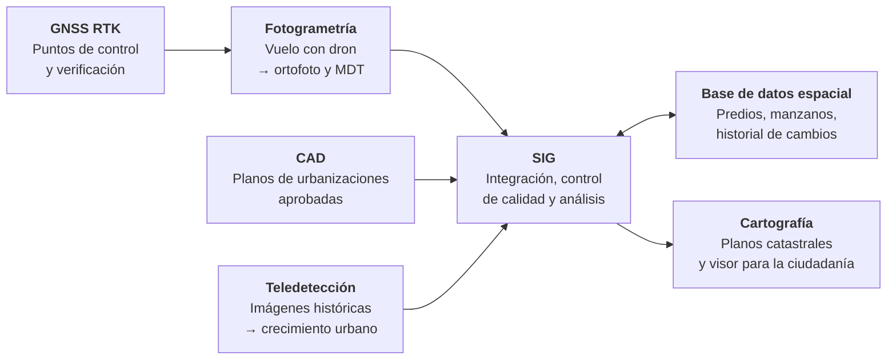

# 1.14 SIG y otras geotecnologías

!!! abstract "Objetivos de aprendizaje"

    Al finalizar este tema, el estudiante será capaz de:

    - Diferenciar el SIG de otras geotecnologías: CAD, cartografía, GNSS, teledetección, fotogrametría y bases de datos espaciales.
    - Explicar la función principal, los productos y las limitaciones de cada una.
    - Reconocer qué datos aporta cada geotecnología a un proyecto SIG.
    - Identificar los problemas habituales al integrar datos de distintas fuentes.
    - Comprender por qué las geotecnologías convergen en los proyectos actuales.

---

## Muchas tecnologías, un mismo territorio

En el trabajo real, un proyecto territorial casi nunca se resuelve con una sola herramienta. Un plan de actualización catastral, por ejemplo, puede requerir un **dron** para obtener imágenes, un **receptor GNSS** para medir puntos de control, **planos en CAD** de urbanizaciones aprobadas, una **base de datos** para almacenar los predios, un **SIG** para integrar y analizar todo, y **cartografía** para comunicar los resultados.

Cada una de esas tecnologías tiene una **función principal** distinta. Conocerlas permite saber **qué pedir a cada una**, **qué esperar de sus datos** y **cómo integrarlos**.

| Tecnología | Función principal | Pregunta que responde |
|---|---|---|
| **SIG** | Gestión y análisis espacial | ¿Qué relaciones y patrones hay en el territorio? |
| **CAD** | Diseño geométrico | ¿Cómo debe ser exactamente lo que vamos a construir? |
| **Cartografía** | Representación territorial | ¿Cómo comunicamos visualmente el territorio? |
| **GNSS** | Posicionamiento | ¿Dónde estoy exactamente? |
| **Teledetección** | Observación remota | ¿Qué hay en la superficie y cómo cambia? |
| **Fotogrametría** | Obtención de medidas desde imágenes | ¿Qué forma y dimensiones tiene el terreno o un objeto? |
| **Bases de datos espaciales** | Gestión estructurada de información geográfica | ¿Cómo almacenamos, protegemos y consultamos grandes volúmenes de datos? |

<figure class="figura">
<svg viewBox="0 0 720 420" xmlns="http://www.w3.org/2000/svg" role="img" aria-label="El SIG como integrador de GNSS, teledetección, fotogrametría, CAD, bases de datos espaciales y cartografía">
<circle cx="360" cy="215" r="60" fill="#3f6fd8" fill-opacity="0.15" stroke="#3f6fd8" stroke-width="2.5"/>
<text x="360" y="211" text-anchor="middle" font-size="22" font-weight="bold" fill="#3f6fd8">SIG</text>
<text x="360" y="233" text-anchor="middle" font-size="11" fill="currentColor">Integración</text>
<text x="360" y="247" text-anchor="middle" font-size="11" fill="currentColor">y análisis</text>
<defs>
<marker id="geo-ag" viewBox="0 0 10 10" refX="8" refY="5" markerWidth="7" markerHeight="7" orient="auto-start-reverse"><path d="M0,0 L10,5 L0,10 z" fill="#2e9e5b"/></marker>
<marker id="geo-ao" viewBox="0 0 10 10" refX="8" refY="5" markerWidth="7" markerHeight="7" orient="auto-start-reverse"><path d="M0,0 L10,5 L0,10 z" fill="#e0823d"/></marker>
<marker id="geo-ay" viewBox="0 0 10 10" refX="8" refY="5" markerWidth="7" markerHeight="7" orient="auto-start-reverse"><path d="M0,0 L10,5 L0,10 z" fill="#b8860b"/></marker>
<marker id="geo-ap" viewBox="0 0 10 10" refX="8" refY="5" markerWidth="7" markerHeight="7" orient="auto-start-reverse"><path d="M0,0 L10,5 L0,10 z" fill="#9b59b6"/></marker>
<marker id="geo-at" viewBox="0 0 10 10" refX="8" refY="5" markerWidth="7" markerHeight="7" orient="auto-start-reverse"><path d="M0,0 L10,5 L0,10 z" fill="#1b9e9e"/></marker>
<marker id="geo-ar" viewBox="0 0 10 10" refX="8" refY="5" markerWidth="7" markerHeight="7" orient="auto-start-reverse"><path d="M0,0 L10,5 L0,10 z" fill="#d63b3b"/></marker>
</defs>
<rect x="30" y="30" width="180" height="58" rx="8" fill="#2e9e5b" fill-opacity="0.12" stroke="#2e9e5b" stroke-width="2"/>
<text x="120.0" y="55" text-anchor="middle" font-size="14" font-weight="bold" fill="currentColor">GNSS</text>
<text x="120.0" y="74" text-anchor="middle" font-size="11.5" fill="currentColor">Posicionamiento</text>
<line x1="168.0" y1="90.2" x2="304.7" y2="179.0" stroke="#2e9e5b" stroke-width="2.2" marker-end="url(#geo-ag)" />
<text x="236.3" y="124.6" text-anchor="middle" font-size="11" font-style="italic" fill="currentColor">Coordenadas</text>
<rect x="510" y="30" width="180" height="58" rx="8" fill="#e0823d" fill-opacity="0.12" stroke="#e0823d" stroke-width="2"/>
<text x="600.0" y="55" text-anchor="middle" font-size="14" font-weight="bold" fill="currentColor">Teledetección</text>
<text x="600.0" y="74" text-anchor="middle" font-size="11.5" fill="currentColor">Observación remota</text>
<line x1="552.0" y1="90.2" x2="415.3" y2="179.0" stroke="#e0823d" stroke-width="2.2" marker-end="url(#geo-ao)" />
<text x="483.7" y="124.6" text-anchor="middle" font-size="11" font-style="italic" fill="currentColor">Imágenes y clasificaciones</text>
<rect x="0" y="186" width="180" height="58" rx="8" fill="#b8860b" fill-opacity="0.12" stroke="#b8860b" stroke-width="2"/>
<text x="90.0" y="211" text-anchor="middle" font-size="14" font-weight="bold" fill="currentColor">CAD</text>
<text x="90.0" y="230" text-anchor="middle" font-size="11.5" fill="currentColor">Diseño geométrico</text>
<line x1="184.0" y1="215.0" x2="294.0" y2="215.0" stroke="#b8860b" stroke-width="2.2" marker-end="url(#geo-ay)" marker-start="url(#geo-ay)"/>
<text x="239.0" y="193.0" text-anchor="middle" font-size="11" font-style="italic" fill="currentColor">Planos</text>
<text x="239.0" y="206.0" text-anchor="middle" font-size="11" font-style="italic" fill="currentColor">y diseños</text>
<rect x="540" y="186" width="180" height="58" rx="8" fill="#9b59b6" fill-opacity="0.12" stroke="#9b59b6" stroke-width="2"/>
<text x="630.0" y="211" text-anchor="middle" font-size="14" font-weight="bold" fill="currentColor">Fotogrametría</text>
<text x="630.0" y="230" text-anchor="middle" font-size="11.5" fill="currentColor">Medición desde imágenes</text>
<line x1="536.0" y1="215.0" x2="426.0" y2="215.0" stroke="#9b59b6" stroke-width="2.2" marker-end="url(#geo-ap)" />
<text x="481.0" y="193.0" text-anchor="middle" font-size="11" font-style="italic" fill="currentColor">Ortofotos</text>
<text x="481.0" y="206.0" text-anchor="middle" font-size="11" font-style="italic" fill="currentColor">y modelos 3D</text>
<rect x="30" y="342" width="180" height="58" rx="8" fill="#1b9e9e" fill-opacity="0.12" stroke="#1b9e9e" stroke-width="2"/>
<text x="120.0" y="367" text-anchor="middle" font-size="13" font-weight="bold" fill="currentColor">Bases de datos espaciales</text>
<text x="120.0" y="386" text-anchor="middle" font-size="11.5" fill="currentColor">Gestión estructurada</text>
<line x1="168.0" y1="339.8" x2="304.7" y2="251.0" stroke="#1b9e9e" stroke-width="2.2" marker-end="url(#geo-at)" marker-start="url(#geo-at)"/>
<text x="236.3" y="313.4" text-anchor="middle" font-size="11" font-style="italic" fill="currentColor">Almacenar y consultar</text>
<rect x="510" y="342" width="180" height="58" rx="8" fill="#d63b3b" fill-opacity="0.12" stroke="#d63b3b" stroke-width="2"/>
<text x="600.0" y="367" text-anchor="middle" font-size="14" font-weight="bold" fill="currentColor">Cartografía</text>
<text x="600.0" y="386" text-anchor="middle" font-size="11.5" fill="currentColor">Representación</text>
<line x1="552.0" y1="339.8" x2="415.3" y2="251.0" stroke="#d63b3b" stroke-width="2.2"  marker-start="url(#geo-ar)"/>
<text x="483.7" y="313.4" text-anchor="middle" font-size="11" font-style="italic" fill="currentColor">Mapas y planos</text>
</svg><figcaption>El SIG como entorno de integración: cada geotecnología aporta o recibe un tipo de información.</figcaption>
</figure>

---

## SIG

Como vimos en el tema 1.1, un **Sistema de Información Geográfica** integra personas, métodos, datos, software y hardware para **capturar, almacenar, gestionar, analizar y representar** información geográfica.

Lo que lo distingue de las demás geotecnologías es su capacidad para:

- **Integrar** datos de fuentes, formatos y modelos muy distintos en un mismo sistema de referencia.
- **Relacionar** geometrías con atributos.
- **Analizar** relaciones espaciales: superposición, proximidad, conectividad, patrones.
- **Modelar** escenarios y apoyar la toma de decisiones.

!!! tip "El SIG como punto de encuentro"

    Muchas geotecnologías **producen** datos (GNSS, teledetección, fotogrametría, CAD) y otras los **almacenan** o los **comunican** (bases de datos, cartografía). El SIG suele ser el entorno donde **todo se encuentra** y adquiere sentido en conjunto.

---

## CAD

!!! info "Definición"

    El **CAD** (*Computer-Aided Design*, **diseño asistido por computadora**) es la tecnología para **dibujar y diseñar** con precisión geométrica objetos, construcciones e infraestructuras.

Se usa ampliamente en **arquitectura**, **ingeniería civil**, **topografía** y **urbanismo**: planos de edificios, diseño de vías y puentes, redes de agua, loteamientos y levantamientos topográficos.

### CAD frente a SIG

| Aspecto | CAD | SIG |
|---|---|---|
| **Propósito** | Diseñar lo que **se va a construir** | Gestionar y analizar lo que **existe en el territorio** |
| **Unidad de trabajo** | Entidades de dibujo: líneas, arcos, textos, bloques | Entidades geográficas con atributos |
| **Atributos** | Limitados; la información suele estar en textos y estilos | Tablas de atributos estructuradas |
| **Capas** | Organizan el **dibujo** (colores, tipos de línea) | Organizan **temas** de información |
| **Sistema de referencia** | Frecuentemente coordenadas **locales** o sin definir | Sistema de referencia **definido** |
| **Topología y análisis** | Escasos | Centrales |
| **Precisión geométrica** | Muy alta: curvas, arcos, cotas | Alta, con geometrías más simples |
| **Escala de trabajo** | Un proyecto o una obra | Desde un predio hasta un país |
| **Formatos** | DWG, DXF, DGN | GeoPackage, Shapefile, PostGIS |

!!! warning "Problemas frecuentes al llevar datos de CAD a un SIG"

    - **Coordenadas locales** o sin sistema de referencia (tema 1.4).
    - **Unidades** distintas: dibujos en milímetros o centímetros en lugar de metros.
    - **Polígonos que no están cerrados**: los contornos de predios dibujados como líneas sueltas.
    - **Información en textos**: el número de lote o el nombre del propietario escrito como un texto cercano, no como un atributo.
    - **Capas del dibujo mezcladas**: en una misma capa conviven elementos de distinto tipo.
    - **Arcos y curvas** que deben convertirse en segmentos.

    Integrar un plano CAD suele requerir **georreferenciarlo**, **limpiarlo** y **reestructurarlo** antes de que funcione como dato geoespacial.

!!! note "CAD y SIG en QGIS"

    QGIS puede **leer** archivos DXF y, con algunas limitaciones, DWG, y **exportar** proyectos a DXF. Además, incluye herramientas de **digitalización avanzada** que permiten dibujar con distancias, ángulos y restricciones exactas, al estilo de un programa CAD.

??? info "Para saber más: BIM"

    El **BIM** (*Building Information Modeling*, **modelado de información de construcción**) es la evolución del CAD hacia modelos 3D de edificios e infraestructuras que contienen, además de la geometría, **información** sobre cada componente: materiales, costos, mantenimiento. La integración entre **BIM y SIG** es un campo en crecimiento para la gestión de ciudades e infraestructuras.

---

## Cartografía

Como vimos en el tema 1.7, la **cartografía** es la disciplina que se ocupa del **arte, la ciencia y la técnica** de elaborar y utilizar mapas.

### Cartografía frente a SIG

| Aspecto | Cartografía | SIG |
|---|---|---|
| **Naturaleza** | Una **disciplina** con siglos de historia | Un **sistema tecnológico** de las últimas décadas |
| **Objetivo principal** | **Comunicar** el territorio de forma eficaz | **Gestionar y analizar** información territorial |
| **Producto principal** | El **mapa** | La **información** y el **análisis** |
| **Pregunta central** | ¿Cómo se representa y se entiende? | ¿Qué relaciones hay y qué significan? |

La relación entre ambos es muy estrecha: el SIG ha transformado la forma de **producir** mapas, y la cartografía aporta los **principios** para que esos mapas **comuniquen** correctamente.

!!! danger "Un SIG no garantiza buena cartografía"

    Un SIG permite generar un mapa en minutos, pero no decide por nosotros la jerarquía visual, la simbología adecuada ni la composición. **Los principios de la cartografía siguen siendo indispensables**, aunque la herramienta sea digital.

---

## GNSS

!!! info "Definición"

    Los **GNSS** (*Global Navigation Satellite Systems*, **sistemas globales de navegación por satélite**) son sistemas que permiten determinar la **posición** de un receptor en cualquier lugar de la Tierra a partir de señales emitidas por constelaciones de satélites.

Es común llamar "GPS" a cualquier receptor de posicionamiento, pero **GPS es solo uno** de los sistemas existentes:

| Sistema | Operador |
|---|---|
| **GPS** | Estados Unidos |
| **GLONASS** | Rusia |
| **Galileo** | Unión Europea |
| **BeiDou** | China |

Además, existen sistemas **regionales**, como QZSS (Japón) y NavIC (India). Los receptores modernos, incluidos los de los teléfonos celulares, combinan **varias constelaciones** para mejorar la disponibilidad y la exactitud.

### ¿Cómo funciona?

<figure class="figura">
<svg viewBox="0 0 720 365" xmlns="http://www.w3.org/2000/svg" role="img" aria-label="Principio de posicionamiento GNSS por distancias a varios satélites">
<defs><clipPath id="geo-tri"><rect x="0" y="0" width="720" height="330"/></clipPath></defs><g clip-path="url(#geo-tri)">
<path d="M 427.0 143.6 A 286.6 286.6 0 0 1 243.9 340.8" fill="none" stroke="#2e9e5b" stroke-width="2" stroke-dasharray="7 5"/>
<line x1="150" y1="70" x2="360" y2="265" stroke="#2e9e5b" stroke-width="1.5" stroke-opacity="0.8"/>
<text x="265" y="168" font-size="13" font-weight="bold" fill="#2e9e5b">d₁</text>
<path d="M 468.0 258.0 A 223.6 223.6 0 0 1 261.4 220.5" fill="none" stroke="#e0823d" stroke-width="2" stroke-dasharray="7 5"/>
<line x1="400" y1="45" x2="360" y2="265" stroke="#e0823d" stroke-width="1.5" stroke-opacity="0.8"/>
<text x="390" y="155" font-size="13" font-weight="bold" fill="#e0823d">d₂</text>
<path d="M 458.5 370.1 A 297.7 297.7 0 0 1 322.4 126.0" fill="none" stroke="#9b59b6" stroke-width="2" stroke-dasharray="7 5"/>
<line x1="620" y1="120" x2="360" y2="265" stroke="#9b59b6" stroke-width="1.5" stroke-opacity="0.8"/>
<text x="500" y="192" font-size="13" font-weight="bold" fill="#9b59b6">d₃</text>
</g>
<rect x="141" y="63" width="18" height="14" rx="2" fill="#2e9e5b"/>
<rect x="119" y="66" width="18" height="8" fill="#2e9e5b" fill-opacity="0.6"/>
<rect x="163" y="66" width="18" height="8" fill="#2e9e5b" fill-opacity="0.6"/>
<text x="150" y="56" text-anchor="middle" font-size="12" fill="currentColor">Satélite 1</text>
<rect x="391" y="38" width="18" height="14" rx="2" fill="#e0823d"/>
<rect x="369" y="41" width="18" height="8" fill="#e0823d" fill-opacity="0.6"/>
<rect x="413" y="41" width="18" height="8" fill="#e0823d" fill-opacity="0.6"/>
<text x="400" y="31" text-anchor="middle" font-size="12" fill="currentColor">Satélite 2</text>
<rect x="611" y="113" width="18" height="14" rx="2" fill="#9b59b6"/>
<rect x="589" y="116" width="18" height="8" fill="#9b59b6" fill-opacity="0.6"/>
<rect x="633" y="116" width="18" height="8" fill="#9b59b6" fill-opacity="0.6"/>
<text x="620" y="106" text-anchor="middle" font-size="12" fill="currentColor">Satélite 3</text>
<circle cx="360" cy="265" r="8" fill="#3f6fd8" stroke="#fff" stroke-width="2"/>
<text x="374" y="287" font-size="13" font-weight="bold" fill="#3f6fd8">Receptor</text>
<text x="360" y="350" text-anchor="middle" font-size="12.5" fill="currentColor">Distancia = velocidad de la luz × tiempo de viaje de la señal</text>
</svg><figcaption>Principio del posicionamiento GNSS, simplificado en dos dimensiones.</figcaption>
</figure>

1. Cada satélite emite una señal que indica **su posición** y el **momento exacto** en que fue enviada.
2. El receptor mide cuánto **tiempo** tardó la señal en llegar y calcula la **distancia** a cada satélite.
3. Con las distancias a varios satélites, el receptor determina **su posición** en el punto donde todas coinciden.

Se necesitan como mínimo **cuatro satélites**: tres para las tres coordenadas de la posición y uno más para corregir el **error del reloj** del receptor, que es mucho menos preciso que los relojes atómicos de los satélites.

### Fuentes de error

| Fuente | Descripción |
|---|---|
| **Atmósfera** | La ionosfera y la troposfera retrasan las señales |
| **Multitrayectoria** | La señal rebota en edificios, cerros o superficies antes de llegar al receptor |
| **Geometría de los satélites** | Si los satélites visibles están agrupados en una zona del cielo, la posición es menos precisa |
| **Obstrucciones** | Edificios altos, vegetación densa, quebradas profundas |
| **Órbitas y relojes** | Pequeños errores en la posición y el tiempo de los satélites |

### Métodos de posicionamiento

| Método | Cómo funciona | Exactitud orientativa | Uso típico |
|---|---|---|---|
| **Autónomo** | Un solo receptor, sin correcciones | 3 a 10 m | Navegación, celulares, relevamientos generales |
| **Diferencial (DGNSS)** | Correcciones desde una estación de referencia | Submétrica | Inventarios, catastro rural |
| **RTK** | Correcciones en **tiempo real** desde una base cercana o una red | 1 a 3 cm | Topografía, catastro, replanteo de obras |
| **PPK** | Correcciones aplicadas **después**, en gabinete | 1 a 3 cm | Levantamientos con drones, zonas sin comunicación |
| **Estático** | Observaciones prolongadas y posprocesadas | Milímetros a centímetros | Redes geodésicas, puntos de control |

!!! example "GNSS y el marco de referencia de Bolivia"

    Las estaciones de operación continua de la red **MARGEN** (tema 1.4) registran observaciones GNSS de forma permanente y sirven como **referencia** para vincular los levantamientos al marco geodésico oficial del país.

!!! warning "Lo que hay que recordar al usar datos GNSS"

    - Las coordenadas se obtienen en un marco **geocéntrico** (WGS 84 o ITRF/SIRGAS).
    - Las alturas que calcula el receptor son **elipsoidales**, no alturas sobre el nivel del mar (tema 1.3).
    - La exactitud depende del **método** y de las **condiciones**: siempre hay que registrarla en los metadatos (tema 1.12).

---

## Teledetección

!!! info "Definición"

    La **teledetección** (o **percepción remota**) es la obtención de información sobre la superficie terrestre **sin contacto físico**, mediante **sensores** instalados en satélites, aviones o drones que registran la **energía electromagnética** reflejada o emitida por los objetos.

Cada material de la superficie (agua, vegetación, suelo, construcciones) **refleja la energía de forma distinta** en cada longitud de onda. Esa "firma espectral" permite identificarlos, incluso en longitudes de onda que el ojo humano no percibe, como el **infrarrojo**.

### Sensores pasivos y activos

=== "Pasivos"

    Registran la energía **del Sol** reflejada por la superficie, o la energía **térmica** emitida por ella.

    - **Ópticos multiespectrales:** registran varias bandas del visible y del infrarrojo. Ejemplos: Landsat, Sentinel-2.
    - **Térmicos:** registran la temperatura de la superficie.
    - **Limitación:** no funcionan de noche (salvo los térmicos) ni a través de las **nubes**.

=== "Activos"

    **Emiten su propia energía** y registran la que regresa.

    - **Radar (SAR):** funciona de día y de noche, y **atraviesa las nubes**. Muy útil en regiones con nubosidad frecuente, como la Amazonía durante la época de lluvias. Ejemplo: Sentinel-1.
    - **LiDAR:** emite pulsos láser y mide con gran detalle la forma del terreno, la vegetación y las construcciones. Puede registrar el suelo a través de los huecos de la vegetación.

### Productos y aplicaciones

| Producto | Descripción | Aplicación |
|---|---|---|
| **Imágenes en color natural o falso color** | Combinaciones de bandas para interpretar visualmente | Identificación de coberturas, mapas base |
| **Índices espectrales** | Operaciones entre bandas. El más conocido es el **NDVI**: `(NIR − Rojo) / (NIR + Rojo)` | Vigor de la vegetación, sequías, cultivos |
| **Clasificaciones** | Asignación de cada píxel a una clase de cobertura | Mapas de uso de suelo y cobertura |
| **Detección de cambios** | Comparación de imágenes de distintas fechas | Deforestación, expansión urbana, áreas quemadas |
| **Focos de calor** | Detección de anomalías térmicas | Monitoreo de incendios |

!!! example "Teledetección para el monitoreo de incendios"

    Bolivia ha sufrido temporadas de incendios de gran magnitud, especialmente en la Chiquitanía, la Amazonía y el Pantanal. Sistemas como **FIRMS** de la NASA publican, casi en tiempo real, los **focos de calor** detectados por sensores satelitales, y las imágenes de Sentinel-2 y Landsat permiten delimitar después las **áreas quemadas**. En un SIG, esa información se cruza con áreas protegidas, comunidades y uso de suelo para priorizar la respuesta y evaluar los daños.

### Programas satelitales de acceso libre

| Programa | Tipo | Resolución espacial | Desde |
|---|---|---|---|
| **Landsat** (NASA/USGS) | Óptico multiespectral y térmico | 30 m en los satélites actuales | 1972 |
| **Sentinel-2** (Copernicus, UE) | Óptico multiespectral | 10 a 60 m | 2015 |
| **Sentinel-1** (Copernicus, UE) | Radar | Unos 10 m | 2014 |
| **MODIS** (NASA) | Óptico, cobertura diaria | 250 m a 1 km | 1999 |

---

## Fotogrametría

!!! info "Definición"

    La **fotogrametría** es la técnica que permite obtener **medidas, formas y posiciones** de objetos y del terreno a partir de **fotografías** tomadas desde distintos puntos de vista.

Su principio es el mismo que usa la visión humana: al observar un mismo objeto **desde dos posiciones distintas**, es posible reconstruir su **forma tridimensional**. Por eso las fotografías deben tomarse con un **gran solapamiento** entre ellas.

### De la fotografía aérea al dron

Durante gran parte del siglo XX, la fotogrametría se basó en **fotografías aéreas** tomadas desde aviones y procesadas con instrumentos ópticos de gran precisión. Hoy, la combinación de **drones**, **cámaras digitales** y algoritmos de **reconstrucción automática** (conocidos como *Structure from Motion*) ha hecho la fotogrametría accesible a instituciones de todo tamaño, incluidos los gobiernos municipales.

### Productos

| Producto | Descripción | Uso en SIG |
|---|---|---|
| **Ortofoto (ortomosaico)** | Imagen corregida de las deformaciones de perspectiva y del relieve, con escala uniforme | Base para digitalizar y verificar datos |
| **Modelo digital de superficie (MDS)** | Elevación de la superficie, incluidas construcciones y vegetación | Alturas de edificaciones, obstrucciones |
| **Modelo digital del terreno (MDT)** | Elevación del suelo desnudo | Pendientes, drenaje, curvas de nivel |
| **Nube de puntos** | Millones de puntos con coordenadas X, Y, Z y color | Modelado 3D, cálculo de volúmenes |
| **Modelo 3D texturizado** | Superficie tridimensional con fotografía | Patrimonio, urbanismo, visualización |

!!! warning "Una foto aérea no es una ortofoto"

    En una fotografía aérea sin corregir, los objetos más altos y los alejados del centro aparecen **desplazados** por la perspectiva y el relieve. Solo una **ortofoto**, corregida mediante un modelo de elevación, tiene una **escala uniforme** y permite **medir** distancias y superficies de forma confiable.

!!! tip "Los puntos de control definen la exactitud"

    La exactitud absoluta de una ortofoto de dron depende, en gran medida, de los **puntos de control terrestre**: marcas en el terreno medidas con **GNSS de precisión** (tema 1.9). Los drones con **RTK o PPK** reducen la cantidad de puntos necesarios, pero siempre conviene medir **puntos de verificación** independientes para evaluar la calidad (tema 1.13).

### Fotogrametría frente a teledetección

| Aspecto | Fotogrametría | Teledetección |
|---|---|---|
| **Énfasis** | **Geometría**: forma, posición, dimensiones | **Propiedades físicas**: tipo de cobertura, estado, temperatura |
| **Resultado típico** | Ortofotos, modelos de elevación, modelos 3D | Clasificaciones, índices, detección de cambios |
| **Plataformas habituales** | Drones y aviones | Satélites y, cada vez más, drones |

En la práctica, ambas **se superponen cada vez más**: los satélites de muy alta resolución permiten hacer fotogrametría, y los drones llevan sensores multiespectrales y térmicos.

---

## Bases de datos espaciales

!!! info "Definición"

    Una **base de datos espacial** es un sistema de gestión de bases de datos que incorpora **tipos de datos geométricos**, **índices espaciales** y **funciones espaciales**, lo que permite almacenar y consultar información geográfica con las mismas garantías que cualquier otra información institucional.

### ¿Por qué no basta con archivos?

Trabajar con archivos es práctico para proyectos individuales, pero en una institución aparecen necesidades que los archivos no resuelven bien:

| Necesidad | Con archivos | Con una base de datos espacial |
|---|---|---|
| **Varios usuarios editando a la vez** | Conflictos y copias duplicadas | Acceso concurrente controlado |
| **Una sola versión de los datos** | Muchas copias en distintas computadoras | Un repositorio central |
| **Permisos** | Quien tiene el archivo puede modificarlo | Permisos por usuario, tabla y operación |
| **Integridad** | Nada impide valores incorrectos | Restricciones, dominios, claves y relaciones |
| **Grandes volúmenes** | Archivos lentos o con límites de tamaño | Millones de registros con índices espaciales |
| **Integración** | Difícil de conectar con otros sistemas | Conexión con aplicaciones web, sistemas de trámites o de recaudación |
| **Respaldos** | Manuales y dispersos | Centralizados y programables |

### Principales opciones

| Sistema | Tipo | Uso típico |
|---|---|---|
| **PostgreSQL + PostGIS** | Servidor, de código abierto | Sistemas institucionales, aplicaciones web, grandes volúmenes |
| **GeoPackage / SpatiaLite** | Archivo basado en SQLite | Proyectos individuales, trabajo de campo, intercambio |
| **Oracle Spatial, SQL Server** | Servidor, comerciales | Grandes organizaciones con esas plataformas |
| **DuckDB Spatial** | Motor analítico en archivo | Análisis rápido de grandes conjuntos de datos |

### Consultas espaciales con SQL

Las bases de datos espaciales permiten hacer análisis directamente con **SQL**, el lenguaje estándar de consulta de bases de datos.

!!! example "¿Cuántas unidades educativas hay en cada distrito?"

    ```sql
    SELECT d.nombre AS distrito,
           COUNT(u.id) AS unidades_educativas
    FROM distritos AS d
    LEFT JOIN unidades_educativas AS u
           ON ST_Within(u.geom, d.geom)
    GROUP BY d.nombre
    ORDER BY unidades_educativas DESC;
    ```

    La función `ST_Within` evalúa la relación espacial **está dentro de** (tema 1.2), sin necesidad de abrir un SIG de escritorio.

!!! note "Bases de datos y QGIS"

    QGIS se conecta directamente a PostGIS y a GeoPackage: permite **visualizar**, **editar** y **consultar** sus capas como si fueran archivos locales, y ejecutar consultas SQL desde el **Administrador de bases de datos**. Es la combinación más habitual en los SIG institucionales basados en software libre.

---

## Formatos y datos de cada geotecnología

| Geotecnología | Datos que produce o gestiona | Formatos habituales |
|---|---|---|
| **GNSS** | Puntos, recorridos, observaciones crudas | CSV, GPX, NMEA, RINEX |
| **Teledetección** | Imágenes multiespectrales, radar, productos derivados | GeoTIFF, JPEG 2000, HDF, NetCDF |
| **Fotogrametría** | Ortofotos, modelos de elevación, nubes de puntos, modelos 3D | GeoTIFF, LAS/LAZ, OBJ, PLY |
| **CAD** | Planos, diseños, levantamientos topográficos | DWG, DXF, DGN |
| **Bases de datos espaciales** | Tablas con geometrías y atributos | PostGIS, GeoPackage |
| **Cartografía** | Mapas impresos y digitales | PDF, PDF georreferenciado, SVG, PNG |
| **SIG** | Capas vectoriales y ráster, proyectos | GeoPackage, Shapefile, GeoTIFF, proyectos `.qgz` |

---

## Las geotecnologías convergen

Hace algunas décadas, cada geotecnología era un **mundo separado**: con sus propios profesionales, equipos, programas y formatos. Hoy, los límites entre ellas son **cada vez más difusos**.

- Los **programas CAD** incorporan sistemas de referencia y funciones SIG, y los **SIG** incorporan herramientas de dibujo de precisión.
- Los **teléfonos celulares** llevan receptores GNSS multiconstelación, y aplicaciones como **QField** permiten capturar datos SIG en campo.
- Los **drones** combinan GNSS de precisión, fotogrametría y sensores multiespectrales en un solo vuelo.
- Las **imágenes satelitales** se procesan en la **nube**, sin descargarlas, y sus resultados llegan directamente al SIG.
- Las **bases de datos espaciales** almacenan tanto datos vectoriales como ráster, y alimentan visores web y aplicaciones.

### Un proyecto integrado



*Esquema de un proyecto de actualización catastral municipal que integra varias geotecnologías.*

!!! success "La consecuencia para el profesional"

    Hoy no basta con dominar un solo programa. Un profesional de las geotecnologías necesita **comprender los fundamentos** de todas ellas: de dónde vienen los datos, qué exactitud tienen, en qué sistema de referencia están y cómo se integran. Es precisamente lo que construye este **Módulo 1**: sistemas de referencia, escala, exactitud, modelos y calidad son el **lenguaje común** de todas las geotecnologías.

---

## Ideas clave

!!! success "Para recordar"

    - Cada geotecnología tiene una **función principal**: el **SIG** gestiona y analiza; el **CAD** diseña; la **cartografía** representa; el **GNSS** posiciona; la **teledetección** observa; la **fotogrametría** mide desde imágenes; las **bases de datos espaciales** gestionan de forma estructurada.
    - El **SIG** actúa como **entorno de integración** de los datos que producen las demás.
    - Los datos de **CAD** suelen requerir georreferenciación, limpieza y reestructuración para usarse en un SIG.
    - El **GNSS** requiere al menos **cuatro satélites**; su exactitud depende del **método**: de metros (autónomo) a centímetros (RTK, PPK).
    - La **teledetección** usa sensores **pasivos** (ópticos, térmicos) y **activos** (radar, LiDAR).
    - La **fotogrametría** produce **ortofotos**, **modelos de elevación** y **nubes de puntos**; su exactitud depende de los **puntos de control**.
    - Las **bases de datos espaciales** aportan multiusuario, integridad, permisos y consultas SQL.
    - Las geotecnologías **convergen**: comprender sus fundamentos comunes es más importante que dominar un único programa.

---

## Autoevaluación

??? question "1. ¿Qué geotecnología es la más adecuada para cada tarea?"

    - Diseñar el trazado de una nueva avenida → **CAD**.
    - Determinar qué barrios quedan a más de 1 km de un centro de salud → **SIG**.
    - Medir la posición de los hitos de un predio con precisión centimétrica → **GNSS** (RTK).
    - Detectar la pérdida de bosque en un municipio entre 2015 y 2025 → **Teledetección**.
    - Obtener una ortofoto actualizada de un barrio → **Fotogrametría** (con dron).
    - Permitir que 15 técnicos editen la capa de predios al mismo tiempo → **Base de datos espacial**.
    - Elaborar el mapa de zonificación para socializar un plan con la población → **Cartografía**.

??? question "2. Un plano de loteamiento en DWG aparece en medio del océano al abrirlo en QGIS. ¿Qué pudo haber pasado y qué pasos seguirías?"

    Probablemente el plano está en **coordenadas locales** o sin sistema de referencia (tema 1.4). Habría que identificar puntos del plano con coordenadas conocidas, **georreferenciarlo**, verificar sus **unidades**, cerrar los **polígonos** abiertos y convertir los **textos** relevantes en **atributos**.

??? question "3. ¿Por qué un receptor GNSS necesita al menos cuatro satélites?"

    Porque debe resolver **cuatro incógnitas**: las tres coordenadas de su posición y el **error de su reloj**, que no es tan preciso como los relojes atómicos de los satélites.

??? question "4. ¿Por qué el radar es especialmente útil para monitorear la Amazonía durante la época de lluvias?"

    Porque es un sensor **activo** que emite su propia energía en longitudes de onda que **atraviesan las nubes**, y funciona de día y de noche. Los sensores ópticos, en cambio, no pueden observar la superficie cuando está cubierta de nubes.

??? question "5. ¿Por qué no se deben medir superficies sobre una fotografía aérea sin corregir?"

    Porque tiene deformaciones por **perspectiva** y por **relieve**: los objetos se desplazan según su altura y su distancia al centro de la imagen, y la escala no es uniforme. Para medir se necesita una **ortofoto**.

??? question "6. Menciona tres ventajas de usar PostGIS en lugar de archivos Shapefile para el catastro de un municipio."

    Entre otras: **edición simultánea** por varios usuarios, **permisos** por usuario, **integridad** mediante restricciones y relaciones, **un único repositorio** sin copias dispersas, capacidad para **grandes volúmenes** con índices espaciales, **consultas SQL** e **integración** con otros sistemas institucionales.

---

## Actividad propuesta

!!! example "Actividad 1.14 — Mapa de geotecnologías del proyecto integrador (sin software)"

    Retoma el proyecto integrador de las actividades anteriores y desarrolla lo siguiente:

    1. Identifica qué **geotecnologías** intervienen o podrían intervenir en tu proyecto.
    2. Para cada una, indica qué **datos** aporta, en qué **formato** y con qué **exactitud** esperada.
    3. Identifica los **problemas de integración** que podrían surgir: sistemas de referencia, unidades, formatos, escalas, fechas.
    4. Elabora un **diagrama de flujo** de tu proyecto que muestre cómo circulan los datos entre las distintas geotecnologías, similar al del ejemplo de este tema.
    5. Decide si tu proyecto necesita una **base de datos espacial** o si basta con archivos, y justifica tu respuesta.

---

## Referencias

- Chuvieco, E. (2010). *Teledetección ambiental: la observación de la Tierra desde el espacio* (3.ª ed.). Ariel.
- Hofmann-Wellenhof, B., Lichtenegger, H., & Wasle, E. (2008). *GNSS – Global Navigation Satellite Systems: GPS, GLONASS, Galileo, and more*. Springer.
- Lillesand, T., Kiefer, R. W., & Chipman, J. (2015). *Remote Sensing and Image Interpretation* (7.ª ed.). Wiley.
- Longley, P. A., Goodchild, M. F., Maguire, D. J., & Rhind, D. W. (2015). *Geographic Information Science and Systems* (4.ª ed.). Wiley.
- NASA. *Fire Information for Resource Management System (FIRMS)*. <https://firms.modaps.eosdis.nasa.gov>
- Obe, R. O., & Hsu, L. S. (2021). *PostGIS in Action* (3.ª ed.). Manning.
- Olaya, V. (2020). *Sistemas de Información Geográfica*. Libro libre disponible en línea.
- Wolf, P. R., Dewitt, B. A., & Wilkinson, B. E. (2014). *Elements of Photogrammetry with Applications in GIS* (4.ª ed.). McGraw-Hill.
