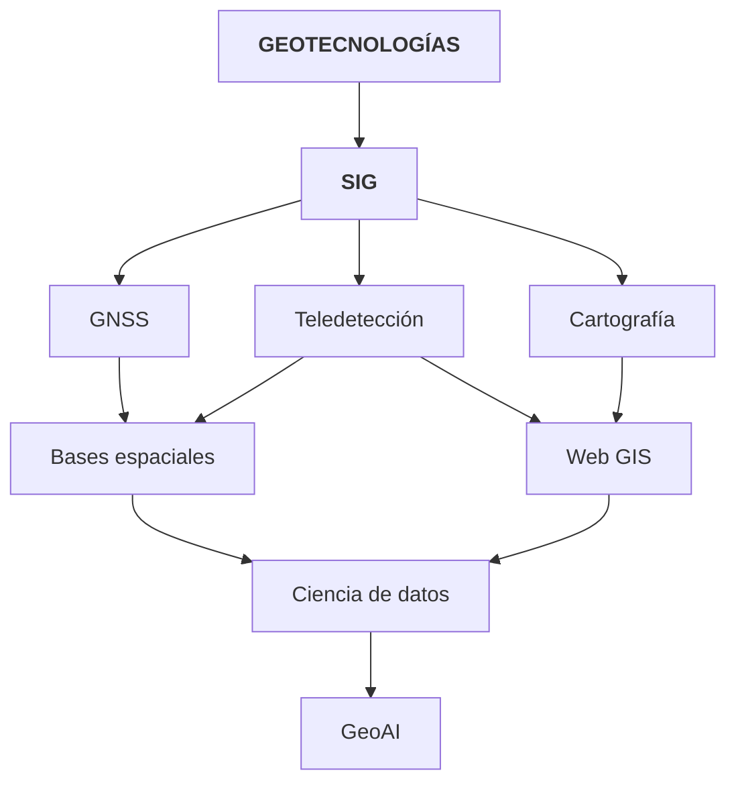
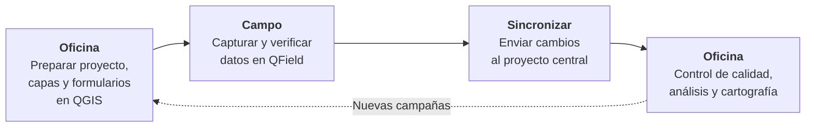
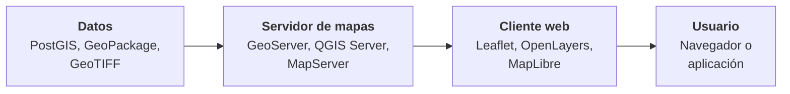
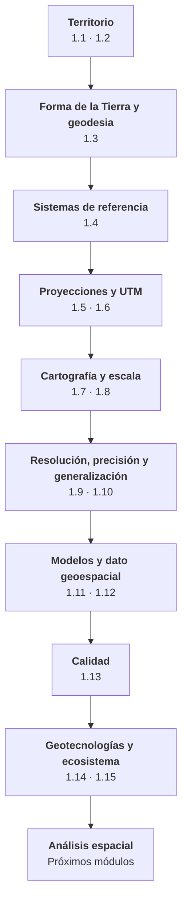

# 1.15 Ecosistema de geotecnologías

!!! abstract "Objetivos de aprendizaje"

    Al finalizar este tema, el estudiante será capaz de:

    - Describir la evolución del SIG desde un programa aislado hacia un ecosistema de tecnologías.
    - Diferenciar el SIG de escritorio, el SIG móvil y el Web GIS, y su papel en un flujo de trabajo.
    - Explicar qué es una infraestructura de datos espaciales y cómo se usan sus servicios.
    - Reconocer las tendencias actuales en captura de datos, almacenamiento en la nube y formatos abiertos.
    - Comprender el papel de la automatización, la ciencia de datos geoespaciales y la GeoAI.
    - Integrar los conceptos del Módulo 1 en una visión de conjunto.

---

## Del programa al ecosistema

Durante sus primeras décadas, un SIG era **un programa instalado en una computadora**, manejado por especialistas, con datos guardados en archivos locales. Hoy el panorama es muy distinto: la información geográfica se **captura** con celulares, drones y satélites, se **almacena** en bases de datos y en la nube, se **analiza** con programas de escritorio, código e inteligencia artificial, y se **publica** en visores web que cualquier persona puede consultar.

Ya no hablamos de un programa, sino de un **ecosistema de geotecnologías** que se complementan.



### Una evolución en cuatro etapas

| Etapa | Características | Hitos |
|---|---|---|
| **1960–1980: los orígenes** | Grandes computadoras, proyectos gubernamentales, especialistas | Primer SIG en Canadá; primeros sistemas comerciales |
| **1980–2000: el escritorio** | SIG en computadoras personales; datos en archivos locales | Popularización del SIG de escritorio; GPS de uso civil |
| **2000–2015: la web y lo abierto** | Mapas en internet, software libre, datos colaborativos, estándares abiertos | Google Earth, OpenStreetMap, QGIS, PostGIS, servicios OGC |
| **2015–hoy: nube, móvil e IA** | Procesamiento en la nube, captura con celulares y drones, imágenes gratuitas, inteligencia artificial | Sentinel, plataformas en la nube, formatos nativos de nube, modelos fundacionales de observación de la Tierra |

### Una forma de organizar el ecosistema

<figure class="figura">
<svg viewBox="0 0 720 454" xmlns="http://www.w3.org/2000/svg" role="img" aria-label="Ecosistema de geotecnologías organizado en captura, almacenamiento, procesamiento y publicación">
<rect x="10" y="20" width="700" height="74" rx="10" fill="#2e9e5b" fill-opacity="0.08" stroke="#2e9e5b" stroke-width="1.5"/>
<text x="24" y="62.0" font-size="14" font-weight="bold" fill="#2e9e5b">Captura</text>
<rect x="175.0" y="41.0" width="45.9" height="32" rx="16" fill="#2e9e5b" fill-opacity="0.18" stroke="#2e9e5b" stroke-width="1.2"/>
<text x="198.0" y="62.0" text-anchor="middle" font-size="12" fill="currentColor">GNSS</text>
<rect x="230.0" y="41.0" width="58.8" height="32" rx="16" fill="#2e9e5b" fill-opacity="0.18" stroke="#2e9e5b" stroke-width="1.2"/>
<text x="259.4" y="62.0" text-anchor="middle" font-size="12" fill="currentColor">Drones</text>
<rect x="298.0" y="41.0" width="78.2" height="32" rx="16" fill="#2e9e5b" fill-opacity="0.18" stroke="#2e9e5b" stroke-width="1.2"/>
<text x="337.1" y="62.0" text-anchor="middle" font-size="12" fill="currentColor">Satélites</text>
<rect x="385.3" y="41.0" width="97.6" height="32" rx="16" fill="#2e9e5b" fill-opacity="0.18" stroke="#2e9e5b" stroke-width="1.2"/>
<text x="434.1" y="62.0" text-anchor="middle" font-size="12" fill="currentColor">Sensores IoT</text>
<rect x="492.1" y="41.0" width="78.2" height="32" rx="16" fill="#2e9e5b" fill-opacity="0.18" stroke="#2e9e5b" stroke-width="1.2"/>
<text x="531.2" y="62.0" text-anchor="middle" font-size="12" fill="currentColor">SIG móvil</text>
<rect x="579.4" y="41.0" width="110.6" height="32" rx="16" fill="#2e9e5b" fill-opacity="0.18" stroke="#2e9e5b" stroke-width="1.2"/>
<text x="634.7" y="62.0" text-anchor="middle" font-size="12" fill="currentColor">Datos abiertos</text>
<line x1="360" y1="96" x2="360" y2="108" stroke="currentColor" stroke-width="2"/>
<polygon points="360,115 354,106 366,106" fill="currentColor"/>
<rect x="10" y="116" width="700" height="74" rx="10" fill="#1b9e9e" fill-opacity="0.08" stroke="#1b9e9e" stroke-width="1.5"/>
<text x="24" y="151.0" font-size="14" font-weight="bold" fill="#1b9e9e">Almacenamiento</text>
<text x="24" y="169.0" font-size="14" font-weight="bold" fill="#1b9e9e">y gestión</text>
<rect x="175.0" y="137.0" width="184.1" height="32" rx="16" fill="#1b9e9e" fill-opacity="0.18" stroke="#1b9e9e" stroke-width="1.2"/>
<text x="267.0" y="158.0" text-anchor="middle" font-size="12" fill="currentColor">Bases de datos espaciales</text>
<rect x="368.3" y="137.0" width="46.5" height="32" rx="16" fill="#1b9e9e" fill-opacity="0.18" stroke="#1b9e9e" stroke-width="1.2"/>
<text x="391.5" y="158.0" text-anchor="middle" font-size="12" fill="currentColor">Nube</text>
<rect x="424.0" y="137.0" width="177.5" height="32" rx="16" fill="#1b9e9e" fill-opacity="0.18" stroke="#1b9e9e" stroke-width="1.2"/>
<text x="512.8" y="158.0" text-anchor="middle" font-size="12" fill="currentColor">Formatos nativos de nube</text>
<rect x="610.7" y="137.0" width="79.3" height="32" rx="16" fill="#1b9e9e" fill-opacity="0.18" stroke="#1b9e9e" stroke-width="1.2"/>
<text x="650.4" y="158.0" text-anchor="middle" font-size="12" fill="currentColor">Catálogos</text>
<line x1="360" y1="192" x2="360" y2="204" stroke="currentColor" stroke-width="2"/>
<polygon points="360,211 354,202 366,202" fill="currentColor"/>
<rect x="10" y="212" width="700" height="74" rx="10" fill="#3f6fd8" fill-opacity="0.08" stroke="#3f6fd8" stroke-width="1.5"/>
<text x="24" y="247.0" font-size="14" font-weight="bold" fill="#3f6fd8">Procesamiento</text>
<text x="24" y="265.0" font-size="14" font-weight="bold" fill="#3f6fd8">y análisis</text>
<rect x="188.9" y="233.0" width="142.7" height="32" rx="16" fill="#3f6fd8" fill-opacity="0.18" stroke="#3f6fd8" stroke-width="1.2"/>
<text x="260.2" y="254.0" text-anchor="middle" font-size="12" fill="currentColor">SIG de escritorio</text>
<rect x="341.6" y="233.0" width="121.4" height="32" rx="16" fill="#3f6fd8" fill-opacity="0.18" stroke="#3f6fd8" stroke-width="1.2"/>
<text x="402.3" y="254.0" text-anchor="middle" font-size="12" fill="currentColor">Automatización</text>
<rect x="473.0" y="233.0" width="135.6" height="32" rx="16" fill="#3f6fd8" fill-opacity="0.18" stroke="#3f6fd8" stroke-width="1.2"/>
<text x="540.8" y="254.0" text-anchor="middle" font-size="12" fill="currentColor">Ciencia de datos</text>
<rect x="618.6" y="233.0" width="57.5" height="32" rx="16" fill="#3f6fd8" fill-opacity="0.18" stroke="#3f6fd8" stroke-width="1.2"/>
<text x="647.4" y="254.0" text-anchor="middle" font-size="12" fill="currentColor">GeoAI</text>
<line x1="360" y1="288" x2="360" y2="300" stroke="currentColor" stroke-width="2"/>
<polygon points="360,307 354,298 366,298" fill="currentColor"/>
<rect x="10" y="308" width="700" height="74" rx="10" fill="#e0823d" fill-opacity="0.08" stroke="#e0823d" stroke-width="1.5"/>
<text x="24" y="343.0" font-size="14" font-weight="bold" fill="#e0823d">Publicación</text>
<text x="24" y="361.0" font-size="14" font-weight="bold" fill="#e0823d">y uso</text>
<rect x="176.5" y="329.0" width="71.7" height="32" rx="16" fill="#e0823d" fill-opacity="0.18" stroke="#e0823d" stroke-width="1.2"/>
<text x="212.3" y="350.0" text-anchor="middle" font-size="12" fill="currentColor">Web GIS</text>
<rect x="258.2" y="329.0" width="43.3" height="32" rx="16" fill="#e0823d" fill-opacity="0.18" stroke="#e0823d" stroke-width="1.2"/>
<text x="279.8" y="350.0" text-anchor="middle" font-size="12" fill="currentColor">IDE</text>
<rect x="311.5" y="329.0" width="149.8" height="32" rx="16" fill="#e0823d" fill-opacity="0.18" stroke="#e0823d" stroke-width="1.2"/>
<text x="386.4" y="350.0" text-anchor="middle" font-size="12" fill="currentColor">Visores y tableros</text>
<rect x="471.3" y="329.0" width="107.2" height="32" rx="16" fill="#e0823d" fill-opacity="0.18" stroke="#e0823d" stroke-width="1.2"/>
<text x="524.9" y="350.0" text-anchor="middle" font-size="12" fill="currentColor">Aplicaciones</text>
<rect x="588.5" y="329.0" width="100.1" height="32" rx="16" fill="#e0823d" fill-opacity="0.18" stroke="#e0823d" stroke-width="1.2"/>
<text x="638.5" y="350.0" text-anchor="middle" font-size="12" fill="currentColor">Cartografía</text>
<rect x="10" y="404" width="700" height="40" rx="10" fill="#9b59b6" fill-opacity="0.12" stroke="#9b59b6" stroke-width="1.5" stroke-dasharray="6 4"/>
<text x="118" y="429" font-size="13" font-weight="bold" fill="#9b59b6">Transversal:</text>
<text x="220" y="429" font-size="13" fill="currentColor">personas · métodos · estándares abiertos · metadatos · calidad</text>
</svg><figcaption>El ecosistema de geotecnologías organizado según el recorrido de los datos.</figcaption>
</figure>

---

## SIG de escritorio

El **SIG de escritorio** sigue siendo el **centro de trabajo** del profesional: el entorno donde se editan datos, se ejecutan análisis complejos, se controla la calidad y se produce cartografía de alta calidad.

| Software | Tipo | Características |
|---|---|---|
| **QGIS** | Libre y de código abierto | Muy completo, multiplataforma, con miles de complementos. Integra GRASS, GDAL y SAGA. |
| **GRASS GIS** | Libre y de código abierto | Potente en análisis ráster, hidrología y topología |
| **SAGA GIS** | Libre y de código abierto | Especializado en análisis del terreno y geoestadística |
| **ArcGIS Pro** | Comercial | Muy difundido en grandes organizaciones, parte del ecosistema de Esri |

!!! tip "El valor de los complementos"

    Una de las grandes fortalezas de QGIS es su **repositorio de complementos** (*plugins*), desarrollados por la comunidad, que añaden funciones de teledetección, hidrología, catastro, conexión con servicios en línea y mucho más. Con el tiempo, cada profesional arma su propio conjunto de herramientas.

---

## SIG móvil

El **SIG móvil** lleva los datos y los formularios **al terreno**: permite capturar, verificar y actualizar información directamente en campo, con un celular o una tableta.

### Características

- **Trabajo sin conexión:** los datos se descargan antes de salir y se sincronizan al volver.
- **Formularios con validación:** listas de valores, campos obligatorios, restricciones (tema 1.12).
- **Posicionamiento:** con el GNSS del dispositivo o con un **receptor externo de precisión** conectado por Bluetooth.
- **Fotografías y archivos adjuntos** asociados a cada registro.
- **Sincronización** con el proyecto central y con otros usuarios.

| Aplicación | Características |
|---|---|
| **QField** | Libre; abre directamente proyectos de QGIS con sus estilos y formularios. Sincroniza con **QFieldCloud**. |
| **Mergin Maps** | Basada en QGIS, orientada a la sincronización entre equipos |
| **ODK / KoboToolbox** | Centradas en **encuestas** con localización; muy usadas en proyectos sociales y humanitarios |
| **ArcGIS Field Maps / Survey123** | Comerciales, integradas al ecosistema de Esri |

### Flujo de trabajo típico



!!! warning "Diseñar el formulario es diseñar la calidad"

    La calidad de los datos de campo se define **antes de salir**: un formulario con listas de valores, campos obligatorios, identificadores únicos (UUID) y restricciones evita la mayoría de los errores de consistencia lógica y completitud (tema 1.13). Corregirlos después, en oficina, es mucho más costoso.

---

## Web GIS

El **Web GIS** permite **publicar, consultar y compartir** información geográfica a través de internet, sin que el usuario necesite instalar un SIG.

### Arquitectura básica



| Componente | Función | Ejemplos |
|---|---|---|
| **Servidor de mapas** | Lee los datos y los publica como **servicios** estandarizados | GeoServer, QGIS Server, MapServer |
| **Cliente web** | Biblioteca que muestra el mapa en el navegador y permite interactuar con él | Leaflet, OpenLayers, MapLibre GL JS |
| **Plataformas de publicación** | Publican proyectos de QGIS como visores web con poca programación | Lizmap, QWC2 |
| **Teselas** | Mapas divididos en pequeñas piezas por nivel de acercamiento, para una carga rápida | Teselas ráster, teselas vectoriales, PMTiles |

### Servicios estandarizados

Para que cualquier cliente pueda consumir los datos de cualquier servidor, el **Open Geospatial Consortium (OGC)** define estándares de servicios:

| Estándar | Qué publica | Uso típico |
|---|---|---|
| **WMS** | **Imágenes** del mapa ya dibujado | Visualizar capas de otra institución |
| **WMTS** | Imágenes en **teselas** precalculadas | Mapas base rápidos |
| **WFS** | **Datos vectoriales** con geometrías y atributos | Descargar o consultar entidades |
| **WCS** | **Datos ráster** con sus valores | Descargar modelos de elevación o imágenes |
| **OGC API** (Features, Maps, Tiles...) | La nueva generación de estándares, basada en tecnologías web modernas | Integración con aplicaciones web |

!!! example "Web GIS en la gestión municipal"

    - **Visor ciudadano** para consultar la zonificación, el uso de suelo permitido o la ubicación de servicios.
    - **Visor interno** para que distintas unidades del gobierno municipal consulten el catastro sin duplicar archivos.
    - **Tableros de seguimiento** de obras, reclamos vecinales o recaudación, con mapas actualizados.
    - **Formularios web** para que la población reporte baches, luminarias apagadas o puntos de acumulación de basura.

---

## Infraestructuras de datos espaciales

!!! info "Definición"

    Una **infraestructura de datos espaciales (IDE)** es el conjunto de **tecnologías, políticas, estándares, acuerdos institucionales y recursos humanos** que permite **producir, compartir, encontrar y usar** información geográfica de manera coordinada entre instituciones.

Una IDE no es solo un geoportal: es un **acuerdo** para que las instituciones dejen de producir datos de forma aislada y duplicada.

### Componentes de una IDE

| Componente | Descripción |
|---|---|
| **Datos** | Información geográfica de referencia y temática producida por las instituciones |
| **Metadatos** | Descripción de los datos según normas (tema 1.12) |
| **Servicios** | Servicios de visualización, descarga y catálogo según estándares OGC |
| **Estándares** | Normas técnicas comunes: sistemas de referencia, formatos, metadatos, calidad |
| **Políticas y acuerdos** | Reglas sobre quién produce qué, cómo se comparte y en qué condiciones |
| **Personas** | Productores, administradores y usuarios con capacidades técnicas |
| **Geoportal** | Punto de acceso web para buscar, visualizar y descargar |

!!! example "IDE en Bolivia y el mundo"

    - **GeoBolivia** es la infraestructura de datos espaciales del Estado Plurinacional de Bolivia: reúne información geográfica de diversas instituciones públicas y la publica mediante un geoportal, un catálogo de metadatos y servicios estándar.
    - **INSPIRE** es la iniciativa que establece una infraestructura de datos espaciales común para la Unión Europea.
    - A nivel global, el **Comité de Expertos de las Naciones Unidas sobre la Gestión Mundial de la Información Geoespacial (UN-GGIM)** promueve el **Marco Integrado de Información Geoespacial** como guía para que los países fortalezcan su gestión de datos geoespaciales.

!!! tip "Consumir servicios de una IDE en QGIS"

    En lugar de descargar y copiar archivos, QGIS puede **conectarse directamente** a los servicios WMS y WFS de una IDE desde el panel **Navegador**. Así se trabaja siempre con la **versión oficial y actualizada** de los datos, sin generar copias desactualizadas. Lo practicaremos en los próximos módulos.

---

## Sensores remotos, drones y GNSS

En el tema 1.14 estudiamos los fundamentos de estas tecnologías. Aquí nos interesan sus **tendencias actuales**.

=== "Satélites"

    - **Más datos gratuitos:** los programas Landsat y Copernicus (Sentinel) ofrecen imágenes de libre acceso con una frecuencia de pocos días.
    - **Constelaciones de pequeños satélites** comerciales que fotografían gran parte de la Tierra **a diario**, con resoluciones de pocos metros.
    - **Nuevas misiones de radar**, como NISAR (NASA–ISRO), que observan la superficie a través de las nubes y detectan deformaciones del terreno.
    - **Procesamiento en la nube:** ya no es necesario descargar las imágenes para analizarlas.

=== "Drones"

    - **Receptores RTK y PPK** integrados, que reducen la necesidad de puntos de control.
    - **Sensores diversos:** cámaras RGB, multiespectrales, térmicas y LiDAR.
    - **Software libre** de procesamiento fotogramétrico, como OpenDroneMap.
    - **Uso municipal** creciente: catastro, seguimiento de obras, gestión de riesgos y áreas verdes.
    - Su uso requiere cumplir la **normativa de aviación civil** vigente.

=== "GNSS"

    - **Receptores multiconstelación y de doble frecuencia** en teléfonos celulares, que mejoran la exactitud respecto a los primeros GPS.
    - **Redes de estaciones de referencia** que ofrecen correcciones en tiempo real a través de internet.
    - **Servicios de alta precisión** gratuitos, como el de Galileo, con exactitudes del orden de decímetros.

=== "Sensores en tiempo real"

    - **Sensores conectados** (*Internet de las cosas*, IoT) que envían datos de forma continua: estaciones meteorológicas, niveles de ríos, calidad del aire, tráfico.
    - Permiten **sistemas de alerta temprana** ante inundaciones o incendios.
    - Transforman el SIG en una herramienta de **monitoreo en tiempo real**, no solo de análisis histórico.

---

## Bases de datos, nube y formatos abiertos

### Los datos se mueven a la nube

El crecimiento del volumen de datos, sobre todo de imágenes satelitales, ha impulsado un cambio de paradigma: **en lugar de llevar los datos al análisis, se lleva el análisis a los datos**.

| Plataforma | Qué ofrece |
|---|---|
| **Google Earth Engine** | Catálogo de décadas de imágenes satelitales y capacidad de procesamiento a escala planetaria |
| **Copernicus Data Space Ecosystem** | Acceso y procesamiento de los datos del programa europeo Copernicus |
| **Catálogos de datos abiertos en la nube** | Grandes colecciones de datos públicos listos para usar, alojadas por distintos proveedores |

### Formatos nativos de nube

Estos formatos permiten **leer solo la parte que se necesita** de un archivo alojado en internet, sin descargarlo completo:

| Formato | Tipo de dato | Característica |
|---|---|---|
| **Cloud Optimized GeoTIFF (COG)** | Ráster | GeoTIFF organizado para leerse por partes |
| **GeoParquet** | Vectorial | Formato columnar muy eficiente para grandes volúmenes y análisis |
| **FlatGeobuf** | Vectorial | Rápido para transmitir y leer por partes |
| **Zarr** | Ráster multidimensional | Series temporales y datos climáticos |
| **PMTiles** | Teselas | Un único archivo con todas las teselas de un mapa web |

!!! note "Catálogos STAC"

    El estándar **STAC** (*SpatioTemporal Asset Catalog*) define una forma común de **describir y buscar** colecciones de imágenes y datos geoespaciales. Muchos proveedores de imágenes satelitales publican sus catálogos con STAC, lo que permite buscar escenas por lugar, fecha y cobertura de nubes con las mismas herramientas.

### Datos abiertos y colaborativos

- **OpenStreetMap:** el mapa colaborativo del mundo, construido por millones de voluntarios.
- **Overture Maps:** iniciativa de varias empresas tecnológicas que publica datos abiertos de edificios, lugares, vías y límites, combinando diversas fuentes.
- **MapBiomas:** iniciativa que produce **mapas anuales de cobertura y uso del suelo** para varios países de Sudamérica, incluida Bolivia, a partir de imágenes satelitales.

!!! warning "Abiertos no significa sin revisar"

    Los datos abiertos y colaborativos son un recurso extraordinario, pero su **calidad, completitud y vigencia varían** según la zona y el tema. Antes de usarlos, aplica los criterios de calidad del tema 1.13.

---

## Automatización

Muchas tareas SIG se **repiten**: reproyectar decenas de capas, recortar datos para cada distrito, generar el mismo mapa cada mes, actualizar indicadores. Hacerlas a mano consume tiempo y **multiplica los errores**. La automatización permite que un proceso se ejecute siempre **de la misma forma**.

### Niveles de automatización

| Nivel | Herramienta | Requiere programar |
|---|---|---|
| **Procesamiento por lotes** | Ejecutar una herramienta de QGIS sobre muchos archivos a la vez | No |
| **Modelos gráficos** | Encadenar herramientas en un diagrama con el **diseñador de modelos** de QGIS | No |
| **Línea de comandos** | GDAL/OGR y `qgis_process` para ejecutar procesos desde la terminal | Básico |
| **Scripts en Python** | PyQGIS y bibliotecas de Python para procesos completos y personalizados | Sí |
| **SQL** | Consultas y procesos dentro de bases de datos espaciales (tema 1.14) | Sí |
| **Tareas programadas** | Ejecutar procesos automáticamente cada día, semana o mes | Sí |

!!! example "Dos ejemplos breves"

    **Reproyectar una capa desde la terminal con GDAL/OGR:**

    ```bash
    ogr2ogr -t_srs EPSG:32719 predios_utm.gpkg predios.gpkg
    ```

    **Generar un área de influencia de 500 m con PyQGIS:**

    ```python
    import processing

    processing.run("native:buffer", {
        "INPUT": "unidades_educativas.gpkg",
        "DISTANCE": 500,
        "DISSOLVE": False,
        "OUTPUT": "area_influencia_500m.gpkg",
    })
    ```

!!! tip "Automatizar también es documentar"

    Un modelo o un script es, al mismo tiempo, la **documentación exacta** de un proceso: registra qué herramientas se usaron, en qué orden y con qué parámetros. Es la forma más confiable de mantener el **linaje** de los datos (tema 1.13) y de que otra persona pueda **reproducir** el trabajo.

---

## Ciencia de datos geoespaciales

La **ciencia de datos geoespaciales** combina los fundamentos del SIG con la **programación**, la **estadística** y el **análisis de grandes volúmenes de datos** para extraer conocimiento del territorio.

### Herramientas

| Lenguaje | Bibliotecas principales |
|---|---|
| **Python** | GeoPandas (vectorial), Shapely (geometrías), Rasterio y xarray (ráster), scikit-learn (aprendizaje automático) |
| **R** | sf (vectorial), terra (ráster), spdep (estadística espacial) |
| **SQL** | PostGIS, DuckDB Spatial |

A menudo se trabaja en **cuadernos interactivos** (como Jupyter), que combinan código, resultados, gráficos, mapas y explicaciones en un mismo documento.

!!! example "Contar unidades educativas por distrito con GeoPandas"

    ```python
    import geopandas as gpd

    distritos = gpd.read_file("distritos.gpkg")
    unidades = gpd.read_file("unidades_educativas.gpkg").to_crs(distritos.crs)

    union = gpd.sjoin(unidades, distritos, predicate="within")
    conteo = union.groupby("nombre_distrito").size()
    print(conteo)
    ```

    Es el mismo análisis que la consulta SQL del tema 1.14, ahora en Python. Observa que el código **verifica el sistema de referencia** antes de unir las capas (tema 1.4).

### Estadística espacial

La ciencia de datos geoespaciales incorpora métodos que tienen en cuenta la **ubicación**, basados en la primera ley de la Geografía de Tobler (tema 1.2):

- **Autocorrelación espacial:** mide si los valores cercanos se parecen entre sí más de lo esperado por azar.
- **Detección de puntos calientes:** identifica zonas donde se concentran valores altos o bajos de forma estadísticamente significativa, por ejemplo, accidentes de tránsito o delitos.
- **Interpolación y geoestadística:** estiman valores en lugares sin medición a partir de puntos medidos, como la precipitación entre estaciones meteorológicas.

---

## GeoAI

!!! info "Definición"

    La **GeoAI** (*inteligencia artificial geoespacial*) es la aplicación de técnicas de **inteligencia artificial**, en particular el **aprendizaje automático** y el **aprendizaje profundo**, a problemas y datos geográficos.

### Aplicaciones

| Aplicación | Qué hace | Ejemplo |
|---|---|---|
| **Clasificación de coberturas** | Asigna una clase a cada píxel de una imagen | Mapas anuales de uso de suelo |
| **Detección de objetos** | Identifica y delimita elementos en imágenes | Construcciones, piscinas, vehículos, árboles |
| **Segmentación** | Separa la imagen en objetos con sus contornos | Delimitación automática de parcelas agrícolas |
| **Detección de cambios** | Identifica diferencias entre fechas | Deforestación, nuevas construcciones |
| **Predicción** | Estima valores futuros o en lugares sin datos | Riesgo de incendio, crecimiento urbano |

### Modelos fundacionales

Una tendencia reciente son los **modelos fundacionales de observación de la Tierra**: modelos de inteligencia artificial entrenados con enormes volúmenes de datos satelitales, que pueden adaptarse después a muchas tareas distintas con pocos ejemplos.

!!! example "Modelos y conjuntos de datos recientes"

    - **Segment Anything** (Meta, 2023): modelo capaz de segmentar objetos en casi cualquier imagen, adaptado por la comunidad para imágenes aéreas y satelitales.
    - **Prithvi** (NASA e IBM, 2023): modelo fundacional abierto entrenado con imágenes satelitales.
    - **AlphaEarth Foundations** (Google DeepMind, 2025): modelo que combina imágenes ópticas, radar, elevación, clima y otras fuentes. Sus resultados se publican como un conjunto de datos global y **anual**, con píxeles de **10 m**, en el que cada píxel se describe con **64 valores** que resumen las características del lugar a lo largo del año, y que puede usarse para clasificar, detectar cambios o buscar lugares similares.

### Asistentes de inteligencia artificial

Los **modelos de lenguaje** también están cambiando el trabajo diario: pueden **explicar conceptos**, **generar código** PyQGIS, consultas SQL o expresiones de QGIS, y ayudar a **depurar errores**.

!!! danger "La IA no reemplaza los fundamentos"

    Un modelo de inteligencia artificial puede producir una clasificación, un código o una respuesta **convincente y equivocada**. Por eso:

    - Los resultados de GeoAI deben **validarse** con datos de referencia, igual que cualquier otro dato (tema 1.13).
    - Los modelos entrenados con datos de **otras regiones** pueden funcionar mal en paisajes como el altiplano, los valles o la Amazonía boliviana.
    - El código generado debe **revisarse y entenderse** antes de ejecutarse sobre datos reales.
    - Detectar que una IA eligió un **sistema de referencia incorrecto**, midió en grados o mezcló escalas incompatibles **requiere conocer los fundamentos** de este módulo.

    La inteligencia artificial **amplifica** las capacidades de quien conoce los fundamentos, y **amplifica los errores** de quien no los conoce.

---

## Gemelos digitales, 3D y ética

### Gemelos digitales

Un **gemelo digital** es una réplica digital de una ciudad, una infraestructura o un territorio que se **actualiza con datos reales**, a menudo en tiempo real, y permite **simular** escenarios: el efecto de una nueva vía en el tráfico, el comportamiento de una inundación o el consumo de energía de un barrio. Integra casi todas las geotecnologías del ecosistema: modelos 3D, SIG, sensores, bases de datos y análisis.

### Ética y privacidad

La información geográfica puede revelar mucho sobre las personas: dónde viven, por dónde se mueven, qué propiedades tienen. Todo profesional de las geotecnologías debe considerar:

- La **protección de datos personales**, como los propietarios en un catastro o la ubicación de personas encuestadas.
- La diferencia entre **datos abiertos** y **datos que deben protegerse**.
- El **uso responsable** de imágenes de alta resolución y de drones.
- La **transparencia** sobre las limitaciones y la calidad de los datos y los modelos.

---

## Perfiles profesionales

El ecosistema de geotecnologías ha dado lugar a diversos perfiles profesionales:

| Perfil | Tareas principales | Competencias clave |
|---|---|---|
| **Técnico SIG** | Captura, edición, control de calidad y cartografía | SIG de escritorio y móvil, fundamentos del Módulo 1 |
| **Analista SIG** | Análisis espacial y apoyo a decisiones | Análisis espacial, estadística, comunicación |
| **Especialista en teledetección** | Procesamiento y clasificación de imágenes | Teledetección, fotogrametría, GeoAI |
| **Administrador de datos espaciales** | Bases de datos, IDE, metadatos y servicios | PostGIS, estándares OGC, metadatos |
| **Desarrollador geoespacial** | Aplicaciones web, móviles y automatización | Programación, Web GIS, bases de datos |
| **Científico de datos geoespaciales** | Modelos, estadística espacial e inteligencia artificial | Python o R, estadística, aprendizaje automático |

Todos estos perfiles comparten una misma base: los **fundamentos** que estudiamos en este módulo.

---

## Cierre del Módulo 1

A lo largo de este módulo recorrimos una secuencia conceptual que va del territorio al análisis:



Ahora sabemos **qué** estamos representando, **bajo qué referencia**, **a qué escala**, **con qué precisión**, **mediante qué modelo** y **con qué calidad**. Con esa base, el software deja de ser un conjunto de botones y se convierte en lo que realmente es: **una herramienta para aplicar estos conceptos**.

En el **Módulo 2** comenzaremos a trabajar con **QGIS**.

---

## Ideas clave

!!! success "Para recordar"

    - El SIG evolucionó de un **programa aislado** a un **ecosistema de geotecnologías** que abarca la captura, el almacenamiento, el análisis y la publicación.
    - El **SIG de escritorio** es el centro del trabajo profesional; el **SIG móvil** lleva los datos al terreno; el **Web GIS** los pone al alcance de todos.
    - Una **IDE** integra tecnologías, políticas, estándares y personas para compartir información geográfica. En Bolivia, **GeoBolivia** cumple ese papel a nivel nacional.
    - Los **estándares abiertos** (OGC) permiten que datos y servicios funcionen entre distintos programas e instituciones.
    - La **nube** y los **formatos nativos de nube** llevan el análisis a los datos.
    - La **automatización** ahorra tiempo, reduce errores y documenta los procesos.
    - La **ciencia de datos geoespaciales** y la **GeoAI** amplían las posibilidades de análisis, pero **no reemplazan los fundamentos**: los necesitan más que nunca.

---

## Autoevaluación

??? question "1. ¿Qué componente del ecosistema usarías en cada caso?"

    - Registrar el estado de las luminarias recorriendo la ciudad con una tableta → **SIG móvil**.
    - Permitir que la población consulte la zonificación desde su celular → **Web GIS**.
    - Consultar la capa oficial de áreas protegidas sin descargar copias → **Servicios de una IDE** (WMS/WFS).
    - Reproyectar y recortar 80 capas para cada distrito → **Automatización** (modelo gráfico, procesamiento por lotes o script).
    - Detectar nuevas construcciones en imágenes de alta resolución → **GeoAI**.

??? question "2. ¿Por qué una IDE es más que un geoportal?"

    Porque, además del geoportal, incluye **datos**, **metadatos**, **servicios**, **estándares**, **políticas y acuerdos institucionales** y **personas**. El geoportal es solo el punto de acceso; lo esencial es el **acuerdo** entre instituciones para producir y compartir información de forma coordinada.

??? question "3. ¿Qué diferencia hay entre un servicio WMS y un servicio WFS?"

    Un **WMS** entrega **imágenes** del mapa ya dibujado: sirve para visualizar, pero no permite acceder a los atributos ni a las geometrías. Un **WFS** entrega los **datos vectoriales** con sus geometrías y atributos, que se pueden consultar, analizar o descargar.

??? question "4. ¿Qué significa llevar el análisis a los datos, en lugar de llevar los datos al análisis?"

    Que en lugar de **descargar** grandes volúmenes de datos (como años de imágenes satelitales) a una computadora local para procesarlos, el procesamiento se ejecuta **en la nube**, donde ya están almacenados, y solo se descargan los **resultados**.

??? question "5. Un modelo de inteligencia artificial clasifica el uso de suelo de un municipio con una exactitud global declarada del 92 %. ¿Puedes usar el resultado directamente?"

    **No sin validarlo.** La exactitud declarada puede corresponder a **otras regiones** o datos de entrenamiento. Hay que evaluar la calidad **en tu área de estudio** con datos de referencia, construir una **matriz de confusión** (tema 1.13) y verificar que la exactitud por clase sea adecuada para el uso previsto.

??? question "6. ¿Por qué se dice que automatizar un proceso también es documentarlo?"

    Porque un modelo o un script registra **exactamente** qué herramientas se usaron, en qué orden y con qué parámetros. Eso conserva el **linaje** de los datos y permite que el proceso se **reproduzca** de la misma forma.

---

## Actividad final del módulo

!!! example "Actividad 1.15 — El ecosistema del proyecto integrador (sin software)"

    Esta actividad **cierra el Módulo 1** e integra el trabajo de todas las actividades anteriores.

    1. Dibuja el **ecosistema tecnológico** de tu proyecto integrador organizado en cuatro etapas: **captura**, **almacenamiento y gestión**, **procesamiento y análisis**, y **publicación y uso**. Indica qué tecnologías usarías en cada una.
    2. Identifica qué **servicios de una IDE** o **datos abiertos** podrías aprovechar en lugar de producir datos propios.
    3. Identifica al menos **dos procesos repetitivos** de tu proyecto que conviene **automatizar**, y con qué nivel de automatización.
    4. Evalúa si alguna tarea de tu proyecto podría beneficiarse de la **GeoAI** y describe cómo **validarías** sus resultados.
    5. Identifica los **riesgos éticos o de privacidad** de tus datos y cómo los gestionarías.
    6. Redacta una **síntesis final** de tu proyecto integrador (una página) que incluya: el problema territorial, el modelo conceptual y lógico, el sistema de referencia, la escala de trabajo, los datos y su calidad, el flujo de trabajo y los productos esperados.

---

## Referencias

- Google DeepMind (2025). *AlphaEarth Foundations helps map our planet in unprecedented detail*. <https://deepmind.google/blog/alphaearth-foundations-helps-map-our-planet-in-unprecedented-detail/>
- Janowicz, K., Gao, S., McKenzie, G., Hu, Y., & Bhaduri, B. (2020). GeoAI: Spatially explicit artificial intelligence techniques for geographic knowledge discovery and beyond. *International Journal of Geographical Information Science*, 34(4), 625–636.
- Kirillov, A., Mintun, E., Ravi, N., Mao, H., Rolland, C., Gustafson, L., et al. (2023). Segment Anything. En *Proceedings of the IEEE/CVF International Conference on Computer Vision* (pp. 4015–4026).
- Lovelace, R., Nowosad, J., & Muenchow, J. (2019). *Geocomputation with R*. CRC Press.
- Open Geospatial Consortium. *OGC Standards*. <https://www.ogc.org/standards>
- Rey, S. J., Arribas-Bel, D., & Wolf, L. J. (2023). *Geographic Data Science with Python*. CRC Press.
- SpatioTemporal Asset Catalog. *STAC Specification*. <https://stacspec.org>
- United Nations Committee of Experts on Global Geospatial Information Management (2018). *Integrated Geospatial Information Framework (IGIF)*. UN-GGIM.
- GeoBolivia. *Infraestructura de Datos Espaciales del Estado Plurinacional de Bolivia*. <https://geo.gob.bo>
- Olaya, V. (2020). *Sistemas de Información Geográfica*. Libro libre disponible en línea.
