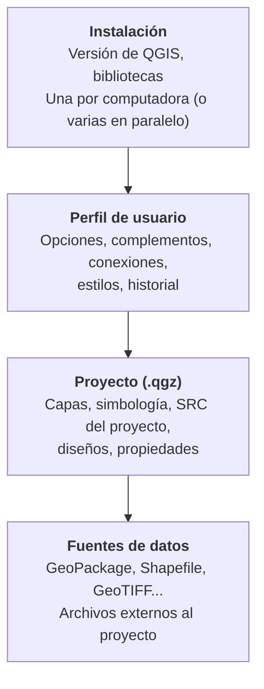

# 2.1 Preparar un entorno de trabajo

!!! abstract "Objetivos de aprendizaje"

    Al finalizar esta lección, el estudiante será capaz de:

    - Elegir la versión de QGIS adecuada y comprender el ciclo de publicación del proyecto.
    - Instalar QGIS en su sistema operativo y verificar la instalación.
    - Crear y usar un perfil de usuario exclusivo para el curso.
    - Diferenciar las preferencias de la aplicación de las propiedades del proyecto.
    - Gestionar complementos con criterio.
    - Organizar las carpetas de trabajo para que los proyectos sean portables y reproducibles.

!!! note "Antes de empezar"

    - **Requisitos:** una computadora con Windows, macOS o Linux, conexión a internet para la descarga y permisos para instalar programas.
    - **Tiempo estimado de descarga:** el instalador pesa alrededor de 0,5 GB.
    - **Conocimientos previos:** ninguno en QGIS. Conviene haber completado el **Módulo 1**.

---

## ¿Por qué preparar el entorno?

Es tentador instalar QGIS con las opciones por defecto y empezar a trabajar. Pero en un curso, y más aún en una institución, aparecen problemas que no tienen que ver con el análisis:

- *"En mi computadora el proyecto se abre bien, pero en la tuya no aparecen las capas."*
- *"A mí me sale una opción que a ti no te aparece."*
- *"Instalé un complemento y ahora QGIS no arranca."*
- *"No sé dónde quedaron los archivos que guardé."*

Todos tienen la misma causa: **un entorno de trabajo desordenado o distinto al de los demás**. Esta lección busca que todos trabajemos con un entorno **conocido, ordenado y reproducible**.

!!! info "Entorno reproducible"

    Un **entorno reproducible** es aquel que otra persona puede **recrear** siguiendo una descripción precisa: la misma versión del programa, la misma configuración básica, los mismos complementos y la misma organización de carpetas. Es la base para que un proyecto funcione igual en cualquier computadora.

### Las capas de un entorno de QGIS

Conviene distinguir desde el principio **dónde vive cada cosa**. Esta idea es la base de toda la lección y de la siguiente sobre proyectos (2.3):



| Capa | Qué contiene | Se comparte al enviar un proyecto |
|---|---|---|
| **Instalación** | El programa y sus bibliotecas | No: cada persona tiene la suya |
| **Perfil de usuario** | Preferencias, complementos, conexiones guardadas | No: queda en tu computadora |
| **Proyecto** | La organización del trabajo: qué capas, cómo se ven, con qué propiedades | Sí, es el archivo `.qgz` |
| **Fuentes de datos** | Los datos propiamente dichos | Solo si se envían junto con el proyecto |

!!! danger "La confusión más frecuente"

    Un proyecto de QGIS **no contiene los datos**: contiene **referencias** a ellos. Si envías solo el archivo `.qgz`, la otra persona verá un proyecto con capas **no disponibles**. Lo estudiaremos a fondo en la lección **2.3**.

---

## Versiones de QGIS

### El ciclo de publicación

QGIS sigue un calendario de publicación **basado en fechas**:

- Se publica una **nueva versión cada cuatro meses**.
- Las versiones con número **par** (4.0, 4.2, 4.4) son versiones **publicadas**; las de número **impar** (4.1, 4.3) son versiones **en desarrollo**.
- **Cada tercera versión** es una **versión de soporte extendido (LTR)**, que se mantiene hasta que aparece la siguiente LTR.
- Cada mes se publica una **versión de corrección** (por ejemplo, 4.2.1, 4.2.2), que solo corrige errores y no agrega funciones nuevas.

| Tipo | Nombre | Características | Recomendada para |
|---|---|---|---|
| **LTR** | *Long Term Release* (versión de soporte extendido) | Más probada, recibe correcciones durante al menos un año, cambia poco | Instituciones, producción, cursos de larga duración |
| **LR** | *Latest Release* (última versión) | Incluye las funciones más recientes, cambia cada cuatro meses | Usuarios que quieren las novedades |
| **Desarrollo** | *Nightly* o *master* | Versión en construcción, puede fallar | Solo pruebas; **nunca** para trabajo real |

Cada versión tiene además un **nombre en clave**, tomado de la ciudad que organizó una reunión de desarrolladores: por ejemplo, *Solothurn* (3.44) o *Belém do Pará* (4.2).

### QGIS 3 y QGIS 4

En **marzo de 2026** se publicó **QGIS 4.0**, la primera versión mayor en ocho años. Su cambio principal es interno: la migración a **Qt 6**, la biblioteca sobre la que se construye la interfaz. Para el usuario, la interfaz cambia poco, pero hay consecuencias importantes:

- Los **complementos** deben ser compatibles con Qt 6. Algunos complementos de QGIS 3 aún no funcionan en QGIS 4.
- Los **proyectos** de QGIS 3 se abren en QGIS 4, pero un proyecto guardado en QGIS 4 **puede no abrirse correctamente** en QGIS 3.
- Las carpetas de configuración de QGIS 3 y QGIS 4 son **distintas**: tus complementos y preferencias de QGIS 3 no pasan automáticamente a QGIS 4.

### Estado actual

!!! warning "Información vigente a septiembre de 2026"

    Las versiones cambian cada mes. Antes de instalar, consulta la **hoja de ruta** oficial: <https://qgis.org/resources/roadmap/>

| Línea | Versión actual | Nombre | Próximo hito |
|---|---|---|---|
| **LTR** | 3.44.x | Solothurn | Será reemplazada por QGIS 4.4 como LTR |
| **Última versión** | 4.2.x | Belém do Pará | Corrección 4.2.3 a fines de septiembre de 2026 |
| **Próxima LTR** | 4.4 | — | Publicación prevista para el **30 de octubre de 2026** |

!!! tip "Recomendación para el curso"

    - **Todo el grupo debe usar la misma versión mayor y menor** (por ejemplo, 4.2 o 4.4). Las diferencias de corrección (4.2.2 frente a 4.2.3) no suelen causar problemas.
    - Para un curso que empieza ahora y continuará varios meses, se recomienda **QGIS 4.x**: la línea 3.x ya no incorporará funciones nuevas.
    - Cuando se publique **QGIS 4.4 LTR**, será la opción más estable para trabajos institucionales.
    - Registra la versión exacta en la **ficha del entorno** que construiremos en el reto práctico.

---

## Instalación

=== "Windows"

    Hay dos formas de instalar QGIS en Windows:

    **Instalador independiente (recomendado para el curso)**

    1. Ingresa a la página de descargas: <https://qgis.org/download/>
    2. Descarga el instalador `.msi` de la versión acordada para el curso.
    3. Ejecuta el instalador y sigue los pasos con las opciones por defecto.
    4. Al finalizar, encontrarás QGIS en el menú Inicio.

    !!! captura "Captura pendiente · 2.1-01"

        - **Tipo:** Imagen (PNG)
        - **Archivo:** `assets/images/modulo-02/2-1/2-1-01-pagina-descargas.png`
        - **Qué mostrar:** La página de descargas de QGIS con las opciones de la **última versión** y la **LTR** para Windows.
        - **Sugerencia:** Resalta con un recuadro la versión acordada para el curso.

    !!! captura "Captura pendiente · 2.1-02 (opcional)"

        - **Tipo:** GIF animado
        - **Archivo:** `assets/images/modulo-02/2-1/2-1-02-instalador-windows.gif`
        - **Qué mostrar:** Los pasos principales del instalador `.msi`, desde la bienvenida hasta el final de la instalación.
        - **Sugerencia:** Recorta las esperas de la barra de progreso.

    El instalador incluye todo lo necesario y no requiere internet durante la instalación. Para actualizar a una nueva versión, hay que descargar el instalador completo otra vez.

    **Instalador en red OSGeo4W (usuarios avanzados)**

    Permite instalar **varias versiones en paralelo** (por ejemplo, la LTR y la última versión) y actualizar descargando solo los componentes que cambiaron. Se recomienda cuando ya se tiene experiencia con QGIS.

    !!! note "Mallas de transformación"

        Por su tamaño, el instalador normal **no incluye** las mallas de transformación entre sistemas de referencia. QGIS te pedirá descargarlas cuando una transformación las necesite (por ejemplo, entre ciertos datums). Existe una variante del instalador que ya las incluye, de mayor tamaño. Veremos las transformaciones en la lección **2.6**.

=== "macOS"

    1. Ingresa a la página de descargas: <https://qgis.org/download/>
    2. Descarga el archivo `.dmg` de la versión acordada. Los instaladores oficiales funcionan en equipos con procesador **Intel** y **Apple Silicon**.
    3. Abre el archivo `.dmg` y **arrastra** la aplicación QGIS a la carpeta **Aplicaciones**.
    4. Abre QGIS desde **Aplicaciones**. La primera vez, macOS puede pedirte que confirmes que deseas abrir una aplicación descargada de internet.

    !!! captura "Captura pendiente · 2.1-03 (opcional)"

        - **Tipo:** GIF animado
        - **Archivo:** `assets/images/modulo-02/2-1/2-1-03-instalacion-macos.gif`
        - **Qué mostrar:** Arrastrar QGIS a la carpeta **Aplicaciones** desde el archivo `.dmg`.

=== "Linux"

    **Opción 1: Flatpak (válida para cualquier distribución)**

    Flatpak permite instalar una versión reciente de QGIS aunque la distribución sea antigua, aislada del resto del sistema:

    ```bash
    flatpak install flathub org.qgis.qgis
    flatpak run org.qgis.qgis
    ```

    Durante la instalación, Flatpak te preguntará qué versión deseas (estable o LTR).

    !!! captura "Captura pendiente · 2.1-04 (opcional)"

        - **Tipo:** GIF animado
        - **Archivo:** `assets/images/modulo-02/2-1/2-1-04-flatpak-terminal.gif`
        - **Qué mostrar:** La terminal ejecutando `flatpak install flathub org.qgis.qgis` y la pregunta sobre qué versión instalar.

    **Opción 2: repositorios oficiales para Debian y Ubuntu**

    El proyecto QGIS mantiene repositorios propios, más actualizados que los de las distribuciones. La guía oficial detalla los pasos para agregar la clave y el repositorio: <https://qgis.org/resources/installation-guide/#debian--ubuntu>

    !!! warning "Ubuntu 22.04 y 24.04"

        En estas versiones de Ubuntu, los repositorios oficiales solo ofrecen la **LTR 3.44**, porque sus dependencias no son compatibles con QGIS 4. Para usar **QGIS 4** en ellas, utiliza **Flatpak** o actualiza la distribución.

### Verificar la instalación

1. Abre QGIS.
2. Ve a **Ayuda ▸ Acerca de**.
3. Anota la **versión exacta** (por ejemplo, 4.2.2) y la versión de **GDAL** y **PROJ** que aparecen en la información.

!!! captura "Captura pendiente · 2.1-05"

    - **Tipo:** Imagen (PNG)
    - **Archivo:** `assets/images/modulo-02/2-1/2-1-05-acerca-de.png`
    - **Qué mostrar:** La ventana **Ayuda ▸ Acerca de** con las versiones de **QGIS**, **GDAL** y **PROJ** visibles.
    - **Sugerencia:** Resalta las tres versiones con recuadros.

!!! tip "¿Por qué anotar GDAL y PROJ?"

    **GDAL** es la biblioteca que lee y escribe los formatos de datos, y **PROJ** la que realiza las transformaciones entre sistemas de referencia (Módulo 1). Cuando algo funciona distinto en dos computadoras con la "misma" versión de QGIS, a veces la diferencia está en estas bibliotecas.

---

## Perfiles de usuario

### ¿Qué es un perfil?

!!! info "Definición"

    Un **perfil de usuario** es una carpeta donde QGIS guarda **toda la configuración personal**: preferencias, complementos instalados, conexiones a servicios y bases de datos, estilos, plantillas, marcadores espaciales globales e historial. Cada perfil es **independiente** de los demás.

Al instalar QGIS, se crea automáticamente un perfil llamado **`default`**. Pero se pueden crear todos los que se necesiten.

| Situación | Uso de perfiles |
|---|---|
| **Curso** | Un perfil `curso-qgis` limpio, que no mezcla configuraciones ni complementos del trabajo diario |
| **Trabajo institucional** | Un perfil con las conexiones, estilos y complementos de la institución |
| **Pruebas** | Un perfil para probar complementos nuevos sin arriesgar el perfil principal |
| **Diagnóstico de problemas** | Si QGIS se comporta de forma extraña, abrirlo con un perfil nuevo permite saber si el problema está en la configuración |
| **Computadora compartida** | Un perfil por persona |

### Crear el perfil del curso

1. Ve a **Configuración ▸ Perfiles de usuario ▸ Nuevo perfil…**
2. Escribe el nombre **`curso-qgis`** (sin espacios ni tildes).
3. Se abrirá una **nueva ventana de QGIS** con una configuración limpia, usando ese perfil.
4. Cierra la ventana que usaba el perfil anterior.

Para cambiar de perfil más adelante, usa **Configuración ▸ Perfiles de usuario** y elige el perfil deseado.

!!! captura "Captura pendiente · 2.1-06"

    - **Tipo:** GIF animado
    - **Archivo:** `assets/images/modulo-02/2-1/2-1-06-crear-perfil.gif`
    - **Qué mostrar:** El recorrido **Configuración ▸ Perfiles de usuario ▸ Nuevo perfil…**, la escritura del nombre `curso-qgis` y la apertura de la nueva ventana de QGIS.

!!! captura "Captura pendiente · 2.1-07"

    - **Tipo:** Imagen (PNG)
    - **Archivo:** `assets/images/modulo-02/2-1/2-1-07-menu-perfiles.png`
    - **Qué mostrar:** El menú **Configuración ▸ Perfiles de usuario** desplegado, con el perfil `curso-qgis` marcado como activo.

### Dónde se guardan los perfiles

La forma más segura de encontrar la carpeta es desde el propio QGIS: **Configuración ▸ Perfiles de usuario ▸ Abrir carpeta de perfil activo**.

!!! captura "Captura pendiente · 2.1-08"

    - **Tipo:** GIF animado
    - **Archivo:** `assets/images/modulo-02/2-1/2-1-08-abrir-carpeta-perfil.gif`
    - **Qué mostrar:** La opción **Abrir carpeta de perfil activo** y el explorador de archivos mostrando el contenido de la carpeta del perfil.

Como referencia, las ubicaciones habituales para QGIS 4 son:

| Sistema | Carpeta de perfiles |
|---|---|
| **Windows** | `%APPDATA%\QGIS\QGIS4\profiles\` |
| **Linux** | `~/.local/share/QGIS/QGIS4/profiles/` |
| **macOS** | `~/Library/Application Support/QGIS/QGIS4/profiles/` |

*En instalaciones con Flatpak, la ubicación es distinta: usa siempre la opción **Abrir carpeta de perfil activo**.*

!!! tip "Abrir QGIS directamente con un perfil"

    QGIS acepta opciones al iniciarse desde un acceso directo o la terminal. Por ejemplo:

    ```bash
    qgis --profile curso-qgis
    ```

    En Windows, puedes crear un acceso directo a QGIS y agregar `--profile curso-qgis` al final del campo **Destino** en sus propiedades. Así, ese acceso directo siempre abrirá el perfil del curso.

    !!! captura "Captura pendiente · 2.1-09 (opcional)"

        - **Tipo:** Imagen (PNG)
        - **Archivo:** `assets/images/modulo-02/2-1/2-1-09-acceso-directo-perfil.png`
        - **Qué mostrar:** La ventana de propiedades de un acceso directo de Windows con `--profile curso-qgis` agregado en el campo **Destino**.

!!! warning "Cuidado con la carpeta del perfil"

    - **No borres** la carpeta de un perfil sin respaldarla: perderás sus complementos, conexiones y estilos.
    - Para **respaldar** o **trasladar** un perfil a otra computadora, basta con copiar su carpeta con QGIS cerrado.
    - No guardes **datos** ni **proyectos** dentro de la carpeta del perfil: esa carpeta es para configuración.

---

## Preferencias de la aplicación y propiedades del proyecto

Esta es una de las distinciones más importantes para trabajar con autonomía.

<div class="grid cards" markdown>

-   :material-cog-outline:{ .lg .middle } **Preferencias de la aplicación**

    ---

    **Configuración ▸ Opciones**

    Se guardan en el **perfil de usuario**. Afectan a **todos los proyectos** que abras con ese perfil. **No viajan** con el proyecto.

-   :material-file-cog-outline:{ .lg .middle } **Propiedades del proyecto**

    ---

    **Proyecto ▸ Propiedades**

    Se guardan **dentro del archivo `.qgz`**. Afectan **solo a ese proyecto**. **Viajan** con él cuando se comparte.

</div>

!!! captura "Captura pendiente · 2.1-10"

    - **Tipo:** Imagen (PNG)
    - **Archivo:** `assets/images/modulo-02/2-1/2-1-10-configuracion-opciones.png`
    - **Qué mostrar:** La ventana **Configuración ▸ Opciones**, pestaña **General**.
    - **Sugerencia:** Toma esta captura y la siguiente con el mismo tamaño de ventana, para poder mostrarlas una junto a la otra.

!!! captura "Captura pendiente · 2.1-11"

    - **Tipo:** Imagen (PNG)
    - **Archivo:** `assets/images/modulo-02/2-1/2-1-11-propiedades-proyecto.png`
    - **Qué mostrar:** La ventana **Proyecto ▸ Propiedades**, pestaña **General**, con el título del proyecto y la opción de rutas relativas visibles.

| Aspecto | Preferencias de la aplicación | Propiedades del proyecto |
|---|---|---|
| **Menú** | Configuración ▸ Opciones | Proyecto ▸ Propiedades |
| **Dónde se guardan** | Perfil de usuario | Archivo `.qgz` |
| **Alcance** | Todos los proyectos del perfil | Un solo proyecto |
| **Al compartir el proyecto** | No se comparten | Se comparten |
| **Ejemplos** | Idioma, tema de la interfaz, SRC para proyectos nuevos, comportamiento ante capas sin SRC, rutas de complementos | SRC del proyecto, unidades y elipsoide para mediciones, tipo de rutas (relativas o absolutas), título y metadatos del proyecto, configuración de autoensamblado |

!!! example "Por qué importa"

    Configuras en **Opciones** que las mediciones se muestren en metros. Envías el proyecto a un colega y a él las mediciones le aparecen en otra unidad. No es un error: **esa preferencia está en tu perfil, no en el proyecto**. Si la configuración debe acompañar al trabajo, tiene que estar en las **propiedades del proyecto**.

    **Regla práctica:** si una configuración es necesaria para que **el proyecto funcione o se interprete correctamente**, debe definirse en las **propiedades del proyecto**.

### Preferencias recomendadas para el curso

Abre **Configuración ▸ Opciones** con el perfil `curso-qgis` activo y revisa lo siguiente:

!!! captura "Captura pendiente · 2.1-12"

    - **Tipo:** Imagen (PNG)
    - **Archivo:** `assets/images/modulo-02/2-1/2-1-12-opciones-general-idioma.png`
    - **Qué mostrar:** La pestaña **General** de **Configuración ▸ Opciones**, con la opción de idioma de la interfaz resaltada.

| Pestaña | Opción | Valor recomendado | Motivo |
|---|---|---|---|
| **General** | Idioma de la interfaz | Español | Coincide con esta documentación. Requiere reiniciar QGIS. |
| **General** | Avisar al abrir un proyecto guardado con una versión anterior | Activado | Detectar problemas de compatibilidad |
| **General** | Código Python embebido en proyectos | Preguntar o no permitir | **Seguridad**: un proyecto de origen desconocido podría ejecutar código |
| **SRC y transformaciones** | Comportamiento ante capas sin SRC | Pedir el SRC o dejarlo sin definir | Obligarnos a **decidir conscientemente** el sistema de referencia (Módulo 1) |

!!! captura "Captura pendiente · 2.1-13"

    - **Tipo:** Imagen (PNG)
    - **Archivo:** `assets/images/modulo-02/2-1/2-1-13-opciones-src-capas-sin-src.png`
    - **Qué mostrar:** La pestaña **SRC y transformaciones** de **Configuración ▸ Opciones**, con la opción de comportamiento ante capas sin SRC resaltada.

!!! note "Los nombres pueden variar ligeramente"

    Según la versión de QGIS, el nombre exacto o la ubicación de algunas opciones puede cambiar un poco. Si no encuentras una opción, usa el **buscador** de la parte superior izquierda de la ventana de Opciones.

    !!! captura "Captura pendiente · 2.1-14"

        - **Tipo:** GIF animado
        - **Archivo:** `assets/images/modulo-02/2-1/2-1-14-buscador-opciones.gif`
        - **Qué mostrar:** Escribir una palabra en el buscador de la ventana **Opciones** (por ejemplo, *SRC*) y ver cómo se filtran las pestañas y se resalta la opción.

!!! tip "Explorar sin miedo"

    Casi todas las preferencias se pueden revertir. Y si algo sale muy mal, siempre se puede crear un **perfil nuevo** y empezar desde cero, sin reinstalar QGIS. Esa es una de las grandes ventajas de trabajar con perfiles.

---

## Complementos

### ¿Qué son?

Los **complementos** (*plugins*) son extensiones que agregan funciones a QGIS: nuevas herramientas de análisis, conexión con servicios en línea, formatos adicionales, herramientas de edición y mucho más. Se dividen en:

| Tipo | Origen | Ejemplos |
|---|---|---|
| **Complementos del núcleo** | Vienen incluidos con QGIS; solo hay que activarlos si están desactivados | Proveedores de procesamiento, herramientas incluidas en la instalación |
| **Complementos externos** | Desarrollados por la comunidad y publicados en el repositorio oficial | Miles de complementos para tareas específicas |

### El administrador de complementos

Se abre desde **Complementos ▸ Administrar e instalar complementos…**

| Sección | Para qué sirve |
|---|---|
| **Todos** | Buscar entre todos los complementos disponibles |
| **Instalados** | Ver, activar, desactivar o desinstalar los complementos del perfil |
| **No instalados** | Buscar complementos disponibles que aún no se instalaron |
| **Actualizables** | Ver qué complementos tienen versiones nuevas |
| **Instalar a partir de ZIP** | Instalar un complemento desde un archivo |
| **Configuración** | Revisar actualizaciones, mostrar complementos experimentales, administrar repositorios |

Al seleccionar un complemento, el administrador muestra su **descripción**, **versión**, **autor**, **calificaciones** y enlaces a su **documentación** y a su registro de **incidencias**.

!!! captura "Captura pendiente · 2.1-15"

    - **Tipo:** Imagen (PNG)
    - **Archivo:** `assets/images/modulo-02/2-1/2-1-15-administrador-complementos.png`
    - **Qué mostrar:** El administrador de complementos con la sección **Todos** activa, un complemento seleccionado y su ficha de información visible.
    - **Sugerencia:** Resalta la lista de secciones de la izquierda y la información de versión del complemento.

!!! captura "Captura pendiente · 2.1-16 (opcional)"

    - **Tipo:** Imagen (PNG)
    - **Archivo:** `assets/images/modulo-02/2-1/2-1-16-complementos-configuracion.png`
    - **Qué mostrar:** La sección **Configuración** del administrador de complementos, con la opción de complementos **experimentales** visible y desactivada.

### Criterios para instalar complementos

!!! danger "Un complemento es código que se ejecuta en tu computadora"

    Los complementos pueden leer y escribir archivos y conectarse a internet. Por eso:

    - Instala complementos **solo desde el repositorio oficial** de QGIS.
    - Usa **Instalar a partir de ZIP** únicamente con archivos de **fuentes de confianza**.
    - **No actives** los complementos **experimentales** salvo que sepas lo que estás haciendo.

!!! tip "Menos es más"

    - Instala un complemento **cuando lo necesites**, no "por si acaso".
    - Antes de instalarlo, revisa si **QGIS ya tiene una herramienta** que haga lo mismo: muchas funciones que antes requerían complementos hoy son parte del núcleo.
    - Verifica que sea **compatible con tu versión** de QGIS, especialmente en QGIS 4.
    - Revisa la **fecha de la última actualización**: un complemento abandonado puede dejar de funcionar.
    - **Desinstala** los complementos que no uses.
    - En este curso, **cada lección indicará los complementos necesarios**. Por ahora, **no instales complementos adicionales**: así todos partimos del mismo entorno.

---

## Organización de carpetas

La forma en que organizas tus carpetas determina, en gran medida, si tus proyectos podrán **abrirse en otra computadora**.

### Estructura recomendada para el curso

```text
curso-qgis/
├── datos/
│   ├── originales/    ← datos tal como se recibieron; nunca se modifican
│   └── trabajo/       ← copias, datos procesados y resultados intermedios
├── proyectos/         ← archivos de proyecto .qgz
├── estilos/           ← estilos reutilizables (.qml)
├── salidas/           ← mapas, tablas y archivos exportados
└── documentos/        ← ficha del entorno, notas, metadatos e informes
```

!!! captura "Captura pendiente · 2.1-17"

    - **Tipo:** Imagen (PNG)
    - **Archivo:** `assets/images/modulo-02/2-1/2-1-17-estructura-carpetas.png`
    - **Qué mostrar:** El explorador de archivos mostrando la carpeta `curso-qgis/` con sus subcarpetas `datos/`, `proyectos/`, `estilos/`, `salidas/` y `documentos/`.

### Reglas para nombrar carpetas y archivos

| Regla | ✓ Correcto | ✗ Evitar |
|---|---|---|
| Sin espacios | `limites_municipales.gpkg` | `Limites Municipales.gpkg` |
| Sin tildes, ñ ni caracteres especiales | `ninez_poblacion.csv` | `niñez_población (2).csv` |
| Minúsculas y guion bajo | `unidades_educativas.gpkg` | `UnidadesEducativas.GPKG` |
| Fechas en formato año-mes-día | `predios_2026-09-16.gpkg` | `predios_16-9-26.gpkg` |
| Nombres descriptivos | `vias_principales.gpkg` | `capa1.gpkg` |
| Versiones controladas | `informe_v02.docx` | `informe_final_final_corregido.docx` |

!!! warning "Ubicaciones problemáticas"

    - **Rutas muy largas o profundas:** algunos programas fallan con rutas extensas, especialmente en Windows. Prefiere algo como `C:\curso-qgis\` o `~/curso-qgis/`.
    - **Carpetas sincronizadas en la nube** (OneDrive, Google Drive, Dropbox): la sincronización puede **bloquear o dañar** archivos como GeoPackage mientras QGIS los está usando. Si las usas, trabaja en una carpeta local y sincroniza al terminar.
    - **Escritorio y Descargas:** suelen acumular archivos sin orden y, en algunos sistemas, están sincronizados automáticamente.
    - **Unidades externas o de red:** si cambia la letra de la unidad o la ruta de red, el proyecto puede perder sus fuentes.

!!! tip "Los datos originales son sagrados"

    Nunca edites los archivos de `datos/originales/`. Si necesitas modificarlos, trabaja sobre una **copia** en `datos/trabajo/`. Así siempre podrás volver al punto de partida y documentar qué cambios hiciste (tema 1.13, linaje).

---

## Reto práctico

!!! example "Reto 2.1 — Preparar un entorno reproducible para el curso"

    **Objetivo:** dejar listo un entorno de trabajo que cualquier compañero pueda recrear a partir de tu descripción.

    **1. Instalación**

    - Instala la versión de QGIS acordada para el curso.
    - Verifica la versión en **Ayuda ▸ Acerca de** y anota las versiones de QGIS, GDAL y PROJ.

    **2. Perfil**

    - Crea el perfil `curso-qgis`.
    - Configura el idioma y las preferencias recomendadas en esta lección.
    - Localiza la carpeta del perfil con **Abrir carpeta de perfil activo**.

    **3. Carpetas**

    - Crea la estructura de carpetas `curso-qgis/` en una ubicación local, corta y sin sincronización.

    **4. Primer proyecto**

    - Crea un proyecto nuevo y abre **Proyecto ▸ Propiedades**.
    - En la pestaña **General**, escribe un **título** para el proyecto y verifica que las rutas se guarden como **relativas**.
    - Guarda el proyecto como `proyectos/reto_2-1_entorno.qgz`.

    !!! captura "Captura pendiente · 2.1-18"

        - **Tipo:** GIF animado
        - **Archivo:** `assets/images/modulo-02/2-1/2-1-18-guardar-proyecto.gif`
        - **Qué mostrar:** Crear un proyecto nuevo, completar el título y las rutas relativas en **Proyecto ▸ Propiedades ▸ General**, y guardarlo en la carpeta `proyectos/`.

    **5. Ficha del entorno**

    Crea el archivo `documentos/ficha_entorno.md` (o `.txt`) con este contenido completado:

    ```text
    FICHA DEL ENTORNO DE TRABAJO
    ----------------------------
    Nombre:
    Fecha:
    Sistema operativo y versión:
    Método de instalación (MSI, OSGeo4W, DMG, Flatpak, repositorio):
    Versión de QGIS:
    Versión de GDAL:
    Versión de PROJ:
    Perfil de usuario:
    Ubicación de la carpeta del perfil:
    Ubicación de la carpeta del curso:
    Idioma de la interfaz:
    Comportamiento ante capas sin SRC:
    Complementos externos instalados (nombre y versión):
    Observaciones o problemas encontrados:
    ```

    **6. Verificación cruzada**

    Intercambia tu ficha con un compañero y compárenlas. ¿Sus entornos son equivalentes? Si hay diferencias, ¿cuáles podrían causar problemas al compartir proyectos?

    **Entregables:** la ficha del entorno completada y una captura de pantalla de la ventana **Acerca de**.

??? success "Criterios de evaluación del reto"

    | Criterio | Se cumple si... |
    |---|---|
    | Versión | La versión instalada coincide con la acordada para el curso |
    | Perfil | Existe el perfil `curso-qgis` y está en uso |
    | Carpetas | La estructura está creada en una ubicación adecuada, con nombres correctos |
    | Proyecto | El proyecto está guardado en `proyectos/`, tiene título y rutas relativas |
    | Ficha | La ficha está completa y permite a otra persona recrear el entorno |
    | Reflexión | Se identifican y explican las diferencias con el entorno del compañero |

---

## Problemas frecuentes

| Problema | Causa probable | Solución |
|---|---|---|
| QGIS no arranca después de instalar un complemento | El complemento es incompatible o tiene errores | Inicia QGIS con la opción `--noplugins` y desactiva el complemento, o abre QGIS con un perfil nuevo |
| La interfaz aparece en inglés | El idioma está tomado del sistema operativo | **Configuración ▸ Opciones ▸ General**: define el idioma y reinicia QGIS |
| No encuentro un complemento que usaba en QGIS 3 | No es compatible con QGIS 4 o no se instaló en el perfil actual | Revisa en el administrador si hay versión compatible y en qué perfil lo instalaste |
| Mis preferencias "desaparecieron" | Se abrió QGIS con otro perfil | **Configuración ▸ Perfiles de usuario**: verifica el perfil activo |
| QGIS pide descargar mallas de transformación | Una transformación entre sistemas de referencia requiere archivos adicionales | Acepta la descarga o instala el paquete de mallas. Lo veremos en la lección 2.6 |
| Un proyecto muestra advertencias al abrirse | Fue guardado con otra versión de QGIS | Verifica que todo el grupo use la misma versión |
| QGIS se comporta de forma extraña sin motivo aparente | Configuración dañada en el perfil | Crea un perfil nuevo y comprueba si el problema persiste |

---

## Ideas clave

!!! success "Para recordar"

    - Un entorno de QGIS tiene cuatro capas: **instalación**, **perfil de usuario**, **proyecto** y **fuentes de datos**.
    - QGIS publica una versión cada cuatro meses; cada tercera es una **LTR**. **Todo el grupo debe usar la misma versión.**
    - QGIS 4 usa **Qt 6**: algunos complementos de QGIS 3 no son compatibles, y sus configuraciones están separadas.
    - Un **perfil de usuario** aísla preferencias, complementos y conexiones. Usa un perfil exclusivo para el curso.
    - Las **preferencias de la aplicación** (Configuración ▸ Opciones) quedan en tu perfil; las **propiedades del proyecto** (Proyecto ▸ Propiedades) viajan con el `.qgz`.
    - Instala **solo los complementos necesarios**, desde fuentes confiables.
    - Una **estructura de carpetas** ordenada, con nombres sin espacios ni tildes y fuera de carpetas sincronizadas, es la base de un proyecto portable.

---

## Autoevaluación

??? question "1. ¿Qué diferencia hay entre una versión LTR y la última versión (LR)?"

    La **LTR** es una versión de **soporte extendido**, más probada, que recibe correcciones durante al menos un año y cambia poco: es la más adecuada para instituciones y trabajos de largo plazo. La **LR** incorpora las **funciones más recientes** y se reemplaza cada cuatro meses.

??? question "2. Configuraste en Opciones que las capas sin SRC te pidan definirlo. ¿Tu compañero verá el mismo comportamiento al abrir tu proyecto?"

    **No.** Esa configuración está en las **preferencias de la aplicación**, que se guardan en **tu perfil de usuario**, no en el proyecto. Tu compañero tendrá el comportamiento que haya configurado en **su propio** perfil.

??? question "3. ¿Para qué sirve crear un perfil nuevo cuando QGIS se comporta de forma extraña?"

    Para saber si el problema está en la **configuración del perfil** (preferencias, complementos) o en la **instalación**. Si con un perfil nuevo QGIS funciona bien, el problema está en el perfil anterior.

??? question "4. ¿Por qué no conviene guardar los proyectos del curso en una carpeta de OneDrive o Google Drive mientras se trabaja?"

    Porque la **sincronización** puede bloquear o modificar archivos que QGIS está usando, como los GeoPackage, lo que puede producir **errores o daños** en los datos. Además, las rutas de esas carpetas suelen ser largas y variar entre computadoras.

??? question "5. ¿Qué tres precauciones tomarías antes de instalar un complemento?"

    Entre otras: verificar que provenga del **repositorio oficial** o de una fuente confiable, que sea **compatible con la versión** de QGIS instalada, que esté **actualizado**, y que QGIS **no tenga ya una herramienta** que haga lo mismo.

??? question "6. ¿Por qué el archivo `limites municipales (versión final).shp` es un mal nombre?"

    Porque contiene **espacios**, **tildes** y **paréntesis**, que pueden causar problemas en rutas, herramientas y scripts, y porque "versión final" no indica una **versión controlada** ni una fecha. Un nombre adecuado sería, por ejemplo, `limites_municipales_2026-09.gpkg`.

---

## Referencias

- QGIS Project. *Installation Guide*. <https://qgis.org/resources/installation-guide/>
- QGIS Project. *Road Map*. <https://qgis.org/resources/roadmap/>
- QGIS Project. *QGIS Plugins Repository*. <https://plugins.qgis.org>
- QGIS Project. *Manual de usuario de QGIS: Configuración de QGIS*. <https://docs.qgis.org/latest/es/docs/user_manual/introduction/qgis_configuration.html>
- QGIS Project. *Manual de usuario de QGIS: Comenzando*. <https://docs.qgis.org/latest/es/docs/user_manual/introduction/getting_started.html>
