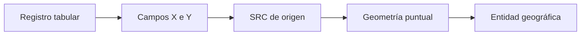
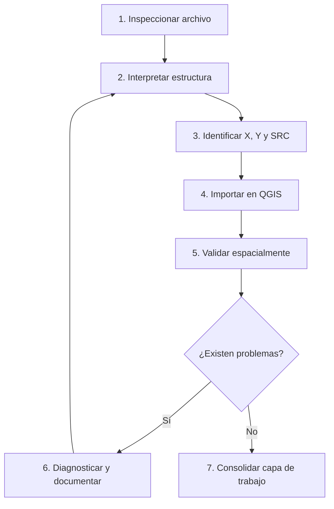

# 2.5 Convertir una tabla en información geográfica

!!! abstract "Objetivos de aprendizaje"

    Al finalizar esta lección, el estudiante será capaz de:

    - Comprender cómo una **tabla convencional puede convertirse en información geográfica**.
    - Reconocer la estructura básica de un archivo de **texto delimitado** y de un archivo CSV.
    - Identificar correctamente el **separador de campos**, la codificación de caracteres y la fila de encabezados.
    - Diferenciar campos de tipo **texto, entero, decimal, fecha y otros tipos de datos**.
    - Reconocer cuándo un campo numérico ha sido interpretado incorrectamente como texto.
    - Identificar qué columnas contienen las **coordenadas X e Y**.
    - Diferenciar coordenadas **geográficas** de coordenadas **proyectadas**.
    - Determinar el **SRC de origen** de las coordenadas antes de incorporarlas.
    - Importar correctamente un archivo CSV mediante la herramienta de **Texto delimitado** de QGIS.
    - Detectar coordenadas ausentes, inválidas o aparentemente intercambiadas.
    - Validar la posición de los puntos utilizando capas de referencia y controles numéricos.
    - Distinguir entre **asignar un SRC** y **transformar coordenadas**.
    - Convertir una fuente tabular correctamente validada en una capa espacial de trabajo.
    - Documentar los problemas encontrados y las decisiones tomadas durante la importación.

!!! note "Antes de empezar"

    - **Entorno:** QGIS con el perfil `curso-qgis`. Los procedimientos toman como referencia **QGIS 3.44**; algunos nombres pueden variar ligeramente según el idioma o la versión instalada.
    - **Punto de partida:** el proyecto y el inventario elaborados durante la [lección 2.4](04-incorporar-datos.md).
    - **Datos recomendados:** una tabla `.csv` que contenga al menos un identificador, un nombre, una categoría y dos columnas de coordenadas.
    - **Capa de referencia:** disponer de límites municipales, calles, distritos u otra fuente cuya posición espacial ya haya sido verificada.
    - **Edición:** conservaremos intacto el archivo original. Las correcciones se realizarán sobre una **copia de trabajo** o sobre una capa derivada.
    - **SRC:** en esta lección utilizaremos el concepto de **Sistema de Referencia de Coordenadas (SRC)** para interpretar correctamente las coordenadas. Su funcionamiento se profundizará en la lección **2.6**.
    - **Tiempo orientativo:** entre **90 y 120 minutos**, incluida la práctica.

---

## Una tabla puede contener ubicación sin contener geometrías

Considera la siguiente tabla:

| id | nombre | tipo | longitud | latitud |
|---:|---|---|---:|---:|
| 1 | Equipamiento A | Salud | -66.1584 | -17.3912 |
| 2 | Equipamiento B | Educación | -66.1517 | -17.3976 |
| 3 | Equipamiento C | Deportivo | -66.1635 | -17.3859 |

A primera vista se trata simplemente de una tabla.

Cada fila representa un equipamiento y las columnas contienen información descriptiva.

Sin embargo, dos columnas poseen una característica especial:

```text
longitud
latitud
```

Juntas describen una **posición sobre la superficie terrestre**.

La tabla todavía no contiene necesariamente una geometría vectorial como la que encontramos dentro de un GeoPackage o un Shapefile.

Contiene los **valores necesarios para construirla**.

Podemos representar el proceso de manera simplificada:

```text
TABLA
  │
  ├── atributos
  │
  └── coordenadas X / Y
          │
          ▼
 interpretación mediante un SRC
          │
          ▼
       PUNTOS
          │
          ▼
     CAPA ESPACIAL
```

La transformación conceptual es importante:

> **Las coordenadas por sí solas no bastan. Para convertirlas correctamente en posiciones necesitamos conocer qué representan y mediante qué sistema de referencia fueron expresadas.**

!!! captura "Captura pendiente · 2.5-01"

    - **Tipo:** Imagen (PNG) compuesta.
    - **Archivo:** `assets/images/modulo-02/2-5/2-5-01-tabla-a-puntos.png`
    - **Qué mostrar:** a la izquierda una tabla con ID, nombre, longitud y latitud; a la derecha los mismos registros representados como puntos sobre un mapa.
    - **Sugerencia:** unir cada fila con su punto mediante líneas o números para mostrar la relación entre registro y geometría.

### La fila se convertirá en una entidad

Cuando QGIS interpreta correctamente las coordenadas de una tabla:

- cada **fila válida** puede convertirse en una entidad puntual;
- las coordenadas determinan la posición;
- las demás columnas se conservan como atributos.

Por ejemplo:

```text
id = 2
nombre = Equipamiento B
tipo = Educación
longitud = -66.1517
latitud = -17.3976
```

puede transformarse conceptualmente en:

```text
ENTIDAD 2
├── geometría → POINT(...)
└── atributos
    ├── id = 2
    ├── nombre = Equipamiento B
    └── tipo = Educación
```

La tabla de atributos continúa existiendo.

La diferencia es que ahora cada registro posee también una **geometría**.

!!! tip "No pierdes la tabla al crear los puntos"

    Espacializar una tabla no significa reemplazar sus atributos.

    El resultado combina la información tabular con una geometría que permite localizar cada registro en el territorio.

### De atributos a geometrías

El proceso puede resumirse así:



El elemento decisivo es que QGIS necesita interpretar simultáneamente:

```text
X
+
Y
+
SRC
```

Sin esa combinación, los números no pueden convertirse de manera confiable en una posición geográfica.

---

## Comprender la estructura de un archivo CSV

CSV significa habitualmente **Comma-Separated Values**, es decir, valores separados por comas.

Un ejemplo sencillo podría ser:

```csv
id,nombre,tipo,longitud,latitud
1,Equipamiento A,Salud,-66.1584,-17.3912
2,Equipamiento B,Educación,-66.1517,-17.3976
3,Equipamiento C,Deportivo,-66.1635,-17.3859
```

Aunque su extensión sea `.csv`, el contenido sigue siendo esencialmente **texto estructurado**.

### Texto organizado mediante filas y columnas

La primera fila suele contener los nombres de los campos:

```text
id,nombre,tipo,longitud,latitud
```

Las filas siguientes representan registros.

Podemos pensar el archivo como una estructura rectangular:

```text
COLUMNAS
   ↓
┌────┬───────────────┬────────────┬───────────┬──────────┐
│ id │ nombre        │ tipo       │ longitud  │ latitud  │
├────┼───────────────┼────────────┼───────────┼──────────┤
│  1 │ Equipamiento A│ Salud      │ -66.1584  │ -17.3912 │
│  2 │ Equipamiento B│ Educación  │ -66.1517  │ -17.3976 │
└────┴───────────────┴────────────┴───────────┴──────────┘
   ↑
 FILAS
```

Cada:

- **fila** representa normalmente una observación;
- **columna** representa una variable.

### CSV no significa necesariamente separado por comas

En la práctica es frecuente encontrar archivos que utilizan:

- coma `,`;
- punto y coma `;`;
- tabulación;
- barra vertical `|`;
- otros caracteres.

Por ejemplo:

```text
id;nombre;tipo;longitud;latitud
1;Equipamiento A;Salud;-66.1584;-17.3912
2;Equipamiento B;Educación;-66.1517;-17.3976
```

sigue siendo un archivo de texto delimitado.

El carácter:

```text
;
```

es el **delimitador o separador de campos**.

!!! note "Texto delimitado es un concepto más amplio"

    CSV es uno de los casos más conocidos, pero QGIS permite trabajar con diferentes archivos de **texto delimitado**, aunque sus columnas no estén separadas estrictamente mediante comas.

### El separador determina dónde empieza cada campo

Observa este registro:

```text
15;Centro Comunitario;Equipamiento social;-66.1438;-17.4021
```

Si interpretamos correctamente `;` como separador obtenemos:

| Campo | Valor |
|---|---|
| ID | 15 |
| nombre | Centro Comunitario |
| tipo | Equipamiento social |
| longitud | -66.1438 |
| latitud | -17.4021 |

Pero si QGIS intenta interpretar el archivo utilizando una coma, toda la fila podría aparecer como un único campo:

| field_1 |
|---|
| 15;Centro Comunitario;Equipamiento social;-66.1438;-17.4021 |

El archivo no necesariamente está dañado.

El problema puede ser simplemente una **interpretación incorrecta del delimitador**.

!!! captura "Captura pendiente · 2.5-02"

    - **Tipo:** Imagen (PNG) comparativa.
    - **Archivo:** `assets/images/modulo-02/2-5/2-5-02-delimitador-correcto.png`
    - **Qué mostrar:** la vista previa del mismo archivo utilizando un delimitador incorrecto y luego `;` correctamente.
    - **Sugerencia:** resaltar cómo una única columna se transforma en varias columnas correctamente estructuradas.

### Separador de campos y separador decimal

Estos dos conceptos no deben confundirse.

El **separador de campos** divide las columnas:

```text
id;nombre;x;y
```

Aquí el separador es:

```text
;
```

El **separador decimal** forma parte de un número.

Dependiendo de la configuración y procedencia de los datos, un decimal puede escribirse como:

```text
-66.1584
```

o:

```text
-66,1584
```

El primer caso utiliza **punto decimal**.

El segundo utiliza **coma decimal**.

Cuando ambos utilizan coma aparece una dificultad.

Considera:

```text
1,Equipamiento A,-66,1584,-17,3912
```

¿Dónde termina un campo y comienza otro?

Sin información adicional, la estructura es ambigua.

Por esta razón, cuando los valores numéricos utilizan coma decimal suele ser habitual emplear otro separador de campos:

```text
1;Equipamiento A;-66,1584;-17,3912
```

Ahora:

```text
;  → separa campos
,  → representa decimales
```

!!! warning "No reemplaces caracteres sin comprender su función"

    Sustituir todas las comas por puntos puede destruir un archivo si algunas comas funcionan como delimitadores, pertenecen a textos o forman parte de otras estructuras.

    Primero identifica cómo está organizado el archivo.

---

## Inspeccionar la tabla antes de utilizarla

Antes de abrir un archivo como capa espacial conviene observar primero su contenido mediante:

- un editor de texto;
- una hoja de cálculo;
- un visor de CSV;
- la vista previa de QGIS.

No necesitas revisar miles de registros.

Las primeras filas permiten detectar rápidamente muchos problemas.

Por ejemplo:

```csv
codigo;nombre;tipo;x;y
001;Equipamiento A;Salud;-66.1584;-17.3912
002;Equipamiento B;Educación;-66.1517;-17.3976
003;Equipamiento C;Deportivo;;-17.3859
004;Equipamiento D;Administrativo;-17.4012;-66.1463
```

Antes de importar ya podemos sospechar que:

- `codigo` contiene ceros iniciales y probablemente debe conservarse como **texto**;
- el registro `003` no tiene coordenada X;
- el registro `004` podría tener X/Y intercambiadas.

Todavía no hemos creado ningún punto y ya estamos realizando **control de calidad**.

### Encabezados y estructura rectangular

Una tabla preparada para procesamiento debería comenzar de manera similar a:

```text
id;nombre;tipo;x;y
```

Cada nombre representa un campo.

Conviene utilizar encabezados:

- breves;
- comprensibles;
- consistentes;
- sin ambigüedades.

Por ejemplo:

```text
id
nombre
tipo
longitud
latitud
```

es preferible a:

```text
dato1
dato2
coord1
coord2
```

Idealmente:

- una fila representa un registro;
- una columna representa una variable;
- todas las filas siguen la misma estructura;
- no existen celdas combinadas;
- los encabezados aparecen una sola vez;
- no existen subtotales insertados dentro de los datos.

Una estructura adecuada sería:

| id | nombre | tipo | x | y |
|---:|---|---|---:|---:|
| 1 | Equipamiento A | Salud | -66.1584 | -17.3912 |
| 2 | Equipamiento B | Educación | -66.1517 | -17.3976 |
| 3 | Equipamiento C | Deportivo | -66.1635 | -17.3859 |

### Filas adicionales y contenido decorativo

Algunas tablas contienen información previa al encabezado:

```text
Inventario de equipamientos municipales
Actualización: agosto 2026
Fuente: levantamiento institucional
id;nombre;tipo;longitud;latitud
1;Equipamiento A;Salud;-66.1584;-17.3912
```

Para una persona resulta perfectamente comprensible.

Para un programa informático, las primeras tres líneas pueden impedir una interpretación automática correcta.

En estos casos debemos:

- limpiar una copia del archivo;
- o configurar correctamente las filas que deben omitirse cuando la herramienta lo permita.

!!! tip "Una tabla para procesamiento no es una hoja diseñada para impresión"

    Títulos, celdas combinadas, subtítulos y notas decorativas pueden ser útiles para presentar información, pero dificultan el procesamiento automático.

    Una tabla de datos debe mantener una estructura predecible.

### Valores nulos y valores especiales

Puedes encontrar valores como:

```text
NULL
N/A
S/D
SIN DATO
-
```

Todos podrían significar conceptualmente:

```text
valor desconocido
```

pero técnicamente no son necesariamente equivalentes.

En una copia de trabajo conviene normalizar estos casos cuando el procedimiento lo requiera.

Especial atención merecen las coordenadas.

Por ejemplo:

```text
id;nombre;x;y
1;Equipamiento A;-66.1584;-17.3912
2;Equipamiento B;;-17.3976
```

El registro 2 carece de X.

Por tanto, no puede construirse una posición puntual completa.

!!! danger "Cero no significa sin dato"

    No sustituyas automáticamente una coordenada desconocida mediante `0`.

    `0` es un valor numérico válido y representa una posición real.

    Utilizarlo como sustituto de un dato faltante genera una geometría incorrecta.

### Registros duplicados

También puedes encontrar:

```text
101;Equipamiento A;-66.1584;-17.3912
101;Equipamiento A;-66.1584;-17.3912
```

Dos filas idénticas pueden generar dos puntos superpuestos.

Visualmente quizá parezca existir uno solo.

Por eso el mapa no reemplaza la revisión tabular.

Debemos preguntarnos:

- ¿el ID debería ser único?;
- ¿son realmente duplicados?;
- ¿representan dos observaciones del mismo lugar?;
- ¿corresponden a diferentes fechas?;
- ¿son entidades diferentes ubicadas en el mismo punto?

Coordenadas repetidas no significan automáticamente información duplicada.

---

## Codificación y caracteres

Los números pueden verse correctamente mientras los textos aparecen dañados.

Compara:

```text
Educación
Planificación
Niñez
José
Área técnica
```

con:

```text
Educación
Planificación
Niñez
José
Área técnica
```

El problema no necesariamente está en el contenido original.

Puede existir una discrepancia entre:

```text
codificación utilizada para guardar el archivo
                    │
                    ▼
codificación utilizada para interpretarlo
```

### Qué sucede cuando la codificación es incorrecta

Una codificación incorrecta puede afectar:

- tildes;
- `ñ`;
- caracteres especiales;
- símbolos;
- textos en otros alfabetos.

La información numérica podría seguir pareciendo correcta.

Esto puede generar una falsa sensación de que el archivo está bien importado.

### UTF-8 como opción preferente

Para los archivos nuevos del curso utilizaremos preferentemente:

```text
UTF-8
```

porque permite representar adecuadamente una gran variedad de caracteres.

Sin embargo, archivos antiguos pueden utilizar otras codificaciones.

Por eso no debemos seleccionar una opción al azar únicamente porque el archivo “abre”.

### Cómo reconocer problemas de codificación

Presta atención a patrones como:

| Esperado | Visualización incorrecta |
|---|---|
| Educación | Educación |
| Técnico | Técnico |
| Muñoz | Muñoz |
| Área | Área |
| José | José |

Si aparecen estos problemas:

1. no continúes inmediatamente con la importación;
2. revisa la codificación;
3. prueba la opción correspondiente;
4. vuelve a comprobar varios textos;
5. documenta la codificación utilizada.

!!! warning "Geometría correcta no significa datos correctos"

    Una capa puede localizar perfectamente sus puntos mientras sus atributos textuales aparecen dañados.

    La validación debe considerar tanto la **geometría** como la **información alfanumérica**.

!!! captura "Captura pendiente · 2.5-03"

    - **Tipo:** Imagen (PNG) comparativa.
    - **Archivo:** `assets/images/modulo-02/2-5/2-5-03-codificacion.png`
    - **Qué mostrar:** vista previa con caracteres mal interpretados y la misma tabla correctamente mostrada.
    - **Sugerencia:** utilizar palabras con `á`, `é`, `í`, `ó`, `ú` y `ñ`.

---

## Reconocer los tipos de campo

Los valores de una tabla no son todos equivalentes.

Un campo puede representar:

- texto;
- número entero;
- número decimal;
- fecha;
- fecha y hora;
- valor lógico;
- otros tipos según el formato.

El tipo de campo determina qué operaciones pueden realizarse posteriormente.

### Texto

Ejemplos:

```text
Centro de Salud
D-05
OTB San Pedro
00125
```

Aunque:

```text
00125
```

parezca un número, podría representar un **código**.

Si el cero inicial forma parte de su significado, debemos conservarlo como texto.

### Números enteros

Ejemplos:

```text
1
25
318
2026
```

No poseen parte decimal.

Pueden utilizarse para:

- cantidades;
- conteos;
- años;
- determinadas clasificaciones numéricas.

### Números decimales

Ejemplos:

```text
14.52
-17.3912
-66.1584
795432.67
```

Las coordenadas suelen necesitar este tipo de representación.

### Fechas

Ejemplo:

```text
2026-08-15
```

Una fecha no debería interpretarse automáticamente como texto si posteriormente necesitamos:

- filtrar por periodos;
- ordenar cronológicamente;
- calcular intervalos;
- realizar análisis temporales.

### La apariencia no determina el tipo

Considera:

```text
"15"
```

y:

```text
15
```

Visualmente pueden parecer iguales.

Pero internamente uno podría ser texto y el otro número.

Esto importa porque una operación como:

```text
x + 100
```

requiere que `x` pueda interpretarse numéricamente.

### Valores que parecen números pero no lo son

Una columna problemática podría contener:

```text
-66.1584
-66.1517
S/D
-66.1635
```

La presencia de:

```text
S/D
```

puede provocar que determinados programas interpreten todo el campo como texto.

Otros ejemplos:

```text
-66.1584°
66°09'30"W
X=-66.1584
-66,1584
```

Todos pueden describir posiciones, pero no tienen la misma estructura.

Antes de utilizarlos necesitamos saber:

- qué formato representan;
- cómo deben interpretarse;
- si requieren normalización.

!!! warning "Las coordenadas deben ser utilizables como números"

    Si las columnas X e Y contienen caracteres, unidades, espacios inesperados o valores especiales, QGIS puede no reconocerlas correctamente como coordenadas.

---

## De columnas a coordenadas

Para construir puntos desde columnas separadas necesitamos identificar correctamente:

```text
X
Y
```

No basta con encontrar dos columnas que contengan números.

Debemos conocer qué representa cada una.

### Qué representa X

En un sistema cartesiano, el eje **X** corresponde generalmente a la dirección horizontal.

Dependiendo del SRC puede representar:

- **longitud**, en coordenadas geográficas;
- **Este o Easting**, en coordenadas proyectadas.

### Qué representa Y

El eje **Y** corresponde generalmente a la dirección vertical.

Dependiendo del SRC puede representar:

- **latitud**, en coordenadas geográficas;
- **Norte o Northing**, en coordenadas proyectadas.

Podemos resumir:

| Sistema | X | Y |
|---|---|---|
| Geográfico | Longitud | Latitud |
| Proyectado | Este / Easting | Norte / Northing |

!!! success "Regla operativa"

    Cuando trabajemos con columnas de longitud y latitud utilizaremos normalmente:

    **X = longitud**

    **Y = latitud**

### Longitud y latitud

La **longitud** indica la posición hacia el Este u Oeste.

Su intervalo global habitual es:

```text
-180° a +180°
```

La **latitud** indica la posición hacia el Norte o Sur.

Su intervalo global es:

```text
-90° a +90°
```

Convencionalmente:

- Oeste → longitud negativa;
- Este → longitud positiva;
- Sur → latitud negativa;
- Norte → latitud positiva.

Un punto situado en el área de Cochabamba podría presentar valores aproximados como:

```text
Longitud ≈ -66
Latitud  ≈ -17
```

Por tanto:

```text
X ≈ -66
Y ≈ -17
```

no:

```text
X ≈ -17
Y ≈ -66
```

!!! captura "Captura pendiente · 2.5-04"

    - **Tipo:** Imagen (PNG) conceptual.
    - **Archivo:** `assets/images/modulo-02/2-5/2-5-04-longitud-latitud.png`
    - **Qué mostrar:** mapa o globo con un punto en Bolivia, indicando longitud como X y latitud como Y.
    - **Sugerencia:** añadir `X ≈ -66` y `Y ≈ -17` como valores ilustrativos.

### Este y Norte

En un sistema proyectado podemos encontrar valores como:

```text
Este  = 795000
Norte = 8075000
```

Aquí:

```text
X = Este
Y = Norte
```

Las coordenadas ya no se expresan como ángulos.

Normalmente utilizan unidades lineales como metros.

### Coordenadas geográficas y proyectadas

Compara:

```text
X = -66.1584
Y = -17.3912
```

con:

```text
X = 795000
Y = 8075000
```

Los primeros valores parecen coordenadas geográficas.

Los segundos parecen coordenadas proyectadas.

Sin embargo:

> **La magnitud de los números constituye una pista, no una identificación definitiva del SRC.**

Necesitamos información sobre:

- datum;
- proyección;
- zona;
- unidades;
- procedencia.

### El signo también importa

Compara:

```text
-66.15
```

con:

```text
66.15
```

Representan longitudes situadas en hemisferios distintos.

Lo mismo sucede con:

```text
-17.39
```

y:

```text
17.39
```

Por tanto, debemos comprobar:

```text
magnitud
+
orden
+
signo
+
SRC
```

---

## Las coordenadas necesitan un SRC

Considera:

```text
X = 795000
Y = 8075000
```

Estos números no responden por sí solos:

> ¿Dónde está el punto?

Necesitamos conocer el sistema mediante el cual fueron calculados.

Conceptualmente:

```text
X
+
Y
+
SRC
=
posición interpretable
```

### El SRC pertenece a las coordenadas de origen

Cuando importamos una tabla debemos seleccionar el sistema en el que **ya están expresadas las coordenadas**.

No debemos seleccionar simplemente:

- el SRC del proyecto;
- el SRC de otra capa;
- el SRC que queremos utilizar después;
- uno que produzca un resultado visual aparentemente razonable.

La pregunta correcta es:

> **¿En qué SRC fueron generados estos valores X e Y?**

### SRC de la fuente y SRC del proyecto

Supongamos:

```text
Tabla:
EPSG:4326 — WGS 84

Proyecto:
EPSG:32719 — WGS 84 / UTM zone 19S
```

Esto no constituye necesariamente un problema.

QGIS puede representar capas con diferentes SRC dentro de un mismo proyecto.

Conceptualmente:

```text
COORDENADAS ORIGINALES
        │
        │ EPSG:4326
        ▼
   CAPA DE PUNTOS
        │
        │ transformación para visualizar
        ▼
PROYECTO EN EPSG:32719
```

Lo importante es identificar correctamente el SRC de cada fuente.

### Asignar un SRC no significa reproyectar

Si una tabla contiene:

```text
X = -66.1584
Y = -17.3912
```

y sabemos que corresponde a:

```text
WGS 84
EPSG:4326
```

al importarla estamos diciendo:

> **Estos números deben interpretarse mediante EPSG:4326.**

Los valores no cambian por el simple hecho de asignar correctamente el SRC.

Una reproyección, en cambio, implica una transformación matemática:

```text
-66.1584, -17.3912
          │
          │ transformación
          ▼
795xxx, 807xxxx
```

Los números cambian, pero representan aproximadamente la misma posición terrestre.

!!! danger "Asignar el SRC equivocado no corrige coordenadas"

    Si las coordenadas fueron generadas en EPSG:4326 y les asignas otro sistema, no las estás transformando.

    Estás indicando a QGIS que interprete los mismos números de otra manera.

Esta diferencia se estudiará con mayor profundidad en la lección **2.6**.

### Cómo determinar el SRC de origen

Consulta siempre que sea posible:

1. metadatos del archivo;
2. documentación de quien produjo los datos;
3. ficha técnica;
4. procedimiento de levantamiento;
5. configuración del GPS;
6. configuración de la aplicación utilizada;
7. especificaciones de exportación;
8. documentación institucional.

Una columna llamada:

```text
X
```

no permite determinar por sí sola el SRC.

Tampoco un campo denominado:

```text
LONGITUD
```

garantiza que toda la información espacial esté correctamente documentada.

---

## Importar una tabla CSV en QGIS

Una vez comprendida la estructura de la tabla podemos incorporarla en QGIS.

La secuencia general será:

```text
ARCHIVO
  ↓
CONFIGURACIÓN DE TEXTO
  ↓
X / Y
  ↓
SRC
  ↓
GENERACIÓN DE PUNTOS
```

### Abrir Texto delimitado

Una ruta habitual es:

**Capa ▸ Añadir capa ▸ Añadir capa de texto delimitado…**

También puedes utilizar el **Administrador de fuentes de datos**.

La ventana permite definir cómo debe interpretarse el archivo.

!!! captura "Captura pendiente · 2.5-05"

    - **Tipo:** Imagen (PNG) anotada.
    - **Archivo:** `assets/images/modulo-02/2-5/2-5-05-texto-delimitado.png`
    - **Qué mostrar:** ventana completa de **Texto delimitado** con un CSV cargado.
    - **Sugerencia:** numerar:
        1. archivo;
        2. codificación;
        3. delimitador;
        4. vista previa;
        5. geometría;
        6. X/Y;
        7. SRC.

### Seleccionar el archivo

Selecciona, por ejemplo:

```text
datos/originales/equipamientos.csv
```

Antes de continuar observa la vista previa.

No pulses **Añadir** automáticamente.

Primero comprueba que la tabla está siendo interpretada correctamente.

### Revisar la codificación

Para los archivos preparados para el curso utilizaremos normalmente:

```text
UTF-8
```

Comprueba palabras con:

- tildes;
- `ñ`;
- caracteres especiales.

Si:

```text
Educación
```

se visualiza correctamente, tenemos una primera evidencia favorable.

### Configurar el delimitador

Selecciona el separador correspondiente.

Por ejemplo:

```text
;
```

Comprueba que la vista previa genere columnas separadas:

```text
id
nombre
tipo
longitud
latitud
```

Si todo aparece dentro de una sola columna, revisa el delimitador.

### Comprobar los tipos de campo

Presta especial atención a:

```text
X
Y
```

Estos campos deben contener valores utilizables como números.

Si QGIS los interpreta como texto, revisa:

- separador decimal;
- espacios;
- unidades;
- símbolos;
- valores como `S/D`;
- caracteres no numéricos.

!!! tip "No confíes únicamente en la detección automática"

    La detección automática facilita el trabajo, pero debe revisarse.

    Un código puede necesitar almacenarse como texto, mientras que una coordenada debe poder interpretarse numéricamente.

### Definir las coordenadas X e Y

Selecciona:

**Coordenadas de punto**

Si la tabla utiliza longitud y latitud:

```text
Campo X = longitud
Campo Y = latitud
```

Si utiliza coordenadas proyectadas:

```text
Campo X = este
Campo Y = norte
```

o equivalentes como:

```text
easting
northing
```

### Seleccionar el SRC de geometría

Selecciona el SRC correspondiente a las **coordenadas originales**.

Por ejemplo, si la documentación indica:

```text
WGS 84
EPSG:4326
```

utiliza ese sistema.

No selecciones otro únicamente para hacerlo coincidir con el proyecto.

### Añadir la capa

Después de verificar:

- estructura;
- codificación;
- delimitador;
- tipos;
- X;
- Y;
- SRC;

pulsa:

**Añadir**

La tabla aparecerá como una capa de puntos.

Pero el proceso todavía **no ha terminado**.

La siguiente etapa es validar el resultado.

---

## Importar no significa que los datos sean correctos

QGIS puede crear una capa sin mostrar ningún error y, aun así, las coordenadas pueden ser incorrectas.

Por ejemplo:

```text
X = -17.3912
Y = -66.1584
```

son dos números válidos.

QGIS puede construir una geometría.

El problema es que el punto estará muy lejos del lugar esperado.

Por tanto:

> **Que QGIS genere los puntos no demuestra que estén correctamente ubicados.**

### Comparar registros y puntos

Supongamos que el archivo contiene:

```text
150 registros
```

pero la capa resultante contiene:

```text
147 puntos
```

Debemos investigar la diferencia.

Posibles causas:

- coordenadas vacías;
- valores no numéricos;
- filas mal estructuradas;
- registros excluidos;
- geometrías que no pudieron construirse.

!!! warning "No ignores las diferencias pequeñas"

    Si esperabas 150 registros y aparecen 149, debes identificar cuál no pudo espacializarse y por qué.

### Revisar la extensión

Utiliza:

**Zoom a la capa**

y observa dónde se encuentran los puntos.

Preguntas básicas:

- ¿aparecen dentro del municipio esperado?;
- ¿están en el país correcto?;
- ¿forman una distribución razonable?;
- ¿existe un punto extremadamente alejado?;
- ¿la capa ocupa una extensión desproporcionada?

Un único punto erróneo puede modificar toda la extensión visible de la capa.

### Utilizar capas de referencia

Una capa de referencia puede ser:

- límite municipal;
- distritos;
- manzanas;
- calles;
- ríos;
- imágenes;
- otra capa previamente validada.

La pregunta es:

> **¿Los puntos aparecen aproximadamente donde deberían encontrarse?**

Por ejemplo, si estamos espacializando equipamientos municipales, esperamos que la mayoría se encuentre dentro o cerca del municipio.

!!! captura "Captura pendiente · 2.5-06"

    - **Tipo:** Imagen (PNG).
    - **Archivo:** `assets/images/modulo-02/2-5/2-5-06-validacion-referencia.png`
    - **Qué mostrar:** límite municipal y puntos correctamente localizados, incluyendo un punto atípico fuera del área.
    - **Sugerencia:** destacar visualmente el punto anómalo.

### Examinar registros conocidos

Si conocemos la ubicación aproximada de algunos equipamientos podemos utilizarlos como control.

Por ejemplo:

- edificio municipal;
- hospital;
- plaza principal;
- unidad educativa conocida.

Selecciona el registro y comprueba si aparece en el lugar esperado.

Este tipo de comprobación permite detectar rápidamente:

- X/Y intercambiadas;
- signos incorrectos;
- SRC equivocado;
- registros desplazados.

### Detectar valores atípicos

Un valor atípico es un registro cuya posición difiere notablemente del comportamiento general.

Por ejemplo:

```text
149 puntos → dentro del municipio
1 punto    → otro continente
```

Ese registro debe investigarse.

No debemos eliminarlo automáticamente.

Primero debemos determinar **por qué** aparece allí.

---

## Detectar coordenadas intercambiadas

Este será uno de los principales problemas trabajados en la lección.

Considera:

```text
longitud = -66.1584
latitud  = -17.3912
```

La configuración correcta sería:

```text
X = -66.1584
Y = -17.3912
```

Pero si utilizamos:

```text
X = -17.3912
Y = -66.1584
```

QGIS también puede construir el punto.

El resultado, sin embargo, estará muy lejos de Cochabamba.

### Cuando el problema está en la importación

La tabla puede estar correctamente construida:

| longitud | latitud |
|---:|---:|
| -66.1584 | -17.3912 |

pero durante la importación seleccionamos:

```text
X = latitud
Y = longitud
```

En este caso:

```text
DATOS       → correctos
IMPORTACIÓN → incorrecta
```

La solución consiste en corregir la configuración.

### Cuando el problema está en la tabla

La tabla podría contener:

| longitud | latitud |
|---:|---:|
| -17.3912 | -66.1584 |

Aquí el problema está dentro de la fuente.

Aunque configuremos:

```text
X = longitud
Y = latitud
```

el resultado seguirá siendo incorrecto.

Ahora debemos:

1. conservar la fuente original;
2. verificar la anomalía;
3. corregir una copia si existe evidencia;
4. documentar la corrección;
5. volver a validar.

!!! warning "Diagnostica antes de intercambiar"

    No intercambies X/Y automáticamente cada vez que una capa aparezca lejos.

    El problema también puede estar relacionado con el SRC, los signos, las unidades o la propia fuente.

### Utilizar rangos como control preliminar

Para coordenadas geográficas:

```text
Longitud:
-180 ≤ X ≤ 180

Latitud:
-90 ≤ Y ≤ 90
```

Si encontramos:

```text
latitud = -120
```

ese valor no puede representar una latitud geográfica válida.

Pero que un valor esté dentro del rango **no demuestra que sea correcto**.

Por ejemplo:

```text
X = -17
Y = -66
```

ambos valores son matemáticamente posibles:

- `-17` puede ser longitud;
- `-66` puede ser latitud.

Sin embargo, juntos no representan Cochabamba.

### Utilizar el contexto territorial

Si sabemos que todos los registros pertenecen al área de Cochabamba, esperamos valores aproximados cercanos a:

```text
Longitud ≈ -66°
Latitud  ≈ -17°
```

No necesitamos memorizar coordenadas exactas.

Lo importante es reconocer el patrón.

| X | Y | Evaluación preliminar |
|---:|---:|---|
| -66.16 | -17.39 | Coherente |
| -66.21 | -17.42 | Coherente |
| -17.40 | -66.18 | Sospechoso: posible intercambio |
| 66.17 | -17.38 | Sospechoso: signo de longitud |
| -66.15 | 17.40 | Sospechoso: signo de latitud |

Esto constituye un **control de plausibilidad**.

### Coordenadas proyectadas intercambiadas

El intercambio también puede ocurrir con coordenadas proyectadas.

Por ejemplo:

```text
Este  = 795000
Norte = 8075000
```

Si accidentalmente utilizamos:

```text
Este  = 8075000
Norte = 795000
```

los valores dejan de tener la magnitud esperada.

Este tipo de control numérico puede revelar rápidamente un error.

!!! note "Las reglas dependen del sistema"

    No utilices los rangos de longitud y latitud para validar coordenadas proyectadas.

    Antes de evaluar números debes saber qué SRC y qué unidades utiliza la fuente.

---

## Diferenciar los principales tipos de error

Cuando una capa aparece mal ubicada no debemos asumir una única causa.

Existen varios tipos de problemas que pueden producir síntomas similares.

### Error de interpretación

El archivo contiene:

```text
longitud = -66.1584
latitud  = -17.3912
```

pero configuramos:

```text
X = latitud
Y = longitud
```

El dato original es correcto.

El procedimiento es incorrecto.

### Error en los datos

La configuración es correcta:

```text
X = longitud
Y = latitud
```

pero una fila contiene:

```text
longitud = -17.3912
latitud  = -66.1584
```

Ahora la anomalía pertenece a la fuente.

### Error de SRC

Supongamos que la tabla contiene:

```text
X = 795000
Y = 8075000
```

pero seleccionamos:

```text
EPSG:4326
```

El problema no necesariamente está en X/Y.

Estamos interpretando coordenadas proyectadas como si fueran coordenadas geográficas.

### Error de signo

La magnitud puede parecer correcta pero el signo ser incorrecto:

```text
longitud correcta   = -66.15
longitud incorrecta =  66.15
```

o:

```text
latitud correcta   = -17.39
latitud incorrecta =  17.39
```

Esto puede desplazar el punto a otro hemisferio.

### Coordenadas ausentes

Una tabla podría contener:

```text
id;nombre;x;y
1;Equipamiento A;-66.1584;-17.3912
2;Equipamiento B;;-17.3976
3;Equipamiento C;-66.1635;-17.3859
```

El registro 2 carece de una coordenada completa.

Debemos clasificarlo como:

```text
SIN COORDENADAS COMPLETAS
```

No debemos inventar un valor.

---

## Diagnosticar antes de corregir

Cuando observamos un problema debemos evitar modificar varias variables simultáneamente.

Una metodología adecuada consiste en:

```text
OBSERVAR
   ↓
FORMULAR HIPÓTESIS
   ↓
MODIFICAR UNA VARIABLE
   ↓
VOLVER A VALIDAR
   ↓
ACEPTAR O DESCARTAR
```

### Formular una hipótesis

Por ejemplo:

```text
Síntoma:
todos los puntos aparecen muy lejos

Hipótesis 1:
X/Y están intercambiadas

Hipótesis 2:
SRC incorrecto
```

Debemos probar cada hipótesis de manera controlada.

### Modificar una variable cada vez

Evita cambiar simultáneamente:

- X/Y;
- SRC;
- signos;
- separador decimal;
- unidades.

Si modificas todo y el resultado “funciona”, no sabrás qué causaba realmente el problema.

### Construir una tabla de diagnóstico

Puedes documentar:

| ID | Problema observado | Hipótesis | Prueba | Resultado | Acción |
|---:|---|---|---|---|---|
| 1 | Todos los puntos fuera del área | X/Y invertidos | Intercambiar campos | Continúan incorrectos | Descartar |
| 2 | Todos los puntos fuera del área | SRC incorrecto | Revisar metadatos | Fuente confirma EPSG correcto | Corregir |
| 3 | Un punto aislado | Error en fila | Revisar original | X/Y intercambiadas | Corregir copia |

Este registro permite explicar:

- qué observamos;
- qué pensamos;
- qué comprobamos;
- qué decisión tomamos.

### No corregir silenciosamente

Supongamos que encontramos:

```text
fila 28
X/Y intercambiadas
```

Una mala práctica sería corregir los valores sin registrar el cambio.

Una práctica adecuada consiste en conservar:

| ID | Campo | Valor original | Valor corregido | Motivo |
|---:|---|---:|---:|---|
| 28 | X | -17.3912 | -66.1584 | Coordenadas intercambiadas |
| 28 | Y | -66.1584 | -17.3912 | Coordenadas intercambiadas |

Así podemos responder posteriormente:

> ¿Por qué la capa final no coincide exactamente con el archivo recibido?

---

## Validar los resultados desde el mapa y la tabla

Una de las fortalezas de un SIG es que podemos revisar los datos desde dos perspectivas:

```text
TABLA
↕
MAPA
```

La información tabular ayuda a entender los valores.

El mapa ayuda a entender su comportamiento espacial.

### Revisar coordenadas desde la tabla de atributos

Después de crear la capa:

1. abre la tabla de atributos;
2. selecciona algunos registros;
3. identifica sus valores X/Y;
4. utiliza **Zoom a las entidades seleccionadas**;
5. observa dónde aparecen.

La relación es:

```text
fila
 ↕
punto
```

!!! captura "Captura pendiente · 2.5-07"

    - **Tipo:** GIF animado.
    - **Archivo:** `assets/images/modulo-02/2-5/2-5-07-tabla-zoom-entidad.gif`
    - **Qué mostrar:** seleccionar una fila, hacer zoom a la entidad y repetir con un registro anómalo.
    - **Sugerencia:** mantener visibles simultáneamente tabla y mapa.

### Identificar un punto sospechoso desde el mapa

También podemos realizar el proceso en sentido contrario:

```text
MAPA
  ↓
punto sospechoso
  ↓
identificar entidad
  ↓
revisar atributos
  ↓
localizar fila original
```

Esto resulta especialmente útil cuando un registro aparece muy alejado del resto.

### Construir un estado de calidad

En una capa de trabajo puede incorporarse posteriormente un campo como:

```text
estado_coord
```

con categorías controladas:

```text
VALIDA
REVISAR
SIN_COORDENADAS
CORREGIDA
```

Ejemplo:

| id | estado_coord | observacion |
|---:|---|---|
| 1 | VALIDA | Coincide con referencia |
| 2 | VALIDA | Coincide con referencia |
| 3 | SIN_COORDENADAS | Falta X |
| 4 | CORREGIDA | X/Y intercambiadas en original |

Esto permite:

- filtrar;
- simbolizar;
- auditar;
- reportar;
- priorizar revisiones.

---

## Preparar una fuente de trabajo

La capa creada desde un archivo de texto delimitado puede continuar dependiendo del CSV original.

Después de validar y corregir los problemas conviene generar una fuente de trabajo más adecuada para el proyecto.

En este curso utilizaremos preferentemente **GeoPackage**.

### Conservar el archivo original

Mantén una estructura similar a:

```text
datos/
├── originales/
│   └── equipamientos.csv
└── trabajo/
    └── equipamientos.gpkg
```

El archivo original conserva:

- la evidencia recibida;
- la posibilidad de repetir el procedimiento;
- la comparación con el resultado;
- la trazabilidad de las modificaciones.

!!! success "Principio de trazabilidad"

    El flujo correcto es:

    ```text
    original recibido
          ↓
    diagnóstico
          ↓
    transformación documentada
          ↓
    resultado derivado
    ```

    No:

    ```text
    original
      ↓
    modificar hasta que funcione
      ↓
    olvidar qué cambió
    ```

### Crear una copia de trabajo

Si el archivo presenta problemas estructurales crea una copia:

```text
datos/
├── originales/
│   └── equipamientos_recibidos.csv
└── trabajo/
    └── equipamientos_limpios.csv
```

En la copia puedes:

- normalizar encabezados;
- eliminar filas decorativas;
- unificar valores nulos;
- corregir delimitadores;
- convertir tipos;
- incorporar campos de control;
- documentar coordenadas corregidas.

### Registrar la procedencia

Para una tabla espacial intenta documentar:

| Elemento | Ejemplo |
|---|---|
| Fuente | Unidad de Catastro |
| Fecha | 2026-08-15 |
| Método | Levantamiento GNSS |
| Formato | CSV |
| SRC | EPSG:4326 |
| Coordenadas | Longitud / Latitud |
| Responsable | Equipo de levantamiento |
| Observaciones | Tres registros sin coordenadas |

La procedencia forma parte de la calidad del dato.

### Conservar las coordenadas originales

Si corriges coordenadas, evita perder los valores recibidos.

Por ejemplo:

| x_original | y_original | x_corregida | y_corregida |
|---:|---:|---:|---:|
| -17.3912 | -66.1584 | -66.1584 | -17.3912 |

junto con:

```text
observacion = X/Y intercambiadas en fuente
```

Esto permite reconstruir el proceso.

### Exportar la capa validada a GeoPackage

Una vez comprobado el resultado:

1. haz clic derecho sobre la capa;
2. selecciona **Exportar**;
3. guarda las entidades como una nueva capa;
4. selecciona **GeoPackage**;
5. define el archivo;
6. establece un nombre claro para la capa;
7. verifica el SRC de salida.

Por ejemplo:

```text
Archivo:
datos/trabajo/equipamientos.gpkg

Capa:
equipamientos_validados
```

!!! warning "Exporta después de validar"

    Convertir inmediatamente un CSV incorrectamente interpretado a GeoPackage solamente transforma un error temporal en un error persistente.

---

## Metodología completa de importación y validación

Podemos resumir todo el procedimiento mediante siete etapas.



### 1. Inspeccionar

Revisa:

```text
archivo
delimitador
codificación
encabezados
cantidad de registros
```

### 2. Interpretar

Comprueba:

```text
tipos de campo
decimales
valores nulos
identificadores
```

### 3. Identificar X, Y y SRC

Determina:

```text
campo X
campo Y
unidades
SRC de origen
procedencia
```

### 4. Importar

Configura:

```text
texto delimitado
+
X
+
Y
+
SRC
```

### 5. Validar

Comprueba:

```text
cantidad
extensión
posición
capas de referencia
valores atípicos
```

### 6. Diagnosticar y documentar

Si existe un problema:

```text
problema
   ↓
hipótesis
   ↓
prueba
   ↓
corrección documentada
   ↓
nueva validación
```

### 7. Consolidar la capa de trabajo

Cuando el resultado es satisfactorio:

```text
CSV original
      ↓
capa validada
      ↓
GeoPackage de trabajo
```

---

## Ejemplo aplicado: equipamientos municipales

Supongamos que recibimos:

```text
equipamientos.csv
```

con el siguiente contenido:

```csv
id;nombre;tipo;longitud;latitud
1;Equipamiento A;Salud;-66.1584;-17.3912
2;Equipamiento B;Educación;-66.1517;-17.3976
3;Equipamiento C;Deportivo;-66.1635;-17.3859
4;Equipamiento D;Social;-17.4012;-66.1463
5;Equipamiento E;Cultural;;-17.3901
```

### Inspección inicial

Observamos:

```text
delimitador = ;
```

Campos:

```text
id
nombre
tipo
longitud
latitud
```

Los primeros tres registros parecen coherentes.

El registro 4 resulta sospechoso.

El registro 5 carece de longitud.

### Importación

La documentación de la fuente indica:

```text
WGS 84
EPSG:4326
```

Por tanto configuramos:

```text
X = longitud
Y = latitud
SRC = EPSG:4326
```

### Identificación del registro anómalo

Después de importar:

- registros 1, 2 y 3 aparecen en la zona esperada;
- registro 4 aparece muy lejos;
- registro 5 no posee coordenadas completas.

El mapa está revelando problemas existentes en la fuente.

### Diagnóstico de X/Y intercambiadas

Registro original:

```text
longitud = -17.4012
latitud  = -66.1463
```

Para la zona esperamos aproximadamente:

```text
longitud ≈ -66
latitud  ≈ -17
```

Hipótesis:

> Las coordenadas fueron intercambiadas.

Probamos en una copia:

```text
longitud = -66.1463
latitud  = -17.4012
```

Luego volvemos a validar.

Si la posición coincide con el contexto esperado y existe evidencia suficiente, documentamos la corrección.

### Registro sin coordenadas

El registro 5 contiene:

```text
longitud =
latitud  = -17.3901
```

No existe información suficiente para construir una geometría puntual completa.

Estado:

```text
SIN_COORDENADAS
```

No debemos inventar la coordenada X.

### Resultado validado

Después del proceso podríamos obtener:

| id | estado_coord | observacion |
|---:|---|---|
| 1 | VALIDA | Sin observaciones |
| 2 | VALIDA | Sin observaciones |
| 3 | VALIDA | Sin observaciones |
| 4 | CORREGIDA | X/Y intercambiadas |
| 5 | SIN_COORDENADAS | Falta longitud |

El resultado final ya no es simplemente una tabla con puntos.

Es una fuente:

- interpretada;
- validada;
- documentada;
- trazable.

---

## El mapa como herramienta de control de calidad

Hasta ahora utilizamos el mapa principalmente para visualizar información.

En esta lección aparece otra función importante:

> **El espacio permite detectar inconsistencias difíciles de reconocer únicamente en una tabla.**

Una fila como:

```text
-17.4012;-66.1463
```

puede pasar inadvertida entre miles de registros.

Representada sobre un mapa puede destacar inmediatamente.

Podemos resumirlo así:

```text
TABLA
+
GEOMETRÍA
+
CONTEXTO TERRITORIAL
=
MAYOR CAPACIDAD DE VALIDACIÓN
```

### Precisión numérica y exactitud espacial

Compara:

```text
-66.1
```

con:

```text
-66.15843217
```

La segunda coordenada posee más decimales.

Eso no demuestra automáticamente que la ubicación sea más exacta.

La calidad depende también de:

- instrumento;
- procedimiento;
- método de levantamiento;
- datum;
- transformaciones;
- fecha;
- condiciones de captura.

!!! note "Más decimales no significan necesariamente mayor exactitud"

    Los decimales representan precisión numérica de almacenamiento.

    La exactitud espacial depende del proceso mediante el cual se obtuvo la coordenada.

### Coordenadas obtenidas con GPS o teléfonos

Si recibes una tabla generada mediante:

- GPS;
- aplicación móvil;
- formulario digital;
- teléfono;
- plataforma web;

no asumas automáticamente su SRC.

Consulta:

- configuración de exportación;
- documentación de la aplicación;
- procedimiento de levantamiento;
- sistema utilizado por el dispositivo.

Una metodología reproducible debe **confirmar**, no simplemente suponer.

### Grados decimales y otros formatos

Las coordenadas geográficas pueden presentarse como:

```text
-66.1584
-17.3912
```

o:

```text
66° 09' 30" W
17° 23' 28" S
```

Ambas describen posiciones angulares, pero no tienen la misma estructura.

En este curso trabajaremos principalmente con **grados decimales**.

Si recibes otro formato, debes identificarlo antes de convertirlo.

---

## Tablas sin geometría y otras representaciones

No todas las tablas contienen coordenadas.

Una tabla como:

```text
codigo_distrito;poblacion
D01;28500
D02;41700
D03;33100
```

puede incorporarse como:

**tabla sin geometría**

y relacionarse posteriormente con una capa espacial mediante un campo común.

!!! tip "No fuerces una geometría inexistente"

    Una tabla sin coordenadas sigue siendo perfectamente válida dentro de un proyecto SIG.

    Su información puede conectarse posteriormente mediante uniones, relaciones, geocodificación u otros procedimientos.

### X/Y no es la única forma de almacenar geometrías

Un archivo de texto también puede contener geometrías como:

```text
POINT(-66.1584 -17.3912)
```

mediante representaciones como **WKT**.

Sin embargo, en esta lección nos concentraremos en el caso más habitual para inventarios y levantamientos:

```text
columna X
+
columna Y
=
punto
```

---

## Flujo mínimo recomendado

Antes de considerar terminada una importación, deberías poder responder las siguientes preguntas.

### Sobre el archivo

- ¿Qué archivo utilicé?
- ¿Cuál es su procedencia?
- ¿Qué codificación utiliza?
- ¿Cuál es su delimitador?
- ¿Cuántos registros contiene?

### Sobre la estructura

- ¿La primera fila contiene encabezados?
- ¿Los campos fueron reconocidos correctamente?
- ¿Las coordenadas son numéricas?
- ¿Existen valores nulos?
- ¿Existen valores especiales?

### Sobre la posición

- ¿Cuál es X?
- ¿Cuál es Y?
- ¿Qué unidades representan?
- ¿Cuál es el SRC de origen?
- ¿Cómo confirmé ese SRC?

### Sobre la validación

- ¿Cuántos registros había?
- ¿Cuántos puntos se generaron?
- ¿Aparecen en el lugar esperado?
- ¿Existen valores atípicos?
- ¿Comparé con una fuente espacial de referencia?

### Sobre el resultado

- ¿Conservé el archivo original?
- ¿Documenté las correcciones?
- ¿Guardé una capa de trabajo?
- ¿Puedo repetir el procedimiento?

Si no puedes responder estas preguntas, la importación todavía no está completamente documentada.

---

## Reto práctico

!!! example "Reto 2.5 — Localizar equipamientos y detectar coordenadas intercambiadas"

    **Situación:** recibiste una tabla con equipamientos municipales. Cada registro contiene información descriptiva y dos columnas de coordenadas.

    Antes de utilizarla en un proyecto territorial debes convertirla en una capa de puntos, verificar su posición y detectar registros con coordenadas incorrectas.

    **1. Preparar el proyecto**

    - Abre el proyecto de la lección 2.4.
    - Guarda una nueva versión como:

      ```text
      proyectos/reto_2-5_equipamientos.qgz
      ```

    - Comprueba que continúas trabajando con rutas relativas.
    - Conserva intactos los archivos de:

      ```text
      datos/originales/
      ```

    **2. Inspeccionar el archivo**

    Antes de incorporarlo a QGIS registra:

    - nombre del archivo;
    - codificación;
    - delimitador;
    - separador decimal;
    - número de registros;
    - nombres de campos;
    - campos de coordenadas;
    - valores nulos;
    - registros aparentemente anómalos.

    **3. Determinar el significado de las coordenadas**

    Identifica:

    - campo X;
    - campo Y;
    - si representan longitud/latitud o coordenadas proyectadas;
    - unidades;
    - SRC de origen;
    - fuente utilizada para confirmar el SRC.

    **4. Importar la tabla**

    Utiliza **Añadir capa de texto delimitado**.

    Configura:

    - archivo;
    - codificación;
    - delimitador;
    - encabezados;
    - tipos de campo;
    - coordenadas de punto;
    - campo X;
    - campo Y;
    - SRC.

    Revisa la vista previa antes de añadir la capa.

    **5. Realizar la primera validación**

    Registra:

    ```text
    Registros originales:
    Puntos generados:
    Registros sin geometría:
    ```

    Determina si los valores coinciden.

    **6. Comparar espacialmente**

    Utiliza al menos una capa previamente validada:

    - límite municipal;
    - distritos;
    - manzanas;
    - vías;
    - otra referencia territorial.

    Examina:

    - posición general;
    - extensión;
    - puntos fuera del área esperada;
    - agrupaciones extrañas.

    **7. Detectar coordenadas intercambiadas**

    Identifica al menos un registro sospechoso.

    Compara:

    ```text
    X original
    Y original
    ```

    con los valores esperados para el territorio.

    Comprueba si existe evidencia de:

    ```text
    X ↔ Y
    ```

    **8. Construir una tabla de diagnóstico**

    Completa:

    | ID | X original | Y original | Problema | Hipótesis | Acción propuesta | Estado |
    |---:|---:|---:|---|---|---|---|

    Utiliza para **Estado**:

    - `VALIDA`
    - `REVISAR`
    - `SIN_COORDENADAS`
    - `CORREGIDA`

    **9. Corregir una copia**

    Si la evidencia confirma un problema:

    - genera una copia de trabajo;
    - conserva X/Y originales;
    - incorpora valores corregidos;
    - registra el motivo;
    - vuelve a generar los puntos.

    **10. Volver a validar**

    Comprueba nuevamente:

    - cantidad de puntos;
    - extensión;
    - posición;
    - coincidencia con capas de referencia;
    - registros atípicos.

    **11. Crear una capa de trabajo**

    Exporta el resultado validado como:

    ```text
    datos/trabajo/equipamientos.gpkg
    ```

    con una capa denominada:

    ```text
    equipamientos_validados
    ```

    **12. Elaborar la ficha de control**

    Completa:

    | Elemento | Resultado |
    |---|---|
    | Archivo original | |
    | Registros | |
    | Codificación | |
    | Delimitador | |
    | Campo X | |
    | Campo Y | |
    | SRC de origen | |
    | Capa de referencia | |
    | Coordenadas válidas | |
    | Sin coordenadas | |
    | Registros corregidos | |
    | Observaciones | |

    **Entregables:**

    - `reto_2-5_equipamientos.qgz`;
    - `equipamientos.gpkg`;
    - tabla de diagnóstico;
    - ficha de control;
    - captura de la configuración de importación;
    - captura de la capa antes de corregir el registro problemático;
    - captura de la capa después de la corrección;
    - breve explicación del problema identificado y de la evidencia utilizada para corregirlo.

!!! captura "Captura pendiente · 2.5-08"

    - **Tipo:** Imagen (PNG) comparativa.
    - **Archivo:** `assets/images/modulo-02/2-5/2-5-08-antes-despues.png`
    - **Qué mostrar:** dos mapas del mismo proyecto; a la izquierda el punto con X/Y intercambiadas y a la derecha la capa validada.
    - **Sugerencia:** mantener la misma extensión cartográfica para facilitar la comparación.

??? success "Criterios de evaluación del reto"

    | Criterio | Se cumple si... |
    |---|---|
    | Estructura | Identifica correctamente delimitador, encabezados y codificación |
    | Tipos | Reconoce campos numéricos y evita tratar códigos como cantidades |
    | Coordenadas | Determina correctamente qué campos representan X e Y |
    | SRC | Utiliza el SRC correspondiente a las coordenadas originales |
    | Importación | Convierte correctamente la tabla en una capa puntual |
    | Conteo | Compara registros originales con geometrías generadas |
    | Validación | Utiliza una capa espacial independiente como referencia |
    | Diagnóstico | Distingue entre error de configuración, dato y SRC |
    | X/Y | Detecta y justifica coordenadas intercambiadas |
    | Nulos | Identifica registros que no pueden espacializarse |
    | Trazabilidad | Conserva el archivo original sin modificaciones |
    | Corrección | Las modificaciones se realizan sobre una copia y quedan documentadas |
    | Resultado | Genera una capa de trabajo validada en GeoPackage |

---

## Problemas frecuentes

| Problema | Posible causa | Qué revisar |
|---|---|---|
| Toda la fila aparece en una sola columna | Delimitador incorrecto | Coma, punto y coma, tabulación u otro separador |
| Las tildes aparecen como caracteres extraños | Codificación incorrecta | UTF-8 u otra codificación |
| Las coordenadas no aparecen como campos numéricos | Fueron interpretadas como texto | Decimal, espacios, caracteres y valores especiales |
| Un código `0012` aparece como `12` | Se interpretó como número | Mantener identificadores como texto |
| Todos los puntos aparecen muy lejos | X/Y o SRC incorrectos | Campos seleccionados y SRC de origen |
| Algunos puntos aparecen muy lejos | Valores atípicos | Revisar las filas originales |
| Los puntos aparecen en otro hemisferio | Signo incorrecto | Valores positivos y negativos |
| X parece contener valores de latitud | Coordenadas intercambiadas | Comparar magnitudes y contexto |
| Aparecen menos puntos que registros | Coordenadas vacías o inválidas | Buscar nulos y valores no numéricos |
| Zoom a la capa muestra una extensión enorme | Uno o más puntos atípicos | Revisar extremos X/Y |
| La capa coincide visualmente pero el SRC es dudoso | Reproyección al vuelo | Consultar el SRC de la fuente |
| Cambiar el SRC mueve la capa | Se está reinterpretando la geometría | Diferenciar asignación de reproyección |
| El CSV se ve bien en una hoja de cálculo pero no en QGIS | Configuración distinta | Delimitador, codificación y decimal |
| Dos puntos están exactamente superpuestos | Coordenadas repetidas | Determinar si son duplicados o entidades distintas |
| No conozco el SRC | Metadatos insuficientes | Consultar procedencia antes de utilizar las coordenadas |

---

## Ideas clave

!!! success "Para recordar"

    - Una tabla puede contener información de ubicación aunque todavía no posea geometrías.
    - Cada fila con coordenadas válidas puede convertirse en una **entidad puntual**.
    - CSV es un archivo de texto estructurado mediante **delimitadores**.
    - El separador de campos y el separador decimal son conceptos diferentes.
    - La **codificación** determina cómo se interpretan los caracteres.
    - UTF-8 será la codificación preferida para los archivos nuevos del curso.
    - Los campos poseen **tipos de datos**.
    - Un código como `00125` puede necesitar almacenarse como texto.
    - En coordenadas geográficas utilizaremos normalmente **X = longitud** y **Y = latitud**.
    - En coordenadas proyectadas utilizaremos normalmente **X = Este** y **Y = Norte**.
    - Las coordenadas necesitan un **SRC de origen** para poder interpretarse correctamente.
    - El SRC de la fuente no tiene por qué coincidir con el SRC del proyecto.
    - **Asignar un SRC** y **reproyectar** son operaciones diferentes.
    - Que QGIS genere los puntos no significa que las coordenadas sean correctas.
    - Toda importación debe comprobar cantidad, extensión, posición y valores atípicos.
    - Una coordenada X/Y intercambiada puede seguir siendo numéricamente válida.
    - Los rangos numéricos ayudan a detectar errores, pero deben combinarse con el contexto territorial.
    - Un valor `0` no debe utilizarse automáticamente para representar una coordenada desconocida.
    - Coordenadas repetidas no significan necesariamente entidades duplicadas.
    - Los archivos originales deben conservarse sin modificar.
    - Toda corrección debe quedar **documentada y trazable**.
    - El mapa también funciona como una herramienta de **control de calidad**.

---

## Autoevaluación

??? question "1. ¿Qué necesita una tabla para convertirse directamente en una capa de puntos mediante coordenadas?"

    Debe contener al menos dos campos que permitan determinar la posición, normalmente X e Y, y debe conocerse el SRC mediante el cual esas coordenadas deben interpretarse.

??? question "2. Un archivo tiene extensión `.csv`. ¿Significa necesariamente que utiliza comas como separador?"

    No.

    En la práctica puede utilizar punto y coma, tabulación u otros delimitadores.

??? question "3. ¿Cuál es la diferencia entre separador de campos y separador decimal?"

    El separador de campos divide las columnas de una fila.

    El separador decimal forma parte de la representación de un número.

??? question "4. `Educación` aparece en lugar de `Educación`. ¿Qué debes comprobar?"

    La codificación utilizada para interpretar el archivo.

??? question "5. El campo código contiene `00125`. ¿Conviene necesariamente almacenarlo como entero?"

    No.

    Si se trata de un identificador y los ceros iniciales forman parte del código, debe conservarse normalmente como texto.

??? question "6. En coordenadas geográficas, ¿qué campo utilizaremos normalmente como X?"

    La longitud.

??? question "7. ¿Qué campo utilizaremos normalmente como Y?"

    La latitud.

??? question "8. Una tabla contiene X = -66.15 e Y = -17.39. ¿Puedes determinar únicamente con esos valores cuál es su SRC exacto?"

    No.

    Los números pueden sugerir que son coordenadas geográficas, pero necesitamos información de procedencia o metadatos para determinar correctamente el SRC.

??? question "9. El proyecto utiliza EPSG:32719, pero la tabla fue generada en EPSG:4326. ¿Debes seleccionar EPSG:32719 al importarla?"

    No.

    Debes indicar el SRC correspondiente a las coordenadas originales.

??? question "10. ¿Asignar un SRC nuevo transforma automáticamente los valores X/Y?"

    No.

    Asignar un SRC cambia cómo deben interpretarse las coordenadas.

    Reproyectar implica una transformación matemática.

??? question "11. QGIS creó todos los puntos sin mostrar errores. ¿Eso demuestra que están correctamente localizados?"

    No.

    Dos valores numéricos pueden producir una geometría válida aunque X/Y estén intercambiadas, los signos sean incorrectos o el SRC esté mal interpretado.

??? question "12. ¿Cómo puedes detectar inicialmente que X e Y podrían estar intercambiadas?"

    Comparando sus valores con los rangos y magnitudes esperados, utilizando el contexto territorial y verificando la posición con capas de referencia.

??? question "13. Una fila tiene latitud pero no longitud. ¿Debes utilizar `0` como longitud?"

    No.

    Cero es una coordenada válida y produciría una posición incorrecta.

??? question "14. Dos equipamientos poseen exactamente las mismas coordenadas. ¿Son necesariamente duplicados?"

    No.

    Pueden representar objetos diferentes ubicados en el mismo lugar.

??? question "15. ¿Por qué conviene conservar las columnas X/Y originales después de generar la geometría?"

    Porque permiten mantener trazabilidad, comprobar transformaciones y diagnosticar errores posteriormente.

??? question "16. ¿Por qué no debemos sobrescribir el CSV original después de corregir coordenadas?"

    Porque el archivo original constituye la evidencia de la información recibida y permite reconstruir el procedimiento.

??? question "17. Si todos los puntos aparecen sistemáticamente lejos del área esperada, ¿qué deberías revisar?"

    Los campos X/Y, signos, unidades, SRC de origen y documentación de la fuente.

??? question "18. ¿Qué aporta una capa de referencia durante la validación?"

    Permite contrastar la posición de los puntos con información espacial independiente y detectar ubicaciones inconsistentes o registros atípicos.

??? question "19. ¿Qué diferencia existe entre un error de interpretación y un error en los datos?"

    En un error de interpretación la fuente puede estar correcta, pero QGIS fue configurado incorrectamente.

    En un error de datos, el problema ya está presente en los valores de la fuente original.

??? question "20. ¿Por qué conviene modificar una sola variable durante el diagnóstico?"

    Porque permite determinar cuál era realmente la causa del problema y mantener un procedimiento reproducible.

---

## Referencias

- [QGIS Project. *QGIS 3.44 — Archivos de texto delimitado*](https://docs.qgis.org/3.44/es/docs/user_manual/managing_data_source/supported_data.html#delimited-text-files)  
  Documentación oficial sobre la estructura de archivos de texto delimitado, encabezados, campos X/Y e incorporación de información posicional.

- [QGIS Project. *QGIS 3.44 — Explorando campos y formatos de datos*](https://docs.qgis.org/3.44/es/docs/user_manual/managing_data_source/supported_data.html)  
  Referencia general sobre los formatos de datos admitidos por QGIS y la forma en que se interpretan sus campos.

- [QGIS Project. *QGIS 3.44 — Sistema de Referencia de Coordenadas*](https://docs.qgis.org/3.44/es/docs/gentle_gis_introduction/coordinate_reference_systems.html)  
  Introducción conceptual a los SRC, coordenadas geográficas, coordenadas proyectadas, latitud, longitud, Este y Norte.

- [QGIS Project. *QGIS 3.44 — Trabajar con proyecciones*](https://docs.qgis.org/3.44/es/docs/user_manual/working_with_projections/working_with_projections.html)  
  Documentación sobre el SRC de las capas, SRC del proyecto, reproyección al vuelo, selección de sistemas de referencia y transformaciones.

- [QGIS Project. *QGIS 3.44 — Reproyección y transformación de datos*](https://docs.qgis.org/3.44/es/docs/training_manual/vector_analysis/reproject_transform.html)  
  Lección práctica del manual de formación de QGIS sobre reproyección y transformación de conjuntos de datos vectoriales.

- [QGIS Project. *QGIS 3.44 — Propiedades de capas vectoriales y SRC*](https://docs.qgis.org/3.44/es/docs/user_manual/working_with_vector/vector_properties.html)  
  Referencia útil para comprender la diferencia entre asignar un SRC a una capa y reproyectar los datos hacia otro sistema.

- [GDAL/OGR. *Vector Data Model*](https://gdal.org/en/stable/user/vector_data_model.html)  
  Documentación técnica sobre entidades, geometrías, atributos y sistemas de referencia dentro del modelo vectorial utilizado por GDAL/OGR.

- [GDAL/OGR. *Vector Drivers*](https://gdal.org/en/stable/drivers/vector/index.html)  
  Listado oficial de formatos vectoriales compatibles, incluido el controlador para archivos CSV.

- [RFC Editor. *RFC 4180 — Common Format and MIME Type for Comma-Separated Values (CSV) Files*](https://www.rfc-editor.org/info/rfc4180/)  
  Documento de referencia sobre el formato CSV y el tipo MIME `text/csv`.

---

La incorporación de una tabla espacial no termina cuando aparecen puntos sobre el lienzo.

El procedimiento completo es:

```text
comprender la tabla
        ↓
interpretar sus campos
        ↓
identificar X e Y
        ↓
determinar el SRC
        ↓
generar la geometría
        ↓
validar la posición
        ↓
diagnosticar anomalías
        ↓
documentar correcciones
        ↓
consolidar una capa de trabajo
```

A partir de este punto ya podemos trabajar con datos procedentes de diferentes fuentes y sistemas.

En la siguiente lección profundizaremos en un problema fundamental de cualquier proyecto SIG: **cómo reconocer, interpretar y resolver problemas de coordenadas y Sistemas de Referencia de Coordenadas dentro de QGIS**.