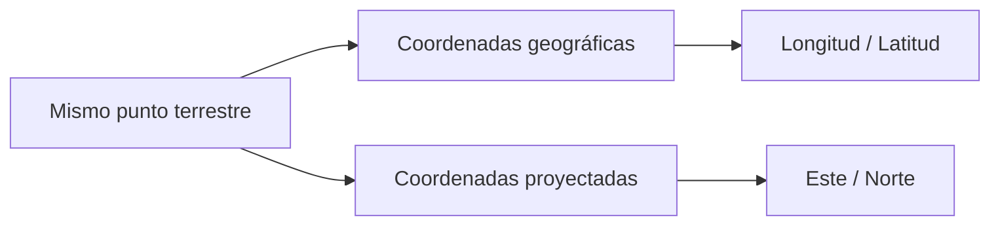
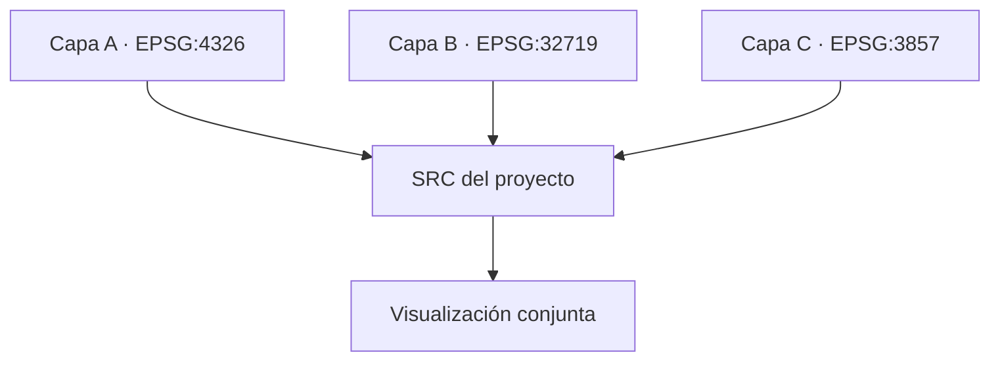
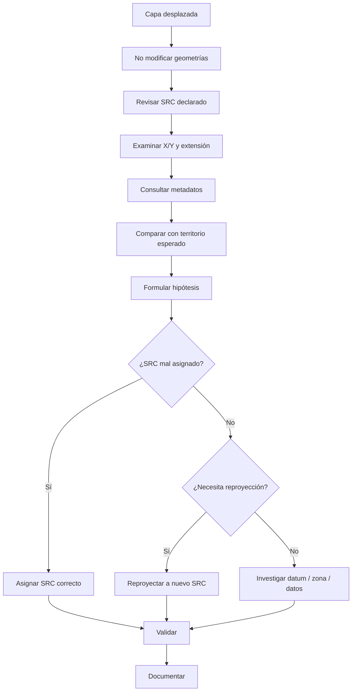

# 2.6 Resolver problemas de coordenadas

!!! abstract "Objetivos de aprendizaje"

    Al finalizar esta lección, el estudiante será capaz de:

    - Comprender la función de un **Sistema de Referencia de Coordenadas (SRC)** dentro de QGIS.
    - Diferenciar el **SRC de una capa** del **SRC del proyecto**.
    - Comprender cómo QGIS puede visualizar conjuntamente capas almacenadas en diferentes SRC.
    - Interpretar correctamente la **reproyección al vuelo**.
    - Reconocer que dos capas pueden coincidir visualmente aunque sus coordenadas numéricas sean diferentes.
    - Diferenciar claramente entre **asignar un SRC** y **reproyectar una capa**.
    - Reconocer cuándo una capa tiene un SRC ausente, incorrecto o incompatible con sus coordenadas.
    - Utilizar códigos **EPSG** para identificar sistemas de referencia conocidos.
    - Diferenciar coordenadas **geográficas** de coordenadas **proyectadas** mediante sus unidades y magnitudes.
    - Comprender la función de las **transformaciones de coordenadas y de datum**.
    - Reconocer que una transformación puede tener un **área de uso** y una precisión determinada.
    - Comprender la relación entre SRC, unidades y mediciones de distancia y superficie.
    - Diferenciar mediciones **elipsoidales** de mediciones **planimétricas**.
    - Diagnosticar sistemáticamente una capa que aparece desplazada.
    - Corregir una definición de SRC sin modificar innecesariamente las geometrías.
    - Reproyectar una capa cuando sea necesario generar coordenadas en otro sistema.
    - Validar una corrección mediante capas de referencia, coordenadas conocidas y mediciones.
    - Documentar y justificar técnicamente las decisiones tomadas durante la corrección.

!!! note "Antes de empezar"

    - **Entorno:** QGIS con el perfil `curso-qgis`. Los procedimientos toman como referencia **QGIS 3.44**; algunos nombres pueden variar ligeramente según el idioma o la versión instalada.
    - **Punto de partida:** haber completado la [lección 2.5](05-tablas-coordenadas.md), especialmente la identificación de X/Y y SRC de origen.
    - **Datos recomendados:** al menos dos capas que representen el mismo territorio en diferentes SRC y una tercera capa cuyo SRC haya sido asignado incorrectamente.
    - **Referencia territorial:** disponer de una capa cuya posición haya sido previamente validada.
    - **Edición:** no moveremos manualmente entidades para corregir problemas de referencia espacial.
    - **Conceptos previos:** coordenadas geográficas, coordenadas proyectadas, longitud, latitud, Este, Norte y código EPSG.
    - **Tiempo orientativo:** entre **120 y 150 minutos**, incluida la práctica.

---

## Cuando las capas no coinciden

Uno de los problemas más frecuentes al comenzar a trabajar con información geográfica aparece cuando incorporamos una nueva capa y observamos algo como esto:

```text
CAPA A
████████████████

                       CAPA B
                       ████████████████
```

Ambas deberían representar el mismo territorio.

Sin embargo:

- una aparece desplazada;
- una aparece en otra región;
- una desaparece aparentemente del mapa;
- el zoom de la capa lleva a un lugar inesperado;
- las coordenadas parecen extrañas;
- las distancias obtenidas no tienen sentido.

La reacción inicial suele ser:

> “La capa está mal ubicada”.

Pero esa descripción todavía no identifica la causa.

El problema puede estar en:

```text
coordenadas
SRC de la capa
SRC del proyecto
datum
zona de proyección
unidades
transformación
metadatos
```

Por eso debemos aprender a **diagnosticar antes de corregir**.

### Un mismo lugar puede tener coordenadas diferentes

Considera un mismo punto del territorio.

En un sistema geográfico podría expresarse aproximadamente como:

```text
Longitud = -66.15°
Latitud  = -17.39°
```

En un sistema proyectado podría expresarse mediante valores similares a:

```text
Este  = cientos de miles de metros
Norte = millones de metros
```

Los números son completamente diferentes.

Sin embargo, pueden representar:

> **el mismo lugar físico sobre la Tierra.**

Conceptualmente:



!!! important "La coordenada no es el territorio"

    Una coordenada es una **representación numérica de una posición dentro de un sistema de referencia**.

    Cambiar el sistema puede cambiar los números sin cambiar el lugar físico representado.

### El problema puede estar en la interpretación, no en la geometría

Supongamos que una capa contiene coordenadas correctas:

```text
X = 795000
Y = 8075000
```

pero QGIS recibe información indicando que esos números pertenecen a un sistema diferente del verdadero.

QGIS utilizará esa definición para interpretarlos.

La geometría puede estar correctamente almacenada.

El problema sería:

```text
COORDENADAS CORRECTAS
        +
SRC INCORRECTO
        =
POSICIÓN INTERPRETADA INCORRECTAMENTE
```

Esta distinción será central durante toda la lección.

!!! captura "Captura pendiente · 2.6-01"

    - **Tipo:** Imagen (PNG) comparativa.
    - **Archivo:** `assets/images/modulo-02/2-6/2-6-01-capa-desplazada.png`
    - **Qué mostrar:** dos capas que deberían coincidir, una correctamente ubicada y otra claramente desplazada.
    - **Sugerencia:** mantener visible el panel de capas y el indicador del SRC del proyecto.

---

## SRC de capa y SRC de proyecto

En QGIS necesitamos distinguir al menos dos conceptos:

```text
SRC DE LA CAPA
SRC DEL PROYECTO
```

Aunque se relacionan entre sí, cumplen funciones diferentes.

En español utilizaremos **SRC — Sistema de Referencia de Coordenadas**.

En documentación técnica también encontrarás frecuentemente:

```text
CRS — Coordinate Reference System
```

Ambos términos se refieren al mismo concepto general.

### SRC de la capa

El SRC de una capa indica:

> **cómo deben interpretarse las coordenadas almacenadas en esa capa.**

Supongamos que una geometría contiene:

```text
X = -66.1584
Y = -17.3912
```

Si su SRC es:

```text
EPSG:4326
WGS 84
```

QGIS interpreta esos números como coordenadas angulares relacionadas con:

```text
longitud
latitud
```

En cambio, una capa con:

```text
X = 795000
Y = 8075000
```

podría estar utilizando un SRC proyectado cuyos valores se expresan en metros.

El SRC forma parte de la **interpretación espacial de la capa**.

### SRC del proyecto

El proyecto QGIS también posee un SRC.

Este determina principalmente:

- el sistema en el que se representa el lienzo del mapa;
- cómo se visualizan conjuntamente las capas;
- la referencia espacial general del proyecto;
- determinadas configuraciones de coordenadas y medición.

El SRC del proyecto puede observarse desde:

**Proyecto ▸ Propiedades ▸ SRC**

y también desde la zona inferior de la interfaz de QGIS.

!!! captura "Captura pendiente · 2.6-02"

    - **Tipo:** Imagen (PNG) anotada.
    - **Archivo:** `assets/images/modulo-02/2-6/2-6-02-src-proyecto.png`
    - **Qué mostrar:** interfaz de QGIS señalando:
        1. SRC del proyecto;
        2. acceso a Propiedades del proyecto;
        3. código EPSG seleccionado.
    - **Sugerencia:** utilizar un proyecto con un SRC proyectado para que la diferencia respecto de una capa EPSG:4326 sea clara.

### Una capa no adopta automáticamente el SRC del proyecto

Supongamos:

```text
CAPA A
EPSG:4326

CAPA B
EPSG:32719

PROYECTO
EPSG:32719
```

La capa A no se transforma permanentemente en EPSG:32719 solamente porque el proyecto utilice ese SRC.

Sigue teniendo:

```text
SRC de capa = EPSG:4326
```

QGIS realiza las transformaciones necesarias para **visualizarla** en el SRC del proyecto.

Por tanto:

```text
SRC de capa ≠ necesariamente SRC del proyecto
```

!!! warning "No confundas visualización con almacenamiento"

    El lienzo puede mostrar una capa en el SRC del proyecto sin modificar el SRC ni las coordenadas almacenadas en la fuente original.

---

## Visualizar conjuntamente capas con diferentes SRC

QGIS permite trabajar simultáneamente con capas almacenadas en distintos sistemas de referencia.

Por ejemplo:

```text
municipio
EPSG:32719

equipamientos
EPSG:4326

mapa base
EPSG:3857
```

Las tres pueden aparecer correctamente superpuestas.

¿Cómo es posible?

Mediante la transformación de coordenadas **sobre la marcha**.

### Reproyección al vuelo

Conceptualmente, QGIS realiza algo similar a:



Cada capa conserva su SRC.

Pero para dibujarla en el lienzo, QGIS transforma temporalmente sus coordenadas hacia el SRC del proyecto.

Esto permite que capas con referencias espaciales diferentes aparezcan en la misma posición geográfica.

### Coincidir visualmente no significa compartir coordenadas

Dos puntos pueden aparecer exactamente superpuestos en el mapa y, sin embargo, poseer coordenadas diferentes en sus respectivas fuentes.

Por ejemplo:

```text
PUNTO A
SRC: EPSG:4326
X/Y expresados en grados

PUNTO B
SRC: EPSG:32719
X/Y expresados en metros
```

En el lienzo:

```text
A ●
B ●
```

pueden coincidir visualmente.

Pero sus coordenadas almacenadas continúan siendo distintas.

!!! important "Principio fundamental"

    **Misma posición geográfica** no significa **mismos valores X/Y**.

    Los valores dependen del SRC en el que estén expresados.

### Cambiar el SRC del proyecto no reproyecta las capas

Si modificamos:

```text
SRC del proyecto
EPSG:4326
       ↓
EPSG:32719
```

QGIS recalcula cómo debe representar las capas en el lienzo.

Pero las fuentes originales no se modifican.

Podemos representarlo así:

```text
CAPA
coordenadas originales
      │
      ├────────── permanece igual
      │
      ▼
QGIS transforma para visualizar
      │
      ▼
SRC DEL PROYECTO
```

!!! captura "Captura pendiente · 2.6-03"

    - **Tipo:** GIF animado.
    - **Archivo:** `assets/images/modulo-02/2-6/2-6-03-cambio-src-proyecto.gif`
    - **Qué mostrar:** cambiar el SRC del proyecto mientras dos capas con SRC diferentes permanecen superpuestas.
    - **Sugerencia:** mostrar simultáneamente el indicador EPSG y el lienzo.

---

## Leer las coordenadas antes de cambiar nada

Cuando una capa está desplazada, una de las primeras tareas consiste en observar sus **coordenadas originales**.

La magnitud de los números proporciona pistas importantes.

### Coordenadas geográficas

Pueden presentar valores como:

```text
X = -66.1584
Y = -17.3912
```

Sus unidades suelen ser:

```text
grados
```

Los rangos teóricos globales son:

```text
Longitud:
-180° ≤ X ≤ 180°

Latitud:
-90° ≤ Y ≤ 90°
```

### Coordenadas proyectadas

Pueden presentar valores como:

```text
X = 795000
Y = 8075000
```

Sus unidades pueden ser:

```text
metros
```

dependiendo del sistema.

La diferencia visual es evidente:

| Tipo | X | Y | Unidad habitual |
|---|---:|---:|---|
| Geográfica | -66.1584 | -17.3912 | grados |
| Proyectada | 795000 | 8075000 | metros |

!!! note "Los números proporcionan pistas, no una identificación definitiva"

    Observar que una capa contiene valores cercanos a `-66` y `-17` permite sospechar que utiliza coordenadas geográficas.

    No permite afirmar por sí solo qué datum o SRC exacto utiliza.

### El código EPSG

Muchos SRC se identifican mediante códigos de la base EPSG.

Por ejemplo:

```text
EPSG:4326
WGS 84
```

o:

```text
EPSG:32719
WGS 84 / UTM zone 19S
```

El código funciona como un identificador de una definición concreta.

No debemos interpretar:

```text
EPSG:4326
```

como un simple nombre intercambiable con cualquier sistema de longitud y latitud.

Cada código corresponde a una definición determinada.

### El área de uso también importa

Muchos SRC proyectados están diseñados para una región concreta.

Por ejemplo, las zonas UTM poseen una **extensión geográfica de uso determinada**.

Un sistema puede ser matemáticamente válido pero resultar inapropiado para un territorio situado fuera de su zona de diseño.

Por eso el selector de SRC de QGIS debe utilizarse considerando:

- nombre;
- código;
- unidades;
- área de uso;
- procedencia de los datos.

---

## Diagnosticar una capa desplazada

Supongamos que agregamos:

```text
limite_municipal.gpkg
```

y aparece correctamente.

Luego agregamos:

```text
equipamientos.gpkg
```

pero los puntos aparecen muy lejos.

No debemos mover los puntos.

Debemos iniciar un diagnóstico.

### Pregunta 1. ¿Solo una capa está desplazada?

Si:

```text
CAPA A → correcta
CAPA B → correcta
CAPA C → desplazada
```

la primera sospecha debería recaer sobre:

```text
CAPA C
```

Especialmente sobre:

- su SRC;
- sus coordenadas;
- su zona;
- sus metadatos.

No sobre el SRC del proyecto de manera automática.

### Pregunta 2. ¿Qué SRC declara la capa?

Abre:

**Propiedades de la capa ▸ Información**

o:

**Propiedades de la capa ▸ Fuente**

según el tipo de dato y la interfaz utilizada.

Registra:

```text
SRC declarado:
Nombre:
Código EPSG:
Unidades:
Extensión:
```

!!! captura "Captura pendiente · 2.6-04"

    - **Tipo:** Imagen (PNG) anotada.
    - **Archivo:** `assets/images/modulo-02/2-6/2-6-04-src-capa.png`
    - **Qué mostrar:** propiedades de una capa con su nombre de SRC, código EPSG y extensión.
    - **Sugerencia:** señalar claramente la diferencia entre información de la capa y SRC del proyecto.

### Pregunta 3. ¿Qué valores tienen realmente las coordenadas?

No te limites al nombre del SRC.

Examina también las geometrías.

Para una capa de puntos puedes:

- utilizar **Añadir atributos de geometría**;
- utilizar expresiones como `$x` y `$y`;
- consultar las coordenadas mediante herramientas de identificación;
- inspeccionar la extensión de la capa.

Podrías obtener:

```text
X mínimo = 790000
X máximo = 810000

Y mínimo = 8060000
Y máximo = 8090000
```

Si la capa declara:

```text
EPSG:4326
```

existe una contradicción evidente.

Un SRC de longitud/latitud no puede interpretar coherentemente valores de millones de grados.

### Pregunta 4. ¿Qué indican los metadatos?

Busca:

- archivo `.prj`, si corresponde;
- ficha técnica;
- metadatos;
- documentación institucional;
- información del levantamiento;
- sistema utilizado por el GPS;
- sistema utilizado por la base de datos;
- especificación de exportación.

La corrección debe basarse preferentemente en evidencia.

### Pregunta 5. ¿Qué territorio debería representar?

El contexto geográfico ayuda a validar.

Si una capa debe representar Cochabamba y al corregir su interpretación termina en Europa, la hipótesis debe revisarse.

Podemos utilizar:

- límites administrativos;
- ortofotos;
- mapas base;
- puntos conocidos;
- coordenadas de control.

### Pregunta 6. ¿La zona de proyección es correcta?

Dos SRC pueden pertenecer a la misma familia y utilizar las mismas unidades, pero corresponder a zonas diferentes.

Por ejemplo:

```text
UTM zona 19S
UTM zona 20S
```

Utilizar una zona equivocada puede provocar un desplazamiento sistemático.

Ese problema es diferente de:

```text
X/Y intercambiadas
```

o:

```text
datum incorrecto
```

---

## Asignar un SRC y reproyectar no son lo mismo

Esta es una de las diferencias más importantes de todo el curso.

Tenemos dos operaciones conceptualmente distintas:

```text
ASIGNAR SRC
REPROYECTAR
```

### Asignar un SRC

Asignar un SRC significa:

> **indicar a QGIS cómo debe interpretar las coordenadas que ya existen.**

Supongamos que la geometría almacena:

```text
X = 795000
Y = 8075000
```

pero la capa no posee información de SRC.

Si sabemos mediante documentación que corresponde a:

```text
EPSG:32719
```

podemos **asignar** ese SRC.

Los valores permanecen:

```text
795000
8075000
```

No estamos recalculando la geometría.

Estamos corrigiendo su interpretación.

### Reproyectar una capa

Reproyectar significa:

> **calcular nuevas coordenadas equivalentes en otro SRC.**

Por ejemplo:

```text
ORIGEN
EPSG:4326

X = -66.1584
Y = -17.3912
```

puede transformarse hacia:

```text
DESTINO
EPSG:32719

X = valor en metros
Y = valor en metros
```

Ahora:

- los valores X/Y cambian;
- el SRC cambia;
- la ubicación terrestre representada debe permanecer equivalente.

### Comparación directa

| Operación | ¿Cambian X/Y? | ¿Cambia el SRC? | ¿Para qué se utiliza? |
|---|---:|---:|---|
| Asignar SRC | No | Sí o se define | Corregir/definir cómo interpretar coordenadas existentes |
| Reproyectar | Sí | Sí | Expresar la geometría en otro sistema |

!!! danger "Error crítico"

    **No utilices “Establecer SRC de capa” para convertir coordenadas de un sistema a otro.**

    Esa operación no realiza una transformación matemática.

### Una analogía útil

Imagina una distancia:

```text
1000
```

Si simplemente escribimos:

```text
1000 km
```

en lugar de:

```text
1000 m
```

no hemos convertido la distancia.

Solo hemos cambiado la etiqueta con la que interpretamos el número.

Una conversión real sería:

```text
1000 m
=
1 km
```

Con los SRC sucede algo conceptualmente similar:

```text
ASIGNAR
→ reinterpretar los mismos números

REPROYECTAR
→ calcular nuevos números
```

---

## Cuándo asignar un SRC

Asignar o redefinir el SRC es apropiado cuando:

```text
las coordenadas son correctas
+
la información del SRC está ausente o es incorrecta
```

### Caso 1. Capa sin SRC

Tenemos:

```text
X ≈ 795000
Y ≈ 8075000
```

La documentación confirma:

```text
WGS 84 / UTM zone 19S
EPSG:32719
```

Pero la capa aparece como:

```text
SRC desconocido
```

Podemos asignar:

```text
EPSG:32719
```

### Caso 2. SRC mal declarado

La capa posee exactamente las mismas coordenadas proyectadas, pero declara:

```text
EPSG:4326
```

La documentación demuestra que eso es incorrecto.

En ese caso puede corregirse la **definición** del SRC.

!!! warning "No adivines el SRC únicamente hasta que visualmente coincida"

    Encontrar un SRC que hace que una capa “caiga cerca” del lugar esperado no constituye evidencia suficiente.

    Debes contrastar:

    - coordenadas;
    - metadatos;
    - área de uso;
    - datum;
    - fuentes independientes.

### Establecer el SRC de una capa en QGIS

Una forma habitual es:

1. seleccionar la capa;
2. hacer clic derecho;
3. utilizar **Establecer SRC de capa**;
4. seleccionar el sistema correcto;
5. comprobar nuevamente la posición.

También existen herramientas de procesamiento específicas para asignar una proyección.

!!! captura "Captura pendiente · 2.6-05"

    - **Tipo:** GIF animado.
    - **Archivo:** `assets/images/modulo-02/2-6/2-6-05-asignar-src.gif`
    - **Qué mostrar:** capa desplazada por tener un SRC incorrecto, corrección mediante **Establecer SRC de capa** y coincidencia posterior.
    - **Sugerencia:** incluir las coordenadas antes y después para demostrar que los valores originales no fueron transformados.

---

## Cuándo reproyectar una capa

Reproyectar es necesario cuando queremos generar una nueva representación de las geometrías en otro SRC.

Por ejemplo:

```text
ORIGINAL
EPSG:4326
grados

        ↓ reproyectar

RESULTADO
EPSG:32719
metros
```

### Motivos para reproyectar

Puede ser necesario para:

- trabajar con unidades métricas;
- aplicar determinados análisis espaciales;
- homogeneizar fuentes de trabajo;
- cumplir una especificación institucional;
- exportar datos en un SRC solicitado;
- utilizar un sistema apropiado para el territorio;
- evitar que determinados algoritmos trabajen con unidades inadecuadas.

### Reproyectar mediante Procesamiento

En la Caja de herramientas puedes buscar:

```text
Reproyectar capa
```

El procedimiento conceptual es:

```text
CAPA DE ENTRADA
       │
       ├── SRC origen
       │
       ▼
TRANSFORMACIÓN
       │
       ├── SRC destino
       ▼
CAPA REPROYECTADA
```

!!! captura "Captura pendiente · 2.6-06"

    - **Tipo:** Imagen (PNG) anotada.
    - **Archivo:** `assets/images/modulo-02/2-6/2-6-06-reproyectar-capa.png`
    - **Qué mostrar:** algoritmo **Reproyectar capa** señalando:
        1. capa de entrada;
        2. SRC origen;
        3. SRC destino;
        4. salida.

### Reproyectar mediante exportación

También puede generarse una capa en otro SRC utilizando:

**Clic derecho ▸ Exportar ▸ Guardar objetos como…**

y seleccionando un SRC diferente como destino.

El resultado debe guardarse como una **nueva fuente**.

Por ejemplo:

```text
datos/originales/
└── equipamientos_wgs84.gpkg

datos/trabajo/
└── equipamientos_utm19s.gpkg
```

### Verificar que hubo una transformación real

Después de reproyectar comprueba:

```text
SRC original:
EPSG:4326

SRC nuevo:
EPSG:32719
```

y también:

```text
X/Y originales ≠ X/Y nuevas
```

pero:

```text
posición geográfica original
≈
posición geográfica nueva
```

!!! success "Resultado esperado"

    Una reproyección correcta modifica la representación numérica, no el lugar físico que representa la entidad.

---

## El SRC del proyecto debe elegirse con intención

Como vimos, QGIS puede visualizar conjuntamente capas con distintos SRC.

Esto no significa que el SRC del proyecto sea irrelevante.

Su elección afecta:

- la representación del mapa;
- las unidades utilizadas en determinados contextos;
- la lectura de coordenadas;
- ciertas operaciones cartográficas;
- la interpretación visual de distancias, áreas y formas.

### Sistemas geográficos

Un SRC geográfico utiliza coordenadas angulares.

Por ejemplo:

```text
EPSG:4326
WGS 84
```

sus coordenadas se expresan mediante:

```text
longitud
latitud
```

y sus unidades angulares son grados.

### Sistemas proyectados

Un SRC proyectado representa la superficie sobre un plano.

Puede utilizar unidades como:

```text
metros
```

Por ejemplo, para datos WGS 84 situados dentro del área correspondiente a la zona UTM 19 Sur puede encontrarse:

```text
EPSG:32719
WGS 84 / UTM zone 19S
```

!!! note "El ejemplo no sustituye la selección técnica"

    No debes utilizar EPSG:32719 simplemente porque aparezca en este curso.

    El SRC apropiado depende de:

    - ubicación del territorio;
    - datum;
    - objetivo del análisis;
    - precisión requerida;
    - normativa o especificación de los datos.

### Cambiar el SRC del proyecto es una decisión de visualización y trabajo

Supongamos:

```text
Capa:
EPSG:4326

Proyecto:
EPSG:4326
```

Cambiar el proyecto a:

```text
EPSG:32719
```

hará que QGIS represente la capa transformada al vuelo.

Pero la fuente original seguirá siendo:

```text
EPSG:4326
```

---

## Transformaciones de coordenadas y datum

Hasta ahora hemos hablado de transformar coordenadas entre SRC.

Pero no todas las transformaciones tienen la misma complejidad.

Dos SRC pueden diferenciarse en:

- proyección;
- datum;
- elipsoide;
- época de referencia;
- parámetros geodésicos;
- unidades;
- otros componentes.

### Qué es una operación de coordenadas

Una transformación puede entenderse como una operación que convierte:

```text
COORDENADAS EN SRC A
          ↓
operación matemática
          ↓
COORDENADAS EN SRC B
```

QGIS utiliza la biblioteca **PROJ** para realizar estas operaciones.

### Cuando existen varias transformaciones posibles

Para determinadas combinaciones de origen y destino puede existir más de una operación.

Las alternativas pueden diferenciarse en:

- precisión estimada;
- área de uso;
- método;
- disponibilidad de archivos auxiliares;
- cuadrículas de transformación.

QGIS puede seleccionar automáticamente una operación adecuada o permitir que el usuario elija entre varias alternativas.

### El área de uso importa

Una transformación diseñada para un territorio concreto no debe asumirse como apropiada en cualquier región.

Al evaluar una operación debemos revisar:

```text
SRC origen
SRC destino
precisión
área de uso
```

### Transformaciones mediante cuadrículas

Algunas transformaciones de alta precisión pueden necesitar archivos adicionales de cuadrícula.

Si QGIS informa que existe una transformación más precisa pero que requiere recursos adicionales, no conviene ignorar automáticamente la advertencia.

Debemos evaluar:

- escala de trabajo;
- precisión necesaria;
- disponibilidad de la cuadrícula;
- propósito de los datos.

!!! captura "Captura pendiente · 2.6-07"

    - **Tipo:** Imagen (PNG).
    - **Archivo:** `assets/images/modulo-02/2-6/2-6-07-transformaciones.png`
    - **Qué mostrar:** diálogo de selección de transformaciones mostrando origen, destino, precisión y área de uso.
    - **Sugerencia:** remarcar que la transformación no se elige solamente por el nombre.

---

## Unidades y mediciones

Los problemas de SRC no siempre se manifiestan como una capa desplazada.

A veces el mapa parece correcto, pero:

```text
distancias
áreas
perímetros
buffers
```

producen resultados inesperados.

Por eso debemos comprender las unidades.

### Grados no son metros

En un sistema geográfico podemos encontrar:

```text
X = -66.1584°
Y = -17.3912°
```

La unidad es angular.

Un grado no equivale a una distancia constante en metros sobre toda la superficie terrestre.

Por tanto:

```text
1 grado ≠ distancia métrica fija
```

en cualquier lugar del planeta.

### Un sistema proyectado puede trabajar en metros

En un SRC proyectado apropiado podemos encontrar:

```text
X = coordenada Este en metros
Y = coordenada Norte en metros
```

Esto resulta especialmente útil para determinados análisis locales.

Pero incluso aquí debemos conocer:

- qué proyección utilizamos;
- dónde se encuentra su área de uso;
- qué distorsiones introduce.

### Las mediciones de QGIS pueden ser elipsoidales

Las herramientas de medición de QGIS pueden considerar el elipsoide configurado en el proyecto.

Por tanto, no debemos asumir que:

> “si mi proyecto está en grados, QGIS necesariamente medirá distancias en grados”.

QGIS puede realizar mediciones geodésicas/elipsoidales y expresar el resultado en unidades de distancia configuradas.

### Medición elipsoidal

Conceptualmente:

```text
SUPERFICIE CURVA DE LA TIERRA
          ↓
modelo elipsoidal
          ↓
distancia / área
```

Este enfoque considera la geometría sobre un modelo terrestre.

### Medición planimétrica

Una medición planimétrica considera las coordenadas sobre un plano cartesiano.

Conceptualmente:

```text
PLANO XY
  ↓
geometría cartesiana
  ↓
distancia / área
```

En QGIS es posible configurar el elipsoide como:

```text
Ninguno / Planimétrico
```

cuando se desea trabajar explícitamente con ese enfoque.

!!! warning "No confundas la herramienta Medir con todos los algoritmos"

    Diferentes herramientas y algoritmos pueden utilizar las coordenadas y unidades de maneras distintas.

    Antes de realizar análisis métricos debes conocer:

    - SRC de entrada;
    - SRC de salida;
    - unidades;
    - configuración de medición;
    - funcionamiento del algoritmo utilizado.

### Revisar las unidades del proyecto

Desde:

**Proyecto ▸ Propiedades ▸ General**

puedes revisar configuraciones relacionadas con:

- unidades de distancia;
- unidades de superficie;
- elipsoide;
- precisión de visualización.

!!! captura "Captura pendiente · 2.6-08"

    - **Tipo:** Imagen (PNG) anotada.
    - **Archivo:** `assets/images/modulo-02/2-6/2-6-08-unidades-medicion.png`
    - **Qué mostrar:** Propiedades del proyecto con elipsoide, unidades de distancia y unidades de superficie.
    - **Sugerencia:** mostrar una medición sobre el mapa junto al panel de configuración.

---

## Medir no es lo mismo que calcular con las coordenadas

Este punto es especialmente importante.

Supongamos que dos puntos se encuentran en EPSG:4326.

Sus coordenadas son:

```text
Punto A:
-66.15, -17.39

Punto B:
-66.14, -17.39
```

La diferencia numérica en X es:

```text
0.01°
```

Eso no significa:

```text
0.01 metros
```

ni:

```text
1 kilómetro exacto
```

Para obtener una distancia necesitamos una metodología de cálculo adecuada.

### Herramientas interactivas

La herramienta:

**Medir distancia**

puede utilizar la configuración de medición del proyecto.

### Expresiones y geometrías

Funciones como:

```text
$length
$area
```

o determinados algoritmos pueden depender del contexto y del SRC de las geometrías.

Por ello siempre debemos documentar:

```text
qué herramienta
+
qué SRC
+
qué unidades
+
qué método
```

cuando una medición sea relevante para un análisis técnico.

---

## Síntomas frecuentes y sus posibles causas

No existe una relación absoluta entre síntoma y causa, pero podemos construir una matriz de diagnóstico inicial.

| Síntoma | Posible causa | Primera comprobación |
|---|---|---|
| Una capa aparece en otro continente | SRC incorrecto | SRC declarado y magnitud X/Y |
| Una capa aparece cerca pero desplazada | Datum, zona o transformación | Metadatos y área de uso |
| Todas las capas coinciden aunque tengan EPSG distintos | Reproyección al vuelo | SRC de cada capa |
| Cambiar el SRC del proyecto no cambia las fuentes | Comportamiento normal | Revisar propiedades de capa |
| Coordenadas de millones aparecen en EPSG:4326 | SRC mal asignado | Valores originales |
| Coordenadas `-66, -17` aparecen como UTM | SRC mal asignado | Unidades y definición |
| Una capa UTM queda desplazada hacia Este/Oeste | Zona UTM posiblemente incorrecta | Zona y longitud del territorio |
| Distancia calculada tiene unidades inesperadas | Configuración o SRC | Unidades y método de medición |
| Buffer tiene tamaño absurdo | Capa/algoritmo en unidades inadecuadas | SRC utilizado por el procesamiento |
| Dos capas coinciden visualmente pero X/Y difieren | SRC diferentes | Comportamiento correcto |
| Asignar otro EPSG “corrige” visualmente una capa | Posible SRC mal definido | Confirmar mediante metadatos |
| Reproyectar una capa cambia X/Y | Comportamiento correcto | Validar misma posición física |

---

## Un protocolo de diagnóstico reproducible

Cuando una capa aparezca desplazada utilizaremos siempre una secuencia ordenada.

No comenzaremos cambiando EPSG al azar.



### 1. No mover las geometrías

Una capa desplazada no debe corregirse arrastrando o trasladando manualmente sus entidades.

Eso puede destruir coordenadas que originalmente eran correctas.

!!! danger "Nunca uses edición manual como primera solución a un problema de SRC"

    Si toda una capa aparece desplazada de manera sistemática, primero sospecha de su referencia espacial.

### 2. Registrar el SRC declarado

Anota:

```text
Nombre:
Código EPSG:
Tipo:
Unidades:
Área de uso:
```

### 3. Examinar coordenadas originales

Obtén:

```text
X mínima
X máxima
Y mínima
Y máxima
```

y algunos puntos de muestra.

Pregunta:

- ¿parecen grados?;
- ¿parecen metros?;
- ¿son coherentes con el SRC declarado?;
- ¿existe una posible inversión X/Y?;
- ¿los signos son coherentes?

### 4. Consultar evidencia externa a la geometría

Revisa:

```text
metadatos
documentación
procedencia
ficha técnica
autor
software de origen
configuración de exportación
```

### 5. Formular una hipótesis

Por ejemplo:

```text
Hipótesis:
La capa está almacenada en EPSG:32719,
pero fue etiquetada como EPSG:32720.
```

### 6. Probar sin destruir el original

Trabaja sobre:

- una copia;
- una capa temporal;
- una nueva fuente derivada.

No sobrescribas inmediatamente el archivo original.

### 7. Validar con una referencia independiente

Después de la corrección compara con:

- límite administrativo;
- ortofoto;
- cartografía base;
- coordenadas conocidas;
- puntos de control.

### 8. Comprobar coordenadas y unidades

No basta con que “se vea bien”.

Verifica también:

```text
SRC
X/Y
unidades
extensión
```

### 9. Documentar la decisión

Registra:

| Elemento | Ejemplo |
|---|---|
| Archivo | `equipamientos.gpkg` |
| SRC declarado inicialmente | EPSG incorrecto |
| Coordenadas observadas | valores UTM |
| Fuente consultada | ficha técnica |
| SRC confirmado | EPSG:32719 |
| Acción | reasignación del SRC |
| ¿Se transformaron geometrías? | No |
| Validación | coincidencia con límites y puntos conocidos |
| Responsable | estudiante/equipo |
| Fecha | AAAA-MM-DD |

---

## Ejemplo aplicado: una capa desplazada

Supongamos un proyecto con:

```text
limite_municipal.gpkg
EPSG:32719
```

La capa aparece correctamente.

Agregamos:

```text
equipamientos.gpkg
```

Los puntos aparecen lejos.

### Inspección del SRC declarado

Las propiedades indican:

```text
EPSG:4326
WGS 84
```

Pero al examinar las geometrías encontramos valores similares a:

```text
X = 795000
Y = 8075000
```

Existe una contradicción.

### Primera conclusión

Los números:

```text
795000
8075000
```

no son coherentes con un sistema de longitud/latitud expresado en grados.

Por tanto:

```text
EPSG:4326
```

es muy probablemente una definición incorrecta.

Esto todavía no demuestra cuál es el SRC correcto.

### Consulta de metadatos

La ficha técnica indica:

```text
Sistema:
WGS 84 / UTM zone 19S

EPSG:
32719
```

Ahora disponemos de evidencia.

### Corrección

Debemos:

```text
ASIGNAR
EPSG:32719
```

No:

```text
REPROYECTAR
desde EPSG:4326
hacia EPSG:32719
```

¿Por qué?

Porque los valores ya estaban expresados en el sistema proyectado.

El error estaba en la **etiqueta de interpretación**.

### Validación

Después de asignar correctamente el SRC:

- los puntos coinciden con el territorio;
- las coordenadas originales permanecen iguales;
- la capa ahora declara EPSG:32719;
- la extensión resulta coherente;
- las unidades son compatibles con el sistema.

Podemos registrar:

```text
PROBLEMA:
SRC incorrectamente declarado.

CAUSA:
La capa contenía coordenadas UTM pero estaba definida como EPSG:4326.

ACCIÓN:
Asignación del SRC EPSG:32719.

TRANSFORMACIÓN DE GEOMETRÍAS:
No.

VALIDACIÓN:
Coincidencia con capa municipal y coordenadas de control.
```

!!! captura "Captura pendiente · 2.6-09"

    - **Tipo:** Imagen (PNG) comparativa.
    - **Archivo:** `assets/images/modulo-02/2-6/2-6-09-diagnostico-correccion.png`
    - **Qué mostrar:** tres estados:
        1. capa desplazada;
        2. evidencia de coordenadas y SRC incorrecto;
        3. capa correctamente ubicada después de asignar el SRC.
    - **Sugerencia:** incluir una pequeña ficha de diagnóstico en la composición.

---

## Un segundo caso: SRC correcto pero necesitamos otro sistema

Ahora supongamos una capa:

```text
equipamientos_wgs84.gpkg
```

con:

```text
SRC = EPSG:4326
```

y coordenadas coherentes:

```text
X ≈ -66
Y ≈ -17
```

La capa está correctamente ubicada.

Necesitamos generar una copia para determinado análisis en un sistema proyectado apropiado.

### Aquí no debemos reasignar

No debemos utilizar:

```text
Establecer SRC de capa → EPSG:32719
```

porque eso interpretaría:

```text
-66
-17
```

como si fueran coordenadas proyectadas.

La capa se desplazaría.

### Aquí corresponde reproyectar

Debemos utilizar:

```text
REPROYECTAR CAPA
```

de:

```text
EPSG:4326
```

hacia:

```text
EPSG:32719
```

El resultado tendrá:

```text
nuevas coordenadas
+
nuevo SRC
+
misma posición terrestre
```

Esta comparación resume toda la diferencia:

```text
SRC MAL DECLARADO
→ ASIGNAR

SRC CORRECTO, QUIERO OTRO
→ REPROYECTAR
```

---

## Comparar antes y después

Una buena práctica consiste en mantener temporalmente visibles:

```text
capa_original
capa_reproyectada
```

Si la transformación fue correcta deberían coincidir visualmente gracias a la reproyección al vuelo.

Sin embargo, al inspeccionar sus coordenadas:

```text
ORIGINAL
grados

RESULTADO
metros
```

serán diferentes.

### Tabla de control

| Control | Original | Resultado |
|---|---|---|
| SRC | EPSG:4326 | EPSG:32719 |
| Unidad de coordenadas | grados | metros |
| X/Y | longitud/latitud | Este/Norte |
| Posición física | misma | misma |
| Valores numéricos | diferentes | diferentes |
| Fuente original modificada | No | No |

---

## La extensión es una herramienta de diagnóstico

Toda capa posee una extensión:

```text
X mínima
X máxima
Y mínima
Y máxima
```

Estos valores pueden ayudarnos a detectar inconsistencias.

Por ejemplo:

```text
SRC declarado:
EPSG:4326

Extensión:
X = 790000 a 810000
Y = 8060000 a 8090000
```

Eso constituye una señal clara de que:

```text
SRC declarado
```

y:

```text
coordenadas almacenadas
```

no son compatibles.

### Comparar extensión y área de uso

También debemos verificar si las coordenadas transformadas caen dentro del área para la que el SRC está diseñado.

Un resultado puede ser matemáticamente calculable y aun así utilizar un sistema inadecuado para el territorio.

---

## No adivinar el SRC por ensayo y error

Una práctica muy peligrosa consiste en:

```text
probar EPSG:4326
↓
no funciona

probar EPSG:3857
↓
no funciona

probar EPSG:32719
↓
se acerca

probar EPSG:32720
↓
también se acerca
```

y elegir simplemente el que “se ve mejor”.

Eso no constituye un procedimiento técnico.

### El mapa sirve para validar, no para inventar metadatos

La posición visual puede ayudarnos a:

- aceptar una hipótesis;
- descartar una hipótesis;
- detectar inconsistencias.

Pero debe combinarse con:

```text
coordenadas
+
metadatos
+
área de uso
+
procedencia
+
referencias independientes
```

!!! important "La coincidencia visual es evidencia complementaria"

    No sustituye la documentación del dato.

---

## Construir una matriz de diagnóstico

Para problemas reales resulta útil registrar las hipótesis.

| Nº | Síntoma | Hipótesis | Evidencia | Prueba | Resultado |
|---:|---|---|---|---|---|
| 1 | Capa lejos del municipio | X/Y intercambiadas | Valores parecen UTM | Revisar rangos | Descartada |
| 2 | Capa lejos del municipio | SRC 4326 incorrecto | X/Y en millones | Consultar metadatos | Confirmada |
| 3 | Desplazamiento residual | Zona UTM incorrecta | Fuente menciona zona 19S | Comparar EPSG | Confirmada/descartada |
| 4 | Diferencia pequeña | Transformación de datum | Datum distinto | Revisar operaciones | Pendiente |

Esta tabla obliga a separar:

```text
lo que observamos
```

de:

```text
lo que suponemos
```

---

## Documentar una corrección espacial

Una corrección bien hecha debe ser reproducible.

Registra como mínimo:

```text
Archivo:
Problema observado:
SRC original declarado:
Coordenadas observadas:
SRC confirmado:
Fuente de confirmación:
Acción realizada:
Transformación aplicada:
Resultado:
Método de validación:
Fecha:
Responsable:
```

### Justificar no es solamente describir

Evita una justificación como:

> “Cambié el EPSG porque así quedó bien”.

Prefiere:

> “La capa declaraba EPSG:4326, pero sus coordenadas presentaban magnitudes propias de un sistema proyectado. La ficha técnica de la fuente especifica WGS 84 / UTM zona 19S, EPSG:32719. Se reasignó el SRC sin reproyectar las geometrías y se verificó la coincidencia con el límite municipal y tres puntos de control.”

La segunda explicación contiene:

```text
síntoma
+
evidencia
+
decisión
+
procedimiento
+
validación
```

Eso es una **justificación técnica**.

---

## Reto práctico

!!! example "Reto 2.6 — Diagnosticar una capa desplazada y justificar la corrección"

    **Situación:** recibiste un conjunto de datos de equipamientos que debería localizarse dentro del área de estudio. Al incorporarlo al proyecto, la capa aparece desplazada respecto de los límites administrativos.

    Tu tarea no consiste simplemente en hacer que los puntos coincidan visualmente.

    Debes identificar la causa, aplicar la corrección técnicamente adecuada y justificarla.

    **1. Preparar el proyecto**

    Abre el proyecto de la lección anterior y guárdalo como:

    ```text
    proyectos/reto_2-6_coordenadas.qgz
    ```

    Conserva intactos todos los archivos originales.

    **2. Incorporar las capas**

    Utiliza como mínimo:

    ```text
    limite_referencia
    equipamientos_problema
    ```

    y, cuando esté disponible:

    ```text
    puntos_control
    ```

    **3. Registrar el problema inicial**

    Antes de modificar nada completa:

    | Elemento | Resultado |
    |---|---|
    | SRC del proyecto | |
    | SRC declarado por la capa | |
    | Unidad declarada | |
    | X mínima | |
    | X máxima | |
    | Y mínima | |
    | Y máxima | |
    | Ubicación observada | |
    | Ubicación esperada | |

    **4. Analizar las coordenadas**

    Determina si los valores parecen:

    - geográficos;
    - proyectados;
    - intercambiados;
    - incompatibles con el SRC declarado.

    **5. Consultar la documentación**

    Busca evidencia en:

    - metadatos;
    - ficha técnica;
    - documentación de la fuente;
    - nombre del conjunto de datos;
    - información del levantamiento.

    Registra la fuente utilizada.

    **6. Formular al menos dos hipótesis**

    Por ejemplo:

    ```text
    H1:
    X/Y están intercambiadas.

    H2:
    El SRC de la capa fue asignado incorrectamente.

    H3:
    La zona UTM es incorrecta.
    ```

    No modifiques varias condiciones al mismo tiempo.

    **7. Determinar si corresponde asignar o reproyectar**

    Debes responder explícitamente:

    ```text
    ¿Las coordenadas ya están en el sistema correcto pero están mal etiquetadas?

    o

    ¿Las coordenadas están correctamente definidas y necesito transformarlas a otro sistema?
    ```

    A partir de esa respuesta selecciona:

    ```text
    ASIGNAR SRC
    ```

    o:

    ```text
    REPROYECTAR
    ```

    **8. Aplicar la corrección**

    Trabaja sobre una copia o salida derivada.

    No modifiques el original.

    **9. Validar**

    Comprueba:

    - coincidencia con el límite;
    - posición de puntos conocidos;
    - extensión;
    - SRC resultante;
    - coordenadas resultantes;
    - unidades;
    - número de entidades.

    **10. Realizar una medición de control**

    Selecciona dos puntos conocidos y registra:

    ```text
    Método de medición:
    SRC del proyecto:
    Elipsoide:
    Unidad:
    Resultado:
    ```

    Explica por qué la unidad utilizada es adecuada.

    **11. Comparar asignación y reproyección**

    Completa:

    | Operación | ¿Cambió X/Y? | ¿Cambió SRC? | ¿Cambió la posición física? |
    |---|---|---|---|
    | Asignación | | | |
    | Reproyección | | | |

    **12. Elaborar la justificación técnica**

    Redacta entre **100 y 150 palabras** respondiendo:

    - ¿qué problema tenía la capa?;
    - ¿qué evidencia permitió identificarlo?;
    - ¿qué SRC estaba declarado?;
    - ¿cuál era el SRC correcto?;
    - ¿por qué asignaste o reproyectaste?;
    - ¿cómo verificaste el resultado?

    **Entregables:**

    - `reto_2-6_coordenadas.qgz`;
    - capa corregida en GeoPackage;
    - matriz de diagnóstico;
    - ficha de SRC antes y después;
    - captura de la capa desplazada;
    - captura de la configuración aplicada;
    - captura del resultado validado;
    - medición de control;
    - justificación técnica.

!!! captura "Captura pendiente · 2.6-10"

    - **Tipo:** Imagen (PNG) comparativa.
    - **Archivo:** `assets/images/modulo-02/2-6/2-6-10-reto-antes-despues.png`
    - **Qué mostrar:** a la izquierda la situación inicial y a la derecha la capa corregida sobre la referencia territorial.
    - **Sugerencia:** incluir SRC declarado/corregido debajo de cada mapa.

??? success "Criterios de evaluación del reto"

    | Criterio | Se cumple si... |
    |---|---|
    | Diagnóstico | No modifica la capa antes de identificar el problema |
    | SRC de capa | Identifica correctamente el SRC declarado |
    | SRC de proyecto | Distingue su función respecto del SRC de las capas |
    | Coordenadas | Examina valores X/Y y extensión |
    | Unidades | Diferencia grados de unidades métricas |
    | Evidencia | Consulta información externa a la visualización |
    | Hipótesis | Formula posibles causas antes de modificar datos |
    | Asignación | Comprende cuándo corresponde redefinir el SRC |
    | Reproyección | Comprende cuándo deben transformarse las coordenadas |
    | Transformación | Identifica origen y destino correctamente |
    | Validación | Utiliza una referencia espacial independiente |
    | Medición | Documenta método, unidad y configuración |
    | Trazabilidad | Conserva los datos originales |
    | Justificación | Explica problema, evidencia, decisión y resultado |
    | Resultado | La capa final posee una referencia espacial coherente y documentada |

---

## Problemas frecuentes

| Problema | Posible causa | Qué revisar |
|---|---|---|
| Una capa aparece lejos del resto | SRC incorrecto | SRC declarado y coordenadas |
| La capa no tiene SRC | Metadatos ausentes | Fuente y documentación |
| Cambié el SRC del proyecto y la capa sigue teniendo el mismo EPSG | Comportamiento normal | SRC de proyecto ≠ SRC de capa |
| Dos capas con EPSG diferentes coinciden | Reproyección al vuelo | No es necesariamente un problema |
| Asigné otro EPSG y la capa se movió | Cambió la interpretación | Verificar si correspondía reproyectar |
| Reproyecté y cambiaron X/Y | Comportamiento normal | Validar misma posición física |
| Una capa UTM aparece desplazada | Zona incorrecta | Número de zona y área de uso |
| Coordenadas en millones declaran EPSG:4326 | SRC probablemente incorrecto | Metadatos y unidades |
| Coordenadas pequeñas declaran UTM | SRC probablemente incorrecto | Fuente de coordenadas |
| La capa coincide pero mide mal | Unidades/configuración | SRC, elipsoide y método |
| Buffer con tamaño inesperado | Unidades del análisis | CRS utilizado por el algoritmo |
| QGIS solicita transformación | Existen varias operaciones posibles | Precisión y área de uso |
| Aparece advertencia sobre cuadrícula | Transformación más precisa no disponible | Recursos PROJ requeridos |
| La corrección visual funciona pero no puedo justificarla | Falta evidencia | Revisar documentación |
| Moví manualmente toda la capa | Procedimiento incorrecto | Recuperar original y diagnosticar SRC |

---

## Ideas clave

!!! success "Para recordar"

    - Una coordenada solo adquiere significado espacial cuando conocemos su **Sistema de Referencia de Coordenadas**.
    - El **SRC de una capa** describe cómo deben interpretarse sus coordenadas almacenadas.
    - El **SRC del proyecto** determina el sistema común utilizado por QGIS para representar el lienzo.
    - Las capas de un mismo proyecto **no necesitan estar almacenadas en el mismo SRC**.
    - QGIS puede transformarlas **sobre la marcha** para visualizarlas conjuntamente.
    - Dos capas pueden coincidir visualmente y tener valores X/Y completamente diferentes.
    - Cambiar el SRC del proyecto **no reproyecta permanentemente las capas**.
    - Las magnitudes de X/Y pueden ayudarnos a distinguir coordenadas geográficas de proyectadas.
    - Los códigos **EPSG** identifican definiciones concretas de sistemas de referencia.
    - Un SRC proyectado posee un **área de uso** que debe respetarse.
    - **Asignar un SRC** modifica la interpretación de las coordenadas existentes.
    - **Reproyectar** calcula nuevas coordenadas equivalentes en otro sistema.
    - Asignar y reproyectar **no son operaciones intercambiables**.
    - Si el SRC está mal declarado pero las coordenadas son correctas, puede corresponder **asignar** el SRC correcto.
    - Si el SRC es correcto y necesitamos expresar la capa en otro sistema, corresponde **reproyectar**.
    - Las transformaciones pueden tener diferente precisión y área de uso.
    - Algunas transformaciones requieren archivos auxiliares de cuadrícula.
    - Grados y metros representan tipos de unidades diferentes.
    - Las mediciones en QGIS pueden utilizar cálculos **elipsoidales** o **planimétricos**.
    - No debemos corregir una capa desplazada moviendo manualmente sus entidades.
    - No debemos buscar códigos EPSG al azar hasta que la capa “parezca correcta”.
    - El diagnóstico debe combinar **coordenadas, SRC, metadatos, territorio y referencias independientes**.
    - Toda corrección debe conservar el archivo original y quedar documentada.
    - Una corrección profesional debe poder **explicarse, repetirse y verificarse**.

---

## Autoevaluación

??? question "1. ¿Cuál es la función principal del SRC de una capa?"

    Indicar cómo deben interpretarse espacialmente las coordenadas almacenadas en esa capa.

??? question "2. ¿Cuál es la función principal del SRC del proyecto?"

    Proporcionar el sistema común en el que QGIS representa el lienzo y transforma al vuelo las capas para su visualización conjunta.

??? question "3. ¿Todas las capas de un proyecto deben utilizar el mismo SRC?"

    No.

    QGIS puede visualizar conjuntamente capas almacenadas en sistemas distintos mediante transformaciones sobre la marcha.

??? question "4. Dos capas coinciden perfectamente en el mapa pero utilizan EPSG diferentes. ¿Eso implica un error?"

    No.

    Pueden representar el mismo territorio mediante coordenadas diferentes y QGIS puede transformarlas al SRC del proyecto durante la visualización.

??? question "5. ¿Cambiar el SRC del proyecto transforma permanentemente las coordenadas de las capas?"

    No.

    Modifica cómo QGIS las representa en el lienzo, pero no modifica por sí mismo las fuentes originales.

??? question "6. ¿Qué diferencia existe entre asignar un SRC y reproyectar?"

    Asignar un SRC cambia o define cómo deben interpretarse las coordenadas existentes sin recalcularlas.

    Reproyectar calcula nuevas coordenadas equivalentes en otro sistema.

??? question "7. Una capa posee coordenadas correctas pero perdió la información de su SRC. ¿Qué operación puede corresponder?"

    Asignar el SRC correcto, siempre que pueda determinarse mediante evidencia confiable.

??? question "8. Una capa está correctamente definida en EPSG:4326 y necesitas una copia en un sistema proyectado. ¿Qué debes hacer?"

    Reproyectarla hacia el SRC de destino.

??? question "9. ¿Por qué no debes cambiar simplemente EPSG:4326 por EPSG:32719 para transformar una capa?"

    Porque cambiar la definición del SRC no realiza la transformación matemática de las coordenadas.

??? question "10. ¿Qué ocurre normalmente con X/Y después de una reproyección?"

    Los valores numéricos cambian porque ahora expresan la misma posición mediante otro sistema de referencia.

??? question "11. ¿Qué debería ocurrir con la posición geográfica después de una reproyección correcta?"

    Debe representar esencialmente el mismo lugar físico.

??? question "12. Una capa declara EPSG:4326 pero posee valores X/Y cercanos a cientos de miles y millones. ¿Qué indica?"

    Existe una fuerte inconsistencia entre el SRC declarado y las coordenadas almacenadas que debe investigarse.

??? question "13. ¿Es suficiente observar esos valores para afirmar cuál es el SRC correcto?"

    No.

    Permiten detectar una inconsistencia, pero el SRC correcto debe confirmarse mediante metadatos, procedencia, área de uso u otra evidencia.

??? question "14. ¿Qué es la reproyección al vuelo?"

    Es la transformación temporal que realiza QGIS para representar en el SRC del proyecto capas almacenadas en otros SRC sin modificar permanentemente sus fuentes.

??? question "15. ¿Por qué una zona UTM equivocada puede desplazar una capa?"

    Porque cada zona define un sistema proyectado diseñado para una franja geográfica determinada y utiliza parámetros específicos para representar ese territorio.

??? question "16. ¿Qué es el área de uso de un SRC o transformación?"

    Es la región geográfica para la cual esa definición u operación fue diseñada y donde sus resultados son apropiados.

??? question "17. ¿Por qué pueden existir varias transformaciones entre dos SRC?"

    Porque pueden utilizar distintos métodos, parámetros, cuadrículas o niveles de precisión, y estar diseñadas para áreas de uso diferentes.

??? question "18. ¿Grados y metros son equivalentes?"

    No.

    Los grados son unidades angulares, mientras que los metros son unidades lineales.

??? question "19. ¿Un proyecto en EPSG:4326 impide obtener distancias en metros mediante la herramienta de medición de QGIS?"

    No necesariamente.

    Las herramientas de medición pueden utilizar cálculos elipsoidales y las unidades configuradas en el proyecto.

??? question "20. ¿Qué diferencia existe entre medición elipsoidal y planimétrica?"

    La medición elipsoidal considera un modelo de la superficie terrestre, mientras que la planimétrica realiza cálculos cartesianos sobre el plano de coordenadas.

??? question "21. Una capa aparece desplazada. ¿Cuál debería ser tu primera acción?"

    Conservar la geometría sin modificar y revisar su SRC, coordenadas, extensión y metadatos.

??? question "22. ¿Por qué no debemos mover manualmente toda una capa para hacerla coincidir?"

    Porque el desplazamiento puede deberse únicamente a una referencia espacial incorrecta y mover las entidades alteraría coordenadas que podrían ser válidas.

??? question "23. ¿Por qué no debemos probar códigos EPSG hasta encontrar uno que visualmente parezca funcionar?"

    Porque la coincidencia visual por sí sola no demuestra que ese sea el sistema en el que fueron generadas las coordenadas.

??? question "24. ¿Qué elementos debería contener una justificación técnica de la corrección?"

    El problema observado, la evidencia utilizada, el SRC declarado, el SRC confirmado, la operación aplicada, si hubo transformación de coordenadas y el método utilizado para validar el resultado.

---

## Referencias

- [QGIS Project. *QGIS 3.44 — Trabajar con Proyecciones*](https://docs.qgis.org/3.44/es/docs/user_manual/working_with_projections/working_with_projections.html)  
  Documentación oficial sobre SRC de capa, SRC del proyecto, reproyección al vuelo, selector de sistemas de referencia y transformaciones de datum.

- [QGIS Project. *QGIS 3.44 — Sistemas de Coordenadas de las capas y del proyecto*](https://docs.qgis.org/3.44/es/docs/user_manual/working_with_projections/working_with_projections.html#layer-coordinate-reference-systems)  
  Referencia para comprender cómo QGIS interpreta el SRC de cada capa y cómo lo relaciona con el SRC configurado para el proyecto.

- [QGIS Project. *QGIS 3.44 — Transformaciones de Datum*](https://docs.qgis.org/3.44/es/docs/user_manual/working_with_projections/working_with_projections.html#datum-transformations)  
  Explica la selección de operaciones de transformación, precisión, área de uso y utilización de cuadrículas de transformación.

- [QGIS Project. *QGIS 3.44 — Configuración de SRC y transformaciones*](https://docs.qgis.org/3.44/es/docs/user_manual/introduction/qgis_configuration.html)  
  Documentación sobre la configuración general de SRC, comportamiento de nuevas capas y proyectos y preferencias para transformaciones de coordenadas.

- [QGIS Project. *QGIS 3.44 — CRS y reproyección en Processing*](https://docs.qgis.org/3.44/es/docs/training_manual/processing/crs.html)  
  Lección del manual de formación que muestra cómo capas con diferentes SRC pueden coincidir visualmente mediante reproyección al vuelo y cómo cambia una capa al reproyectarla.

- [QGIS Project. *QGIS 3.44 — Algoritmos vectoriales generales*](https://docs.qgis.org/3.44/es/docs/user_manual/processing_algs/qgis/vectorgeneral.html)  
  Incluye herramientas de procesamiento relacionadas con **Asignar proyección** y **Reproyectar capa**, fundamentales para distinguir entre redefinir y transformar coordenadas.

- [QGIS Project. *QGIS 3.44 — Mediciones en la vista de mapa*](https://docs.qgis.org/3.44/es/docs/user_manual/map_views/map_view.html#measurements)  
  Documentación oficial sobre herramientas de medición, cálculo elipsoidal, medición planimétrica, unidades y configuración del elipsoide.

- [QGIS Project. *QGIS 3.44 — Manual de Aprendizaje*](https://docs.qgis.org/3.44/es/docs/training_manual/)  
  Material práctico oficial de QGIS para ejercicios de reproyección, transformación y análisis espacial.

- [PROJ. *Coordinate operations*](https://proj.org/en/stable/operations/index.html)  
  Documentación del motor utilizado por QGIS para realizar transformaciones entre sistemas de referencia y operaciones geodésicas.

- [PROJ. *Coordinate reference systems*](https://proj.org/en/stable/usage/crs.html)  
  Referencia técnica sobre la definición y representación de sistemas de referencia de coordenadas.

- [EPSG Geodetic Parameter Dataset](https://epsg.org/)  
  Fuente oficial para consultar sistemas de referencia, datums, operaciones de coordenadas, áreas de uso y códigos EPSG.

- [EPSG:4326 — WGS 84](https://epsg.io/4326)  
  Consulta rápida de la definición de WGS 84 utilizada habitualmente para coordenadas geográficas de longitud y latitud.

- [EPSG:32719 — WGS 84 / UTM zone 19S](https://epsg.io/32719)  
  Consulta de la definición y área de uso del sistema proyectado WGS 84 / UTM zona 19 Sur utilizado como ejemplo en esta lección.

---

Cuando una capa aparece desplazada, el objetivo no es simplemente **hacer que vuelva a coincidir visualmente**.

El procedimiento correcto es:

```text
observar el problema
        ↓
examinar las coordenadas
        ↓
identificar el SRC declarado
        ↓
consultar metadatos
        ↓
formular una hipótesis
        ↓
distinguir asignación de reproyección
        ↓
aplicar la operación correcta
        ↓
validar espacial y numéricamente
        ↓
documentar la decisión
```

La pregunta fundamental deja de ser:

> **¿Qué EPSG hace que la capa se vea bien?**

y pasa a ser:

> **¿En qué sistema fueron realmente generadas estas coordenadas y qué operación necesito realizar para utilizarlas correctamente?**

Con esta base podremos avanzar hacia la siguiente etapa del trabajo SIG: **leer y comprender los atributos antes de utilizarlos en consultas, filtros y análisis**, evitando que una capa espacialmente correcta produzca conclusiones equivocadas por problemas en su información alfanumérica.