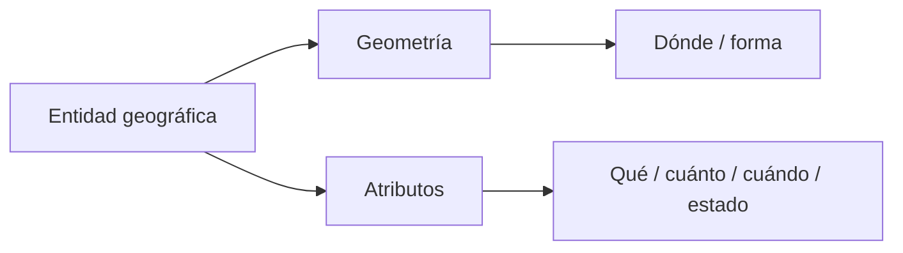
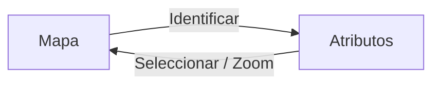
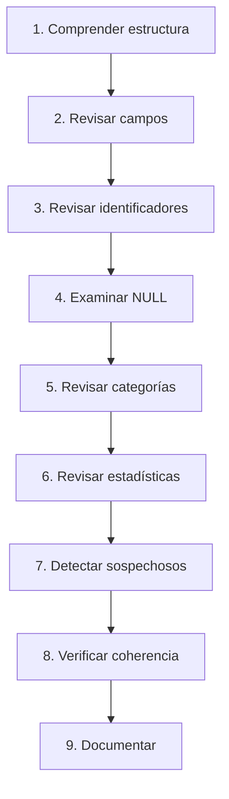

# 2.7 Leer los datos antes de utilizarlos

!!! abstract "Objetivos de aprendizaje"

    Al finalizar esta lección, el estudiante será capaz de:

    - Comprender la relación entre **entidades, geometrías y atributos**.
    - Interpretar correctamente la estructura de una **tabla de atributos**.
    - Reconocer que cada fila representa una entidad y cada columna representa una variable.
    - Utilizar la herramienta **Identificar objetos espaciales** para consultar información directamente desde el mapa.
    - Abrir, navegar, ordenar y revisar una tabla de atributos en QGIS.
    - Diferenciar campos de tipo **texto, entero, decimal, fecha y lógico**.
    - Interpretar correctamente el significado de un campo antes de utilizar sus valores.
    - Reconocer la diferencia entre **NULL, cadena vacía, cero y otros códigos de ausencia de información**.
    - Evaluar si un campo utilizado como identificador es completo, único y consistente.
    - Diferenciar un **identificador de negocio** de un identificador interno generado por el software.
    - Utilizar estadísticas básicas para explorar campos numéricos y textuales.
    - Detectar valores mínimos, máximos, frecuencias, valores faltantes y valores únicos.
    - Identificar registros incompletos y valores potencialmente anómalos.
    - Aplicar controles básicos de **dominio, rango, obligatoriedad, unicidad y coherencia lógica**.
    - Diferenciar un valor estadísticamente extraño de un dato necesariamente incorrecto.
    - Construir una ficha básica de control de calidad de atributos.
    - Documentar los problemas encontrados antes de utilizar una capa en análisis posteriores.

!!! note "Antes de empezar"

    - **Entorno:** QGIS con el perfil `curso-qgis`. Los procedimientos toman como referencia **QGIS 3.44**; algunos nombres pueden variar ligeramente según el idioma o la versión instalada.
    - **Punto de partida:** haber completado la [lección 2.6](06-problemas-coordenadas.md), de manera que las capas utilizadas posean una referencia espacial conocida y validada.
    - **Datos recomendados:** una capa de equipamientos, establecimientos, predios, comunidades u otra fuente con geometría y varios atributos.
    - **Campos recomendados:** identificador, nombre, categoría, estado, población o capacidad, fecha y alguna variable numérica.
    - **Edición:** durante la primera revisión no corregiremos inmediatamente los valores sospechosos; primero los identificaremos y documentaremos.
    - **Objetivo:** aprender a realizar una **lectura exploratoria de los datos** antes de filtrar, calcular, unir o analizar.
    - **Tiempo orientativo:** entre **100 y 130 minutos**, incluida la práctica.

---

## Una capa contiene más que geometrías

Hasta ahora hemos prestado especial atención a:

```text
puntos
líneas
polígonos
coordenadas
SRC
```

Pero una capa SIG no es únicamente una colección de geometrías.

También contiene información descriptiva.

Por ejemplo, un punto puede representar:

```text
●
```

pero estar asociado a:

```text
nombre        = Centro de Salud Norte
tipo          = Salud
distrito      = D-03
estado        = Activo
capacidad     = 120
fecha_registro = 2026-03-15
```

La geometría responde principalmente:

> **¿Dónde está?**

Los atributos pueden responder:

> **¿Qué es?**

> **¿Cómo se llama?**

> **¿A qué categoría pertenece?**

> **¿Cuánto tiene?**

> **¿En qué estado se encuentra?**

> **¿Cuándo fue registrado?**

!!! important "Geometría correcta no significa información correcta"

    Una entidad puede estar perfectamente ubicada en el mapa y, al mismo tiempo, poseer atributos incompletos, contradictorios o erróneos.

    La calidad espacial y la calidad alfanumérica deben revisarse por separado.

### Entidad, geometría y atributos

Podemos representar una entidad geográfica como:

```text
ENTIDAD
├── geometría
│   └── ubicación / forma
│
└── atributos
    ├── identificador
    ├── nombre
    ├── categoría
    ├── estado
    ├── fecha
    └── variables numéricas
```

En términos simplificados:



### El análisis depende de ambos componentes

Supongamos que queremos responder:

> ¿Cuántos establecimientos educativos existen en cada distrito?

Necesitamos:

```text
GEOMETRÍA
→ para saber en qué distrito se encuentra cada establecimiento

ATRIBUTO
→ para saber cuáles son establecimientos educativos
```

Si cualquiera de los dos componentes es incorrecto, el resultado también puede serlo.

Podemos resumirlo así:

```text
geometría correcta
+
atributos correctos
+
procedimiento correcto
=
resultado confiable
```

!!! captura "Captura pendiente · 2.7-01"

    - **Tipo:** Imagen (PNG) conceptual.
    - **Archivo:** `assets/images/modulo-02/2-7/2-7-01-geometria-atributos.png`
    - **Qué mostrar:** un punto seleccionado en el mapa y, al lado, su registro correspondiente con varios atributos.
    - **Sugerencia:** unir visualmente la geometría con la fila de la tabla mediante una flecha.

---

## Comprender la tabla de atributos

La **tabla de atributos** permite examinar la información asociada a las entidades de una capa.

Conceptualmente posee una estructura similar a cualquier tabla de datos:

| id | nombre | tipo | distrito | capacidad |
|---:|---|---|---|---:|
| 1 | Centro A | Salud | D-01 | 85 |
| 2 | Unidad B | Educación | D-03 | 450 |
| 3 | Parque C | Recreación | D-02 | NULL |

Cada:

```text
FILA
```

representa normalmente una entidad.

Cada:

```text
COLUMNA
```

representa un atributo o variable.

### Filas: entidades o registros

Si la capa contiene:

```text
250 entidades
```

esperamos normalmente encontrar:

```text
250 registros
```

en su tabla de atributos.

Una fila podría representar:

- un establecimiento;
- una parcela;
- una vía;
- un distrito;
- una comunidad;
- un árbol;
- una observación.

El significado depende del **modelo de datos**.

### Columnas: campos o variables

Una columna puede contener:

```text
nombre
categoría
población
superficie
fecha
estado
código
```

Cada campo debe responder idealmente a una pregunta concreta.

Por ejemplo:

| Campo | Pregunta |
|---|---|
| `id` | ¿Cuál es el identificador? |
| `nombre` | ¿Cómo se llama? |
| `tipo` | ¿Qué categoría tiene? |
| `distrito` | ¿Dónde se clasifica administrativamente? |
| `capacidad` | ¿Cuántas personas puede atender? |
| `fecha_reg` | ¿Cuándo se registró? |

!!! tip "No empieces por los valores: empieza por entender qué significa cada columna"

    Antes de calcular una media o realizar un filtro debes saber **qué representa realmente el campo**.

### Abrir la tabla de atributos

Una forma habitual es:

1. localizar la capa en el panel **Capas**;
2. hacer clic derecho;
3. seleccionar **Abrir tabla de atributos**.

También puede utilizarse el botón correspondiente de la barra de herramientas.

!!! captura "Captura pendiente · 2.7-02"

    - **Tipo:** Imagen (PNG) anotada.
    - **Archivo:** `assets/images/modulo-02/2-7/2-7-02-tabla-atributos.png`
    - **Qué mostrar:** una tabla de atributos completa.
    - **Sugerencia:** señalar:
        1. nombres de campos;
        2. filas;
        3. barra de herramientas;
        4. contador de entidades;
        5. entidades seleccionadas.

---

## Leer antes de editar

Cuando recibimos una capa nueva, una buena práctica consiste en realizar primero una **lectura exploratoria**.

No deberíamos comenzar inmediatamente a:

- borrar registros;
- completar valores;
- modificar nombres;
- cambiar categorías;
- reemplazar NULL;
- calcular campos.

Primero debemos comprender qué contiene la fuente.

### Primera inspección

Realiza preguntas sencillas:

```text
¿Cuántos registros existen?

¿Qué campos tiene?

¿Qué significa cada campo?

¿Qué tipos de datos utiliza?

¿Existen valores vacíos?

¿Existen categorías diferentes?

¿Hay valores aparentemente extremos?

¿Existe un identificador?

¿Hay fechas?

¿Hay campos redundantes?
```

### Leer varias filas

No revises únicamente la primera entidad.

Observa:

- primeras filas;
- filas intermedias;
- últimas filas;
- registros seleccionados al azar;
- registros espacialmente conocidos.

El objetivo es reconocer patrones.

### Ordenar ayuda a descubrir problemas

Ordenar un campo puede revelar rápidamente valores extremos.

Por ejemplo, para:

```text
capacidad
```

ordenar de menor a mayor podría mostrar:

```text
NULL
-15
0
20
35
...
480
999999
```

Inmediatamente aparecen valores que merecen revisión.

Esto todavía no demuestra que estén equivocados.

Pero permite formular preguntas.

---

## Identificar entidades directamente desde el mapa

No siempre necesitamos abrir primero toda la tabla.

QGIS dispone de la herramienta:

**Identificar objetos espaciales**

que permite seleccionar una geometría desde el mapa y consultar sus atributos.

### Del mapa a los atributos

El flujo es:

```text
MAPA
 ↓
entidad
 ↓
Identificar
 ↓
atributos
```

Esto resulta útil cuando observamos algo espacialmente interesante.

Por ejemplo:

> ¿Qué equipamiento es este punto?

> ¿Qué código tiene esta parcela?

> ¿Cuál es la población registrada para este polígono?

> ¿Qué categoría posee este tramo vial?

### De los atributos al mapa

También podemos realizar el proceso contrario:

```text
TABLA
 ↓
seleccionar registro
 ↓
zoom a selección
 ↓
MAPA
```

La capacidad de navegar en ambas direcciones es fundamental.



!!! captura "Captura pendiente · 2.7-03"

    - **Tipo:** GIF animado.
    - **Archivo:** `assets/images/modulo-02/2-7/2-7-03-identificar-entidad.gif`
    - **Qué mostrar:** activar Identificar objetos, hacer clic sobre una entidad y mostrar sus atributos.
    - **Sugerencia:** utilizar posteriormente el mismo registro desde la tabla de atributos.

### La identificación ayuda a contextualizar

Supongamos que encontramos:

```text
capacidad = 12000
```

Puede parecer un valor elevado.

Pero si identificamos espacialmente la entidad y descubrimos que corresponde a:

```text
Estadio municipal
```

el valor podría ser perfectamente plausible.

La ubicación y el tipo de entidad ayudan a interpretar los números.

---

## Los nombres de campos no siempre explican su significado

Considera:

```text
cod
tipo
est
cant
sup
fecha
```

Podemos hacer suposiciones.

Pero no conocemos necesariamente:

```text
cod → ¿código de qué?
est → ¿estado o establecimiento?
sup → ¿superficie de qué y en qué unidad?
cant → ¿cantidad de qué?
```

Por eso una base bien documentada debería disponer de un **diccionario de datos**.

### Construir un diccionario mínimo

Podemos comenzar con:

| Campo | Descripción | Tipo | Unidad | ¿Obligatorio? |
|---|---|---|---|---|
| `id_eq` | Identificador del equipamiento | Entero | — | Sí |
| `nombre` | Nombre oficial | Texto | — | Sí |
| `tipo` | Tipo de equipamiento | Texto | — | Sí |
| `capacidad` | Capacidad de atención | Entero | personas | No |
| `fecha_reg` | Fecha de registro | Fecha | — | Sí |

Esta información cambia por completo nuestra capacidad de evaluar la tabla.

### La unidad forma parte del significado

Un campo:

```text
superficie = 150
```

no es suficientemente informativo.

Podría significar:

```text
150 m²
150 ha
150 km²
```

Una variable cuantitativa debería estar acompañada, en la documentación, por su unidad.

!!! warning "No compares valores si no sabes qué representan"

    Dos campos pueden contener números y aun así medir fenómenos completamente distintos.

---

## Reconocer los tipos de campo

Como vimos en la lección 2.5, cada atributo posee un tipo.

Los tipos condicionan:

- ordenamiento;
- filtros;
- operaciones matemáticas;
- estadísticas;
- validaciones.

### Campos de texto

Ejemplos:

```text
Hospital Central
D-03
ACTIVO
00125
```

Pueden representar:

- nombres;
- categorías;
- códigos;
- observaciones.

### Campos enteros

Ejemplos:

```text
0
15
320
2026
```

Son apropiados para:

- conteos;
- cantidades discretas;
- determinados códigos numéricos.

Pero recuerda:

> Que algo esté compuesto únicamente por dígitos no significa que deba ser un número.

### Campos decimales

Ejemplos:

```text
18.25
147.80
0.75
```

Pueden representar:

- superficies;
- tasas;
- porcentajes;
- distancias;
- valores monetarios;
- medidas continuas.

### Campos de fecha

Ejemplos:

```text
2026-01-15
2026-08-27
```

Permiten realizar controles temporales.

Por ejemplo:

```text
fecha_registro > fecha_actual
```

podría resultar sospechoso dependiendo del proceso.

### El tipo también puede revelar problemas

Supongamos que:

```text
poblacion
```

está almacenado como texto.

Los valores se ven así:

```text
125
320
945
```

pero también aparece:

```text
Sin dato
```

Esto puede impedir o complicar operaciones estadísticas.

La revisión del tipo forma parte del diagnóstico.

---

## Comprender los valores NULL

Uno de los conceptos más importantes de una tabla de datos es:

```text
NULL
```

NULL representa generalmente:

> **ausencia de un valor conocido o registrado.**

No significa automáticamente:

```text
0
```

ni:

```text
""
```

ni:

```text
No
```

### NULL no es cero

Supongamos:

```text
numero_camas = 0
```

Esto puede significar:

> El establecimiento tiene cero camas.

En cambio:

```text
numero_camas = NULL
```

puede significar:

> No conocemos o no registramos el número de camas.

Son situaciones diferentes.

### NULL no es cadena vacía

En un campo textual podemos encontrar:

```text
NULL
```

y también:

```text
""
```

La cadena vacía existe como valor textual, aunque no contenga caracteres visibles.

Conceptualmente:

```text
NULL
→ no hay valor

""
→ existe una cadena de longitud cero
```

Dependiendo de la fuente y del procedimiento, ambos pueden haberse utilizado para indicar falta de información.

Pero técnicamente no deben asumirse como equivalentes.

### NULL no es necesariamente error

Un valor nulo puede ser completamente válido.

Por ejemplo:

```text
fecha_cierre = NULL
```

para un establecimiento que continúa abierto.

El problema aparece cuando el campo debería ser obligatorio.

Por ejemplo:

```text
id = NULL
```

puede ser crítico si `id` debe identificar inequívocamente cada entidad.

!!! important "La calidad depende de la regla"

    Un NULL solo puede evaluarse correctamente cuando sabemos si el campo:

    - es obligatorio;
    - es opcional;
    - aplica a todas las entidades;
    - aplica únicamente a determinados casos.

---

## Diferenciar ausencia de información y códigos especiales

En datos reales podemos encontrar:

```text
NULL
N/A
S/D
SIN DATO
NO CORRESPONDE
-
0
99
999
9999
```

Algunos sistemas utilizan códigos especiales para representar ausencia de información.

Por ejemplo:

```text
edad = 999
```

podría significar:

```text
edad desconocida
```

si así lo define el manual de la fuente.

Pero si desconocemos esa regla podríamos interpretar:

```text
999 años
```

y generar estadísticas absurdas.

### Los códigos especiales deben documentarse

Una tabla de dominio podría indicar:

| Valor | Significado |
|---|---|
| `1` | Sí |
| `2` | No |
| `9` | Sin información |

Sin esa documentación:

```text
9
```

es simplemente un número.

!!! danger "No conviertas códigos especiales en datos reales"

    Antes de calcular medias, sumas o rangos debes comprobar si existen valores utilizados como códigos de ausencia.

---

## Los identificadores merecen una revisión especial

Muchas capas contienen campos como:

```text
id
codigo
cod
fid
objectid
id_predio
id_equip
```

Pero no todos cumplen la misma función.

### Qué esperamos de un buen identificador

Un identificador debería ser idealmente:

- no nulo;
- único;
- estable;
- inequívoco.

Por ejemplo:

```text
EQ-00001
EQ-00002
EQ-00003
```

### Un nombre no suele ser un buen identificador

Considera:

```text
nombre = Plaza Principal
```

Podrían existir varias entidades con el mismo nombre.

También podría cambiar:

```text
Plaza Principal
↓
Plaza 14 de Septiembre
```

Por ello, un identificador no debería depender necesariamente de una descripción que puede modificarse.

### Identificador interno e identificador de negocio

Conviene diferenciar:

```text
IDENTIFICADOR INTERNO
```

de:

```text
IDENTIFICADOR DEL MODELO DE DATOS
```

Un software o proveedor puede manejar internamente identificadores para sus registros.

Pero el proyecto puede necesitar un campo estable como:

```text
id_equipamiento
```

que mantenga su significado al:

- exportar;
- unir;
- actualizar;
- intercambiar;
- migrar los datos.

!!! warning "No asumas que FID u OBJECTID es siempre tu identificador definitivo"

    Dependiendo del formato, software y procedimiento, identificadores internos pueden regenerarse o cambiar.

    Para procesos de integración conviene disponer de un identificador definido explícitamente en el modelo de datos.

---

## Revisar integridad de identificadores

Un primer control consiste en comprobar:

```text
¿Hay NULL?
¿Hay duplicados?
¿Hay formatos diferentes?
¿Hay códigos inesperados?
```

Por ejemplo:

```text
EQ-001
EQ-002
EQ-003
NULL
EQ-005
EQ-005
eq-006
```

Podemos detectar:

- un valor faltante;
- un duplicado;
- inconsistencia de mayúsculas/minúsculas.

### Unicidad

Si el identificador debe ser único:

```text
número de registros
=
número de identificadores únicos
```

debería cumplirse, siempre que no existan NULL.

Por ejemplo:

```text
Registros:            150
Identificadores únicos: 147
```

indica que debemos investigar.

### Completitud

También debemos comprobar:

```text
Registros:          150
IDs no nulos:       149
```

Existe al menos un registro sin identificador.

### Consistencia de formato

Si el patrón esperado es:

```text
EQ-00001
```

valores como:

```text
eq-1
00001
EQ00001
```

podrían requerir revisión.

No porque sean necesariamente incorrectos, sino porque rompen el patrón esperado.

---

## Utilizar estadísticas para conocer los datos

Leer una tabla fila por fila no es suficiente cuando existen cientos o miles de registros.

Las estadísticas permiten resumir rápidamente un campo.

Dependiendo del tipo de dato podemos revisar:

```text
recuento
valores únicos
valores faltantes
mínimo
máximo
media
mediana
desviación estándar
cuartiles
longitudes de texto
```

### El panel Resumen estadístico

QGIS dispone de herramientas para obtener estadísticas de campos y expresiones.

En campos numéricos podemos examinar, entre otros:

```text
recuento
suma
media
mínimo
máximo
rango
mediana
desviación estándar
cuartiles
```

En campos textuales resultan especialmente útiles:

```text
recuento
valores distintos
valores faltantes
longitud mínima
longitud máxima
```

!!! captura "Captura pendiente · 2.7-04"

    - **Tipo:** Imagen (PNG) anotada.
    - **Archivo:** `assets/images/modulo-02/2-7/2-7-04-resumen-estadistico.png`
    - **Qué mostrar:** panel **Resumen estadístico** analizando un campo numérico.
    - **Sugerencia:** resaltar recuento, faltantes, mínimo, máximo, media y mediana.

### Estadísticas básicas para campos

También puede utilizarse el algoritmo:

**Estadísticas básicas para campos**

desde la Caja de herramientas de Procesos.

Este permite obtener un resumen reproducible sobre un campo determinado.

Resulta útil cuando queremos:

- conservar el resultado;
- incluirlo en un informe;
- repetir el análisis;
- integrarlo en un flujo de procesamiento.

### Estadística descriptiva no es validación automática

Supongamos que obtenemos:

```text
mínimo = -5
máximo = 2500
media = 78
```

para:

```text
numero_aulas
```

Los números no nos dicen por sí solos cuál está equivocado.

Necesitamos conocer el significado del campo.

El valor:

```text
-5
```

parece difícil de justificar para un conteo físico.

Pero:

```text
2500
```

podría ser:

- error;
- código especial;
- valor real de otra unidad;
- problema de digitación.

Las estadísticas **señalan dónde mirar**, no sustituyen la interpretación.

---

## Mínimos y máximos como primera alerta

Una revisión muy eficiente consiste en observar:

```text
mínimo
máximo
```

Para:

```text
porcentaje_cobertura
```

si el dominio esperado es:

```text
0 ≤ porcentaje ≤ 100
```

y encontramos:

```text
mínimo = -15
máximo = 350
```

existen valores que requieren revisión.

### Los rangos dependen del significado

Para:

```text
edad
```

podríamos establecer un rango plausible.

Para:

```text
altitud
```

el rango será completamente distinto.

Para:

```text
codigo
```

mínimo y máximo quizás no tengan ningún significado analítico.

> **No existe un rango universalmente correcto: el rango proviene del significado de la variable.**

---

## La media no siempre es suficiente

Considera:

```text
10
11
12
13
1000
```

La media está fuertemente afectada por:

```text
1000
```

La mediana puede describir mejor el centro de los valores en determinados conjuntos.

Por eso conviene observar conjuntamente:

```text
mínimo
máximo
media
mediana
distribución
```

No debemos convertir esta lección en un curso de estadística.

La idea fundamental es:

> **Los resúmenes estadísticos permiten detectar rápidamente valores que merecen investigación.**

### Un valor extremo no es necesariamente un error

Supongamos una capa de centros educativos.

La mayoría tiene:

```text
100–800 estudiantes
```

y uno registra:

```text
3200
```

Puede ser:

- un error;
- una institución excepcionalmente grande.

Debemos investigar antes de corregirlo.

!!! warning "Atípico no significa incorrecto"

    Un valor sospechoso es una señal de revisión, no una prueba automática de error.

---

## Revisar categorías y valores únicos

Los campos categóricos también necesitan control.

Supongamos:

```text
tipo
```

con valores:

```text
Salud
Educación
Deportivo
Cultural
```

Pero al revisar los valores únicos encontramos:

```text
Salud
SALUD
salud
Salud 
Educacion
Educación
EDUCACIÓN
Deportivo
deportivo
```

Desde una perspectiva semántica pueden representar pocas categorías.

Desde una perspectiva informática son valores diferentes.

### Problemas típicos en campos categóricos

Podemos encontrar:

- mayúsculas y minúsculas inconsistentes;
- tildes faltantes;
- espacios al inicio o final;
- abreviaturas distintas;
- errores ortográficos;
- códigos mezclados con descripciones.

Por ejemplo:

```text
ACTIVO
Activo
activo
A
1
```

podrían representar el mismo estado si la fuente fue construida sin reglas claras.

### Revisar los valores únicos

Antes de utilizar un campo categórico para:

- simbolización;
- conteo;
- filtros;
- agrupaciones;

debemos conocer su dominio.

Una pregunta básica es:

> **¿Cuántos valores distintos existen y cuáles son?**

!!! captura "Captura pendiente · 2.7-05"

    - **Tipo:** Imagen (PNG) comparativa.
    - **Archivo:** `assets/images/modulo-02/2-7/2-7-05-categorias-inconsistentes.png`
    - **Qué mostrar:** un campo `tipo` con categorías aparentemente iguales pero escritas de formas distintas.
    - **Sugerencia:** resaltar espacios, mayúsculas y tildes.

---

## Completitud: detectar registros incompletos

Una de las dimensiones más sencillas de calidad es:

```text
COMPLETITUD
```

La pregunta es:

> **¿Los campos que deberían tener información realmente la tienen?**

### Campos obligatorios

Supongamos que para un equipamiento definimos:

```text
id          → obligatorio
nombre      → obligatorio
tipo        → obligatorio
distrito    → obligatorio
telefono    → opcional
observacion → opcional
```

Un registro:

```text
id       = EQ-001
nombre   = NULL
tipo     = Salud
distrito = D-03
```

estaría incompleto respecto de una regla obligatoria.

En cambio:

```text
telefono = NULL
```

podría ser perfectamente aceptable.

### La completitud depende del modelo

No debemos contar todos los NULL como errores.

Necesitamos saber:

```text
qué campos son obligatorios
```

y:

```text
bajo qué condiciones
```

### Matriz de completitud

Podemos construir:

| Campo | Obligatorio | Registros | Nulos | Completitud |
|---|---|---:|---:|---:|
| `id_eq` | Sí | 200 | 0 | 100 % |
| `nombre` | Sí | 200 | 3 | 98,5 % |
| `tipo` | Sí | 200 | 1 | 99,5 % |
| `telefono` | No | 200 | 80 | — |

Para un campo obligatorio:

```text
Completitud (%) =
valores presentes / registros totales × 100
```

Por ejemplo:

```text
197 / 200 × 100
=
98,5 %
```

!!! note "La completitud puede cuantificarse"

    Este tipo de indicador permite transformar una impresión subjetiva sobre la calidad en una medida reproducible.

---

## Validez: comprobar dominios y rangos

La completitud responde:

> ¿Existe un valor?

La validez responde:

> **¿Ese valor cumple las reglas esperadas?**

### Dominio categórico

Si:

```text
estado
```

solo admite:

```text
ACTIVO
INACTIVO
EN_CONSTRUCCION
```

un valor:

```text
PENDIENTE
```

debe revisarse.

Podría ser:

- una nueva categoría;
- un error;
- una categoría no documentada.

### Rango numérico

Si:

```text
porcentaje_avance
```

debe encontrarse entre:

```text
0 y 100
```

entonces:

```text
125
```

no cumple la regla.

### Formato

Si los identificadores deben tener:

```text
EQ-00001
```

un valor:

```text
EQUIP1
```

puede incumplir el patrón.

### Fecha

Una fecha también puede validarse.

Por ejemplo:

```text
fecha_inicio = 2027-05-10
fecha_fin    = 2026-12-01
```

puede ser inconsistente si el proceso exige:

```text
fecha_fin ≥ fecha_inicio
```

---

## Coherencia: revisar relaciones entre campos

Algunos errores no pueden detectarse observando una columna de manera aislada.

Necesitamos comparar campos.

### Ejemplo 1. Estado y fecha de cierre

Supongamos:

```text
estado = ACTIVO
fecha_cierre = 2024-12-31
```

Puede existir una contradicción.

Pero primero debemos conocer las reglas del sistema.

### Ejemplo 2. Totales y componentes

Supongamos:

```text
hombres = 120
mujeres = 135
total   = 240
```

Si la regla es:

```text
total = hombres + mujeres
```

entonces:

```text
120 + 135 = 255
```

pero:

```text
total = 240
```

Existe una inconsistencia.

### Ejemplo 3. Porcentaje

```text
ejecutado = 80
programado = 100
porcentaje = 60
```

Si:

```text
porcentaje =
ejecutado / programado × 100
```

esperamos:

```text
80 %
```

No:

```text
60 %
```

### Ejemplo 4. Tipo y capacidad

Supongamos:

```text
tipo = Plaza
numero_camas = 25
```

El valor podría estar:

- fuera del dominio conceptual;
- heredado de otro registro;
- cargado en una columna equivocada.

!!! important "La coherencia utiliza conocimiento del fenómeno"

    Los programas pueden detectar que dos números no cumplen una fórmula.

    Pero para construir la regla necesitamos comprender el significado de los datos.

---

## Distinguir controles de calidad

Podemos organizar la revisión básica en varias preguntas.

| Dimensión | Pregunta |
|---|---|
| Completitud | ¿Existe el valor cuando debería existir? |
| Unicidad | ¿El identificador se repite? |
| Validez | ¿El valor pertenece al dominio o rango permitido? |
| Consistencia | ¿Sigue el mismo formato que los demás? |
| Coherencia | ¿Es compatible con otros atributos? |
| Plausibilidad | ¿Tiene sentido dentro del fenómeno observado? |

Esta estructura servirá durante todo el curso.

### Un registro puede fallar más de un control

Por ejemplo:

```text
id = NULL
tipo = "Slaud"
capacidad = -40
```

presenta al menos:

```text
completitud
validez
plausibilidad
```

como problemas potenciales.

---

## Valores sospechosos y valores incorrectos

Debemos utilizar con cuidado estas dos expresiones.

### Valor sospechoso

Es un valor que:

- está fuera del patrón habitual;
- es extremo;
- rompe una regla preliminar;
- necesita comprobación.

Por ejemplo:

```text
capacidad = 10000
```

### Valor confirmado como incorrecto

Necesitamos evidencia adicional.

Por ejemplo:

```text
Fuente original:
1000

Base digital:
10000
```

Ahora existe evidencia de un posible error de digitación.

!!! success "Regla metodológica"

    **Detectar → verificar → corregir**

    No:

    **detectar → asumir → corregir**

---

## Revisar una tabla mediante una secuencia ordenada

Podemos establecer una metodología sencilla.



### 1. Comprender la estructura

Registra:

```text
número de entidades
número de campos
tipo de geometría
nombre de la capa
```

### 2. Revisar los campos

Para cada campo importante:

```text
nombre
significado
tipo
unidad
obligatoriedad
```

### 3. Revisar identificadores

Comprueba:

```text
NULL
duplicados
formato
estabilidad
```

### 4. Examinar valores faltantes

Determina:

```text
qué campos tienen NULL
```

y:

```text
si realmente constituyen un problema
```

### 5. Revisar categorías

Obtén los valores únicos de campos como:

```text
tipo
estado
distrito
categoría
```

### 6. Revisar estadísticas

Para variables numéricas observa:

```text
mínimo
máximo
media
mediana
recuento
faltantes
```

### 7. Detectar valores sospechosos

Identifica:

```text
extremos
negativos inesperados
porcentajes > 100
fechas improbables
códigos especiales
```

### 8. Verificar coherencia

Relaciona campos:

```text
total vs componentes
estado vs fecha
tipo vs atributos específicos
```

### 9. Documentar

No corrijas silenciosamente.

Registra:

```text
entidad
campo
valor
problema
evidencia
acción propuesta
estado
```

---

## Construir una matriz de control

Podemos utilizar:

| ID | Campo | Valor observado | Tipo de problema | Regla | Estado |
|---|---|---|---|---|---|
| EQ-001 | nombre | NULL | Completitud | Nombre obligatorio | REVISAR |
| EQ-014 | capacidad | -15 | Validez | Capacidad ≥ 0 | REVISAR |
| EQ-027 | tipo | `salud ` | Consistencia | Dominio normalizado | REVISAR |
| EQ-041 | id | EQ-038 | Unicidad | ID único | REVISAR |
| EQ-088 | capacidad | 3500 | Plausibilidad | Valor extremo | VERIFICAR |

El campo:

```text
Estado
```

puede utilizar valores como:

```text
VALIDO
REVISAR
CONFIRMAR_FUENTE
CORREGIDO
```

### No mezclar detección y corrección

Una buena matriz diferencia:

```text
problema observado
```

de:

```text
acción realizada
```

Por ejemplo:

| Problema | Acción |
|---|---|
| ID duplicado | Pendiente de verificar |
| Nombre NULL | Solicitar información |
| Categoría inconsistente | Normalizar después de confirmar dominio |
| Valor extremo | Confirmado como correcto |

---

## Utilizar selección para investigar registros

Cuando detectamos un valor sospechoso conviene seleccionar la entidad.

Esto permite observar conjuntamente:

```text
atributo
+
geometría
+
contexto
```

Por ejemplo, encontramos:

```text
poblacion = 25000
```

en una capa de comunidades.

Seleccionamos la entidad y observamos que corresponde a una zona densamente poblada.

El contexto puede ayudarnos a decidir si el valor merece investigación adicional.

### Selección no modifica los datos

Seleccionar registros permite:

- resaltarlos;
- contarlos;
- examinarlos;
- hacer zoom;
- calcular estadísticas sobre la selección.

No altera los atributos.

### Estadísticas de una selección

Una herramienta estadística puede utilizarse también sobre las entidades seleccionadas.

Esto resulta útil para comparar:

```text
toda la capa
```

con:

```text
subconjunto sospechoso
```

---

## Revisar campos numéricos sistemáticamente

Para cada variable numérica importante podemos construir una ficha:

```text
Campo:
Unidad:
Registros:
Nulos:
Mínimo:
Máximo:
Media:
Mediana:
Regla esperada:
Observaciones:
```

### Ejemplo

```text
Campo:
capacidad

Unidad:
personas

Registros:
200

Nulos:
18

Mínimo:
-25

Máximo:
12500

Media:
324

Mediana:
180

Regla esperada:
capacidad >= 0
```

Aquí podemos identificar inmediatamente:

```text
-25
```

como incompatible con la regla.

En cambio:

```text
12500
```

solo puede clasificarse inicialmente como:

```text
valor extremo
```

hasta verificarlo.

---

## Revisar campos textuales sistemáticamente

Para un campo como:

```text
tipo
```

podemos registrar:

```text
Registros:
200

NULL:
2

Valores únicos:
9
```

Pero quizá conceptualmente solo deberían existir:

```text
5 categorías
```

Debemos inspeccionar esos nueve valores.

### Longitud de texto

La longitud también puede revelar errores.

Por ejemplo:

```text
nombre
```

presenta:

```text
longitud mínima = 1
longitud máxima = 180
```

Un registro con:

```text
nombre = "."
```

merece revisión.

Un nombre extremadamente largo podría contener:

- observaciones;
- comentarios;
- información cargada en el campo equivocado.

---

## Las fechas también necesitan control

Las fechas permiten identificar problemas temporales.

Supongamos una base levantada en:

```text
2026
```

pero encontramos:

```text
fecha_registro = 2096-05-10
```

Puede ser un error de digitación.

### Controles básicos

Podemos comprobar:

```text
fecha dentro del periodo esperado
fecha_fin >= fecha_inicio
fecha_registro <= fecha_actual
```

si esas reglas corresponden al proceso.

### Una fecha futura no siempre es incorrecta

Un campo puede representar:

```text
fecha_programada
```

En ese caso una fecha futura es completamente válida.

Nuevamente:

> **La regla depende del significado del campo.**

---

## Ceros, negativos y valores extremos

Los números requieren contexto.

### Cero

Puede significar:

```text
cantidad real = 0
```

o puede haber sido utilizado incorrectamente como:

```text
sin información
```

Debemos confirmarlo.

### Valores negativos

Pueden ser imposibles para:

```text
número de personas
número de aulas
capacidad física
```

pero perfectamente válidos para:

```text
temperatura
saldo
variación
coordenadas
```

### Valores extremos

Pueden representar:

- errores;
- casos reales excepcionales;
- diferencias de unidad;
- errores de decimal.

Por ejemplo:

```text
1500
```

en lugar de:

```text
15.00
```

podría ser un problema de escala o decimal.

---

## Detectar problemas de unidad

Supongamos:

```text
superficie
```

presenta:

```text
150
220
185
350000
```

El último valor podría ser:

- un predio enorme;
- metros cuadrados mientras los demás están en hectáreas;
- error de digitación;
- valor correcto pero excepcional.

Debemos investigar la unidad.

### Mezclar unidades dentro de un campo es especialmente peligroso

Por ejemplo:

```text
fila 1 → 2.5 ha
fila 2 → 3.1 ha
fila 3 → 25000 m²
```

si los valores se almacenan simplemente como:

```text
2.5
3.1
25000
```

sin registrar la unidad, el análisis será incorrecto.

!!! danger "Un número sin unidad puede ser ambiguo"

    En variables cuantitativas, la unidad forma parte del significado del dato.

---

## Revisar relaciones entre atributos y geometría

Los atributos también pueden compararse con el contexto espacial.

Supongamos:

```text
distrito = D-03
```

pero la entidad se encuentra espacialmente dentro de:

```text
D-05
```

Existe una posible inconsistencia entre:

```text
atributo administrativo
```

y:

```text
ubicación geométrica
```

Todavía no sabemos cuál es incorrecto.

Pero ya tenemos una hipótesis para revisar.

### El mapa puede validar atributos

Ejemplos:

```text
tipo = río
pero la geometría está lejos de cualquier red hidrográfica
```

o:

```text
municipio = Sacaba
pero el punto se encuentra fuera del límite municipal
```

Estas comprobaciones serán mucho más potentes cuando avancemos hacia análisis y relaciones espaciales.

---

## No modificar el original durante la auditoría

Al igual que en las lecciones anteriores:

```text
ORIGINAL
```

debe conservarse.

Podemos crear:

```text
datos/
├── originales/
│   └── equipamientos.gpkg
└── trabajo/
    └── equipamientos_revision.gpkg
```

### Registrar las correcciones

Cuando un error quede confirmado:

| ID | Campo | Original | Corregido | Evidencia | Responsable |
|---|---|---|---|---|---|
| EQ-014 | capacidad | -15 | 15 | ficha de levantamiento | Equipo SIG |
| EQ-027 | tipo | `salud ` | `Salud` | dominio institucional | Equipo SIG |

La corrección deja de ser una modificación invisible y se convierte en un proceso trazable.

---

## Construir una ficha de calidad básica

Podemos resumir la primera auditoría mediante:

| Control | Resultado |
|---|---|
| Capa | `equipamientos` |
| Entidades | 200 |
| Campos | 12 |
| Identificador | `id_eq` |
| ID nulos | 1 |
| ID duplicados | 2 |
| Campos obligatorios incompletos | 3 |
| Categorías esperadas | 5 |
| Categorías encontradas | 8 |
| Valores numéricos sospechosos | 4 |
| Registros con problemas | 9 |
| Estado | REVISAR |

### No confundir registros con problemas y número de errores

Un mismo registro puede contener:

```text
3 problemas
```

Por tanto:

```text
número de errores
```

puede ser diferente de:

```text
número de registros afectados
```

Este detalle es importante al construir indicadores de calidad.

---

## Cuantificar la revisión básica

Podemos construir indicadores sencillos.

### Completitud

Para un campo obligatorio:

```text
Completitud (%) =
valores presentes
─────────────── × 100
registros totales
```

### Unicidad

Para un identificador:

```text
Unicidad (%) =
identificadores únicos válidos
────────────────────────────── × 100
registros que deberían tener ID
```

### Registros sin observaciones

Podemos calcular:

```text
Registros válidos (%)
=
registros sin problemas detectados
───────────────────────────────── × 100
registros totales
```

!!! note "Estos indicadores son controles básicos"

    No constituyen por sí solos una evaluación completa de calidad de datos.

    Pero permiten establecer una línea base objetiva y repetible.

---

## De observar datos a formular reglas

Al comenzar la revisión podemos decir:

> “Este valor parece raro”.

El objetivo es avanzar hacia reglas más explícitas.

En lugar de:

```text
capacidad parece rara
```

definimos:

```text
capacidad >= 0
```

En lugar de:

```text
estado debería estar bien escrito
```

definimos:

```text
estado ∈ {
    ACTIVO,
    INACTIVO,
    EN_CONSTRUCCION
}
```

En lugar de:

```text
ID no debería repetirse
```

definimos:

```text
id != NULL
AND
id es único
```

El paso de observaciones a reglas permitirá posteriormente automatizar controles.

---

## Ejemplo aplicado: auditoría inicial de equipamientos

Supongamos una capa con:

```text
200 equipamientos
```

y los campos:

```text
id_eq
nombre
tipo
distrito
estado
capacidad
fecha_reg
```

### Revisión del identificador

Resultados:

```text
Registros             = 200
ID no nulos           = 199
ID únicos             = 197
```

Tenemos:

- al menos un ID faltante;
- posibles duplicados.

### Revisión del nombre

Encontramos:

```text
2 NULL
1 valor "."
```

Los tres registros requieren revisión si el nombre es obligatorio.

### Revisión del tipo

Valores encontrados:

```text
Salud
salud
SALUD
Educación
Educacion
Deportivo
Cultural
Social
```

Conceptualmente podría existir un problema de normalización.

### Revisión de capacidad

Resumen:

```text
NULL    = 18
mínimo  = -25
máximo  = 12500
media   = 324
mediana = 180
```

Conclusiones preliminares:

```text
-25
→ incompatible con una capacidad física positiva

12500
→ valor extremo que debe verificarse

18 NULL
→ evaluar si el campo es obligatorio
```

### Revisión temporal

Encontramos:

```text
fecha_reg = 2096-04-15
```

Si el levantamiento corresponde a 2026, el valor es sospechoso.

### Resultado inicial

Podemos construir:

| Problema | Registros |
|---|---:|
| ID faltante | 1 |
| Posibles ID duplicados | 2 |
| Nombre incompleto | 3 |
| Categorías inconsistentes | 5 |
| Capacidad negativa | 1 |
| Capacidad extrema | 1 |
| Fecha sospechosa | 1 |

Esto no significa necesariamente que tengamos:

```text
14 entidades diferentes
```

porque algunos problemas pueden encontrarse en el mismo registro.

---

## Un protocolo mínimo antes de utilizar una capa

Antes de utilizar atributos en un análisis deberíamos poder responder:

### Sobre la estructura

```text
¿Cuántas entidades existen?
¿Cuántos campos existen?
¿Qué significa cada campo?
¿Qué tipo tiene?
¿Qué unidad utiliza?
```

### Sobre los identificadores

```text
¿Existe un identificador?
¿Tiene NULL?
¿Es único?
¿Es estable?
```

### Sobre la completitud

```text
¿Qué campos son obligatorios?
¿Cuántos valores faltan?
¿Qué porcentaje está completo?
```

### Sobre categorías

```text
¿Qué valores únicos existen?
¿Coinciden con el dominio esperado?
¿Hay variantes de escritura?
```

### Sobre variables numéricas

```text
¿Cuál es el mínimo?
¿Cuál es el máximo?
¿Cuál es la media?
¿Cuál es la mediana?
¿Hay negativos inesperados?
¿Hay valores extremos?
```

### Sobre la coherencia

```text
¿Los campos relacionados son compatibles?
¿Los totales coinciden?
¿Las fechas tienen sentido?
¿Los atributos concuerdan con la ubicación?
```

### Sobre la trazabilidad

```text
¿Conservo el original?
¿Documenté los problemas?
¿Puedo explicar cualquier corrección?
```

---

## Reto práctico

!!! example "Reto 2.7 — Detectar registros incompletos y valores sospechosos"

    **Situación:** recibiste una capa de equipamientos municipales cuya geometría y SRC ya fueron validados.

    Antes de utilizarla para análisis territorial debes realizar una **auditoría básica de atributos**.

    El objetivo no es corregir inmediatamente toda la base, sino identificar, cuantificar y documentar problemas.

    **1. Preparar el proyecto**

    Abre el proyecto de la lección anterior y guárdalo como:

    ```text
    proyectos/reto_2-7_calidad_atributos.qgz
    ```

    Conserva intacta la fuente original.

    **2. Abrir la tabla de atributos**

    Registra:

    ```text
    Número de entidades:
    Número de campos:
    Tipo de geometría:
    ```

    **3. Construir un inventario de campos**

    Completa:

    | Campo | Significado | Tipo | Unidad | Obligatorio |
    |---|---|---|---|---|

    Incluye al menos:

    - identificador;
    - nombre;
    - categoría;
    - estado;
    - una variable numérica;
    - una fecha.

    **4. Revisar el identificador**

    Determina:

    ```text
    Registros totales:
    ID nulos:
    ID únicos:
    ID duplicados:
    ```

    Evalúa si el campo puede funcionar como identificador confiable.

    **5. Revisar campos obligatorios**

    Para cada campo obligatorio registra:

    | Campo | Registros | Faltantes | Completitud |
    |---|---:|---:|---:|

    Calcula:

    ```text
    Completitud (%) =
    presentes / total × 100
    ```

    **6. Revisar campos categóricos**

    Selecciona al menos dos campos como:

    ```text
    tipo
    estado
    ```

    Obtén sus valores únicos.

    Identifica:

    - diferencias de escritura;
    - categorías no esperadas;
    - NULL;
    - posibles códigos especiales.

    **7. Revisar una variable numérica**

    Utiliza **Resumen estadístico** o **Estadísticas básicas para campos**.

    Registra:

    ```text
    Recuento:
    Faltantes:
    Mínimo:
    Máximo:
    Media:
    Mediana:
    ```

    Identifica al menos:

    - un valor potencialmente inválido;
    - un valor extremo, cuando exista.

    **8. Revisar una fecha**

    Determina:

    - fecha mínima;
    - fecha máxima;
    - NULL;
    - valores fuera del periodo esperado.

    **9. Revisar coherencia**

    Formula al menos tres reglas.

    Ejemplo:

    ```text
    capacidad >= 0
    ```

    ```text
    fecha_fin >= fecha_inicio
    ```

    ```text
    total = hombres + mujeres
    ```

    Adapta las reglas a los campos reales de tu capa.

    **10. Relacionar tabla y mapa**

    Selecciona al menos tres registros sospechosos.

    Para cada uno:

    - realiza zoom a la entidad;
    - utiliza Identificar objetos;
    - observa su contexto espacial;
    - determina si el contexto ayuda a interpretar el problema.

    **11. Construir una matriz de hallazgos**

    Completa:

    | ID | Campo | Valor | Problema | Regla | Evidencia | Estado |
    |---|---|---|---|---|---|---|

    Utiliza:

    ```text
    REVISAR
    CONFIRMAR_FUENTE
    VALIDO
    CORREGIDO
    ```

    **12. Construir una ficha de calidad**

    Resume:

    | Indicador | Resultado |
    |---|---:|
    | Entidades | |
    | ID nulos | |
    | ID duplicados | |
    | Campos obligatorios incompletos | |
    | Categorías inconsistentes | |
    | Valores numéricos sospechosos | |
    | Fechas sospechosas | |
    | Registros afectados | |

    **13. Elaborar una conclusión**

    Redacta entre **100 y 150 palabras** respondiendo:

    - ¿la capa puede utilizarse inmediatamente?;
    - ¿qué problemas principales presenta?;
    - ¿qué problemas son críticos?;
    - ¿qué valores necesitan confirmación?;
    - ¿qué reglas deberían automatizarse posteriormente?

    **Entregables:**

    - `reto_2-7_calidad_atributos.qgz`;
    - inventario de campos;
    - matriz de hallazgos;
    - ficha de calidad;
    - captura de la tabla de atributos;
    - captura del resumen estadístico;
    - captura de al menos un registro sospechoso localizado en el mapa;
    - conclusión técnica.

!!! captura "Captura pendiente · 2.7-06"

    - **Tipo:** Imagen (PNG) compuesta.
    - **Archivo:** `assets/images/modulo-02/2-7/2-7-06-reto-control-calidad.png`
    - **Qué mostrar:** tabla de atributos con varios registros problemáticos seleccionados y su localización en el mapa.
    - **Sugerencia:** diferenciar visualmente NULL, duplicado, valor negativo y valor extremo.

??? success "Criterios de evaluación del reto"

    | Criterio | Se cumple si... |
    |---|---|
    | Estructura | Identifica correctamente entidades y campos |
    | Diccionario | Documenta significado, tipo y unidad de los campos principales |
    | Identificador | Evalúa NULL, duplicados y estabilidad |
    | NULL | Diferencia ausencia de valor, cero y cadena vacía |
    | Completitud | Calcula valores faltantes en campos obligatorios |
    | Categorías | Identifica dominios y variantes inconsistentes |
    | Estadísticas | Utiliza correctamente estadísticas básicas |
    | Rangos | Detecta valores fuera de reglas conocidas |
    | Valores extremos | Los identifica sin asumir automáticamente que son errores |
    | Fechas | Revisa coherencia temporal |
    | Coherencia | Formula reglas entre campos relacionados |
    | Mapa | Utiliza la geometría para contextualizar atributos |
    | Trazabilidad | No modifica silenciosamente el original |
    | Documentación | Registra problemas mediante una matriz |
    | Conclusión | Distingue entre error confirmado y valor que requiere verificación |

---

## Problemas frecuentes

| Problema | Posible causa | Qué revisar |
|---|---|---|
| No entiendo qué significa un campo | Falta de documentación | Diccionario de datos o metadatos |
| Un código perdió ceros iniciales | Tipo numérico inadecuado | Tipo de campo |
| Existen varios valores que parecen la misma categoría | Escritura inconsistente | Valores únicos |
| Aparecen muchos NULL | Campo opcional o captura incompleta | Regla de obligatoriedad |
| Se utilizó `0` para valores desconocidos | Convención deficiente | Documentación de la fuente |
| La media parece absurda | Valores extremos o códigos especiales | Mínimo, máximo y distribución |
| Un valor negativo parece incorrecto | Rango incompatible | Significado y unidad del campo |
| Hay IDs repetidos | Identificador no controlado | Unicidad |
| FID cambia después de exportar | Identificador interno | Utilizar ID de negocio |
| `ACTIVO`, `Activo` y `activo` aparecen como categorías distintas | Falta de normalización | Dominio |
| Un campo numérico aparece como texto | Valores no numéricos mezclados | Tipo y contenido |
| Una fecha aparece en 2096 | Error de digitación o campo de planificación | Significado temporal |
| Hay un valor extremadamente alto | Error o caso real excepcional | Fuente original |
| La entidad está bien ubicada pero distrito no coincide | Inconsistencia atributo/geometría | Fuente administrativa |
| Dos campos totales no coinciden | Error de cálculo o actualización | Reglas de coherencia |

---

## Ideas clave

!!! success "Para recordar"

    - Una capa SIG combina **geometría y atributos**.
    - La geometría responde principalmente **dónde**, mientras que los atributos describen **qué, cuánto, cuándo y en qué estado**.
    - Cada fila de la tabla representa normalmente una entidad.
    - Cada columna representa una variable o atributo.
    - Antes de utilizar un campo debemos comprender **qué significa**.
    - El tipo de campo condiciona las operaciones que podemos realizar.
    - Los números necesitan **unidad y contexto**.
    - `NULL` representa ausencia de un valor y no es equivalente automáticamente a `0`.
    - Una cadena vacía y un valor NULL tampoco son necesariamente equivalentes.
    - Los códigos especiales como `9`, `99` o `999` deben interpretarse según la documentación de la fuente.
    - Un buen identificador debería ser **no nulo, único, estable e inequívoco**.
    - Un identificador interno del software no siempre debe utilizarse como identificador permanente del modelo.
    - Los valores únicos permiten revisar rápidamente campos categóricos.
    - Mínimos y máximos permiten detectar valores que merecen investigación.
    - La media puede verse afectada por valores extremos.
    - Un valor atípico **no es automáticamente un error**.
    - La completitud depende de saber qué campos son obligatorios.
    - La validez depende de reglas de dominio, rango o formato.
    - La coherencia puede requerir comparar varios campos.
    - El mapa puede ayudar a interpretar valores sospechosos.
    - Los errores deben **detectarse, verificarse y recién después corregirse**.
    - Toda modificación debe conservar trazabilidad respecto de la fuente original.
    - Las reglas explícitas permiten convertir una inspección manual en un futuro control automatizado.

---

## Autoevaluación

??? question "1. ¿Qué representa normalmente una fila de la tabla de atributos?"

    Una entidad o registro de la capa.

??? question "2. ¿Qué representa normalmente una columna?"

    Una variable o atributo asociado a las entidades.

??? question "3. ¿Una entidad correctamente ubicada garantiza que sus atributos sean correctos?"

    No.

    La calidad espacial y la calidad alfanumérica deben evaluarse por separado.

??? question "4. ¿Para qué sirve la herramienta Identificar objetos espaciales?"

    Permite seleccionar una entidad desde el mapa y consultar sus atributos asociados.

??? question "5. ¿Qué diferencia existe entre NULL y cero?"

    NULL representa ausencia de un valor conocido o registrado, mientras que cero es un valor numérico válido.

??? question "6. ¿NULL y cadena vacía son exactamente lo mismo?"

    No necesariamente.

    Una cadena vacía es un valor textual de longitud cero, mientras que NULL representa ausencia de valor.

??? question "7. ¿Un valor NULL constituye siempre un error?"

    No.

    Depende de si el campo es obligatorio y de las reglas del modelo de datos.

??? question "8. ¿Por qué un valor `999` puede ser peligroso en un campo numérico?"

    Porque algunas fuentes utilizan códigos como `999` para representar información desconocida. Si se interpreta como un valor real puede distorsionar las estadísticas.

??? question "9. ¿Qué características debería tener un buen identificador?"

    Debería ser preferentemente no nulo, único, estable e inequívoco.

??? question "10. ¿Por qué no siempre debemos utilizar FID u OBJECTID como identificador permanente?"

    Porque pueden ser identificadores internos dependientes del proveedor o procedimiento y pueden cambiar durante exportaciones o transformaciones.

??? question "11. ¿Qué podemos descubrir mediante los valores únicos de un campo categórico?"

    Categorías existentes, variantes de escritura, errores tipográficos, valores no esperados y posibles NULL.

??? question "12. ¿Qué estadísticas resultan especialmente útiles durante una primera revisión numérica?"

    Recuento, faltantes, mínimo, máximo, media y mediana, entre otras.

??? question "13. Si el máximo es muy superior al resto, ¿puedes eliminarlo inmediatamente?"

    No.

    Primero debe verificarse si es un error o un caso real excepcional.

??? question "14. ¿Qué significa completitud?"

    Evalúa si los valores que deberían existir realmente están presentes.

??? question "15. ¿Qué significa unicidad en un identificador?"

    Que cada entidad posea un identificador diferente cuando esa sea la regla del modelo.

??? question "16. ¿Qué significa validar un dominio categórico?"

    Comprobar que los valores pertenecen al conjunto de categorías permitidas.

??? question "17. Un porcentaje tiene valor 145. ¿Es necesariamente incorrecto?"

    Depende del significado del campo.

    Si la regla establece un porcentaje convencional entre 0 y 100, sería inválido. Si el indicador puede superar 100, podría ser correcto.

??? question "18. ¿Por qué debemos conocer la unidad de una variable numérica?"

    Porque el número por sí solo puede ser ambiguo y no puede interpretarse ni compararse correctamente sin saber qué mide.

??? question "19. ¿Qué es una regla de coherencia?"

    Una condición que relaciona dos o más campos para comprobar si sus valores son lógicamente compatibles.

??? question "20. Da un ejemplo de regla de coherencia."

    Por ejemplo:

    `total = hombres + mujeres`

    o:

    `fecha_fin >= fecha_inicio`

??? question "21. ¿Qué diferencia existe entre un valor sospechoso y un error confirmado?"

    Un valor sospechoso necesita investigación. Un error confirmado dispone de evidencia suficiente que demuestra que el valor es incorrecto.

??? question "22. ¿Cuál debe ser el orden correcto ante un dato sospechoso?"

    Detectar, verificar y posteriormente corregir si la evidencia confirma el error.

??? question "23. ¿Por qué conviene conservar la fuente original durante la auditoría?"

    Para mantener trazabilidad, comparar modificaciones y poder reconstruir el procedimiento.

??? question "24. ¿Qué ventaja tiene convertir observaciones como 'este valor parece raro' en reglas explícitas?"

    Permite que los controles sean reproducibles y posteriormente puedan automatizarse.

---

## Referencias

- [QGIS Project. *QGIS 3.44 — Trabajar con la tabla de atributos*](https://docs.qgis.org/3.44/es/docs/user_manual/working_with_vector/attribute_table.html)  
  Documentación oficial sobre estructura de la tabla de atributos, navegación, selección, edición y manejo de registros en capas espaciales y no espaciales.

- [QGIS Project. *QGIS 3.44 — Propiedades de capas vectoriales*](https://docs.qgis.org/3.44/es/docs/user_manual/working_with_vector/vector_properties.html)  
  Referencia sobre información de la capa, campos, tipos de atributos, origen de datos, geometría, SRC y otras propiedades de fuentes vectoriales.

- [QGIS Project. *QGIS 3.44 — Herramientas generales y resumen estadístico*](https://docs.qgis.org/3.44/es/docs/user_manual/introduction/general_tools.html)  
  Documentación del panel de estadísticas de QGIS y de las medidas disponibles según el tipo de campo, incluyendo valores faltantes, únicos, mínimo, máximo, media y cuartiles.

- [QGIS Project. *QGIS 3.44 — Estadísticas básicas para campos*](https://docs.qgis.org/3.44/es/docs/user_manual/processing_algs/qgis/vectoranalysis.html#basic-statistics-for-fields)  
  Documentación del algoritmo de Procesamiento para obtener estadísticas reproducibles sobre campos numéricos, textuales y temporales.

- [QGIS Project. *QGIS 3.44 — Expresiones*](https://docs.qgis.org/3.44/es/docs/user_manual/expressions/expression.html)  
  Introducción al sistema de expresiones de QGIS, que posteriormente permitirá transformar reglas de control de calidad en consultas y validaciones automatizadas.

- [QGIS Project. *QGIS 3.44 — Lista de funciones de expresiones*](https://docs.qgis.org/3.44/es/docs/user_manual/expressions/functions_list.html)  
  Referencia completa de funciones disponibles para trabajar con atributos, texto, números, fechas, geometrías y valores NULL.

- [QGIS Project. *QGIS 3.44 — Selección de entidades*](https://docs.qgis.org/3.44/es/docs/user_manual/introduction/general_tools.html#selecting-features)  
  Referencia sobre herramientas para seleccionar entidades desde el mapa y utilizar subconjuntos durante la inspección y análisis.

- [QGIS Project. *QGIS 3.44 — Manual de formación*](https://docs.qgis.org/3.44/es/docs/training_manual/)  
  Material oficial de aprendizaje con ejercicios sobre atributos, selección, consultas y análisis de datos vectoriales.

- [ISO. *ISO 19157 — Geographic information — Data quality*](https://www.iso.org/standard/66199.html)  
  Norma internacional de referencia para conceptos y componentes relacionados con la calidad de la información geográfica.

---

Antes de utilizar una capa en cualquier análisis debemos pasar de:

```text
"los datos están cargados"
```

a:

```text
"comprendo qué contienen y conozco sus principales limitaciones"
```

El flujo recomendado es:

```text
comprender la estructura
        ↓
interpretar los campos
        ↓
revisar identificadores
        ↓
examinar valores faltantes
        ↓
conocer categorías
        ↓
calcular estadísticas básicas
        ↓
detectar valores sospechosos
        ↓
comprobar coherencia
        ↓
documentar hallazgos
```

La pregunta fundamental ya no es:

> **¿Puedo utilizar esta columna?**

sino:

> **¿Sé exactamente qué representa, qué valores debería contener y qué problemas presenta antes de utilizarla?**

Con esta revisión básica podremos avanzar hacia las siguientes tareas de gestión y análisis de atributos con una base mucho más confiable.