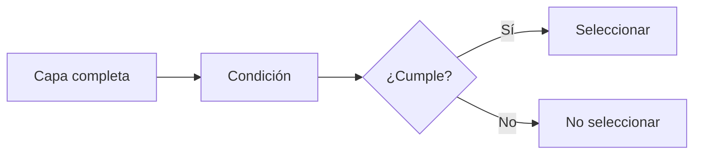
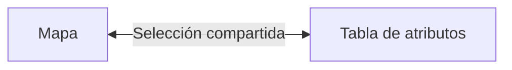
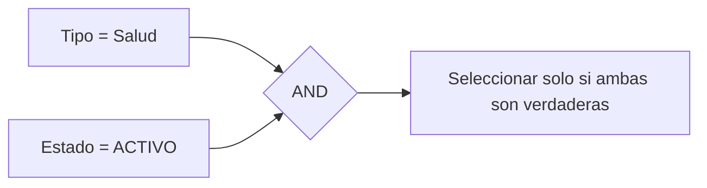
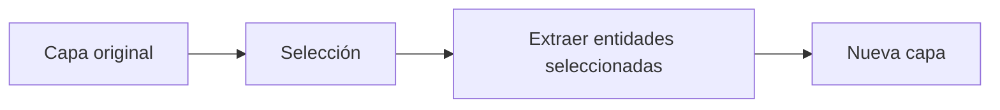
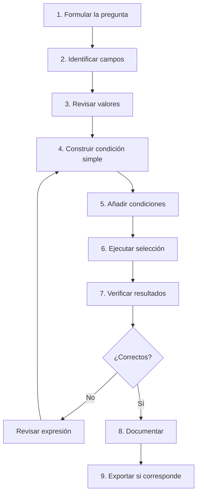

# 2.8 Seleccionar, filtrar y extraer información

!!! abstract "Objetivos de aprendizaje"

    Al finalizar esta lección, el estudiante será capaz de:

    - Comprender la diferencia entre **seleccionar, filtrar y extraer** entidades.
    - Seleccionar manualmente objetos espaciales desde el mapa y desde la tabla de atributos.
    - Utilizar diferentes modos de selección para **reemplazar, añadir, eliminar o intersectar** entidades.
    - Construir expresiones sencillas utilizando campos, valores y operadores.
    - Diferenciar correctamente valores de **texto, números, fechas y NULL** dentro de una expresión.
    - Utilizar operadores de comparación como `=`, `<>`, `>`, `<`, `>=` y `<=`.
    - Combinar condiciones mediante `AND`, `OR` y `NOT`.
    - Utilizar `IN`, `BETWEEN`, `LIKE`, `ILIKE`, `IS NULL` e `IS NOT NULL`.
    - Utilizar paréntesis para controlar el orden lógico de expresiones complejas.
    - Seleccionar entidades mediante **Seleccionar por expresión**.
    - Comprender que una selección es un **estado temporal** de la capa y no una nueva fuente de datos.
    - Diferenciar un filtro aplicado solamente a la tabla de atributos de un **filtro de capa**.
    - Utilizar el **Constructor de consultas** para crear subconjuntos persistentes dentro del proyecto.
    - Verificar cuántas entidades cumplen una condición antes de extraerlas.
    - Exportar las entidades seleccionadas como una nueva capa.
    - Crear subconjuntos reproducibles a partir de criterios explícitos.
    - Documentar las expresiones utilizadas para que el procedimiento pueda repetirse.
    - Evitar errores frecuentes relacionados con texto, NULL, operadores lógicos y agrupación de condiciones.

!!! note "Antes de empezar"

    - **Entorno:** QGIS con el perfil `curso-qgis`. Los procedimientos toman como referencia **QGIS 3.44**; algunos nombres pueden variar ligeramente según el idioma o la versión instalada.
    - **Punto de partida:** haber completado la [lección 2.7](07-leer-datos.md), especialmente la revisión de campos, valores NULL, identificadores y categorías.
    - **Datos recomendados:** una capa de servicios o equipamientos con campos como:
        - identificador;
        - nombre;
        - tipo;
        - estado;
        - distrito;
        - capacidad;
        - gestión;
        - teléfono;
        - fecha de registro.
    - **Principio de trabajo:** primero construiremos y validaremos las condiciones; después generaremos una nueva capa.
    - **Edición:** seleccionar o filtrar no modifica por sí mismo los atributos originales.
    - **Resultado esperado:** crear un subconjunto de servicios que cumpla varios requisitos simultáneamente.
    - **Tiempo orientativo:** entre **110 y 140 minutos**, incluida la práctica.

---

## De observar los datos a hacer preguntas

En la lección anterior aprendimos a leer una tabla antes de utilizarla.

Ahora avanzaremos hacia una nueva pregunta:

> **¿Cómo encontramos solamente las entidades que cumplen determinadas condiciones?**

Supongamos una capa con:

```text
2 500 servicios
```

y queremos identificar únicamente:

```text
tipo = Salud
estado = ACTIVO
distrito = D-03
capacidad >= 50
```

Revisar manualmente 2 500 filas sería:

- lento;
- difícil de repetir;
- propenso a errores.

En cambio, podemos convertir los requisitos en una **expresión lógica**.

Por ejemplo:

```qgis
"tipo" = 'Salud'
AND
"estado" = 'ACTIVO'
AND
"distrito" = 'D-03'
AND
"capacidad" >= 50
```

QGIS evalúa la expresión para cada entidad.

Conceptualmente:



Este mecanismo constituye la base de:

- selección;
- filtrado;
- consultas;
- clasificación;
- cálculos;
- análisis posteriores.

!!! important "Una expresión convierte una pregunta en una regla"

    Pregunta:

    > ¿Qué servicios de salud activos tienen una capacidad igual o superior a 50?

    Regla:

    ```qgis
    "tipo" = 'Salud'
    AND
    "estado" = 'ACTIVO'
    AND
    "capacidad" >= 50
    ```

---

## Seleccionar, filtrar y extraer no son lo mismo

Antes de utilizar las herramientas debemos distinguir tres operaciones.

```text
SELECCIONAR
FILTRAR
EXTRAER
```

Aunque pueden utilizar la misma condición, producen resultados diferentes.

### Seleccionar

Una selección marca temporalmente determinadas entidades de una capa.

Por ejemplo:

```text
CAPA ORIGINAL
500 entidades

SELECCIÓN
85 entidades
```

Las otras:

```text
415 entidades
```

continúan formando parte de la capa.

Simplemente no están seleccionadas.

Conceptualmente:

```text
CAPA
├── seleccionadas
└── no seleccionadas
```

La capa original continúa completa.

### Filtrar

Un filtro hace que QGIS trabaje temporalmente con un subconjunto de la capa.

Por ejemplo:

```text
CAPA ORIGINAL
500 entidades

FILTRO
"estado" = 'ACTIVO'

SUBCONJUNTO DISPONIBLE
380 entidades
```

Mientras el filtro permanece activo, QGIS trata esas 380 entidades como el conjunto disponible para esa capa.

### Extraer

Extraer significa crear una **nueva fuente de datos** que contenga únicamente las entidades deseadas.

Por ejemplo:

```text
CAPA ORIGINAL
500 entidades
        │
        │ selección
        ▼
85 entidades
        │
        │ extracción
        ▼
NUEVA CAPA
85 entidades
```

Ahora existen dos fuentes:

```text
servicios.gpkg
└── servicios

servicios_seleccionados.gpkg
└── servicios_priorizados
```

### Comparación

| Operación | Modifica la fuente original | Oculta otras entidades | Crea una nueva capa |
|---|---:|---:|---:|
| Seleccionar | No | No | No |
| Filtrar capa | No | Sí | No |
| Extraer | No | — | Sí |

!!! success "Regla práctica"

    **Seleccionar** → identificar.

    **Filtrar** → trabajar temporalmente con un subconjunto.

    **Extraer** → crear un nuevo conjunto de datos.

!!! captura "Captura pendiente · 2.8-01"

    - **Tipo:** Imagen (PNG) conceptual.
    - **Archivo:** `assets/images/modulo-02/2-8/2-8-01-seleccionar-filtrar-extraer.png`
    - **Qué mostrar:** tres diagramas simples comparando selección, filtro y extracción.
    - **Sugerencia:** utilizar la misma capa original en los tres casos para facilitar la comparación.

---

## Selección manual desde el mapa

La forma más directa de seleccionar entidades consiste en utilizar las herramientas de selección del lienzo.

Dependiendo de la geometría y de la herramienta podemos seleccionar mediante:

- clic;
- rectángulo;
- polígono;
- selección a mano alzada;
- radio.

### Seleccionar una entidad

Activa:

**Seleccionar objetos espaciales**

y haz clic sobre una entidad.

La entidad seleccionada aparecerá resaltada.

Al mismo tiempo:

- queda seleccionada en el mapa;
- queda seleccionada en la tabla de atributos.

La selección pertenece a la capa, no únicamente a una vista.

### Seleccionar varias entidades

Puedes dibujar una región que abarque varios objetos.

Conceptualmente:

```text
[ área de selección ]
        ↓
 ●   ●   ●
     ●
          ●
```

QGIS identificará las entidades que cumplen el criterio geométrico de la herramienta utilizada.

### Mapa y tabla comparten la misma selección

Si seleccionas una entidad desde:

```text
MAPA
```

también estará seleccionada en:

```text
TABLA
```

y viceversa.

Podemos representarlo:



!!! captura "Captura pendiente · 2.8-02"

    - **Tipo:** GIF animado.
    - **Archivo:** `assets/images/modulo-02/2-8/2-8-02-seleccion-manual.gif`
    - **Qué mostrar:** seleccionar varios puntos desde el mapa y observar cómo las filas correspondientes quedan seleccionadas en la tabla.
    - **Sugerencia:** mostrar también el contador de entidades seleccionadas.

---

## Modificar una selección existente

Una selección no tiene que construirse en una sola operación.

Podemos:

```text
crear
+
añadir
+
eliminar
+
intersectar
```

entidades.

### Reemplazar la selección

Es el comportamiento habitual.

Una nueva selección sustituye a la anterior.

Por ejemplo:

```text
Selección inicial:
10 entidades

Nueva selección:
6 entidades

Resultado:
6 entidades
```

### Añadir entidades

Podemos conservar la selección existente y añadir nuevas entidades.

Conceptualmente:

```text
SELECCIÓN A
+
SELECCIÓN B
=
A ∪ B
```

### Eliminar entidades de la selección

También podemos retirar entidades concretas.

```text
SELECCIÓN
-
ENTIDADES INDICADAS
=
NUEVA SELECCIÓN
```

### Intersectar con la selección actual

Podemos conservar únicamente las entidades que pertenecen simultáneamente:

```text
a la selección existente
```

y:

```text
a la nueva condición
```

Conceptualmente:

```text
A ∩ B
```

Esto será especialmente útil cuando trabajemos con **Seleccionar por expresión**.

---

## Seleccionar desde la tabla de atributos

También podemos seleccionar filas directamente.

Por ejemplo:

1. abre la tabla de atributos;
2. selecciona uno o varios registros;
3. observa las geometrías resaltadas en el mapa.

Esto resulta útil cuando ya conocemos:

- el ID;
- el nombre;
- una fila específica.

### Mostrar solamente las entidades seleccionadas

En la tabla podemos utilizar:

**Mostrar objetos seleccionados**

Esto no elimina las demás entidades.

Simplemente limita temporalmente la visualización de registros dentro de la tabla.

!!! warning "Filtro de tabla no es filtro de capa"

    Mostrar solamente los registros seleccionados en la tabla **no elimina ni oculta las demás geometrías de la capa en el proyecto**.

Esta distinción será importante más adelante.

---

## Seleccionar por valor

Cuando conocemos un valor específico podemos utilizar:

**Seleccionar objetos por valor**

Por ejemplo:

```text
tipo = Salud
```

o:

```text
distrito = D-03
```

Esta herramienta proporciona un formulario para indicar los valores que queremos buscar.

Puede ser cómoda para condiciones sencillas.

Pero cuando necesitamos combinar varios criterios utilizaremos:

**Seleccionar por expresión**.

---

## Introducción a las expresiones de QGIS

Una expresión permite describir una condición que QGIS evaluará para cada entidad.

Por ejemplo:

```qgis
"estado" = 'ACTIVO'
```

Podemos leerla como:

> Seleccionar entidades cuyo campo `estado` tenga exactamente el valor `ACTIVO`.

### Campo, operador y valor

La estructura básica es:

```text
CAMPO
  │
  ▼
"estado" = 'ACTIVO'
          ▲
          │
       VALOR
```

El símbolo:

```text
=
```

es el operador.

Podemos representarlo:

```text
campo
+
operador
+
valor
=
condición
```

### Campos entre comillas dobles

En las expresiones de QGIS utilizaremos:

```qgis
"nombre_campo"
```

Por ejemplo:

```qgis
"tipo"
```

```qgis
"capacidad"
```

```qgis
"estado"
```

### Texto entre comillas simples

Los valores de texto se escriben normalmente como:

```qgis
'Salud'
```

Por ejemplo:

```qgis
"tipo" = 'Salud'
```

!!! warning "Campo y texto utilizan comillas diferentes"

    ```qgis
    "tipo"
    ```

    representa un **campo**.

    ```qgis
    'Salud'
    ```

    representa un **valor textual**.

### Los números no necesitan comillas

Para un campo numérico:

```qgis
"capacidad" >= 50
```

No:

```qgis
"capacidad" >= '50'
```

Aunque algunos proveedores puedan realizar conversiones implícitas, debemos utilizar tipos coherentes.

---

## Operadores de comparación

Los operadores permiten comparar valores.

| Operador | Significado |
|---|---|
| `=` | Igual |
| `<>` | Diferente |
| `>` | Mayor que |
| `<` | Menor que |
| `>=` | Mayor o igual |
| `<=` | Menor o igual |

### Igualdad

```qgis
"estado" = 'ACTIVO'
```

Selecciona entidades cuyo estado sea exactamente:

```text
ACTIVO
```

### Diferente

```qgis
"estado" <> 'INACTIVO'
```

Selecciona registros cuyo valor no sea exactamente `INACTIVO`.

Debemos recordar que el comportamiento con:

```text
NULL
```

requiere un tratamiento específico.

### Mayor que

```qgis
"capacidad" > 100
```

### Mayor o igual

```qgis
"capacidad" >= 100
```

La diferencia entre:

```text
>
```

y:

```text
>=
```

es importante.

Si:

```text
capacidad = 100
```

cumple:

```qgis
"capacidad" >= 100
```

pero no:

```qgis
"capacidad" > 100
```

---

## Combinar condiciones

Las consultas reales suelen necesitar más de una condición.

Para ello utilizamos operadores lógicos.

Los principales son:

```text
AND
OR
NOT
```

### AND

`AND` exige que todas las condiciones relacionadas se cumplan.

Por ejemplo:

```qgis
"tipo" = 'Salud'
AND
"estado" = 'ACTIVO'
```

La entidad debe ser simultáneamente:

```text
Salud
```

y:

```text
ACTIVO
```

Conceptualmente:



### OR

`OR` requiere que se cumpla al menos una condición.

Por ejemplo:

```qgis
"tipo" = 'Salud'
OR
"tipo" = 'Educación'
```

Seleccionará ambas categorías.

### NOT

`NOT` niega una condición.

Por ejemplo:

```qgis
NOT "estado" = 'INACTIVO'
```

puede interpretarse como:

> entidades que no cumplen `estado = INACTIVO`.

Sin embargo, debemos considerar nuevamente el tratamiento de `NULL`.

---

## Utilizar paréntesis

Cuando combinamos `AND` y `OR`, los paréntesis son fundamentales.

Considera:

```qgis
"tipo" = 'Salud'
OR
"tipo" = 'Educación'
AND
"estado" = 'ACTIVO'
```

La intención puede resultar ambigua para quien lee la expresión.

Es preferible escribir explícitamente:

```qgis
(
    "tipo" = 'Salud'
    OR
    "tipo" = 'Educación'
)
AND
"estado" = 'ACTIVO'
```

Ahora la regla es clara:

> Salud o Educación, pero en ambos casos el estado debe ser ACTIVO.

### Otra agrupación produce otra pregunta

```qgis
"tipo" = 'Salud'
OR
(
    "tipo" = 'Educación'
    AND
    "estado" = 'ACTIVO'
)
```

significa:

> Todos los servicios de Salud, más los servicios de Educación que estén activos.

No es la misma consulta.

!!! danger "Los paréntesis cambian el significado"

    Una expresión puede ser sintácticamente válida y, aun así, responder una pregunta diferente de la que pretendíamos formular.

---

## Utilizar IN para varias categorías

En lugar de:

```qgis
"tipo" = 'Salud'
OR
"tipo" = 'Educación'
OR
"tipo" = 'Social'
```

podemos escribir:

```qgis
"tipo" IN ('Salud', 'Educación', 'Social')
```

Esto significa:

> `tipo` pertenece a esta lista de valores.

### NOT IN

También podemos utilizar:

```qgis
"tipo" NOT IN ('Salud', 'Educación')
```

para excluir categorías concretas.

!!! tip "IN mejora la legibilidad"

    Cuando comparamos un mismo campo con muchos valores, `IN` suele producir expresiones más claras que repetir varias condiciones con `OR`.

---

## Utilizar BETWEEN para rangos

Supongamos que queremos capacidades entre:

```text
50
```

y:

```text
150
```

Podemos escribir:

```qgis
"capacidad" BETWEEN 50 AND 150
```

Conceptualmente:

```text
50 ≤ capacidad ≤ 150
```

También podríamos escribir:

```qgis
"capacidad" >= 50
AND
"capacidad" <= 150
```

Ambas expresiones representan la misma idea general.

### NOT BETWEEN

Para excluir un intervalo:

```qgis
"capacidad" NOT BETWEEN 50 AND 150
```

---

## Buscar texto mediante LIKE e ILIKE

La igualdad exacta no siempre es suficiente.

Supongamos que tenemos nombres como:

```text
Centro de Salud Norte
Centro de Salud Sur
Hospital Central
Centro Integral
```

y queremos localizar registros que contengan:

```text
Centro
```

### LIKE

Podemos utilizar:

```qgis
"nombre" LIKE '%Centro%'
```

El símbolo:

```text
%
```

funciona como comodín para cualquier secuencia de caracteres.

### ILIKE

`ILIKE` permite realizar coincidencias sin distinguir mayúsculas de minúsculas.

Por ejemplo:

```qgis
"nombre" ILIKE '%centro%'
```

puede encontrar:

```text
Centro
CENTRO
centro
```

según el contenido.

### Comodines principales

| Símbolo | Significado |
|---|---|
| `%` | Cualquier cantidad de caracteres |
| `_` | Un único carácter |

Ejemplo:

```qgis
"nombre" ILIKE 'Centro%'
```

significa:

> textos que comienzan con `Centro`.

Mientras:

```qgis
"nombre" ILIKE '%Centro%'
```

significa:

> textos que contienen `Centro` en cualquier posición.

!!! note "LIKE e ILIKE no son igualdad"

    ```qgis
    "nombre" = 'Centro'
    ```

    busca un valor exacto.

    ```qgis
    "nombre" ILIKE '%Centro%'
    ```

    busca una coincidencia dentro del texto.

---

## Trabajar correctamente con NULL

En la lección anterior aprendimos que:

```text
NULL
```

representa ausencia de valor.

Para buscar valores NULL debemos utilizar:

```qgis
"telefono" IS NULL
```

No:

```qgis
"telefono" = NULL
```

### Valores no nulos

Para seleccionar registros que sí contienen un valor:

```qgis
"telefono" IS NOT NULL
```

### NULL y cadena vacía

Un campo textual podría contener:

```text
NULL
```

o:

```text
''
```

Por tanto, si queremos registros que realmente contengan algún texto útil podríamos necesitar una condición más completa.

Por ejemplo:

```qgis
"telefono" IS NOT NULL
AND
trim("telefono") <> ''
```

La función:

```qgis
trim()
```

elimina espacios al inicio y al final antes de comprobar si el contenido está vacío.

!!! important "NULL necesita operadores específicos"

    Utiliza:

    ```qgis
    IS NULL
    ```

    o:

    ```qgis
    IS NOT NULL
    ```

---

## Construir expresiones progresivamente

No conviene comenzar directamente con una expresión larga.

Supongamos que necesitamos:

> Servicios de Salud o Educación, activos, con capacidad igual o superior a 50 y con teléfono registrado.

Podemos construir la consulta por etapas.

### Primera condición

```qgis
"tipo" IN ('Salud', 'Educación')
```

Verifica cuántos registros cumple.

### Segunda condición

Añadimos:

```qgis
AND "estado" = 'ACTIVO'
```

Resultado:

```qgis
"tipo" IN ('Salud', 'Educación')
AND
"estado" = 'ACTIVO'
```

### Tercera condición

Añadimos:

```qgis
AND "capacidad" >= 50
```

### Cuarta condición

Finalmente:

```qgis
AND "telefono" IS NOT NULL
```

La expresión completa:

```qgis
"tipo" IN ('Salud', 'Educación')
AND
"estado" = 'ACTIVO'
AND
"capacidad" >= 50
AND
"telefono" IS NOT NULL
```

Si además queremos excluir cadenas vacías:

```qgis
"tipo" IN ('Salud', 'Educación')
AND
"estado" = 'ACTIVO'
AND
"capacidad" >= 50
AND
"telefono" IS NOT NULL
AND
trim("telefono") <> ''
```

!!! success "Construye y prueba por bloques"

    Una expresión compleja resulta más fácil de diagnosticar cuando cada condición ha sido comprobada previamente.

---

## Seleccionar por expresión

Para construir selecciones basadas en atributos podemos utilizar:

**Seleccionar por expresión…**

Una ruta habitual es:

**Capa ▸ Seleccionar ▸ Seleccionar por expresión…**

También puede accederse desde herramientas de selección y desde la tabla de atributos.

### El Constructor de expresiones

El cuadro permite trabajar con:

- campos;
- valores;
- operadores;
- funciones;
- expresiones recientes;
- vista previa;
- buscador de funciones.

!!! captura "Captura pendiente · 2.8-03"

    - **Tipo:** Imagen (PNG) anotada.
    - **Archivo:** `assets/images/modulo-02/2-8/2-8-03-seleccionar-expresion.png`
    - **Qué mostrar:** diálogo **Seleccionar por expresión**.
    - **Sugerencia:** señalar:
        1. lista de campos;
        2. lista de funciones;
        3. editor;
        4. vista previa;
        5. botón de selección.

### Construir utilizando campos y valores

En lugar de escribir manualmente todos los nombres podemos:

1. localizar el campo;
2. insertarlo;
3. consultar valores;
4. insertar el operador;
5. completar la condición.

Esto reduce errores de:

- escritura;
- nombres de campo;
- comillas;
- categorías.

### Verificar antes de continuar

Después de aplicar la expresión observa:

```text
entidades totales
entidades seleccionadas
```

Por ejemplo:

```text
Total:        850
Seleccionadas: 137
```

Ese número forma parte del control del procedimiento.

---

## Modos de selección por expresión

QGIS permite utilizar una expresión para:

- crear una nueva selección;
- añadir a la selección actual;
- eliminar de la selección;
- seleccionar dentro de la selección actual.

Esto permite construir consultas gradualmente.

### Ejemplo de refinamiento

Primero seleccionamos:

```qgis
"tipo" = 'Salud'
```

Supongamos:

```text
120 entidades
```

Luego queremos conservar únicamente:

```qgis
"estado" = 'ACTIVO'
```

dentro de esas 120.

Podemos utilizar el modo correspondiente para seleccionar dentro de la selección actual.

Resultado:

```text
83 entidades
```

Conceptualmente:

```text
Salud
  ∩
Activo
  =
Salud activo
```

---

## Selección temporal y reproducibilidad

Una selección es extremadamente útil, pero posee una limitación:

> **El estado de selección no constituye por sí solo una descripción suficiente del procedimiento.**

Si seleccionamos manualmente 35 entidades y posteriormente alguien pregunta:

> ¿Por qué exactamente estas 35?

podríamos no poder reconstruirlo.

En cambio:

```qgis
"tipo" = 'Salud'
AND
"estado" = 'ACTIVO'
AND
"capacidad" >= 50
```

documenta claramente la regla.

### Preferir reglas cuando sea posible

La selección manual es apropiada cuando:

- necesitamos pocas entidades conocidas;
- realizamos una inspección;
- no existe un atributo que permita expresar la condición.

La selección por expresión es preferible cuando:

- existe una regla clara;
- hay muchas entidades;
- necesitamos repetir el proceso;
- el resultado debe auditarse.

---

## Filtrar registros dentro de la tabla

La tabla de atributos permite mostrar temporalmente determinados registros.

Entre las opciones podemos encontrar:

- mostrar todos;
- mostrar seleccionados;
- mostrar entidades visibles en el mapa;
- filtrar por campo;
- filtro avanzado mediante expresión.

### El filtro de la tabla afecta la vista de la tabla

Supongamos:

```text
Capa:
500 entidades
```

Aplicamos dentro de la tabla:

```qgis
"estado" = 'ACTIVO'
```

y vemos:

```text
380 filas
```

Esto puede ser simplemente un filtro de la **vista tabular**.

Las otras entidades continúan formando parte de la capa.

!!! warning "No confundas el filtro de tabla con un subconjunto de capa"

    Ocultar filas dentro de la tabla no significa necesariamente que esas entidades hayan dejado de estar disponibles en el mapa o en los algoritmos.

---

## Filtrar la capa mediante el Constructor de consultas

Cuando queremos que QGIS trabaje únicamente con un subconjunto podemos utilizar un filtro de capa.

Una ruta habitual es:

**Propiedades de la capa ▸ Fuente ▸ Constructor de consultas**

También puede encontrarse mediante:

**Capa ▸ Filtro…**

según el proveedor.

### Qué hace el filtro de capa

Supongamos:

```text
Capa original:
850 servicios
```

Aplicamos:

```text
estado = ACTIVO
```

y quedan disponibles:

```text
620 servicios
```

Mientras el filtro está activo, QGIS trata ese subconjunto como el contenido disponible de la capa dentro del proyecto.

Conceptualmente:

```text
FUENTE COMPLETA
850
   │
   │ filtro
   ▼
CAPA EN EL PROYECTO
620
```

La fuente original continúa conservando los 850 registros.

### El filtro se almacena como condición

Esta es una ventaja importante.

En lugar de guardar únicamente una selección visual podemos mantener la regla:

```text
estado = ACTIVO
```

asociada a la capa dentro del proyecto.

### El icono de filtro

Cuando una capa posee un filtro de proveedor activo, QGIS puede mostrar un indicador de filtro junto a ella en el panel de capas.

Esto ayuda a recordar que:

```text
lo que vemos
```

no representa necesariamente:

```text
toda la fuente
```

!!! captura "Captura pendiente · 2.8-04"

    - **Tipo:** Imagen (PNG) compuesta.
    - **Archivo:** `assets/images/modulo-02/2-8/2-8-04-filtro-capa.png`
    - **Qué mostrar:** Constructor de consultas y, después, la capa con el indicador de filtro activo.
    - **Sugerencia:** mostrar el conteo antes y después.

---

## Expresión de QGIS y filtro del proveedor

Debemos hacer una distinción técnica.

El diálogo:

```text
Seleccionar por expresión
```

utiliza el **motor de expresiones de QGIS**.

En cambio, el:

```text
Constructor de consultas
```

puede construir una condición que será interpretada por el **proveedor de datos**.

Por ello:

- la sintaxis disponible puede variar;
- determinadas funciones de QGIS pueden no estar disponibles;
- el filtro suele parecerse a una cláusula `WHERE` de SQL.

!!! important "No copies expresiones complejas a ciegas"

    Una expresión válida en **Seleccionar por expresión** no está garantizada automáticamente como válida en todos los filtros de proveedor.

    Siempre utiliza la herramienta **Probar** cuando esté disponible.

### Ejemplo sencillo

Una condición básica como:

```text
"estado" = 'ACTIVO'
```

puede ser compatible en numerosos contextos.

Pero expresiones con:

- funciones avanzadas;
- variables de QGIS;
- funciones geométricas;
- sintaxis específica;

pueden comportarse de manera diferente.

---

## Selección y filtro responden preguntas diferentes

Supongamos que tenemos:

```text
850 servicios
```

y queremos analizar:

```text
servicios activos
```

Podemos aplicar un filtro:

```text
ACTIVOS
620
```

Dentro de esos 620 queremos identificar:

```text
capacidad >= 100
```

Podemos utilizar una selección.

Resultado:

```text
CAPA FILTRADA
620 activos
    │
    └── SELECCIÓN
        125 con capacidad >= 100
```

Esto demuestra que filtro y selección pueden utilizarse conjuntamente.

!!! warning "El contexto importa"

    Si una capa está filtrada y luego realizas una selección, estarás trabajando sobre el subconjunto disponible.

    Antes de interpretar un conteo, verifica si existe un filtro activo.

---

## Construir un subconjunto de servicios

Supongamos que una unidad municipal solicita:

> Identificar servicios que puedan considerarse prioritarios para una revisión de campo.

Los requisitos definidos son:

```text
tipo:
Salud o Social

estado:
ACTIVO

capacidad:
al menos 50

distrito:
D-03 o D-04

contacto:
teléfono registrado
```

### Traducir cada requisito

Tipo:

```qgis
"tipo" IN ('Salud', 'Social')
```

Estado:

```qgis
"estado" = 'ACTIVO'
```

Capacidad:

```qgis
"capacidad" >= 50
```

Distrito:

```qgis
"distrito" IN ('D-03', 'D-04')
```

Teléfono:

```qgis
"telefono" IS NOT NULL
AND
trim("telefono") <> ''
```

### Combinar las condiciones

Expresión final:

```qgis
"tipo" IN ('Salud', 'Social')
AND
"estado" = 'ACTIVO'
AND
"capacidad" >= 50
AND
"distrito" IN ('D-03', 'D-04')
AND
"telefono" IS NOT NULL
AND
trim("telefono") <> ''
```

### Leer la expresión en lenguaje natural

Antes de ejecutarla debemos poder decir:

> Seleccionar servicios de Salud o Social, que estén activos, tengan una capacidad de al menos 50, se encuentren registrados en los distritos D-03 o D-04 y dispongan de un teléfono informado.

Si la expresión y la frase no significan lo mismo, debemos corregir la consulta.

!!! success "Prueba de legibilidad"

    Toda expresión importante debería poder traducirse nuevamente a lenguaje natural.

---

## Verificar el resultado antes de exportar

Supongamos:

```text
Total de servicios:
850

Cumplen requisitos:
74
```

No deberíamos exportar inmediatamente.

Primero debemos comprobar el resultado.

### Revisar la tabla

Utiliza:

**Mostrar objetos seleccionados**

Comprueba:

- tipo;
- estado;
- capacidad;
- distrito;
- teléfono.

### Revisar algunos casos límite

Especialmente:

```text
capacidad = 50
```

porque estamos utilizando:

```text
>= 50
```

El valor debe estar incluido.

Comprueba también:

```text
capacidad = 49
```

que debe estar excluido.

### Revisar categorías

Comprueba que no aparezcan:

```text
Educación
Cultural
```

si no forman parte de la condición.

### Revisar NULL

Comprueba que los registros seleccionados no posean:

```text
telefono = NULL
```

si la regla exige información de contacto.

### Revisar espacialmente

Utiliza:

**Zoom a la selección**

Observa si las entidades:

- se encuentran donde corresponde;
- presentan alguna distribución inesperada;
- incluyen valores anómalos que merezcan revisión.

---

## El número de resultados también es información

Una consulta produce:

```text
registros seleccionados
```

pero también produce un **conteo**.

Por ejemplo:

```text
Total:       850
Seleccionados: 74
```

Podemos calcular:

```text
74 / 850 × 100
=
8,71 %
```

Esto puede ayudarnos a interpretar el resultado.

Pero debemos saber claramente cuál es el denominador.

Si la capa ya estaba filtrada:

```text
620 registros disponibles
```

entonces:

```text
74 / 620
```

responde una pregunta diferente de:

```text
74 / 850
```

!!! warning "Documenta siempre el universo de análisis"

    Un porcentaje sin indicar sobre qué población fue calculado puede ser engañoso.

---

## Invertir una selección

En ocasiones necesitamos:

> todo lo que **no** cumple una selección.

Si inicialmente seleccionamos:

```qgis
"estado" = 'ACTIVO'
```

podemos utilizar:

**Invertir selección**

para seleccionar todos los demás registros.

Conceptualmente:

```text
TODAS LAS ENTIDADES
-
SELECCIÓN ACTUAL
=
SELECCIÓN INVERTIDA
```

Esto resulta útil para:

- encontrar registros pendientes;
- localizar excepciones;
- revisar datos que no cumplen una regla.

---

## Deseleccionar antes de una nueva consulta

Una selección anterior puede generar confusión.

Antes de comenzar un nuevo ejercicio comprueba:

```text
¿Existe una selección activa?
```

Puedes utilizar:

**Deseleccionar objetos**

cuando corresponda.

!!! tip "Controla siempre el estado de selección"

    Una entidad resaltada puede pertenecer a una selección anterior y llevarte a interpretar incorrectamente el resultado de una consulta nueva.

---

## Exportar entidades seleccionadas

Una vez que la selección ha sido validada podemos convertirla en una nueva fuente.

Una ruta habitual es:

**Clic derecho sobre la capa ▸ Exportar ▸ Guardar objetos seleccionados como…**

También podemos utilizar el algoritmo:

**Extraer entidades seleccionadas**

desde la Caja de herramientas de Procesos.

### El resultado debe ser una nueva capa

Por ejemplo:

```text
datos/
├── originales/
│   └── servicios.gpkg
│
└── trabajo/
    └── servicios_priorizados.gpkg
```

Podemos utilizar como nombre de capa:

```text
servicios_revision_campo
```

### Verificar la opción de selección

Al exportar debemos asegurarnos de que el procedimiento está utilizando:

```text
solo entidades seleccionadas
```

y no toda la capa.

### Comprobar el número de entidades

Si:

```text
Selección:
74
```

esperamos:

```text
Nueva capa:
74 entidades
```

Si aparecen:

```text
850
```

probablemente exportamos la capa completa.

!!! captura "Captura pendiente · 2.8-05"

    - **Tipo:** GIF animado.
    - **Archivo:** `assets/images/modulo-02/2-8/2-8-05-exportar-seleccion.gif`
    - **Qué mostrar:** selección validada → Exportar → Guardar objetos seleccionados → nueva capa.
    - **Sugerencia:** mostrar el conteo de 74 antes y después.

---

## Extraer entidades seleccionadas mediante Procesamiento

El algoritmo:

**Extraer entidades seleccionadas**

toma:

```text
capa de entrada
+
selección actual
```

y genera:

```text
nueva capa
```

que contiene únicamente las entidades seleccionadas.

Conceptualmente:



### Una selección vacía produce una salida vacía

Antes de ejecutar el algoritmo comprueba que realmente existen entidades seleccionadas.

Si:

```text
Seleccionadas = 0
```

el resultado también estará vacío.

### Salida temporal o persistente

Durante pruebas podemos utilizar:

```text
Crear capa temporal
```

Pero para un resultado que forme parte del proyecto conviene guardar:

```text
GeoPackage
```

### Por qué preferimos GeoPackage

En este curso utilizaremos preferentemente GeoPackage para capas de trabajo porque permite:

- almacenar múltiples capas;
- conservar nombres de campos más flexibles que formatos antiguos;
- mantener el SRC;
- organizar resultados dentro de un único contenedor.

---

## Nombrar los subconjuntos con intención

Evita nombres como:

```text
capa_nueva
final
final2
seleccion
seleccion_buena
```

Prefiere nombres que expliquen el contenido:

```text
servicios_activos
```

```text
servicios_salud_social
```

```text
servicios_revision_campo
```

```text
equipamientos_capacidad_mayor_50
```

### El nombre no reemplaza la documentación

Aunque utilicemos:

```text
servicios_activos_d03
```

debemos conservar también la expresión utilizada:

```qgis
"estado" = 'ACTIVO'
AND
"distrito" = 'D-03'
```

---

## Documentar la consulta

Una buena práctica consiste en registrar:

| Elemento | Resultado |
|---|---|
| Capa de origen | `servicios` |
| Registros iniciales | 850 |
| Filtro previo | Ninguno |
| Tipo de consulta | Selección por expresión |
| Expresión | Ver registro |
| Seleccionados | 74 |
| Fecha | 2026-09-17 |
| Capa de salida | `servicios_revision_campo` |
| Registros de salida | 74 |

La expresión completa puede almacenarse como texto:

```qgis
"tipo" IN ('Salud', 'Social')
AND
"estado" = 'ACTIVO'
AND
"capacidad" >= 50
AND
"distrito" IN ('D-03', 'D-04')
AND
"telefono" IS NOT NULL
AND
trim("telefono") <> ''
```

### La expresión forma parte del método

Sin la expresión solamente podemos decir:

> Exportamos 74 servicios.

Con ella podemos decir:

> Exportamos 74 servicios que cumplen exactamente estas condiciones.

Eso convierte el procedimiento en algo:

```text
reproducible
+
auditable
+
explicable
```

---

## Evitar seleccionar manualmente lo que puede expresarse como regla

Supongamos que queremos:

```text
todos los servicios activos
```

Seleccionarlos uno por uno sería innecesario.

Si el atributo existe:

```qgis
"estado" = 'ACTIVO'
```

es:

- más rápido;
- más preciso;
- repetible.

### Cuándo sí conviene seleccionar manualmente

Puede ser útil para:

- inspeccionar uno o pocos registros;
- corregir excepciones;
- seleccionar objetos visualmente reconocibles;
- realizar verificaciones exploratorias.

No existe una única herramienta correcta para todos los casos.

La elección depende del problema.

---

## No modificar datos para facilitar una selección

Una mala práctica sería cambiar temporalmente valores de la tabla para conseguir una selección.

Por ejemplo:

```text
modificar estado
↓
seleccionar
↓
volver a cambiar estado
```

La selección debe construirse mediante:

```text
condiciones
```

no alterando los datos originales.

---

## Construir consultas verificables

Una consulta debería cumplir cuatro propiedades.

### 1. Clara

Debe poder explicarse.

Por ejemplo:

```qgis
"capacidad" >= 50
```

es más claro que una regla cuyo significado nadie puede reconstruir.

### 2. Reproducible

Otra persona debe poder ejecutar la misma expresión y obtener el mismo resultado sobre la misma versión de los datos.

### 3. Verificable

Debemos poder revisar algunos registros y comprobar que realmente cumplen la condición.

### 4. Documentada

Debemos registrar:

```text
fuente
condición
resultado
fecha
salida
```

---

## Comparar selección, filtro y extracción mediante un ejemplo

Tenemos:

```text
servicios
850 entidades
```

### Selección

Aplicamos:

```qgis
"estado" = 'ACTIVO'
```

Resultado:

```text
850 entidades en la capa
620 seleccionadas
```

### Filtro de capa

Aplicamos una condición equivalente mediante el filtro del proveedor.

Resultado:

```text
620 entidades disponibles
```

La fuente continúa teniendo:

```text
850
```

### Extracción

Exportamos esas 620 entidades.

Resultado:

```text
servicios_activos
620 entidades
```

Ahora disponemos de una nueva fuente.

### Resumen

```text
SELECCIÓN
850 totales
└── 620 marcadas

FILTRO
620 disponibles
fuente original = 850

EXTRACCIÓN
nueva fuente = 620
```

Esta diferencia debe quedar completamente clara antes de avanzar.

---

## Del lenguaje natural a una expresión

Una habilidad esencial consiste en traducir requisitos.

### Ejemplo 1

Requisito:

> Servicios activos.

Expresión:

```qgis
"estado" = 'ACTIVO'
```

### Ejemplo 2

Requisito:

> Servicios activos con capacidad superior a 100.

```qgis
"estado" = 'ACTIVO'
AND
"capacidad" > 100
```

### Ejemplo 3

Requisito:

> Servicios de Salud o Educación.

```qgis
"tipo" IN ('Salud', 'Educación')
```

### Ejemplo 4

Requisito:

> Servicios cuyo nombre contiene la palabra municipal.

```qgis
"nombre" ILIKE '%municipal%'
```

### Ejemplo 5

Requisito:

> Servicios sin teléfono registrado.

```qgis
"telefono" IS NULL
OR
trim("telefono") = ''
```

### Ejemplo 6

Requisito:

> Servicios activos de Salud o Educación con capacidad entre 50 y 200.

```qgis
"estado" = 'ACTIVO'
AND
"tipo" IN ('Salud', 'Educación')
AND
"capacidad" BETWEEN 50 AND 200
```

### Ejemplo 7

Requisito:

> Servicios de Salud independientemente de su estado, o servicios educativos únicamente cuando estén activos.

```qgis
"tipo" = 'Salud'
OR
(
    "tipo" = 'Educación'
    AND
    "estado" = 'ACTIVO'
)
```

Observa cómo los paréntesis expresan exactamente la lógica.

---

## Un procedimiento de selección reproducible

Podemos establecer un flujo estándar:



### 1. Formular la pregunta

Ejemplo:

> ¿Qué servicios activos de Salud tienen capacidad suficiente para una revisión específica?

### 2. Identificar los campos

Necesitamos:

```text
tipo
estado
capacidad
```

### 3. Revisar los valores reales

Antes de escribir:

```text
Salud
```

comprueba que la capa no utilice:

```text
SALUD
Salud 
S
01
```

### 4. Construir una condición simple

```qgis
"tipo" = 'Salud'
```

### 5. Añadir condiciones

```qgis
"tipo" = 'Salud'
AND
"estado" = 'ACTIVO'
AND
"capacidad" >= 50
```

### 6. Ejecutar

Selecciona las entidades.

### 7. Verificar

Comprueba:

- conteo;
- atributos;
- algunos casos;
- mapa.

### 8. Documentar

Guarda la expresión y el resultado.

### 9. Exportar

Solamente si necesitas una nueva capa.

---

## Ejemplo aplicado: servicios para revisión de campo

Supongamos la siguiente capa:

```text
servicios_municipales
```

con:

```text
850 entidades
```

Campos:

```text
id_serv
nombre
tipo
estado
distrito
capacidad
telefono
gestion
```

El equipo define los siguientes requisitos:

```text
Tipo:
Salud o Social

Estado:
ACTIVO

Distritos:
D-03 y D-04

Capacidad mínima:
50

Teléfono:
Debe existir

Gestión:
2026
```

### Revisar valores existentes

Antes de construir la expresión comprobamos:

```text
tipo:
Salud
Social
Educación
Deportivo
Cultural

estado:
ACTIVO
INACTIVO

distrito:
D-01
D-02
D-03
D-04
D-05
```

No encontramos inconsistencias relevantes para esos campos.

### Construir la expresión

```qgis
"tipo" IN ('Salud', 'Social')
AND
"estado" = 'ACTIVO'
AND
"distrito" IN ('D-03', 'D-04')
AND
"capacidad" >= 50
AND
"telefono" IS NOT NULL
AND
trim("telefono") <> ''
AND
"gestion" = 2026
```

### Resultado

Supongamos:

```text
Servicios totales:
850

Seleccionados:
63
```

### Verificación

Revisamos:

- 10 registros aleatorios;
- todos los registros con capacidad exactamente `50`;
- algunos registros de D-03;
- algunos registros de D-04;
- registros con teléfonos cortos o sospechosos.

### Extracción

Guardamos:

```text
datos/trabajo/servicios_revision.gpkg
```

Capa:

```text
servicios_revision_campo
```

### Control final

Esperamos:

```text
Origen:
850

Selección:
63

Salida:
63
```

La expresión queda documentada junto al resultado.

---

## Reto práctico

!!! example "Reto 2.8 — Crear un subconjunto de servicios que cumpla requisitos"

    **Situación:** una unidad municipal necesita preparar una capa para una campaña de verificación de servicios.

    La base completa contiene diferentes tipos, estados, distritos y capacidades.

    Debes generar una nueva capa utilizando criterios explícitos y reproducibles.

    **Requisitos del subconjunto**

    Deben incluirse únicamente los servicios que cumplan simultáneamente:

    ```text
    Tipo:
    Salud o Social

    Estado:
    ACTIVO

    Capacidad:
    50 o más

    Distrito:
    D-03 o D-04

    Teléfono:
    registrado

    Gestión:
    2026
    ```

    **1. Preparar el proyecto**

    Abre el proyecto anterior y guárdalo como:

    ```text
    proyectos/reto_2-8_seleccion.qgz
    ```

    **2. Registrar el universo inicial**

    Completa:

    ```text
    Capa:
    Entidades totales:
    Filtros activos:
    Selecciones activas:
    ```

    Antes de comenzar:

    - elimina selecciones anteriores;
    - comprueba si la capa posee algún filtro.

    **3. Revisar los campos**

    Confirma que existan:

    ```text
    tipo
    estado
    capacidad
    distrito
    telefono
    gestion
    ```

    Comprueba sus tipos de datos.

    **4. Revisar valores únicos**

    Para:

    ```text
    tipo
    estado
    distrito
    ```

    identifica los valores realmente almacenados.

    **5. Construir cada condición individual**

    Registra:

    ```qgis
    "tipo" IN ('Salud', 'Social')
    ```

    ```qgis
    "estado" = 'ACTIVO'
    ```

    ```qgis
    "capacidad" >= 50
    ```

    ```qgis
    "distrito" IN ('D-03', 'D-04')
    ```

    ```qgis
    "telefono" IS NOT NULL
    ```

    ```qgis
    "gestion" = 2026
    ```

    **6. Probar las condiciones**

    Ejecuta progresivamente cada bloque.

    Registra:

    | Etapa | Condición añadida | Seleccionados |
    |---:|---|---:|
    | 1 | Tipo | |
    | 2 | Estado | |
    | 3 | Capacidad | |
    | 4 | Distrito | |
    | 5 | Teléfono | |
    | 6 | Gestión | |

    **7. Construir la expresión final**

    La expresión debe combinar todos los requisitos mediante operadores lógicos adecuados.

    **8. Ejecutar la selección**

    Registra:

    ```text
    Total:
    Seleccionados:
    No seleccionados:
    ```

    **9. Verificar casos límite**

    Comprueba al menos:

    - un servicio con capacidad `49`;
    - un servicio con capacidad `50`;
    - un servicio con capacidad `51`;
    - un servicio sin teléfono;
    - un servicio de otro distrito;
    - un servicio inactivo.

    Explica por qué cada uno fue incluido o excluido.

    **10. Revisar espacialmente**

    Utiliza:

    **Zoom a la selección**

    Evalúa la distribución de los servicios resultantes.

    **11. Crear un filtro temporal**

    Utiliza el Constructor de consultas para crear un subconjunto sencillo, por ejemplo:

    ```text
    estado = ACTIVO
    ```

    Documenta la diferencia entre:

    ```text
    selección
    ```

    y:

    ```text
    filtro de capa
    ```

    Después elimina el filtro antes de continuar si no forma parte del resultado final.

    **12. Exportar la selección**

    Guarda:

    ```text
    datos/trabajo/servicios_revision.gpkg
    ```

    utilizando la capa:

    ```text
    servicios_revision_campo
    ```

    **13. Comprobar el resultado**

    Verifica:

    ```text
    Entidades seleccionadas:
    Entidades exportadas:
    ```

    Deben coincidir.

    **14. Documentar la consulta**

    Completa:

    | Elemento | Resultado |
    |---|---|
    | Capa de origen | |
    | Total de entidades | |
    | Filtro inicial | |
    | Expresión utilizada | |
    | Seleccionados | |
    | Capa de salida | |
    | Entidades exportadas | |
    | Fecha | |
    | Observaciones | |

    **15. Elaborar una conclusión**

    Explica en **100 a 150 palabras**:

    - qué requisitos utilizaste;
    - cómo los convertiste en una expresión;
    - cuántas entidades cumplieron;
    - cómo verificaste el resultado;
    - qué diferencia existe entre seleccionar, filtrar y extraer;
    - por qué el procedimiento puede reproducirse.

    **Entregables:**

    - `reto_2-8_seleccion.qgz`;
    - `servicios_revision.gpkg`;
    - expresión final;
    - tabla de resultados progresivos;
    - ficha de consulta;
    - captura de **Seleccionar por expresión**;
    - captura de las entidades seleccionadas;
    - captura del Constructor de consultas;
    - captura de la capa final exportada;
    - conclusión técnica.

!!! captura "Captura pendiente · 2.8-06"

    - **Tipo:** Imagen (PNG) compuesta.
    - **Archivo:** `assets/images/modulo-02/2-8/2-8-06-reto-seleccion.png`
    - **Qué mostrar:** expresión completa, entidades seleccionadas en el mapa y capa resultante.
    - **Sugerencia:** incorporar visualmente los conteos `850 → 63 → 63`.

??? success "Criterios de evaluación del reto"

    | Criterio | Se cumple si... |
    |---|---|
    | Universo | Identifica correctamente el total de entidades antes de consultar |
    | Estado inicial | Comprueba filtros y selecciones previas |
    | Campos | Utiliza campos adecuados y conoce sus tipos |
    | Valores | Verifica los valores realmente almacenados |
    | Sintaxis | Diferencia campos, texto y números correctamente |
    | Operadores | Utiliza operadores de comparación adecuados |
    | Lógica | Combina correctamente `AND`, `OR` y paréntesis |
    | NULL | Utiliza `IS NULL` o `IS NOT NULL` cuando corresponde |
    | Selección | Obtiene el subconjunto requerido |
    | Verificación | Comprueba casos límite y registros aleatorios |
    | Filtro | Distingue un filtro de capa de una selección |
    | Extracción | Exporta únicamente las entidades seleccionadas |
    | Conteo | Selección y salida poseen el mismo número de entidades |
    | Trazabilidad | Conserva y documenta la expresión utilizada |
    | Resultado | El subconjunto cumple todos los requisitos definidos |

---

## Problemas frecuentes

| Problema | Posible causa | Qué revisar |
|---|---|---|
| La expresión no encuentra registros | Valor escrito diferente | Valores únicos del campo |
| `"tipo" = "Salud"` no funciona como esperaba | Comillas incorrectas | Campo con `"` y texto con `'` |
| Un número está entre comillas | Tipo incorrecto | Tipo del campo |
| `campo = NULL` no devuelve resultados | Comparación incorrecta | Utilizar `IS NULL` |
| Aparecen categorías inesperadas | Uso incorrecto de `OR` | Paréntesis y lógica |
| Faltan registros del valor límite | Se usó `>` en vez de `>=` | Operador de comparación |
| `Centro` no encuentra `Centro de Salud` | Igualdad exacta | Utilizar `LIKE` o `ILIKE` |
| `centro` no encuentra `Centro` | Sensibilidad de texto | Utilizar `ILIKE` |
| La selección nueva reemplazó la anterior | Modo de selección | Añadir/intersectar selección |
| Continúan apareciendo entidades no seleccionadas | Comportamiento normal | Seleccionar no filtra |
| Filtré la tabla pero el mapa sigue completo | Filtro solo de tabla | Utilizar filtro de capa |
| La capa tiene menos entidades de las esperadas | Existe un filtro activo | Indicador de filtro |
| Una expresión funciona en selección pero no en filtro | Motores diferentes | Sintaxis del proveedor |
| Exporté toda la capa | Opción incorrecta | Guardar objetos seleccionados |
| La salida está vacía | No había selección | Comprobar contador |
| El conteo cambia inesperadamente | Filtro previo activo | Universo de análisis |
| La selección es correcta pero no puedo repetirla | Selección manual no documentada | Registrar expresión |
| La consulta es demasiado larga y difícil de revisar | Construcción directa | Crear y validar por bloques |

---

## Ideas clave

!!! success "Para recordar"

    - **Seleccionar, filtrar y extraer son operaciones diferentes**.
    - Una selección marca entidades pero no elimina las demás de la capa.
    - Una selección puede realizarse desde el mapa o desde la tabla.
    - Mapa y tabla comparten el mismo estado de selección.
    - Una selección puede reemplazarse, ampliarse, reducirse o intersectarse.
    - Las expresiones permiten convertir preguntas en **reglas reproducibles**.
    - Los nombres de campo se escriben normalmente entre **comillas dobles**.
    - Los valores de texto se escriben entre **comillas simples**.
    - Los números no deben tratarse como texto sin una razón.
    - `AND` exige que se cumplan simultáneamente las condiciones.
    - `OR` exige que se cumpla al menos una condición.
    - `NOT` niega una condición.
    - Los **paréntesis** son esenciales cuando combinamos diferentes operadores lógicos.
    - `IN` simplifica comparaciones contra varias categorías.
    - `BETWEEN` permite expresar intervalos.
    - `LIKE` e `ILIKE` permiten buscar patrones dentro de texto.
    - `%` funciona como comodín para una secuencia de caracteres.
    - Los valores NULL deben comprobarse mediante `IS NULL` o `IS NOT NULL`.
    - `NULL`, cadena vacía y cero no significan lo mismo.
    - Una consulta compleja debe construirse y comprobarse progresivamente.
    - Mostrar solamente seleccionados en la tabla **no equivale a filtrar la capa**.
    - Un filtro de proveedor limita temporalmente las entidades disponibles de la capa dentro del proyecto.
    - Una selección es temporal; una extracción genera una nueva fuente.
    - Una expresión válida en el motor de QGIS no tiene por qué ser idéntica a una consulta específica del proveedor.
    - Antes de exportar debemos verificar atributos, conteo y casos límite.
    - La cantidad de entidades seleccionadas debe coincidir con la cantidad exportada.
    - El universo de análisis debe documentarse cuando existen filtros.
    - Una consulta técnica debe ser **clara, reproducible, verificable y documentada**.

---

## Autoevaluación

??? question "1. ¿Qué diferencia existe entre seleccionar y extraer?"

    Seleccionar marca temporalmente entidades dentro de una capa existente.

    Extraer genera una nueva capa que contiene únicamente las entidades deseadas.

??? question "2. ¿Una selección elimina las entidades no seleccionadas?"

    No.

    Continúan formando parte de la capa.

??? question "3. ¿Qué sucede si seleccionas una entidad desde la tabla?"

    La misma entidad queda seleccionada también en el mapa.

??? question "4. ¿Cómo escribirías una condición para seleccionar únicamente servicios activos?"

    ```qgis
    "estado" = 'ACTIVO'
    ```

??? question "5. ¿Por qué `"estado"` lleva comillas dobles?"

    Porque representa el nombre de un campo.

??? question "6. ¿Por qué `'ACTIVO'` utiliza comillas simples?"

    Porque representa un valor de texto.

??? question "7. ¿Cómo seleccionarías capacidades iguales o superiores a 50?"

    ```qgis
    "capacidad" >= 50
    ```

??? question "8. ¿Cuál es la diferencia entre `>` y `>=`?"

    `>` excluye el valor límite.

    `>=` incluye el valor límite.

??? question "9. ¿Qué significa AND?"

    Que todas las condiciones conectadas deben cumplirse simultáneamente.

??? question "10. ¿Qué significa OR?"

    Que debe cumplirse al menos una de las condiciones.

??? question "11. ¿Por qué son importantes los paréntesis?"

    Porque permiten agrupar condiciones y controlar explícitamente la lógica de una expresión.

??? question "12. ¿Cómo seleccionarías tipos Salud, Educación o Social?"

    ```qgis
    "tipo" IN ('Salud', 'Educación', 'Social')
    ```

??? question "13. ¿Cómo seleccionarías registros cuya capacidad esté entre 50 y 100?"

    ```qgis
    "capacidad" BETWEEN 50 AND 100
    ```

??? question "14. ¿Cómo buscarías nombres que contengan la palabra centro sin distinguir mayúsculas?"

    ```qgis
    "nombre" ILIKE '%centro%'
    ```

??? question "15. ¿Qué significa `%` dentro de LIKE o ILIKE?"

    Representa cualquier secuencia de caracteres.

??? question "16. ¿Cómo seleccionarías registros sin teléfono?"

    Una condición básica sería:

    ```qgis
    "telefono" IS NULL
    ```

    Si la base también utiliza cadenas vacías, puede ser necesario contemplarlas adicionalmente.

??? question "17. ¿Por qué `"telefono" = NULL` no es la forma correcta?"

    Porque los valores NULL deben comprobarse mediante `IS NULL` o `IS NOT NULL`.

??? question "18. ¿Mostrar solamente seleccionados en la tabla equivale a filtrar la capa completa?"

    No.

    Puede limitar únicamente los registros visibles dentro de la tabla.

??? question "19. ¿Qué hace un filtro de capa?"

    Limita el subconjunto de entidades que QGIS considera disponibles para esa capa dentro del proyecto mientras el filtro permanece activo.

??? question "20. ¿Un filtro modifica necesariamente la fuente original?"

    No.

    La fuente puede conservar todas sus entidades mientras el proyecto utiliza únicamente el subconjunto filtrado.

??? question "21. ¿Por qué una expresión de Seleccionar por expresión puede no funcionar exactamente igual en el Constructor de consultas?"

    Porque la primera utiliza el motor de expresiones de QGIS, mientras que el filtro de capa puede depender de la sintaxis y capacidades del proveedor de datos.

??? question "22. ¿Qué debes comprobar antes de exportar una selección?"

    El número de seleccionados, los atributos de algunos registros, los casos límite y que no exista un filtro inesperado que altere el universo de análisis.

??? question "23. Si hay 63 entidades seleccionadas, ¿cuántas debería tener la capa extraída?"

    Normalmente 63, si la extracción se realizó correctamente y no intervino ninguna otra condición.

??? question "24. ¿Por qué conviene conservar la expresión utilizada?"

    Porque permite explicar, verificar y repetir exactamente el procedimiento.

??? question "25. ¿Cuándo puede ser preferible una selección manual?"

    Cuando necesitamos pocas entidades conocidas, realizamos una inspección visual o no existe un atributo que permita expresar fácilmente la condición.

??? question "26. ¿Cuál es el flujo recomendado para una consulta compleja?"

    Formular la pregunta, identificar campos, revisar valores, construir condiciones simples, combinarlas progresivamente, ejecutar, verificar, documentar y finalmente exportar si corresponde.

---

## Referencias

- [QGIS Project. *QGIS 3.44 — Trabajar con la tabla de atributos*](https://docs.qgis.org/3.44/es/docs/user_manual/working_with_vector/attribute_table.html)  
  Documentación oficial sobre selección de entidades, visualización de registros seleccionados, filtros de tabla y trabajo con atributos.

- [QGIS Project. *QGIS 3.44 — Herramientas generales: selección de objetos espaciales*](https://docs.qgis.org/3.44/es/docs/user_manual/introduction/general_tools.html#seleccionando-objetos-espaciales)  
  Referencia sobre selección manual, selección por expresión, selección por valor, inversión y administración de selecciones.

- [QGIS Project. *QGIS 3.44 — Expresiones*](https://docs.qgis.org/3.44/es/docs/user_manual/expressions/expression.html)  
  Introducción oficial al sistema de expresiones utilizado por QGIS para selección, filtrado, cálculo y otras operaciones.

- [QGIS Project. *QGIS 3.44 — Lista de funciones y operadores de expresiones*](https://docs.qgis.org/3.44/es/docs/user_manual/expressions/functions_list.html)  
  Referencia completa de operadores y funciones, incluyendo `AND`, `OR`, `NOT`, `IN`, `LIKE`, `ILIKE`, `BETWEEN`, `IS NULL` y otras expresiones.

- [QGIS Project. *QGIS 3.44 — Propiedades de capas vectoriales: Constructor de consultas*](https://docs.qgis.org/3.44/es/docs/user_manual/working_with_vector/vector_properties.html#constructor-de-consulta)  
  Documentación sobre filtros de proveedor, construcción de subconjuntos mediante condiciones tipo `WHERE` y comportamiento de capas filtradas.

- [QGIS Project. *QGIS 3.44 — Extraer entidades seleccionadas*](https://docs.qgis.org/3.44/es/docs/user_manual/processing_algs/qgis/vectorgeneral.html#extraer-entidades-seleccionadas)  
  Documentación del algoritmo que crea una nueva capa utilizando únicamente las entidades seleccionadas de una capa de entrada.

- [QGIS Project. *QGIS 3.44 — Algoritmos vectoriales generales*](https://docs.qgis.org/3.44/es/docs/user_manual/processing_algs/qgis/vectorgeneral.html)  
  Referencia de herramientas de procesamiento para manipular, extraer, ordenar y transformar capas vectoriales.

- [QGIS Project. *QGIS 3.44 — Manual de formación*](https://docs.qgis.org/3.44/es/docs/training_manual/)  
  Material oficial de aprendizaje con ejercicios sobre selección, atributos, consultas y procesamiento de datos espaciales.

---

Seleccionar información no consiste simplemente en marcar entidades sobre un mapa.

El procedimiento correcto es:

```text
formular una pregunta
        ↓
identificar los campos necesarios
        ↓
conocer sus valores
        ↓
traducir requisitos a condiciones
        ↓
construir una expresión
        ↓
seleccionar
        ↓
verificar el resultado
        ↓
documentar la consulta
        ↓
extraer cuando sea necesario
```

La pregunta deja de ser:

> **¿Cómo selecciono estos puntos?**

y pasa a ser:

> **¿Qué regla define exactamente las entidades que necesito y cómo puedo demostrar que el resultado cumple esa regla?**

A partir de esta lógica podremos construir consultas cada vez más potentes, combinar atributos con relaciones espaciales y transformar grandes conjuntos de datos en información específica para una necesidad de análisis.