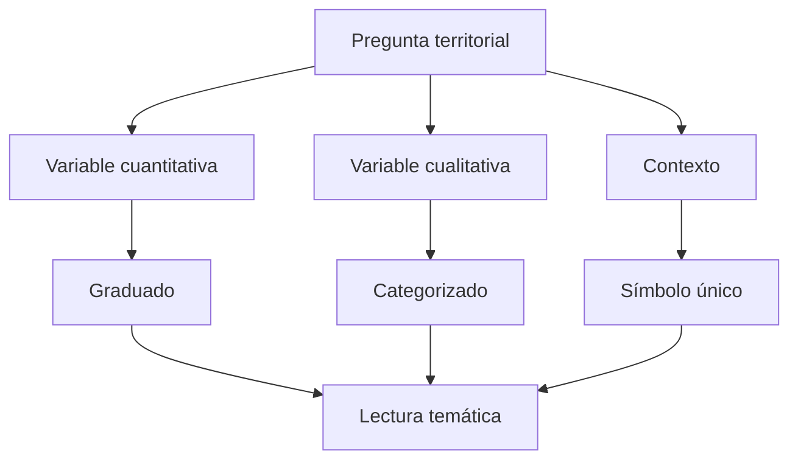
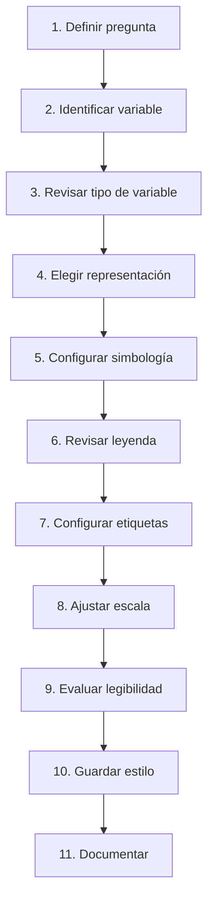

# 2.9 Representar y etiquetar datos vectoriales

!!! abstract "Objetivos de aprendizaje"

    Al finalizar esta lección, el estudiante será capaz de:

    - Comprender que la **representación cartográfica** constituye una forma de análisis y comunicación de la información espacial.
    - Diferenciar entre **dato, variable, símbolo y significado cartográfico**.
    - Aplicar simbología de **símbolo único** a capas vectoriales.
    - Utilizar simbología **categorizada** para representar variables cualitativas.
    - Utilizar simbología **graduada** para representar variables cuantitativas.
    - Diferenciar correctamente variables **nominales, ordinales y cuantitativas** antes de simbolizarlas.
    - Seleccionar un campo apropiado para una clasificación temática.
    - Comprender la diferencia entre **cantidad absoluta, razón, tasa, porcentaje y densidad**.
    - Evitar representaciones temáticas engañosas derivadas del uso incorrecto de valores absolutos.
    - Interpretar los principales métodos de clasificación de datos.
    - Ajustar número de clases, tamaño, grosor, transparencia y otras propiedades visuales.
    - Comprender el concepto de **jerarquía visual**.
    - Configurar etiquetas básicas a partir de campos y expresiones.
    - Mejorar la legibilidad de etiquetas mediante buffer, colocación y prioridades.
    - Evitar la saturación cartográfica mediante **visibilidad dependiente de escala**.
    - Configurar visibilidad por escala para capas y etiquetas.
    - Guardar y reutilizar estilos de capas.
    - Diferenciar entre estilo, simbología y datos.
    - Construir una primera lectura temática del territorio mediante simbología y etiquetas coherentes.
    - Documentar las decisiones cartográficas aplicadas.

!!! note "Antes de empezar"

    - **Entorno:** QGIS con el perfil `curso-qgis`. Los procedimientos toman como referencia **QGIS 3.44**; algunos nombres pueden variar ligeramente según la versión o idioma instalado.
    - **Punto de partida:** haber completado la [lección 2.8](08-seleccionar-filtrar-extraer.md), de manera que las capas hayan sido previamente revisadas, filtradas y estructuradas.
    - **Datos recomendados:** capas vectoriales de puntos, líneas y polígonos con atributos cualitativos y cuantitativos.
    - **Ejemplos sugeridos:** equipamientos, distritos, vías, barrios, población, superficie, capacidad o categorías de servicios.
    - **Principio de trabajo:** antes de elegir un color o tamaño debemos saber **qué variable queremos representar y qué significa**.
    - **Edición:** cambiar la simbología o las etiquetas no modifica los datos originales.
    - **Resultado esperado:** elaborar una primera lectura temática del territorio mediante categorías, graduaciones y etiquetas.
    - **Tiempo orientativo:** entre **120 y 150 minutos**, incluida la práctica.

---

## Representar no es solamente cambiar colores

Cuando incorporamos una capa a QGIS, el programa aplica automáticamente una representación inicial.

Por ejemplo:

```text
● ● ● ● ●
```

o:

```text
██████████
```

Todas las entidades pueden aparecer con el mismo símbolo.

Esto permite ver:

```text
dónde existen geometrías
```

pero no necesariamente:

```text
qué diferencias existen entre ellas
```

La cartografía temática intenta transformar los atributos en diferencias visuales significativas.

Por ejemplo:

```text
SERVICIO
├── Salud
├── Educación
├── Social
└── Recreación
```

puede convertirse en:

```text
TIPO DE SERVICIO
        ↓
SIMBOLOGÍA DIFERENCIADA
        ↓
LECTURA TERRITORIAL
```

### El mapa comunica mediante variables visuales

Podemos modificar propiedades como:

- color;
- tamaño;
- forma;
- grosor;
- transparencia;
- patrón;
- orientación.

Cada una transmite información de manera diferente.

Por ejemplo:

```text
color diferente
→ puede representar categorías

tamaño diferente
→ puede representar magnitud

grosor diferente
→ puede representar jerarquía
```

!!! important "Primero la variable, después el símbolo"

    No debemos comenzar preguntando:

    > ¿Qué color queda bonito?

    La pregunta correcta es:

    > ¿Qué característica del dato quiero comunicar y qué variable visual permite representarla adecuadamente?

---

## Dato, atributo y símbolo

Consideremos una capa de equipamientos:

| id | nombre | tipo | capacidad |
|---:|---|---|---:|
| 1 | Centro A | Salud | 150 |
| 2 | Unidad B | Educación | 600 |
| 3 | Centro C | Social | 80 |

Podemos representar:

```text
tipo
```

mediante colores diferentes.

Y:

```text
capacidad
```

mediante tamaños diferentes.

Esto produce dos lecturas distintas.

### Una variable cualitativa responde “qué tipo”

Por ejemplo:

```text
Salud
Educación
Social
```

No existe necesariamente una relación de mayor o menor entre estas categorías.

### Una variable cuantitativa responde “cuánto”

Por ejemplo:

```text
80
150
600
```

Aquí sí existe una magnitud numérica.

!!! warning "No todas las variables deben representarse de la misma manera"

    Utilizar una graduación para categorías nominales o colores aleatorios para magnitudes puede dificultar o distorsionar la lectura.

---

## Identificar el tipo de variable antes de simbolizar

Antes de representar un campo debemos determinar qué tipo de variable contiene.

### Variables nominales

Representan categorías sin orden inherente.

Por ejemplo:

```text
Salud
Educación
Social
Deportivo
Cultural
```

Para este tipo de variable suele ser apropiada una representación:

```text
categorizada
```

### Variables ordinales

Poseen categorías con un orden lógico.

Por ejemplo:

```text
Bajo
Medio
Alto
```

o:

```text
Local
Municipal
Departamental
Nacional
```

Aquí conviene mantener una jerarquía visual coherente.

### Variables cuantitativas

Representan cantidades numéricas.

Por ejemplo:

```text
población
capacidad
superficie
densidad
porcentaje
```

Pueden representarse mediante:

- graduaciones;
- tamaños;
- grosor;
- otras variables visuales.

### Tabla conceptual

| Tipo de variable | Ejemplo | Representación habitual |
|---|---|---|
| Nominal | Tipo de servicio | Categorías |
| Ordinal | Prioridad | Secuencia ordenada |
| Cuantitativa | Población | Graduación |
| Cuantitativa | Capacidad | Tamaño proporcional |

!!! success "Regla inicial"

    ```text
    categoría
    → diferencia visual

    orden
    → progresión visual

    cantidad
    → magnitud visual
    ```

---

## Abrir la simbología de una capa

Para modificar la representación podemos utilizar:

**Clic derecho sobre la capa ▸ Propiedades ▸ Simbología**

También podemos acceder desde el panel:

**Estilo de capa**

El panel de estilo permite realizar cambios y observarlos rápidamente en el mapa.

!!! captura "Captura pendiente · 2.9-01"

    - **Tipo:** Imagen (PNG) anotada.
    - **Archivo:** `assets/images/modulo-02/2-9/2-9-01-panel-simbologia.png`
    - **Qué mostrar:** panel de Estilo de capa.
    - **Sugerencia:** señalar:
        1. tipo de renderizador;
        2. símbolo;
        3. campo;
        4. clasificación;
        5. vista previa.

---

## Símbolo único

La representación más sencilla es:

**Símbolo único**

Todas las entidades utilizan la misma simbología.

Por ejemplo:

```text
● ● ● ● ●
```

### Cuándo utilizarlo

Es apropiado cuando:

- solamente queremos mostrar presencia o distribución;
- la categoría no es relevante;
- todas las entidades poseen el mismo significado;
- la capa funciona como contexto.

Por ejemplo:

```text
límite municipal
ríos secundarios
manzanas
puntos de control
```

### Símbolo único para puntos

Podemos configurar:

- forma;
- tamaño;
- relleno;
- contorno;
- opacidad.

### Símbolo único para líneas

Podemos modificar:

- grosor;
- estilo;
- patrón;
- transparencia.

### Símbolo único para polígonos

Podemos modificar:

- relleno;
- contorno;
- transparencia;
- patrón.

!!! tip "Una capa de contexto no debe competir visualmente con la capa temática"

    Si el objetivo principal es representar servicios, los límites administrativos deberían tener una simbología suficientemente discreta para no dominar el mapa.

---

## Jerarquía visual

No todos los elementos del mapa deben destacar por igual.

Podemos establecer niveles visuales:

```text
TEMA PRINCIPAL
      ↓
INFORMACIÓN SECUNDARIA
      ↓
CONTEXTO
```

Por ejemplo:

```text
Servicios prioritarios
→ alto contraste

Distritos
→ contraste medio

Límite municipal
→ bajo contraste
```

La jerarquía visual ayuda a responder:

> ¿Qué debe mirar primero el lector?

### Contraste

Podemos aumentar importancia mediante:

- mayor tamaño;
- mayor grosor;
- mayor contraste;
- menor transparencia.

Podemos disminuirla mediante:

- tonos suaves;
- líneas finas;
- mayor transparencia.

!!! important "Todo no puede ser protagonista"

    Si todas las capas utilizan colores intensos, líneas gruesas y etiquetas grandes, el mapa pierde jerarquía.

---

## Simbología categorizada

La simbología categorizada es apropiada para variables cualitativas.

Supongamos:

```text
tipo
```

con valores:

```text
Salud
Educación
Social
Deportivo
Cultural
```

Podemos asignar un símbolo diferente a cada categoría.

### Configurar categorías

En:

**Propiedades de la capa ▸ Simbología**

selecciona:

```text
Categorizado
```

Luego:

1. selecciona el campo;
2. utiliza **Clasificar**;
3. revisa las categorías;
4. ajusta símbolos y etiquetas.

Conceptualmente:

```text
tipo
  │
  ├── Salud       → símbolo A
  ├── Educación   → símbolo B
  ├── Social      → símbolo C
  └── Deportivo   → símbolo D
```

!!! captura "Captura pendiente · 2.9-02"

    - **Tipo:** Imagen (PNG).
    - **Archivo:** `assets/images/modulo-02/2-9/2-9-02-categorizado.png`
    - **Qué mostrar:** configuración de simbología categorizada sobre el campo `tipo`.
    - **Sugerencia:** incluir categorías visibles en el mapa y la leyenda del panel.

### Revisar categorías antes de simbolizar

La lección 2.7 ya mostró por qué debemos revisar los valores únicos.

Si encontramos:

```text
Salud
SALUD
salud
Salud 
```

QGIS puede interpretarlos como categorías diferentes.

Por tanto:

```text
calidad de atributos
→ afecta directamente
→ calidad de la representación
```

### La categoría “todos los demás valores”

QGIS puede mantener una categoría para valores no incluidos explícitamente.

Debemos decidir conscientemente si:

- queremos mostrarla;
- queremos ocultarla;
- queremos revisar esos registros.

!!! warning "Una categoría inesperada puede revelar un problema de datos"

    No elimines categorías simplemente porque molestan visualmente.

    Primero comprueba por qué existen.

---

## Elegir símbolos para categorías

No todas las categorías necesitan utilizar colores extremadamente diferentes.

Debemos buscar:

- diferenciación;
- legibilidad;
- coherencia;
- estabilidad visual.

### Evitar asociaciones engañosas

Por ejemplo:

```text
verde
```

puede asociarse frecuentemente con:

```text
positivo
permitido
ambiental
```

mientras:

```text
rojo
```

puede asociarse con:

```text
alerta
problema
prioridad
```

Estas asociaciones no son universales, pero deben considerarse.

### Formas diferentes

En capas puntuales también podemos utilizar:

- círculo;
- cuadrado;
- triángulo;
- estrella;
- símbolos SVG.

Las formas ayudan cuando:

- existen pocas categorías;
- necesitamos impresión monocromática;
- queremos reforzar diferencias.

### No utilizar demasiadas categorías

Una leyenda con:

```text
35 categorías
```

puede resultar difícil de leer.

Si existen demasiadas categorías debemos considerar:

- agrupar;
- generalizar;
- seleccionar categorías relevantes;
- utilizar otro enfoque.

---

## Simbología graduada

La simbología graduada representa variables numéricas mediante clases.

Por ejemplo:

```text
población
```

podría agruparse en:

```text
0 – 1 000
1 001 – 3 000
3 001 – 5 000
5 001 – 10 000
> 10 000
```

Cada clase recibe una simbología progresiva.

### Cuándo utilizarla

Resulta apropiada para variables como:

```text
población
densidad
porcentaje
índice
superficie
capacidad
```

siempre que la variable tenga sentido cuantitativo.

### Configurar una graduación

En:

**Propiedades ▸ Simbología**

selecciona:

```text
Graduado
```

Luego:

1. selecciona el campo;
2. selecciona una rampa;
3. selecciona un método;
4. define el número de clases;
5. utiliza **Clasificar**;
6. revisa los intervalos.

!!! captura "Captura pendiente · 2.9-03"

    - **Tipo:** Imagen (PNG) anotada.
    - **Archivo:** `assets/images/modulo-02/2-9/2-9-03-graduado.png`
    - **Qué mostrar:** simbología graduada configurada sobre una variable cuantitativa.
    - **Sugerencia:** señalar campo, método, clases e intervalos.

---

## Valores absolutos y relativos

Antes de crear un mapa graduado debemos preguntarnos:

> ¿Qué estamos comparando realmente?

### Valor absoluto

Por ejemplo:

```text
población total
```

puede ser:

```text
Distrito A = 10 000
Distrito B = 20 000
```

Pero los distritos podrían tener tamaños territoriales completamente diferentes.

### Densidad

Podemos calcular:

```text
densidad =
población
──────────
superficie
```

Esto responde otra pregunta:

> ¿Cuánta población existe por unidad de superficie?

### Porcentaje

Supongamos:

```text
población infantil
```

Podemos representar:

```text
cantidad absoluta
```

o:

```text
porcentaje respecto de población total
```

Son lecturas diferentes.

!!! important "El mapa debe responder una pregunta específica"

    ```text
    ¿Dónde hay más personas?
    ```

    no es igual que:

    ```text
    ¿Dónde existe mayor densidad?
    ```

    ni:

    ```text
    ¿Dónde existe mayor proporción de determinado grupo?
    ```

---

## El problema de simbolizar cantidades absolutas por área

Supongamos dos distritos:

```text
Distrito A
Población = 10 000
Área = 2 km²

Distrito B
Población = 15 000
Área = 20 km²
```

Si simbolizamos únicamente:

```text
población total
```

Distrito B tendrá una clase mayor.

Pero la densidad sería aproximadamente:

```text
Distrito A:
5 000 hab/km²

Distrito B:
750 hab/km²
```

La interpretación territorial cambia completamente.

!!! warning "Evita conclusiones equivocadas"

    En mapas coropléticos, variables relativas como tasas, porcentajes o densidades suelen ser más apropiadas que cantidades absolutas cuando las unidades territoriales tienen tamaños muy diferentes.

---

## Métodos de clasificación

Una graduación necesita dividir los datos en clases.

La forma de construir esas clases afecta la apariencia del mapa.

QGIS ofrece diferentes métodos.

### Intervalos iguales

Divide el rango total en intervalos del mismo tamaño.

Por ejemplo:

```text
mínimo = 0
máximo = 100
5 clases
```

produce aproximadamente:

```text
0–20
20–40
40–60
60–80
80–100
```

Es fácil de interpretar.

Pero puede producir clases casi vacías si los datos están muy concentrados.

### Cuantiles

Intenta distribuir una cantidad similar de entidades en cada clase.

Por ejemplo:

```text
100 entidades
5 clases
```

podría aproximarse a:

```text
20 entidades por clase
```

Los intervalos numéricos pueden tener amplitudes muy diferentes.

### Cortes naturales

Busca agrupaciones existentes dentro de la distribución de los datos.

Puede resultar útil cuando existen grupos claramente diferenciados.

### Desviación estándar

Clasifica los valores respecto de su distancia a la media.

Puede ser útil cuando interesa identificar:

```text
por encima
cerca
por debajo
```

de un comportamiento central.

### Manual

Permite establecer límites definidos por:

- normativa;
- estándares;
- criterios técnicos;
- conocimiento del fenómeno.

Por ejemplo:

```text
0–25 %
25–50 %
50–75 %
75–100 %
```

### Comparación

| Método | Idea principal |
|---|---|
| Intervalos iguales | Misma amplitud numérica |
| Cuantiles | Cantidad similar de entidades |
| Cortes naturales | Agrupaciones de la distribución |
| Desviación estándar | Distancia respecto de la media |
| Manual | Límites definidos externamente |

!!! important "El método de clasificación forma parte del mensaje"

    Dos mapas del mismo campo pueden producir lecturas visuales diferentes únicamente por cambiar el método de clasificación.

---

## Elegir el número de clases

Más clases no significa necesariamente mejor mapa.

Una graduación con:

```text
15 clases
```

puede resultar difícil de interpretar.

En muchas aplicaciones introductorias podemos comenzar con:

```text
4–7 clases
```

y evaluar el resultado.

### Pocas clases

Ventajas:

- lectura sencilla;
- leyenda compacta.

Desventajas:

- puede ocultar diferencias.

### Muchas clases

Ventajas:

- mayor detalle.

Desventajas:

- lectura más difícil;
- diferencias visuales poco perceptibles.

!!! tip "Clasificar es generalizar"

    Al crear clases estamos simplificando una variable continua para facilitar su interpretación cartográfica.

---

## Revisar la distribución antes de clasificar

Antes de aceptar una clasificación automática observa:

```text
mínimo
máximo
histograma
distribución
```

Esto permite detectar:

- valores extremos;
- concentración;
- discontinuidades;
- sesgos.

Un valor extremo puede comprimir visualmente el resto de los datos.

Por ejemplo:

```text
100
120
150
180
210
15 000
```

El último valor puede dominar la clasificación.

!!! warning "Una clasificación automática no reemplaza la lectura de datos"

    Debemos revisar siempre los intervalos generados y comprobar si tienen sentido para el fenómeno representado.

---

## Rampas secuenciales y divergentes

La elección de la progresión visual debe corresponder al significado de la variable.

### Secuencial

Es apropiada cuando los valores evolucionan:

```text
bajo
→
alto
```

Por ejemplo:

```text
densidad
población
porcentaje
capacidad
```

### Divergente

Es útil cuando existe un valor central significativo.

Por ejemplo:

```text
variación
```

con:

```text
negativo
0
positivo
```

o:

```text
por debajo de la media
media
por encima de la media
```

### Categórica

Es apropiada para categorías sin orden.

Por ejemplo:

```text
Salud
Educación
Social
```

!!! important "No utilices una rampa secuencial como si las categorías nominales tuvieran orden"

    Un gradiente visual puede sugerir una jerarquía que no existe en los datos.

---

## Representar puntos mediante tamaño

En capas puntuales podemos utilizar tamaño para comunicar magnitud.

Por ejemplo:

```text
capacidad = 50
→ símbolo pequeño

capacidad = 500
→ símbolo mayor
```

Esto permite construir símbolos proporcionales o graduados.

### Tamaño y cantidad

El lector interpreta principalmente el **área visual** del símbolo.

Por ello, la relación entre valor y tamaño debe configurarse correctamente.

QGIS permite controlar el tamaño mediante propiedades definidas por datos.

### Evitar símbolos demasiado grandes

Si los símbolos se superponen excesivamente:

```text
●●●●●
```

puede resultar imposible distinguir:

- entidades;
- cantidades;
- ubicación.

En esos casos podemos:

- reducir tamaños;
- utilizar transparencia;
- limitar escalas;
- considerar agrupaciones posteriores.

---

## Simbología de líneas

Las capas lineales pueden comunicar jerarquía mediante:

```text
grosor
tipo de línea
color
transparencia
```

Por ejemplo:

```text
vía primaria
→ línea más gruesa

vía secundaria
→ línea intermedia

vía local
→ línea fina
```

### Grosor como jerarquía

Una red vial puede representar:

```text
jerarquía funcional
```

mediante grosor.

La simbología debe ayudar a comprender la estructura de la red.

### Evitar exceso de contraste

Las vías son frecuentemente contexto para otros temas.

No deberían dominar un mapa de equipamientos salvo que constituyan el tema principal.

---

## Simbología de polígonos

Los polígonos permiten trabajar con:

- relleno;
- contorno;
- patrones;
- transparencia.

### Transparencia

Puede ser útil cuando queremos observar información inferior.

Por ejemplo:

```text
polígonos temáticos
+
mapa base
```

Sin embargo, demasiada transparencia reduce la diferenciación entre clases.

### Contornos

Los límites internos pueden:

- ayudar a distinguir unidades;
- o saturar el mapa.

En una capa con muchas unidades pequeñas puede ser útil reducir el grosor del contorno.

---

## Etiquetar entidades

La simbología muestra diferencias visuales.

Las etiquetas permiten incorporar texto directamente sobre el mapa.

Por ejemplo:

```text
Centro de Salud Norte
```

o:

```text
D-03
```

### Activar etiquetas

Desde:

**Propiedades de la capa ▸ Etiquetas**

o mediante el panel de estilo.

Selecciona:

```text
Etiquetas simples
```

y el campo correspondiente.

Por ejemplo:

```text
nombre
```

!!! captura "Captura pendiente · 2.9-04"

    - **Tipo:** Imagen (PNG).
    - **Archivo:** `assets/images/modulo-02/2-9/2-9-04-etiquetas.png`
    - **Qué mostrar:** configuración básica de etiquetas.
    - **Sugerencia:** señalar campo, texto, colocación y buffer.

---

## Elegir qué campo etiquetar

No toda información debe aparecer sobre el mapa.

Considera:

```text
nombre_completo
```

con valores muy largos.

Si etiquetamos todas las entidades, el resultado puede ser:

```text
████████████████████
████████████████████
████████████████████
```

El mapa se vuelve ilegible.

### Una etiqueta debe aportar información necesaria

Campos habituales:

```text
nombre
código
abreviatura
categoría
```

La elección depende de:

- propósito del mapa;
- escala;
- número de entidades;
- espacio disponible.

---

## Etiquetas mediante expresiones

No estamos limitados a mostrar un único campo.

Podemos construir expresiones.

Por ejemplo:

```qgis
"nombre" || ' - ' || "tipo"
```

Resultado:

```text
Centro Norte - Salud
```

### Salto de línea

Podemos construir etiquetas con varias líneas.

Por ejemplo:

```qgis
"nombre" || '\n' || "tipo"
```

dependiendo de la configuración de texto utilizada.

Resultado conceptual:

```text
Centro Norte
Salud
```

### Evitar información redundante

Si la simbología ya comunica:

```text
tipo
```

quizás no sea necesario repetirlo en cada etiqueta.

!!! tip "Símbolo y etiqueta deben complementarse"

    No deben duplicar información innecesariamente.

---

## Mejorar la legibilidad con buffer

Una etiqueta situada sobre información compleja puede resultar difícil de leer.

Podemos añadir un:

```text
buffer
```

al texto.

Esto crea un borde alrededor de los caracteres.

Por ejemplo:

```text
MAPA COMPLEJO
   ↓
texto + buffer
   ↓
mayor legibilidad
```

### Cuándo utilizarlo

Resulta especialmente útil:

- sobre imágenes;
- sobre polígonos con diferentes colores;
- sobre redes densas.

### Evitar buffers excesivos

Un buffer demasiado grueso puede hacer que las etiquetas dominen el mapa.

---

## Colocación de etiquetas

QGIS permite controlar cómo se ubican las etiquetas respecto de la geometría.

### Puntos

Podemos utilizar posiciones:

- alrededor del punto;
- desplazadas;
- con cuadrantes;
- mediante cartografía automática.

### Líneas

Las etiquetas pueden seguir:

```text
la dirección de la línea
```

por ejemplo en:

- calles;
- ríos;
- carreteras.

### Polígonos

Podemos colocar las etiquetas:

- dentro del polígono;
- alrededor del centro;
- mediante algoritmos de colocación apropiados.

!!! captura "Captura pendiente · 2.9-05"

    - **Tipo:** Imagen (PNG) comparativa.
    - **Archivo:** `assets/images/modulo-02/2-9/2-9-05-colocacion-etiquetas.png`
    - **Qué mostrar:** diferentes configuraciones de colocación para puntos, líneas y polígonos.
    - **Sugerencia:** mostrar un ejemplo correcto y otro con superposición problemática.

---

## Colisiones y prioridad de etiquetas

Cuando existen muchas entidades, todas las etiquetas pueden no caber.

QGIS intenta evitar superposiciones.

Esto significa que algunas pueden no aparecer.

### No forzar todas las etiquetas

Una opción como:

```text
mostrar todas las etiquetas
```

puede producir una gran saturación.

Debemos preguntarnos:

> ¿Realmente necesitamos mostrar todas simultáneamente?

### Prioridad

Podemos establecer mayor prioridad para determinadas capas o entidades.

Por ejemplo:

```text
capital municipal
→ alta prioridad

barrios secundarios
→ menor prioridad
```

### Obstáculos

Las geometrías también pueden actuar como obstáculos para evitar que las etiquetas se superpongan sobre elementos importantes.

---

## Visibilidad dependiente de escala

Un mapa que funciona correctamente a:

```text
1:5 000
```

puede resultar completamente saturado a:

```text
1:250 000
```

Por ello podemos configurar:

```text
visibilidad por escala
```

### Qué significa la escala

Una escala:

```text
1:10 000
```

indica una vista más cercana que:

```text
1:1 000 000
```

En términos prácticos:

```text
denominador pequeño
→ mayor detalle

denominador grande
→ vista más general
```

### Ejemplo

Podemos decidir:

```text
Límite municipal
→ visible siempre

Distritos
→ visibles hasta 1:250 000

Manzanas
→ visibles hasta 1:25 000

Nombres de calles
→ visibles hasta 1:10 000
```

El objetivo es mostrar detalle únicamente cuando puede leerse.

---

## Configurar visibilidad por escala para una capa

Desde las propiedades de la capa podemos establecer:

```text
Visibilidad dependiente de escala
```

y definir:

```text
escala mínima
escala máxima
```

El significado práctico debe comprobarse observando el mapa mientras hacemos zoom.

!!! captura "Captura pendiente · 2.9-06"

    - **Tipo:** GIF animado.
    - **Archivo:** `assets/images/modulo-02/2-9/2-9-06-visibilidad-escala.gif`
    - **Qué mostrar:** hacer zoom progresivamente y mostrar cómo aparece una capa detallada a determinada escala.
    - **Sugerencia:** mantener visible el indicador de escala.

### Aplicación conceptual

```text
ESCALA GENERAL
│
├── límite municipal
├── distritos
└── servicios principales

ESCALA INTERMEDIA
│
├── barrios
├── vías principales
└── equipamientos

ESCALA DETALLADA
│
├── manzanas
├── calles
└── etiquetas detalladas
```

---

## Configurar etiquetas por escala

Las etiquetas también pueden tener límites de visibilidad.

Por ejemplo:

```text
nombres de distritos
→ visibles a escalas generales

nombres de calles
→ visibles solamente a escalas detalladas
```

Esto evita que el mapa se convierta en una masa de texto.

### Diferentes escalas, diferente cantidad de información

Podemos pensar:

```text
zoom lejos
→ información general

zoom medio
→ información temática

zoom cerca
→ información detallada
```

!!! important "El mapa puede cambiar con la escala"

    Un mapa SIG interactivo no necesita mostrar exactamente los mismos elementos en todos los niveles de zoom.

---

## Orden de capas y lectura visual

El orden de las capas también forma parte de la representación.

Por ejemplo:

```text
Etiquetas
Puntos
Líneas
Polígonos
Mapa base
```

Si un polígono opaco se coloca encima de los puntos:

```text
los puntos pueden desaparecer
```

aunque continúen existiendo.

### Orden habitual

No existe una regla universal, pero podemos utilizar como referencia:

```text
Etiquetas y elementos puntuales
          ↑
Líneas temáticas
          ↑
Polígonos temáticos
          ↑
Contexto
          ↑
Mapa base
```

### Transparencia y orden trabajan conjuntamente

Una capa puede situarse encima y seguir permitiendo visualizar otra si utiliza transparencia.

---

## Evitar mapas saturados

Un mapa puede contener información técnicamente correcta y aun así resultar difícil de leer.

### Señales de saturación

- demasiados colores;
- demasiadas categorías;
- etiquetas superpuestas;
- símbolos demasiado grandes;
- líneas excesivamente gruesas;
- demasiadas capas visibles;
- falta de jerarquía.

### Simplificar

Podemos:

- ocultar capas no necesarias;
- reducir contraste;
- agrupar categorías;
- limitar etiquetas;
- utilizar visibilidad por escala;
- reducir grosor;
- reducir tamaño.

!!! success "La simplificación también es diseño"

    Eliminar ruido visual puede aumentar la cantidad de información que realmente comprende el lector.

---

## Construir una primera lectura temática

Supongamos que disponemos de:

```text
distritos
equipamientos
vías principales
```

y queremos responder:

> ¿Cómo se distribuyen los servicios y dónde existen mayores concentraciones de población?

Podemos utilizar:

```text
DISTRITOS
→ graduado por densidad poblacional

EQUIPAMIENTOS
→ categorizado por tipo

VÍAS
→ símbolo único discreto
```

Y etiquetas:

```text
distritos
→ código o nombre

equipamientos
→ solo servicios principales
```

### Estructura temática



### El mapa comienza a responder preguntas

Ya podemos observar:

- zonas con valores altos;
- zonas con valores bajos;
- concentración de servicios;
- diversidad de categorías;
- posibles vacíos territoriales.

Esto todavía no constituye un análisis espacial formal.

Pero sí una:

> **lectura exploratoria del territorio mediante representación temática.**

---

## Representar no demuestra causalidad

Supongamos que observamos:

```text
mayor densidad poblacional
+
mayor cantidad de equipamientos
```

en el centro del municipio.

Podemos describir:

> Las áreas centrales presentan visualmente mayor densidad y mayor concentración de servicios.

Pero no podemos afirmar únicamente a partir del mapa:

> La densidad poblacional causa la concentración de servicios.

La representación ayuda a:

```text
observar patrones
formular preguntas
generar hipótesis
```

No sustituye el análisis.

!!! warning "Patrón visual no significa explicación causal"

    La cartografía exploratoria permite detectar relaciones aparentes, pero estas deben verificarse mediante análisis apropiados.

---

## Guardar estilos

Después de configurar una capa podemos conservar su representación.

QGIS permite guardar estilos para reutilizarlos posteriormente.

Dependiendo del flujo de trabajo podemos trabajar con:

- estilos almacenados en el proyecto;
- estilos guardados junto a la fuente;
- archivos de estilo;
- estilos dentro de GeoPackage, cuando corresponda.

### Archivo QML

Un estilo puede guardarse como:

```text
.qml
```

Este archivo puede contener configuraciones relacionadas con:

- simbología;
- etiquetado;
- formularios;
- otras propiedades de visualización.

Por ejemplo:

```text
estilos/
└── equipamientos_tipo.qml
```

### Aplicar un estilo existente

Podemos cargar posteriormente ese estilo sobre una capa compatible.

Esto permite mantener:

```text
misma simbología
+
mismas etiquetas
+
misma lógica visual
```

entre diferentes proyectos.

!!! captura "Captura pendiente · 2.9-07"

    - **Tipo:** GIF animado.
    - **Archivo:** `assets/images/modulo-02/2-9/2-9-07-guardar-estilo.gif`
    - **Qué mostrar:** guardar un estilo QML, restablecer simbología y volver a cargarlo.
    - **Sugerencia:** demostrar que el estilo se recupera sin modificar los datos.

---

## Estilo y datos son cosas diferentes

Una capa puede contener:

```text
geometría
+
atributos
```

mientras el estilo define:

```text
cómo se representa
```

Conceptualmente:

```text
DATOS
│
├── geometría
└── atributos

ESTILO
│
├── símbolos
├── categorías
├── etiquetas
└── reglas de visualización
```

Cambiar el estilo no modifica necesariamente los valores almacenados.

### Un mismo dato puede tener varios estilos

Por ejemplo:

```text
distritos.gpkg
```

puede representarse mediante:

```text
Estilo A
→ población

Estilo B
→ densidad

Estilo C
→ porcentaje de cobertura
```

La geometría es la misma.

La lectura temática cambia.

!!! important "Un estilo representa una pregunta"

    Guardar estilos diferentes puede ser una forma útil de mantener distintas lecturas del mismo conjunto de datos.

---

## Nombrar los estilos

Evita:

```text
estilo1.qml
bueno.qml
final.qml
nuevo.qml
```

Prefiere:

```text
distritos_densidad.qml
equipamientos_tipo.qml
vias_jerarquia.qml
servicios_capacidad.qml
```

El nombre debería explicar:

```text
qué capa
+
qué variable
```

---

## Reutilizar estilos con cuidado

Un estilo diseñado para:

```text
campo = tipo
```

no funcionará necesariamente en otra capa que no tenga ese campo.

Asimismo, una clasificación calculada para un conjunto de datos concreto puede no ser apropiada para otra versión.

### Ejemplo

Un estilo graduado utiliza:

```text
0–100
100–200
200–500
500–1000
```

Pero una nueva base tiene:

```text
mínimo = 5 000
máximo = 50 000
```

El estilo puede cargarse técnicamente, pero la clasificación ya no sería adecuada.

!!! warning "Reutilizar un estilo no significa reutilizar ciegamente sus clases"

    Debemos comprobar que:

    - los campos existen;
    - los dominios coinciden;
    - los rangos siguen siendo apropiados;
    - la pregunta cartográfica sigue siendo la misma.

---

## Documentar decisiones cartográficas

Una representación temática también debe poder explicarse.

Podemos registrar:

| Elemento | Decisión |
|---|---|
| Capa | Distritos |
| Variable | Densidad poblacional |
| Tipo | Cuantitativa |
| Simbología | Graduada |
| Método | Cortes naturales |
| Clases | 5 |
| Unidad | hab/km² |
| Etiqueta | Nombre distrito |
| Visibilidad etiquetas | Según escala |
| Estilo | `distritos_densidad.qml` |

### Justificar la representación

Una justificación técnica podría ser:

> Se utilizó una simbología graduada sobre la densidad poblacional porque el objetivo es comparar intensidad de ocupación entre unidades territoriales de diferente superficie. Se utilizaron cinco clases para mantener una lectura visual sencilla. Los equipamientos se representaron mediante categorías según tipo de servicio y sus etiquetas se limitaron por escala para evitar saturación.

Esta explicación es mucho más útil que:

> Elegí estos colores porque se veían bien.

---

## Un procedimiento de representación reproducible

Podemos organizar el trabajo así:



### 1. Definir la pregunta

Por ejemplo:

> ¿Dónde existen mayores densidades de población y qué tipos de servicios se distribuyen en esos sectores?

### 2. Identificar variables

Necesitamos:

```text
densidad
tipo_servicio
```

### 3. Revisar el tipo

```text
densidad
→ cuantitativa

tipo_servicio
→ nominal
```

### 4. Elegir representación

```text
densidad
→ graduado

tipo_servicio
→ categorizado
```

### 5. Configurar simbología

Seleccionamos:

- método;
- clases;
- símbolos;
- tamaño;
- transparencia.

### 6. Revisar la leyenda

Comprueba que las etiquetas de las clases sean legibles.

Evita:

```text
150.238947–426.837165
```

si una lectura como:

```text
150–427
```

es suficiente para el propósito.

### 7. Configurar etiquetas

Seleccionamos:

- campo;
- tamaño;
- colocación;
- buffer.

### 8. Ajustar escala

Definimos:

- capas visibles;
- etiquetas visibles.

### 9. Evaluar legibilidad

Aleja y acerca el mapa.

Pregunta:

```text
¿qué veo primero?
¿puedo distinguir categorías?
¿las etiquetas se superponen?
¿el contexto domina demasiado?
```

### 10. Guardar el estilo

Guarda:

```text
.qml
```

cuando resulte útil.

### 11. Documentar

Registra las decisiones.

---

## Ejemplo aplicado: servicios y densidad territorial

Supongamos que disponemos de:

```text
distritos.gpkg
servicios.gpkg
vias.gpkg
```

### Distritos

Campos:

```text
nombre
poblacion
superficie_km2
densidad
```

Queremos representar:

```text
densidad
```

Por tanto:

```text
Simbología:
Graduado

Variable:
densidad

Clases:
5
```

### Servicios

Campo:

```text
tipo
```

con:

```text
Salud
Educación
Social
Cultural
Deportivo
```

Configuramos:

```text
Simbología:
Categorizada

Campo:
tipo
```

### Vías

Funcionan como contexto.

Configuramos:

```text
Símbolo único
```

con menor jerarquía visual.

### Etiquetas

Distritos:

```text
nombre
```

Servicios:

```text
nombre
```

pero solamente a escalas suficientemente detalladas.

### Resultado

Ahora podemos observar simultáneamente:

```text
densidad territorial
+
distribución de servicios
+
estructura vial
```

Esto permite formular nuevas preguntas:

```text
¿existen distritos densamente poblados con pocos servicios?

¿qué tipos de servicios se concentran?

¿existen sectores con aparente déficit?
```

Estas preguntas preparan el camino hacia análisis posteriores.

---

## Reto práctico

!!! example "Reto 2.9 — Elaborar una primera lectura temática del territorio"

    **Situación:** dispones de una capa de distritos y una capa de servicios municipales.

    Debes construir una representación temática que permita identificar:

    - diferencias territoriales en una variable cuantitativa;
    - distribución de tipos de servicios;
    - nombres principales;
    - información contextual.

    El objetivo no es producir todavía un mapa final de impresión, sino construir una **lectura temática clara dentro de QGIS**.

    **1. Preparar el proyecto**

    Abre el proyecto anterior y guárdalo como:

    ```text
    proyectos/reto_2-9_representacion.qgz
    ```

    **2. Seleccionar la variable cuantitativa**

    Utiliza una variable como:

    ```text
    densidad
    población relativa
    porcentaje de cobertura
    capacidad
    ```

    Registra:

    ```text
    Campo:
    Significado:
    Unidad:
    Tipo de variable:
    ```

    **3. Revisar estadísticas**

    Antes de simbolizar registra:

    ```text
    Mínimo:
    Máximo:
    Media:
    Mediana:
    ```

    Observa si existen valores extremos.

    **4. Crear una simbología graduada**

    Configura:

    ```text
    Tipo:
    Graduado

    Campo:
    variable cuantitativa

    Número inicial de clases:
    5
    ```

    **5. Comparar métodos de clasificación**

    Prueba al menos:

    ```text
    Intervalos iguales
    Cuantiles
    Cortes naturales
    ```

    Completa:

    | Método | Observación |
    |---|---|
    | Intervalos iguales | |
    | Cuantiles | |
    | Cortes naturales | |

    Selecciona uno y justifica la decisión.

    **6. Representar servicios por categoría**

    Utiliza:

    ```text
    Categorizado
    ```

    sobre:

    ```text
    tipo
    ```

    Revisa los valores únicos antes de aceptar las categorías.

    **7. Ajustar jerarquía visual**

    Organiza:

    ```text
    tema principal
    contexto
    límites
    vías
    ```

    de forma que el tema principal destaque.

    **8. Configurar etiquetas de distritos**

    Utiliza:

    ```text
    nombre
    ```

    o:

    ```text
    código
    ```

    según corresponda.

    Configura:

    - tamaño;
    - colocación;
    - buffer.

    **9. Configurar etiquetas de servicios**

    Utiliza:

    ```text
    nombre
    ```

    pero limita su visualización para evitar saturación.

    **10. Configurar visibilidad por escala**

    Define al menos una regla de escala para:

    - una capa;
    - etiquetas.

    Registra:

    | Elemento | Rango de escala | Justificación |
    |---|---|---|
    | Capa | | |
    | Etiquetas | | |

    **11. Evaluar el mapa en tres escalas**

    Revisa aproximadamente:

    ```text
    escala general
    escala intermedia
    escala detallada
    ```

    Para cada una explica:

    - qué información aparece;
    - qué información desaparece;
    - si la lectura mejora.

    **12. Guardar estilos**

    Guarda al menos:

    ```text
    estilos/distritos_tematica.qml
    ```

    y:

    ```text
    estilos/servicios_tipo.qml
    ```

    **13. Construir una ficha cartográfica**

    Completa:

    | Elemento | Configuración |
    |---|---|
    | Tema principal | |
    | Variable cuantitativa | |
    | Unidad | |
    | Método de clasificación | |
    | Nº de clases | |
    | Capa categorizada | |
    | Campo categórico | |
    | Etiqueta principal | |
    | Escala de etiquetas | |
    | Estilos guardados | |

    **14. Elaborar una interpretación**

    Redacta entre **150 y 200 palabras** respondiendo:

    - ¿qué patrón territorial se observa?;
    - ¿dónde aparecen valores altos y bajos?;
    - ¿cómo se distribuyen los tipos de servicio?;
    - ¿existen concentraciones aparentes?;
    - ¿existen sectores que merezcan análisis posterior?;
    - ¿qué limitaciones tiene esta lectura únicamente visual?

    **Entregables:**

    - `reto_2-9_representacion.qgz`;
    - `distritos_tematica.qml`;
    - `servicios_tipo.qml`;
    - ficha cartográfica;
    - tabla de comparación de métodos;
    - captura de la simbología graduada;
    - captura de la simbología categorizada;
    - captura con etiquetas;
    - captura en escala general;
    - captura en escala detallada;
    - interpretación temática.

!!! captura "Captura pendiente · 2.9-08"

    - **Tipo:** Imagen (PNG) compuesta.
    - **Archivo:** `assets/images/modulo-02/2-9/2-9-08-reto-lectura-tematica.png`
    - **Qué mostrar:** mapa final de trabajo con polígonos graduados, servicios categorizados y etiquetas controladas por escala.
    - **Sugerencia:** incluir una pequeña leyenda provisional para facilitar la lectura.

??? success "Criterios de evaluación del reto"

    | Criterio | Se cumple si... |
    |---|---|
    | Variable | Identifica correctamente su significado y tipo |
    | Estadísticas | Revisa distribución antes de clasificar |
    | Graduación | Utiliza una variable cuantitativa apropiada |
    | Método | Compara y justifica el método de clasificación |
    | Clases | Utiliza un número legible y justificable |
    | Categorías | Aplica categorización a una variable nominal |
    | Datos | Revisa valores únicos antes de simbolizar |
    | Jerarquía | El tema principal destaca sobre el contexto |
    | Etiquetas | Utiliza texto legible y no excesivo |
    | Colocación | Reduce superposiciones innecesarias |
    | Escala | Controla visibilidad de capas y/o etiquetas |
    | Contexto | Mantiene referencias territoriales sin dominar el mapa |
    | Estilos | Guarda configuraciones reutilizables |
    | Documentación | Registra las decisiones cartográficas |
    | Interpretación | Describe patrones sin convertirlos automáticamente en relaciones causales |

---

## Problemas frecuentes

| Problema | Posible causa | Qué revisar |
|---|---|---|
| Todas las entidades aparecen iguales | Símbolo único | Cambiar a categorizado o graduado cuando corresponda |
| Aparecen demasiadas categorías | Campo con muchas variantes | Valores únicos y normalización |
| `Salud`, `SALUD` y `salud` aparecen separados | Inconsistencia de atributos | Revisar datos |
| La graduación no muestra diferencias | Rango muy concentrado | Distribución y método |
| Una clase domina todo el mapa | Valor extremo | Estadísticas |
| La leyenda tiene demasiadas clases | Exceso de clasificación | Reducir clases |
| Un mapa de población parece favorecer áreas grandes | Valores absolutos | Considerar densidad o porcentaje |
| Las categorías parecen tener jerarquía aunque no la tengan | Rampa secuencial incorrecta | Utilizar esquema categórico |
| Las etiquetas se superponen | Demasiadas entidades | Escala, prioridad y colocación |
| Las etiquetas desaparecen | QGIS evita colisiones | Revisar prioridad y espacio |
| Todas las etiquetas aparecen y saturan | Forzar todas las etiquetas | Desactivar o limitar por escala |
| Los símbolos ocultan el mapa | Tamaño excesivo | Reducir tamaño o transparencia |
| El mapa base domina | Demasiado contraste | Reducir protagonismo |
| Los polígonos ocultan elementos inferiores | Relleno opaco | Transparencia y orden |
| Una capa desaparece al hacer zoom | Visibilidad por escala | Revisar rangos |
| El estilo cargado no funciona correctamente | Campos diferentes | Compatibilidad del estilo |
| La clasificación antigua ya no representa los datos | Rango actualizado | Reclasificar |
| El mapa parece sugerir una causa | Interpretación excesiva | Diferenciar patrón de causalidad |

---

## Ideas clave

!!! success "Para recordar"

    - Representar datos es una forma de **comunicar información**, no solamente de decorar un mapa.
    - Antes de simbolizar debemos comprender qué variable queremos representar.
    - Las variables nominales suelen representarse mediante **categorías**.
    - Las variables cuantitativas pueden representarse mediante **graduaciones** o tamaño.
    - Las variables ordinales deben mantener una jerarquía visual coherente.
    - El símbolo único es útil para capas de contexto o entidades equivalentes.
    - La **jerarquía visual** determina qué elementos llaman primero la atención.
    - La simbología categorizada depende de la calidad de los valores textuales.
    - Una categoría inesperada puede revelar problemas en los atributos.
    - Una graduación divide una variable cuantitativa en clases.
    - El método de clasificación afecta directamente la apariencia del mapa.
    - Intervalos iguales, cuantiles y cortes naturales responden a lógicas diferentes.
    - Más clases no significa necesariamente mejor representación.
    - Debemos revisar mínimo, máximo y distribución antes de clasificar.
    - Los valores absolutos y relativos responden preguntas diferentes.
    - En unidades territoriales de distinto tamaño puede ser preferible representar tasas, porcentajes o densidades.
    - Una rampa secuencial sugiere progresión.
    - Una rampa divergente es útil cuando existe un punto central significativo.
    - Las etiquetas deben aportar información necesaria, no repetir todo el contenido de la tabla.
    - El buffer puede mejorar la legibilidad del texto.
    - La colocación y prioridad ayudan a reducir conflictos.
    - No todas las etiquetas necesitan estar visibles simultáneamente.
    - La visibilidad por escala permite adaptar el nivel de detalle al zoom.
    - El orden de capas forma parte de la lectura cartográfica.
    - Un mapa saturado puede contener muchos datos pero comunicar poca información.
    - Los estilos pueden guardarse y reutilizarse.
    - Un estilo no modifica necesariamente los datos.
    - Un mismo conjunto de datos puede tener diferentes estilos para diferentes preguntas.
    - Reutilizar un estilo requiere comprobar que los campos y rangos siguen siendo compatibles.
    - Un patrón visual permite formular hipótesis, pero no demuestra causalidad.
    - Toda decisión cartográfica importante debería poder **explicarse y justificarse**.

---

## Autoevaluación

??? question "1. ¿Cuál es la diferencia entre dato y símbolo?"

    El dato representa información almacenada en la capa.

    El símbolo es una representación visual utilizada para comunicar una característica del dato.

??? question "2. ¿Cuándo utilizarías símbolo único?"

    Cuando las entidades pueden representarse de la misma manera o cuando la capa funciona principalmente como contexto.

??? question "3. ¿Qué tipo de variable es `tipo de servicio`?"

    Normalmente una variable nominal o categórica.

??? question "4. ¿Qué simbología resulta apropiada para `tipo de servicio`?"

    Una simbología categorizada.

??? question "5. ¿Qué tipo de variable es `densidad poblacional`?"

    Una variable cuantitativa.

??? question "6. ¿Qué simbología puede utilizarse para representar densidad?"

    Una simbología graduada, entre otras posibilidades.

??? question "7. ¿Por qué debemos revisar valores únicos antes de categorizar?"

    Porque variantes de escritura pueden generar categorías visuales separadas que conceptualmente representan lo mismo.

??? question "8. ¿Qué significa clasificar una variable?"

    Dividir sus valores en grupos o intervalos que posteriormente recibirán una representación visual.

??? question "9. ¿Qué hacen los intervalos iguales?"

    Dividen el rango numérico total en clases de amplitud similar.

??? question "10. ¿Qué hacen los cuantiles?"

    Intentan distribuir una cantidad similar de entidades dentro de cada clase.

??? question "11. ¿Qué buscan los cortes naturales?"

    Agrupaciones y discontinuidades existentes dentro de la distribución de los valores.

??? question "12. ¿Existe un método de clasificación universalmente mejor?"

    No.

    Depende de la distribución, la variable y la pregunta cartográfica.

??? question "13. ¿Más clases siempre producen un mejor mapa?"

    No.

    Un número excesivo de clases puede dificultar la interpretación.

??? question "14. ¿Por qué debemos tener cuidado al representar población absoluta por polígonos?"

    Porque unidades territoriales mayores pueden contener más población simplemente por su tamaño. Según la pregunta, una densidad o porcentaje puede permitir una comparación más adecuada.

??? question "15. ¿Qué diferencia existe entre población y densidad?"

    La población es una cantidad absoluta de personas.

    La densidad relaciona esa cantidad con una unidad de superficie.

??? question "16. ¿Qué es una rampa secuencial?"

    Una progresión visual utilizada habitualmente para representar una variable que aumenta desde valores bajos hacia altos.

??? question "17. ¿Cuándo puede ser útil una rampa divergente?"

    Cuando existe un valor central significativo y queremos representar desviaciones hacia dos direcciones.

??? question "18. ¿Qué aporta una etiqueta?"

    Incorpora texto asociado a una entidad directamente en el mapa.

??? question "19. ¿Por qué no deberíamos etiquetar siempre todas las entidades?"

    Porque pueden producirse superposiciones y saturación que reduzcen la legibilidad.

??? question "20. ¿Para qué sirve el buffer de una etiqueta?"

    Para mejorar la separación visual entre el texto y el fondo.

??? question "21. ¿Qué es la visibilidad dependiente de escala?"

    Una configuración que permite mostrar u ocultar capas o etiquetas según el nivel de zoom.

??? question "22. ¿Por qué puede ser útil ocultar nombres de calles a escalas generales?"

    Porque existen demasiados elementos para representarlos legiblemente y no forman parte del nivel de detalle apropiado para esa escala.

??? question "23. ¿Cambiar la simbología modifica los atributos de la capa?"

    Normalmente no.

    Modifica la forma en que los datos son representados.

??? question "24. ¿Qué es un archivo QML?"

    Un formato de estilo de QGIS que puede utilizarse para guardar y reutilizar configuraciones de representación de una capa.

??? question "25. ¿Puede aplicarse un estilo guardado a cualquier capa sin revisión?"

    No.

    Debemos comprobar que los campos, valores, rangos y estructura sean compatibles.

??? question "26. ¿Un mapa que muestra concentración de servicios demuestra por qué existe esa concentración?"

    No.

    Permite observar un patrón espacial, pero la explicación causal requiere análisis adicional.

??? question "27. ¿Qué significa jerarquía visual?"

    La organización gráfica que hace que determinados elementos destaquen más que otros según su importancia dentro del mapa.

??? question "28. ¿Qué debería documentarse en una representación temática?"

    La variable, unidad, tipo de simbología, método de clasificación, número de clases, etiquetado, escala de visibilidad y otros criterios relevantes.

---

## Referencias

- [QGIS Project. *QGIS 3.44 — Simbología de capas vectoriales*](https://docs.qgis.org/3.44/es/docs/user_manual/working_with_vector/vector_properties.html#symbology-properties)  
  Documentación oficial sobre renderizadores de símbolo único, categorizado, graduado y otras opciones de representación vectorial.

- [QGIS Project. *QGIS 3.44 — Selector de símbolos*](https://docs.qgis.org/3.44/es/docs/user_manual/style_library/symbol_selector.html)  
  Referencia sobre configuración de símbolos, capas de símbolo, tamaño, contorno, relleno, transparencia y propiedades definidas por datos.

- [QGIS Project. *QGIS 3.44 — Biblioteca de estilos*](https://docs.qgis.org/3.44/es/docs/user_manual/style_library/index.html)  
  Documentación sobre símbolos, rampas de color, estilos reutilizables y administración de recursos cartográficos dentro de QGIS.

- [QGIS Project. *QGIS 3.44 — Propiedades de etiquetado de capas vectoriales*](https://docs.qgis.org/3.44/es/docs/user_manual/working_with_vector/vector_properties.html#labels-properties)  
  Referencia oficial sobre configuración de etiquetas, texto, formato, buffer, colocación, prioridad y comportamiento de etiquetado.

- [QGIS Project. *QGIS 3.44 — Etiquetas controladas por datos*](https://docs.qgis.org/3.44/es/docs/user_manual/style_library/label_settings.html)  
  Documentación sobre configuración avanzada de etiquetas y propiedades controladas mediante atributos y expresiones.

- [QGIS Project. *QGIS 3.44 — Representación dependiente de escala*](https://docs.qgis.org/3.44/es/docs/user_manual/working_with_vector/vector_properties.html)  
  Documentación general de propiedades de capas vectoriales, incluida la configuración de visibilidad y comportamiento según escala.

- [QGIS Project. *QGIS 3.44 — Expresiones*](https://docs.qgis.org/3.44/es/docs/user_manual/expressions/expression.html)  
  Referencia para construir expresiones que pueden utilizarse en etiquetas, simbología y propiedades definidas por datos.

- [QGIS Project. *QGIS 3.44 — Guardar y gestionar estilos*](https://docs.qgis.org/3.44/es/docs/user_manual/working_with_vector/vector_properties.html#style-menu)  
  Documentación sobre guardado, carga y reutilización de estilos de capas.

- [QGIS Project. *QGIS 3.44 — Manual de formación: clasificación de datos vectoriales*](https://docs.qgis.org/3.44/es/docs/training_manual/vector_classification/index.html)  
  Material didáctico oficial sobre clasificación, simbología temática y representación de variables vectoriales.

- [QGIS Project. *QGIS 3.44 — Manual de formación: simbología*](https://docs.qgis.org/3.44/es/docs/training_manual/basic_map/symbology.html)  
  Ejercicios introductorios oficiales sobre estilos de capas, símbolos y jerarquía cartográfica.

- [QGIS Project. *QGIS 3.44 — Manual de formación: etiquetado*](https://docs.qgis.org/3.44/es/docs/training_manual/vector_classification/label_tool.html)  
  Ejercicios prácticos sobre configuración y mejora de etiquetas en capas vectoriales.

- [ColorBrewer 2.0](https://colorbrewer2.org/)  
  Herramienta de referencia para explorar esquemas de color cualitativos, secuenciales y divergentes diseñados para cartografía temática.

---

Hasta ahora hemos aprendido a:

```text
incorporar datos
        ↓
validar coordenadas
        ↓
revisar atributos
        ↓
seleccionar información
```

En esta lección damos un nuevo paso:

```text
DATOS
  ↓
VARIABLE
  ↓
SIMBOLOGÍA
  ↓
ETIQUETADO
  ↓
JERARQUÍA VISUAL
  ↓
LECTURA TERRITORIAL
```

La pregunta ya no es únicamente:

> **¿Qué entidades contiene la capa?**

sino:

> **¿Qué patrón territorial quiero comunicar y qué representación permite interpretarlo correctamente?**

Una buena representación temática no busca mostrar todo al mismo tiempo.

Busca convertir los atributos en una **estructura visual comprensible**, donde el lector pueda reconocer categorías, magnitudes, contrastes y patrones sin perder de vista las limitaciones de los datos.

Con esta base podremos avanzar posteriormente hacia composiciones cartográficas más completas y hacia análisis espaciales que permitan comprobar cuantitativamente los patrones que inicialmente observamos en el mapa.