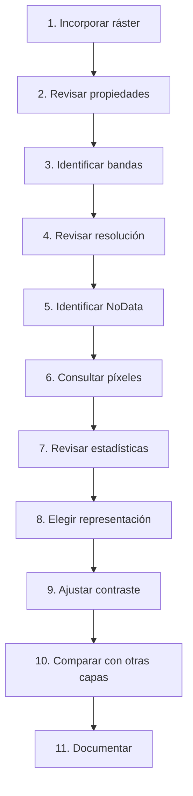

# 2.10 Explorar imágenes y superficies ráster

!!! abstract "Objetivos de aprendizaje"

    Al finalizar esta lección, el estudiante será capaz de:

    - Comprender el modelo ráster como una **matriz regular de celdas o píxeles**.
    - Diferenciar conceptualmente datos **vectoriales** y **ráster**.
    - Reconocer que un archivo ráster puede representar imágenes, elevaciones, temperaturas, coberturas u otras variables espaciales.
    - Interpretar correctamente las dimensiones de un ráster: **columnas, filas y número de bandas**.
    - Comprender qué representa una **banda ráster**.
    - Diferenciar un ráster **monobanda** de uno **multibanda**.
    - Interpretar el concepto de **valor de píxel** según el tipo de información almacenada.
    - Consultar valores de píxel mediante la herramienta **Identificar objetos espaciales**.
    - Comprender el concepto de **resolución espacial** y su relación con el tamaño de celda.
    - Diferenciar resolución espacial de escala de visualización.
    - Reconocer la función de los valores **NoData**.
    - Diferenciar NoData de valores numéricos válidos como `0`.
    - Consultar información, estadísticas e histogramas de una capa ráster.
    - Representar una banda mediante **Gris monobanda**.
    - Aplicar una representación **Pseudocolor monobanda** a una variable continua.
    - Comprender el funcionamiento básico de una composición **RGB**.
    - Diferenciar una composición de **color natural** de otras combinaciones de bandas.
    - Reconocer que el significado de cada banda depende del sensor o producto utilizado.
    - Comprender la función del contraste y de los valores mínimos y máximos en la visualización.
    - Comparar estructural y semánticamente una **imagen multibanda** con un **modelo digital de elevación**.
    - Evitar interpretar los colores de visualización como si fueran necesariamente valores originales de los datos.
    - Documentar las propiedades esenciales de un conjunto de datos ráster antes de utilizarlo.

!!! note "Antes de empezar"

    - **Entorno:** QGIS con el perfil `curso-qgis`. Los procedimientos toman como referencia **QGIS 3.44**; algunos nombres pueden variar ligeramente según el idioma o la versión instalada.
    - **Punto de partida:** haber completado la [lección 2.9](09-simbologia-etiquetas.md), especialmente los conceptos de simbología, variables y representación.
    - **Datos recomendados:** disponer de:
        - una imagen ráster multibanda;
        - un Modelo Digital de Elevación — MDE/DEM;
        - límites vectoriales del área de estudio como referencia.
    - **Formato recomendado:** GeoTIFF (`.tif` o `.tiff`) para los ejercicios.
    - **Principio de trabajo:** antes de modificar colores debemos comprender **qué contiene realmente cada píxel**.
    - **Edición:** los cambios de simbología no modifican los valores almacenados en el ráster original.
    - **Resultado esperado:** comparar una imagen y un modelo de elevación, interpretar sus diferencias y construir representaciones apropiadas para cada uno.
    - **Tiempo orientativo:** entre **120 y 150 minutos**, incluida la práctica.

---

## Del objeto geográfico a la superficie continua

En las lecciones anteriores hemos trabajado principalmente con información vectorial.

Por ejemplo:

```text
PUNTO
→ equipamiento

LÍNEA
→ vía

POLÍGONO
→ distrito
```

En el modelo vectorial representamos entidades mediante geometrías discretas.

Un ráster utiliza otra lógica.

El territorio se divide en una matriz de pequeñas celdas:

```text
┌────┬────┬────┬────┐
│ 12 │ 13 │ 15 │ 14 │
├────┼────┼────┼────┤
│ 11 │ 14 │ 18 │ 19 │
├────┼────┼────┼────┤
│ 10 │ 16 │ 21 │ 25 │
├────┼────┼────┼────┤
│  9 │ 15 │ 20 │ 24 │
└────┴────┴────┴────┘
```

Cada celda posee una posición y uno o más valores.

### Una matriz de filas y columnas

Podemos representar un ráster como:

```text
              COLUMNAS
        1     2     3     4
      ┌─────┬─────┬─────┬─────┐
F   1 │     │     │     │     │
I     ├─────┼─────┼─────┼─────┤
L   2 │     │     │     │     │
A     ├─────┼─────┼─────┼─────┤
S   3 │     │     │     │     │
      └─────┴─────┴─────┴─────┘
```

La unidad elemental es:

```text
PÍXEL
```

también denominado:

```text
CELDA
```

En un SIG, ese píxel no solamente ocupa una posición dentro de una imagen.

También está relacionado con una ubicación dentro de un sistema de coordenadas.

### Cada píxel contiene información

En un ráster de elevación:

```text
píxel
→ elevación
```

En una imagen:

```text
píxel
→ uno o varios valores registrados en diferentes bandas
```

En un ráster de temperatura:

```text
píxel
→ temperatura
```

En una clasificación de cobertura:

```text
píxel
→ código de clase
```

Por tanto:

> **El significado del número depende del producto ráster que estamos utilizando.**

!!! important "Un ráster no es necesariamente una fotografía"

    Una ortofoto o una imagen satelital puede verse como una fotografía.

    Un MDE también es ráster, aunque sus píxeles representen elevaciones y no colores visibles.

### Vector y ráster responden mediante modelos diferentes

| Vector | Ráster |
|---|---|
| Entidades discretas | Matriz de celdas |
| Puntos, líneas y polígonos | Filas y columnas |
| Atributos por entidad | Valores por píxel |
| Límites explícitos | Superficie continua o clases |
| Bueno para objetos individuales | Bueno para superficies e imágenes |

!!! captura "Captura pendiente · 2.10-01"

    - **Tipo:** Imagen (PNG) conceptual.
    - **Archivo:** `assets/images/modulo-02/2-10/2-10-01-vector-raster.png`
    - **Qué mostrar:** a la izquierda varios objetos vectoriales y a la derecha una cuadrícula ráster sobre el mismo territorio.
    - **Sugerencia:** ampliar una pequeña región del ráster para que puedan distinguirse los píxeles.

---

## Un mismo modelo ráster puede representar fenómenos diferentes

La estructura:

```text
filas
+
columnas
+
píxeles
```

es común.

Lo que cambia es:

```text
qué significa el valor almacenado
```

### Imagen

Una imagen puede registrar información obtenida mediante:

- satélite;
- cámara aérea;
- dron;
- sensor multiespectral;
- ortofotografía.

Puede contener varias bandas.

### Modelo de elevación

Un Modelo Digital de Elevación puede almacenar:

```text
píxel → elevación
```

Por ejemplo:

```text
2550
2552
2558
2567
```

Los números tienen un significado completamente diferente de los valores de una imagen.

### Otros ejemplos

También podemos encontrar rásteres de:

```text
precipitación
temperatura
pendiente
orientación
uso del suelo
cobertura vegetal
distancia
accesibilidad
índices espectrales
```

!!! success "Primera pregunta ante cualquier ráster"

    Antes de cambiar su simbología pregunta:

    > **¿Qué representa el valor de cada píxel?**

---

## Inspeccionar las propiedades antes de interpretar

Cuando incorporamos un ráster nuevo no deberíamos comenzar inmediatamente cambiando colores.

Primero revisaremos sus propiedades.

Una ruta habitual es:

**Clic derecho sobre la capa ▸ Propiedades**

y posteriormente:

**Información**

La información disponible puede incluir:

```text
nombre
ruta
SRC
extensión
ancho
alto
número de bandas
tipo de datos
tamaño de píxel
estadísticas
valores NoData
```

### Construir una ficha mínima

Para cada ráster podemos registrar:

| Propiedad | Valor |
|---|---|
| Archivo | |
| Formato | |
| SRC | |
| Columnas | |
| Filas | |
| Bandas | |
| Tamaño de píxel X | |
| Tamaño de píxel Y | |
| Tipo de datos | |
| NoData | |
| Extensión | |

Este inventario nos ayuda a entender la estructura antes de interpretarla.

!!! captura "Captura pendiente · 2.10-02"

    - **Tipo:** Imagen (PNG) anotada.
    - **Archivo:** `assets/images/modulo-02/2-10/2-10-02-propiedades-raster.png`
    - **Qué mostrar:** pestaña **Información** de una capa ráster.
    - **Sugerencia:** señalar:
        1. tamaño;
        2. filas/columnas;
        3. número de bandas;
        4. tipo de datos;
        5. tamaño de píxel;
        6. estadísticas;
        7. SRC.

---

## Filas, columnas y dimensiones

Un ráster podría tener:

```text
Columnas = 5000
Filas    = 3500
```

Esto significa que contiene aproximadamente:

```text
5000 × 3500
=
17 500 000 píxeles
```

por cada banda.

### Las dimensiones no indican por sí solas cuánto territorio cubre

Dos rásteres pueden tener:

```text
5000 × 5000 píxeles
```

y representar extensiones territoriales completamente diferentes.

Necesitamos conocer:

```text
tamaño de píxel
+
extensión
+
SRC
```

### Más píxeles no significa automáticamente mejor información

Una imagen grande en número de píxeles podría simplemente cubrir:

- un territorio mayor;
- una zona diferente;
- una imagen remuestreada.

Por eso debemos evitar afirmar:

> “Tiene más píxeles, por tanto tiene mayor resolución”.

Necesitamos conocer el **tamaño espacial de cada celda**.

---

## Comprender la resolución espacial

La resolución espacial indica el nivel de detalle espacial que puede representar un ráster.

En términos prácticos suele relacionarse con:

```text
tamaño de la celda
```

Por ejemplo:

```text
10 m × 10 m
```

significa que cada celda representa aproximadamente un área de:

```text
100 m²
```

en un contexto apropiado.

### Píxel pequeño y píxel grande

Considera:

```text
RÁSTER A
píxel = 1 m

RÁSTER B
píxel = 30 m
```

El primero puede representar variaciones espaciales más finas.

Conceptualmente:

```text
PÍXELES PEQUEÑOS

┌─┬─┬─┬─┬─┬─┬─┬─┐
├─┼─┼─┼─┼─┼─┼─┼─┤
├─┼─┼─┼─┼─┼─┼─┼─┤
└─┴─┴─┴─┴─┴─┴─┴─┘

PÍXELES GRANDES

┌───────┬───────┐
│       │       │
├───────┼───────┤
│       │       │
└───────┴───────┘
```

### Menor tamaño de píxel implica mayor detalle espacial

En general:

```text
píxel más pequeño
→ resolución espacial más fina

píxel más grande
→ resolución espacial más gruesa
```

Pero eso no significa automáticamente:

```text
mayor exactitud
```

ni:

```text
mayor calidad total
```

### Resolución y exactitud no son sinónimos

Un ráster puede tener:

```text
píxel = 50 cm
```

pero estar:

- mal georreferenciado;
- desplazado;
- producido con un sensor de baja calidad;
- derivado de información imprecisa.

Por tanto:

> **La resolución describe el nivel de detalle espacial, no garantiza la exactitud del dato.**

---

## El tamaño de píxel depende también del SRC

En un SRC proyectado podemos encontrar:

```text
Pixel Size = 10 × 10
```

con unidades:

```text
metros
```

Pero en un SRC geográfico podría expresarse en:

```text
grados
```

Por eso no debemos leer simplemente:

```text
0.0001
```

sin comprobar el SRC y sus unidades.

!!! warning "No asumas que el tamaño de píxel siempre está en metros"

    Debes interpretar el tamaño de celda según las unidades del Sistema de Referencia de Coordenadas.

---

## Resolución espacial y escala de visualización no son lo mismo

Podemos hacer:

```text
zoom
```

sobre cualquier ráster.

Pero aumentar el zoom no crea información nueva.

### Ejemplo

Una imagen de:

```text
30 m/píxel
```

vista muy de cerca continúa teniendo:

```text
30 m/píxel
```

Aunque QGIS amplíe visualmente cada celda en la pantalla.

Conceptualmente:

```text
ZOOM
→ amplía la visualización

NO
→ aumenta la resolución original
```

!!! important "Acercarse no crea detalle"

    El nivel de zoom controla cómo vemos los datos.

    La resolución espacial pertenece al conjunto de datos original.

---

## Bandas ráster

Un ráster puede contener una o varias bandas.

Podemos imaginar cada banda como una matriz de valores correspondiente a la misma extensión espacial.

```text
RÁSTER
├── Banda 1
├── Banda 2
├── Banda 3
└── ...
```

### Ráster monobanda

Contiene:

```text
1 banda
```

Por ejemplo, un MDE puede contener:

```text
Banda 1
→ elevación
```

### Ráster multibanda

Contiene:

```text
2 o más bandas
```

Por ejemplo:

```text
Banda 1
Banda 2
Banda 3
Banda 4
...
```

Cada banda puede representar una región diferente del espectro o alguna variable particular del producto.

### Las bandas están espacialmente alineadas

En un ráster multibanda convencional, para una misma celda espacial podemos tener:

```text
Pixel (fila 120, columna 250)

Banda 1 → 73
Banda 2 → 95
Banda 3 → 112
```

La misma posición posee varios valores.

---

## Una banda no significa necesariamente un color

Es muy importante no asumir:

```text
Banda 1 = rojo
Banda 2 = verde
Banda 3 = azul
```

Eso depende completamente:

- del sensor;
- del producto;
- del procesamiento;
- de la documentación.

Por ejemplo, una banda podría representar:

```text
azul
verde
rojo
infrarrojo cercano
infrarrojo de onda corta
térmico
```

pero la numeración cambia entre diferentes sensores.

!!! danger "No memorices una combinación RGB universal"

    Antes de construir una composición debes consultar qué representa cada banda del producto utilizado.

---

## El valor de píxel

Un ráster no almacena simplemente “colores”.

Almacena números.

La simbología convierte esos números en una representación visual.

### En un MDE

Podemos encontrar:

```text
2450
2510
2635
2780
```

que podrían representar elevaciones, según las unidades y documentación del producto.

### En una imagen

Podemos encontrar valores como:

```text
Banda 1 = 85
Banda 2 = 104
Banda 3 = 127
```

Su significado depende del producto.

Pueden representar:

- niveles digitales;
- reflectancia escalada;
- valores procesados;
- otra magnitud radiométrica.

Debemos consultar los metadatos.

!!! important "No interpretes números sin conocer el producto"

    `125` no significa lo mismo en todos los rásteres.

---

## Consultar valores de píxel

QGIS permite inspeccionar el valor de una celda mediante:

**Identificar objetos espaciales**

El procedimiento básico es:

1. selecciona la capa ráster;
2. activa **Identificar objetos espaciales**;
3. haz clic sobre un píxel;
4. revisa el panel **Identificar resultados**.

### En un ráster monobanda

Podríamos obtener:

```text
Banda 1 = 2684
```

### En uno multibanda

Podríamos obtener:

```text
Banda 1 = 74
Banda 2 = 96
Banda 3 = 123
Banda 4 = 158
```

QGIS puede mostrar también información relacionada con:

- coordenadas X/Y;
- fila;
- columna;
- otras propiedades disponibles.

!!! captura "Captura pendiente · 2.10-03"

    - **Tipo:** GIF animado.
    - **Archivo:** `assets/images/modulo-02/2-10/2-10-03-identificar-pixel.gif`
    - **Qué mostrar:** identificación primero sobre el DEM y después sobre una imagen multibanda.
    - **Sugerencia:** mostrar claramente la diferencia entre un único valor y varios valores de bandas.

### El color visualizado no es necesariamente el valor almacenado

Supongamos que el MDE contiene:

```text
2684
```

y QGIS lo representa con:

```text
verde
```

El valor original continúa siendo:

```text
2684
```

El color verde pertenece únicamente a la:

```text
SIMBOLOGÍA
```

No al dato original.

---

## Comprender NoData

No todas las celdas de un ráster poseen necesariamente información válida.

Para esos casos existe el concepto:

```text
NoData
```

Podemos interpretarlo como:

> **En esta celda no existe un valor válido para esta variable.**

### NoData no significa cero

Supongamos un modelo de elevación.

```text
0
```

podría ser una elevación válida.

Mientras:

```text
NoData
```

significa que:

```text
no conocemos / no existe un valor válido
```

Por tanto:

```text
0 ≠ NoData
```

### Valores especiales

Algunos archivos pueden utilizar un número concreto para codificar NoData.

Por ejemplo:

```text
-9999
```

Pero:

> **No debemos asumir que -9999 es siempre NoData.**

Debemos revisar la metadata o propiedades del archivo.

### Representación de NoData

QGIS puede representar los píxeles NoData como transparentes.

También permite definir valores adicionales que deben tratarse como ausencia de datos.

!!! captura "Captura pendiente · 2.10-04"

    - **Tipo:** Imagen (PNG) comparativa.
    - **Archivo:** `assets/images/modulo-02/2-10/2-10-04-nodata.png`
    - **Qué mostrar:** un DEM con zonas NoData visibles primero como valor problemático y después transparentes.
    - **Sugerencia:** utilizar un límite claramente irregular para que se observe la ausencia de información.

---

## Por qué NoData importa

Supongamos un MDE cuyo valor NoData es:

```text
-9999
```

Si ese valor se interpreta incorrectamente como elevación real podría afectar:

```text
mínimo
media
clasificación
estadísticas
análisis
```

Por ejemplo:

```text
elevaciones reales:
2500–4500 m

NoData:
-9999
```

Si se incluye `-9999` en una clasificación visual, la distribución puede quedar completamente distorsionada.

!!! warning "NoData puede afectar mucho más que la apariencia"

    Una definición incorrecta de ausencia de datos puede alterar cálculos y análisis posteriores.

---

## Estadísticas de una banda

Una banda ráster puede tener estadísticas como:

```text
mínimo
máximo
media
desviación estándar
```

Estas estadísticas ayudan a conocer la distribución de sus valores.

### Ejemplo de DEM

Podríamos obtener:

```text
Mínimo = 2520
Máximo = 4685
Media  = 3180
```

Ahora sabemos aproximadamente:

```text
qué rango de elevaciones contiene
```

### En una imagen

Cada banda puede tener estadísticas diferentes.

Por ejemplo:

```text
Banda 1
min = ...
max = ...

Banda 2
min = ...
max = ...
```

Estas diferencias también influyen en la visualización.

---

## Histograma

Un histograma representa la distribución de los valores de una banda.

Conceptualmente:

```text
frecuencia
   ▲
   │        █
   │       ███
   │     █████
   │   ███████
   │ ██████████
   └────────────────► valores
```

En QGIS podemos acceder a:

**Propiedades de la capa ▸ Histograma**

### Qué nos permite observar

Un histograma puede mostrar:

- concentración de valores;
- valores extremos;
- distribución;
- diferencias entre bandas.

### No es solo una herramienta estadística

También ayuda a comprender por qué una imagen:

```text
se ve demasiado oscura
```

o:

```text
tiene poco contraste
```

si la mayoría de los valores ocupa una región reducida del rango disponible.

!!! captura "Captura pendiente · 2.10-05"

    - **Tipo:** Imagen (PNG).
    - **Archivo:** `assets/images/modulo-02/2-10/2-10-05-histograma.png`
    - **Qué mostrar:** histograma de una banda con mínimos y máximos.
    - **Sugerencia:** utilizar primero el DEM por ser más sencillo de interpretar.

---

## Representar una sola banda en escala de grises

Una forma básica de representar un ráster continuo consiste en:

```text
Gris monobanda
```

QGIS asigna tonos comprendidos entre:

```text
negro
↕
blanco
```

de acuerdo con los valores utilizados para la visualización.

### Ejemplo con un DEM

Podemos representar:

```text
elevación baja
→ oscuro

elevación alta
→ claro
```

o invertir el gradiente.

La geometría y los valores del DEM no cambian.

Solo cambia:

```text
cómo los vemos
```

### Configurar Gris monobanda

En:

**Propiedades ▸ Simbología**

selecciona:

```text
Gris monobanda
```

Luego identifica:

```text
Banda:
Banda 1

Gradiente:
Negro a blanco
```

o:

```text
Blanco a negro
```

!!! captura "Captura pendiente · 2.10-06"

    - **Tipo:** Imagen (PNG) comparativa.
    - **Archivo:** `assets/images/modulo-02/2-10/2-10-06-gris-monobanda.png`
    - **Qué mostrar:** el mismo DEM con gradiente negro-blanco y blanco-negro.
    - **Sugerencia:** mantener exactamente la misma extensión para comparar.

---

## El contraste modifica la visualización

Supongamos que los valores de una banda oscilan entre:

```text
0 y 65535
```

pero la mayoría de los valores útiles se concentra entre:

```text
8500 y 12500
```

Si representamos directamente todo el rango:

```text
0–65535
```

las diferencias dentro del intervalo útil pueden verse muy pequeñas.

### Estiramiento de contraste

QGIS puede utilizar diferentes estrategias para relacionar valores de banda con el rango visual disponible.

Por ejemplo:

```text
mínimo
→ negro

máximo
→ blanco
```

y distribuir los valores intermedios.

### Min/Max

Los valores utilizados para representar:

```text
mínimo
máximo
```

no tienen que significar que los datos fuera de ese intervalo desaparezcan físicamente del archivo.

Son parámetros de representación.

### Recorte acumulativo

Otra posibilidad consiste en excluir visualmente pequeños porcentajes de valores extremos para mejorar el contraste central.

Esto puede resultar útil para imágenes con valores extremos.

!!! important "Cambiar contraste no cambia necesariamente los píxeles originales"

    Estamos modificando la representación de la capa dentro de QGIS.

    No confundas una mejora visual con una transformación del archivo.

---

## Visualizar una banda de una imagen multibanda

Una imagen multibanda puede inspeccionarse banda por banda.

En lugar de utilizar tres canales RGB podemos seleccionar:

```text
Gris monobanda
```

y visualizar únicamente:

```text
Banda 1
```

Luego:

```text
Banda 2
```

Después:

```text
Banda 3
```

### Comparar bandas

Cada banda puede mostrar diferentes contrastes entre:

- agua;
- vegetación;
- suelo;
- áreas urbanas;
- sombras;
- otros elementos.

La respuesta depende de la longitud de onda registrada y del producto.

!!! captura "Captura pendiente · 2.10-07"

    - **Tipo:** Imagen (PNG) compuesta.
    - **Archivo:** `assets/images/modulo-02/2-10/2-10-07-bandas-individuales.png`
    - **Qué mostrar:** tres vistas de la misma zona mostrando tres bandas diferentes en gris.
    - **Sugerencia:** utilizar idéntica extensión y escala.

---

## Composiciones RGB

Una pantalla convencional genera colores combinando tres canales:

```text
R → rojo
G → verde
B → azul
```

QGIS puede asignar tres bandas de una imagen multibanda a esos canales.

Conceptualmente:

```text
Banda X ─────► ROJO
Banda Y ─────► VERDE
Banda Z ─────► AZUL
                  │
                  ▼
              IMAGEN RGB
```

### Color multibanda

En:

**Propiedades ▸ Simbología**

selecciona:

```text
Color multibanda
```

Podrás definir:

```text
Banda roja:
Banda verde:
Banda azul:
```

### Los canales de pantalla no son las bandas originales

Cuando configuramos:

```text
Banda 4 → canal rojo
```

no estamos diciendo que:

```text
Banda 4 sea necesariamente radiación roja
```

Estamos diciendo:

> **Representa visualmente los valores de la Banda 4 utilizando el canal rojo de la pantalla.**

Esta diferencia es fundamental.

---

## Composición de color natural

Cuando el producto contiene bandas correspondientes a:

```text
rojo visible
verde visible
azul visible
```

podemos asignarlas respectivamente:

```text
rojo visible  → R
verde visible → G
azul visible  → B
```

El resultado suele aproximarse a una percepción visual natural.

### No existe una numeración universal

No escribiremos:

```text
4-3-2
```

o:

```text
3-2-1
```

como regla universal.

La combinación correcta depende del sensor.

Debemos consultar:

```text
metadatos
documentación del producto
```

!!! danger "No memorices números de bandas sin contexto"

    La banda roja puede tener un número diferente dependiendo del satélite o sensor.

    Primero identifica el producto.

---

## Composiciones de falso color

También podemos asignar otras bandas a los canales:

```text
R
G
B
```

Por ejemplo, una banda infrarroja podría mostrarse visualmente mediante el canal rojo.

Esto produce:

```text
falso color
```

El término no significa que la imagen sea incorrecta.

Significa que:

> Los colores mostrados no corresponden directamente a la percepción visual humana convencional.

### Por qué utilizar falso color

Puede ayudar a resaltar:

- vegetación;
- humedad;
- agua;
- diferencias de cobertura;
- determinadas características espectrales.

!!! note "El color se convierte en una herramienta analítica"

    En una composición multibanda, la elección de qué banda se asigna a cada canal determina qué contrastes son visualmente más evidentes.

---

## Comparar combinaciones RGB

Supongamos un producto con varias bandas documentadas.

Podemos construir:

```text
Composición A
→ color natural

Composición B
→ falso color

Composición C
→ otra combinación exploratoria
```

Después comparamos:

```text
¿qué objetos destacan?

¿qué superficies se diferencian mejor?

¿qué información se pierde?

¿qué información aparece con mayor contraste?
```

!!! captura "Captura pendiente · 2.10-08"

    - **Tipo:** Imagen (PNG) compuesta.
    - **Archivo:** `assets/images/modulo-02/2-10/2-10-08-composiciones-rgb.png`
    - **Qué mostrar:** la misma extensión mediante:
        1. color natural;
        2. una composición de falso color.
    - **Sugerencia:** incluir debajo de cada imagen las bandas utilizadas en R, G y B.

---

## Un MDE no necesita una composición RGB

Considera ahora un Modelo Digital de Elevación.

Su estructura puede ser:

```text
Banda 1
→ elevación
```

No necesitamos tres bandas para representar:

```text
altura
```

Podemos utilizar una sola banda y transformar los valores en una progresión visual.

Aquí aparece:

```text
Pseudocolor monobanda
```

---

## Pseudocolor monobanda

El renderizador:

```text
Pseudocolor monobanda
```

asigna colores a los valores de una banda.

Por ejemplo:

```text
2500 m → color A
3000 m → color B
3500 m → color C
4000 m → color D
```

La elevación sigue almacenada como números.

Los colores se utilizan para facilitar su lectura.

### Configurar pseudocolor

En:

**Propiedades ▸ Simbología**

selecciona:

```text
Pseudocolor monobanda
```

Luego define:

```text
Banda:
Banda 1

Mínimo:
...

Máximo:
...

Rampa:
...

Clasificación:
...
```

!!! captura "Captura pendiente · 2.10-09"

    - **Tipo:** Imagen (PNG) anotada.
    - **Archivo:** `assets/images/modulo-02/2-10/2-10-09-pseudocolor.png`
    - **Qué mostrar:** configuración completa de Pseudocolor monobanda sobre el DEM.
    - **Sugerencia:** señalar banda, rango, rampa, interpolación y clases.

### La rampa debe corresponder al significado

En una superficie de elevación podemos utilizar una progresión visual ordenada.

La regla fundamental es:

```text
valor bajo
→ una posición de la rampa

valor alto
→ otra posición
```

La representación debe permitir percibir:

```text
gradiente
```

no categorías nominales desconectadas.

---

## Continuo o clasificado

Una superficie puede representarse de manera continua.

Por ejemplo:

```text
2500 ───────── 4500
      gradiente
```

o mediante intervalos:

```text
2500–2750
2750–3000
3000–3250
...
```

### Representación continua

Ayuda a visualizar transiciones suaves.

Resulta natural para:

```text
elevación
temperatura
precipitación
```

cuando queremos percibir cambios graduales.

### Representación clasificada

Agrupa valores en intervalos.

Puede facilitar:

- lectura de rangos;
- elaboración de leyendas;
- identificación de pisos altitudinales definidos.

### Clasificación no cambia el DEM

Una vez más:

```text
valor almacenado
≠
clase visual
```

La simbología solamente controla la representación.

---

## Colores y significado

Debemos evitar pensar:

```text
azul = siempre baja elevación
rojo = siempre alta elevación
```

Eso es una convención de representación, no una propiedad del dato.

Podríamos invertir la rampa y el DEM seguiría siendo exactamente el mismo.

### El color pertenece al estilo

```text
DEM
valor = 3200
```

puede representarse:

```text
verde
```

en un estilo,

y:

```text
amarillo
```

en otro.

La elevación continúa siendo:

```text
3200
```

!!! success "Dato y estilo permanecen separados"

    ```text
    DATO
    3200

    ESTILO A
    verde

    ESTILO B
    amarillo
    ```

---

## Sombreado del relieve como representación complementaria

Un MDE también puede utilizarse para generar o visualizar:

```text
sombreado
```

Este tipo de representación simula la iluminación del relieve y ayuda a percibir formas como:

- crestas;
- valles;
- pendientes;
- montañas.

### No confundir sombreado y elevación

Un sombreado no debe interpretarse directamente como:

```text
metros de elevación
```

Sus valores representan una relación con iluminación y orientación del terreno.

Puede combinarse visualmente con un pseudocolor para mejorar la percepción del relieve.

!!! note "Sombreado y elevación responden preguntas distintas"

    El pseudocolor permite interpretar magnitudes de elevación.

    El sombreado facilita percibir la forma del terreno.

---

## Comparar una imagen y un modelo de elevación

Llegamos al ejercicio central de la lección.

Tenemos:

```text
IMAGEN
```

y:

```text
MDE
```

Ambos son ráster.

Sin embargo, contienen información diferente.

### Estructura

| Propiedad | Imagen | MDE |
|---|---|---|
| Modelo | Ráster | Ráster |
| Filas/columnas | Sí | Sí |
| Píxeles | Sí | Sí |
| Georreferenciación | Sí, si es ráster GIS | Sí |
| Bandas | Frecuentemente varias | Frecuentemente una |
| Valor del píxel | Información radiométrica según producto | Elevación según producto |
| Representación habitual | RGB | Gris o pseudocolor |
| Variable continua | Depende del producto | Elevación |
| Uso principal | Observación de superficie | Análisis del relieve |

### Visualización

Imagen:

```text
Bandas
   ↓
RGB
   ↓
imagen visual
```

MDE:

```text
Elevación
   ↓
rampa de valores
   ↓
superficie temática
```

### Interpretación

En una imagen podemos preguntar:

```text
¿Qué se observa sobre la superficie?
```

En un MDE:

```text
¿Cómo varía la elevación del terreno?
```

!!! important "Mismo modelo de datos, distinto significado"

    La estructura ráster es común.

    Lo que cambia es la semántica de los valores almacenados.

---

## Comparar la misma ubicación en ambos rásteres

Selecciona un punto reconocible del territorio.

Por ejemplo:

```text
Punto A
```

Sobre la imagen, Identificar puede devolver:

```text
Banda 1 = ...
Banda 2 = ...
Banda 3 = ...
Banda 4 = ...
```

En el DEM:

```text
Banda 1 = 2765
```

### Qué significa

Imagen:

```text
múltiples valores
→ respuesta del producto en diferentes bandas
```

MDE:

```text
un valor
→ elevación
```

### La coordenada es la misma

Si ambos rásteres están correctamente georreferenciados:

```text
X/Y
```

del punto deben referirse al mismo territorio.

Pero sus:

```text
valores de píxel
```

representan fenómenos diferentes.

!!! captura "Captura pendiente · 2.10-10"

    - **Tipo:** Imagen (PNG) comparativa.
    - **Archivo:** `assets/images/modulo-02/2-10/2-10-10-identificar-imagen-dem.png`
    - **Qué mostrar:** el mismo punto identificado primero sobre la imagen y luego sobre el DEM.
    - **Sugerencia:** mostrar lado a lado los valores obtenidos.

---

## Comparar la resolución de ambos productos

También debemos revisar:

```text
tamaño de píxel de la imagen
```

y:

```text
tamaño de píxel del DEM
```

Supongamos:

```text
Imagen:
10 m

DEM:
30 m
```

Esto significa que los dos productos describen el territorio mediante mallas diferentes.

### No deben coincidir necesariamente píxel a píxel

Aunque ambos cubran la misma zona:

```text
imagen
```

y:

```text
DEM
```

pueden tener:

- diferente resolución;
- diferente origen de cuadrícula;
- diferente extensión;
- diferente SRC.

Por tanto, antes de combinarlos en un análisis ráster tendremos que considerar:

```text
alineamiento
resolución
SRC
extensión
```

Estos aspectos se profundizarán posteriormente.

---

## La resolución condiciona lo que podemos observar

Supongamos:

```text
edificio = 10 m × 10 m
```

Un ráster de:

```text
100 m/píxel
```

no podrá representar ese edificio como un objeto detallado.

Una sola celda abarcaría un área mucho mayor.

### Un píxel resume un área

Conceptualmente:

```text
CELDA
┌───────────────────┐
│                   │
│  área territorial │
│   representada    │
│                   │
└───────────────────┘
```

El valor representa alguna propiedad asociada a esa superficie.

!!! warning "Evita interpretar información por debajo de la resolución"

    Si una celda representa 30 m × 30 m, no podemos asumir que conocemos la variación interna a escala de centímetros a partir de ese píxel.

---

## El aspecto cuadriculado al hacer zoom es normal

Cuando nos acercamos suficientemente aparece:

```text
pixelación
```

Esto no significa necesariamente que:

```text
el archivo esté dañado
```

Estamos viendo la estructura fundamental del ráster.

### Remuestreo de visualización

QGIS puede utilizar diferentes métodos para dibujar un ráster cuando la resolución de la pantalla y la resolución del archivo no coinciden.

Esto puede suavizar visualmente la imagen.

Pero:

> **El remuestreo de visualización no crea observaciones originales nuevas.**

Por ello debemos diferenciar:

```text
apariencia suave
```

de:

```text
resolución real del dato
```

---

## Tipos de datos ráster

Los píxeles pueden almacenarse mediante diferentes tipos numéricos.

Por ejemplo:

```text
Byte
UInt16
Int16
Float32
Float64
```

No necesitamos memorizar todavía todos sus rangos.

Lo importante es comprender que el tipo de dato influye en:

- valores posibles;
- almacenamiento;
- precisión numérica;
- tamaño del archivo.

### Imagen

Puede utilizar un tipo entero.

### MDE

Puede utilizar:

- entero;
- punto flotante;

dependiendo del producto.

Por ejemplo, si la elevación contiene decimales:

```text
2684.37
```

el producto puede necesitar un tipo capaz de almacenar esos valores.

!!! note "Tipo de dato y significado son conceptos diferentes"

    Saber que una banda es `Float32` no nos dice automáticamente si representa elevación, temperatura o precipitación.

    Necesitamos metadatos.

---

## Mínimo y máximo tampoco describen por sí solos el fenómeno

Supongamos:

```text
mínimo = 0
máximo = 255
```

Podría tratarse de:

- imagen;
- clasificación;
- variable escalada;
- otra información.

Mientras:

```text
mínimo = 2500
máximo = 4800
```

podría sugerir elevación en determinada región.

Pero no debemos deducir el significado únicamente del rango.

### El orden correcto

```text
DOCUMENTACIÓN
+
METADATOS
+
PROPIEDADES
+
VALORES
=
INTERPRETACIÓN
```

No:

```text
VER NÚMEROS
→ ADIVINAR
```

---

## No confundir visualización y análisis

Durante esta lección realizamos principalmente:

```text
VISUALIZACIÓN
```

Por ejemplo:

```text
pseudocolor
RGB
escala de grises
contraste
```

Estos cambios permiten interpretar mejor los datos.

No equivalen necesariamente a:

```text
ANÁLISIS RÁSTER
```

### Visualización

```text
mismos valores
+
nuevo estilo
=
nueva apariencia
```

### Análisis

Puede generar:

```text
nuevos valores
+
nuevo ráster
```

mediante operaciones matemáticas.

Por ejemplo:

```text
pendiente
reclasificación
índices
álgebra ráster
```

serán procesos posteriores.

!!! success "Primero comprender, después calcular"

    Antes de introducir un ráster en una operación matemática debemos conocer:

    - qué representa;
    - qué bandas tiene;
    - qué resolución posee;
    - qué significa NoData;
    - qué unidades utiliza.

---

## Usar transparencia para comparar capas

Una técnica útil de exploración consiste en superponer:

```text
imagen
+
DEM
```

o:

```text
imagen
+
sombreado
```

y modificar temporalmente la opacidad.

Por ejemplo:

```text
Capa superior:
50 % opacidad
```

Esto permite observar la correspondencia entre:

- relieve;
- drenaje;
- ocupación;
- infraestructura;
- otros patrones visibles.

### No confundir superposición visual con fusión de datos

Modificar transparencia:

```text
NO
```

combina matemáticamente ambos rásteres.

Solo cambia cómo se dibujan juntos.

---

## Construir una ficha de interpretación ráster

Para cada archivo utilizado en el curso conviene registrar:

| Elemento | Imagen | MDE |
|---|---|---|
| Archivo | | |
| Formato | | |
| SRC | | |
| Columnas | | |
| Filas | | |
| Bandas | | |
| Tamaño de píxel | | |
| Tipo de dato | | |
| NoData | | |
| Mínimo | | |
| Máximo | | |
| Variable representada | | |
| Fuente | | |
| Fecha | | |

Esta tabla obliga a pasar de:

```text
"tengo un TIFF"
```

a:

```text
"comprendo qué información contiene"
```

---

## Un procedimiento de exploración reproducible

Podemos establecer el siguiente flujo:



### 1. Incorporar

Carga:

```text
imagen.tif
dem.tif
```

### 2. Revisar propiedades

Registra:

```text
SRC
dimensiones
bandas
tipo de datos
extensión
```

### 3. Identificar bandas

Determina:

```text
qué representa cada banda
```

a partir de la documentación.

### 4. Revisar resolución

Registra:

```text
tamaño de píxel X
tamaño de píxel Y
```

y las unidades.

### 5. Identificar NoData

Comprueba:

```text
si existe
qué valor utiliza
cómo se representa
```

### 6. Consultar píxeles

Utiliza:

**Identificar objetos espaciales**

sobre varios puntos.

### 7. Revisar estadísticas

Comprueba:

```text
mínimo
máximo
histograma
```

cuando corresponda.

### 8. Elegir representación

Según el producto:

```text
imagen
→ Color multibanda

MDE
→ Gris monobanda / Pseudocolor
```

### 9. Ajustar contraste

Evalúa si los valores mínimos y máximos utilizados permiten una lectura adecuada.

### 10. Comparar

Observa:

```text
imagen
vs
MDE
```

sobre la misma zona.

### 11. Documentar

Registra las propiedades y decisiones.

---

## Ejemplo aplicado: imagen multibanda

Supongamos:

```text
imagen_area_estudio.tif
```

Propiedades:

```text
Bandas:
4

Resolución:
10 m

SRC:
conocido

NoData:
definido
```

### Primera inspección

Revisamos las bandas y consultamos la documentación del producto.

Determinamos qué banda corresponde a:

```text
rojo visible
verde visible
azul visible
otra región espectral
```

### Visualización individual

Utilizamos:

```text
Gris monobanda
```

para revisar cada una por separado.

Observamos que determinados elementos presentan contrastes diferentes.

### Color natural

Asignamos las bandas visibles correspondientes:

```text
rojo  → R
verde → G
azul  → B
```

El resultado produce una interpretación visual cercana a una imagen natural.

### Otra composición

Construimos posteriormente una composición diferente.

Observamos cambios en:

- vegetación;
- agua;
- suelo;
- áreas construidas.

La geometría del ráster no ha cambiado.

Solo:

```text
qué banda controla cada canal visual
```

---

## Ejemplo aplicado: modelo digital de elevación

Tenemos:

```text
dem_area_estudio.tif
```

Propiedades:

```text
Bandas:
1

Variable:
elevación

Resolución:
30 m

Unidad vertical:
según metadatos
```

### Identificar valores

Seleccionamos varios lugares.

Por ejemplo:

```text
valle:
≈ valor bajo

ladera:
≈ valor intermedio

montaña:
≈ valor alto
```

### Gris monobanda

Representamos:

```text
valor bajo
→ oscuro

valor alto
→ claro
```

### Pseudocolor

Aplicamos una rampa continua.

Ahora las diferencias altitudinales son más fáciles de interpretar.

### Histograma

Observamos la distribución de elevaciones.

Podemos identificar:

- rango predominante;
- valores mínimos;
- valores máximos.

### Resultado

El DEM deja de ser:

```text
una imagen gris
```

y comienza a interpretarse como:

```text
una superficie numérica de elevación
```

---

## Comparación final: imagen frente a MDE

Podemos resumir:

```text
IMAGEN
│
├── varias bandas
├── información espectral/radiométrica
├── RGB
├── color natural/falso color
└── observación de cobertura

MDE
│
├── normalmente una banda
├── valores de elevación
├── gris
├── pseudocolor
└── representación del relieve
```

### Lo que tienen en común

Ambos poseen:

```text
píxeles
filas
columnas
resolución
extensión
SRC
valores
NoData
metadatos
```

### Lo que cambia

Principalmente:

```text
SIGNIFICADO DE LOS VALORES
```

!!! important "La estructura no determina la semántica"

    Dos archivos pueden ser GeoTIFF y tener exactamente la misma cantidad de filas y columnas, pero representar fenómenos completamente diferentes.

---

## Reto práctico

!!! example "Reto 2.10 — Comparar una imagen y un modelo de elevación"

    **Situación:** recibiste dos archivos ráster correspondientes al mismo territorio:

    ```text
    imagen.tif
    dem.tif
    ```

    Debes determinar qué contiene cada uno, revisar su estructura y construir una representación apropiada.

    El objetivo no es solamente conseguir que ambos “se vean bien”.

    Debes explicar **qué representa cada píxel y por qué utilizas una determinada simbología**.

    **1. Preparar el proyecto**

    Abre el proyecto de la lección anterior y guárdalo como:

    ```text
    proyectos/reto_2-10_raster.qgz
    ```

    **2. Incorporar los rásteres**

    Añade:

    ```text
    imagen.tif
    dem.tif
    ```

    y una capa vectorial de referencia.

    **3. Inventariar la imagen**

    Completa:

    | Propiedad | Resultado |
    |---|---|
    | Archivo | |
    | Formato | |
    | SRC | |
    | Columnas | |
    | Filas | |
    | Bandas | |
    | Tamaño píxel X | |
    | Tamaño píxel Y | |
    | Tipo de dato | |
    | NoData | |

    **4. Inventariar el MDE**

    Completa la misma ficha.

    **5. Comparar resolución**

    Registra:

    ```text
    Imagen:
    tamaño de píxel =

    MDE:
    tamaño de píxel =
    ```

    Responde:

    - ¿cuál posee resolución espacial más fina?;
    - ¿utilizan las mismas unidades?;
    - ¿cubren exactamente la misma extensión?;
    - ¿sus cuadrículas parecen coincidir?

    **6. Investigar las bandas de la imagen**

    Consulta la documentación del producto.

    Completa:

    | Banda | Significado |
    |---:|---|
    | 1 | |
    | 2 | |
    | 3 | |
    | 4 | |

    Adapta el número de filas al producto real.

    **7. Visualizar bandas individualmente**

    Utiliza:

    ```text
    Gris monobanda
    ```

    y observa al menos tres bandas.

    Registra qué elementos presentan mayor o menor contraste.

    **8. Construir una composición RGB**

    Configura:

    ```text
    Color multibanda
    ```

    Registra:

    ```text
    Canal rojo  =
    Canal verde =
    Canal azul  =
    ```

    Indica si corresponde a:

    ```text
    color natural
    ```

    o:

    ```text
    falso color
    ```

    y justifica la respuesta.

    **9. Identificar píxeles de la imagen**

    Selecciona tres puntos del territorio.

    Completa:

    | Punto | B1 | B2 | B3 | B4 | Observación |
    |---|---:|---:|---:|---:|---|

    Adapta las columnas al número real de bandas.

    **10. Explorar el DEM**

    Utiliza primero:

    ```text
    Gris monobanda
    ```

    Registra:

    ```text
    mínimo
    máximo
    ```

    **11. Aplicar pseudocolor**

    Utiliza:

    ```text
    Pseudocolor monobanda
    ```

    con una rampa apropiada para una variable continua.

    Indica:

    ```text
    mínimo:
    máximo:
    número de clases o modo continuo:
    ```

    **12. Identificar valores del DEM**

    Selecciona los mismos tres lugares utilizados sobre la imagen.

    Completa:

    | Punto | Valor DEM | Unidad | Interpretación |
    |---|---:|---|---|

    **13. Revisar NoData**

    Determina:

    ```text
    NoData imagen:
    NoData DEM:
    ```

    Comprueba cómo aparecen visualmente.

    Explica por qué:

    ```text
    NoData
    ```

    no debe confundirse con:

    ```text
    0
    ```

    **14. Revisar histogramas**

    Observa al menos:

    - una banda de la imagen;
    - la banda del DEM.

    Describe brevemente cómo se distribuyen los valores.

    **15. Comparar los dos rásteres**

    Completa:

    | Característica | Imagen | MDE |
    |---|---|---|
    | Número de bandas | | |
    | Variable | | |
    | Resolución | | |
    | Tipo de dato | | |
    | NoData | | |
    | Representación principal | | |
    | Significado del píxel | | |
    | Uso principal | | |

    **16. Superponer temporalmente**

    Utiliza transparencia para comparar:

    ```text
    imagen
    +
    DEM o sombreado
    ```

    Describe al menos dos relaciones territoriales visibles.

    **17. Guardar estilos**

    Guarda, cuando corresponda:

    ```text
    estilos/imagen_rgb.qml
    ```

    y:

    ```text
    estilos/dem_elevacion.qml
    ```

    **18. Elaborar una conclusión**

    Redacta entre **150 y 200 palabras** respondiendo:

    - ¿qué diferencia fundamental existe entre ambos rásteres?;
    - ¿qué representa un píxel en cada caso?;
    - ¿cuál tiene mayor resolución espacial?;
    - ¿por qué la imagen necesita varias bandas para una composición RGB?;
    - ¿por qué el DEM puede representarse mediante una sola banda?;
    - ¿qué función tiene NoData?;
    - ¿qué información aporta el pseudocolor?;
    - ¿qué limitaciones debes considerar antes de utilizarlos en un análisis?

    **Entregables:**

    - `reto_2-10_raster.qgz`;
    - ficha de la imagen;
    - ficha del DEM;
    - tabla de bandas;
    - tabla de valores identificados;
    - comparación imagen/MDE;
    - `imagen_rgb.qml`, cuando corresponda;
    - `dem_elevacion.qml`;
    - captura de una banda en escala de grises;
    - captura de la composición RGB;
    - captura del DEM en escala de grises;
    - captura del DEM en pseudocolor;
    - captura del histograma;
    - conclusión técnica.

!!! captura "Captura pendiente · 2.10-11"

    - **Tipo:** Imagen (PNG) compuesta.
    - **Archivo:** `assets/images/modulo-02/2-10/2-10-11-reto-comparacion.png`
    - **Qué mostrar:** cuatro paneles:
        1. imagen RGB;
        2. una banda individual;
        3. DEM en gris;
        4. DEM en pseudocolor.
    - **Sugerencia:** mantener exactamente la misma extensión territorial en los cuatro paneles.

??? success "Criterios de evaluación del reto"

    | Criterio | Se cumple si... |
    |---|---|
    | Modelo ráster | Comprende la estructura de filas, columnas y píxeles |
    | Inventario | Registra correctamente dimensiones, bandas, SRC y tipo |
    | Resolución | Interpreta correctamente el tamaño de píxel |
    | Comparación | Diferencia resolución espacial de nivel de zoom |
    | Bandas | Identifica el significado mediante documentación |
    | Valores | Consulta píxeles y comprende que dependen del producto |
    | NoData | Diferencia ausencia de datos de valores numéricos válidos |
    | Gris | Representa correctamente una banda individual |
    | RGB | Asigna bandas conscientemente a canales rojo, verde y azul |
    | Documentación | No supone una numeración universal de bandas |
    | Pseudocolor | Representa adecuadamente una variable continua |
    | DEM | Interpreta los valores como elevación según sus metadatos |
    | Histograma | Reconoce la distribución básica de los valores |
    | Contraste | Diferencia cambios de visualización de cambios en el dato |
    | Comparación | Explica correctamente las diferencias entre imagen y MDE |
    | Trazabilidad | Documenta fuente, unidades y decisiones de representación |
    | Resultado | Construye representaciones coherentes para ambos productos |

---

## Problemas frecuentes

| Problema | Posible causa | Qué revisar |
|---|---|---|
| El ráster se ve negro | Contraste inadecuado | Min/Max y distribución |
| El ráster se ve casi blanco | Rango de visualización incorrecto | Estadísticas de banda |
| Al hacer zoom aparecen cuadrados | Estructura de píxeles visible | Comportamiento normal |
| Hacer zoom no mejora el detalle | Resolución original limitada | Tamaño de píxel |
| El tamaño de píxel parece extraño | SRC en grados | Unidades del SRC |
| La imagen aparece con colores extraños | Composición RGB incorrecta | Significado de bandas |
| Usé 4-3-2 pero no funciona | Combinación tomada de otro sensor | Documentación del producto |
| Una banda parece muy diferente de otra | Respuesta espectral distinta | Significado de la banda |
| El MDE aparece gris | Renderizador monobanda | Comportamiento normal |
| Quiero aplicar RGB a un DEM de una banda | Renderizador inadecuado | Utilizar gris o pseudocolor |
| El pseudocolor cambia las elevaciones | Confusión dato/estilo | Solo cambia visualización |
| `0` aparece transparente | Definición de NoData | Revisar NoData |
| `-9999` altera el mínimo | NoData no reconocido | Propiedades del ráster |
| Los bordes aparecen negros | Valor de fondo tratado como dato | NoData/transparencia |
| Imagen y DEM no coinciden celda a celda | Resolución/cuadrícula diferente | Tamaño de píxel y alineación |
| Ambos cubren la misma zona pero tienen dimensiones distintas | Resoluciones diferentes | Filas y columnas |
| El histograma tiene valores extremos | NoData o datos reales extremos | Estadísticas |
| Una imagen suavizada parece tener más resolución | Remuestreo de visualización | Resolución original |
| El RGB se ve mejor después de estirar contraste | Distribución de valores | Min/Max |
| El valor de píxel no coincide con el color visible | Simbología aplicada | Dato ≠ color |

---

## Ideas clave

!!! success "Para recordar"

    - Un ráster es una **matriz de filas y columnas**.
    - La unidad fundamental del ráster es el **píxel o celda**.
    - Cada píxel contiene uno o más valores.
    - El significado del valor depende del producto.
    - Un ráster puede representar imágenes, elevación, temperatura, precipitación, cobertura u otras variables.
    - Un ráster **monobanda** contiene una banda.
    - Un ráster **multibanda** contiene varias matrices de valores asociadas a las mismas posiciones.
    - Una banda no equivale necesariamente a un color.
    - La numeración de bandas depende del sensor y del producto.
    - Antes de interpretar bandas debemos consultar sus metadatos.
    - El valor de píxel y el color con el que se representa son conceptos diferentes.
    - La herramienta **Identificar objetos espaciales** permite consultar valores de píxel.
    - La resolución espacial está relacionada con el tamaño de las celdas.
    - Un píxel más pequeño generalmente permite representar mayor detalle espacial.
    - Mayor resolución espacial no garantiza automáticamente mayor exactitud.
    - Hacer zoom no aumenta la resolución original.
    - El tamaño de píxel se interpreta según las unidades del SRC.
    - `NoData` representa ausencia de un valor válido.
    - `NoData` no significa automáticamente `0`.
    - Los valores NoData mal definidos pueden afectar estadísticas y análisis.
    - Un histograma muestra la distribución de los valores de una banda.
    - **Gris monobanda** representa una banda mediante una progresión de gris.
    - **Pseudocolor monobanda** asigna colores a valores de una sola banda.
    - Una composición RGB utiliza tres bandas para controlar los canales rojo, verde y azul de la pantalla.
    - Una composición de color natural utiliza las bandas visibles correspondientes a rojo, verde y azul.
    - Las combinaciones de bandas no poseen una numeración universal.
    - El falso color utiliza asignaciones que no buscan reproducir directamente la percepción visual humana.
    - Ajustar Min/Max o contraste modifica la apariencia, no necesariamente los datos originales.
    - Un MDE puede representarse mediante gris, pseudocolor y otras técnicas de relieve.
    - El sombreado ayuda a interpretar la forma del terreno pero no representa directamente elevación.
    - Una imagen multibanda y un MDE pueden utilizar el mismo modelo ráster y representar fenómenos completamente diferentes.
    - Antes de combinar rásteres debemos conocer resolución, SRC, extensión, alineación y NoData.
    - Primero debemos **comprender el ráster; después analizarlo**.

---

## Autoevaluación

??? question "1. ¿Qué es un ráster?"

    Es un modelo de datos organizado como una matriz regular de filas y columnas cuyas celdas almacenan valores asociados a posiciones espaciales.

??? question "2. ¿Qué es un píxel dentro de un ráster SIG?"

    Es una celda de la matriz que representa una determinada porción del espacio y contiene uno o varios valores.

??? question "3. ¿Todos los rásteres son imágenes fotográficas?"

    No.

    También pueden representar elevación, temperatura, precipitación, cobertura, distancias y muchas otras variables.

??? question "4. ¿Qué diferencia básica existe entre un modelo vectorial y uno ráster?"

    El modelo vectorial representa entidades mediante puntos, líneas y polígonos, mientras que el ráster representa el espacio mediante una matriz de celdas.

??? question "5. ¿Qué significa que un ráster sea monobanda?"

    Que contiene una única matriz o banda de valores.

??? question "6. ¿Qué significa que sea multibanda?"

    Que contiene varias bandas de valores asociadas espacialmente al mismo conjunto de píxeles.

??? question "7. ¿Banda 1 significa siempre banda roja?"

    No.

    El significado y numeración dependen del sensor y del producto.

??? question "8. ¿Cómo debes determinar qué representa una banda?"

    Consultando la documentación y los metadatos del producto.

??? question "9. ¿Qué puede representar un valor de píxel en un DEM?"

    Una elevación, según las unidades y definición del producto.

??? question "10. ¿Qué puede representar un valor de píxel en una imagen satelital?"

    Depende del producto. Puede representar niveles digitales, reflectancia escalada u otra medida radiométrica.

??? question "11. ¿Cómo puedes consultar los valores de un píxel en QGIS?"

    Mediante la herramienta **Identificar objetos espaciales** sobre la capa ráster.

??? question "12. ¿Qué significa resolución espacial?"

    El nivel de detalle espacial representado por la cuadrícula, relacionado con el tamaño de sus celdas.

??? question "13. ¿Un píxel de 10 m representa mayor detalle espacial que uno de 100 m?"

    En términos generales, sí, porque cubre una superficie menor.

??? question "14. ¿Mayor resolución implica automáticamente mayor exactitud?"

    No.

    Resolución y exactitud son características diferentes.

??? question "15. ¿Aumentar el zoom modifica la resolución del archivo?"

    No.

    Solo modifica cómo se visualiza.

??? question "16. ¿El tamaño de píxel siempre está expresado en metros?"

    No.

    Depende de las unidades del SRC.

??? question "17. ¿Qué significa NoData?"

    Que la celda no posee un valor válido para la variable representada.

??? question "18. ¿NoData es lo mismo que cero?"

    No.

    Cero puede ser un valor perfectamente válido.

??? question "19. ¿Por qué una definición incorrecta de NoData puede ser problemática?"

    Porque valores que deberían excluirse pueden incorporarse en estadísticas, simbología y análisis.

??? question "20. ¿Para qué sirve un histograma?"

    Para observar la distribución de los valores de una banda.

??? question "21. ¿Qué hace el renderizador Gris monobanda?"

    Representa los valores de una banda mediante una progresión entre tonos oscuros y claros.

??? question "22. ¿Qué hace Pseudocolor monobanda?"

    Asigna colores a los valores de una única banda utilizando una rampa y una estrategia de clasificación o interpolación.

??? question "23. ¿Aplicar pseudocolor cambia los valores del DEM?"

    No.

    Modifica únicamente su representación.

??? question "24. ¿Qué es una composición RGB?"

    Una representación en la que tres bandas son asignadas respectivamente a los canales rojo, verde y azul de la pantalla.

??? question "25. ¿Qué es una composición de color natural?"

    Una composición que asigna las bandas visibles correspondientes al rojo, verde y azul a los canales equivalentes de la pantalla.

??? question "26. ¿Qué significa falso color?"

    Una composición en la que algunas bandas se asignan a colores de pantalla distintos de su equivalente visual natural para resaltar determinada información.

??? question "27. ¿Por qué no debemos memorizar una combinación RGB como universal?"

    Porque la numeración y significado de las bandas cambian según el sensor y el producto.

??? question "28. ¿Qué diferencia principal existe entre una imagen multibanda y un DEM?"

    La imagen contiene información en varias bandas cuyo significado depende del producto, mientras que un DEM representa normalmente una superficie de elevación mediante valores de una banda.

??? question "29. ¿Dos rásteres que cubren el mismo territorio deben tener necesariamente la misma resolución?"

    No.

    Pueden poseer diferentes tamaños de píxel, dimensiones y cuadrículas.

??? question "30. ¿Qué debemos revisar antes de combinar dos rásteres en un análisis?"

    Como mínimo su variable, SRC, resolución, extensión, alineación, bandas y definición de NoData.

---

## Referencias

- [QGIS Project. *QGIS 3.44 — Datos ráster*](https://docs.qgis.org/3.44/es/docs/gentle_gis_introduction/raster_data.html)  
  Introducción oficial al modelo ráster, píxeles, imágenes, georreferenciación y resolución espacial.

- [QGIS Project. *QGIS 3.44 — Explorando campos y formatos de datos: Datos ráster*](https://docs.qgis.org/3.44/es/docs/user_manual/managing_data_source/supported_data.html#raster-data)  
  Referencia sobre la estructura de datos ráster, celdas, resolución, georreferenciación y formatos compatibles.

- [QGIS Project. *QGIS 3.44 — Propiedades de capas ráster*](https://docs.qgis.org/3.44/es/docs/user_manual/working_with_raster/raster_properties.html)  
  Documentación principal sobre información, fuente, simbología, transparencia, histogramas, renderizado, metadatos e identificación de píxeles.

- [QGIS Project. *QGIS 3.44 — Color multibanda*](https://docs.qgis.org/3.44/es/docs/user_manual/working_with_raster/raster_properties.html#multiband-color)  
  Referencia sobre la asignación de bandas ráster a los canales rojo, verde y azul y las opciones de mejora de contraste.

- [QGIS Project. *QGIS 3.44 — Gris monobanda*](https://docs.qgis.org/3.44/es/docs/user_manual/working_with_raster/raster_properties.html#singleband-gray)  
  Documentación sobre la representación de una banda mediante gradientes de gris y configuración de valores mínimos y máximos.

- [QGIS Project. *QGIS 3.44 — Pseudocolor monobanda*](https://docs.qgis.org/3.44/es/docs/user_manual/working_with_raster/raster_properties.html#singleband-pseudocolor)  
  Referencia oficial sobre rampas de color, intervalos, interpolación y clasificación de valores de una banda.

- [QGIS Project. *QGIS 3.44 — Transparencia ráster y valores NoData*](https://docs.qgis.org/3.44/es/docs/user_manual/working_with_raster/raster_properties.html#transparency-properties)  
  Documentación sobre tratamiento de valores sin datos, transparencia global y transparencia personalizada de valores de píxel.

- [QGIS Project. *QGIS 3.44 — Histograma ráster*](https://docs.qgis.org/3.44/es/docs/user_manual/working_with_raster/raster_properties.html#histogram-properties)  
  Referencia sobre cálculo, visualización e interpretación de histogramas de las bandas de una capa ráster.

- [QGIS Project. *QGIS 3.44 — Identificar celdas ráster*](https://docs.qgis.org/3.44/es/docs/user_manual/working_with_raster/raster_properties.html#identify-raster-cells)  
  Documentación sobre consulta de valores de bandas, coordenadas, fila y columna mediante Identificar objetos espaciales.

- [QGIS Project. *QGIS 3.44 — Lección: Trabajar con datos ráster*](https://docs.qgis.org/3.44/es/docs/training_manual/rasters/data_manipulation.html)  
  Ejercicios oficiales para incorporar y gestionar conjuntos de datos ráster dentro de QGIS.

- [QGIS Project. *QGIS 3.44 — Lección: Cambio de la simbología ráster*](https://docs.qgis.org/3.44/es/docs/training_manual/rasters/changing_symbology.html)  
  Material práctico sobre escala de grises, pseudocolor, valores mínimos y máximos y representación de modelos de elevación.

- [QGIS Project. *QGIS 3.44 — Análisis ráster*](https://docs.qgis.org/3.44/es/docs/user_manual/working_with_raster/raster_analysis.html)  
  Introducción a operaciones de análisis basadas en los valores de píxel, incluida la Calculadora ráster.

- [GDAL. *Raster Data Model*](https://gdal.org/en/stable/user/raster_data_model.html)  
  Referencia técnica sobre datasets ráster, bandas, dimensiones, georreferenciación, tipos de datos, NoData y metadatos utilizados por GDAL.

---

Hasta ahora hemos trabajado principalmente con información organizada como:

```text
ENTIDADES
+
ATRIBUTOS
```

El modelo ráster introduce otra lógica:

```text
TERRITORIO
    ↓
CUADRÍCULA
    ↓
PÍXELES
    ↓
VALORES
    ↓
BANDAS
    ↓
REPRESENTACIÓN
```

Pero el paso fundamental continúa siendo el mismo:

```text
comprender el dato
antes de
interpretarlo
```

Una imagen RGB y un modelo de elevación pueden compartir:

```text
formato
píxeles
filas
columnas
SRC
resolución
```

y, sin embargo, representar fenómenos completamente diferentes.

La pregunta fundamental deja de ser:

> **¿Cómo hago que este ráster se vea mejor?**

y pasa a ser:

> **¿Qué representa realmente cada píxel, cómo está organizado el conjunto de datos y qué representación permite interpretar correctamente sus valores?**

A partir de esta comprensión podremos utilizar posteriormente los rásteres no solo como imágenes de fondo, sino como **fuentes cuantitativas de información espacial** para análisis de relieve, coberturas, distancias, índices y otras superficies continuas.