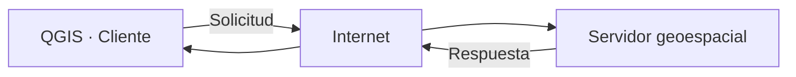
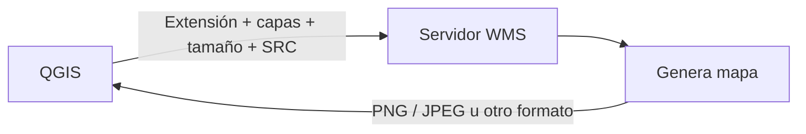
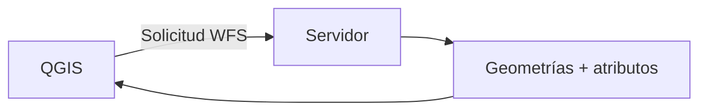
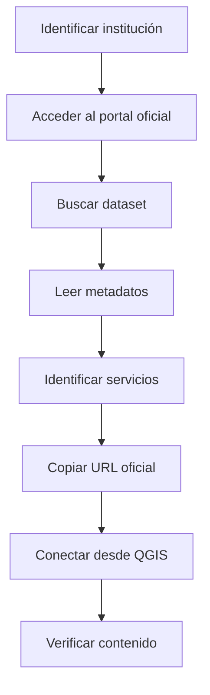
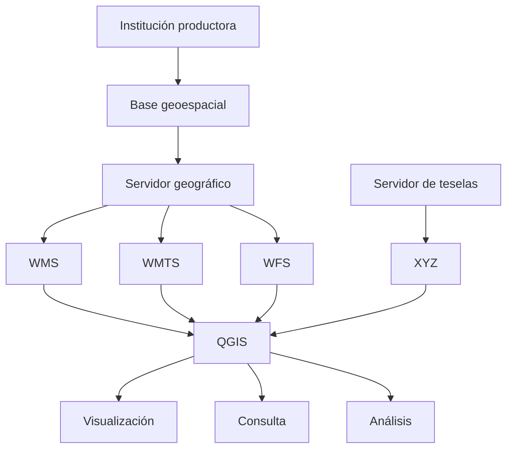
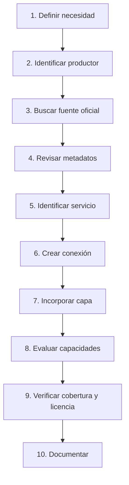

# 2.11 Conectar información disponible en internet

!!! abstract "Objetivos de aprendizaje"

    Al finalizar esta lección, el estudiante será capaz de:

    - Comprender que QGIS puede consumir información geográfica alojada en **servidores remotos**.
    - Diferenciar entre una fuente local y una fuente disponible mediante internet.
    - Reconocer el papel de las **Infraestructuras de Datos Espaciales (IDE)** y los geoportales institucionales.
    - Comprender qué significa consumir un **servicio geoespacial**.
    - Diferenciar servicios **XYZ, WMS, WMTS y WFS**.
    - Reconocer la diferencia fundamental entre una **imagen cartográfica servida** y una **entidad geográfica accesible como vector**.
    - Comprender que WMS y WMTS están orientados principalmente a la **visualización de mapas**.
    - Comprender que WFS permite acceder a **entidades y atributos vectoriales**.
    - Reconocer que un servicio XYZ entrega información organizada mediante **teselas**.
    - Incorporar una conexión XYZ en QGIS.
    - Crear una conexión WMS/WMTS.
    - Explorar las capas publicadas por un servidor mediante sus capacidades.
    - Incorporar una capa WMS o WMTS en un proyecto.
    - Crear una conexión WFS.
    - Consultar atributos y seleccionar entidades obtenidas mediante WFS.
    - Diferenciar las capacidades de identificación de un WMS de las posibilidades analíticas de una capa vectorial WFS.
    - Revisar la **cobertura espacial, temática y temporal** de una fuente remota.
    - Revisar productor, fecha, actualización, escala, resolución, licencia y atribución.
    - Comprender que una URL pública no implica automáticamente **uso irrestricto**.
    - Reconocer la dependencia de conexión, servidor, disponibilidad y rendimiento de los servicios remotos.
    - Comprender qué información queda guardada dentro de un proyecto QGIS y qué información continúa dependiendo del servidor.
    - Evaluar si una fuente remota es apropiada como:
        - referencia visual;
        - fuente de consulta;
        - fuente analítica;
        - fuente de datos descargables.
    - Incorporar una fuente institucional u oficial y justificar qué puede y qué no puede hacerse con ella.
    - Documentar correctamente una conexión geoespacial utilizada en un proyecto.

!!! note "Antes de empezar"

    - **Entorno:** QGIS con el perfil `curso-qgis`. Los procedimientos toman como referencia **QGIS 3.44**; algunos nombres pueden variar ligeramente según el idioma o versión instalada.
    - **Punto de partida:** haber completado la [lección 2.10](10-explorar-raster.md), comprendiendo ya la diferencia entre datos vectoriales y ráster.
    - **Conectividad:** esta lección requiere conexión a internet.
    - **Fuente recomendada:** utilizar un geoportal, IDE o servicio publicado por una institución pública, académica o técnica reconocida.
    - **Ejemplo territorial:** puede utilizarse una fuente disponible en [GeoBolivia](https://geo.gob.bo/) u otra institución oficial con información del área de estudio.
    - **Importante:** las URL de los servicios pueden modificarse con el tiempo; por eso deben obtenerse desde el portal o los metadatos vigentes de la institución.
    - **Principio de trabajo:** no utilizaremos una capa remota únicamente porque “se vea bien”; revisaremos quién la produce, qué contiene y qué permite hacer.
    - **Tiempo orientativo:** entre **120 y 150 minutos**, incluida la práctica.

---

## El SIG ya no depende únicamente de archivos locales

Hasta ahora hemos trabajado principalmente con archivos almacenados en nuestro equipo:

```text
GeoPackage
Shapefile
GeoJSON
GeoTIFF
CSV
```

Por ejemplo:

```text
datos/
├── distritos.gpkg
├── equipamientos.gpkg
└── imagen.tif
```

Pero una gran cantidad de información geográfica actualmente se publica mediante internet.

En lugar de tener:

```text
ARCHIVO LOCAL
     ↓
QGIS
```

podemos tener:

```text
SERVIDOR REMOTO
      ↓
   INTERNET
      ↓
     QGIS
```

La información permanece alojada en otra infraestructura.

QGIS actúa como:

```text
CLIENTE
```

que solicita información a un:

```text
SERVIDOR
```

### Cliente y servidor

Podemos representarlo así:



QGIS puede solicitar:

- mapas;
- teselas;
- entidades vectoriales;
- atributos;
- coberturas;
- otros recursos.

La respuesta dependerá del tipo de servicio.

### No siempre descargamos una copia completa

Cuando agregamos una capa remota puede ocurrir que QGIS:

```text
solicite información
```

cada vez que:

- movemos el mapa;
- cambiamos de escala;
- consultamos una entidad;
- actualizamos la vista;
- ejecutamos determinadas operaciones.

Por tanto, una fuente remota no funciona necesariamente como:

```text
archivo descargado y almacenado permanentemente
```

!!! important "Conectar no significa necesariamente descargar"

    Una conexión remota puede permitir utilizar información dentro de QGIS sin que exista una copia completa de los datos dentro de nuestro proyecto.

---

## ¿Por qué se publica información geográfica mediante servicios?

Imagina una institución que administra:

```text
límites
carreteras
establecimientos
hidrografía
ortofotos
áreas protegidas
```

Podría entregar copias manuales a cada usuario.

Pero eso genera problemas:

```text
copias diferentes
versiones desactualizadas
duplicación
dificultad de actualización
```

Una alternativa consiste en mantener una fuente central y publicarla mediante servicios.

Conceptualmente:

```text
BASE INSTITUCIONAL
        │
        ▼
SERVIDOR GEOGRÁFICO
        │
        ├── WMS
        ├── WMTS
        ├── WFS
        └── otros servicios
                │
                ▼
           USUARIOS SIG
```

### Ventajas

Entre otras:

- acceso distribuido;
- actualización centralizada;
- interoperabilidad;
- reducción de copias;
- integración entre instituciones;
- publicación estandarizada.

### Limitaciones

También aparecen nuevas dependencias:

- conexión a internet;
- disponibilidad del servidor;
- velocidad;
- permisos;
- límites de consulta;
- mantenimiento institucional.

---

## Infraestructuras de Datos Espaciales

Una **Infraestructura de Datos Espaciales — IDE** busca facilitar la publicación, descubrimiento, documentación e intercambio de información geográfica.

No se limita a mostrar un mapa.

Puede integrar:

```text
datos
+
metadatos
+
servicios
+
catálogos
+
normas
+
instituciones
```

### Un geoportal no es necesariamente el servicio

Podemos entrar a un portal web y visualizar un mapa.

Pero QGIS necesita normalmente una:

```text
URL del servicio
```

por ejemplo correspondiente a:

```text
WMS
WMTS
WFS
```

El sitio web puede ser solamente la interfaz humana.

El servicio es el mecanismo mediante el cual QGIS solicita los datos.

### Portal, dataset y servicio

Conviene diferenciar:

```text
PORTAL
→ sitio donde buscamos información

DATASET
→ conjunto de datos

SERVICIO
→ mecanismo para consumirlo mediante red
```

Por ejemplo:

```text
Geoportal institucional
        ↓
Dataset: establecimientos de salud
        ↓
Servicio WMS
Servicio WFS
Descarga GeoPackage
```

El mismo dataset puede estar disponible mediante diferentes mecanismos.

---

## Antes de conectar: identificar la institución responsable

Encontrar una capa en internet no basta.

Debemos preguntarnos:

```text
¿Quién la produjo?

¿Quién la publica?

¿Es la misma institución?

¿Cuándo fue actualizada?

¿Para qué propósito fue creada?
```

### Fuente oficial y fuente de referencia

Una capa publicada por un portal institucional puede ser una fuente oficial dentro de determinado contexto.

Pero debemos revisar:

- institución productora;
- responsabilidad temática;
- fecha;
- alcance;
- metadatos.

Por ejemplo:

```text
límite municipal
```

puede estar publicado por varias instituciones.

Eso no significa que todas las versiones sean:

```text
idénticas
```

ni que tengan el mismo respaldo.

### Autoridad temática

Para cada tema debemos buscar la institución competente o productora cuando sea posible.

Por ejemplo:

```text
red vial
establecimientos de salud
límites
catastro
áreas protegidas
```

pueden tener productores diferentes.

!!! important "Oficial no significa automáticamente adecuado para cualquier análisis"

    Incluso una fuente institucional puede:

    - estar desactualizada;
    - tener una escala inadecuada;
    - cubrir solamente parte del territorio;
    - haber sido producida para otro propósito.

---

## Los principales servicios que utilizaremos

En esta lección trabajaremos con:

```text
XYZ
WMS
WMTS
WFS
```

Sus funciones principales son diferentes.

### Comparación inicial

| Servicio | Entrega principal | Uso habitual |
|---|---|---|
| XYZ | Teselas | Mapa base / visualización |
| WMS | Imágenes de mapa | Visualización cartográfica |
| WMTS | Teselas de mapa | Visualización rápida |
| WFS | Entidades vectoriales | Consulta y análisis |

Esta tabla es una simplificación inicial.

A continuación estudiaremos cada uno.

---

## Diferenciar imagen de mapa y entidades

Esta es la idea más importante de la lección.

Supongamos que observamos en QGIS:

```text
● Hospital
```

Puede parecer una entidad vectorial.

Pero si proviene de un WMS podría ser simplemente:

```text
un conjunto de píxeles dentro de una imagen enviada por el servidor
```

Visualmente:

```text
Parece:
●

Pero realmente QGIS recibió:
┌───────────────┐
│ imagen PNG    │
│ con un punto  │
└───────────────┘
```

En cambio, mediante WFS podemos recibir algo conceptualmente similar a:

```text
GEOMETRÍA:
POINT(...)

ATRIBUTOS:
id = 105
nombre = Hospital X
tipo = Segundo nivel
```

### Apariencia similar, estructura diferente

| WMS | WFS |
|---|---|
| Imagen cartográfica | Entidades |
| Píxeles | Geometrías |
| Estilo normalmente definido por servidor | Puede estilizarse localmente |
| No equivale a tener geometría vectorial local | QGIS trabaja con objetos espaciales |
| Consulta limitada a capacidades del servicio | Acceso a atributos y geometrías |
| Muy útil como referencia | Útil para análisis vectorial |

!!! danger "Ver un punto no significa tener un punto vectorial"

    Debemos distinguir siempre entre:

    ```text
    representación de una entidad
    ```

    y:

    ```text
    entidad geográfica accesible como dato
    ```

!!! captura "Captura pendiente · 2.11-01"

    - **Tipo:** Imagen (PNG) conceptual.
    - **Archivo:** `assets/images/modulo-02/2-11/2-11-01-imagen-vs-entidad.png`
    - **Qué mostrar:** el mismo contenido representado como:
        1. mapa WMS;
        2. entidades WFS.
    - **Sugerencia:** ampliar el WMS mostrando píxeles y el WFS mostrando geometría + atributos.

---

## Servicios XYZ

Las teselas XYZ son una forma muy común de distribuir mapas por internet.

El mapa se divide previamente en pequeñas imágenes denominadas:

```text
teselas
```

o:

```text
tiles
```

Conceptualmente:

```text
MAPA
┌──────┬──────┬──────┐
│tile  │tile  │tile  │
├──────┼──────┼──────┤
│tile  │tile  │tile  │
├──────┼──────┼──────┤
│tile  │tile  │tile  │
└──────┴──────┴──────┘
```

QGIS solicita únicamente las teselas necesarias para:

```text
extensión actual
+
nivel de zoom
```

### X, Y y Z

Una URL XYZ suele incluir variables similares a:

```text
{z}
{x}
{y}
```

Por ejemplo:

```text
https://servidor/tiles/{z}/{x}/{y}.png
```

Conceptualmente:

```text
z
→ nivel de zoom

x
→ columna de tesela

y
→ fila de tesela
```

QGIS sustituye automáticamente estos elementos según la vista solicitada.

### XYZ suele utilizarse como mapa base

Es habitual utilizar XYZ para:

- contexto cartográfico;
- calles;
- imágenes;
- mapas topográficos;
- fondos de referencia.

Pero eso no significa que podamos realizar sobre ellos los mismos análisis que sobre una capa vectorial.

### El mapa ya viene renderizado

Cuando recibimos una tesela de imagen:

```text
carreteras
+
edificios
+
nombres
+
colores
```

pueden estar combinados dentro del mismo gráfico.

No podemos seleccionar simplemente:

```text
solo carreteras
```

si el proveedor no las ofrece como datos separados.

---

## Crear una conexión XYZ

Podemos utilizar:

**Administrador de fuentes de datos ▸ XYZ**

o desde el panel:

**Navegador ▸ Mosaicos XYZ**

### Crear una nueva conexión

Selecciona:

**Nueva conexión**

Debemos proporcionar normalmente:

```text
Nombre
URL
```

y, cuando corresponda:

- niveles de zoom;
- autenticación;
- parámetros adicionales.

Ejemplo estructural:

```text
Nombre:
Mapa base institucional

URL:
https://servidor/.../{z}/{x}/{y}.png
```

!!! warning "No copies URL de servicios sin revisar sus condiciones"

    Algunos proveedores:

    - exigen atribución;
    - limitan solicitudes;
    - prohíben determinados usos;
    - requieren una clave;
    - restringen almacenamiento masivo de teselas.

### Añadir al proyecto

Una vez creada la conexión:

1. expande **Mosaicos XYZ**;
2. localiza la conexión;
3. haz doble clic o arrástrala al mapa.

!!! captura "Captura pendiente · 2.11-02"

    - **Tipo:** GIF animado.
    - **Archivo:** `assets/images/modulo-02/2-11/2-11-02-xyz.gif`
    - **Qué mostrar:** Navegador → Mosaicos XYZ → Nueva conexión → agregar al proyecto.
    - **Sugerencia:** mantener visible el panel de capas después de incorporar el mapa.

---

## Qué podemos hacer con un XYZ

Normalmente resulta adecuado para:

```text
orientación
referencia visual
contexto
comparación
digitalización de apoyo, cuando la licencia y precisión lo permiten
```

Pero generalmente no podemos asumir que ofrece:

```text
atributos
geometrías vectoriales individuales
consultas por campo
selecciones vectoriales
```

### Pregunta fundamental

Cuando utilizamos un XYZ debemos preguntarnos:

> ¿Estoy utilizando esta fuente para **ver contexto** o para **obtener datos analíticos**?

En muchos casos:

```text
XYZ
→ contexto
```

---

## WMS — Web Map Service

WMS significa:

```text
Web Map Service
```

Es un estándar del Open Geospatial Consortium — OGC.

Su función principal consiste en entregar:

```text
MAPAS
```

como imágenes georreferenciadas solicitadas por el cliente.

Conceptualmente:



### Qué solicita QGIS

Cuando movemos el mapa, QGIS puede solicitar algo equivalente conceptualmente a:

```text
Muéstrame:

estas capas
en esta extensión
con este tamaño
en este SRC
```

El servidor produce una imagen y la devuelve.

### El servidor mantiene los datos originales

El servidor podría tener internamente:

```text
PostGIS
GeoPackage
Shapefile
Raster
```

Pero mediante WMS nosotros recibimos principalmente:

```text
representación cartográfica
```

No necesariamente las fuentes originales.

---

## Crear una conexión WMS/WMTS

Podemos utilizar:

**Capa ▸ Añadir capa ▸ Añadir capa WMS/WMTS…**

o:

**Administrador de fuentes de datos ▸ WMS/WMTS**

o:

**Navegador ▸ WMS/WMTS ▸ Nueva conexión**

### Configuración básica

Normalmente necesitamos:

```text
Nombre
URL
```

Por ejemplo:

```text
Nombre:
IDE institucional

URL:
dirección del servicio WMS
```

Después utilizamos:

**Conectar**

QGIS consulta al servidor y recupera información sobre sus capacidades.

!!! captura "Captura pendiente · 2.11-03"

    - **Tipo:** Imagen (PNG) anotada.
    - **Archivo:** `assets/images/modulo-02/2-11/2-11-03-conexion-wms.png`
    - **Qué mostrar:** diálogo de creación de una conexión WMS/WMTS.
    - **Sugerencia:** señalar nombre, URL y botón Conectar.

---

## GetCapabilities: preguntar qué ofrece el servidor

Los servicios OGC disponen de mecanismos para describir sus capacidades.

En un WMS, una operación fundamental es:

```text
GetCapabilities
```

Conceptualmente QGIS pregunta:

> ¿Qué puedes ofrecer?

El servidor responde con información como:

- versiones;
- capas;
- títulos;
- formatos;
- sistemas de referencia;
- estilos;
- operaciones disponibles.

### No escribimos manualmente todo el catálogo

Una vez conectados, QGIS puede mostrar una estructura similar a:

```text
Servidor institucional
│
├── Límites
│   ├── Departamentos
│   ├── Provincias
│   └── Municipios
│
├── Transporte
│   ├── Red fundamental
│   └── Red secundaria
│
└── Servicios
    ├── Salud
    └── Educación
```

Esta estructura procede de lo que el servicio publica.

### Seleccionar una capa

Podemos elegir, por ejemplo:

```text
Establecimientos de salud
```

y añadirla al proyecto.

!!! captura "Captura pendiente · 2.11-04"

    - **Tipo:** Imagen (PNG).
    - **Archivo:** `assets/images/modulo-02/2-11/2-11-04-capabilities-wms.png`
    - **Qué mostrar:** catálogo de capas devuelto por un servidor WMS.
    - **Sugerencia:** destacar árbol, nombre de capa, título, formato y SRC.

---

## Identificar información en un WMS

Algunos WMS permiten realizar consultas mediante operaciones como:

```text
GetFeatureInfo
```

Desde QGIS podemos utilizar:

**Identificar objetos espaciales**

sobre una capa WMS cuando el servidor lo admite.

El servidor puede devolver:

- nombre;
- código;
- atributos;
- información descriptiva.

### Pero sigue sin ser necesariamente una capa vectorial

Aunque podamos hacer clic y obtener:

```text
nombre = Hospital X
```

eso no significa que QGIS haya recibido:

```text
POINT(...)
```

como entidad vectorial editable o analizable.

!!! important "Consultar una imagen no la convierte en vector"

    WMS puede proporcionar información asociada a una posición mediante `GetFeatureInfo`.

    Esto es diferente de recibir las entidades mediante WFS.

---

## WMS como referencia cartográfica

WMS es especialmente útil para incorporar:

- cartografía institucional;
- ortofotos;
- mapas temáticos;
- límites publicados;
- capas de referencia.

### Ventaja

El servidor controla la representación.

Por ejemplo:

```text
colores
grosor
etiquetas
símbolos
```

pueden estar definidos institucionalmente.

### Limitación

Nosotros podemos tener poco control sobre:

```text
simbología interna
```

porque recibimos el resultado renderizado.

Si necesitamos:

```text
clasificar
filtrar
simbolizar por atributos
seleccionar entidades
```

podría ser más apropiado disponer de una fuente vectorial o WFS.

---

## WMTS — Web Map Tile Service

WMTS significa:

```text
Web Map Tile Service
```

También es un estándar OGC.

Al igual que WMS está orientado principalmente a:

```text
visualización de mapas
```

pero utiliza una estructura de:

```text
teselas
```

preparadas para diferentes niveles de escala.

### Diferencia conceptual respecto de WMS

WMS:

```text
QGIS solicita un mapa
        ↓
servidor lo genera
        ↓
servidor lo entrega
```

WMTS:

```text
mapas previamente teselados
        ↓
QGIS solicita teselas existentes
        ↓
servidor las entrega
```

Conceptualmente:

```text
WMS
→ producir + transmitir

WMTS
→ localizar tesela + transmitir
```

Por ello WMTS puede resultar más eficiente para navegación cartográfica intensiva.

### Niveles de escala

Las teselas se preparan previamente para:

```text
zoom 1
zoom 2
zoom 3
...
```

Cada nivel utiliza una matriz de teselas.

---

## WMS y WMTS comparados

| Característica | WMS | WMTS |
|---|---|---|
| Tipo principal | Imagen de mapa | Teselas de mapa |
| Generación | Habitualmente bajo solicitud | Normalmente pregenerada |
| Escalas | Más flexible | Niveles predefinidos |
| Rendimiento | Variable | Generalmente alto |
| Uso | Mapas temáticos | Navegación / mapas base |
| Datos vectoriales directos | No | No |

!!! success "Idea principal"

    Tanto WMS como WMTS están orientados fundamentalmente a:

    ```text
    VER MAPAS
    ```

    no a recibir directamente las geometrías originales para análisis vectorial.

---

## XYZ y WMTS no son exactamente lo mismo

Ambos utilizan teselas, pero no debemos tratarlos como sinónimos.

### WMTS

Es un estándar OGC con mecanismos normalizados para describir:

- capas;
- matrices;
- escalas;
- formatos;
- capacidades.

### XYZ

Utiliza habitualmente una estructura de URL:

```text
{z}/{x}/{y}
```

y es extremadamente común en mapas web.

Conceptualmente:

```text
WMTS
→ servicio de teselas estandarizado

XYZ
→ esquema sencillo de acceso a teselas
```

### Desde la perspectiva del estudiante

Ambos pueden parecer:

```text
mapa base rápido
```

pero debemos conocer su procedencia y reglas de uso.

---

## WFS — Web Feature Service

WFS significa:

```text
Web Feature Service
```

La diferencia conceptual es fundamental.

En lugar de pedir:

```text
una imagen del mapa
```

solicitamos:

```text
entidades geográficas
```

Conceptualmente:



Por ejemplo:

```text
Entidad 1
├── POINT(...)
├── nombre
├── categoría
└── código

Entidad 2
├── POINT(...)
├── nombre
├── categoría
└── código
```

QGIS puede tratarlas como información vectorial.

---

## Qué podemos hacer con WFS

Dependiendo de las capacidades del servidor, podemos:

- consultar la tabla de atributos;
- seleccionar entidades;
- identificar objetos;
- aplicar simbología local;
- utilizar expresiones;
- filtrar;
- realizar análisis vectorial;
- exportar entidades a una fuente local.

### Ejemplo

Supongamos que mediante WFS incorporamos:

```text
establecimientos_salud
```

Podemos abrir la tabla:

| id | nombre | nivel | municipio |
|---:|---|---|---|
| 1 | Centro A | Primer nivel | Sacaba |
| 2 | Hospital B | Segundo nivel | Cochabamba |

Ahora podemos utilizar:

```qgis
"municipio" = 'Sacaba'
```

y seleccionar entidades.

Eso sería imposible si únicamente tuviéramos:

```text
píxeles de una imagen WMS
```

---

## Crear una conexión WFS

Podemos utilizar:

**Capa ▸ Añadir capa ▸ Añadir capa WFS / OGC API - Objetos espaciales…**

o el:

**Administrador de fuentes de datos**

o:

**Navegador ▸ WFS / OGC API - Features**

### Configuración

Normalmente necesitamos:

```text
Nombre
URL
```

Después:

```text
Conectar
```

QGIS solicita las capacidades del servicio.

!!! captura "Captura pendiente · 2.11-05"

    - **Tipo:** Imagen (PNG) anotada.
    - **Archivo:** `assets/images/modulo-02/2-11/2-11-05-conexion-wfs.png`
    - **Qué mostrar:** diálogo de conexión WFS.
    - **Sugerencia:** señalar URL, conexión y listado de capas disponibles.

### Elegir una capa

El servidor puede publicar múltiples conjuntos:

```text
municipios
carreteras
establecimientos
áreas protegidas
```

Seleccionamos uno y lo añadimos.

### La carga puede tardar

El rendimiento depende de:

- servidor;
- cantidad de entidades;
- complejidad geométrica;
- conexión;
- filtros;
- paginación;
- límites del servicio.

---

## WFS no significa automáticamente edición remota

Existe también:

```text
WFS-T
```

donde la letra:

```text
T
```

hace referencia a capacidades transaccionales.

Esto puede permitir operaciones como:

- crear;
- modificar;
- eliminar entidades;

si:

- el servidor lo admite;
- tenemos permisos;
- la configuración lo permite.

!!! warning "No asumas que puedes editar un WFS"

    Una capa WFS puede ser completamente de solo lectura.

    La capacidad de consulta y la capacidad de edición son cosas diferentes.

---

## Comparación completa

| Característica | XYZ | WMS | WMTS | WFS |
|---|---:|---:|---:|---:|
| Visualizar mapa | Sí | Sí | Sí | Sí |
| Teselas | Sí | No necesariamente | Sí | No |
| Imagen servida | Sí, habitualmente | Sí | Sí | No como función principal |
| Geometría vectorial accesible | No | No directamente | No | Sí |
| Tabla de atributos vectorial | No | No como capa vectorial | No | Sí |
| Selección por expresión | No sobre entidades originales | No | No | Sí |
| Simbología local completa | Muy limitada | Limitada | Limitada | Sí |
| Análisis vectorial | No directamente | No directamente | No directamente | Sí |
| Dependencia de internet | Sí | Sí | Sí | Sí |
| Adecuado como mapa base | Sí | Sí | Sí | Puede ser, pero no es su finalidad principal |

---

## No confundir WMS con WFS

Este error es muy frecuente.

Considera dos capas visualmente iguales:

```text
WMS establecimientos
WFS establecimientos
```

En el mapa pueden parecer:

```text
● ● ● ●
```

Pero internamente:

```text
WMS
↓
imagen

WFS
↓
entidades
```

### Prueba sencilla

Pregunta:

```text
¿Puedo abrir una tabla de atributos con entidades individuales?
```

Si trabajamos con WFS:

```text
normalmente sí
```

Si trabajamos con WMS:

```text
no como una capa vectorial convencional
```

### Otra prueba

Pregunta:

```text
¿Puedo seleccionar todos los establecimientos cuyo tipo sea Hospital?
```

WFS:

```text
sí, si el atributo está disponible
```

WMS:

```text
no mediante una selección vectorial convencional
```

---

## Obtener información de una fuente oficial

No deberíamos empezar copiando cualquier URL encontrada en un foro.

El procedimiento recomendado es:



### 1. Identificar la institución

Por ejemplo:

```text
¿Quién debería producir esta información?
```

### 2. Buscar el portal institucional

Puede ser:

```text
IDE
Geoportal
Catálogo geográfico
Portal de datos abiertos
```

### 3. Buscar el dataset

Por ejemplo:

```text
establecimientos de salud
límites municipales
red vial
áreas protegidas
```

### 4. Revisar metadatos

Antes de conectar registra:

```text
Título:
Institución:
Fecha:
Descripción:
Cobertura:
Escala:
Licencia:
```

### 5. Identificar servicios

Busca opciones como:

```text
WMS
WMTS
WFS
```

### 6. Copiar la URL del servicio

No necesariamente la URL de la página web.

### 7. Crear la conexión

Desde QGIS.

### 8. Verificar

Comprueba que la capa corresponde realmente al dataset esperado.

---

## Ejemplo institucional: GeoBolivia

Para ejercicios en Bolivia puede explorarse:

[GeoBolivia](https://geo.gob.bo/)

El portal reúne recursos geoespaciales y puede servir como punto de partida para localizar datasets, mapas y servicios.

!!! note "Las URL de servicios deben obtenerse del recurso vigente"

    En el material del curso es preferible no fijar una URL de WMS/WFS que puede cambiar posteriormente.

    El estudiante debe aprender el procedimiento:

    ```text
    portal
    → recurso
    → metadatos
    → servicio vigente
    ```

    Esto hace que la práctica continúe siendo válida incluso cuando cambie la infraestructura tecnológica del proveedor.

### Datos fundamentales

Dentro del contexto de la Infraestructura de Datos Espaciales del Estado Plurinacional de Bolivia pueden encontrarse temas fundamentales como:

- límites;
- localidades;
- red caminera;
- establecimientos de salud;
- establecimientos educativos;
- cuerpos de agua;
- áreas protegidas;
- cobertura y uso de la tierra;
- otros conjuntos territoriales.

Para el ejercicio podemos seleccionar uno cuyo productor y metadatos estén claramente identificados.

---

## Revisar la cobertura espacial

Que una capa tenga el nombre:

```text
carreteras
```

no significa necesariamente que cubra:

```text
todo Bolivia
```

Puede cubrir:

- una ciudad;
- un departamento;
- una cuenca;
- un municipio;
- una región específica.

### Revisar extensión

Después de cargar la capa utiliza:

**Zoom a la capa**

y observa:

```text
¿hasta dónde llega?
```

También revisa la descripción del servicio.

### Cobertura administrativa

Puede indicar:

```text
Nacional
Departamental
Municipal
```

### Cobertura irregular

Algunas fuentes contienen información solamente para zonas donde se realizaron levantamientos.

Por tanto:

```text
ausencia de objetos
```

no implica automáticamente:

```text
ausencia del fenómeno
```

!!! important "Ausencia de datos no significa ausencia en el territorio"

    Una zona vacía puede indicar simplemente que el proveedor no posee cobertura allí.

---

## Revisar la cobertura temporal

También debemos preguntar:

```text
¿De cuándo es la información?
```

Un mapa puede mostrar:

```text
red vial
```

pero haber sido actualizado por última vez hace varios años.

### Fecha de publicación no siempre es fecha del dato

Debemos distinguir:

```text
fecha de publicación
fecha de actualización
fecha de levantamiento
periodo de referencia
```

Por ejemplo:

```text
Publicado:
2026

Datos:
levantamiento 2022
```

Son cosas diferentes.

### Servicios dinámicos

Una ventaja de los servicios remotos es que el proveedor puede actualizar la fuente central.

Pero:

> **No debemos asumir que toda capa remota está actualizada automáticamente.**

La política de actualización depende del proveedor.

---

## Revisar la cobertura temática

Un servicio denominado:

```text
establecimientos de salud
```

puede incluir:

- públicos;
- privados;
- seguridad social;
- determinados niveles;
- solamente establecimientos activos.

O puede incluir solamente una parte de ellos.

Debemos revisar:

```text
qué está incluido
qué está excluido
```

### Una capa necesita definición

No basta el nombre.

Busca:

```text
descripción
alcance
método
atributos
clasificación
```

---

## Escala y resolución siguen siendo importantes

Que una fuente esté publicada mediante internet no elimina los problemas de escala.

Una capa podría haber sido producida para:

```text
1:250 000
```

y no ser apropiada para trabajo predial.

### WMS tampoco crea precisión nueva

Aunque hagamos zoom:

```text
1:1 000
```

una fuente de escala pequeña no adquiere mágicamente precisión catastral.

Es el mismo principio visto con los rásteres:

> **Acercarse visualmente no crea detalle que la fuente nunca tuvo.**

### WMTS y XYZ

También poseen niveles de zoom.

Pero el máximo nivel disponible:

```text
no implica automáticamente exactitud equivalente
```

Debemos revisar la fuente original.

---

## Metadatos antes de análisis

Una fuente remota debería evaluarse mediante información como:

| Elemento | Pregunta |
|---|---|
| Productor | ¿Quién creó los datos? |
| Publicador | ¿Quién los distribuye? |
| Fecha | ¿Cuándo fueron actualizados? |
| Descripción | ¿Qué representan? |
| Cobertura | ¿Dónde existen datos? |
| Escala/resolución | ¿A qué nivel son apropiados? |
| SRC | ¿Qué sistemas admite? |
| Licencia | ¿Cómo pueden utilizarse? |
| Atribución | ¿Cómo debe citarse la fuente? |
| Servicio | ¿WMS, WMTS, WFS, XYZ? |

!!! success "Metadatos primero"

    Antes de decidir que una fuente es apta para un análisis debemos conocer su procedencia y limitaciones.

---

## Atribución y licencia

Una capa visible públicamente no significa:

```text
uso libre sin condiciones
```

Puede existir una licencia que establezca:

- atribución obligatoria;
- restricciones comerciales;
- limitaciones de redistribución;
- condiciones de modificación;
- límites de descarga;
- términos específicos de uso.

### Atribución

Una atribución puede exigir algo similar a:

```text
Fuente: Institución X, año.
```

o incluir:

- copyright;
- licencia;
- enlace;
- nombre del dataset.

### Registrar la atribución desde el principio

No esperes hasta elaborar el mapa final.

Incluye dentro de tu ficha:

```text
Fuente:
Institución:
Licencia:
Atribución:
URL:
Fecha de consulta:
```

!!! warning "Servicio accesible no significa datos sin derechos"

    La disponibilidad técnica y el permiso legal de uso son aspectos diferentes.

---

## Dependencia del servicio

Una capa local puede seguir funcionando sin internet.

Una capa remota depende de elementos externos.

```text
QGIS
  │
  ▼
red local
  │
  ▼
internet
  │
  ▼
servidor remoto
  │
  ▼
base de datos
```

Si cualquiera falla:

```text
la capa puede no cargar
```

### Posibles problemas

- sin conexión;
- servidor caído;
- mantenimiento;
- URL modificada;
- certificado inválido;
- autenticación;
- lentitud;
- límite de peticiones;
- recurso eliminado.

### El proyecto no contiene necesariamente los datos

Guardar:

```text
proyecto.qgz
```

con una capa WMS no significa que la imagen completa quede incorporada dentro del archivo QGZ.

El proyecto puede guardar principalmente:

```text
configuración
+
referencia al servicio
```

Al abrirlo nuevamente QGIS puede necesitar volver a acceder al servidor.

!!! danger "Proyecto guardado no significa proyecto autónomo"

    Si un proyecto depende de servicios remotos, debemos comprobar qué sucederá cuando:

    ```text
    no exista internet
    ```

    o:

    ```text
    el servidor no responda
    ```

---

## Realizar una prueba sin conexión

Una práctica útil consiste en:

1. guardar el proyecto;
2. cerrar QGIS;
3. desactivar temporalmente la conexión de red;
4. volver a abrir el proyecto.

Observa qué capas:

```text
siguen disponibles
```

y cuáles:

```text
dependen de internet
```

### Resultado esperado

Archivos locales:

```text
normalmente disponibles
```

Servicios remotos:

```text
pueden no cargar
```

Esto permite comprender la arquitectura real del proyecto.

!!! captura "Captura pendiente · 2.11-06"

    - **Tipo:** Imagen (PNG) comparativa.
    - **Archivo:** `assets/images/modulo-02/2-11/2-11-06-dependencia-internet.png`
    - **Qué mostrar:** el mismo proyecto con conexión y sin conexión.
    - **Sugerencia:** distinguir claramente capas locales y remotas.

---

## Rendimiento y cantidad de información

Un WFS con:

```text
500 entidades
```

puede funcionar rápidamente.

Uno con:

```text
5 000 000 entidades
```

puede resultar mucho más exigente.

### Factores de rendimiento

- cantidad de entidades;
- complejidad geométrica;
- velocidad de servidor;
- ancho de banda;
- filtros;
- tamaño de respuesta;
- paginación.

### No solicites más información de la necesaria

Si necesitamos solamente:

```text
Municipio de Sacaba
```

puede ser innecesario cargar:

```text
todas las entidades nacionales
```

cuando el servicio permite filtrar.

!!! tip "Reduce el universo cuando sea posible"

    Trabajar con subconjuntos puede mejorar:

    - velocidad;
    - estabilidad;
    - claridad;
    - reproducibilidad.

---

## Consultar frente a descargar

Una fuente puede utilizarse de diferentes maneras.

### Consulta remota

```text
SERVIDOR
   ↓
QGIS
```

Ventajas:

- fuente central;
- posible actualización;
- no necesitamos duplicar todo.

Limitaciones:

- dependencia de red;
- rendimiento;
- cambios externos.

### Copia local

Cuando el servicio, licencia y necesidades lo permiten, podemos exportar determinadas entidades vectoriales a:

```text
GeoPackage
```

Conceptualmente:

```text
WFS
 ↓
selección
 ↓
exportar
 ↓
copia local
```

### Pero la copia deja de actualizarse sola

Si exportamos:

```text
2026-09-17
```

y el servidor cambia:

```text
2026-10-01
```

nuestra copia seguirá representando:

```text
la versión obtenida anteriormente
```

Por eso debemos registrar:

```text
fecha de descarga
```

---

## WMS no debe convertirse mentalmente en una descarga vectorial

Si tenemos:

```text
WMS de límites municipales
```

no debemos asumir:

> “Ya tengo los polígonos municipales”.

Tenemos:

```text
una representación cartográfica
```

de esos límites.

Si necesitamos:

- intersecciones;
- áreas;
- selección espacial;
- geoprocesamiento;

deberíamos buscar:

```text
WFS
descarga vectorial
API de entidades
```

u otra fuente equivalente.

---

## Identificación no equivale a análisis

Un WMS puede permitir:

```text
clic
↓
nombre del municipio
```

Esto es una consulta.

Pero no necesariamente podemos ejecutar:

```text
Seleccionar municipios
donde población > 50 000
```

sobre esa imagen.

En WFS sí podemos trabajar directamente con atributos cuando están disponibles.

### Tres niveles conceptuales

```text
VER
↓
CONSULTAR
↓
ANALIZAR
```

XYZ puede permitir principalmente:

```text
VER
```

WMS puede permitir:

```text
VER
+
algunas consultas
```

WFS puede permitir:

```text
VER
+
CONSULTAR
+
ANALIZAR ENTIDADES
```

Esta simplificación resulta útil para decidir qué servicio necesitamos.

---

## El estilo del servidor y el estilo del cliente

En WMS:

```text
servidor
→ suele definir el mapa
```

Puede haber varios estilos publicados, pero el cliente trabaja con las opciones que el servicio expone.

En WFS:

```text
servidor
→ entrega entidades

QGIS
→ puede construir la simbología
```

Por ejemplo:

```text
WFS establecimientos
```

podemos representarlo mediante:

```text
Categorizado por nivel
```

como aprendimos en la lección 2.9.

### Relación con las lecciones anteriores

Con una capa WFS podemos aplicar:

```text
2.7
→ revisar atributos

2.8
→ seleccionar y filtrar

2.9
→ simbolizar y etiquetar
```

porque disponemos de entidades y atributos.

---

## Sistemas de referencia en servicios web

Un servicio puede admitir uno o varios SRC.

En WMS, QGIS puede solicitar el mapa en un sistema compatible.

En WFS, las geometrías también poseen una referencia espacial.

### QGIS puede realizar transformaciones

Si el servicio utiliza:

```text
EPSG A
```

y nuestro proyecto:

```text
EPSG B
```

QGIS puede realizar transformaciones para la visualización.

Pero debemos seguir verificando:

- SRC de la fuente;
- SRC solicitado;
- SRC del proyecto.

### Problemas posibles

Si un servicio no admite el sistema solicitado:

- puede fallar;
- QGIS puede utilizar otro;
- podemos necesitar modificar la configuración.

Los principios estudiados en la lección **2.6** continúan siendo válidos.

---

## Identificar qué permite realmente un servicio

Después de incorporar una capa, debemos probar sistemáticamente sus capacidades.

### Prueba 1. ¿Puedo verla?

```text
Sí / No
```

### Prueba 2. ¿Puedo identificar elementos?

Utiliza:

**Identificar objetos espaciales**

### Prueba 3. ¿Tiene tabla de atributos vectorial?

Intenta:

**Abrir tabla de atributos**

### Prueba 4. ¿Puedo seleccionar entidades?

Prueba:

```text
selección manual
selección por expresión
```

### Prueba 5. ¿Puedo modificar simbología?

Comprueba si puedes aplicar:

```text
categorizado
graduado
```

sobre atributos.

### Prueba 6. ¿Puedo exportarla?

Cuando corresponda y las condiciones de uso lo permitan:

```text
Exportar
```

### Matriz de evaluación

| Capacidad | Resultado |
|---|---|
| Visualizar | |
| Identificar | |
| Tabla de atributos | |
| Seleccionar | |
| Filtrar | |
| Simbolizar localmente | |
| Analizar | |
| Exportar | |

Esto ayuda a identificar qué tipo de recurso tenemos realmente.

---

## Comparar WMS y WFS del mismo tema

Cuando una institución ofrece ambos servicios para un mismo dataset podemos realizar una comparación muy útil.

Supongamos:

```text
Establecimientos de salud WMS
```

y:

```text
Establecimientos de salud WFS
```

### WMS

Podemos observar:

```text
símbolos
etiquetas
distribución
```

### WFS

Podemos observar:

```text
geometrías
atributos
categorías
valores
```

y ejecutar:

```qgis
"municipio" = 'Sacaba'
```

### Coincidencia visual

Si ambos provienen del mismo dataset deberían ser espacialmente coherentes.

Pero su propósito es diferente.

!!! captura "Captura pendiente · 2.11-07"

    - **Tipo:** Imagen (PNG) comparativa.
    - **Archivo:** `assets/images/modulo-02/2-11/2-11-07-wms-vs-wfs.png`
    - **Qué mostrar:** misma temática cargada por WMS y WFS.
    - **Sugerencia:** para WFS mostrar tabla de atributos; para WMS mostrar resultado de Identificar.

---

## Evaluar una fuente antes de adoptarla

Una fuente remota debería pasar por una pequeña evaluación.

### 1. Autoridad

```text
¿Quién produce los datos?
```

### 2. Actualidad

```text
¿Cuándo fueron actualizados?
```

### 3. Cobertura

```text
¿Qué territorio incluye?
```

### 4. Resolución o escala

```text
¿Es adecuada para nuestro nivel de análisis?
```

### 5. Contenido

```text
¿Qué objetos y atributos incluye?
```

### 6. Servicio

```text
XYZ / WMS / WMTS / WFS
```

### 7. Uso permitido

```text
¿Qué indica la licencia?
```

### 8. Dependencia

```text
¿Qué ocurre si el servidor deja de estar disponible?
```

---

## Construir una ficha de fuente remota

Podemos utilizar:

| Elemento | Información |
|---|---|
| Nombre del recurso | |
| Institución productora | |
| Institución publicadora | |
| Portal | |
| URL del servicio | |
| Tipo de servicio | |
| Fecha del dato | |
| Fecha de actualización | |
| Cobertura | |
| Escala/resolución | |
| SRC | |
| Licencia | |
| Atribución | |
| Fecha de consulta | |
| Observaciones | |

Esta ficha debe acompañar cualquier recurso remoto importante.

### La fecha de consulta es especialmente útil

Los servicios cambian.

Registrar:

```text
Consultado:
2026-09-17
```

permite contextualizar posteriormente qué versión o disponibilidad encontramos.

---

## Dependencia y reproducibilidad

Supongamos que elaboramos un análisis utilizando un WFS remoto.

Un año después:

```text
la fuente fue actualizada
```

Si ejecutamos la misma consulta podríamos obtener resultados diferentes.

### Una consulta reproducible necesita versión o fecha

Cuando sea importante conservar exactamente el resultado utilizado podemos:

- registrar fecha;
- exportar una copia local autorizada;
- conservar metadatos;
- documentar filtros;
- registrar URL.

### Datos vivos frente a instantánea

Podemos pensar:

```text
SERVICIO REMOTO
→ datos potencialmente cambiantes

COPIA LOCAL
→ instantánea de un momento
```

Ambos enfoques tienen ventajas.

---

## Qué hacer si un servicio deja de funcionar

Antes de concluir que:

```text
los datos desaparecieron
```

comprueba:

1. conexión a internet;
2. URL;
3. portal institucional;
4. certificado;
5. autenticación;
6. disponibilidad general;
7. cambios anunciados por el proveedor.

### No modificar inmediatamente la configuración

Podría ser solamente:

```text
mantenimiento temporal
```

### Documentar servicios importantes

Para conexiones críticas conserva:

```text
nombre
URL
institución
tipo
fecha de consulta
```

Esto facilita diagnosticar problemas posteriores.

---

## Arquitectura conceptual

Podemos resumir el ecosistema así:



Pero no todos los servicios alimentan todas las capacidades del mismo modo.

### Visualización

```text
XYZ
WMS
WMTS
WFS
```

pueden visualizarse.

### Consulta de entidades

Principalmente:

```text
WFS
```

y determinadas consultas proporcionadas por WMS.

### Análisis vectorial

Necesitamos normalmente:

```text
entidades y atributos
```

por ejemplo mediante:

```text
WFS
```

o una descarga vectorial.

---

## No utilizar internet como sustituto de los metadatos

La facilidad de conexión puede crear un hábito peligroso:

```text
buscar
↓
cargar
↓
usar
```

El procedimiento correcto debería ser:

```text
buscar
↓
identificar fuente
↓
leer metadatos
↓
conectar
↓
verificar
↓
usar
```

!!! danger "El mapa visible no demuestra calidad"

    Un servicio puede cargar perfectamente y contener información:

    - antigua;
    - incompleta;
    - generalizada;
    - fuera de escala;
    - producida para otro propósito.

---

## Procedimiento recomendado para una fuente remota

Podemos estructurar el trabajo en diez etapas.



### 1. Definir la necesidad

Pregúntate:

```text
¿Necesito solamente contexto?

¿Necesito atributos?

¿Necesito geometrías?

¿Necesito analizar?

¿Necesito una copia local?
```

### 2. Identificar productor

Determina qué institución debería generar la información.

### 3. Buscar fuente oficial

Accede al geoportal o catálogo correspondiente.

### 4. Revisar metadatos

Comprueba:

```text
descripción
fecha
cobertura
escala
licencia
```

### 5. Identificar servicio

Determina si existe:

```text
XYZ
WMS
WMTS
WFS
```

### 6. Crear conexión

Configura QGIS.

### 7. Incorporar capa

Añádela al proyecto.

### 8. Evaluar capacidades

Prueba:

```text
ver
identificar
seleccionar
filtrar
exportar
analizar
```

### 9. Verificar cobertura y licencia

No confundas disponibilidad técnica con aptitud para el análisis.

### 10. Documentar

Guarda la ficha de fuente.

---

## Ejemplo aplicado: una capa institucional

Supongamos que necesitamos información oficial sobre:

```text
establecimientos de salud
```

### Necesidad

Queremos:

```text
visualizar
consultar atributos
seleccionar establecimientos
comparar con nuestra información municipal
```

### Búsqueda

Localizamos un geoportal institucional.

Encontramos:

```text
Dataset:
Establecimientos de salud
```

y observamos que dispone de:

```text
WMS
WFS
```

### WMS

Lo incorporamos.

Podemos:

```text
ver la distribución
consultar información si GetFeatureInfo está habilitado
```

Pero no contamos con una tabla vectorial convencional.

### WFS

Incorporamos el mismo tema mediante WFS.

Ahora podemos:

```text
abrir tabla
seleccionar
filtrar
simbolizar
analizar
```

### Conclusión

Para:

```text
referencia cartográfica
```

el WMS puede resultar suficiente.

Para:

```text
análisis de atributos y geometrías
```

preferimos el WFS cuando está disponible y resulta adecuado.

---

## Reto práctico

!!! example "Reto 2.11 — Incorporar una fuente oficial y determinar qué permite analizar"

    **Situación:** necesitas incorporar al proyecto una fuente geoespacial publicada por una institución oficial o técnicamente responsable.

    No basta con agregarla al mapa.

    Debes identificar:

    - quién la produce;
    - cómo se publica;
    - qué cobertura tiene;
    - qué información contiene;
    - qué uso permite;
    - qué dependencia genera.

    **1. Definir el tema**

    Selecciona uno:

    ```text
    límites administrativos
    establecimientos de salud
    establecimientos educativos
    red vial
    hidrografía
    áreas protegidas
    cobertura del suelo
    ```

    u otro tema relevante para el curso.

    **2. Identificar una institución**

    Registra:

    ```text
    Institución:
    Portal:
    Competencia o relación con el tema:
    ```

    Puede utilizarse como punto de partida:

    [GeoBolivia](https://geo.gob.bo/)

    u otra fuente oficial.

    **3. Localizar el dataset**

    Registra:

    ```text
    Nombre:
    Descripción:
    Productor:
    Publicador:
    Fecha:
    Cobertura:
    ```

    **4. Revisar los servicios disponibles**

    Determina si existe:

    ```text
    XYZ
    WMS
    WMTS
    WFS
    descarga directa
    ```

    Completa:

    | Mecanismo | Disponible |
    |---|---|
    | XYZ | |
    | WMS | |
    | WMTS | |
    | WFS | |
    | Descarga | |

    **5. Crear una conexión remota**

    Elige al menos:

    ```text
    WMS/WMTS
    ```

    o:

    ```text
    WFS
    ```

    según lo disponible.

    Registra la URL utilizada.

    **6. Incorporar la capa**

    Añádela al proyecto:

    ```text
    proyectos/reto_2-11_servicios_web.qgz
    ```

    Comprueba:

    - extensión;
    - ubicación;
    - SRC;
    - nombre;
    - contenido.

    **7. Evaluar capacidades**

    Completa:

    | Prueba | Resultado |
    |---|---|
    | Visualizar | |
    | Identificar | |
    | Tabla de atributos | |
    | Seleccionar | |
    | Filtrar | |
    | Simbolizar localmente | |
    | Analizar geometrías | |
    | Exportar | |

    **8. Determinar qué tipo de recurso recibes**

    Responde:

    ```text
    ¿Es principalmente una imagen cartográfica?

    ¿Son teselas?

    ¿Son entidades vectoriales?

    ¿Tiene atributos accesibles?
    ```

    **9. Revisar cobertura espacial**

    Registra:

    ```text
    Nacional / departamental / municipal / otra:
    ```

    Describe cualquier vacío de cobertura observado.

    **10. Revisar cobertura temporal**

    Registra:

    ```text
    Fecha del dato:
    Fecha de actualización:
    Fecha de consulta:
    ```

    Si no está disponible, indícalo explícitamente.

    **11. Revisar escala o resolución**

    Determina si existe información sobre:

    ```text
    escala
    resolución
    precisión
    ```

    Explica para qué nivel de análisis consideras apropiada la fuente.

    **12. Revisar licencia y atribución**

    Registra:

    ```text
    Licencia:
    Atribución:
    Restricciones:
    ```

    Si la información no está disponible, indícalo.

    **13. Comprobar dependencia**

    Guarda el proyecto.

    Analiza:

    ```text
    ¿la capa requiere internet?

    ¿el proyecto contiene los datos?

    ¿qué ocurriría si el servidor deja de funcionar?
    ```

    **14. Cuando exista WFS**

    Realiza adicionalmente:

    - abrir tabla de atributos;
    - seleccionar entidades;
    - aplicar una expresión;
    - simbolizar un campo;
    - exportar una pequeña muestra si la licencia lo permite.

    Por ejemplo:

    ```qgis
    "municipio" = 'Sacaba'
    ```

    siempre que exista un campo equivalente.

    **15. Cuando exista WMS**

    Comprueba:

    - visualización;
    - herramienta Identificar;
    - estilos disponibles;
    - comportamiento al cambiar de escala.

    Explica por qué no debes tratarlo automáticamente como una capa vectorial.

    **16. Cuando exista XYZ o WMTS**

    Evalúa:

    - velocidad;
    - niveles de zoom;
    - función como referencia;
    - atribución;
    - limitaciones analíticas.

    **17. Elaborar la ficha de fuente**

    Completa:

    | Elemento | Resultado |
    |---|---|
    | Dataset | |
    | Productor | |
    | Publicador | |
    | Portal | |
    | Tipo de servicio | |
    | URL | |
    | Fecha de los datos | |
    | Fecha de consulta | |
    | Cobertura | |
    | Escala/resolución | |
    | SRC | |
    | Licencia | |
    | Atribución | |
    | ¿Permite identificar? | |
    | ¿Permite seleccionar? | |
    | ¿Permite analizar? | |
    | ¿Permite exportar? | |
    | Dependencia de internet | |
    | Observaciones | |

    **18. Elaborar una conclusión técnica**

    Redacta entre **180 y 250 palabras** respondiendo:

    - ¿qué fuente utilizaste?;
    - ¿por qué puede considerarse institucional u oficial?;
    - ¿qué tipo de servicio ofrece?;
    - ¿qué información recibes realmente?;
    - ¿es imagen, tesela o entidad?;
    - ¿qué puedes consultar?;
    - ¿qué puedes analizar?;
    - ¿qué limitaciones de cobertura posee?;
    - ¿qué atribución requiere?;
    - ¿qué dependencia genera?;
    - ¿la utilizarías como referencia o como fuente analítica?;
    - ¿por qué?

    **Entregables:**

    - `reto_2-11_servicios_web.qgz`;
    - ficha de fuente remota;
    - URL documentada del servicio;
    - captura del portal institucional;
    - captura de los metadatos;
    - captura de la conexión en QGIS;
    - captura de la capa incorporada;
    - captura de Identificar;
    - captura de la tabla de atributos, cuando exista WFS;
    - matriz de capacidades;
    - conclusión técnica.

!!! captura "Captura pendiente · 2.11-08"

    - **Tipo:** Imagen (PNG) compuesta.
    - **Archivo:** `assets/images/modulo-02/2-11/2-11-08-reto-servicio-oficial.png`
    - **Qué mostrar:** cuatro elementos:
        1. portal institucional;
        2. conexión en QGIS;
        3. capa remota;
        4. información consultable.
    - **Sugerencia:** incluir el nombre de la institución, servicio y fecha de consulta.

??? success "Criterios de evaluación del reto"

    | Criterio | Se cumple si... |
    |---|---|
    | Institución | Identifica claramente productor y publicador |
    | Procedencia | Utiliza una fuente institucional verificable |
    | Metadatos | Revisa descripción, fecha y cobertura |
    | Servicio | Identifica correctamente XYZ, WMS, WMTS o WFS |
    | Conexión | Configura correctamente QGIS |
    | Visualización | La capa aparece en el territorio esperado |
    | Diferenciación | Distingue imágenes/teselas de entidades |
    | Consulta | Determina qué información puede identificarse |
    | Atributos | Reconoce si existe tabla vectorial |
    | Análisis | Determina si puede utilizarse directamente para análisis |
    | Cobertura | Evalúa extensión espacial y temporal |
    | Escala | Considera escala o resolución de origen |
    | Licencia | Busca condiciones de uso |
    | Atribución | Registra cómo debe citarse la fuente |
    | Dependencia | Reconoce necesidad de red y disponibilidad del servidor |
    | Reproducibilidad | Registra URL y fecha de consulta |
    | Conclusión | Justifica técnicamente para qué puede utilizarse la fuente |

---

## Problemas frecuentes

| Problema | Posible causa | Qué revisar |
|---|---|---|
| QGIS no conecta | URL incorrecta | URL específica del servicio |
| Copié la dirección del geoportal y no funciona | Portal ≠ servicio | Buscar WMS/WFS/WMTS |
| El servidor no muestra capas | GetCapabilities falla | URL, conexión o servidor |
| La capa carga muy lentamente | Servicio saturado | Red y disponibilidad |
| El WFS tarda demasiado | Demasiadas entidades | Filtros y extensión |
| Veo puntos pero no puedo abrir tabla | Puede ser WMS | Tipo de servicio |
| Puedo identificar WMS pero no seleccionar | GetFeatureInfo ≠ WFS | Naturaleza del servicio |
| No puedo cambiar categorías de un WMS | Estilo del servidor | Buscar WFS |
| El WMTS aparece pixelado al acercarme | Nivel máximo de teselas | Escalas disponibles |
| Un XYZ desaparece | Servicio remoto no disponible | URL y conexión |
| Proyecto abre sin mapa base | Falta internet | Dependencia remota |
| Servicio cambió después de meses | URL modificada | Portal institucional |
| Faltan sectores del territorio | Cobertura incompleta | Metadatos |
| La capa parece precisa al hacer mucho zoom | Sobrevisualización | Escala de producción |
| WFS no permite editar | Servicio de solo lectura | WFS-T y permisos |
| Exporté WFS y después cambió el servidor | Copia local estática | Fecha de descarga |
| No sé cómo citar el mapa | Atribución no revisada | Licencia y metadatos |
| URL es pública pero desconozco licencia | Acceso ≠ permiso | Términos de uso |
| Dos instituciones publican límites diferentes | Fuentes/versiones distintas | Autoridad y metadatos |
| La capa está vacía | Filtro, escala o cobertura | Configuración del servicio |

---

## Ideas clave

!!! success "Para recordar"

    - QGIS puede trabajar con información alojada en servidores remotos.
    - Una conexión remota no significa necesariamente que hayamos descargado una copia completa.
    - Un geoportal, un dataset y un servicio son conceptos diferentes.
    - Una IDE integra datos, metadatos, servicios, instituciones y normas.
    - Antes de utilizar una fuente remota debemos identificar quién la produce y publica.
    - Una fuente institucional no es automáticamente apropiada para cualquier escala o análisis.
    - **XYZ** utiliza teselas solicitadas mediante niveles de zoom y coordenadas de tesela.
    - XYZ se utiliza frecuentemente como **mapa base**.
    - **WMS** está orientado principalmente a entregar imágenes cartográficas georreferenciadas.
    - Ver entidades dibujadas dentro de un WMS no significa disponer de geometrías vectoriales.
    - WMS puede ofrecer consultas mediante `GetFeatureInfo`, si el servidor lo admite.
    - Consultar un objeto mediante WMS no convierte el mapa en una capa vectorial.
    - **WMTS** distribuye mapas mediante teselas pregeneradas.
    - WMTS está estandarizado por OGC.
    - XYZ y WMTS comparten la lógica de teselas, pero no son el mismo protocolo.
    - **WFS** permite acceder a entidades geográficas y sus propiedades.
    - Una capa WFS puede utilizarse para consultas, selección, simbología y análisis vectorial.
    - WFS no significa automáticamente que podamos editar el servidor.
    - WFS-T añade capacidades transaccionales cuando están habilitadas y autorizadas.
    - Una misma temática puede publicarse mediante WMS y WFS para propósitos distintos.
    - **WMS/WMTS → principalmente ver mapas.**
    - **WFS → trabajar con entidades.**
    - Antes de utilizar una fuente debemos revisar cobertura espacial, temporal y temática.
    - La fecha de publicación y la fecha de los datos no son necesariamente iguales.
    - Hacer zoom no mejora la precisión original del dato.
    - Una URL pública no significa que la información carezca de licencia o restricciones.
    - Debemos conservar la atribución indicada por el proveedor.
    - Los servicios remotos generan dependencia de red, servidor e infraestructura externa.
    - Guardar un proyecto QGIS no significa que los datos remotos queden contenidos en el archivo.
    - Una copia local obtenida de WFS representa una **instantánea temporal**.
    - La fecha de consulta o descarga forma parte de la trazabilidad.
    - Los servicios pueden cambiar, desaparecer o modificar sus URL.
    - Una fuente remota debe evaluarse antes de utilizarse como fuente analítica.
    - La pregunta clave no es únicamente **“¿puedo verla?”**, sino **“¿qué información estoy recibiendo y qué operaciones puedo realizar sobre ella?”**.

---

## Autoevaluación

??? question "1. ¿Qué diferencia básica existe entre un archivo local y un servicio remoto?"

    El archivo local se encuentra almacenado directamente en una ubicación accesible por el equipo, mientras que el servicio remoto proporciona información mediante una conexión de red.

??? question "2. ¿Conectarse a una capa remota significa necesariamente descargar todos los datos?"

    No.

    Dependiendo del servicio, QGIS puede solicitar solamente la información necesaria para cada vista o consulta.

??? question "3. ¿Qué es una Infraestructura de Datos Espaciales?"

    Es un conjunto organizado de datos, metadatos, servicios, estándares, tecnologías e instituciones orientado a facilitar la publicación, descubrimiento e intercambio de información geográfica.

??? question "4. ¿Un geoportal y un servicio WMS son lo mismo?"

    No.

    El geoportal es normalmente una interfaz o sitio donde descubrimos los recursos. WMS es un servicio concreto mediante el cual un cliente SIG solicita mapas.

??? question "5. ¿Qué entrega normalmente un XYZ?"

    Teselas de mapa correspondientes a niveles de zoom y posiciones determinadas.

??? question "6. ¿Para qué se utiliza habitualmente XYZ?"

    Como mapa base o referencia visual.

??? question "7. ¿Qué significa WMS?"

    Web Map Service.

??? question "8. ¿Qué entrega principalmente WMS?"

    Mapas georreferenciados renderizados normalmente como imágenes.

??? question "9. Si un WMS muestra carreteras, ¿significa que tengo las líneas vectoriales originales?"

    No.

    Puedo estar viendo solamente los píxeles de una imagen producida por el servidor.

??? question "10. ¿Qué es GetCapabilities?"

    Una operación mediante la cual el cliente obtiene información sobre las capacidades, capas, formatos y otros elementos publicados por un servicio.

??? question "11. ¿Qué es GetFeatureInfo?"

    Una operación de WMS que puede permitir consultar información asociada a una ubicación del mapa cuando el servidor la admite.

??? question "12. ¿GetFeatureInfo convierte un WMS en WFS?"

    No.

    Sigue siendo una consulta sobre un servicio de mapas.

??? question "13. ¿Qué significa WMTS?"

    Web Map Tile Service.

??? question "14. ¿Cuál es una diferencia conceptual entre WMS y WMTS?"

    WMS produce o prepara mapas según las solicitudes, mientras que WMTS trabaja con teselas de mapa normalmente pregeneradas para niveles de escala determinados.

??? question "15. ¿XYZ y WMTS son exactamente lo mismo?"

    No.

    Ambos pueden utilizar teselas, pero WMTS es un estándar OGC con una estructura normalizada de capacidades y matrices de teselas.

??? question "16. ¿Qué significa WFS?"

    Web Feature Service.

??? question "17. ¿Qué entrega principalmente WFS?"

    Entidades geográficas con sus geometrías y propiedades.

??? question "18. ¿Qué ventaja analítica tiene WFS respecto de WMS?"

    Permite trabajar directamente con entidades y atributos, facilitando selección, filtrado, simbología y análisis vectorial.

??? question "19. ¿Un WFS permite siempre editar?"

    No.

    Puede ser de solo lectura. Las capacidades transaccionales dependen de WFS-T, configuración y permisos.

??? question "20. ¿Por qué una fuente oficial también necesita revisión?"

    Porque puede estar desactualizada, tener cobertura incompleta, una escala inadecuada o haber sido producida para un propósito distinto.

??? question "21. ¿Qué significa cobertura espacial?"

    El territorio para el cual existen datos.

??? question "22. ¿Qué significa cobertura temporal?"

    El periodo o fecha a la que corresponden los datos.

??? question "23. ¿Ausencia de entidades en un servicio demuestra que el fenómeno no existe?"

    No necesariamente.

    Puede existir falta de cobertura o actualización.

??? question "24. ¿Una fuente publicada en internet es necesariamente libre de utilizar sin restricciones?"

    No.

    Debemos revisar su licencia y términos de uso.

??? question "25. ¿Qué es la atribución?"

    La forma en que el proveedor exige o recomienda reconocer la procedencia de los datos o mapas utilizados.

??? question "26. ¿Qué ocurre si un proyecto depende de WMS y no hay internet?"

    La capa puede no poder recuperarse o visualizarse correctamente.

??? question "27. ¿Guardar el QGZ guarda automáticamente todos los datos WMS dentro del proyecto?"

    No.

    El proyecto conserva principalmente la configuración y referencia de conexión; el recurso continúa dependiendo del servidor.

??? question "28. ¿Qué sucede cuando exportamos entidades de un WFS a GeoPackage?"

    Creamos una copia local correspondiente al estado de los datos obtenido en ese momento.

??? question "29. ¿La copia local se actualiza automáticamente cuando cambia el WFS?"

    No.

    Se convierte en una instantánea independiente salvo que implementemos otro mecanismo de actualización.

??? question "30. ¿Por qué debemos registrar la fecha de consulta?"

    Porque el contenido y disponibilidad de los servicios remotos pueden cambiar con el tiempo.

??? question "31. ¿Qué servicio elegirías si únicamente necesitas un mapa institucional como referencia?"

    Un WMS, WMTS o XYZ puede ser suficiente, dependiendo de lo que publique la institución.

??? question "32. ¿Qué servicio preferirías si necesitas seleccionar entidades por atributos?"

    WFS u otra fuente que proporcione directamente geometrías y atributos vectoriales.

??? question "33. ¿Cuál es la pregunta principal que debemos formular al incorporar una fuente remota?"

    Qué información estamos recibiendo realmente, quién la produce, qué cobertura posee y qué operaciones podemos realizar sobre ella.

---

## Referencias

- [QGIS Project. *QGIS 3.44 — Trabajando con protocolos OGC / ISO*](https://docs.qgis.org/3.44/es/docs/user_manual/working_with_ogc/ogc_client_support.html)  
  Documentación oficial de QGIS sobre interoperabilidad mediante WMS, WMTS, WFS, WFS-T y otros servicios geoespaciales.

- [QGIS Project. *QGIS 3.44 — Cliente WMS/WMTS*](https://docs.qgis.org/3.44/es/docs/user_manual/working_with_ogc/ogc_client_support.html#cliente-wms-wmts)  
  Referencia sobre creación de conexiones, consulta de capacidades, incorporación de capas WMS/WMTS, teselas e identificación de información.

- [QGIS Project. *QGIS 3.44 — Cliente WFS y WFS-T*](https://docs.qgis.org/3.44/es/docs/user_manual/working_with_ogc/ogc_client_support.html#cliente-wfs-y-wfs-t)  
  Documentación para acceder a entidades geográficas publicadas mediante WFS y utilizar capacidades transaccionales cuando estén disponibles.

- [QGIS Project. *QGIS 3.44 — Conectar con servicios web*](https://docs.qgis.org/3.44/es/docs/user_manual/managing_data_source/opening_data.html#conectar-con-el-servicios-web)  
  Referencia general para añadir servicios web desde el Administrador de fuentes de datos.

- [QGIS Project. *QGIS 3.44 — Servicios de teselas XYZ*](https://docs.qgis.org/3.44/es/docs/user_manual/managing_data_source/opening_data.html#usando-servicios-de-teselas-xyz)  
  Documentación oficial sobre creación de conexiones XYZ mediante URL, niveles de zoom, autenticación y resolución de teselas.

- [QGIS Project. *QGIS 3.44 — Panel Navegador: mosaicos y servicios web*](https://docs.qgis.org/3.44/es/docs/user_manual/introduction/browser.html#tiles-and-web-services)  
  Referencia sobre administración de conexiones WMS/WMTS, XYZ, WFS y otros servicios desde el panel Navegador.

- [Open Geospatial Consortium. *Web Map Service — WMS*](https://www.ogc.org/standards/wms/)  
  Especificación y descripción oficial del estándar utilizado para solicitar mapas georreferenciados desde servidores distribuidos.

- [Open Geospatial Consortium. *Web Map Tile Service — WMTS*](https://www.ogc.org/standards/wmts/)  
  Referencia oficial del estándar OGC para distribución de mapas mediante teselas predefinidas.

- [Open Geospatial Consortium. *Web Feature Service — WFS*](https://www.ogc.org/standards/wfs/)  
  Referencia oficial del estándar que permite acceso a información geográfica a nivel de entidades y propiedades.

- [Open Geospatial Consortium. *OGC Standards*](https://www.ogc.org/standards/)  
  Catálogo general de estándares abiertos de interoperabilidad geoespacial.

- [GeoBolivia — Información geoespacial de Bolivia](https://geo.gob.bo/)  
  Portal nacional para exploración de recursos, datasets, mapas y otros contenidos geoespaciales de Bolivia.

- [Infraestructura de Datos Espaciales del Estado Plurinacional de Bolivia — IDE-EPB](https://ideepb.geo.gob.bo/)  
  Portal de referencia relacionado con la articulación, normalización y disponibilidad de información geográfica dentro de la IDE del Estado Plurinacional de Bolivia.

---

Hasta ahora nuestro proyecto ha trabajado principalmente con:

```text
DATOS LOCALES
```

A partir de esta lección también puede integrar:

```text
SERVIDORES REMOTOS
        ↓
     INTERNET
        ↓
       QGIS
```

Pero una conexión remota puede entregar cosas muy diferentes:

```text
XYZ
→ teselas

WMS
→ imágenes cartográficas

WMTS
→ teselas cartográficas estandarizadas

WFS
→ entidades y atributos
```

Por eso el procedimiento correcto no es:

```text
encontrar URL
      ↓
cargar capa
      ↓
usar
```

sino:

```text
definir necesidad
        ↓
identificar institución
        ↓
localizar el dataset
        ↓
leer metadatos
        ↓
identificar el servicio
        ↓
conectar
        ↓
comprobar qué recibimos
        ↓
evaluar cobertura
        ↓
revisar licencia y atribución
        ↓
determinar qué podemos analizar
        ↓
documentar la dependencia
```

La pregunta fundamental deja de ser:

> **¿Puedo agregar esta capa desde internet?**

y pasa a ser:

> **¿Qué tipo de información me está entregando el servicio, quién la produce, qué limitaciones tiene y para qué operaciones puedo utilizarla de manera técnicamente justificable?**

Esta distinción permite utilizar internet no solamente como una fuente de mapas de fondo, sino como parte de una **infraestructura interoperable de información geográfica**, manteniendo criterios de procedencia, calidad, trazabilidad y uso responsable.