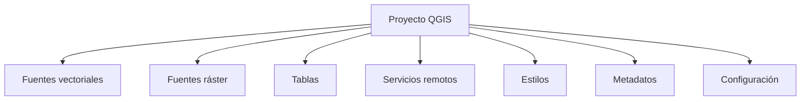
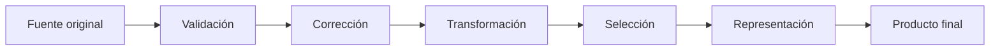

# 2.12 Taller: construir y entregar un proyecto funcional

!!! abstract "Objetivos de aprendizaje"

    Al finalizar este taller, el estudiante será capaz de:

    - Integrar en un único proyecto las competencias desarrolladas durante el módulo.
    - Comprender qué información guarda realmente un archivo de proyecto QGIS.
    - Diferenciar claramente entre:
        - proyecto;
        - fuentes de datos;
        - estilos;
        - metadatos;
        - servicios remotos;
        - documentación.
    - Organizar una estructura de carpetas adecuada para entregar un proyecto.
    - Revisar la procedencia, formato, SRC y estado de cada fuente utilizada.
    - Identificar y eliminar dependencias innecesarias o rutas frágiles.
    - Configurar el proyecto para utilizar **rutas relativas**.
    - Comprender por qué una ruta relativa mejora la portabilidad.
    - Detectar capas temporales, archivos externos y servicios remotos que puedan comprometer la entrega.
    - Consolidar datos de trabajo en formatos apropiados como GeoPackage cuando resulte conveniente.
    - Utilizar nombres comprensibles para capas, grupos, archivos y resultados.
    - Organizar el panel de capas mediante una jerarquía lógica.
    - Revisar simbología, etiquetas, visibilidad por escala y orden de dibujo.
    - Guardar y reutilizar estilos cuando resulte necesario.
    - Documentar el proyecto mediante metadatos, notas y archivos complementarios.
    - Registrar fuentes, fechas, atribuciones, licencias y dependencias.
    - Reconocer la diferencia entre una capa local y una capa dependiente de internet.
    - Diagnosticar rutas rotas y capas no disponibles.
    - Realizar una prueba real de **portabilidad desde otra ubicación**.
    - Verificar que otra persona pueda comprender y utilizar el proyecto sin depender de explicaciones verbales.
    - Construir un paquete final de entrega reproducible y técnicamente justificable.

!!! note "Antes de empezar"

    - **Entorno:** QGIS con el perfil `curso-qgis`. El taller toma como referencia **QGIS 3.44**.
    - **Punto de partida:** haber completado las lecciones **2.1 a 2.11**.
    - **Datos:** reutilizaremos las capas construidas y revisadas durante el módulo.
    - **Proyecto:** no comenzaremos desde cero; integraremos productos anteriores.
    - **Resultado:** una carpeta autocontenida que pueda copiarse a otra ubicación y abrirse correctamente.
    - **Prueba obligatoria:** el proyecto no se considerará terminado hasta abrirlo desde una ubicación diferente.
    - **Tiempo orientativo:** entre **150 y 210 minutos**, dependiendo de la cantidad de datos utilizados.

---

## El producto final no es solamente un archivo QGZ

Durante el módulo hemos trabajado con:

```text
vector
ráster
CSV
servicios web
estilos
metadatos
proyectos
```

Al finalizar podríamos tener un archivo:

```text
proyecto_final.qgz
```

Pero eso no significa automáticamente que el proyecto pueda entregarse.

Un proyecto funcional depende de varios componentes.



Si alguno de esos elementos deja de estar disponible, parte del proyecto puede fallar.

### El QGZ no es una carpeta mágica que contiene todo

El archivo de proyecto guarda información como:

- capas incorporadas;
- referencias hacia sus fuentes;
- simbología;
- etiquetas;
- orden de capas;
- SRC del proyecto;
- extensión del mapa;
- diseños;
- relaciones;
- configuraciones específicas.

Pero una capa como:

```text
datos/vector/equipamientos.gpkg
```

continúa siendo un archivo independiente.

Conceptualmente:

```text
proyecto.qgz
     │
     ├── referencia → equipamientos.gpkg
     ├── referencia → dem.tif
     ├── referencia → servicios.csv
     └── referencia → servicio WMS
```

!!! danger "Entregar solamente el QGZ puede producir un proyecto vacío"

    Si las fuentes locales no acompañan al archivo del proyecto, QGIS puede abrir el proyecto pero no encontrar las capas.

---

## Qué contiene un proyecto QGIS

QGIS puede guardar proyectos principalmente mediante:

```text
.qgs
.qgz
```

### QGS

`QGS` es el formato de proyecto basado en XML.

Contiene la configuración del proyecto y las referencias hacia las fuentes.

### QGZ

`QGZ` es el formato comprimido utilizado normalmente por QGIS.

Conceptualmente contiene:

```text
QGZ
├── proyecto QGS
└── almacenamiento auxiliar QGD
```

cuando corresponde.

!!! important "QGZ sigue dependiendo de las fuentes de datos"

    Que el proyecto esté comprimido no significa que todos los GeoPackage, GeoTIFF, CSV y demás fuentes queden automáticamente incluidos dentro de él.

### Proyecto y datos cumplen funciones diferentes

Podemos resumir:

| Elemento | Función |
|---|---|
| `.qgz` | Configuración del proyecto |
| `.gpkg` | Datos vectoriales/tabulares |
| `.tif` | Datos ráster |
| `.csv` | Datos tabulares |
| `.qml` | Estilos reutilizables |
| URL | Acceso a servicio remoto |
| `.md` / `.txt` | Documentación |

---

## Pensar primero en la persona que recibirá el proyecto

Un proyecto puede funcionar perfectamente en nuestro equipo y fallar inmediatamente cuando lo recibe otra persona.

Debemos preguntarnos:

```text
¿Puede abrirlo?

¿Encuentra todas las capas?

¿Comprende qué representa cada una?

¿Sabe de dónde provienen?

¿Sabe cuáles dependen de internet?

¿Puede identificar cuáles son originales y cuáles derivadas?

¿Entiende la simbología?

¿Puede volver a ejecutar el procedimiento?
```

### Un proyecto entregable debe ser autosuficiente

No significa que contenga absolutamente todos los recursos posibles.

Significa que:

> **Todo aquello necesario para utilizar el proyecto está incluido o claramente documentado.**

---

## Diseñar la estructura de entrega

Utilizaremos una estructura ordenada.

Por ejemplo:

```text
proyecto_qgis_final/
│
├── proyecto/
│   └── territorio_servicios.qgz
│
├── datos/
│   │
│   ├── originales/
│   │   ├── equipamientos.csv
│   │   ├── distritos.gpkg
│   │   └── imagen_original.tif
│   │
│   └── trabajo/
│       ├── territorio.gpkg
│       ├── equipamientos.gpkg
│       └── dem.tif
│
├── estilos/
│   ├── distritos_densidad.qml
│   └── equipamientos_tipo.qml
│
├── documentacion/
│   ├── README.md
│   └── fuentes.md
│
└── salidas/
```

La estructura puede adaptarse al proyecto.

Lo importante es mantener una lógica clara.

### `proyecto/`

Contiene:

```text
.qgz
```

que debe abrir el trabajo principal.

### `datos/originales/`

Contiene fuentes recibidas o descargadas que queremos preservar sin modificar.

### `datos/trabajo/`

Contiene:

- capas corregidas;
- reproyectadas;
- validadas;
- derivadas;
- consolidadas.

### `estilos/`

Contiene estilos reutilizables cuando decidimos entregarlos separadamente.

### `documentacion/`

Contiene información necesaria para comprender la entrega.

### `salidas/`

Puede reservarse para:

- PDF;
- PNG;
- GeoPackage de resultados;
- otros productos terminados.

!!! success "La estructura debe explicarse sola"

    Una persona debería poder comprender qué contiene cada carpeta sin necesitar preguntarnos.

---

## Evitar nombres ambiguos

Durante el trabajo temporal aparecen fácilmente archivos como:

```text
final.gpkg
final2.gpkg
final_bueno.gpkg
copia_final.gpkg
nuevo_final.qgz
```

Estos nombres no describen el contenido.

### Utilizar nombres semánticos

Prefiere:

```text
distritos.gpkg
equipamientos_validados.gpkg
servicios_revision.gpkg
dem_area_estudio.tif
territorio_servicios.qgz
```

### Evitar información innecesaria en nombres

No necesitamos colocar toda la historia del archivo en el nombre:

```text
equipamientos_corregidos_reproyectados_revisados_final_final.gpkg
```

Podemos documentar la historia mediante metadatos.

### Mantener consistencia

Si utilizamos:

```text
snake_case
```

podemos mantenerlo:

```text
equipamientos_salud
distritos_municipales
servicios_revision
```

La consistencia facilita:

- automatización;
- lectura;
- búsqueda;
- mantenimiento.

---

## Revisar los nombres dentro del panel de capas

El nombre del archivo y el nombre visible en QGIS no necesariamente son iguales.

Por ejemplo:

```text
Archivo:
territorio.gpkg

Capa:
distritos
```

En QGIS podemos mostrar:

```text
Distritos municipales
```

El nombre de visualización debe ser comprensible para quien utiliza el proyecto.

### Evitar nombres automáticos

Por ejemplo:

```text
output
output_2
result
layer
memory
```

Antes de entregar, sustitúyelos por nombres significativos.

### Ejemplo

En lugar de:

```text
reprojected
```

utiliza:

```text
Equipamientos validados
```

o:

```text
Equipamientos · UTM 19S
```

cuando esa información sea relevante.

---

## Organizar el panel de capas

Un proyecto con 20 o 30 capas sin agrupación puede resultar difícil de comprender.

Podemos utilizar grupos.

Por ejemplo:

```text
01 · REFERENCIA
├── Límite municipal
├── Distritos
└── Vías principales

02 · INFORMACIÓN TEMÁTICA
├── Equipamientos
├── Servicios
└── Población

03 · RÁSTER
├── Imagen
└── MDE

04 · SERVICIOS WEB
└── Mapa base

05 · RESULTADOS
└── Servicios priorizados
```

### El orden también comunica

La estructura puede reflejar:

```text
contexto
↓
información principal
↓
resultados
```

### No abusar de grupos

Una estructura excesivamente profunda tampoco ayuda.

Evita:

```text
grupo
└── grupo
    └── grupo
        └── grupo
```

si no existe una necesidad real.

!!! captura "Captura pendiente · 2.12-01"

    - **Tipo:** Imagen (PNG) comparativa.
    - **Archivo:** `assets/images/modulo-02/2-12/2-12-01-panel-capas.png`
    - **Qué mostrar:** a la izquierda un panel desorganizado y a la derecha el mismo proyecto agrupado y renombrado.
    - **Sugerencia:** utilizar aproximadamente 10–15 capas para que la mejora sea evidente.

---

## Inventariar todas las fuentes del proyecto

Antes de entregar debemos saber exactamente de dónde proviene cada capa.

Construye un inventario.

| Capa | Tipo | Fuente | Local/remota | Estado |
|---|---|---|---|---|
| Distritos | Vector | `territorio.gpkg` | Local | OK |
| Equipamientos | Vector | `equipamientos.gpkg` | Local | OK |
| MDE | Ráster | `dem.tif` | Local | OK |
| Mapa base | XYZ | URL | Remota | Internet |
| Salud oficial | WFS | URL | Remota | Internet |

### Revisar cada fuente

Preguntas:

```text
¿Existe?

¿Está dentro de la carpeta del proyecto?

¿Depende de otra ruta del equipo?

¿Es temporal?

¿Es remota?

¿Tiene licencia?

¿Necesita credenciales?
```

### Una capa visible puede ocultar una dependencia problemática

Una capa podría estar leyendo:

```text
/home/usuario/Descargas/datos/equipamientos.gpkg
```

Todo funciona en nuestro equipo.

Pero esa ruta no existirá en otra computadora.

---

## Identificar rutas absolutas

Una ruta absoluta contiene la ubicación completa.

Por ejemplo:

```text
/home/usuario/curso_qgis/datos/distritos.gpkg
```

o en otro sistema:

```text
C:\Users\Usuario\CursoQGIS\datos\distritos.gpkg
```

El problema es que incluye elementos específicos del equipo.

Si copiamos la carpeta a:

```text
/home/otra_persona/proyecto/
```

la ruta original ya no existe.

### Dependencia de ubicación

```text
/home/usuario/...
```

está vinculada a un equipo y estructura específicos.

Eso reduce la portabilidad.

---

## Utilizar rutas relativas

Una ruta relativa describe la ubicación de un archivo respecto del proyecto.

Por ejemplo:

```text
../datos/trabajo/territorio.gpkg
```

Podemos mover:

```text
proyecto_qgis_final/
```

completo a otro lugar y la relación interna seguirá siendo la misma.

### Estructura

```text
proyecto_qgis_final/
├── proyecto/
│   └── territorio.qgz
└── datos/
    └── trabajo/
        └── territorio.gpkg
```

Desde:

```text
proyecto/territorio.qgz
```

la fuente puede localizarse mediante una relación relativa.

### Ventaja principal

Podemos mover:

```text
/home/ana/proyecto_qgis_final/
```

a:

```text
/home/carlos/Documentos/proyecto_qgis_final/
```

y las relaciones internas continúan siendo válidas.

!!! important "Mover la carpeta completa"

    Las rutas relativas funcionan si mantenemos la estructura interna.

    Si movemos solamente:

    ```text
    territorio.qgz
    ```

    y dejamos atrás:

    ```text
    datos/
    ```

    el proyecto seguirá perdiendo sus fuentes.

---

## Configurar rutas relativas en QGIS

Abre:

**Proyecto ▸ Propiedades**

En la sección general revisa la configuración de almacenamiento de rutas.

Configura:

```text
Guardar rutas:
Relativas
```

La nomenclatura exacta puede variar ligeramente según versión e idioma.

### También podemos establecer el inicio del proyecto

QGIS permite definir una:

```text
Carpeta de inicio del proyecto
```

que facilita el acceso desde el panel Navegador.

Puede ser útil establecer como referencia:

```text
la carpeta raíz de entrega
```

o una ubicación coherente con la estructura utilizada.

!!! captura "Captura pendiente · 2.12-02"

    - **Tipo:** Imagen (PNG) anotada.
    - **Archivo:** `assets/images/modulo-02/2-12/2-12-02-rutas-relativas.png`
    - **Qué mostrar:** **Proyecto ▸ Propiedades ▸ General**.
    - **Sugerencia:** señalar:
        1. ubicación del proyecto;
        2. carpeta de inicio;
        3. rutas relativas.

---

## Las rutas relativas no corrigen una mala estructura

Supongamos:

```text
proyecto/
└── proyecto.qgz
```

pero una capa procede de:

```text
../../../../Descargas/datos_nuevos/capa.shp
```

Aunque QGIS guarde una ruta relativa, la entrega sigue dependiendo de un archivo fuera de la estructura planificada.

### Antes de entregar

Todos los archivos necesarios deberían estar:

```text
dentro de la carpeta de entrega
```

salvo dependencias remotas expresamente documentadas.

### Regla práctica

```text
FUENTE LOCAL NECESARIA
        ↓
DEBE ESTAR DENTRO
DE LA ENTREGA
```

---

## Identificar capas temporales

Durante el trabajo con Processing podemos generar:

```text
Capas temporales
```

Estas pueden existir solamente durante la sesión de QGIS.

Ejemplos:

```text
Reproyectado
Resultado
Extraído
Buffer
```

Si cerramos QGIS pueden desaparecer.

### Cómo reconocerlas

Revisa:

- origen de la capa;
- icono;
- propiedades;
- ubicación.

Si la fuente aparece como temporal o de memoria:

```text
no debe considerarse producto final
```

### Convertir resultados importantes en fuentes persistentes

Guarda los resultados definitivos como:

```text
GeoPackage
```

u otro formato apropiado.

Por ejemplo:

```text
datos/trabajo/resultados.gpkg
```

!!! danger "Una capa temporal puede hacer que un proyecto parezca terminado"

    Todo funciona mientras QGIS permanece abierto.

    Después de cerrar y volver a abrir, la capa puede desaparecer.

---

## Consolidar fuentes cuando resulte conveniente

Un proyecto puede contener:

```text
25 Shapefiles
14 CSV
8 resultados temporales
```

Esto aumenta el riesgo de:

- pérdida de componentes;
- rutas rotas;
- errores de copia.

### Utilizar GeoPackage

Cuando sea adecuado podemos consolidar varias capas de trabajo en:

```text
territorio.gpkg
```

por ejemplo:

```text
territorio.gpkg
├── distritos
├── equipamientos
├── vias
├── servicios
└── servicios_priorizados
```

### No significa que todo deba estar en un único archivo

Podemos mantener separados:

- originales;
- ráster grandes;
- tablas externas;
- documentación.

La decisión debe responder a la organización del proyecto.

!!! tip "Consolidar reduce fragilidad"

    Menos archivos dispersos pueden simplificar la entrega, especialmente frente a formatos compuestos como Shapefile.

---

## Tener cuidado con Shapefile

Un Shapefile no es necesariamente un único archivo.

Puede incluir:

```text
capa.shp
capa.shx
capa.dbf
capa.prj
capa.cpg
...
```

Copiar solamente:

```text
capa.shp
```

puede dejar la fuente incompleta.

### Para entregas de curso

Cuando sea posible y técnicamente apropiado, preferiremos:

```text
GeoPackage
```

para capas vectoriales de trabajo.

Esto simplifica:

- transferencia;
- organización;
- atributos;
- múltiples capas.

---

## Revisar el SRC del proyecto y de las capas

Antes de entregar:

1. revisa el SRC del proyecto;
2. revisa capas principales;
3. comprueba que no exista ninguna capa desplazada;
4. verifica unidades;
5. documenta transformaciones importantes.

### Una coincidencia visual no basta

Como vimos en la lección 2.6:

```text
reproyección al vuelo
```

puede hacer que capas con diferentes SRC se superpongan correctamente.

Eso puede ser perfectamente válido.

Pero debemos saber por qué.

### La entrega debe evitar incertidumbres

Un usuario debería poder revisar:

```text
SRC de proyecto
SRC de capas
```

y encontrar una configuración coherente.

---

## Revisar los datos antes de entregar

Recupera las comprobaciones de la lección 2.7.

### Identificadores

Comprueba:

```text
NULL
duplicados
formato
```

### Categorías

Comprueba:

```text
valores únicos
variantes
dominios
```

### Variables numéricas

Revisa:

```text
mínimo
máximo
valores sospechosos
```

### Registros incompletos

Determina si quedan problemas pendientes.

!!! note "Un taller final no significa que todos los datos deban ser perfectos"

    Puede existir información incompleta.

    Lo importante es que:

    ```text
    el problema esté identificado
    ```

    y:

    ```text
    quede documentado
    ```

---

## Revisar filtros y selecciones activas

Antes de guardar el proyecto final comprueba si alguna capa posee:

```text
filtro
```

que esté ocultando entidades.

También elimina selecciones que no deban formar parte del estado inicial.

### Problema típico

Tenemos:

```text
850 entidades
```

pero la capa aparece con:

```text
63
```

porque durante la lección 2.8 quedó activo un filtro.

La persona que recibe el proyecto podría interpretar:

> La fuente solamente contiene 63 registros.

### Antes de entregar

Pregunta:

```text
¿este filtro forma parte del diseño final?
```

Si la respuesta es:

```text
No
```

elimínalo.

Si:

```text
Sí
```

documéntalo claramente.

---

## Revisar simbología y etiquetas

Recupera los criterios de la lección 2.9.

Para cada capa temática revisa:

```text
tipo de simbología
campo
clasificación
categorías
etiquetas
escala
```

### Simbologías categorizadas

Comprueba que no existan categorías inesperadas.

### Graduaciones

Comprueba:

- variable;
- unidad;
- intervalos;
- método;
- número de clases.

### Etiquetas

Revisa:

- campo;
- colocación;
- buffer;
- escala;
- saturación.

### Estado inicial del proyecto

Al abrirlo, el usuario debería encontrarse con:

```text
una vista coherente
```

y no con:

```text
todas las capas visibles simultáneamente
```

sin jerarquía.

---

## Revisar estilos reutilizables

El proyecto QGIS guarda gran parte de la configuración visual.

Sin embargo, podemos conservar adicionalmente estilos importantes como:

```text
.qml
```

Por ejemplo:

```text
estilos/
├── distritos_densidad.qml
└── equipamientos_tipo.qml
```

### Cuándo conviene entregarlos

Cuando queremos:

- reutilizar el estilo fuera del proyecto;
- documentar una simbología;
- aplicarla a otra fuente compatible;
- conservarla como producto independiente.

### No duplicar sin necesidad

No es obligatorio exportar un `.qml` para cada capa.

Hazlo cuando el estilo tenga valor como recurso reutilizable.

---

## Documentar las capas

QGIS permite asociar metadatos a las capas.

Los metadatos ayudan a responder:

```text
¿Qué es?

¿Quién lo produjo?

¿Cuándo?

¿Cómo fue generado?

¿En qué territorio?

¿Con qué restricciones?

¿Con qué SRC?
```

### Información mínima recomendable

Para las capas principales registra:

```text
Título
Resumen
Fuente
Fecha
Responsable
SRC
Licencia
Observaciones
```

### Metadatos y notas no son exactamente lo mismo

Podemos utilizar:

```text
METADATOS
→ descripción estructurada de la fuente

NOTAS
→ instrucciones o comentarios para el usuario del proyecto
```

Por ejemplo, una nota podría indicar:

> Esta capa fue corregida durante la práctica 2.6. No modificar el SRC sin revisar `fuentes.md`.

---

## Documentar el proyecto

También podemos incorporar metadatos al proyecto.

Desde:

**Proyecto ▸ Propiedades ▸ Metadatos**

podemos registrar información como:

```text
Título
Resumen
Autor
Palabras clave
```

entre otros elementos.

!!! captura "Captura pendiente · 2.12-03"

    - **Tipo:** Imagen (PNG).
    - **Archivo:** `assets/images/modulo-02/2-12/2-12-03-metadatos-proyecto.png`
    - **Qué mostrar:** pestaña de metadatos de las Propiedades del proyecto.
    - **Sugerencia:** completar título, resumen, autor y palabras clave como ejemplo.

### Ejemplo

```text
Título:
Servicios y estructura territorial del área de estudio

Resumen:
Proyecto de formación elaborado en QGIS 3.44 que integra
información administrativa, equipamientos, ráster y servicios
web para una lectura exploratoria del territorio.

Autor:
Nombre del estudiante

Palabras clave:
QGIS, SIG, territorio, servicios
```

---

## Crear un README

Además de los metadatos internos, una entrega debería incluir:

```text
documentacion/README.md
```

Este archivo será la primera guía para quien reciba la carpeta.

### Estructura recomendada

```markdown
# Proyecto

## Descripción

## Requisitos

## Cómo abrir

## Estructura de carpetas

## Fuentes principales

## Servicios remotos

## Limitaciones

## Autor

## Fecha
```

### Ejemplo mínimo

```markdown
# Servicios y territorio

Proyecto elaborado con QGIS 3.44.

## Cómo abrir

Abrir:

`proyecto/territorio_servicios.qgz`

Mantener toda la estructura de carpetas sin modificar.

## Dependencias

El mapa base y la capa oficial de salud dependen de conexión
a internet.

## Datos

Las capas derivadas se encuentran en:

`datos/trabajo/`

Las fuentes recibidas originalmente se conservan en:

`datos/originales/`
```

!!! success "El README debe permitir empezar sin preguntarnos"

    Una persona que nunca vio el proyecto debería saber inmediatamente:

    - qué abrir;
    - qué contiene;
    - qué necesita;
    - qué limitaciones tiene.

---

## Crear un registro de fuentes

Utiliza:

```text
documentacion/fuentes.md
```

Podemos construir una tabla:

```markdown
| Capa | Fuente | Fecha | Licencia | Observaciones |
|---|---|---|---|---|
| Distritos | Institución X | 2026 | ... | ... |
| Equipamientos | GAMS | 2026 | ... | Validado |
| MDE | Producto X | 2025 | ... | 30 m |
```

### Para servicios remotos

Añade:

```text
URL
fecha de consulta
tipo de servicio
atribución
dependencia
```

Por ejemplo:

| Recurso | Servicio | Fecha consulta | Dependencia |
|---|---|---|---|
| Mapa base | XYZ | 2026-09-17 | Internet |
| Salud oficial | WFS | 2026-09-17 | Internet |

---

## Revisar servicios remotos

Las conexiones trabajadas en la lección 2.11 requieren especial atención.

Un proyecto puede contener:

```text
XYZ
WMS
WMTS
WFS
```

### Preguntas obligatorias

Para cada servicio remoto:

```text
¿Sigue funcionando?

¿Requiere internet?

¿Requiere autenticación?

¿Tiene atribución?

¿Tiene licencia?

¿La URL es pública?

¿Es indispensable para comprender el proyecto?
```

### Distinguir dependencia crítica y complementaria

Un mapa base puede ser:

```text
complementario
```

Si falla, el análisis principal sigue disponible.

Una capa WFS utilizada como fuente principal puede ser:

```text
crítica
```

Si desaparece, parte del proyecto deja de funcionar.

### Documentarlo

Por ejemplo:

```text
Capa:
Establecimientos oficiales

Servicio:
WFS

Dependencia:
Internet

Criticidad:
Alta

Alternativa local:
No
```

---

## No entregar credenciales

Un proyecto puede utilizar servicios que requieren:

- usuario;
- contraseña;
- token;
- clave API.

No debemos guardar credenciales sensibles dentro de archivos destinados a distribución.

!!! danger "Una entrega no debe exponer secretos"

    Antes de compartir revisa:

    ```text
    contraseñas
    tokens
    API keys
    credenciales de bases de datos
    ```

    Si el proyecto las necesita, documenta el procedimiento de configuración sin distribuir el secreto.

---

## Revisar formatos frágiles o externos

Pregúntate si alguna capa depende de:

```text
hoja de cálculo personal
archivo dentro de Descargas
unidad USB
carpeta temporal
ruta de red
base de datos privada
```

Cada dependencia externa debe:

- incorporarse a la entrega;
- reemplazarse;
- o documentarse.

### Ejemplo

No dejar:

```text
/home/usuario/Descargas/datos_finales.csv
```

Mueve una copia controlada a:

```text
datos/originales/equipamientos.csv
```

y vuelve a enlazarla.

---

## Buscar capas no disponibles

Cuando QGIS no puede localizar una fuente puede mostrarla como:

```text
no disponible
```

Al abrir el proyecto puede aparecer el gestor de capas no disponibles.

### Causas frecuentes

```text
archivo movido
archivo eliminado
archivo renombrado
ruta absoluta de otro equipo
unidad externa desconectada
servicio remoto caído
```

### No ignorar la advertencia

Antes de entregar:

```text
0 capas locales rotas
```

debería ser el objetivo.

!!! captura "Captura pendiente · 2.12-04"

    - **Tipo:** Imagen (PNG).
    - **Archivo:** `assets/images/modulo-02/2-12/2-12-04-ruta-rota.png`
    - **Qué mostrar:** diálogo de capas no disponibles y posteriormente la fuente corregida.
    - **Sugerencia:** utilizar un ejemplo donde un archivo haya sido movido intencionalmente.

---

## Reparar una ruta rota

Cuando QGIS detecta una fuente faltante podemos:

- indicar la nueva ruta;
- explorar el sistema de archivos;
- utilizar búsqueda automática cuando corresponda.

### Pero reparar no es suficiente

Si la causa fue:

```text
la capa estaba fuera de la carpeta de entrega
```

debemos corregir también la arquitectura del proyecto.

El objetivo no es solamente:

```text
que vuelva a abrir en mi equipo
```

sino:

```text
que continúe abriendo después de moverlo
```

---

## Revisar los rásteres

Para cada ráster comprueba:

```text
archivo presente
SRC correcto
NoData
resolución
estilo
extensión
```

### Archivos grandes

No copies innecesariamente:

```text
10 GB
```

de información si el proyecto utiliza solamente una pequeña zona, siempre que la licencia y el propósito permitan generar una versión de trabajo.

Pero cualquier recorte debe quedar documentado.

### Mantener la fuente original cuando corresponda

Podemos tener:

```text
originales/
└── dem_regional.tif

trabajo/
└── dem_area_estudio.tif
```

---

## Revisar las tablas externas

Si alguna capa depende de:

```text
CSV
XLSX
ODS
```

comprueba:

- que el archivo esté incluido;
- que no dependa de vínculos externos;
- que los campos sigan siendo reconocidos correctamente;
- que las relaciones o uniones continúen funcionando.

### Especial atención a las uniones

Si una capa utiliza:

```text
JOIN
```

con otra tabla, ambas fuentes deben estar disponibles.

Una capa aparentemente correcta puede perder atributos si desaparece la tabla relacionada.

---

## Revisar uniones y relaciones

El proyecto puede contener:

```text
uniones
relaciones
```

Estas también forman parte de su estructura lógica.

Antes de entregar comprueba:

```text
¿la tabla asociada existe?

¿el campo de enlace existe?

¿los valores coinciden?

¿la relación sigue funcionando?
```

### Ejemplo

```text
Distritos
    │
    │ codigo
    ▼
Población
```

Si el archivo de población no acompaña la entrega:

```text
la unión puede fallar
```

aunque la geometría de distritos siga apareciendo.

---

## Revisar resultados derivados

Durante el curso hemos generado resultados como:

```text
equipamientos_validados
servicios_revision_campo
capas reproyectadas
```

Cada resultado debe poder responder:

```text
¿de qué fuente proviene?

¿qué operación lo generó?

¿qué fecha tiene?

¿qué modificación se realizó?
```

### Evitar resultados huérfanos

Una capa:

```text
resultado_3
```

sin documentación es difícil de auditar.

Antes de entregar:

```text
renombrar
+
documentar
```

---

## Guardar el proyecto en formato QGZ

Para la entrega utilizaremos normalmente:

```text
.qgz
```

Por ejemplo:

```text
proyecto/
└── territorio_servicios.qgz
```

Utiliza:

**Proyecto ▸ Guardar como…**

y comprueba la ubicación.

### Guardar después de cada corrección importante

Utiliza:

++ctrl+s++

especialmente después de:

- reordenar capas;
- corregir fuentes;
- ajustar simbología;
- modificar metadatos;
- configurar rutas.

---

## La prueba decisiva: mover el proyecto

Esta es la parte más importante del taller.

No comprobaremos la portabilidad abriendo el proyecto desde la misma carpeta.

Lo moveremos.

### Ubicación original

Por ejemplo:

```text
/home/usuario/curso/proyecto_qgis_final/
```

### Copia de prueba

Copia **toda la carpeta** hacia:

```text
/home/usuario/Documentos/prueba_entrega/
```

o:

```text
/tmp/prueba_qgis/
```

La ruta debe ser diferente.

### No copiar solamente el QGZ

Copia:

```text
proyecto_qgis_final/
```

completo.

---

## Abrir desde la nueva ubicación

Cierra QGIS completamente.

Después:

1. navega hasta la copia;
2. abre:

```text
proyecto/territorio_servicios.qgz
```

3. espera a que cargue;
4. observa si aparecen advertencias.

### Qué debemos comprobar

```text
¿Abre el proyecto?

¿Cargan todas las capas locales?

¿Conserva la simbología?

¿Conserva etiquetas?

¿Conserva grupos?

¿Funcionan tablas?

¿Funcionan uniones?

¿Funcionan rásteres?

¿Funcionan servicios remotos?

¿El SRC del proyecto es correcto?
```

!!! captura "Captura pendiente · 2.12-05"

    - **Tipo:** GIF animado.
    - **Archivo:** `assets/images/modulo-02/2-12/2-12-05-prueba-portabilidad.gif`
    - **Qué mostrar:** copiar la carpeta completa a otra ubicación y abrir el QGZ desde allí.
    - **Sugerencia:** mostrar claramente dos rutas distintas.

---

## No basta con que el proyecto abra

Un proyecto puede abrir sin errores y aun así estar incompleto.

Debemos verificar funcionalmente cada grupo.

### Capas vectoriales

Para cada capa principal:

- hacer zoom;
- abrir tabla;
- identificar una entidad;
- revisar SRC;
- comprobar simbología.

### Rásteres

- hacer zoom;
- identificar píxel;
- revisar estilo;
- verificar NoData cuando corresponda.

### Selección y expresiones

Realiza al menos una consulta conocida.

Por ejemplo:

```qgis
"estado" = 'ACTIVO'
```

Comprueba que sigue funcionando.

### Servicios remotos

Comprueba:

```text
conexión
identificación
dependencia de internet
```

---

## Realizar una prueba desde un segundo equipo cuando sea posible

Mover la carpeta dentro del mismo computador es una buena primera prueba.

Pero la prueba más robusta consiste en:

```text
copiar a otro equipo
```

con QGIS compatible.

Esto permite detectar dependencias como:

- fuentes instaladas solamente en nuestro sistema;
- complementos;
- unidades montadas;
- rutas específicas;
- conexiones privadas;
- diferencias de sistema operativo.

### No convertir complementos en requisitos innecesarios

Si una funcionalidad puede resolverse mediante herramientas nativas del proyecto, evita depender de complementos que la persona receptora podría no tener.

Si un complemento es imprescindible:

```text
documentarlo en README
```

---

## Tener cuidado con tipografías y símbolos externos

Un estilo podría utilizar:

```text
una fuente instalada solamente en nuestro equipo
```

o un:

```text
SVG personalizado
```

que está fuera de la carpeta.

En otro equipo:

- el texto puede cambiar;
- el símbolo puede desaparecer.

### Revisar recursos externos

Comprueba:

```text
SVG personalizados
imágenes
logos
tipografías
scripts
```

Si son necesarios y redistribuibles, inclúyelos dentro de una estructura apropiada.

!!! warning "Un estilo puede contener dependencias"

    La simbología no siempre es completamente autónoma.

---

## Revisar diseños de impresión si existen

Si el proyecto contiene diseños:

```text
mapa A4
mapa A3
reporte
```

deben probarse también.

Comprueba:

- mapas;
- leyendas;
- textos;
- escalas;
- imágenes;
- logos;
- fuentes;
- rutas externas.

Aunque el objetivo principal del módulo no sea la composición final, cualquier diseño incluido forma parte de la entrega.

---

## Definir un estado inicial coherente

Cuando otra persona abra el proyecto debería encontrar:

- extensión adecuada;
- capas principales visibles;
- leyenda ordenada;
- mapa legible;
- escala razonable.

### Evitar abrir en un estado accidental

Por ejemplo:

```text
zoom extremo sobre una entidad
```

o:

```text
todas las capas apagadas
```

o:

```text
una selección de prueba activa
```

Antes del último guardado:

1. vuelve al área de estudio;
2. activa las capas principales;
3. limpia selecciones innecesarias;
4. revisa filtros;
5. guarda.

---

## Definir la extensión inicial

Podemos dejar el lienzo mostrando:

```text
área de estudio completa
```

Esto ayuda al usuario a orientarse inmediatamente.

En proyectos con capas globales o servicios web también puede resultar útil configurar una extensión adecuada del proyecto.

### Evitar extensiones absurdas

Un registro desplazado puede provocar:

```text
Zoom a extensión total
→ planeta completo
```

Esto sería una señal de que todavía existe un problema de calidad espacial.

---

## Crear una lista de control final

Antes de entregar utiliza un checklist.

### Proyecto

```text
[ ] Proyecto guardado como QGZ
[ ] Rutas relativas
[ ] SRC revisado
[ ] Extensión inicial adecuada
[ ] Metadatos completados
```

### Fuentes

```text
[ ] Todas las fuentes locales están dentro de la carpeta
[ ] No existen capas temporales importantes
[ ] No existen rutas hacia Descargas
[ ] No existen archivos en unidades externas
[ ] Servicios remotos documentados
```

### Datos

```text
[ ] Identificadores revisados
[ ] Categorías revisadas
[ ] Problemas conocidos documentados
[ ] Resultados derivados identificados
```

### Presentación

```text
[ ] Grupos ordenados
[ ] Capas renombradas
[ ] Simbología revisada
[ ] Etiquetas revisadas
[ ] Visibilidad por escala revisada
```

### Documentación

```text
[ ] README
[ ] Fuentes
[ ] Licencias
[ ] Atribuciones
[ ] Fecha de entrega
```

### Portabilidad

```text
[ ] Copiado a otra ubicación
[ ] Abierto desde la nueva ubicación
[ ] 0 capas locales rotas
[ ] Tablas funcionan
[ ] Rásteres funcionan
[ ] Estilos funcionan
[ ] Servicios remotos comprobados
```

---

## Clasificar problemas por severidad

Durante la revisión podemos detectar problemas con distinta gravedad.

### Crítico

Impide utilizar el proyecto.

Por ejemplo:

```text
capa principal no encontrada
```

### Alto

Permite abrir pero compromete resultados.

Por ejemplo:

```text
SRC incorrecto
```

### Medio

Afecta interpretación o documentación.

Por ejemplo:

```text
capa con nombre ambiguo
```

### Bajo

Afecta principalmente presentación.

Por ejemplo:

```text
orden poco claro
```

### Matriz

| Problema | Severidad | Acción |
|---|---|---|
| Capa principal rota | Crítica | Corregir antes de entregar |
| SRC incorrecto | Alta | Corregir y validar |
| WMS no documentado | Media | Documentar |
| Nombre `output_3` | Media | Renombrar |
| Color poco legible | Baja | Ajustar |

Esto ayuda a priorizar la revisión.

---

## Problemas frecuentes de portabilidad

Podemos diagnosticar varias situaciones.

### Caso 1. Capa en Descargas

```text
/home/usuario/Descargas/capa.gpkg
```

**Problema:** fuera de la entrega.

**Solución:**

```text
copiar a datos/
+
reconectar
+
guardar proyecto
```

### Caso 2. Ruta absoluta

**Problema:** incluye ubicación específica del equipo.

**Solución:**

```text
configurar rutas relativas
+
verificar estructura
```

### Caso 3. Capa temporal

**Problema:** puede desaparecer.

**Solución:**

```text
guardar como fuente persistente
```

### Caso 4. Shapefile incompleto

**Problema:** solo se copió `.shp`.

**Solución:**

```text
copiar componentes completos
```

o convertir a GeoPackage.

### Caso 5. WMS no carga

**Problema:** dependencia de red o servidor.

**Solución:**

```text
documentar dependencia
+
comprobar URL
```

### Caso 6. Estilo diferente en otro equipo

**Problema:** recurso externo no disponible.

**Solución:**

```text
revisar fuentes
SVG
imágenes
```

### Caso 7. Unión desaparece

**Problema:** tabla externa no copiada.

**Solución:**

```text
incorporar tabla
+
reparar fuente
```

---

## Construir un manifiesto de entrega

Podemos incluir dentro de:

```text
documentacion/README.md
```

una sección:

```markdown
## Contenido de la entrega
```

Por ejemplo:

```text
Proyecto:
proyecto/territorio_servicios.qgz

Datos principales:
datos/trabajo/territorio.gpkg

Ráster:
datos/trabajo/dem.tif

Estilos:
estilos/

Documentación:
documentacion/
```

### Registrar versión

También podemos indicar:

```text
Versión del proyecto:
1.0

QGIS utilizado:
3.44

Fecha:
AAAA-MM-DD
```

Esto ayuda a comprender el contexto técnico de la entrega.

---

## Preparar el paquete final

Después de verificar la copia de prueba podemos empaquetar la carpeta.

Por ejemplo:

```text
proyecto_qgis_final/
```

se convierte en:

```text
proyecto_qgis_final.zip
```

### Comprimir después de verificar

Orden correcto:

```text
ORGANIZAR
      ↓
REVISAR
      ↓
MOVER Y PROBAR
      ↓
CORREGIR
      ↓
PROBAR NUEVAMENTE
      ↓
COMPRIMIR
      ↓
ENTREGAR
```

No:

```text
comprimir primero
↓
esperar que funcione
```

### No modificar después de comprimir

Si realizas cambios:

1. vuelve a probar;
2. genera nuevamente el paquete.

---

## Una entrega reproducible necesita contexto

Supongamos que entregamos:

```text
servicios_revision.gpkg
```

sin explicar nada.

El usuario no sabe:

```text
qué filtro utilizamos
qué fecha tienen los datos
de dónde provienen
por qué contiene solamente determinadas entidades
```

### Documentar productos derivados

Por ejemplo:

```text
Capa:
servicios_revision_campo

Origen:
servicios_municipales

Criterio:
tipo IN ('Salud','Social')
AND estado = 'ACTIVO'
AND capacidad >= 50

Fecha:
2026

Objetivo:
revisión de campo
```

Esto conecta la entrega con las lecciones anteriores.

---

## Reconstruir la historia del dato

Un proyecto bien organizado debería permitir seguir:



### Ejemplo

```text
equipamientos.csv
        ↓
validación de coordenadas
        ↓
equipamientos_validados
        ↓
reproyección
        ↓
selección por requisitos
        ↓
servicios_revision_campo
        ↓
simbología temática
```

El usuario debería poder comprender esta cadena.

---

## Qué significa realmente “proyecto funcional”

Un proyecto funcional no es simplemente uno que:

```text
abre sin mostrar error
```

Debe cumplir varias condiciones.

### Integridad

Las fuentes necesarias están disponibles.

### Portabilidad

Puede moverse sin perder referencias.

### Comprensibilidad

Las capas están organizadas y nombradas.

### Trazabilidad

Podemos conocer la procedencia de los datos.

### Legibilidad

La simbología y etiquetas permiten interpretar el mapa.

### Documentación

Existen instrucciones suficientes.

### Reproducibilidad

Las principales decisiones pueden reconstruirse.

### Transparencia

Las limitaciones y dependencias están declaradas.

---

## Proyecto funcional frente a proyecto improvisado

| Proyecto improvisado | Proyecto funcional |
|---|---|
| Archivos dispersos | Estructura ordenada |
| Rutas absolutas | Rutas relativas |
| Capas `output_1` | Nombres comprensibles |
| Temporales | Resultados persistentes |
| Sin fuentes | Fuentes documentadas |
| Servicios invisibles | Dependencias declaradas |
| Sin metadatos | Metadatos básicos |
| Estilos accidentales | Simbología revisada |
| Solo funciona en mi equipo | Probado desde otra ubicación |
| Sin README | Instrucciones de apertura |
| “Final2” | Entrega versionada |

---

## Taller integrador

!!! example "Taller 2.12 — Construir y entregar un proyecto funcional"

    **Situación:** debes entregar a otra persona un proyecto SIG desarrollado durante el módulo.

    La persona que lo recibe no conoce:

    - tu estructura de carpetas;
    - las rutas de tu computadora;
    - el origen de tus datos;
    - las decisiones que tomaste;
    - qué capas dependen de internet.

    Tu objetivo es entregar un paquete que pueda:

    ```text
    copiarse
    ↓
    abrirse
    ↓
    comprenderse
    ↓
    utilizarse
    ```

    sin reconstruir manualmente el proyecto.

    **1. Crear la carpeta final**

    Construye:

    ```text
    proyecto_qgis_final/
    │
    ├── proyecto/
    ├── datos/
    │   ├── originales/
    │   └── trabajo/
    ├── estilos/
    ├── documentacion/
    └── salidas/
    ```

    **2. Guardar el proyecto**

    Guarda:

    ```text
    proyecto/territorio_servicios.qgz
    ```

    **3. Configurar rutas relativas**

    Desde:

    **Proyecto ▸ Propiedades**

    verifica que las fuentes locales utilicen rutas relativas.

    **4. Inventariar capas**

    Completa:

    | Capa | Tipo | Fuente | Local/remota | SRC | Estado |
    |---|---|---|---|---|---|

    Incluye todas las capas del proyecto.

    **5. Revisar fuentes externas**

    Identifica capas procedentes de:

    ```text
    Descargas
    Escritorio
    USB
    otra carpeta
    ruta de red
    ```

    Traslada a la estructura del proyecto aquellas fuentes que formen parte de la entrega.

    **6. Eliminar dependencias temporales**

    Localiza:

    ```text
    capas temporales
    resultados de memoria
    ```

    Guarda como fuentes persistentes todos los resultados necesarios.

    **7. Consolidar datos**

    Cuando resulte adecuado, organiza capas vectoriales de trabajo dentro de uno o varios:

    ```text
    GeoPackage
    ```

    **8. Revisar nombres**

    Elimina nombres como:

    ```text
    output
    result
    final2
    reprojected
    ```

    Sustitúyelos por nombres significativos.

    **9. Organizar el panel de capas**

    Crea grupos como:

    ```text
    01 · Referencia
    02 · Información temática
    03 · Ráster
    04 · Servicios web
    05 · Resultados
    ```

    Adapta la organización al proyecto real.

    **10. Revisar los SRC**

    Comprueba:

    ```text
    SRC del proyecto
    SRC de capas principales
    posición espacial
    unidades
    ```

    No debe existir ninguna capa inexplicablemente desplazada.

    **11. Revisar atributos**

    Comprueba al menos:

    - identificadores;
    - valores NULL críticos;
    - categorías;
    - valores sospechosos conocidos.

    Documenta problemas que no puedan resolverse.

    **12. Revisar filtros**

    Comprueba que ninguna capa tenga filtros accidentales.

    Documenta los filtros que formen parte intencional del proyecto.

    **13. Revisar simbología**

    Comprueba:

    - símbolo único;
    - categorizaciones;
    - graduaciones;
    - orden de capas;
    - transparencia;
    - jerarquía visual.

    **14. Revisar etiquetas**

    Comprueba:

    - campo;
    - buffer;
    - colocación;
    - visibilidad por escala;
    - saturación.

    **15. Revisar los rásteres**

    Para cada ráster registra:

    ```text
    SRC
    resolución
    bandas
    NoData
    representación
    ```

    **16. Revisar servicios web**

    Para cada servicio registra:

    | Capa | Servicio | URL | Internet | Atribución |
    |---|---|---|---|---|

    Identifica si es:

    ```text
    XYZ
    WMS
    WMTS
    WFS
    ```

    **17. Guardar estilos relevantes**

    Cuando corresponda guarda:

    ```text
    estilos/*.qml
    ```

    **18. Completar metadatos del proyecto**

    Registra como mínimo:

    ```text
    Título
    Resumen
    Autor
    Palabras clave
    ```

    **19. Documentar capas principales**

    Registra al menos:

    ```text
    título
    procedencia
    fecha
    SRC
    licencia
    observaciones
    ```

    **20. Crear README**

    Crea:

    ```text
    documentacion/README.md
    ```

    que contenga:

    ```text
    descripción
    versión QGIS
    instrucciones de apertura
    estructura de carpetas
    dependencias
    limitaciones
    autor
    fecha
    ```

    **21. Crear registro de fuentes**

    Crea:

    ```text
    documentacion/fuentes.md
    ```

    con:

    | Capa | Productor | Fuente | Fecha | Licencia | Observaciones |
    |---|---|---|---|---|---|

    **22. Definir vista inicial**

    Antes de guardar:

    - muestra el área de estudio;
    - activa capas principales;
    - elimina selecciones accidentales;
    - revisa filtros;
    - ajusta zoom;
    - guarda.

    **23. Cerrar QGIS**

    Cierra completamente el programa.

    **24. Copiar toda la carpeta**

    Copia:

    ```text
    proyecto_qgis_final/
    ```

    a una ubicación diferente.

    Por ejemplo:

    ```text
    /tmp/prueba_entrega_qgis/
    ```

    o una memoria/un segundo equipo.

    **25. Abrir la copia**

    Abre desde la nueva ubicación:

    ```text
    proyecto/territorio_servicios.qgz
    ```

    **26. Registrar errores**

    Completa:

    | Elemento | Resultado |
    |---|---|
    | Proyecto abre | |
    | Capas vectoriales | |
    | Rásteres | |
    | Tablas | |
    | Uniones | |
    | Simbología | |
    | Etiquetas | |
    | Servicios web | |
    | Rutas rotas | |
    | Observaciones | |

    **27. Corregir**

    Si existe cualquier capa local no disponible:

    ```text
    regresar
    ↓
    identificar causa
    ↓
    corregir
    ↓
    volver a copiar
    ↓
    repetir prueba
    ```

    **28. Verificar una consulta**

    Ejecuta al menos una expresión conocida.

    Por ejemplo:

    ```qgis
    "estado" = 'ACTIVO'
    ```

    o una equivalente disponible en tus datos.

    **29. Verificar una capa ráster**

    Utiliza **Identificar objetos espaciales** sobre un píxel y comprueba que la fuente funciona.

    **30. Verificar un servicio remoto**

    Comprueba una capa XYZ, WMS, WMTS o WFS utilizada en el proyecto.

    **31. Elaborar el checklist final**

    Todo debe quedar:

    ```text
    [x] Proyecto abre
    [x] 0 capas locales rotas
    [x] Rutas relativas
    [x] Capas organizadas
    [x] Datos persistentes
    [x] Metadatos
    [x] README
    [x] Fuentes
    [x] Servicios documentados
    [x] Portabilidad comprobada
    ```

    **32. Comprimir la entrega**

    Después de superar la prueba crea:

    ```text
    proyecto_qgis_final.zip
    ```

    **33. Realizar una conclusión técnica**

    Redacta entre **200 y 300 palabras** explicando:

    - qué información integra el proyecto;
    - cómo organizaste las fuentes;
    - qué decisiones tomaste respecto a rutas;
    - qué capas son originales;
    - cuáles son derivadas;
    - qué capas dependen de internet;
    - qué problemas detectaste;
    - cómo los corregiste;
    - cómo comprobaste la portabilidad;
    - qué limitaciones conserva la entrega.

    **Entregables:**

    - `proyecto_qgis_final.zip`;
    - proyecto `.qgz`;
    - datos locales necesarios;
    - GeoPackage de trabajo;
    - rásteres utilizados;
    - estilos reutilizables, cuando corresponda;
    - `README.md`;
    - `fuentes.md`;
    - inventario de capas;
    - checklist final;
    - matriz de prueba de portabilidad;
    - captura del panel de capas organizado;
    - captura de configuración de rutas relativas;
    - captura de metadatos;
    - captura del proyecto abierto desde otra ubicación;
    - conclusión técnica.

!!! captura "Captura pendiente · 2.12-06"

    - **Tipo:** Imagen (PNG) compuesta.
    - **Archivo:** `assets/images/modulo-02/2-12/2-12-06-entrega-final.png`
    - **Qué mostrar:** cuatro elementos:
        1. árbol de carpetas;
        2. panel de capas organizado;
        3. propiedades con rutas relativas;
        4. proyecto abierto desde la ubicación de prueba.
    - **Sugerencia:** incluir una marca de verificación sobre cada componente validado.

??? success "Criterios de evaluación del taller"

    | Criterio | Se cumple si... |
    |---|---|
    | Estructura | La carpeta de entrega posee una organización comprensible |
    | Proyecto | Existe un QGZ claramente identificable |
    | Rutas | Las fuentes locales utilizan una estructura portable |
    | Integridad | No existen capas locales rotas |
    | Temporales | Los resultados necesarios están almacenados persistentemente |
    | Fuentes | Todas las fuentes locales requeridas están incluidas |
    | Nombres | Archivos y capas poseen nombres significativos |
    | Organización | El panel de capas utiliza una jerarquía clara |
    | SRC | El proyecto y las capas poseen referencias espaciales coherentes |
    | Datos | Los principales problemas de calidad están resueltos o documentados |
    | Filtros | No existen subconjuntos accidentales |
    | Simbología | La representación temática es comprensible |
    | Etiquetas | Son legibles y adecuadas a la escala |
    | Ráster | Sus propiedades principales están documentadas |
    | Servicios | Las dependencias remotas están identificadas |
    | Metadatos | El proyecto y las capas principales poseen información descriptiva |
    | Documentación | Existe README y registro de fuentes |
    | Seguridad | No se distribuyen credenciales sensibles |
    | Portabilidad | El proyecto fue abierto desde otra ubicación |
    | Validación | La entrega fue comprobada funcionalmente |
    | Reproducibilidad | El receptor puede comprender la procedencia de los resultados |
    | Entrega | El ZIP final corresponde exactamente a la versión validada |

---

## Problemas frecuentes

| Problema | Posible causa | Qué revisar |
|---|---|---|
| El proyecto abre pero las capas aparecen rotas | Rutas absolutas | Configuración de rutas |
| Funciona solo en mi computadora | Dependencias externas | Archivos fuera de carpeta |
| Copié el QGZ pero faltan datos | Proyecto ≠ datos | Copiar estructura completa |
| Una capa desapareció después de reiniciar | Era temporal | Guardarla persistentemente |
| El Shapefile no abre | Faltan componentes | `.shp`, `.dbf`, `.shx`, etc. |
| El GeoPackage no aparece | Ruta incorrecta | Ubicación dentro de entrega |
| Una capa apunta a Descargas | Fuente externa | Reubicar y reconectar |
| Un ráster no aparece | Archivo no incluido | Ruta y tamaño |
| Una unión perdió atributos | Tabla externa faltante | Fuente de la unión |
| La capa aparece filtrada | Filtro anterior | Propiedades/Filtro |
| El mapa abre con entidades seleccionadas | Selección guardada/estado previo | Limpiar selección |
| Un servicio no carga | Sin internet o servidor caído | Dependencia remota |
| Un WFS funciona en mi equipo pero no en otro | Credenciales/configuración | Documentar conexión |
| Símbolos SVG desaparecen | Recurso externo | Incorporar recurso válido |
| Etiquetas cambian | Fuente tipográfica diferente | Dependencias de fuente |
| Aparecen categorías extrañas | Datos inconsistentes | Valores únicos |
| La vista inicial está en otro continente | Valor espacial atípico | Extensión y geometrías |
| `Zoom a todo` muestra una extensión enorme | Entidad desplazada | Coordenadas/SRC |
| README no coincide con la entrega | Cambios posteriores | Actualizar documentación |
| ZIP contiene una versión antigua | Se comprimió antes de validar | Regenerar paquete |
| El proyecto depende de una ruta de red | Recurso externo | Localizar o documentar |
| Otro equipo usa una versión diferente de QGIS | Compatibilidad | Registrar versión |
| El proyecto abre pero no se entiende | Falta organización | Nombres, grupos y README |

---

## Ideas clave

!!! success "Para recordar"

    - El archivo `.qgz` **no contiene automáticamente todas las fuentes utilizadas por el proyecto**.
    - Un proyecto QGIS almacena configuración y referencias hacia fuentes de datos.
    - Entregar solamente el QGZ puede producir capas no disponibles.
    - Una entrega debe considerar proyecto, datos, estilos, servicios y documentación.
    - La estructura de carpetas forma parte de la calidad técnica de un proyecto.
    - Los archivos originales y los derivados deberían distinguirse.
    - Los nombres como `final2`, `output` o `result` dificultan el mantenimiento.
    - El panel de capas también necesita organización.
    - Las **rutas relativas** mejoran la portabilidad.
    - Una ruta relativa funciona mientras se conserve la relación interna entre carpetas.
    - Todos los archivos locales necesarios deberían encontrarse dentro de la estructura de entrega.
    - Las capas temporales deben convertirse en fuentes persistentes cuando formen parte del resultado.
    - GeoPackage puede simplificar la consolidación de capas vectoriales.
    - Un Shapefile está compuesto habitualmente por varios archivos.
    - El SRC y la posición de las capas deben verificarse antes de entregar.
    - Los problemas conocidos de calidad deben resolverse o documentarse.
    - Los filtros accidentales pueden hacer parecer incompleta una capa.
    - La simbología y las etiquetas también forman parte del producto.
    - Los estilos importantes pueden conservarse mediante archivos `.qml`.
    - Los metadatos permiten comprender procedencia, propósito y limitaciones.
    - Las notas de capa pueden contener instrucciones específicas para el usuario.
    - Un `README.md` permite saber qué abrir y cómo utilizar la entrega.
    - Las fuentes deben documentar productor, fecha, licencia y atribución.
    - Las capas XYZ, WMS, WMTS y WFS continúan dependiendo de servicios externos.
    - Guardar un QGZ no convierte automáticamente un servicio remoto en un recurso local.
    - No deben distribuirse credenciales, tokens o claves privadas.
    - Un proyecto debe probarse **después de moverlo a otra ubicación**.
    - Abrir el proyecto no es suficiente: también debemos probar tablas, rásteres, estilos, uniones y servicios.
    - Una segunda computadora constituye una prueba de portabilidad más robusta.
    - La prueba debe realizarse antes de comprimir la entrega.
    - Si modificamos el proyecto después de probarlo, debemos repetir la validación.
    - Una entrega funcional debe ser **íntegra, portable, comprensible, trazable y reproducible**.

---

## Autoevaluación

??? question "1. ¿El archivo QGZ contiene automáticamente todos los datos utilizados por el proyecto?"

    No.

    Guarda la configuración del proyecto y referencias hacia las fuentes, pero los archivos de datos continúan existiendo independientemente.

??? question "2. ¿Qué diferencia existe entre proyecto y fuente de datos?"

    El proyecto describe cómo QGIS organiza, representa y utiliza las capas, mientras que la fuente contiene las geometrías, atributos o valores ráster.

??? question "3. ¿Qué es una ruta absoluta?"

    Una ruta que contiene la ubicación completa de un archivo dentro de un sistema, por ejemplo `/home/usuario/...`.

??? question "4. ¿Qué es una ruta relativa?"

    Una ruta definida respecto de la ubicación del proyecto o estructura relacionada, evitando depender de una ruta completa específica del equipo.

??? question "5. ¿Por qué las rutas relativas ayudan al compartir un proyecto?"

    Porque permiten mover la estructura completa manteniendo las relaciones internas entre el proyecto y las fuentes.

??? question "6. ¿Mover solamente el QGZ conserva la portabilidad?"

    No necesariamente.

    Debemos mover también las fuentes locales utilizadas.

??? question "7. ¿Qué problema existe con una capa ubicada en Descargas?"

    El proyecto depende de una ubicación externa que probablemente no existirá en el equipo receptor.

??? question "8. ¿Qué ocurre con una capa temporal?"

    Puede existir solamente durante la sesión y desaparecer al cerrar QGIS si no se guarda persistentemente.

??? question "9. ¿Por qué GeoPackage puede ser útil en una entrega?"

    Porque puede consolidar varias capas en un único archivo y reducir la cantidad de componentes dispersos.

??? question "10. ¿Un Shapefile está formado únicamente por `.shp`?"

    No.

    Utiliza varios archivos complementarios necesarios para geometrías, atributos e índices, entre otros.

??? question "11. ¿Qué debemos hacer si un proyecto tiene un filtro que forma parte intencional del resultado?"

    Mantenerlo si corresponde y documentarlo claramente.

??? question "12. ¿Por qué debemos revisar selecciones antes de guardar?"

    Porque una selección accidental puede confundir a la persona que abre el proyecto.

??? question "13. ¿Cambiar un nombre en el panel de capas cambia necesariamente el nombre del archivo?"

    No.

    El nombre visible dentro del proyecto y el nombre físico de la fuente pueden ser diferentes.

??? question "14. ¿Para qué sirven los metadatos?"

    Para documentar qué representa un recurso, quién lo produjo, cuándo, bajo qué condiciones y otras características relevantes.

??? question "15. ¿Para qué puede utilizarse una nota de capa?"

    Para registrar instrucciones, advertencias o comentarios específicos para quienes utilizan el proyecto.

??? question "16. ¿Qué debería explicar el README?"

    Como mínimo la finalidad del proyecto, cómo abrirlo, su estructura, dependencias, limitaciones, versión y responsable.

??? question "17. ¿Un servicio WMS queda incorporado dentro del QGZ?"

    No.

    El proyecto mantiene la referencia al servicio y normalmente necesita volver a acceder al servidor.

??? question "18. ¿Qué sucede si no hay internet?"

    Las capas remotas pueden dejar de estar disponibles, mientras que las fuentes locales deberían seguir funcionando.

??? question "19. ¿Por qué no debemos distribuir contraseñas o tokens junto al proyecto?"

    Porque son credenciales sensibles y pueden otorgar acceso no autorizado a servicios o sistemas.

??? question "20. ¿Qué es una capa rota?"

    Una capa cuya fuente QGIS no puede localizar o consultar.

??? question "21. ¿Qué puede causar una ruta rota?"

    Mover, renombrar o eliminar un archivo, utilizar una ruta de otro equipo o perder acceso a una fuente remota.

??? question "22. ¿Cómo verificamos realmente la portabilidad?"

    Copiando la estructura completa a otra ubicación y abriendo el proyecto desde allí.

??? question "23. ¿Por qué cerrar QGIS antes de la prueba?"

    Para evitar depender de estados temporales, capas de memoria o recursos cargados únicamente durante la sesión anterior.

??? question "24. ¿Que el proyecto abra sin advertencias garantiza que todo funciona?"

    No.

    También deben comprobarse tablas, uniones, rásteres, simbología, consultas y servicios remotos.

??? question "25. ¿Cuál sería una prueba todavía mejor que mover el proyecto a otra carpeta del mismo equipo?"

    Abrirlo en otra computadora con una versión compatible de QGIS.

??? question "26. ¿Por qué debemos registrar la versión de QGIS utilizada?"

    Porque existen diferencias entre versiones y esa información facilita reproducibilidad y diagnóstico.

??? question "27. ¿Qué significa trazabilidad dentro de una entrega?"

    Poder conocer de dónde provienen los datos y qué transformaciones o decisiones condujeron a los resultados.

??? question "28. ¿Qué significa reproducibilidad?"

    Que otra persona pueda comprender y repetir las principales operaciones utilizando las fuentes y documentación disponibles.

??? question "29. ¿Cuándo deberíamos comprimir la carpeta final?"

    Después de realizar y superar la prueba de portabilidad.

??? question "30. ¿Qué cinco características debería tener un proyecto funcional?"

    Integridad, portabilidad, comprensibilidad, trazabilidad y reproducibilidad.

---

## Referencias

- [QGIS Project. *QGIS 3.44 — Trabajando con archivos de proyecto*](https://docs.qgis.org/3.44/es/docs/user_manual/introduction/project_files.html)  
  Documentación oficial sobre proyectos QGIS, formatos QGS/QGZ, información almacenada en el proyecto y manejo de fuentes no disponibles.

- [QGIS Project. *QGIS 3.44 — Formatos de archivo QGS/QGZ*](https://docs.qgis.org/3.44/es/docs/user_manual/appendices/qgis_file_formats.html#qgs-qgz-the-qgis-project-file-format)  
  Descripción técnica del formato QGS y del archivo comprimido QGZ, incluidos los vínculos hacia las fuentes subyacentes y los datos auxiliares.

- [QGIS Project. *QGIS 3.44 — Propiedades del proyecto*](https://docs.qgis.org/3.44/es/docs/user_manual/introduction/qgis_configuration.html#project-properties)  
  Referencia sobre carpeta de inicio, almacenamiento de rutas absolutas o relativas, metadatos, estilos y otras configuraciones específicas del proyecto.

- [QGIS Project. *QGIS 3.44 — Propiedades generales del proyecto*](https://docs.qgis.org/3.44/es/docs/user_manual/introduction/qgis_configuration.html#general-properties)  
  Documentación de la ubicación del archivo de proyecto, carpeta de inicio y configuración para almacenar rutas de capas como absolutas o relativas.

- [QGIS Project. *QGIS 3.44 — Manejo de rutas de archivo rotas*](https://docs.qgis.org/3.44/es/docs/user_manual/introduction/project_files.html#handling-broken-file-paths)  
  Referencia para diagnosticar y reparar capas no disponibles cuando sus archivos fueron movidos, renombrados o eliminados.

- [QGIS Project. *QGIS 3.44 — Documentando tus datos*](https://docs.qgis.org/3.44/es/docs/user_manual/introduction/general_tools.html#documenting-your-data)  
  Documentación oficial sobre metadatos y notas utilizadas para describir proyectos, capas, procedencia y condiciones de uso.

- [QGIS Project. *QGIS 3.44 — Metadatos*](https://docs.qgis.org/3.44/es/docs/user_manual/introduction/general_tools.html#metadata)  
  Referencia sobre título, resumen, identificación, categorías, palabras clave, extensión, contactos, historia y almacenamiento de metadatos.

- [QGIS Project. *QGIS 3.44 — Propiedades de capas vectoriales*](https://docs.qgis.org/3.44/es/docs/user_manual/working_with_vector/vector_properties.html)  
  Documentación sobre información, fuente, simbología, etiquetas, campos, uniones, metadatos y otras propiedades de capas vectoriales.

- [QGIS Project. *QGIS 3.44 — Creando nuevas capas desde una capa existente*](https://docs.qgis.org/3.44/es/docs/user_manual/managing_data_source/create_layers.html#creating-new-layers-from-an-existing-layer)  
  Referencia sobre exportación y almacenamiento persistente de capas vectoriales y ráster utilizadas como productos derivados.

- [QGIS Project. *QGIS 3.44 — Creación de GeoPackage*](https://docs.qgis.org/3.44/es/docs/user_manual/managing_data_source/create_layers.html#creating-a-new-geopackage-layer)  
  Documentación para crear y organizar información vectorial dentro de contenedores GeoPackage.

- [QGIS Project. *QGIS 3.44 — Abrir datos y fuentes*](https://docs.qgis.org/3.44/es/docs/user_manual/managing_data_source/opening_data.html)  
  Referencia general sobre las diferentes fuentes locales, bases de datos y servicios que pueden formar parte de un proyecto QGIS.

- [QGIS Project. *QGIS 3.44 — Guía de usuario*](https://docs.qgis.org/3.44/es/docs/user_manual/)  
  Documentación completa de referencia para QGIS 3.44.

---

Este taller cierra todo el flujo desarrollado durante el módulo:

```text
PREPARAR ENTORNO
        ↓
COMPRENDER EL PROYECTO
        ↓
INCORPORAR DATOS
        ↓
ESPACIALIZAR TABLAS
        ↓
VALIDAR COORDENADAS
        ↓
REVISAR ATRIBUTOS
        ↓
SELECCIONAR INFORMACIÓN
        ↓
REPRESENTAR
        ↓
EXPLORAR RÁSTER
        ↓
CONECTAR SERVICIOS
        ↓
ORGANIZAR
        ↓
DOCUMENTAR
        ↓
PROBAR PORTABILIDAD
        ↓
ENTREGAR
```

El criterio final ya no es:

> **“En mi computadora funciona”.**

Debe convertirse en:

> **“Puedo copiar esta carpeta a otra ubicación, abrir el proyecto y continuar trabajando sin reconstruir manualmente sus fuentes, y cualquier persona puede comprender de dónde provienen los datos, qué transformaciones se realizaron y qué dependencias conserva”.**

Ese es el paso que transforma una colección de capas en un **proyecto SIG funcional, documentado y entregable**.