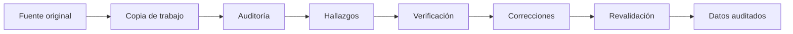
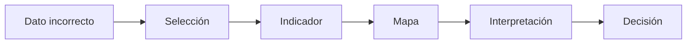
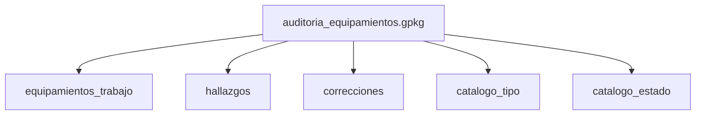
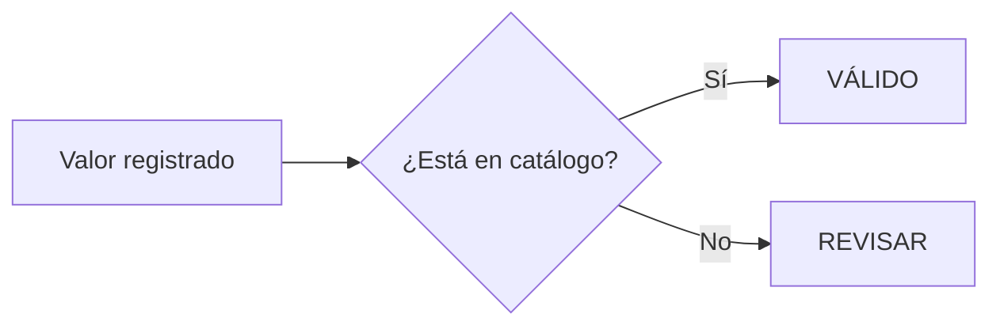
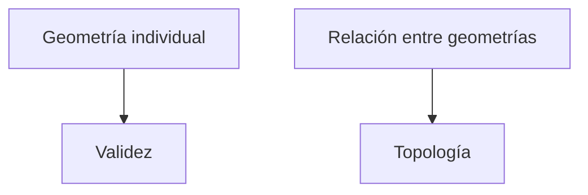
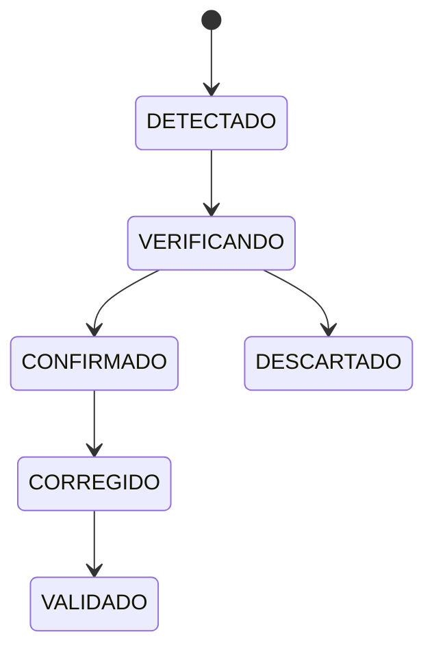
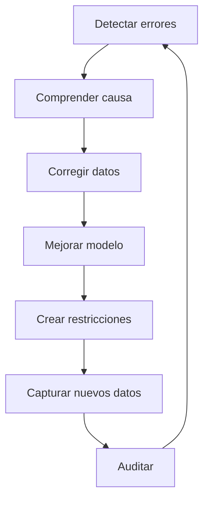
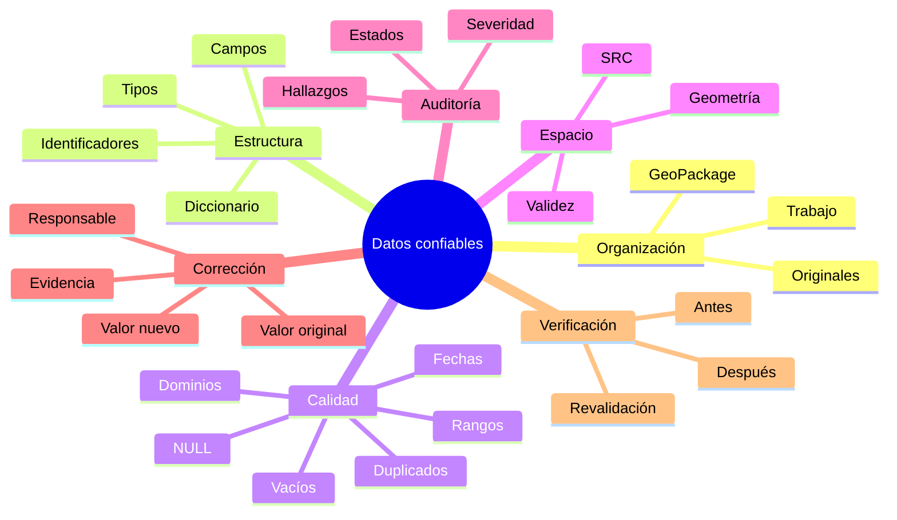
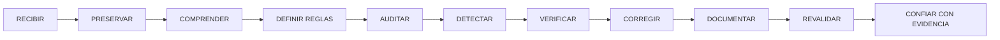

# 3.1 Preparar datos confiables

<div class="grid cards" markdown>

-   :material-database-search:{ .lg .middle } **Diagnosticar**

    ---

    Detectar:

    **NULL, duplicados, valores inválidos, anomalías y problemas espaciales.**

-   :material-database-cog:{ .lg .middle } **Organizar**

    ---

    Separar:

    **originales, datos de trabajo y resultados auditados.**

-   :material-shield-check:{ .lg .middle } **Validar**

    ---

    Convertir:

    > “esto parece raro”

    en:

    **reglas verificables.**

-   :material-history:{ .lg .middle } **Documentar**

    ---

    Registrar:

    **valor original + valor nuevo + motivo + evidencia.**

</div>

[Comenzar](#1-comprender-que-significa-confiar-en-un-dato){ .md-button .md-button--primary }
[Ir al laboratorio](#laboratorio-guiado-auditar-una-base-con-errores){ .md-button }

---

## La misión de esta lección

Al finalizar esta lección deberías poder responder, con evidencia:

```text
¿Qué contiene esta base?

¿Qué reglas debería cumplir?

¿Qué errores posee?

¿Cuáles son errores confirmados?

¿Qué valores son solamente sospechosos?

¿Qué se corrigió?

¿Por qué se corrigió?

¿Qué problemas continúan pendientes?
```

### Lo que construiremos



---

## Mapa de aprendizaje

<div class="grid cards" markdown>

-   :material-file-tree:{ .lg .middle } **1 · Organizar**

    ---

    Originales, trabajo y resultados.

-   :material-table-cog:{ .lg .middle } **2 · Comprender**

    ---

    Campos, tipos, dominios e identificadores.

-   :material-magnify-scan:{ .lg .middle } **3 · Detectar**

    ---

    NULL, duplicados, rangos y anomalías.

-   :material-map-marker-alert:{ .lg .middle } **4 · Revisar espacio**

    ---

    Geometrías, SRC y ubicación.

-   :material-clipboard-check:{ .lg .middle } **5 · Verificar**

    ---

    Separar sospecha de error confirmado.

-   :material-history:{ .lg .middle } **6 · Corregir con trazabilidad**

    ---

    Registrar cada modificación.

-   :material-check-decagram:{ .lg .middle } **7 · Revalidar**

    ---

    Comprobar que la corrección realmente resolvió el problema.

</div>

---

## Antes de empezar

!!! info "Necesitarás"

    - QGIS 3.44.
    - Una capa vectorial de práctica.
    - Una capa de referencia espacial.
    - Una carpeta de trabajo organizada.
    - Haber completado:
        - 2.5 Convertir una tabla en información geográfica;
        - 2.6 Resolver problemas de coordenadas;
        - 2.7 Leer los datos antes de utilizarlos;
        - 2.12 Construir y entregar un proyecto funcional.

!!! warning "Regla del módulo"

    Durante toda la auditoría trabajaremos bajo este principio:

    > **El archivo original no se modifica.**

---

## 1. Comprender qué significa confiar en un dato

### El problema: una capa puede funcionar y estar equivocada

Una capa puede:

```text
abrir
dibujarse
tener atributos
responder consultas
```

y aun así estar equivocada.

Observa este ejemplo:

| id_equip | nombre | tipo | estado | capacidad |
|---|---|---|---|---:|
| EQ-001 | Centro Norte | SALUD | ACTIVO | 120 |
| EQ-002 | Unidad Central | EDUCACION | ACTIVO | 650 |
| EQ-002 | Unidad Central | EDUCACION | ACTIVO | 650 |
| NULL | Plaza Sur | RECREACION | ACTIVO | 300 |
| EQ-005 | Centro Este | salud | activo | 80 |
| EQ-006 | Hospital Oeste | SALUD | ACTIVO | -25 |
| EQ-007 | Complejo Norte | DEPORTIVO | ACTIVO | 12500 |

### Detecta los problemas antes de continuar

??? question "¿Cuántos problemas puedes identificar?"

    Hay varios candidatos:

    - `EQ-002` aparece dos veces;
    - existe un identificador `NULL`;
    - `salud` difiere de `SALUD`;
    - `activo` difiere de `ACTIVO`;
    - capacidad `-25` parece imposible;
    - `12500` parece extraordinariamente alto.

    Pero atención:

    **todavía no hemos demostrado que todos sean errores.**

### Sospecha no es lo mismo que error

<div class="grid cards" markdown>

-   :material-eye-alert:{ .lg .middle } **Anomalía**

    ---

    Algo llama nuestra atención.

    Ejemplo:

    ```text
    capacidad = 12500
    ```

-   :material-alert-octagon:{ .lg .middle } **Error confirmado**

    ---

    Existe evidencia de que incumple una regla.

    Ejemplo:

    ```text
    capacidad = -25
    ```

    si la variable representa número de personas.

-   :material-check-circle:{ .lg .middle } **Valor válido**

    ---

    Puede parecer extraño y ser correcto.

    Ejemplo:

    ```text
    capacidad = 12500
    ```

    podría corresponder a un gran complejo.

</div>

!!! success "Primera regla de calidad"

    El procedimiento correcto es:

    ```text
    DETECTAR
        ↓
    VERIFICAR
        ↓
    CLASIFICAR
        ↓
    CORREGIR
    ```

    No:

    ```text
    DETECTAR
        ↓
    SUPONER
        ↓
    CORREGIR
    ```

### Tres niveles de confianza

=== "Dato disponible"

    ```text
    Puedo abrirlo.
    ```

    Eso solo demuestra accesibilidad.

=== "Dato utilizable"

    ```text
    Puedo interpretarlo y procesarlo.
    ```

    Tiene estructura suficiente para trabajar.

=== "Dato confiable para el propósito"

    ```text
    Conozco sus limitaciones y he validado
    los aspectos críticos para mi análisis.
    ```

!!! quote "Idea clave"

    **La calidad no es absoluta.**

    Un dato puede ser suficientemente confiable para una tarea y totalmente insuficiente para otra.

### Ejemplo territorial

Una capa de caminos levantada a escala:

```text
1:50 000
```

podría ser adecuada para:

```text
análisis regional
```

pero no para:

```text
replantear el límite exacto de un predio
```

La información no cambió.

Cambió:

```text
el propósito
```

### El error se propaga



Supongamos:

```text
100 equipamientos reales
```

pero:

```text
5 registros duplicados
```

El análisis devuelve:

```text
105 equipamientos
```

Después calculamos:

```text
servicios por distrito
```

El error ya dejó de ser solamente un problema de tabla.

Se convirtió en:

```text
un error territorial
```

!!! danger "QGIS puede ejecutar perfectamente un análisis equivocado"

    El software puede procesar datos incorrectos sin mostrar un error técnico.

---

## 2. Organizar los datos antes de auditarlos

### Preservar el original

Trabajaremos con:

```text
datos/
├── originales/
│   └── equipamientos_recibidos.gpkg
│
└── trabajo/
    └── auditoria_equipamientos.gpkg
```

<div class="grid" markdown>

!!! success "Original"

    Representa:

    ```text
    lo que recibimos
    ```

    No debe modificarse.

!!! info "Trabajo"

    Representa:

    ```text
    lo que estamos revisando
    ```

    Aquí podremos:

    - añadir campos;
    - corregir;
    - normalizar;
    - registrar resultados.

</div>

### Por qué conservar el original

??? question "Imagina que dentro de tres meses alguien pregunta: «¿por qué este valor ahora es 25?»"

    Si sobrescribimos directamente:

    ```text
    -25
    ```

    por:

    ```text
    25
    ```

    sin registrar nada, hemos perdido la historia.

??? success "Con trazabilidad"

    Podemos responder:

    ```text
    Valor original:
    -25

    Valor corregido:
    25

    Motivo:
    error de digitación

    Evidencia:
    ficha física 006

    Fecha:
    2026-09-17
    ```

### GeoPackage como contenedor de trabajo

Un único archivo puede contener:

```text
auditoria_equipamientos.gpkg
│
├── equipamientos_trabajo
├── hallazgos
├── correcciones
├── catalogo_tipo
└── catalogo_estado
```



### GeoPackage no reemplaza el diseño

!!! warning "Un contenedor ordenado puede contener datos mal diseñados"

    Tener:

    ```text
    .gpkg
    ```

    no garantiza:

    ```text
    identificadores correctos
    campos coherentes
    dominios válidos
    geometrías correctas
    ```

### Crear el GeoPackage

Ruta sugerida:

```text
datos/trabajo/auditoria_equipamientos.gpkg
```

Puedes utilizar:

**Capa ▸ Crear capa ▸ Nueva capa GeoPackage…**

o:

**Administrador de fuentes de datos ▸ GeoPackage**

!!! captura "Captura pendiente · 3.1-01"

    - **Tipo:** GIF
    - **Archivo:** `assets/images/modulo-03/3-1/3-1-01-crear-geopackage.gif`
    - **Qué mostrar:** creación del GeoPackage de trabajo.
    - **Ruta en QGIS:** **Capa ▸ Crear capa ▸ Nueva capa GeoPackage…**
    - **Enfatizar:** ubicación, nombre del archivo, nombre de la capa y SRC.
    - **Objetivo didáctico:** que el estudiante identifique exactamente dónde se crea el contenedor de trabajo.

### Copiar la capa original al GeoPackage de trabajo

Una opción práctica es utilizar:

**Exportar ▸ Guardar objetos como…**

y guardar la copia como:

```text
equipamientos_trabajo
```

!!! captura "Captura pendiente · 3.1-02"

    - **Tipo:** GIF
    - **Archivo:** `assets/images/modulo-03/3-1/3-1-02-copiar-capa-trabajo.gif`
    - **Qué mostrar:** exportación de la fuente original hacia el GeoPackage de trabajo.
    - **Enfatizar:** formato GeoPackage, archivo destino y nombre de capa.
    - **Objetivo didáctico:** demostrar cómo preservar la fuente original y trabajar sobre una copia controlada.

---

## 3. Comprender la estructura de los atributos

### Diseñar campos antes de llenarlos

Observa:

```text
dato1
dato2
campo3
nuevo
obs2
final
```

¿Qué significa cada campo?

Probablemente nadie lo sabe sin documentación adicional.

### Un campo debe representar una variable

<div class="grid" markdown>

!!! failure "Mala estructura"

    ```text
    datos =
    "Hospital - Activo - D03 - 120 camas"
    ```

!!! success "Estructura separada"

    ```text
    nombre
    tipo
    estado
    distrito
    capacidad
    ```

</div>

Así podremos:

```text
filtrar
agrupar
contar
calcular
relacionar
validar
```

### Construir un diccionario de datos

| Campo | Significado | Tipo | Unidad | Obligatorio | Único | Dominio |
|---|---|---|---|---|---|---|
| `id_equip` | Código del equipamiento | Texto | — | Sí | Sí | patrón |
| `nombre` | Nombre oficial | Texto | — | Sí | No | — |
| `tipo` | Tipo funcional | Texto | — | Sí | No | catálogo |
| `estado` | Estado operativo | Texto | — | Sí | No | catálogo |
| `capacidad` | Capacidad declarada | Entero | personas | No | No | `>=0` |
| `fecha_reg` | Fecha de registro | Fecha | — | Sí | No | — |

!!! info "El diccionario transforma opiniones en reglas"

    Sin diccionario:

    > `NULL` parece raro.

    Con diccionario:

    > El campo `nombre` es obligatorio, por tanto `NULL` incumple una regla.

### Revisar campos en QGIS

Abre:

**Propiedades de la capa ▸ Campos**

!!! captura "Captura pendiente · 3.1-03"

    - **Tipo:** PNG anotado
    - **Archivo:** `assets/images/modulo-03/3-1/3-1-03-propiedades-campos.png`
    - **Qué mostrar:** pestaña de campos de la capa.
    - **Enfatizar:** nombre, tipo, longitud, alias y restricciones.
    - **Objetivo didáctico:** relacionar el diccionario con la estructura real en QGIS.

### Elegir correctamente los tipos de campo

<div class="grid cards" markdown>

-   :material-format-text:{ .lg .middle } **Texto**

    ---

    Para:

    ```text
    nombres
    códigos
    categorías
    teléfonos
    ```

-   :material-numeric:{ .lg .middle } **Entero**

    ---

    Para cantidades discretas:

    ```text
    0
    15
    125
    ```

-   :material-decimal:{ .lg .middle } **Decimal**

    ---

    Para:

    ```text
    12.5
    98.75
    ```

-   :material-calendar:{ .lg .middle } **Fecha**

    ---

    Para fechas estructuradas.

</div>

### Un número visual puede ser texto

Observa:

```text
00125
```

??? question "¿Número o texto?"

    Si representa:

    ```text
    cantidad
    ```

    probablemente es numérico.

    Si representa:

    ```text
    código
    ```

    probablemente debe ser texto.

??? success "Pregunta correcta"

    No preguntes:

    > ¿Contiene números?

    Pregunta:

    > ¿Necesito realizar operaciones matemáticas con él?

### Ejemplo: teléfono

```text
4261234
```

parece numérico.

Pero no vamos a:

```text
sumarlo
restarlo
promediarlo
```

Además puede contener:

```text
+591
```

Por tanto:

```text
telefono → Texto
```

---

## 4. Auditar identificadores

### Qué debe cumplir un identificador

<div class="grid cards" markdown>

-   :material-check:{ .lg .middle } **Completo**

    ---

    No debería ser `NULL` si todas las entidades requieren identificación.

-   :material-fingerprint:{ .lg .middle } **Único**

    ---

    No debería identificar dos objetos distintos.

-   :material-lock:{ .lg .middle } **Estable**

    ---

    No debería cambiar simplemente porque cambia otro atributo.

-   :material-target:{ .lg .middle } **Inequívoco**

    ---

    Debe señalar una única entidad dentro del universo de trabajo.

</div>

### `fid` no es necesariamente nuestro identificador

| fid | id_equip | nombre |
|---:|---|---|
| 1 | EQ-001 | Centro Norte |
| 2 | EQ-002 | Centro Sur |

```text
fid
→ identificador técnico
```

```text
id_equip
→ identificador del modelo
```

!!! warning "No bases relaciones importantes en un identificador que no controlas"

    Un identificador técnico puede:

    - regenerarse;
    - cambiar al exportar;
    - depender del proveedor.

### Detectar identificadores NULL

```qgis
"id_equip" IS NULL
```

### Detectar cadenas vacías

```qgis
trim("id_equip") = ''
```

### Detectar ambos casos

```qgis
"id_equip" IS NULL
OR
trim("id_equip") = ''
```

### Seleccionar por expresión en QGIS

Abre:

**Tabla de atributos ▸ Seleccionar por expresión**

!!! captura "Captura pendiente · 3.1-04"

    - **Tipo:** GIF
    - **Archivo:** `assets/images/modulo-03/3-1/3-1-04-seleccionar-null.gif`
    - **Qué mostrar:** selección por expresión usando:

      ```qgis
      "id_equip" IS NULL
      OR trim("id_equip") = ''
      ```

    - **Objetivo didáctico:** traducir una regla de calidad en una acción concreta dentro de QGIS.

### Revisar formato

Si la regla oficial fuera:

```text
EQ-00000
```

podemos investigar valores como:

```text
EQ-00001
eq-00002
EQ00003
EQ-4
0045
NULL
```

??? question "¿Cuáles cumplen el patrón visual `EQ-00000`?"

    Solo:

    ```text
    EQ-00001
    ```

??? question "¿Los otros son automáticamente incorrectos?"

    No.

    Primero debemos confirmar que ese patrón sea realmente una regla oficial.

---

## 5. Comprender valores ausentes

### NULL, vacío y cero

<div class="grid cards" markdown>

-   :material-null:{ .lg .middle } **NULL**

    ---

    ```text
    no existe valor registrado
    ```

-   :material-format-text:{ .lg .middle } **''**

    ---

    ```text
    cadena de texto vacía
    ```

-   :material-numeric-0:{ .lg .middle } **0**

    ---

    ```text
    valor numérico conocido
    ```

</div>

### Caso aplicado

Campo:

```text
numero_camas
```

=== "`NULL`"

    Puede significar:

    ```text
    no conocemos el número
    ```

=== "`0`"

    Significa:

    ```text
    sabemos que no tiene camas
    ```

=== "`999`"

    Podría significar:

    ```text
    código especial
    ```

    pero solo si existe documentación que lo establezca.

!!! danger "No conviertas todos los NULL en cero"

    Estarías transformando:

    ```text
    desconocido
    ```

    en:

    ```text
    conocido e igual a cero
    ```

### Medir completitud

Supongamos:

```text
200 registros
```

y:

```text
nombre
```

es obligatorio.

Tenemos:

```text
196 completos
4 faltantes
```

Entonces:

```text
196 / 200 × 100 = 98 %
```

| Campo | Obligatorio | Registros | Faltantes | Completitud |
|---|---|---:|---:|---:|
| `id_equip` | Sí | 200 | 0 | 100 % |
| `nombre` | Sí | 200 | 4 | 98 % |
| `tipo` | Sí | 200 | 2 | 99 % |
| `telefono` | No | 200 | 85 | — |

!!! tip "La completitud necesita contexto"

    No tiene sentido penalizar:

    ```text
    telefono
    ```

    por tener `NULL` si el campo es opcional.

---

## 6. Detectar duplicados

### No todos los duplicados significan lo mismo

=== "ID duplicado"

    ```text
    EQ-001
    EQ-001
    ```

    Si el identificador debe ser único:

    ```text
    problema confirmado
    ```

=== "Fila duplicada"

    Dos registros comparten:

    ```text
    todos los atributos
    +
    geometría
    ```

    Es una fuerte señal de duplicación.

=== "Geometría duplicada"

    Dos registros ocupan exactamente el mismo lugar.

    Pero podrían representar objetos diferentes.

=== "Nombre duplicado"

    ```text
    Plaza Principal
    Plaza Principal
    ```

    Puede ser perfectamente válido.

### Caso espacial

Dos registros:

```text
EQ-015
Centro de Salud
```

y:

```text
EQ-087
Farmacia Municipal
```

poseen exactamente la misma coordenada.

??? question "¿Eliminarías uno?"

    No.

??? success "Posible explicación"

    Ambos servicios podrían funcionar dentro del mismo edificio.

    Mismo lugar:

    ```text
    ≠
    ```

    misma entidad.

### Detectar duplicados en QGIS

Podemos utilizar herramientas de Procesamiento para identificar coincidencias por atributos.

Busca en la:

**Caja de herramientas de Procesos**

una herramienta de duplicados por atributo.

!!! captura "Captura pendiente · 3.1-05"

    - **Tipo:** GIF
    - **Archivo:** `assets/images/modulo-03/3-1/3-1-05-detectar-duplicados.gif`
    - **Qué mostrar:** ejecución del algoritmo de duplicados por atributo.
    - **Enfatizar:** capa de entrada, campo utilizado y salida de duplicados.
    - **Objetivo didáctico:** diferenciar detección de eliminación.

!!! warning "No uses el nombre de la herramienta como orden"

    Que el algoritmo se llame:

    ```text
    Eliminar duplicados
    ```

    no significa que debas eliminar sin investigar.

---

## 7. Auditar dominios, rangos y fechas

### Dominios y categorías

Campo:

```text
estado
```

debería admitir:

```text
ACTIVO
INACTIVO
EN_CONSTRUCCION
```

pero encontramos:

```text
ACTIVO
Activo
activo
A
PENDIENTE
NULL
```

### Tabla catálogo

Podemos crear:

```text
catalogo_estado
```

| codigo | descripcion |
|---|---|
| ACTIVO | En funcionamiento |
| INACTIVO | Fuera de funcionamiento |
| EN_CONSTRUCCION | En construcción |



### Revisar valores únicos en QGIS

Utiliza las herramientas de estadísticas o valores únicos del campo.

!!! captura "Captura pendiente · 3.1-06"

    - **Tipo:** PNG anotado
    - **Archivo:** `assets/images/modulo-03/3-1/3-1-06-valores-unicos.png`
    - **Qué mostrar:** lista de valores únicos de `tipo` y `estado`.
    - **Objetivo didáctico:** detectar variantes de categorías.

### No normalizar por intuición

Encontramos:

```text
PENDIENTE
```

??? question "¿Lo convertirías en INACTIVO?"

    No.

    Podría representar un estado diferente que aún no ha sido incorporado al catálogo.

### Rangos numéricos

Campo:

```text
capacidad
```

Regla:

```text
capacidad >= 0
```

Entonces:

```text
-25
```

incumple una regla explícita.

Pero:

```text
12500
```

no incumple necesariamente esa regla.

Puede ser:

```text
valor atípico
```

### Inválido vs atípico

<div class="grid" markdown>

!!! failure "Inválido"

    ```text
    capacidad = -25
    ```

    Si representa número de personas:

    ```text
    incumple la regla
    ```

!!! warning "Atípico"

    ```text
    capacidad = 12500
    ```

    Es extraordinario.

    Pero podría ser real.

</div>

!!! important "Atípico no significa incorrecto"

### Revisar estadísticas en QGIS

Para campos numéricos revisa:

```text
mínimo
máximo
media
mediana
NULL
```

!!! captura "Captura pendiente · 3.1-07"

    - **Tipo:** GIF
    - **Archivo:** `assets/images/modulo-03/3-1/3-1-07-estadisticas-campo.gif`
    - **Qué mostrar:** panel o herramienta de estadísticas de un campo numérico.
    - **Objetivo didáctico:** identificar rangos, extremos y valores ausentes.

### Fechas

Campo:

```text
fecha_registro
```

Encontramos:

```text
2096-05-01
```

en un inventario levantado en 2026.

Eso constituye:

```text
una anomalía muy fuerte
```

pero debemos verificar.

Si tenemos:

```text
fecha_apertura
fecha_cierre
```

podemos establecer:

```text
fecha_cierre >= fecha_apertura
```

cuando ambas existan.

---

## 8. Auditar la dimensión espacial

### Calidad geométrica

<div class="grid cards" markdown>

-   :material-map-marker-off:{ .lg .middle } **Sin geometría**

    ---

    Existe registro pero no ubicación.

-   :material-vector-polygon-variant:{ .lg .middle } **Geometría inválida**

    ---

    Su construcción geométrica presenta errores.

-   :material-content-duplicate:{ .lg .middle } **Geometría duplicada**

    ---

    Dos entidades poseen exactamente la misma geometría.

-   :material-map-marker-alert:{ .lg .middle } **Ubicación sospechosa**

    ---

    La geometría está lejos del área esperada.

</div>

### Geometría válida no significa topología correcta

```text
Polígono A → válido
Polígono B → válido
```

pero:

```text
A y B se superponen
```

Si representan distritos exclusivos:

```text
problema topológico
```

Si representan áreas de cobertura:

```text
puede ser correcto
```



!!! info "Lo profundizaremos en 3.2"

    En esta lección detectamos.

    En **3.2 Digitalizar y editar con precisión** aprenderemos a prevenir y corregir estos problemas.

### Comprobar validez

Desde la:

**Caja de herramientas de Procesos**

busca:

```text
Comprobar validez
```

!!! captura "Captura pendiente · 3.1-08"

    - **Tipo:** GIF
    - **Archivo:** `assets/images/modulo-03/3-1/3-1-08-comprobar-validez.gif`
    - **Qué mostrar:** algoritmo **Comprobar validez**.
    - **Enfatizar:** capa de entrada, configuración, salidas válidas, inválidas y errores.
    - **Objetivo didáctico:** diferenciar inspección visual de validación geométrica.

### El SRC también forma parte de la calidad

Una capa puede tener:

```text
atributos perfectos
```

y:

```text
SRC incorrecto
```

El resultado espacial seguirá siendo problemático.

Registra:

```text
SRC declarado
unidades
extensión
coordenadas aproximadas
área de uso
```

### Revisar propiedades del SRC en QGIS

Abre:

**Propiedades de la capa ▸ Información / Fuente**

!!! captura "Captura pendiente · 3.1-09"

    - **Tipo:** PNG anotado
    - **Archivo:** `assets/images/modulo-03/3-1/3-1-09-propiedades-src.png`
    - **Qué mostrar:** SRC, extensión y sistema de coordenadas de la capa.
    - **Objetivo didáctico:** que el estudiante identifique dónde revisar la referencia espacial antes de modificarla.

### Diagnóstico del SRC

Supongamos:

```text
X ≈ 795000
Y ≈ 8075000
```

y la capa está declarada como:

```text
EPSG:4326
```

??? question "¿Tiene sentido?"

    No.

    EPSG:4326 utiliza coordenadas geográficas en grados.

    Valores como:

    ```text
    795000
    8075000
    ```

    parecen coordenadas proyectadas.

??? warning "Pero aún no sabemos qué SRC es"

    El diagnóstico correcto es:

    ```text
    SRC declarado parece incorrecto
    ```

    No:

    ```text
    debe ser EPSG:32719
    ```

    hasta contar con evidencia.

### Asignar no es reproyectar

=== "Asignar SRC"

    Se utiliza cuando:

    ```text
    las coordenadas son correctas
    pero están interpretadas con el SRC equivocado
    ```

=== "Reproyectar"

    Se utiliza cuando:

    ```text
    conocemos correctamente el SRC de origen
    y necesitamos transformar las coordenadas
    a otro sistema
    ```

!!! danger "Cambiar EPSG hasta que la capa «encaje» no es diagnóstico"

---

## 9. Registrar hallazgos

### Construir la tabla de hallazgos

Crearemos dentro del GeoPackage:

```text
hallazgos
```

| Campo | Función |
|---|---|
| `id_hallazgo` | Identificador |
| `id_entidad` | Entidad afectada |
| `campo` | Campo afectado |
| `tipo_error` | Tipo |
| `valor` | Valor encontrado |
| `regla` | Regla evaluada |
| `severidad` | Impacto |
| `estado` | Estado de revisión |
| `observacion` | Explicación |
| `fecha` | Fecha |

### Catálogo de hallazgos

<div class="grid cards" markdown>

-   `ID_NULO`
-   `ID_DUPLICADO`
-   `CAMPO_NULO`
-   `DOMINIO_INVALIDO`
-   `VALOR_FUERA_RANGO`
-   `VALOR_ATIPICO`
-   `FECHA_INCONSISTENTE`
-   `GEOMETRIA_DUPLICADA`
-   `GEOMETRIA_INVALIDA`
-   `SRC_DUDOSO`
-   `OTRO`

</div>

### Estados del hallazgo



=== "DETECTADO"

    Se encontró una anomalía.

=== "VERIFICANDO"

    Estamos buscando evidencia.

=== "CONFIRMADO"

    Sabemos que incumple una regla.

=== "DESCARTADO"

    Parecía incorrecto pero resultó válido.

=== "CORREGIDO"

    Se modificó.

=== "VALIDADO"

    Se comprobó nuevamente después de corregir.

### Severidad

<div class="grid cards" markdown>

-   :material-circle-outline:{ .lg .middle } **Baja**

    ---

    Impacto principalmente descriptivo.

-   :material-alert-outline:{ .lg .middle } **Media**

    ---

    Puede afectar interpretación.

-   :material-alert:{ .lg .middle } **Alta**

    ---

    Puede alterar resultados.

-   :material-alert-octagon:{ .lg .middle } **Crítica**

    ---

    Puede impedir utilizar correctamente el conjunto.

</div>

| Hallazgo | Severidad posible |
|---|---|
| Observación con mayúsculas inconsistentes | Baja |
| Categoría fuera de dominio | Media |
| ID duplicado usado en relaciones | Alta |
| SRC desconocido para análisis métrico | Crítica |

!!! warning "La severidad depende del uso"

    Un teléfono faltante puede tener:

    ```text
    bajo impacto
    ```

    para análisis espacial,

    pero:

    ```text
    alto impacto
    ```

    para una campaña de contacto.

---

## 10. Corregir con trazabilidad

### Construir la bitácora de correcciones

Crearemos:

```text
correcciones
```

| Campo | Significado |
|---|---|
| `id_correccion` | Identificador |
| `id_entidad` | Entidad |
| `campo` | Campo |
| `valor_original` | Antes |
| `valor_nuevo` | Después |
| `motivo` | Justificación |
| `evidencia` | Fuente |
| `responsable` | Quién |
| `fecha_hora` | Cuándo |

### Ejemplo

| entidad | campo | original | nuevo | motivo |
|---|---|---|---|---|
| EQ-006 | capacidad | `-25` | `25` | Digitación confirmada |
| EQ-005 | estado | `activo` | `ACTIVO` | Normalización |
| EQ-007 | capacidad | `12500` | `12500` | Confirmado como válido |

### Registrar también valores confirmados

Observa:

```text
EQ-007
```

No cambió.

Pero quedó documentado que:

```text
se investigó
```

y:

```text
se confirmó
```

!!! success "Validar también es un resultado"

### Corrección destructiva frente a corrección trazable

<div class="grid" markdown>

!!! failure "Destructiva"

    ```text
    -25
      ↓
     25
    ```

    Después no sabemos qué ocurrió.

!!! success "Trazable"

    ```text
    original = -25
    nuevo = 25
    evidencia = ficha 006
    motivo = error digitación
    ```

</div>

### Registrar correcciones en QGIS

!!! captura "Captura pendiente · 3.1-10"

    - **Tipo:** GIF
    - **Archivo:** `assets/images/modulo-03/3-1/3-1-10-registrar-correccion.gif`
    - **Qué mostrar:** edición de un valor incorrecto y registro simultáneo en la tabla `correcciones`.
    - **Objetivo didáctico:** visualizar que la corrección y la trazabilidad forman parte del mismo proceso.

### Definir reglas explícitas

#### Identificador obligatorio

```qgis
"id_equip" IS NOT NULL
```

#### Texto real

```qgis
length(trim("nombre")) > 0
```

#### Capacidad

```qgis
"capacidad" IS NULL
OR
"capacidad" >= 0
```

#### Estado permitido

```qgis
"estado" IN (
    'ACTIVO',
    'INACTIVO',
    'EN_CONSTRUCCION'
)
```

!!! info "La regla convierte una opinión en una prueba"

    Antes:

    > “ese valor parece incorrecto”.

    Después:

    > “ese valor incumple la regla `capacidad >= 0`”.

---

## 11. Medir la calidad antes y después

### Perfilado inicial

Completa:

| Elemento | Resultado |
|---|---|
| Archivo | |
| Capa | |
| Formato | |
| Geometría | |
| Registros | |
| Campos | |
| SRC | |
| Unidades | |
| Productor | |
| Fecha | |

### Indicadores de control

| Control | Resultado |
|---|---:|
| ID NULL | |
| ID duplicados | |
| Campos obligatorios incompletos | |
| Categorías fuera de dominio | |
| Valores fuera de rango | |
| Valores atípicos | |
| Geometrías vacías | |
| Geometrías inválidas | |
| SRC dudoso | |

### Revalidar después de corregir

Después de aplicar correcciones debemos repetir:

```text
NULL
duplicados
dominios
rangos
validez
```

### Comparación antes y después

| Indicador | Antes | Después |
|---|---:|---:|
| ID NULL | | |
| ID duplicados | | |
| Categorías inválidas | | |
| Valores fuera de rango | | |
| Geometrías inválidas | | |
| Pendientes | | |

!!! captura "Captura pendiente · 3.1-11"

    - **Tipo:** PNG comparativo
    - **Archivo:** `assets/images/modulo-03/3-1/3-1-11-antes-despues.png`
    - **Qué mostrar:** tabla o panel comparando indicadores antes y después de la auditoría.
    - **Objetivo didáctico:** cerrar visualmente el ciclo de mejora.

---

## Checkpoint

Antes de continuar, deberías poder responder:

- [ ] ¿Qué diferencia existe entre anomalía y error?
- [ ] ¿Por qué debemos conservar el original?
- [ ] ¿Qué función tiene un diccionario de datos?
- [ ] ¿Qué diferencia existe entre `NULL`, vacío y cero?
- [ ] ¿Por qué un código puede ser texto?
- [ ] ¿Qué hace que un identificador sea confiable?
- [ ] ¿Por qué un valor atípico no debe eliminarse automáticamente?
- [ ] ¿Por qué debemos revisar también geometrías y SRC?
- [ ] ¿Qué diferencia existe entre detectar y corregir?
- [ ] ¿Por qué debemos revalidar?

??? tip "Si alguna respuesta no está clara"

    Regresa a esa sección antes de continuar.

---

## Laboratorio guiado: auditar una base con errores

!!! example "Escenario"

    Has recibido:

    ```text
    equipamientos_auditoria.gpkg
    ```

    La base contiene errores preparados deliberadamente.

    Tu tarea consiste en:

    ```text
    detectar
    verificar
    corregir
    documentar
    revalidar
    ```

### Fase 1 · Preservar el original

Guarda:

```text
datos/originales/equipamientos_auditoria.gpkg
```

No lo edites.

Crea:

```text
datos/trabajo/auditoria_equipamientos.gpkg
```

Copia la capa como:

```text
equipamientos_trabajo
```

### Fase 2 · Construir el diccionario

Completa:

| Campo | Definición | Tipo | Unidad | Obligatorio | Único | Dominio |
|---|---|---|---|---|---|---|
| | | | | | | |

### Fase 3 · Auditar identificadores

Busca:

```qgis
"id_equip" IS NULL
OR
trim("id_equip") = ''
```

Registra:

```text
número de faltantes:
```

Después busca duplicados.

Registra:

```text
IDs repetidos:
```

### Fase 4 · Auditar categorías

Obtén valores únicos de:

```text
tipo
estado
```

Completa:

| Campo | Valor | Frecuencia | ¿Válido? |
|---|---|---:|---|
| | | | |

### Fase 5 · Auditar números

Para:

```text
capacidad
```

registra:

```text
mínimo
máximo
media
mediana
NULL
```

Clasifica por separado:

```text
fuera de rango
```

y:

```text
atípicos
```

### Fase 6 · Auditar fechas

Busca:

```text
fechas futuras inesperadas
fechas imposibles
NULL
```

según las reglas de la fuente.

### Fase 7 · Auditar geometrías

Ejecuta:

```text
Comprobar validez
```

Registra:

```text
válidas:
inválidas:
vacías:
```

### Fase 8 · Revisar el SRC

Registra:

```text
SRC declarado:
unidades:
extensión:
coordenadas aproximadas:
```

Haz una comprobación visual con una capa de referencia conocida.

### Fase 9 · Crear hallazgos

Crea:

```text
hallazgos
```

y registra cada anomalía relevante.

| entidad | campo | problema | severidad | estado |
|---|---|---|---|---|
| EQ-002 | ID | duplicado | Alta | VERIFICANDO |
| — | ID | NULL | Alta | CONFIRMADO |
| EQ-006 | capacidad | negativo | Alta | CONFIRMADO |
| EQ-007 | capacidad | atípico | Media | VERIFICANDO |

### Fase 10 · Verificar

Para cada hallazgo determina:

```text
¿qué evidencia necesito?
```

Puede ser:

- ficha original;
- catálogo;
- documento;
- responsable;
- capa de referencia;
- metadatos.

### Fase 11 · Corregir

Aplica únicamente correcciones confirmadas.

Cada corrección debe registrar:

```text
valor original
valor nuevo
motivo
evidencia
```

### Fase 12 · Revalidar

Vuelve a ejecutar:

```text
NULL
duplicados
dominios
rangos
validez
```

### Evidencia del laboratorio

!!! captura "Captura pendiente · 3.1-12"

    - **Tipo:** Imagen compuesta
    - **Archivo:** `assets/images/modulo-03/3-1/3-1-12-laboratorio.png`
    - **Qué mostrar:** cuatro paneles:
        1. datos originales;
        2. hallazgos detectados;
        3. correcciones;
        4. resultado revalidado.
    - **Objetivo didáctico:** mostrar visualmente el flujo completo.

---

## Mini-reto: ¿corregir o investigar?

=== "Caso A"

    ```text
    capacidad = -40
    ```

    La regla dice:

    ```text
    >= 0
    ```

    ??? question "¿Qué harías?"

        Marcar:

        ```text
        ERROR CONFIRMADO
        ```

        pero todavía debemos investigar cuál es el valor correcto.

=== "Caso B"

    ```text
    capacidad = 15000
    ```

    La mayoría está entre:

    ```text
    10 y 500
    ```

    ??? question "¿Qué harías?"

        Marcar:

        ```text
        VALOR ATÍPICO
        ```

        y verificar.

        No corregir automáticamente.

=== "Caso C"

    Dos puntos comparten exactamente las mismas coordenadas.

    ??? question "¿Eliminar uno?"

        No.

        Primero debemos comprobar si representan:

        ```text
        el mismo objeto
        ```

        o:

        ```text
        dos servicios en la misma ubicación
        ```

=== "Caso D"

    La capa está desplazada.

    ??? question "¿Cambiar EPSG hasta que coincida?"

        No.

        Primero debemos diagnosticar:

        ```text
        SRC original
        metadatos
        coordenadas
        área de uso
        ```

---

## El ciclo de calidad



!!! quote "La calidad no es una limpieza que se realiza una vez"

    Es un proceso continuo.

---

## Del error a la prevención

Lo encontrado en 3.1 alimentará directamente 3.3.

| Error detectado | Prevención futura |
|---|---|
| ID NULL | `NOT NULL` |
| ID duplicado | `UNIQUE` |
| Estado inconsistente | Mapa de valores |
| Capacidad negativa | Restricción |
| Nombre vacío | Expresión |
| Fecha manual incorrecta | Predeterminado |
| Campo técnico alterado | Solo lectura |

Así convertimos:

```text
AUDITORÍA
```

en:

```text
DISEÑO DE CALIDAD
```

---

## Reto práctico

!!! example "Reto 3.1 — Auditar un conjunto de datos con errores preparados"

    ### Contexto

    Recibiste una capa de equipamientos preparada deliberadamente con:

    - identificadores faltantes;
    - identificadores repetidos;
    - categorías inconsistentes;
    - valores numéricos inválidos;
    - valores atípicos;
    - geometrías problemáticas;
    - posibles problemas de SRC.

    El objetivo no es:

    ```text
    dejar todo bonito
    ```

    sino:

    ```text
    construir evidencia sobre la calidad de la base
    ```

    ### Misión 1 · Preservar el original

    Mantén:

    ```text
    datos/originales/equipamientos_auditoria.gpkg
    ```

    intacto.

    ### Misión 2 · Crear el entorno de auditoría

    Crea:

    ```text
    datos/trabajo/auditoria_equipamientos.gpkg
    ```

    con:

    ```text
    equipamientos_trabajo
    hallazgos
    correcciones
    ```

    ### Misión 3 · Construir el diccionario

    Documenta todos los campos relevantes.

    ### Misión 4 · Auditar identificadores

    Detecta:

    ```text
    NULL
    vacíos
    duplicados
    formatos extraños
    ```

    ### Misión 5 · Auditar categorías

    Revisa:

    ```text
    tipo
    estado
    distrito
    ```

    contra los dominios establecidos.

    ### Misión 6 · Auditar valores numéricos

    Identifica:

    ```text
    fuera de rango
    ```

    y:

    ```text
    valores atípicos
    ```

    como categorías separadas.

    ### Misión 7 · Auditar fechas

    Busca inconsistencias temporales.

    ### Misión 8 · Auditar geometrías

    Ejecuta:

    ```text
    Comprobar validez
    ```

    y documenta los resultados.

    ### Misión 9 · Revisar SRC

    Registra:

    ```text
    SRC
    unidades
    extensión
    coordenadas aproximadas
    ```

    ### Misión 10 · Clasificar hallazgos

    Usa:

    ```text
    DETECTADO
    VERIFICANDO
    CONFIRMADO
    DESCARTADO
    CORREGIDO
    VALIDADO
    ```

    ### Misión 11 · Corregir con evidencia

    Ninguna corrección puede realizarse únicamente porque:

    ```text
    parece obvia
    ```

    ### Misión 12 · Revalidar

    Repite todos los controles.

    ### Misión 13 · Comparar antes y después

    Completa:

    | Indicador | Antes | Después |
    |---|---:|---:|
    | ID NULL | | |
    | ID duplicados | | |
    | Categorías inválidas | | |
    | Valores fuera de rango | | |
    | Geometrías inválidas | | |
    | Pendientes | | |

    ### Misión 14 · Elaborar conclusión

    Redacta entre **180 y 250 palabras** explicando:

    - qué problemas encontraste;
    - cuáles fueron errores confirmados;
    - cuáles eran solamente anomalías;
    - cuáles resultaron válidos;
    - qué correcciones aplicaste;
    - qué evidencia utilizaste;
    - qué problemas permanecen pendientes;
    - qué controles implementarías para prevenirlos.

    ### Entregables

    - `reto_3-1_auditoria.qgz`;
    - `auditoria_equipamientos.gpkg`;
    - `equipamientos_trabajo`;
    - tabla `hallazgos`;
    - tabla `correcciones`;
    - diccionario de datos;
    - ficha inicial;
    - comparación antes/después;
    - captura de duplicados;
    - captura de categorías inconsistentes;
    - captura de control geométrico;
    - conclusión técnica.

---

## Criterios de evaluación

??? success "Ver rúbrica"

    | Criterio | Se cumple si... |
    |---|---|
    | Original | Se conserva intacto |
    | GeoPackage | La auditoría está organizada |
    | Diccionario | Los campos están documentados |
    | Identificador | Se revisan NULL, unicidad y formato |
    | NULL | Se diferencian de cero y vacío |
    | Duplicados | Se investigan antes de eliminar |
    | Dominios | Se comparan con reglas conocidas |
    | Rangos | Se distinguen inválidos de atípicos |
    | Fechas | Se revisa coherencia temporal |
    | SRC | Se comprueba antes de modificar |
    | Geometría | Se comprueba validez |
    | Hallazgos | Se registran estructuradamente |
    | Evidencia | Toda corrección tiene respaldo |
    | Trazabilidad | Se conserva valor anterior y nuevo |
    | Revalidación | Los controles se repiten |
    | Transparencia | Los pendientes permanecen visibles |
    | Resultado | La calidad final puede demostrarse |

---

## Errores frecuentes

=== "La capa abre, por tanto está correcta"

    No.

    Abrir demuestra:

    ```text
    accesibilidad
    ```

    no:

    ```text
    calidad
    ```

=== "Corregí directamente el original"

    Has perdido capacidad de comparar.

    Utiliza:

    ```text
    original
    +
    copia de trabajo
    ```

=== "Eliminé todos los duplicados"

    Probablemente asumiste que toda coincidencia representa el mismo objeto.

    Verifica primero.

=== "Convertí NULL a cero"

    Puede haber cambiado el significado de la variable.

=== "Corregí todos los valores extremos"

    Atípico no significa incorrecto.

=== "La capa estaba desplazada y cambié el EPSG"

    Nunca utilices prueba y error para resolver SRC.

=== "Corregí los errores pero no repetí los controles"

    No puedes demostrar que la base quedó correctamente corregida.

---

## Desafío de 5 minutos

!!! challenge "Clasifica cada caso"

    Indica si representa:

    ```text
    ERROR
    ANOMALÍA
    DATO VÁLIDO
    NECESITA CONTEXTO
    ```

    **Caso 1**

    ```text
    capacidad = -15
    ```

    y la regla exige `>= 0`.

    **Caso 2**

    ```text
    capacidad = 15000
    ```

    sin límite superior definido.

    **Caso 3**

    Dos servicios diferentes poseen la misma coordenada.

    **Caso 4**

    `telefono = NULL` y el campo es opcional.

    **Caso 5**

    `id_equip = NULL` y el ID es obligatorio.

??? success "Solución"

    **1 — ERROR**

    Incumple una regla explícita.

    **2 — ANOMALÍA**

    Es atípico, pero necesita verificación.

    **3 — NECESITA CONTEXTO**

    Pueden funcionar en el mismo lugar.

    **4 — DATO VÁLIDO**

    Si el campo es opcional.

    **5 — ERROR**

    Incumple la obligatoriedad.

---

## Ideas clave

<div class="grid cards" markdown>

-   :material-database-lock:{ .lg .middle } **Preserva**

    ---

    Nunca pierdas el original.

-   :material-book-open-variant:{ .lg .middle } **Define**

    ---

    Un diccionario convierte atributos en variables comprensibles.

-   :material-magnify:{ .lg .middle } **Detecta**

    ---

    Encontrar una anomalía no significa haber demostrado un error.

-   :material-check-decagram:{ .lg .middle } **Verifica**

    ---

    Toda corrección necesita evidencia.

-   :material-history:{ .lg .middle } **Registra**

    ---

    Mantén trazabilidad.

-   :material-reload:{ .lg .middle } **Revalida**

    ---

    Después de corregir, vuelve a comprobar.

</div>

!!! success "Para recordar"

    - Una capa que abre puede contener errores graves.
    - Confiable no significa perfecto.
    - La calidad depende del propósito.
    - El original debe conservarse.
    - GeoPackage facilita la organización, pero no garantiza calidad.
    - Un diccionario de datos documenta significado y reglas.
    - El tipo de campo debe corresponder al significado.
    - Un código numérico puede ser texto.
    - Un identificador debe ser estable y único cuando corresponda.
    - `fid` no es necesariamente un ID institucional.
    - `NULL`, vacío y cero son conceptos diferentes.
    - La completitud debe evaluarse respecto de campos obligatorios.
    - Existen diferentes tipos de duplicación.
    - Coincidencia geométrica no implica necesariamente duplicación conceptual.
    - Un valor extremo no es automáticamente incorrecto.
    - Dominios y rangos deben estar documentados.
    - La geometría también forma parte de la calidad.
    - La validez individual no es igual a topología.
    - El SRC forma parte de la calidad estructural.
    - Nunca se debe cambiar el SRC mediante prueba y error.
    - Los hallazgos deben registrarse antes de corregirse.
    - Toda corrección debería conservar evidencia.
    - También debe registrarse cuando una anomalía se confirma como válida.
    - Después de corregir hay que revalidar.
    - La auditoría debe alimentar controles preventivos futuros.

---

## Autoevaluación

??? question "1. ¿Una capa que abre correctamente puede contener errores?"

    Sí.

    Puede contener errores de atributos, geometría, SRC o modelo aunque QGIS pueda visualizarla.

??? question "2. ¿Qué significa que un dato sea confiable?"

    Que conocemos suficientemente su estructura, calidad y limitaciones para utilizarlo en un propósito concreto.

??? question "3. ¿Por qué debemos conservar el original?"

    Para mantener trazabilidad y poder reconstruir la historia de los cambios.

??? question "4. ¿Qué función cumple GeoPackage?"

    Permite organizar múltiples capas y tablas en un único contenedor espacial.

??? question "5. ¿GeoPackage garantiza calidad?"

    No.

??? question "6. ¿Para qué sirve un diccionario de datos?"

    Para documentar el significado, tipo, unidad, dominio y reglas de cada campo.

??? question "7. ¿Por qué `00125` puede ser texto?"

    Porque puede representar un código y los ceros iniciales formar parte de su identidad.

??? question "8. ¿Qué diferencia existe entre `fid` e `id_equip`?"

    `fid` puede ser una clave técnica del proveedor; `id_equip` puede representar la identificación del objeto dentro del modelo institucional.

??? question "9. ¿NULL equivale a cero?"

    No.

??? question "10. ¿Una geometría duplicada implica necesariamente registro duplicado?"

    No.

??? question "11. ¿Qué diferencia existe entre un valor inválido y uno atípico?"

    El inválido incumple una regla. El atípico se aparta del comportamiento esperado pero puede ser correcto.

??? question "12. ¿Qué es un dominio?"

    El conjunto de valores permitidos para un atributo.

??? question "13. ¿Qué diferencia existe entre validez geométrica y topología?"

    La primera evalúa la estructura individual de una geometría; la segunda determinadas relaciones entre varias geometrías.

??? question "14. ¿Qué debe hacerse si el SRC parece incorrecto?"

    Investigar metadatos, coordenadas y contexto antes de asignar o reproyectar.

??? question "15. ¿Qué diferencia existe entre asignar SRC y reproyectar?"

    Asignar cambia la interpretación del sistema de coordenadas; reproyectar transforma las coordenadas de un SRC conocido hacia otro.

??? question "16. ¿Qué es un hallazgo?"

    Una anomalía o incumplimiento detectado durante la auditoría.

??? question "17. ¿Qué significa estado VERIFICANDO?"

    Que todavía estamos buscando evidencia para determinar si la anomalía es realmente un error.

??? question "18. ¿Por qué registrar valores que finalmente resultaron correctos?"

    Porque la validación también forma parte de la historia de calidad del dato.

??? question "19. ¿Por qué debemos revalidar después de corregir?"

    Porque la corrección puede ser incompleta o introducir nuevos errores.

??? question "20. ¿Cuál es la secuencia principal?"

    ```text
    detectar
    → verificar
    → corregir
    → documentar
    → revalidar
    ```

---

## Mapa mental



---

## Cierre



!!! quote "La idea que debe permanecer"

    La pregunta profesional no es:

    > **¿Puedo utilizar esta capa?**

    sino:

    > **¿Qué evidencia tengo de que sus atributos, identificadores, geometrías y referencia espacial son suficientemente confiables para el análisis que quiero realizar?**

---

## Siguiente lección

<div class="grid cards" markdown>

-   :material-database-check:{ .lg .middle } **Lo que hicimos**

    ---

    Aprendimos a:

    ```text
    detectar
    verificar
    corregir
    validar
    ```

    datos existentes.

-   :material-vector-polygon-edit:{ .lg .middle } **Lo que viene**

    ---

    En **3.2 Digitalizar y editar con precisión** aprenderemos a evitar que muchos errores geométricos aparezcan desde el momento de la captura.

</div>

[Continuar con 3.2 →](02-digitalizar-editar-precision.md){ .md-button .md-button--primary }

---

## Referencias

- [QGIS 3.44 — Crear capas y GeoPackage](https://docs.qgis.org/3.44/es/docs/user_manual/managing_data_source/create_layers.html)  
  Referencia oficial sobre creación de capas, GeoPackage, geometrías, SRC y tipos de campos.

- [QGIS 3.44 — Propiedades de capas vectoriales](https://docs.qgis.org/3.44/es/docs/user_manual/working_with_vector/vector_properties.html)  
  Documentación de campos, restricciones, fuentes, metadatos y configuración de capas vectoriales.

- [QGIS 3.44 — Tabla de atributos](https://docs.qgis.org/3.44/es/docs/user_manual/working_with_vector/attribute_table.html)  
  Herramientas para explorar, seleccionar y editar registros.

- [QGIS 3.44 — Expresiones](https://docs.qgis.org/3.44/es/docs/user_manual/expressions/expression.html)  
  Referencia para construir reglas de validación y consultas.

- [QGIS 3.44 — Funciones de expresiones](https://docs.qgis.org/3.44/es/docs/user_manual/expressions/functions_list.html)  
  Funciones para trabajar con texto, NULL, condiciones y validaciones.

- [QGIS 3.44 — Algoritmos vectoriales generales](https://docs.qgis.org/3.44/es/docs/user_manual/processing_algs/qgis/vectorgeneral.html)  
  Herramientas relacionadas con duplicados, tablas y procesamiento vectorial.

- [QGIS 3.44 — Herramientas de geometría vectorial](https://docs.qgis.org/3.44/es/docs/user_manual/processing_algs/qgis/vectorgeometry.html)  
  Algoritmos para comprobar, modificar y reparar geometrías.

- [QGIS Training Manual](https://docs.qgis.org/3.44/es/docs/training_manual/)  
  Manual oficial de prácticas y formación de QGIS.

- [Material for MkDocs — Reference](https://squidfunk.github.io/mkdocs-material/reference/)  
  Referencia general de componentes utilizados en esta documentación.

- [Material for MkDocs — Grids](https://squidfunk.github.io/mkdocs-material/reference/grids/)  
  Tarjetas y cuadrículas responsivas.

- [Material for MkDocs — Content tabs](https://squidfunk.github.io/mkdocs-material/reference/content-tabs/)  
  Pestañas de contenido utilizadas para comparaciones.

- [Material for MkDocs — Admonitions](https://squidfunk.github.io/mkdocs-material/reference/admonitions/)  
  Notas, advertencias, bloques desplegables y componentes pedagógicos.

- [Material for MkDocs — Diagrams](https://squidfunk.github.io/mkdocs-material/reference/diagrams/)  
  Integración de Mermaid para diagramas de flujo, estados y mapas mentales.

- [Material for MkDocs — Buttons](https://squidfunk.github.io/mkdocs-material/reference/buttons/)  
  Botones utilizados para navegación pedagógica.

- [Material for MkDocs — Icons and Emojis](https://squidfunk.github.io/mkdocs-material/reference/icons-emojis/)  
  Referencia de iconografía utilizada en tarjetas y elementos visuales.