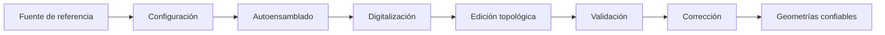
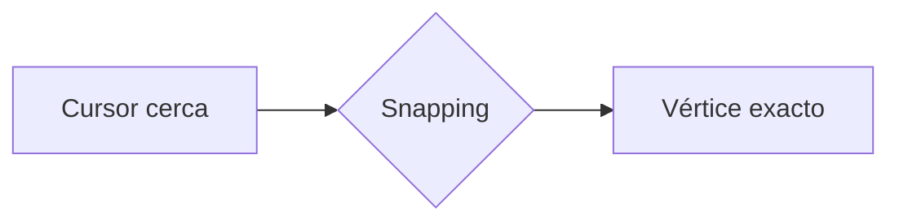
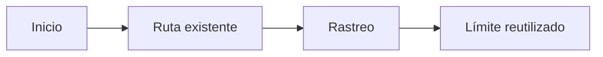
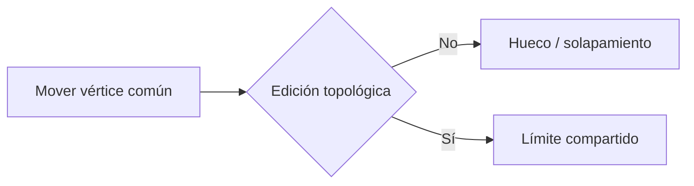
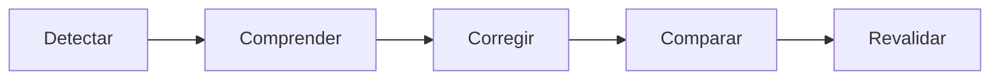
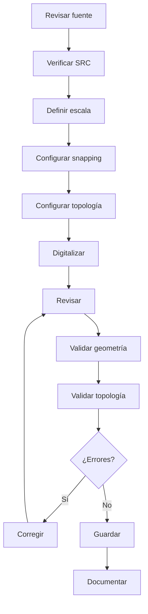
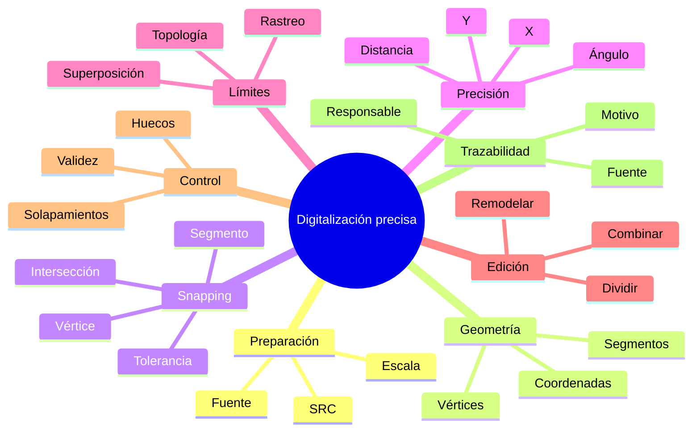
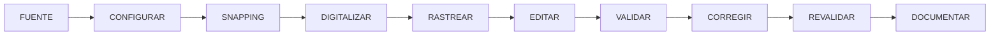

# 3.2 Digitalizar y editar con precisión

<div class="grid cards" markdown>

-   :material-vector-point-edit:{ .lg .middle } **Construir**

    ---

    Crear puntos, líneas y polígonos controlando dónde se ubica cada vértice.

-   :material-magnet:{ .lg .middle } **Conectar**

    ---

    Utilizar **autoensamblado** para evitar vértices casi coincidentes.

-   :material-ruler-square:{ .lg .middle } **Precisar**

    ---

    Trabajar con distancias, ángulos y coordenadas mediante digitalización avanzada.

-   :material-source-branch:{ .lg .middle } **Compartir límites**

    ---

    Mantener coherencia entre geometrías vecinas mediante rastreo y edición topológica.

-   :material-content-cut:{ .lg .middle } **Modificar**

    ---

    Dividir, combinar y remodelar entidades sin perder control sobre atributos.

-   :material-shield-check:{ .lg .middle } **Validar**

    ---

    Detectar geometrías inválidas, huecos y solapamientos accidentales.

</div>

[Comenzar](#1-digitalizar-no-es-simplemente-dibujar){ .md-button .md-button--primary }
[Ir al laboratorio](#laboratorio-guiado-construir-poligonos-con-limites-compartidos){ .md-button }

---

## La misión de esta lección

En la lección anterior aprendimos a preguntar:

> **¿Puedo confiar en estos datos?**

Ahora cambiaremos la pregunta:

> **¿Cómo evito introducir errores cuando yo mismo creo o modifico la geometría?**

Al finalizar deberías poder construir una capa y demostrar:

```text
qué fuente utilizaste
cómo configuraste la edición
cómo conectaste los vértices
cómo mantuviste límites compartidos
cómo verificaste la geometría
cómo detectaste errores topológicos
```

### Lo que construiremos



---

## Mapa de aprendizaje

<div class="grid cards" markdown>

-   :material-map-marker-path:{ .lg .middle } **1 · Comprender**

    ---

    Qué significa crear una geometría.

-   :material-vector-polyline-edit:{ .lg .middle } **2 · Editar**

    ---

    Vértices, segmentos y entidades.

-   :material-magnet:{ .lg .middle } **3 · Ajustar**

    ---

    Snapping a vértices, segmentos e intersecciones.

-   :material-ruler:{ .lg .middle } **4 · Restringir**

    ---

    Distancias, ángulos y coordenadas.

-   :material-vector-combine:{ .lg .middle } **5 · Compartir**

    ---

    Rastreo y límites comunes.

-   :material-content-cut:{ .lg .middle } **6 · Transformar**

    ---

    Dividir, combinar y remodelar.

-   :material-check-decagram:{ .lg .middle } **7 · Validar**

    ---

    Geometría y topología.

</div>

---

## Antes de empezar

!!! info "Necesitarás"

    - QGIS 3.44.
    - Una capa o imagen de referencia.
    - Una capa vectorial GeoPackage editable.
    - Un SRC conocido y apropiado para la tarea.
    - Haber completado:
        - 3.1 Preparar datos confiables;
        - 2.6 Resolver problemas de coordenadas.

!!! warning "Regla de trabajo"

    No comenzaremos a digitalizar hasta haber configurado:

    ```text
    capa correcta
    SRC
    autoensamblado
    escala de trabajo
    capas de referencia
    ```

---

## 1. Digitalizar no es simplemente dibujar

Cuando vemos una ortofoto o un plano podemos pensar que digitalizar consiste en:

```text
mirar
↓
hacer clic
↓
seguir el borde
↓
terminar
```

Pero una geometría digitalizada posteriormente puede utilizarse para:

```text
medir áreas
calcular longitudes
intersectar
recortar
contar
seleccionar
relacionar
tomar decisiones
```

Cada vértice que creamos pasa a formar parte de una estructura matemática.

### Una geometría puede verse bien y estar mal

Observa:

```text
Polígono A      Polígono B

────────────    ────────────
```

A determinada escala podría parecer que los límites coinciden.

Pero al acercarnos:

```text
────────────
             ────────────
            ↑
          hueco
```

o:

```text
──────────────
          ─────────────
          ↑
     solapamiento
```

!!! success "Idea clave"

    La digitalización debe evaluarse por:

    ```text
    apariencia
    +
    coordenadas
    +
    relaciones geométricas
    ```

---

## 2. Precisión, exactitud y nivel de detalle

Estos conceptos suelen confundirse.

=== "Precisión"

    Describe qué tan consistentemente colocamos o repetimos posiciones.

    Ejemplo:

    ```text
    dos vértices coinciden exactamente
    ```

=== "Exactitud"

    Describe qué tan cerca se encuentra la geometría de la posición real.

    Podemos digitalizar con mucha precisión sobre:

    ```text
    una ortofoto desplazada
    ```

    y producir una geometría:

    ```text
    precisa internamente
    pero espacialmente inexacta
    ```

=== "Nivel de detalle"

    Describe cuánto detalle geométrico incorporamos.

    Una línea puede tener:

    ```text
    10 vértices
    ```

    o:

    ```text
    1 000 vértices
    ```

    Más vértices no significa automáticamente mejor información.

---

### Mini-reto

??? question "Una ortofoto tiene resolución de 50 cm. ¿Digitalizar a escala 1:20 convierte la fuente en información centimétrica?"

    No.

    El zoom mejora:

    ```text
    la visualización
    ```

    pero no:

    ```text
    la exactitud original de la fuente
    ```

!!! warning "Mucho zoom puede producir sobreinterpretación"

    Puedes terminar digitalizando:

    ```text
    píxeles
    ```

    en lugar de:

    ```text
    límites reales
    ```

---

## 3. Preparar una sesión de edición

Antes del primer clic debemos comprobar:

```text
¿qué capa voy a editar?
¿qué geometría utiliza?
¿qué SRC tiene?
¿cuál es mi fuente?
¿a qué escala trabajaré?
¿qué capas usaré para ajustar?
```

### Capa visible no significa capa activa

Podemos tener:

```text
10 capas visibles
```

pero QGIS editará la:

```text
capa activa
```

!!! danger "Error frecuente"

    Digitalizar correctamente sobre la capa equivocada sigue siendo un error.

---

### Activar la edición

Selecciona la capa y utiliza:

**Conmutar edición**

desde:

- barra de Digitalización;
- menú **Capa**;
- menú contextual.

!!! captura "Captura pendiente · 3.2-01"

    - **Tipo:** PNG anotado
    - **Archivo:** `assets/images/modulo-03/3-2/3-2-01-modo-edicion.png`
    - **Qué mostrar:** una capa GeoPackage entrando en modo edición.
    - **Resaltar:**
        1. capa activa;
        2. Conmutar edición;
        3. Guardar cambios;
        4. herramientas de creación;
        5. herramienta de vértices.
    - **Objetivo didáctico:** reconocer el estado de edición antes de crear geometrías.

---

### Guardar proyecto no es guardar datos

Debemos diferenciar:

```text
Guardar proyecto
```

de:

```text
Guardar cambios de la capa
```

El proyecto guarda:

```text
configuración
simbología
capas
diseños
```

La edición guarda:

```text
cambios en los datos
```

!!! tip "Trabaja por ciclos"

    ```text
    editar
    ↓
    revisar
    ↓
    guardar cambios
    ↓
    continuar
    ```

---

## 4. Vértices y segmentos: la anatomía de una geometría

### Punto

```text
●
```

### Línea

```text
●────●────●────●
```

### Polígono

```text
●────────●
│        │
│        │
●────────●
```

Una geometría está compuesta fundamentalmente por:

```text
vértices
+
segmentos
```

### Cada vértice contiene coordenadas

Conceptualmente:

```text
V1 → X, Y
V2 → X, Y
V3 → X, Y
```

Mover un vértice significa:

```text
cambiar coordenadas
```

No simplemente:

```text
mover un dibujo
```

---

## 5. Crear entidades

### Crear un punto

En una capa puntual:

1. activa edición;
2. utiliza **Añadir punto**;
3. haz clic;
4. completa atributos;
5. confirma.

### Crear una línea

```text
clic 1 → V1
clic 2 → V2
clic 3 → V3
...
clic derecho → terminar
```

### Crear un polígono

```text
V1 → V2 → V3 → V4
```

QGIS cerrará el anillo al finalizar.

!!! captura "Captura pendiente · 3.2-02"

    - **Tipo:** GIF
    - **Archivo:** `assets/images/modulo-03/3-2/3-2-02-crear-entidades.gif`
    - **Qué mostrar:** creación rápida de:
        1. punto;
        2. línea;
        3. polígono.
    - **Objetivo didáctico:** visualizar la diferencia entre tipos geométricos y forma de finalizar la captura.

---

## 6. Editar vértices

La **Herramienta de vértices** permite modificar geometrías existentes.

Podemos:

```text
seleccionar
añadir
mover
eliminar
```

vértices.

### Añadir un vértice

Antes:

```text
●────────────●
```

Después:

```text
●──────●─────●
```

### Mover un vértice

```text
● posición original

        ↓

    ● nueva posición
```

### Eliminar un vértice

Podemos simplificar una forma, pero debemos comprobar que:

```text
la geometría siga representando correctamente el objeto
```

!!! captura "Captura pendiente · 3.2-03"

    - **Tipo:** GIF
    - **Archivo:** `assets/images/modulo-03/3-2/3-2-03-editar-vertices.gif`
    - **Qué mostrar:**
        1. seleccionar un vértice;
        2. moverlo;
        3. añadir uno;
        4. eliminar uno.
    - **Objetivo didáctico:** demostrar que la edición modifica coordenadas reales.

---

## 7. Editor de vértices

QGIS permite inspeccionar los nodos de una geometría en forma tabular.

Ejemplo:

| Vértice | X | Y |
|---:|---:|---:|
| 0 | 798521.47 | 8075124.81 |
| 1 | 798548.10 | 8075148.33 |
| 2 | 798572.65 | 8075115.92 |

### Ventaja

Podemos dejar de depender solamente del:

```text
mouse
```

y revisar:

```text
coordenadas concretas
```

!!! captura "Captura pendiente · 3.2-04"

    - **Tipo:** PNG anotado
    - **Archivo:** `assets/images/modulo-03/3-2/3-2-04-editor-vertices.png`
    - **Qué mostrar:** Editor de vértices con un polígono seleccionado.
    - **Resaltar:** índice del vértice, X, Y y correspondencia sobre el mapa.
    - **Objetivo didáctico:** vincular geometría visible con coordenadas.

---

## 8. El problema de los vértices casi coincidentes

Queremos conectar una nueva línea a:

```text
●
```

pero hacemos clic cerca:

```text
●   ×
```

Visualmente:

```text
parece conectado
```

Geométricamente:

```text
no lo está
```

!!! quote "Cercano no significa conectado"

---

## 9. Autoensamblado: hacer coincidir geometrías realmente

El autoensamblado —**snapping**— permite que el cursor se ajuste a geometrías existentes.



### Sin autoensamblado

```text
●  ×
```

### Con autoensamblado

```text
●
↑
nuevo vértice coincide
```

---

### Configurar autoensamblado

Utiliza:

**Proyecto ▸ Opciones de autoensamblado…**

o la barra de herramientas correspondiente.

Es recomendable trabajar con:

```text
Configuración avanzada
```

cuando existen varias capas.

Ejemplo:

| Capa | Activado | Tipo | Tolerancia |
|---|---|---|---|
| Unidades | Sí | Vértice + segmento | 10 px |
| Límite | Sí | Vértice + segmento | 10 px |
| Vías | No | — | — |
| Equipamientos | No | — | — |

!!! captura "Captura pendiente · 3.2-05"

    - **Tipo:** PNG anotado
    - **Archivo:** `assets/images/modulo-03/3-2/3-2-05-autoensamblado.png`
    - **Qué mostrar:** configuración avanzada de snapping.
    - **Resaltar:**
        1. capas;
        2. activación;
        3. tipo de ajuste;
        4. tolerancia;
        5. unidades.
    - **Objetivo didáctico:** que el estudiante sepa configurar el comportamiento antes de digitalizar.

---

## 10. Tipos de ajuste

=== "Vértice"

    QGIS intenta coincidir con nodos existentes.

    ```text
         ●
         ↑
    nuevo vértice
    ```

    Útil para:

    ```text
    esquinas
    conexiones
    nodos compartidos
    ```

=== "Segmento"

    Permite ajustar a cualquier posición sobre una línea existente.

    ```text
    ●────────────●
          ↑
       nuevo punto
    ```

=== "Intersección"

    Permite capturar el cruce entre geometrías aunque no exista previamente un vértice.

    ```text
    ───────────
         ×
         │
         │
    ```

---

### Demostración de los tres modos

!!! captura "Captura pendiente · 3.2-06"

    - **Tipo:** GIF
    - **Archivo:** `assets/images/modulo-03/3-2/3-2-06-tipos-snapping.gif`
    - **Qué mostrar:** ajuste sucesivo a:
        1. vértice;
        2. segmento;
        3. intersección.
    - **Objetivo didáctico:** visualizar la diferencia entre los tres tipos.

---

## 11. Tolerancia de autoensamblado

La tolerancia determina a qué distancia QGIS comienza a considerar un elemento como candidato.

Puede configurarse en:

```text
píxeles
```

o:

```text
unidades de mapa
```

### Muy baja

```text
cursor
↓
no encuentra el objetivo
```

### Muy alta

```text
muchos candidatos
↓
puede elegir el equivocado
```

<div class="grid" markdown>

!!! failure "Demasiado pequeña"

    Difícil conseguir ajuste.

!!! failure "Demasiado grande"

    Riesgo de capturar una geometría distinta.

</div>

!!! success "No existe una tolerancia universal"

    Depende de:

    - escala;
    - densidad de entidades;
    - resolución;
    - tarea.

---

## 12. Radio de búsqueda y snapping no son lo mismo

=== "Tolerancia de snapping"

    Responde:

    > ¿A qué elemento debe ajustarse el nuevo vértice?

=== "Radio de búsqueda"

    Responde:

    > ¿Qué vértice existente estoy intentando seleccionar para editar?

Esta distinción es importante cuando editamos geometrías densas.

---

## Checkpoint 1

Deberías poder explicar:

- [ ] por qué un vértice cercano no necesariamente está conectado;
- [ ] qué diferencia existe entre vértice, segmento e intersección;
- [ ] qué controla la tolerancia;
- [ ] por qué no conviene activar snapping en todas las capas;
- [ ] qué diferencia existe entre snapping y radio de búsqueda.

---

## 13. Digitalización avanzada

El mouse permite digitalizar visualmente.

Pero algunas geometrías requieren restricciones numéricas.

QGIS dispone del:

**Panel de Digitalización Avanzada**

Puede activarse desde:

**Ver ▸ Paneles ▸ Digitalización avanzada**

### Podemos controlar

```text
distancia
ángulo
X
Y
```

!!! captura "Captura pendiente · 3.2-07"

    - **Tipo:** PNG anotado
    - **Archivo:** `assets/images/modulo-03/3-2/3-2-07-digitalizacion-avanzada.png`
    - **Qué mostrar:** Panel de Digitalización Avanzada durante la captura.
    - **Resaltar:** distancia, ángulo, X, Y y bloqueo.
    - **Objetivo didáctico:** reconocer la interfaz de captura precisa.

---

## 14. Introducir distancias

Supongamos que necesitamos un segmento de:

```text
25 m
```

En lugar de aproximarlo:

```text
visualmente
```

podemos introducir:

```text
distancia = 25
```

Conceptualmente:

```text
A ───────────── B
      25 m
```

!!! warning "Exactitud geométrica no significa exactitud territorial"

    Haber construido:

    ```text
    25.000 m
    ```

    dentro de QGIS no garantiza que el límite real tenga esa precisión.

    Depende de la calidad de la fuente y del levantamiento.

---

## 15. Trabajar con ángulos

Podemos fijar:

```text
90°
```

para construir segmentos perpendiculares.

```text
        │
        │
────────┘
       90°
```

También podemos trabajar con restricciones relativas.

Esto resulta útil en:

```text
predios
edificaciones
infraestructura
ejes
límites regulares
```

---

## 16. Introducir coordenadas

Si conocemos:

```text
X = 798540.25
Y = 8075132.80
```

podemos utilizarlas directamente.

Pero esas coordenadas solo son interpretables si conocemos:

```text
SRC
unidad
procedencia
```

!!! danger "Una coordenada sin SRC está incompleta"

---

### Demostración de restricciones

!!! captura "Captura pendiente · 3.2-08"

    - **Tipo:** GIF
    - **Archivo:** `assets/images/modulo-03/3-2/3-2-08-restricciones.gif`
    - **Qué mostrar:**
        1. crear segmento;
        2. fijar distancia;
        3. fijar ángulo;
        4. confirmar.
    - **Objetivo didáctico:** observar cómo cambia el comportamiento del cursor al bloquear una restricción.

---

## 17. El problema de redibujar límites compartidos

Tenemos un polígono:

```text
A
```

y queremos crear:

```text
B
```

adyacente.

Podríamos hacer:

```text
mirar el borde de A
↓
volver a dibujarlo
```

Pero probablemente obtendremos:

```text
dos límites similares
```

no:

```text
un límite realmente compartido
```

### Resultado posible

```text
A │ │ B
    ↑
  hueco
```

o:

```text
A ││ B
   ↑
solapamiento
```

---

## 18. Rastreo automático

El rastreo permite reutilizar una trayectoria existente.

Supongamos:

```text
●──●────●──●────●
```

En lugar de hacer clic en cada vértice, QGIS puede seguir el límite.



### Cuándo usarlo

Es especialmente útil para:

```text
límites administrativos
parcelas
barrios
zonificación
riberas
otras geometrías compartidas
```

---

### Activar rastreo

Debe existir una configuración de snapping válida.

Luego utiliza:

```text
Rastreo automático
```

durante la digitalización.

!!! captura "Captura pendiente · 3.2-09"

    - **Tipo:** GIF
    - **Archivo:** `assets/images/modulo-03/3-2/3-2-09-rastreo.gif`
    - **Qué mostrar:** crear un polígono nuevo reutilizando el borde de otro.
    - **Objetivo didáctico:** comparar rastreo con redigitalización manual.

---

## 19. Predice el resultado

=== "Redibujar manualmente"

    ```text
    A
    ─────────────

     ─────────────
     B
    ```

    Riesgo:

    ```text
    bordes ligeramente distintos
    ```

=== "Rastrear"

    ```text
    A/B
    ─────────────
    ```

    Resultado:

    ```text
    trayectoria reutilizada
    ```

!!! success "Principio"

    Si un límite ya existe y debe ser compartido:

    > **reutilízalo en lugar de reinventarlo.**

---

## 20. Edición topológica

La topología describe relaciones como:

```text
conectividad
adyacencia
contención
límites compartidos
```

Considera:

```text
┌────────┬────────┐
│   A    │   B    │
│        │        │
└────────┴────────┘
```

Los polígonos:

```text
A
B
```

deben compartir exactamente el mismo borde.

### Sin edición topológica

Mover el límite de A puede producir:

```text
hueco
```

o:

```text
solapamiento
```

### Con edición topológica

Los vértices compartidos pueden actualizarse de manera coherente.



---

### Demostración comparativa

!!! captura "Captura pendiente · 3.2-10"

    - **Tipo:** GIF comparativo
    - **Archivo:** `assets/images/modulo-03/3-2/3-2-10-edicion-topologica.gif`
    - **Qué mostrar:**
        1. mover borde sin edición topológica;
        2. mostrar error;
        3. deshacer;
        4. activar edición topológica;
        5. repetir.
    - **Objetivo didáctico:** hacer visible un error que normalmente pasa desapercibido.

---

## 21. ¿Cuándo necesitamos topología?

<div class="grid cards" markdown>

-   :material-map:{ .lg .middle } **Distritos**

    ---

    Frecuentemente:

    ```text
    no deben superponerse
    ```

-   :material-home-group:{ .lg .middle } **Predios**

    ---

    Los límites vecinos deberían mantener coherencia.

-   :material-vector-polygon:{ .lg .middle } **Zonificación**

    ---

    Puede requerir cobertura continua.

-   :material-circle-multiple:{ .lg .middle } **Áreas de influencia**

    ---

    Pueden superponerse legítimamente.

</div>

!!! important "La topología depende del fenómeno"

    Una superposición puede ser:

    ```text
    ERROR
    ```

    en distritos,

    y completamente válida en:

    ```text
    áreas de cobertura de servicios
    ```

---

## 22. Evitar superposiciones durante la captura

QGIS permite aplicar controles para evitar que nuevos polígonos se solapen accidentalmente con otros.

Conceptualmente:

```text
NUEVO POLÍGONO
████████████
       ███████ EXISTENTE
```

puede ajustarse para producir:

```text
██████│██████
      │
 límite compartido
```

### Ventaja

No necesitamos reconstruir manualmente todo el borde.

### Precaución

!!! warning "Recuerda qué controles están activos"

    Una configuración útil para una tarea puede producir resultados inesperados en otra.

---

### Demostración

!!! captura "Captura pendiente · 3.2-11"

    - **Tipo:** GIF
    - **Archivo:** `assets/images/modulo-03/3-2/3-2-11-evitar-superposicion.gif`
    - **Qué mostrar:** creación de un polígono superpuesto y ajuste automático al vecino.
    - **Objetivo didáctico:** mostrar cómo prevenir el error antes de que exista.

---

## 23. Huecos y solapamientos

### Hueco

```text
┌──────┐  ┌──────┐
│  A   │  │  B   │
└──────┘  └──────┘
       ↑
      gap
```

### Solapamiento

```text
┌─────────┐
│    A    │
│    █████┼──────┐
└────█████│  B   │
     └────┴──────┘
```

### ¿El tamaño decide si es error?

No.

Un hueco de:

```text
1 cm²
```

puede ser accidental.

Uno de:

```text
20 ha
```

podría representar:

```text
un lago
una reserva
una zona excluida
```

El modelo determina la regla.

---

## 24. Dividir entidades

Supongamos:

```text
Distrito A
```

debe dividirse en:

```text
A1
A2
```

Conceptualmente:

```text
ANTES

┌─────────────────┐
│        A        │
└─────────────────┘

CORTE

        │
        │

DESPUÉS

┌────────┬────────┐
│   A1   │   A2   │
└────────┴────────┘
```

Utiliza:

```text
Dividir objetos espaciales
```

---

### La geometría no es lo único que cambia

Después de dividir podemos obtener:

```text
2 geometrías
+
2 registros
```

Pero ambos pueden heredar:

```text
id = A
nombre = Distrito A
```

Ahora debemos revisar:

```text
identificadores
nombres
atributos
```

!!! capture "Captura pendiente · 3.2-12"

    - **Tipo:** GIF
    - **Archivo:** `assets/images/modulo-03/3-2/3-2-12-dividir-entidad.gif`
    - **Qué mostrar:**
        1. polígono original;
        2. línea de corte;
        3. resultado;
        4. tabla de atributos.
    - **Objetivo didáctico:** demostrar que una operación geométrica también afecta el modelo alfanumérico.

---

## 25. Dividir objeto y dividir parte

No son exactamente la misma operación.

=== "Dividir objeto espacial"

    Puede producir:

    ```text
    dos entidades
    ```

=== "Dividir partes"

    Puede modificar:

    ```text
    una geometría multiparte
    ```

sin producir necesariamente el mismo comportamiento tabular.

!!! info "Pregunta de control"

    Después de cualquier operación pregunta:

    > ¿Cambió solamente la geometría o también cambió el número de registros?

---

## 26. Combinar entidades

Proceso contrario:

```text
A + B
↓
AB
```

Podemos utilizar:

```text
Combinar objetos espaciales seleccionados
```

### Problema alfanumérico

Supongamos:

| ID | nombre | población |
|---|---|---:|
| A | Norte | 500 |
| B | Sur | 700 |

Después de combinar debemos decidir:

```text
ID = ?
nombre = ?
población = ?
```

!!! important "Fusionar geometría no significa fusionar atributos automáticamente de forma correcta"

---

### Demostración

!!! captura "Captura pendiente · 3.2-13"

    - **Tipo:** GIF
    - **Archivo:** `assets/images/modulo-03/3-2/3-2-13-combinar-entidades.gif`
    - **Qué mostrar:** selección, combinación y resolución de atributos.
    - **Objetivo didáctico:** mostrar que la decisión geométrica tiene consecuencias tabulares.

---

## 27. Remodelar geometrías

En algunos casos mover muchos vértices individualmente es ineficiente.

Podemos utilizar:

```text
Remodelar objetos espaciales
```

### Antes

```text
───────────────
```

### Después

```text
───────╲
        ╲───────
```

La nueva trayectoria sustituye parte del borde.

### Uso típico

```text
actualizar un límite
adaptar una geometría
seguir una nueva referencia
```

!!! captura "Captura pendiente · 3.2-14"

    - **Tipo:** GIF
    - **Archivo:** `assets/images/modulo-03/3-2/3-2-14-remodelar.gif`
    - **Qué mostrar:** remodelación de una parte del límite.
    - **Objetivo didáctico:** comparar con mover muchos vértices individualmente.

---

## 28. Edición y geoprocesamiento no son lo mismo

=== "Edición"

    ```text
    FUENTE
    ↓
    modificación
    ↓
    MISMA FUENTE CAMBIADA
    ```

=== "Procesamiento"

    Normalmente:

    ```text
    FUENTE
    ↓
    algoritmo
    ↓
    NUEVA SALIDA
    ```

!!! danger "La edición puede ser destructiva"

    Mantén:

    ```text
    copias
    respaldos
    bitácora
    ```

para modificaciones importantes.

---

## 29. Comprobar validez geométrica

Guardar la edición no significa que la geometría sea válida.

Después de editar utiliza:

```text
Comprobar validez
```

### Posibles problemas

```text
autointersecciones
anillos problemáticos
geometrías degeneradas
otros errores
```

!!! captura "Captura pendiente · 3.2-15"

    - **Tipo:** GIF
    - **Archivo:** `assets/images/modulo-03/3-2/3-2-15-comprobar-validez.gif`
    - **Qué mostrar:** ejecutar **Comprobar validez** después de una sesión de edición.
    - **Objetivo didáctico:** separar guardar de validar.

---

## 30. Corregir geometrías

QGIS dispone de herramientas para reparar determinadas geometrías.

Pero:

```text
ejecutar
↓
obtener salida
```

no significa:

```text
resultado conceptualmente correcto
```

### Flujo recomendado



!!! warning "No aceptes una reparación automática sin inspección"

---

## 31. Validez y topología son controles distintos

<div class="grid" markdown>

!!! info "Validez geométrica"

    Pregunta:

    > ¿La geometría individual está bien construida?

!!! info "Topología"

    Pregunta:

    > ¿La relación entre geometrías cumple las reglas del modelo?

</div>

Ejemplo:

```text
A → válido
B → válido
```

pero:

```text
A ∩ B ≠ ∅
```

Si son distritos exclusivos:

```text
error topológico
```

---

## 32. Detectar huecos y solapamientos

Para una cobertura territorial podemos querer:

```text
sin huecos accidentales
sin superposiciones accidentales
```

Utiliza las herramientas de comprobación apropiadas disponibles en QGIS.

!!! captura "Captura pendiente · 3.2-16"

    - **Tipo:** PNG comparativo
    - **Archivo:** `assets/images/modulo-03/3-2/3-2-16-huecos-solapamientos.png`
    - **Qué mostrar:** dos ampliaciones:
        1. microhueco;
        2. micro-solapamiento.
    - **Objetivo didáctico:** mostrar errores difíciles de percibir a escala normal.

---

## 33. Comprobador de topología

QGIS dispone del:

```text
Comprobador de topología
```

que permite evaluar reglas espaciales.

Por ejemplo:

```text
no debe tener huecos
no debe tener superposiciones
```

según el modelo utilizado.

!!! captura "Captura pendiente · 3.2-17"

    - **Tipo:** GIF
    - **Archivo:** `assets/images/modulo-03/3-2/3-2-17-topologia.gif`
    - **Qué mostrar:**
        1. configurar regla;
        2. validar;
        3. localizar errores.
    - **Objetivo didáctico:** convertir una expectativa espacial en una comprobación explícita.

---

## 34. No toda superposición es error

### Distritos

```text
A ∩ B
```

puede ser incorrecto si deberían ser exclusivos.

### Cobertura de hospitales

```text
A ∩ B
```

puede ser totalmente válido.

### Áreas ambientales

Pueden existir:

```text
múltiples categorías superpuestas
```

!!! success "Regla central"

    La topología no se define por:

    ```text
    lo que parece limpio
    ```

    sino por:

    ```text
    cómo debe comportarse el fenómeno
    ```

---

## 35. La fuente de referencia también debe evaluarse

Podemos digitalizar a partir de:

```text
ortofoto
imagen
levantamiento GNSS
plano
cartografía existente
```

Antes de confiar en ella pregunta:

```text
¿qué fecha tiene?
¿qué exactitud posee?
¿qué resolución?
¿qué SRC?
¿qué fenómeno representa?
```

### Diferencias entre fuentes

Una ortofoto 2026 y un límite legal 2018 pueden no coincidir.

Eso no significa automáticamente que:

```text
uno esté mal
```

Pueden representar:

```text
cosas diferentes
```

---

## 36. Visible no significa jurídico

Una cerca observada en una imagen puede representar:

```text
límite físico
```

pero no necesariamente:

```text
límite jurídico
```

Un borde de cultivo tampoco representa automáticamente:

```text
límite de propiedad
```

!!! warning "Nunca atribuyas significado legal únicamente a lo visible"

---

## 37. Controlar la densidad de vértices

### Muy pocos

```text
●──────────────●
```

pueden simplificar demasiado una curva.

### Demasiados

```text
●●●●●●●●●●●●●●
```

pueden:

```text
incorporar ruido
dificultar edición
aumentar tamaño
sobreinterpretar la fuente
```

### Cantidad adecuada

Depende de:

```text
forma
fuente
escala
objetivo
```

---

## 38. Registrar cambios geométricos importantes

La trazabilidad de 3.1 también debe aplicarse a geometrías.

Ejemplo:

```text
Entidad:
D-015

Operación:
Remodelación de límite

Motivo:
Actualización según plano aprobado

Fuente:
Plano 125/2026

Responsable:
...

Fecha:
...
```

!!! success "Mover un vértice también es modificar datos"

---

## 39. Protocolo de edición



---

## Checkpoint 2

Antes del laboratorio deberías poder:

- [ ] crear una entidad;
- [ ] mover un vértice;
- [ ] explicar qué hace snapping;
- [ ] diferenciar vértice y segmento;
- [ ] utilizar una restricción de distancia;
- [ ] explicar qué hace rastreo;
- [ ] explicar edición topológica;
- [ ] diferenciar hueco de solapamiento;
- [ ] explicar por qué guardar no equivale a validar;
- [ ] distinguir validez de topología.

---

## Laboratorio guiado: construir polígonos con límites compartidos

!!! example "Escenario"

    Debes construir una capa:

    ```text
    sectores
    ```

    donde todas las unidades:

    ```text
    cubren el área de estudio
    ```

    y no deberían existir:

    ```text
    huecos accidentales
    superposiciones accidentales
    ```

### Fase 1 · Crear el GeoPackage

Crea:

```text
datos/trabajo/digitalizacion.gpkg
```

### Fase 2 · Crear la capa

Nombre:

```text
sectores
```

Geometría:

```text
Polígono
```

Campos:

```text
id_sector
nombre
fuente
fecha_edicion
observacion
```

### Fase 3 · Verificar SRC

Registra:

```text
SRC:
unidad:
justificación:
```

### Fase 4 · Cargar referencia

Añade:

```text
ortofoto
límite
u otra referencia
```

Documenta:

```text
fuente
fecha
resolución/escala
SRC
```

### Fase 5 · Definir escala de trabajo

Registra:

```text
escala aproximada:
```

y justifica la elección.

### Fase 6 · Configurar snapping

Completa:

| Capa | Tipo | Tolerancia | Unidad |
|---|---|---|---|
| sectores | | | |
| límite | | | |

### Fase 7 · Digitalizar el primer polígono

Crea:

```text
Sector A
```

utilizando la fuente.

### Fase 8 · Crear el segundo sector

No redibujes manualmente el límite compartido.

Utiliza:

```text
snapping
+
rastreo
```

### Fase 9 · Utilizar digitalización avanzada

Crea al menos un segmento con:

```text
distancia
```

o:

```text
ángulo
```

controlado.

### Fase 10 · Activar edición topológica

Modifica un límite compartido.

Verifica que los vecinos conserven coherencia.

### Fase 11 · Completar la cobertura

Digitaliza todas las unidades.

### Fase 12 · Validar

Ejecuta:

```text
Comprobar validez
```

y controles para:

```text
huecos
solapamientos
```

### Fase 13 · Corregir

Si existen errores:

```text
identifica causa
↓
corrige
↓
revalida
```

### Fase 14 · Registrar resultados

Completa:

| Control | Resultado |
|---|---|
| Entidades | |
| Geometrías inválidas | |
| Huecos accidentales | |
| Solapamientos accidentales | |
| Correcciones | |

---

### Evidencia del laboratorio

!!! captura "Captura pendiente · 3.2-18"

    - **Tipo:** Imagen compuesta
    - **Archivo:** `assets/images/modulo-03/3-2/3-2-18-laboratorio.png`
    - **Qué mostrar:**
        1. fuente;
        2. digitalización;
        3. detección de error;
        4. resultado corregido.
    - **Objetivo didáctico:** resumir visualmente todo el flujo.

---

## Mini-reto: ¿qué herramienta utilizarías?

=== "Caso A"

    Debes crear un nuevo polígono siguiendo exactamente el borde irregular de uno existente.

    ??? question "¿Qué utilizarías?"

        **Rastreo automático**.

=== "Caso B"

    Necesitas una línea de exactamente 30 m.

    ??? question "¿Qué utilizarías?"

        **Digitalización avanzada** con restricción de distancia.

=== "Caso C"

    Dos polígonos comparten un borde y debes moverlo.

    ??? question "¿Qué activarías?"

        **Edición topológica**.

=== "Caso D"

    Debes partir un distrito en dos entidades independientes.

    ??? question "¿Qué utilizarías?"

        **Dividir objetos espaciales**.

=== "Caso E"

    Dos entidades ahora representan una sola unidad territorial.

    ??? question "¿Qué utilizarías?"

        **Combinar objetos espaciales seleccionados**, revisando posteriormente los atributos.

---

## Reto práctico

!!! example "Reto 3.2 — Construir una capa evitando huecos y solapamientos accidentales"

    ### Contexto

    Debes digitalizar un conjunto de unidades territoriales a partir de una fuente de referencia.

    Las unidades deben:

    ```text
    compartir límites
    ```

    y, dentro del área definida, no deberían existir:

    ```text
    huecos accidentales
    superposiciones accidentales
    ```

    ### Misión 1 · Preparar el proyecto

    Guarda:

    ```text
    proyectos/reto_3-2_digitalizacion.qgz
    ```

    ### Misión 2 · Crear la fuente de trabajo

    Crea:

    ```text
    datos/trabajo/digitalizacion.gpkg
    ```

    y la capa:

    ```text
    unidades_territoriales
    ```

    ### Misión 3 · Documentar la referencia

    Registra:

    ```text
    fuente:
    fecha:
    escala/resolución:
    SRC:
    ```

    ### Misión 4 · Definir escala de captura

    Justifica:

    ```text
    escala de digitalización:
    ```

    ### Misión 5 · Configurar autoensamblado

    Documenta:

    | Capa | Activado | Tipo | Tolerancia |
    |---|---|---|---|
    | | | | |

    ### Misión 6 · Crear polígonos

    Digitaliza todas las unidades.

    Debes utilizar al menos:

    ```text
    ajuste a vértice
    ajuste a segmento
    rastreo
    ```

    ### Misión 7 · Utilizar digitalización avanzada

    Aplica al menos una:

    ```text
    distancia
    ángulo
    coordenada
    ```

    controlada.

    ### Misión 8 · Modificar un límite común

    Activa edición topológica.

    Modifica un vértice o segmento compartido.

    ### Misión 9 · Dividir una entidad

    Utiliza:

    ```text
    Dividir objetos espaciales
    ```

    y revisa los atributos resultantes.

    ### Misión 10 · Combinar dos entidades

    Realiza una combinación controlada.

    Documenta cómo resolviste:

    ```text
    ID
    nombre
    otros atributos
    ```

    ### Misión 11 · Remodelar un límite

    Utiliza una herramienta de remodelación cuando corresponda.

    ### Misión 12 · Comprobar validez

    Registra:

    ```text
    válidas:
    inválidas:
    ```

    ### Misión 13 · Detectar topología

    Busca:

    ```text
    huecos
    solapamientos
    ```

    ### Misión 14 · Revalidar

    Después de corregir:

    ```text
    ejecutar nuevamente los controles
    ```

    ### Misión 15 · Crear ficha de edición

    | Control | Resultado |
    |---|---|
    | SRC | |
    | Escala | |
    | Snapping | |
    | Tolerancia | |
    | Topología | |
    | Entidades finales | |
    | Geometrías inválidas | |
    | Huecos | |
    | Solapamientos | |

    ### Misión 16 · Elaborar conclusión

    Redacta entre **180 y 250 palabras** explicando:

    - qué fuente utilizaste;
    - qué limitaciones tenía;
    - qué escala de captura definiste;
    - cómo configuraste snapping;
    - dónde utilizaste rastreo;
    - qué función tuvo la edición topológica;
    - qué errores encontraste;
    - cómo los corregiste;
    - cómo verificaste el resultado.

    ### Entregables

    - `reto_3-2_digitalizacion.qgz`;
    - `digitalizacion.gpkg`;
    - `unidades_territoriales`;
    - ficha de edición;
    - bitácora de modificaciones;
    - captura de snapping;
    - GIF de rastreo;
    - captura de digitalización avanzada;
    - GIF de edición topológica;
    - captura de validez;
    - captura de huecos/solapamientos;
    - conclusión técnica.

---

## Criterios de evaluación

??? success "Ver rúbrica"

    | Criterio | Se cumple si... |
    |---|---|
    | Fuente | Está documentada |
    | SRC | Está correctamente identificado |
    | Escala | Es coherente con la fuente |
    | Snapping | Está configurado antes de digitalizar |
    | Vértices | Se editan conscientemente |
    | Segmentos | Se utilizan como referencia cuando corresponde |
    | Rastreo | Se reutilizan límites existentes |
    | Precisión | Se utiliza una restricción numérica |
    | Topología | Se conservan límites compartidos |
    | División | Se revisan atributos posteriores |
    | Combinación | Se resuelven atributos correctamente |
    | Remodelación | Se utiliza con criterio |
    | Validez | Se comprueba después de editar |
    | Huecos | Se detectan y corrigen los accidentales |
    | Solapamientos | Se detectan y corrigen los accidentales |
    | Revalidación | Se repiten controles |
    | Trazabilidad | Se documentan modificaciones importantes |
    | Resultado | La capa final es geométricamente coherente |

---

## Errores frecuentes

=== "Los vértices parecen coincidir"

    Pero no están conectados.

    Revisa:

    ```text
    snapping
    ```

=== "QGIS no encuentra el vértice"

    Posible causa:

    ```text
    tolerancia demasiado baja
    ```

=== "QGIS se ajusta al elemento equivocado"

    Posible causa:

    ```text
    tolerancia demasiado alta
    ```

    o demasiadas capas activas.

=== "El límite compartido se separó"

    Revisa:

    ```text
    edición topológica
    ```

=== "El rastreo sigue otro camino"

    La red puede tener varias rutas.

    Observa la previsualización antes de confirmar.

=== "Después de dividir, ambos registros tienen el mismo ID"

    Revisa atributos heredados.

=== "Combinar creó una entidad multiparte"

    Puede ocurrir si las geometrías no son contiguas.

=== "La capa guarda pero tiene errores"

    Recuerda:

    ```text
    guardar ≠ validar
    ```

=== "El comprobador marca un hueco real"

    Quizá ese hueco sea:

    ```text
    legítimo
    ```

    según el modelo.

=== "Digitalicé con cientos de vértices"

    Puede existir:

    ```text
    sobreinterpretación
    ```

---

## Desafío de 5 minutos

!!! challenge "Diagnostica cada situación"

    **Caso 1**

    Dos vértices están separados 2 mm en pantalla.

    ¿Puedes afirmar que están conectados?

    **Caso 2**

    Dos polígonos válidos se superponen.

    ¿La geometría es inválida?

    **Caso 3**

    Debes repetir un borde irregular ya existente.

    ¿Lo redibujas?

    **Caso 4**

    Una ortofoto presenta desplazamiento.

    ¿Digitalizar con más zoom resuelve el problema?

    **Caso 5**

    Divides una entidad.

    ¿Debes revisar solamente la geometría?

??? success "Solución"

    **1 — No**

    Debemos verificar coincidencia geométrica.

    **2 — No necesariamente**

    Pueden ser válidos individualmente pero topológicamente incorrectos.

    **3 — No**

    Es preferible reutilizarlo mediante rastreo cuando corresponde.

    **4 — No**

    El zoom no mejora la exactitud de la fuente.

    **5 — No**

    También debemos revisar atributos e identificadores.

---

## Ideas clave

<div class="grid cards" markdown>

-   :material-magnet:{ .lg .middle } **Ajusta**

    ---

    Cercano no significa conectado.

-   :material-vector-polyline:{ .lg .middle } **Reutiliza**

    ---

    No redibujes límites que ya existen.

-   :material-ruler-square:{ .lg .middle } **Restringe**

    ---

    Usa distancias y ángulos cuando la geometría lo requiera.

-   :material-source-branch:{ .lg .middle } **Mantén topología**

    ---

    Protege límites compartidos.

-   :material-content-cut:{ .lg .middle } **Revisa atributos**

    ---

    Dividir o combinar también modifica el modelo de datos.

-   :material-check-decagram:{ .lg .middle } **Valida**

    ---

    Guardar no equivale a comprobar.

</div>

!!! success "Para recordar"

    - Digitalizar significa crear datos espaciales.
    - Precisión y exactitud no son sinónimos.
    - El zoom no mejora la exactitud de una fuente.
    - La escala de captura debe guardar relación con la calidad del insumo.
    - Una geometría se compone de vértices y segmentos.
    - Mover un vértice significa cambiar coordenadas.
    - Cercano no significa conectado.
    - El snapping permite coincidencias geométricas reales.
    - Puede ajustarse a vértices, segmentos e intersecciones.
    - Una tolerancia excesiva también produce errores.
    - Radio de búsqueda y snapping cumplen funciones diferentes.
    - La digitalización avanzada permite controlar distancia, ángulo y coordenadas.
    - Una restricción geométrica exacta no mejora la exactitud de la fuente.
    - El rastreo permite reutilizar límites existentes.
    - Redibujar manualmente un límite compartido aumenta el riesgo de error.
    - La edición topológica ayuda a mantener límites comunes.
    - Un hueco o solapamiento solo es error si contradice el modelo.
    - Dividir geometrías requiere revisar atributos.
    - Combinar geometrías requiere resolver atributos.
    - La edición modifica directamente los datos.
    - Guardar no equivale a validar.
    - Validez y topología son controles diferentes.
    - Las reparaciones automáticas deben revisarse.
    - La fuente de referencia también posee errores y limitaciones.
    - Lo visible no necesariamente representa un límite jurídico.
    - Toda modificación geométrica importante debería ser trazable.

---

## Autoevaluación

??? question "1. ¿Digitalizar significa solamente dibujar?"

    No.

    Significa construir geometrías y coordenadas que posteriormente serán utilizadas en análisis.

??? question "2. ¿Qué diferencia existe entre precisión y exactitud?"

    Precisión se relaciona con consistencia geométrica; exactitud con proximidad respecto de la posición real.

??? question "3. ¿Aumentar el zoom mejora la exactitud de una ortofoto?"

    No.

??? question "4. ¿Qué es un vértice?"

    Un punto que forma parte de la estructura de una geometría.

??? question "5. ¿Qué hace la Herramienta de vértices?"

    Permite añadir, mover, seleccionar y eliminar vértices.

??? question "6. ¿Qué hace el autoensamblado?"

    Ajusta la captura a geometrías existentes.

??? question "7. ¿Qué diferencia existe entre ajuste a vértice y segmento?"

    El primero busca nodos existentes; el segundo cualquier posición sobre un segmento.

??? question "8. ¿Qué permite el ajuste a intersecciones?"

    Capturar el cruce de dos geometrías aunque no exista un vértice previo.

??? question "9. ¿Una tolerancia mayor siempre es mejor?"

    No.

??? question "10. ¿Para qué sirve la Digitalización Avanzada?"

    Para aplicar restricciones numéricas como distancia, ángulo y coordenadas.

??? question "11. ¿Qué es el rastreo?"

    Un mecanismo para seguir geometrías existentes durante una nueva digitalización.

??? question "12. ¿Por qué es mejor rastrear un límite compartido?"

    Porque evita reconstruir manualmente una geometría que ya existe.

??? question "13. ¿Qué hace la edición topológica?"

    Ayuda a mantener coherencia entre geometrías que comparten vértices o segmentos.

??? question "14. ¿Todo solapamiento es error?"

    No.

    Depende de la relación que debe cumplir el fenómeno.

??? question "15. ¿Qué ocurre al dividir una entidad?"

    La geometría se separa y pueden generarse nuevos registros cuyos atributos deben revisarse.

??? question "16. ¿Qué ocurre al combinar entidades?"

    Sus geometrías se fusionan y debemos resolver qué atributos conservar.

??? question "17. ¿Guardar significa que una geometría sea válida?"

    No.

??? question "18. ¿Qué diferencia existe entre validez y topología?"

    La validez evalúa la estructura individual; la topología las relaciones entre entidades.

??? question "19. ¿Una reparación automática debe aceptarse sin revisión?"

    No.

??? question "20. ¿Cuál es la secuencia recomendada?"

    ```text
    configurar
    → digitalizar
    → revisar
    → validar
    → corregir
    → revalidar
    → documentar
    ```

---

## Mapa mental



---

## Cierre



!!! quote "La idea que debe permanecer"

    La pregunta profesional no es:

    > **¿Pude dibujar la geometría?**

    sino:

    > **¿Construí una geometría cuyas coordenadas, vértices y relaciones con las entidades vecinas sean coherentes con la fuente y con las reglas del modelo territorial?**

---

## Siguiente lección

<div class="grid cards" markdown>

-   :material-vector-polygon-edit:{ .lg .middle } **Lo que hicimos**

    ---

    Controlamos:

    ```text
    geometría
    precisión
    límites
    topología
    ```

-   :material-form-select:{ .lg .middle } **Lo que viene**

    ---

    En **3.3 Diseñar formularios de captura** aplicaremos el mismo principio a los atributos:

    ```text
    prevenir errores
    antes de que entren a la base
    ```

</div>

[Continuar con 3.3 →](03-disenar-formularios-captura.md){ .md-button .md-button--primary }

---

## Referencias

- [QGIS 3.44 — Edición de geometrías y atributos](https://docs.qgis.org/3.44/es/docs/user_manual/working_with_vector/editing_geometry_attributes.html)  
  Documentación oficial sobre creación y edición de geometrías, vértices, división, combinación y remodelación.

- [QGIS 3.44 — Autoensamblado](https://docs.qgis.org/3.44/es/docs/user_manual/working_with_vector/editing_geometry_attributes.html#snapping-options)  
  Configuración de ajuste a vértices, segmentos e intersecciones.

- [QGIS 3.44 — Digitalización avanzada](https://docs.qgis.org/3.44/es/docs/user_manual/working_with_vector/editing_geometry_attributes.html#the-advanced-digitizing-panel)  
  Referencia sobre restricciones de distancia, ángulo y coordenadas.

- [QGIS 3.44 — Rastreo automático](https://docs.qgis.org/3.44/es/docs/user_manual/working_with_vector/editing_geometry_attributes.html#automatic-tracing)  
  Documentación para reutilizar trayectorias existentes durante la captura.

- [QGIS 3.44 — Edición topológica](https://docs.qgis.org/3.44/es/docs/user_manual/working_with_vector/editing_geometry_attributes.html#topological-editing)  
  Referencia sobre límites compartidos y comportamiento topológico.

- [QGIS 3.44 — Herramientas de geometría vectorial](https://docs.qgis.org/3.44/es/docs/user_manual/processing_algs/qgis/vectorgeometry.html)  
  Algoritmos para validar, corregir y transformar geometrías.

- [QGIS 3.44 — Comprobación de geometrías](https://docs.qgis.org/3.44/es/docs/user_manual/processing_algs/qgis/checkgeometry.html)  
  Herramientas de comprobación de errores geométricos y relaciones espaciales.

- [QGIS 3.44 — Comprobador de topología](https://docs.qgis.org/3.44/es/docs/user_manual/plugins/core_plugins/plugins_topology_checker.html)  
  Referencia sobre reglas topológicas y detección de errores.

- [QGIS Training Manual — Creación de datos vectoriales](https://docs.qgis.org/3.44/es/docs/training_manual/create_vector_data/)  
  Ejercicios oficiales sobre digitalización y edición.

- [QGIS Training Manual — Edición topológica](https://docs.qgis.org/3.44/es/docs/training_manual/create_vector_data/topo_editing.html)  
  Prácticas oficiales sobre autoensamblado y límites compartidos.

- [Material for MkDocs — Reference](https://squidfunk.github.io/mkdocs-material/reference/)  
  Referencia general de componentes utilizados en la documentación.

- [Material for MkDocs — Grids](https://squidfunk.github.io/mkdocs-material/reference/grids/)  
  Tarjetas y cuadrículas responsivas.

- [Material for MkDocs — Content tabs](https://squidfunk.github.io/mkdocs-material/reference/content-tabs/)  
  Pestañas utilizadas para comparar procedimientos y conceptos.

- [Material for MkDocs — Admonitions](https://squidfunk.github.io/mkdocs-material/reference/admonitions/)  
  Bloques de advertencia, preguntas, ejemplos y contenido desplegable.

- [Material for MkDocs — Diagrams](https://squidfunk.github.io/mkdocs-material/reference/diagrams/)  
  Integración de Mermaid para diagramas conceptuales y flujos.