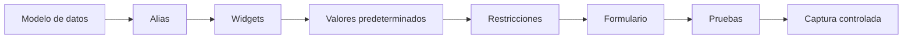
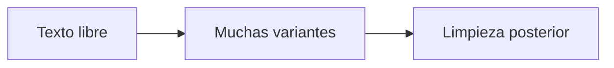
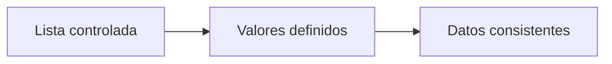
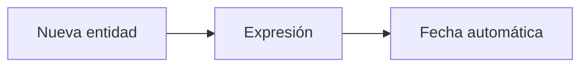
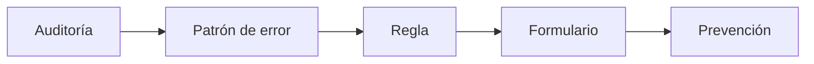
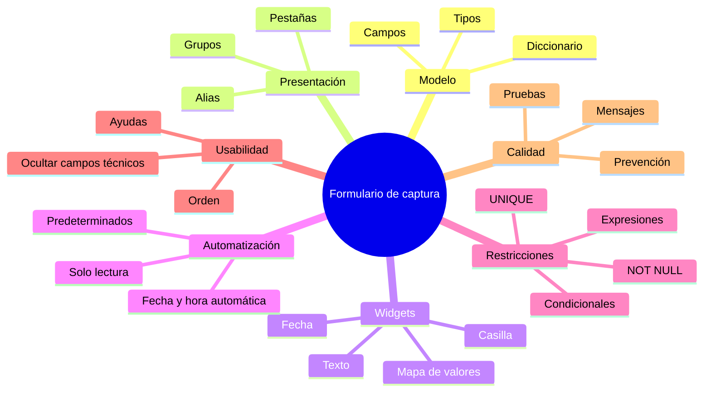
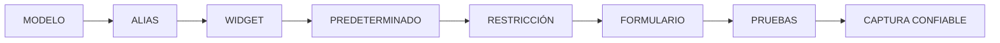

# 3.3 Diseñar formularios de captura

<div class="grid cards" markdown>

-   :material-form-textbox:{ .lg .middle } **Simplificar**

    ---

    Convertir una tabla técnica en una interfaz comprensible para quien captura información.

-   :material-format-list-bulleted:{ .lg .middle } **Controlar**

    ---

    Reemplazar texto libre por:

    **listas, catálogos y widgets apropiados.**

-   :material-auto-fix:{ .lg .middle } **Automatizar**

    ---

    Completar valores como:

    **fecha, estado inicial o responsable**

    cuando puedan obtenerse de forma confiable.

-   :material-lock:{ .lg .middle } **Restringir**

    ---

    Impedir:

    **NULL, duplicados, valores negativos y combinaciones incoherentes.**

-   :material-view-dashboard:{ .lg .middle } **Organizar**

    ---

    Agrupar los campos según el flujo real de trabajo del usuario.

-   :material-test-tube:{ .lg .middle } **Probar**

    ---

    Intentar introducir deliberadamente datos incorrectos para comprobar que el formulario funciona.

</div>

[Comenzar](#1-un-formulario-es-mas-que-una-interfaz){ .md-button .md-button--primary }
[Ir al laboratorio](#laboratorio-guiado-construir-un-formulario-de-equipamientos){ .md-button }

---

## La misión de esta lección

En **3.1** detectamos errores como:

```text
ID nulo
ID duplicado
estado = activo
estado = ACTIVO
capacidad = -25
nombre vacío
```

En **3.2** aprendimos a evitar errores geométricos durante la edición.

Ahora aplicaremos el mismo principio a los atributos:

> **No esperar a que los datos estén mal para comenzar a controlar su calidad.**

La pregunta central será:

> **¿Cómo podemos diseñar la captura para que muchos errores no lleguen nunca a entrar en la base?**

### Lo que construiremos



---

## Mapa de aprendizaje

<div class="grid cards" markdown>

-   :material-table:{ .lg .middle } **1 · Comprender**

    ---

    Campo, alias, widget, valor predeterminado y restricción.

-   :material-format-list-bulleted:{ .lg .middle } **2 · Controlar valores**

    ---

    Mapas de valores, fechas y variables binarias.

-   :material-auto-fix:{ .lg .middle } **3 · Automatizar**

    ---

    Asignar valores iniciales mediante expresiones.

-   :material-lock-check:{ .lg .middle } **4 · Validar**

    ---

    Aplicar obligatoriedad, unicidad y reglas lógicas.

-   :material-view-dashboard:{ .lg .middle } **5 · Diseñar**

    ---

    Organizar el formulario según el flujo de captura.

-   :material-test-tube:{ .lg .middle } **6 · Probar**

    ---

    Verificar casos válidos, inválidos y condicionales.

</div>

---

## Antes de empezar

!!! info "Necesitarás"

    - QGIS 3.44.
    - Una capa GeoPackage editable.
    - Una estructura de campos conocida.
    - Haber completado:
        - 3.1 Preparar datos confiables;
        - 3.2 Digitalizar y editar con precisión.

!!! example "Capa de trabajo"

    Utilizaremos una capa:

    ```text
    equipamientos
    ```

    con campos como:

    ```text
    id_equip
    nombre
    tipo
    estado
    capacidad
    fecha_reg
    responsable
    telefono
    observacion
    ```

!!! success "Principio de trabajo"

    Cada error encontrado durante una auditoría debería hacernos preguntar:

    > **¿Podría haber evitado este error desde el formulario?**

---

## 1. Un formulario es más que una interfaz

Cuando añadimos una entidad en QGIS aparece normalmente un formulario.

Podemos verlo como:

```text
una ventana para llenar datos
```

pero en realidad puede convertirse en:

```text
una primera capa de control de calidad
```

### Formulario sin diseño

```text
fid
id_equip
nom_eq
tipo_eq
est
cap
fec_reg
resp
tel
obs
```

### Formulario diseñado

```text
IDENTIFICACIÓN
├── Código
├── Nombre
└── Tipo

FUNCIONAMIENTO
├── Estado
└── Capacidad

REGISTRO
├── Fecha
├── Responsable
├── Teléfono
└── Observaciones
```

!!! quote "Diseñar un formulario no significa decorarlo"

    Significa controlar:

    ```text
    qué ve el usuario
    qué puede introducir
    qué se completa automáticamente
    qué valores están permitidos
    qué errores deben bloquearse
    ```

---

## 2. Cinco piezas diferentes

Un error común es mezclar conceptos que cumplen funciones distintas.

<div class="grid cards" markdown>

-   :material-table-column:{ .lg .middle } **Campo**

    ---

    Columna física de la tabla.

    ```text
    id_equip
    ```

-   :material-tag-text:{ .lg .middle } **Alias**

    ---

    Nombre amigable mostrado al usuario.

    ```text
    Código del equipamiento
    ```

-   :material-form-select:{ .lg .middle } **Widget**

    ---

    Control utilizado para introducir el valor.

    ```text
    texto
    lista
    fecha
    casilla
    ```

-   :material-auto-fix:{ .lg .middle } **Predeterminado**

    ---

    Valor inicial asignado automáticamente.

    ```text
    ACTIVO
    ```

-   :material-lock-check:{ .lg .middle } **Restricción**

    ---

    Regla que determina si un valor es aceptable.

    ```text
    NOT NULL
    UNIQUE
    capacidad >= 0
    ```

</div>

### Ejemplo completo

```text
Campo:
id_equip

Alias:
Código del equipamiento

Widget:
Texto

Predeterminado:
—

Restricciones:
NOT NULL
UNIQUE
formato EQ-00000
```

!!! important "Estas cinco piezas no son intercambiables"

    Un valor predeterminado:

    ```text
    no vuelve obligatorio un campo
    ```

    y un alias:

    ```text
    no modifica necesariamente el nombre físico de la columna
    ```

---

## 3. Abrir la configuración del formulario

Selecciona la capa y abre:

**Propiedades de la capa ▸ Formulario de atributos**

Desde aquí podremos configurar:

```text
widgets
alias
valores predeterminados
restricciones
campos editables
diseño del formulario
```

!!! captura "Captura pendiente · 3.3-01"

    - **Tipo:** PNG anotado
    - **Archivo:** `assets/images/modulo-03/3-3/3-3-01-formulario-atributos.png`
    - **Qué mostrar:** pestaña **Formulario de atributos**.
    - **Resaltar:**
        1. lista de campos;
        2. widget;
        3. alias;
        4. valores predeterminados;
        5. restricciones;
        6. diseño.
    - **Objetivo didáctico:** reconocer el lugar central desde donde configuraremos el formulario.

---

## 4. Alias: separar estructura técnica e interfaz

Supongamos que nuestra base utiliza:

```text
id_equip
nom_equip
fec_reg
resp_reg
```

Estos nombres pueden ser adecuados técnicamente.

Pero podemos mostrar:

```text
Código del equipamiento
Nombre del equipamiento
Fecha de registro
Responsable del registro
```

### Ejemplo

| Campo | Alias |
|---|---|
| `id_equip` | Código del equipamiento |
| `nombre` | Nombre del equipamiento |
| `tipo` | Tipo de equipamiento |
| `estado` | Estado operativo |
| `capacidad` | Capacidad |
| `fecha_reg` | Fecha de registro |
| `responsable` | Responsable del registro |

!!! success "El alias mejora la interfaz sin alterar necesariamente el modelo físico"

---

### Nombre técnico tampoco significa nombre incomprensible

No deberíamos justificar campos como:

```text
a1
x2
c3
dato_nuevo
final2
```

diciendo:

> “Después le pongo un alias”.

La base debería seguir siendo comprensible técnicamente.

---

### Configurar alias en QGIS

!!! captura "Captura pendiente · 3.3-02"

    - **Tipo:** GIF
    - **Archivo:** `assets/images/modulo-03/3-3/3-3-02-configurar-alias.gif`
    - **Qué mostrar:** cambiar alias de varios campos.
    - **Objetivo didáctico:** comparar inmediatamente el nombre técnico con el nombre mostrado en el formulario.

---

## 5. Elegir el widget correcto

No todos los atributos deberían capturarse mediante:

```text
cuadro de texto
```

El control depende del significado de la variable.

<div class="grid cards" markdown>

-   :material-form-textbox:{ .lg .middle } **Texto**

    ---

    Para:

    ```text
    nombre
    dirección
    observaciones
    ```

-   :material-form-select:{ .lg .middle } **Lista**

    ---

    Para:

    ```text
    tipo
    estado
    categoría
    ```

-   :material-checkbox-marked:{ .lg .middle } **Casilla**

    ---

    Para variables realmente binarias.

-   :material-calendar:{ .lg .middle } **Fecha/Hora**

    ---

    Para fechas estructuradas.

</div>

---

## 6. Texto libre: útil cuando la respuesta realmente es libre

Para:

```text
nombre
```

tiene sentido permitir:

```text
Centro Integral Norte
Unidad Educativa 6 de Agosto
Complejo Deportivo Municipal
```

No conocemos de antemano todos los valores posibles.

### Para observaciones

También puede ser apropiado:

```text
Texto multilínea
```

### Pero...

Para:

```text
estado
```

si solo existen:

```text
ACTIVO
INACTIVO
EN_CONSTRUCCION
```

el texto libre es una fuente innecesaria de errores.

---

## 7. Qué ocurre cuando usamos texto libre para categorías

Podemos terminar con:

```text
ACTIVO
Activo
activo
Act.
ACTV
actvo
```

Desde la perspectiva humana:

```text
parecen significar lo mismo
```

pero para una consulta:

```qgis
"estado" = 'ACTIVO'
```

no necesariamente lo son.



La alternativa es:



---

## 8. Mapa de valores

El widget:

```text
Mapa de valores
```

permite mostrar una etiqueta al usuario y almacenar un valor controlado.

### Ejemplo

| Mostrar | Guardar |
|---|---|
| Activo | `ACTIVO` |
| Inactivo | `INACTIVO` |
| En construcción | `EN_CONSTRUCCION` |

El usuario ve:

```text
En construcción
```

La base almacena:

```text
EN_CONSTRUCCION
```

!!! success "Interfaz amigable + estructura consistente"

---

### Configurar Mapa de valores

!!! captura "Captura pendiente · 3.3-03"

    - **Tipo:** GIF
    - **Archivo:** `assets/images/modulo-03/3-3/3-3-03-mapa-valores.gif`
    - **Qué mostrar:**
        1. seleccionar campo `estado`;
        2. elegir **Mapa de valores**;
        3. introducir etiqueta/valor;
        4. abrir formulario resultante.
    - **Objetivo didáctico:** visualizar la diferencia entre valor mostrado y almacenado.

---

## 9. Valor visible y valor almacenado

Podemos utilizar:

```text
Mostrar:
Educación

Guardar:
EDUCACION
```

o:

```text
Mostrar:
Primer nivel

Guardar:
N1
```

### Ventaja

El valor interno puede permanecer estable mientras la etiqueta visible evoluciona.

### Pero...

No siempre necesitamos códigos crípticos.

```text
1
2
3
```

puede ser menos comprensible que:

```text
ACTIVO
INACTIVO
EN_CONSTRUCCION
```

!!! info "El diseño debe equilibrar"

    ```text
    estabilidad técnica
    +
    interpretabilidad
    ```

---

## 10. Lista interna o catálogo externo

### Lista pequeña y estable

Podemos almacenar directamente:

```text
SALUD
EDUCACION
SOCIAL
DEPORTIVO
CULTURAL
```

dentro del widget.

### Catálogo institucional

Si la clasificación es compartida entre:

```text
varias capas
varios formularios
varios sistemas
```

puede ser preferible una tabla:

```text
catalogo_tipo
```

| codigo | descripcion |
|---|---|
| SAL | Salud |
| EDU | Educación |
| SOC | Social |
| DEP | Deportivo |
| CUL | Cultural |

!!! note "Esto prepara la lección 3.5"

    Más adelante trabajaremos con:

    ```text
    uniones
    relaciones
    catálogos
    ```

---

## 11. Variables binarias y casillas de verificación

Supongamos:

```text
tiene_acceso
```

Solo admite:

```text
Sí
No
```

Podemos utilizar:

```text
Casilla de verificación
```

### Pero...

Si necesitamos:

```text
Sí
No
Sin verificar
```

ya no tenemos una variable estrictamente binaria.

En ese caso podría ser mejor:

```text
Mapa de valores
```

!!! important "NULL no significa No"

    ```text
    No
    ```

    significa que conocemos la respuesta.

    ```text
    NULL
    ```

    puede significar que todavía no la conocemos.

---

### Configurar una casilla

!!! captura "Captura pendiente · 3.3-04"

    - **Tipo:** GIF
    - **Archivo:** `assets/images/modulo-03/3-3/3-3-04-checkbox.gif`
    - **Qué mostrar:** configuración de un campo binario con casilla.
    - **Objetivo didáctico:** demostrar cómo se almacenan los valores activado/desactivado.

---

## 12. Fechas: no utilizar texto libre

Podríamos escribir:

```text
17/09/26
17-09-2026
09/17/2026
17 septiembre 2026
```

Visualmente entendemos todas.

Pero para análisis temporal necesitamos:

```text
una fecha estructurada
```

Utiliza:

```text
Fecha/Hora
```

cuando corresponda.

### Beneficios

Podremos:

```text
ordenar
filtrar
comparar
calcular intervalos
```

---

### Configurar Fecha/Hora

!!! captura "Captura pendiente · 3.3-05"

    - **Tipo:** PNG anotado
    - **Archivo:** `assets/images/modulo-03/3-3/3-3-05-fecha-hora.png`
    - **Qué mostrar:** configuración del widget Fecha/Hora.
    - **Resaltar:** formato visible y almacenamiento.
    - **Objetivo didáctico:** diferenciar presentación de tipo de dato.

---

## Checkpoint 1

Deberías poder explicar:

- [ ] qué diferencia existe entre campo y alias;
- [ ] qué función cumple un widget;
- [ ] por qué no todo debe ser texto libre;
- [ ] cuándo utilizar un Mapa de valores;
- [ ] por qué valor visible y almacenado pueden ser distintos;
- [ ] por qué `NULL` y `No` no significan lo mismo;
- [ ] por qué las fechas deben almacenarse como fechas.

---

## 13. Valores predeterminados

Un valor predeterminado proporciona:

```text
un valor inicial
```

cuando creamos una entidad.

### Ejemplo

Campo:

```text
estado
```

Predeterminado:

```text
ACTIVO
```

Al crear una nueva entidad:

```text
estado = ACTIVO
```

aparece automáticamente.

### Pero...

El usuario puede modificarlo si el campo continúa siendo editable.

!!! important "Predeterminado no significa obligatorio"

---

## 14. Predeterminados mediante expresiones

QGIS permite utilizar expresiones.

### Fecha y hora actual

```qgis
now()
```

Podemos utilizarla para:

```text
fecha_reg
```

### Ventaja

El usuario deja de introducir manualmente:

```text
la misma información repetitiva
```



---

### Configurar un predeterminado

!!! captura "Captura pendiente · 3.3-06"

    - **Tipo:** GIF
    - **Archivo:** `assets/images/modulo-03/3-3/3-3-06-predeterminado-now.gif`
    - **Qué mostrar:**
        1. campo `fecha_reg`;
        2. expresión `now()`;
        3. creación de una entidad;
        4. fecha completada automáticamente.
    - **Objetivo didáctico:** visualizar la automatización de valores repetitivos.

---

## 15. Fecha de creación y fecha de modificación

No son lo mismo.

=== "Fecha de creación"

    Queremos registrar:

    ```text
    cuándo nació el registro
    ```

    Normalmente debería conservarse.

=== "Fecha de modificación"

    Queremos registrar:

    ```text
    cuándo se actualizó por última vez
    ```

    Puede necesitar reevaluarse.

!!! warning "No conviertas una fecha de creación en una fecha de modificación accidentalmente"

---

## 16. Automatizar solo aquello que conocemos

Podemos automatizar:

```text
fecha actual
estado inicial
usuario
```

cuando el sistema realmente dispone de esa información.

No debemos automatizar:

```text
tipo = SALUD
```

si no existe una regla que permita saberlo.

!!! quote "Automatizar una suposición solo produce errores más rápido"

---

## 17. Restricciones: impedir valores incorrectos

Llegamos al núcleo de la lección.

Trabajaremos con:

```text
NOT NULL
UNIQUE
EXPRESIONES
```

Supongamos que en 3.1 encontramos:

```text
ID nulo
ID repetido
capacidad negativa
nombre vacío
```

Podemos diseñar controles para impedir su reaparición.

---

## 18. NOT NULL

Una restricción:

```text
NOT NULL
```

indica que un campo no puede carecer de valor.

Podría ser apropiada para:

```text
id_equip
nombre
tipo
estado
```

si el modelo realmente los considera obligatorios.

### No convertir todo en obligatorio

Un campo:

```text
observacion
```

puede ser legítimamente opcional.

Si lo hacemos obligatorio, el usuario puede escribir:

```text
N/A
-
ninguna
sin dato
```

solo para continuar.

!!! danger "Una mala restricción puede fabricar información ficticia"

---

### Configurar NOT NULL

!!! captura "Captura pendiente · 3.3-07"

    - **Tipo:** GIF
    - **Archivo:** `assets/images/modulo-03/3-3/3-3-07-not-null.gif`
    - **Qué mostrar:** activar restricción `NOT NULL` y posteriormente intentar dejar el campo vacío.
    - **Objetivo didáctico:** observar el comportamiento del formulario ante un dato obligatorio ausente.

---

## 19. NULL y cadena vacía

Supongamos:

```text
nombre
```

tiene:

```text
NOT NULL
```

Aun así podemos necesitar controlar:

```text
''
```

o:

```text
'    '
```

Podemos utilizar:

```qgis
length(
    trim("nombre")
) > 0
```

### Cómo funciona

```qgis
trim("nombre")
```

elimina espacios externos.

Luego:

```qgis
length(...)
```

calcula la longitud.

Exigimos:

```text
> 0
```

---

## 20. UNIQUE

Para:

```text
id_equip
```

podemos requerir:

```text
UNIQUE
```

Así evitamos:

```text
EQ-001
EQ-001
```

si esos registros deberían identificar objetos diferentes.

### No aplicar UNIQUE sin pensar

```text
nombre
```

no necesariamente debe ser único.

Podemos tener:

```text
Plaza Principal
```

en varias comunidades.

---

### Probar unicidad

!!! captura "Captura pendiente · 3.3-08"

    - **Tipo:** GIF
    - **Archivo:** `assets/images/modulo-03/3-3/3-3-08-unique.gif`
    - **Qué mostrar:**
        1. crear `EQ-00125`;
        2. guardar;
        3. crear otro registro;
        4. introducir `EQ-00125`;
        5. observar la restricción.
    - **Objetivo didáctico:** demostrar por qué la unicidad debe probarse y no suponerse.

---

## 21. Combinar reglas sobre un identificador

Podemos querer:

```text
id_equip
```

con:

```text
NOT NULL
UNIQUE
FORMATO
```

Supongamos la regla institucional:

```text
EQ-00000
```

Podemos comprobarla con una expresión regular:

```qgis
regexp_match(
    "id_equip",
    '^EQ-[0-9]{5}$'
)
```

### Aceptaría

```text
EQ-00001
EQ-00125
EQ-98540
```

### Rechazaría

```text
eq-00001
EQ00125
EQ-125
125
```

!!! warning "El patrón es solamente un ejemplo"

    No debe adoptarse si el proyecto real utiliza otra estructura.

---

## 22. Restricciones numéricas

Supongamos:

```text
capacidad
```

puede ser:

```text
NULL
```

pero si existe debe cumplir:

```text
>= 0
```

Expresión:

```qgis
"capacidad" IS NULL
OR
"capacidad" >= 0
```

### Lectura

```text
si no hay dato
→ válido

si existe dato
→ debe ser >= 0
```

!!! success "Este patrón aparecerá muchas veces"

    ```qgis
    "campo" IS NULL
    OR
    condición
    ```

---

### Probar un valor inválido

!!! captura "Captura pendiente · 3.3-09"

    - **Tipo:** GIF
    - **Archivo:** `assets/images/modulo-03/3-3/3-3-09-capacidad-negativa.gif`
    - **Qué mostrar:** intentar introducir `-25`.
    - **Objetivo didáctico:** mostrar que el formulario detecta el problema durante la captura.

---

## 23. Validar rangos

Campo:

```text
porcentaje
```

Regla:

```text
0 ≤ porcentaje ≤ 100
```

Podemos utilizar:

```qgis
"porcentaje" BETWEEN 0 AND 100
```

Si también puede ser `NULL`:

```qgis
"porcentaje" IS NULL
OR
"porcentaje" BETWEEN 0 AND 100
```

!!! warning "No inventes rangos"

    Deben provenir de:

    ```text
    definición
    norma
    metodología
    naturaleza de la variable
    ```

---

## 24. Validar dominios también mediante expresiones

Aunque utilicemos Mapa de valores, podemos formalizar:

```qgis
"estado" IN (
    'ACTIVO',
    'INACTIVO',
    'EN_CONSTRUCCION'
)
```

### ¿Por qué?

Porque el widget controla principalmente:

```text
la interfaz QGIS
```

pero los datos también podrían modificarse desde:

```text
importaciones
otros programas
scripts
```

---

## 25. Restricciones fuertes y débiles

No todos los controles tienen la misma criticidad.

=== "Restricción fuerte"

    Debe impedir guardar.

    Ejemplo:

    ```text
    id_equip obligatorio
    ```

=== "Restricción débil"

    Puede advertir sin bloquear.

    Ejemplo:

    ```text
    teléfono recomendado
    ```

!!! important "Si todo bloquea, el formulario puede volverse inutilizable"

    Pero si todo es advertencia:

    ```text
    errores críticos seguirán entrando
    ```

---

## 26. Mensajes de error comprensibles

Mensaje pobre:

```text
Error de restricción
```

Mensaje mejor:

```text
La capacidad debe ser mayor o igual a cero.
```

Otro:

```text
El código debe utilizar el formato EQ-00000.
```

### Un mensaje útil responde

```text
¿Qué está mal?
¿Qué debería introducir?
```

---

### Configurar mensaje de restricción

!!! captura "Captura pendiente · 3.3-10"

    - **Tipo:** PNG anotado
    - **Archivo:** `assets/images/modulo-03/3-3/3-3-10-mensaje-restriccion.png`
    - **Qué mostrar:** expresión y descripción/mensaje de la restricción.
    - **Objetivo didáctico:** demostrar que una buena validación también debe ayudar al usuario a corregirse.

---

## 27. Reglas entre varios campos

Aquí pasamos de validar:

```text
una columna
```

a validar:

```text
la coherencia del registro
```

### Ejemplo

Si:

```text
estado = INACTIVO
```

queremos exigir:

```text
fecha_cierre
```

Lógica:

```text
SI está inactivo
ENTONCES debe tener fecha de cierre
```

Una expresión posible:

```qgis
"estado" <> 'INACTIVO'
OR
"fecha_cierre" IS NOT NULL
```

---

## 28. Cómo leer una regla condicional

```qgis
"estado" <> 'INACTIVO'
OR
"fecha_cierre" IS NOT NULL
```

El registro es válido si:

```text
no está inactivo
```

o:

```text
si está inactivo, existe fecha
```

Esto permite construir:

```text
obligatoriedad condicional
```

---

## 29. Otro ejemplo condicional

Supongamos que los establecimientos de:

```text
SALUD
```

deben registrar:

```text
capacidad
```

Podemos usar:

```qgis
"tipo" <> 'SALUD'
OR
"capacidad" IS NOT NULL
```

### Resultado

```text
SALUD + capacidad NULL
→ inválido
```

```text
CULTURAL + capacidad NULL
→ puede ser válido
```

si esa es la regla definida.

---

### Probar una regla condicional

!!! captura "Captura pendiente · 3.3-11"

    - **Tipo:** GIF
    - **Archivo:** `assets/images/modulo-03/3-3/3-3-11-regla-condicional.gif`
    - **Qué mostrar:**
        1. elegir tipo SALUD;
        2. dejar capacidad vacía;
        3. observar error;
        4. cambiar a otra categoría;
        5. observar comportamiento.
    - **Objetivo didáctico:** visualizar que la obligatoriedad puede depender del contexto.

---

## 30. Validar fechas relacionadas

Tenemos:

```text
fecha_apertura
fecha_cierre
```

Podemos exigir:

```text
fecha_cierre >= fecha_apertura
```

cuando ambas existen.

Una lógica posible:

```qgis
"fecha_cierre" IS NULL
OR
"fecha_apertura" IS NULL
OR
"fecha_cierre" >= "fecha_apertura"
```

### Esto permite

```text
establecimientos todavía abiertos
```

y evita:

```text
fecha de cierre anterior a la apertura
```

---

## Checkpoint 2

Deberías poder explicar:

- [ ] qué diferencia existe entre predeterminado y restricción;
- [ ] cuándo utilizar `NOT NULL`;
- [ ] por qué `NOT NULL` no garantiza texto real;
- [ ] cuándo utilizar `UNIQUE`;
- [ ] cómo validar valores negativos;
- [ ] cómo permitir `NULL` y validar los valores existentes;
- [ ] qué diferencia existe entre restricción fuerte y débil;
- [ ] cómo construir una regla entre varios campos.

---

## 31. Campos de solo lectura

Algunos campos deben:

```text
verse
```

pero no:

```text
editarse manualmente
```

Por ejemplo:

```text
fecha_creacion
id_interno
resultado_calculado
usuario_creacion
```

### Ventaja

Protegemos información administrada por:

```text
el sistema
```

o:

```text
un cálculo
```

---

### Configurar solo lectura

!!! captura "Captura pendiente · 3.3-12"

    - **Tipo:** GIF
    - **Archivo:** `assets/images/modulo-03/3-3/3-3-12-solo-lectura.gif`
    - **Qué mostrar:** configurar un campo como no editable y abrir el formulario.
    - **Objetivo didáctico:** diferenciar visible de editable.

---

## 32. Ocultar campos técnicos

El usuario puede no necesitar ver:

```text
fid
```

u otros atributos internos.

Mostrar todos los campos puede provocar:

```text
confusión
errores
interfaz extensa
```

### Principio

```text
mostrar lo necesario
+
proteger lo técnico
```

---

## 33. Diseño automático frente a formulario organizado

Por defecto QGIS puede mostrar los campos de manera automática.

Por ejemplo:

```text
fid
fecha_reg
nombre
id
obs
tipo
estado
capacidad
```

Funciona técnicamente.

Pero no sigue necesariamente el:

```text
flujo mental del usuario
```

---

## 34. Diseño Arrastrar y soltar

QGIS permite organizar el formulario mediante:

```text
Arrastrar y soltar
```

Podemos construir:

```text
IDENTIFICACIÓN
├── Código
├── Nombre
└── Tipo

FUNCIONAMIENTO
├── Estado
├── Capacidad
└── Teléfono

REGISTRO
├── Fecha
├── Responsable
└── Observaciones
```

!!! captura "Captura pendiente · 3.3-13"

    - **Tipo:** GIF
    - **Archivo:** `assets/images/modulo-03/3-3/3-3-13-arrastrar-soltar.gif`
    - **Qué mostrar:**
        1. cambiar diseño;
        2. crear grupos;
        3. arrastrar campos;
        4. abrir formulario final.
    - **Objetivo didáctico:** mostrar la construcción visual del formulario.

---

## 35. Diseñar por tareas y no por orden alfabético

No queremos:

```text
Capacidad
Código
Estado
Fecha
Nombre
Observaciones
Responsable
Tipo
```

solo porque:

```text
A → Z
```

### Mejor

```text
1. Identificar
2. Clasificar
3. Describir funcionamiento
4. Registrar responsable
5. Añadir observaciones
```

El formulario debe acompañar:

```text
el proceso de captura
```

---

## 36. Utilizar grupos

Los grupos permiten organizar información relacionada.

### Ejemplo

```text
DATOS GENERALES
```

contiene:

```text
Código
Nombre
Tipo
```

### Otro

```text
CONTROL DE REGISTRO
```

contiene:

```text
Fecha
Responsable
```

!!! tip "No crees grupos porque sí"

    Una estructura excesiva también puede dificultar la captura.

---

## 37. Utilizar pestañas cuando realmente son necesarias

Un formulario grande puede utilizar:

```text
[General]
[Funcionamiento]
[Contacto]
[Auditoría]
```

### Adecuado

Cuando existen:

```text
muchos campos
```

y bloques claramente diferenciados.

### Excesivo

Para un formulario con:

```text
8 campos
```

crear:

```text
5 pestañas
```

puede resultar innecesario.

---

## 38. Ayudas y descripciones

Supongamos el campo:

```text
capacidad
```

¿Qué significa?

Podría ser:

```text
aforo máximo
capacidad diaria
número de camas
atenciones mensuales
```

El formulario debería ayudar a comprenderlo.

### Ejemplo de descripción

```text
Número máximo de personas que el equipamiento
puede atender simultáneamente.
```

!!! important "Muchos errores son semánticos, no ortográficos"

    Si dos personas entienden una variable de manera diferente:

    ```text
    ambas pueden escribir valores perfectamente válidos
    ```

    y aun así producir una base inconsistente.

---

## 39. El formulario no reemplaza el diccionario de datos

Podemos tener un formulario excelente.

Pero todavía debemos mantener:

| Campo | Definición | Tipo | Unidad | Dominio | Regla |
|---|---|---|---|---|---|
| `id_equip` | Código institucional | Texto | — | patrón | único |
| `tipo` | Tipo funcional | Texto | — | catálogo | obligatorio |
| `capacidad` | Aforo máximo | Entero | personas | `>=0` | opcional |

### Formulario

Implementa las reglas.

### Diccionario

Las explica.

---

## 40. Identificadores automáticos: cuidado

Podemos sentir la tentación de generar:

```text
MAX(id) + 1
```

Esto puede funcionar en un ejercicio sencillo.

Pero en trabajo multiusuario:

```text
Usuario A
→ calcula 125

Usuario B
→ calcula 125
```

antes de que ninguno guarde.

Resultado:

```text
duplicado
```

!!! warning "La generación de claves robustas es un problema de base de datos"

    En sistemas multiusuario conviene utilizar mecanismos como:

    ```text
    secuencias
    UUID
    restricciones de base
    ```

    según el sistema utilizado.

---

## 41. No construir identidad con atributos inestables

Supongamos:

```text
D03-SALUD-001
```

donde:

```text
D03
→ distrito

SALUD
→ tipo
```

¿Qué ocurre si el equipamiento:

```text
cambia de distrito
```

o:

```text
cambia de clasificación
```

¿Debe cambiar su identidad?

Quizá no.

!!! success "Identidad y características no son lo mismo"

---

## 42. Diseñar el formulario de equipamientos

Utilizaremos:

| Campo | Alias | Widget |
|---|---|---|
| `id_equip` | Código del equipamiento | Texto |
| `nombre` | Nombre del equipamiento | Texto |
| `tipo` | Tipo de equipamiento | Mapa de valores |
| `estado` | Estado operativo | Mapa de valores |
| `capacidad` | Capacidad | Número |
| `fecha_reg` | Fecha de registro | Fecha/Hora |
| `responsable` | Responsable | Texto |
| `telefono` | Teléfono | Texto |
| `observacion` | Observaciones | Texto multilínea |

---

## 43. Configurar el identificador

Campo:

```text
id_equip
```

Alias:

```text
Código del equipamiento
```

Reglas:

```text
NOT NULL
UNIQUE
```

y, si corresponde:

```qgis
regexp_match(
    "id_equip",
    '^EQ-[0-9]{5}$'
)
```

Mensaje:

```text
El código debe utilizar el formato EQ-00000
y no puede repetirse.
```

---

## 44. Configurar el nombre

Campo:

```text
nombre
```

Alias:

```text
Nombre del equipamiento
```

Restricciones:

```text
NOT NULL
```

y:

```qgis
length(trim("nombre")) > 0
```

---

## 45. Configurar tipo

Widget:

```text
Mapa de valores
```

| Mostrar | Guardar |
|---|---|
| Salud | `SALUD` |
| Educación | `EDUCACION` |
| Social | `SOCIAL` |
| Deportivo | `DEPORTIVO` |
| Cultural | `CULTURAL` |

---

## 46. Configurar estado

Mapa:

| Mostrar | Guardar |
|---|---|
| Activo | `ACTIVO` |
| Inactivo | `INACTIVO` |
| En construcción | `EN_CONSTRUCCION` |

Predeterminado:

```text
ACTIVO
```

Restricción:

```text
NOT NULL
```

---

## 47. Configurar capacidad

Regla:

```qgis
"capacidad" IS NULL
OR
"capacidad" >= 0
```

Mensaje:

```text
La capacidad debe ser mayor o igual a cero.
```

---

## 48. Configurar fecha

Campo:

```text
fecha_reg
```

Widget:

```text
Fecha/Hora
```

Predeterminado:

```qgis
now()
```

Podemos decidir que sea:

```text
solo lectura
```

si debe gestionarlo el sistema.

---

## 49. Configurar teléfono

Debe ser:

```text
Texto
```

aunque contenga dígitos.

Porque puede tener:

```text
+591
```

y no representa:

```text
una cantidad matemática
```

---

## 50. Configurar observaciones

Widget:

```text
Texto multilínea
```

!!! warning "No uses observaciones para esconder variables"

    Esto es incorrecto:

    ```text
    Estado: Activo
    Capacidad: 120
    Tipo: Salud
    ```

    si ya existen campos específicos.

---

## 51. Previsualizar el formulario final

!!! captura "Captura pendiente · 3.3-14"

    - **Tipo:** PNG anotado
    - **Archivo:** `assets/images/modulo-03/3-3/3-3-14-formulario-final.png`
    - **Qué mostrar:** formulario completo de equipamientos.
    - **Resaltar:**
        1. grupos;
        2. lista de tipo;
        3. lista de estado;
        4. fecha automática;
        5. campo no editable;
        6. observaciones multilínea.
    - **Objetivo didáctico:** mostrar el producto final antes de comenzar las pruebas.

---

## 52. Diseñar pruebas antes de usar el formulario

No basta con decir:

> “El formulario se ve bien”.

Debemos intentar romperlo.

### Caso válido

```text
ID = EQ-00125
Nombre = Centro Norte
Tipo = SALUD
Estado = ACTIVO
Capacidad = 120
```

Debe guardarse.

### Caso inválido

```text
ID = NULL
```

Debe fallar.

### Otro

```text
ID duplicado
```

Debe fallar.

### Otro

```text
capacidad = -25
```

Debe fallar.

---

## 53. Matriz de pruebas

| Prueba | Entrada | Resultado esperado | Resultado obtenido |
|---|---|---|---|
| Registro válido | Correcto | Guardar | |
| ID nulo | `NULL` | Bloquear | |
| ID duplicado | existente | Bloquear | |
| ID mal formado | `eq125` | Bloquear | |
| Nombre vacío | `''` | Bloquear | |
| Capacidad negativa | `-25` | Bloquear | |
| Capacidad NULL | `NULL` | Depende de regla | |
| Tipo inválido | `Saludd` | No disponible | |

!!! success "La matriz transforma una impresión en una prueba reproducible"

---

## 54. Probar un registro válido

!!! captura "Captura pendiente · 3.3-15"

    - **Tipo:** GIF
    - **Archivo:** `assets/images/modulo-03/3-3/3-3-15-registro-valido.gif`
    - **Qué mostrar:** creación completa de un equipamiento válido.
    - **Objetivo didáctico:** demostrar el flujo normal antes de probar errores.

---

## 55. Probar varios errores

!!! captura "Captura pendiente · 3.3-16"

    - **Tipo:** GIF
    - **Archivo:** `assets/images/modulo-03/3-3/3-3-16-pruebas-invalidas.gif`
    - **Qué mostrar secuencialmente:**
        1. ID vacío;
        2. ID duplicado;
        3. capacidad negativa;
        4. nombre vacío.
    - **Objetivo didáctico:** demostrar que las reglas funcionan realmente.

---

## 56. Relacionar auditoría y prevención

Lo aprendido en 3.1 ahora puede traducirse directamente.

| Hallazgo histórico | Control preventivo |
|---|---|
| ID nulo | `NOT NULL` |
| ID duplicado | `UNIQUE` |
| Estado inconsistente | Mapa de valores |
| Tipo inconsistente | Mapa de valores |
| Capacidad negativa | Expresión |
| Nombre vacío | `trim()` + longitud |
| Fecha repetitiva manual | Predeterminado |
| Campo técnico alterado | Solo lectura |



---

## 57. Formulario y base de datos no son exactamente lo mismo

Las restricciones configuradas en QGIS pueden formar parte de:

```text
proyecto
configuración de capa
```

Pero otros programas podrían modificar la fuente.

### En un sistema productivo

Podemos tener:

```text
FORMULARIO
↓
primera capa de control

BASE DE DATOS
↓
segunda capa de integridad
```

Por ejemplo, PostgreSQL/PostGIS puede aplicar:

```text
PRIMARY KEY
UNIQUE
NOT NULL
FOREIGN KEY
CHECK
```

!!! important "La interfaz ayuda al usuario; la base protege la integridad"

---

## Checkpoint 3

Antes del laboratorio deberías poder:

- [ ] definir un alias;
- [ ] seleccionar un widget;
- [ ] crear un Mapa de valores;
- [ ] asignar un predeterminado;
- [ ] utilizar `NOT NULL`;
- [ ] utilizar `UNIQUE`;
- [ ] construir una restricción numérica;
- [ ] construir una regla condicional;
- [ ] definir campos de solo lectura;
- [ ] organizar un formulario;
- [ ] diseñar casos de prueba.

---

## Laboratorio guiado: construir un formulario de equipamientos

!!! example "Escenario"

    Debemos crear un formulario para inventariar equipamientos municipales.

    El objetivo es reducir errores durante:

    ```text
    nuevas capturas
    ```

    utilizando:

    ```text
    widgets
    valores predeterminados
    restricciones
    organización
    pruebas
    ```

### Fase 1 · Preparar la capa

Utiliza:

```text
datos/trabajo/inventario.gpkg
```

Capa:

```text
equipamientos
```

### Fase 2 · Revisar estructura

Campos mínimos:

```text
id_equip
nombre
tipo
estado
capacidad
fecha_reg
responsable
telefono
observacion
```

### Fase 3 · Construir diccionario

| Campo | Definición | Tipo | Unidad | Obligatorio | Único |
|---|---|---|---|---|---|
| | | | | | |

### Fase 4 · Configurar alias

Todos los campos visibles deben utilizar etiquetas comprensibles.

### Fase 5 · Configurar tipo

Utiliza:

```text
Mapa de valores
```

con:

```text
Salud
Educación
Social
Deportivo
Cultural
```

### Fase 6 · Configurar estado

Mapa:

```text
Activo
Inactivo
En construcción
```

Predeterminado:

```text
ACTIVO
```

### Fase 7 · Configurar fecha

Widget:

```text
Fecha/Hora
```

Predeterminado:

```qgis
now()
```

### Fase 8 · Configurar identificador

Aplica:

```text
NOT NULL
UNIQUE
```

y una regla de formato si el proyecto la utiliza.

### Fase 9 · Configurar nombre

Aplica:

```text
NOT NULL
```

más:

```qgis
length(trim("nombre")) > 0
```

### Fase 10 · Configurar capacidad

Expresión:

```qgis
"capacidad" IS NULL
OR
"capacidad" >= 0
```

### Fase 11 · Crear regla condicional

Ejemplo:

```qgis
"tipo" <> 'SALUD'
OR
"capacidad" IS NOT NULL
```

### Fase 12 · Proteger campos automáticos

Define si:

```text
fecha_reg
```

debe ser:

```text
solo lectura
```

### Fase 13 · Organizar formulario

Crea:

```text
IDENTIFICACIÓN
FUNCIONAMIENTO
REGISTRO
```

### Fase 14 · Ocultar campos técnicos

Oculta los que el usuario no necesita.

### Fase 15 · Probar

Ejecuta al menos:

```text
1 caso válido
6 casos inválidos
```

### Fase 16 · Registrar resultados

Completa:

| Prueba | Esperado | Obtenido | Estado |
|---|---|---|---|
| Registro válido | Guardar | | |
| ID vacío | Bloquear | | |
| ID duplicado | Bloquear | | |
| Nombre vacío | Bloquear | | |
| Capacidad negativa | Bloquear | | |
| Tipo Salud sin capacidad | Bloquear | | |

### Evidencia del laboratorio

!!! captura "Captura pendiente · 3.3-17"

    - **Tipo:** Imagen compuesta
    - **Archivo:** `assets/images/modulo-03/3-3/3-3-17-laboratorio.png`
    - **Qué mostrar:**
        1. formulario inicial;
        2. configuración;
        3. formulario final;
        4. error detectado.
    - **Objetivo didáctico:** resumir visualmente el proceso completo.

---

## Mini-reto: ¿qué control utilizarías?

=== "Caso A"

    El usuario escribe:

    ```text
    Activo
    activo
    ACTIVO
    ```

    ??? question "¿Qué utilizarías?"

        **Mapa de valores**.

=== "Caso B"

    El identificador no puede repetirse.

    ??? question "¿Qué utilizarías?"

        **UNIQUE**.

=== "Caso C"

    La fecha debe introducirse automáticamente.

    ??? question "¿Qué utilizarías?"

        **Valor predeterminado** mediante una expresión como `now()`.

=== "Caso D"

    La capacidad puede quedar vacía, pero no puede ser negativa.

    ??? question "¿Qué utilizarías?"

        ```qgis
        "capacidad" IS NULL
        OR
        "capacidad" >= 0
        ```

=== "Caso E"

    El usuario debe ver la fecha automática pero no modificarla.

    ??? question "¿Qué utilizarías?"

        **Campo de solo lectura**.

---

## Reto práctico

!!! example "Reto 3.3 — Crear un formulario de inventario de equipamientos"

    ### Contexto

    Una auditoría previa encontró:

    ```text
    identificadores faltantes
    identificadores duplicados
    categorías inconsistentes
    capacidades negativas
    nombres vacíos
    fechas digitadas manualmente
    ```

    Tu tarea es diseñar un formulario que reduzca estos problemas durante futuras capturas.

    ### Misión 1 · Preparar proyecto

    Guarda:

    ```text
    proyectos/reto_3-3_formulario.qgz
    ```

    ### Misión 2 · Preparar GeoPackage

    Utiliza:

    ```text
    datos/trabajo/inventario.gpkg
    ```

    ### Misión 3 · Documentar campos

    Construye el diccionario de datos.

    ### Misión 4 · Configurar alias

    Todos los campos visibles deben utilizar etiquetas comprensibles.

    ### Misión 5 · Configurar tipo

    Utiliza un catálogo controlado.

    ### Misión 6 · Configurar estado

    Utiliza:

    ```text
    Mapa de valores
    ```

    y:

    ```text
    ACTIVO
    ```

    como predeterminado.

    ### Misión 7 · Configurar ID

    Debe ser:

    ```text
    obligatorio
    único
    ```

    y cumplir un formato si existe una regla institucional.

    ### Misión 8 · Configurar nombre

    Debe impedir:

    ```text
    NULL
    cadena vacía
    solo espacios
    ```

    ### Misión 9 · Configurar capacidad

    Debe:

    ```text
    permitir NULL
    ```

    cuando corresponda,

    pero:

    ```text
    impedir negativos
    ```

    ### Misión 10 · Crear regla condicional

    Implementa al menos una regla entre dos campos.

    ### Misión 11 · Automatizar fecha

    Utiliza una expresión.

    ### Misión 12 · Configurar solo lectura

    Protege al menos un campo gestionado automáticamente.

    ### Misión 13 · Organizar el formulario

    Utiliza:

    ```text
    Arrastrar y soltar
    ```

    con al menos tres grupos.

    ### Misión 14 · Ocultar información técnica

    Evalúa:

    ```text
    fid
    ```

    y otros campos internos.

    ### Misión 15 · Crear mensajes útiles

    No utilices únicamente:

    ```text
    Error
    ```

    Explica la condición que debe cumplirse.

    ### Misión 16 · Ejecutar pruebas

    Debes probar como mínimo:

    ```text
    registro correcto
    ID nulo
    ID duplicado
    ID mal formado
    nombre vacío
    capacidad negativa
    regla condicional
    ```

    ### Misión 17 · Construir matriz de pruebas

    | Prueba | Entrada | Esperado | Resultado | Estado |
    |---|---|---|---|---|
    | | | | | |

    ### Misión 18 · Comparar antes y después

    Completa:

    | Error detectado en auditoría | Control actual |
    |---|---|
    | ID nulo | |
    | ID duplicado | |
    | Estado inconsistente | |
    | Tipo inconsistente | |
    | Capacidad negativa | |
    | Nombre vacío | |

    ### Misión 19 · Elaborar conclusión

    Redacta entre **180 y 250 palabras** explicando:

    - qué errores intentaste prevenir;
    - qué campos son obligatorios;
    - cuál es único;
    - qué categorías controlaste;
    - qué automatizaste;
    - qué regla condicional creaste;
    - qué pruebas ejecutaste;
    - qué errores todavía podrían entrar;
    - qué controles deberían implementarse también en una base de datos productiva.

    ### Entregables

    - `reto_3-3_formulario.qgz`;
    - `inventario.gpkg`;
    - capa `equipamientos`;
    - diccionario de datos;
    - tabla de configuración del formulario;
    - matriz de pruebas;
    - comparación auditoría/prevención;
    - captura del Mapa de valores;
    - captura de restricciones;
    - GIF de fecha automática;
    - GIF del diseñador Arrastrar y soltar;
    - captura del formulario final;
    - GIF de pruebas inválidas;
    - conclusión técnica.

---

## Criterios de evaluación

??? success "Ver rúbrica"

    | Criterio | Se cumple si... |
    |---|---|
    | Modelo | Los campos tienen significado definido |
    | Alias | La interfaz utiliza nombres comprensibles |
    | Widgets | Cada variable usa un control apropiado |
    | Tipo | Utiliza un dominio controlado |
    | Estado | Utiliza un dominio controlado |
    | ID | Es obligatorio |
    | Unicidad | El ID no puede repetirse |
    | Formato | El código cumple la regla establecida |
    | Nombre | No admite valor vacío |
    | Capacidad | No admite negativos |
    | NULL | Se diferencia ausencia permitida de error |
    | Fecha | Se completa automáticamente |
    | Condicional | Existe al menos una regla entre campos |
    | Solo lectura | Protege valores gestionados automáticamente |
    | Organización | Sigue un flujo lógico |
    | Mensajes | Explican cómo corregir el dato |
    | Pruebas | Incluye casos válidos e inválidos |
    | Documentación | Las reglas están registradas |
    | Prevención | Responde a problemas de 3.1 |
    | Usabilidad | El formulario facilita la captura |

---

## Errores frecuentes

=== "Todos los campos son texto"

    El widget debe corresponder al significado de la variable.

=== "Estado sigue teniendo muchas variantes"

    Revisa:

    ```text
    Mapa de valores
    ```

=== "NOT NULL permite espacios"

    Utiliza una expresión como:

    ```qgis
    length(trim("nombre")) > 0
    ```

=== "El formulario obliga a escribir N/A"

    Probablemente convertiste un campo opcional en obligatorio.

=== "Capacidad NULL genera error"

    La expresión puede no estar contemplando:

    ```text
    NULL
    ```

=== "La fecha cambia cada vez que edito"

    Revisa cuándo se evalúa el predeterminado.

=== "El teléfono perdió el cero inicial"

    Probablemente lo almacenaste como número.

=== "El usuario modifica un campo automático"

    Configúralo como:

    ```text
    solo lectura
    ```

=== "El formulario tiene demasiados campos"

    Oculta:

    ```text
    información técnica
    ```

=== "Tengo demasiadas pestañas"

    Simplifica el flujo.

=== "La regla funciona en QGIS pero no en otra aplicación"

    La validación puede existir solo en la configuración del formulario.

---

## Desafío de 5 minutos

!!! challenge "Diseña el control"

    Para cada situación indica qué herramienta utilizarías.

    **Caso 1**

    `estado` solo admite:

    ```text
    ACTIVO
    INACTIVO
    EN_CONSTRUCCION
    ```

    **Caso 2**

    `id_equip` no puede repetirse.

    **Caso 3**

    `nombre` no puede quedar vacío ni contener solo espacios.

    **Caso 4**

    `capacidad` puede ser NULL, pero nunca negativa.

    **Caso 5**

    `fecha_reg` debe completarse automáticamente.

    **Caso 6**

    `fecha_reg` debe verse pero no modificarse.

??? success "Solución"

    **1 — Mapa de valores**

    **2 — UNIQUE**

    **3 — NOT NULL + expresión**

    ```qgis
    length(trim("nombre")) > 0
    ```

    **4 — Restricción**

    ```qgis
    "capacidad" IS NULL
    OR
    "capacidad" >= 0
    ```

    **5 — Valor predeterminado**

    ```qgis
    now()
    ```

    **6 — Solo lectura**

---

## Ideas clave

<div class="grid cards" markdown>

-   :material-form-textbox:{ .lg .middle } **Facilita**

    ---

    La interfaz debe acompañar el trabajo real del usuario.

-   :material-format-list-bulleted:{ .lg .middle } **Controla**

    ---

    Los dominios cerrados no deberían capturarse como texto libre.

-   :material-auto-fix:{ .lg .middle } **Automatiza**

    ---

    Reduce digitación cuando el sistema conoce el valor.

-   :material-lock-check:{ .lg .middle } **Valida**

    ---

    Convierte reglas del modelo en restricciones.

-   :material-eye-off:{ .lg .middle } **Protege**

    ---

    Oculta o bloquea información técnica cuando corresponde.

-   :material-test-tube:{ .lg .middle } **Prueba**

    ---

    Un formulario correcto debe superar casos válidos e inválidos.

</div>

!!! success "Para recordar"

    - El formulario también forma parte de la calidad de datos.
    - Campo, alias, widget, predeterminado y restricción son conceptos diferentes.
    - Un alias mejora la presentación sin modificar necesariamente el nombre físico.
    - No todos los campos deberían utilizar texto libre.
    - Los dominios controlados reducen variantes innecesarias.
    - Mapa de valores puede separar valor mostrado y almacenado.
    - Una casilla solo es adecuada para variables verdaderamente binarias.
    - `NULL` y `No` no significan lo mismo.
    - Las fechas deberían almacenarse con un tipo adecuado.
    - Un valor predeterminado no vuelve obligatorio un campo.
    - `now()` permite inicializar fecha y hora.
    - Automatizar una suposición produce errores automáticamente.
    - `NOT NULL` controla ausencia.
    - `UNIQUE` controla repetición.
    - `NOT NULL` no impide necesariamente cadenas vacías.
    - `trim()` permite detectar texto compuesto solamente por espacios.
    - `IS NULL OR condición` permite validar campos opcionales.
    - Las reglas pueden depender de otros campos.
    - No todas las restricciones deben bloquear.
    - Los mensajes deben explicar cómo corregir el problema.
    - Los campos gestionados automáticamente pueden ser solo lectura.
    - Los campos técnicos pueden ocultarse.
    - El formulario debe seguir el flujo de trabajo.
    - Una interfaz clara no reemplaza el diccionario de datos.
    - Las claves automáticas requieren cuidado en entornos multiusuario.
    - El formulario debe probarse deliberadamente con entradas incorrectas.
    - Los errores encontrados durante una auditoría pueden convertirse en controles preventivos.

---

## Autoevaluación

??? question "1. ¿Qué diferencia existe entre campo y alias?"

    El campo pertenece a la estructura técnica del dato; el alias es la etiqueta mostrada al usuario.

??? question "2. ¿Qué es un widget?"

    El control utilizado para visualizar o introducir el valor de un atributo.

??? question "3. ¿Cuándo conviene utilizar texto libre?"

    Cuando los valores posibles son abiertos y no pueden definirse mediante un dominio razonable.

??? question "4. ¿Qué ventaja tiene Mapa de valores?"

    Reduce variantes y permite separar etiqueta visible de valor almacenado.

??? question "5. ¿NULL equivale a No?"

    No.

??? question "6. ¿Qué es un valor predeterminado?"

    Un valor inicial asignado automáticamente al crear o modificar una entidad según la configuración.

??? question "7. ¿Un predeterminado vuelve obligatorio el campo?"

    No.

??? question "8. ¿Para qué sirve `now()`?"

    Para devolver la fecha y hora actuales.

??? question "9. ¿Qué hace NOT NULL?"

    Evita que el campo permanezca sin valor cuando la regla se aplica.

??? question "10. ¿NOT NULL impide una cadena vacía?"

    No necesariamente.

??? question "11. ¿Cómo comprobarías que un nombre contiene información real?"

    ```qgis
    length(trim("nombre")) > 0
    ```

??? question "12. ¿Qué hace UNIQUE?"

    Impide o advierte sobre valores repetidos en un campo definido como único.

??? question "13. ¿Cómo validarías capacidad opcional y no negativa?"

    ```qgis
    "capacidad" IS NULL
    OR
    "capacidad" >= 0
    ```

??? question "14. ¿Por qué aparece IS NULL?"

    Porque la ausencia está permitida.

??? question "15. ¿Qué es una regla condicional?"

    Una restricción cuyo resultado depende de valores almacenados en otros campos.

??? question "16. ¿Qué diferencia existe entre restricción fuerte y débil?"

    La fuerte debería impedir aceptar un registro inválido; la débil puede limitarse a advertir.

??? question "17. ¿Para qué sirve solo lectura?"

    Para mostrar un valor evitando que el usuario lo modifique manualmente.

??? question "18. ¿Por qué podríamos ocultar fid?"

    Porque puede ser un identificador técnico irrelevante para el proceso de captura.

??? question "19. ¿Por qué organizar campos en grupos?"

    Para que el formulario siga una secuencia lógica de trabajo.

??? question "20. ¿Por qué debemos probar datos inválidos?"

    Para demostrar que los controles realmente funcionan.

??? question "21. ¿Un formulario QGIS garantiza por sí solo la integridad de una base institucional?"

    No.

    En sistemas críticos debe complementarse con reglas a nivel de base de datos.

??? question "22. ¿Cuál es la idea central de esta lección?"

    Pasar de:

    ```text
    corregir errores después
    ```

    a:

    ```text
    prevenir muchos errores durante la captura
    ```

---

## Mapa mental



---

## Cierre



!!! quote "La idea que debe permanecer"

    La pregunta profesional no es:

    > **¿Cómo hago un formulario más bonito?**

    sino:

    > **¿Qué errores quiero prevenir, qué reglas definen un registro válido y cómo puedo ayudar al usuario a capturar correctamente la información desde el primer intento?**

---

## Siguiente lección

<div class="grid cards" markdown>

-   :material-form-select:{ .lg .middle } **Lo que hicimos**

    ---

    Controlamos:

    ```text
    cómo entran los atributos
    ```

    mediante:

    ```text
    widgets
    predeterminados
    restricciones
    ```

-   :material-function-variant:{ .lg .middle } **Lo que viene**

    ---

    En **3.4 Construir indicadores con expresiones** utilizaremos esos atributos para producir información derivada.

    Aprenderemos a controlar:

    ```text
    NULL
    condiciones
    divisiones entre cero
    geometría
    ```

</div>

[Continuar con 3.4 →](04-construir-indicadores-expresiones.md){ .md-button .md-button--primary }

---

## Referencias

- **QGIS 3.44 — Propiedades de capas vectoriales.**  
  Configuración de campos, formularios, alias, widgets y restricciones.

- **QGIS 3.44 — Formularios de atributos.**  
  Diseño automático, Arrastrar y soltar, grupos, pestañas y comportamiento de edición.

- **QGIS 3.44 — Widgets de edición.**  
  Texto, mapas de valores, relaciones de valores, casillas y fecha/hora.

- **QGIS 3.44 — Expresiones.**  
  Lenguaje utilizado para valores predeterminados y restricciones.

- **QGIS 3.44 — Funciones de expresiones.**  
  Funciones como `trim()`, `length()`, `regexp_match()` y operaciones condicionales.

- **QGIS 3.44 — Creación de capas GeoPackage.**  
  Tipos de campos y definición inicial de la estructura.

- **QGIS Training Manual — Creación de datos vectoriales.**  
  Ejercicios oficiales relacionados con estructura y captura de atributos.

- **Material for MkDocs — Reference.**  
  Componentes enriquecidos utilizados en la documentación.

- **Material for MkDocs — Grids.**  
  Tarjetas y cuadrículas.

- **Material for MkDocs — Content tabs.**  
  Pestañas utilizadas para comparar comportamientos y conceptos.

- **Material for MkDocs — Admonitions.**  
  Notas, preguntas, desafíos y bloques desplegables.

- **Material for MkDocs — Diagrams.**  
  Diagramas Mermaid utilizados para representar flujos y estructuras.