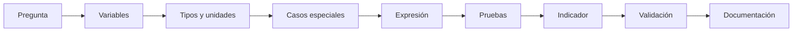
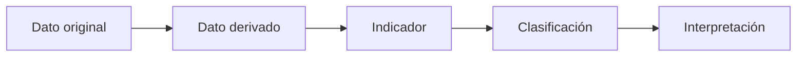
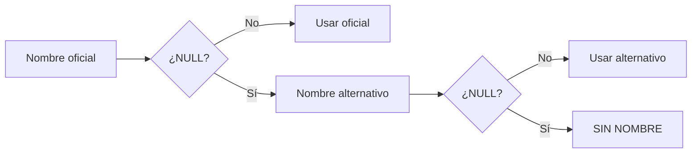
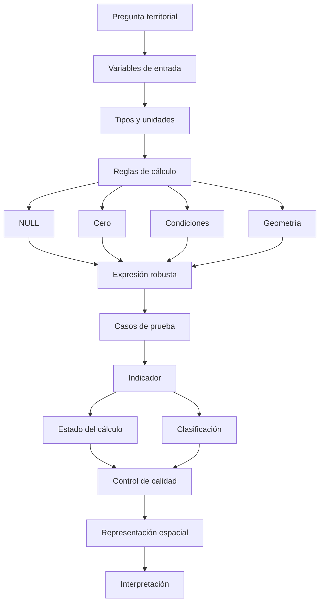
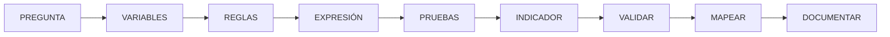

# 3.4 Construir indicadores con expresiones

<div class="grid cards" markdown>

-   :material-function-variant:{ .lg .middle } **Transformar**

    ---

    Convertir atributos existentes en:

    **nuevas variables e indicadores.**

-   :material-source-branch:{ .lg .middle } **Decidir**

    ---

    Utilizar:

    **condiciones, reglas y clasificaciones**

    para representar diferentes situaciones.

-   :material-null:{ .lg .middle } **Controlar ausencia**

    ---

    Diferenciar correctamente:

    **NULL, cero y dato no calculable.**

-   :material-calculator-variant:{ .lg .middle } **Calcular**

    ---

    Construir:

    **porcentajes, tasas, razones, densidades y medidas geométricas.**

-   :material-test-tube:{ .lg .middle } **Probar**

    ---

    Validar expresiones con:

    **casos normales, límites y errores preparados.**

-   :material-file-document-check:{ .lg .middle } **Documentar**

    ---

    Registrar:

    **fórmula, unidad, fuentes, reglas y limitaciones.**

</div>

[Comenzar](#1-de-datos-a-informacion-derivada){ .md-button .md-button--primary }
[Ir al laboratorio](#laboratorio-guiado-construir-un-indicador-de-cobertura){ .md-button }

---

## La misión de esta lección

Hasta ahora hemos trabajado principalmente con:

```text
datos almacenados
```

Por ejemplo:

```text
poblacion = 5000
beneficiarios = 1200
superficie = 4.5 km²
estado = ACTIVO
```

Ahora comenzaremos a producir:

```text
información derivada
```

como:

```text
cobertura = 24 %
densidad = 1111 hab/km²
nivel = MEDIO
estado_calculo = CALCULADO
```

La pregunta central ya no será:

> **¿Cómo hago una operación en la Calculadora de campos?**

sino:

> **¿Qué significa realmente el resultado, qué debe ocurrir cuando faltan datos y cómo puedo demostrar que mi expresión es correcta?**

### Lo que construiremos



---

## Mapa de aprendizaje

<div class="grid cards" markdown>

-   :material-table-column:{ .lg .middle } **1 · Comprender**

    ---

    Campos, literales, operadores y tipos.

-   :material-format-text:{ .lg .middle } **2 · Transformar texto**

    ---

    Normalizar, concatenar y limpiar cadenas.

-   :material-null:{ .lg .middle } **3 · Tratar NULL**

    ---

    Evitar convertir ausencia en información falsa.

-   :material-source-branch:{ .lg .middle } **4 · Construir lógica**

    ---

    `if()` y `CASE`.

-   :material-percent:{ .lg .middle } **5 · Crear indicadores**

    ---

    Porcentajes, tasas, razones y densidades.

-   :material-vector-square:{ .lg .middle } **6 · Calcular geometría**

    ---

    Área, longitud y perímetro.

-   :material-table-edit:{ .lg .middle } **7 · Elegir persistencia**

    ---

    Campo físico o campo virtual.

-   :material-test-tube:{ .lg .middle } **8 · Validar**

    ---

    Casos normales, extremos y fronteras.

</div>

---

## Antes de empezar

!!! info "Necesitarás"

    - QGIS 3.44.
    - Una capa GeoPackage con atributos numéricos y categóricos.
    - Una capa poligonal para los cálculos geométricos.
    - Haber completado:
        - 3.1 Preparar datos confiables;
        - 3.3 Diseñar formularios de captura.

!!! example "Caso guía"

    Trabajaremos con una capa:

    ```text
    distritos
    ```

    que contiene:

    ```text
    id_distrito
    nombre
    poblacion
    beneficiarios
    establecimientos
    ```

    y una geometría poligonal.

!!! success "Principio de trabajo"

    Antes de escribir una expresión debemos conocer:

    ```text
    qué significa cada variable
    qué tipo tiene
    qué unidad utiliza
    qué representa NULL
    qué valores pueden ser cero
    ```

---

## 1. De datos a información derivada

Supongamos:

```text
beneficiarios = 1200
poblacion = 5000
```

Podemos calcular:

```text
1200 / 5000 × 100
```

Resultado:

```text
24 %
```

Ahora tenemos una nueva variable:

```text
cobertura
```

### Pero 24 % de qué

Un número aislado no constituye automáticamente un indicador bien definido.

Necesitamos conocer:

```text
numerador
denominador
unidad
periodo
población de referencia
fuente
reglas de cálculo
```

!!! important "Una expresión puede ser correcta y el indicador estar mal definido"

    El software puede calcular perfectamente:

    ```text
    A / B
    ```

    aunque:

    ```text
    A y B no deban relacionarse
    ```

---

### Dato original, derivado e indicador



Ejemplo:

```text
geometría
↓
superficie
↓
densidad poblacional
↓
densidad alta / media / baja
↓
lectura territorial
```

---

## 2. Qué es una expresión en QGIS

Una expresión es una regla que combina:

```text
campos
valores
operadores
funciones
geometrías
variables
condiciones
```

Por ejemplo:

```qgis
"beneficiarios" / "poblacion"
```

o:

```qgis
upper("estado")
```

o:

```qgis
CASE
    WHEN "capacidad" >= 500 THEN 'ALTA'
    WHEN "capacidad" >= 100 THEN 'MEDIA'
    ELSE 'BAJA'
END
```

### Una misma expresión puede reutilizarse

El lenguaje de expresiones aparece en:

```text
Calculadora de campos
Selección por expresión
Filtros
Simbología
Etiquetas
Formularios
Restricciones
Diseños
Procesamiento
```

!!! quote "Aprender expresiones no sirve solamente para calcular columnas"

    Es uno de los lenguajes centrales de trabajo dentro de QGIS.

---

## 3. Abrir el constructor de expresiones

Podemos acceder desde:

**Tabla de atributos ▸ Calculadora de campos**

o desde muchas otras herramientas de QGIS.

!!! captura "Captura pendiente · 3.4-01"

    - **Tipo:** PNG anotado
    - **Archivo:** `assets/images/modulo-03/3-4/3-4-01-calculadora-campos.png`
    - **Qué mostrar:** ventana completa de la Calculadora de campos.
    - **Resaltar:**
        1. editor de expresión;
        2. árbol de funciones;
        3. campos y valores;
        4. ayuda;
        5. vista previa;
        6. crear campo;
        7. actualizar campo.
    - **Objetivo didáctico:** reconocer la interfaz principal de trabajo con expresiones.

---

## 4. Campo, texto y número no se escriben igual

Esta distinción es fundamental.

<div class="grid cards" markdown>

-   :material-table-column:{ .lg .middle } **Campo**

    ---

    Normalmente:

    ```qgis
    "estado"
    ```

-   :material-format-text:{ .lg .middle } **Texto**

    ---

    Normalmente:

    ```qgis
    'ACTIVO'
    ```

-   :material-numeric:{ .lg .middle } **Número**

    ---

    Normalmente:

    ```qgis
    125
    ```

</div>

### Ejemplo

```qgis
"estado" = 'ACTIVO'
```

significa:

```text
valor del campo estado
es igual al texto ACTIVO
```

### Error frecuente

```qgis
"estado" = "ACTIVO"
```

QGIS puede interpretar:

```text
ACTIVO
```

como otro campo.

!!! success "Regla visual"

    ```text
    "campo"
    'texto'
    123
    ```

---

## 5. Operaciones aritméticas

Podemos utilizar:

```text
+
-
*
/
```

### Suma

```qgis
"benef_directos" + "benef_indirectos"
```

### Multiplicación

```qgis
"poblacion" * 0.15
```

### División

```qgis
"beneficiarios" / "poblacion"
```

### Porcentaje

```qgis
("beneficiarios" / "poblacion") * 100
```

### Utilizar paréntesis

Prefiere:

```qgis
("beneficiarios" / "poblacion") * 100
```

porque hace explícita la lógica.

---

### Probar una expresión sencilla

!!! captura "Captura pendiente · 3.4-02"

    - **Tipo:** GIF
    - **Archivo:** `assets/images/modulo-03/3-4/3-4-02-expresion-basica.gif`
    - **Qué mostrar:**
        1. abrir Calculadora de campos;
        2. insertar dos campos;
        3. construir una división;
        4. observar vista previa.
    - **Objetivo didáctico:** mostrar cómo una fórmula conceptual se traduce a sintaxis QGIS.

---

## 6. El tipo de campo importa

Supongamos que:

```text
poblacion
```

está almacenada como:

```text
Texto
```

aunque vemos:

```text
5000
```

Podríamos necesitar:

```qgis
to_int("poblacion")
```

o:

```qgis
to_real("poblacion")
```

### Pero...

Esto puede resolver el cálculo sin resolver el problema estructural.

<div class="grid" markdown>

!!! warning "Solución temporal"

    ```qgis
    to_int("poblacion_txt")
    ```

!!! success "Solución estructural"

    Si la variable es numérica:

    ```text
    almacenarla como número
    ```

</div>

!!! danger "No utilices conversiones para esconder un modelo incorrecto"

---

## 7. Transformar información textual

Las expresiones también permiten limpiar y estandarizar texto.

### Eliminar espacios laterales

```qgis
trim("nombre")
```

### Mayúsculas

```qgis
upper("estado")
```

### Minúsculas

```qgis
lower("correo")
```

### Formato tipo título

```qgis
title("nombre")
```

### Ejemplo

```text
'  centro norte  '
```

con:

```qgis
trim("nombre")
```

produce:

```text
'centro norte'
```

---

## 8. No normalizar texto sin comprenderlo

Supongamos:

```text
OTB SAN JOSÉ
```

Aplicar:

```qgis
title("nombre")
```

podría producir una presentación no deseada para:

```text
OTB
```

!!! warning "Automatizar forma no debe destruir significado"

    Las reglas de normalización deben conocer:

    ```text
    siglas
    nombres propios
    convenciones institucionales
    ```

---

## 9. Concatenar información

Podemos construir:

```text
EQ-001 - Centro Norte
```

mediante:

```qgis
"codigo" || ' - ' || "nombre"
```

También podemos utilizar:

```qgis
concat(
    "codigo",
    ' - ',
    "nombre"
)
```

### ¿Por qué existen dos alternativas?

Porque el tratamiento de:

```text
NULL
```

puede ser diferente.

---

### Mini-experimento

Supongamos:

```text
codigo = EQ-001
nombre = NULL
```

??? question "¿Qué resultado debería mostrar?"

    Depende del objetivo.

    Podemos querer:

    ```text
    EQ-001
    ```

    o:

    ```text
    EQ-001 - SIN NOMBRE
    ```

    o:

    ```text
    NULL
    ```

La decisión debe ser explícita.

---

## 10. Hacer visible la ausencia

Podemos usar:

```qgis
concat(
    "codigo",
    ' - ',
    coalesce("nombre", 'SIN NOMBRE')
)
```

Resultado:

```text
EQ-001 - SIN NOMBRE
```

!!! important "Ocultar NULL no siempre es una mejora"

    A veces conviene que el usuario vea:

    ```text
    SIN INFORMACIÓN
    ```

    en lugar de una cadena aparentemente completa.

---

## 11. Reemplazar texto

Podemos utilizar:

```qgis
replace()
```

o:

```qgis
regexp_replace()
```

Ejemplo:

```qgis
regexp_replace(
    "codigo",
    '\\s+',
    ''
)
```

puede ayudar a eliminar espacios.

### Pero primero debemos verificar

```text
qué espacios son errores
```

y:

```text
cuáles forman parte legítima del dato
```

---

### Demostración de funciones de texto

!!! captura "Captura pendiente · 3.4-03"

    - **Tipo:** GIF
    - **Archivo:** `assets/images/modulo-03/3-4/3-4-03-funciones-texto.gif`
    - **Qué mostrar:** comparar resultados de:
        - `trim()`;
        - `upper()`;
        - `concat()`;
        - `coalesce()`.
    - **Objetivo didáctico:** que el estudiante observe cómo cambia el dato con cada función.

---

## Checkpoint 1

Deberías poder explicar:

- [ ] cómo se referencia un campo;
- [ ] cómo se representa texto;
- [ ] cómo se representa un número;
- [ ] por qué importa el tipo de dato;
- [ ] cuándo utilizar `trim()`;
- [ ] cuándo utilizar `upper()`;
- [ ] qué hace `concat()`;
- [ ] por qué no debemos normalizar texto indiscriminadamente.

---

## 12. NULL: el caso que más errores conceptuales genera

`NULL` no significa:

```text
0
```

Tampoco significa:

```text
''
```

Normalmente representa:

```text
ausencia de un valor conocido
```

### Operaciones con NULL

```text
5 + NULL
```

produce:

```text
NULL
```

y:

```text
5 / NULL
```

produce:

```text
NULL
```

### Esto tiene sentido

Si desconocemos una parte del cálculo:

```text
podemos desconocer el resultado
```

---

## 13. Cómo comprobar NULL

Incorrecto:

```qgis
"capacidad" = NULL
```

Correcto:

```qgis
"capacidad" IS NULL
```

Para comprobar presencia:

```qgis
"capacidad" IS NOT NULL
```

### Ejemplo

```qgis
CASE
    WHEN "capacidad" IS NULL THEN 'SIN DATO'
    ELSE 'CON DATO'
END
```

---

## 14. coalesce()

La función:

```qgis
coalesce()
```

devuelve el primer valor que no sea `NULL`.

Ejemplo:

```qgis
coalesce(
    "nombre_oficial",
    "nombre_alternativo",
    'SIN NOMBRE'
)
```

Flujo conceptual:



---

## 15. El peligro de coalesce con números

Podemos escribir:

```qgis
coalesce("beneficiarios", 0)
```

Pero:

```text
NULL
```

podría significar:

```text
beneficiarios desconocidos
```

mientras:

```text
0
```

significa:

```text
sabemos que no existen beneficiarios
```

!!! danger "No inventes ceros"

    `coalesce(..., 0)` es técnicamente válido.

    Pero puede ser:

    ```text
    conceptualmente incorrecto
    ```

---

## 16. Cero y desconocido

<div class="grid cards" markdown>

-   :material-numeric-0:{ .lg .middle } **0**

    ---

    ```text
    valor conocido
    ```

-   :material-null:{ .lg .middle } **NULL**

    ---

    ```text
    valor desconocido
    ```

</div>

### Ejemplo

```text
beneficiarios = 0
```

puede producir:

```text
cobertura = 0 %
```

Pero:

```text
beneficiarios = NULL
```

debería producir normalmente:

```text
cobertura = NULL
```

---

## 17. División entre cero

Considera:

```text
beneficiarios = 100
poblacion = 0
```

La expresión:

```qgis
"beneficiarios" / "poblacion"
```

no representa un indicador válido.

### Soluciones incorrectas

```text
sustituir 0 por 1
```

o:

```text
devolver 0 %
```

ambas cambian el significado.

---

## 18. nullif()

Podemos utilizar:

```qgis
nullif("poblacion", 0)
```

Esto devuelve:

```text
NULL
```

cuando:

```text
poblacion = 0
```

Por tanto:

```qgis
"beneficiarios" / nullif("poblacion", 0)
```

evita dividir directamente entre cero.

### Limitación

No distingue por sí sola:

```text
poblacion originalmente NULL
```

de:

```text
poblacion = 0
```

Por eso conviene complementar el indicador con:

```text
un estado del cálculo
```

---

## 19. Valor del indicador y estado del cálculo

Esta es una práctica central de la lección.

En lugar de almacenar solamente:

```text
cobertura_pct
```

crearemos también:

```text
estado_cobertura
```

### Valor

```qgis
CASE
    WHEN "beneficiarios" IS NULL THEN NULL
    WHEN "poblacion" IS NULL THEN NULL
    WHEN "poblacion" = 0 THEN NULL
    ELSE
        round(
            ("beneficiarios" * 100.0) / "poblacion",
            2
        )
END
```

### Estado

```qgis
CASE
    WHEN "beneficiarios" IS NULL THEN 'SIN_BENEFICIARIOS'
    WHEN "poblacion" IS NULL THEN 'SIN_POBLACION'
    WHEN "poblacion" = 0 THEN 'DENOMINADOR_CERO'
    ELSE 'CALCULADO'
END
```

!!! success "Un NULL explicado es mucho más útil que un NULL silencioso"

---

### Ver resultado y estado juntos

!!! captura "Captura pendiente · 3.4-04"

    - **Tipo:** PNG anotado
    - **Archivo:** `assets/images/modulo-03/3-4/3-4-04-valor-estado.png`
    - **Qué mostrar:** tabla con:
        - numerador;
        - denominador;
        - `cobertura_pct`;
        - `estado_cobertura`.
    - **Objetivo didáctico:** distinguir valor nulo de causa del valor nulo.

---

## Checkpoint 2

Deberías poder explicar:

- [ ] por qué `NULL` y cero son distintos;
- [ ] cómo se comprueba `NULL`;
- [ ] qué hace `coalesce()`;
- [ ] por qué `coalesce(...,0)` puede ser peligroso;
- [ ] qué hace `nullif()`;
- [ ] por qué una división entre cero no debería convertirse automáticamente en 0 %;
- [ ] para qué sirve un campo de estado.

---

## 20. Condiciones con if()

La función:

```qgis
if()
```

trabaja conceptualmente como:

```text
si condición
→ resultado A
si no
→ resultado B
```

Sintaxis:

```qgis
if(
    condición,
    valor_si_verdadero,
    valor_si_falso
)
```

### Ejemplo

```qgis
if(
    "capacidad" >= 100,
    'ALTA',
    'BAJA'
)
```

### Cuándo usarla

Cuando tenemos:

```text
dos resultados principales
```

---

## 21. Clasificaciones con CASE

Cuando existen varias condiciones, `CASE` suele ser más legible.

```qgis
CASE
    WHEN "capacidad" IS NULL THEN 'SIN DATO'
    WHEN "capacidad" >= 500 THEN 'ALTA'
    WHEN "capacidad" >= 100 THEN 'MEDIA'
    ELSE 'BAJA'
END
```

### El orden importa

QGIS evalúa:

```text
de arriba hacia abajo
```

y utiliza:

```text
la primera condición verdadera
```

---

## 22. Un CASE mal ordenado

Observa:

```qgis
CASE
    WHEN "capacidad" >= 100 THEN 'MEDIA'
    WHEN "capacidad" >= 500 THEN 'ALTA'
    ELSE 'BAJA'
END
```

¿Qué ocurre con:

```text
capacidad = 600
```

??? question "Predice antes de continuar"

    Resultado:

    ```text
    MEDIA
    ```

    porque:

    ```text
    600 >= 100
    ```

    ya es verdadero.

### Orden correcto

```qgis
CASE
    WHEN "capacidad" >= 500 THEN 'ALTA'
    WHEN "capacidad" >= 100 THEN 'MEDIA'
    ELSE 'BAJA'
END
```

!!! important "La primera condición verdadera detiene la evaluación"

---

### Demostración de CASE

!!! captura "Captura pendiente · 3.4-05"

    - **Tipo:** GIF
    - **Archivo:** `assets/images/modulo-03/3-4/3-4-05-case.gif`
    - **Qué mostrar:**
        1. CASE mal ordenado;
        2. resultado inesperado;
        3. corregir orden;
        4. resultado correcto.
    - **Objetivo didáctico:** aprender mediante un error preparado.

---

## 23. Umbrales necesitan justificación

Supongamos:

```text
0–25 = BAJO
25–50 = MEDIO
50–100 = ALTO
```

¿Por qué:

```text
25
50
```

?

Podrían provenir de:

```text
normativa
metodología
literatura
política institucional
distribución estadística
criterio técnico documentado
```

!!! warning "Dividir 100 en partes iguales no constituye por sí solo una metodología"

---

## 24. Probar los valores frontera

Si definimos:

```text
< 25 → BAJO
< 50 → MEDIO
>= 50 → ALTO
```

debemos probar:

```text
24.99
25.00
49.99
50.00
```

| Valor | Esperado |
|---:|---|
| 24.99 | BAJO |
| 25.00 | MEDIO |
| 49.99 | MEDIO |
| 50.00 | ALTO |

!!! success "Los errores aparecen frecuentemente en los límites"

---

## 25. Porcentaje, razón, tasa y densidad no son lo mismo

=== "Porcentaje"

    ```text
    parte / total × 100
    ```

=== "Razón"

    Compara dos cantidades.

    ```text
    A / B
    ```

    A no tiene que formar parte necesariamente de B.

=== "Tasa"

    Relaciona eventos con una población o exposición.

    Por ejemplo:

    ```text
    casos / población × 1000
    ```

=== "Densidad"

    Relaciona una cantidad con superficie.

    ```text
    habitantes / km²
    ```

!!! important "La unidad forma parte del indicador"

    Un valor:

    ```text
    25
    ```

    puede significar:

    ```text
    25 %
    25 hab/km²
    25 servicios/1000 hab
    ```

---

## 26. Construir un porcentaje robusto

Indicador:

```text
Cobertura =
beneficiarios / población × 100
```

Una versión robusta:

```qgis
CASE
    WHEN "beneficiarios" IS NULL THEN NULL
    WHEN "poblacion" IS NULL THEN NULL
    WHEN "poblacion" = 0 THEN NULL
    ELSE
        round(
            ("beneficiarios" * 100.0) / "poblacion",
            2
        )
END
```

---

## 27. Porcentaje superior a 100

Supongamos:

```text
beneficiarios = 1200
poblacion = 1000
```

Resultado:

```text
120 %
```

¿Es un error?

??? question "Antes de responder, piensa qué representa beneficiarios"

    Puede ser un error si:

    ```text
    beneficiarios
    ```

    representa personas únicas que forman parte de esa población.

    Pero podría ser válido si representa:

    ```text
    atenciones
    prestaciones
    visitas
    eventos
    ```

    donde una misma persona puede aparecer más de una vez.

!!! success "La matemática no puede definir por sí sola el significado del indicador"

---

## 28. Redondear resultados

Podemos utilizar:

```qgis
round(
    valor,
    2
)
```

Ejemplo:

```qgis
round(
    ("beneficiarios" * 100.0) / "poblacion",
    2
)
```

### Resultado

```text
24.37
```

### Pero...

Mostrar:

```text
24.372849152 %
```

no significa que el dato sea más exacto.

!!! quote "Más decimales no equivalen a mayor calidad"

---

## 29. Calculadora de campos: crear un campo permanente

Podemos crear:

```text
cobertura_pct
```

como:

```text
Número decimal
```

y almacenar físicamente el resultado.

### Ventajas

```text
viaja con los datos
puede exportarse
puede usarse fuera del proyecto
```

### Riesgo

Si posteriormente cambia:

```text
beneficiarios
```

o:

```text
poblacion
```

el valor calculado puede quedar:

```text
desactualizado
```

---

### Crear un campo persistente

!!! captura "Captura pendiente · 3.4-06"

    - **Tipo:** GIF
    - **Archivo:** `assets/images/modulo-03/3-4/3-4-06-campo-persistente.gif`
    - **Qué mostrar:**
        1. crear nuevo campo;
        2. definir tipo decimal;
        3. expresión;
        4. guardar;
        5. mostrar resultado.
    - **Objetivo didáctico:** visualizar un cálculo almacenado físicamente.

---

## 30. Campo virtual

QGIS también permite crear:

```text
campos virtuales
```

Su valor se calcula dinámicamente desde una expresión.

### Ejemplo

```text
densidad_virtual
```

puede depender de:

```text
poblacion
+
geometría
```

### Si cambia una entrada

El campo virtual:

```text
se recalcula
```

---

### Crear un campo virtual

!!! captura "Captura pendiente · 3.4-07"

    - **Tipo:** GIF
    - **Archivo:** `assets/images/modulo-03/3-4/3-4-07-campo-virtual.gif`
    - **Qué mostrar:**
        1. activar creación de campo virtual;
        2. escribir expresión;
        3. modificar un valor de entrada;
        4. observar actualización automática.
    - **Objetivo didáctico:** contrastar campo virtual y campo almacenado.

---

## 31. Persistente o virtual

| Situación | Opción posible |
|---|---|
| Debe viajar dentro del dataset | Persistente |
| Cálculo exploratorio | Virtual |
| Resultado oficial de una fecha | Persistente |
| Debe cambiar al editar geometría | Virtual |
| Exportación a otro sistema | Persistente |
| Indicador dependiente de campos cambiantes | Virtual o actualización controlada |

!!! info "No existe una respuesta universal"

    Depende de:

    ```text
    flujo de trabajo
    actualización
    interoperabilidad
    trazabilidad
    ```

---

## 32. Experimento: modificar una entrada

Crea:

```text
cobertura_fija
```

como campo persistente.

Crea:

```text
cobertura_virtual
```

como campo virtual.

Luego cambia:

```text
beneficiarios
```

??? question "¿Qué esperas que ocurra?"

    ```text
    cobertura_fija
    → permanece igual

    cobertura_virtual
    → se recalcula
    ```

!!! captura "Captura pendiente · 3.4-08"

    - **Tipo:** GIF comparativo
    - **Archivo:** `assets/images/modulo-03/3-4/3-4-08-persistente-vs-virtual.gif`
    - **Qué mostrar:** ambos campos antes y después de modificar un valor de entrada.
    - **Objetivo didáctico:** evidenciar la diferencia de comportamiento.

---

## Checkpoint 3

Deberías poder explicar:

- [ ] cuándo utilizar `if()`;
- [ ] cuándo utilizar `CASE`;
- [ ] por qué importa el orden de condiciones;
- [ ] por qué los umbrales necesitan justificación;
- [ ] qué diferencia existe entre porcentaje y densidad;
- [ ] por qué un porcentaje mayor a 100 no siempre es error;
- [ ] qué diferencia existe entre campo persistente y virtual;
- [ ] qué ocurre cuando cambia un campo utilizado por un indicador persistente.

---

## 33. Medidas geométricas

Una geometría también puede producir atributos.

Por ejemplo:

```text
área
longitud
perímetro
```

### Área

Podemos utilizar:

```qgis
$area
```

### Longitud

```qgis
$length
```

### Perímetro

```qgis
$perimeter
```

---

## 34. Medir requiere conocer unidades

No debemos asumir:

```text
$area
→ m²
```

sin revisar:

```text
SRC
configuración del proyecto
unidades de medición
elipsoide
```

!!! warning "Una cifra sin unidad puede ser inútil"

---

## 35. $area y area($geometry)

Estas expresiones no deben utilizarse como si fueran necesariamente equivalentes.

=== "`$area`"

    Utiliza la configuración de medición del proyecto.

    Puede considerar:

    ```text
    elipsoide
    unidades
    configuración de medición
    ```

=== "`area($geometry)`"

    Calcula el área geométrica de acuerdo con la geometría y su sistema de referencia.

    Su interpretación depende de:

    ```text
    SRC
    unidades
    ```

!!! important "Define primero la metodología de medición"

---

## 36. Calcular hectáreas

Si hemos comprobado que el área está expresada en:

```text
m²
```

entonces:

```qgis
$area / 10000.0
```

produce:

```text
hectáreas
```

Podemos redondear:

```qgis
round(
    $area / 10000.0,
    2
)
```

### Pero...

No utilices:

```text
/10000
```

sin haber confirmado primero la unidad.

---

### Revisar unidades y cálculo

!!! captura "Captura pendiente · 3.4-09"

    - **Tipo:** PNG anotado
    - **Archivo:** `assets/images/modulo-03/3-4/3-4-09-area-unidades.png`
    - **Qué mostrar:**
        1. SRC de la capa;
        2. configuración de unidades;
        3. cálculo de `$area`;
        4. conversión a hectáreas.
    - **Objetivo didáctico:** relacionar cálculo geométrico con sistema de referencia y unidades.

---

## 37. Construir densidad poblacional

Queremos:

```text
habitantes
──────────
km²
```

Si:

```text
$area
```

está en metros cuadrados:

```qgis
CASE
    WHEN "poblacion" IS NULL THEN NULL
    WHEN $area <= 0 THEN NULL
    ELSE
        round(
            "poblacion" / ($area / 1000000.0),
            2
        )
END
```

Unidad:

```text
hab/km²
```

### Estado

```qgis
CASE
    WHEN "poblacion" IS NULL THEN 'SIN_POBLACION'
    WHEN $area <= 0 THEN 'AREA_INVALIDA'
    ELSE 'CALCULADO'
END
```

---

## 38. No almacenar unidades dentro del valor

Evita almacenar:

```text
24.5 %
```

como texto.

Mejor:

```text
campo:
cobertura_pct

tipo:
decimal

valor:
24.5

unidad documentada:
%
```

### Ventaja

Podemos:

```text
ordenar
filtrar
calcular
clasificar
simbolizar
```

---

## 39. Separar indicador y clasificación

No guardes solamente:

```text
nivel_cobertura = ALTA
```

Conserva también:

```text
cobertura_pct = 67.42
```

### Estructura

```text
cobertura_pct
↓
nivel_cobertura
```

### Ventaja

Podemos cambiar:

```text
los umbrales
```

sin perder:

```text
el valor original del indicador
```

---

## 40. Crear una clasificación

Si la metodología establece:

```text
< 25     → BAJA
25–50    → MEDIA
>= 50    → ALTA
```

podemos utilizar:

```qgis
CASE
    WHEN "cobertura_pct" IS NULL THEN 'SIN_DATO'
    WHEN "cobertura_pct" < 25 THEN 'BAJA'
    WHEN "cobertura_pct" < 50 THEN 'MEDIA'
    ELSE 'ALTA'
END
```

!!! warning "La clasificación es una interpretación adicional"

    El valor:

    ```text
    24.9
    ```

    es dato derivado.

    La categoría:

    ```text
    BAJA
    ```

    depende de una regla metodológica.

---

## 41. De indicador a mapa

Una vez creado:

```text
nivel_cobertura
```

podemos utilizarlo para:

```text
simbología categorizada
```

o utilizar directamente:

```text
cobertura_pct
```

para:

```text
simbología graduada
```


!!! captura "Captura pendiente · 3.4-10"

    - **Tipo:** PNG comparativo
    - **Archivo:** `assets/images/modulo-03/3-4/3-4-10-indicador-mapa.png`
    - **Qué mostrar:**
        1. tabla con indicador;
        2. mapa graduado;
        3. leyenda.
    - **Objetivo didáctico:** conectar cálculo tabular con interpretación espacial.

---

## 42. Un mapa no valida el indicador

Un mapa puede verse:

```text
coherente
atractivo
profesional
```

y utilizar:

```text
un indicador mal calculado
```

!!! danger "La cartografía puede hacer convincente un error"

    Por eso la secuencia correcta es:

    ```text
    definir
    ↓
    calcular
    ↓
    probar
    ↓
    validar
    ↓
    representar
    ```

---

## 43. Diseñar casos de prueba antes de calcular

Para:

```text
cobertura =
beneficiarios / población × 100
```

crearemos casos conocidos.

| Caso | Beneficiarios | Población | Resultado esperado |
|---|---:|---:|---:|
| Normal | 50 | 100 | 50 |
| Numerador cero | 0 | 100 | 0 |
| Numerador NULL | NULL | 100 | NULL |
| Denominador NULL | 50 | NULL | NULL |
| Denominador cero | 50 | 0 | NULL |

### El valor esperado debe definirse antes de ejecutar

Esto evita:

```text
aceptar cualquier resultado que produzca QGIS
```

---

## 44. Crear registros de prueba

Podemos crear temporalmente registros como:

```text
TEST-01
TEST-02
TEST-03
TEST-04
TEST-05
```

con valores conocidos.

!!! captura "Captura pendiente · 3.4-11"

    - **Tipo:** PNG anotado
    - **Archivo:** `assets/images/modulo-03/3-4/3-4-11-registros-prueba.png`
    - **Qué mostrar:** tabla con los cinco casos de prueba.
    - **Objetivo didáctico:** demostrar cómo se valida una expresión antes de aplicarla a toda la base.

---

## 45. Ejecutar la prueba

Calculamos:

```text
cobertura_pct
```

y:

```text
estado_cobertura
```

Después comparamos:

| Caso | Esperado | Obtenido | Estado |
|---|---:|---:|---|
| Normal | 50 | | |
| Cero | 0 | | |
| Numerador NULL | NULL | | |
| Denominador NULL | NULL | | |
| Denominador 0 | NULL | | |

!!! success "Una expresión se considera confiable cuando su comportamiento ha sido probado"

---

## 46. Probar valores frontera

Para una clasificación con:

```text
25
50
```

probaremos:

```text
24.99
25.00
49.99
50.00
```

### ¿Por qué?

Porque:

```qgis
< 25
```

no es lo mismo que:

```qgis
<= 25
```

---

### Demostración de pruebas frontera

!!! captura "Captura pendiente · 3.4-12"

    - **Tipo:** GIF
    - **Archivo:** `assets/images/modulo-03/3-4/3-4-12-pruebas-frontera.gif`
    - **Qué mostrar:** modificar valores alrededor de un umbral y observar cambio de clasificación.
    - **Objetivo didáctico:** evidenciar la importancia de los operadores de comparación.

---

## 47. Auditar el resultado

Después de calcular debemos revisar:

```text
mínimo
máximo
media
mediana
NULL
```

### Ejemplo

Esperábamos un porcentaje:

```text
0–100
```

pero obtenemos:

```text
máximo = 8450
```

Esto merece investigación.

Podría deberse a:

```text
unidades incorrectas
numerador acumulativo
denominador equivocado
duplicación
error de fórmula
```

---

## 48. Resultado extremo no significa error automático

Supongamos:

```text
cobertura = 125 %
```

No debemos reemplazarlo automáticamente.

Debemos investigar:

```text
cómo se define el numerador
```

y:

```text
cómo se define el denominador
```

La lógica de 3.1 sigue vigente:

```text
anomalía
≠
error confirmado
```

---

## 49. Estadísticas del resultado

Utiliza el panel o herramientas de estadísticas de QGIS para revisar la distribución.

!!! captura "Captura pendiente · 3.4-13"

    - **Tipo:** GIF
    - **Archivo:** `assets/images/modulo-03/3-4/3-4-13-estadisticas-indicador.gif`
    - **Qué mostrar:** mínimo, máximo, media y NULL del indicador.
    - **Objetivo didáctico:** incorporar control de coherencia después del cálculo.

---

## 50. Construir una ficha técnica

Todo indicador importante debería documentarse.

| Elemento | Contenido |
|---|---|
| Nombre | |
| Objetivo | |
| Numerador | |
| Denominador | |
| Fórmula | |
| Unidad | |
| Fuente numerador | |
| Fuente denominador | |
| Periodo | |
| Tratamiento de NULL | |
| Tratamiento de cero | |
| Rango esperado | |
| Frecuencia de actualización | |
| Limitaciones | |

### Ejemplo

```text
Nombre:
Cobertura de beneficiarios

Numerador:
beneficiarios

Denominador:
poblacion

Fórmula:
beneficiarios / poblacion × 100

Unidad:
%

Numerador NULL:
no calculable

Denominador NULL:
no calculable

Denominador 0:
no calculable
```

---

## 51. Expresión legible = expresión mantenible

Evita:

```qgis
CASE WHEN "poblacion" IS NULL THEN NULL WHEN "poblacion"=0 THEN NULL WHEN ...
```

Prefiere:

```qgis
CASE
    WHEN "beneficiarios" IS NULL THEN NULL
    WHEN "poblacion" IS NULL THEN NULL
    WHEN "poblacion" = 0 THEN NULL
    ELSE
        round(
            ("beneficiarios" * 100.0) / "poblacion",
            2
        )
END
```

### Formato también es documentación

Una expresión clara facilita:

```text
revisión
enseñanza
mantenimiento
auditoría
```

---

## 52. No ocultar errores con valores alternativos

Funciones de control pueden ser útiles.

Pero una lógica como:

```text
si algo falla
→ devolver 0
```

puede transformar:

```text
un error
```

en:

```text
un valor aparentemente válido
```

!!! danger "Un indicador silenciosamente incorrecto es más peligroso que un error visible"

---

## Checkpoint 4

Antes del laboratorio deberías poder:

- [ ] diferenciar campo, texto y número;
- [ ] transformar texto;
- [ ] tratar correctamente `NULL`;
- [ ] diferenciar cero de ausencia;
- [ ] utilizar `CASE`;
- [ ] controlar denominadores cero;
- [ ] separar valor de indicador y estado;
- [ ] construir porcentajes y densidades;
- [ ] diferenciar campo persistente y virtual;
- [ ] calcular área;
- [ ] verificar unidades;
- [ ] diseñar casos de prueba;
- [ ] documentar una ficha técnica.

---

## Laboratorio guiado: construir un indicador de cobertura

!!! example "Escenario"

    Dispones de una capa:

    ```text
    distritos
    ```

    con:

    ```text
    poblacion
    beneficiarios
    ```

    La base contiene deliberadamente:

    ```text
    valores normales
    cero
    NULL
    denominador cero
    valores extremos
    ```

    Construiremos:

    ```text
    cobertura_pct
    estado_cobertura
    nivel_cobertura
    area_km2
    densidad_hab_km2
    ```

### Fase 1 · Revisar campos

Completa:

| Campo | Tipo | Unidad | ¿Permite NULL? |
|---|---|---|---|
| `poblacion` | | | |
| `beneficiarios` | | | |

### Fase 2 · Definir la fórmula

```text
Cobertura =
beneficiarios / población × 100
```

### Fase 3 · Definir excepciones

| Caso | Resultado |
|---|---|
| beneficiarios válidos + población válida | calcular |
| beneficiarios = 0 | 0 % |
| beneficiarios = NULL | NULL |
| población = NULL | NULL |
| población = 0 | NULL |

### Fase 4 · Crear casos de prueba

Crea:

```text
TEST-01
TEST-02
TEST-03
TEST-04
TEST-05
```

con resultados esperados conocidos.

### Fase 5 · Crear cobertura

```qgis
CASE
    WHEN "beneficiarios" IS NULL THEN NULL
    WHEN "poblacion" IS NULL THEN NULL
    WHEN "poblacion" = 0 THEN NULL
    ELSE
        round(
            ("beneficiarios" * 100.0) / "poblacion",
            2
        )
END
```

### Fase 6 · Crear estado

```qgis
CASE
    WHEN "beneficiarios" IS NULL THEN 'SIN_BENEFICIARIOS'
    WHEN "poblacion" IS NULL THEN 'SIN_POBLACION'
    WHEN "poblacion" = 0 THEN 'DENOMINADOR_CERO'
    ELSE 'CALCULADO'
END
```

### Fase 7 · Crear clasificación

Utiliza los umbrales definidos por el ejercicio.

Por ejemplo:

```qgis
CASE
    WHEN "cobertura_pct" IS NULL THEN 'SIN_DATO'
    WHEN "cobertura_pct" < 25 THEN 'BAJA'
    WHEN "cobertura_pct" < 50 THEN 'MEDIA'
    ELSE 'ALTA'
END
```

### Fase 8 · Crear área

Verifica primero las unidades.

Después crea:

```text
area_km2
```

### Fase 9 · Crear densidad

```text
densidad_hab_km2
```

utilizando:

```text
poblacion / area_km2
```

con protección frente a:

```text
NULL
área <= 0
```

### Fase 10 · Crear un campo virtual

Genera al menos uno de los indicadores como:

```text
campo virtual
```

### Fase 11 · Comparar comportamientos

Modifica:

```text
beneficiarios
```

y compara:

```text
campo persistente
campo virtual
```

### Fase 12 · Revisar estadísticas

Registra:

```text
mínimo:
máximo:
media:
NULL:
```

### Fase 13 · Revisar valores sospechosos

Selecciona los:

```text
valores extremos
```

y determina si:

```text
son errores
```

o:

```text
requieren contexto
```

### Fase 14 · Simbolizar

Representa:

```text
cobertura_pct
```

mediante simbología graduada.

### Fase 15 · Crear ficha técnica

Documenta completamente el indicador.

### Evidencia del laboratorio

!!! captura "Captura pendiente · 3.4-14"

    - **Tipo:** Imagen compuesta
    - **Archivo:** `assets/images/modulo-03/3-4/3-4-14-laboratorio.png`
    - **Qué mostrar:**
        1. datos originales;
        2. expresión;
        3. resultado y estado;
        4. mapa final.
    - **Objetivo didáctico:** mostrar el flujo completo desde dato hasta representación.

---

## Mini-reto: ¿qué resultado debería devolver?

=== "Caso A"

    ```text
    beneficiarios = 50
    poblacion = 100
    ```

    ??? question "Resultado"

        ```text
        50 %
        ```

=== "Caso B"

    ```text
    beneficiarios = 0
    poblacion = 100
    ```

    ??? question "Resultado"

        ```text
        0 %
        ```

=== "Caso C"

    ```text
    beneficiarios = NULL
    poblacion = 100
    ```

    ??? question "Resultado"

        ```text
        NULL
        ```

        Estado:

        ```text
        SIN_BENEFICIARIOS
        ```

=== "Caso D"

    ```text
    beneficiarios = 50
    poblacion = 0
    ```

    ??? question "Resultado"

        ```text
        NULL
        ```

        Estado:

        ```text
        DENOMINADOR_CERO
        ```

=== "Caso E"

    ```text
    beneficiarios = 120
    poblacion = 100
    ```

    ??? question "¿Error?"

        No necesariamente.

        Primero debemos conocer:

        ```text
        qué representa beneficiarios
        ```

---

## Reto práctico

!!! example "Reto 3.4 — Construir un indicador contemplando datos ausentes y denominadores cero"

    ### Contexto

    Debes construir un indicador territorial a partir de una capa que contiene:

    ```text
    valores completos
    numeradores cero
    numeradores NULL
    denominadores NULL
    denominadores cero
    valores extremos
    ```

    El objetivo no es conseguir que:

    ```text
    todas las filas tengan un número
    ```

    sino que:

    ```text
    cada resultado tenga sentido
    ```

    ### Misión 1 · Definir el indicador

    Documenta:

    ```text
    Nombre:
    Objetivo:
    Numerador:
    Denominador:
    Unidad:
    Periodo:
    ```

    ### Misión 2 · Revisar tipos

    Completa:

    | Campo | Tipo | Unidad | NULL |
    |---|---|---|---|
    | Numerador | | | |
    | Denominador | | | |

    ### Misión 3 · Definir casos especiales

    Completa:

    | Caso | Resultado esperado |
    |---|---|
    | Numerador válido | |
    | Numerador 0 | |
    | Numerador NULL | |
    | Denominador NULL | |
    | Denominador 0 | |

    ### Misión 4 · Crear registros de prueba

    Utiliza al menos:

    ```text
    normal
    numerador cero
    numerador NULL
    denominador NULL
    denominador cero
    ```

    ### Misión 5 · Crear el indicador

    Genera:

    ```text
    indicador_pct
    ```

    como número decimal.

    ### Misión 6 · Crear estado

    Genera:

    ```text
    estado_ind
    ```

    con categorías:

    ```text
    CALCULADO
    SIN_NUMERADOR
    SIN_DENOMINADOR
    DENOMINADOR_CERO
    ```

    ### Misión 7 · Utilizar nullif()

    Construye una versión alternativa:

    ```qgis
    "numerador" / nullif("denominador", 0)
    ```

    Explica:

    ```text
    qué resuelve
    qué no distingue
    ```

    ### Misión 8 · Utilizar coalesce()

    Prueba:

    ```qgis
    coalesce("numerador", 0)
    ```

    Explica por qué podría alterar el significado.

    ### Misión 9 · Crear clasificación

    Genera:

    ```text
    nivel_indicador
    ```

    con umbrales documentados.

    ### Misión 10 · Probar fronteras

    Si utilizas:

    ```text
    25
    50
    ```

    prueba:

    ```text
    24.99
    25.00
    49.99
    50.00
    ```

    ### Misión 11 · Crear transformación textual

    Utiliza al menos dos funciones entre:

    ```text
    trim()
    upper()
    concat()
    coalesce()
    ```

    ### Misión 12 · Crear variable geométrica

    Calcula:

    ```text
    superficie
    ```

    o:

    ```text
    longitud
    ```

    documentando unidades.

    ### Misión 13 · Crear campo virtual

    Crea al menos un cálculo dinámico.

    ### Misión 14 · Comparar actualización

    Modifica uno de los campos de entrada y documenta:

    ```text
    qué cambia automáticamente
    qué permanece almacenado
    ```

    ### Misión 15 · Construir matriz de pruebas

    | Caso | Numerador | Denominador | Esperado | Obtenido | Estado |
    |---|---:|---:|---:|---:|---|
    | Normal | | | | | |
    | Numerador 0 | | | | | |
    | Numerador NULL | | | | | |
    | Denominador NULL | | | | | |
    | Denominador 0 | | | | | |

    ### Misión 16 · Revisar distribución

    Registra:

    ```text
    mínimo
    máximo
    media
    mediana
    NULL
    ```

    ### Misión 17 · Investigar valores extremos

    No los elimines automáticamente.

    Clasifícalos como:

    ```text
    error
    valor válido
    necesita contexto
    ```

    ### Misión 18 · Crear ficha técnica

    Completa:

    | Elemento | Resultado |
    |---|---|
    | Nombre | |
    | Objetivo | |
    | Numerador | |
    | Denominador | |
    | Fórmula | |
    | Unidad | |
    | Periodo | |
    | NULL numerador | |
    | NULL denominador | |
    | Denominador cero | |
    | Rango esperado | |
    | Fuente | |
    | Limitaciones | |

    ### Misión 19 · Representar el indicador

    Construye un mapa temático.

    ### Misión 20 · Elaborar conclusión

    Redacta entre **180 y 250 palabras** explicando:

    - qué indicador construiste;
    - qué representa el numerador;
    - qué representa el denominador;
    - qué unidad produce;
    - cómo trataste los valores NULL;
    - cómo trataste el cero;
    - qué hiciste con denominadores cero;
    - qué casos no pudieron calcularse;
    - qué pruebas ejecutaste;
    - qué valores extremos encontraste;
    - qué limitaciones conserva el indicador.

    ### Entregables

    - `reto_3-4_indicadores.qgz`;
    - GeoPackage de trabajo;
    - indicador numérico;
    - campo de estado;
    - clasificación;
    - al menos un campo virtual;
    - variable geométrica;
    - matriz de pruebas;
    - ficha técnica;
    - tabla de estadísticas;
    - captura de Calculadora de campos;
    - GIF de campo virtual;
    - captura de casos NULL/cero;
    - captura del mapa final;
    - conclusión técnica.

---

## Criterios de evaluación

??? success "Ver rúbrica"

    | Criterio | Se cumple si... |
    |---|---|
    | Definición | El indicador responde a una pregunta concreta |
    | Numerador | Está claramente definido |
    | Denominador | Está claramente definido |
    | Unidad | Está documentada |
    | Tipo | Los campos permiten el cálculo |
    | NULL | Se trata explícitamente |
    | Cero | Se diferencia de ausencia |
    | División | No utiliza denominador cero |
    | Estado | Explica por qué no se calcula |
    | CASE | Las condiciones tienen orden correcto |
    | Umbrales | Están justificados |
    | Texto | Se aplican transformaciones correctamente |
    | Geometría | Se calcula una variable espacial |
    | Unidades | Se comprueban antes de convertir |
    | Persistencia | Se diferencia campo físico y virtual |
    | Pruebas | Existen casos conocidos |
    | Fronteras | Se prueban límites |
    | Estadísticas | Se revisa distribución |
    | Atípicos | Se investigan antes de modificar |
    | Ficha | El indicador está documentado |
    | Resultado | Puede reproducirse y explicarse |

---

## Errores frecuentes

=== "El campo no aparece en la expresión"

    Revisa:

    ```text
    nombre
    tipo
    capa
    ```

=== "Escribí texto con comillas dobles"

    Recuerda:

    ```text
    "campo"
    'texto'
    ```

=== "El cálculo devuelve NULL"

    Revisa si alguno de los operandos es:

    ```text
    NULL
    ```

=== "Utilicé = NULL"

    Debes utilizar:

    ```qgis
    IS NULL
    ```

=== "Reemplacé todos los NULL por cero"

    Puedes haber cambiado el significado del dato.

=== "Numerador cero aparece como sin dato"

    Recuerda:

    ```text
    0 ≠ NULL
    ```

=== "Denominador cero produce 0 %"

    Un denominador cero debería tratarse como:

    ```text
    no calculable
    ```

    salvo que exista una metodología específica que indique otra cosa.

=== "CASE clasifica mal los valores altos"

    Revisa el orden de las condiciones.

=== "El valor 25 cae en la categoría incorrecta"

    Revisa:

    ```text
    <
    <=
    >
    >=
    ```

=== "Tengo demasiados decimales"

    Utiliza:

    ```qgis
    round()
    ```

=== "El área está en una unidad extraña"

    Revisa:

    ```text
    SRC
    unidades
    configuración de medición
    ```

=== "El campo calculado no se actualizó"

    Puede ser:

    ```text
    persistente
    ```

    y necesitar recálculo.

=== "El campo virtual no aparece fuera del proyecto"

    Es parte de la configuración de QGIS, no necesariamente de la fuente física.

=== "El mapa se ve bien"

    Eso no demuestra que:

    ```text
    el indicador sea correcto
    ```

---

## Desafío de 5 minutos

!!! challenge "Diagnostica cada resultado"

    **Caso 1**

    ```text
    beneficiarios = NULL
    poblacion = 5000
    cobertura = 0 %
    ```

    ¿Correcto?

    **Caso 2**

    ```text
    beneficiarios = 0
    poblacion = 5000
    cobertura = 0 %
    ```

    ¿Correcto?

    **Caso 3**

    ```text
    beneficiarios = 100
    poblacion = 0
    cobertura = 0 %
    ```

    ¿Correcto?

    **Caso 4**

    ```text
    cobertura = 125 %
    ```

    ¿Error?

    **Caso 5**

    Un CASE evalúa `>=100` antes de `>=500`.

    ¿Qué ocurre con 700?

??? success "Solución"

    **1 — Incorrecto**

    `NULL` no debería convertirse automáticamente en cero.

    **2 — Correcto**

    Si cero es un valor observado.

    **3 — Incorrecto**

    El denominador cero hace que el indicador no sea calculable.

    **4 — Necesita contexto**

    Puede ser válido o inválido según la definición del numerador.

    **5 — Se clasificará en la primera condición**

    Si `>=100` aparece primero:

    ```text
    700
    ```

    entrará ahí antes de llegar a `>=500`.

---

## Ideas clave

<div class="grid cards" markdown>

-   :material-function-variant:{ .lg .middle } **Expresa**

    ---

    Una fórmula debe representar una regla comprensible.

-   :material-null:{ .lg .middle } **Distingue**

    ---

    NULL, cero y no calculable son situaciones diferentes.

-   :material-source-branch:{ .lg .middle } **Controla**

    ---

    Las condiciones deben contemplar los casos especiales.

-   :material-percent:{ .lg .middle } **Define**

    ---

    Porcentaje, tasa, razón y densidad no son equivalentes.

-   :material-test-tube:{ .lg .middle } **Prueba**

    ---

    Los casos conocidos son parte del cálculo.

-   :material-file-document-check:{ .lg .middle } **Documenta**

    ---

    Un indicador sin ficha técnica pierde reproducibilidad.

</div>

!!! success "Para recordar"

    - Una expresión transforma datos mediante reglas reproducibles.
    - Una fórmula matemática correcta no garantiza un indicador correcto.
    - Campos, textos y números utilizan sintaxis diferente.
    - El tipo de campo condiciona los cálculos.
    - Las funciones de texto permiten normalizar y construir cadenas.
    - No debemos transformar texto sin conocer su significado.
    - `NULL` no significa cero.
    - Para comprobar ausencia se utiliza `IS NULL`.
    - `coalesce()` devuelve el primer valor no nulo.
    - Sustituir NULL por cero puede inventar información.
    - `nullif()` puede ayudar a controlar denominadores cero.
    - Un indicador no calculable no debería convertirse automáticamente en cero.
    - Es útil separar valor y estado del cálculo.
    - `if()` es apropiado para decisiones simples.
    - `CASE` permite múltiples condiciones.
    - El orden de `CASE` importa.
    - Los umbrales necesitan justificación.
    - Debemos probar los valores frontera.
    - Porcentaje, tasa, razón y densidad representan conceptos diferentes.
    - Un porcentaje mayor a 100 no es automáticamente error.
    - `round()` modifica la presentación, no la calidad del dato.
    - Las medidas geométricas necesitan unidades conocidas.
    - Un campo persistente puede quedar desactualizado.
    - Un campo virtual se recalcula dinámicamente.
    - Indicador y clasificación deberían conservarse separados.
    - Un mapa no valida una expresión.
    - Los casos de prueba deben diseñarse antes de aceptar el resultado.
    - Los valores extremos deben investigarse.
    - Todo indicador importante debería tener una ficha técnica.

---

## Autoevaluación

??? question "1. ¿Qué es una expresión?"

    Una regla que combina campos, valores, funciones y operadores para producir un resultado.

??? question "2. ¿Cómo se referencia normalmente un campo?"

    ```qgis
    "poblacion"
    ```

??? question "3. ¿Cómo se representa texto?"

    ```qgis
    'ACTIVO'
    ```

??? question "4. ¿NULL equivale a cero?"

    No.

??? question "5. ¿Cómo se comprueba NULL?"

    ```qgis
    "campo" IS NULL
    ```

??? question "6. ¿Qué hace coalesce()?"

    Devuelve el primer argumento no nulo.

??? question "7. ¿Por qué puede ser peligroso coalesce(\"beneficiarios\", 0)?"

    Porque puede convertir ausencia de información en un cero conocido.

??? question "8. ¿Qué hace nullif(\"poblacion\", 0)?"

    Devuelve NULL cuando población es igual a cero.

??? question "9. ¿Por qué puede ser útil?"

    Para evitar utilizar directamente cero como denominador.

??? question "10. ¿Qué diferencia existe entre 0 beneficiarios y beneficiarios NULL?"

    El primero es un dato conocido igual a cero; el segundo representa ausencia de información.

??? question "11. ¿Para qué sirve if()?"

    Para devolver uno de dos resultados según una condición.

??? question "12. ¿Para qué sirve CASE?"

    Para evaluar varias condiciones de manera ordenada.

??? question "13. ¿Por qué importa el orden de CASE?"

    Porque QGIS utiliza la primera condición verdadera.

??? question "14. ¿Los umbrales pueden elegirse arbitrariamente?"

    No deberían. Necesitan una justificación metodológica.

??? question "15. ¿Por qué probar 24.99, 25 y 25.01?"

    Para verificar el comportamiento exacto alrededor de un límite de clasificación.

??? question "16. ¿Qué diferencia existe entre porcentaje y densidad?"

    El porcentaje relaciona una parte con un total; la densidad relaciona una cantidad con superficie.

??? question "17. ¿Un porcentaje mayor a 100 siempre es error?"

    No.

??? question "18. ¿Para qué sirve round()?"

    Para limitar la cantidad de decimales del resultado.

??? question "19. ¿Más decimales significan mayor exactitud?"

    No.

??? question "20. ¿Qué es un campo persistente?"

    Un campo cuyo valor queda almacenado físicamente en la fuente.

??? question "21. ¿Qué es un campo virtual?"

    Un campo calculado dinámicamente por QGIS.

??? question "22. ¿Qué ventaja tiene un campo virtual?"

    Se recalcula al cambiar sus entradas.

??? question "23. ¿Qué debe comprobarse antes de convertir área a hectáreas?"

    Las unidades en las que se expresa el área.

??? question "24. ¿Por qué conviene conservar indicador y clasificación?"

    Porque la clasificación puede cambiar sin perder el valor numérico original.

??? question "25. ¿Por qué necesitamos casos de prueba?"

    Para comprobar que la expresión produce resultados conocidos en situaciones normales y excepcionales.

??? question "26. ¿Un mapa visualmente coherente demuestra que el indicador es correcto?"

    No.

??? question "27. ¿Qué debe contener una ficha técnica?"

    Definición, fórmula, unidad, fuentes, tratamiento de excepciones, periodo y limitaciones.

??? question "28. ¿Cuál es la secuencia fundamental?"

    ```text
    definir
    → construir
    → probar
    → calcular
    → validar
    → documentar
    ```

---

## Mapa conceptual



---

## Cierre



!!! quote "La idea que debe permanecer"

    La pregunta profesional no es:

    > **¿Qué fórmula debo escribir?**

    sino:

    > **¿Qué representa este indicador, bajo qué condiciones puede calcularse y qué evidencia tengo de que su resultado es correcto e interpretable?**

---

## Siguiente lección

<div class="grid cards" markdown>

-   :material-function-variant:{ .lg .middle } **Lo que hicimos**

    ---

    Combinamos:

    ```text
    atributos
    lógica
    geometría
    ```

    para construir:

    ```text
    nueva información
    ```

-   :material-link-variant:{ .lg .middle } **Lo que viene**

    ---

    En **3.5 Integrar tablas sin perder información** aprenderemos a conectar distintas fuentes mediante:

    ```text
    claves
    cardinalidad
    uniones
    relaciones
    ```

</div>

[Continuar con 3.5 →](05-integrar-tablas.md){ .md-button .md-button--primary }

---

## Referencias

- [QGIS 3.44 — Expresiones](https://docs.qgis.org/3.44/es/docs/user_manual/expressions/expression.html)  
  Introducción al lenguaje de expresiones utilizado en QGIS.

- [QGIS 3.44 — Lista de funciones](https://docs.qgis.org/3.44/es/docs/user_manual/expressions/functions_list.html)  
  Referencia de funciones de texto, condiciones, conversiones, geometría y tratamiento de valores.

- [QGIS 3.44 — Tabla de atributos](https://docs.qgis.org/3.44/es/docs/user_manual/working_with_vector/attribute_table.html)  
  Documentación sobre Calculadora de campos, edición y campos virtuales.

- [QGIS 3.44 — Expresiones condicionales](https://docs.qgis.org/3.44/es/docs/user_manual/expressions/functions_list.html)  
  Referencia para `if()`, `CASE`, `coalesce()` y otras funciones de control.

- [QGIS 3.44 — Funciones de geometría](https://docs.qgis.org/3.44/es/docs/user_manual/expressions/functions_list.html)  
  Funciones relacionadas con área, longitud, perímetro y geometrías.

- [QGIS 3.44 — Procesamiento y Calculadora de campos](https://docs.qgis.org/3.44/es/docs/user_manual/processing_algs/qgis/vectortable.html)  
  Algoritmos para incorporar cálculos dentro de flujos reproducibles.

- [QGIS Training Manual](https://docs.qgis.org/3.44/es/docs/training_manual/)  
  Ejercicios oficiales relacionados con expresiones, tablas y análisis vectorial.

- [Material for MkDocs — Reference](https://squidfunk.github.io/mkdocs-material/reference/)  
  Referencia general de los componentes visuales utilizados en esta documentación.

- [Material for MkDocs — Grids](https://squidfunk.github.io/mkdocs-material/reference/grids/)  
  Tarjetas y cuadrículas responsivas.

- [Material for MkDocs — Content tabs](https://squidfunk.github.io/mkdocs-material/reference/content-tabs/)  
  Pestañas utilizadas para comparar conceptos y comportamientos.

- [Material for MkDocs — Admonitions](https://squidfunk.github.io/mkdocs-material/reference/admonitions/)  
  Bloques de notas, preguntas, advertencias y contenido desplegable.

- [Material for MkDocs — Diagrams](https://squidfunk.github.io/mkdocs-material/reference/diagrams/)  
  Integración de Mermaid utilizada en los diagramas de flujo.