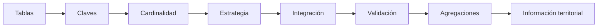
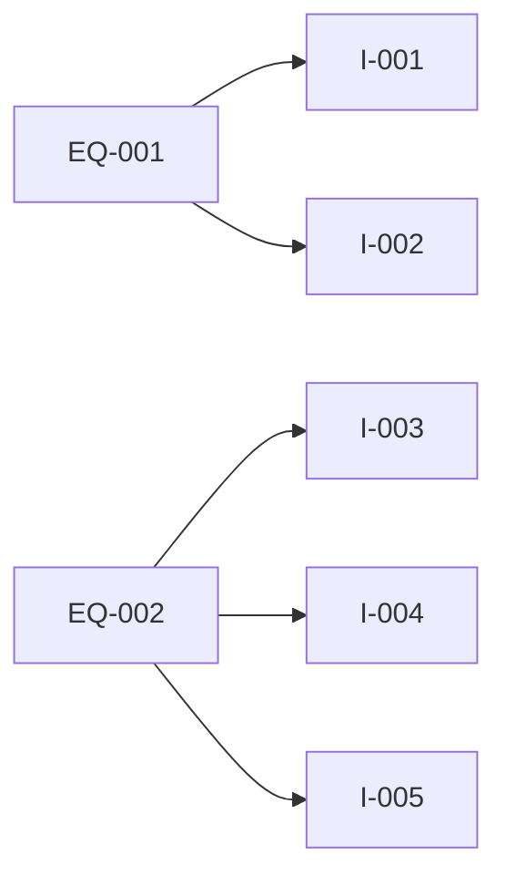
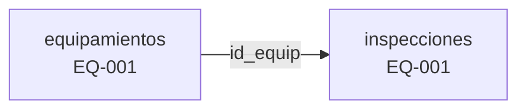
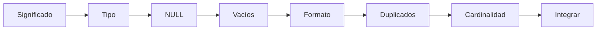
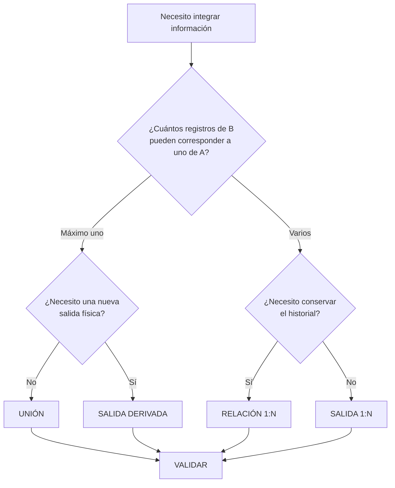
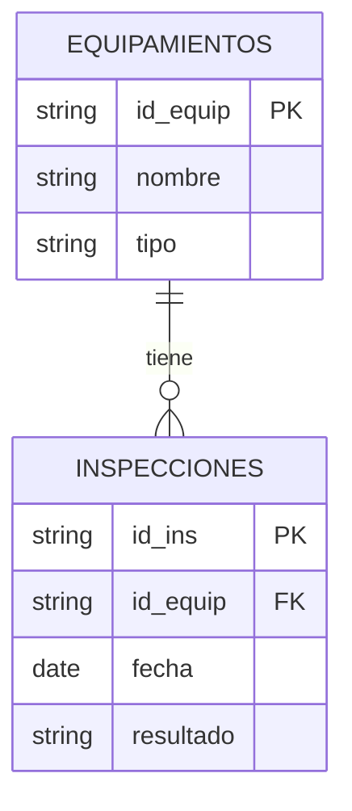
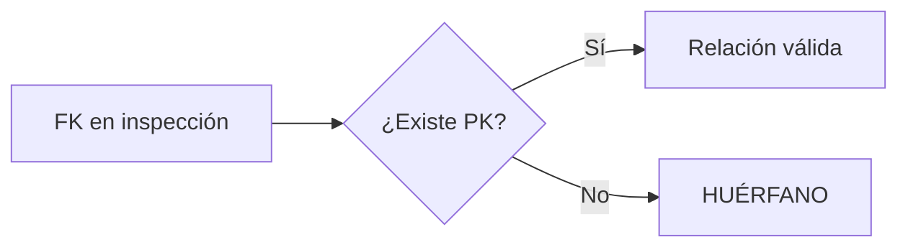
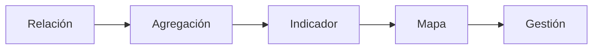
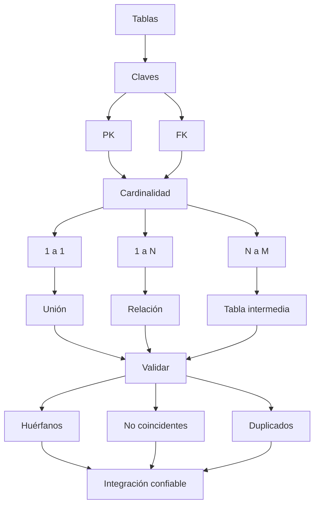
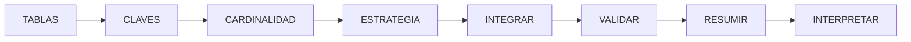

# 3.5 Integrar tablas sin perder información

<div class="grid cards" markdown>

-   :material-key:{ .lg .middle } **Identificar**

    ---

    Construir asociaciones mediante:

    **claves estables y verificables.**

-   :material-family-tree:{ .lg .middle } **Relacionar**

    ---

    Diferenciar correctamente:

    **1:1, 1:N y N:M.**

-   :material-link-variant:{ .lg .middle } **Integrar**

    ---

    Elegir entre:

    **unión, relación o salida derivada.**

-   :material-link-off:{ .lg .middle } **Detectar pérdidas**

    ---

    Identificar:

    **huérfanos, duplicados y registros sin correspondencia.**

-   :material-table-multiple:{ .lg .middle } **Conservar historial**

    ---

    Mantener múltiples registros asociados sin repetir innecesariamente la entidad principal.

-   :material-calculator-variant:{ .lg .middle } **Resumir**

    ---

    Obtener:

    **conteos, últimas fechas y otros agregados** desde registros relacionados.

</div>

[Comenzar](#1-el-problema-la-informacion-esta-distribuida){ .md-button .md-button--primary }
[Ir al laboratorio](#laboratorio-guiado-relacionar-equipamientos-e-inspecciones){ .md-button }

---

## La misión de esta lección

En las lecciones anteriores trabajamos principalmente con información contenida dentro de una misma capa.

Ahora aparecerá una situación muy habitual:

```text
la información que necesitamos
no está almacenada
en una sola tabla
```

Por ejemplo:

```text
EQUIPAMIENTOS

id_equip
nombre
tipo
ubicación
```

y por separado:

```text
INSPECCIONES

id_ins
id_equip
fecha
resultado
observacion
```

Queremos responder preguntas como:

```text
¿Cuántas inspecciones tiene cada equipamiento?

¿Cuándo fue inspeccionado por última vez?

¿Qué equipamientos nunca aparecen en la tabla de inspecciones?

¿Qué inspecciones apuntan a un equipamiento inexistente?

¿Cómo conservamos varias inspecciones sin duplicar la geometría?
```

### Lo que construiremos



---

## Mapa de aprendizaje

<div class="grid cards" markdown>

-   :material-key:{ .lg .middle } **1 · Claves**

    ---

    Identidad, clave primaria y clave foránea.

-   :material-family-tree:{ .lg .middle } **2 · Cardinalidad**

    ---

    `1:1`, `1:N` y `N:M`.

-   :material-database-search:{ .lg .middle } **3 · Auditoría**

    ---

    NULL, tipos, duplicados y formatos.

-   :material-link:{ .lg .middle } **4 · Unión**

    ---

    Incorporar atributos cuando corresponde.

-   :material-source-branch:{ .lg .middle } **5 · Relación**

    ---

    Mantener registros hijos separados.

-   :material-table-arrow-right:{ .lg .middle } **6 · Salida derivada**

    ---

    Materializar una integración.

-   :material-link-off:{ .lg .middle } **7 · Integridad**

    ---

    Detectar huérfanos y no coincidentes.

-   :material-function-variant:{ .lg .middle } **8 · Agregaciones**

    ---

    Resumir registros relacionados.

</div>

---

## Antes de empezar

!!! info "Necesitarás"

    - QGIS 3.44.
    - Un GeoPackage con una capa de equipamientos.
    - Una tabla de inspecciones.
    - Haber completado:
        - 3.1 Preparar datos confiables;
        - 3.3 Diseñar formularios de captura;
        - 3.4 Construir indicadores con expresiones.

!!! example "Caso guía"

    Utilizaremos:

    ```text
    equipamientos
    ```

    como tabla principal,

    y:

    ```text
    inspecciones
    ```

    como tabla de registros asociados.

!!! success "Principio de trabajo"

    Antes de utilizar una herramienta de unión debes responder:

    > **¿Cuántos registros de la segunda tabla pueden corresponder a uno de la primera?**

---

## 1. El problema: la información está distribuida

Tenemos:

### Equipamientos

| id_equip | nombre | tipo |
|---|---|---|
| EQ-001 | Centro Integral Norte | SALUD |
| EQ-002 | Unidad Educativa Central | EDUCACION |
| EQ-003 | Complejo Deportivo Sur | DEPORTIVO |
| EQ-004 | Centro Cultural Este | CULTURAL |

Y una segunda tabla:

### Inspecciones

| id_ins | id_equip | fecha | resultado |
|---|---|---|---|
| I-001 | EQ-001 | 2026-01-15 | FAVORABLE |
| I-002 | EQ-001 | 2026-04-21 | OBSERVADO |
| I-003 | EQ-002 | 2026-02-09 | FAVORABLE |
| I-004 | EQ-002 | 2026-07-11 | FAVORABLE |
| I-005 | EQ-002 | 2026-08-03 | OBSERVADO |

¿Qué observamos?



Un equipamiento puede tener:

```text
0
1
2
10
100
```

inspecciones.

---

### Predice antes de continuar

??? question "¿Crearías campos inspeccion_1, inspeccion_2, inspeccion_3... dentro de equipamientos?"

    No.

    Tendríamos una estructura como:

    ```text
    inspeccion_1
    inspeccion_2
    inspeccion_3
    inspeccion_4
    ...
    ```

    que tendría que modificarse cada vez que aparezca una nueva inspección.

    El problema real es:

    ```text
    una entidad
    tiene
    muchos registros asociados
    ```

!!! success "Primera idea clave"

    Cuando el número de registros asociados es variable:

    ```text
    probablemente necesitamos una relación
    ```

    y no nuevas columnas.

---

## 2. Claves: cómo sabe el sistema qué pertenece a qué

Ambas tablas comparten:

```text
id_equip
```

Ese campo actúa como puente.



### Clave primaria

La tabla principal contiene:

```text
id_equip
```

que debería identificar de forma única a cada equipamiento.

Conceptualmente:

```text
PK
Primary Key
Clave primaria
```

### Clave foránea

La tabla de inspecciones contiene también:

```text
id_equip
```

pero aquí puede repetirse.

Conceptualmente:

```text
FK
Foreign Key
Clave foránea
```

<div class="grid cards" markdown>

-   :material-key:{ .lg .middle } **PK**

    ---

    ```text
    EQ-001
    EQ-002
    EQ-003
    ```

    Debe identificar de forma única al padre.

-   :material-key-link:{ .lg .middle } **FK**

    ---

    ```text
    EQ-001
    EQ-001
    EQ-002
    ```

    Puede repetirse porque existen varios registros hijos.

</div>

---

## 3. Una clave debe representar identidad

Podríamos intentar relacionar mediante:

```text
nombre
```

por ejemplo:

```text
Centro Integral Norte
```

Pero podríamos encontrar:

```text
Centro Integral Norte
CENTRO INTEGRAL NORTE
Centro integral norte
Centro Integral Norte 
Centro  Integral Norte
```

Visualmente:

```text
parecen equivalentes
```

pero pueden ser cadenas diferentes.

<div class="grid" markdown>

!!! failure "Clave débil"

    ```text
    Centro de Salud Norte
    ```

    Puede:

    - cambiar;
    - repetirse;
    - escribirse distinto.

!!! success "Clave estable"

    ```text
    EQ-001
    ```

    Puede diseñarse para ser:

    - única;
    - estable;
    - controlada.

</div>

!!! quote "La clave debe representar identidad, no descripción"

---

## 4. Cardinalidad: la decisión antes de la herramienta

La **cardinalidad** expresa cuántos registros pueden relacionarse.

=== "1 : 1"

    Un registro de A corresponde como máximo a uno de B.

    ```mermaid
    flowchart LR
        A1["EQ-001"] --- B1["Ficha 001"]
        A2["EQ-002"] --- B2["Ficha 002"]
    ```

    Ejemplo:

    ```text
    equipamiento
    ↔
    ficha administrativa única
    ```

=== "1 : N"

    Un registro de A puede relacionarse con muchos de B.

    ```mermaid
    flowchart LR
        A["EQ-001"] --> B1["I-001"]
        A --> B2["I-002"]
        A --> B3["I-003"]
    ```

    Ejemplo:

    ```text
    equipamiento
    ↔
    inspecciones
    ```

=== "N : M"

    Muchos registros de A pueden relacionarse con muchos registros de B.

    ```mermaid
    flowchart LR
        E1["Equipamiento 1"] --> S1["SALUD"]
        E1 --> S2["SOCIAL"]
        E2["Equipamiento 2"] --> S1
        E2 --> S3["CULTURAL"]
    ```

    Generalmente necesitamos:

    ```text
    una tabla intermedia
    ```

---

### Mini-reto

??? question "Cada distrito posee una única fila en una tabla censal. ¿Qué cardinalidad esperarías?"

    ```text
    1:1
    ```

    siempre que el código sea único en ambas tablas.

??? question "Cada equipamiento puede tener muchas inspecciones."

    ```text
    1:N
    ```

??? question "Muchos equipamientos pueden prestar muchos tipos de servicio."

    ```text
    N:M
    ```

---

## 5. Auditar las claves antes de integrar

No debemos seguir directamente:

```text
cargar tablas
↓
crear unión
```

La secuencia correcta es:



---

### Comprobar significado

Debemos asegurarnos de que:

```text
equipamientos.id_equip
```

e:

```text
inspecciones.id_equip
```

representen exactamente:

```text
el mismo identificador
```

---

### Comprobar tipos

Podemos tener:

```text
Texto ↔ Texto
```

y funcionar correctamente.

Pero:

```text
Texto ↔ Entero
```

puede producir problemas.

### Ejemplo

```text
00125
```

como texto no siempre equivale conceptualmente a:

```text
125
```

si los ceros forman parte del código.

---

### Revisar tipos en QGIS

!!! captura "Captura pendiente · 3.5-01"

    - **Tipo:** PNG anotado
    - **Archivo:** `assets/images/modulo-03/3-5/3-5-01-tipos-claves.png`
    - **Qué mostrar:** propiedades/campos de ambas tablas.
    - **Resaltar:** `id_equip` y tipo de dato.
    - **Objetivo didáctico:** comprobar compatibilidad antes de relacionar.

---

## 6. NULL y cadenas vacías en las claves

Podemos buscar:

```qgis
"id_equip" IS NULL
```

y también:

```qgis
trim("id_equip") = ''
```

Combinación:

```qgis
"id_equip" IS NULL
OR
trim("id_equip") = ''
```

!!! warning "Una clave foránea vacía no puede encontrar un padre"

---

### Buscar claves problemáticas

!!! captura "Captura pendiente · 3.5-02"

    - **Tipo:** GIF
    - **Archivo:** `assets/images/modulo-03/3-5/3-5-02-claves-null.gif`
    - **Qué mostrar:**
        1. tabla de inspecciones;
        2. Seleccionar por expresión;
        3. detectar NULL/vacíos.
    - **Objetivo didáctico:** auditar claves antes de relacionar.

---

## 7. Espacios y diferencias de formato

Podemos encontrar:

```text
'EQ-001'
```

y:

```text
'EQ-001 '
```

Visualmente:

```text
parecen iguales
```

pero no necesariamente lo son.

Podemos diagnosticar mediante:

```qgis
length("id_equip")
```

o:

```qgis
trim("id_equip")
```

Incluso:

```qgis
upper(
    trim("id_equip")
)
```

### Pero...

!!! warning "Normalizar no significa corregir automáticamente"

    Primero debemos confirmar que:

    ```text
    EQ-001
    ```

    y:

    ```text
    eq-001
    ```

    realmente representan la misma clave según las reglas del sistema.

---

## 8. Duplicados: depende de la tabla

En:

```text
equipamientos.id_equip
```

un duplicado puede ser un error.

En:

```text
inspecciones.id_equip
```

la repetición puede ser completamente válida.

<div class="grid" markdown>

!!! failure "Problema en tabla padre"

    ```text
    EQ-001
    EQ-001
    EQ-003
    ```

    si el ID debería ser único.

!!! success "Normal en tabla hija"

    ```text
    EQ-001
    EQ-001
    EQ-001
    ```

    si corresponden a tres inspecciones diferentes.

</div>

### La unidad de unicidad cambia

En inspecciones esperamos:

```text
id_ins
```

único,

no necesariamente:

```text
id_equip
```

---

## Checkpoint 1

Deberías poder explicar:

- [ ] qué diferencia existe entre PK y FK;
- [ ] por qué una FK puede repetirse;
- [ ] qué significa cardinalidad;
- [ ] qué diferencia existe entre `1:1` y `1:N`;
- [ ] por qué no debemos usar nombres como clave sin verificar;
- [ ] por qué los tipos deben ser compatibles;
- [ ] por qué un duplicado puede ser error en una tabla y correcto en otra.

---

## 9. Unión, relación y salida derivada

Estas tres estrategias no son equivalentes.

<div class="grid cards" markdown>

-   :material-link:{ .lg .middle } **Unión**

    ---

    Añade atributos de otra tabla.

    Ideal principalmente para:

    ```text
    1:1
    ```

-   :material-source-branch:{ .lg .middle } **Relación**

    ---

    Mantiene ambas tablas separadas.

    Ideal para:

    ```text
    1:N
    ```

-   :material-table-arrow-right:{ .lg .middle } **Salida derivada**

    ---

    Produce una nueva tabla o capa con la integración materializada.

</div>

---

## 10. Árbol de decisión



!!! success "Pregunta clave"

    ```text
    ¿Necesito ver atributos adicionales?
    → unión

    ¿Necesito conservar varios registros hijos?
    → relación

    ¿Necesito un nuevo producto independiente?
    → salida derivada
    ```

---

## 11. Crear una unión 1:1

Tenemos:

### Equipamientos

| id_equip | nombre |
|---|---|
| EQ-001 | Centro Norte |
| EQ-002 | Centro Sur |

### Administración

| id_equip | responsable |
|---|---|
| EQ-001 | Ana |
| EQ-002 | Carlos |

Esperamos:

```text
1 equipamiento
↔
1 responsable
```

Podemos utilizar:

**Clic derecho en la capa ▸ Propiedades ▸ Uniones**

---

### Configurar la unión

Selecciona:

```text
Capa de unión:
administracion
```

```text
Campo de unión:
id_equip
```

```text
Campo objetivo:
id_equip
```

!!! captura "Captura pendiente · 3.5-03"

    - **Tipo:** GIF
    - **Archivo:** `assets/images/modulo-03/3-5/3-5-03-crear-union.gif`
    - **Qué mostrar:**
        1. Propiedades;
        2. Uniones;
        3. añadir unión;
        4. seleccionar tabla;
        5. seleccionar campos;
        6. abrir tabla resultante.
    - **Objetivo didáctico:** observar una unión 1:1 completa.

---

## 12. Incorporar solo lo necesario

Supongamos que la tabla externa tiene:

```text
30 campos
```

pero necesitamos:

```text
responsable
telefono
unidad
```

No tenemos por qué incorporar los 30.

### Ventajas

```text
menos ruido
+
tabla más legible
+
mejor control
```

### Prefijos

Podemos utilizar:

```text
adm_
```

para obtener:

```text
adm_responsable
adm_telefono
adm_unidad
```

!!! tip "El prefijo ayuda a recordar de dónde procede el campo"

---

## 13. La trampa de los duplicados en una unión

Supongamos:

| id_equip | responsable |
|---|---|
| EQ-001 | Ana |
| EQ-001 | María |
| EQ-002 | Carlos |

Esperábamos:

```text
1:1
```

pero encontramos:

```text
dos coincidencias
```

para:

```text
EQ-001
```

??? question "¿Debemos continuar?"

    No todavía.

    Debemos investigar:

    ```text
    ¿es un duplicado?
    ```

    o:

    ```text
    ¿la cardinalidad real es 1:N?
    ```

!!! danger "Una herramienta puede terminar sin error y aun así ocultar un problema del modelo"

---

### Demostrar el problema

!!! captura "Captura pendiente · 3.5-04"

    - **Tipo:** GIF comparativo
    - **Archivo:** `assets/images/modulo-03/3-5/3-5-04-union-duplicados.gif`
    - **Qué mostrar:**
        1. tabla con clave repetida;
        2. crear unión;
        3. observar resultado;
        4. señalar información no representada correctamente.
    - **Objetivo didáctico:** demostrar por qué la cardinalidad debe conocerse antes de unir.

---

## 14. Una unión no necesariamente modifica físicamente la fuente

Haz este experimento:

```text
crear unión
↓
abrir tabla
↓
observar campos añadidos
↓
eliminar unión
↓
abrir tabla nuevamente
```

??? question "¿Los campos permanecen?"

    No necesariamente.

    La unión configurada desde las propiedades es una asociación mantenida por QGIS.

!!! success "Diferencia importante"

    ```text
    mostrar datos unidos
    ```

    no significa:

    ```text
    copiar físicamente esos datos
    ```

---

## 15. Relaciones 1:N

Regresamos al caso:

```text
EQUIPAMIENTO
↓
MUCHAS INSPECCIONES
```

Modelo:



### Ventaja

Podemos mantener:

```text
1 geometría de equipamiento
```

y:

```text
muchas filas de inspecciones
```

sin duplicar:

```text
nombre
tipo
dirección
geometría
```

---

## 16. Crear la relación en QGIS

Abre:

**Proyecto ▸ Propiedades ▸ Relaciones**

Configura:

```text
ID:
equipamiento_inspecciones
```

```text
Nombre:
Inspecciones del equipamiento
```

Padre:

```text
equipamientos
```

Campo:

```text
id_equip
```

Hija:

```text
inspecciones
```

Campo:

```text
id_equip
```

!!! captura "Captura pendiente · 3.5-05"

    - **Tipo:** PNG anotado
    - **Archivo:** `assets/images/modulo-03/3-5/3-5-05-crear-relacion.png`
    - **Qué mostrar:** ventana de relaciones.
    - **Resaltar:**
        1. ID;
        2. nombre;
        3. capa padre;
        4. campo padre;
        5. capa hija;
        6. campo hijo.
    - **Objetivo didáctico:** identificar la correspondencia PK/FK dentro de QGIS.

---

## 17. Comprobar la relación

Selecciona:

```text
EQ-001
```

Esperamos encontrar:

```text
I-001
I-002
```

Selecciona:

```text
EQ-002
```

Esperamos:

```text
I-003
I-004
I-005
```

### Visualmente

```text
EQ-001
├── I-001
└── I-002

EQ-002
├── I-003
├── I-004
└── I-005
```

---

### Navegar registros relacionados

!!! captura "Captura pendiente · 3.5-06"

    - **Tipo:** GIF
    - **Archivo:** `assets/images/modulo-03/3-5/3-5-06-navegar-relacion.gif`
    - **Qué mostrar:**
        1. seleccionar equipamiento;
        2. abrir formulario;
        3. visualizar registros relacionados;
        4. cambiar de equipamiento.
    - **Objetivo didáctico:** visualizar claramente la estructura padre-hijos.

---

## 18. Incorporar la relación al formulario

Recuperamos lo aprendido en:

```text
3.3 Diseñar formularios de captura
```

Desde:

**Propiedades de la capa ▸ Formulario de atributos**

podemos construir:

```text
DATOS GENERALES
├── Código
├── Nombre
├── Tipo
└── Estado

INSPECCIONES
├── I-001
├── I-002
└── ...
```

### Resultado

El usuario puede consultar:

```text
equipamiento
+
historial
```

en una única interfaz.

!!! captura "Captura pendiente · 3.5-07"

    - **Tipo:** GIF
    - **Archivo:** `assets/images/modulo-03/3-5/3-5-07-formulario-relacion.gif`
    - **Qué mostrar:**
        1. diseñador del formulario;
        2. incorporar relación;
        3. abrir equipamiento;
        4. visualizar inspecciones.
    - **Objetivo didáctico:** conectar modelado relacional y experiencia de usuario.

---

## 19. Por qué no repetir los datos del padre

Modelo redundante:

| id_ins | id_equip | nombre_equip | tipo |
|---|---|---|---|
| I-001 | EQ-001 | Centro Norte | SALUD |
| I-002 | EQ-001 | Centro Norte | SALUD |
| I-003 | EQ-001 | Centro Norte | SALUD |

Si el nombre cambia:

```text
Centro Norte
```

a:

```text
Centro Integral Norte
```

debemos modificar:

```text
3 filas
```

¿Y con:

```text
500 inspecciones?
```

Tendríamos:

```text
500 copias
```

del mismo atributo.

<div class="grid" markdown>

!!! failure "Redundancia"

    ```text
    cada inspección
    repite datos
    del equipamiento
    ```

!!! success "Relación"

    ```text
    equipamiento
    guarda sus atributos

    inspección
    guarda su referencia
    ```

</div>

---

## Checkpoint 2

Deberías poder explicar:

- [ ] cuándo utilizar una unión;
- [ ] cuándo utilizar una relación;
- [ ] por qué una estructura `1:N` no debería convertirse automáticamente en columnas;
- [ ] qué función cumplen PK y FK;
- [ ] por qué una relación reduce redundancia;
- [ ] por qué la relación puede incorporarse al formulario.

---

## 20. Registros huérfanos

Añadimos esta inspección:

| id_ins | id_equip |
|---|---|
| I-006 | EQ-005 |

Pero la tabla padre contiene únicamente:

```text
EQ-001
EQ-002
EQ-003
EQ-004
```

Por tanto:

```text
EQ-005
```

no existe.

Tenemos un:

```text
registro huérfano
```

---

### Qué puede significar

<div class="grid cards" markdown>

-   :material-keyboard-outline:{ .lg .middle } **Digitación**

    ---

    La clave puede haberse escrito incorrectamente.

-   :material-database-minus:{ .lg .middle } **Padre faltante**

    ---

    El equipamiento puede faltar en la tabla maestra.

-   :material-history:{ .lg .middle } **Histórico**

    ---

    Puede hacer referencia a una entidad que ya no existe.

-   :material-delete-alert:{ .lg .middle } **Eliminación**

    ---

    El padre pudo ser eliminado sin considerar dependencias.

</div>

!!! danger "No elimines automáticamente un registro huérfano"

---

## 21. Integridad referencial

Conceptualmente queremos:

```text
si existe una FK
↓
debe existir su PK
```



Este principio se denomina:

```text
integridad referencial
```

### Más adelante

En sistemas como:

```text
PostgreSQL / PostGIS
```

podemos proteger esta relación mediante:

```text
FOREIGN KEY
```

a nivel de base de datos.

---

## 22. Detectar huérfanos

Podemos comparar:

```text
inspecciones.id_equip
```

con:

```text
equipamientos.id_equip
```

y clasificar:

| id_ins | id_equip | Padre encontrado | Estado |
|---|---|---|---|
| I-001 | EQ-001 | Sí | VÁLIDO |
| I-002 | EQ-001 | Sí | VÁLIDO |
| I-006 | EQ-005 | No | HUÉRFANO |

!!! captura "Captura pendiente · 3.5-08"

    - **Tipo:** GIF
    - **Archivo:** `assets/images/modulo-03/3-5/3-5-08-detectar-huerfanos.gif`
    - **Qué mostrar:** procedimiento utilizado para localizar registros sin correspondencia.
    - **Objetivo didáctico:** visualizar que una relación también debe auditarse.

---

## 23. Padres sin hijos

El caso inverso:

```text
EQ-003
EQ-004
```

no tienen inspecciones.

Eso significa:

```text
0 registros relacionados
```

Pero no podemos concluir automáticamente:

```text
nunca fueron inspeccionados
```

Podría existir:

```text
una base incompleta
un periodo distinto
un historial no digitalizado
```

!!! quote "Una base describe lo que contiene, no necesariamente toda la realidad"

---

## 24. Resumir registros relacionados

Una relación `1:N` conserva el detalle.

Pero podemos necesitar:

```text
un resumen
```

en la tabla padre.

Por ejemplo:

```text
¿Cuántas inspecciones tiene cada equipamiento?
```

QGIS dispone de:

```qgis
relation_aggregate()
```

---

## 25. Contar registros hijos

Suponiendo que la relación se llama:

```text
equipamiento_inspecciones
```

podemos utilizar:

```qgis
relation_aggregate(
    relation := 'equipamiento_inspecciones',
    aggregate := 'count',
    expression := "id_ins"
)
```

Campo sugerido:

```text
n_inspecciones
```

Resultado:

| id_equip | n_inspecciones |
|---|---:|
| EQ-001 | 2 |
| EQ-002 | 3 |
| EQ-003 | 0 |
| EQ-004 | 0 |

---

### Crear el contador como campo virtual

!!! captura "Captura pendiente · 3.5-09"

    - **Tipo:** GIF
    - **Archivo:** `assets/images/modulo-03/3-5/3-5-09-relation-aggregate-count.gif`
    - **Qué mostrar:**
        1. Calculadora de campos;
        2. crear campo virtual;
        3. expresión `relation_aggregate()`;
        4. resultado.
    - **Objetivo didáctico:** conectar 3.4 con una relación 1:N.

---

## 26. Recuperar la última inspección

Podemos utilizar:

```qgis
relation_aggregate(
    relation := 'equipamiento_inspecciones',
    aggregate := 'max',
    expression := "fecha"
)
```

Campo:

```text
ultima_inspeccion
```

Resultado:

| id_equip | ultima_inspeccion |
|---|---|
| EQ-001 | 2026-04-21 |
| EQ-002 | 2026-08-03 |
| EQ-003 | NULL |
| EQ-004 | NULL |

---

## 27. NULL en una agregación necesita interpretación

Para:

```text
EQ-003
```

obtenemos:

```text
ultima_inspeccion = NULL
```

Esto significa:

```text
no encontramos una fecha relacionada
```

No significa necesariamente:

```text
el equipamiento nunca fue inspeccionado
```

---

## 28. Convertir una relación en información de gestión

<div class="grid cards" markdown>

-   :material-counter:{ .lg .middle } **Cantidad**

    ---

    ¿Cuántas inspecciones?

-   :material-calendar-clock:{ .lg .middle } **Temporalidad**

    ---

    ¿Cuándo fue la última?

-   :material-alert-circle:{ .lg .middle } **Resultado**

    ---

    ¿Cuántas fueron observadas?

-   :material-map-marker-question:{ .lg .middle } **Cobertura**

    ---

    ¿Qué equipamientos no poseen registros?

</div>



---

## 29. Crear un estado derivado

A partir de:

```text
n_inspecciones
```

podemos construir:

```qgis
CASE
    WHEN "n_inspecciones" = 0 THEN 'SIN_REGISTROS'
    WHEN "n_inspecciones" = 1 THEN 'UNA_INSPECCION'
    ELSE 'VARIAS_INSPECCIONES'
END
```

Campo:

```text
estado_inspeccion
```

### Recordatorio de 3.4

Esta clasificación es:

```text
una interpretación
```

del valor:

```text
n_inspecciones
```

Por eso conviene conservar ambos.

---

## 30. Representar el resultado espacialmente

Podemos simbolizar:

```text
equipamientos
```

por:

```text
n_inspecciones
```

o:

```text
estado_inspeccion
```

### Pregunta territorial

Ahora podemos observar:

```text
¿dónde se concentran los equipamientos sin registros?
```

!!! captura "Captura pendiente · 3.5-10"

    - **Tipo:** PNG comparativo
    - **Archivo:** `assets/images/modulo-03/3-5/3-5-10-mapa-inspecciones.png`
    - **Qué mostrar:**
        1. tabla con `n_inspecciones`;
        2. mapa categorizado;
        3. leyenda.
    - **Objetivo didáctico:** demostrar cómo una relación tabular termina generando una lectura espacial.

---

## 31. Crear una salida física

Hay situaciones donde necesitamos:

```text
una nueva capa
```

que contenga la integración.

Podemos utilizar desde Procesamiento una herramienta como:

```text
Unir atributos por valor de campo
```

### Resultado

La información queda materializada en una salida independiente.

---

### Crear una salida

!!! captura "Captura pendiente · 3.5-11"

    - **Tipo:** GIF
    - **Archivo:** `assets/images/modulo-03/3-5/3-5-11-unir-atributos-procesamiento.gif`
    - **Qué mostrar:**
        1. abrir herramienta;
        2. elegir capas;
        3. elegir campos;
        4. ejecutar;
        5. observar salida.
    - **Objetivo didáctico:** comparar asociación dinámica con resultado materializado.

---

## 32. Qué ocurre en una salida 1:N

Supongamos:

```text
EQ-001
```

tiene:

```text
I-001
I-002
```

Una salida plana puede generar:

| id_equip | nombre | id_ins |
|---|---|---|
| EQ-001 | Centro Norte | I-001 |
| EQ-001 | Centro Norte | I-002 |

Ahora:

```text
EQ-001
```

aparece:

```text
dos veces
```

### Si la tabla padre tenía geometría

La geometría puede repetirse:

```text
una vez por coincidencia
```

!!! warning "Una salida plana no es necesariamente el mejor modelo maestro"

---

## 33. Relación frente a tabla plana

=== "Relación"

    ```text
    EQ-001
    ├── I-001
    └── I-002
    ```

    Ventajas:

    - no duplica padre;
    - conserva historial;
    - facilita edición;
    - mantiene modelo lógico.

=== "Salida plana"

    ```text
    EQ-001 | I-001
    EQ-001 | I-002
    ```

    Puede ser útil para:

    - análisis;
    - exportación;
    - interoperabilidad;
    - determinadas estadísticas.

    Pero repite atributos.

---

## 34. Comparar estrategias

| Característica | Unión | Relación | Salida derivada |
|---|---|---|---|
| Mantiene tablas separadas | Sí | Sí | No necesariamente |
| Ideal para 1:1 | Sí | Puede | Sí |
| Ideal para 1:N | No | **Sí** | Puede materializar |
| Genera nueva capa | No | No | **Sí** |
| Conserva hijos | Limitado | **Sí** | Aplanados |
| Puede repetir geometría | No | No | Sí |
| Se actualiza con fuente | Sí | Sí | No automáticamente |
| Útil en formularios | Parcial | **Sí** | Como capa independiente |

---

## Checkpoint 3

Deberías poder explicar:

- [ ] qué es un huérfano;
- [ ] qué es integridad referencial;
- [ ] qué significa padre sin hijos;
- [ ] qué hace `relation_aggregate()`;
- [ ] cómo contar registros relacionados;
- [ ] cómo obtener la última fecha;
- [ ] por qué una salida 1:N puede repetir geometrías;
- [ ] qué diferencia existe entre relación y tabla plana.

---

## Laboratorio guiado: relacionar equipamientos e inspecciones

!!! example "Escenario"

    Tenemos:

    ```text
    equipamientos
    ```

    y:

    ```text
    inspecciones
    ```

    Queremos construir un modelo que permita:

    ```text
    conservar historial
    detectar problemas
    navegar relaciones
    resumir información
    representar resultados
    ```

### Fase 1 · Preparar el GeoPackage

Crea:

```text
datos/trabajo/integracion.gpkg
```

con:

```text
equipamientos
inspecciones
```

### Fase 2 · Revisar estructura

Comprueba:

```text
equipamientos.id_equip
inspecciones.id_equip
```

### Fase 3 · Revisar la PK

En:

```text
equipamientos
```

comprueba:

```text
NULL
vacíos
duplicados
```

### Fase 4 · Revisar la FK

En:

```text
inspecciones
```

comprueba:

```text
NULL
vacíos
formato
```

Recuerda:

```text
repetición de id_equip
```

puede ser correcta.

### Fase 5 · Definir cardinalidad

Documenta:

```text
equipamientos
1:N
inspecciones
```

y explica por qué.

### Fase 6 · Crear relación

Configura:

```text
equipamiento_inspecciones
```

### Fase 7 · Probar navegación

Verifica al menos:

```text
un equipamiento con varias inspecciones
un equipamiento con una
un equipamiento sin registros
```

### Fase 8 · Incorporar la relación al formulario

Añade el historial de inspecciones al formulario del equipamiento.

### Fase 9 · Detectar huérfanos

Construye:

| id_ins | id_equip | Padre | Estado |
|---|---|---|---|
| | | | |

### Fase 10 · Contar inspecciones

Crea:

```text
n_inspecciones
```

mediante:

```qgis
relation_aggregate(
    relation := 'equipamiento_inspecciones',
    aggregate := 'count',
    expression := "id_ins"
)
```

### Fase 11 · Última inspección

Crea:

```text
ultima_inspeccion
```

mediante:

```qgis
relation_aggregate(
    relation := 'equipamiento_inspecciones',
    aggregate := 'max',
    expression := "fecha"
)
```

### Fase 12 · Crear estado

Genera:

```text
estado_inspeccion
```

### Fase 13 · Identificar padres sin hijos

Selecciona:

```qgis
"n_inspecciones" = 0
```

### Fase 14 · Crear mapa

Representa:

```text
estado_inspeccion
```

### Fase 15 · Crear salida 1:N

Utiliza:

```text
Unir atributos por valor de campo
```

y compara:

```text
número de registros iniciales
```

contra:

```text
número de registros resultantes
```

### Fase 16 · Comparar modelos

Completa:

| Aspecto | Relación | Salida 1:N |
|---|---|---|
| Registros | | |
| Geometrías repetidas | | |
| Historial | | |
| Edición | | |
| Exportación | | |

### Evidencia del laboratorio

!!! captura "Captura pendiente · 3.5-12"

    - **Tipo:** Imagen compuesta
    - **Archivo:** `assets/images/modulo-03/3-5/3-5-12-laboratorio.png`
    - **Qué mostrar:**
        1. tablas originales;
        2. relación;
        3. formulario;
        4. mapa final.
    - **Objetivo didáctico:** resumir visualmente todo el flujo.

---

## Mini-reto: ¿unión, relación o salida?

=== "Caso A"

    Una tabla censal tiene exactamente una fila por distrito.

    ??? question "¿Qué utilizarías?"

        Si solo necesitas visualizar atributos adicionales:

        ```text
        UNIÓN
        ```

=== "Caso B"

    Cada equipamiento puede tener muchas inspecciones.

    ??? question "¿Qué utilizarías?"

        ```text
        RELACIÓN 1:N
        ```

=== "Caso C"

    Necesitas entregar una única capa donde cada inspección incluya la geometría de su equipamiento.

    ??? question "¿Qué utilizarías?"

        ```text
        SALIDA DERIVADA 1:N
        ```

=== "Caso D"

    Esperabas 1:1 pero encuentras tres filas con el mismo código.

    ??? question "¿Qué haces?"

        Detener la integración y revisar:

        ```text
        duplicados
        cardinalidad
        significado
        ```

=== "Caso E"

    Una inspección apunta a un código inexistente.

    ??? question "¿Qué es?"

        ```text
        REGISTRO HUÉRFANO
        ```

---

## Reto práctico

!!! example "Reto 3.5 — Relacionar cada equipamiento con varias inspecciones"

    ### Contexto

    Una institución mantiene:

    ```text
    equipamientos
    ```

    y:

    ```text
    inspecciones
    ```

    en fuentes separadas.

    La base incluye deliberadamente:

    - una PK duplicada;
    - una FK vacía;
    - una FK con espacios;
    - una inspección huérfana;
    - varios equipamientos sin inspecciones;
    - varios equipamientos con múltiples inspecciones.

    Tu tarea es construir un modelo relacional y demostrar que no se perdió información.

    ### Misión 1 · Documentar las tablas

    Completa:

    | Tabla | Registro representa | Clave |
    |---|---|---|
    | equipamientos | | |
    | inspecciones | | |

    ### Misión 2 · Auditar PK

    Registra:

    ```text
    NULL:
    vacíos:
    duplicados:
    ```

    ### Misión 3 · Auditar FK

    Registra:

    ```text
    NULL:
    vacíos:
    formatos anómalos:
    ```

    ### Misión 4 · Definir cardinalidad

    Justifica:

    ```text
    1:1
    1:N
    N:M
    ```

    ### Misión 5 · Detectar huérfanos

    Construye:

    | Inspección | FK | Padre | Diagnóstico |
    |---|---|---|---|
    | | | | |

    ### Misión 6 · Crear la relación

    Configura:

    ```text
    equipamiento_inspecciones
    ```

    ### Misión 7 · Integrarla al formulario

    El formulario debe mostrar:

    ```text
    datos del equipamiento
    +
    historial
    ```

    ### Misión 8 · Contar inspecciones

    Crea:

    ```text
    n_inspecciones
    ```

    ### Misión 9 · Obtener última inspección

    Crea:

    ```text
    ultima_inspeccion
    ```

    ### Misión 10 · Crear un estado

    Clasifica:

    ```text
    SIN_REGISTROS
    UNA_INSPECCION
    VARIAS_INSPECCIONES
    ```

    ### Misión 11 · Mapear

    Representa espacialmente el estado.

    ### Misión 12 · Resolver el problema incorrectamente

    Intenta crear deliberadamente una unión simple:

    ```text
    equipamientos ↔ inspecciones
    ```

    Documenta:

    ```text
    qué información no representa correctamente
    ```

    ### Misión 13 · Crear una salida 1:N

    Materializa la integración.

    Registra:

    ```text
    filas antes:
    filas después:
    ```

    ### Misión 14 · Identificar geometrías repetidas

    Explica:

    ```text
    por qué aparecen
    ```

    ### Misión 15 · Construir matriz de control

    | Equipamiento | N.º inspecciones | Última | Estado |
    |---|---:|---|---|
    | | | | |

    ### Misión 16 · Documentar integridad

    Resume:

    ```text
    padres:
    hijos:
    huérfanos:
    padres sin hijos:
    ```

    ### Misión 17 · Elaborar conclusión

    Redacta entre **180 y 250 palabras** explicando:

    - qué claves utilizaste;
    - cuál es la cardinalidad;
    - qué errores encontraste;
    - qué registros eran huérfanos;
    - por qué una unión simple no era suficiente;
    - cómo funciona la relación;
    - cómo resumiste los registros hijos;
    - qué diferencia encontraste con una salida plana;
    - qué limitaciones conserva la información.

    ### Entregables

    - `reto_3-5_integracion.qgz`;
    - `integracion.gpkg`;
    - tabla `equipamientos`;
    - tabla `inspecciones`;
    - relación `equipamiento_inspecciones`;
    - tabla de auditoría de claves;
    - tabla de huérfanos;
    - campo `n_inspecciones`;
    - campo `ultima_inspeccion`;
    - campo `estado_inspeccion`;
    - formulario relacionado;
    - mapa;
    - salida experimental 1:N;
    - matriz de comparación;
    - conclusión técnica.

---

## Criterios de evaluación

??? success "Ver rúbrica"

    | Criterio | Se cumple si... |
    |---|---|
    | PK | Identifica de forma única al padre |
    | FK | Representa correctamente la referencia |
    | Tipos | Son compatibles |
    | NULL | Se detectan claves faltantes |
    | Formato | Se revisan inconsistencias |
    | Duplicados | Se interpretan según la tabla |
    | Cardinalidad | Se identifica correctamente |
    | Unión | Se utiliza solo cuando corresponde |
    | Relación | Conserva estructura 1:N |
    | Huérfanos | Se detectan y documentan |
    | Padre sin hijo | Se identifica correctamente |
    | Formulario | Permite consultar hijos |
    | Conteo | Calcula hijos correctamente |
    | Temporalidad | Obtiene última fecha |
    | Salida 1:N | Comprende repetición |
    | Geometría | Interpreta duplicación en salida plana |
    | Trazabilidad | Documenta decisiones |
    | Resultado | No pierde información silenciosamente |

---

## Errores frecuentes

=== "La unión devuelve NULL"

    Revisa:

    ```text
    clave
    tipo
    espacios
    formato
    correspondencia
    ```

=== "Solo aparece una inspección"

    Probablemente intentaste representar:

    ```text
    1:N
    ```

    como:

    ```text
    1:1
    ```

=== "Tengo claves repetidas en inspecciones"

    Puede ser correcto.

    Revisa:

    ```text
    id_ins
    ```

    para determinar si son registros distintos.

=== "La relación está vacía"

    Revisa:

    ```text
    capa padre
    campo padre
    capa hija
    campo hija
    tipos
    valores
    ```

=== "La salida tiene más filas"

    Puede ser una consecuencia normal de:

    ```text
    1:N
    ```

=== "La geometría aparece repetida"

    Puede deberse a que cada hijo genera una fila en la salida materializada.

=== "Encontré un huérfano"

    No lo elimines automáticamente.

=== "n_inspecciones = 0"

    Significa:

    ```text
    cero registros relacionados en la tabla disponible
    ```

    no necesariamente:

    ```text
    nunca inspeccionado
    ```

=== "Copié todos los atributos del padre a la tabla hija"

    Probablemente estás introduciendo redundancia innecesaria.

---

## Desafío de 5 minutos

!!! challenge "Analiza este modelo"

    **Equipamientos**

    ```text
    EQ-001
    EQ-002
    EQ-003
    ```

    **Inspecciones**

    ```text
    I-001 → EQ-001
    I-002 → EQ-001
    I-003 → EQ-004
    I-004 → NULL
    ```

    Responde:

    1. ¿Qué cardinalidad existe?
    2. ¿Qué equipamiento tiene múltiples inspecciones?
    3. ¿Qué inspección es huérfana?
    4. ¿Qué inspección carece de FK?
    5. ¿Qué equipamientos no tienen hijos?
    6. ¿Utilizarías unión o relación?

??? success "Solución"

    **1**

    ```text
    1:N
    ```

    **2**

    ```text
    EQ-001
    ```

    **3**

    ```text
    I-003
    ```

    porque:

    ```text
    EQ-004
    ```

    no existe.

    **4**

    ```text
    I-004
    ```

    **5**

    ```text
    EQ-002
    EQ-003
    ```

    **6**

    ```text
    RELACIÓN
    ```

---

## Ideas clave

<div class="grid cards" markdown>

-   :material-key:{ .lg .middle } **Identidad**

    ---

    Una integración confiable empieza por claves correctas.

-   :material-family-tree:{ .lg .middle } **Cardinalidad**

    ---

    Decide la estructura antes de elegir la herramienta.

-   :material-link:{ .lg .middle } **Unión**

    ---

    Es especialmente apropiada para `1:1`.

-   :material-source-branch:{ .lg .middle } **Relación**

    ---

    Conserva estructuras `1:N`.

-   :material-link-off:{ .lg .middle } **Integridad**

    ---

    Los huérfanos deben hacerse visibles.

-   :material-function-variant:{ .lg .middle } **Agregación**

    ---

    Podemos resumir hijos sin destruir el detalle.

</div>

!!! success "Para recordar"

    - Integrar tablas no consiste simplemente en añadir columnas.
    - Una clave debe representar identidad.
    - Una PK debería ser única dentro de su contexto.
    - Una FK puede repetirse.
    - La cardinalidad debe conocerse antes de utilizar una herramienta.
    - `1:1`, `1:N` y `N:M` representan estructuras diferentes.
    - Los tipos de las claves deben ser compatibles.
    - NULL y cadenas vacías pueden impedir asociaciones.
    - Los espacios invisibles pueden romper coincidencias.
    - Un duplicado debe interpretarse según la función del campo.
    - Una unión es especialmente apropiada para `1:1`.
    - Una relación conserva correctamente registros `1:N`.
    - Repetir todos los atributos del padre introduce redundancia.
    - Un huérfano es un hijo sin padre válido.
    - La integridad referencial protege las relaciones.
    - Un padre sin hijos necesita interpretación.
    - `relation_aggregate()` permite resumir registros relacionados.
    - Podemos calcular conteos y últimas fechas sin aplanar el modelo.
    - Una salida materializada puede repetir filas y geometrías.
    - Una salida plana puede ser útil para análisis, pero no necesariamente como modelo maestro.
    - La información relacionada puede convertirse en indicadores y mapas.
    - La estructura relacional debe validarse igual que cualquier otro dato.

---

## Autoevaluación

??? question "1. ¿Qué es una clave primaria?"

    Un campo o conjunto de campos que identifica de forma única un registro dentro de una tabla.

??? question "2. ¿Qué es una clave foránea?"

    Un campo que referencia la clave de otra tabla.

??? question "3. ¿Una FK debe ser única?"

    No.

??? question "4. ¿Qué significa cardinalidad 1:1?"

    Un registro de una tabla se relaciona como máximo con uno de la otra.

??? question "5. ¿Qué significa 1:N?"

    Un registro padre puede tener varios registros hijos.

??? question "6. ¿Qué significa N:M?"

    Muchos registros de A pueden relacionarse con muchos registros de B.

??? question "7. ¿Por qué no conviene usar nombres como claves?"

    Porque pueden cambiar, repetirse o escribirse de manera inconsistente.

??? question "8. ¿Qué debes revisar antes de integrar?"

    Significado, tipo, NULL, formato, duplicados y cardinalidad.

??? question "9. ¿Cuándo utilizarías una unión?"

    Principalmente cuando necesitamos incorporar atributos de una relación compatible con 1:1.

??? question "10. ¿Cuándo utilizarías una relación?"

    Cuando necesitamos conservar múltiples registros hijos asociados a un padre.

??? question "11. ¿Qué es un registro huérfano?"

    Un hijo cuya FK no encuentra una PK correspondiente.

??? question "12. ¿Debe eliminarse automáticamente?"

    No.

??? question "13. ¿Qué es integridad referencial?"

    El principio de que las referencias entre tablas deben apuntar a registros válidos.

??? question "14. ¿Qué significa que un padre tenga cero hijos?"

    Que no existen registros relacionados dentro del conjunto consultado.

??? question "15. ¿Qué hace relation_aggregate()?"

    Calcula agregados sobre los registros hijos relacionados.

??? question "16. ¿Cómo contarías inspecciones?"

    ```qgis
    relation_aggregate(
        relation := 'equipamiento_inspecciones',
        aggregate := 'count',
        expression := "id_ins"
    )
    ```

??? question "17. ¿Cómo obtendrías la última inspección?"

    Mediante una agregación `max` sobre el campo fecha.

??? question "18. ¿Por qué puede repetirse la geometría en una salida 1:N?"

    Porque cada coincidencia genera una fila independiente con los atributos y geometría del padre.

??? question "19. ¿Una salida derivada se actualiza automáticamente?"

    No necesariamente.

??? question "20. ¿Cuál es la pregunta fundamental antes de integrar?"

    > ¿Cuántos registros de una tabla pueden corresponder a uno de la otra?

---

## Mapa conceptual



---

## Cierre



!!! quote "La idea que debe permanecer"

    La pregunta profesional no es:

    > **¿Cómo agrego columnas de otra tabla?**

    sino:

    > **¿Qué relación existe realmente entre estas entidades y cómo puedo integrarlas sin perder, duplicar ni inventar información?**

---

## Siguiente lección

<div class="grid cards" markdown>

-   :material-link-variant:{ .lg .middle } **Lo que hicimos**

    ---

    Relacionamos registros mediante:

    ```text
    claves
    ```

    y:

    ```text
    cardinalidad
    ```

-   :material-map-marker-path:{ .lg .middle } **Lo que viene**

    ---

    En **3.6 Traducir preguntas en relaciones espaciales** ya no dependeremos únicamente de una clave.

    Preguntaremos:

    ```text
    ¿está dentro?
    ¿intersecta?
    ¿toca?
    ¿contiene?
    ```

</div>

[Continuar con 3.6 →](06-relaciones-espaciales.md){ .md-button .md-button--primary }

---

## Referencias

- [QGIS 3.44 — Uniones y relaciones entre capas](https://docs.qgis.org/3.44/es/docs/user_manual/working_with_vector/joins_relations.html)  
  Documentación oficial sobre uniones, relaciones uno a muchos y estructuras relacionadas.

- [QGIS 3.44 — Propiedades de capas vectoriales](https://docs.qgis.org/3.44/es/docs/user_manual/working_with_vector/vector_properties.html)  
  Configuración de formularios, campos y comportamiento de las capas.

- [QGIS 3.44 — Formularios de atributos](https://docs.qgis.org/3.44/es/docs/user_manual/working_with_vector/vector_properties.html)  
  Configuración de relaciones dentro de formularios.

- [QGIS 3.44 — Expresiones](https://docs.qgis.org/3.44/es/docs/user_manual/expressions/expression.html)  
  Lenguaje utilizado para crear campos derivados y agregaciones.

- [QGIS 3.44 — Funciones de expresiones](https://docs.qgis.org/3.44/es/docs/user_manual/expressions/functions_list.html)  
  Referencia para `relation_aggregate()` y otras funciones.

- [QGIS 3.44 — Algoritmos vectoriales generales](https://docs.qgis.org/3.44/es/docs/user_manual/processing_algs/qgis/vectorgeneral.html)  
  Herramientas para unir atributos y generar salidas derivadas.

- [QGIS Training Manual](https://docs.qgis.org/3.44/es/docs/training_manual/)  
  Material oficial para prácticas con tablas, atributos y modelos de datos.

- [Material for MkDocs — Reference](https://squidfunk.github.io/mkdocs-material/reference/)  
  Referencia general de componentes utilizados en la documentación.

- [Material for MkDocs — Grids](https://squidfunk.github.io/mkdocs-material/reference/grids/)  
  Tarjetas y cuadrículas responsivas.

- [Material for MkDocs — Content tabs](https://squidfunk.github.io/mkdocs-material/reference/content-tabs/)  
  Pestañas utilizadas para comparar estructuras.

- [Material for MkDocs — Admonitions](https://squidfunk.github.io/mkdocs-material/reference/admonitions/)  
  Preguntas, advertencias, ejemplos y contenido desplegable.

- [Material for MkDocs — Diagrams](https://squidfunk.github.io/mkdocs-material/reference/diagrams/)  
  Integración de Mermaid utilizada para cardinalidad, flujos y modelos.