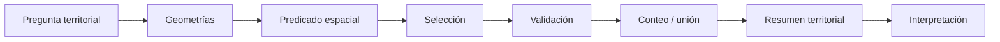
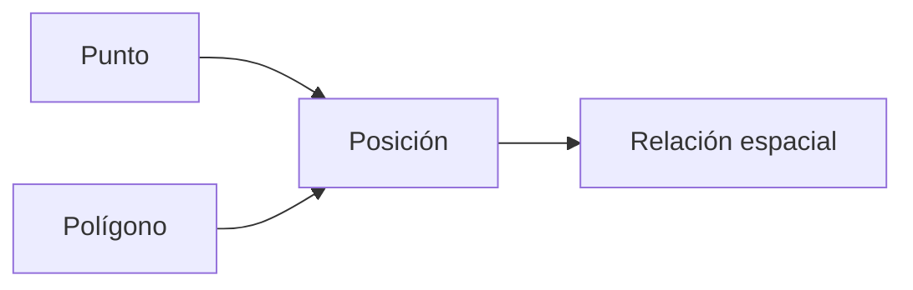
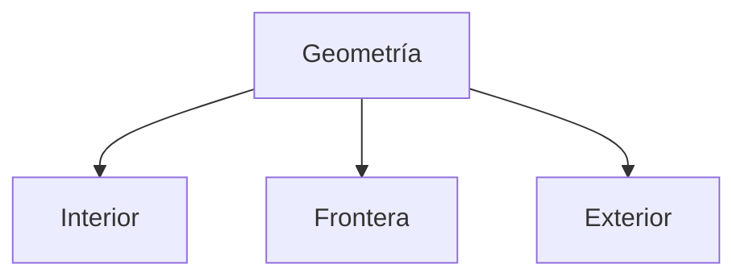
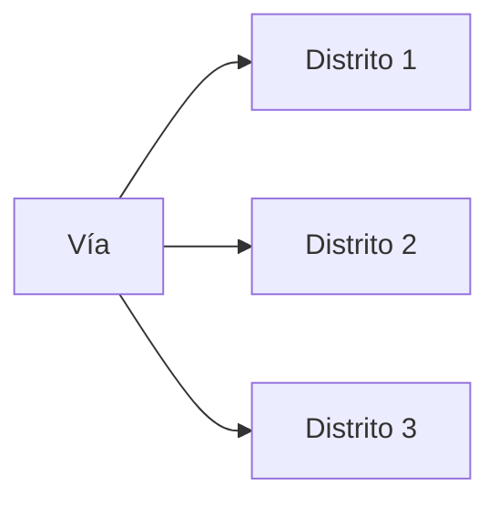
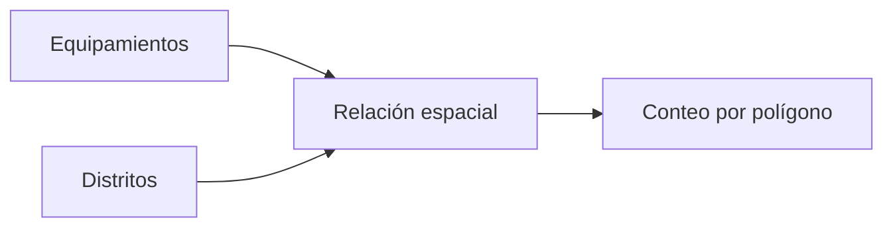
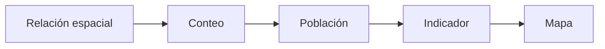
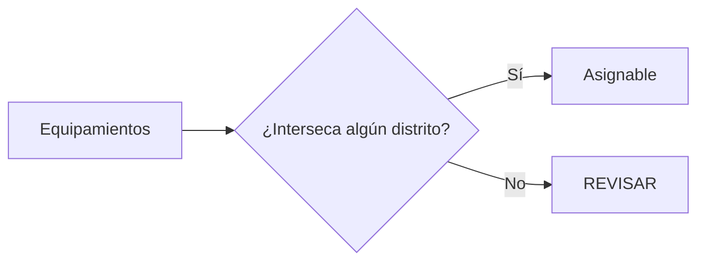
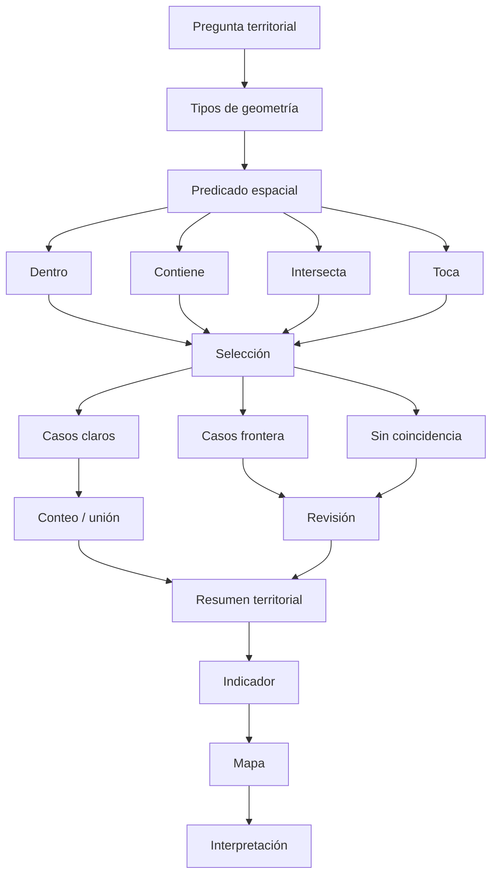

# 3.6 Traducir preguntas en relaciones espaciales

<div class="grid cards" markdown>

-   :material-map-marker-question:{ .lg .middle } **Preguntar**

    ---

    Convertir preguntas territoriales como:

    **¿qué está dentro?, ¿qué toca?, ¿qué intersecta?**

    en operaciones SIG.

-   :material-set-center:{ .lg .middle } **Relacionar**

    ---

    Comprender los principales:

    **predicados espaciales**.

-   :material-selection-search:{ .lg .middle } **Seleccionar**

    ---

    Identificar entidades por su:

    **posición relativa**.

-   :material-counter:{ .lg .middle } **Contar**

    ---

    Resumir:

    **servicios, eventos o equipamientos por zona.**

-   :material-map-marker-alert:{ .lg .middle } **Revisar límites**

    ---

    Detectar entidades que:

    **caen exactamente sobre fronteras o intersectan varias zonas.**

-   :material-table-merge-cells:{ .lg .middle } **Integrar**

    ---

    Transferir y resumir información según:

    **relaciones espaciales y no solo claves.**

</div>

[Comenzar](#1-de-la-clave-a-la-posicion){ .md-button .md-button--primary }
[Ir al laboratorio](#laboratorio-guiado-contar-servicios-por-distrito){ .md-button }

---

## La misión de esta lección

En **3.5** conectamos registros mediante:

```text
claves
```

Por ejemplo:

```text
EQ-001
```

Ahora cambiaremos completamente la lógica.

Ya no preguntaremos:

```text
¿tienen el mismo código?
```

sino:

```text
¿está dentro?
¿intersecta?
¿toca?
¿contiene?
¿se superpone?
¿está separado?
```

Estas relaciones se determinan mediante:

```text
la geometría
```

### Lo que construiremos



---

## Mapa de aprendizaje

<div class="grid cards" markdown>

-   :material-shape:{ .lg .middle } **1 · Comprender**

    ---

    Relaciones entre geometrías.

-   :material-set-all:{ .lg .middle } **2 · Diferenciar**

    ---

    `within`, `contains`, `intersects`, `touches`.

-   :material-selection-search:{ .lg .middle } **3 · Seleccionar**

    ---

    Utilizar **Seleccionar por ubicación**.

-   :material-map-marker-alert:{ .lg .middle } **4 · Revisar**

    ---

    Resolver casos ambiguos en fronteras.

-   :material-counter:{ .lg .middle } **5 · Contar**

    ---

    Obtener servicios por distrito.

-   :material-table-arrow-right:{ .lg .middle } **6 · Integrar**

    ---

    Transferir atributos espacialmente.

-   :material-chart-box:{ .lg .middle } **7 · Resumir**

    ---

    Construir resultados territoriales reproducibles.

</div>

---

## Antes de empezar

!!! info "Necesitarás"

    - QGIS 3.44.
    - Una capa poligonal de distritos.
    - Una capa puntual de equipamientos o servicios.
    - Haber completado:
        - 2.6 Resolver problemas de coordenadas;
        - 3.1 Preparar datos confiables;
        - 3.5 Integrar tablas sin perder información.

!!! example "Caso guía"

    Utilizaremos:

    ```text
    distritos
    ```

    como polígonos,

    y:

    ```text
    equipamientos
    ```

    como puntos.

    Queremos responder:

    > **¿Cuántos equipamientos existen en cada distrito y cuáles requieren revisión por encontrarse sobre sus límites?**

!!! warning "Primera condición"

    Las capas deben estar espacialmente bien ubicadas.

    Si el SRC está mal:

    ```text
    la relación espacial también estará mal
    ```

---

## 1. De la clave a la posición

En 3.5 utilizamos:

```text
id_distrito
```

para relacionar información.

Pero ¿qué ocurre si una capa de equipamientos no contiene ese campo?

Podríamos tener solamente:

```text
id_equip
nombre
tipo
geometría
```

Sin embargo, la geometría permite determinar:

```text
en qué distrito se encuentra
```



### Diferencia conceptual

<div class="grid" markdown>

!!! info "Relación por atributos"

    ```text
    EQ-001
    ↔
    EQ-001
    ```

    La relación depende de:

    ```text
    valores alfanuméricos
    ```

!!! info "Relación espacial"

    ```text
    punto
    ↓
    geometría
    ↓
    distrito
    ```

    La relación depende de:

    ```text
    posición y forma
    ```

</div>

---

## 2. Las preguntas territoriales esconden predicados

Cuando alguien pregunta:

> ¿Qué hospitales están dentro del Distrito 3?

está expresando una relación:

```text
punto
dentro de
polígono
```

Cuando pregunta:

> ¿Qué distritos toca esta carretera?

está preguntando por:

```text
línea
intersecta
polígono
```

Cuando pregunta:

> ¿Qué barrios comparten límite con este barrio?

está preguntando por:

```text
polígono
toca
polígono
```

!!! success "El trabajo SIG empieza antes de abrir una herramienta"

    Primero debemos traducir:

    ```text
    pregunta territorial
    ```

    en:

    ```text
    relación espacial
    ```

---

## 3. Predicados espaciales

Un **predicado espacial** responde:

```text
verdadero
```

o:

```text
falso
```

para una relación entre geometrías.

Por ejemplo:

```text
¿Punto A está dentro del polígono B?
```

Resultado:

```text
Sí / No
```

---

## 4. Dentro y contiene

Estas relaciones describen el mismo vínculo desde perspectivas opuestas.

=== "Dentro · within"

    Pregunta:

    > ¿El punto está dentro del polígono?

    ```text
       ┌─────────────┐
       │      ●      │
       │             │
       └─────────────┘
    ```

    Conceptualmente:

    ```text
    punto WITHIN polígono
    ```

=== "Contiene · contains"

    Pregunta:

    > ¿El polígono contiene el punto?

    ```text
       ┌─────────────┐
       │      ●      │
       │             │
       └─────────────┘
    ```

    Conceptualmente:

    ```text
    polígono CONTAINS punto
    ```

!!! important "La dirección importa"

    ```text
    punto está dentro de polígono
    ```

    no se expresa conceptualmente igual que:

    ```text
    polígono está dentro de punto
    ```

---

## 5. Intersects: la relación más amplia

Dos geometrías:

```text
intersectan
```

si comparten algún punto en el espacio.

Puede ser:

```text
interior
borde
cruce
superposición
```

### Punto dentro de polígono

```text
intersects = verdadero
```

### Línea cruzando polígono

```text
intersects = verdadero
```

### Dos polígonos parcialmente superpuestos

```text
intersects = verdadero
```

!!! tip "Intersects suele ser más inclusivo que otros predicados"

---

## 6. Touches: compartir borde sin compartir interior

Dos geometrías:

```text
tocan
```

cuando comparten parte de su frontera pero sus interiores no se solapan.

Ejemplo:

```text
┌───────┬───────┐
│   A   │   B   │
└───────┴───────┘
```

A y B:

```text
touches = verdadero
```

### Uso típico

```text
barrios vecinos
distritos adyacentes
parcelas colindantes
```

---

## 7. Overlaps: superposición parcial

Dos geometrías del mismo tipo pueden:

```text
superponerse parcialmente
```

sin que una contenga completamente a la otra.

```text
┌──────────┐
│    A     │
│    ┌─────┼─────┐
│    │█████│  B  │
└────┼─────┘     │
     └───────────┘
```

Zona sombreada:

```text
superposición
```

!!! warning "Overlaps no es equivalente a intersects"

    Todo solapamiento implica intersección.

    Pero no toda intersección implica solapamiento.

---

## 8. Disjoint: sin relación espacial directa

Si dos geometrías:

```text
no comparten ningún punto
```

son:

```text
disjoint
```

Ejemplo:

```text
●                         ┌──────┐
                          │      │
                          └──────┘
```

---

## 9. Resumen conceptual

| Pregunta | Relación |
|---|---|
| ¿Está dentro? | `within` |
| ¿Lo contiene? | `contains` |
| ¿Comparten algún punto? | `intersects` |
| ¿Comparten frontera? | `touches` |
| ¿Se superponen parcialmente? | `overlaps` |
| ¿No se encuentran? | `disjoint` |

!!! success "No elijas el predicado por el nombre de la herramienta"

    Elige primero:

    ```text
    la relación que representa la pregunta
    ```

---

## 10. El caso difícil: entidades sobre el límite

Tenemos:

```text
Distrito A | Distrito B
           ●
```

El punto está exactamente sobre:

```text
la frontera
```

Pregunta:

> ¿Está dentro de A?

La respuesta depende de la definición topológica del predicado utilizado.

### Por eso necesitamos distinguir

```text
interior
frontera
exterior
```



!!! important "Las fronteras no son detalles insignificantes"

    En análisis territorial pueden cambiar:

    ```text
    conteos
    asignaciones
    indicadores
    competencias
    ```

---

## 11. Predice antes de usar QGIS

Observa:

```text
┌──────────────────────┐
│                      │
│       ● A            │
│                      │
│                 ● B──┼
└──────────────────────┘
                        ● C
```

Donde:

```text
A = claramente interior
B = sobre frontera
C = exterior
```

??? question "¿Cuál seleccionarías con 'dentro'?"

    Esperamos:

    ```text
    A
    ```

    El comportamiento de B debe revisarse específicamente según el predicado.

??? question "¿Cuál seleccionarías con 'intersecta'?"

    Podemos esperar:

    ```text
    A
    B
    ```

    porque ambos comparten puntos con el polígono.

!!! success "Aquí empieza el análisis real"

    La elección del predicado modifica el resultado.

---

## 12. Seleccionar por ubicación

QGIS permite aplicar estas relaciones mediante:

**Seleccionar por ubicación**

Conceptualmente:

```text
seleccionar entidades de A

que cumplen relación R

respecto de entidades de B
```

Ejemplo:

```text
seleccionar equipamientos
que están dentro de
Distrito 3
```

---

### Abrir Seleccionar por ubicación

!!! captura "Captura pendiente · 3.6-01"

    - **Tipo:** PNG anotado
    - **Archivo:** `assets/images/modulo-03/3-6/3-6-01-seleccionar-ubicacion.png`
    - **Qué mostrar:** diálogo completo de **Seleccionar por ubicación**.
    - **Resaltar:**
        1. capa de entrada;
        2. predicado geométrico;
        3. capa de comparación;
        4. método de selección.
    - **Objetivo didáctico:** reconocer la estructura de la herramienta.

---

## 13. Ejemplo: equipamientos dentro de un distrito

Tenemos:

```text
equipamientos
```

y:

```text
distritos
```

Primero seleccionamos:

```text
Distrito 3
```

Después:

```text
equipamientos
```

que:

```text
están dentro de
```

las entidades seleccionadas de:

```text
distritos
```

### Resultado

```text
conjunto de equipamientos del Distrito 3
```

!!! captura "Captura pendiente · 3.6-02"

    - **Tipo:** GIF
    - **Archivo:** `assets/images/modulo-03/3-6/3-6-02-equipamientos-distrito.gif`
    - **Qué mostrar:**
        1. seleccionar Distrito 3;
        2. abrir Seleccionar por ubicación;
        3. aplicar predicado;
        4. observar puntos seleccionados.
    - **Objetivo didáctico:** traducir una pregunta concreta a una operación QGIS.

---

## 14. La selección no crea un nuevo dato

Seleccionar:

```text
17 equipamientos
```

no significa:

```text
crear una nueva capa
```

Solo cambia:

```text
el estado de selección
```

### Podemos usar la selección para

```text
inspeccionar
exportar
calcular
editar
analizar
```

!!! warning "Selección temporal ≠ resultado persistente"

---

## 15. Métodos de selección

Dependiendo de la herramienta podemos:

```text
crear nueva selección
añadir a selección
eliminar de selección
seleccionar dentro de la selección
```

### Esto importa

Supongamos que primero seleccionamos:

```text
SALUD
```

y después queremos:

```text
SALUD dentro de Distrito 3
```

Podemos trabajar de manera secuencial.

---

## 16. Predicado equivocado, resultado equivocado

Pregunta:

> ¿Qué equipamientos están dentro de un distrito?

Si utilizamos:

```text
touches
```

estamos preguntando algo diferente:

> ¿Qué equipamientos tocan la frontera?

!!! danger "La herramienta no sabe qué querías preguntar"

---

## Checkpoint 1

Deberías poder explicar:

- [ ] qué es un predicado espacial;
- [ ] diferencia entre `within` y `contains`;
- [ ] qué significa `intersects`;
- [ ] qué significa `touches`;
- [ ] por qué una entidad sobre un límite necesita revisión;
- [ ] qué hace Seleccionar por ubicación;
- [ ] por qué selección no equivale a nueva capa.

---

## 17. Relaciones espaciales con puntos y polígonos

Una relación depende también de:

```text
los tipos geométricos
```

### Punto ↔ Polígono

Preguntas habituales:

```text
¿en qué zona está?
¿qué zona lo contiene?
```

### Línea ↔ Polígono

```text
¿qué zonas atraviesa?
¿qué distritos toca?
```

### Polígono ↔ Polígono

```text
¿qué áreas se superponen?
¿qué zonas son vecinas?
```

---

## 18. Una línea puede relacionarse con muchas zonas

Supongamos una vía:

```text
──────────────
```

que cruza:

```text
Distrito 1
Distrito 2
Distrito 3
```

No existe necesariamente:

```text
un único distrito
```

para esa línea.



!!! important "La relación espacial también tiene cardinalidad"

    Puede existir:

    ```text
    1:N
    ```

    espacialmente.

---

## 19. Polígonos que atraviesan límites

Un equipamiento representado como:

```text
polígono
```

podría ocupar:

```text
parte del Distrito A
+
parte del Distrito B
```

Entonces la pregunta:

> ¿En qué distrito está?

puede ser demasiado simple.

Podemos necesitar preguntar:

```text
¿qué distritos intersecta?
```

o:

```text
¿en cuál tiene mayor superficie?
```

!!! quote "La geometría puede revelar que la pregunta original estaba mal formulada"

---

## 20. Verificar visualmente los casos límite

Cuando obtenemos una selección, no debemos confiar únicamente en:

```text
el número de seleccionados
```

Debemos inspeccionar especialmente:

```text
fronteras
intersecciones
geometrías grandes
casos atípicos
```

!!! captura "Captura pendiente · 3.6-03"

    - **Tipo:** PNG comparativo
    - **Archivo:** `assets/images/modulo-03/3-6/3-6-03-casos-limite.png`
    - **Qué mostrar:**
        1. punto interior;
        2. punto sobre límite;
        3. punto exterior;
        4. resultado de selección.
    - **Objetivo didáctico:** hacer visibles las diferencias topológicas.

---

## 21. El problema de la precisión en los límites

Supongamos que un punto está:

```text
0.20 m
```

del límite.

¿Está realmente del lado correcto?

La respuesta puede depender de:

```text
exactitud del punto
exactitud del límite
escala
método de levantamiento
```

!!! warning "No confundir exactitud matemática con exactitud territorial"

    QGIS puede determinar perfectamente:

    ```text
    de qué lado está una coordenada
    ```

    pero las fuentes pueden tener incertidumbre.

---

## 22. Crear una zona de revisión

En algunos flujos podemos definir una franja de tolerancia alrededor de los límites para:

```text
marcar casos que requieren revisión
```

Conceptualmente:

```text
Distrito A
──────────── frontera
████████████ zona de revisión
Distrito B
```

Esto no cambia el límite oficial.

Sirve para:

```text
detectar casos sensibles
```

!!! note "La distancia debe justificarse"

    No existe una tolerancia universal.

---

## 23. Contar servicios por distrito

Ahora queremos pasar de:

```text
selección individual
```

a:

```text
resumen territorial
```

Pregunta:

> ¿Cuántos equipamientos existen en cada distrito?

Resultado esperado:

| distrito | n_equip |
|---|---:|
| D01 | 12 |
| D02 | 8 |
| D03 | 17 |
| D04 | 5 |

### Conceptualmente



---

## 24. Contar puntos en polígonos

QGIS dispone de algoritmos para:

```text
contar puntos dentro de polígonos
```

Esto puede generar una nueva capa de distritos con un campo como:

```text
NUMPOINTS
```

o un nombre equivalente según la herramienta/configuración.

!!! captura "Captura pendiente · 3.6-04"

    - **Tipo:** GIF
    - **Archivo:** `assets/images/modulo-03/3-6/3-6-04-contar-puntos-poligonos.gif`
    - **Qué mostrar:**
        1. abrir algoritmo;
        2. seleccionar distritos;
        3. seleccionar equipamientos;
        4. ejecutar;
        5. observar nuevo campo de conteo.
    - **Objetivo didáctico:** pasar de relación individual a resumen por zona.

---

## 25. Verificar el conteo

Nunca debemos aceptar:

```text
D03 = 17
```

sin alguna comprobación.

### Podemos verificar

```text
seleccionar manualmente D03
↓
Seleccionar por ubicación
↓
contar selección
```

y comparar:

```text
resultado del algoritmo
```

con:

```text
conteo independiente
```

!!! success "La validación cruzada aumenta la confianza"

---

## 26. El conteo y las fronteras

¿Qué ocurre con un punto:

```text
exactamente sobre el límite
```

entre dos distritos?

Dependiendo de la relación y el algoritmo:

```text
puede necesitar revisión especial
```

### Por eso conviene separar

```text
conteo principal
```

de:

```text
casos fronterizos
```

---

## 27. Construir una matriz de control

| distrito | conteo automático | conteo verificado | casos límite | estado |
|---|---:|---:|---:|---|
| D01 | 12 | 12 | 0 | OK |
| D02 | 8 | 8 | 1 | REVISAR |
| D03 | 17 | 17 | 0 | OK |

!!! important "Un solo número no muestra la incertidumbre del resultado"

---

## 28. Unión espacial

Una **unión espacial** incorpora atributos según una relación geométrica.

Ejemplo:

```text
equipamiento
```

no tiene:

```text
distrito
```

Pero su geometría está dentro de:

```text
D03
```

Podemos generar:

```text
id_equip = EQ-001
distrito = D03
```

sin utilizar una clave previa.

---

## 29. Diferencia con una unión por atributos

<div class="grid" markdown>

!!! info "Unión por atributos"

    ```text
    código = código
    ```

!!! info "Unión espacial"

    ```text
    geometría cumple relación espacial
    ```

</div>

### Pregunta fundamental

```text
¿qué define la relación?
```

Si es:

```text
un código
```

→ unión por atributos.

Si es:

```text
la posición
```

→ unión espacial.

---

## 30. Unir atributos por localización

QGIS dispone de herramientas como:

```text
Unir atributos por localización
```

Podemos transferir:

```text
id_distrito
nombre_distrito
```

hacia:

```text
equipamientos
```

según una relación espacial.

!!! captura "Captura pendiente · 3.6-05"

    - **Tipo:** GIF
    - **Archivo:** `assets/images/modulo-03/3-6/3-6-05-union-espacial.gif`
    - **Qué mostrar:**
        1. abrir herramienta;
        2. capa de entrada;
        3. capa de unión;
        4. predicado;
        5. campos seleccionados;
        6. resultado.
    - **Objetivo didáctico:** demostrar una transferencia de atributos basada en geometría.

---

## 31. Qué ocurre si hay múltiples coincidencias

Supongamos que un polígono de equipamiento:

```text
intersecta dos distritos
```

Tenemos:

```text
1 entidad
```

y:

```text
2 coincidencias
```

Ahora debemos decidir:

```text
¿crear varias filas?
¿tomar una coincidencia?
¿resumir?
¿revisar manualmente?
```

!!! danger "Una unión espacial también puede tener cardinalidad 1:N"

---

## 32. Primera coincidencia puede ocultar información

Si elegimos:

```text
solo la primera coincidencia
```

podríamos perder:

```text
otras relaciones espaciales válidas
```

Por eso:

```text
el método de unión
```

debe corresponder al fenómeno.

---

## 33. Unir por localización con resumen

En algunos casos no necesitamos cada coincidencia.

Necesitamos:

```text
un resumen
```

Por ejemplo:

> ¿Cuántos equipamientos hay en cada distrito?

o:

> ¿Cuál es la suma de capacidad por distrito?

Entonces podemos utilizar herramientas de:

```text
unión espacial resumida
```

---

### Ejemplo

Equipamientos:

| id | capacidad |
|---|---:|
| E1 | 100 |
| E2 | 250 |
| E3 | 50 |

Todos dentro de:

```text
D01
```

Podemos obtener:

```text
n_equip = 3
capacidad_total = 400
```

---

## 34. Resúmenes espaciales

Podemos calcular:

```text
conteo
suma
media
mínimo
máximo
```

según la herramienta y los campos.

### Ejemplo territorial

| distrito | n_servicios | capacidad_total | capacidad_media |
|---|---:|---:|---:|
| D01 | 12 | 1450 | 120.83 |
| D02 | 8 | 980 | 122.50 |

!!! warning "La estadística debe tener sentido"

    No calcules:

    ```text
    media
    ```

    simplemente porque la herramienta la ofrece.

---

## 35. Conteo no equivale a cobertura

Supongamos:

```text
D01 = 20 servicios
D02 = 10 servicios
```

¿D01 está mejor cubierto?

No necesariamente.

Debemos considerar:

```text
población
superficie
tipo de servicio
capacidad
accesibilidad
```

!!! quote "Un conteo espacial es un resultado; no necesariamente una conclusión"

---

## 36. Convertir conteos en indicadores

Podemos combinar esta lección con 3.4.

Por ejemplo:

```text
servicios por 10 000 habitantes
```

Fórmula:

```text
n_servicios
──────────── × 10 000
poblacion
```

Una vez obtenido:

```text
n_servicios
```

espacialmente,

podemos construir el indicador.



---

## 37. Validar antes de interpretar

Antes de mapear:

```text
servicios por distrito
```

revisa:

```text
puntos fuera del área
puntos sobre límites
geometrías inválidas
distritos sin puntos
duplicados
```

!!! success "La calidad espacial precede a la interpretación territorial"

---

## Checkpoint 2

Deberías poder explicar:

- [ ] cómo contar puntos dentro de polígonos;
- [ ] por qué verificar el conteo;
- [ ] qué es una unión espacial;
- [ ] qué diferencia existe con una unión por atributos;
- [ ] qué ocurre con múltiples coincidencias;
- [ ] qué es un resumen espacial;
- [ ] por qué conteo no equivale automáticamente a cobertura.

---

## 38. Casos sin coincidencia

Una unión espacial puede producir:

```text
NULL
```

para algunos registros.

Eso puede significar:

```text
punto fuera de todos los distritos
```

pero también:

```text
problema de geometría
problema de SRC
cobertura incompleta
```

### No concluir demasiado rápido

```text
sin distrito
```

es un:

```text
hallazgo
```

que requiere diagnóstico.

---

## 39. Detectar puntos fuera de la cobertura

Podemos identificar:

```text
equipamientos
```

que:

```text
no intersectan ningún distrito
```

Conceptualmente:



---

### Visualizar no coincidentes

!!! captura "Captura pendiente · 3.6-06"

    - **Tipo:** PNG anotado
    - **Archivo:** `assets/images/modulo-03/3-6/3-6-06-fuera-cobertura.png`
    - **Qué mostrar:** puntos fuera de la cobertura distrital.
    - **Objetivo didáctico:** mostrar que una relación fallida también contiene información útil.

---

## 40. Distritos sin equipamientos

El caso inverso también es importante.

Un distrito puede tener:

```text
n_equip = 0
```

Esto puede significar:

```text
ausencia real
```

o:

```text
base incompleta
```

La lógica de 3.1 y 3.5 vuelve a aparecer.

---

## 41. Entidades exactamente sobre límites

Queremos identificar específicamente:

```text
equipamientos problemáticos
```

que se ubican:

```text
sobre o muy cerca de una frontera
```

No debemos mezclarlos silenciosamente con el conteo general.

### Estrategia

```text
conteo principal
+
lista de revisión fronteriza
```

---

## 42. Diseñar un estado espacial

Podemos crear categorías como:

```text
ASIGNADO
EN_LIMITE
FUERA_COBERTURA
REVISAR
```

Esto ayuda a separar:

```text
resultado
```

de:

```text
calidad de asignación
```

<div class="grid cards" markdown>

-   :material-check-circle:{ .lg .middle } **ASIGNADO**

    ---

    Relación clara.

-   :material-border-outside:{ .lg .middle } **EN_LIMITE**

    ---

    Requiere revisión.

-   :material-map-marker-off:{ .lg .middle } **FUERA_COBERTURA**

    ---

    No coincide con ninguna zona.

-   :material-alert:{ .lg .middle } **REVISAR**

    ---

    Caso ambiguo o inconsistente.

</div>

---

## 43. La relación espacial depende de la geometría disponible

Un hospital puede representarse como:

```text
punto
```

Pero en realidad ocupa:

```text
un predio
```

### Con punto

La asignación puede depender de:

```text
la coordenada seleccionada
```

### Con polígono

Podríamos descubrir que:

```text
intersecta varias zonas
```

!!! important "El modelo geométrico condiciona la respuesta"

---

## 44. Centroide no siempre representa pertenencia

Para asignar polígonos grandes podemos sentir la tentación de utilizar:

```text
centroide
```

y preguntar:

```text
¿en qué distrito cae?
```

Pero eso puede simplificar excesivamente.

Un polígono puede:

```text
tener centroide en D01
```

y:

```text
70 % de su superficie en D02
```

!!! warning "Elegir centroide es una regla metodológica, no una verdad espacial"

---

## 45. Preguntas espaciales bien formuladas

Pregunta débil:

> ¿En qué distrito está este río?

Un río puede atravesar varios.

Mejor:

> ¿Qué distritos atraviesa el río?

Otra:

> ¿En qué municipio está este proyecto lineal?

Tal vez mejor:

> ¿Qué municipios intersecta y qué longitud del proyecto se encuentra en cada uno?

!!! success "La geometría ayuda a mejorar la pregunta"

---

## 46. Diseñar una matriz pregunta → predicado

| Pregunta | Capa objetivo | Capa referencia | Relación |
|---|---|---|---|
| Equipamientos dentro de distrito | Puntos | Polígonos | Dentro |
| Distritos atravesados por vía | Polígonos | Línea | Intersecta |
| Barrios vecinos | Polígonos | Polígonos | Toca |
| Predios afectados por proyecto | Polígonos | Polígono | Intersecta |
| Puntos fuera de cobertura | Puntos | Polígonos | Sin coincidencia |

!!! tip "Construye esta tabla antes de ejecutar análisis complejos"

---

## 47. Reproducibilidad

Una selección manual puede responder una pregunta una vez.

Pero si el análisis debe repetirse:

```text
cada mes
cada gestión
para varios distritos
```

conviene registrar:

```text
capas
predicado
parámetros
campos
método
```

### Más adelante

En **3.11 Construir procedimientos reproducibles** convertiremos varios de estos pasos en:

```text
procesos repetibles
```

---

## Checkpoint 3

Antes del laboratorio deberías poder:

- [ ] identificar casos sin coincidencia;
- [ ] explicar por qué un punto fuera de cobertura requiere diagnóstico;
- [ ] separar casos fronterizos;
- [ ] reconocer que el tipo de geometría modifica la respuesta;
- [ ] explicar por qué un centroide implica una regla metodológica;
- [ ] formular una pregunta espacial de manera más precisa.

---

## Laboratorio guiado: contar servicios por distrito

!!! example "Escenario"

    Dispones de:

    ```text
    distritos
    ```

    y:

    ```text
    servicios
    ```

    La capa de servicios contiene deliberadamente:

    - puntos claramente interiores;
    - puntos sobre límites;
    - puntos fuera de la cobertura;
    - servicios duplicados.

    Debes construir un conteo por distrito y documentar los casos que requieren revisión.

### Fase 1 · Revisar capas

Registra:

| Capa | Geometría | Registros | SRC |
|---|---|---:|---|
| distritos | | | |
| servicios | | | |

### Fase 2 · Revisar validez

Comprueba:

```text
geometrías inválidas
geometrías vacías
```

### Fase 3 · Revisar cobertura visual

Verifica:

```text
puntos fuera de distritos
puntos cerca de fronteras
```

### Fase 4 · Formular pregunta

Escribe:

> ¿Cuántos servicios están espacialmente asociados a cada distrito?

### Fase 5 · Elegir predicado

Documenta:

```text
predicado seleccionado:
justificación:
```

### Fase 6 · Seleccionar un distrito

Selecciona:

```text
D03
```

### Fase 7 · Seleccionar servicios por ubicación

Obtén:

```text
servicios asociados a D03
```

### Fase 8 · Registrar conteo manual

```text
conteo D03:
```

### Fase 9 · Ejecutar conteo por polígonos

Genera:

```text
n_servicios
```

para todos los distritos.

### Fase 10 · Validar D03

Compara:

```text
conteo manual
```

contra:

```text
conteo automático
```

### Fase 11 · Detectar puntos fuera de cobertura

Genera una selección:

```text
sin distrito
```

### Fase 12 · Detectar casos límite

Identifica puntos:

```text
sobre
o muy próximos a
```

fronteras.

### Fase 13 · Crear estado espacial

Asigna:

```text
ASIGNADO
EN_LIMITE
FUERA_COBERTURA
REVISAR
```

según el procedimiento definido.

### Fase 14 · Crear unión espacial

Transfiere:

```text
id_distrito
```

hacia los servicios asignables.

### Fase 15 · Verificar múltiples coincidencias

Identifica si alguna entidad obtiene:

```text
más de un distrito
```

### Fase 16 · Crear resumen

Completa:

| distrito | n_servicios | casos límite | fuera cobertura |
|---|---:|---:|---:|
| | | | |

### Fase 17 · Crear indicador

Si existe población:

```text
servicios por 10 000 habitantes
```

utilizando lo aprendido en 3.4.

### Fase 18 · Crear mapa

Representa:

```text
n_servicios
```

o:

```text
servicios_por_10000
```

### Fase 19 · Documentar limitaciones

Registra:

```text
exactitud puntos
exactitud límites
criterio fronterizo
fecha de datos
```

### Evidencia del laboratorio

!!! captura "Captura pendiente · 3.6-07"

    - **Tipo:** Imagen compuesta
    - **Archivo:** `assets/images/modulo-03/3-6/3-6-07-laboratorio.png`
    - **Qué mostrar:**
        1. capas originales;
        2. selección por ubicación;
        3. casos límite;
        4. mapa de conteos.
    - **Objetivo didáctico:** resumir el flujo completo.

---

## Mini-reto: elige el predicado

=== "Caso A"

    Quieres saber qué escuelas están dentro de un distrito.

    ??? question "Predicado"

        Conceptualmente:

        ```text
        dentro
        ```

=== "Caso B"

    Quieres saber qué distritos cruza una carretera.

    ??? question "Predicado"

        ```text
        intersecta
        ```

=== "Caso C"

    Quieres conocer los barrios vecinos de un barrio seleccionado.

    ??? question "Predicado"

        ```text
        toca
        ```

        si la regla de vecindad está definida por frontera compartida.

=== "Caso D"

    Quieres detectar equipamientos que no pertenecen a ningún distrito.

    ??? question "Procedimiento"

        Buscar:

        ```text
        registros sin coincidencia espacial
        ```

=== "Caso E"

    Un equipamiento poligonal ocupa dos distritos.

    ??? question "¿Asignas automáticamente uno?"

        No.

        Debes definir una regla metodológica:

        ```text
        mayor superficie
        centroide
        sede principal
        revisión manual
        ```

        según el fenómeno.

---

## Reto práctico

!!! example "Reto 3.6 — Contar servicios por distrito y revisar los situados en sus límites"

    ### Contexto

    Dispones de:

    ```text
    distritos
    servicios
    ```

    Los datos contienen deliberadamente:

    - servicios interiores;
    - servicios sobre límites;
    - servicios fuera de cobertura;
    - un servicio duplicado;
    - distritos sin servicios.

    Tu objetivo es construir un análisis espacial reproducible y documentar los casos ambiguos.

    ### Misión 1 · Auditar las capas

    Registra:

    ```text
    SRC
    geometría
    número de registros
    validez
    ```

    ### Misión 2 · Formular la pregunta

    Redacta claramente la pregunta espacial.

    ### Misión 3 · Elegir predicado

    Documenta:

    ```text
    predicado:
    motivo:
    ```

    ### Misión 4 · Seleccionar por ubicación

    Resuelve la pregunta para un distrito de prueba.

    ### Misión 5 · Verificar manualmente

    Registra:

    ```text
    seleccionados:
    ```

    ### Misión 6 · Contar servicios por distrito

    Genera:

    ```text
    n_servicios
    ```

    ### Misión 7 · Validar el conteo

    Compara al menos tres distritos mediante un segundo procedimiento.

    ### Misión 8 · Detectar servicios fuera de cobertura

    Construye:

    | Servicio | Estado | Observación |
    |---|---|---|
    | | | |

    ### Misión 9 · Detectar casos de frontera

    Crea una lista separada.

    ### Misión 10 · Definir tratamiento de frontera

    Explica si los casos serán:

    ```text
    asignados
    revisados
    excluidos temporalmente
    ```

    y por qué.

    ### Misión 11 · Crear unión espacial

    Incorpora:

    ```text
    id_distrito
    ```

    a los servicios que puedan asignarse.

    ### Misión 12 · Revisar múltiples coincidencias

    Documenta cualquier:

    ```text
    servicio → varios distritos
    ```

    ### Misión 13 · Crear resumen territorial

    | distrito | servicios | en límite | observados |
    |---|---:|---:|---:|
    | | | | |

    ### Misión 14 · Crear indicador normalizado

    Si dispones de población:

    ```text
    servicios por 10 000 habitantes
    ```

    ### Misión 15 · Crear mapa

    Representa el indicador o el conteo.

    ### Misión 16 · Comparar dos predicados

    Ejecuta el análisis con:

    ```text
    dentro
    ```

    e:

    ```text
    intersecta
    ```

    donde resulte aplicable.

    Documenta:

    ```text
    qué registros cambian
    ```

    ### Misión 17 · Construir matriz metodológica

    | Elemento | Decisión |
    |---|---|
    | Capa objetivo | |
    | Capa referencia | |
    | Predicado | |
    | Casos límite | |
    | No coincidentes | |
    | Múltiples coincidencias | |
    | Validación | |

    ### Misión 18 · Elaborar conclusión

    Redacta entre **180 y 250 palabras** explicando:

    - cuál era la pregunta;
    - qué predicado utilizaste;
    - por qué;
    - cómo verificaste el conteo;
    - cuántos casos límite encontraste;
    - cuántos quedaron fuera de cobertura;
    - qué tratamiento aplicaste;
    - qué diferencia observaste entre predicados;
    - qué limitaciones de exactitud afectan la interpretación.

    ### Entregables

    - `reto_3-6_relaciones_espaciales.qgz`;
    - GeoPackage de trabajo;
    - capa de conteos;
    - capa/unión con distrito asignado;
    - tabla de casos límite;
    - tabla de no coincidentes;
    - matriz metodológica;
    - indicador normalizado;
    - mapa final;
    - captura de Seleccionar por ubicación;
    - GIF de conteo por polígonos;
    - GIF de unión espacial;
    - captura de casos frontera;
    - conclusión técnica.

---

## Criterios de evaluación

??? success "Ver rúbrica"

    | Criterio | Se cumple si... |
    |---|---|
    | Pregunta | Está formulada espacialmente |
    | SRC | Las capas son coherentes |
    | Geometría | Se revisa su validez |
    | Predicado | Corresponde a la pregunta |
    | Selección | Produce resultados verificables |
    | Fronteras | Se tratan explícitamente |
    | No coincidentes | Se identifican |
    | Conteo | Se calcula por zona |
    | Validación | Se contrasta con otro procedimiento |
    | Unión espacial | Se aplica conscientemente |
    | Cardinalidad | Se revisan múltiples coincidencias |
    | Resumen | Se construye por distrito |
    | Indicador | Se normaliza cuando corresponde |
    | Interpretación | No confunde conteo con cobertura |
    | Limitaciones | Se documentan exactitud y fuente |
    | Resultado | Es reproducible y defendible |

---

## Errores frecuentes

=== "Utilicé intersecta para todo"

    `intersects` es amplio.

    Puede seleccionar más casos de los que realmente representa tu pregunta.

=== "Usé dentro y perdí puntos en frontera"

    Revisa la definición del predicado y trata explícitamente los casos límite.

=== "La selección no devuelve nada"

    Revisa:

    ```text
    SRC
    geometrías
    cobertura
    predicado
    ```

=== "Un punto aparece en dos zonas"

    Puede estar:

    ```text
    sobre un límite
    ```

    o existir un problema de superposición entre polígonos.

=== "Algunos servicios tienen distrito NULL"

    Investiga:

    ```text
    fuera de cobertura
    geometría incorrecta
    SRC
    cobertura incompleta
    ```

=== "El conteo parece correcto"

    Verifícalo con una muestra.

=== "D01 tiene más servicios, por tanto está mejor atendido"

    No necesariamente.

    Debes considerar:

    ```text
    población
    capacidad
    superficie
    accesibilidad
    ```

=== "Asigné un polígono por su centroide"

    Esa es una regla metodológica que debes documentar.

=== "Un punto está 10 cm dentro, por tanto pertenece inequívocamente"

    La exactitud de las fuentes puede ser menor que esa distancia.

---

## Desafío de 5 minutos

!!! challenge "Traduce la pregunta"

    Para cada pregunta identifica la relación espacial más apropiada.

    **1.** ¿Qué centros de salud se encuentran dentro del Distrito 4?

    **2.** ¿Qué distritos atraviesa esta vía?

    **3.** ¿Qué barrios comparten frontera con Barrio Central?

    **4.** ¿Qué equipamientos no coinciden con ningún distrito?

    **5.** ¿Qué predios están afectados parcialmente por el área de proyecto?

??? success "Solución"

    **1**

    ```text
    dentro / contiene
    ```

    según la dirección del análisis.

    **2**

    ```text
    intersecta
    ```

    **3**

    ```text
    toca
    ```

    **4**

    ```text
    sin coincidencia
    ```

    **5**

    ```text
    intersecta
    ```

    y posiblemente analizar posteriormente la superficie afectada.

---

## Ideas clave

<div class="grid cards" markdown>

-   :material-map-marker-question:{ .lg .middle } **Pregunta**

    ---

    Formula primero la relación territorial.

-   :material-set-all:{ .lg .middle } **Predicado**

    ---

    Cada relación espacial responde una pregunta distinta.

-   :material-selection-search:{ .lg .middle } **Selección**

    ---

    Permite comprobar relaciones antes de materializarlas.

-   :material-border-outside:{ .lg .middle } **Frontera**

    ---

    Los casos límite necesitan tratamiento explícito.

-   :material-counter:{ .lg .middle } **Resumen**

    ---

    Las relaciones pueden convertirse en conteos e indicadores.

-   :material-check-decagram:{ .lg .middle } **Validación**

    ---

    Un resultado espacial también debe verificarse.

</div>

!!! success "Para recordar"

    - Las relaciones espaciales conectan entidades mediante su geometría.
    - Una pregunta territorial debe traducirse a un predicado.
    - `within` y `contains` expresan una relación desde direcciones opuestas.
    - `intersects` es una relación amplia.
    - `touches` se utiliza para fronteras compartidas.
    - No toda intersección es solapamiento.
    - Los casos sobre límites pueden cambiar conteos y asignaciones.
    - Seleccionar por ubicación no crea automáticamente una nueva capa.
    - Las relaciones espaciales también pueden tener cardinalidad 1:N.
    - Las geometrías grandes pueden intersectar varias zonas.
    - Los conteos deben verificarse.
    - Los no coincidentes deben diagnosticarse.
    - Una unión espacial se basa en posición, no en claves.
    - Una unión espacial puede producir múltiples coincidencias.
    - Una salida resumida puede calcular conteos y estadísticas.
    - Un conteo no equivale automáticamente a cobertura.
    - La exactitud de las fuentes condiciona la interpretación.
    - El centroide es una decisión metodológica cuando se utiliza para asignación.
    - El modelo geométrico condiciona la respuesta.
    - Las preguntas espaciales deben formularse con precisión.

---

## Autoevaluación

??? question "1. ¿Qué es un predicado espacial?"

    Una condición que evalúa una relación geométrica y devuelve verdadero o falso.

??? question "2. ¿Qué significa within?"

    Que una geometría se encuentra dentro de otra según la definición espacial del predicado.

??? question "3. ¿Qué significa contains?"

    Que una geometría contiene a otra.

??? question "4. ¿Qué hace intersects?"

    Comprueba si dos geometrías comparten algún punto.

??? question "5. ¿Qué significa touches?"

    Que comparten frontera sin solapamiento de interiores según la relación topológica correspondiente.

??? question "6. ¿Todo overlaps es intersects?"

    Sí.

??? question "7. ¿Todo intersects es overlaps?"

    No.

??? question "8. ¿Qué ocurre con un punto sobre un límite?"

    Debe analizarse según el predicado y la metodología de asignación.

??? question "9. ¿Qué hace Seleccionar por ubicación?"

    Selecciona entidades según su relación espacial con otra capa.

??? question "10. ¿Selección significa nueva capa?"

    No.

??? question "11. ¿Una línea puede pertenecer espacialmente a varios distritos?"

    Sí, puede intersectarlos.

??? question "12. ¿Qué es una unión espacial?"

    Una integración de atributos basada en relaciones geométricas.

??? question "13. ¿Qué diferencia tiene respecto de una unión por atributos?"

    La unión por atributos utiliza valores comunes; la espacial utiliza geometría y posición.

??? question "14. ¿Qué puede ocurrir con múltiples coincidencias?"

    Una entidad puede relacionarse con varios registros de la capa de referencia.

??? question "15. ¿Cómo contarías equipamientos por distrito?"

    Mediante una relación espacial entre puntos y polígonos y una herramienta de conteo o resumen.

??? question "16. ¿Por qué verificar el conteo?"

    Para detectar errores de predicado, geometría o tratamiento de fronteras.

??? question "17. ¿Qué significa un equipamiento sin distrito asociado?"

    Que no existe coincidencia espacial en el conjunto utilizado; la causa debe investigarse.

??? question "18. ¿Un distrito con cero servicios significa necesariamente ausencia real?"

    No. También puede reflejar datos incompletos.

??? question "19. ¿Por qué un centroide no siempre es suficiente?"

    Porque un polígono puede ocupar varias zonas y el centroide no representa necesariamente la mayor parte de su superficie.

??? question "20. ¿Cuál es la secuencia principal?"

    ```text
    preguntar
    → elegir predicado
    → ejecutar
    → revisar
    → resumir
    → validar
    → interpretar
    ```

---

## Mapa conceptual



---

## Cierre


!!! quote "La idea que debe permanecer"

    La pregunta profesional no es:

    > **¿Qué herramienta espacial debo ejecutar?**

    sino:

    > **¿Qué relación geométrica representa realmente mi pregunta y qué debo hacer con los casos que no encajan limpiamente en esa relación?**

---

## Siguiente lección

<div class="grid cards" markdown>

-   :material-map-marker-path:{ .lg .middle } **Lo que hicimos**

    ---

    Relacionamos entidades mediante:

    ```text
    posición
    geometría
    predicados espaciales
    ```

-   :material-vector-circle:{ .lg .middle } **Lo que viene**

    ---

    En **3.7 Analizar proximidad y superposición** pasaremos de preguntar:

    ```text
    ¿qué está relacionado?
    ```

    a:

    ```text
    ¿qué está a determinada distancia?
    ¿qué parte se superpone?
    ¿qué queda dentro o fuera?
    ```

</div>

[Continuar con 3.7 →](07-proximidad-superposicion.md){ .md-button .md-button--primary }

---

## Referencias

- [QGIS 3.44 — Selección por ubicación](https://docs.qgis.org/3.44/es/docs/user_manual/processing_algs/qgis/vectorselection.html)  
  Herramientas para seleccionar entidades mediante relaciones espaciales.

- [QGIS 3.44 — Unir atributos por localización](https://docs.qgis.org/3.44/es/docs/user_manual/processing_algs/qgis/vectorgeneral.html)  
  Algoritmos para transferir atributos según relaciones geométricas.

- [QGIS 3.44 — Unir atributos por localización con resumen](https://docs.qgis.org/3.44/es/docs/user_manual/processing_algs/qgis/vectorgeneral.html)  
  Herramientas para generar conteos, sumas y otros resúmenes espaciales.

- [QGIS 3.44 — Análisis vectorial](https://docs.qgis.org/3.44/es/docs/user_manual/processing_algs/qgis/vectoranalysis.html)  
  Algoritmos para análisis de relaciones espaciales.

- [QGIS 3.44 — Expresiones geométricas](https://docs.qgis.org/3.44/es/docs/user_manual/expressions/functions_list.html)  
  Funciones espaciales y geométricas disponibles en expresiones.

- [QGIS 3.44 — Trabajo con datos vectoriales](https://docs.qgis.org/3.44/es/docs/user_manual/working_with_vector/)  
  Fundamentos de geometrías, selección y análisis vectorial.

- [QGIS Training Manual](https://docs.qgis.org/3.44/es/docs/training_manual/)  
  Ejercicios oficiales de análisis espacial y procesamiento vectorial.

- [Material for MkDocs — Reference](https://squidfunk.github.io/mkdocs-material/reference/)  
  Referencia general de componentes utilizados en esta documentación.

- [Material for MkDocs — Grids](https://squidfunk.github.io/mkdocs-material/reference/grids/)  
  Tarjetas y cuadrículas responsivas.

- [Material for MkDocs — Content tabs](https://squidfunk.github.io/mkdocs-material/reference/content-tabs/)  
  Pestañas utilizadas para comparar relaciones espaciales.

- [Material for MkDocs — Admonitions](https://squidfunk.github.io/mkdocs-material/reference/admonitions/)  
  Preguntas, advertencias, ejemplos y contenido desplegable.

- [Material for MkDocs — Diagrams](https://squidfunk.github.io/mkdocs-material/reference/diagrams/)  
  Integración de Mermaid utilizada para flujos y relaciones conceptuales.