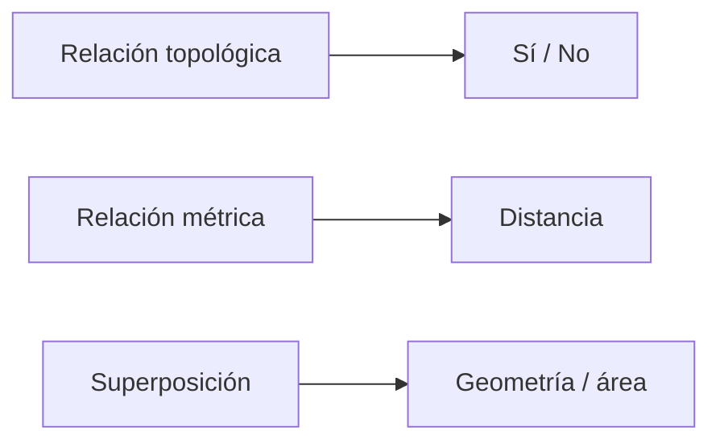
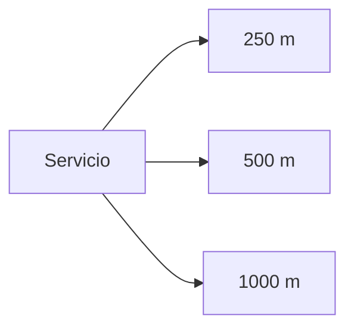
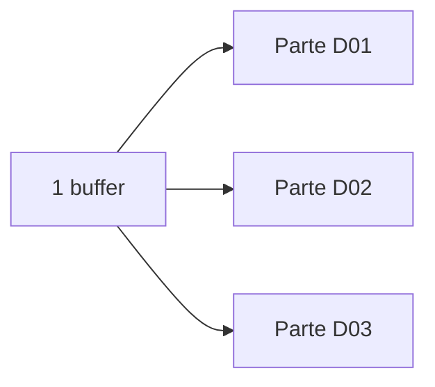
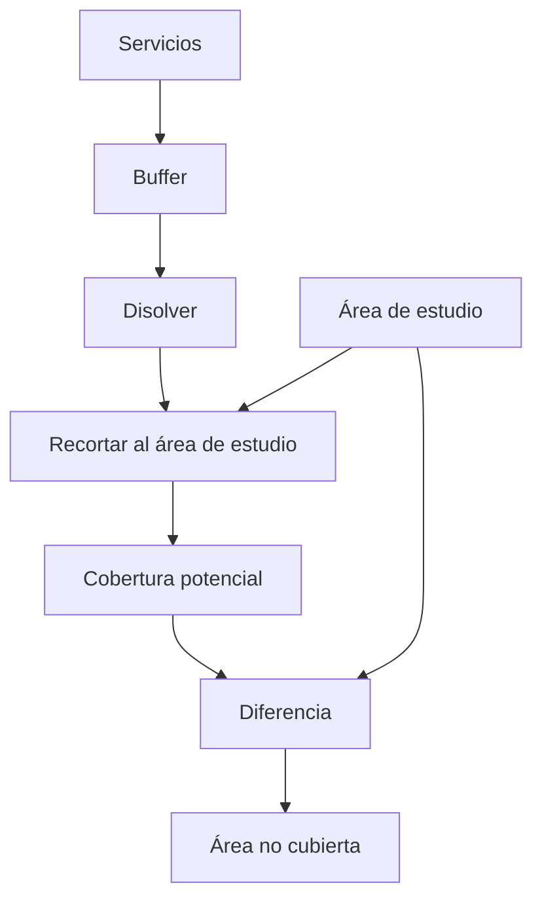
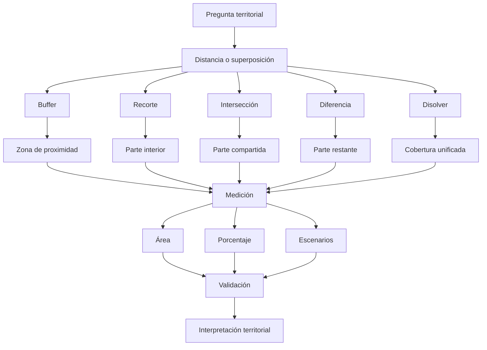

# 3.7 Analizar proximidad y superposición

<div class="grid cards" markdown>

-   :material-vector-circle:{ .lg .middle } **Proximidad**

    ---

    Construir zonas alrededor de:

    **puntos, líneas y polígonos.**

-   :material-content-cut:{ .lg .middle } **Recortar**

    ---

    Limitar información a:

    **un área concreta de estudio.**

-   :material-set-center:{ .lg .middle } **Intersectar**

    ---

    Identificar dónde:

    **dos fenómenos coinciden espacialmente.**

-   :material-set-left:{ .lg .middle } **Diferenciar**

    ---

    Determinar qué parte:

    **permanece fuera de otra geometría.**

-   :material-vector-combine:{ .lg .middle } **Disolver**

    ---

    Unificar zonas cuando:

    **el límite interno deja de ser relevante.**

-   :material-check-decagram:{ .lg .middle } **Validar**

    ---

    Interpretar correctamente:

    **unidades, geometrías, atributos y superficies resultantes.**

</div>

[Comenzar](#1-de-relacion-espacial-a-distancia-y-superficie){ .md-button .md-button--primary }
[Ir al laboratorio](#laboratorio-guiado-comparar-cobertura-potencial-de-servicios){ .md-button }

---

## La misión de esta lección

En **3.6** respondimos preguntas como:

```text
¿qué está dentro?
¿qué intersecta?
¿qué toca?
```

Ahora incorporaremos dos nuevas ideas:

```text
distancia
```

y:

```text
superficie compartida
```

Pasaremos a preguntas como:

```text
¿Qué se encuentra a menos de 500 m de un centro de salud?

¿Qué zonas están cubiertas simultáneamente por varios servicios?

¿Qué parte de un distrito queda fuera de una cobertura?

¿Qué superficie de un área protegida intersecta un proyecto?

¿Qué cambia si utilizamos 250 m, 500 m o 1000 m?
```

### Lo que construiremos


---

## Mapa de aprendizaje

<div class="grid cards" markdown>

-   :material-ruler:{ .lg .middle } **1 · Distancia**

    ---

    Comprender qué significa:

    **estar cerca**.

-   :material-vector-circle:{ .lg .middle } **2 · Buffer**

    ---

    Construir zonas alrededor de entidades.

-   :material-content-cut:{ .lg .middle } **3 · Recorte**

    ---

    Restringir información al área de interés.

-   :material-set-center:{ .lg .middle } **4 · Intersección**

    ---

    Obtener la geometría compartida.

-   :material-set-left:{ .lg .middle } **5 · Diferencia**

    ---

    Obtener lo que queda fuera.

-   :material-vector-combine:{ .lg .middle } **6 · Disolución**

    ---

    Eliminar límites internos innecesarios.

-   :material-scale-balance:{ .lg .middle } **7 · Comparar**

    ---

    Evaluar diferentes distancias y escenarios.

</div>

---

## Antes de empezar

!!! info "Necesitarás"

    - QGIS 3.44.
    - Una capa puntual de servicios o equipamientos.
    - Una capa poligonal de distritos o área de estudio.
    - Un SRC adecuado para trabajar con distancias y superficies.
    - Haber completado:
        - 2.6 Resolver problemas de coordenadas;
        - 3.4 Construir indicadores con expresiones;
        - 3.6 Traducir preguntas en relaciones espaciales.

!!! example "Caso guía"

    Utilizaremos:

    ```text
    centros_salud
    ```

    y:

    ```text
    distritos
    ```

    para comparar zonas de cobertura potencial de:

    ```text
    250 m
    500 m
    1000 m
    ```

!!! danger "No construyas buffers métricos sin revisar el SRC"

    Un valor:

    ```text
    500
    ```

    solo tiene sentido si sabemos:

    ```text
    500 qué
    ```

---

## 1. De relación espacial a distancia y superficie

En la lección anterior preguntábamos:

```text
¿este punto está dentro de este polígono?
```

Ahora podemos preguntar:

```text
¿este punto está a menos de 500 m?
```

o:

```text
¿qué superficie del polígono está a menos de 500 m?
```

### Cambio conceptual



---

## 2. Qué significa estar cerca

La palabra:

```text
cerca
```

no constituye todavía un criterio analítico.

Debemos convertirla en algo medible.

Por ejemplo:

```text
menos de 250 m
menos de 500 m
menos de 1 km
```

### Pero la distancia necesita contexto

```text
500 m
```

puede ser razonable para:

```text
acceso peatonal local
```

pero insuficiente o excesivo para:

```text
hospitales
mercados
parques
estaciones de bomberos
```

!!! important "La distancia debe justificarse"

    Puede provenir de:

    - normativa;
    - estándares de servicio;
    - literatura;
    - estudios previos;
    - metodología institucional;
    - decisión de escenario.

---

## 3. Distancia euclidiana y accesibilidad no son lo mismo

Un buffer convencional representa:

```text
distancia geométrica
```

alrededor de una entidad.

No representa necesariamente:

```text
tiempo de viaje
distancia por calles
accesibilidad real
```

### Ejemplo

```text
Centro de salud ●
                │
                │ 300 m
                │
Vivienda       ●
```

Euclidianamente están cerca.

Pero entre ambos puede existir:

```text
río
muro
autopista
pendiente
ausencia de camino
```

!!! warning "Buffer ≠ isócrona"

    Un buffer responde:

    > ¿Qué está geométricamente a determinada distancia?

    No:

    > ¿Qué puede alcanzarse caminando en 10 minutos?

---

## 4. Revisar el SRC antes de medir

Supongamos que la capa está en:

```text
EPSG:4326
```

Sus unidades son:

```text
grados
```

Si introducimos:

```text
500
```

como distancia sin comprender la herramienta y las unidades:

```text
podemos obtener un resultado absurdo
```

### Para análisis métricos

Trabajaremos preferentemente en un SRC proyectado adecuado al área.

!!! success "Secuencia"

    ```text
    identificar SRC
    ↓
    comprobar unidades
    ↓
    confirmar área de uso
    ↓
    medir
    ```

---

### Revisar unidades en QGIS

!!! captura "Captura pendiente · 3.7-01"

    - **Tipo:** PNG anotado
    - **Archivo:** `assets/images/modulo-03/3-7/3-7-01-src-unidades.png`
    - **Qué mostrar:** propiedades de la capa y SRC del proyecto.
    - **Resaltar:**
        1. código EPSG;
        2. unidades;
        3. extensión;
        4. área de uso.
    - **Objetivo didáctico:** verificar las condiciones antes de utilizar distancias.

---

## 5. Qué es un buffer

Un **buffer** crea una zona a determinada distancia alrededor de una geometría.

### Punto

```text
        ○○○○○
      ○       ○
     ○    ●    ○
      ○       ○
        ○○○○○
```

### Línea

```text
████████████████
──── carretera ────
████████████████
```

### Polígono

```text
██████████████████
██ ┌──────────┐ ██
██ │ polígono │ ██
██ └──────────┘ ██
██████████████████
```

---

## 6. El buffer genera una nueva geometría

Entrada:

```text
punto
```

Salida:

```text
polígono
```

Por tanto:

```text
el resultado ya no representa el mismo fenómeno
```

El punto puede representar:

```text
un centro de salud
```

El buffer representa:

```text
una zona definida metodológicamente alrededor de ese centro
```

!!! important "No confundas entidad con área derivada"

---

## 7. Crear un buffer en QGIS

Abre:

**Caja de herramientas de Procesos ▸ Geometría vectorial ▸ Buffer**

Configura:

```text
capa de entrada
distancia
segmentos
disolver
salida
```

!!! captura "Captura pendiente · 3.7-02"

    - **Tipo:** GIF
    - **Archivo:** `assets/images/modulo-03/3-7/3-7-02-buffer-basico.gif`
    - **Qué mostrar:**
        1. abrir Buffer;
        2. elegir centros de salud;
        3. introducir 500 m;
        4. ejecutar;
        5. observar resultado.
    - **Objetivo didáctico:** visualizar cómo se genera una zona de proximidad.

---

## 8. Distancia del buffer

Ejemplo:

```text
250 m
```

produce una geometría distinta de:

```text
500 m
```

y de:

```text
1000 m
```



### Más distancia

Normalmente significa:

```text
más superficie cubierta
```

pero no necesariamente:

```text
mejor servicio
```

---

## 9. Segmentos y aproximación de curvas

Los buffers alrededor de puntos suelen verse circulares.

Pero un círculo digital se aproxima mediante:

```text
segmentos
```

### Pocos segmentos

```text
forma más angular
```

### Más segmentos

```text
forma visualmente más suave
```

!!! info "Más segmentos también implican más vértices"

    La elección debe ser razonable para:

    ```text
    escala
    precisión necesaria
    rendimiento
    ```

---

## 10. Buffer individual frente a buffer disuelto

Supongamos tres centros:

```text
●      ●       ●
```

Generamos buffers.

### Sin disolver

```text
buffer A
buffer B
buffer C
```

Aunque se superpongan:

```text
siguen siendo entidades separadas
```

### Disuelto

Podemos obtener:

```text
una cobertura conjunta
```

sin los límites internos.

---

## 11. La opción disolver cambia el significado

=== "Sin disolver"

    Permite mantener:

    ```text
    qué zona proviene de qué servicio
    ```

    Útil para:

    ```text
    análisis individual
    superposición
    responsabilidad
    ```

=== "Disuelto"

    Permite responder:

    ```text
    ¿qué territorio está cubierto por al menos un servicio?
    ```

    sin importar cuál.

!!! success "Disolver es una decisión analítica"

---

### Comparar buffer disuelto y no disuelto

!!! captura "Captura pendiente · 3.7-03"

    - **Tipo:** PNG comparativo
    - **Archivo:** `assets/images/modulo-03/3-7/3-7-03-buffer-disolver.png`
    - **Qué mostrar:**
        1. buffers individuales;
        2. cobertura disuelta.
    - **Objetivo didáctico:** mostrar cómo cambia la interpretación aunque la distancia sea la misma.

---

## Checkpoint 1

Deberías poder explicar:

- [ ] qué representa un buffer;
- [ ] por qué buffer no equivale a accesibilidad real;
- [ ] por qué debemos conocer las unidades;
- [ ] qué ocurre al aumentar distancia;
- [ ] qué función cumplen los segmentos;
- [ ] qué diferencia existe entre buffer individual y disuelto.

---

## 12. Buffer por atributo

No todos los elementos tienen que utilizar la misma distancia.

Podemos tener:

| tipo | radio_m |
|---|---:|
| Centro de salud | 500 |
| Hospital | 1500 |
| Puesto de salud | 300 |

En algunos flujos podemos utilizar:

```text
un campo
```

como distancia.

### Esto permite

```text
distancias diferenciadas
```

según una regla.

!!! warning "La columna radio_m debe tener fundamento"

    No debemos asignar radios diferentes solamente para:

    ```text
    conseguir un mapa visualmente conveniente
    ```

---

## 13. Buffers negativos

Para polígonos, una distancia negativa puede generar:

```text
un buffer interior
```

Conceptualmente:

```text
polígono original
↓
retirar una distancia desde el borde
↓
zona interior restante
```

### Posible uso

```text
zona interna de seguridad
retirar borde
analizar núcleo interior
```

### Riesgo

En geometrías pequeñas o estrechas:

```text
la geometría puede desaparecer
```

!!! warning "Siempre revisa el resultado"

---

## 14. Recortar: limitar información a un área

Supongamos que tenemos:

```text
red_vial_municipal
```

pero queremos analizar únicamente:

```text
Distrito 3
```

Podemos utilizar:

```text
Recortar
```

### Conceptualmente

```text
CAPA ORIGINAL
+
MÁSCARA
↓
SOLO LA PARTE INTERIOR
```

---

## 15. Clip no es selección

Una selección responde:

```text
qué entidades cumplen una relación
```

Un recorte puede:

```text
cortar físicamente geometrías
```

en el límite de la máscara.

### Ejemplo

Una vía atraviesa un distrito:

```text
────────────│────────────
            límite
```

Después de recortar:

```text
solo permanece
el tramo interior
```

!!! important "Seleccionar e intersectar geometrías no producen necesariamente el mismo resultado"

---

## 16. Ejecutar Recortar

!!! captura "Captura pendiente · 3.7-04"

    - **Tipo:** GIF
    - **Archivo:** `assets/images/modulo-03/3-7/3-7-04-recortar.gif`
    - **Qué mostrar:**
        1. capa de entrada;
        2. máscara;
        3. ejecución;
        4. comparación antes/después.
    - **Objetivo didáctico:** diferenciar selección de modificación geométrica.

---

## 17. La máscara también debe ser válida

Si el polígono utilizado para recortar contiene errores:

```text
la salida puede heredar problemas
```

Antes de utilizar una máscara importante verifica:

```text
validez
SRC
cobertura
significado
```

---

## 18. Intersección

La herramienta **Intersección** obtiene la parte común entre dos conjuntos.

Conceptualmente:

```text
A ∩ B
```

### Ejemplo

```text
buffer de centro de salud
∩
distrito
```

Resultado:

```text
parte del distrito incluida en el buffer
```

---

## 19. Visualizar una intersección

```text
AAAAAAA
AAAA████BBB
AAAA████BBB
    BBBBBBB
```

Donde:

```text
A = cobertura
B = distrito
█ = intersección
```

### A diferencia de Seleccionar por ubicación

Intersección genera:

```text
nueva geometría
```

---

## 20. Ejecutar Intersección

!!! captura "Captura pendiente · 3.7-05"

    - **Tipo:** GIF
    - **Archivo:** `assets/images/modulo-03/3-7/3-7-05-interseccion.gif`
    - **Qué mostrar:**
        1. buffer;
        2. distritos;
        3. algoritmo Intersección;
        4. resultado.
    - **Objetivo didáctico:** observar qué parte geométrica se conserva.

---

## 21. Intersección también combina atributos

Si A tiene:

```text
id_servicio
tipo
```

y B:

```text
id_distrito
nombre
```

la salida puede contener atributos procedentes de:

```text
ambas capas
```

Ejemplo:

| id_servicio | tipo | id_distrito | nombre |
|---|---|---|---|
| S01 | SALUD | D03 | Distrito 3 |

!!! success "La geometría y los atributos cambian simultáneamente"

---

## 22. Una entidad puede fragmentarse

Supongamos un buffer que cruza:

```text
D01
D02
D03
```

La intersección puede generar:

```text
varias partes
```

con los atributos correspondientes a cada distrito.



!!! important "El número de registros puede aumentar"

---

## 23. Contar filas después de una intersección

No asumas:

```text
10 entidades de entrada
→
10 entidades de salida
```

Después de una operación espacial podemos obtener:

```text
menos
igual
más
```

registros.

Siempre registra:

```text
registros antes
registros después
```

---

## Checkpoint 2

Deberías poder explicar:

- [ ] qué hace Recortar;
- [ ] qué diferencia existe entre recortar y seleccionar;
- [ ] qué hace Intersección;
- [ ] por qué la intersección genera nueva geometría;
- [ ] por qué puede aumentar el número de registros;
- [ ] por qué debemos revisar también los atributos resultantes.

---

## 24. Diferencia

La herramienta **Diferencia** responde conceptualmente:

```text
A - B
```

Es decir:

> ¿Qué parte de A no está incluida en B?

### Ejemplo

```text
Distrito
-
Cobertura de servicios
```

Resultado:

```text
zona no cubierta
```

---

## 25. Visualizar diferencia

```text
AAAAAAAAAAAAAAA
AAAA██████AAAAA
AAAA██████AAAAA
AAAAAAAAAAAAAAA
```

Si:

```text
A = distrito
█ = cobertura
```

la diferencia conserva:

```text
A sin █
```

---

## 26. Uso territorial

Podemos utilizar Diferencia para identificar:

```text
territorio fuera de cobertura
suelo no afectado
área restante
zonas excluidas
```

!!! warning "Fuera de un buffer no significa necesariamente sin acceso"

    Significa:

    ```text
    fuera del criterio geométrico definido
    ```

---

### Ejecutar Diferencia

!!! captura "Captura pendiente · 3.7-06"

    - **Tipo:** GIF
    - **Archivo:** `assets/images/modulo-03/3-7/3-7-06-diferencia.gif`
    - **Qué mostrar:**
        1. distrito;
        2. cobertura;
        3. Diferencia;
        4. territorio restante.
    - **Objetivo didáctico:** mostrar cómo obtener áreas no cubiertas.

---

## 27. Calcular superficie cubierta

Una vez obtenida la:

```text
intersección
```

podemos calcular:

```text
area_cubierta
```

Si las unidades son metros cuadrados:

```qgis
$area
```

y después:

```text
m²
```

o convertir a:

```text
ha
km²
```

según el análisis.

---

## 28. Porcentaje de superficie cubierta

Podemos calcular:

```text
área cubierta
────────────── × 100
área distrito
```

Pero necesitamos conservar:

```text
área total del distrito
```

o relacionarla adecuadamente.

### Ejemplo

```text
Distrito:
10 km²

Cobertura:
6 km²
```

Resultado:

```text
60 %
```

!!! important "Superficie cubierta no equivale a población cubierta"

---

## 29. El error ecológico espacial

Podemos tener:

```text
80 % del territorio cubierto
```

pero la población podría concentrarse en:

```text
el 20 % restante
```

Por tanto:

```text
porcentaje de superficie
```

no implica:

```text
porcentaje de población
```

!!! quote "El indicador debe corresponder al fenómeno que realmente medimos"

---

## 30. Disolver

La herramienta **Disolver** elimina límites internos según una regla.

Ejemplo:

```text
┌──────┬──────┐
│  A1  │  A2  │
├──────┼──────┤
│  A3  │  A4  │
└──────┴──────┘
```

Si todos pertenecen a:

```text
Zona A
```

podemos obtener:

```text
┌─────────────┐
│   Zona A    │
│             │
└─────────────┘
```

---

## 31. Disolver todos o por atributo

=== "Disolver todo"

    Elimina todos los límites internos.

    Resultado:

    ```text
    una cobertura general
    ```

=== "Disolver por atributo"

    Agrupa únicamente entidades con el mismo valor.

    Ejemplo:

    ```text
    tipo = SALUD
    tipo = EDUCACION
    ```

    puede producir una geometría por categoría.

---

## 32. Disolver buffers superpuestos

Supongamos:

```text
Buffer S01
Buffer S02
Buffer S03
```

Se superponen.

Si queremos:

> ¿Qué territorio está cubierto por al menos un servicio?

podemos disolverlos.

### Pero perdemos

```text
qué servicio concreto generó cada parte
```

!!! warning "Disolver simplifica geometría y también información"

---

### Ejecutar Disolver

!!! captura "Captura pendiente · 3.7-07"

    - **Tipo:** GIF
    - **Archivo:** `assets/images/modulo-03/3-7/3-7-07-disolver.gif`
    - **Qué mostrar:**
        1. buffers individuales;
        2. ejecutar Disolver;
        3. resultado único;
        4. comparar tabla de atributos.
    - **Objetivo didáctico:** mostrar pérdida de límites internos y cambio de estructura.

---

## 33. Cobertura simple y cobertura múltiple

Una cobertura disuelta responde:

```text
cubierto por al menos uno
```

Pero puede ocultar:

```text
zonas cubiertas por varios servicios
```

### Conceptualmente

```text
Servicio A
   ○○○○○

Servicio B
      ○○○○○
```

La parte común puede representar:

```text
doble cobertura potencial
```

---

## 34. Intersección entre buffers

Si queremos conocer:

```text
dónde coinciden varias coberturas
```

podemos analizar:

```text
superposición
```

entre buffers individuales.

### Pregunta

> ¿Qué territorio se encuentra dentro de la zona de influencia de dos o más servicios?

Eso es diferente de:

> ¿Qué territorio está cubierto por al menos uno?

---

## 35. No interpretar superposición como redundancia automáticamente

Dos buffers superpuestos pueden representar:

```text
solapamiento de cobertura
```

Pero eso no implica necesariamente:

```text
duplicación innecesaria
```

Puede ser:

```text
capacidad complementaria
servicios distintos
alta demanda
redundancia deseada
```

!!! important "Geometría superpuesta no equivale automáticamente a duplicación funcional"

---

## 36. Comparar escenarios de distancia

Ahora construiremos:

```text
250 m
500 m
1000 m
```

para los mismos centros.

### Pregunta

> ¿Cómo cambia la cobertura potencial al ampliar la distancia?

Esperamos normalmente:

```text
más distancia
→
más superficie
```

Pero queremos cuantificar:

```text
cuánto
```

---

## 37. Matriz de escenarios

| Escenario | Distancia | Área cubierta | % del territorio |
|---|---:|---:|---:|
| E1 | 250 m | | |
| E2 | 500 m | | |
| E3 | 1000 m | | |

### Esto permite comparar

```text
sensibilidad del resultado
```

a una decisión metodológica:

```text
la distancia
```

---

## 38. Análisis de sensibilidad

Si cambiar:

```text
500 m
```

por:

```text
550 m
```

produce una diferencia enorme,

el resultado puede ser:

```text
muy sensible al parámetro
```

Si apenas cambia:

```text
poco sensible
```

!!! success "Los parámetros también deben analizarse"

---

## 39. Crear buffers múltiples

!!! captura "Captura pendiente · 3.7-08"

    - **Tipo:** GIF
    - **Archivo:** `assets/images/modulo-03/3-7/3-7-08-escenarios-buffer.gif`
    - **Qué mostrar:**
        1. buffer 250;
        2. buffer 500;
        3. buffer 1000;
        4. comparar visualmente.
    - **Objetivo didáctico:** introducir análisis de escenarios.

---

## 40. Simbolizar escenarios

Podemos utilizar:

```text
transparencia
contorno
categorías
```

para comparar.

Pero evita crear un mapa tan complejo que:

```text
la superposición sea ilegible
```

!!! tip "Comparación visual y comparación numérica deben complementarse"

---

## 41. Resultados temporales frente a persistentes

Durante experimentación podemos utilizar:

```text
salidas temporales
```

Pero un resultado que forma parte de:

```text
entrega
análisis final
procedimiento reproducible
```

debería guardarse con:

```text
nombre claro
```

por ejemplo:

```text
buffer_salud_500m
cobertura_salud_500m
sin_cobertura_salud_500m
```

---

## 42. Nombres que documenten el proceso

Evita:

```text
buffer
buffer2
final
final_ok
resultado_nuevo
```

Prefiere:

```text
buffer_salud_500m
interseccion_salud_distritos
cobertura_salud_disuelta
area_sin_cobertura
```

!!! success "El nombre de la capa también forma parte de la trazabilidad"

---

## 43. Los atributos pueden cambiar durante el geoprocesamiento

Después de:

```text
intersección
```

podemos obtener:

```text
campos de A
+
campos de B
```

Después de:

```text
disolver
```

podemos perder:

```text
detalle individual
```

Después de:

```text
recortar
```

la geometría cambia, pero determinados atributos pueden mantenerse.

!!! warning "No revises únicamente el mapa"

    Después de cada geoproceso inspecciona:

    ```text
    geometría
    atributos
    número de registros
    ```

---

## Checkpoint 3

Deberías poder explicar:

- [ ] qué hace Diferencia;
- [ ] cómo calcular zona no cubierta;
- [ ] qué mide un porcentaje de superficie cubierta;
- [ ] por qué no equivale a población cubierta;
- [ ] qué hace Disolver;
- [ ] qué información puede perderse al disolver;
- [ ] cómo comparar escenarios de distancia;
- [ ] qué significa sensibilidad del resultado;
- [ ] por qué debemos revisar atributos después de geoprocesar.

---

## 44. Modelo mental de las herramientas

=== "Buffer"

    ```text
    ¿Qué está cerca?
    ```

    Produce:

    ```text
    zona alrededor
    ```

=== "Recortar"

    ```text
    ¿Qué parte de A está dentro de la máscara?
    ```

=== "Intersección"

    ```text
    ¿Qué parte comparten A y B?
    ```

=== "Diferencia"

    ```text
    ¿Qué parte de A queda fuera de B?
    ```

=== "Disolver"

    ```text
    ¿Qué límites internos puedo eliminar?
    ```

---

## 45. Flujo típico de cobertura potencial

Podemos construir:



---

## 46. Orden de operaciones

El orden puede modificar:

```text
geometrías
atributos
rendimiento
```

### Ejemplo A

```text
buffer
→
disolver
→
recortar
```

### Ejemplo B

```text
recortar puntos
→
buffer
→
disolver
```

No necesariamente producirán exactamente el mismo conjunto si existen:

```text
servicios cercanos pero fuera del límite
```

!!! important "El orden también expresa una decisión metodológica"

---

## 47. Caso: servicio fuera del distrito pero cercano

Supongamos un centro está:

```text
20 m fuera de D03
```

pero su buffer de 500 m cubre parte de D03.

Si primero:

```text
eliminamos todos los centros fuera de D03
```

perdemos esa cobertura.

### Pregunta

> ¿La cobertura debe considerar servicios ubicados fuera del distrito?

Eso depende del objetivo.

!!! quote "Los límites administrativos no siempre son límites funcionales"

---

## 48. Caso municipal

Un equipamiento puede estar en:

```text
Distrito 2
```

pero atender población de:

```text
Distrito 3
```

Por eso un análisis de:

```text
cobertura
```

no debería filtrar automáticamente por:

```text
pertenencia administrativa
```

sin una razón metodológica.

---

## 49. Inspeccionar la geometría resultante

Después de cada operación revisa:

```text
microfragmentos
geometrías vacías
slivers
geometrías inválidas
partes inesperadas
```

Especialmente después de:

```text
intersección
diferencia
```

---

## 50. Slivers

Los **slivers** son fragmentos muy pequeños que pueden aparecer por:

```text
límites ligeramente diferentes
errores geométricos
diferencias de precisión
```

Ejemplo:

```text
A ───────────────
B  ──────────────
   ↑
franja mínima
```

!!! warning "No elimines fragmentos solamente porque son pequeños"

    Primero determina si son:

    ```text
    error
    ```

    o:

    ```text
    territorio real
    ```

---

## 51. Validar geometrías resultantes

Después del geoprocesamiento puedes ejecutar:

```text
Comprobar validez
```

y registrar:

```text
válidas
inválidas
vacías
```

!!! captura "Captura pendiente · 3.7-09"

    - **Tipo:** GIF
    - **Archivo:** `assets/images/modulo-03/3-7/3-7-09-validar-resultado.gif`
    - **Qué mostrar:** validar una salida de intersección o diferencia.
    - **Objetivo didáctico:** recordar que el geoprocesamiento no elimina la necesidad de control de calidad.

---

## 52. Validación cuantitativa

También podemos comprobar:

```text
área
```

### Ejemplo

Si:

```text
Área total = Cobertura + No cobertura
```

esperamos aproximadamente:

```text
A_total ≈ A_cubierta + A_no_cubierta
```

considerando:

```text
precisión numérica
geometrías
metodología
```

### Este control es poderoso

Porque detecta:

```text
partes perdidas
solapamientos
errores de flujo
```

---

## 53. Control de conservación de superficie

Completa:

| Componente | Área km² |
|---|---:|
| Área de estudio | |
| Cubierta | |
| No cubierta | |
| Cubierta + no cubierta | |
| Diferencia | |

Idealmente:

```text
diferencia ≈ 0
```

cuando el flujo está diseñado como partición completa.

---

## Checkpoint 4

Antes del laboratorio deberías poder:

- [ ] elegir Buffer, Recortar, Intersección o Diferencia según la pregunta;
- [ ] justificar una distancia;
- [ ] revisar unidades antes de crear buffers;
- [ ] explicar qué cambia al disolver;
- [ ] comparar escenarios;
- [ ] inspeccionar geometrías y atributos;
- [ ] detectar fragmentos pequeños;
- [ ] realizar un control de conservación de superficie.

---

## Laboratorio guiado: comparar cobertura potencial de servicios

!!! example "Escenario"

    Dispones de:

    ```text
    centros_salud
    distritos
    ```

    Debes analizar tres escenarios de cobertura potencial:

    ```text
    250 m
    500 m
    1000 m
    ```

    y cuantificar:

    ```text
    superficie cubierta
    superficie no cubierta
    porcentaje de cobertura
    superposición entre servicios
    ```

### Fase 1 · Revisar SRC

Registra:

```text
SRC:
unidades:
área de uso:
```

### Fase 2 · Revisar geometrías

Ejecuta controles sobre:

```text
centros_salud
distritos
```

### Fase 3 · Definir escenarios

| Escenario | Distancia | Justificación |
|---|---:|---|
| E1 | 250 m | |
| E2 | 500 m | |
| E3 | 1000 m | |

### Fase 4 · Crear buffer 250 m

Guarda como:

```text
buffer_salud_250m
```

### Fase 5 · Crear buffer 500 m

```text
buffer_salud_500m
```

### Fase 6 · Crear buffer 1000 m

```text
buffer_salud_1000m
```

### Fase 7 · Comparar visualmente

Observa:

```text
crecimiento
superposición
bordes
```

### Fase 8 · Disolver cada escenario

Genera:

```text
cobertura_salud_250m
cobertura_salud_500m
cobertura_salud_1000m
```

### Fase 9 · Recortar al área de estudio

Evita contabilizar:

```text
superficie fuera del ámbito
```

cuando el objetivo sea medir cobertura interna.

### Fase 10 · Calcular áreas

Crea:

```text
area_km2
```

o:

```text
area_ha
```

según corresponda.

### Fase 11 · Calcular porcentaje

```text
% cobertura =
área cubierta / área total × 100
```

### Fase 12 · Calcular área no cubierta

Utiliza:

```text
Diferencia
```

entre:

```text
área de estudio
```

y:

```text
cobertura
```

### Fase 13 · Comprobar superficie

Verifica:

```text
cubierta
+
no cubierta
≈
total
```

### Fase 14 · Revisar superposición individual

Antes de disolver, identifica dónde:

```text
varios buffers coinciden
```

### Fase 15 · Comparar escenarios

Completa:

| Escenario | Distancia | Área cubierta km² | % cubierta | Área no cubierta |
|---|---:|---:|---:|---:|
| E1 | 250 | | | |
| E2 | 500 | | | |
| E3 | 1000 | | | |

### Fase 16 · Calcular incremento

Compara:

```text
250 → 500
```

y:

```text
500 → 1000
```

### Fase 17 · Analizar sensibilidad

Responde:

```text
¿el aumento de distancia produce crecimiento proporcional?
```

### Fase 18 · Revisar servicios externos

Identifica servicios ubicados fuera del área que:

```text
podrían cubrir parte del territorio
```

### Fase 19 · Validar geometrías

Ejecuta:

```text
Comprobar validez
```

sobre los productos finales.

### Fase 20 · Crear mapa comparativo

Representa los tres escenarios.

### Evidencia del laboratorio

!!! captura "Captura pendiente · 3.7-10"

    - **Tipo:** Imagen compuesta
    - **Archivo:** `assets/images/modulo-03/3-7/3-7-10-laboratorio.png`
    - **Qué mostrar:**
        1. puntos originales;
        2. buffers;
        3. cobertura disuelta;
        4. área no cubierta;
        5. comparación de escenarios.
    - **Objetivo didáctico:** resumir visualmente el procedimiento completo.

---

## Mini-reto: ¿qué herramienta utilizarías?

=== "Caso A"

    Quieres todo lo que está a 500 m de una escuela.

    ??? question "Herramienta"

        ```text
        BUFFER
        ```

=== "Caso B"

    Quieres conservar solamente la red vial dentro del municipio.

    ??? question "Herramienta"

        ```text
        RECORTAR
        ```

=== "Caso C"

    Quieres la superficie común entre un área inundable y una zona urbana.

    ??? question "Herramienta"

        ```text
        INTERSECCIÓN
        ```

=== "Caso D"

    Quieres la parte del distrito que queda fuera de la cobertura.

    ??? question "Herramienta"

        ```text
        DIFERENCIA
        ```

=== "Caso E"

    Tienes muchos buffers superpuestos y quieres una sola cobertura general.

    ??? question "Herramienta"

        ```text
        DISOLVER
        ```

---

## Reto práctico

!!! example "Reto 3.7 — Comparar la cobertura potencial de servicios con distintas distancias"

    ### Contexto

    Una institución quiere analizar la distribución espacial de un conjunto de servicios.

    No existe todavía una distancia oficial de cobertura, por lo que deben compararse:

    ```text
    250 m
    500 m
    1000 m
    ```

    Tu objetivo es demostrar:

    ```text
    cómo cambia el resultado
    ```

    cuando cambia el parámetro.

    ### Misión 1 · Documentar las fuentes

    Registra:

    | Capa | Geometría | SRC | Registros | Fecha |
    |---|---|---|---:|---|
    | Servicios | | | | |
    | Área de estudio | | | | |

    ### Misión 2 · Verificar unidades

    Explica por qué:

    ```text
    250
    500
    1000
    ```

    representan metros.

    ### Misión 3 · Construir los tres buffers

    Guarda salidas claramente nombradas.

    ### Misión 4 · Comparar buffer individual y disuelto

    Explica:

    ```text
    qué información se conserva
    qué información se pierde
    ```

    ### Misión 5 · Recortar

    Limita cada escenario al área de estudio.

    ### Misión 6 · Calcular superficie cubierta

    Usa la misma unidad en los tres escenarios.

    ### Misión 7 · Crear área no cubierta

    Utiliza Diferencia.

    ### Misión 8 · Construir control de superficie

    | Escenario | Total | Cubierta | No cubierta | Diferencia |
    |---|---:|---:|---:|---:|
    | 250 m | | | | |
    | 500 m | | | | |
    | 1000 m | | | | |

    ### Misión 9 · Detectar superposición

    Identifica zonas donde coinciden:

    ```text
    dos o más coberturas
    ```

    ### Misión 10 · Interpretar superposición

    Explica por qué:

    ```text
    superposición
    ```

    no equivale automáticamente a:

    ```text
    redundancia
    ```

    ### Misión 11 · Comparar escenarios

    Completa:

    | Indicador | 250 m | 500 m | 1000 m |
    |---|---:|---:|---:|
    | Área cubierta | | | |
    | % cubierta | | | |
    | Área no cubierta | | | |

    ### Misión 12 · Medir incremento

    Calcula:

    ```text
    incremento 250 → 500
    incremento 500 → 1000
    ```

    ### Misión 13 · Analizar sensibilidad

    Explica:

    ```text
    qué tan sensible es el resultado a la distancia
    ```

    ### Misión 14 · Revisar servicios externos

    Decide si deben considerarse:

    ```text
    servicios fuera del límite administrativo
    ```

    y justifica.

    ### Misión 15 · Revisar fragmentos

    Identifica:

    ```text
    slivers
    geometrías pequeñas
    partes inesperadas
    ```

    ### Misión 16 · Validar geometrías

    Ejecuta:

    ```text
    Comprobar validez
    ```

    ### Misión 17 · Crear un mapa comparativo

    Debe permitir comparar claramente los tres escenarios.

    ### Misión 18 · Crear matriz metodológica

    | Elemento | Decisión |
    |---|---|
    | Distancias | |
    | Justificación | |
    | SRC | |
    | Unidad | |
    | Disolución | |
    | Recorte | |
    | Servicios externos | |
    | Tratamiento de solapamientos | |

    ### Misión 19 · Elaborar conclusión

    Redacta entre **180 y 250 palabras** explicando:

    - qué pregunta analizaste;
    - por qué utilizaste buffer;
    - qué SRC y unidades utilizaste;
    - qué cambia al disolver;
    - cómo calculaste cobertura;
    - qué diferencia existe entre cobertura territorial y población cubierta;
    - qué escenario cubre mayor superficie;
    - cómo cambia el resultado entre escenarios;
    - qué superposiciones encontraste;
    - qué limitaciones conserva este enfoque.

    ### Entregables

    - `reto_3-7_proximidad.qgz`;
    - GeoPackage de trabajo;
    - buffers 250, 500 y 1000 m;
    - coberturas disueltas;
    - coberturas recortadas;
    - áreas no cubiertas;
    - tabla de escenarios;
    - control de superficie;
    - análisis de sensibilidad;
    - matriz metodológica;
    - mapa comparativo;
    - captura de configuración de Buffer;
    - GIF de Intersección;
    - GIF de Diferencia;
    - GIF de Disolver;
    - captura de validación;
    - conclusión técnica.

---

## Criterios de evaluación

??? success "Ver rúbrica"

    | Criterio | Se cumple si... |
    |---|---|
    | Pregunta | Está claramente formulada |
    | SRC | Es adecuado para análisis métrico |
    | Unidades | Están verificadas |
    | Distancia | Está documentada |
    | Buffer | Se genera correctamente |
    | Segmentos | Se utilizan conscientemente |
    | Disolución | Se aplica según la pregunta |
    | Recorte | Limita correctamente el ámbito |
    | Intersección | Conserva la parte común |
    | Diferencia | Identifica áreas restantes |
    | Atributos | Se revisan después del proceso |
    | Registros | Se comparan antes y después |
    | Área | Se calcula en unidades conocidas |
    | Cobertura | Se interpreta correctamente |
    | Superposición | No se confunde con redundancia |
    | Escenarios | Se comparan cuantitativamente |
    | Sensibilidad | Se evalúa el efecto del parámetro |
    | Geometría | Se valida el resultado |
    | Trazabilidad | Las salidas están claramente nombradas |
    | Resultado | Puede reproducirse y justificarse |

---

## Errores frecuentes

=== "Hice un buffer de 500"

    Pregunta primero:

    ```text
    ¿500 qué?
    ```

=== "La capa está en EPSG:4326"

    Revisa las unidades antes de interpretar la distancia como metros.

=== "Más distancia significa mejor cobertura"

    No necesariamente.

    Significa:

    ```text
    mayor zona geométrica
    ```

=== "El buffer representa 10 minutos caminando"

    No.

    Un buffer convencional no considera red vial ni impedancias.

=== "Disolví y perdí los IDs"

    Es normal que disolver cambie la estructura de atributos.

=== "Recortar y seleccionar dieron resultados diferentes"

    Es esperable:

    ```text
    selección mantiene geometrías completas
    recorte puede cortarlas
    ```

=== "Intersección produjo más registros"

    Una entidad puede fragmentarse al intersectar varias geometrías.

=== "Área cubierta = población cubierta"

    No.

=== "El servicio está fuera del distrito, así que lo eliminé"

    Puede prestar cobertura dentro del distrito.

=== "Aparecieron polígonos diminutos"

    Pueden ser slivers, pero primero debes verificar si son errores reales.

=== "La salida se ve bien"

    Revisa también:

    ```text
    atributos
    número de registros
    áreas
    validez
    ```

---

## Desafío de 5 minutos

!!! challenge "Elige la operación"

    **1.** Zona de 300 m alrededor de escuelas.

    **2.** Parte de una carretera dentro de un municipio.

    **3.** Zona común entre amenaza de inundación y viviendas.

    **4.** Parte de un distrito que queda fuera de una cobertura.

    **5.** Convertir 20 buffers superpuestos en una cobertura general.

??? success "Solución"

    **1**

    ```text
    BUFFER
    ```

    **2**

    ```text
    RECORTAR
    ```

    **3**

    ```text
    INTERSECCIÓN
    ```

    **4**

    ```text
    DIFERENCIA
    ```

    **5**

    ```text
    DISOLVER
    ```

---

## Ideas clave

<div class="grid cards" markdown>

-   :material-ruler:{ .lg .middle } **Mide**

    ---

    La distancia necesita unidad y justificación.

-   :material-vector-circle:{ .lg .middle } **Modela**

    ---

    Un buffer representa proximidad geométrica, no accesibilidad real.

-   :material-set-center:{ .lg .middle } **Cruza**

    ---

    Intersección produce la parte compartida.

-   :material-set-left:{ .lg .middle } **Separa**

    ---

    Diferencia permite identificar lo que queda fuera.

-   :material-vector-combine:{ .lg .middle } **Simplifica**

    ---

    Disolver elimina límites internos cuando dejan de ser relevantes.

-   :material-chart-line:{ .lg .middle } **Compara**

    ---

    Los escenarios muestran sensibilidad frente a los parámetros.

</div>

!!! success "Para recordar"

    - Proximidad debe expresarse mediante una distancia concreta.
    - Una distancia necesita unidad.
    - La distancia necesita justificación metodológica.
    - Buffer representa proximidad geométrica.
    - Buffer no equivale a tiempo de viaje.
    - Un buffer genera una nueva geometría.
    - La opción Disolver cambia el significado del resultado.
    - Recortar limita geometrías a una máscara.
    - Seleccionar y recortar no son equivalentes.
    - Intersección conserva la geometría compartida.
    - Intersección puede aumentar el número de registros.
    - Los atributos también cambian durante el geoprocesamiento.
    - Diferencia permite calcular áreas no cubiertas.
    - Superficie cubierta no equivale a población cubierta.
    - Disolver puede eliminar detalle sobre el origen de la cobertura.
    - Superposición geométrica no implica necesariamente redundancia funcional.
    - Comparar distancias permite crear escenarios.
    - El resultado puede ser sensible al parámetro utilizado.
    - El orden de operaciones puede cambiar el análisis.
    - Los límites administrativos no siempre son límites funcionales.
    - Los servicios externos pueden influir sobre un territorio.
    - Los slivers deben investigarse antes de eliminarlos.
    - Las geometrías resultantes deben validarse.
    - El control de superficie puede detectar inconsistencias.
    - Las salidas deben nombrarse de forma trazable.

---

## Autoevaluación

??? question "1. ¿Qué representa un buffer?"

    Una zona geométrica situada a una distancia definida alrededor de una entidad.

??? question "2. ¿Buffer equivale a accesibilidad?"

    No.

??? question "3. ¿Qué debemos comprobar antes de introducir una distancia?"

    SRC y unidades.

??? question "4. ¿Qué ocurre al aumentar la distancia del buffer?"

    Normalmente aumenta la superficie cubierta.

??? question "5. ¿Qué diferencia existe entre buffer disuelto y no disuelto?"

    El no disuelto conserva entidades individuales; el disuelto elimina sus límites internos.

??? question "6. ¿Qué hace Recortar?"

    Conserva la parte de la capa de entrada que se encuentra dentro de la máscara.

??? question "7. ¿Recortar equivale a seleccionar?"

    No.

??? question "8. ¿Qué hace Intersección?"

    Genera la geometría común entre dos conjuntos y combina atributos asociados.

??? question "9. ¿Por qué puede aumentar el número de registros?"

    Porque una entidad puede dividirse al intersectar varias geometrías.

??? question "10. ¿Qué hace Diferencia?"

    Conserva la parte de A que queda fuera de B.

??? question "11. ¿Cómo podríamos obtener área no cubierta?"

    Mediante Diferencia entre área de estudio y cobertura.

??? question "12. ¿Qué hace Disolver?"

    Elimina límites internos entre geometrías según una regla.

??? question "13. ¿Qué información puede perderse al disolver?"

    El detalle de las entidades individuales que originaron la cobertura.

??? question "14. ¿Una superposición significa redundancia?"

    No necesariamente.

??? question "15. ¿Área cubierta equivale a población cubierta?"

    No.

??? question "16. ¿Qué es un escenario?"

    Una configuración alternativa de parámetros utilizada para comparar resultados.

??? question "17. ¿Qué es sensibilidad?"

    El grado en que el resultado cambia cuando modificamos un parámetro.

??? question "18. ¿Debemos excluir automáticamente servicios fuera del área administrativa?"

    No. Depende de la pregunta.

??? question "19. ¿Qué es un sliver?"

    Un pequeño fragmento geométrico que puede surgir por diferencias entre límites o precisión.

??? question "20. ¿Debe eliminarse automáticamente?"

    No.

??? question "21. ¿Qué debemos revisar después de un geoproceso?"

    Geometría, atributos, registros y medidas.

??? question "22. ¿Cómo podemos comprobar una partición cubierta/no cubierta?"

    Comparando:

    ```text
    área total
    ```

    con:

    ```text
    área cubierta + área no cubierta
    ```

??? question "23. ¿Cuál es la secuencia principal?"

    ```text
    preguntar
    → definir parámetros
    → procesar
    → medir
    → validar
    → comparar
    → interpretar
    ```

---

## Mapa conceptual



---

## Cierre


!!! quote "La idea que debe permanecer"

    La pregunta profesional no es:

    > **¿Cómo creo un buffer de 500 metros?**

    sino:

    > **¿Por qué 500 metros representan una distancia pertinente para esta pregunta, qué geometría produce ese supuesto y cómo cambia la conclusión si modifico el parámetro?**

---

## Siguiente lección

<div class="grid cards" markdown>

-   :material-vector-circle:{ .lg .middle } **Lo que hicimos**

    ---

    Trabajamos con geometría vectorial para analizar:

    ```text
    distancia
    cobertura
    superposición
    ```

-   :material-grid:{ .lg .middle } **Lo que viene**

    ---

    En **3.8 Preparar y combinar datos ráster** cambiaremos de modelo.

    Pasaremos de:

    ```text
    entidades vectoriales
    ```

    a:

    ```text
    celdas
    resolución
    alineación
    NoData
    álgebra ráster
    ```

</div>

[Continuar con 3.8 →](08-preparar-combinar-raster.md){ .md-button .md-button--primary }

---

## Referencias

- [QGIS 3.44 — Buffer](https://docs.qgis.org/3.44/es/docs/user_manual/processing_algs/qgis/vectorgeometry.html)  
  Documentación oficial sobre generación de zonas de proximidad.

- [QGIS 3.44 — Superposición vectorial](https://docs.qgis.org/3.44/es/docs/user_manual/processing_algs/qgis/vectoroverlay.html)  
  Herramientas como Recortar, Intersección, Diferencia y operaciones de superposición.

- [QGIS 3.44 — Disolver](https://docs.qgis.org/3.44/es/docs/user_manual/processing_algs/qgis/vectorgeometry.html)  
  Referencia para unificación de geometrías según atributos.

- [QGIS 3.44 — Geometría vectorial](https://docs.qgis.org/3.44/es/docs/user_manual/processing_algs/qgis/vectorgeometry.html)  
  Algoritmos de transformación y análisis geométrico.

- [QGIS 3.44 — Expresiones geométricas](https://docs.qgis.org/3.44/es/docs/user_manual/expressions/functions_list.html)  
  Funciones para cálculo de superficies, longitudes y geometrías.

- [QGIS Training Manual](https://docs.qgis.org/3.44/es/docs/training_manual/)  
  Ejercicios oficiales de análisis vectorial y geoprocesamiento.

- [Material for MkDocs — Reference](https://squidfunk.github.io/mkdocs-material/reference/)  
  Referencia general de componentes utilizados en esta documentación.

- [Material for MkDocs — Grids](https://squidfunk.github.io/mkdocs-material/reference/grids/)  
  Tarjetas y cuadrículas.

- [Material for MkDocs — Content tabs](https://squidfunk.github.io/mkdocs-material/reference/content-tabs/)  
  Comparación de herramientas y conceptos.

- [Material for MkDocs — Admonitions](https://squidfunk.github.io/mkdocs-material/reference/admonitions/)  
  Advertencias, preguntas, retos y contenido desplegable.

- [Material for MkDocs — Diagrams](https://squidfunk.github.io/mkdocs-material/reference/diagrams/)  
  Integración de Mermaid para explicar flujos y operaciones espaciales.