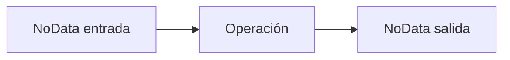
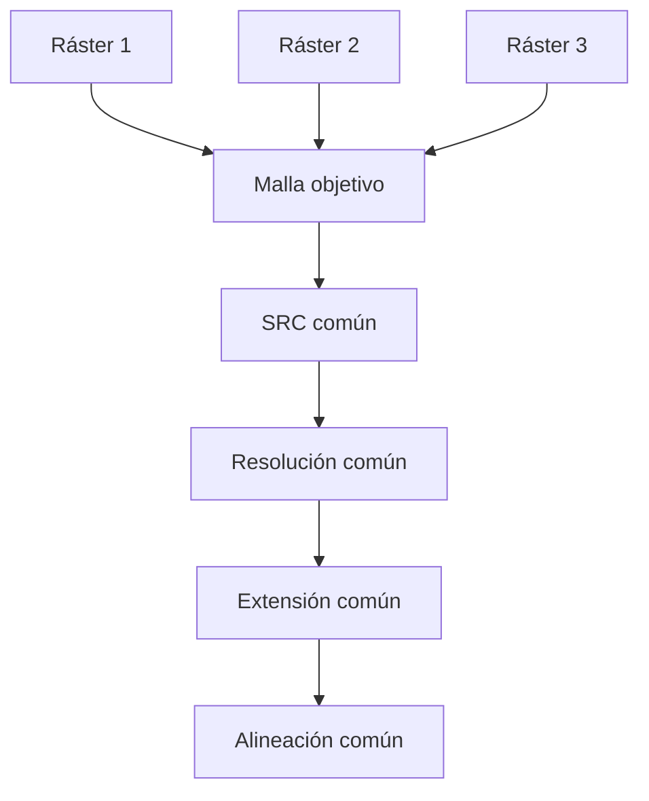
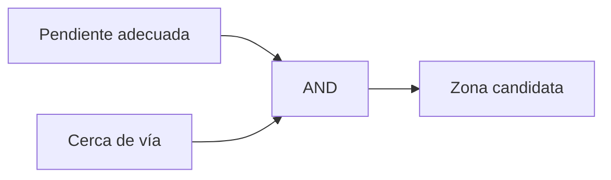
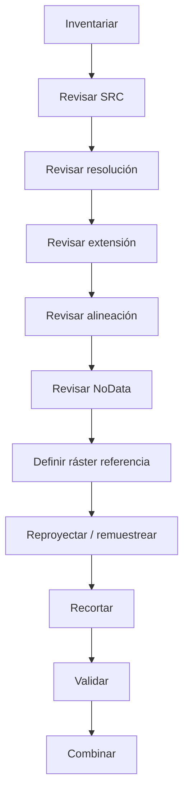
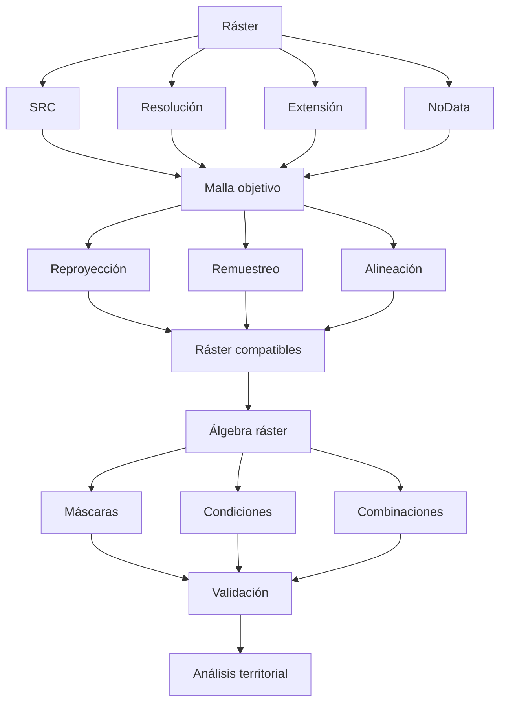

# 3.8 Preparar y combinar datos ráster

<div class="grid cards" markdown>

-   :material-grid:{ .lg .middle } **Comprender**

    ---

    Trabajar con:

    **celdas, resolución, extensión y bandas.**

-   :material-ruler-square:{ .lg .middle } **Alinear**

    ---

    Hacer compatibles:

    **tamaño de píxel, origen y extensión.**

-   :material-image-sync:{ .lg .middle } **Reproyectar**

    ---

    Transformar correctamente:

    **SRC y geometría de la malla.**

-   :material-resize:{ .lg .middle } **Remuestrear**

    ---

    Elegir un método coherente con:

    **el significado de los datos.**

-   :material-null:{ .lg .middle } **Controlar NoData**

    ---

    Diferenciar:

    **ausencia de dato, cero y fondo.**

-   :material-calculator-variant:{ .lg .middle } **Combinar**

    ---

    Construir:

    **máscaras y condiciones mediante álgebra ráster.**

</div>

[Comenzar](#1-el-raster-no-es-solo-una-imagen){ .md-button .md-button--primary }
[Ir al laboratorio](#laboratorio-guiado-construir-una-mascara-de-condiciones-territoriales){ .md-button }

---

## La misión de esta lección

Hasta ahora gran parte de nuestro análisis se ha realizado sobre:

```text
puntos
líneas
polígonos
```

En esta lección cambiaremos de modelo.

Trabajaremos con:

```text
celdas
```

organizadas en una matriz.

La pregunta central será:

> **¿Cómo podemos combinar varios ráster sin introducir errores por diferencias de resolución, extensión, alineación o NoData?**

### Lo que construiremos


---

## Mapa de aprendizaje

<div class="grid cards" markdown>

-   :material-grid:{ .lg .middle } **1 · Modelo**

    ---

    Comprender píxel, banda y valor.

-   :material-arrow-expand-all:{ .lg .middle } **2 · Extensión**

    ---

    Saber qué territorio cubre cada ráster.

-   :material-ruler-square:{ .lg .middle } **3 · Resolución**

    ---

    Interpretar el tamaño de celda.

-   :material-grid-large:{ .lg .middle } **4 · Alineación**

    ---

    Comprobar que las celdas coinciden.

-   :material-image-sync:{ .lg .middle } **5 · Reproyección**

    ---

    Cambiar SRC sin confundir asignación y transformación.

-   :material-resize:{ .lg .middle } **6 · Remuestreo**

    ---

    Elegir vecinos, bilineal o cúbico según el dato.

-   :material-null:{ .lg .middle } **7 · NoData**

    ---

    Controlar ausencia y fondo.

-   :material-calculator-variant:{ .lg .middle } **8 · Combinar**

    ---

    Crear máscaras y condiciones ráster.

</div>

---

## Antes de empezar

!!! info "Necesitarás"

    - QGIS 3.44.
    - Al menos dos capas ráster.
    - Un ráster continuo, por ejemplo:
        - elevación;
        - precipitación;
        - temperatura.
    - Un ráster categórico, por ejemplo:
        - uso de suelo;
        - cobertura;
        - clasificación.
    - Haber completado:
        - 2.10 Explorar datos ráster;
        - 3.4 Construir indicadores con expresiones;
        - 3.7 Analizar proximidad y superposición.

!!! example "Caso guía"

    Trabajaremos conceptualmente con:

    ```text
    pendiente.tif
    uso_suelo.tif
    distancia_vias.tif
    ```

    para construir una máscara territorial donde se cumplan varias condiciones.

!!! danger "Regla fundamental"

    Dos ráster pueden verse perfectamente superpuestos en QGIS y aun así:

    ```text
    no estar correctamente alineados
    ```

---

## 1. El ráster no es solo una imagen

Un ráster puede visualizarse como una imagen.

Pero analíticamente representa:

```text
una matriz de celdas
```

Cada celda tiene:

```text
posición
valor
tamaño
```

Ejemplo:

```text
12  14  15  18
11  13  16  20
10  12  17  22
```

### Una celda no es solo un cuadrado visual

Representa una porción concreta del territorio.

Su significado depende de:

```text
SRC
resolución
posición de la malla
valor
unidad
```

---

## 2. Componentes básicos de un ráster

<div class="grid cards" markdown>

-   :material-grid:{ .lg .middle } **Celda**

    ---

    Unidad espacial básica.

-   :material-ruler-square:{ .lg .middle } **Resolución**

    ---

    Tamaño territorial representado por cada celda.

-   :material-arrow-expand-all:{ .lg .middle } **Extensión**

    ---

    Límites espaciales del ráster.

-   :material-layers-triple:{ .lg .middle } **Bandas**

    ---

    Una o varias matrices dentro del mismo archivo.

-   :material-null:{ .lg .middle } **NoData**

    ---

    Ausencia de valor válido.

-   :material-earth:{ .lg .middle } **SRC**

    ---

    Referencia espacial de la matriz.

</div>

---

## 3. Abrir propiedades de un ráster

Selecciona una capa y abre:

**Propiedades de la capa ▸ Información**

Revisa:

```text
SRC
extensión
ancho
alto
tamaño de píxel
número de bandas
tipo de dato
NoData
```

!!! captura "Captura pendiente · 3.8-01"

    - **Tipo:** PNG anotado
    - **Archivo:** `assets/images/modulo-03/3-8/3-8-01-propiedades-raster.png`
    - **Qué mostrar:** panel de información del ráster.
    - **Resaltar:**
        1. SRC;
        2. extensión;
        3. dimensiones;
        4. resolución;
        5. bandas;
        6. tipo de dato.
    - **Objetivo didáctico:** aprender a diagnosticar un ráster antes de procesarlo.

---

## 4. Resolución espacial

Supongamos:

```text
pixel = 10 m × 10 m
```

Cada celda representa:

```text
100 m²
```

Otro ráster tiene:

```text
30 m × 30 m
```

Cada celda representa:

```text
900 m²
```

### No contienen el mismo nivel de detalle

```text
10 m
```

puede representar variaciones que:

```text
30 m
```

generaliza.

!!! success "Menor tamaño de píxel = mayor resolución espacial"

Pero:

```text
mayor resolución
```

no significa automáticamente:

```text
mayor exactitud
```

---

## 5. Resolución y exactitud no son lo mismo

Un ráster de:

```text
1 m
```

puede provenir de una fuente:

```text
mal georreferenciada
```

o:

```text
interpolada desde datos pobres
```

Mientras uno de:

```text
10 m
```

puede ser más confiable.

!!! quote "El tamaño de celda describe detalle espacial, no calidad absoluta"

---

## 6. Comparar resoluciones

Supongamos:

```text
Ráster A = 10 m
Ráster B = 30 m
```

Si queremos combinarlos celda por celda:

```text
debemos decidir qué resolución utilizar
```

Opciones posibles:

```text
10 m
30 m
otra resolución
```

### Pero no existe una decisión neutral

Elegir:

```text
10 m
```

no crea mágicamente detalle real en el ráster de 30 m.

Elegir:

```text
30 m
```

reduce el detalle del ráster de 10 m.

---

## 7. Extensión

La extensión indica:

```text
xmin
ymin
xmax
ymax
```

Conceptualmente:

```text
┌───────────────────┐
│                   │
│      RÁSTER       │
│                   │
└───────────────────┘
```

Dos ráster pueden tener:

```text
misma resolución
```

pero cubrir áreas distintas.

### Ejemplo

```text
Ráster A:
municipio completo

Ráster B:
zona urbana
```

---

## 8. ¿Qué extensión utilizar?

Depende de la pregunta.

Podemos necesitar:

=== "Intersección espacial"

    Trabajar solo donde:

    ```text
    todos los ráster tienen datos
    ```

=== "Unión de extensiones"

    Cubrir:

    ```text
    todo el territorio disponible
    ```

    aceptando posibles zonas NoData.

=== "Área de estudio"

    Recortar todo a:

    ```text
    un límite común
    ```

!!! important "La extensión debe definirse metodológicamente"

---

## Checkpoint 1

Deberías poder explicar:

- [ ] qué representa una celda;
- [ ] qué es resolución;
- [ ] por qué resolución no equivale a exactitud;
- [ ] qué es extensión;
- [ ] por qué dos ráster con diferente resolución no deberían combinarse sin decisión previa;
- [ ] por qué el área de estudio puede determinar la extensión final.

---

## 9. El problema invisible: alineación

Supongamos dos ráster de:

```text
10 m
```

Ambos tienen la misma resolución.

¿Significa que sus celdas coinciden?

No necesariamente.

### Ráster A

```text
┌──┬──┬──┬──┐
├──┼──┼──┼──┤
├──┼──┼──┼──┤
└──┴──┴──┴──┘
```

### Ráster B desplazado

```text
  ┌──┬──┬──┬──┐
  ├──┼──┼──┼──┤
  ├──┼──┼──┼──┤
  └──┴──┴──┴──┘
```

La resolución es igual.

Pero:

```text
el origen de la malla es diferente
```

---

## 10. Por qué importa la alineación

Para una operación celda por celda queremos:

```text
celda A(i,j)
```

comparada con:

```text
celda B(i,j)
```

que represente:

```text
la misma porción del territorio
```

Si las mallas están desplazadas:

```text
los valores no corresponden exactamente al mismo lugar
```

!!! danger "Visualmente superpuesto ≠ analíticamente alineado"

---

## 11. Diagnosticar alineación

Compara:

```text
resolución X
resolución Y
xmin
ymin
dimensiones
```

También puedes:

```text
acercarte a escala muy grande
```

y observar los píxeles.

!!! captura "Captura pendiente · 3.8-02"

    - **Tipo:** PNG comparativo
    - **Archivo:** `assets/images/modulo-03/3-8/3-8-02-alineacion.png`
    - **Qué mostrar:**
        1. ráster alineados;
        2. ráster desplazados.
    - **Objetivo didáctico:** hacer visible un problema que normalmente pasa desapercibido.

---

## 12. Usar un ráster de referencia

Una buena práctica es decidir:

```text
ráster de referencia
```

que determine:

```text
SRC
resolución
extensión
alineación
```

Los demás ráster se preparan para coincidir con él.

### Ejemplo

```text
Referencia:
DEM_10m.tif
```

Entonces buscamos que los demás productos tengan:

```text
10 m
misma malla
misma área de trabajo
```

cuando la metodología lo justifique.

---

## 13. Reproyección ráster

Reproyectar significa transformar:

```text
la ubicación espacial de las celdas
```

a otro SRC.

Esto implica necesariamente:

```text
crear una nueva malla
```

Por tanto requiere:

```text
remuestreo
```

!!! important "Reproyectar un ráster no es solo cambiar una etiqueta"

---

## 14. Asignar SRC y reproyectar no son lo mismo

=== "Asignar SRC"

    Indica cómo interpretar las coordenadas existentes.

    No transforma los píxeles.

=== "Reproyectar"

    Transforma la posición espacial y crea una nueva cuadrícula.

!!! danger "Asignar un SRC incorrecto no corrige un ráster"

    Solo cambia:

    ```text
    cómo QGIS interpreta sus coordenadas
    ```

---

## 15. Reproyectar en QGIS

Podemos utilizar:

```text
Warp (Reproject)
```

desde GDAL/Procesamiento.

Debemos definir:

```text
SRC destino
resolución
método de remuestreo
NoData
extensión
```

!!! captura "Captura pendiente · 3.8-03"

    - **Tipo:** GIF
    - **Archivo:** `assets/images/modulo-03/3-8/3-8-03-reproyectar-raster.gif`
    - **Qué mostrar:**
        1. abrir Warp;
        2. elegir SRC;
        3. elegir remuestreo;
        4. definir resolución;
        5. ejecutar;
        6. comparar salida.
    - **Objetivo didáctico:** visualizar que reproyección implica varias decisiones.

---

## 16. Remuestreo

Cuando cambia:

```text
SRC
resolución
alineación
```

debemos asignar valores a nuevas celdas.

Ese proceso es:

```text
remuestreo
```

El método debe depender del tipo de dato.

---

## 17. Vecino más cercano

**Nearest neighbour** utiliza el valor de una celda cercana sin interpolarlo.

### Apropiado para datos categóricos

Por ejemplo:

```text
1 = bosque
2 = urbano
3 = agricultura
4 = agua
```

Si interpolamos:

```text
1 y 3
```

podríamos obtener:

```text
2
```

aunque:

```text
urbano
```

no exista allí.

!!! success "Para clases, conservar categorías suele ser prioritario"

---

## 18. Bilineal

La interpolación bilineal utiliza varios píxeles cercanos para estimar un nuevo valor.

Puede ser apropiada para datos:

```text
continuos
```

como:

```text
elevación
temperatura
precipitación
```

### Produce valores nuevos

Si tenemos:

```text
100
110
```

podemos obtener:

```text
105
```

Eso es razonable para:

```text
elevación
```

pero absurdo para:

```text
código de uso de suelo
```

---

## 19. Cúbico

La interpolación cúbica utiliza un entorno mayor y puede producir superficies:

```text
más suaves
```

Puede ser útil para determinados datos continuos.

### Pero

```text
más suave
```

no significa:

```text
más correcto
```

Puede crear valores que:

```text
no existían en el original
```

---

## 20. Elegir remuestreo según el dato

| Tipo de dato | Ejemplo | Método habitual |
|---|---|---|
| Categórico | Uso de suelo | Vecino más cercano |
| Discreto | Código de clase | Vecino más cercano |
| Continuo | Elevación | Bilineal / cúbico según objetivo |
| Continuo | Temperatura | Bilineal / cúbico según objetivo |

!!! warning "La tabla es una guía, no una regla universal"

---

### Comparar métodos

!!! captura "Captura pendiente · 3.8-04"

    - **Tipo:** Imagen comparativa
    - **Archivo:** `assets/images/modulo-03/3-8/3-8-04-remuestreo.png`
    - **Qué mostrar:** mismo ráster continuo remuestreado con:
        1. vecino;
        2. bilineal;
        3. cúbico.
    - **Objetivo didáctico:** visualizar diferencias en el resultado.

---

## Checkpoint 2

Deberías poder explicar:

- [ ] qué es alineación de malla;
- [ ] por qué misma resolución no garantiza alineación;
- [ ] qué función cumple un ráster de referencia;
- [ ] diferencia entre asignar SRC y reproyectar;
- [ ] qué es remuestreo;
- [ ] cuándo usar vecino más cercano;
- [ ] por qué bilineal no debería aplicarse indiscriminadamente a categorías.

---

## 21. NoData

Un ráster puede contener celdas con:

```text
NoData
```

Esto significa:

```text
no existe un valor válido
```

No necesariamente:

```text
0
```

### Ejemplo

```text
elevación = 0
```

puede ser una elevación real.

Mientras:

```text
NoData
```

significa:

```text
no tenemos dato
```

---

## 22. Fondo negro no siempre significa cero

En visualización ráster es frecuente encontrar:

```text
0
```

o:

```text
-9999
```

utilizados como valor de fondo.

Pero debemos comprobar:

```text
si realmente representan NoData
```

### Si no se configuran correctamente

pueden entrar en:

```text
estadísticas
cálculos
clasificaciones
```

y distorsionar resultados.

---

## 23. Diagnosticar NoData

Revisa:

```text
metadatos
propiedades
estadísticas
histograma
```

Pregunta:

```text
¿qué valor representa ausencia?
```

!!! captura "Captura pendiente · 3.8-05"

    - **Tipo:** PNG anotado
    - **Archivo:** `assets/images/modulo-03/3-8/3-8-05-nodata.png`
    - **Qué mostrar:** propiedades de transparencia/NoData y un área sin dato.
    - **Objetivo didáctico:** distinguir visualización y valor analítico.

---

## 24. NoData en operaciones matemáticas

Supongamos:

```text
Ráster A = 5
Ráster B = NoData
```

En muchas operaciones:

```text
A + B
```

produce:

```text
NoData
```

### Esto puede propagarse



!!! important "Debemos decidir si esa propagación representa correctamente la metodología"

---

## 25. No reemplazar NoData por cero automáticamente

Supongamos un ráster de:

```text
precipitación
```

NoData puede significar:

```text
sin observación
```

Reemplazarlo por:

```text
0 mm
```

significa:

```text
sabemos que no llovió
```

Son situaciones completamente diferentes.

---

## 26. Recortar un ráster

Podemos limitar un ráster al área de estudio mediante:

```text
Recortar ráster por capa de máscara
```

Esto ayuda a:

```text
reducir extensión
reducir tamaño
homogeneizar área
```

### Resultado esperado

```text
solo celdas del área relevante
```

con:

```text
NoData
```

fuera de la máscara cuando corresponda.

---

### Recortar por máscara

!!! captura "Captura pendiente · 3.8-06"

    - **Tipo:** GIF
    - **Archivo:** `assets/images/modulo-03/3-8/3-8-06-recortar-raster.gif`
    - **Qué mostrar:**
        1. ráster completo;
        2. límite municipal;
        3. Recortar por máscara;
        4. resultado.
    - **Objetivo didáctico:** normalizar la extensión de trabajo.

---

## 27. Alinear varios ráster

Cuando necesitamos combinar:

```text
pendiente
uso de suelo
distancia
```

debemos buscar compatibilidad en:

```text
SRC
resolución
extensión
alineación
```

QGIS/GDAL dispone de procesos que permiten preparar las capas con una referencia común.

### Flujo



---

## 28. Cambiar resolución no crea información

Supongamos un ráster original de:

```text
30 m
```

Lo remuestreamos a:

```text
10 m
```

Ahora tendremos:

```text
más celdas
```

Pero no:

```text
tres veces más información real
```

!!! danger "Upsampling ≠ nueva precisión"

---

## 29. Reducir resolución también cambia información

Pasar:

```text
10 m
```

a:

```text
30 m
```

implica generalizar.

Dependiendo del método:

```text
podemos perder extremos
categorías minoritarias
variabilidad local
```

---

## 30. Comparar dos resoluciones

!!! captura "Captura pendiente · 3.8-07"

    - **Tipo:** PNG comparativo
    - **Archivo:** `assets/images/modulo-03/3-8/3-8-07-comparar-resoluciones.png`
    - **Qué mostrar:** mismo fenómeno a:
        1. 10 m;
        2. 30 m;
        3. vista ampliada de píxeles.
    - **Objetivo didáctico:** visualizar generalización y pérdida aparente de detalle.

---

## 31. Álgebra ráster

Una vez compatibles, podemos combinar valores celda por celda.

Ejemplo:

```text
pendiente < 15°
```

produce una condición lógica.

Otra:

```text
distancia_vias < 500 m
```

Otra:

```text
uso_suelo = 3
```

Podemos combinar:

```text
condición 1
AND
condición 2
AND
condición 3
```

---

## 32. Calculadora ráster

QGIS dispone de:

```text
Calculadora ráster
```

que permite utilizar:

```text
bandas
operadores
condiciones
```

para crear un nuevo ráster.

!!! captura "Captura pendiente · 3.8-08"

    - **Tipo:** PNG anotado
    - **Archivo:** `assets/images/modulo-03/3-8/3-8-08-calculadora-raster.png`
    - **Qué mostrar:** diálogo de Calculadora ráster.
    - **Resaltar:**
        1. bandas disponibles;
        2. expresión;
        3. extensión;
        4. resolución;
        5. salida.
    - **Objetivo didáctico:** reconocer la interfaz de álgebra ráster.

---

## 33. Construir una máscara binaria

Supongamos:

```text
pendiente <= 15
```

Podemos producir:

```text
1 = cumple
0 = no cumple
```

Conceptualmente:

```text
Ráster pendiente
↓
condición
↓
Máscara binaria
```

### Ejemplo visual

```text
1 1 0 0
1 1 1 0
0 1 1 0
```

---

## 34. Combinar condiciones

Queremos zonas que cumplan:

```text
pendiente <= 15
```

y:

```text
distancia a vías <= 500
```

Conceptualmente:

```text
A AND B
```

Resultado:

```text
1
```

solo donde ambas condiciones son verdaderas.



---

## 35. Incluir una condición categórica

También podemos exigir:

```text
uso_suelo = URBANO
```

Entonces:

```text
Pendiente adecuada
AND
Cercanía a vía
AND
Uso permitido
```

produce:

```text
máscara final
```

---

## 36. AND y OR cambian radicalmente el resultado

=== "AND"

    Todas las condiciones deben cumplirse.

    ```text
    A ∩ B
    ```

=== "OR"

    Basta que se cumpla al menos una.

    ```text
    A ∪ B
    ```

!!! warning "No confundir lógica con conveniencia"

    Elegir `AND` u `OR` debe provenir del criterio de análisis.

---

## 37. Las condiciones también necesitan unidades

Supongamos:

```text
pendiente <= 15
```

¿15 qué?

Puede ser:

```text
grados
```

o:

```text
porcentaje
```

No son equivalentes.

!!! important "Toda variable debe conservar su unidad"

---

## 38. Nombres de bandas

En expresiones ráster es común encontrar referencias como:

```text
pendiente@1
```

que significa:

```text
banda 1
```

del ráster:

```text
pendiente
```

En un ráster multibanda podemos tener:

```text
@1
@2
@3
```

con significados distintos.

---

## 39. NoData dentro de una máscara

Supongamos:

```text
pendiente = NoData
```

¿La celda debería ser:

```text
0
```

o:

```text
NoData
```

?

No existe una respuesta universal.

### Si 0 significa

```text
no apto
```

estaríamos afirmando que:

```text
sabemos que no cumple
```

### Si NoData significa

```text
no evaluable
```

conservamos la incertidumbre.

!!! success "Diferenciar no apto de no evaluable mejora la interpretación"

---

## Checkpoint 3

Deberías poder explicar:

- [ ] qué significa NoData;
- [ ] por qué NoData no equivale a cero;
- [ ] cómo puede propagarse NoData;
- [ ] por qué no debemos reemplazarlo automáticamente;
- [ ] qué significa alinear ráster;
- [ ] por qué cambiar resolución no crea nueva información;
- [ ] qué es álgebra ráster;
- [ ] qué diferencia existe entre `AND` y `OR`.

---

## 40. Tipos de datos ráster

Los píxeles pueden almacenarse como:

```text
entero
decimal
```

con diferentes tamaños.

### Ejemplo categórico

```text
1
2
3
4
```

Puede utilizar:

```text
entero
```

### Ejemplo continuo

```text
1523.47
1525.18
```

puede necesitar:

```text
decimal
```

!!! warning "El tipo de salida también importa"

---

## 41. Evitar pérdida por tipo de dato

Supongamos:

```text
0.25
0.75
1.50
```

Si guardamos como:

```text
entero
```

podemos perder:

```text
decimales
```

La salida debe ser compatible con:

```text
los valores esperados
```

---

## 42. Estadísticas ráster

Después de procesar revisa:

```text
mínimo
máximo
media
desviación
NoData
```

### Ejemplo

Esperamos:

```text
pendiente 0–90°
```

pero obtenemos:

```text
máximo = 32567
```

Debemos investigar.

Podría tratarse de:

```text
NoData no reconocido
unidad distinta
error de conversión
producto diferente
```

---

### Revisar estadísticas

!!! captura "Captura pendiente · 3.8-09"

    - **Tipo:** GIF
    - **Archivo:** `assets/images/modulo-03/3-8/3-8-09-estadisticas-raster.gif`
    - **Qué mostrar:** propiedades/estadísticas e histograma.
    - **Objetivo didáctico:** incorporar control de calidad cuantitativo.

---

## 43. Histograma

El histograma permite observar:

```text
distribución de valores
```

Puede revelar:

```text
valores extremos
saltos
categorías
errores
NoData mal codificado
```

### Pero no explica por sí solo la causa

Es una herramienta de:

```text
diagnóstico
```

---

## 44. Comparar antes y después

Después de reproyectar o remuestrear registra:

| Propiedad | Original | Resultado |
|---|---|---|
| SRC | | |
| Resolución X | | |
| Resolución Y | | |
| Columnas | | |
| Filas | | |
| Extensión | | |
| Tipo | | |
| NoData | | |
| Mínimo | | |
| Máximo | | |

!!! success "No juzgues una reproyección solo por su apariencia"

---

## 45. Diferencias entre dato categórico y continuo

<div class="grid" markdown>

!!! info "Categórico"

    Cada valor representa:

    ```text
    una clase
    ```

    Ejemplo:

    ```text
    1 = urbano
    2 = agrícola
    3 = bosque
    ```

    Importa conservar:

    ```text
    identidad de clase
    ```

!!! info "Continuo"

    Cada valor representa:

    ```text
    una magnitud
    ```

    Ejemplo:

    ```text
    elevación
    temperatura
    precipitación
    ```

    Puede tener sentido:

    ```text
    interpolar
    ```

</div>

---

## 46. No usar la misma preparación para todo

Un error frecuente:

```text
reproyectar todos
con bilineal
a 10 m
```

sin considerar:

```text
tipo de dato
resolución original
objetivo
```

!!! danger "Un flujo homogéneo puede ser metodológicamente incorrecto"

---

## 47. Preparar un inventario ráster

Antes de combinar varios archivos crea:

| Ráster | Variable | Tipo | SRC | Resolución | NoData | Unidad |
|---|---|---|---|---|---|---|
| pendiente | | | | | | |
| uso_suelo | | | | | | |
| distancia | | | | | | |

### Añade

```text
fecha
fuente
método de generación
```

cuando estén disponibles.

---

## 48. Flujo de preparación



---

## 49. Guardar resultados con nombres claros

Evita:

```text
raster1.tif
raster_final.tif
raster_final2.tif
```

Prefiere:

```text
pendiente_10m.tif
uso_suelo_10m_alineado.tif
dist_vias_10m.tif
mascara_aptitud_v01.tif
```

!!! success "El nombre del archivo puede documentar parte del procesamiento"

---

## Checkpoint 4

Antes del laboratorio deberías poder:

- [ ] distinguir ráster categórico y continuo;
- [ ] elegir remuestreo según el tipo;
- [ ] interpretar NoData;
- [ ] revisar estadísticas;
- [ ] comparar propiedades antes y después;
- [ ] inventariar fuentes;
- [ ] definir un ráster de referencia;
- [ ] preparar capas antes de combinarlas.

---

## Laboratorio guiado: construir una máscara de condiciones territoriales

!!! example "Escenario"

    Dispones de tres capas:

    ```text
    pendiente.tif
    uso_suelo.tif
    distancia_vias.tif
    ```

    Queremos identificar zonas que cumplan simultáneamente:

    ```text
    pendiente <= 15°
    distancia a vías <= 500 m
    uso de suelo permitido
    ```

    Los ráster tienen deliberadamente:

    ```text
    diferentes resoluciones
    diferentes extensiones
    diferentes alineaciones
    NoData
    ```

### Fase 1 · Inventariar

Completa:

| Ráster | SRC | Resolución | Extensión | Tipo | Unidad | NoData |
|---|---|---|---|---|---|---|
| pendiente | | | | | | |
| uso_suelo | | | | | | |
| distancia_vias | | | | | | |

### Fase 2 · Clasificar el tipo

Indica:

```text
continuo
```

o:

```text
categórico
```

para cada uno.

### Fase 3 · Elegir referencia

Selecciona un ráster para definir:

```text
SRC
resolución
alineación
```

y justifica.

### Fase 4 · Definir extensión

Decide si utilizarás:

```text
área común
```

o:

```text
área de estudio
```

### Fase 5 · Preparar pendiente

Si necesita reproyección:

```text
Warp
```

con método adecuado.

### Fase 6 · Preparar uso de suelo

Utiliza un método que preserve:

```text
categorías
```

### Fase 7 · Preparar distancia

Alinea la resolución y la malla.

### Fase 8 · Recortar

Utiliza una misma:

```text
área de estudio
```

### Fase 9 · Verificar alineación

Comprueba:

```text
resolución
origen
extensión
dimensiones
```

### Fase 10 · Revisar NoData

Documenta:

```text
qué significa NoData
```

en cada capa.

### Fase 11 · Crear condición de pendiente

Genera:

```text
pendiente_ok
```

donde:

```text
1 = cumple
0 = no cumple
```

### Fase 12 · Crear condición de distancia

Genera:

```text
distancia_ok
```

### Fase 13 · Crear condición de uso

Genera:

```text
uso_ok
```

### Fase 14 · Combinar

Construye:

```text
aptitud =
pendiente_ok
AND
distancia_ok
AND
uso_ok
```

### Fase 15 · Revisar NoData

Decide cómo tratar celdas:

```text
no evaluables
```

### Fase 16 · Calcular superficie

Obtén la superficie donde:

```text
aptitud = 1
```

### Fase 17 · Comparar resolución

Repite el análisis con una resolución más gruesa.

Por ejemplo:

```text
10 m
vs
30 m
```

### Fase 18 · Comparar resultados

Completa:

| Resolución | Celdas aptas | Superficie apta | Diferencia |
|---|---:|---:|---:|
| 10 m | | | |
| 30 m | | | |

### Fase 19 · Analizar cambios

Identifica:

```text
zonas pequeñas que desaparecen
bordes que cambian
categorías generalizadas
```

### Fase 20 · Documentar limitaciones

Registra:

```text
resolución original
remuestreo
NoData
alineación
incertidumbre
```

### Evidencia del laboratorio

!!! captura "Captura pendiente · 3.8-10"

    - **Tipo:** Imagen compuesta
    - **Archivo:** `assets/images/modulo-03/3-8/3-8-10-laboratorio.png`
    - **Qué mostrar:**
        1. tres ráster originales;
        2. alineación;
        3. máscaras individuales;
        4. máscara final;
        5. comparación 10 m vs 30 m.
    - **Objetivo didáctico:** mostrar todo el flujo desde preparación hasta análisis.

---

## Mini-reto: ¿qué harías?

=== "Caso A"

    Uso de suelo categórico debe pasar de 30 m a 10 m.

    ??? question "Método"

        Preferentemente:

        ```text
        vecino más cercano
        ```

        para conservar categorías.

=== "Caso B"

    DEM continuo cambia de SRC.

    ??? question "Método"

        Puede utilizar:

        ```text
        bilineal
        ```

        o un método continuo adecuado según el objetivo.

=== "Caso C"

    Dos ráster tienen 10 m pero sus píxeles están desplazados.

    ??? question "¿Son compatibles?"

        No completamente.

        Debemos:

        ```text
        alinearlos
        ```

=== "Caso D"

    Un ráster tiene valor -9999 alrededor del territorio.

    ??? question "¿Lo interpretas como dato?"

        No antes de comprobar si:

        ```text
        -9999 representa NoData
        ```

=== "Caso E"

    Reamuestras de 30 m a 5 m.

    ??? question "¿Obtienes seis veces más detalle real?"

        No.

---

## Reto práctico

!!! example "Reto 3.8 — Construir una máscara territorial y comparar resoluciones"

    ### Contexto

    Dispones de al menos tres variables ráster que deben combinarse para identificar zonas candidatas.

    Los datos no fueron producidos originalmente con:

    ```text
    la misma resolución
    la misma extensión
    la misma alineación
    ```

    Tu tarea es demostrar que puedes prepararlos correctamente antes de aplicar álgebra ráster.

    ### Misión 1 · Crear inventario

    Documenta:

    ```text
    fuente
    variable
    fecha
    SRC
    resolución
    extensión
    NoData
    unidad
    ```

    ### Misión 2 · Clasificar datos

    Indica si cada ráster es:

    ```text
    continuo
    categórico
    ```

    ### Misión 3 · Elegir malla de referencia

    Justifica:

    ```text
    SRC
    resolución
    extensión
    ```

    ### Misión 4 · Elegir remuestreo

    Para cada ráster documenta:

    ```text
    vecino
    bilineal
    cúbico
    ```

    y justifica.

    ### Misión 5 · Reproyectar

    Transforma los ráster que lo necesiten.

    ### Misión 6 · Alinear

    Verifica que las mallas sean compatibles.

    ### Misión 7 · Recortar

    Limita todas las variables al mismo ámbito.

    ### Misión 8 · Revisar NoData

    Identifica cómo está representado en cada fuente.

    ### Misión 9 · Crear máscaras

    Genera al menos:

    ```text
    condición A
    condición B
    condición C
    ```

    ### Misión 10 · Combinar con AND

    Crea:

    ```text
    mascara_estricta
    ```

    donde todas las condiciones deben cumplirse.

    ### Misión 11 · Combinar con OR

    Crea experimentalmente:

    ```text
    mascara_flexible
    ```

    y explica por qué produce un resultado diferente.

    ### Misión 12 · Comparar NoData y cero

    Demuestra un caso donde:

    ```text
    0
    ```

    y:

    ```text
    NoData
    ```

    producen interpretaciones diferentes.

    ### Misión 13 · Calcular superficie

    Obtén:

    ```text
    área apta
    ```

    en una unidad documentada.

    ### Misión 14 · Cambiar resolución

    Repite el análisis a una resolución más gruesa.

    ### Misión 15 · Comparar

    | Indicador | Resolución A | Resolución B |
    |---|---:|---:|
    | Tamaño píxel | | |
    | Número de celdas | | |
    | Área apta | | |
    | % apto | | |

    ### Misión 16 · Analizar diferencias

    Identifica:

    ```text
    pequeñas zonas perdidas
    bordes modificados
    cambios de categoría
    ```

    ### Misión 17 · Revisar estadísticas

    Documenta:

    ```text
    mínimo
    máximo
    NoData
    ```

    de los productos relevantes.

    ### Misión 18 · Construir matriz metodológica

    | Decisión | Valor | Justificación |
    |---|---|---|
    | SRC objetivo | | |
    | Resolución | | |
    | Extensión | | |
    | Referencia | | |
    | Remuestreo continuo | | |
    | Remuestreo categórico | | |
    | NoData | | |

    ### Misión 19 · Crear mapa comparativo

    Presenta:

    ```text
    resolución fina
    vs
    resolución gruesa
    ```

    ### Misión 20 · Elaborar conclusión

    Redacta entre **180 y 250 palabras** explicando:

    - qué variables utilizaste;
    - qué resoluciones tenían originalmente;
    - qué malla utilizaste como referencia;
    - qué remuestreo aplicaste a cada dato;
    - cómo trataste NoData;
    - cómo garantizaste alineación;
    - cómo construiste la máscara;
    - qué diferencia encontraste entre resoluciones;
    - qué información se perdió o generalizó;
    - qué limitaciones conserva el resultado.

    ### Entregables

    - `reto_3-8_raster.qgz`;
    - ráster originales;
    - ráster preparados;
    - inventario;
    - máscaras individuales;
    - máscara combinada;
    - versión a segunda resolución;
    - tabla comparativa;
    - matriz metodológica;
    - mapa comparativo;
    - captura de propiedades ráster;
    - GIF de reproyección;
    - GIF de recorte;
    - captura de Calculadora ráster;
    - captura de comparación de resoluciones;
    - conclusión técnica.

---

## Criterios de evaluación

??? success "Ver rúbrica"

    | Criterio | Se cumple si... |
    |---|---|
    | Inventario | Documenta propiedades relevantes |
    | Modelo | Distingue categórico y continuo |
    | SRC | Está correctamente identificado |
    | Resolución | Está documentada |
    | Extensión | Se define conscientemente |
    | Alineación | Las mallas son compatibles |
    | Referencia | Existe una malla objetivo |
    | Reproyección | Se transforma correctamente |
    | Remuestreo | Corresponde al tipo de dato |
    | NoData | Se diferencia de cero |
    | Recorte | Homogeneiza el área de estudio |
    | Álgebra | Las expresiones representan criterios |
    | AND/OR | Se utilizan conscientemente |
    | Tipo | La salida conserva precisión necesaria |
    | Estadísticas | Se revisan después del proceso |
    | Resolución | Se compara su efecto |
    | Trazabilidad | Las salidas están bien nombradas |
    | Resultado | Puede reproducirse y justificarse |

---

## Errores frecuentes

=== "Los ráster tienen el mismo SRC"

    Eso no garantiza:

    ```text
    misma resolución
    misma extensión
    misma alineación
    ```

=== "Los dos tienen 10 m"

    Aun así pueden estar:

    ```text
    desplazados
    ```

=== "Reproyecté uso de suelo con bilineal"

    Puedes crear:

    ```text
    clases artificiales
    ```

=== "Pasé de 30 m a 5 m"

    No has creado nueva información real.

=== "El fondo vale cero"

    Verifica si:

    ```text
    cero es dato
    ```

    o:

    ```text
    debería ser NoData
    ```

=== "Reemplacé NoData por cero"

    Puedes haber convertido:

    ```text
    desconocido
    ```

    en:

    ```text
    valor conocido
    ```

=== "La máscara tiene muchos NoData"

    Revisa:

    ```text
    extensión
    alineación
    NoData de entradas
    ```

=== "El mapa se ve igual"

    Comprueba:

    ```text
    celdas
    estadísticas
    dimensiones
    ```

=== "La resolución más fina es mejor"

    Solo si:

    ```text
    la fuente realmente sostiene ese detalle
    ```

---

## Desafío de 5 minutos

!!! challenge "Diagnostica"

    **1.** Uso de suelo con códigos 1, 2 y 3 será remuestreado.

    ¿Vecino o bilineal?

    **2.** DEM continuo cambia de 30 m a 20 m.

    ¿Puede utilizarse interpolación?

    **3.** Dos ráster tienen igual tamaño de píxel pero orígenes distintos.

    ¿Están alineados?

    **4.** Un valor 0 significa ausencia de lluvia medida.

    ¿Es igual a NoData?

    **5.** Un ráster de 100 m se remuestrea a 10 m.

    ¿Ahora posee detalle real de 10 m?

??? success "Solución"

    **1**

    ```text
    Vecino más cercano
    ```

    **2**

    Sí, si corresponde al significado del dato y a la metodología.

    **3**

    No necesariamente.

    **4**

    No.

    **5**

    No.

---

## Ideas clave

<div class="grid cards" markdown>

-   :material-grid:{ .lg .middle } **Celda**

    ---

    Cada píxel representa una porción concreta del territorio.

-   :material-ruler-square:{ .lg .middle } **Resolución**

    ---

    Define detalle espacial, no exactitud absoluta.

-   :material-grid-large:{ .lg .middle } **Alineación**

    ---

    Las celdas deben representar las mismas posiciones.

-   :material-resize:{ .lg .middle } **Remuestreo**

    ---

    El método depende del significado de los valores.

-   :material-null:{ .lg .middle } **NoData**

    ---

    Ausencia no equivale a cero.

-   :material-calculator-variant:{ .lg .middle } **Álgebra**

    ---

    Solo combina correctamente capas previamente compatibles.

</div>

!!! success "Para recordar"

    - Un ráster es una matriz georreferenciada de celdas.
    - Resolución describe el tamaño de píxel.
    - Mayor resolución no significa automáticamente mayor exactitud.
    - Dos ráster pueden tener extensiones diferentes.
    - Mismo tamaño de píxel no garantiza alineación.
    - Para combinar celdas necesitamos una malla coherente.
    - Un ráster de referencia ayuda a definir la malla objetivo.
    - Asignar SRC y reproyectar son operaciones diferentes.
    - Reproyectar un ráster implica remuestreo.
    - Vecino más cercano conserva mejor clases categóricas.
    - Bilineal y cúbico generan valores interpolados.
    - Un método suave no es automáticamente más correcto.
    - NoData no significa cero.
    - NoData puede propagarse en cálculos.
    - No debemos reemplazar NoData por cero sin justificación.
    - Recortar ayuda a homogeneizar la extensión.
    - Cambiar de 30 m a 10 m no genera información nueva.
    - Reducir resolución puede eliminar detalle.
    - La Calculadora ráster permite combinar condiciones.
    - AND y OR representan lógicas diferentes.
    - Las unidades siguen siendo fundamentales.
    - El tipo de salida puede producir pérdida de precisión.
    - Las estadísticas ayudan a validar resultados.
    - Ráster categóricos y continuos requieren tratamientos diferentes.
    - Debemos registrar propiedades antes y después del procesamiento.
    - La resolución puede modificar significativamente un análisis territorial.

---

## Autoevaluación

??? question "1. ¿Qué es una celda ráster?"

    La unidad espacial básica de una matriz ráster.

??? question "2. ¿Qué representa la resolución?"

    El tamaño territorial de cada celda.

??? question "3. ¿Menor píxel significa mayor exactitud?"

    No necesariamente.

??? question "4. ¿Qué es extensión?"

    El área espacial cubierta por el ráster.

??? question "5. ¿Dos ráster de 10 m están automáticamente alineados?"

    No.

??? question "6. ¿Qué significa alineación?"

    Que las mallas coinciden espacialmente en resolución, origen y posición.

??? question "7. ¿Para qué sirve un ráster de referencia?"

    Para definir propiedades comunes de la malla objetivo.

??? question "8. ¿Asignar SRC reproyecta los píxeles?"

    No.

??? question "9. ¿Qué ocurre al reproyectar?"

    Se crea una nueva cuadrícula en otro SRC.

??? question "10. ¿Qué es remuestreo?"

    El método utilizado para asignar valores a las nuevas celdas.

??? question "11. ¿Qué método suele utilizarse para clases?"

    Vecino más cercano.

??? question "12. ¿Por qué no bilineal para códigos categóricos?"

    Porque puede generar valores que no representan clases reales.

??? question "13. ¿Qué significa NoData?"

    Ausencia de un valor válido.

??? question "14. ¿NoData equivale a cero?"

    No.

??? question "15. ¿Qué puede ocurrir con NoData en una operación?"

    Puede propagarse al resultado.

??? question "16. ¿Qué hace Recortar por máscara?"

    Limita el ráster a un área definida por una geometría.

??? question "17. ¿Remuestrear de 30 m a 10 m crea más información?"

    No.

??? question "18. ¿Qué es álgebra ráster?"

    Operaciones celda por celda entre uno o varios ráster.

??? question "19. ¿Qué significa AND?"

    Que deben cumplirse todas las condiciones.

??? question "20. ¿Qué significa OR?"

    Que debe cumplirse al menos una condición.

??? question "21. ¿Por qué revisar estadísticas después?"

    Para detectar valores inesperados, errores y problemas de NoData.

??? question "22. ¿Por qué comparar resoluciones?"

    Porque el tamaño de celda puede modificar la geometría y cantidad de zonas resultantes.

??? question "23. ¿Cuál es el flujo recomendado?"

    ```text
    inventariar
    → revisar
    → alinear
    → remuestrear
    → recortar
    → validar
    → combinar
    → comparar
    ```

---

## Mapa conceptual



---

## Cierre


!!! quote "La idea que debe permanecer"

    La pregunta profesional no es:

    > **¿Cómo hago una operación con dos ráster?**

    sino:

    > **¿Representan ambas matrices el mismo territorio, con una malla compatible y con valores comparables antes de combinarlas?**

---

## Siguiente lección

<div class="grid cards" markdown>

-   :material-grid:{ .lg .middle } **Lo que hicimos**

    ---

    Preparamos y combinamos:

    ```text
    celdas
    resolución
    NoData
    condiciones
    ```

-   :material-terrain:{ .lg .middle } **Lo que viene**

    ---

    En **3.9 Interpretar relieve y resumirlo por zonas** utilizaremos un modelo digital de elevación para obtener:

    ```text
    elevación
    sombreado
    pendiente
    curvas de nivel
    estadísticas zonales
    ```

</div>

[Continuar con 3.9 →](09-relieve-estadisticas-zonales.md){ .md-button .md-button--primary }

---

## Referencias

- [QGIS 3.44 — Propiedades ráster](https://docs.qgis.org/3.44/es/docs/user_manual/working_with_raster/raster_properties.html)  
  Información, simbología, histogramas, transparencia y propiedades del ráster.

- [QGIS 3.44 — Análisis ráster](https://docs.qgis.org/3.44/es/docs/user_manual/processing_algs/qgis/rasteranalysis.html)  
  Herramientas de análisis y procesamiento de matrices.

- [QGIS 3.44 — GDAL ráster](https://docs.qgis.org/3.44/es/docs/user_manual/processing_algs/gdal/rasterprojections.html)  
  Reproyección y transformación de datos ráster.

- [QGIS 3.44 — Raster miscellaneous](https://docs.qgis.org/3.44/es/docs/user_manual/processing_algs/gdal/rastermiscellaneous.html)  
  Utilidades de preparación y procesamiento ráster.

- [QGIS 3.44 — Raster extraction](https://docs.qgis.org/3.44/es/docs/user_manual/processing_algs/gdal/rasterextraction.html)  
  Recorte por extensión y máscara.

- [QGIS 3.44 — Calculadora ráster](https://docs.qgis.org/3.44/es/docs/user_manual/working_with_raster/raster_analysis.html)  
  Construcción de expresiones y operaciones celda por celda.

- [QGIS Training Manual](https://docs.qgis.org/3.44/es/docs/training_manual/)  
  Ejercicios oficiales relacionados con procesamiento y análisis ráster.

- [Material for MkDocs — Reference](https://squidfunk.github.io/mkdocs-material/reference/)  
  Referencia general de componentes usados en esta documentación.

- [Material for MkDocs — Grids](https://squidfunk.github.io/mkdocs-material/reference/grids/)  
  Tarjetas y cuadrículas.

- [Material for MkDocs — Content tabs](https://squidfunk.github.io/mkdocs-material/reference/content-tabs/)  
  Comparaciones entre métodos y tipos de datos.

- [Material for MkDocs — Admonitions](https://squidfunk.github.io/mkdocs-material/reference/admonitions/)  
  Notas, advertencias, desafíos y preguntas desplegables.

- [Material for MkDocs — Diagrams](https://squidfunk.github.io/mkdocs-material/reference/diagrams/)  
  Diagramas Mermaid para explicar flujos de preparación ráster.