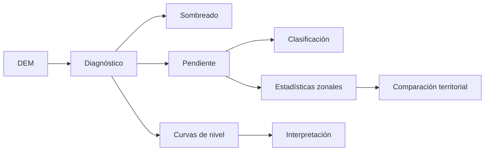
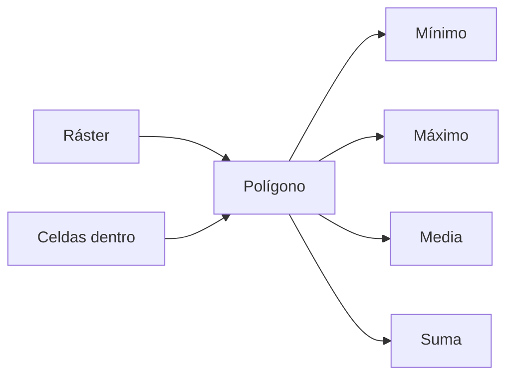
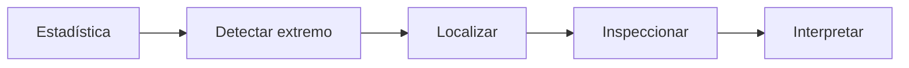
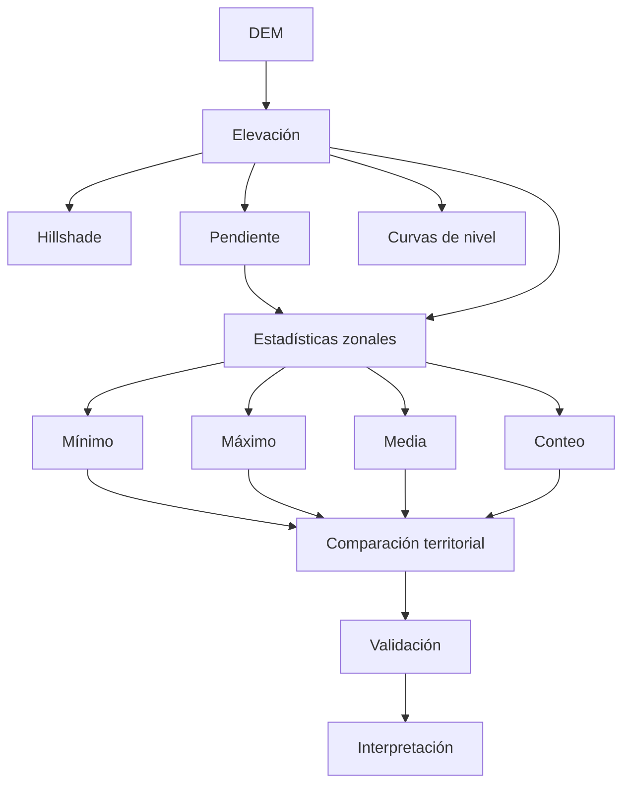
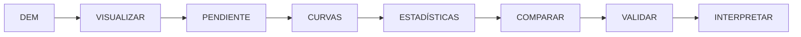

# 3.9 Interpretar relieve y resumirlo por zonas

<div class="grid cards" markdown>

-   :material-terrain:{ .lg .middle } **Interpretar**

    ---

    Leer un modelo digital de elevación como:

    **superficie territorial y no como una simple imagen.**

-   :material-weather-sunset:{ .lg .middle } **Visualizar**

    ---

    Generar sombreado para:

    **reconocer formas del relieve.**

-   :material-angle-acute:{ .lg .middle } **Derivar**

    ---

    Calcular:

    **pendiente y otras variables topográficas.**

-   :material-chart-bell-curve:{ .lg .middle } **Representar**

    ---

    Crear:

    **curvas de nivel** a partir de una superficie.

-   :material-chart-box:{ .lg .middle } **Resumir**

    ---

    Obtener:

    **mínimo, máximo, media y otros estadísticos por zona.**

-   :material-check-decagram:{ .lg .middle } **Validar**

    ---

    Diferenciar:

    **resultado matemático, calidad del DEM e interpretación territorial.**

</div>

[Comenzar](#1-el-relieve-como-superficie){ .md-button .md-button--primary }
[Ir al laboratorio](#laboratorio-guiado-caracterizar-el-relieve-por-distrito){ .md-button }

---

## La misión de esta lección

En **3.8** aprendimos a preparar datos ráster para que fueran comparables.

Ahora utilizaremos un ráster de elevación para producir nueva información.

Partiremos de:

```text
elevación
```

y derivaremos:

```text
sombreado
pendiente
curvas de nivel
estadísticas zonales
```

La pregunta central será:

> **¿Cómo traducimos una superficie de elevación en variables útiles para describir y comparar el territorio?**

### Lo que construiremos



---

## Mapa de aprendizaje

<div class="grid cards" markdown>

-   :material-terrain:{ .lg .middle } **1 · DEM**

    ---

    Comprender qué representa una superficie de elevación.

-   :material-weather-sunset:{ .lg .middle } **2 · Hillshade**

    ---

    Mejorar la lectura visual del relieve.

-   :material-angle-acute:{ .lg .middle } **3 · Pendiente**

    ---

    Derivar inclinación del terreno.

-   :material-chart-bell-curve:{ .lg .middle } **4 · Curvas**

    ---

    Transformar elevación continua en isolíneas.

-   :material-table-large:{ .lg .middle } **5 · Estadísticas**

    ---

    Resumir valores ráster por polígonos.

-   :material-map-search:{ .lg .middle } **6 · Interpretación**

    ---

    Comparar unidades territoriales con criterio.

</div>

---

## Antes de empezar

!!! info "Necesitarás"

    - QGIS 3.44.
    - Un modelo digital de elevación.
    - Una capa poligonal de distritos, cuencas o unidades territoriales.
    - Haber completado:
        - 3.8 Preparar y combinar datos ráster.

!!! example "Caso guía"

    Utilizaremos:

    ```text
    dem_10m.tif
    ```

    y:

    ```text
    distritos
    ```

    para responder:

    > **¿Qué diferencias topográficas existen entre los distritos y qué zonas presentan mayor pendiente?**

!!! danger "Primera comprobación"

    Antes de calcular pendiente o curvas debes conocer:

    ```text
    SRC
    resolución
    unidad horizontal
    unidad vertical
    NoData
    ```

---

## 1. El relieve como superficie

Un DEM representa una superficie donde cada celda contiene:

```text
un valor de elevación
```

Ejemplo:

```text
2530  2535  2542
2528  2534  2545
2520  2529  2548
```

Estos valores permiten reconstruir:

```text
variación vertical del terreno
```

---

## 2. DEM, DTM y DSM

No todos los modelos de elevación representan exactamente lo mismo.

=== "DEM"

    Término general para:

    ```text
    modelo digital de elevación
    ```

=== "DTM"

    Busca representar:

    ```text
    terreno
    ```

    sin objetos superficiales.

=== "DSM"

    Puede representar:

    ```text
    superficie superior
    ```

    incluyendo:

    ```text
    vegetación
    edificios
    objetos
    ```

!!! important "La terminología depende también de la fuente"

    Siempre revisa:

    ```text
    metadatos
    método de adquisición
    producto
    ```

---

## 3. Elevación no significa altura de edificio

Si un píxel tiene:

```text
2650 m
```

no significa:

```text
edificio de 2650 m
```

Representa una cota respecto de una referencia vertical o modelo utilizado.

### Debemos conocer

```text
unidad vertical
datum vertical
producto de origen
```

cuando estén disponibles.

---

## 4. Diagnosticar el DEM

Abre:

**Propiedades de la capa ▸ Información**

Revisa:

```text
SRC
resolución
extensión
mínimo
máximo
NoData
tipo de dato
```

!!! captura "Captura pendiente · 3.9-01"

    - **Tipo:** PNG anotado
    - **Archivo:** `assets/images/modulo-03/3-9/3-9-01-propiedades-dem.png`
    - **Qué mostrar:** propiedades del DEM.
    - **Resaltar:**
        1. SRC;
        2. resolución;
        3. mínimo;
        4. máximo;
        5. NoData.
    - **Objetivo didáctico:** comprobar que entendemos la superficie antes de derivar información.

---

## 5. Visualizar elevación

La simbología puede utilizar:

```text
Pseudocolor de banda única
```

para representar diferentes rangos.

Por ejemplo:

```text
zonas bajas
zonas medias
zonas altas
```

### Pero el color no modifica los datos

Solo cambia:

```text
la representación
```

!!! success "Separar siempre"

    ```text
    valor ráster
    ≠
    color mostrado
    ```

---

## 6. Elegir una rampa con significado

Evita seleccionar colores únicamente porque:

```text
se ven bonitos
```

Una rampa para elevación debería facilitar:

```text
lectura ordinal
```

de:

```text
bajo → alto
```

### También debemos evitar

```text
demasiadas clases
```

si dificultan la interpretación.

---

### Simbolizar elevación

!!! captura "Captura pendiente · 3.9-02"

    - **Tipo:** GIF
    - **Archivo:** `assets/images/modulo-03/3-9/3-9-02-simbologia-elevacion.gif`
    - **Qué mostrar:**
        1. cambiar a Pseudocolor;
        2. ajustar mínimo/máximo;
        3. elegir rampa;
        4. observar resultado.
    - **Objetivo didáctico:** diferenciar dato continuo y representación.

---

## Checkpoint 1

Deberías poder explicar:

- [ ] qué representa un DEM;
- [ ] qué diferencia conceptual existe entre DTM y DSM;
- [ ] qué significa un valor de elevación;
- [ ] por qué debemos revisar unidades y metadatos;
- [ ] por qué el color no cambia el valor ráster.

---

## 7. Sombreado del relieve

Un **hillshade** simula iluminación sobre la superficie.

Esto ayuda a reconocer:

```text
crestas
valles
laderas
cambios de pendiente
```

### No reemplaza al DEM

El sombreado es:

```text
un producto derivado
```

para:

```text
interpretación visual
```

---

## 8. Azimut y altura solar

El sombreado depende de parámetros de iluminación.

### Azimut

Indica:

```text
dirección de la luz
```

### Altura solar

Indica:

```text
ángulo vertical de iluminación
```

Cambiar estos parámetros modifica:

```text
la apariencia
```

del relieve.

!!! warning "La sombra no es una propiedad física permanente del terreno"

---

## 9. El efecto de inversión visual

En determinadas iluminaciones podemos percibir:

```text
valles como crestas
```

o:

```text
depresiones como elevaciones
```

Es un efecto perceptual conocido en representaciones del relieve.

### Por eso

No debemos interpretar:

```text
solo por apariencia
```

cuando necesitamos medidas.

---

## 10. Generar hillshade

Desde Procesamiento podemos utilizar la herramienta de:

```text
Sombreado
```

o equivalente de GDAL/QGIS.

!!! captura "Captura pendiente · 3.9-03"

    - **Tipo:** GIF
    - **Archivo:** `assets/images/modulo-03/3-9/3-9-03-hillshade.gif`
    - **Qué mostrar:**
        1. abrir herramienta;
        2. seleccionar DEM;
        3. revisar azimut;
        4. revisar altura;
        5. ejecutar;
        6. mostrar resultado.
    - **Objetivo didáctico:** visualizar un producto derivado del DEM.

---

## 11. Combinar elevación y sombreado

Podemos colocar:

```text
hillshade
```

sobre:

```text
elevación coloreada
```

utilizando:

```text
transparencia
modo de mezcla
```

para mejorar la lectura.

### Resultado

```text
color
+
forma
```

!!! warning "Mejor visualización no significa nuevo dato"

---

### Comparar DEM y hillshade

!!! captura "Captura pendiente · 3.9-04"

    - **Tipo:** PNG comparativo
    - **Archivo:** `assets/images/modulo-03/3-9/3-9-04-dem-hillshade.png`
    - **Qué mostrar:**
        1. DEM solo;
        2. hillshade solo;
        3. combinación.
    - **Objetivo didáctico:** diferenciar análisis y representación.

---

## 12. Pendiente

La pendiente mide:

```text
cambio vertical
respecto de
distancia horizontal
```

Conceptualmente:

```text
más cambio en menos distancia
→
mayor pendiente
```

---

## 13. Pendiente en grados

Puede expresarse como:

```text
0°
```

para una superficie horizontal.

Valores mayores indican:

```text
mayor inclinación
```

### Rango conceptual

```text
0° a 90°
```

aunque los valores reales deben interpretarse según el terreno y la calidad del DEM.

---

## 14. Pendiente en porcentaje

También puede expresarse como:

```text
%
```

Conceptualmente:

```text
pendiente % =
desnivel / distancia horizontal × 100
```

### Ejemplo

Si subimos:

```text
10 m
```

en:

```text
100 m
```

la pendiente es:

```text
10 %
```

---

## 15. Grados y porcentaje no son equivalentes

```text
45°
```

equivale a:

```text
100 %
```

No:

```text
45 %
```

!!! danger "Siempre documenta la unidad de pendiente"

---

## 16. Calcular pendiente en QGIS

Utiliza la herramienta:

```text
Pendiente
```

desde las herramientas de análisis de terreno.

Configura:

```text
DEM
unidad
escala vertical
salida
```

!!! captura "Captura pendiente · 3.9-05"

    - **Tipo:** GIF
    - **Archivo:** `assets/images/modulo-03/3-9/3-9-05-pendiente.gif`
    - **Qué mostrar:**
        1. abrir herramienta;
        2. seleccionar DEM;
        3. revisar unidad;
        4. ejecutar;
        5. visualizar salida.
    - **Objetivo didáctico:** mostrar el cálculo y la unidad elegida.

---

## 17. La relación entre unidades horizontales y verticales

Supongamos:

```text
XY = metros
Z = metros
```

La relación es directa.

Pero si:

```text
XY = grados
Z = metros
```

tenemos unidades incompatibles para un análisis métrico directo.

!!! important "La pendiente necesita coherencia dimensional"

---

## 18. Factor Z

En algunos algoritmos aparece:

```text
Z factor
```

o:

```text
factor de escala
```

Sirve para corregir diferencias entre:

```text
unidades horizontales
```

y:

```text
unidades verticales
```

### No utilizar valores arbitrarios

Primero debemos saber:

```text
qué unidades tiene cada componente
```

---

## 19. Resolución y pendiente

La pendiente derivada de un DEM de:

```text
1 m
```

puede mostrar variaciones muy locales.

Un DEM de:

```text
30 m
```

generaliza más.

### Por tanto

```text
misma zona
+
DEM diferente
→
pendiente diferente
```

!!! quote "La pendiente es una variable derivada del modelo, no una verdad independiente de la resolución"

---

## 20. Clasificar pendiente

Podemos crear clases como:

```text
0–5
5–15
15–30
>30
```

Pero estas clases necesitan:

```text
fundamento
```

por ejemplo:

```text
normativa
riesgo
aptitud
criterio geomorfológico
```

!!! warning "No uses intervalos arbitrarios como si fueran universales"

---

## Checkpoint 2

Deberías poder explicar:

- [ ] qué representa hillshade;
- [ ] por qué azimut modifica la visualización;
- [ ] qué mide la pendiente;
- [ ] diferencia entre grados y porcentaje;
- [ ] por qué importan las unidades XY y Z;
- [ ] qué función cumple un factor Z;
- [ ] por qué la resolución del DEM afecta la pendiente.

---

## 21. Curvas de nivel

Una curva de nivel conecta puntos con:

```text
la misma elevación
```

Ejemplo:

```text
2500 m
2520 m
2540 m
```

### Conceptualmente

Transformamos:

```text
superficie continua
```

en:

```text
líneas de igual valor
```

---

## 22. Equidistancia

La **equidistancia** es la diferencia vertical entre curvas consecutivas.

Por ejemplo:

```text
10 m
```

produce:

```text
2500
2510
2520
2530
...
```

### Si utilizamos 100 m

tendremos:

```text
menos curvas
```

y una representación más general.

---

## 23. Elegir equidistancia

Depende de:

```text
escala
relieve
resolución del DEM
propósito cartográfico
```

### Intervalo demasiado pequeño

Puede generar:

```text
exceso de líneas
ruido
difícil lectura
```

### Intervalo demasiado grande

Puede ocultar:

```text
variación importante
```

---

## 24. Generar curvas de nivel

Utiliza:

```text
Curvas de nivel
```

desde GDAL/Procesamiento.

Configura:

```text
DEM
intervalo
campo de elevación
salida
```

!!! captura "Captura pendiente · 3.9-06"

    - **Tipo:** GIF
    - **Archivo:** `assets/images/modulo-03/3-9/3-9-06-curvas-nivel.gif`
    - **Qué mostrar:**
        1. abrir herramienta;
        2. configurar intervalo;
        3. ejecutar;
        4. mostrar líneas generadas;
        5. abrir tabla con elevación.
    - **Objetivo didáctico:** observar la transformación de ráster a vector.

---

## 25. Curvas más juntas

Cuando las curvas aparecen:

```text
muy próximas
```

indican generalmente:

```text
cambio vertical rápido
```

es decir:

```text
mayor pendiente
```

### Curvas separadas

Sugieren:

```text
relieve más suave
```

---

## 26. Curvas no reemplazan al DEM

Las curvas representan:

```text
niveles discretos
```

del relieve.

Entre dos curvas:

```text
existen infinitos valores posibles
```

que continúan almacenados en el DEM.

!!! important "Vectorizar el relieve implica simplificar su representación"

---

## 27. Curvas maestras

Cartográficamente puede ser útil destacar cada:

```text
quinta
décima
```

curva, según la equidistancia.

Ejemplo:

```text
curvas normales:
10 m

curvas maestras:
50 m
```

Esto mejora:

```text
lectura cartográfica
```

---

## 28. Etiquetar curvas

Podemos etiquetar utilizando el campo:

```text
ELEV
```

o el nombre generado por la herramienta.

### Evita

```text
etiquetar todas
```

si genera saturación.

!!! captura "Captura pendiente · 3.9-07"

    - **Tipo:** PNG anotado
    - **Archivo:** `assets/images/modulo-03/3-9/3-9-07-etiquetar-curvas.png`
    - **Qué mostrar:** curvas normales y principales con etiquetas.
    - **Objetivo didáctico:** convertir el resultado analítico en una representación legible.

---

## 29. De ráster continuo a resumen por zona

Ahora tenemos un ráster como:

```text
elevación
```

o:

```text
pendiente
```

y una capa poligonal:

```text
distritos
```

Queremos responder:

> ¿Cuál es la elevación media de cada distrito?

o:

> ¿Cuál es la pendiente máxima por distrito?

Aquí utilizaremos:

```text
estadísticas zonales
```

---

## 30. Qué son estadísticas zonales

Para cada polígono, resumimos las celdas ráster que caen dentro de él.



---

## 31. Estadísticos comunes

Podemos obtener:

```text
conteo
suma
media
mediana
mínimo
máximo
desviación estándar
```

según la herramienta disponible.

### Pero no todos tienen sentido para todas las variables

---

## 32. Ejemplo con elevación

Para:

```text
Distrito 3
```

podemos obtener:

```text
mínimo = 2510 m
máximo = 2925 m
media = 2680 m
```

Esto describe:

```text
rango altitudinal
```

de la zona.

---

## 33. Ejemplo con pendiente

Podemos obtener:

```text
pendiente media
pendiente máxima
```

Pero debemos interpretar con cuidado.

Una:

```text
pendiente media = 12°
```

no significa que:

```text
todo el distrito tiene 12°
```

---

## 34. La media puede ocultar variación

Supongamos:

```text
50 % del distrito = 2°
50 % del distrito = 30°
```

La media:

```text
16°
```

describe matemáticamente el conjunto.

Pero:

```text
casi ninguna parte
```

tiene realmente:

```text
16°
```

!!! warning "Un resumen estadístico simplifica una distribución espacial"

---

## 35. Ejecutar estadísticas zonales

Selecciona:

```text
capa de zonas
ráster
banda
prefijo
estadísticos
```

!!! captura "Captura pendiente · 3.9-08"

    - **Tipo:** GIF
    - **Archivo:** `assets/images/modulo-03/3-9/3-9-08-estadisticas-zonales.gif`
    - **Qué mostrar:**
        1. abrir herramienta;
        2. elegir distritos;
        3. elegir DEM o pendiente;
        4. seleccionar estadísticos;
        5. ejecutar;
        6. abrir tabla.
    - **Objetivo didáctico:** mostrar cómo un ráster continuo se resume por polígonos.

---

## 36. Nombres de campos

Podemos utilizar un prefijo como:

```text
elev_
```

para obtener:

```text
elev_mean
elev_min
elev_max
```

y otro:

```text
pend_
```

para:

```text
pend_mean
pend_max
```

!!! success "Los prefijos mantienen trazabilidad"

---

## 37. Conteo de celdas

Un estadístico como:

```text
count
```

indica cuántas celdas válidas participaron.

Esto puede ayudar a detectar:

```text
polígonos con poca cobertura ráster
```

o:

```text
NoData
```

---

## 38. Zonas parcialmente cubiertas

Supongamos un distrito:

```text
50 % con datos
50 % NoData
```

La media puede calcularse solo sobre:

```text
la parte con datos
```

### Si no verificamos cobertura

podemos interpretar:

```text
media distrital
```

cuando en realidad representa:

```text
media de la mitad del distrito
```

!!! danger "Un estadístico correcto puede ser territorialmente incompleto"

---

## 39. Crear un indicador de cobertura de datos

Podemos comparar:

```text
número de celdas válidas
```

con:

```text
número esperado
```

o utilizar métodos equivalentes para estimar:

```text
cobertura de datos
```

### Objetivo

Separar:

```text
valor del indicador
```

de:

```text
confianza / cobertura
```

---

## 40. Estadísticas zonales y resolución

Un polígono pequeño puede contener:

```text
muchas celdas
```

con un DEM de 1 m.

Pero apenas:

```text
una o pocas
```

con un DEM de 30 m.

### Consecuencia

El resumen depende también de:

```text
la relación entre tamaño de zona y tamaño de celda
```

---

## Checkpoint 3

Deberías poder explicar:

- [ ] qué es una curva de nivel;
- [ ] qué significa equidistancia;
- [ ] por qué curvas juntas sugieren mayor pendiente;
- [ ] qué son estadísticas zonales;
- [ ] qué significa elevación media por distrito;
- [ ] por qué una media puede ocultar variación;
- [ ] por qué importa el conteo de celdas;
- [ ] cómo NoData puede afectar un resumen zonal.

---

## 41. Comparar distritos

Después de calcular estadísticas podemos construir:

| distrito | elev_min | elev_max | elev_mean | pend_mean | pend_max |
|---|---:|---:|---:|---:|---:|
| D01 | | | | | |
| D02 | | | | | |
| D03 | | | | | |

### Preguntas posibles

```text
¿Qué distrito tiene mayor amplitud altitudinal?

¿Dónde aparece la pendiente media más alta?

¿Dónde están los valores máximos?
```

---

## 42. Amplitud altitudinal

Podemos calcular:

```text
elev_max - elev_min
```

mediante:

```qgis
"elev_max" - "elev_min"
```

Campo:

```text
amplitud_m
```

### Interpretación

Representa:

```text
diferencia entre máxima y mínima elevación
```

dentro de la zona.

---

## 43. Amplitud no es pendiente

Dos zonas pueden tener:

```text
500 m
```

de amplitud.

Pero una puede distribuir ese cambio en:

```text
20 km
```

y otra en:

```text
2 km
```

Por tanto:

```text
amplitud
≠
pendiente
```

---

## 44. Construir una clasificación topográfica

Podemos combinar:

```text
elevación
pendiente
```

para describir unidades.

Por ejemplo:

```text
BAJA_PENDIENTE
MEDIA_PENDIENTE
ALTA_PENDIENTE
```

### Pero los umbrales

deben responder a:

```text
un objetivo concreto
```

---

## 45. Evitar conclusiones causales

Podemos observar:

```text
Distritos con mayor pendiente
```

y:

```text
menor densidad urbana
```

Eso no demuestra automáticamente:

```text
la pendiente causó menor densidad
```

!!! important "Asociación espacial no equivale a causalidad"

---

## 46. Mapear estadísticas zonales

Podemos representar:

```text
pend_mean
```

con simbología graduada.

Pero debemos recordar que cada polígono estará pintado con:

```text
un resumen
```

de la variabilidad interna.

!!! captura "Captura pendiente · 3.9-09"

    - **Tipo:** PNG comparativo
    - **Archivo:** `assets/images/modulo-03/3-9/3-9-09-mapa-zonal.png`
    - **Qué mostrar:**
        1. ráster pendiente;
        2. distritos coloreados por pendiente media.
    - **Objetivo didáctico:** mostrar pérdida de detalle al resumir por zonas.

---

## 47. Problema de agregación

Al resumir un ráster dentro de polígonos:

```text
miles de celdas
```

pueden convertirse en:

```text
un solo número
```

Esto facilita:

```text
comparación
```

pero reduce:

```text
detalle espacial
```

### No existe contradicción

Ambos productos responden preguntas diferentes.

---

## 48. Ráster y resumen deben coexistir

Conserva:

```text
ráster original
```

para analizar:

```text
variación interna
```

y:

```text
estadísticas zonales
```

para:

```text
comparación entre unidades
```

!!! success "No reemplaces la superficie por el resumen"

---

## 49. Validar valores extremos

Supongamos:

```text
pend_max = 89.8°
```

¿Es posible?

Quizá.

Pero debemos revisar:

```text
ubicación
DEM
artefactos
resolución
geometría
```

### Anomalía

No es automáticamente:

```text
error
```

---

## 50. Localizar extremos espacialmente

Una estadística nos dice:

```text
máximo = 89.8°
```

pero necesitamos saber:

```text
dónde ocurre
```

### La tabla no reemplaza el mapa



---

## 51. Revisar artefactos del DEM

Busca patrones como:

```text
líneas artificiales
huecos
escalones
picos
depresiones extrañas
```

Estos pueden afectar:

```text
pendiente
hillshade
curvas
estadísticas
```

---

## 52. Una derivada amplifica errores

Un pequeño error de elevación puede aparecer más claramente en:

```text
pendiente
```

porque la pendiente depende de:

```text
diferencias entre celdas vecinas
```

!!! warning "Un producto derivado puede amplificar defectos del dato fuente"

---

## Checkpoint 4

Antes del laboratorio deberías poder:

- [ ] comparar elevación y pendiente;
- [ ] calcular amplitud altitudinal;
- [ ] interpretar estadísticas por zona;
- [ ] explicar pérdida de detalle al agregar;
- [ ] diferenciar asociación y causalidad;
- [ ] revisar valores extremos espacialmente;
- [ ] reconocer que errores del DEM pueden amplificarse en derivados.

---

## Laboratorio guiado: caracterizar el relieve por distrito

!!! example "Escenario"

    Dispones de:

    ```text
    dem_10m.tif
    distritos
    ```

    Debes caracterizar cada distrito mediante:

    ```text
    elevación mínima
    elevación máxima
    elevación media
    amplitud altitudinal
    pendiente media
    pendiente máxima
    ```

    además de producir:

    ```text
    hillshade
    curvas de nivel
    mapa comparativo
    ```

### Fase 1 · Revisar DEM

Registra:

| Propiedad | Valor |
|---|---|
| Fuente | |
| SRC | |
| Resolución | |
| Unidad horizontal | |
| Unidad vertical | |
| NoData | |
| Mínimo | |
| Máximo | |

### Fase 2 · Simbolizar elevación

Utiliza:

```text
Pseudocolor de banda única
```

### Fase 3 · Generar hillshade

Documenta:

```text
azimut
altura
```

### Fase 4 · Combinar visualmente

Construye:

```text
DEM coloreado
+
sombreado
```

### Fase 5 · Calcular pendiente

Selecciona:

```text
grados
```

o:

```text
porcentaje
```

y documenta.

### Fase 6 · Revisar distribución

Registra:

```text
mínimo
máximo
media
```

### Fase 7 · Crear curvas de nivel

Define:

```text
equidistancia
```

y justifica.

### Fase 8 · Crear curvas maestras

Diferencia visualmente:

```text
curvas normales
curvas principales
```

### Fase 9 · Etiquetar

Muestra cotas sin saturar el mapa.

### Fase 10 · Estadísticas zonales de elevación

Obtén:

```text
mínimo
máximo
media
conteo
```

### Fase 11 · Estadísticas zonales de pendiente

Obtén:

```text
media
máximo
```

### Fase 12 · Crear amplitud

```qgis
"elev_max" - "elev_min"
```

### Fase 13 · Construir tabla

| distrito | elev_min | elev_max | elev_mean | amplitud | pend_mean | pend_max |
|---|---:|---:|---:|---:|---:|---:|
| | | | | | | |

### Fase 14 · Revisar extremos

Localiza:

```text
distrito de mayor pendiente máxima
```

y examina:

```text
la zona concreta del ráster
```

### Fase 15 · Revisar cobertura

Comprueba si:

```text
todos los distritos
```

están cubiertos completamente por el DEM.

### Fase 16 · Crear mapa zonal

Representa:

```text
pend_mean
```

### Fase 17 · Comparar con ráster

Observa cuánto detalle se pierde al pasar de:

```text
pendiente continua
```

a:

```text
media por distrito
```

### Fase 18 · Interpretar

Responde:

```text
¿Qué distrito tiene mayor amplitud?

¿Cuál tiene mayor pendiente media?

¿Es el mismo?

¿Por qué podrían diferir?
```

### Fase 19 · Documentar limitaciones

Incluye:

```text
resolución DEM
unidad de pendiente
NoData
equidistancia
fecha
fuente
```

### Evidencia del laboratorio

!!! captura "Captura pendiente · 3.9-10"

    - **Tipo:** Imagen compuesta
    - **Archivo:** `assets/images/modulo-03/3-9/3-9-10-laboratorio.png`
    - **Qué mostrar:**
        1. DEM;
        2. hillshade;
        3. pendiente;
        4. curvas de nivel;
        5. mapa por estadísticas zonales.
    - **Objetivo didáctico:** resumir todo el flujo de análisis del relieve.

---

## Mini-reto: interpreta el resultado

=== "Caso A"

    Un distrito tiene:

    ```text
    elev_min = 2500
    elev_max = 3000
    ```

    ??? question "¿Cuál es su amplitud?"

        ```text
        500 m
        ```

=== "Caso B"

    Otro distrito tiene:

    ```text
    pend_mean = 5°
    pend_max = 45°
    ```

    ??? question "¿Todo el distrito es suave?"

        No.

        La media puede ocultar zonas muy inclinadas.

=== "Caso C"

    Un distrito tiene solo 20 % de cobertura del DEM.

    ??? question "¿Interpretas su media como representativa de todo el distrito?"

        No sin una advertencia importante.

=== "Caso D"

    Curvas de nivel muy juntas.

    ??? question "¿Qué sugieren?"

        Mayor cambio vertical por distancia horizontal.

=== "Caso E"

    El hillshade muestra una forma extraña que no aparece claramente en elevación.

    ??? question "¿Qué haces?"

        Revisar el DEM original y no interpretar únicamente la sombra.

---

## Reto práctico

!!! example "Reto 3.9 — Comparar relieve entre unidades territoriales"

    ### Contexto

    Una institución necesita caracterizar topográficamente varias unidades territoriales para apoyar un diagnóstico.

    Dispones de:

    ```text
    DEM
    polígonos territoriales
    ```

    Tu tarea es derivar variables, resumirlas y demostrar sus limitaciones.

    ### Misión 1 · Documentar DEM

    Completa:

    ```text
    fuente:
    fecha:
    resolución:
    SRC:
    unidad Z:
    NoData:
    ```

    ### Misión 2 · Visualizar elevación

    Construye una representación continua.

    ### Misión 3 · Crear hillshade

    Registra:

    ```text
    azimut:
    altura:
    ```

    ### Misión 4 · Comparar visualización

    Presenta:

    ```text
    DEM
    hillshade
    combinación
    ```

    ### Misión 5 · Calcular pendiente

    Define:

    ```text
    grados
    ```

    o:

    ```text
    porcentaje
    ```

    ### Misión 6 · Justificar unidad

    Explica por qué utilizaste esa representación.

    ### Misión 7 · Crear curvas

    Define una equidistancia coherente.

    ### Misión 8 · Crear curvas maestras

    Mejora la lectura cartográfica.

    ### Misión 9 · Estadísticas de elevación

    Calcula por zona:

    ```text
    mínimo
    máximo
    media
    conteo
    ```

    ### Misión 10 · Estadísticas de pendiente

    Calcula:

    ```text
    media
    máximo
    ```

    ### Misión 11 · Amplitud altitudinal

    Crea:

    ```text
    elev_max - elev_min
    ```

    ### Misión 12 · Comparar zonas

    | Zona | Elev. media | Amplitud | Pend. media | Pend. máxima |
    |---|---:|---:|---:|---:|
    | | | | | |

    ### Misión 13 · Identificar extremos

    Localiza:

    ```text
    mayor elevación
    mayor pendiente
    ```

    ### Misión 14 · Verificar visualmente

    Comprueba que esos extremos:

    ```text
    tienen sentido espacial
    ```

    ### Misión 15 · Revisar cobertura de datos

    Documenta zonas:

    ```text
    incompletamente cubiertas
    ```

    ### Misión 16 · Comparar ráster y resumen

    Explica qué información se pierde al convertir:

    ```text
    miles de píxeles
    ```

    en:

    ```text
    una media
    ```

    ### Misión 17 · Crear dos mapas

    1. Pendiente continua.
    2. Pendiente media por zona.

    ### Misión 18 · Compararlos

    Describe:

    ```text
    diferencias de detalle
    ventajas
    limitaciones
    ```

    ### Misión 19 · Construir ficha metodológica

    | Elemento | Decisión |
    |---|---|
    | DEM | |
    | Resolución | |
    | Unidad vertical | |
    | Pendiente | |
    | Equidistancia | |
    | Estadísticos | |
    | NoData | |

    ### Misión 20 · Elaborar conclusión

    Redacta entre **180 y 250 palabras** explicando:

    - qué DEM utilizaste;
    - qué resolución posee;
    - cómo representaste elevación;
    - qué aporta el hillshade;
    - en qué unidad calculaste pendiente;
    - qué equidistancia utilizaste;
    - qué diferencias encontraste entre zonas;
    - cuál presenta mayor amplitud;
    - cuál presenta mayor pendiente;
    - qué información se pierde al utilizar estadísticas zonales;
    - qué limitaciones del DEM afectan el resultado.

    ### Entregables

    - `reto_3-9_relieve.qgz`;
    - DEM de trabajo;
    - hillshade;
    - pendiente;
    - curvas de nivel;
    - tabla de estadísticas zonales;
    - campo de amplitud;
    - mapa de pendiente;
    - mapa de pendiente media por zona;
    - ficha metodológica;
    - captura de propiedades del DEM;
    - GIF de hillshade;
    - GIF de pendiente;
    - GIF de curvas;
    - GIF de estadísticas zonales;
    - conclusión técnica.

---

## Criterios de evaluación

??? success "Ver rúbrica"

    | Criterio | Se cumple si... |
    |---|---|
    | DEM | Está correctamente identificado |
    | SRC | Es conocido |
    | Resolución | Está documentada |
    | Unidad Z | Está documentada |
    | NoData | Está identificado |
    | Elevación | Se representa correctamente |
    | Hillshade | Se genera con parámetros conocidos |
    | Pendiente | Utiliza unidad explícita |
    | XY/Z | Se comprueba coherencia |
    | Curvas | La equidistancia es justificada |
    | Estadísticas | Se calculan por zona |
    | Conteo | Se revisa cobertura de celdas |
    | Amplitud | Está calculada correctamente |
    | Extremos | Se inspeccionan espacialmente |
    | Agregación | Se reconocen pérdidas de detalle |
    | Interpretación | No confunde media con uniformidad |
    | Cartografía | Los productos son legibles |
    | Limitaciones | Se documentan |
    | Resultado | Puede reproducirse |

---

## Errores frecuentes

=== "El hillshade parece real"

    Es una simulación de iluminación.

=== "La zona oscura está más baja"

    No necesariamente.

    La oscuridad depende de:

    ```text
    orientación
    iluminación
    ```

=== "Pendiente 45 significa 45 %"

    No si la salida está en grados.

=== "Usé grados geográficos para XY"

    Revisa la coherencia de unidades antes del cálculo.

=== "Todas las curvas están demasiado juntas"

    La equidistancia puede ser demasiado pequeña para la escala.

=== "La elevación media describe todo el distrito"

    Solo resume los valores.

=== "Pendiente media baja significa que no existen laderas fuertes"

    No.

    Revisa:

    ```text
    máximo
    distribución
    mapa
    ```

=== "Un distrito tiene media NULL"

    Revisa:

    ```text
    NoData
    cobertura
    superposición espacial
    ```

=== "El máximo es extraño"

    Localízalo y revisa el DEM.

=== "El DEM es de alta resolución, así que es exacto"

    Resolución y exactitud no son equivalentes.

---

## Desafío de 5 minutos

!!! challenge "Interpreta"

    **1.** Curvas muy separadas.

    **2.** Curvas muy juntas.

    **3.** Pendiente media 8°, máxima 55°.

    **4.** Elevación mínima 2600 y máxima 3100.

    **5.** Estadística zonal calculada con solo 30 % de cobertura ráster.

??? success "Solución"

    **1**

    Sugieren generalmente:

    ```text
    relieve más suave
    ```

    **2**

    Sugieren:

    ```text
    mayor inclinación
    ```

    **3**

    La zona es moderada en promedio, pero contiene sectores muy inclinados.

    **4**

    Amplitud:

    ```text
    500 m
    ```

    **5**

    La estadística debe interpretarse con gran cautela porque no representa toda la zona.

---

## Ideas clave

<div class="grid cards" markdown>

-   :material-terrain:{ .lg .middle } **Superficie**

    ---

    El DEM representa variación vertical del territorio.

-   :material-weather-sunset:{ .lg .middle } **Sombreado**

    ---

    Mejora lectura, pero no reemplaza los valores.

-   :material-angle-acute:{ .lg .middle } **Pendiente**

    ---

    Depende de unidades y resolución.

-   :material-chart-bell-curve:{ .lg .middle } **Curvas**

    ---

    Generalizan una superficie continua en isolíneas.

-   :material-table-large:{ .lg .middle } **Zonas**

    ---

    Las estadísticas resumen miles de celdas.

-   :material-magnify:{ .lg .middle } **Validación**

    ---

    Los extremos deben localizarse y revisarse.

</div>

!!! success "Para recordar"

    - Un DEM representa una superficie de elevación.
    - DEM, DTM y DSM pueden representar superficies diferentes.
    - Elevación y altura de objetos no son conceptos equivalentes.
    - La unidad vertical debe conocerse.
    - El hillshade es una visualización derivada.
    - Azimut y altura solar afectan el sombreado.
    - Pendiente puede expresarse en grados o porcentaje.
    - Grados y porcentaje no son intercambiables.
    - Las unidades horizontales y verticales deben ser coherentes.
    - La resolución del DEM afecta variables derivadas.
    - Curvas de nivel conectan puntos de igual elevación.
    - La equidistancia determina el nivel de detalle.
    - Curvas juntas suelen indicar mayor pendiente.
    - Estadísticas zonales resumen celdas dentro de polígonos.
    - La media no representa necesariamente la distribución interna.
    - NoData puede reducir la cobertura real de una estadística.
    - El conteo de celdas ayuda a interpretar la representatividad.
    - Amplitud altitudinal no equivale a pendiente.
    - Un resumen zonal pierde detalle espacial.
    - Ráster y estadísticas zonales deben conservarse como productos complementarios.
    - Los valores extremos deben localizarse.
    - Los productos derivados pueden amplificar errores del DEM.

---

## Autoevaluación

??? question "1. ¿Qué representa un DEM?"

    Una superficie donde las celdas contienen valores de elevación.

??? question "2. ¿Qué diferencia existe entre DTM y DSM?"

    El DTM busca representar el terreno; el DSM puede incluir objetos sobre la superficie.

??? question "3. ¿Qué es hillshade?"

    Una simulación de iluminación del relieve.

??? question "4. ¿Hillshade representa elevación?"

    No directamente.

??? question "5. ¿Qué es pendiente?"

    La relación entre cambio vertical y distancia horizontal.

??? question "6. ¿Pendiente en grados y porcentaje son iguales?"

    No.

??? question "7. ¿45° equivale a 45 %?"

    No.

??? question "8. ¿Por qué importan XY y Z?"

    Porque la pendiente depende de la relación entre unidades horizontales y verticales.

??? question "9. ¿Qué es una curva de nivel?"

    Una línea que conecta puntos de igual elevación.

??? question "10. ¿Qué es equidistancia?"

    La diferencia vertical entre dos curvas consecutivas.

??? question "11. ¿Qué sugieren curvas muy juntas?"

    Mayor cambio vertical en poca distancia.

??? question "12. ¿Qué son estadísticas zonales?"

    Resúmenes de valores ráster dentro de polígonos.

??? question "13. ¿Qué significa elevación media?"

    La media de las celdas válidas consideradas dentro de la zona.

??? question "14. ¿La media representa uniformidad?"

    No.

??? question "15. ¿Por qué revisar count?"

    Para conocer cuántas celdas contribuyeron al resultado.

??? question "16. ¿Qué ocurre si gran parte de la zona es NoData?"

    La estadística puede representar solo una fracción del territorio.

??? question "17. ¿Cómo se calcula amplitud altitudinal?"

    ```text
    máximo - mínimo
    ```

??? question "18. ¿Amplitud equivale a pendiente?"

    No.

??? question "19. ¿Qué ocurre al resumir un ráster por polígonos?"

    Se pierde detalle espacial interno.

??? question "20. ¿Qué debemos hacer con un máximo extraño?"

    Localizarlo y revisar el dato fuente.

??? question "21. ¿Por qué la pendiente puede amplificar errores?"

    Porque depende de diferencias entre celdas vecinas.

??? question "22. ¿Cuál es la secuencia principal?"

    ```text
    revisar DEM
    → visualizar
    → derivar
    → resumir
    → validar
    → interpretar
    ```

---

## Mapa conceptual



---

## Cierre



!!! quote "La idea que debe permanecer"

    La pregunta profesional no es:

    > **¿Cómo genero un mapa de pendiente?**

    sino:

    > **¿Qué representa la superficie original, cómo afectan la resolución y las unidades al producto derivado, y cuánto detalle pierdo cuando resumo el relieve dentro de una unidad territorial?**

---

## Siguiente lección

<div class="grid cards" markdown>

-   :material-terrain:{ .lg .middle } **Lo que hicimos**

    ---

    Derivamos y resumimos:

    ```text
    elevación
    pendiente
    relieve
    ```

-   :material-map-clock:{ .lg .middle } **Lo que viene**

    ---

    En **3.10 Recuperar información de mapas históricos** trabajaremos con documentos que:

    ```text
    tienen información espacial
    ```

    pero:

    ```text
    todavía no están correctamente ubicados en coordenadas
    ```

    Aprenderemos:

    ```text
    georreferenciación
    puntos de control
    transformación
    error residual
    validación
    ```

</div>

[Continuar con 3.10 →](10-recuperar-mapas-historicos.md){ .md-button .md-button--primary }

---

## Referencias

- [QGIS 3.44 — Análisis del terreno](https://docs.qgis.org/3.44/es/docs/user_manual/processing_algs/qgis/rasterterrainanalysis.html)  
  Herramientas relacionadas con pendiente y derivados del relieve.

- [QGIS 3.44 — GDAL análisis ráster](https://docs.qgis.org/3.44/es/docs/user_manual/processing_algs/gdal/rasteranalysis.html)  
  Herramientas para hillshade, pendiente y otros derivados.

- [QGIS 3.44 — Curvas de nivel](https://docs.qgis.org/3.44/es/docs/user_manual/processing_algs/gdal/rasterextraction.html)  
  Generación de isolíneas a partir de modelos de elevación.

- [QGIS 3.44 — Estadísticas zonales](https://docs.qgis.org/3.44/es/docs/user_manual/processing_algs/qgis/rasteranalysis.html)  
  Resumen de variables ráster dentro de polígonos.

- [QGIS 3.44 — Propiedades ráster](https://docs.qgis.org/3.44/es/docs/user_manual/working_with_raster/raster_properties.html)  
  Información, simbología, histogramas y valores ráster.

- [QGIS 3.44 — Simbología ráster](https://docs.qgis.org/3.44/es/docs/user_manual/working_with_raster/raster_properties.html)  
  Visualización mediante pseudocolor, contraste y transparencia.

- [QGIS Training Manual](https://docs.qgis.org/3.44/es/docs/training_manual/)  
  Ejercicios oficiales relacionados con análisis del relieve.

- [Material for MkDocs — Reference](https://squidfunk.github.io/mkdocs-material/reference/)  
  Referencia general de componentes usados en esta documentación.

- [Material for MkDocs — Grids](https://squidfunk.github.io/mkdocs-material/reference/grids/)  
  Tarjetas y cuadrículas.

- [Material for MkDocs — Content tabs](https://squidfunk.github.io/mkdocs-material/reference/content-tabs/)  
  Comparación de conceptos y productos.

- [Material for MkDocs — Admonitions](https://squidfunk.github.io/mkdocs-material/reference/admonitions/)  
  Notas, preguntas, advertencias y retos.

- [Material for MkDocs — Diagrams](https://squidfunk.github.io/mkdocs-material/reference/diagrams/)  
  Diagramas Mermaid utilizados para explicar los flujos.