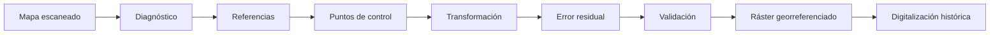
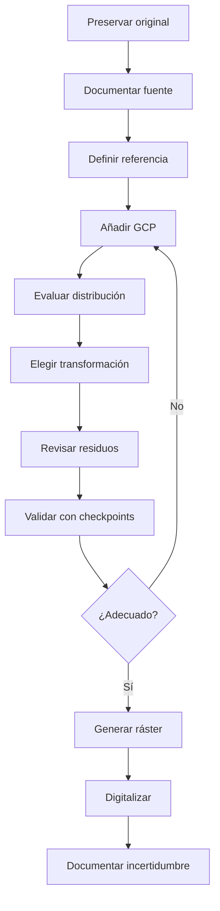
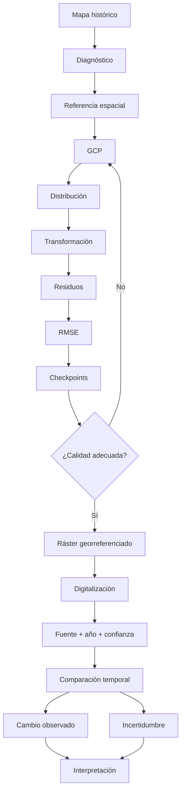

# 3.10 Recuperar información de mapas históricos

<div class="grid cards" markdown>

-   :material-image-marker:{ .lg .middle } **Ubicar**

    ---

    Convertir una imagen sin coordenadas en:

    **un documento espacialmente referenciado.**

-   :material-crosshairs-gps:{ .lg .middle } **Controlar**

    ---

    Utilizar:

    **puntos de control confiables.**

-   :material-transit-connection-variant:{ .lg .middle } **Transformar**

    ---

    Elegir un modelo que represente:

    **desplazamiento, giro, escala o deformación.**

-   :material-chart-scatter-plot:{ .lg .middle } **Evaluar**

    ---

    Interpretar:

    **residuos, error y distribución de puntos.**

-   :material-check-decagram:{ .lg .middle } **Validar**

    ---

    Comparar el resultado con:

    **referencias independientes.**

-   :material-vector-polyline-edit:{ .lg .middle } **Recuperar**

    ---

    Digitalizar información histórica después de:

    **demostrar que la georreferenciación es adecuada.**

</div>

[Comenzar](#1-el-problema-un-mapa-con-informacion-pero-sin-posicion){ .md-button .md-button--primary }
[Ir al laboratorio](#laboratorio-guiado-georreferenciar-un-mapa-historico){ .md-button }

---

## La misión de esta lección

Podemos tener un mapa antiguo en:

```text
JPG
PNG
TIFF
PDF escaneado
```

que muestra:

```text
calles
ríos
barrios
parcelas
equipamientos
límites
toponimia
```

pero al cargarlo en QGIS:

```text
no aparece donde corresponde
```

o directamente:

```text
no tiene coordenadas utilizables
```

La pregunta central será:

> **¿Cómo podemos recuperar su información espacial sin asumir que el mapa histórico es geométricamente perfecto?**

### Lo que construiremos



---

## Mapa de aprendizaje

<div class="grid cards" markdown>

-   :material-map-search:{ .lg .middle } **1 · Diagnosticar**

    ---

    Identificar qué sabemos y qué desconocemos del mapa.

-   :material-crosshairs-gps:{ .lg .middle } **2 · Puntos de control**

    ---

    Seleccionar referencias estables y bien distribuidas.

-   :material-vector-line:{ .lg .middle } **3 · Transformación**

    ---

    Elegir entre modelos simples y deformables.

-   :material-chart-scatter-plot:{ .lg .middle } **4 · Residuales**

    ---

    Interpretar error y calidad local.

-   :material-ruler-square:{ .lg .middle } **5 · Remuestreo**

    ---

    Crear correctamente el nuevo ráster.

-   :material-check-decagram:{ .lg .middle } **6 · Validación**

    ---

    Comprobar el resultado con referencias no utilizadas.

-   :material-vector-polyline-edit:{ .lg .middle } **7 · Recuperación**

    ---

    Digitalizar información histórica con trazabilidad.

</div>

---

## Antes de empezar

!!! info "Necesitarás"

    - QGIS 3.44.
    - Un mapa escaneado o imagen cartográfica.
    - Una fuente de referencia actual o conocida.
    - Un SRC de trabajo definido.
    - Haber completado:
        - 2.6 Resolver problemas de coordenadas;
        - 3.2 Digitalizar y editar con precisión;
        - 3.8 Preparar y combinar datos ráster.

!!! example "Caso guía"

    Trabajaremos conceptualmente con:

    ```text
    plano_historico_1985.tif
    ```

    y una referencia moderna:

    ```text
    calles_actuales
    ```

    o:

    ```text
    ortofoto_actual
    ```

!!! danger "Idea fundamental"

    El objetivo no es:

    ```text
    hacer que el mapa se vea bonito encima de otro
    ```

    sino:

    ```text
    construir una transformación
    cuya calidad pueda evaluarse
    ```

---

## 1. El problema: un mapa con información pero sin posición

Un mapa histórico puede contener información muy valiosa.

Pero puede tener:

```text
sin SRC
sin coordenadas
coordenadas antiguas
deformación del papel
distorsión del escaneo
escala desconocida
rotación
recortes
```

### Esto significa

La imagen:

```text
no puede utilizarse directamente
```

para:

```text
medir
comparar
digitalizar
analizar
```

confiablemente.

---

## 2. Qué significa georreferenciar

Georreferenciar significa establecer una relación entre:

```text
coordenadas de la imagen
```

y:

```text
coordenadas reales
```

### Imagen

```text
columna
fila
```

### Territorio

```text
X
Y
```

Queremos construir:

```text
(columna, fila)
→
(X, Y)
```

---

## 3. Georreferenciar no es asignar un SRC

Esto es crucial.

=== "Asignar SRC"

    Indica:

    ```text
    cómo interpretar coordenadas que ya existen
    ```

=== "Georreferenciar"

    Construye una relación espacial porque:

    ```text
    la imagen no conoce su posición correctamente
    ```

!!! danger "Asignar EPSG no georreferencia una imagen"

---

## 4. Qué puede deformar un mapa histórico

<div class="grid cards" markdown>

-   :material-file-scan:{ .lg .middle } **Escaneo**

    ---

    Inclinación, recorte o deformación digital.

-   :material-paper-roll:{ .lg .middle } **Papel**

    ---

    Estiramiento, pliegues o deformación física.

-   :material-map-legend:{ .lg .middle } **Cartografía original**

    ---

    Generalización o precisión limitada.

-   :material-printer:{ .lg .middle } **Reproducción**

    ---

    Fotocopias, ampliaciones o reducciones.

-   :material-earth:{ .lg .middle } **Sistema histórico**

    ---

    Datum, proyección o referencia desconocida.

-   :material-calendar-clock:{ .lg .middle } **Cambio territorial**

    ---

    Algunas entidades simplemente:

    **ya no están en el mismo lugar.**

</div>

!!! important "No todo desacople es error de georreferenciación"

    Puede haber:

    ```text
    cambio real en el territorio
    ```

---

## 5. Diagnóstico previo

Antes de abrir el georreferenciador pregunta:

```text
¿de qué año es?
¿quién lo produjo?
¿qué escala tiene?
¿aparece una grilla?
¿aparecen coordenadas?
¿qué proyección indica?
¿qué elementos siguen existiendo?
¿qué elementos pueden haber cambiado?
```

### Construye una ficha

| Elemento | Información |
|---|---|
| Título | |
| Año | |
| Fuente | |
| Escala | |
| SRC indicado | |
| Datum | |
| Coordenadas visibles | |
| Estado físico | |
| Observaciones | |

---

## 6. Abrir el Georreferenciador

En QGIS abre:

```text
Capa
→
Georreferenciador
```

o la opción disponible en tu instalación.

Carga:

```text
plano_historico_1985.tif
```

!!! captura "Captura pendiente · 3.10-01"

    - **Tipo:** PNG anotado
    - **Archivo:** `assets/images/modulo-03/3-10/3-10-01-georreferenciador.png`
    - **Qué mostrar:** interfaz completa.
    - **Resaltar:**
        1. imagen;
        2. barra de puntos;
        3. tabla GCP;
        4. transformación;
        5. error/residual;
        6. ejecución.
    - **Objetivo didáctico:** reconocer la interfaz antes de añadir puntos.

---

## Checkpoint 1

Deberías poder explicar:

- [ ] qué significa georreferenciar;
- [ ] diferencia entre asignar SRC y georreferenciar;
- [ ] por qué un mapa histórico puede estar deformado;
- [ ] por qué un desacople puede reflejar cambio real;
- [ ] qué información debemos investigar antes de comenzar.

---

## 7. Puntos de control

Un punto de control relaciona:

```text
un lugar identificable en la imagen
```

con:

```text
su posición conocida en una referencia
```

Conceptualmente:

```text
Imagen histórica:
esquina de edificio
↓
Referencia:
misma esquina
```

---

## 8. Qué hace un buen punto de control

Un buen GCP debe ser:

```text
identificable
estable
preciso
no ambiguo
```

Ejemplos potencialmente útiles:

```text
intersecciones de calles estables
esquinas de estructuras permanentes
puentes
hitos
cruces de caminos
elementos de una grilla
```

---

## 9. Qué evitar

Evita puntos sobre:

```text
copas de árboles
ríos variables
bordes difusos
edificios recientes
curvas de carretera generalizadas
texto del mapa
símbolos grandes
```

!!! warning "No todos los objetos visibles son buenos controles"

---

## 10. Cambios temporales

Un edificio visible en:

```text
2026
```

puede no haber existido en:

```text
1985
```

Una carretera puede haber sido:

```text
rectificada
ensanchada
desplazada
```

Un río puede cambiar:

```text
su cauce
```

!!! success "El mejor punto es también temporalmente estable"

---

## 11. Obtener coordenadas desde el mapa

Podemos introducir coordenadas de dos formas:

=== "Manual"

    Si el mapa contiene:

    ```text
    grilla
    coordenadas impresas
    ```

    podemos introducir:

    ```text
    X
    Y
    ```

=== "Desde el lienzo"

    Podemos seleccionar el punto correspondiente en:

    ```text
    una capa correctamente georreferenciada
    ```

    dentro del mapa principal de QGIS.

---

## 12. Añadir un punto de control

Proceso:

```text
1. identificar punto en mapa histórico
2. marcarlo
3. definir coordenada destino
4. guardar
```

!!! captura "Captura pendiente · 3.10-02"

    - **Tipo:** GIF
    - **Archivo:** `assets/images/modulo-03/3-10/3-10-02-agregar-gcp.gif`
    - **Qué mostrar:**
        1. acercarse a una intersección;
        2. añadir punto;
        3. capturar desde lienzo;
        4. confirmar;
        5. observar tabla.
    - **Objetivo didáctico:** mostrar el procedimiento completo de un GCP.

---

## 13. Cantidad de puntos

El número mínimo depende del:

```text
modelo de transformación
```

Pero:

```text
mínimo matemático
```

no significa:

```text
cantidad recomendable
```

### Una práctica más sólida

Utilizar:

```text
más puntos que el mínimo
```

para poder:

```text
evaluar residuos
detectar errores
mejorar distribución
```

---

## 14. Distribución de los puntos

Este patrón es pobre:

```text
● ● ● ●


        mapa completo
```

si todos los puntos están concentrados en una esquina.

Mejor:

```text
●                 ●


         ●


●                 ●
```

!!! important "La distribución espacial importa tanto como la cantidad"

---

## 15. Evitar puntos casi alineados

Si todos los puntos se encuentran sobre:

```text
una misma carretera
```

el modelo puede controlar bien esa franja y peor:

```text
el resto del mapa
```

### Busca cobertura

```text
norte
sur
este
oeste
centro
```

cuando sea posible.

---

## 16. Mapa de distribución de GCP

!!! captura "Captura pendiente · 3.10-03"

    - **Tipo:** PNG comparativo
    - **Archivo:** `assets/images/modulo-03/3-10/3-10-03-distribucion-gcp.png`
    - **Qué mostrar:**
        1. distribución deficiente;
        2. distribución adecuada.
    - **Objetivo didáctico:** explicar que más puntos no siempre significa mejor si están mal distribuidos.

---

## Checkpoint 2

Deberías poder explicar:

- [ ] qué es un GCP;
- [ ] qué características debe tener;
- [ ] por qué la estabilidad temporal es importante;
- [ ] por qué no debemos concentrar puntos;
- [ ] por qué el mínimo matemático no es suficiente criterio.

---

## 17. Transformaciones

Los GCP permiten estimar una función que transforma:

```text
imagen
```

hacia:

```text
coordenadas reales
```

Diferentes modelos permiten diferentes grados de deformación.

### Idea general

```text
modelo más simple
→
menos flexibilidad

modelo más complejo
→
más capacidad de deformación
```

!!! warning "Más flexible no significa automáticamente mejor"

---

## 18. Transformación lineal / Helmert

Un modelo simple puede corregir principalmente:

```text
traslación
rotación
escala
```

Puede ser apropiado cuando el documento está:

```text
bien conservado
poco deformado
```

---

## 19. Transformación afín / polinomial de primer orden

Puede representar:

```text
traslación
rotación
escala diferenciada
sesgo
```

Es una opción frecuente para documentos que necesitan:

```text
ajuste geométrico global
```

sin deformación excesiva.

---

## 20. Polinomios de mayor orden

Permiten representar:

```text
deformaciones más complejas
```

Pero requieren:

```text
más puntos
buena distribución
mayor precaución
```

### Riesgo

Podemos ajustar muy bien los puntos de control y:

```text
deformar zonas entre ellos
```

o fuera de ellos.

!!! danger "Un error residual menor no garantiza una mejor geometría"

---

## 21. Thin Plate Spline

TPS permite una transformación flexible.

Puede ser útil para:

```text
mapas deformados
documentos antiguos
ajuste local
```

### Pero

puede introducir:

```text
deformaciones locales importantes
```

si los puntos:

```text
son incorrectos
están mal distribuidos
```

---

## 22. Proyectiva

Una transformación proyectiva puede ser útil cuando la imagen presenta:

```text
perspectiva
```

como una fotografía oblicua o reproducción no paralela.

### No debe utilizarse

solamente porque:

```text
produce un error bajo
```

---

## 23. Elegir modelo según el problema

| Situación | Modelo a considerar |
|---|---|
| Giro y escala simples | Helmert |
| Deformación global moderada | Polinomial 1 |
| Deformación compleja | Polinomiales superiores / TPS |
| Perspectiva | Proyectiva |

!!! info "La tabla es orientativa"

    La elección final debe considerar:

    ```text
    fuente
    distribución de GCP
    deformación
    propósito
    validación
    ```

---

## 24. Configuración de transformación

!!! captura "Captura pendiente · 3.10-04"

    - **Tipo:** PNG anotado
    - **Archivo:** `assets/images/modulo-03/3-10/3-10-04-configuracion-transformacion.png`
    - **Qué mostrar:** configuración del Georreferenciador.
    - **Resaltar:**
        1. tipo de transformación;
        2. remuestreo;
        3. SRC destino;
        4. archivo de salida;
        5. NoData.
    - **Objetivo didáctico:** mostrar que la transformación no es el único parámetro.

---

## 25. El SRC destino

El resultado debe utilizar:

```text
un SRC definido
```

coherente con:

```text
la referencia utilizada
```

Si tus puntos provienen de:

```text
una capa UTM
```

y las coordenadas están en ese sistema,

debes comprender:

```text
en qué SRC estás trabajando
```

!!! danger "Coordenadas correctas en el SRC equivocado siguen produciendo un resultado incorrecto"

---

## 26. Remuestreo durante la georreferenciación

La transformación crea una nueva malla.

Debemos elegir un método de remuestreo.

### Mapa escaneado

Normalmente contiene:

```text
líneas
texto
símbolos
colores categóricos
```

Métodos simples pueden preservar mejor:

```text
bordes
```

mientras métodos interpolados pueden suavizar.

### Pero

si la imagen funciona principalmente como:

```text
referencia visual
```

la decisión puede priorizar:

```text
legibilidad
```

---

## 27. Vecino más cercano

Conserva valores originales de píxel.

Puede mantener mejor:

```text
texto
líneas duras
colores discretos
```

pero producir:

```text
aspecto pixelado
```

---

## 28. Bilineal o cúbico

Pueden producir una imagen:

```text
más suave
```

pero alteran:

```text
valores originales
```

y pueden difuminar:

```text
líneas finas
texto
```

!!! success "Para mapas escaneados, el objetivo es preservar legibilidad y geometría útil"

---

## Checkpoint 3

Deberías poder explicar:

- [ ] por qué existen distintos modelos;
- [ ] qué ventaja y riesgo tiene un modelo flexible;
- [ ] por qué no elegir solo por error residual;
- [ ] qué papel cumple el SRC destino;
- [ ] por qué la georreferenciación implica remuestreo.

---

## 29. Error residual

Después de añadir GCP aparece para cada punto una diferencia entre:

```text
posición esperada
```

y:

```text
posición estimada por la transformación
```

Ese valor se denomina:

```text
residual
```

### Conceptualmente

```text
punto observado
↔
punto calculado
```

---

## 30. Un residual grande

Puede indicar:

```text
punto mal identificado
coordenada equivocada
elemento que cambió
mala distribución
modelo inadecuado
```

### Pero no sabemos la causa automáticamente

Debemos:

```text
investigar el punto
```

---

## 31. Error total / RMSE

El sistema puede resumir los residuos mediante una medida global.

Conceptualmente:

```text
RMSE
```

indica la magnitud promedio del ajuste bajo una formulación cuadrática.

### Pero

Un valor global puede ocultar:

```text
errores locales
```

---

## 32. Error pequeño no significa calidad absoluta

Supongamos:

```text
RMSE = 1.5 m
```

¿Es bueno?

Depende de:

```text
escala del mapa
precisión de la referencia
resolución
propósito
calidad de GCP
```

### Para un plano 1:500

puede ser:

```text
muy grande
```

### Para un mapa regional 1:250 000

puede ser:

```text
irrelevante
```

!!! important "El error debe evaluarse respecto del propósito"

---

## 33. Escala histórica y precisión esperable

Un mapa impreso a:

```text
1:50 000
```

no debería interpretarse como si tuviera:

```text
precisión centimétrica
```

### La escala original limita

```text
detalle
generalización
precisión cartográfica
```

---

## 34. Revisar residuos punto por punto

!!! captura "Captura pendiente · 3.10-05"

    - **Tipo:** GIF
    - **Archivo:** `assets/images/modulo-03/3-10/3-10-05-revisar-residuos.gif`
    - **Qué mostrar:**
        1. tabla de GCP;
        2. identificar punto con residual alto;
        3. localizarlo;
        4. corregir o eliminar;
        5. recalcular.
    - **Objetivo didáctico:** mostrar que el control de error es iterativo.

---

## 35. No eliminar puntos solo porque tienen error alto

Un punto con:

```text
residual alto
```

puede estar revelando:

```text
deformación real del documento
```

Si lo eliminamos únicamente para:

```text
bajar RMSE
```

podemos:

```text
maquillar el indicador
```

!!! danger "Optimizar la métrica no es lo mismo que mejorar el modelo"

---

## 36. Estrategia de revisión

Para un punto sospechoso pregunta:

```text
¿identifiqué correctamente el objeto?
¿la referencia corresponde al mismo año?
¿la coordenada está bien?
¿es estable?
¿está aislado?
¿el mapa está deformado allí?
```

---

## 37. Puntos de control y puntos de validación

Una práctica metodológicamente más fuerte es separar:

```text
puntos usados para ajustar
```

de:

```text
puntos usados para comprobar
```

### GCP

Participan en:

```text
la transformación
```

### Checkpoints

No participan.

Sirven para:

```text
validación independiente
```

!!! success "No validar únicamente con los mismos puntos utilizados para ajustar"

---

## 38. Por qué necesitamos validación independiente

Si un modelo se ajusta perfectamente a sus GCP:

```text
eso demuestra ajuste a esos puntos
```

No necesariamente:

```text
calidad en todo el mapa
```

### Queremos comprobar

```text
zonas intermedias
zonas periféricas
lugares no utilizados
```

---

## 39. Generar el ráster georreferenciado

Cuando:

```text
puntos
modelo
SRC
remuestreo
residuos
```

han sido revisados,

ejecutamos:

```text
Iniciar georreferenciación
```

!!! captura "Captura pendiente · 3.10-06"

    - **Tipo:** GIF
    - **Archivo:** `assets/images/modulo-03/3-10/3-10-06-generar-raster.gif`
    - **Qué mostrar:**
        1. GCP completos;
        2. ejecutar;
        3. cargar resultado;
        4. superponer referencia.
    - **Objetivo didáctico:** mostrar la creación del producto final.

---

## 40. Validación visual

Superpone:

```text
mapa histórico
```

con:

```text
ortofoto
calles
ríos
límites
```

Utiliza:

```text
transparencia
```

para comparar.

### Busca

```text
coincidencias
desplazamientos
giros
deformaciones locales
```

---

## 41. Swipe / comparación visual

Si dispones de herramientas de comparación visual, puedes examinar:

```text
antes / después
histórico / actual
```

Esto es especialmente útil para:

```text
cambios territoriales
```

pero recuerda:

```text
cambio real
≠
error geométrico
```

---

### Comparar resultado

!!! captura "Captura pendiente · 3.10-07"

    - **Tipo:** GIF
    - **Archivo:** `assets/images/modulo-03/3-10/3-10-07-validacion-visual.gif`
    - **Qué mostrar:**
        1. ráster georreferenciado;
        2. referencia;
        3. transparencia;
        4. inspección en varios sectores.
    - **Objetivo didáctico:** validar más allá del RMSE.

---

## 42. Validación cuantitativa

Para checkpoints independientes podemos medir:

```text
distancia entre posición histórica transformada
y posición de referencia
```

### Matriz

| Punto | Error X | Error Y | Distancia | Estado |
|---|---:|---:|---:|---|
| V01 | | | | |
| V02 | | | | |
| V03 | | | | |

### Así obtenemos

```text
evidencia independiente
```

del ajuste.

---

## 43. Error espacialmente variable

Podemos descubrir:

```text
centro del mapa = buen ajuste
bordes = peor ajuste
```

o lo contrario.

Por tanto:

```text
un único RMSE
```

no describe necesariamente:

```text
la distribución espacial del error
```

!!! important "La calidad también tiene geografía"

---

## 44. Crear un mapa de calidad

Podemos clasificar sectores como:

```text
AJUSTE_ALTO
AJUSTE_MEDIO
AJUSTE_BAJO
```

si tenemos suficientes evidencias.

### Esto es especialmente útil cuando

```text
solo parte del documento
```

será utilizada para análisis detallado.

---

## Checkpoint 4

Deberías poder explicar:

- [ ] qué es un residual;
- [ ] qué significa RMSE conceptualmente;
- [ ] por qué un valor pequeño no garantiza calidad;
- [ ] por qué no eliminar puntos solo para reducir error;
- [ ] diferencia entre GCP y punto de validación;
- [ ] por qué el error puede variar espacialmente.

---

## 45. Georreferenciar no convierte el mapa en verdad actual

Una vez georreferenciado, el documento sigue siendo:

```text
un mapa de su época
```

Puede contener:

```text
errores originales
generalización
nombres antiguos
límites históricos
elementos desaparecidos
```

!!! quote "Georreferenciar corrige posición, no corrige historia"

---

## 46. Recuperar información vectorial

Una vez validado el mapa podemos crear capas como:

```text
calles_1985
rios_1985
limites_1985
equipamientos_1985
```

mediante:

```text
digitalización
```

### Conservamos

```text
el ráster histórico
```

como:

```text
fuente
```

---

## 47. Crear una capa histórica

Supongamos que queremos recuperar:

```text
límite urbano de 1985
```

Crea:

```text
limite_urbano_1985
```

con campos:

```text
id
fuente
anio
metodo
confianza
observacion
```

!!! success "La capa derivada debe conservar trazabilidad"

---

## 48. Nivel de confianza

No todas las entidades históricas se leen con la misma claridad.

Podemos utilizar:

```text
ALTA
MEDIA
BAJA
```

según:

```text
claridad gráfica
calidad del ajuste
ambigüedad
```

### Pero define los criterios

No asignes:

```text
confianza
```

solo por intuición.

---

## 49. Ejemplo de criterio de confianza

| Nivel | Criterio |
|---|---|
| ALTA | Límite claramente visible y ajuste local consistente |
| MEDIA | Límite visible pero parcialmente ambiguo |
| BAJA | Interpretación incierta o ajuste local deficiente |

---

## 50. Digitalizar sobre el histórico

Aplica lo aprendido en:

```text
3.2 Digitalizar y editar con precisión
```

Utiliza:

```text
snapping
vértices
trazado
edición controlada
```

cuando corresponda.

!!! captura "Captura pendiente · 3.10-08"

    - **Tipo:** GIF
    - **Archivo:** `assets/images/modulo-03/3-10/3-10-08-digitalizar-historico.gif`
    - **Qué mostrar:**
        1. mapa histórico;
        2. capa nueva;
        3. digitalización de un límite;
        4. formulario con fuente/año.
    - **Objetivo didáctico:** conectar georreferenciación con recuperación vectorial.

---

## 51. No sobre-digitalizar

Si el mapa original es:

```text
1:50 000
```

no tiene sentido crear:

```text
miles de vértices
```

intentando seguir cada píxel.

### La precisión de la digitalización

debe ser coherente con:

```text
la escala y calidad de la fuente
```

!!! warning "Más vértices no crean más precisión histórica"

---

## 52. Comparación temporal

Ahora podemos comparar:

```text
límite_1985
```

con:

```text
límite_2026
```

### Preguntas posibles

```text
¿cuánto creció el área urbana?
¿qué zonas cambiaron?
¿qué vías existían?
¿qué sectores aparecieron después?
```

---

## 53. Cambio aparente frente a cambio real

Una diferencia entre:

```text
1985
```

y:

```text
2026
```

puede deberse a:

```text
cambio territorial real
```

pero también a:

```text
error de georreferenciación
diferente escala
diferente criterio cartográfico
generalización
```

!!! danger "No interpretar automáticamente toda diferencia geométrica como cambio histórico"

---

## 54. Zona de incertidumbre

Si sabemos que el ajuste tiene un error aproximado:

```text
± 10 m
```

una diferencia de:

```text
3 m
```

entre dos límites podría no ser significativa.

### Podemos pensar en

```text
tolerancia espacial
```

al interpretar cambios.

---

## 55. Documentar la incertidumbre

En un análisis histórico registra:

```text
RMSE
error de checkpoints
escala original
resolución del escaneo
modelo de transformación
calidad local
```

### Esto permite distinguir

```text
cambio observado
```

de:

```text
confianza en el cambio
```

---

## 56. Preservar originales

No sobrescribas:

```text
mapa_original.tif
```

Guarda:

```text
datos/originales/mapa_historico_1985.tif
```

y genera:

```text
datos/trabajo/mapa_historico_1985_georef.tif
```

!!! success "El original debe permanecer intacto"

---

## 57. Nombres de salida

Evita:

```text
mapa_final.tif
mapa_final2.tif
mapa_bueno.tif
```

Prefiere:

```text
plano_1985_georef_affine_v01.tif
plano_1985_georef_tps_v02.tif
```

si necesitas comparar transformaciones.

---

## 58. Guardar puntos de control

Conserva también:

```text
GCP
```

y la configuración de transformación.

Esto permite:

```text
repetir
auditar
mejorar
```

la georreferenciación.

---

## 59. Ficha de georreferenciación

| Elemento | Valor |
|---|---|
| Archivo original | |
| Año | |
| Fuente | |
| Escala | |
| Referencia usada | |
| SRC destino | |
| Nº GCP | |
| Transformación | |
| Remuestreo | |
| RMSE | |
| Nº checkpoints | |
| Error validación | |
| Observaciones | |

!!! important "La ficha es parte del producto"

---

## 60. Flujo reproducible



---

## Checkpoint 5

Antes del laboratorio deberías poder:

- [ ] preservar el original;
- [ ] construir una ficha del mapa;
- [ ] seleccionar GCP estables;
- [ ] distribuir puntos adecuadamente;
- [ ] elegir y justificar una transformación;
- [ ] interpretar residuos;
- [ ] utilizar checkpoints independientes;
- [ ] documentar incertidumbre;
- [ ] digitalizar con trazabilidad.

---

## Laboratorio guiado: georreferenciar un mapa histórico

!!! example "Escenario"

    Dispones de:

    ```text
    plano_historico_1985.tif
    ```

    y una referencia actual.

    Debes producir:

    ```text
    plano_historico_1985_georef.tif
    ```

    y recuperar al menos una capa vectorial histórica.

### Fase 1 · Preservar original

Ubica:

```text
datos/originales/plano_historico_1985.tif
```

No lo modifiques.

### Fase 2 · Crear ficha

Documenta:

```text
título
año
fuente
escala
SRC indicado
estado
```

### Fase 3 · Definir referencia

Selecciona:

```text
ortofoto
calles
parcelas
grilla
```

según disponibilidad.

### Fase 4 · Definir SRC destino

Registra:

```text
EPSG:
unidad:
justificación:
```

### Fase 5 · Identificar candidatos GCP

Marca inicialmente:

```text
10–15 lugares potenciales
```

sin asumir que todos serán utilizados.

### Fase 6 · Evaluar estabilidad

Para cada candidato registra:

| Punto | Elemento | Estable | Ambiguo | Usar |
|---|---|---|---|---|
| | | | | |

### Fase 7 · Añadir primeros GCP

Distribúyelos por:

```text
centro
esquinas
laterales
```

### Fase 8 · Probar transformación simple

Utiliza un modelo apropiado.

Registra:

```text
RMSE:
```

### Fase 9 · Revisar residuos

Ordena o identifica:

```text
los mayores errores
```

### Fase 10 · Investigar

No elimines puntos automáticamente.

Determina:

```text
causa probable
```

### Fase 11 · Mejorar distribución

Añade o reemplaza GCP cuando sea necesario.

### Fase 12 · Separar checkpoints

Reserva:

```text
3–5 puntos
```

que no participen en el ajuste.

### Fase 13 · Comparar modelos

Prueba al menos dos transformaciones cuando sea metodológicamente razonable.

Completa:

| Modelo | Nº GCP | RMSE | Error checkpoints | Observación |
|---|---:|---:|---:|---|
| Modelo A | | | | |
| Modelo B | | | | |

### Fase 14 · Elegir modelo

No elijas solamente:

```text
menor RMSE
```

Considera:

```text
geometría
checkpoints
deformación visual
propósito
```

### Fase 15 · Elegir remuestreo

Documenta:

```text
método:
motivo:
```

### Fase 16 · Generar resultado

Guarda:

```text
datos/trabajo/plano_historico_1985_georef.tif
```

### Fase 17 · Validar visualmente

Revisa al menos:

```text
centro
norte
sur
este
oeste
```

### Fase 18 · Medir checkpoints

Completa:

| Checkpoint | Error |
|---|---:|
| V01 | |
| V02 | |
| V03 | |

### Fase 19 · Crear capa histórica

Por ejemplo:

```text
limite_urbano_1985
```

### Fase 20 · Añadir trazabilidad

Incluye campos:

```text
fuente
anio
confianza
observacion
```

### Fase 21 · Digitalizar

Captura un elemento histórico.

### Fase 22 · Comparar con actualidad

Superpone:

```text
histórico
actual
```

### Fase 23 · Separar cambio e incertidumbre

Identifica:

```text
cambios claros
cambios dudosos
```

### Fase 24 · Completar ficha final

Incluye:

```text
modelo
RMSE
checkpoints
limitaciones
```

### Evidencia del laboratorio

!!! captura "Captura pendiente · 3.10-09"

    - **Tipo:** Imagen compuesta
    - **Archivo:** `assets/images/modulo-03/3-10/3-10-09-laboratorio.png`
    - **Qué mostrar:**
        1. mapa original;
        2. GCP;
        3. residuos;
        4. resultado georreferenciado;
        5. vector histórico digitalizado.
    - **Objetivo didáctico:** resumir el proceso completo.

---

## Mini-reto: ¿buen punto o mal punto?

=== "Caso A"

    Intersección de dos calles principales que existen en ambos periodos.

    ??? question "¿Buen GCP?"

        Potencialmente sí.

=== "Caso B"

    Copa de un árbol.

    ??? question "¿Buen GCP?"

        No.

=== "Caso C"

    Puente histórico claramente identificable y sin cambios visibles.

    ??? question "¿Buen GCP?"

        Potencialmente sí.

=== "Caso D"

    Curva de un río que cambió de cauce.

    ??? question "¿Buen GCP?"

        No necesariamente.

=== "Caso E"

    Etiqueta escrita sobre el mapa.

    ??? question "¿Buen GCP?"

        No.

---

## Reto práctico

!!! example "Reto 3.10 — Recuperar un límite histórico y evaluar su incertidumbre"

    ### Contexto

    Dispones de un mapa histórico escaneado que muestra:

    ```text
    límite urbano
    vías
    cursos de agua
    equipamientos
    ```

    Tu tarea es georreferenciarlo y recuperar:

    ```text
    un límite histórico
    ```

    sin presentar el resultado como si fuera geométricamente exacto.

    ### Misión 1 · Documentar la fuente

    Completa:

    ```text
    título:
    año:
    fuente:
    escala:
    resolución del escaneo:
    ```

    ### Misión 2 · Investigar SRC histórico

    Registra:

    ```text
    información disponible:
    incertidumbre:
    ```

    ### Misión 3 · Elegir referencia actual

    Justifica:

    ```text
    qué capa utilizarás
    ```

    ### Misión 4 · Crear lista de GCP

    Identifica al menos:

    ```text
    10 candidatos
    ```

    ### Misión 5 · Clasificar puntos

    | GCP | Tipo | Estabilidad | Calidad |
    |---|---|---|---|
    | | | | |

    ### Misión 6 · Distribuirlos

    Evita concentración espacial.

    ### Misión 7 · Probar modelo A

    Documenta:

    ```text
    modelo:
    RMSE:
    ```

    ### Misión 8 · Probar modelo B

    Documenta:

    ```text
    modelo:
    RMSE:
    ```

    ### Misión 9 · Crear checkpoints

    Reserva al menos:

    ```text
    3
    ```

    referencias independientes.

    ### Misión 10 · Comparar modelos

    | Indicador | Modelo A | Modelo B |
    |---|---:|---:|
    | RMSE | | |
    | Error V01 | | |
    | Error V02 | | |
    | Error V03 | | |
    | Deformación visible | | |

    ### Misión 11 · Elegir transformación

    Explica por qué.

    ### Misión 12 · Generar ráster

    Utiliza un nombre trazable.

    ### Misión 13 · Validar cinco sectores

    Registra:

    ```text
    centro
    norte
    sur
    este
    oeste
    ```

    ### Misión 14 · Digitalizar límite

    Crea:

    ```text
    limite_historico
    ```

    ### Misión 15 · Documentar confianza

    Asigna:

    ```text
    ALTA
    MEDIA
    BAJA
    ```

    mediante criterios explícitos.

    ### Misión 16 · Comparar con límite actual

    Identifica diferencias.

    ### Misión 17 · Crear zona de incertidumbre

    Define una tolerancia basada en:

    ```text
    error observado
    escala
    propósito
    ```

    ### Misión 18 · Clasificar diferencias

    | Sector | Diferencia | Confianza | Interpretación |
    |---|---:|---|---|
    | | | | |

    ### Misión 19 · Construir ficha metodológica

    | Elemento | Valor |
    |---|---|
    | SRC destino | |
    | Nº GCP | |
    | Modelo | |
    | Remuestreo | |
    | RMSE | |
    | Checkpoints | |
    | Error medio validación | |
    | Escala fuente | |
    | Limitaciones | |

    ### Misión 20 · Elaborar conclusión

    Redacta entre **200 y 280 palabras** explicando:

    - qué mapa utilizaste;
    - qué referencias seleccionaste;
    - qué puntos descartaste y por qué;
    - qué modelo de transformación elegiste;
    - qué RMSE obtuviste;
    - cómo se comportaron los checkpoints;
    - qué zonas muestran peor ajuste;
    - qué elemento histórico digitalizaste;
    - qué diferencias observaste respecto de la actualidad;
    - cuáles pueden considerarse cambios reales;
    - cuáles pueden deberse a incertidumbre cartográfica.

    ### Entregables

    - `reto_3-10_georreferenciacion.qgz`;
    - mapa original intacto;
    - mapa georreferenciado;
    - archivo/listado de GCP;
    - tabla de residuos;
    - tabla de checkpoints;
    - comparación de transformaciones;
    - capa histórica digitalizada;
    - atributo de confianza;
    - mapa comparativo histórico/actual;
    - ficha metodológica;
    - captura del Georreferenciador;
    - GIF de creación de GCP;
    - captura de residuos;
    - GIF de validación visual;
    - GIF de digitalización;
    - conclusión técnica.

---

## Criterios de evaluación

??? success "Ver rúbrica"

    | Criterio | Se cumple si... |
    |---|---|
    | Original | Se conserva intacto |
    | Fuente | Está documentada |
    | Escala | Se considera en la interpretación |
    | Referencia | Es adecuada |
    | SRC | Está claramente definido |
    | GCP | Son identificables y estables |
    | Distribución | Cubren correctamente el mapa |
    | Transformación | Se justifica |
    | Remuestreo | Se selecciona conscientemente |
    | Residuos | Se revisan individualmente |
    | RMSE | Se interpreta según propósito |
    | Checkpoints | Son independientes |
    | Validación | Incluye varias zonas |
    | Deformación | Se inspecciona visualmente |
    | Digitalización | Respeta la calidad de la fuente |
    | Trazabilidad | Conserva año y fuente |
    | Confianza | Está definida mediante criterios |
    | Cambio | Se diferencia de error cartográfico |
    | Incertidumbre | Está documentada |
    | Resultado | Puede reproducirse |

---

## Errores frecuentes

=== "Le asigné EPSG y ya quedó"

    Eso no georreferencia una imagen sin posición válida.

=== "Usé cuatro puntos porque era el mínimo"

    El mínimo matemático no garantiza buena calidad.

=== "Todos mis puntos están en el centro"

    La distribución es deficiente.

=== "Elegí TPS porque dio menor error"

    Evalúa también:

    ```text
    deformación
    checkpoints
    propósito
    ```

=== "Eliminé todos los puntos con error alto"

    Puedes estar ocultando una deformación real.

=== "RMSE bajo significa precisión alta"

    No necesariamente.

=== "Validé con los mismos GCP"

    Eso mide ajuste, no validación independiente.

=== "El mapa histórico no coincide con la ortofoto"

    Puede existir:

    ```text
    cambio territorial real
    ```

=== "Digitalicé cada píxel del límite"

    Puede ser una precisión falsa respecto de la escala original.

=== "La diferencia histórica es de 2 m"

    Si el error de georreferenciación es 10 m:

    ```text
    esa diferencia puede no ser significativa
    ```

---

## Desafío de 5 minutos

!!! challenge "Diagnostica"

    **1.** Ocho GCP están concentrados en la esquina superior izquierda.

    ¿Problema?

    **2.** Un punto tiene residual muy alto.

    ¿Lo eliminas inmediatamente?

    **3.** El modelo complejo tiene RMSE menor que el simple.

    ¿Es automáticamente mejor?

    **4.** Los checkpoints independientes presentan errores altos.

    ¿Confiarías en la transformación?

    **5.** Un límite de 1980 está 5 m desplazado respecto del actual, pero el error esperado es 15 m.

    ¿Concluirías que cambió?

??? success "Solución"

    **1**

    Sí.

    La distribución espacial es deficiente.

    **2**

    No.

    Primero se investiga.

    **3**

    No.

    Deben evaluarse deformación y validación.

    **4**

    No sin revisar nuevamente el modelo.

    **5**

    No de forma concluyente.

    La diferencia está dentro de la incertidumbre esperable.

---

## Ideas clave

<div class="grid cards" markdown>

-   :material-crosshairs-gps:{ .lg .middle } **Control**

    ---

    La calidad comienza con puntos fiables.

-   :material-transit-connection-variant:{ .lg .middle } **Modelo**

    ---

    La transformación debe corresponder al tipo de deformación.

-   :material-chart-scatter-plot:{ .lg .middle } **Residual**

    ---

    El error debe interpretarse, no solo minimizarse.

-   :material-check-decagram:{ .lg .middle } **Validación**

    ---

    Los checkpoints independientes son fundamentales.

-   :material-calendar-clock:{ .lg .middle } **Historia**

    ---

    Diferencia geométrica y cambio territorial no son lo mismo.

-   :material-file-document-check:{ .lg .middle } **Trazabilidad**

    ---

    Fuente, año, modelo y error deben conservarse.

</div>

!!! success "Para recordar"

    - Georreferenciar establece una relación entre imagen y territorio.
    - Asignar un SRC no sustituye la georreferenciación.
    - Un mapa histórico puede contener múltiples fuentes de deformación.
    - Los GCP deben ser identificables, estables y no ambiguos.
    - La estabilidad temporal es crucial.
    - La distribución espacial de GCP importa tanto como su cantidad.
    - El mínimo matemático no es una recomendación de calidad.
    - Modelos más flexibles pueden deformar más.
    - Menor RMSE no garantiza mejor resultado.
    - La georreferenciación implica remuestreo.
    - Los residuos deben revisarse individualmente.
    - No debemos eliminar puntos solo para reducir error.
    - La escala original limita la precisión esperable.
    - Los puntos de validación no deberían participar en el ajuste.
    - El error puede variar espacialmente.
    - El mapa georreferenciado sigue siendo un documento histórico.
    - Digitalizar no aumenta la precisión original.
    - La trazabilidad debe acompañar a cada entidad histórica.
    - Diferencia geométrica no equivale automáticamente a cambio real.
    - La incertidumbre debe formar parte de la interpretación histórica.
    - El original debe conservarse intacto.
    - La configuración y los GCP deben preservarse para reproducibilidad.

---

## Autoevaluación

??? question "1. ¿Qué significa georreferenciar?"

    Establecer la relación entre coordenadas de una imagen y coordenadas reales.

??? question "2. ¿Asignar SRC es lo mismo?"

    No.

??? question "3. ¿Qué es un GCP?"

    Un punto cuya posición es identificable tanto en la imagen como en una referencia espacial.

??? question "4. ¿Qué caracteriza a un buen GCP?"

    Claridad, estabilidad, precisión y ausencia de ambigüedad.

??? question "5. ¿Por qué importa el año?"

    Porque las entidades utilizadas como referencia pueden haber cambiado.

??? question "6. ¿Es suficiente utilizar el mínimo de puntos?"

    No necesariamente.

??? question "7. ¿Por qué distribuir puntos?"

    Para controlar la transformación sobre toda la extensión.

??? question "8. ¿Qué hace una transformación?"

    Estima cómo convertir posiciones de la imagen a posiciones espaciales.

??? question "9. ¿Un modelo más complejo es siempre mejor?"

    No.

??? question "10. ¿Qué es un residual?"

    La diferencia entre una posición de control y la posición predicha por el modelo.

??? question "11. ¿Qué resume RMSE?"

    La magnitud global del ajuste según una medida cuadrática.

??? question "12. ¿RMSE bajo garantiza exactitud?"

    No.

??? question "13. ¿Por qué?"

    Porque depende de los GCP, modelo, escala, referencia y distribución espacial.

??? question "14. ¿Qué es un checkpoint?"

    Un punto de validación que no participa en la transformación.

??? question "15. ¿Por qué utilizar checkpoints?"

    Para medir la calidad de manera independiente.

??? question "16. ¿Qué ocurre si los checkpoints fallan?"

    La transformación debe revisarse aunque los GCP tengan bajo error.

??? question "17. ¿Qué hace el remuestreo?"

    Asigna valores a los píxeles de la nueva malla transformada.

??? question "18. ¿Georreferenciar corrige errores históricos?"

    No.

??? question "19. ¿Podemos digitalizar después?"

    Sí, una vez validada la georreferenciación.

??? question "20. ¿Más vértices significan más precisión histórica?"

    No.

??? question "21. ¿Toda diferencia entre fechas representa cambio real?"

    No.

??? question "22. ¿Por qué conservar el original?"

    Para mantener la fuente intacta y permitir auditoría.

??? question "23. ¿Qué debe documentarse?"

    Fuente, año, escala, referencia, SRC, GCP, transformación, remuestreo, error y limitaciones.

??? question "24. ¿Cuál es la secuencia principal?"

    ```text
    documentar
    → controlar
    → transformar
    → evaluar
    → validar
    → digitalizar
    → interpretar
    ```

---

## Mapa conceptual



---

## Cierre


!!! quote "La idea que debe permanecer"

    La pregunta profesional no es:

    > **¿Cómo hago que el mapa antiguo coincida con el actual?**

    sino:

    > **¿Qué transformación representa razonablemente este documento, qué error conserva y qué cambios puedo interpretar sin confundir historia con incertidumbre cartográfica?**

---

## Siguiente lección

<div class="grid cards" markdown>

-   :material-map-clock:{ .lg .middle } **Lo que hicimos**

    ---

    Recuperamos información de:

    ```text
    mapas sin referencia espacial confiable
    ```

    mediante:

    ```text
    GCP
    transformación
    validación
    ```

-   :material-cog-sync:{ .lg .middle } **Lo que viene**

    ---

    En **3.11 Construir procedimientos reproducibles** dejaremos de pensar en:

    ```text
    ejecutar herramientas una por una
    ```

    y comenzaremos a organizar:

    ```text
    entradas
    procesos
    parámetros
    salidas
    ```

    dentro de flujos que puedan repetirse.

</div>

[Continuar con 3.11 →](11-procedimientos-reproducibles.md){ .md-button .md-button--primary }

---

## Referencias

- [QGIS 3.44 — Georreferenciador](https://docs.qgis.org/3.44/es/docs/user_manual/working_with_raster/georeferencer.html)  
  Documentación oficial sobre puntos de control, transformaciones, remuestreo y generación del ráster georreferenciado.

- [QGIS 3.44 — Sistemas de referencia de coordenadas](https://docs.qgis.org/3.44/es/docs/user_manual/working_with_projections/working_with_projections.html)  
  Fundamentos para interpretar y seleccionar correctamente el SRC destino.

- [QGIS 3.44 — Propiedades ráster](https://docs.qgis.org/3.44/es/docs/user_manual/working_with_raster/raster_properties.html)  
  Información sobre resolución, visualización, transparencia y propiedades del producto generado.

- [QGIS 3.44 — Digitalización vectorial](https://docs.qgis.org/3.44/es/docs/user_manual/working_with_vector/editing_geometry_attributes.html)  
  Herramientas para recuperar información vectorial después de la georreferenciación.

- [QGIS Training Manual](https://docs.qgis.org/3.44/es/docs/training_manual/)  
  Ejercicios oficiales relacionados con georreferenciación, edición y análisis espacial.

- [GDAL — Georeferencing and Warping](https://gdal.org/en/stable/programs/gdalwarp.html)  
  Referencia técnica sobre transformación y remuestreo de datos ráster.

- [Material for MkDocs — Reference](https://squidfunk.github.io/mkdocs-material/reference/)  
  Referencia general de componentes empleados en la documentación.

- [Material for MkDocs — Grids](https://squidfunk.github.io/mkdocs-material/reference/grids/)  
  Tarjetas y cuadrículas.

- [Material for MkDocs — Content tabs](https://squidfunk.github.io/mkdocs-material/reference/content-tabs/)  
  Comparaciones entre métodos y conceptos.

- [Material for MkDocs — Admonitions](https://squidfunk.github.io/mkdocs-material/reference/admonitions/)  
  Notas, advertencias, preguntas y retos.

- [Material for MkDocs — Diagrams](https://squidfunk.github.io/mkdocs-material/reference/diagrams/)  
  Diagramas Mermaid utilizados para representar el flujo de georreferenciación.