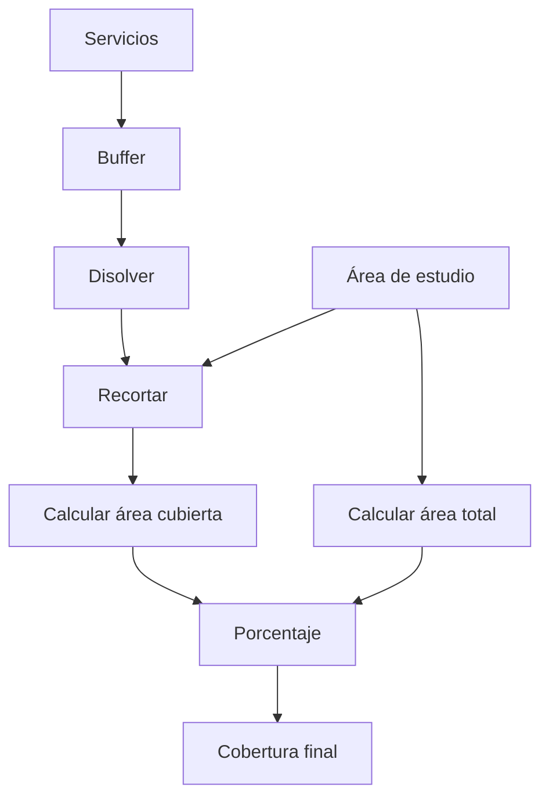
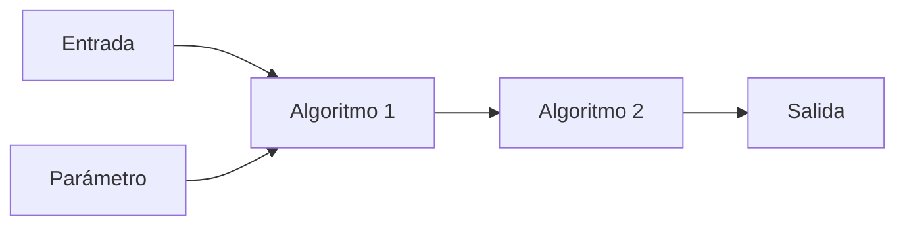
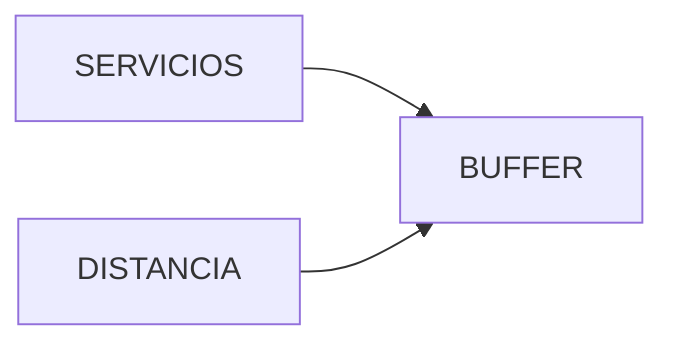
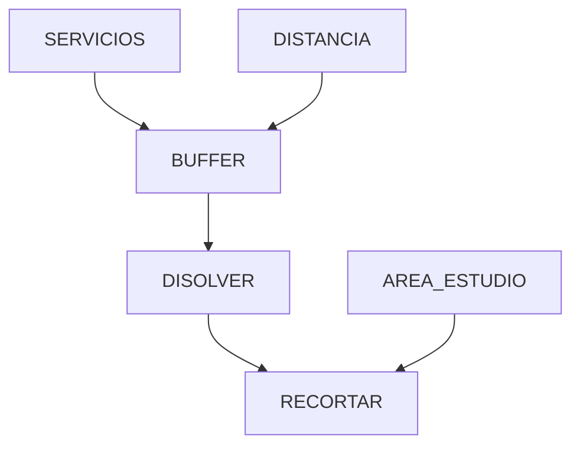
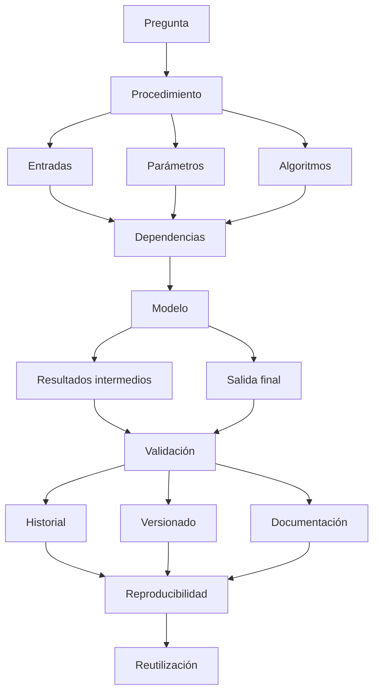

# 3.11 Construir procedimientos reproducibles

<div class="grid cards" markdown>

-   :material-source-branch:{ .lg .middle } **Estructurar**

    ---

    Convertir una secuencia manual en:

    **un flujo explícito de trabajo.**

-   :material-tune-variant:{ .lg .middle } **Parametrizar**

    ---

    Separar:

    **datos, decisiones y valores configurables.**

-   :material-cog-sync:{ .lg .middle } **Automatizar**

    ---

    Encadenar herramientas mediante:

    **el Modelador gráfico de QGIS.**

-   :material-history:{ .lg .middle } **Registrar**

    ---

    Recuperar:

    **algoritmos, parámetros y comandos ejecutados.**

-   :material-repeat:{ .lg .middle } **Repetir**

    ---

    Ejecutar el mismo procedimiento sobre:

    **nuevos datos o escenarios.**

-   :material-check-decagram:{ .lg .middle } **Validar**

    ---

    Comprobar:

    **entradas, resultados intermedios y salidas finales.**

</div>

[Comenzar](#1-del-clic-manual-al-procedimiento){ .md-button .md-button--primary }
[Ir al laboratorio](#laboratorio-guiado-construir-un-modelo-de-cobertura-territorial){ .md-button }

---

## La misión de esta lección

Hasta ahora hemos ejecutado operaciones como:

```text
Buffer
Recortar
Intersección
Disolver
Calculadora de campos
Estadísticas zonales
```

Una secuencia típica podría ser:

```text
1. crear buffer
2. disolver
3. recortar
4. calcular área
5. crear porcentaje
6. guardar resultado
```

Si realizamos este procedimiento una sola vez:

```text
puede parecer suficiente
```

Pero si debemos repetirlo:

```text
para otra gestión
para otro municipio
con otra distancia
con nuevos datos
con otra capa de servicios
```

aparece una nueva pregunta:

> **¿Podemos convertir nuestra secuencia de decisiones en un procedimiento que pueda repetirse, revisarse y ejecutarse nuevamente sin reconstruirlo desde cero?**

### Lo que construiremos


---

## Mapa de aprendizaje

<div class="grid cards" markdown>

-   :material-format-list-numbered:{ .lg .middle } **1 · Descomponer**

    ---

    Convertir una tarea en pasos explícitos.

-   :material-tune:{ .lg .middle } **2 · Parametrizar**

    ---

    Identificar qué valores deben poder cambiar.

-   :material-database-arrow-right:{ .lg .middle } **3 · Encadenar**

    ---

    Conectar salidas con entradas.

-   :material-cog-box:{ .lg .middle } **4 · Modelar**

    ---

    Construir un flujo en el Modelador gráfico.

-   :material-eye-check:{ .lg .middle } **5 · Inspeccionar**

    ---

    Revisar productos intermedios.

-   :material-history:{ .lg .middle } **6 · Registrar**

    ---

    Recuperar el historial de Procesamiento.

-   :material-repeat:{ .lg .middle } **7 · Repetir**

    ---

    Ejecutar por escenarios o nuevos datos.

-   :material-file-document-check:{ .lg .middle } **8 · Documentar**

    ---

    Registrar metodología, parámetros y versiones.

</div>

---

## Antes de empezar

!!! info "Necesitarás"

    - QGIS 3.44.
    - Una capa puntual de servicios.
    - Una capa poligonal de área de estudio.
    - Haber completado especialmente:
        - 3.4 Construir indicadores con expresiones;
        - 3.6 Traducir preguntas en relaciones espaciales;
        - 3.7 Analizar proximidad y superposición;
        - 3.8 Preparar y combinar datos ráster.

!!! example "Caso guía"

    Automatizaremos un procedimiento para calcular:

    ```text
    cobertura potencial de servicios
    ```

    mediante:

    ```text
    puntos de servicio
    ↓
    buffer
    ↓
    disolver
    ↓
    recortar
    ↓
    calcular superficie
    ↓
    calcular porcentaje de cobertura
    ```

!!! important "Objetivo de la lección"

    No buscamos simplemente:

    ```text
    hacer que QGIS ejecute varios algoritmos
    ```

    sino:

    ```text
    hacer explícita la lógica del análisis
    ```

---

## 1. Del clic manual al procedimiento

Supongamos que quieres calcular cobertura a:

```text
500 m
```

Puedes hacerlo manualmente:

```text
Buffer
↓
Disolver
↓
Recortar
↓
Calcular área
```

Después de varias horas podrías recordar:

```text
más o menos
```

qué hiciste.

Un mes después tal vez no recuerdes:

```text
qué distancia exacta utilizaste
si disolviste antes o después
qué capa recortaste
qué SRC tenía
qué campos calculaste
```

!!! danger "Un resultado sin procedimiento documentado es difícil de reproducir"

---

## 2. Qué significa reproducibilidad

Un procedimiento es reproducible cuando otra persona —o nosotros mismos en el futuro— puede conocer:

```text
qué datos entraron
qué parámetros se utilizaron
qué operaciones se ejecutaron
en qué orden
qué resultados se produjeron
```

### Reproducibilidad no significa

```text
obtener siempre el mismo número
```

si los datos cambian.

Significa que:

```text
la metodología puede volver a ejecutarse
```

---

## 3. Repetible, reproducible y automatizado

=== "Repetible"

    Podemos ejecutar nuevamente:

    ```text
    el mismo procedimiento
    ```

=== "Reproducible"

    El procedimiento está suficientemente documentado para que:

    ```text
    pueda reconstruirse y comprobarse
    ```

=== "Automatizado"

    Parte o toda la secuencia es ejecutada por:

    ```text
    un modelo
    script
    proceso
    ```

!!! important "Automatizado no significa necesariamente reproducible"

    Un modelo sin:

    ```text
    nombres claros
    parámetros
    documentación
    validación
    ```

    también puede ser difícil de comprender.

---

## 4. Descomponer el problema

Antes del Modelador gráfico escribe el flujo.

### Pregunta

> ¿Qué porcentaje del área de estudio se encuentra a menos de una distancia definida de al menos un servicio?

### Secuencia



---

## 5. Preguntas antes de automatizar

Antes de construir un modelo debemos saber:

```text
¿Qué entra?

¿Qué puede cambiar?

¿Qué debe permanecer fijo?

¿Qué produce cada paso?

¿Qué salida necesitamos?

¿Qué debemos validar?
```

### Esto evita

crear un modelo que simplemente:

```text
automatiza una metodología mal pensada
```

---

## 6. Entrada, parámetro y algoritmo

Estos conceptos deben separarse.

<div class="grid cards" markdown>

-   :material-database-import:{ .lg .middle } **Entrada**

    ---

    Datos utilizados.

    Ejemplo:

    ```text
    servicios.gpkg
    ```

-   :material-tune:{ .lg .middle } **Parámetro**

    ---

    Valor configurable.

    Ejemplo:

    ```text
    distancia = 500 m
    ```

-   :material-cog:{ .lg .middle } **Algoritmo**

    ---

    Operación aplicada.

    Ejemplo:

    ```text
    Buffer
    ```

-   :material-database-export:{ .lg .middle } **Salida**

    ---

    Producto generado.

    Ejemplo:

    ```text
    cobertura_500m
    ```

</div>

---

## 7. Qué debería convertirse en parámetro

Supongamos que trabajamos con:

```text
500 m
```

Si mañana queremos:

```text
750 m
```

no deberíamos editar el modelo internamente.

La distancia debería ser:

```text
un parámetro
```

### También pueden ser parámetros

```text
capa de servicios
área de estudio
distancia
campo de categoría
SRC objetivo
ruta de salida
```

---

## 8. Qué no necesita ser parámetro

No todo debe exponerse al usuario.

Si una decisión metodológica es fija:

```text
disolver = sí
```

podría quedar configurada internamente.

### Demasiados parámetros

pueden producir:

```text
un modelo difícil de usar
```

### Muy pocos

producen:

```text
un modelo rígido
```

!!! success "Parametrizar significa decidir qué debe poder variar"

---

## Checkpoint 1

Deberías poder explicar:

- [ ] qué significa reproducibilidad;
- [ ] diferencia entre repetible y automatizado;
- [ ] qué es una entrada;
- [ ] qué es un parámetro;
- [ ] qué es un algoritmo;
- [ ] qué es una salida;
- [ ] por qué debemos diseñar el flujo antes de abrir el Modelador.

---

## 9. La Caja de herramientas de Procesos

QGIS reúne gran parte de sus algoritmos dentro de:

```text
Procesamiento
```

Desde allí podemos ejecutar:

```text
algoritmos individuales
modelos
scripts
procesos por lotes
```

!!! captura "Captura pendiente · 3.11-01"

    - **Tipo:** PNG anotado
    - **Archivo:** `assets/images/modulo-03/3-11/3-11-01-caja-procesos.png`
    - **Qué mostrar:** Caja de herramientas de Procesos.
    - **Resaltar:**
        1. buscador;
        2. proveedores;
        3. algoritmos;
        4. modelos;
        5. historial.
    - **Objetivo didáctico:** comprender Procesamiento como entorno común de ejecución.

---

## 10. No memorizar rutas de menú

Puedes encontrar:

```text
Buffer
```

escribiendo:

```text
buffer
```

en el buscador.

Esto es más eficiente que memorizar:

```text
Proveedor
→ categoría
→ subcategoría
→ algoritmo
```

!!! tip "Busca por función, no por ubicación"

---

## 11. Parámetros de un algoritmo

Cada algoritmo contiene:

```text
entradas
opciones
parámetros
salidas
```

Ejemplo Buffer:

```text
Entrada:
servicios

Distancia:
500

Segmentos:
5

Disolver:
sí

Salida:
temporal
```

### Estos valores forman parte de la metodología

No son solo:

```text
detalles técnicos
```

---

## 12. Salida temporal

Durante exploración podemos utilizar:

```text
Crear capa temporal
```

Ventajas:

```text
rapidez
menos archivos intermedios
```

### Pero

se pierde al cerrar el proyecto si no se guarda.

!!! warning "Temporal es apropiado para etapas intermedias, no necesariamente para productos finales"

---

## 13. Salida persistente

Cuando necesitamos:

```text
entregar
auditar
reutilizar
```

conviene guardar en:

```text
GeoPackage
GeoTIFF
```

o el formato pertinente.

### Ejemplo

```text
datos/resultados/cobertura_servicios.gpkg
```

---

## 14. Diferenciar salida intermedia y final

En un flujo:

```text
Buffer
↓
Disolver
↓
Recortar
↓
Resultado
```

tal vez solo necesitamos conservar:

```text
Resultado
```

Los demás pueden ser:

```text
temporales
```

### Pero durante desarrollo

puede ser útil conservarlos para:

```text
inspección
depuración
validación
```

---

## 15. Historial de Procesamiento

QGIS registra las operaciones ejecutadas desde Procesamiento.

Esto permite revisar:

```text
algoritmo
parámetros
entradas
salidas
```

y en muchos casos:

```text
comando equivalente
```

!!! captura "Captura pendiente · 3.11-02"

    - **Tipo:** GIF
    - **Archivo:** `assets/images/modulo-03/3-11/3-11-02-historial-procesos.gif`
    - **Qué mostrar:**
        1. ejecutar Buffer;
        2. abrir Historial;
        3. localizar ejecución;
        4. mostrar parámetros.
    - **Objetivo didáctico:** demostrar que QGIS puede registrar parte del procedimiento.

---

## 16. Historial no reemplaza documentación

El historial puede decir:

```text
DISTANCE = 500
```

pero no necesariamente explica:

```text
por qué 500 m
```

### Necesitamos ambas cosas

```text
registro técnico
+
justificación metodológica
```

---

## 17. Repetir desde el historial

Una ejecución previa puede ayudarnos a:

```text
reabrir parámetros
repetir
modificar
comparar
```

Esto es útil durante:

```text
exploración
```

pero cuando el flujo tiene muchos pasos:

```text
un modelo es más adecuado
```

---

## 18. Ejecución por lotes

Supongamos que queremos ejecutar Buffer para:

```text
250 m
500 m
1000 m
```

Podríamos abrir la herramienta tres veces.

O utilizar:

```text
Ejecución por lotes
```

### Esto permite

crear múltiples ejecuciones de:

```text
un mismo algoritmo
```

con diferentes parámetros.

---

## 19. Cuándo utilizar lotes

La ejecución por lotes es apropiada cuando repetimos:

```text
un algoritmo
```

sobre:

```text
muchas entradas
```

o:

```text
muchos valores
```

### Ejemplo

```text
servicios_salud
servicios_educacion
servicios_deporte
```

todos con:

```text
buffer 500 m
```

---

### Ejecutar por lotes

!!! captura "Captura pendiente · 3.11-03"

    - **Tipo:** GIF
    - **Archivo:** `assets/images/modulo-03/3-11/3-11-03-proceso-lotes.gif`
    - **Qué mostrar:**
        1. abrir Buffer;
        2. ejecutar como proceso por lotes;
        3. configurar 250, 500 y 1000;
        4. definir salidas;
        5. ejecutar.
    - **Objetivo didáctico:** diferenciar repetición de un algoritmo y modelado de un flujo completo.

---

## 20. Lote y modelo no son lo mismo

=== "Lote"

    Repite:

    ```text
    un algoritmo
    ```

=== "Modelo"

    Encadena:

    ```text
    varios algoritmos
    ```

!!! success "Usa la herramienta adecuada al tipo de repetición"

---

## Checkpoint 2

Deberías poder explicar:

- [ ] qué contiene un algoritmo de Procesamiento;
- [ ] diferencia entre salida temporal y persistente;
- [ ] qué registra el historial;
- [ ] por qué historial no sustituye justificación;
- [ ] cuándo utilizar ejecución por lotes;
- [ ] diferencia entre lote y modelo.

---

## 21. El Modelador gráfico

QGIS permite construir procedimientos mediante:

```text
Modelador gráfico
```

En él podemos representar:

```text
entradas
parámetros
algoritmos
conexiones
salidas
```

como un diagrama.

!!! captura "Captura pendiente · 3.11-04"

    - **Tipo:** PNG anotado
    - **Archivo:** `assets/images/modulo-03/3-11/3-11-04-modelador.png`
    - **Qué mostrar:** Modelador gráfico vacío.
    - **Resaltar:**
        1. panel de entradas;
        2. algoritmos;
        3. lienzo;
        4. propiedades;
        5. guardar;
        6. ejecutar.
    - **Objetivo didáctico:** reconocer el entorno de construcción.

---

## 22. Un modelo es un grafo

Conceptualmente:

```text
nodos
+
conexiones
```

### Nodos

Pueden ser:

```text
entradas
parámetros
algoritmos
salidas
```

### Conexiones

Representan:

```text
dependencias
```



---

## 23. Dependencia

Si:

```text
Disolver
```

necesita el resultado de:

```text
Buffer
```

entonces existe:

```text
dependencia
```

QGIS debe ejecutar:

```text
Buffer
```

antes.

### Esto define el orden

No necesitamos escribir:

```text
paso 1
paso 2
paso 3
```

si las dependencias están correctamente conectadas.

---

## 24. Entrada vectorial

Añade una entrada:

```text
Capa vectorial
```

Nombre:

```text
SERVICIOS
```

Tipo esperado:

```text
Punto
```

### Ventaja

El modelo ya no depende de:

```text
un archivo concreto
```

Puede recibir:

```text
otra capa puntual
```

en cada ejecución.

---

## 25. Área de estudio

Añade una segunda entrada:

```text
AREA_ESTUDIO
```

Tipo:

```text
Polígono
```

Ahora el modelo acepta:

```text
cualquier área compatible
```

---

## 26. Parámetro numérico

Añade:

```text
DISTANCIA
```

Tipo:

```text
Número
```

Valor por defecto:

```text
500
```

### También puedes definir

```text
mínimo
máximo
decimales
```

cuando corresponda.

!!! success "Un parámetro convierte una decisión fija en una entrada controlada"

---

## 27. Añadir Buffer

Agrega el algoritmo:

```text
Buffer
```

Entrada:

```text
SERVICIOS
```

Distancia:

```text
DISTANCIA
```

### Ya tenemos



---

## 28. Añadir Disolver

Podemos:

```text
activar Disolver dentro de Buffer
```

o:

```text
agregar un algoritmo Disolver separado
```

### ¿Cuál elegir?

Depende de:

```text
claridad
control
reutilización
```

En una lección puede ser útil mantener:

```text
DISOLVER
```

como paso separado para visualizar la lógica.

---

## 29. Añadir Recortar

La entrada será:

```text
cobertura disuelta
```

La máscara:

```text
AREA_ESTUDIO
```



---

## 30. Conectar salidas intermedias

La salida de:

```text
BUFFER
```

se convierte en entrada de:

```text
DISOLVER
```

La salida de:

```text
DISOLVER
```

se convierte en entrada de:

```text
RECORTAR
```

!!! important "Los productos intermedios pueden existir solo dentro del modelo"

---

## 31. Añadir algoritmos progresivamente

No construyas veinte pasos antes de probar.

Una estrategia mejor:

```text
entrada
↓
primer algoritmo
↓
probar
↓
segundo algoritmo
↓
probar
↓
continuar
```

!!! success "Construcción incremental"

---

## 32. Primer modelo mínimo

Comienza con:

```text
SERVICIOS
+
DISTANCIA
↓
BUFFER
```

Ejecuta.

Comprueba:

```text
¿funciona?
¿la distancia es correcta?
¿la salida tiene la geometría esperada?
```

Después continúa.

---

### Construir el primer modelo

!!! captura "Captura pendiente · 3.11-05"

    - **Tipo:** GIF
    - **Archivo:** `assets/images/modulo-03/3-11/3-11-05-primer-modelo.gif`
    - **Qué mostrar:**
        1. añadir entrada;
        2. añadir parámetro;
        3. añadir Buffer;
        4. conectar;
        5. ejecutar.
    - **Objetivo didáctico:** construir el primer flujo mínimo funcional.

---

## 33. Nombrar correctamente los componentes

Evita:

```text
input1
number
buffer1
output2
```

Prefiere:

```text
SERVICIOS
DISTANCIA_M
BUFFER_SERVICIOS
COBERTURA_DISUELTA
COBERTURA_RECORTADA
```

### Nombres claros facilitan

```text
lectura
depuración
documentación
```

---

## 34. Descripción del modelo

Incluye:

```text
nombre
grupo
descripción
autor
versión
```

Ejemplo:

```text
Nombre:
Cobertura potencial de servicios

Grupo:
Curso QGIS - Módulo 3

Descripción:
Calcula una zona de cobertura potencial alrededor de servicios,
la disuelve y la recorta al área de estudio.

Versión:
1.0
```

---

## 35. El modelo también necesita metodología

Dentro de la descripción documenta:

```text
qué representa la distancia
qué unidades requiere
qué geometrías acepta
qué produce
qué NO representa
```

Por ejemplo:

> La distancia representa proximidad euclidiana y no tiempo de viaje.

!!! important "El modelo debe comunicar sus límites"

---

## 36. Resultados intermedios

Durante desarrollo puede ser útil exponer:

```text
BUFFER_SERVICIOS
```

y:

```text
COBERTURA_DISUELTA
```

como salidas.

### Cuando el modelo esté validado

podemos dejar como salida principal únicamente:

```text
COBERTURA_FINAL
```

---

## 37. Inspeccionar antes de ocultar

No conviertas todos los resultados intermedios en temporales desde el principio.

Primero comprueba:

```text
forma
atributos
número de registros
extensión
```

Después:

```text
simplifica
```

---

## 38. Modelo caja negra

Un modelo mal diseñado puede terminar así:

```text
entrada
↓
?????????
↓
resultado
```

El usuario no sabe:

```text
qué ocurrió dentro
```

### Evita esto mediante

```text
nombres claros
descripción
grupos
comentarios
parámetros explícitos
```

---

## Checkpoint 3

Deberías poder explicar:

- [ ] qué representa un modelo gráfico;
- [ ] qué es una dependencia;
- [ ] cómo una salida se convierte en entrada;
- [ ] por qué conviene construir incrementalmente;
- [ ] por qué los nombres importan;
- [ ] por qué documentar límites metodológicos;
- [ ] cuándo exponer resultados intermedios.

---

## 39. Agregar cálculo de área

Después de:

```text
RECORTAR
```

queremos calcular:

```text
area_cubierta
```

Podemos utilizar:

```text
Calculadora de campos
```

o un algoritmo equivalente dentro del modelo.

Expresión conceptual:

```qgis
$area
```

### Pero recordemos 3.4

Debemos saber:

```text
qué unidad devuelve
```

---

## 40. Área del territorio

También necesitamos:

```text
area_total
```

de:

```text
AREA_ESTUDIO
```

Podemos:

```text
calcularla dentro del modelo
```

o recibir una capa que ya la contenga.

### Mejor opción

Depende de:

```text
reutilización
control
costo de cálculo
```

---

## 41. Porcentaje de cobertura

Queremos:

```text
area_cubierta
────────────── × 100
area_total
```

Aquí aparece una dificultad:

```text
los valores pueden estar en capas diferentes
```

Podemos necesitar:

```text
agregación
unión
expresión
```

según la estructura del modelo.

!!! important "Automatizar obliga a hacer explícita la estructura de los datos"

---

## 42. Una salida final bien definida

El modelo debería producir algo como:

```text
COBERTURA_FINAL
```

con atributos:

```text
distancia_m
area_cubierta_m2
area_total_m2
cobertura_pct
```

### Así la salida conserva

```text
resultado
+
parámetro utilizado
```

---

## 43. Guardar parámetros en la salida

Si ejecutamos:

```text
500 m
```

es útil que la salida contenga:

```text
distancia_m = 500
```

### ¿Por qué?

Porque dentro de meses:

```text
el nombre del archivo puede perder contexto
```

mientras el dato:

```text
conserva parte de su propia metodología
```

---

## 44. Trazabilidad dentro del resultado

Podemos incorporar campos como:

```text
metodo
fecha_proc
distancia_m
version_mod
```

Ejemplo:

```text
metodo = BUFFER_EUCLIDIANO
version_mod = 1.0
```

!!! success "La salida debería poder explicar cómo fue producida"

---

## 45. Variables y expresiones en el modelo

Los modelos pueden utilizar:

```text
expresiones
variables
parámetros
```

para construir valores dinámicamente.

Ejemplo conceptual:

```text
nombre salida =
cobertura_
+
distancia
```

### Esto aumenta flexibilidad

pero también:

```text
complejidad
```

No utilices lógica dinámica si:

```text
no aporta una ventaja clara
```

---

## 46. Condiciones dentro del modelo

En procedimientos más avanzados podemos necesitar:

```text
ejecutar una rama
```

solo si se cumple una condición.

Por ejemplo:

```text
si DISOLVER = sí
→ ejecutar Disolver
```

### Pero al comienzo

prefiere modelos:

```text
simples
lineales
legibles
```

---

## 47. Modelar para humanos

Un buen modelo no solo debe funcionar.

Debe poder:

```text
leerse
revisarse
enseñarse
mantenerse
```

### Utiliza distribución visual

```text
ENTRADAS
   ↓
PREPARACIÓN
   ↓
ANÁLISIS
   ↓
RESULTADOS
```

---

## 48. Organizar el lienzo

Ejemplo:

```text
┌──────────────┐
│   ENTRADAS   │
└──────┬───────┘
       ↓
┌──────────────┐
│ PREPARACIÓN  │
└──────┬───────┘
       ↓
┌──────────────┐
│   ANÁLISIS   │
└──────┬───────┘
       ↓
┌──────────────┐
│   SALIDAS    │
└──────────────┘
```

!!! captura "Captura pendiente · 3.11-06"

    - **Tipo:** PNG comparativo
    - **Archivo:** `assets/images/modulo-03/3-11/3-11-06-modelo-organizado.png`
    - **Qué mostrar:**
        1. modelo desordenado;
        2. mismo modelo organizado.
    - **Objetivo didáctico:** mostrar que legibilidad también forma parte de calidad.

---

## 49. Probar el modelo

Antes de considerarlo terminado utiliza:

```text
un conjunto pequeño
```

o:

```text
una zona conocida
```

### Verifica cada etapa

```text
Buffer
Disolver
Recortar
Área
Porcentaje
```

---

## 50. No validar solo la salida final

Supongamos que obtenemos:

```text
cobertura = 63 %
```

Ese número podría ser incorrecto por:

```text
distancia equivocada
SRC incorrecto
buffer no disuelto
recorte incorrecto
área mal calculada
```

### Por eso validamos

```text
los pasos críticos
```

---

## 51. Matriz de validación

| Paso | Esperado | Obtenido | Estado |
|---|---|---|---|
| Buffer | 500 m | | |
| Disolver | 1 cobertura | | |
| Recortar | Dentro del área | | |
| Área | m² | | |
| Cobertura | 0–100 % | | |

---

## 52. Caso de prueba conocido

Podemos construir un caso sencillo donde conocemos el resultado.

Por ejemplo:

```text
un cuadrado
+
un buffer completamente interior
```

y calcular manualmente una aproximación.

### Objetivo

Comprobar:

```text
lógica
```

antes de utilizar:

```text
datos reales complejos
```

---

## 53. Probar entradas incorrectas

Un buen procedimiento también debe revelar problemas.

Prueba:

```text
capa lineal en lugar de puntos
área de estudio vacía
distancia = 0
distancia negativa
geometrías inválidas
SRC inadecuado
```

!!! warning "Un modelo que funciona solo con el ejemplo perfecto es frágil"

---

## Checkpoint 4

Deberías poder explicar:

- [ ] por qué conservar parámetros en la salida;
- [ ] qué significa trazabilidad;
- [ ] por qué un modelo debe ser legible;
- [ ] por qué validar pasos intermedios;
- [ ] qué es un caso de prueba;
- [ ] por qué probar entradas problemáticas.

---

## 54. Errores y mensajes

Cuando un algoritmo falla, QGIS puede registrar:

```text
mensajes
advertencias
errores
```

No leas únicamente:

```text
Process failed
```

Busca:

```text
qué paso falló
qué entrada recibió
qué mensaje produjo
```

---

## 55. Depurar de izquierda a derecha

Si falla:

```text
paso 6
```

no empieces reconstruyendo todo.

Comprueba:

```text
paso 1
↓
paso 2
↓
paso 3
...
```

hasta encontrar:

```text
la primera salida incorrecta
```

!!! success "El primer error suele ser más útil que el último"

---

## 56. Separar error técnico y metodológico

### Error técnico

```text
archivo inexistente
geometría inválida
tipo incorrecto
```

### Error metodológico

```text
usar 500 m sin fundamento
usar área en grados
disolver cuando se necesitaba detalle
```

!!! danger "Un modelo puede ejecutarse perfectamente y ser metodológicamente incorrecto"

---

## 57. Modelo exitoso no equivale a resultado correcto

La barra verde:

```text
100 %
```

significa:

```text
el proceso terminó
```

No significa:

```text
la metodología es válida
```

---

## 58. Versionar modelos

Si cambias la metodología:

```text
v1.0
→
v1.1
→
v2.0
```

puede ser conveniente conservar:

```text
versiones
```

### Ejemplo

```text
cobertura_servicios_v01.model3
cobertura_servicios_v02.model3
```

!!! tip "No sobrescribas silenciosamente una metodología usada en resultados oficiales"

---

## 59. Cuándo cambiar versión

Puede ser útil distinguir:

### Ajuste menor

```text
corrección de nombre
mejora de documentación
```

### Cambio metodológico

```text
nuevo algoritmo
nuevo criterio
cambio de distancia
cambio de orden
```

Este último merece:

```text
una nueva versión claramente documentada
```

---

## 60. Registro de cambios

Crea una tabla sencilla:

| Versión | Fecha | Cambio | Responsable |
|---|---|---|---|
| 1.0 | | Modelo inicial | |
| 1.1 | | | |
| 2.0 | | | |

---

## 61. Guardar el modelo

Los modelos de QGIS pueden almacenarse como archivos:

```text
.model3
```

Esto permite:

```text
compartir
versionar
reutilizar
```

---

## 62. Incluir el modelo en Git

Un archivo de modelo es ideal para:

```text
control de versiones
```

junto con:

```text
documentación
scripts
metodología
```

### Podemos registrar

```text
quién cambió
qué cambió
cuándo cambió
```

---

## 63. El modelo no debería depender de rutas absolutas

Evita diseñar un flujo que dependa permanentemente de:

```text
/home/usuario/proyecto/datos/capa.gpkg
```

si puede utilizar:

```text
entradas del modelo
```

### Así mejora

```text
portabilidad
```

---

## 64. Rutas relativas y estructura de proyecto

Una organización como:

```text
proyecto/
├── datos/
│   ├── originales/
│   ├── trabajo/
│   └── resultados/
├── modelos/
├── proyecto_qgis/
└── documentacion/
```

facilita:

```text
mantenimiento
reutilización
```

---

## 65. Datos originales y resultados

Mantén la misma lógica utilizada durante todo el curso:

```text
datos/originales
```

no deberían ser modificados.

El modelo trabaja sobre:

```text
datos/trabajo
```

y genera:

```text
datos/resultados
```


---

## 66. Documentar dependencias

Si el modelo necesita:

```text
QGIS
GDAL
SAGA
GRASS
```

deberías documentarlo.

### Porque

otro equipo puede no tener:

```text
el mismo proveedor
```

habilitado.

!!! important "La reproducibilidad también depende del entorno"

---

## 67. Preferir herramientas disponibles de forma consistente

Cuando sea posible, para un curso introductorio/intermedio conviene priorizar:

```text
QGIS
GDAL
```

antes de hacer que un flujo dependa de:

```text
muchos proveedores externos
```

### No porque los demás sean peores

sino porque:

```text
reduce dependencias
```

---

## 68. Registrar versión de software

Una ficha reproducible puede incluir:

```text
QGIS 3.44
```

y, cuando sea relevante:

```text
versión de GDAL
```

### Porque los algoritmos

pueden cambiar entre versiones.

---

## 69. Archivo README del procedimiento

Puedes acompañar el modelo con:

```text
README.md
```

que explique:

```text
objetivo
entradas
parámetros
salidas
limitaciones
versión
```

### Ejemplo

```markdown
# Cobertura potencial de servicios

## Entradas

- Servicios: puntos
- Área de estudio: polígonos

## Parámetros

- Distancia en metros

## Salida

- Cobertura recortada al área de estudio

## Limitación

La cobertura representa distancia euclidiana, no accesibilidad por red.
```

---

## 70. De modelo manual a procedimiento institucional

Un flujo bien diseñado puede convertirse en:

```text
protocolo
```

para que distintas personas produzcan resultados consistentes.

### Ejemplo

```text
analista A
analista B
analista C
```

utilizan:

```text
el mismo modelo
+
las mismas reglas
```

---

## 71. Automatización y control institucional

La automatización permite reducir:

```text
variación accidental
errores de clic
olvido de pasos
```

Pero no reemplaza:

```text
criterio técnico
revisión
responsabilidad
```

!!! quote "Automatizamos procedimientos; no automatizamos el juicio profesional"

---

## 72. Reproducibilidad como evidencia

Un procedimiento reproducible permite responder:

```text
¿Cómo se produjo este mapa?
```

con algo mejor que:

```text
lo hice en QGIS
```

Podemos responder:

```text
datos
+
modelo
+
parámetros
+
versión
+
fecha
+
validación
```

---

## Checkpoint 5

Antes del laboratorio deberías poder:

- [ ] diferenciar error técnico y metodológico;
- [ ] versionar un modelo;
- [ ] explicar por qué evitar rutas absolutas;
- [ ] organizar datos originales, trabajo y resultados;
- [ ] documentar dependencias;
- [ ] explicar por qué registrar versión de software;
- [ ] reconocer automatización como apoyo y no sustituto del criterio.

---

## Laboratorio guiado: construir un modelo de cobertura territorial

!!! example "Escenario"

    Vamos a convertir el procedimiento desarrollado en 3.7 en un modelo reutilizable.

    Entradas:

    ```text
    SERVICIOS
    AREA_ESTUDIO
    ```

    Parámetro:

    ```text
    DISTANCIA_M
    ```

    Procedimiento:

    ```text
    Buffer
    ↓
    Disolver
    ↓
    Recortar
    ↓
    Calcular área
    ↓
    Resultado
    ```

### Fase 1 · Escribir la pregunta

Documenta:

> ¿Qué territorio está a menos de una distancia euclidiana definida de al menos un servicio?

### Fase 2 · Dibujar el flujo

Antes de abrir QGIS:

```text
SERVICIOS
+
DISTANCIA
↓
BUFFER
↓
DISOLVER
↓
RECORTAR
+
AREA_ESTUDIO
↓
COBERTURA
```

### Fase 3 · Crear nuevo modelo

Nombre:

```text
Cobertura potencial de servicios
```

Grupo:

```text
Modulo 03
```

### Fase 4 · Añadir SERVICIOS

Tipo:

```text
Capa vectorial de puntos
```

### Fase 5 · Añadir AREA_ESTUDIO

Tipo:

```text
Capa vectorial de polígonos
```

### Fase 6 · Añadir DISTANCIA_M

Tipo:

```text
Número
```

Valor inicial:

```text
500
```

### Fase 7 · Añadir Buffer

Conecta:

```text
SERVICIOS
DISTANCIA_M
```

### Fase 8 · Ejecutar modelo parcial

Comprueba solamente:

```text
Buffer
```

### Fase 9 · Añadir Disolver

Utiliza:

```text
BUFFER_SERVICIOS
```

como entrada.

### Fase 10 · Validar

Comprueba:

```text
número de entidades
geometría
cobertura
```

### Fase 11 · Añadir Recortar

Entrada:

```text
COBERTURA_DISUELTA
```

Máscara:

```text
AREA_ESTUDIO
```

### Fase 12 · Exponer salida

Nombre:

```text
COBERTURA_FINAL
```

### Fase 13 · Ejecutar 500 m

Registra:

```text
tiempo:
registros:
área:
```

### Fase 14 · Ejecutar 1000 m

Cambia solamente:

```text
DISTANCIA_M
```

### Fase 15 · Comparar

| Parámetro | 500 m | 1000 m |
|---|---:|---:|
| Área cubierta | | |
| Registros | | |
| Tiempo | | |

### Fase 16 · Agregar trazabilidad

Incorpora en la salida:

```text
distancia_m
metodo
```

### Fase 17 · Probar un nuevo dataset

Cambia:

```text
SERVICIOS
```

sin modificar internamente el modelo.

### Fase 18 · Probar entrada problemática

Ensaya:

```text
distancia = 0
```

y analiza el resultado.

### Fase 19 · Revisar historial

Verifica que la ejecución aparece registrada.

### Fase 20 · Guardar modelo

Guarda:

```text
modelos/cobertura_servicios_v01.model3
```

### Fase 21 · Crear README

Documenta:

```text
objetivo
entradas
parámetros
salidas
limitaciones
```

### Fase 22 · Crear registro de versión

```text
Versión:
1.0
```

### Fase 23 · Validar salida

Completa:

| Control | Resultado |
|---|---|
| Distancia correcta | |
| Buffer generado | |
| Cobertura disuelta | |
| Recorte correcto | |
| Área coherente | |
| Trazabilidad | |

### Evidencia del laboratorio

!!! info "Captura pendiente · 3.11-07"

    - **Tipo:** Imagen compuesta
    - **Archivo:** `assets/images/modulo-03/3-11/3-11-07-laboratorio.png`
    - **Qué mostrar:**
        1. diagrama del modelo;
        2. parámetros;
        3. ejecución;
        4. resultado 500 m;
        5. resultado 1000 m.
    - **Objetivo didáctico:** demostrar que el mismo procedimiento puede ejecutarse con distintos parámetros.

---

## Mini-reto: ¿lote, modelo o ejecución normal?

=== "Caso A"

    Necesitas hacer un Buffer una sola vez.

    ??? question "¿Qué utilizarías?"

        ```text
        Ejecución normal
        ```

=== "Caso B"

    Necesitas Buffer a:

    ```text
    250
    500
    1000
    ```

    sobre la misma capa.

    ??? question "¿Qué utilizarías?"

        Puede ser muy apropiado:

        ```text
        proceso por lotes
        ```

=== "Caso C"

    Necesitas:

    ```text
    Buffer
    → Disolver
    → Recortar
    → Calcular
    ```

    repetidamente.

    ??? question "¿Qué utilizarías?"

        ```text
        Modelo
        ```

=== "Caso D"

    El proceso se ejecutó, pero no recuerdas los parámetros.

    ??? question "¿Dónde mirarías?"

        ```text
        Historial de Procesamiento
        ```

=== "Caso E"

    El modelo termina correctamente pero usa grados para un buffer métrico.

    ??? question "¿Es correcto?"

        No.

        Es:

        ```text
        técnicamente ejecutable
        ```

        pero:

        ```text
        metodológicamente incorrecto
        ```

---

## Reto práctico

!!! example "Reto 3.11 — Convertir un análisis manual en un procedimiento reproducible"

    ### Contexto

    Elige un procedimiento realizado anteriormente en el Módulo 3.

    Puede ser:

    ```text
    análisis de cobertura
    análisis de proximidad
    preparación ráster
    resumen territorial
    ```

    Debes convertirlo en:

    ```text
    un modelo reutilizable
    ```

    que otra persona pueda ejecutar sin conocer cómo fue construido internamente.

    ### Misión 1 · Formular el objetivo

    Escribe:

    ```text
    pregunta:
    resultado esperado:
    ```

    ### Misión 2 · Descomponer procedimiento

    Documenta:

    ```text
    entradas
    parámetros
    algoritmos
    salidas
    validaciones
    ```

    ### Misión 3 · Dibujar flujo

    Antes de construirlo en QGIS.

    ### Misión 4 · Identificar parámetros

    Distingue:

    ```text
    valores fijos
    valores configurables
    ```

    ### Misión 5 · Construir modelo mínimo

    Incluye solamente:

    ```text
    entrada
    primer algoritmo
    salida
    ```

    ### Misión 6 · Probar

    Verifica el modelo mínimo.

    ### Misión 7 · Añadir segundo paso

    Conecta correctamente:

    ```text
    salida → entrada
    ```

    ### Misión 8 · Continuar incrementalmente

    No agregues todos los pasos simultáneamente.

    ### Misión 9 · Nombrar componentes

    Utiliza nombres comprensibles.

    ### Misión 10 · Organizar visualmente

    Separa:

    ```text
    entradas
    preparación
    análisis
    resultados
    ```

    ### Misión 11 · Definir resultados intermedios

    Decide cuáles serán:

    ```text
    temporales
    ```

    y cuáles:

    ```text
    persistentes
    ```

    ### Misión 12 · Incorporar trazabilidad

    Incluye en la salida cuando corresponda:

    ```text
    parámetros
    método
    versión
    ```

    ### Misión 13 · Crear caso de prueba

    Utiliza datos de resultado conocido.

    ### Misión 14 · Validar pasos

    Construye:

    | Etapa | Esperado | Obtenido | Estado |
    |---|---|---|---|
    | | | | |

    ### Misión 15 · Probar nuevo parámetro

    Ejecuta el mismo modelo modificando:

    ```text
    un parámetro
    ```

    ### Misión 16 · Probar nuevo dataset

    Sustituye:

    ```text
    una entrada
    ```

    sin modificar internamente el modelo.

    ### Misión 17 · Probar error

    Introduce deliberadamente:

    ```text
    una entrada o parámetro problemático
    ```

    y documenta qué ocurre.

    ### Misión 18 · Revisar historial

    Guarda evidencia de las ejecuciones.

    ### Misión 19 · Versionar

    Guarda:

    ```text
    nombre_modelo_v01.model3
    ```

    ### Misión 20 · Crear README

    Debe contener:

    ```text
    objetivo
    entradas
    parámetros
    salidas
    metodología
    limitaciones
    versión
    ```

    ### Misión 21 · Crear matriz de reproducibilidad

    | Elemento | ¿Documentado? | Observación |
    |---|---|---|
    | Fuentes | | |
    | Entradas | | |
    | Parámetros | | |
    | Orden | | |
    | Salidas | | |
    | Unidades | | |
    | Versión | | |
    | Limitaciones | | |

    ### Misión 22 · Entregar a otra persona

    Idealmente, otra persona debería poder responder:

    ```text
    qué necesita
    qué debe introducir
    qué obtiene
    ```

    sin abrir internamente el modelo.

    ### Misión 23 · Elaborar conclusión

    Redacta entre **200 y 280 palabras** explicando:

    - qué procedimiento automatizaste;
    - qué partes convertiste en parámetros;
    - qué partes mantuviste fijas;
    - qué resultados intermedios utilizaste;
    - cómo validaste el flujo;
    - qué ocurrió al cambiar parámetros;
    - qué ocurrió al cambiar datos;
    - qué errores detectaste;
    - qué limitaciones conserva el modelo;
    - por qué el procedimiento es ahora más reproducible.

    ### Entregables

    - proyecto `.qgz`;
    - modelo `.model3`;
    - README;
    - diagrama del procedimiento;
    - conjunto de datos de prueba;
    - salida de prueba;
    - salida con parámetro alternativo;
    - matriz de validación;
    - matriz de reproducibilidad;
    - registro de versiones;
    - captura del Modelador;
    - GIF de construcción del modelo;
    - GIF de ejecución;
    - captura del historial;
    - conclusión técnica.

---

## Criterios de evaluación

??? success "Ver rúbrica"

    | Criterio | Se cumple si... |
    |---|---|
    | Objetivo | El procedimiento responde una pregunta clara |
    | Entradas | Están correctamente definidas |
    | Parámetros | Solo se exponen los necesarios |
    | Algoritmos | Corresponden al método |
    | Dependencias | El flujo está correctamente conectado |
    | Nombres | Son comprensibles |
    | Organización | El modelo es legible |
    | Intermedios | Se gestionan conscientemente |
    | Salidas | Están claramente definidas |
    | Unidades | Se verifican |
    | Trazabilidad | La salida conserva información metodológica |
    | Pruebas | Existe al menos un caso conocido |
    | Validación | Se revisan etapas críticas |
    | Errores | Se prueban entradas problemáticas |
    | Repetición | Funciona con otro parámetro |
    | Reutilización | Funciona con otra entrada compatible |
    | Historial | Se revisan ejecuciones |
    | Versionado | El modelo tiene versión |
    | Documentación | Existe README |
    | Resultado | Otra persona podría reproducirlo |

---

## Errores frecuentes

=== "Metí todo en el modelo de una vez"

    Construye incrementalmente.

=== "El modelo tiene 20 parámetros"

    Pregunta cuáles realmente necesitan cambiar.

=== "Todos los productos son archivos permanentes"

    Muchos pueden ser temporales.

=== "Todos los productos son temporales"

    La salida final probablemente deba conservarse.

=== "Se llama buffer1, clip2 y result3"

    Utiliza nombres que describan función.

=== "El modelo terminó correctamente"

    Eso no valida la metodología.

=== "La salida final parece correcta"

    Revisa productos intermedios críticos.

=== "Uso una ruta absoluta"

    Reduce portabilidad.

=== "El modelo depende de un plugin"

    Documenta la dependencia.

=== "Modifiqué el modelo oficial y sobrescribí el anterior"

    Versiona los cambios metodológicos.

=== "El historial guarda todo"

    Guarda parámetros técnicos, pero no necesariamente su justificación.

=== "Automatizado significa correcto"

    No.

---

## Desafío de 5 minutos

!!! challenge "Diagnostica el procedimiento"

    Un modelo realiza:

    ```text
    puntos
    ↓
    buffer 500
    ↓
    disolver
    ↓
    recortar
    ↓
    área
    ```

    Pero:

    **1.** La distancia 500 está escrita directamente dentro de Buffer.

    **2.** La capa de puntos está definida mediante una ruta absoluta.

    **3.** La salida se llama `final2`.

    **4.** No existe documentación de unidades.

    **5.** El modelo ejecuta sin errores.

    ¿Es reproducible?

??? success "Solución"

    Todavía presenta problemas.

    **1**

    La distancia podría convertirse en parámetro.

    **2**

    La entrada debería hacerse configurable.

    **3**

    La salida necesita un nombre semántico.

    **4**

    Las unidades deben documentarse.

    **5**

    Ejecución correcta no demuestra reproducibilidad ni validez metodológica.

---

## Ideas clave

<div class="grid cards" markdown>

-   :material-source-branch:{ .lg .middle } **Flujo**

    ---

    Un análisis debe poder expresarse como una secuencia lógica.

-   :material-tune:{ .lg .middle } **Parámetro**

    ---

    Expone únicamente lo que necesita variar.

-   :material-cog-sync:{ .lg .middle } **Modelo**

    ---

    Encadena algoritmos mediante dependencias explícitas.

-   :material-eye-check:{ .lg .middle } **Prueba**

    ---

    Los resultados intermedios ayudan a detectar errores.

-   :material-history:{ .lg .middle } **Registro**

    ---

    Historial, versiones y parámetros aportan trazabilidad.

-   :material-account-check:{ .lg .middle } **Criterio**

    ---

    Automatizar no sustituye la interpretación profesional.

</div>

!!! success "Para recordar"

    - Un procedimiento reproducible hace explícita la metodología.
    - Automatización y reproducibilidad no son sinónimos.
    - Antes de modelar debemos descomponer el problema.
    - Entradas, parámetros, algoritmos y salidas cumplen funciones diferentes.
    - No todo debe convertirse en parámetro.
    - Los resultados intermedios pueden ser temporales.
    - La salida final suele requerir persistencia.
    - El historial de Procesamiento ayuda a reconstruir ejecuciones.
    - El historial no explica por qué elegimos un parámetro.
    - Los lotes repiten un algoritmo.
    - Los modelos encadenan algoritmos.
    - Un modelo gráfico es un grafo de dependencias.
    - Las salidas pueden convertirse en entradas de otros algoritmos.
    - Conviene construir modelos incrementalmente.
    - Los nombres forman parte de la documentación.
    - El modelo debe explicar también lo que no representa.
    - Debemos validar resultados intermedios.
    - Un caso de prueba ayuda a comprobar la lógica.
    - Una ejecución exitosa no garantiza metodología correcta.
    - Los errores técnicos y metodológicos son diferentes.
    - Los parámetros relevantes pueden guardarse dentro de la salida.
    - Versionar modelos evita modificar silenciosamente metodologías.
    - Evitar rutas absolutas mejora portabilidad.
    - La estructura de carpetas contribuye a la reproducibilidad.
    - Las dependencias de software deben documentarse.
    - El modelo debe ser comprensible para otra persona.
    - Automatizar reduce repetición manual, no elimina la necesidad de control técnico.

---

## Autoevaluación

??? question "1. ¿Qué significa reproducibilidad?"

    Que un procedimiento pueda reconstruirse y ejecutarse nuevamente con información suficiente sobre datos, parámetros y operaciones.

??? question "2. ¿Automatizado significa reproducible?"

    No necesariamente.

??? question "3. ¿Qué es una entrada?"

    Un dato que recibe el procedimiento.

??? question "4. ¿Qué es un parámetro?"

    Un valor configurable que modifica el comportamiento del procedimiento.

??? question "5. ¿Qué es un algoritmo?"

    Una operación ejecutada sobre datos.

??? question "6. ¿Qué es una salida?"

    Un producto generado por el procedimiento.

??? question "7. ¿Qué diferencia existe entre lote y modelo?"

    El lote repite un algoritmo; el modelo encadena varios algoritmos.

??? question "8. ¿Qué hace el historial?"

    Registra las ejecuciones realizadas desde Procesamiento y sus parámetros técnicos.

??? question "9. ¿El historial explica la justificación de 500 m?"

    No necesariamente.

??? question "10. ¿Qué es una dependencia?"

    La relación por la cual un algoritmo necesita el resultado de otro.

??? question "11. ¿Por qué construir incrementalmente?"

    Para detectar errores antes de que el modelo se vuelva complejo.

??? question "12. ¿Qué es una salida temporal?"

    Un resultado no persistente utilizado durante el procesamiento.

??? question "13. ¿Cuándo conviene persistir?"

    Cuando el producto debe conservarse, entregarse o auditarse.

??? question "14. ¿Por qué nombrar claramente los nodos?"

    Para mejorar lectura, mantenimiento y depuración.

??? question "15. ¿Por qué conservar parámetros en la salida?"

    Para mejorar la trazabilidad del resultado.

??? question "16. ¿Qué es un caso de prueba?"

    Un conjunto de datos cuyo comportamiento esperado conocemos.

??? question "17. ¿Qué significa validar un paso intermedio?"

    Comprobar que su resultado corresponde a lo esperado antes de continuar.

??? question "18. ¿Qué diferencia existe entre error técnico y metodológico?"

    El técnico impide o altera la ejecución; el metodológico puede producir resultados técnicamente válidos pero conceptualmente incorrectos.

??? question "19. ¿Qué significa versionar un modelo?"

    Conservar e identificar distintas evoluciones de su metodología.

??? question "20. ¿Por qué evitar rutas absolutas?"

    Porque dificultan utilizar el modelo en otros equipos o proyectos.

??? question "21. ¿Qué debería contener un README?"

    Objetivo, entradas, parámetros, salidas, metodología, limitaciones y versión.

??? question "22. ¿Por qué registrar la versión de QGIS?"

    Porque el comportamiento o disponibilidad de algoritmos puede cambiar.

??? question "23. ¿Un modelo sustituye el criterio técnico?"

    No.

??? question "24. ¿Cuál es la secuencia principal?"

    ```text
    formular
    → descomponer
    → parametrizar
    → modelar
    → probar
    → validar
    → documentar
    → repetir
    ```

---

## Mapa conceptual



---

## Cierre


!!! quote "La idea que debe permanecer"

    La pregunta profesional no es:

    > **¿Cómo consigo que QGIS haga todos los pasos automáticamente?**

    sino:

    > **¿Cómo convierto mi metodología en un procedimiento explícito, parametrizado, verificable y suficientemente documentado para que pueda repetirse sin depender de mi memoria?**

---

## Siguiente lección

<div class="grid cards" markdown>

-   :material-cog-sync:{ .lg .middle } **Lo que hicimos**

    ---

    Convertimos operaciones aisladas en:

    ```text
    procedimientos reproducibles
    ```

    mediante:

    ```text
    parámetros
    dependencias
    modelos
    validación
    ```

-   :material-map-check:{ .lg .middle } **Lo que viene**

    ---

    En **3.12 Laboratorio: justificar una decisión territorial** integraremos todo el módulo.

    Ya no trabajaremos una herramienta específica.

    Tendremos que decidir:

    ```text
    qué datos sirven
    qué relaciones necesitamos
    qué indicadores construir
    qué análisis ejecutar
    cómo validar
    cómo justificar una decisión
    ```

</div>

[Continuar con 3.12 →](12-laboratorio-decision-territorial.md){ .md-button .md-button--primary }

---

## Referencias

- [QGIS 3.44 — Framework de Procesamiento](https://docs.qgis.org/3.44/es/docs/user_manual/processing/index.html)  
  Introducción al entorno de algoritmos, proveedores, historial y ejecución de procesos.

- [QGIS 3.44 — Caja de herramientas de Procesamiento](https://docs.qgis.org/3.44/es/docs/user_manual/processing/toolbox.html)  
  Ejecución de algoritmos, parámetros, salidas y opciones de Procesamiento.

- [QGIS 3.44 — Modelador gráfico](https://docs.qgis.org/3.44/es/docs/user_manual/processing/modeler.html)  
  Construcción de modelos mediante entradas, algoritmos, parámetros y dependencias.

- [QGIS 3.44 — Ejecución por lotes](https://docs.qgis.org/3.44/es/docs/user_manual/processing/batch.html)  
  Ejecución repetida de un algoritmo sobre múltiples entradas o configuraciones.

- [QGIS 3.44 — Historial de Procesamiento](https://docs.qgis.org/3.44/es/docs/user_manual/processing/history.html)  
  Registro de algoritmos y parámetros utilizados.

- [QGIS 3.44 — Consola y comandos de Procesamiento](https://docs.qgis.org/3.44/es/docs/user_manual/processing/console.html)  
  Puente entre procedimientos gráficos y automatización mediante comandos.

- [QGIS Training Manual](https://docs.qgis.org/3.44/es/docs/training_manual/)  
  Ejercicios oficiales para análisis, Procesamiento y automatización.

- [Material for MkDocs — Reference](https://squidfunk.github.io/mkdocs-material/reference/)  
  Referencia general de componentes utilizados en esta documentación.

- [Material for MkDocs — Grids](https://squidfunk.github.io/mkdocs-material/reference/grids/)  
  Tarjetas y cuadrículas.

- [Material for MkDocs — Content tabs](https://squidfunk.github.io/mkdocs-material/reference/content-tabs/)  
  Pestañas utilizadas para comparar enfoques.

- [Material for MkDocs — Admonitions](https://squidfunk.github.io/mkdocs-material/reference/admonitions/)  
  Notas, advertencias, preguntas y retos.

- [Material for MkDocs — Diagrams](https://squidfunk.github.io/mkdocs-material/reference/diagrams/)  
  Diagramas Mermaid utilizados para representar procedimientos.