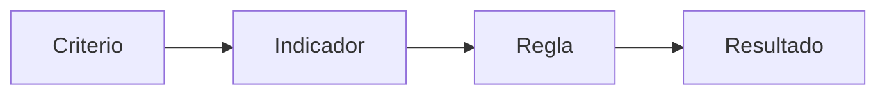
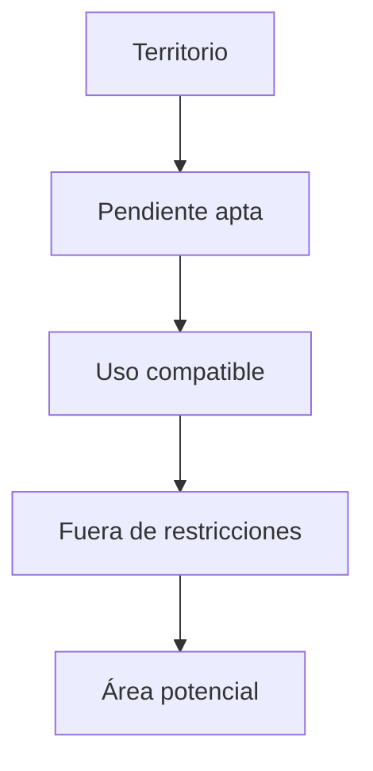
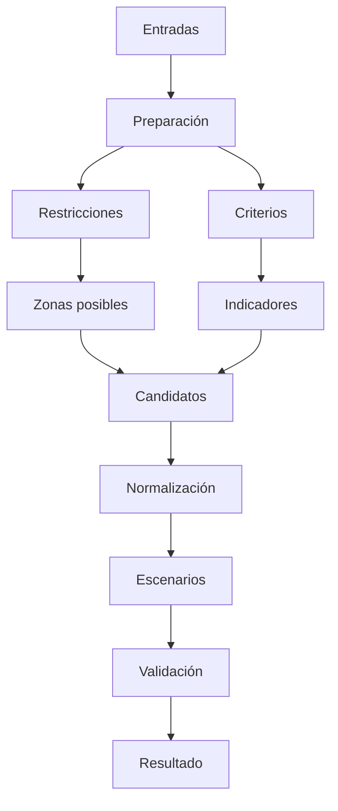
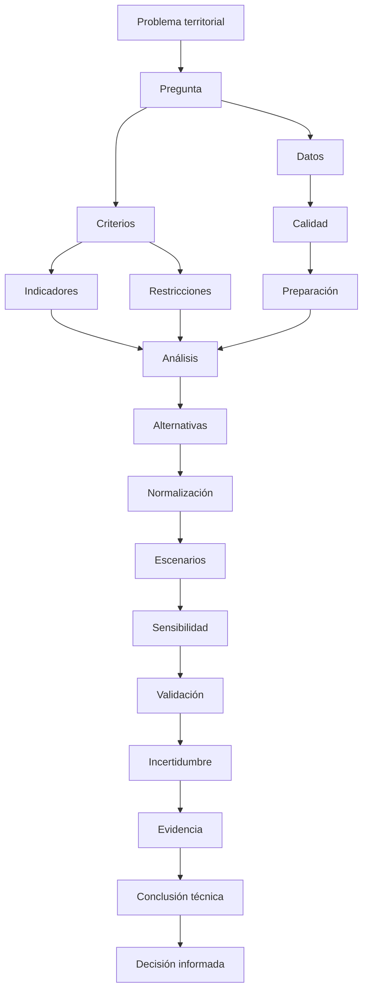

# 3.12 Laboratorio · Justificar una decisión territorial

<div class="grid cards" markdown>

-   :material-help-circle:{ .lg .middle } **Problema**

    ---

    Formular una pregunta territorial:

    **concreta, medible y verificable.**

-   :material-database-check:{ .lg .middle } **Datos**

    ---

    Evaluar:

    **calidad, estructura, cobertura y pertinencia.**

-   :material-map-marker-path:{ .lg .middle } **Relaciones**

    ---

    Integrar:

    **atributos, geometrías, proximidad y superposición.**

-   :material-function-variant:{ .lg .middle } **Indicadores**

    ---

    Construir:

    **variables derivadas y criterios explícitos.**

-   :material-check-decagram:{ .lg .middle } **Validación**

    ---

    Comprobar:

    **resultados, casos límite y supuestos.**

-   :material-scale-balance:{ .lg .middle } **Decisión**

    ---

    Justificar una alternativa mediante:

    **evidencia espacial documentada.**

</div>

[Comenzar](#1-la-mision-final-del-modulo){ .md-button .md-button--primary }
[Ir al reto final](#reto-final-del-modulo){ .md-button }

---

## La misión final del módulo

Durante el Módulo 3 aprendimos a:

```text
preparar datos
digitalizar
diseñar formularios
construir indicadores
integrar tablas
relacionar espacialmente
analizar proximidad
combinar ráster
interpretar relieve
georreferenciar
automatizar procedimientos
```

Ahora debemos demostrar algo más importante:

> **que podemos utilizar esas herramientas para justificar una decisión territorial de manera transparente y reproducible.**

### El objetivo no es

```text
hacer muchos mapas
```

El objetivo es:

```text
producir evidencia
```

que permita responder:

```text
qué alternativa resulta más adecuada
según criterios explícitos
y con limitaciones reconocidas
```

---

## 1. La misión final del módulo

Trabajaremos con un escenario territorial.

### Problema propuesto

Una institución municipal necesita identificar:

```text
la zona más adecuada
```

para localizar un nuevo:

```text
equipamiento de atención ciudadana
```

dentro de un territorio urbano.

No existe todavía:

```text
un predio definido
```

El objetivo es identificar:

```text
zonas candidatas
```

que cumplan determinados criterios territoriales.

---

## 2. La pregunta de decisión

Pregunta general:

> **¿Qué sectores presentan mejores condiciones territoriales para localizar un nuevo equipamiento de atención ciudadana?**

### Debemos transformarla

Porque:

```text
mejor
```

es demasiado ambiguo.

Necesitamos definir:

```text
mejor según qué
```

---

## 3. Construir criterios

Podemos definir inicialmente:

```text
accesibilidad
cercanía a población
pendiente
compatibilidad de uso
distancia a equipamientos existentes
restricciones territoriales
```

### Ejemplo

| Criterio | Condición |
|---|---|
| Accesibilidad | ≤ 500 m de vía principal |
| Pendiente | ≤ 15° |
| Uso de suelo | Compatible |
| Equipamiento existente | > 1000 m |
| Riesgo | Fuera de zona restringida |
| Población | Alta concentración cercana |

!!! important "Los criterios deben justificarse"

    No deben elegirse solo porque:

    ```text
    tenemos esos datos disponibles
    ```

---

## 4. Criterio, indicador y regla no son lo mismo

### Criterio

```text
Accesibilidad
```

### Indicador

```text
distancia a vía principal
```

### Regla

```text
distancia <= 500 m
```



!!! success "Esta separación mejora la trazabilidad"

---

## 5. Antes de analizar: construir matriz metodológica

| Criterio | Indicador | Unidad | Regla | Fuente |
|---|---|---|---|---|
| Accesibilidad | Distancia a vía | m | ≤ 500 | Red vial |
| Pendiente | Pendiente | ° | ≤ 15 | DEM |
| Compatibilidad | Uso | categoría | permitido | Uso suelo |
| Cobertura actual | Distancia a servicio | m | > 1000 | Equipamientos |
| Restricción | Intersección | Sí/No | No intersectar | Riesgos |

### Esta tabla debe existir

antes de comenzar el análisis.

---

## 6. Inventario de datos

Construye:

| Dataset | Tipo | Fuente | Fecha | SRC | Calidad |
|---|---|---|---|---|---|
| vías | línea | | | | |
| población | | | | | |
| equipamientos | punto | | | | |
| uso suelo | polígono | | | | |
| riesgos | polígono | | | | |
| DEM | ráster | | | | |

!!! warning "Un análisis es tan fuerte como sus datos"

---

## 7. Preguntas de calidad

Para cada fuente pregunta:

```text
¿está actualizada?
¿está completa?
¿tiene errores geométricos?
¿tiene duplicados?
¿tiene NoData?
¿su escala es adecuada?
¿su resolución es suficiente?
```

---

## 8. Clasificar calidad

Puedes utilizar:

```text
ALTA
MEDIA
BAJA
```

pero con criterios explícitos.

### Ejemplo

| Nivel | Criterio |
|---|---|
| ALTA | Fuente oficial, reciente y validada |
| MEDIA | Fuente usable con limitaciones |
| BAJA | Fuente incompleta o desactualizada |

!!! important "Calidad no debe asignarse por intuición"

---

## 9. Diagnóstico inicial

Antes de procesar:

```text
visualiza
revisa atributos
revisa geometrías
revisa extensión
revisa SRC
```

### Evidencia

!!! info "Captura pendiente · 3.12-01"

    - **Tipo:** Imagen compuesta
    - **Archivo:** `assets/images/modulo-03/3-12/3-12-01-datos-iniciales.png`
    - **Qué mostrar:**
        1. capas de entrada;
        2. estructura de atributos;
        3. mapa general.
    - **Objetivo didáctico:** documentar el punto de partida.

---

## Checkpoint 1

Deberías poder explicar:

- [ ] cuál es la pregunta;
- [ ] qué significa “mejor” en este análisis;
- [ ] qué criterios utilizarás;
- [ ] qué indicador representa cada criterio;
- [ ] qué fuentes respaldan cada variable;
- [ ] qué limitaciones iniciales tienen los datos.

---

## 10. Preparar los datos

Antes de combinar criterios debemos normalizar:

```text
SRC
geometría
atributos
resolución
extensión
```

### Vectoriales

Revisa:

```text
geometrías inválidas
duplicados
campos vacíos
```

### Ráster

Revisa:

```text
resolución
alineación
NoData
```

---

## 11. Mantener originales

Organiza:

```text
datos/
├── originales/
├── trabajo/
└── resultados/
```

### Nunca sobrescribas

```text
fuentes originales
```

---

## 12. Crear GeoPackage de trabajo

Guarda:

```text
trabajo_3_12.gpkg
```

con capas derivadas como:

```text
vias_trabajo
equipamientos_trabajo
uso_trabajo
restricciones_trabajo
```

---

## 13. Preparar DEM

Comprueba:

```text
SRC
resolución
NoData
```

y genera:

```text
pendiente
```

según lo aprendido en 3.9.

---

## 14. Criterio de pendiente

Regla:

```text
pendiente <= 15°
```

Construye una máscara:

```text
1 = cumple
0 = no cumple
```

!!! info "Captura pendiente · 3.12-02"

    - **Tipo:** GIF
    - **Archivo:** `assets/images/modulo-03/3-12/3-12-02-pendiente.gif`
    - **Qué mostrar:**
        1. DEM;
        2. pendiente;
        3. reclasificación.
    - **Objetivo didáctico:** transformar una variable continua en criterio.

---

## 15. Criterio de accesibilidad

Pregunta:

> ¿Qué zonas están a menos de 500 m de una vía principal?

Utiliza:

```text
Buffer
```

sobre:

```text
vías principales
```

### Distancia

```text
500 m
```

debe estar:

```text
justificada
```

---

## 16. Cobertura vial

Construye:

```text
buffer_vias_500m
```

Luego:

```text
Disolver
```

si la pregunta es:

```text
estar cerca de al menos una vía principal
```

!!! info "Captura pendiente · 3.12-03"

    - **Tipo:** GIF
    - **Archivo:** `assets/images/modulo-03/3-12/3-12-03-accesibilidad.gif`
    - **Qué mostrar:** Buffer y Disolver.
    - **Objetivo didáctico:** convertir proximidad en criterio espacial.

---

## 17. Criterio de cobertura existente

Queremos evitar:

```text
concentrar un nuevo equipamiento
muy cerca de uno existente
```

Regla:

```text
más de 1000 m
```

### Podemos construir

```text
buffer_equipamientos_1000m
```

y después:

```text
Diferencia
```

para obtener:

```text
territorio fuera de cobertura actual
```

---

## 18. No confundir distancia con necesidad

Una zona alejada de un equipamiento no implica automáticamente:

```text
mayor necesidad
```

Puede tener:

```text
poca población
buena cobertura desde otra jurisdicción
otras alternativas
```

!!! warning "Cada indicador representa solo una parte del problema"

---

## 19. Criterio de uso del suelo

Supongamos categorías:

```text
RESIDENCIAL
COMERCIAL
EQUIPAMIENTO
INDUSTRIAL
PROTECCION
```

Se consideran compatibles:

```text
EQUIPAMIENTO
COMERCIAL
```

### Selección

```qgis
"uso" IN ('EQUIPAMIENTO', 'COMERCIAL')
```

---

## 20. Convertir compatibilidad en geometría

Extrae:

```text
usos_compatibles
```

y, si corresponde:

```text
disuelve
```

las áreas compatibles.

---

## 21. Restricciones territoriales

Podemos tener:

```text
riesgo alto
áreas protegidas
servidumbres
ríos
```

La regla podría ser:

```text
NO INTERSECTAR
```

### Construimos

```text
zona_restringida
```

que será excluida.

---

## 22. Restricción absoluta y criterio relativo

Esta diferencia es importante.

=== "Restricción"

    Si no se cumple:

    ```text
    la alternativa se descarta
    ```

=== "Criterio"

    Puede utilizarse para:

    ```text
    comparar alternativas
    ```

!!! important "No mezcles restricciones con preferencias"

---

## 23. Ejemplo

```text
riesgo alto
```

puede ser:

```text
restricción
```

Mientras:

```text
distancia a vía
```

puede ser:

```text
criterio de conveniencia
```

---

## Checkpoint 2

Deberías poder explicar:

- [ ] cómo se construye cada criterio;
- [ ] qué variables son continuas;
- [ ] qué variables son categóricas;
- [ ] qué criterios se convierten en máscaras;
- [ ] diferencia entre restricción y criterio;
- [ ] por qué distancia no equivale automáticamente a necesidad.

---

## 24. Combinar restricciones

Podemos comenzar con:

```text
territorio total
```

y eliminar:

```text
pendiente no apta
usos incompatibles
riesgo
```

Conceptualmente:



---

## 25. Intersección de criterios

Si todos deben cumplirse:

```text
A AND B AND C
```

Vectorialmente podemos usar:

```text
Intersección
```

Ráster:

```text
AND
```

### Resultado

```text
zona apta
```

---

## 26. El orden de operaciones

Ejemplo:

```text
pendiente
→
uso
→
riesgo
```

puede producir la misma lógica final que:

```text
riesgo
→
pendiente
→
uso
```

si todas son restricciones puras.

### Pero

el orden afecta:

```text
rendimiento
fragmentación
atributos
```

!!! success "Lógica equivalente no siempre implica proceso idéntico"

---

## 27. Construir zona candidata

Resultado:

```text
zona_candidata
```

que cumple:

```text
pendiente
uso
accesibilidad
restricciones
```

Pero aún no tenemos:

```text
una decisión final
```

---

## 28. Fragmentos muy pequeños

Una intersección puede producir:

```text
micro-polígonos
```

Debemos decidir:

```text
qué superficie mínima
```

es funcionalmente útil.

### Ejemplo

```text
superficie mínima = 2 000 m²
```

Pero debe estar:

```text
justificada
```

---

## 29. Calcular superficie

Crea:

```text
area_m2
```

mediante:

```qgis
$area
```

en un SRC adecuado.

Después:

```qgis
"area_m2" >= 2000
```

si ese es el umbral definido.

---

## 30. No eliminar pequeños polígonos sin revisar

Podrían ser:

```text
errores
```

pero también:

```text
espacios realmente pequeños
```

!!! warning "Tamaño pequeño no equivale automáticamente a error"

---

## 31. Integrar población

Ahora queremos saber:

```text
cuánta población
```

se encuentra próxima a cada zona candidata.

Podemos utilizar:

```text
puntos poblacionales
grid
manzanas
sectores censales
```

según la fuente.

---

## 32. Relación espacial con población

Podemos construir un área de influencia:

```text
500 m
```

alrededor de cada candidato y calcular:

```text
población asociada
```

### Pero

esto introduce:

```text
otro supuesto
```

sobre proximidad.

---

## 33. Evitar doble conteo

Si dos candidatos tienen áreas de influencia superpuestas:

```text
una misma población
```

puede ser contada en ambos.

### Eso no siempre es error

Si estamos evaluando:

```text
cada candidato independientemente
```

puede ser correcto.

!!! important "El significado depende del objetivo de la comparación"

---

## 34. Construir indicador de población cercana

Campo:

```text
pob_500m
```

Resultado:

| candidato | pob_500m |
|---|---:|
| C01 | 12 500 |
| C02 | 8 700 |
| C03 | 15 200 |

---

## 35. Distancia a equipamientos existentes

Para cada candidato podemos calcular:

```text
distancia al equipamiento más cercano
```

Resultado:

| candidato | dist_existente_m |
|---|---:|
| C01 | 1250 |
| C02 | 1800 |
| C03 | 1100 |

---

## 36. Accesibilidad vial

Podemos medir:

```text
distancia a vía principal
```

Resultado:

| candidato | dist_via_m |
|---|---:|
| C01 | 120 |
| C02 | 450 |
| C03 | 60 |

---

## 37. Construir tabla comparativa

| Candidato | Área | Pob. cercana | Dist. servicio | Dist. vía | Pendiente |
|---|---:|---:|---:|---:|---:|
| C01 | | | | | |
| C02 | | | | | |
| C03 | | | | | |

### Aquí empieza la comparación

No antes.

---

## 38. Escalas diferentes

Nuestros indicadores tienen unidades distintas:

```text
m²
personas
metros
grados
```

No podemos simplemente:

```text
sumarlos
```

---

## 39. Normalización

Podemos transformar variables a una escala comparable.

Por ejemplo:

```text
0–1
```

o:

```text
0–100
```

### Pero normalizar implica decisiones

```text
mínimo
máximo
dirección
valores extremos
```

---

## 40. Beneficio y costo

Algunas variables:

```text
más alto = mejor
```

por ejemplo:

```text
población cercana
distancia a servicio existente
```

si queremos cubrir zonas desatendidas.

Otras:

```text
más bajo = mejor
```

por ejemplo:

```text
distancia a vía
pendiente
```

---

## 41. Normalización de beneficio

Conceptualmente:

```text
x - mínimo
───────────
máximo - mínimo
```

produce:

```text
0–1
```

donde:

```text
mayor valor = mejor
```

---

## 42. Normalización de costo

Conceptualmente invertimos:

```text
máximo - x
───────────
máximo - mínimo
```

Así:

```text
menor valor original = mejor
```

!!! warning "No uses fórmulas sin entender su dirección"

---

## 43. Pesos

Podemos asignar importancia relativa:

```text
población = 40 %
accesibilidad = 25 %
cobertura existente = 20 %
pendiente = 15 %
```

Total:

```text
100 %
```

### Pero los pesos

deben provenir de:

```text
criterio técnico
normativa
participación
metodología
```

No de:

```text
preferencia personal
```

---

## 44. Índice compuesto

Conceptualmente:

```text
indice =
poblacion_norm × 0.40
+
acceso_norm × 0.25
+
cobertura_norm × 0.20
+
pendiente_norm × 0.15
```

### Resultado

```text
0–1
```

si todos los componentes utilizan esa escala.

---

## 45. Un índice no crea objetividad automática

Aunque la fórmula sea matemática:

```text
los criterios
los pesos
los umbrales
```

siguen siendo:

```text
decisiones metodológicas
```

!!! danger "Número preciso ≠ decisión neutral"

---

## 46. Separar dato de preferencia

### Datos

```text
distancia = 120 m
pendiente = 8°
```

### Preferencias/metodología

```text
peso = 25 %
umbral = 500 m
```

!!! success "Documentar esta diferencia mejora la transparencia"

---

## Checkpoint 3

Deberías poder explicar:

- [ ] cómo se generan zonas candidatas;
- [ ] por qué área mínima necesita justificación;
- [ ] cómo incorporar población;
- [ ] por qué indicadores con unidades diferentes no pueden sumarse directamente;
- [ ] qué significa normalización;
- [ ] diferencia entre criterio de beneficio y costo;
- [ ] por qué los pesos son decisiones metodológicas.

---

## 47. Construir escenarios

En lugar de utilizar un único conjunto de pesos podemos crear:

```text
Escenario A
Escenario B
Escenario C
```

### Ejemplo

=== "Escenario A · Social"

    Prioriza:

    ```text
    población
    ```

=== "Escenario B · Accesibilidad"

    Prioriza:

    ```text
    proximidad vial
    ```

=== "Escenario C · Equilibrado"

    Distribuye pesos de forma más homogénea.

---

## 48. Matriz de escenarios

| Criterio | Social | Accesibilidad | Equilibrado |
|---|---:|---:|---:|
| Población | 50 % | 25 % | 35 % |
| Vía | 15 % | 45 % | 30 % |
| Cobertura | 25 % | 20 % | 20 % |
| Pendiente | 10 % | 10 % | 15 % |
| Total | 100 % | 100 % | 100 % |

---

## 49. Análisis de sensibilidad

Queremos saber:

> ¿La alternativa destacada cambia mucho cuando cambian los pesos?

Si cambia constantemente:

```text
la decisión es sensible
```

Si permanece estable:

```text
el resultado es más robusto frente a esos escenarios
```

---

## 50. Robustez

Una alternativa puede considerarse robusta cuando:

```text
se mantiene bien posicionada
```

bajo varios escenarios razonables.

### Pero

robustez no significa:

```text
perfección
```

---

## 51. Mapear escenarios

!!! info "Captura pendiente · 3.12-04"

    - **Tipo:** Imagen comparativa
    - **Archivo:** `assets/images/modulo-03/3-12/3-12-04-escenarios.png`
    - **Qué mostrar:**
        1. escenario social;
        2. escenario accesibilidad;
        3. escenario equilibrado.
    - **Objetivo didáctico:** mostrar visualmente sensibilidad del resultado.

---

## 52. No depender solo del índice

Una alternativa con:

```text
0.82
```

y otra con:

```text
0.80
```

pueden ser prácticamente muy similares.

### Debemos revisar

```text
diferencia absoluta
criterios individuales
limitaciones
incertidumbre
```

!!! important "El índice ayuda a comparar; no reemplaza la interpretación"

---

## 53. Crear ficha por candidato

### Candidato C01

```text
Área:
Población cercana:
Distancia a vía:
Distancia a servicio:
Pendiente:
Restricciones:
Índice:
Limitaciones:
```

### Esto permite

comparar:

```text
perfil completo
```

y no solo:

```text
un valor final
```

---

## 54. Validación espacial

Para cada candidato verifica:

```text
geometría
uso de suelo
restricciones
accesos
contexto
```

### Un error de geoprocesamiento

podría producir:

```text
una alternativa aparentemente excelente
```

---

## 55. Validación visual

Inspecciona cada candidato sobre:

```text
ortofoto
red vial
parcelas
límites
```

si están disponibles.

!!! info "Captura pendiente · 3.12-05"

    - **Tipo:** GIF
    - **Archivo:** `assets/images/modulo-03/3-12/3-12-05-validacion-candidatos.gif`
    - **Qué mostrar:** inspección de varios candidatos.
    - **Objetivo didáctico:** demostrar que el índice debe contrastarse espacialmente.

---

## 56. Validación de atributos

Comprueba:

```text
área
distancias
población
pendiente
índice
```

con:

```text
casos conocidos
```

---

## 57. Validación cruzada

Ejemplo:

```text
distancia a vía
```

puede comprobarse mediante:

```text
medición manual
```

sobre una muestra.

### O:

```text
área
```

puede compararse con:

```text
otro cálculo independiente
```

---

## 58. Casos límite

Busca:

```text
candidato exactamente en umbral
candidato próximo a restricción
candidato pequeño
candidato con NoData
```

!!! warning "Los casos frontera son donde más fácilmente aparecen errores de clasificación"

---

## 59. Incertidumbre

La decisión puede estar afectada por:

```text
datos antiguos
resolución DEM
población estimada
límites aproximados
umbrales
pesos
```

### Debemos documentarlo

No esconderlo.

---

## 60. Matriz de incertidumbre

| Fuente | Incertidumbre | Efecto posible |
|---|---|---|
| Población | Fecha | Cambio de demanda |
| DEM | Resolución | Pendiente generalizada |
| Vías | Clasificación | Accesibilidad incorrecta |
| Uso suelo | Actualización | Compatibilidad desactualizada |
| Pesos | Preferencia | Cambio en resultado |

---

## 61. Evidencia frente a decisión

Un SIG puede aportar:

```text
evidencia
```

pero la decisión puede requerir además:

```text
presupuesto
propiedad
factibilidad jurídica
participación
disponibilidad predial
servicios básicos
```

!!! quote "El análisis espacial informa la decisión; no sustituye todas las dimensiones de la decisión"

---

## 62. Recomendación técnica y decisión política/administrativa

El resultado puede identificar:

```text
alternativas territorialmente favorables
```

Pero la decisión final puede depender de:

```text
criterios institucionales adicionales
```

### Por eso el informe debe separar

```text
resultado técnico
```

de:

```text
decisión administrativa
```

---

## 63. No afirmar más de lo que el análisis demuestra

Evita:

> Este es el lugar perfecto.

Prefiere:

> Bajo los criterios, datos y pesos utilizados, esta alternativa presenta condiciones territoriales favorables.

### Esto es más preciso

porque reconoce:

```text
supuestos
```

---

## Checkpoint 4

Deberías poder explicar:

- [ ] qué es análisis de sensibilidad;
- [ ] qué significa robustez;
- [ ] por qué no decidir solo por índice;
- [ ] cómo validar candidatos;
- [ ] qué fuentes de incertidumbre existen;
- [ ] diferencia entre evidencia técnica y decisión final;
- [ ] por qué debemos limitar el alcance de nuestras conclusiones.

---

## 64. Reproducir el procedimiento

Recuperamos 3.11.

El flujo debería organizarse como:



---

## 65. Construir modelo gráfico

No es obligatorio automatizar absolutamente todo.

Automatiza:

```text
procesos repetitivos
```

como:

```text
buffers
intersecciones
cálculos
```

Mantén fuera:

```text
decisiones que requieren revisión técnica
```

cuando corresponda.

---

## 66. Automatizar no significa eliminar revisión

Ejemplo:

```text
modelo genera candidatos
```

Después:

```text
analista revisa
```

antes de:

```text
aceptar resultados
```

!!! success "Modelo + revisión puede ser mejor que automatización ciega"

---

## 67. Guardar parámetros

La salida debe registrar:

```text
distancia_via
distancia_servicio
pendiente_max
escenario
version
```

### Esto permite

reconstruir:

```text
cómo se obtuvo
```

---

## 68. Versionar escenarios

Ejemplo:

```text
escenario_social_v01
escenario_acceso_v01
escenario_equilibrado_v01
```

No utilices:

```text
final
final2
nuevo_final
```

---

## 69. Crear matriz de trazabilidad

| Producto | Fuente | Proceso | Parámetros | Versión |
|---|---|---|---|---|
| Pendiente | DEM | Slope | grados | 1.0 |
| Buffer vías | Vías | Buffer | 500 m | 1.0 |
| Zona apta | Varias | Intersección | | 1.0 |
| Índice | Indicadores | Expresión | Pesos A | 1.0 |

---

## 70. Mapa final

El mapa debe mostrar:

```text
área de estudio
candidatos
restricciones relevantes
vías
equipamientos existentes
```

### Evita

incluir:

```text
todas las capas intermedias
```

si dificultan la lectura.

---

## 71. Jerarquía visual

El lector debe identificar rápidamente:

```text
1. candidatos
2. contexto
3. restricciones
```

### No todo debe tener el mismo peso visual

---

## 72. El mapa necesita contexto

Incluye:

```text
título
leyenda
escala
norte
fuente
SRC
fecha
autor
```

cuando corresponda.

---

## 73. Crear tabla resumen

| Candidato | Índice A | Índice B | Índice C | Observación |
|---|---:|---:|---:|---|
| C01 | | | | |
| C02 | | | | |
| C03 | | | | |

### Añade

```text
limitaciones
```

cuando sean relevantes.

---

## 74. Informe técnico corto

Una estructura posible:

```text
1. Problema
2. Datos
3. Metodología
4. Criterios
5. Resultados
6. Sensibilidad
7. Limitaciones
8. Conclusión
```

---

## 75. No llenar el informe con herramientas

Evita:

> Se utilizó Buffer, después Clip, después Intersect...

Eso describe:

```text
software
```

no:

```text
metodología
```

Prefiere:

> Se identificaron zonas a menos de 500 m de vías principales y se excluyeron áreas incompatibles por pendiente, uso y restricciones territoriales.

!!! success "Describe la lógica antes que los botones"

---

## 76. Diferenciar metodología de implementación

### Metodología

```text
excluir pendientes > 15°
```

### Implementación

```text
Calculadora ráster
```

El informe principal debería priorizar:

```text
metodología
```

---

## 77. Evidencia reproducible

La entrega debe permitir:

```text
abrir datos
revisar modelo
recalcular
comparar
```

No solo:

```text
ver un PDF
```

---

## 78. Estructura de entrega

```text
laboratorio_3_12/
├── datos/
│   ├── originales/
│   ├── trabajo/
│   └── resultados/
├── modelos/
├── proyecto/
├── mapas/
└── documentacion/
```

---

## 79. README

Debe explicar:

```text
objetivo
estructura
datos
procedimiento
escenarios
limitaciones
```

---

## 80. Control final

Antes de entregar pregunta:

```text
¿se puede repetir?
¿se puede verificar?
¿se puede explicar?
¿se conocen las limitaciones?
```

---

## Laboratorio integrador: justificar una decisión territorial

!!! example "Escenario"

    Una unidad municipal solicita identificar áreas candidatas para un nuevo equipamiento.

    Dispones de:

    ```text
    red vial
    población
    equipamientos existentes
    uso de suelo
    restricciones
    DEM
    ```

    Debes generar:

    ```text
    candidatos
    indicadores
    escenarios
    validación
    conclusión técnica
    ```

### Fase 1 · Formular problema

Escribe:

```text
problema:
pregunta:
objetivo:
```

### Fase 2 · Definir criterios

Construye:

| Criterio | Indicador | Regla | Tipo |
|---|---|---|---|
| | | | |

### Fase 3 · Identificar restricciones

Separa:

```text
exclusiones absolutas
```

de:

```text
criterios de comparación
```

### Fase 4 · Inventariar datos

Incluye:

```text
fuente
fecha
SRC
escala/resolución
calidad
```

### Fase 5 · Preparar datos

Corrige:

```text
SRC
geometrías
atributos
NoData
```

sin modificar originales.

### Fase 6 · Crear pendiente

A partir del DEM.

### Fase 7 · Crear criterio de pendiente

Genera:

```text
pendiente_apta
```

### Fase 8 · Crear accesibilidad

Genera:

```text
buffer_vias
```

### Fase 9 · Crear cobertura existente

Genera:

```text
buffer_equipamientos
```

### Fase 10 · Preparar uso compatible

Extrae:

```text
usos permitidos
```

### Fase 11 · Preparar restricciones

Unifica:

```text
zonas excluidas
```

cuando metodológicamente corresponda.

### Fase 12 · Combinar restricciones

Genera:

```text
zona_potencial
```

### Fase 13 · Eliminar áreas no funcionales

Aplica:

```text
superficie mínima
```

si existe justificación.

### Fase 14 · Crear candidatos

Identifica:

```text
C01
C02
C03
...
```

### Fase 15 · Calcular atributos

Para cada candidato:

```text
área
pendiente
distancia a vía
distancia a equipamiento
```

### Fase 16 · Incorporar población

Calcula:

```text
población cercana
```

### Fase 17 · Construir tabla

| ID | Área | Pendiente | Vía | Servicio | Población |
|---|---:|---:|---:|---:|---:|
| | | | | | |

### Fase 18 · Normalizar

Transforma indicadores a:

```text
escala común
```

### Fase 19 · Definir escenario A

Documenta:

```text
pesos
```

### Fase 20 · Definir escenario B

Modifica criterios.

### Fase 21 · Definir escenario C

Construye:

```text
escenario equilibrado
```

### Fase 22 · Calcular índices

Registra:

```text
indice_A
indice_B
indice_C
```

### Fase 23 · Comparar sensibilidad

Completa:

| Candidato | A | B | C | Estabilidad |
|---|---:|---:|---:|---|
| | | | | |

### Fase 24 · Inspección visual

Revisa cada candidato sobre:

```text
ortofoto
vías
restricciones
contexto
```

### Fase 25 · Verificar atributos

Comprueba una muestra manualmente.

### Fase 26 · Revisar casos límite

Identifica:

```text
umbrales
NoData
fragmentos
proximidad a restricciones
```

### Fase 27 · Construir incertidumbre

Completa:

| Variable | Limitación | Efecto |
|---|---|---|
| | | |

### Fase 28 · Crear procedimiento reproducible

Automatiza al menos:

```text
una parte sustancial
```

del análisis mediante:

```text
Modelador gráfico
```

### Fase 29 · Guardar trazabilidad

Incluye:

```text
parámetros
versión
escenario
```

### Fase 30 · Crear mapa final

Debe permitir:

```text
comprender el resultado
```

sin conocer todo el proceso.

### Fase 31 · Crear tabla final

Incluye:

```text
indicadores
escenarios
limitaciones
```

### Fase 32 · Redactar conclusión

Responde:

```text
qué zonas son territorialmente favorables
bajo qué criterios
con qué incertidumbre
```

### Evidencia del laboratorio

!!! info "Captura pendiente · 3.12-06"

    - **Tipo:** Imagen compuesta
    - **Archivo:** `assets/images/modulo-03/3-12/3-12-06-laboratorio-final.png`
    - **Qué mostrar:**
        1. capas de entrada;
        2. criterios;
        3. candidatos;
        4. escenarios;
        5. mapa final.
    - **Objetivo didáctico:** sintetizar visualmente todo el Módulo 3.

---

## Reto final del módulo

!!! example "Reto 3.12 — Justificar una decisión territorial"

    ### Objetivo

    Debes responder una pregunta territorial real o simulada mediante un procedimiento:

    ```text
    explícito
    verificable
    reproducible
    ```

    ### Puedes elegir entre

    ```text
    localización de equipamiento
    priorización de intervención
    identificación de áreas críticas
    selección de zonas aptas
    cobertura de servicios
    análisis de accesibilidad
    ```

    ### Requisito 1 · Pregunta

    Formula:

    ```text
    una pregunta concreta
    ```

    ### Requisito 2 · Criterios

    Utiliza al menos:

    ```text
    4 criterios
    ```

    de los cuales:

    ```text
    1 debe ser una restricción
    ```

    ### Requisito 3 · Datos

    Utiliza al menos:

    ```text
    una capa vectorial
    una capa ráster
    ```

    ### Requisito 4 · Calidad

    Documenta:

    ```text
    fuente
    fecha
    SRC
    limitaciones
    ```

    ### Requisito 5 · Indicadores

    Construye al menos:

    ```text
    3 indicadores
    ```

    ### Requisito 6 · Relación espacial

    Utiliza al menos una:

    ```text
    selección espacial
    unión espacial
    intersección
    ```

    ### Requisito 7 · Proximidad

    Utiliza al menos un análisis de:

    ```text
    distancia o buffer
    ```

    ### Requisito 8 · Ráster

    Utiliza:

    ```text
    pendiente
    reclasificación
    máscara
    estadísticas zonales
    ```

    o equivalente.

    ### Requisito 9 · Casos especiales

    Documenta:

    ```text
    NULL
    NoData
    denominadores cero
    fronteras
    ```

    cuando correspondan.

    ### Requisito 10 · Escenarios

    Construye al menos:

    ```text
    2 escenarios
    ```

    ### Requisito 11 · Sensibilidad

    Explica:

    ```text
    qué cambia
    ```

    entre escenarios.

    ### Requisito 12 · Validación

    Utiliza al menos:

    ```text
    una comprobación independiente
    ```

    de un resultado.

    ### Requisito 13 · Reproducibilidad

    Construye al menos:

    ```text
    un modelo .model3
    ```

    para parte del flujo.

    ### Requisito 14 · Trazabilidad

    Registra:

    ```text
    método
    parámetros
    versión
    ```

    ### Requisito 15 · Mapa final

    Debe mostrar claramente:

    ```text
    alternativas
    contexto
    criterios relevantes
    ```

    ### Requisito 16 · Tabla comparativa

    | Alternativa | C1 | C2 | C3 | C4 | Escenario A | Escenario B |
    |---|---:|---:|---:|---:|---:|---:|
    | | | | | | | |

    ### Requisito 17 · Incertidumbre

    Documenta al menos:

    ```text
    3 fuentes
    ```

    de incertidumbre.

    ### Requisito 18 · Conclusión técnica

    Redacta entre **350 y 500 palabras** explicando:

    - cuál era la pregunta;
    - qué datos utilizaste;
    - qué limitaciones tenían;
    - qué criterios definiste;
    - cuáles funcionaron como restricciones;
    - qué indicadores construiste;
    - cómo obtuviste las alternativas;
    - qué escenarios comparaste;
    - qué tan sensible fue el resultado;
    - qué validaciones ejecutaste;
    - qué incertidumbres permanecen;
    - qué alternativas presentan condiciones territoriales favorables según el método aplicado;
    - qué información adicional sería necesaria antes de tomar una decisión definitiva.

    ### Entregables

    - proyecto `.qgz`;
    - datos originales;
    - GeoPackage de trabajo;
    - productos ráster;
    - modelo `.model3`;
    - matriz metodológica;
    - inventario de datos;
    - tabla de calidad;
    - tabla de indicadores;
    - escenarios;
    - análisis de sensibilidad;
    - matriz de incertidumbre;
    - mapa final;
    - README;
    - informe técnico;
    - evidencia de validación;
    - conclusión.

---

## Criterios de evaluación

??? success "Ver rúbrica completa"

    | Criterio | Se cumple si... |
    |---|---|
    | Problema | Está claramente definido |
    | Pregunta | Es verificable |
    | Datos | Son pertinentes |
    | Calidad | Está documentada |
    | Originales | Se preservan |
    | SRC | Es coherente |
    | Geometrías | Se validan |
    | Ráster | Se prepara correctamente |
    | Criterios | Son explícitos |
    | Restricciones | Se distinguen de preferencias |
    | Indicadores | Son interpretables |
    | Unidades | Están documentadas |
    | NULL/NoData | Se tratan conscientemente |
    | Relaciones | Se aplican correctamente |
    | Proximidad | Está justificada |
    | Superposición | Se interpreta correctamente |
    | Población | Se integra sin confusión |
    | Normalización | Está documentada |
    | Pesos | Están justificados |
    | Escenarios | Se comparan |
    | Sensibilidad | Se analiza |
    | Validación | Existe evidencia independiente |
    | Incertidumbre | Se reconoce |
    | Automatización | Es reproducible |
    | Trazabilidad | Está documentada |
    | Cartografía | Comunica correctamente |
    | Conclusión | No excede lo demostrado |
    | Resultado | Puede auditarse y reproducirse |

---

## Errores frecuentes

=== "Elegí los criterios porque eran las capas que tenía"

    Los criterios deben responder:

    ```text
    al problema
    ```

=== "Todo lo convertí en restricción"

    Algunas variables deben servir para:

    ```text
    comparar
    ```

=== "Usé 500 m porque es un número redondo"

    La distancia necesita:

    ```text
    justificación
    ```

=== "El índice mayor es automáticamente la mejor opción"

    Revisa:

    ```text
    diferencias
    escenarios
    incertidumbre
    ```

=== "Sumé metros, personas y grados"

    Las escalas no son comparables directamente.

=== "Los pesos suman 100, entonces son objetivos"

    No.

=== "Un escenario dio un resultado distinto"

    Eso es precisamente información sobre:

    ```text
    sensibilidad
    ```

=== "El modelo terminó sin errores"

    Eso no garantiza metodología correcta.

=== "El mapa se ve convincente"

    Eso no reemplaza:

    ```text
    validación
    ```

=== "No mencioné limitaciones"

    Entonces la conclusión puede parecer más fuerte de lo que realmente es.

---

## Desafío de 5 minutos

!!! challenge "Analiza este caso"

    Se identificó una zona con:

    ```text
    población alta
    distancia a vía = 80 m
    pendiente = 8°
    distancia a servicio = 1300 m
    ```

    pero:

    ```text
    intersecta una zona de riesgo alto
    ```

    ¿Debería obtener un índice alto?

??? success "Respuesta"

    Si:

    ```text
    riesgo alto
    ```

    fue definido como:

    ```text
    restricción absoluta
    ```

    la alternativa debería:

    ```text
    descartarse
    ```

    antes de ponderar los criterios restantes.

    Esto demuestra por qué:

    ```text
    restricciones
    ```

    y:

    ```text
    criterios
    ```

    no deben mezclarse.

---

## Ideas clave

<div class="grid cards" markdown>

-   :material-help-circle:{ .lg .middle } **Pregunta**

    ---

    Un análisis comienza con una pregunta clara.

-   :material-database-check:{ .lg .middle } **Evidencia**

    ---

    Los datos deben ser pertinentes y evaluados.

-   :material-filter-check:{ .lg .middle } **Restricción**

    ---

    Define qué alternativas no son admisibles.

-   :material-function-variant:{ .lg .middle } **Indicador**

    ---

    Traduce criterios a variables medibles.

-   :material-scale-balance:{ .lg .middle } **Escenario**

    ---

    Permite evaluar cómo cambian las conclusiones.

-   :material-check-decagram:{ .lg .middle } **Validación**

    ---

    Una decisión técnica necesita evidencia verificable.

</div>

!!! success "Para recordar"

    - Un SIG apoya decisiones mediante evidencia espacial.
    - La pregunta debe formularse antes de elegir herramientas.
    - “Mejor” necesita criterios explícitos.
    - Criterio, indicador y regla son conceptos distintos.
    - Los criterios deben responder al problema.
    - La calidad de los datos debe evaluarse antes del análisis.
    - Restricciones y preferencias cumplen funciones diferentes.
    - Las restricciones deben aplicarse antes de comparar alternativas.
    - Las unidades de los indicadores deben conocerse.
    - Variables con escalas distintas requieren tratamiento antes de combinarse.
    - La normalización transforma valores, no elimina decisiones metodológicas.
    - Los pesos representan prioridades.
    - Un índice matemático no es automáticamente objetivo.
    - Los escenarios permiten analizar sensibilidad.
    - Una alternativa robusta mantiene buen comportamiento bajo varios escenarios razonables.
    - El índice final no debe reemplazar la revisión de criterios individuales.
    - Las alternativas deben inspeccionarse espacialmente.
    - Los casos límite requieren revisión.
    - La incertidumbre debe documentarse.
    - El análisis espacial no sustituye restricciones jurídicas, presupuestarias o administrativas.
    - Un resultado técnico debe diferenciarse de la decisión institucional.
    - No debemos afirmar más de lo que los datos demuestran.
    - La reproducibilidad mejora la auditabilidad.
    - Los mapas deben comunicar resultados, no esconder metodología.
    - La conclusión debe mencionar supuestos y limitaciones.

---

## Autoevaluación

??? question "1. ¿Qué debe existir antes de ejecutar herramientas?"

    Una pregunta territorial clara.

??? question "2. ¿Qué es un criterio?"

    Una dimensión utilizada para evaluar alternativas.

??? question "3. ¿Qué es un indicador?"

    Una variable que permite medir un criterio.

??? question "4. ¿Qué es una regla?"

    La condición aplicada al indicador.

??? question "5. ¿Qué es una restricción?"

    Una condición que puede excluir una alternativa.

??? question "6. ¿Restricción y criterio son iguales?"

    No.

??? question "7. ¿Por qué inventariar fuentes?"

    Para conocer procedencia, fecha, estructura y limitaciones.

??? question "8. ¿Por qué evaluar calidad?"

    Porque la confiabilidad de la conclusión depende de las entradas.

??? question "9. ¿Qué hace una máscara?"

    Representa espacialmente dónde se cumple una condición.

??? question "10. ¿Qué ocurre al combinar restricciones con AND?"

    Solo permanecen las zonas que cumplen todas.

??? question "11. ¿Por qué utilizar superficie mínima?"

    Para identificar áreas funcionalmente viables, si existe una justificación.

??? question "12. ¿Qué es normalización?"

    Transformar variables a escalas comparables.

??? question "13. ¿Qué es un criterio de beneficio?"

    Uno donde valores mayores representan mejor condición.

??? question "14. ¿Qué es un criterio de costo?"

    Uno donde valores menores representan mejor condición.

??? question "15. ¿Qué representan los pesos?"

    La importancia relativa asignada a los criterios.

??? question "16. ¿Pesos matemáticos significan objetividad?"

    No.

??? question "17. ¿Qué es un escenario?"

    Una combinación alternativa de criterios, reglas o pesos.

??? question "18. ¿Qué es sensibilidad?"

    El grado en que cambia el resultado al modificar supuestos.

??? question "19. ¿Qué significa robustez?"

    Que una alternativa mantiene un comportamiento favorable bajo varios escenarios razonables.

??? question "20. ¿Por qué validar visualmente?"

    Para detectar problemas que un índice tabular puede ocultar.

??? question "21. ¿Qué es incertidumbre?"

    La limitación asociada a datos, parámetros, métodos o supuestos.

??? question "22. ¿El SIG toma la decisión?"

    No. Aporta evidencia para informar la decisión.

??? question "23. ¿Qué debe contener una conclusión técnica?"

    Resultado, metodología, evidencia, sensibilidad, limitaciones e información faltante.

??? question "24. ¿Cuál es la secuencia fundamental?"

    ```text
    preguntar
    → documentar
    → preparar
    → analizar
    → comparar
    → validar
    → interpretar
    → justificar
    ```

---

## Mapa conceptual



---

## Cierre del Módulo 3


!!! quote "La idea que debe permanecer"

    La pregunta profesional no es:

    > **¿Qué mapa puedo producir con estos datos?**

    sino:

    > **¿Qué evidencia territorial puedo construir, cómo puedo demostrar que es válida y hasta dónde permite justificar una decisión sin ocultar sus supuestos e incertidumbres?**

---

## Competencias alcanzadas en el Módulo 3

Al finalizar deberías poder:

- [ ] preparar datos antes de analizarlos;
- [ ] preservar fuentes originales;
- [ ] editar geometrías con control;
- [ ] diseñar formularios de captura;
- [ ] construir expresiones robustas;
- [ ] diferenciar NULL, cero y NoData;
- [ ] integrar tablas mediante claves;
- [ ] modelar relaciones 1:N;
- [ ] detectar registros huérfanos;
- [ ] utilizar predicados espaciales;
- [ ] seleccionar por ubicación;
- [ ] analizar proximidad;
- [ ] utilizar buffer, recorte, intersección y diferencia;
- [ ] preparar datos ráster;
- [ ] controlar resolución y alineación;
- [ ] interpretar relieve;
- [ ] calcular estadísticas zonales;
- [ ] georreferenciar documentos históricos;
- [ ] evaluar residuos e incertidumbre;
- [ ] construir modelos reproducibles;
- [ ] documentar parámetros;
- [ ] construir indicadores territoriales;
- [ ] comparar escenarios;
- [ ] analizar sensibilidad;
- [ ] validar resultados;
- [ ] comunicar limitaciones;
- [ ] justificar una decisión mediante evidencia espacial.

---

## Producto final del módulo

Tu carpeta debería contener una estructura similar a:

```text
modulo-03/
├── datos/
│   ├── originales/
│   ├── trabajo/
│   └── resultados/
│
├── modelos/
│   └── analisis_territorial_v01.model3
│
├── proyecto/
│   └── modulo_03.qgz
│
├── mapas/
│   └── decision_territorial.pdf
│
└── documentacion/
    ├── inventario_datos.xlsx
    ├── matriz_metodologica.xlsx
    ├── matriz_incertidumbre.xlsx
    └── README.md
```

---

## Reflexión final

??? question "¿Qué cambió entre el inicio y el final del módulo?"

    Al inicio podíamos pensar en QGIS como:

    ```text
    un conjunto de herramientas
    ```

    Al finalizar deberíamos comprenderlo como:

    ```text
    un entorno para construir
    procedimientos de análisis territorial
    ```

    donde cada resultado depende de:

    ```text
    datos
    estructura
    supuestos
    parámetros
    validación
    interpretación
    ```

---

## Fin del Módulo 3

<div class="grid cards" markdown>

-   :material-check-decagram:{ .lg .middle } **Ya puedes**

    ---

    Construir análisis que integren:

    ```text
    vector
    ráster
    atributos
    relaciones
    indicadores
    ```

-   :material-source-branch:{ .lg .middle } **Ya puedes**

    ---

    Transformar una secuencia de herramientas en:

    ```text
    metodología reproducible
    ```

-   :material-scale-balance:{ .lg .middle } **Ya puedes**

    ---

    Defender técnicamente una conclusión mediante:

    ```text
    evidencia espacial
    ```

</div>

!!! success "Módulo 3 completado"

    Has pasado de:

    ```text
    manipular datos geográficos
    ```

    a:

    ```text
    construir y justificar análisis espaciales
    ```

---

## Referencias

- [QGIS 3.44 — Manual de usuario](https://docs.qgis.org/3.44/es/docs/user_manual/)  
  Referencia general para herramientas de edición, análisis vectorial, ráster y Procesamiento.

- [QGIS 3.44 — Framework de Procesamiento](https://docs.qgis.org/3.44/es/docs/user_manual/processing/)  
  Algoritmos, Modelador gráfico y procedimientos reproducibles.

- [QGIS 3.44 — Expresiones](https://docs.qgis.org/3.44/es/docs/user_manual/expressions/)  
  Construcción de variables derivadas, condiciones e indicadores.

- [QGIS 3.44 — Análisis vectorial](https://docs.qgis.org/3.44/es/docs/user_manual/processing_algs/qgis/)  
  Herramientas para proximidad, superposición, selección e integración espacial.

- [QGIS 3.44 — Trabajo con ráster](https://docs.qgis.org/3.44/es/docs/user_manual/working_with_raster/)  
  Preparación, análisis y representación de datos ráster.

- [QGIS Training Manual](https://docs.qgis.org/3.44/es/docs/training_manual/)  
  Material oficial de formación con ejercicios aplicados.

- [Material for MkDocs — Reference](https://squidfunk.github.io/mkdocs-material/reference/)  
  Referencia de componentes visuales utilizados en esta documentación.

- [Material for MkDocs — Grids](https://squidfunk.github.io/mkdocs-material/reference/grids/)  
  Tarjetas y estructuras visuales.

- [Material for MkDocs — Content tabs](https://squidfunk.github.io/mkdocs-material/reference/content-tabs/)  
  Pestañas utilizadas para comparar metodologías y escenarios.

- [Material for MkDocs — Admonitions](https://squidfunk.github.io/mkdocs-material/reference/admonitions/)  
  Bloques de advertencia, preguntas y ejercicios.

- [Material for MkDocs — Diagrams](https://squidfunk.github.io/mkdocs-material/reference/diagrams/)  
  Diagramas Mermaid utilizados en los flujos metodológicos.