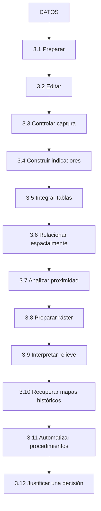
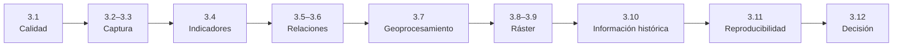
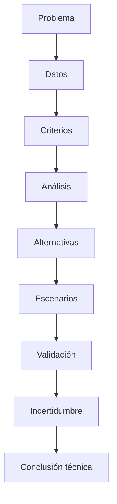
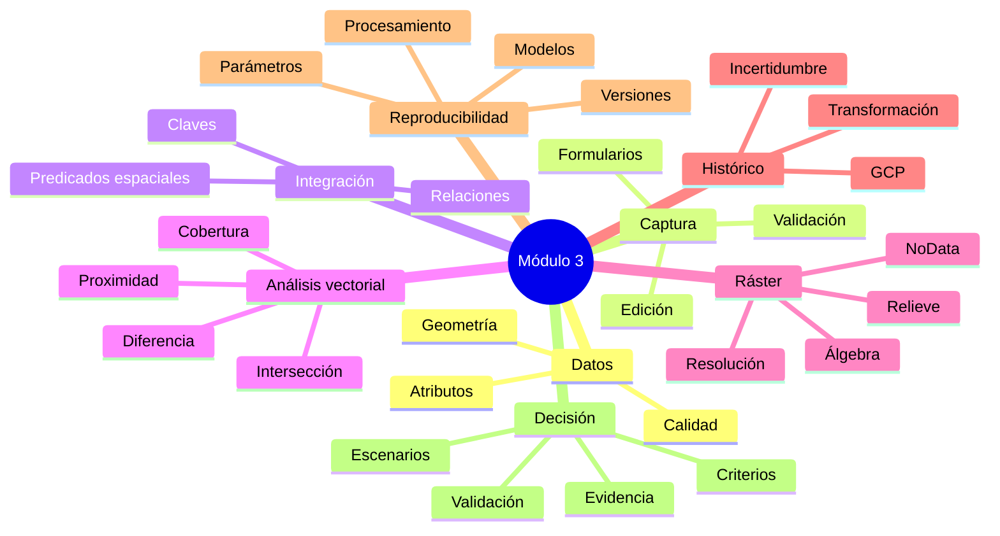

# Módulo 3 · Edición, integración y análisis espacial

<div class="grid cards" markdown>

-   :material-database-check:{ .lg .middle } **Preparar**

    ---

    Convertir datos recibidos en:

    **información confiable para el análisis.**

-   :material-vector-polyline-edit:{ .lg .middle } **Editar**

    ---

    Construir y corregir geometrías con:

    **precisión, topología y trazabilidad.**

-   :material-link-variant:{ .lg .middle } **Integrar**

    ---

    Relacionar información mediante:

    **atributos y posición espacial.**

-   :material-map-search:{ .lg .middle } **Analizar**

    ---

    Resolver preguntas mediante:

    **proximidad, superposición, ráster y relieve.**

-   :material-cog-sync:{ .lg .middle } **Reproducir**

    ---

    Transformar operaciones aisladas en:

    **procedimientos repetibles.**

-   :material-scale-balance:{ .lg .middle } **Justificar**

    ---

    Convertir resultados espaciales en:

    **evidencia para apoyar decisiones territoriales.**

</div>

[Comenzar el módulo](01-preparar-datos-confiables.md){ .md-button .md-button--primary }
[Ir al laboratorio final](12-laboratorio-decision-territorial.md){ .md-button }

---

## De operar QGIS a construir análisis

En los módulos anteriores aprendimos a:

```text
comprender los SIG
orientarnos en QGIS
cargar información
interpretar capas
seleccionar
filtrar
representar
```

En este módulo damos un paso adicional.

Ya no trabajaremos solamente con:

```text
herramientas individuales
```

sino con:

```text
procedimientos de análisis
```

capaces de transformar:

```text
datos
```

en:

```text
evidencia territorial
```

---

## La pregunta que guía el módulo

> **¿Cómo transformar información espacial heterogénea en resultados confiables, verificables y útiles para analizar el territorio y justificar una decisión?**

Para responderla necesitaremos controlar:

```text
calidad
geometría
atributos
relaciones
distancias
superposición
resolución
incertidumbre
reproducibilidad
```

---

## Ruta de aprendizaje



---

## Qué aprenderás

Al finalizar este módulo deberías ser capaz de:

- preparar datos vectoriales y ráster antes de utilizarlos;
- identificar problemas de estructura, geometría y atributos;
- digitalizar y editar entidades con precisión;
- configurar formularios para prevenir errores durante la captura;
- construir variables derivadas mediante expresiones;
- diferenciar `NULL`, cero y `NoData`;
- integrar tablas mediante claves y relaciones;
- modelar estructuras `1:1`, `1:N` y comprender `N:M`;
- detectar registros huérfanos y relaciones inconsistentes;
- traducir preguntas territoriales a relaciones espaciales;
- utilizar selección y unión espacial;
- construir buffers y analizar proximidad;
- utilizar recorte, intersección, diferencia y disolución;
- preparar ráster considerando resolución, extensión y alineación;
- utilizar remuestreo según el tipo de dato;
- combinar condiciones mediante álgebra ráster;
- derivar pendiente, sombreado y curvas de nivel;
- resumir variables continuas mediante estadísticas zonales;
- georreferenciar cartografía histórica;
- evaluar puntos de control, residuos e incertidumbre;
- utilizar la Caja de herramientas de Procesos;
- construir modelos mediante el Modelador gráfico;
- documentar parámetros, versiones y resultados;
- comparar escenarios;
- validar análisis;
- justificar una conclusión territorial mediante evidencia espacial.

---

## Estructura del módulo

### Bloque 1 · Construir datos confiables

<div class="grid cards" markdown>

-   :material-database-check:{ .lg .middle } **3.1 · Preparar datos confiables**

    ---

    Antes de analizar debemos conocer:

    ```text
    qué tenemos
    qué falta
    qué está mal
    qué puede corregirse
    ```

    Trabajaremos con:

    **diagnóstico, geometrías, atributos, duplicados y trazabilidad.**

    [Ir a 3.1 →](01-preparar-datos-confiables.md)

-   :material-vector-polyline-edit:{ .lg .middle } **3.2 · Digitalizar y editar con precisión**

    ---

    Aprenderemos a controlar:

    ```text
    vértices
    snapping
    rastreo
    topología
    división
    combinación
    ```

    para construir geometrías coherentes.

    [Ir a 3.2 →](02-digitalizar-editar-precision.md)

-   :material-form-select:{ .lg .middle } **3.3 · Diseñar formularios de captura**

    ---

    Transformaremos los formularios en:

    ```text
    una primera barrera de control de calidad
    ```

    mediante:

    **widgets, listas, predeterminados y restricciones.**

    [Ir a 3.3 →](03-disenar-formularios-captura.md)

</div>

---

### Bloque 2 · Derivar e integrar información

<div class="grid cards" markdown>

-   :material-function-variant:{ .lg .middle } **3.4 · Construir indicadores con expresiones**

    ---

    Utilizaremos:

    ```text
    lógica
    texto
    números
    geometría
    ```

    para producir:

    **porcentajes, densidades, clasificaciones y estados de cálculo.**

    [Ir a 3.4 →](04-construir-indicadores-expresiones.md)

-   :material-link-variant:{ .lg .middle } **3.5 · Integrar tablas sin perder información**

    ---

    Aprenderemos a diferenciar:

    ```text
    unión
    relación
    salida derivada
    ```

    utilizando:

    **PK, FK, cardinalidad e integridad referencial.**

    [Ir a 3.5 →](05-integrar-tablas.md)

-   :material-map-marker-path:{ .lg .middle } **3.6 · Traducir preguntas en relaciones espaciales**

    ---

    Convertiremos preguntas territoriales en:

    ```text
    dentro
    contiene
    intersecta
    toca
    ```

    y construiremos:

    **selecciones, conteos y uniones espaciales.**

    [Ir a 3.6 →](06-relaciones-espaciales.md)

</div>

---

### Bloque 3 · Analizar proximidad, superficies y ráster

<div class="grid cards" markdown>

-   :material-vector-circle:{ .lg .middle } **3.7 · Analizar proximidad y superposición**

    ---

    Utilizaremos:

    ```text
    Buffer
    Recortar
    Intersección
    Diferencia
    Disolver
    ```

    para estudiar:

    **cobertura, cercanía y superposición.**

    [Ir a 3.7 →](07-proximidad-superposicion.md)

-   :material-grid:{ .lg .middle } **3.8 · Preparar y combinar datos ráster**

    ---

    Trabajaremos con:

    ```text
    resolución
    extensión
    alineación
    NoData
    remuestreo
    ```

    antes de realizar:

    **álgebra ráster.**

    [Ir a 3.8 →](08-preparar-combinar-raster.md)

-   :material-terrain:{ .lg .middle } **3.9 · Interpretar relieve y resumirlo por zonas**

    ---

    A partir de un DEM construiremos:

    ```text
    hillshade
    pendiente
    curvas de nivel
    estadísticas zonales
    ```

    y compararemos:

    **unidades territoriales.**

    [Ir a 3.9 →](09-relieve-estadisticas-zonales.md)

</div>

---

### Bloque 4 · Recuperar, automatizar y decidir

<div class="grid cards" markdown>

-   :material-map-clock:{ .lg .middle } **3.10 · Recuperar información de mapas históricos**

    ---

    Aprenderemos a trabajar con:

    ```text
    GCP
    transformaciones
    residuos
    RMSE
    checkpoints
    ```

    para georreferenciar y recuperar:

    **información histórica.**

    [Ir a 3.10 →](10-recuperar-mapas-historicos.md)

-   :material-cog-sync:{ .lg .middle } **3.11 · Construir procedimientos reproducibles**

    ---

    Pasaremos de ejecutar:

    ```text
    herramientas aisladas
    ```

    a construir:

    ```text
    modelos
    parámetros
    dependencias
    versiones
    ```

    mediante el Modelador gráfico.

    [Ir a 3.11 →](11-procedimientos-reproducibles.md)

-   :material-map-check:{ .lg .middle } **3.12 · Laboratorio: justificar una decisión territorial**

    ---

    Integraremos todo el módulo para convertir:

    ```text
    datos
    +
    criterios
    +
    análisis
    +
    validación
    ```

    en:

    **evidencia espacial para apoyar una decisión territorial.**

    [Ir a 3.12 →](12-laboratorio-decision-territorial.md)

</div>

---

## Cómo se conectan las lecciones

Las lecciones no son independientes.

Cada una agrega una capa al procedimiento analítico:



### La lógica general es

```text
dato confiable
↓
relación correcta
↓
operación adecuada
↓
resultado validado
↓
interpretación
↓
decisión informada
```

---

## Competencias por dimensión

=== "Datos"

    Deberías ser capaz de:

    ```text
    inventariar
    revisar
    limpiar
    estructurar
    documentar
    ```

=== "Geometría"

    Deberías poder trabajar con:

    ```text
    puntos
    líneas
    polígonos
    ráster
    ```

    comprendiendo cómo cambia cada modelo.

=== "Atributos"

    Deberías poder:

    ```text
    validar
    relacionar
    transformar
    calcular
    resumir
    ```

=== "Análisis"

    Deberías poder traducir preguntas a:

    ```text
    relaciones
    distancias
    superposiciones
    condiciones
    indicadores
    ```

=== "Calidad"

    Deberías poder identificar:

    ```text
    errores
    anomalías
    NoData
    NULL
    casos frontera
    incertidumbre
    ```

=== "Reproducibilidad"

    Deberías poder documentar:

    ```text
    fuentes
    parámetros
    procesos
    versiones
    salidas
    ```

=== "Decisión"

    Deberías poder distinguir:

    ```text
    dato
    evidencia
    criterio
    supuesto
    conclusión
    ```

---

## Herramientas principales del módulo

Durante las lecciones trabajaremos, entre otras, con:

| Área | Herramientas / conceptos |
|---|---|
| Edición | Snapping, vértices, rastreo, topología |
| Formularios | Widgets, listas, restricciones |
| Expresiones | `CASE`, `coalesce()`, funciones geométricas |
| Tablas | Joins, relaciones, `relation_aggregate()` |
| Relaciones espaciales | Seleccionar por ubicación, unión espacial |
| Geoprocesamiento | Buffer, Clip, Intersect, Difference, Dissolve |
| Ráster | Warp, Clip Raster, Raster Calculator |
| Relieve | Hillshade, Slope, Contour |
| Resúmenes | Estadísticas zonales |
| Histórico | Georreferenciador |
| Automatización | Procesamiento, lotes, Modelador gráfico |

!!! info "No necesitas memorizar todas las herramientas"

    Lo importante es aprender a responder:

    > **¿Qué operación representa correctamente la pregunta que estoy intentando resolver?**

---

## Tipos de productos que construiremos

<div class="grid cards" markdown>

-   :material-database:{ .lg .middle } **Datos estructurados**

    ---

    GeoPackage con:

    ```text
    geometrías
    atributos
    relaciones
    ```

-   :material-image:{ .lg .middle } **Productos ráster**

    ---

    ```text
    pendiente
    máscaras
    hillshade
    ```

-   :material-chart-box:{ .lg .middle } **Indicadores**

    ---

    ```text
    cobertura
    densidad
    conteos
    resúmenes
    ```

-   :material-cog-sync:{ .lg .middle } **Modelos**

    ---

    Procedimientos:

    ```text
    .model3
    ```

-   :material-map:{ .lg .middle } **Mapas**

    ---

    Productos destinados a:

    ```text
    interpretar
    comparar
    comunicar
    ```

-   :material-file-document-check:{ .lg .middle } **Documentación**

    ---

    ```text
    inventarios
    matrices
    README
    metodología
    ```

</div>

---

## El principio transversal del módulo

Todas las lecciones seguirán aproximadamente esta secuencia:


!!! quote "Una herramienta no es una metodología"

    Saber dónde está un botón permite ejecutar una operación.

    Saber:

    ```text
    por qué utilizarla
    qué supone
    qué modifica
    cómo validarla
    ```

    permite realizar:

    ```text
    análisis espacial
    ```

---

## Errores que intentaremos dejar atrás

=== "Ejecutar primero, pensar después"

    Cambiaremos:

    ```text
    herramienta
    → resultado
    ```

    por:

    ```text
    pregunta
    → método
    → herramienta
    ```

=== "Confiar porque se ve bien"

    Un mapa visualmente correcto puede contener:

    ```text
    errores
    ```

=== "Corregir anomalías automáticamente"

    Aprenderemos a diferenciar:

    ```text
    anomalía
    ```

    de:

    ```text
    error confirmado
    ```

=== "Ignorar NULL y NoData"

    La ausencia de información también debe:

    ```text
    interpretarse
    ```

=== "Guardar todo como final"

    Separaremos:

    ```text
    originales
    trabajo
    resultados
    ```

=== "Recordar de memoria"

    Sustituiremos memoria por:

    ```text
    trazabilidad
    modelos
    documentación
    ```

---

## Organización recomendada

Para las prácticas del módulo puedes utilizar:

```text
modulo-03/
├── datos/
│   ├── originales/
│   ├── trabajo/
│   └── resultados/
│
├── proyecto/
│   └── modulo_03.qgz
│
├── modelos/
│
├── evidencias/
│   ├── capturas/
│   └── gifs/
│
└── documentacion/
```

### Principio

```text
ORIGINALES
↓
TRABAJO
↓
RESULTADOS
```

!!! warning "No modifiques directamente los datos originales"

---

## Convención de nombres

Evita:

```text
capa1
capa2
final
final2
nuevo
bueno
```

Prefiere:

```text
equipamientos_validos
buffer_salud_500m
pendiente_grados
cobertura_distritos
limite_1985_georef
```

### Los nombres deben responder

```text
qué contiene
qué proceso representa
qué parámetro relevante utilizó
```

---

## Cómo trabajar las prácticas

En cada lección encontrarás:

```text
conceptos
predicciones
errores preparados
demostraciones
checkpoints
laboratorio
reto
autoevaluación
```

### No saltes directamente al laboratorio

El objetivo no es:

```text
seguir instrucciones mecánicamente
```

sino comprender:

```text
qué ocurre en cada paso
```

---

## Qué debes registrar durante el módulo

Mantén un pequeño registro de trabajo con:

| Elemento | Ejemplo |
|---|---|
| Fuente | Cartografía municipal |
| Fecha | 2026 |
| SRC | EPSG:xxxx |
| Operación | Buffer |
| Parámetro | 500 m |
| Salida | `buffer_salud_500m` |
| Validación | Revisión de muestra |
| Observación | 2 casos frontera |

### Esto facilitará 3.11 y 3.12

cuando debamos reconstruir:

```text
el procedimiento completo
```

---

## Evaluación del módulo

La evaluación no se centrará únicamente en:

```text
obtener una salida
```

Se observará también:

<div class="grid cards" markdown>

-   :material-help-circle:{ .lg .middle } **Pregunta**

    ---

    ¿Comprendiste el problema?

-   :material-database-check:{ .lg .middle } **Datos**

    ---

    ¿Revisaste calidad y estructura?

-   :material-routes:{ .lg .middle } **Método**

    ---

    ¿Elegiste operaciones coherentes?

-   :material-test-tube:{ .lg .middle } **Pruebas**

    ---

    ¿Verificaste el resultado?

-   :material-file-document:{ .lg .middle } **Trazabilidad**

    ---

    ¿Puede reconstruirse lo que hiciste?

-   :material-message-text:{ .lg .middle } **Interpretación**

    ---

    ¿La conclusión corresponde realmente a la evidencia?

</div>

---

## El laboratorio final

Todo el módulo converge en:

**3.12 · Justificar una decisión territorial**

Allí deberás integrar:

```text
vector
ráster
indicadores
relaciones
geoprocesamiento
modelado
validación
```

para resolver una pregunta completa.



[Ver laboratorio final →](12-laboratorio-decision-territorial.md){ .md-button .md-button--primary }

---

## Autoevaluación inicial

Antes de comenzar, intenta responder sin buscar.

??? question "1. ¿Cuál es la diferencia entre dato correcto y dato útil?"

    Un dato puede estar técnicamente correcto pero no ser pertinente para una pregunta concreta.

??? question "2. ¿Una geometría válida garantiza que esté correctamente ubicada?"

    No.

??? question "3. ¿NULL y cero representan lo mismo?"

    No.

??? question "4. ¿Unión y relación 1:N son equivalentes?"

    No.

??? question "5. ¿Intersecta y está dentro significan lo mismo?"

    No.

??? question "6. ¿Un buffer de 500 m representa 500 m caminando?"

    No necesariamente.

??? question "7. ¿Mayor resolución ráster significa automáticamente mayor exactitud?"

    No.

??? question "8. ¿NoData equivale a cero?"

    No.

??? question "9. ¿Un RMSE pequeño garantiza una buena georreferenciación?"

    No.

??? question "10. ¿Un modelo automatizado garantiza un análisis correcto?"

    No.

??? question "11. ¿El indicador más alto determina automáticamente la mejor decisión?"

    No.

??? question "12. ¿Qué tendremos que aprender entonces?"

    A controlar:

    ```text
    datos
    método
    supuestos
    parámetros
    validación
    interpretación
    ```

---

## Antes de comenzar

!!! success "Si recuerdas una sola idea"

    Durante este módulo no preguntes únicamente:

    > **¿Dónde está la herramienta?**

    Pregunta también:

    > **¿Qué pregunta responde, qué supone y cómo compruebo que su resultado tiene sentido?**

---

## Comenzar

<div class="grid cards" markdown>

-   :material-numeric-1-circle:{ .lg .middle } **Primera etapa**

    ---

    Comenzaremos comprobando si los datos son realmente aptos para trabajar.

    [3.1 Preparar datos confiables →](01-preparar-datos-confiables.md)

-   :material-map-check:{ .lg .middle } **Meta final**

    ---

    Terminaremos construyendo una justificación territorial completa.

    [3.12 Laboratorio final →](12-laboratorio-decision-territorial.md)

</div>

---

## Mapa mental del módulo



---

## Ruta completa

```text
3.1  PREPARAR
 ↓
3.2  EDITAR
 ↓
3.3  CONTROLAR CAPTURA
 ↓
3.4  CALCULAR
 ↓
3.5  INTEGRAR
 ↓
3.6  RELACIONAR
 ↓
3.7  ANALIZAR PROXIMIDAD
 ↓
3.8  PREPARAR RÁSTER
 ↓
3.9  INTERPRETAR RELIEVE
 ↓
3.10 RECUPERAR HISTORIA
 ↓
3.11 REPRODUCIR
 ↓
3.12 JUSTIFICAR
```

[Comenzar con 3.1 →](01-preparar-datos-confiables.md){ .md-button .md-button--primary }

---

## Referencias del módulo

- [QGIS 3.44 — Manual de usuario](https://docs.qgis.org/3.44/es/docs/user_manual/)  
  Referencia general para el trabajo con capas vectoriales, ráster, expresiones y procesamiento.

- [QGIS 3.44 — Trabajo con datos vectoriales](https://docs.qgis.org/3.44/es/docs/user_manual/working_with_vector/)  
  Edición, atributos, formularios, relaciones y propiedades vectoriales.

- [QGIS 3.44 — Trabajo con datos ráster](https://docs.qgis.org/3.44/es/docs/user_manual/working_with_raster/)  
  Propiedades, visualización, análisis y procesamiento de datos matriciales.

- [QGIS 3.44 — Expresiones](https://docs.qgis.org/3.44/es/docs/user_manual/expressions/)  
  Lenguaje de expresiones utilizado para cálculos, condiciones e indicadores.

- [QGIS 3.44 — Procesamiento](https://docs.qgis.org/3.44/es/docs/user_manual/processing/)  
  Caja de herramientas, ejecución por lotes y Modelador gráfico.

- [QGIS Training Manual](https://docs.qgis.org/3.44/es/docs/training_manual/)  
  Material oficial de formación y ejercicios prácticos.

- [Material for MkDocs — Reference](https://squidfunk.github.io/mkdocs-material/reference/)  
  Referencia de los componentes visuales utilizados en la documentación.