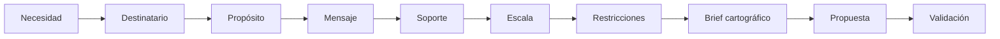
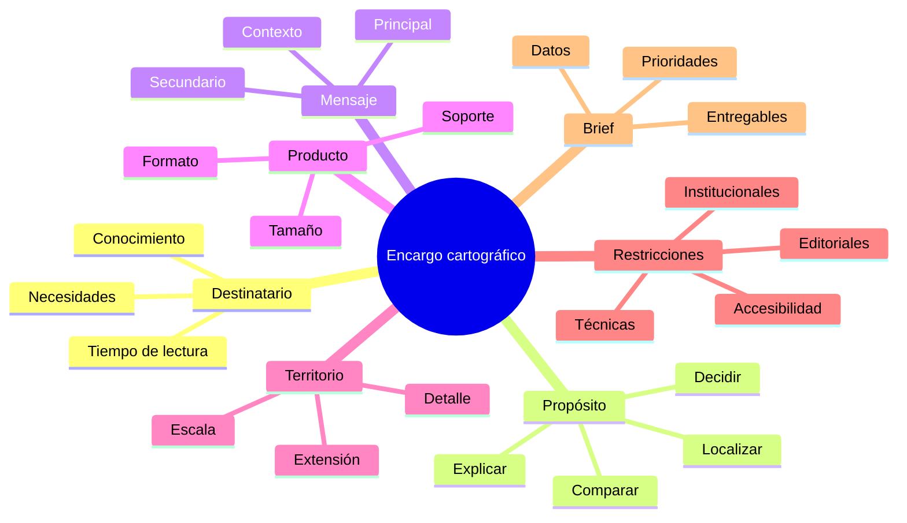
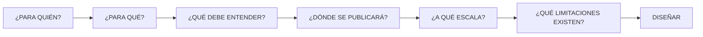

# 4.1 Definir el encargo cartográfico

Un mapa técnicamente correcto puede fracasar como producto de comunicación.

Puede contener:

```text
datos correctos
simbología correcta
escala correcta
```

y aun así no responder a lo que necesita quien lo utilizará.

La causa suele aparecer antes de abrir QGIS:

```text
no se definió correctamente el encargo cartográfico
```

Esta lección parte de una idea sencilla:

> **Diseñar un mapa no comienza escogiendo colores. Comienza definiendo qué debe comunicar, para quién, en qué contexto y bajo qué restricciones.**

---

## Misión y mapa de aprendizaje

### El problema

Imagina que dispones de exactamente los mismos datos:

```text
distritos
población
centros de salud
red vial
```

y debes producir tres mapas.

### Producto A

Para:

```text
un gabinete municipal
```

que debe decidir dónde priorizar inversión.

### Producto B

Para:

```text
un informe técnico
```

que documentará la metodología.

### Producto C

Para:

```text
publicación en redes sociales
```

destinada a población general.

Los datos son los mismos.

Pero los tres mapas probablemente deberían ser diferentes.

¿Por qué?

Porque cambian:

```text
destinatario
propósito
mensaje
nivel de detalle
formato
espacio disponible
tiempo de lectura
```

### Ruta de la lección



Al finalizar deberías poder transformar una solicitud vaga como:

> “Necesito un mapa de población.”

en un encargo mucho más preciso:

> “Necesito un mapa A4 horizontal para una reunión de gabinete que permita identificar rápidamente los distritos con mayor concentración de población y su relación con los centros de salud existentes.”

Eso ya puede convertirse en una especificación de diseño.

---

## 1. El mapa como producto de comunicación

En los módulos anteriores utilizamos mapas principalmente para:

```text
explorar
analizar
comprobar
interpretar
```

Ahora añadiremos otra función:

```text
comunicar
```

### Un mapa no muestra todo

Todo producto cartográfico implica:

```text
seleccionar
omitir
jerarquizar
simplificar
destacar
```

Por tanto, diseñar un mapa significa tomar decisiones sobre:

> **qué merece la atención del lector y qué debe permanecer en segundo plano.**

### El error de intentar mostrar todo

Supongamos que disponemos de:

```text
35 capas
```

Eso no significa que el mapa final deba contener:

```text
35 capas visibles
```

Si tratamos de mostrar:

```text
calles
manzanas
ríos
parcelas
hospitales
escuelas
mercados
OTB
distritos
curvas de nivel
uso de suelo
población
```

simultáneamente, podemos obtener:

```text
más información
```

pero menos:

```text
comunicación
```

!!! warning "Cantidad de información ≠ calidad cartográfica"

    Un mapa eficiente muestra la información necesaria para responder una pregunta concreta.

---

## 2. Empezar por el destinatario

La primera pregunta debería ser:

> **¿Quién va a leer este mapa?**

No es una pregunta decorativa.

Condiciona muchas decisiones posteriores.

### Diferentes destinatarios

Un producto puede estar dirigido a:

| Destinatario | Necesidad probable |
|---|---|
| Equipo técnico SIG | Detalle, precisión, metodología |
| Autoridad municipal | Síntesis y comparación |
| Personal operativo | Localización clara y referencias |
| Investigador | Variables, unidades y fuentes |
| Población general | Lectura rápida y lenguaje accesible |
| Estudiantes | Explicación y estructura pedagógica |

### Conocimiento previo

También debemos estimar:

```text
qué sabe el lector
```

Un analista territorial puede comprender:

```text
densidad hab/km²
```

sin explicación extensa.

Para otro público quizá sea necesario explicar:

```text
qué significa
cómo leerlo
```

### Tiempo de lectura

No es lo mismo un mapa que se analizará durante:

```text
20 minutos
```

que uno que debe comprenderse en:

```text
10 segundos
```

### Predicción

¿Qué producto debería contener más detalle?

=== "Mapa para informe técnico"

    Normalmente puede admitir:

    ```text
    mayor densidad informativa
    referencias
    metodología
    unidades
    ```

=== "Mapa para presentación ejecutiva"

    Suele requerir:

    ```text
    síntesis
    jerarquía visual fuerte
    menor carga secundaria
    ```

!!! info "Principio"

    Diseñamos para:

    ```text
    un lector concreto
    ```

    no para un lector abstracto que entiende todo.

---

## 3. Definir el propósito antes del contenido

Después del destinatario debemos preguntar:

> **¿Qué debe permitir hacer el mapa?**

Un mapa puede tener propósitos diferentes.

### Localizar

Pregunta:

```text
¿Dónde está?
```

Ejemplo:

```text
ubicación de centros de salud
```

### Comparar

Pregunta:

```text
¿Dónde hay más o menos?
```

Ejemplo:

```text
densidad poblacional por distrito
```

### Identificar relaciones

Pregunta:

```text
¿cómo se distribuyen conjuntamente?
```

Ejemplo:

```text
población y cobertura de servicios
```

### Explicar

Pregunta:

```text
¿qué patrón territorial queremos comunicar?
```

### Apoyar una decisión

Pregunta:

```text
¿dónde conviene intervenir?
```

### Documentar

Pregunta:

```text
¿qué resultado produjo un análisis?
```

---

### El mismo dato puede tener distintos propósitos

Supongamos una capa de centros de salud.

Podríamos utilizarla para:

```text
MAPA 1
Localizar todos los establecimientos
```

o:

```text
MAPA 2
Mostrar zonas sin cobertura
```

o:

```text
MAPA 3
Comparar número de establecimientos por distrito
```

El dato fuente puede ser el mismo.

La representación no.

!!! success "El propósito determina qué información necesita convertirse en protagonista"

---

## 4. Formular el mensaje cartográfico

Un error habitual consiste en definir el producto así:

> “Mapa de distritos.”

Eso describe una capa.

No describe un mensaje.

### Mejor pregunta

> ¿Qué debe comprender el lector después de mirar el mapa?

Por ejemplo:

```text
Los distritos del sector oriental presentan
mayor densidad poblacional.
```

o:

```text
Existen sectores con alta población
y baja proximidad a centros de salud.
```

### Del tema al mensaje

| Tema | Mensaje más preciso |
|---|---|
| Población | Distribución de la densidad poblacional |
| Salud | Sectores alejados de centros de salud |
| Vías | Corredores principales de conectividad |
| Riesgo | Áreas urbanizadas expuestas a amenaza |
| Equipamientos | Concentración y vacíos territoriales |

### El test de una oración

Antes de diseñar intenta completar:

> **Este mapa debe permitir comprender que...**

Si no puedes completar esa oración con claridad:

```text
el encargo todavía está incompleto
```

---

### Título temático frente a título comunicativo

Comparemos.

#### Título débil

```text
POBLACIÓN POR DISTRITO
```

#### Título más informativo

```text
La mayor concentración poblacional
se localiza en los distritos centrales
```

No siempre necesitamos usar un título narrativo.

Pero pensar en ese mensaje ayuda a determinar:

```text
qué debe dominar visualmente
```

---

## Checkpoint 1

Antes de seguir deberías poder responder:

- [ ] ¿Quién utilizará el mapa?
- [ ] ¿Qué conocimiento previo tiene?
- [ ] ¿Cuánto tiempo tendrá para leerlo?
- [ ] ¿Qué acción debe facilitar?
- [ ] ¿Cuál es el mensaje principal?
- [ ] ¿Qué información es secundaria?

Si alguna respuesta sigue siendo:

```text
no sé
```

todavía no conviene comenzar la simbología final.

---

## 5. Soporte, formato y contexto de uso

El mismo mapa no debería diseñarse automáticamente igual para:

```text
A0
A4
pantalla de computadora
teléfono
presentación
sitio web
```

### Soporte impreso

Debemos considerar:

```text
tamaño físico
distancia de lectura
resolución
márgenes
impresora
color
```

### Informe digital

Puede requerir:

```text
A4
PDF
lectura en pantalla
zoom
```

### Presentación

El mapa podría proyectarse.

Por tanto:

```text
textos pequeños
líneas finas
detalles secundarios
```

pueden desaparecer.

### Teléfono

El espacio es extremadamente limitado.

Necesitamos:

```text
síntesis
contraste
tipografía mayor
menos elementos
```

### Web

Puede existir:

```text
zoom
interacción
capas
tooltips
```

por lo que el diseño puede distribuir información de otra manera.

---

### Comparación

| Soporte | Consideración principal |
|---|---|
| A3 impreso | Detalle y lectura física |
| A4 informe | Equilibrio entre mapa y documento |
| Presentación 16:9 | Lectura a distancia |
| Teléfono | Máxima simplificación |
| Web interactiva | Navegación e interacción |

!!! warning "No diseñes primero y preguntes después dónde se publicará"

---

### Tamaño final, no tamaño de edición

Es frecuente diseñar ampliado en el monitor.

Pero el producto quizá termine ocupando:

```text
12 × 8 cm
```

en un informe.

El control real debe hacerse a:

```text
tamaño final
```

Esta idea será fundamental en:

```text
4.7
4.11
```

---

## 6. Escala y extensión como decisiones del encargo

Antes de simbolizar debemos conocer:

```text
qué territorio
```

y:

```text
a qué escala aproximada
```

queremos representar.

### Extensión

Puede ser:

```text
municipio completo
distrito
centro histórico
barrio
corredor vial
```

### Escala

Condiciona:

```text
detalle
generalización
etiquetado
grosor
visibilidad
```

### Ejemplo

Una red vial representada en:

```text
1:5 000
```

puede mostrar:

```text
calles secundarias
nombres
detalles
```

La misma red en:

```text
1:250 000
```

necesita:

```text
selección
simplificación
jerarquización
```

!!! info "Anticipo de 4.2"

    La información debe adaptarse a la escala de salida.

    No basta con:

    ```text
    reducir el zoom
    ```

---

### Escala cartográfica y precisión

No deberíamos presentar datos de precisión limitada como si fueran extremadamente exactos.

Por ejemplo:

```text
fuente generalizada
```

no adquiere mayor precisión porque imprimamos:

```text
un mapa muy grande
```

### Regla conceptual

```text
escala de salida
≤
detalle que los datos pueden sostener
```

No como fórmula matemática estricta, sino como principio de coherencia cartográfica.

---

## 7. Identificar restricciones desde el principio

Todo encargo tiene restricciones.

Algunas son técnicas.

Otras institucionales.

Otras editoriales.

### Restricciones de formato

```text
A4 vertical
A3 horizontal
16:9
1080 × 1080 px
```

### Restricciones institucionales

```text
logotipo obligatorio
pie institucional
tipografía definida
colores institucionales
```

### Restricciones de contenido

```text
debe aparecer la fuente
debe incluir código del proyecto
debe mostrar fecha
```

### Restricciones técnicas

```text
máximo 5 MB
PDF
300 dpi
sin fuentes externas
```

### Restricciones temporales

```text
entrega hoy
actualización mensual
producción automática
```

### Restricciones de accesibilidad

Podemos necesitar:

```text
buen contraste
no depender únicamente del color
tipografía legible
```

---

### Restricción no significa problema

Una restricción puede ayudarnos a:

```text
reducir posibilidades
```

y tomar decisiones coherentes.

Por ejemplo:

```text
A4 vertical
```

ya limita:

```text
proporción del mapa
tamaño disponible
cantidad de elementos
```

---

## 8. Mapa de análisis y mapa de comunicación

Esta distinción es fundamental.

### Mapa de trabajo

Durante un análisis podemos necesitar mostrar:

```text
muchas capas
IDs
límites auxiliares
resultados intermedios
```

Su objetivo es:

```text
investigar
```

### Mapa de comunicación

Su objetivo es:

```text
transmitir una conclusión
```

Por tanto puede necesitar eliminar:

```text
capas auxiliares
códigos internos
geometrías temporales
```

---

### Ejemplo

Durante un análisis de cobertura podríamos visualizar:

```text
centros
buffers individuales
buffers disueltos
límites
intersecciones
áreas sin cobertura
IDs
```

En el mapa final quizá solo necesitemos:

```text
área sin cobertura
centros existentes
distritos
vías principales
```

!!! success "El mapa final no tiene que revelar visualmente cada paso del análisis"

    La metodología puede documentarse:

    ```text
    en el informe
    ```

    mientras el mapa comunica:

    ```text
    el resultado
    ```

---

### Comparación visual prevista

!!! info "Captura pendiente · 4.1-01"

    - **Tipo:** PNG comparativo.
    - **Archivo:** `assets/images/modulo-04/4-1/4-1-01-analisis-vs-comunicacion.png`
    - **Mostrar:**
        1. proyecto de análisis con numerosas capas;
        2. mapa final simplificado.
    - **Objetivo didáctico:** demostrar que análisis y comunicación tienen necesidades diferentes.

---

## 9. Construir el brief cartográfico

Ahora convertiremos toda la información anterior en un documento breve.

Un **brief cartográfico** describe:

```text
qué debemos producir
para quién
para qué
cómo será utilizado
qué limitaciones existen
```

### Plantilla básica

| Elemento | Definición |
|---|---|
| Producto | |
| Destinatario | |
| Propósito | |
| Pregunta | |
| Mensaje principal | |
| Territorio | |
| Escala aproximada | |
| Soporte | |
| Formato | |
| Datos principales | |
| Información secundaria | |
| Restricciones | |
| Fecha de datos | |
| Fecha de entrega | |

---

### Añadir prioridades

También conviene establecer:

```text
PRIMARIO
SECUNDARIO
CONTEXTO
```

Ejemplo:

| Información | Nivel |
|---|---|
| Densidad poblacional | PRIMARIO |
| Centros de salud | SECUNDARIO |
| Distritos | CONTEXTO |
| Red vial principal | CONTEXTO |

Esto anticipa:

```text
jerarquía visual
```

que desarrollaremos en 4.5.

---

### Añadir una hipótesis de lectura

Podemos registrar:

> El lector debería identificar primero las zonas de mayor densidad y después comprobar su relación con los centros de salud.

Esto define una secuencia visual:

```text
1. fenómeno principal
2. relación secundaria
3. contexto
```

---

## Caso guiado · Un mismo territorio, dos públicos

Trabajaremos con un mismo conjunto de información:

```text
distritos
población
centros de salud
vías principales
```

Queremos producir dos mapas.

---

### Propuesta A · Gabinete municipal

#### Destinatario

```text
autoridades y responsables de planificación
```

#### Propósito

```text
identificar sectores con alta concentración poblacional
y baja cobertura de servicios
```

#### Tiempo esperado de lectura

```text
30–60 segundos
```

#### Soporte

```text
presentación 16:9
```

#### Prioridad

```text
conclusión
```

#### Elementos

```text
fenómeno principal
centros de salud
nombres de distritos
pocas referencias adicionales
```

---

### Propuesta B · Informe técnico

#### Destinatario

```text
equipo de planificación territorial
```

#### Propósito

```text
documentar espacialmente el análisis de cobertura
```

#### Tiempo de lectura

```text
varios minutos
```

#### Soporte

```text
A4 horizontal
PDF
```

#### Prioridad

```text
detalle + verificabilidad
```

#### Puede incluir

```text
clasificación
escala
fuentes
unidades
fecha
metodología resumida
más elementos de referencia
```

---

### Comparación

| Elemento | Gabinete | Informe técnico |
|---|---|---|
| Información | Muy sintetizada | Más detallada |
| Texto | Breve | Más explicativo |
| Leyenda | Reducida | Completa |
| Contexto | Mínimo necesario | Mayor |
| Metodología | Casi invisible | Documentada |
| Lectura | Muy rápida | Analítica |
| Soporte | Presentación | PDF |

!!! info "Captura pendiente · 4.1-02"

    - **Tipo:** Mockup/PNG.
    - **Archivo:** `assets/images/modulo-04/4-1/4-1-02-dos-publicos.png`
    - **Mostrar:** dos composiciones preliminares del mismo territorio.
    - **Objetivo didáctico:** visualizar cómo el destinatario modifica el diseño.

---

## Práctica y consolidación

### Predicción 1

Te solicitan:

> “Haz un mapa de todos los equipamientos municipales.”

Antes de abrir QGIS escribe al menos cinco preguntas que deberías hacer.

Una respuesta posible:

```text
¿Para quién es?
¿Para qué se utilizará?
¿Qué tipos de equipamientos?
¿Qué territorio?
¿Qué tamaño tendrá el producto?
```

Pero también podrían ser necesarias:

```text
¿se desea ubicación o análisis?
¿se diferenciarán categorías?
¿qué fecha tienen los datos?
¿se necesita impresión?
```

---

### Predicción 2

Dos personas solicitan:

```text
Mapa de riesgo
```

Una trabaja en:

```text
gestión de emergencias
```

La otra prepara:

```text
material informativo para población
```

¿El mapa debería ser idéntico?

```text
NO NECESARIAMENTE
```

Porque pueden cambiar:

```text
nivel técnico
lenguaje
detalle
elementos de referencia
mensaje
```

---

### Checkpoint 2

Completa mentalmente:

> Un encargo cartográfico no está completo mientras no conozca...

- [ ] destinatario;
- [ ] propósito;
- [ ] mensaje;
- [ ] territorio;
- [ ] soporte;
- [ ] escala aproximada;
- [ ] restricciones;
- [ ] información prioritaria.

---

## Laboratorio guiado · Crear dos briefs para el mismo territorio

### Escenario

Dispones de información sobre:

```text
población
distritos
centros de salud
vías principales
```

Debes diseñar conceptualmente dos productos.

### Producto A

```text
presentación para gabinete municipal
```

### Producto B

```text
página de un informe técnico
```

---

### Fase 1 · Definir el fenómeno

Responde:

```text
¿Qué fenómeno quiero comunicar?
```

Por ejemplo:

```text
relación entre población y cobertura de salud
```

---

### Fase 2 · Formular la pregunta

Evita:

```text
Mapa de salud
```

Prefiere:

> ¿Qué sectores concentran población y presentan menor proximidad a centros de salud?

---

### Fase 3 · Definir mensaje

Completa:

> Este mapa debe permitir comprender que...

No diseñes todavía.

---

### Fase 4 · Definir público A

Completa:

| Elemento | Gabinete |
|---|---|
| Conocimiento técnico | |
| Tiempo de lectura | |
| Decisión que debe apoyar | |
| Información principal | |
| Información secundaria | |

---

### Fase 5 · Definir público B

| Elemento | Informe técnico |
|---|---|
| Conocimiento técnico | |
| Tiempo de lectura | |
| Uso | |
| Información principal | |
| Información secundaria | |

---

### Fase 6 · Definir soporte

Para A:

```text
16:9
```

Para B:

```text
A4
```

---

### Fase 7 · Definir extensión

Decide si mostrarás:

```text
municipio completo
```

o una parte.

Justifica.

---

### Fase 8 · Identificar información principal

Marca:

```text
PRIMARIO
```

---

### Fase 9 · Identificar información secundaria

Marca:

```text
SECUNDARIO
```

---

### Fase 10 · Identificar contexto

Marca:

```text
CONTEXTO
```

---

### Fase 11 · Construir los briefs

#### Brief A

| Elemento | Definición |
|---|---|
| Producto | |
| Destinatario | |
| Propósito | |
| Pregunta | |
| Mensaje | |
| Extensión | |
| Escala | |
| Soporte | |
| Formato | |
| Fenómeno principal | |
| Contexto | |
| Restricciones | |

#### Brief B

| Elemento | Definición |
|---|---|
| Producto | |
| Destinatario | |
| Propósito | |
| Pregunta | |
| Mensaje | |
| Extensión | |
| Escala | |
| Soporte | |
| Formato | |
| Fenómeno principal | |
| Contexto | |
| Restricciones | |

---

### Fase 12 · Bosquejar

Sin preocuparte todavía por colores exactos, dibuja:

```text
mapa
título
leyenda
fuente
otros elementos
```

### Propuesta A

```text
┌──────────────────────────────────────┐
│              TÍTULO                  │
│                                      │
│                                      │
│             MAPA                     │
│                                      │
│                         LEYENDA       │
│                                      │
│ FUENTE                               │
└──────────────────────────────────────┘
```

### Propuesta B

```text
┌──────────────────────────────────────┐
│ TÍTULO                               │
├───────────────────────────┬──────────┤
│                           │ LEYENDA  │
│                           │          │
│           MAPA            │ DATOS    │
│                           │          │
│                           │ NOTAS    │
├───────────────────────────┴──────────┤
│ FUENTES · ESCALA · FECHA             │
└──────────────────────────────────────┘
```

---

### Fase 13 · Crear una primera maqueta en QGIS

Todavía no necesitas perfeccionar:

```text
colores
etiquetas
leyenda
```

Solo comprueba:

```text
proporciones
extensión
espacio disponible
jerarquía general
```

!!! info "Captura pendiente · 4.1-03"

    - **Tipo:** GIF.
    - **Archivo:** `assets/images/modulo-04/4-1/4-1-03-maqueta-composicion.gif`
    - **Mostrar:**
        1. crear una composición;
        2. definir página;
        3. insertar marco de mapa;
        4. colocar título/leyenda provisional;
        5. comparar espacio disponible.
    - **Objetivo didáctico:** demostrar que el soporte condiciona la composición desde el comienzo.

---

### Fase 14 · Reducir contenido

Elimina cualquier elemento que:

```text
no ayude al propósito
```

Pregunta para cada capa:

> ¿Qué pierde el lector si elimino esto?

Si la respuesta es:

```text
nada relevante
```

probablemente no sea necesaria.

---

### Fase 15 · Comparar

Completa:

| Decisión | Producto A | Producto B |
|---|---|---|
| Soporte | | |
| Extensión | | |
| Elemento principal | | |
| Detalle | | |
| Texto | | |
| Contexto | | |
| Tiempo de lectura | | |

---

### Evidencia del laboratorio

!!! info "Captura pendiente · 4.1-04"

    - **Tipo:** PNG comparativo.
    - **Archivo:** `assets/images/modulo-04/4-1/4-1-04-laboratorio.png`
    - **Mostrar:** las dos propuestas preliminares lado a lado.
    - **Objetivo didáctico:** demostrar que un mismo dataset puede producir dos soluciones válidas y diferentes.

---

## Reto práctico · Diseñar dos propuestas para públicos diferentes

!!! example "Reto 4.1"

    Utiliza un territorio y un conjunto de datos de tu elección.

    Debes diseñar **dos encargos cartográficos distintos utilizando los mismos datos base**.

    El objetivo es demostrar que:

    ```text
    cambiar destinatario y propósito
    cambia el diseño
    ```

### Escoge dos destinatarios

Por ejemplo:

```text
A · autoridad municipal
B · equipo técnico
```

o:

```text
A · población general
B · investigador
```

---

### Parte 1 · Define el problema

Escribe:

```text
tema:
territorio:
datos disponibles:
```

---

### Parte 2 · Formula una pregunta

Debe poder responderse espacialmente.

Evita:

```text
Mapa de...
```

---

### Parte 3 · Define el mensaje

Completa:

> El lector debe comprender que...

---

### Parte 4 · Construye el brief A

Incluye:

```text
destinatario
propósito
mensaje
soporte
escala
extensión
restricciones
```

---

### Parte 5 · Construye el brief B

Utiliza el mismo:

```text
territorio
datos
```

pero cambia:

```text
destinatario
```

y/o:

```text
propósito
```

---

### Parte 6 · Jerarquiza información

Para cada propuesta clasifica las capas como:

```text
PRIMARIO
SECUNDARIO
CONTEXTO
NO NECESARIO
```

---

### Parte 7 · Diseña un wireframe

No es necesario finalizar todavía la cartografía.

Debes definir:

```text
posición del mapa
título
leyenda
fuente
elementos complementarios
```

---

### Parte 8 · Construye dos maquetas

En QGIS crea dos composiciones preliminares.

---

### Parte 9 · Compara

Completa:

| Variable | Propuesta A | Propuesta B |
|---|---|---|
| Destinatario | | |
| Propósito | | |
| Mensaje | | |
| Soporte | | |
| Escala | | |
| Información principal | | |
| Información secundaria | | |
| Densidad visual | | |
| Tiempo de lectura | | |

---

### Parte 10 · Justifica las diferencias

Redacta entre **180 y 250 palabras** explicando:

- por qué los dos mapas no deberían ser idénticos;
- qué información priorizaste en cada caso;
- qué información eliminaste;
- cómo influye el soporte;
- cómo influye el destinatario;
- qué mensaje debe quedar primero;
- qué decisiones todavía deberán resolverse en las siguientes lecciones.

---

### Entregables

```text
brief_A
brief_B
wireframe_A
wireframe_B
maqueta_A
maqueta_B
tabla_comparativa
justificacion
```

---

## Criterios de evaluación

??? success "Ver rúbrica"

    | Criterio | Se cumple si... |
    |---|---|
    | Destinatario | Está claramente identificado |
    | Propósito | Describe qué debe permitir hacer el mapa |
    | Pregunta | Es concreta |
    | Mensaje | Puede expresarse claramente |
    | Territorio | La extensión está definida |
    | Escala | Es coherente con la información |
    | Soporte | Está definido antes del diseño final |
    | Formato | Corresponde al uso |
    | Información principal | Está claramente jerarquizada |
    | Contexto | No compite con el fenómeno principal |
    | Restricciones | Se documentan |
    | Diferenciación | Las dos propuestas realmente responden a públicos diferentes |
    | Wireframe | Organiza el espacio conscientemente |
    | Justificación | Explica las decisiones tomadas |

---

## Errores frecuentes

=== "Primero elegiré una rampa de colores"

    Todavía no.

    Primero debemos conocer:

    ```text
    destinatario
    propósito
    mensaje
    ```

=== "El mapa es para todo público"

    Eso suele producir un diseño:

    ```text
    poco específico
    ```

    Define el público principal.

=== "Quiero mostrar todos los datos"

    Pregunta:

    ```text
    ¿todos son necesarios para el mensaje?
    ```

=== "El título será Mapa de población"

    Eso indica tema.

    Intenta definir primero:

    ```text
    qué queremos comunicar sobre la población
    ```

=== "Diseñaré en A3 y luego lo reduciré a A4"

    Algunos elementos podrían quedar:

    ```text
    ilegibles
    ```

    Diseña considerando el tamaño final.

=== "Mientras más información tenga, mejor"

    El exceso puede reducir:

    ```text
    claridad
    jerarquía
    velocidad de lectura
    ```

=== "Es el mismo dato, así que el mapa debe ser igual"

    No.

    Puede cambiar:

    ```text
    propósito
    lector
    escala
    soporte
    ```

=== "La composición final es el encargo"

    No.

    El encargo debe existir:

    ```text
    antes
    ```

    de resolver el diseño final.

---

## Autoevaluación

??? question "1. ¿Cuál es la primera pregunta antes de diseñar?"

    ```text
    ¿Para quién es el mapa?
    ```

??? question "2. ¿Qué diferencia existe entre tema y mensaje?"

    El tema indica de qué trata el mapa.

    El mensaje expresa qué queremos que el lector comprenda.

??? question "3. ¿Por qué importa el propósito?"

    Porque determina qué información debe protagonizar la representación.

??? question "4. ¿El mismo mapa sirve igual para informe y presentación?"

    No necesariamente.

??? question "5. ¿Por qué importa el soporte?"

    Porque condiciona tamaño, legibilidad, densidad y organización.

??? question "6. ¿Qué controla la escala?"

    Entre otras cosas:

    ```text
    detalle
    selección
    generalización
    etiquetado
    ```

??? question "7. ¿Debemos mostrar todas las capas disponibles?"

    No.

??? question "8. ¿Mapa de análisis y mapa de comunicación son iguales?"

    No necesariamente.

??? question "9. ¿Qué es un brief cartográfico?"

    Una especificación breve del producto que define:

    ```text
    destinatario
    propósito
    mensaje
    soporte
    escala
    contenido
    restricciones
    ```

??? question "10. ¿Qué significa información primaria?"

    El fenómeno que debe recibir mayor atención.

??? question "11. ¿Qué significa contexto?"

    Información necesaria para orientar al lector sin competir con el fenómeno principal.

??? question "12. ¿Por qué debemos conocer las restricciones?"

    Porque condicionan las soluciones de diseño disponibles.

??? question "13. ¿Una restricción de A4 importa antes de diseñar?"

    Sí.

??? question "14. ¿Un buen mapa necesita necesariamente muchos elementos?"

    No.

??? question "15. ¿Cuál es la secuencia principal?"

    ```text
    destinatario
    → propósito
    → mensaje
    → soporte
    → escala
    → restricciones
    → brief
    → diseño
    ```

---

## Cierre de la lección

### Mapa mental



### La secuencia que debe permanecer



!!! quote "Idea central"

    Un mapa no debería comenzar con:

    > **¿Qué color voy a utilizar?**

    sino con:

    > **¿Qué debe comprender una persona concreta después de mirar este producto?**

---

## Lo que viene

En **4.2 · Preparar información para la escala de salida** resolveremos el siguiente problema:

```text
ya sabemos qué queremos comunicar
```

pero todavía debemos decidir:

```text
cuánta información puede mostrarse
```

Trabajaremos con:

```text
selección
generalización
densidad visual
visibilidad por escala
detalle
precisión
```

y comprobaremos que:

> **el mismo territorio no debe representarse con el mismo nivel de detalle a todas las escalas.**

---

## Referencias

- [QGIS 3.44 — Manual de usuario](https://docs.qgis.org/3.44/es/docs/user_manual/)  
  Referencia general para configuración de proyectos, simbología y producción cartográfica.

- [QGIS 3.44 — Diseñador de impresión](https://docs.qgis.org/3.44/es/docs/user_manual/print_composer/)  
  Herramientas para la construcción de composiciones y productos cartográficos.

- [QGIS 3.44 — Simbología vectorial](https://docs.qgis.org/3.44/es/docs/user_manual/style_library/symbol_selector.html)  
  Configuración de símbolos y estilos utilizados posteriormente en el módulo.

- [QGIS Training Manual](https://docs.qgis.org/3.44/es/docs/training_manual/)  
  Material oficial de formación de QGIS.

- [Material for MkDocs — Reference](https://squidfunk.github.io/mkdocs-material/reference/)  
  Referencia de los componentes utilizados para presentar esta documentación.