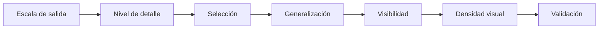
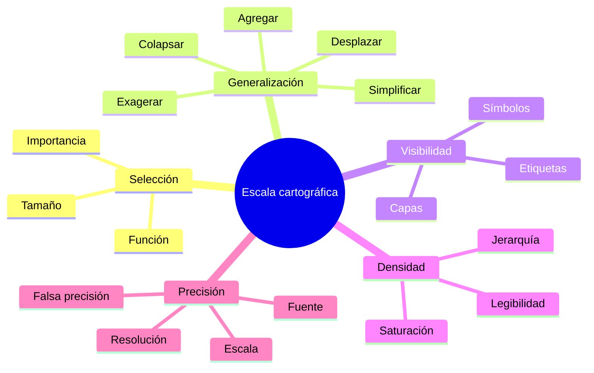
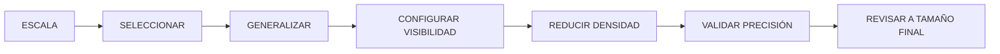

# 4.2 Preparar información para la escala de salida

<div class="grid cards" markdown>

-   **Seleccionar**

    ---

    Decidir qué información:

    **debe permanecer visible.**

-   **Generalizar**

    ---

    Reducir detalle sin perder:

    **la estructura territorial relevante.**

-   **Controlar densidad**

    ---

    Evitar:

    **saturación visual.**

-   **Gestionar escala**

    ---

    Mostrar diferentes elementos según:

    **nivel de zoom o escala de salida.**

-   **Mantener coherencia**

    ---

    No representar con más precisión de la que:

    **los datos realmente poseen.**

</div>

[Comenzar](#1-la-escala-cambia-lo-que-tiene-sentido-mostrar){ .md-button .md-button--primary }
[Ir al laboratorio](#laboratorio-guiado-representar-el-mismo-territorio-a-dos-escalas){ .md-button }

---

## Misión y mapa de aprendizaje

En la lección anterior definimos:

```text
destinatario
propósito
mensaje
soporte
```

Ahora aparece una nueva pregunta:

> **¿Qué información puede representarse correctamente a la escala final del producto?**

Supongamos que trabajamos con un mismo territorio.

Queremos producir:

```text
Mapa A = 1:10 000
Mapa B = 1:100 000
```

Los datos son idénticos.

Pero el contenido visible:

```text
no debería ser idéntico
```

### Ruta de la lección



---

## 1. La escala cambia lo que tiene sentido mostrar

La escala condiciona:

```text
detalle
legibilidad
precisión aparente
cantidad de información
```

### Ejemplo

A escala:

```text
1:5 000
```

puede ser razonable mostrar:

```text
calles secundarias
parcelas
edificios
nombres de calles
```

A escala:

```text
1:250 000
```

esa misma información puede provocar:

```text
saturación
solapamiento
ruido
```

!!! important "La escala no solo cambia el tamaño"

    También cambia:

    ```text
    qué información es pertinente
    ```

---

## 2. Escala grande y escala pequeña

### Escala grande

Ejemplo:

```text
1:5 000
```

Muestra:

```text
menos territorio
más detalle
```

### Escala pequeña

Ejemplo:

```text
1:250 000
```

Muestra:

```text
más territorio
menos detalle
```

!!! warning "No confundir"

    En cartografía:

    ```text
    1:5 000 = escala grande
    1:250 000 = escala pequeña
    ```

---

## 3. El mismo objeto cambia de función

Una vía puede ser:

```text
elemento principal
```

en un mapa urbano detallado.

Pero en un mapa regional puede convertirse en:

```text
contexto
```

o incluso:

```text
desaparecer
```

### Esto depende de

```text
escala
propósito
jerarquía
```

---

## 4. Selección cartográfica

Seleccionar significa decidir:

```text
qué se representa
```

y:

```text
qué se omite
```

### No es pérdida arbitraria

Es una forma de:

```text
reducir complejidad
```

para conservar:

```text
significado
```

---

## 5. Selección por importancia

Podemos mantener:

```text
vías principales
```

y eliminar:

```text
caminos secundarios
```

a pequeña escala.

### Ejemplo de criterio

```qgis
"jerarquia" IN ('PRIMARIA', 'SECUNDARIA')
```

---

## 6. Selección por tamaño

Podemos omitir polígonos demasiado pequeños para ser legibles.

Por ejemplo:

```text
área < 5 000 m²
```

### Pero

esto debe estar justificado.

!!! warning "Pequeño no significa irrelevante"

---

## 7. Selección por función

También podemos conservar:

```text
hospitales
```

y omitir:

```text
puestos menores
```

si el mapa comunica:

```text
red principal de salud
```

### La selección debe responder

al:

```text
mensaje
```

---

## Checkpoint 1

Deberías poder explicar:

- [ ] diferencia entre escala grande y pequeña;
- [ ] por qué la escala modifica el contenido;
- [ ] qué significa selección cartográfica;
- [ ] por qué omitir información no implica necesariamente error;
- [ ] por qué el criterio de selección debe estar documentado.

---

## 8. Generalización cartográfica

Generalizar significa adaptar una geometría o conjunto de datos para:

```text
representarlos correctamente a otra escala
```

No es simplemente:

```text
borrar detalles
```

### Puede implicar

```text
seleccionar
simplificar
suavizar
agrupar
desplazar
exagerar
colapsar
```

---

## 9. Simplificación

Una línea detallada puede contener:

```text
miles de vértices
```

A pequeña escala muchos son innecesarios.

Podemos reducirlos manteniendo:

```text
la forma general
```

---

## 10. Simplificar no significa deformar libremente

Una simplificación excesiva puede:

```text
cortar curvas
alterar límites
eliminar detalles relevantes
```

### Por eso

debemos controlar:

```text
tolerancia
escala
propósito
```

---

## 11. Simplificación de líneas

Ejemplo:

```text
río detallado
```

puede convertirse en:

```text
río simplificado
```

para una escala menor.

### Objetivo

Mantener:

```text
dirección
estructura
forma general
```

---

### Comparar antes y después

!!! info "Captura pendiente · 4.2-01"

    - **Tipo:** PNG comparativo.
    - **Archivo:** `assets/images/modulo-04/4-2/4-2-01-simplificacion-lineas.png`
    - **Mostrar:**
        1. línea original;
        2. línea simplificada;
        3. vértices.
    - **Objetivo didáctico:** visualizar la pérdida controlada de detalle.

---

## 12. Generalización de polígonos

Los polígonos pueden necesitar:

```text
simplificación
eliminación de pequeños huecos
agregación
```

según el producto.

### Ejemplo

Un conjunto de:

```text
pequeños polígonos urbanos
```

puede representarse como:

```text
una mancha urbana generalizada
```

a escala regional.

---

## 13. Colapsar geometrías

A veces una geometría ya no puede representarse correctamente con su forma original.

Ejemplo:

```text
río ancho
```

a gran escala:

```text
polígono
```

A pequeña escala:

```text
línea
```

### Esto es

```text
cambio de representación
```

no necesariamente:

```text
cambio del fenómeno
```

---

## 14. Exageración cartográfica

Un elemento importante puede ser demasiado pequeño para verse.

Por ejemplo:

```text
carretera
```

representada a escala regional.

Su ancho real quizá sería:

```text
invisible
```

Por eso se utiliza un símbolo:

```text
mucho más ancho que la carretera real
```

!!! success "El símbolo no tiene que representar el tamaño físico real"

    Puede representar:

    ```text
importancia
jerarquía
categoría
    ```

---

## 15. Desplazamiento

Dos elementos pueden quedar tan próximos que:

```text
se solapan visualmente
```

En cartografía puede ser necesario:

```text
desplazarlos ligeramente
```

para mantener legibilidad.

### Esto requiere cuidado

porque introducimos:

```text
una separación cartográfica
```

que no es una separación real.

---

## 16. Agregación

Varias entidades pequeñas pueden agruparse.

Ejemplo:

```text
muchos edificios
```

pueden convertirse en:

```text
zona edificada
```

a escalas menores.

### Pregunta clave

> ¿Necesito representar cada objeto o el patrón general?

---

## 17. Visibilidad dependiente de escala

QGIS permite controlar:

```text
a qué escalas
```

una capa será visible.

Esto evita tener que:

```text
encender
apagar
```

capas manualmente.

---

## 18. Rango de visibilidad

Ejemplo:

```text
edificios
```

pueden aparecer solo cuando:

```text
escala <= 1:10 000
```

Mientras:

```text
barrios
```

pueden permanecer visibles hasta:

```text
1:100 000
```

---

### Configurar visibilidad

!!! info "Captura pendiente · 4.2-02"

    - **Tipo:** GIF.
    - **Archivo:** `assets/images/modulo-04/4-2/4-2-02-visibilidad-escala.gif`
    - **Mostrar:**
        1. propiedades de capa;
        2. activar rango de escala;
        3. acercar;
        4. alejar;
        5. observar aparición/desaparición.
    - **Objetivo didáctico:** mostrar cómo una capa puede adaptarse automáticamente al nivel de escala.

---

## 19. Visibilidad no es generalización

Ocultar una capa:

```text
no modifica sus geometrías
```

Generalizar:

```text
sí modifica o sustituye la representación
```

### Diferencia

```text
VISIBILIDAD
= cuándo aparece

GENERALIZACIÓN
= cómo se representa
```

---

## 20. Escala dependiente dentro de una misma capa

No siempre necesitamos capas separadas.

Podemos utilizar reglas como:

```text
si escala < 1:10 000
→ símbolo detallado

si escala > 1:10 000
→ símbolo simplificado
```

Esto permite:

```text
representación multiescala
```

---

## 21. Simbología basada en escala

Podemos variar:

```text
grosor
tamaño
detalle
transparencia
```

según la escala.

### Ejemplo

A gran escala:

```text
vía principal = 1.2 mm
```

A pequeña escala:

```text
vía principal = 0.5 mm
```

o incluso:

```text
solo vías troncales
```

---

## 22. Etiquetado dependiente de escala

También podemos controlar:

```text
qué etiquetas aparecen
```

según escala.

### Ejemplo

```text
1:5 000
→ calles + barrios

1:25 000
→ barrios

1:100 000
→ distritos
```

Esta idea se profundizará en:

```text
4.6
```

---

## 23. Densidad visual

Un mapa puede contener información técnicamente correcta pero:

```text
demasiado densa
```

### Síntomas

```text
muchas etiquetas
muchos símbolos
líneas superpuestas
colores muy variados
```

---

## 24. Densidad y legibilidad

Podemos pensar:

```text
más información
→
más carga visual
```

Pero llega un punto donde:

```text
más información
→
menos comprensión
```

---

## 25. Reducir densidad

Podemos:

```text
eliminar elementos secundarios
reducir etiquetas
simplificar símbolos
agrupar categorías
```

---

## 26. Figura y fondo

El fenómeno principal debe distinguirse del:

```text
contexto
```

Si todas las capas tienen:

```text
igual contraste
```

el lector no sabe:

```text
dónde mirar
```

Esta idea se profundizará en:

```text
4.5
```

---

## Checkpoint 2

Deberías poder explicar:

- [ ] qué es generalización;
- [ ] qué significa simplificar;
- [ ] cuándo puede cambiar el tipo de representación;
- [ ] qué es exageración cartográfica;
- [ ] qué diferencia existe entre visibilidad y generalización;
- [ ] qué significa densidad visual.

---

## 27. Precisión y detalle

Un error frecuente consiste en confundir:

```text
detalle gráfico
```

con:

```text
precisión espacial
```

Un dato puede tener:

```text
muchísimos vértices
```

y aun así tener:

```text
baja precisión posicional
```

---

## 28. Más vértices no significan más precisión

Supongamos que un límite fue digitalizado desde:

```text
mapa 1:50 000
```

Agregar:

```text
1000 vértices
```

no lo convierte en:

```text
dato 1:500
```

!!! warning "El detalle no puede superar la calidad de la fuente"

---

## 29. Escala de fuente y escala de salida

Debemos conocer:

```text
escala de origen
```

cuando corresponda.

### Ejemplo

Datos capturados a:

```text
1:100 000
```

no deberían utilizarse para afirmar:

```text
precisión parcelaria
```

---

## 30. Resolución ráster y escala

También en ráster.

Un DEM de:

```text
30 m
```

puede representarse en un mapa grande.

Pero eso no crea:

```text
detalle de 1 m
```

---

## 31. Precisión aparente

Una representación muy detallada puede hacer creer al lector que:

```text
la información es más exacta
```

de lo que realmente es.

### El diseño también comunica confianza

Por eso debemos evitar:

```text
falsa precisión
```

---

## 32. Coherencia cartográfica

La escala de salida debería ser compatible con:

```text
fuente
resolución
precisión
propósito
```

---

## 33. Comparar dos escalas

Trabajaremos con:

```text
1:10 000
```

y:

```text
1:100 000
```

### A 1:10 000

Podemos mostrar:

```text
edificios
calles secundarias
etiquetas locales
```

### A 1:100 000

Podemos mostrar:

```text
distritos
vías principales
ríos principales
```

---

## 34. Crear dos configuraciones

!!! info "Captura pendiente · 4.2-03"

    - **Tipo:** PNG comparativo.
    - **Archivo:** `assets/images/modulo-04/4-2/4-2-03-dos-escalas.png`
    - **Mostrar:**
        1. mismo territorio a 1:10 000;
        2. mismo territorio a 1:100 000.
    - **Objetivo didáctico:** mostrar que la representación debe cambiar con la escala.

---

## 35. Escala en pantalla y escala de salida

No debemos confiar únicamente en:

```text
cómo se ve en el monitor
```

Una composición final puede:

```text
reducir
ampliar
```

la representación.

### Debemos validar

en:

```text
tamaño final
```

---

## 36. Prueba de impresión

Una técnica simple:

```text
exportar
imprimir al 100 %
```

y revisar:

```text
textos
líneas
símbolos
espacios
```

---

## 37. Escala y soporte

Un mapa A0 y un mapa A4 pueden cubrir:

```text
el mismo territorio
```

pero tener:

```text
distinta escala física
```

### Por tanto

```text
soporte
```

y:

```text
escala
```

están conectados.

---

## 38. Generalización manual y automática

QGIS puede ayudarnos mediante:

```text
simplificación
filtros
reglas
rango de escala
```

Pero la decisión sigue siendo:

```text
cartográfica
```

---

## 39. Automatizar sin revisar

Una simplificación automática puede:

```text
eliminar una curva importante
romper un límite
deformar una isla
```

Por eso:

```text
resultado automático
→
revisión visual
```

---

## 40. Generalización como proceso de diseño

No es solo:

```text
geoprocesamiento
```

También incluye:

```text
qué mostrar
cómo mostrar
cuándo mostrar
```

---

## Práctica y consolidación

### Predicción 1

Tienes:

```text
250 000 edificios
```

y debes hacer un mapa regional a:

```text
1:500 000
```

¿Mostrarías cada edificio?

Probablemente:

```text
NO
```

Una alternativa puede ser:

```text
mancha urbana
```

---

### Predicción 2

Un río muy estrecho no se ve a pequeña escala.

¿Deberíamos representarlo con su ancho real?

No necesariamente.

Podemos utilizar:

```text
símbolo lineal
```

---

### Predicción 3

Una capa tiene 200 000 caminos rurales.

¿Ocultarla completamente es siempre la solución?

No.

Podemos:

```text
filtrar
clasificar
generalizar
```

---

## Laboratorio guiado · Representar el mismo territorio a dos escalas

!!! example "Escenario"

    Dispones de:

    ```text
    edificios
    vías
    ríos
    barrios
    distritos
    equipamientos
    ```

    Debes crear dos mapas:

    ```text
    A = 1:10 000
    B = 1:100 000
    ```

### Fase 1 · Definir propósito

Ambos mapas deberán comunicar:

```text
estructura urbana y equipamientos principales
```

---

### Fase 2 · Crear tabla de decisiones

| Capa | 1:10 000 | 1:100 000 |
|---|---|---|
| Edificios | | |
| Calles locales | | |
| Vías principales | | |
| Barrios | | |
| Distritos | | |
| Ríos | | |
| Equipamientos | | |

Usa:

```text
MOSTRAR
SIMPLIFICAR
FILTRAR
OCULTAR
```

---

### Fase 3 · Configurar escala A

Establece:

```text
1:10 000
```

---

### Fase 4 · Revisar edificios

Pregunta:

```text
¿son legibles?
¿aportan contexto?
```

---

### Fase 5 · Revisar vías

Mantén:

```text
vías principales
vías locales
```

si el mapa lo permite.

---

### Fase 6 · Revisar etiquetas

Decide qué nivel nominal puede mostrarse.

---

### Fase 7 · Crear escala B

Configura:

```text
1:100 000
```

---

### Fase 8 · Evaluar saturación

Observa:

```text
qué capas dejan de funcionar
```

---

### Fase 9 · Filtrar vías

Conserva:

```text
jerarquías principales
```

---

### Fase 10 · Sustituir edificios

Si corresponde, usa:

```text
mancha urbana
```

en lugar de edificios individuales.

---

### Fase 11 · Reducir etiquetas

Conserva:

```text
distritos
barrios principales
```

---

### Fase 12 · Configurar visibilidad por escala

Define rangos para:

```text
edificios
calles
barrios
```

---

### Fase 13 · Revisar simbología

Comprueba:

```text
grosor
tamaño
contraste
```

en ambas escalas.

---

### Fase 14 · Comparar

| Criterio | 1:10 000 | 1:100 000 |
|---|---|---|
| Detalle | | |
| Nº capas visibles | | |
| Nº etiquetas | | |
| Jerarquía vial | | |
| Contexto | | |
| Legibilidad | | |

---

### Fase 15 · Exportar

Exporta ambas composiciones.

---

### Fase 16 · Revisar a tamaño final

No solo dentro del lienzo de QGIS.

---

### Evidencia

!!! info "Captura pendiente · 4.2-04"

    - **Tipo:** PNG comparativo.
    - **Archivo:** `assets/images/modulo-04/4-2/4-2-04-laboratorio.png`
    - **Mostrar:** ambas versiones terminadas lado a lado.
    - **Objetivo didáctico:** demostrar que una misma fuente requiere distintas decisiones según escala.

---

## Reto práctico · Adaptar el mismo territorio a dos escalas

!!! example "Reto 4.2"

    Elige un territorio con al menos:

    ```text
    puntos
    líneas
    polígonos
    ```

    y produce dos representaciones del mismo fenómeno.

### Escala A

Debe permitir:

```text
lectura local detallada
```

### Escala B

Debe permitir:

```text
lectura territorial general
```

---

### Parte 1 · Documentar fuentes

Registra:

```text
fuente
escala o resolución original
fecha
```

---

### Parte 2 · Definir escalas

Ejemplo:

```text
1:10 000
1:100 000
```

---

### Parte 3 · Clasificar capas

Para cada escala:

```text
MOSTRAR
SIMPLIFICAR
FILTRAR
OCULTAR
```

---

### Parte 4 · Aplicar selección

Reduce información cuando sea necesario.

---

### Parte 5 · Aplicar generalización

Simplifica al menos:

```text
una capa
```

si corresponde.

---

### Parte 6 · Configurar visibilidad

Utiliza rango de escala en:

```text
al menos una capa
```

---

### Parte 7 · Adaptar etiquetas

Decide:

```text
qué se etiqueta
```

en cada escala.

---

### Parte 8 · Adaptar simbología

Modifica:

```text
tamaño
grosor
detalle
```

cuando sea necesario.

---

### Parte 9 · Comparar

Construye:

| Elemento | Escala A | Escala B |
|---|---|---|
| Capas visibles | | |
| Capas generalizadas | | |
| Etiquetas | | |
| Elemento principal | | |
| Densidad visual | | |

---

### Parte 10 · Justificar

Redacta entre **180 y 250 palabras** explicando:

- qué cambió entre escalas;
- qué capas ocultaste;
- qué capas filtraste;
- qué geometrías generalizaste;
- qué etiquetas eliminaste;
- qué elementos exageraste;
- cómo evitaste falsa precisión;
- cuál versión contiene más detalle;
- por qué ambos mapas pueden ser correctos aunque sean distintos.

---

### Entregables

```text
mapa_escala_A
mapa_escala_B
tabla_decisiones
evidencia_generalizacion
captura_visibilidad_escala
justificacion
```

---

## Criterios de evaluación

??? success "Ver rúbrica"

    | Criterio | Se cumple si... |
    |---|---|
    | Escalas | Están claramente definidas |
    | Fuentes | Se conoce su nivel de detalle |
    | Selección | La información responde al propósito |
    | Generalización | Mantiene estructura territorial |
    | Visibilidad | Está correctamente configurada |
    | Etiquetas | Se adaptan a la escala |
    | Simbología | Mantiene legibilidad |
    | Densidad | No existe saturación innecesaria |
    | Precisión | No se comunica más exactitud de la disponible |
    | Comparación | Las dos propuestas son realmente diferentes |
    | Justificación | Las decisiones están documentadas |

---

## Errores frecuentes

=== "Solo alejo el zoom"

    Cambiar zoom no equivale a:

    ```text
    generalizar
    ```

=== "Mostraré las mismas capas"

    No necesariamente.

=== "Mientras más detalle, mejor"

    No a todas las escalas.

=== "La capa tiene muchos vértices, así que es precisa"

    No.

=== "Un edificio desaparece a pequeña escala, entonces agrando su geometría"

    Puede ser mejor cambiar:

    ```text
    la representación
    ```

=== "El río debe tener su ancho real"

    A pequeña escala quizá necesite:

    ```text
    exageración simbólica
    ```

=== "Simplifiqué hasta que quedó bonito"

    La tolerancia debe ser:

    ```text
    controlada
    ```

=== "La capa no se ve, la elimino"

    Puede ser necesario:

    ```text
    filtrar
    simplificar
    cambiar símbolo
    ```

=== "El mapa se ve bien en mi monitor"

    Debe comprobarse:

    ```text
    a tamaño de salida
    ```

---

## Autoevaluación

??? question "1. ¿Qué determina la escala?"

    El nivel de detalle que puede representarse de forma legible y coherente.

??? question "2. ¿Qué es selección cartográfica?"

    Elegir qué información se conserva y qué se omite.

??? question "3. ¿Qué es generalización?"

    Adaptar información espacial para una escala o propósito determinado.

??? question "4. ¿Generalizar significa borrar?"

    No únicamente.

??? question "5. ¿Qué es simplificación?"

    Reducir detalle geométrico conservando la forma relevante.

??? question "6. ¿Qué es exageración?"

    Representar un objeto con tamaño gráfico mayor que su dimensión real para mantener legibilidad.

??? question "7. ¿Qué es desplazamiento?"

    Separar cartográficamente elementos que se solapan.

??? question "8. ¿Qué es agregación?"

    Agrupar entidades para representar un patrón general.

??? question "9. ¿Visibilidad y generalización son iguales?"

    No.

??? question "10. ¿Qué controla la visibilidad por escala?"

    Cuándo aparece una capa o símbolo.

??? question "11. ¿Qué es densidad visual?"

    La cantidad de información gráfica presente en un espacio.

??? question "12. ¿Más detalle significa más precisión?"

    No.

??? question "13. ¿Más vértices implican más exactitud?"

    No.

??? question "14. ¿Un ráster de 30 m obtiene precisión de 1 m si lo ampliamos?"

    No.

??? question "15. ¿Dónde debe comprobarse finalmente el diseño?"

    En el tamaño real de salida.

---

## Cierre de la lección

### Mapa mental



### Secuencia principal



!!! quote "Idea central"

    El mismo territorio no debe representarse necesariamente con:

    ```text
    el mismo detalle
    ```

    en todas las escalas.

    La cartografía debe conservar:

    ```text
    el significado
    ```

    aunque cambie:

    ```text
    la cantidad de información visible
    ```

---

## Lo que viene

En **4.3 · Elegir una representación temática adecuada** dejaremos de preguntarnos:

```text
cuánto detalle mostrar
```

y comenzaremos a decidir:

```text
cómo representar el significado estadístico de los datos
```

Trabajaremos con:

```text
cantidades
porcentajes
tasas
densidades
categorías
valores ausentes
extremos
```

y compararemos:

```text
coropletas
símbolos proporcionales
representaciones categóricas
```

La pregunta central será:

> **¿Qué tipo de símbolo corresponde realmente al tipo de variable que queremos comunicar?**

---

## Referencias

- [QGIS 3.44 — Simbología vectorial](https://docs.qgis.org/3.44/es/docs/user_manual/style_library/symbol_selector.html)  
  Configuración de símbolos, tamaños y propiedades visuales.

- [QGIS 3.44 — Propiedades de capas vectoriales](https://docs.qgis.org/3.44/es/docs/user_manual/working_with_vector/vector_properties.html)  
  Configuración de visibilidad por escala y propiedades de representación.

- [QGIS 3.44 — Edición de geometrías](https://docs.qgis.org/3.44/es/docs/user_manual/working_with_vector/editing_geometry_attributes.html)  
  Herramientas relacionadas con geometría y simplificación.

- [QGIS 3.44 — Processing](https://docs.qgis.org/3.44/es/docs/user_manual/processing/)  
  Algoritmos utilizados para preparar y generalizar datos.

- [QGIS Training Manual](https://docs.qgis.org/3.44/es/docs/training_manual/)  
  Material oficial de formación con ejercicios cartográficos.

- [Material for MkDocs — Reference](https://squidfunk.github.io/mkdocs-material/reference/)  
  Referencia de los componentes visuales utilizados en esta documentación.