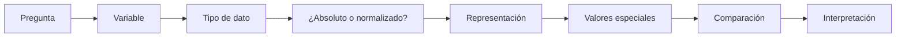
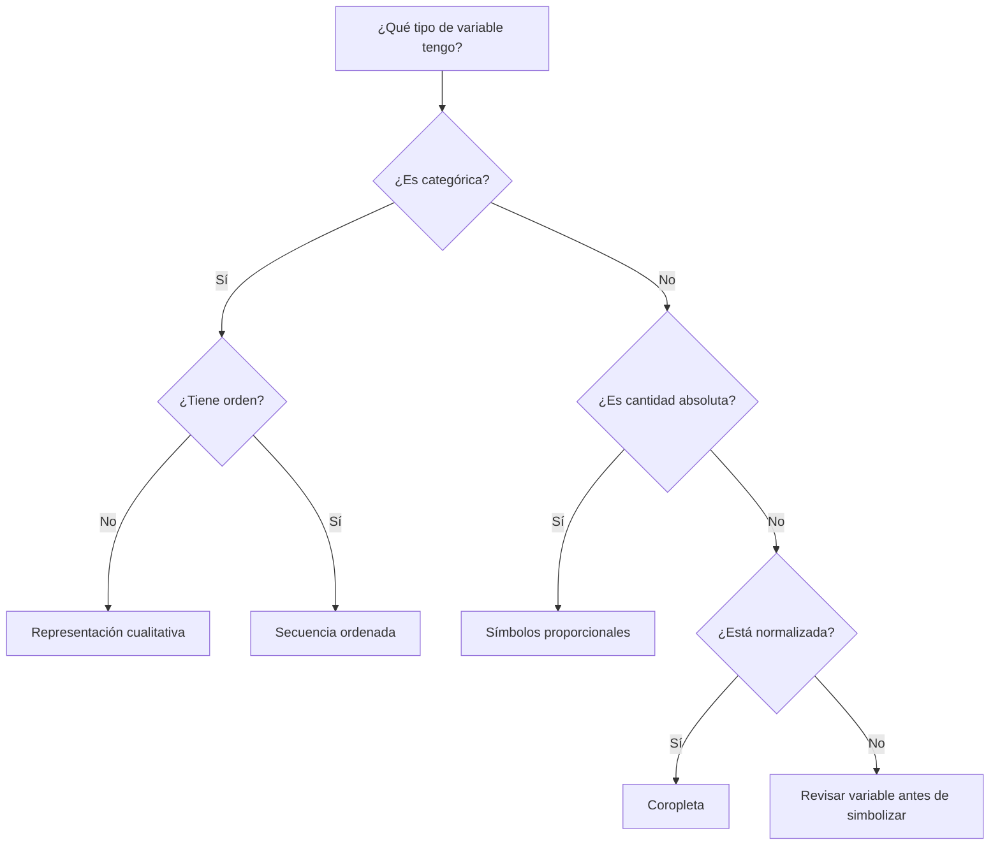
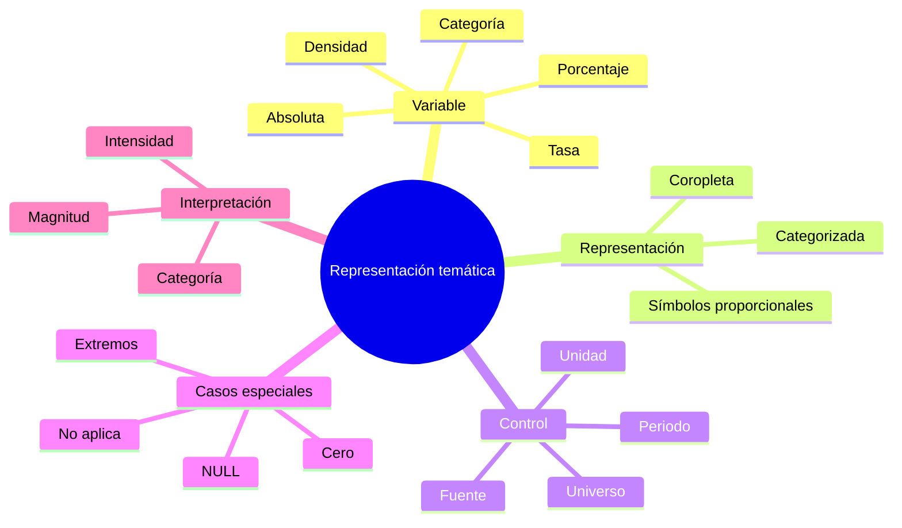
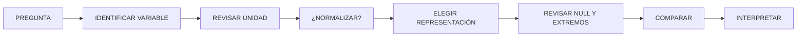

# 4.3 Elegir una representación temática adecuada

Un mapa temático puede estar perfectamente diseñado y aun así comunicar una conclusión equivocada.

El problema no siempre está en:

```text
los colores
la leyenda
la composición
```

A veces está antes:

```text
en la variable elegida
```

o en:

```text
el tipo de representación
```

Esta lección parte de una regla fundamental:

> **La representación cartográfica debe corresponder al significado estadístico de la variable.**

---

## Misión y mapa de aprendizaje

Supongamos que tenemos tres distritos:

| Distrito | Población | Superficie km² |
|---|---:|---:|
| A | 40 000 | 10 |
| B | 70 000 | 50 |
| C | 90 000 | 150 |

Si coloreamos los polígonos según:

```text
población total
```

el distrito C tendrá el valor más alto.

Pero si calculamos:

```text
densidad
```

obtenemos:

| Distrito | Densidad hab/km² |
|---|---:|
| A | 4 000 |
| B | 1 400 |
| C | 600 |

La interpretación cambia completamente.

### Pregunta central

> **¿Queremos representar cuántas personas existen o qué tan concentradas están territorialmente?**

No es la misma pregunta.

### Ruta de la lección



---

## 1. Antes del mapa: comprender la variable

El primer error frecuente consiste en abrir simbología y preguntar:

```text
¿Qué rampa de color uso?
```

Antes debemos preguntar:

```text
¿Qué representa exactamente este campo?
```

### Ejemplos

```text
15000
```

podría significar:

```text
habitantes
bolivianos
vehículos
hectáreas
casos
```

El número por sí mismo no explica:

```text
qué mide
```

---

### Ficha mínima de una variable

Antes de simbolizar registra:

| Elemento | Pregunta |
|---|---|
| Nombre | ¿Cómo se llama? |
| Significado | ¿Qué mide? |
| Unidad | ¿Personas, %, km²...? |
| Periodo | ¿De qué año o periodo? |
| Universo | ¿Sobre qué población se calcula? |
| Tipo | ¿Cantidad, tasa, densidad, categoría...? |
| Fuente | ¿De dónde proviene? |

!!! note "Principio"

    La cartografía temática comienza:

    ```text
    comprendiendo el dato
    ```

    no:

    ```text
    escogiendo símbolos
    ```

---

## 2. Cantidades absolutas

Una cantidad absoluta representa:

```text
cuánto existe
```

Ejemplos:

```text
población total
número de viviendas
número de casos
presupuesto
número de establecimientos
```

### Ejemplo

| Distrito | Población |
|---|---:|
| D1 | 18 000 |
| D2 | 36 000 |
| D3 | 72 000 |

Aquí medimos:

```text
personas
```

No estamos considerando:

```text
superficie
población de referencia
tamaño territorial
```

---

### ¿Cómo representar cantidades absolutas?

Una opción frecuente es:

```text
símbolos proporcionales
```

porque el tamaño del símbolo puede representar:

```text
magnitud
```

Por ejemplo:

```text
círculo pequeño = menos población
círculo grande = más población
```

### Ventaja

La geometría territorial no controla directamente la intensidad visual.

---

### Problema de usar coropletas con cantidades absolutas

Supongamos dos distritos:

```text
A = 50 000 habitantes
B = 50 000 habitantes
```

pero:

```text
A = 5 km²
B = 100 km²
```

Si ambos reciben el mismo color porque tienen:

```text
50 000 habitantes
```

el mapa no muestra:

```text
qué tan concentrada está la población
```

!!! warning "Una coropleta de totales puede confundir tamaño territorial con intensidad del fenómeno"

---

## 3. Tasas, porcentajes y razones

Muchas preguntas territoriales no dependen de:

```text
cuántos
```

sino de:

```text
qué proporción
```

### Porcentaje

Ejemplo:

```text
viviendas con acceso a agua
────────────────────────── × 100
total de viviendas
```

### Tasa

Ejemplo:

```text
casos
────────── × 10 000
población
```

### Razón

Ejemplo:

```text
médicos
──────────
habitantes
```

---

### ¿Por qué normalizar?

Supongamos:

| Distrito | Casos | Población |
|---|---:|---:|
| A | 500 | 10 000 |
| B | 800 | 100 000 |

Si miramos:

```text
casos absolutos
```

parece mayor:

```text
B
```

Pero la tasa es:

```text
A = 5 %
B = 0,8 %
```

La lectura cambia.

---

### Pregunta clave

> ¿Queremos saber dónde hay más casos o dónde existe una mayor incidencia relativa?

Ambas preguntas son válidas.

Pero necesitan:

```text
variables diferentes
```

---

## 4. Densidades

Una densidad relaciona una cantidad con:

```text
superficie
```

Ejemplo:

```text
población
────────────
superficie km²
```

Resultado:

```text
habitantes/km²
```

### Densidad ≠ cantidad

Un distrito puede tener:

```text
mucha población
```

pero:

```text
baja densidad
```

si su territorio es muy extenso.

---

### Ejemplo completo

| Distrito | Población | Área km² | Densidad |
|---|---:|---:|---:|
| A | 20 000 | 5 | 4 000 |
| B | 50 000 | 50 | 1 000 |
| C | 80 000 | 200 | 400 |

### Dos mapas posibles

```text
Mapa 1 → población total
Mapa 2 → densidad
```

Los dos pueden ser correctos.

Pero responden:

```text
preguntas diferentes
```

---

### Representación habitual

Las densidades son apropiadas para:

```text
coropletas
```

porque la variable ya está:

```text
normalizada respecto a superficie
```

---

## Checkpoint 1

Deberías poder diferenciar:

- [ ] cantidad absoluta;
- [ ] porcentaje;
- [ ] tasa;
- [ ] razón;
- [ ] densidad;
- [ ] variable categórica.

Y deberías poder responder:

> ¿Cuál de ellas estoy realmente intentando comunicar?

---

## 5. Coropletas

Un mapa de coropletas utiliza:

```text
variación de tono o luminosidad
```

en polígonos para representar:

```text
valores relativos
```

Ejemplos apropiados:

```text
densidad poblacional
porcentaje de hogares con servicio
tasa de desempleo
proporción de suelo urbano
```

---

### La unidad espacial importa

Un valor se asigna a:

```text
un polígono
```

por ejemplo:

```text
municipio
distrito
barrio
sector censal
```

Dentro del polígono el mapa aparenta:

```text
homogeneidad
```

aunque la realidad puede no ser uniforme.

!!! warning "Una coropleta generaliza internamente"

    Si un distrito tiene:

    ```text
densidad = 4 000 hab/km²
    ```

    eso no significa que:

    ```text
cada parte del distrito
    ```

    tenga exactamente esa densidad.

---

### Cuándo evitar coropletas

Evita utilizarlas automáticamente para:

```text
totales absolutos
```

como:

```text
población total
número de casos
número de viviendas
```

si el tamaño desigual de las unidades territoriales puede distorsionar la lectura.

---

### Visual previsto

!!! info "Captura pendiente · 4.3-01"

    - **Tipo:** PNG comparativo.
    - **Archivo:** `assets/images/modulo-04/4-3/4-3-01-total-vs-densidad.png`
    - **Mostrar:**
        1. coropleta de población total;
        2. coropleta de densidad;
        3. mismo territorio.
    - **Objetivo didáctico:** demostrar cómo cambia el patrón según la variable.

---

## 6. Símbolos proporcionales

Los símbolos proporcionales representan magnitudes mediante:

```text
tamaño
```

Por ejemplo:

```text
círculos
cuadrados
```

### Uso habitual

Son especialmente útiles para:

```text
cantidades absolutas
```

como:

```text
población total
producción
número de casos
volumen de inversión
```

---

### Principio

Si:

```text
valor B = 4 × valor A
```

la representación debería reflejar esa relación mediante:

```text
área del símbolo
```

no simplemente mediante:

```text
diámetro
```

!!! warning "El área visual es la magnitud que el lector compara"

---

### Símbolos graduados y proporcionales

Conceptualmente podemos distinguir:

```text
PROPORCIONAL
cada valor produce un tamaño continuo
```

de:

```text
GRADUADO
los valores se agrupan en clases
```

Los dos enfoques pueden ser útiles.

---

### Ventajas

Los símbolos proporcionales permiten:

```text
mantener la magnitud absoluta
```

sin colorear completamente unidades territoriales de tamaños diferentes.

---

### Limitaciones

Pueden producir:

```text
solapamiento
ocultamiento
saturación
```

en zonas densas.

---

### Visual previsto

!!! info "Captura pendiente · 4.3-02"

    - **Tipo:** PNG.
    - **Archivo:** `assets/images/modulo-04/4-3/4-3-02-simbolos-proporcionales.png`
    - **Mostrar:** población total mediante círculos proporcionales.
    - **Objetivo didáctico:** relacionar magnitud absoluta con tamaño de símbolo.

---

## 7. Representación categórica

No todas las variables son numéricas.

Ejemplo:

```text
SALUD
EDUCACION
DEPORTE
CULTURA
```

Aquí no existe:

```text
más
menos
```

Existe:

```text
diferencia de categoría
```

---

### Representación adecuada

Podemos utilizar:

```text
colores cualitativos
formas diferentes
símbolos diferentes
```

### Evitar

Una rampa:

```text
claro → oscuro
```

puede sugerir:

```text
orden
```

cuando las categorías no tienen jerarquía.

---

### Ejemplo

```text
Hospital
Escuela
Mercado
Parque
```

no deberían representarse como:

```text
claro
medio
oscuro
muy oscuro
```

si no existe orden entre ellos.

---

### Categórica ordinal

Hay variables categóricas donde sí existe orden.

Ejemplo:

```text
BAJO
MEDIO
ALTO
MUY ALTO
```

Aquí sí existe:

```text
jerarquía
```

Por tanto podemos utilizar una:

```text
secuencia visual ordenada
```

---

## 8. Elegir representación según el tipo de variable

Una guía básica:

| Variable | Ejemplo | Representación frecuente |
|---|---|---|
| Nominal | Tipo de equipamiento | Categorizada |
| Ordinal | Riesgo bajo–alto | Secuencial/ordenada |
| Cantidad absoluta | Población total | Símbolo proporcional |
| Porcentaje | % acceso a agua | Coropleta |
| Tasa | Casos por 10 000 hab. | Coropleta |
| Densidad | hab/km² | Coropleta |

### Esto no es una ley rígida

La decisión también depende de:

```text
pregunta
escala
unidad espacial
composición
```

Pero sirve como:

```text
punto de partida metodológico
```

---

### Árbol de decisión



---

## 9. Valores ausentes, cero y NoData

Una de las mayores fuentes de confusión cartográfica consiste en representar igual:

```text
0
```

y:

```text
sin dato
```

No significan lo mismo.

---

### Cero

Puede significar:

```text
se midió
y el resultado fue cero
```

Ejemplo:

```text
0 establecimientos
```

---

### NULL / sin dato

Puede significar:

```text
no existe información
no fue medido
no se registró
```

---

### No aplica

También puede existir:

```text
NO APLICA
```

que tampoco significa:

```text
cero
```

---

### Ejemplo cartográfico

Podemos distinguir:

```text
0 → color de la escala
SIN DATO → gris
NO APLICA → trama
```

según el diseño.

!!! warning "No conviertas ausencia de información en ausencia del fenómeno"

---

### Pregunta previa

Antes de simbolizar:

```text
¿Cuántos NULL hay?
```

En QGIS podemos revisar:

```text
tabla de atributos
estadísticas
filtros
```

---

## 10. Valores extremos

Supongamos valores:

```text
10
12
14
15
18
22
25
900
```

El valor:

```text
900
```

puede controlar:

```text
toda la representación
```

---

### ¿Es un error?

No necesariamente.

Puede ser:

```text
error de captura
unidad diferente
caso real excepcional
```

### Primero investigar

Antes de:

```text
eliminar
recortar
transformar
```

debemos entenderlo.

---

### Un extremo puede ser el fenómeno importante

Si el objetivo es identificar:

```text
concentraciones excepcionales
```

el extremo puede ser precisamente:

```text
lo que queremos mostrar
```

---

### Distribución antes de mapa

Antes de clasificar conviene revisar:

```text
mínimo
máximo
media
mediana
histograma
```

Esto conecta directamente con:

```text
4.4 Evaluar clasificaciones y colores
```

---

## Checkpoint 2

Antes de continuar deberías poder explicar:

- [ ] cuándo utilizar coropletas;
- [ ] cuándo utilizar símbolos proporcionales;
- [ ] cómo representar categorías;
- [ ] diferencia entre nominal y ordinal;
- [ ] diferencia entre cero y sin dato;
- [ ] por qué investigar valores extremos.

---

## Laboratorio guiado · Población total frente a densidad

!!! example "Escenario"

    Dispones de una capa de distritos con:

    ```text
    distrito
    poblacion
    area_km2
    ```

    Vamos a producir dos mapas del mismo territorio.

### Pregunta A

> ¿Qué distritos concentran la mayor cantidad total de habitantes?

### Pregunta B

> ¿Qué distritos presentan la mayor concentración de habitantes por superficie?

Parecen similares.

Pero no son iguales.

---

### Fase 1 · Revisar estructura

Comprueba:

```text
poblacion
area_km2
```

Busca:

```text
NULL
0
valores sospechosos
```

---

### Fase 2 · Calcular densidad

Crea:

```text
dens_hab_km2
```

Expresión conceptual:

```qgis
"poblacion" / "area_km2"
```

Pero debemos controlar:

```text
NULL
división entre cero
unidades
```

Una expresión más robusta puede seguir la lógica:

```qgis
CASE
    WHEN "area_km2" IS NULL THEN NULL
    WHEN "area_km2" <= 0 THEN NULL
    WHEN "poblacion" IS NULL THEN NULL
    ELSE "poblacion" / "area_km2"
END
```

---

### Fase 3 · Revisar resultado

Comprueba:

```text
mínimo
máximo
orden de magnitud
```

Pregunta:

```text
¿los valores tienen sentido?
```

---

### Fase 4 · Mapa de población total

Primero utiliza:

```text
poblacion
```

como variable.

Prueba una representación mediante:

```text
símbolos proporcionales
```

sobre cada distrito.

---

### Fase 5 · Ajustar símbolos

Revisa:

```text
tamaño mínimo
tamaño máximo
solapamiento
```

---

### Fase 6 · Mapa de densidad

Utiliza:

```text
dens_hab_km2
```

para una:

```text
coropleta
```

---

### Fase 7 · Mantener contexto comparable

Utiliza en ambos:

```text
misma extensión
mismos límites
mismos nombres territoriales
```

para facilitar comparación.

---

### Fase 8 · Comparar patrones

Completa:

| Distrito | Población total | Densidad | Lectura |
|---|---:|---:|---|
| | | | |

---

### Fase 9 · Buscar contradicciones aparentes

Identifica un distrito que:

```text
tenga población total alta
pero densidad baja
```

o viceversa.

Explica:

```text
por qué
```

---

### Fase 10 · Revisar sin dato

Si existe un distrito sin información:

```text
no lo simbolices como cero
```

---

### Fase 11 · Crear comparación visual

!!! info "Captura pendiente · 4.3-03"

    - **Tipo:** PNG lado a lado.
    - **Archivo:** `assets/images/modulo-04/4-3/4-3-03-poblacion-densidad.png`
    - **Mostrar:**
        1. población total;
        2. densidad;
        3. misma extensión.
    - **Objetivo didáctico:** comparar dos preguntas distintas utilizando los mismos datos base.

---

### Fase 12 · Interpretar

Redacta dos frases distintas:

#### Mapa A

> ...

#### Mapa B

> ...

No deberían decir exactamente lo mismo.

---

## Reto práctico · Representar correctamente tres tipos de variable

!!! example "Reto 4.3"

    Utiliza una unidad territorial de tu elección:

    ```text
    distrito
    municipio
    barrio
    sector
    ```

    Debes construir **tres mapas temáticos diferentes**.

### Mapa 1 · Cantidad absoluta

Ejemplo:

```text
población total
```

Representación sugerida:

```text
símbolos proporcionales
```

---

### Mapa 2 · Variable normalizada

Ejemplo:

```text
densidad
porcentaje
tasa
```

Representación sugerida:

```text
coropleta
```

---

### Mapa 3 · Variable categórica

Ejemplo:

```text
tipo de unidad
uso predominante
categoría administrativa
```

Representación:

```text
categorizada
```

---

### Parte 1 · Documentar cada variable

| Variable | Significado | Unidad | Tipo |
|---|---|---|---|
| | | | |
| | | | |
| | | | |

---

### Parte 2 · Identificar valores especiales

Registra:

```text
NULL
cero
No aplica
extremos
```

---

### Parte 3 · Elegir representación

Justifica:

```text
por qué
```

utilizas cada método.

---

### Parte 4 · Construir mapas

Mantén:

```text
extensión comparable
```

cuando corresponda.

---

### Parte 5 · Revisar leyendas

La leyenda debe indicar:

```text
variable
unidad
categorías
```

---

### Parte 6 · Comparar

Completa:

| Aspecto | Mapa 1 | Mapa 2 | Mapa 3 |
|---|---|---|---|
| Tipo variable | | | |
| Unidad | | | |
| Representación | | | |
| Pregunta | | | |
| Lectura principal | | | |

---

### Parte 7 · Detectar una representación incorrecta

Toma:

```text
una de las variables
```

y represéntala deliberadamente con un método poco apropiado.

Por ejemplo:

```text
población absoluta como coropleta
```

Compara:

```text
correcto
vs
problemático
```

---

### Parte 8 · Explicar el error

Redacta:

```text
qué impresión produce
por qué puede confundir
qué alternativa mejora la lectura
```

---

### Parte 9 · Conclusión

Redacta entre **200 y 280 palabras** explicando:

- qué variables utilizaste;
- cuál era absoluta;
- cuál estaba normalizada;
- cuál era categórica;
- qué representación seleccionaste;
- cómo trataste valores ausentes;
- si encontraste valores extremos;
- cómo cambió la interpretación entre cantidad y densidad;
- qué error produjo la representación deliberadamente incorrecta.

---

### Entregables

```text
mapa_cantidad
mapa_normalizado
mapa_categoria
comparacion_correcto_incorrecto
tabla_variables
tabla_comparativa
conclusion
```

---

## Criterios de evaluación

??? success "Ver rúbrica"

    | Criterio | Se cumple si... |
    |---|---|
    | Variable | Está correctamente interpretada |
    | Unidad | Está documentada |
    | Universo | Está identificado |
    | Cantidad absoluta | No se confunde con intensidad |
    | Normalización | Tiene sentido metodológico |
    | Densidad | Utiliza superficie coherente |
    | Coropleta | Se usa sobre variable adecuada |
    | Símbolos proporcionales | Representan magnitud |
    | Categorías | No sugieren orden inexistente |
    | NULL | Se distingue de cero |
    | Extremos | Se revisan antes de modificar |
    | Leyenda | Explica variable y unidad |
    | Comparación | Distingue preguntas diferentes |
    | Interpretación | No afirma más de lo representado |

---

## Errores frecuentes

=== "Tengo polígonos, entonces usaré coropletas"

    La geometría no determina por sí sola:

    ```text
    la representación
    ```

=== "Población total y densidad son casi lo mismo"

    No.

    ```text
    cantidad
    ≠
    concentración territorial
    ```

=== "El distrito más oscuro tiene más personas"

    Solo si la variable representada significa:

    ```text
    población total
    ```

    Si es densidad, significa:

    ```text
    más habitantes por unidad de superficie
    ```

=== "0 y NULL son iguales"

    No.

=== "Hay un valor extremo, lo elimino"

    Primero:

    ```text
    investigar
    ```

=== "Una categoría puede usar cualquier rampa"

    Una rampa ordenada puede comunicar:

    ```text
    jerarquía inexistente
    ```

=== "Las tasas siempre son mejores que los totales"

    No.

    Responden:

    ```text
    preguntas diferentes
    ```

=== "El mapa debe elegir una sola verdad"

    Un territorio puede tener:

    ```text
    alta población total
    baja densidad
    ```

    simultáneamente.

---

## Autoevaluación

??? question "1. ¿Qué es una cantidad absoluta?"

    Una magnitud total sin normalización respecto de otra variable.

??? question "2. ¿Qué es una tasa?"

    Una relación entre eventos y una población de referencia, habitualmente expresada mediante un factor.

??? question "3. ¿Qué es una densidad?"

    Una cantidad expresada respecto de una unidad de superficie.

??? question "4. ¿Cantidad y densidad son equivalentes?"

    No.

??? question "5. ¿Qué representación suele ser adecuada para densidad?"

    Una coropleta.

??? question "6. ¿Qué representación suele ser útil para cantidades absolutas?"

    Símbolos proporcionales.

??? question "7. ¿Qué es una variable nominal?"

    Una variable categórica sin orden inherente.

??? question "8. ¿Qué es una variable ordinal?"

    Una categoría que posee un orden.

??? question "9. ¿Por qué no usar necesariamente una rampa secuencial en categorías nominales?"

    Porque puede sugerir una jerarquía que no existe.

??? question "10. ¿Cero y NULL significan lo mismo?"

    No.

??? question "11. ¿Por qué debemos revisar extremos?"

    Porque pueden ser errores o valores reales importantes.

??? question "12. ¿Una coropleta representa variación interna dentro del polígono?"

    No directamente.

??? question "13. ¿Qué debemos preguntar antes de simbolizar?"

    ```text
    ¿Qué representa realmente esta variable?
    ```

??? question "14. ¿Por qué normalizar?"

    Para comparar magnitudes respecto de un denominador significativo.

??? question "15. ¿Cuál es la secuencia principal?"

    ```text
    pregunta
    → variable
    → significado
    → unidad
    → normalización
    → representación
    → validación
    ```

---

## Cierre de la lección

### Mapa mental



### Secuencia principal



!!! quote "Idea central"

    La representación correcta no depende de:

    ```text
    qué símbolo se ve más atractivo
    ```

    sino de:

    ```text
    qué significa la variable
    ```

    y:

    ```text
    qué pregunta queremos responder
    ```

---

## Lo que viene

En **4.4 · Evaluar clasificaciones y colores** mantendremos una misma variable y plantearemos un nuevo problema:

```text
aunque la variable sea correcta
```

el mapa puede cambiar considerablemente dependiendo de:

```text
cómo dividimos sus valores
```

Compararemos:

```text
intervalos iguales
cuantiles
rupturas naturales
```

y estudiaremos:

```text
número de clases
valores frontera
distribuciones
paletas secuenciales
paletas divergentes
paletas cualitativas
```

La pregunta central será:

> **¿Cuánto puede cambiar la interpretación de un territorio sin cambiar un solo dato, únicamente modificando clasificación y color?**

---

## Referencias

- [QGIS 3.44 — Simbología vectorial](https://docs.qgis.org/3.44/es/docs/user_manual/working_with_vector/vector_properties.html)  
  Configuración de simbología categorizada, graduada y otras propiedades de representación vectorial.

- [QGIS 3.44 — Expresiones](https://docs.qgis.org/3.44/es/docs/user_manual/expressions/)  
  Construcción de tasas, porcentajes, densidades y variables derivadas.

- [QGIS 3.44 — Manual de usuario](https://docs.qgis.org/3.44/es/docs/user_manual/)  
  Referencia general para representación y análisis de información geográfica.

- [QGIS Training Manual](https://docs.qgis.org/3.44/es/docs/training_manual/)  
  Material oficial de formación con ejercicios de representación cartográfica.

- [ColorBrewer](https://colorbrewer2.org/)  
  Recurso para explorar esquemas cromáticos diseñados para cartografía temática.

- [Material for MkDocs — Reference](https://squidfunk.github.io/mkdocs-material/reference/)  
  Referencia de componentes utilizados en esta documentación.