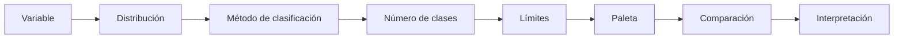
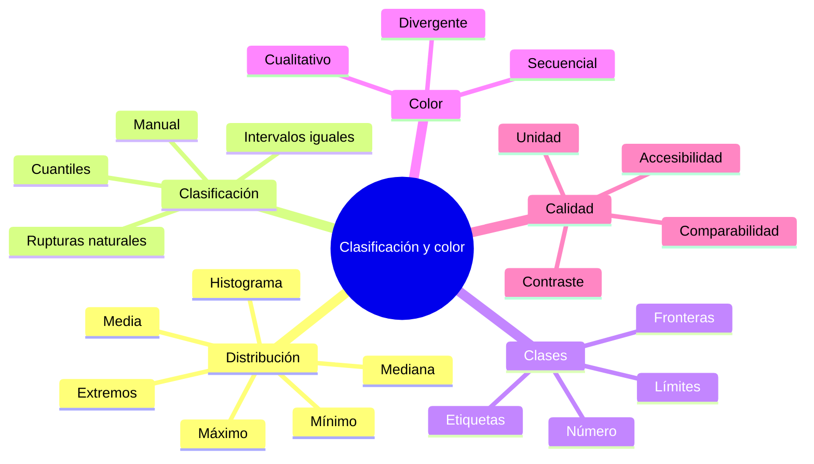
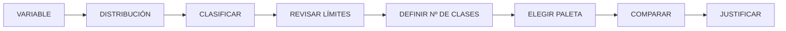

# 4.4 Evaluar clasificaciones y colores

Dos mapas pueden utilizar:

```text
la misma variable
los mismos datos
la misma geometría
```

y aun así producir impresiones muy diferentes.

La causa puede estar en:

```text
los límites de clase
el número de clases
el método de clasificación
el esquema cromático
```

Esta lección parte de una pregunta central:

> **¿Cuánto puede cambiar la interpretación de un territorio sin cambiar un solo dato, únicamente modificando clasificación y color?**

---

## Misión y mapa de aprendizaje

En la lección anterior decidimos:

```text
qué variable representar
```

Ahora debemos decidir:

```text
cómo organizar sus valores
```

y:

```text
cómo traducirlos visualmente
```

### Ruta de la lección



---

## 1. Clasificar significa simplificar

Supongamos valores continuos:

```text
12
17
21
24
28
31
35
42
48
53
61
74
```

Podríamos representar cada valor individualmente.

Pero para una coropleta suele ser más práctico agruparlos en:

```text
clases
```

Por ejemplo:

```text
0–20
20–40
40–60
60–80
```

### ¿Qué hacemos al clasificar?

Transformamos:

```text
muchos valores
```

en:

```text
pocas categorías visuales
```

---

## 2. Clasificar también interpreta

Los límites que elegimos determinan:

```text
qué territorios parecen similares
```

y:

```text
qué territorios parecen diferentes
```

### Ejemplo

Valores:

```text
19
20
21
```

Si existe un límite en:

```text
20
```

podemos terminar con:

```text
19 → clase baja
20 → clase baja
21 → clase media
```

Aunque:

```text
19 y 21
```

sean muy próximos.

!!! warning "Una frontera de clase crea una separación visual que puede ser mayor que la diferencia estadística real"

---

## 3. Antes de clasificar: mirar la distribución

No debemos elegir un método sin conocer:

```text
cómo se distribuyen los datos
```

Revisa:

```text
mínimo
máximo
media
mediana
histograma
valores extremos
```

### Distribución aproximadamente uniforme

Los valores ocupan el rango de forma relativamente regular.

### Distribución sesgada

Muchos valores se concentran en:

```text
un extremo
```

### Distribución con grupos

Pueden existir:

```text
conjuntos naturales
```

de valores.

---

### Inspección en QGIS

!!! info "Captura pendiente · 4.4-01"

    - **Tipo:** PNG.
    - **Archivo:** `assets/images/modulo-04/4-4/4-4-01-histograma-distribucion.png`
    - **Mostrar:**
        1. variable seleccionada;
        2. histograma;
        3. mínimo y máximo;
        4. concentración de valores.
    - **Objetivo didáctico:** mostrar que la clasificación debe comenzar con la distribución.

---

## 4. Número de clases

Una decisión básica es:

```text
cuántas clases utilizar
```

### Muy pocas clases

Ejemplo:

```text
3 clases
```

Ventaja:

```text
lectura rápida
```

Problema:

```text
puede ocultar variación
```

### Muchas clases

Ejemplo:

```text
10 clases
```

Ventaja:

```text
más detalle
```

Problema:

```text
diferencias difíciles de distinguir
leyenda compleja
```

---

## 5. Un punto de partida razonable

En muchos mapas temáticos:

```text
4–7 clases
```

pueden funcionar bien.

Pero no existe una cifra universal.

Depende de:

```text
distribución
soporte
propósito
lector
paleta
```

!!! note "El número de clases es una decisión cartográfica, no una constante"

---

## 6. Tres clases pueden comunicar categorías amplias

Por ejemplo:

```text
BAJO
MEDIO
ALTO
```

Esto puede ser útil para:

```text
síntesis ejecutiva
```

---

## 7. Cinco o seis clases permiten mayor diferenciación

Por ejemplo:

```text
MUY BAJO
BAJO
MEDIO
ALTO
MUY ALTO
```

Pero necesitamos garantizar que:

```text
los tonos puedan diferenciarse
```

---

## 8. Intervalos iguales

Este método divide:

```text
el rango total
```

en partes iguales.

### Ejemplo

Si:

```text
mínimo = 0
máximo = 100
```

y usamos:

```text
5 clases
```

podríamos obtener:

```text
0–20
20–40
40–60
60–80
80–100
```

---

## 9. Ventajas de intervalos iguales

Es fácil de:

```text
comprender
explicar
reproducir
```

Los límites tienen:

```text
anchos idénticos
```

---

## 10. Problema con datos sesgados

Supongamos:

```text
10
11
12
13
14
16
18
20
95
```

Con intervalos iguales:

```text
0–20
20–40
40–60
60–80
80–100
```

la mayoría de territorios quedarían:

```text
en una sola clase
```

### Resultado

El mapa puede perder:

```text
variación interna
```

---

## 11. Cuantiles

Los cuantiles intentan colocar aproximadamente:

```text
el mismo número de entidades
```

en cada clase.

### Ejemplo

20 distritos y:

```text
5 clases
```

aproximadamente:

```text
4 distritos por clase
```

---

## 12. Ventajas de cuantiles

Produce:

```text
ocupación visual equilibrada
```

de las clases.

Puede funcionar cuando queremos:

```text
comparar posiciones relativas
```

---

## 13. Problemas de cuantiles

Puede colocar en clases diferentes valores:

```text
muy parecidos
```

y en la misma clase valores:

```text
relativamente alejados
```

### Ejemplo

```text
99
100
101
```

podrían terminar en:

```text
clases diferentes
```

dependiendo de la distribución.

!!! warning "Cuantil equilibra cantidad de entidades, no distancia estadística"

---

## 14. Rupturas naturales

El método de rupturas naturales intenta encontrar:

```text
grupos internos
```

en los valores.

Busca:

```text
minimizar diferencias dentro de clases
```

y:

```text
maximizar diferencias entre clases
```

---

## 15. Ventaja de rupturas naturales

Puede representar bien distribuciones donde existen:

```text
agrupamientos evidentes
```

---

## 16. Limitación de rupturas naturales

Los límites dependen:

```text
del conjunto de datos concreto
```

Si los datos cambian:

```text
las clases pueden cambiar
```

Esto dificulta comparaciones entre:

```text
años
territorios
series de mapas
```

---

## 17. Comparabilidad temporal

Supongamos mapas de:

```text
2020
2025
2030
```

Si cada año utiliza:

```text
rupturas naturales independientes
```

podemos terminar con:

```text
clases distintas
```

### Entonces

un mismo color puede significar:

```text
rangos diferentes
```

en cada mapa.

!!! warning "Para comparar mapas, también debemos comparar sus límites de clase"

---

## 18. Clases fijas

En una serie temporal puede ser preferible definir:

```text
límites comunes
```

Ejemplo:

```text
0–1000
1000–2000
2000–3000
3000–4000
>4000
```

para todos los años.

### Ventaja

Permite comparación directa.

### Desventaja

Puede no aprovechar completamente la distribución de cada año.

---

## Checkpoint 1

Deberías poder explicar:

- [ ] qué significa clasificar;
- [ ] por qué una clase modifica la interpretación;
- [ ] qué son intervalos iguales;
- [ ] qué hacen los cuantiles;
- [ ] qué intentan detectar las rupturas naturales;
- [ ] por qué la comparabilidad temporal requiere atención especial.

---

## 19. Comparar métodos con los mismos datos

La mejor forma de comprender las diferencias es:

```text
probarlos sobre la misma variable
```

Mantén:

```text
misma capa
misma extensión
misma variable
mismo número de clases
```

y cambia únicamente:

```text
el método
```

---

### Comparación visual

!!! info "Captura pendiente · 4.4-02"

    - **Tipo:** PNG comparativo.
    - **Archivo:** `assets/images/modulo-04/4-4/4-4-02-tres-clasificaciones.png`
    - **Mostrar:**
        1. intervalos iguales;
        2. cuantiles;
        3. rupturas naturales.
    - **Objetivo didáctico:** demostrar que el patrón visual puede cambiar sin modificar los datos.

---

## 20. Construir tabla de límites

Registra:

| Clase | Intervalos iguales | Cuantiles | Rupturas naturales |
|---|---|---|---|
| 1 | | | |
| 2 | | | |
| 3 | | | |
| 4 | | | |
| 5 | | | |

### Esto obliga a mirar

```text
los números
```

y no únicamente:

```text
los colores
```

---

## 21. Valores frontera

Supongamos:

```text
Clase 1 = 0–100
Clase 2 = 100–200
```

Pregunta:

```text
¿dónde cae exactamente 100?
```

Debemos comprender cómo QGIS maneja:

```text
inclusión
exclusión
```

de límites.

---

## 22. Etiquetas de clase

Evita etiquetas ambiguas como:

```text
100 - 200
```

si no está claro cómo se incluyen los extremos.

En algunos productos puede ser más legible utilizar:

```text
Hasta 100
101–200
201–300
Más de 300
```

si la naturaleza de los datos permite esos límites.

---

## 23. Redondear con cuidado

QGIS puede generar límites como:

```text
12.347826
23.695652
```

En la leyenda quizá resulte mejor:

```text
12,3
23,7
```

o incluso:

```text
12
24
```

### Pero

redondear visualmente no debe crear:

```text
clases incoherentes
```

---

## 24. Clases con significado externo

No siempre debemos dejar que un algoritmo determine los límites.

Puede existir una clasificación basada en:

```text
normativa
estándar técnico
umbrales científicos
criterio institucional
```

Ejemplo:

```text
pendiente
0–5°
5–15°
15–30°
>30°
```

si esos rangos tienen significado metodológico.

!!! success "Una clasificación con sentido externo puede ser más interpretable que una clasificación puramente estadística"

---

## 25. Color también comunica orden

Después de definir clases necesitamos:

```text
representarlas visualmente
```

El color tiene propiedades como:

```text
tono
luminosidad
saturación
```

---

## 26. Paletas secuenciales

Se utilizan cuando existe una progresión:

```text
bajo → alto
```

Ejemplo:

```text
densidad poblacional
```

Podemos representar:

```text
claro → oscuro
```

---

## 27. Por qué funciona una secuencia

El lector interpreta:

```text
más intensidad visual
```

como:

```text
mayor magnitud
```

si la paleta está correctamente construida.

---

## 28. Paletas divergentes

Son útiles cuando existe:

```text
un punto central significativo
```

Ejemplos:

```text
cambio negativo ↔ 0 ↔ cambio positivo
temperatura debajo ↔ media ↔ encima
déficit ↔ equilibrio ↔ superávit
```

### Estructura

```text
extremo A
↓
centro neutro
↓
extremo B
```

---

## 29. No usar divergente sin centro significativo

Una variable como:

```text
densidad poblacional
```

normalmente no necesita:

```text
dos direcciones opuestas
```

si no existe un valor central con significado.

---

## 30. Paletas cualitativas

Se utilizan para:

```text
categorías nominales
```

Ejemplo:

```text
SALUD
EDUCACION
DEPORTE
CULTURA
```

Aquí queremos:

```text
diferenciar
```

no:

```text
ordenar
```

---

## 31. No usar arcoíris automáticamente

Una paleta de muchos tonos puede parecer:

```text
atractiva
```

pero puede crear:

```text
saltos visuales arbitrarios
jerarquías difíciles de interpretar
problemas de accesibilidad
```

!!! warning "Más colores no significan mejor comunicación"

---

## 32. Luminosidad y orden

Para variables ordenadas, una propiedad muy importante es:

```text
luminosidad
```

Por ejemplo:

```text
claro = menor
oscuro = mayor
```

Puede resultar más fácil de interpretar que:

```text
cambiar únicamente de tono
```

---

## 33. Accesibilidad cromática

No debemos asumir que todas las personas perciben:

```text
los colores de la misma manera
```

Debemos considerar:

```text
deficiencias en visión del color
pantallas diferentes
impresión
proyección
```

---

## 34. No depender únicamente de rojo y verde

Especialmente si significan:

```text
malo
bueno
```

porque pueden ser difíciles de diferenciar para parte de la población.

### Alternativas

Podemos utilizar:

```text
luminosidad
formas
tramas
etiquetas
```

además del color.

---

## 35. Prueba en escala de grises

Una prueba muy útil consiste en comprobar:

```text
si las diferencias principales siguen siendo legibles
```

al eliminar el color.

Esto permite evaluar:

```text
contraste
jerarquía
```

---

## 36. Color de fondo

La percepción del color también depende de:

```text
lo que lo rodea
```

Un tono puede verse diferente sobre:

```text
blanco
gris
ortofoto
fondo oscuro
```

### Por eso

la paleta no debe elegirse:

```text
aisladamente
```

---

## Checkpoint 2

Deberías poder diferenciar:

- [ ] paleta secuencial;
- [ ] paleta divergente;
- [ ] paleta cualitativa;
- [ ] cuándo existe un centro significativo;
- [ ] por qué la luminosidad comunica orden;
- [ ] por qué el color debe revisarse en contexto.

---

## 37. Clasificación y color forman un sistema

No debemos evaluar:

```text
clasificación
```

y:

```text
color
```

completamente separados.

Ejemplo:

```text
9 clases
```

con una paleta donde apenas distinguimos:

```text
5 niveles
```

produce una contradicción.

---

## 38. Número de clases y discriminación visual

Cuantas más clases:

```text
más diferencias necesita percibir el lector
```

### Por tanto

la elección debe considerar:

```text
capacidad visual
soporte
tamaño
```

---

## 39. El mapa puede exagerar diferencias

Dos valores:

```text
49
51
```

pueden aparecer:

```text
muy diferentes
```

si caen en clases separadas con colores contrastantes.

### El mapa no miente necesariamente

pero:

```text
amplifica una frontera
```

---

## 40. El mapa también puede ocultar diferencias

Valores:

```text
10
35
```

pueden compartir una misma clase.

Visualmente parecerán:

```text
equivalentes
```

aunque no lo sean.

---

## 41. La leyenda debe revelar la clasificación

Nunca ocultes:

```text
los rangos
```

si son importantes para interpretar el mapa.

El lector debe poder conocer:

```text
qué significa cada color
```

---

## 42. Unidad en la leyenda

No basta con:

```text
0–20
20–40
```

Debemos saber si representa:

```text
%
hab/km²
casos/1000 hab.
Bs
```

---

## 43. Título y leyenda deben ser coherentes

Título:

```text
Densidad poblacional
```

Leyenda:

```text
Habitantes por km²
```

Eso permite interpretar correctamente.

---

## 44. Evitar demasiados decimales

Ejemplo poco útil:

```text
2345.3987–4589.2214
```

Puede ser suficiente:

```text
2 345–4 589
```

según:

```text
precisión real
```

---

## 45. Clasificación manual

Después de explorar los métodos automáticos podemos ajustar:

```text
límites
```

manualmente.

### Pero debemos documentar

```text
por qué
```

---

## 46. Cambiar clases para hacer el mapa más dramático

Esto puede ser metodológicamente problemático.

No deberíamos manipular los límites únicamente para:

```text
producir una apariencia deseada
```

### Mejor pregunta

> ¿Qué clasificación representa mejor la distribución y la pregunta?

---

## 47. Comparación honesta

Si presentamos dos mapas para comparar:

```text
territorios
años
escenarios
```

conviene mantener:

```text
mismos límites
misma paleta
misma dirección visual
```

cuando la comparación directa sea el objetivo.

---

## 48. Cambiar la paleta entre mapas comparables

Si:

```text
2025 = azul
2026 = naranja
```

el lector debe aprender:

```text
dos sistemas
```

innecesariamente.

### Consistencia

reduce:

```text
carga cognitiva
```

---

## Laboratorio guiado · Un dato, tres clasificaciones

!!! example "Escenario"

    Dispones de una capa de distritos con:

    ```text
    dens_hab_km2
    ```

    Debes comprobar cómo cambia el patrón visual al modificar únicamente la clasificación.

### Fase 1 · Revisar datos

Registra:

```text
mínimo
máximo
media
mediana
```

---

### Fase 2 · Inspeccionar histograma

Describe:

```text
uniforme
sesgado
agrupado
con extremos
```

---

### Fase 3 · Crear cinco clases

Mantén:

```text
5
```

en todos los métodos.

---

### Fase 4 · Intervalos iguales

Registra los límites.

---

### Fase 5 · Cuantiles

Registra los límites.

---

### Fase 6 · Rupturas naturales

Registra los límites.

---

### Fase 7 · Mantener misma paleta

Usa inicialmente:

```text
la misma paleta secuencial
```

para aislar el efecto de:

```text
la clasificación
```

---

### Fase 8 · Comparar mapas

!!! info "Captura pendiente · 4.4-03"

    - **Tipo:** PNG comparativo.
    - **Archivo:** `assets/images/modulo-04/4-4/4-4-03-comparacion-metodos.png`
    - **Mostrar:** las tres versiones con misma variable y paleta.
    - **Objetivo didáctico:** aislar el efecto del método de clasificación.

---

### Fase 9 · Construir matriz

| Método | Ventaja | Problema observado |
|---|---|---|
| Intervalos iguales | | |
| Cuantiles | | |
| Rupturas naturales | | |

---

### Fase 10 · Comparar número de clases

Prueba ahora:

```text
3
5
7
```

con un mismo método.

---

### Fase 11 · Revisar legibilidad

Pregunta:

```text
¿puedo distinguir realmente todas las clases?
```

---

### Fase 12 · Probar paleta secuencial

Para:

```text
densidad
```

---

### Fase 13 · Crear variable divergente

Si dispones de dos periodos, calcula por ejemplo:

```text
cambio = valor_2026 - valor_2020
```

Podremos tener:

```text
negativo
cero
positivo
```

---

### Fase 14 · Aplicar paleta divergente

Coloca:

```text
0
```

como:

```text
centro significativo
```

---

### Fase 15 · Probar variable categórica

Utiliza:

```text
tipo de equipamiento
```

o equivalente.

Aplica:

```text
paleta cualitativa
```

---

### Fase 16 · Revisar sin color

Exporta o visualiza:

```text
en escala de grises
```

Pregunta:

```text
¿sigue existiendo jerarquía?
```

---

### Fase 17 · Elegir clasificación final

Justifica:

```text
por qué
```

no solo:

```text
cuál se ve mejor
```

---

### Evidencia final

!!! info "Captura pendiente · 4.4-04"

    - **Tipo:** PNG.
    - **Archivo:** `assets/images/modulo-04/4-4/4-4-04-laboratorio-final.png`
    - **Mostrar:**
        1. clasificación seleccionada;
        2. leyenda;
        3. histograma;
        4. límites finales.
    - **Objetivo didáctico:** vincular distribución estadística y solución cartográfica.

---

## Reto práctico · Cambiar la interpretación sin cambiar los datos

!!! example "Reto 4.4"

    Elige una variable cuantitativa territorial.

    Debes producir al menos:

    ```text
    4 versiones
    ```

    del mismo mapa.

### Versión A

```text
Intervalos iguales
```

### Versión B

```text
Cuantiles
```

### Versión C

```text
Rupturas naturales
```

### Versión D

```text
Clasificación manual justificada
```

---

### Parte 1 · Documentar distribución

Incluye:

```text
mínimo
máximo
media
mediana
histograma
```

---

### Parte 2 · Mantener número de clases

Utiliza inicialmente:

```text
5 clases
```

en A, B y C.

---

### Parte 3 · Mantener paleta

Utiliza:

```text
la misma paleta
```

para permitir comparación.

---

### Parte 4 · Registrar límites

| Clase | Iguales | Cuantiles | Natural | Manual |
|---|---|---|---|---|
| 1 | | | | |
| 2 | | | | |
| 3 | | | | |
| 4 | | | | |
| 5 | | | | |

---

### Parte 5 · Detectar cambios territoriales

Identifica entidades que cambien de:

```text
clase
```

entre métodos.

---

### Parte 6 · Analizar fronteras

Busca al menos:

```text
dos valores muy cercanos
```

que aparezcan visualmente muy diferentes.

---

### Parte 7 · Comparar colores

Aplica:

```text
secuencial
```

a la variable principal.

Si tienes una variable de cambio:

```text
divergente
```

Si tienes categorías:

```text
cualitativa
```

---

### Parte 8 · Revisar accesibilidad

Comprueba:

```text
contraste
escala de grises
dependencia rojo-verde
```

---

### Parte 9 · Seleccionar solución final

Justifica:

```text
método
número de clases
límites
paleta
```

---

### Parte 10 · Conclusión

Redacta entre **220 y 300 palabras** explicando:

- cómo se distribuyen tus datos;
- qué diferencias produjo cada método;
- qué territorios cambiaron de clase;
- cuál método generó grupos más equilibrados;
- cuál respetó mejor la estructura de los datos;
- si existe un valor extremo;
- por qué elegiste determinado número de clases;
- qué paleta utilizaste;
- por qué esa paleta corresponde al significado de la variable;
- qué versión utilizarías finalmente y bajo qué propósito.

---

### Entregables

```text
mapa_intervalos_iguales
mapa_cuantiles
mapa_rupturas_naturales
mapa_clasificacion_manual
histograma
tabla_limites
comparacion_colores
justificacion
```

---

## Criterios de evaluación

??? success "Ver rúbrica"

    | Criterio | Se cumple si... |
    |---|---|
    | Distribución | Se revisó antes de clasificar |
    | Método | Se comprende su funcionamiento |
    | Intervalos iguales | Se interpretan correctamente |
    | Cuantiles | Se reconoce su efecto sobre entidades |
    | Rupturas naturales | Se interpretan como dependientes del dataset |
    | Clases | El número es legible |
    | Límites | Son comprensibles |
    | Valores frontera | Se revisan |
    | Unidad | Aparece correctamente |
    | Secuencial | Representa orden |
    | Divergente | Tiene centro significativo |
    | Cualitativa | Se usa para categorías |
    | Accesibilidad | Se revisa |
    | Comparabilidad | Se mantiene cuando es necesaria |
    | Elección final | Está justificada |

---

## Errores frecuentes

=== "QGIS eligió las clases, entonces están bien"

    El software calcula.

    Tú debes:

    ```text
    interpretar
    ```

=== "Cinco clases siempre funcionan"

    No.

=== "Cuantil es más objetivo"

    No necesariamente.

=== "Rupturas naturales siempre es mejor"

    No.

=== "Un color oscuro siempre significa algo malo"

    No.

    Solo debería significar:

    ```text
    mayor intensidad
    ```

    si ese es el sistema definido.

=== "Rojo significa alto"

    Puede hacerlo.

    Pero no es obligatorio.

=== "Uso una paleta divergente porque tiene más colores"

    Necesita:

    ```text
    un centro significativo
    ```

=== "El valor extremo arruina el mapa"

    Puede ser:

    ```text
    el dato más importante
    ```

=== "Cambio los límites hasta que el patrón se vea claro"

    Los límites deben justificarse:

    ```text
    estadística o conceptualmente
    ```

=== "Cada año puede tener su propia leyenda"

    Si deseas comparación directa:

    ```text
    puede ser un problema
    ```

---

## Autoevaluación

??? question "1. ¿Qué hace una clasificación?"

    Agrupa valores continuos en un número limitado de clases visuales.

??? question "2. ¿Clasificar es neutral?"

    No completamente. Los límites influyen en la lectura.

??? question "3. ¿Qué hacen los intervalos iguales?"

    Dividen el rango total en clases del mismo ancho.

??? question "4. ¿Qué hacen los cuantiles?"

    Distribuyen aproximadamente la misma cantidad de entidades entre clases.

??? question "5. ¿Qué buscan las rupturas naturales?"

    Grupos internos relativamente homogéneos dentro de la distribución.

??? question "6. ¿Cuál método es siempre mejor?"

    Ninguno.

??? question "7. ¿Qué debemos revisar antes de elegir?"

    La distribución de los valores.

??? question "8. ¿Más clases siempre significa más información útil?"

    No.

??? question "9. ¿Qué es una paleta secuencial?"

    Una progresión visual para valores ordenados de menor a mayor.

??? question "10. ¿Qué es una paleta divergente?"

    Una paleta con dos direcciones alrededor de un centro significativo.

??? question "11. ¿Qué es una paleta cualitativa?"

    Una paleta destinada a diferenciar categorías sin orden.

??? question "12. ¿Cuándo tiene sentido usar una paleta divergente?"

    Cuando existe un punto de referencia central con significado.

??? question "13. ¿Cero puede ser un centro divergente?"

    Sí, por ejemplo en variables de cambio.

??? question "14. ¿Por qué revisar escala de grises?"

    Para evaluar contraste y dependencia excesiva del color.

??? question "15. ¿Por qué mantener límites en series temporales?"

    Para facilitar comparación directa.

---

## Cierre de la lección

### Mapa mental



### Secuencia principal



!!! quote "Idea central"

    Un mapa temático no depende únicamente de:

    ```text
    los datos
    ```

    También depende de:

    ```text
    cómo agrupamos esos datos
    ```

    y de:

    ```text
    cómo convertimos esas clases en diferencias visuales
    ```

---

## Lo que viene

En **4.5 · Construir una jerarquía visual** dejaremos de concentrarnos únicamente en:

```text
la variable temática
```

y trabajaremos con el mapa completo.

Veremos cómo controlar:

```text
figura y fondo
contraste
tamaño
grosor
transparencia
orden de dibujo
simbología por reglas
símbolos multicapa
```

para resolver una nueva pregunta:

> **¿Cómo hacemos que el lector vea primero lo importante y después el contexto, sin eliminar información necesaria?**

---

## Referencias

- [QGIS 3.44 — Propiedades de capas vectoriales](https://docs.qgis.org/3.44/es/docs/user_manual/working_with_vector/vector_properties.html)  
  Configuración de simbología categorizada y graduada.

- [QGIS 3.44 — Selector de símbolos](https://docs.qgis.org/3.44/es/docs/user_manual/style_library/symbol_selector.html)  
  Configuración de símbolos, colores y propiedades visuales.

- [QGIS 3.44 — Expresiones](https://docs.qgis.org/3.44/es/docs/user_manual/expressions/)  
  Construcción de variables de cambio y otros indicadores.

- [QGIS Training Manual](https://docs.qgis.org/3.44/es/docs/training_manual/)  
  Material oficial de formación.

- [ColorBrewer](https://colorbrewer2.org/)  
  Recurso para explorar esquemas secuenciales, divergentes y cualitativos.

- [Material for MkDocs — Reference](https://squidfunk.github.io/mkdocs-material/reference/)  
  Referencia de componentes utilizados en esta documentación.