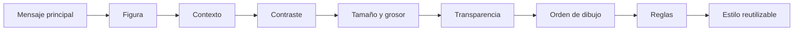
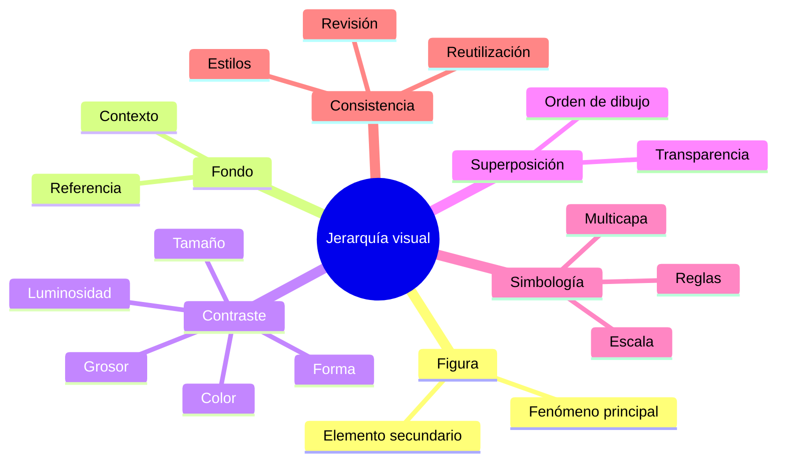
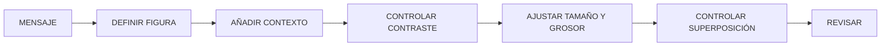

# 4.5 Construir una jerarquía visual

Un mapa puede contener la información correcta y utilizar una clasificación adecuada, pero seguir siendo difícil de leer.

El problema suele aparecer cuando:

```text
todo compite visualmente
```

por la atención.

Por ejemplo:

```text
vías muy oscuras
límites muy gruesos
etiquetas grandes
rellenos saturados
símbolos intensos
```

Si todos los elementos parecen importantes:

```text
ninguno domina realmente
```

Esta lección parte de una idea central:

> **Diseñar una jerarquía visual significa decidir qué debe verse primero, qué debe verse después y qué debe funcionar solo como contexto.**

---

## Misión y mapa de aprendizaje

Supongamos que queremos comunicar:

```text
zonas con alta densidad poblacional
```

y además mostrar:

```text
centros de salud
vías principales
distritos
ríos
```

Todos estos elementos pueden ser necesarios.

Pero no deberían tener:

```text
el mismo peso visual
```

### Ruta de la lección



---

## 1. Figura y fondo

En percepción visual podemos pensar en dos niveles principales:

```text
FIGURA
```

y:

```text
FONDO
```

### Figura

Es aquello que debe recibir:

```text
la atención principal
```

### Fondo

Es aquello que ayuda a:

```text
orientar
contextualizar
interpretar
```

sin competir con la figura.

---

## 2. Ejemplo

Si el fenómeno principal es:

```text
densidad poblacional
```

entonces:

```text
coropleta = figura
```

Mientras:

```text
vías
ríos
límites
```

pueden actuar como:

```text
contexto
```

!!! note "Principio"

    El contexto debe ayudar a leer el fenómeno principal, no competir con él.

---

## 3. Jerarquía visual

Podemos construir varios niveles.

### Nivel 1

```text
fenómeno principal
```

### Nivel 2

```text
elementos relacionados
```

### Nivel 3

```text
contexto
```

### Nivel 4

```text
referencia secundaria
```

---

### Ejemplo

| Elemento | Nivel |
|---|---|
| Densidad | 1 |
| Centros de salud | 2 |
| Vías principales | 3 |
| Límites distritales | 3 |
| Hidrografía menor | 4 |

---

## 4. Pregunta fundamental

Para cada capa pregunta:

> ¿Debe llamar la atención o simplemente ayudar a interpretar?

Si la respuesta es:

```text
simplemente ayudar
```

su peso visual debería ser:

```text
menor
```

---

## Checkpoint 1

Deberías poder explicar:

- [ ] qué significa figura;
- [ ] qué significa fondo;
- [ ] qué elemento es protagonista;
- [ ] qué información funciona como contexto;
- [ ] por qué no todas las capas deben tener igual intensidad.

---

## 5. Contraste

El contraste permite separar visualmente:

```text
elementos
```

Puede producirse mediante:

```text
color
luminosidad
tamaño
grosor
forma
textura
```

---

## 6. Contraste de luminosidad

Un elemento oscuro sobre fondo claro:

```text
destaca
```

Un elemento claro sobre fondo claro:

```text
retrocede
```

### Ejemplo

```text
límite principal = oscuro
límite secundario = gris claro
```

---

## 7. Contraste de color

Los colores saturados suelen atraer más atención que:

```text
colores apagados
```

Por eso:

```text
contexto
```

suele funcionar mejor con tonos:

```text
menos saturados
```

---

## 8. Contraste por tamaño

Un símbolo grande generalmente domina sobre:

```text
uno pequeño
```

Ejemplo:

```text
hospital regional
```

puede tener mayor tamaño que:

```text
puesto de salud
```

si esa jerarquía corresponde al mensaje.

---

## 9. Contraste por grosor

En líneas:

```text
mayor grosor
```

produce:

```text
mayor presencia visual
```

### Ejemplo

```text
vía troncal = 1.2 mm
vía secundaria = 0.6 mm
vía local = 0.25 mm
```

---

## 10. Contraste por forma

Dos categorías pueden diferenciarse mediante:

```text
círculo
cuadrado
triángulo
```

Esto puede ser útil cuando:

```text
el color no es suficiente
```

---

## 11. No maximizar todos los contrastes

Un error habitual:

```text
colores intensos
símbolos grandes
líneas gruesas
texto en negrita
```

simultáneamente.

Eso produce:

```text
competencia visual
```

!!! warning "Jerarquizar no significa aumentar todo"

---

## 12. Diseñar desde el fenómeno principal

Una estrategia eficaz es:

```text
1. simbolizar primero el fenómeno principal
2. añadir contexto progresivamente
3. detenerse cuando el contexto ya es suficiente
```

No al revés.

---

### Visual previsto

!!! info "Captura pendiente · 4.5-01"

    - **Tipo:** PNG comparativo.
    - **Archivo:** `assets/images/modulo-04/4-5/4-5-01-sin-con-jerarquia.png`
    - **Mostrar:**
        1. mapa donde todas las capas compiten;
        2. mapa con jerarquía clara.
    - **Objetivo didáctico:** demostrar el efecto de la jerarquización visual.

---

## 13. Tamaño de símbolos

El tamaño debe relacionarse con:

```text
importancia
categoría
escala
soporte
```

### Demasiado pequeño

Puede desaparecer.

### Demasiado grande

Puede:

```text
ocultar información
crear solapamiento
dominar innecesariamente
```

---

## 14. Tamaño físico y unidades

En cartografía impresa es útil pensar en:

```text
milímetros
```

y no únicamente:

```text
píxeles
```

porque el producto final puede cambiar de:

```text
resolución
```

---

## 15. Tamaño dependiente de escala

Un símbolo que funciona a:

```text
1:10 000
```

puede no funcionar a:

```text
1:100 000
```

### Por eso

el tamaño también puede ser:

```text
dependiente de escala
```

---

## 16. Grosor de líneas

Las líneas tienen:

```text
jerarquía visual
```

muy fuerte.

### Ejemplo

```text
límite municipal
límite distrital
límite barrial
```

No deberían verse necesariamente iguales.

---

## 17. Límites demasiado oscuros

Un error frecuente es utilizar:

```text
contornos negros gruesos
```

para todos los polígonos.

Esto puede producir:

```text
una cuadrícula visual dominante
```

que compite con el fenómeno temático.

---

## 18. Atenuar límites internos

Podemos utilizar:

```text
gris
transparencia
línea fina
```

para límites secundarios.

---

## 19. Mantener un límite exterior

El límite principal puede mantenerse más visible para:

```text
definir el área de estudio
```

---

## 20. Transparencia

La transparencia permite:

```text
superponer información
```

sin ocultar completamente:

```text
el contexto
```

---

## 21. Ejemplo

Supongamos:

```text
polígono de riesgo
```

sobre:

```text
ortofoto
```

Una transparencia moderada puede permitir:

```text
ver riesgo
+
ver territorio
```

---

## 22. Problema de transparencia excesiva

Si aplicamos:

```text
80–90 %
```

el fenómeno puede volverse:

```text
difícil de identificar
```

---

## 23. Problema de transparencia insuficiente

Si el relleno es:

```text
100 % opaco
```

puede ocultar:

```text
vías
edificios
hidrografía
```

---

## 24. Transparencia no corrige mala jerarquía

Si demasiadas capas compiten:

```text
hacerlas transparentes
```

no necesariamente resuelve:

```text
el problema conceptual
```

A veces debemos:

```text
eliminar
simplificar
reordenar
```

---

## 25. Orden de dibujo

La posición de una capa en el panel puede afectar:

```text
qué queda encima
```

y:

```text
qué queda oculto
```

### Ejemplo

```text
polígono
```

puede ocultar:

```text
líneas
```

si se dibuja después.

---

## 26. Orden lógico

Una estructura frecuente podría ser:

```text
etiquetas
puntos
líneas principales
líneas secundarias
polígonos temáticos
fondo
```

Pero depende de:

```text
mensaje
```

---

## 27. El orden no es solo vertical

Dentro de una misma capa podemos necesitar:

```text
ordenar entidades
```

para controlar cuál símbolo se dibuja primero.

---

## 28. Ejemplo con carreteras

Queremos que:

```text
vías principales
```

se dibujen sobre:

```text
vías secundarias
```

aunque estén en:

```text
la misma capa
```

---

## 29. Control del orden

QGIS permite controlar:

```text
orden de representación
```

según atributos o expresiones.

Esto es especialmente útil con:

```text
símbolos superpuestos
```

---

### Visual previsto

!!! info "Captura pendiente · 4.5-02"

    - **Tipo:** GIF.
    - **Archivo:** `assets/images/modulo-04/4-5/4-5-02-orden-dibujo.gif`
    - **Mostrar:**
        1. orden incorrecto;
        2. modificar orden;
        3. resultado correcto.
    - **Objetivo didáctico:** mostrar que la superposición también forma parte de la jerarquía.

---

## 30. Simbología por reglas

Hasta ahora podemos haber utilizado:

```text
símbolo único
categorizado
graduado
```

Pero existen situaciones donde necesitamos:

```text
reglas explícitas
```

---

## 31. Ejemplo

Una capa de vías contiene:

```text
TIPO
ESTADO
JERARQUIA
```

Queremos:

```text
vías principales pavimentadas
vías principales no pavimentadas
vías secundarias
```

Podemos construir:

```text
reglas
```

en lugar de una única clasificación.

---

## 32. Regla

Conceptualmente:

```qgis
"jerarquia" = 'PRINCIPAL'
AND
"estado" = 'PAVIMENTADA'
```

Otra:

```qgis
"jerarquia" = 'PRINCIPAL'
AND
"estado" = 'NO_PAVIMENTADA'
```

---

## 33. Ventaja

La simbología por reglas permite combinar:

```text
atributos
expresiones
escala
```

para construir representaciones:

```text
más inteligentes
```

---

## 34. Reglas y jerarquía

Podemos definir:

```text
regla principal
```

con símbolo:

```text
más visible
```

y reglas secundarias con:

```text
menos contraste
```

---

## 35. Reglas dependientes de escala

También podemos aplicar reglas solo dentro de:

```text
determinados rangos
```

Ejemplo:

```text
calles locales
```

solo a:

```text
escala grande
```

---

## 36. Reglas excluyentes

Debemos revisar:

```text
si una entidad puede cumplir varias reglas
```

porque puede producir:

```text
representación múltiple
```

---

## Checkpoint 2

Deberías poder explicar:

- [ ] cómo el contraste crea jerarquía;
- [ ] cómo tamaño y grosor afectan atención;
- [ ] para qué sirve transparencia;
- [ ] por qué importa el orden de dibujo;
- [ ] qué ventaja ofrece la simbología por reglas;
- [ ] por qué una regla debe tener significado cartográfico.

---

## 37. Símbolos multicapa

Un símbolo puede estar compuesto por:

```text
varias capas gráficas
```

### Ejemplo vial

Podemos construir una carretera mediante:

```text
línea exterior oscura
+
línea interior clara
```

Esto produce:

```text
efecto de casing
```

---

## 38. Ventaja

Los símbolos multicapa permiten:

```text
mejor separación
mayor jerarquía
representaciones complejas
```

---

## 39. Ejemplo de vía

```text
capa 1
gris oscuro
2 mm

capa 2
blanco
1.2 mm
```

Resultado:

```text
carretera claramente delimitada
```

---

## 40. No abusar

Demasiadas capas simbólicas pueden:

```text
complicar
ralentizar
sobrecargar
```

la representación.

---

## 41. Desplazamiento de símbolos

Para elementos superpuestos podemos utilizar:

```text
desplazamiento
```

o:

```text
offset
```

### Ejemplo

Dos líneas paralelas:

```text
ferrocarril
carretera
```

pueden necesitar separación visual.

---

## 42. Marcadores sobre líneas

Podemos añadir:

```text
símbolos repetidos
```

sobre una línea.

Ejemplo:

```text
ferrocarril
```

---

## 43. Patrones y rellenos

Los polígonos también pueden utilizar:

```text
tramas
puntos
líneas
```

además de:

```text
color sólido
```

---

## 44. Cuándo sirven las tramas

Pueden ayudar cuando:

```text
el color no es suficiente
impresión en blanco y negro
superposición de fenómenos
accesibilidad
```

---

## 45. Dobles codificaciones

Podemos utilizar:

```text
color + trama
```

o:

```text
color + forma
```

para reforzar diferencias.

### Pero

cada codificación debe tener:

```text
una razón
```

---

## 46. Orden visual dentro de una coropleta

Incluso una coropleta puede perder jerarquía si:

```text
límites
etiquetas
contexto
```

dominan demasiado.

### Estrategia

```text
primero ajustar relleno
después límites
después contexto
```

---

## 47. Fondo cartográfico

Si utilizamos:

```text
OpenStreetMap
ortofoto
mapa base
```

debemos decidir si realmente ayuda.

---

## 48. Fondo demasiado intenso

Un mapa base con:

```text
muchos colores
muchas etiquetas
muchas calles
```

puede competir con:

```text
nuestro tema
```

---

## 49. Atenuar el fondo

Podemos:

```text
reducir saturación
aumentar transparencia
usar escala de grises
```

según el caso.

---

## 50. También podemos eliminarlo

No todo mapa necesita:

```text
mapa base
```

A veces:

```text
límites + fenómeno
```

son suficientes.

---

## 51. El vacío también diseña

No debemos llenar:

```text
cada espacio disponible
```

El espacio visual ayuda a:

```text
separar
organizar
respirar
```

---

## 52. Estilos reutilizables

Si encontramos una representación adecuada:

```text
no necesitamos reconstruirla cada vez
```

Podemos guardar:

```text
estilo de capa
```

o utilizar:

```text
biblioteca de estilos
```

---

## 53. Ventaja institucional

Los estilos permiten mantener:

```text
consistencia
```

entre:

```text
mapas
proyectos
analistas
```

---

## 54. Ejemplo

Un municipio podría definir estilos para:

```text
límite municipal
distritos
red vial
ríos
equipamientos
```

y reutilizarlos.

---

## 55. Consistencia no significa rigidez

Un estilo institucional debe poder adaptarse a:

```text
escala
propósito
soporte
```

---

## 56. Guardar estilo

Podemos reutilizar:

```text
simbología
etiquetado
diagramas
```

según las opciones utilizadas.

---

### Visual previsto

!!! info "Captura pendiente · 4.5-03"

    - **Tipo:** GIF.
    - **Archivo:** `assets/images/modulo-04/4-5/4-5-03-guardar-estilo.gif`
    - **Mostrar:**
        1. capa simbolizada;
        2. guardar estilo;
        3. aplicar estilo a otra capa compatible.
    - **Objetivo didáctico:** introducir consistencia y reutilización.

---

## 57. Método de revisión jerárquica

Después de simbolizar, mira el mapa durante:

```text
3 segundos
```

Pregunta:

> ¿Qué vi primero?

Si la respuesta no es:

```text
el fenómeno principal
```

la jerarquía necesita revisión.

---

## 58. Prueba de desenfoque

Aleja ligeramente la vista o desenfoca mentalmente.

Pregunta:

```text
¿qué masa visual domina?
```

Esto permite identificar:

```text
competencias
```

---

## 59. Prueba de escala de grises

Elimina temporalmente el color.

Comprueba:

```text
qué elementos siguen dominando
```

---

## 60. Prueba de eliminación

Oculta una capa secundaria.

Pregunta:

```text
¿el mapa pierde significado?
```

Si no:

```text
quizá no era necesaria
```

---

## 61. Prueba de impresión

Un símbolo que funciona en pantalla puede:

```text
desaparecer
```

al imprimir.

Revisa:

```text
grosor
tamaño
contraste
```

a escala final.

---

## Laboratorio guiado · Destacar el fenómeno sin perder contexto

!!! example "Escenario"

    Dispones de:

    ```text
    densidad poblacional
    centros de salud
    red vial
    ríos
    límites distritales
    ```

    El fenómeno principal será:

    ```text
    densidad poblacional
    ```

    y los centros de salud serán:

    ```text
    información secundaria relevante
    ```

### Fase 1 · Definir niveles

Completa:

| Elemento | Nivel |
|---|---:|
| Densidad | 1 |
| Centros de salud | 2 |
| Vías | |
| Distritos | |
| Ríos | |

---

### Fase 2 · Ocultar todo

Deja visible únicamente:

```text
densidad
```

---

### Fase 3 · Diseñar fenómeno principal

Ajusta:

```text
clasificación
paleta
límites
```

---

### Fase 4 · Añadir centros de salud

Deben:

```text
verse claramente
```

sin dominar todo el mapa.

---

### Fase 5 · Añadir límites

Usa:

```text
líneas finas
bajo contraste
```

---

### Fase 6 · Añadir vías principales

No muestres inicialmente:

```text
toda la red
```

Selecciona las necesarias.

---

### Fase 7 · Añadir hidrografía

Pregunta:

```text
¿ayuda realmente?
```

Si no:

```text
elimínala
```

---

### Fase 8 · Revisar orden de dibujo

Comprueba que:

```text
centros
```

no queden ocultos.

---

### Fase 9 · Reducir saturación

Atenúa:

```text
contexto
```

---

### Fase 10 · Comparar antes y después

!!! info "Captura pendiente · 4.5-04"

    - **Tipo:** PNG comparativo.
    - **Archivo:** `assets/images/modulo-04/4-5/4-5-04-jerarquia-antes-despues.png`
    - **Mostrar:**
        1. versión inicial;
        2. versión jerarquizada.
    - **Objetivo didáctico:** demostrar que el mismo contenido puede adquirir una lectura mucho más clara.

---

### Fase 11 · Crear una regla vial

Diferencia:

```text
PRINCIPAL
SECUNDARIA
```

---

### Fase 12 · Ajustar grosor

Ejemplo:

```text
PRINCIPAL = mayor
SECUNDARIA = menor
```

---

### Fase 13 · Crear símbolo multicapa

Utiliza al menos una:

```text
vía principal
```

con:

```text
casing
```

---

### Fase 14 · Guardar estilo

Guarda el estilo:

```text
red_vial_curso
```

---

### Fase 15 · Prueba de 3 segundos

Mira el mapa brevemente.

Anota:

```text
qué viste primero
qué viste después
```

---

### Fase 16 · Revisar a tamaño final

Comprueba:

```text
líneas
símbolos
contraste
```

---

## Reto práctico · Construir tres niveles de jerarquía

!!! example "Reto 4.5"

    Construye un mapa que contenga como mínimo:

    ```text
    1 fenómeno principal
    1 fenómeno secundario
    3 elementos de contexto
    ```

    El objetivo es que el lector pueda identificar claramente:

    ```text
    nivel 1
    nivel 2
    nivel 3
    ```

### Parte 1 · Definir mensaje

Completa:

> El mapa debe permitir comprender que...

---

### Parte 2 · Clasificar elementos

| Elemento | Función | Nivel |
|---|---|---:|
| | Principal | 1 |
| | Secundario | 2 |
| | Contexto | 3 |
| | Contexto | 3 |
| | Contexto | 3 |

---

### Parte 3 · Crear versión deliberadamente mala

Haz que:

```text
todas las capas
```

tengan alto contraste.

Guarda:

```text
version_sin_jerarquia
```

---

### Parte 4 · Construir jerarquía

Modifica:

```text
color
saturación
grosor
tamaño
transparencia
```

---

### Parte 5 · Controlar orden

Verifica:

```text
qué queda encima
```

---

### Parte 6 · Aplicar reglas

Utiliza:

```text
simbología por reglas
```

en al menos una capa.

---

### Parte 7 · Crear símbolo multicapa

Utiliza al menos:

```text
un símbolo compuesto
```

---

### Parte 8 · Atenuar fondo

Si utilizas un mapa base:

```text
reduce su competencia visual
```

---

### Parte 9 · Revisar en escala de grises

Comprueba:

```text
jerarquía tonal
```

---

### Parte 10 · Revisar al tamaño final

No únicamente ampliado en pantalla.

---

### Parte 11 · Guardar estilo

Guarda al menos:

```text
un estilo reutilizable
```

---

### Parte 12 · Comparar

| Aspecto | Sin jerarquía | Con jerarquía |
|---|---|---|
| Elemento dominante | | |
| Contexto | | |
| Saturación | | |
| Líneas | | |
| Legibilidad | | |

---

### Parte 13 · Conclusión

Redacta entre **200 y 280 palabras** explicando:

- cuál es el fenómeno principal;
- qué elementos funcionan como contexto;
- qué viste primero en la versión inicial;
- qué cambios realizaste;
- cómo modificaste grosor y tamaño;
- cómo utilizaste transparencia;
- cómo controlaste el orden de dibujo;
- qué regla creaste;
- qué estilo guardaste;
- cómo cambió la lectura final.

---

### Entregables

```text
version_sin_jerarquia
version_con_jerarquia
tabla_niveles
captura_reglas
captura_simbolo_multicapa
estilo_reutilizable
comparacion
conclusion
```

---

## Criterios de evaluación

??? success "Ver rúbrica"

    | Criterio | Se cumple si... |
    |---|---|
    | Fenómeno principal | Se identifica inmediatamente |
    | Figura/fondo | Existe separación clara |
    | Contraste | Está controlado |
    | Tamaño | Refuerza la jerarquía |
    | Grosor | Diferencia niveles |
    | Transparencia | Ayuda sin ocultar |
    | Orden | Evita ocultamientos |
    | Reglas | Tienen lógica cartográfica |
    | Símbolo multicapa | Tiene función clara |
    | Contexto | No compite con el tema |
    | Fondo | Está controlado |
    | Escala de grises | Mantiene estructura |
    | Estilo | Puede reutilizarse |
    | Resultado | La lectura ocurre en orden |

---

## Errores frecuentes

=== "Todo debe verse claramente"

    Sí, pero no con:

    ```text
    la misma intensidad
    ```

=== "Uso negro para todos los límites"

    Puede producir:

    ```text
    exceso de contraste
    ```

=== "El fenómeno no destaca, aumentaré saturación"

    Tal vez sea mejor:

    ```text
    reducir el contexto
    ```

=== "Transparencia soluciona todo"

    No.

=== "El mapa base debe mantenerse como viene"

    No necesariamente.

=== "Más grosor significa mejor"

    Solo si corresponde a:

    ```text
    jerarquía
    ```

=== "Las vías principales deben ser negras"

    No existe esa obligación.

=== "El orden del panel no importa"

    Puede afectar:

    ```text
    superposición
    ```

=== "Guardar estilos es solo una comodidad"

    También mejora:

    ```text
    consistencia
    reproducibilidad
    ```

=== "Si algo no se ve, debo hacerlo más fuerte"

    Primero pregunta:

    ```text
    ¿el resto está demasiado fuerte?
    ```

---

## Autoevaluación

??? question "1. ¿Qué es figura?"

    El elemento que debe atraer primero la atención.

??? question "2. ¿Qué es fondo?"

    La información que contextualiza sin dominar.

??? question "3. ¿Qué es jerarquía visual?"

    La organización del peso perceptivo entre elementos.

??? question "4. ¿Qué variables visuales pueden crear contraste?"

    ```text
    color
    luminosidad
    tamaño
    grosor
    forma
    textura
    ```

??? question "5. ¿Por qué atenuar límites internos?"

    Para evitar que compitan con el fenómeno temático.

??? question "6. ¿Para qué sirve transparencia?"

    Para permitir superposición sin ocultar completamente capas inferiores.

??? question "7. ¿Transparencia reemplaza una buena selección?"

    No.

??? question "8. ¿Por qué importa el orden de dibujo?"

    Porque controla qué elementos quedan visibles encima de otros.

??? question "9. ¿Qué es simbología por reglas?"

    Una representación donde cada símbolo se aplica mediante condiciones explícitas.

??? question "10. ¿Qué es un símbolo multicapa?"

    Un símbolo compuesto por varios elementos gráficos superpuestos.

??? question "11. ¿Qué es casing?"

    Un efecto de línea compuesto por una línea exterior y otra interior.

??? question "12. ¿Un fondo cartográfico siempre es necesario?"

    No.

??? question "13. ¿Qué comprueba la prueba de 3 segundos?"

    Qué elemento domina inmediatamente la lectura.

??? question "14. ¿Para qué sirve guardar estilos?"

    Para reutilizar decisiones de representación y mantener consistencia.

??? question "15. ¿Cuál es la secuencia principal?"

    ```text
    fenómeno
    → figura
    → contexto
    → contraste
    → tamaño
    → orden
    → revisión
    ```

---

## Cierre de la lección

### Mapa mental



### Secuencia principal



!!! quote "Idea central"

    El objetivo no es conseguir que:

    ```text
    todo destaque
    ```

    sino conseguir que:

    ```text
    cada elemento tenga el peso visual que corresponde a su función
    ```

---

## Lo que viene

En **4.6 · Resolver el etiquetado de mapas complejos** trabajaremos con uno de los componentes más difíciles de la producción cartográfica:

```text
el texto
```

Veremos:

```text
expresiones
prioridades
obstáculos
colocación
escala
buffers
máscaras
líneas de llamada
etiquetas no colocadas
```

La pregunta central será:

> **¿Cómo incluir la información textual necesaria sin convertir el mapa en una acumulación de nombres que ocultan el territorio?**

---

## Referencias

- [QGIS 3.44 — Simbología vectorial](https://docs.qgis.org/3.44/es/docs/user_manual/style_library/symbol_selector.html)  
  Configuración de símbolos, capas de símbolo y propiedades visuales.

- [QGIS 3.44 — Propiedades vectoriales](https://docs.qgis.org/3.44/es/docs/user_manual/working_with_vector/vector_properties.html)  
  Simbología por reglas, orden de representación y propiedades dependientes de escala.

- [QGIS 3.44 — Biblioteca de estilos](https://docs.qgis.org/3.44/es/docs/user_manual/style_library/style_manager.html)  
  Gestión y reutilización de símbolos y estilos.

- [QGIS Training Manual](https://docs.qgis.org/3.44/es/docs/training_manual/)  
  Material oficial de formación.

- [Material for MkDocs — Reference](https://squidfunk.github.io/mkdocs-material/reference/)  
  Referencia de componentes utilizados en esta documentación.