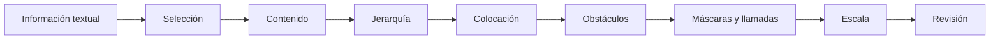
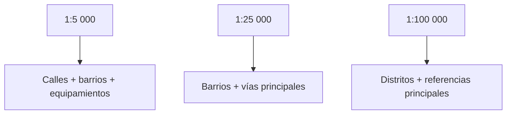
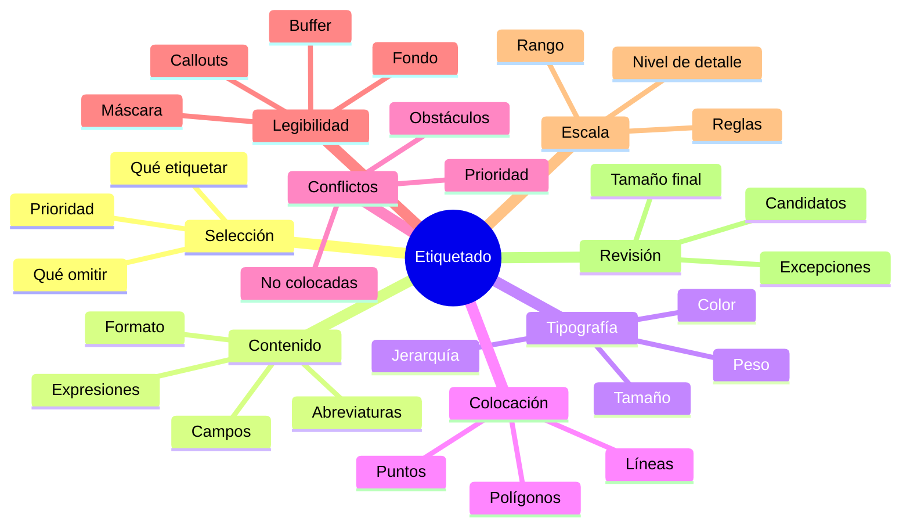

# 4.6 Resolver el etiquetado de mapas complejos

Un mapa puede tener:

```text
buena simbología
buena clasificación
buena jerarquía visual
```

y aun así fallar porque:

```text
las etiquetas se superponen
ocultan el fenómeno
desaparecen
repiten información
o resultan imposibles de leer
```

El etiquetado es uno de los problemas cartográficos más difíciles porque debemos ubicar:

```text
texto
```

dentro de un espacio que ya contiene:

```text
geometrías
símbolos
colores
límites
otros textos
```

La idea central de esta lección es:

> **Etiquetar no significa mostrar todos los nombres. Significa seleccionar, priorizar y colocar la información textual necesaria para que el mapa siga siendo legible.**

---

## Misión y mapa de aprendizaje

Supongamos que tenemos un área urbana con:

```text
350 calles
42 barrios
28 equipamientos
12 ríos y quebradas
8 distritos
```

y activamos:

```text
etiquetas para todo
```

El resultado probablemente será:

```text
una nube de texto
```

Nuestro trabajo será convertirla en:

```text
una estructura tipográfica jerarquizada
```

### Ruta de la lección



---

## 1. Decidir qué merece una etiqueta

Antes de abrir las propiedades de etiquetado pregunta:

> **¿Qué información textual es realmente necesaria para comprender este mapa?**

No toda entidad necesita:

```text
un nombre visible
```

### Ejemplo

En un mapa urbano podríamos tener:

```text
vías principales
vías secundarias
vías locales
```

pero quizá solo necesitemos etiquetar:

```text
vías principales
```

a determinada escala.

### La etiqueta también ocupa espacio

Cada texto introduce:

```text
peso visual
```

Por tanto:

```text
más etiquetas
```

no significa:

```text
más información útil
```

!!! warning "Etiquetar todo suele reducir la legibilidad"

---

### Prioridad conceptual

Podemos clasificar las etiquetas como:

| Nivel | Ejemplo |
|---|---|
| 1 · Esencial | Distritos, ciudades principales |
| 2 · Importante | Barrios, vías principales |
| 3 · Secundaria | Equipamientos menores |
| 4 · Prescindible | Detalle local excesivo |

Esta clasificación debe responder al:

```text
propósito del mapa
```

---

## 2. Construir el contenido de la etiqueta

Una etiqueta no tiene que mostrar únicamente:

```text
un campo
```

Puede construirse mediante:

```text
expresiones
```

QGIS permite utilizar un atributo o una expresión como contenido de la etiqueta. :chatgpt-content-reference{index="1"}

### Ejemplo básico

Campo:

```qgis
"nombre"
```

### Combinar campos

```qgis
"nombre" || ' - ' || "categoria"
```

Resultado:

```text
Hospital México - Tercer Nivel
```

---

### Saltos de línea

Podemos construir:

```qgis
"nombre" || '\n' || "categoria"
```

Resultado conceptual:

```text
Hospital México
Tercer Nivel
```

### Evitar NULL

Si alguno de los campos puede ser nulo:

```qgis
concat(
    "nombre",
    CASE
        WHEN "categoria" IS NOT NULL
        THEN '\n' || "categoria"
        ELSE ''
    END
)
```

---

### Formatear números

Ejemplo:

```qgis
format_number("poblacion", 0)
```

Podría utilizarse dentro de una etiqueta como:

```qgis
"nombre" || '\n' ||
format_number("poblacion", 0) || ' hab.'
```

---

### El texto debe aportar algo

Evita:

```text
Barrio Barrio Central
```

si el nombre ya contiene:

```text
Barrio
```

El contenido debe ser:

```text
breve
consistente
necesario
```

---

## 3. Jerarquía tipográfica

Las etiquetas también necesitan niveles visuales.

Podemos variar:

```text
tamaño
peso
familia tipográfica
color
mayúsculas
espaciado
```

### Ejemplo

```text
MUNICIPIO
14 pt · negrita

DISTRITO
11 pt · seminegrita

BARRIO
9 pt · regular

CALLE
8 pt · regular
```

### Pero no conviertas cada nivel en un estilo completamente distinto

La jerarquía debe sentirse:

```text
coherente
```

y no:

```text
decorativa
```

---

### Evitar demasiadas tipografías

Una solución sobria suele utilizar:

```text
una familia tipográfica
```

con:

```text
diferentes pesos
tamaños
estilos
```

### Ejemplo

```text
Noto Sans Regular
Noto Sans Medium
Noto Sans Bold
```

en lugar de:

```text
cinco familias distintas
```

---

## 4. Colocación según la geometría

La etiqueta debe relacionarse visualmente con:

```text
su entidad
```

No etiquetamos igual:

```text
un punto
una línea
un polígono
```

---

### Puntos

Para un punto podemos utilizar posiciones como:

```text
arriba
abajo
izquierda
derecha
alrededor del punto
```

El objetivo es evitar:

```text
solapamientos
```

y mantener clara la relación:

```text
símbolo ↔ nombre
```

---

### Líneas

Los nombres de:

```text
ríos
calles
carreteras
```

suelen funcionar mejor cuando:

```text
siguen la geometría
```

### Una etiqueta vial debería

cuando sea posible:

```text
acompañar la dirección de la vía
```

y evitar:

```text
cambios abruptos
```

---

### Polígonos

En polígonos podemos buscar:

```text
posición interior
```

y evitar que el nombre parezca pertenecer a:

```text
otra unidad vecina
```

### Polígonos irregulares

Una etiqueta centrada geométricamente puede caer:

```text
fuera de la zona visualmente principal
```

La colocación automática debe revisarse.

---

### Captura prevista

!!! info "Captura pendiente · 4.6-01"

    - **Tipo:** PNG comparativo.
    - **Archivo:** `assets/images/modulo-04/4-6/4-6-01-colocacion-geometrias.png`
    - **Mostrar:**
        1. etiquetas de puntos;
        2. etiquetas sobre líneas;
        3. etiquetas dentro de polígonos.
    - **Objetivo didáctico:** comparar estrategias de colocación según geometría.

---

## 5. Buffer de texto

Cuando una etiqueta se superpone con:

```text
líneas
polígonos
fondos complejos
```

puede perder legibilidad.

Una solución es utilizar:

```text
buffer
```

alrededor de las letras.

### Ejemplo

```text
texto oscuro
+
buffer blanco fino
```

### Ventaja

Separa el texto del fondo.

### Riesgo

Un buffer demasiado grande puede:

```text
crear manchas blancas
fragmentar el mapa
ocultar información
```

!!! note "El buffer debe mejorar la lectura, no convertirse en protagonista"

---

## 6. Fondo y sombra

QGIS permite añadir elementos como:

```text
fondo
sombra
```

a las etiquetas.

Pueden ser útiles en situaciones concretas.

### Fondo

Puede ayudar cuando:

```text
el texto necesita aislarse completamente
```

### Sombra

Puede mejorar separación en determinados diseños.

### Pero

si utilizamos:

```text
buffer
fondo
sombra
```

simultáneamente en todas las etiquetas:

```text
el mapa puede volverse pesado
```

---

## 7. Obstáculos

No todo espacio libre es realmente:

```text
un buen lugar para una etiqueta
```

Puede existir un elemento que no debería ser cubierto por texto.

Ejemplo:

```text
centro de salud
```

Un nombre de calle no debería ocultar:

```text
el símbolo del hospital
```

QGIS permite controlar interacciones entre etiquetas y entidades mediante reglas de etiquetado y obstáculos. En QGIS 3.44 existen reglas de proyecto para impedir superposiciones o empujar etiquetas respecto de entidades o etiquetas de otras capas. :chatgpt-content-reference{index="2"}

---

### Ejemplos de obstáculos

```text
edificios importantes
equipamientos
ríos
símbolos puntuales
otras etiquetas
```

### Idea central

```text
prioridad de etiqueta
+
peso del obstáculo
```

ayudan al motor a decidir:

```text
qué debe respetarse primero
```

---

## 8. Prioridad de etiquetado

Si no existe suficiente espacio para todas las etiquetas:

```text
algunas tendrán que desaparecer
```

La pregunta es:

> ¿Cuáles?

### Ejemplo

Queremos priorizar:

```text
hospitales
```

sobre:

```text
farmacias
```

Entonces:

```text
hospital = prioridad alta
farmacia = prioridad menor
```

### Prioridad no significa tamaño

Una etiqueta puede ser:

```text
pequeña
```

pero:

```text
muy importante
```

---

### Diseñar prioridades conscientemente

Ejemplo:

| Capa | Prioridad |
|---|---|
| Distritos | Muy alta |
| Hospitales | Alta |
| Barrios | Media |
| Vías principales | Media |
| Vías locales | Baja |

---

## Checkpoint 1

Deberías poder explicar:

- [ ] por qué no todas las entidades necesitan etiqueta;
- [ ] cómo construir contenido mediante expresiones;
- [ ] qué es jerarquía tipográfica;
- [ ] cómo cambia la colocación según geometría;
- [ ] para qué sirve un buffer;
- [ ] qué función tienen los obstáculos;
- [ ] qué significa prioridad de etiquetado.

---

## 9. Etiquetado basado en reglas

QGIS permite utilizar:

```text
etiquetado basado en reglas
```

además del etiquetado individual. :chatgpt-content-reference{index="3"}

Esto es útil cuando una misma capa contiene:

```text
varios tipos de entidades
```

que necesitan:

```text
distintos estilos
distintas prioridades
distintas escalas
```

---

### Ejemplo vial

Podemos crear:

```text
Regla 1
jerarquia = 'PRINCIPAL'
```

y:

```text
Regla 2
jerarquia = 'SECUNDARIA'
```

### Principal

```text
10 pt
mayor prioridad
visible a más escalas
```

### Secundaria

```text
8 pt
menor prioridad
solo a escala detallada
```

---

### Ejemplo de expresión

```qgis
"jerarquia" = 'PRINCIPAL'
```

Segunda regla:

```qgis
"jerarquia" = 'SECUNDARIA'
```

---

## 10. Etiquetas dependientes de escala

Una etiqueta que funciona a:

```text
1:5 000
```

puede saturar un mapa a:

```text
1:50 000
```

### Ejemplo

A:

```text
1:5 000
```

podemos mostrar:

```text
calles
barrios
equipamientos
```

A:

```text
1:25 000
```

quizá solo:

```text
barrios
vías principales
equipamientos mayores
```

A:

```text
1:100 000
```

quizá:

```text
distritos
centros principales
```

---

### Escala y jerarquía



---

### Configuración visual prevista

!!! info "Captura pendiente · 4.6-02"

    - **Tipo:** GIF.
    - **Archivo:** `assets/images/modulo-04/4-6/4-6-02-etiquetas-escala.gif`
    - **Mostrar:**
        1. escala detallada;
        2. zoom hacia afuera;
        3. desaparición progresiva de etiquetas secundarias.
    - **Objetivo didáctico:** mostrar etiquetado multiescala.

---

## 11. Máscaras de etiquetas

Una máscara puede crear:

```text
espacio visual alrededor del texto
```

afectando cómo se dibujan otras capas.

Es especialmente útil cuando necesitamos:

```text
mantener el texto limpio
```

sin utilizar necesariamente un gran:

```text
halo visible
```

QGIS 3.44 incluye opciones específicas de máscara dentro de la configuración de etiquetas. :chatgpt-content-reference{index="4"}

---

### Ejemplo

Tenemos:

```text
nombre de un distrito
```

sobre:

```text
red vial densa
```

La máscara puede evitar que:

```text
las líneas atraviesen visualmente las letras
```

---

### Máscara y buffer no son exactamente lo mismo

Conceptualmente:

```text
BUFFER
→ dibuja alrededor del texto
```

Mientras:

```text
MÁSCARA
→ controla cómo otros elementos se renderizan alrededor/detrás del texto
```

---

## 12. Líneas de llamada

Cuando una etiqueta no puede colocarse junto a su entidad:

```text
podemos desplazarla
```

y mantener la relación mediante:

```text
una línea de llamada
```

QGIS dispone de configuración específica de `Callouts` dentro del etiquetado. :chatgpt-content-reference{index="5"}

### Uso frecuente

```text
puntos densos
polígonos pequeños
etiquetas fuera de la entidad
```

---

### Ejemplo

Un equipamiento pequeño se encuentra dentro de:

```text
un centro urbano saturado
```

Podemos mover:

```text
su etiqueta
```

hacia una zona libre.

La llamada mantiene:

```text
la correspondencia
```

---

### No utilizar llamadas para todo

Si tenemos:

```text
40 líneas de llamada
```

el mapa puede convertirse en:

```text
una red de cruces
```

### Mejor estrategia

```text
priorizar
reubicar
eliminar etiquetas secundarias
```

antes de multiplicar llamadas.

---

### Captura prevista

!!! info "Captura pendiente · 4.6-03"

    - **Tipo:** GIF.
    - **Archivo:** `assets/images/modulo-04/4-6/4-6-03-callout.gif`
    - **Mostrar:**
        1. etiqueta problemática;
        2. desplazar etiqueta;
        3. activar llamada;
        4. resultado.
    - **Objetivo didáctico:** resolver entidades difíciles sin perder asociación espacial.

---

## 13. Etiquetas no colocadas

Uno de los errores más peligrosos consiste en asumir:

```text
si no la veo
es porque no existe
```

QGIS puede decidir no dibujar una etiqueta porque:

```text
no encontró una posición adecuada
```

QGIS 3.44 incluye una opción para mostrar las etiquetas no colocadas y herramientas de depuración de candidatos de colocación. :chatgpt-content-reference{index="6"}

### Esto es fundamental

Porque permite diferenciar:

```text
entidad sin nombre
```

de:

```text
etiqueta rechazada por el motor
```

---

### Mostrar etiquetas no colocadas

Durante revisión activa esta opción.

Busca:

```text
nombres importantes
```

que no estén apareciendo.

---

### Captura prevista

!!! info "Captura pendiente · 4.6-04"

    - **Tipo:** GIF.
    - **Archivo:** `assets/images/modulo-04/4-6/4-6-04-etiquetas-no-colocadas.gif`
    - **Mostrar:**
        1. mapa aparentemente terminado;
        2. activar visualización de etiquetas no colocadas;
        3. detectar conflictos;
        4. modificar prioridad/obstáculo.
    - **Objetivo didáctico:** demostrar que el etiquetado debe auditarse.

---

## 14. Candidatos de colocación

Para depuración, QGIS puede mostrar:

```text
posiciones candidatas
```

que el motor considera durante la colocación. :chatgpt-content-reference{index="7"}

Esto ayuda a comprender:

```text
por qué una etiqueta no aparece
```

### Puede revelar

```text
falta de espacio
obstáculos
restricciones
conflictos con otras etiquetas
```

### Es una herramienta de diagnóstico

No una opción destinada a:

```text
la salida final
```

---

## 15. Etiquetas manuales y almacenamiento auxiliar

En determinadas situaciones podemos necesitar:

```text
mover
rotar
ocultar
```

una etiqueta manualmente.

QGIS dispone de herramientas para mover y editar etiquetas desde el lienzo; estas posiciones pueden almacenarse en campos auxiliares sin necesidad de modificar directamente la fuente principal. :chatgpt-content-reference{index="8"}

### Esto es útil cuando

```text
la colocación automática
```

resuelve casi todo, pero quedan:

```text
casos excepcionales
```

---

### Pero cuidado

Mover manualmente cientos de etiquetas puede producir:

```text
un producto difícil de mantener
```

Si los datos cambian:

```text
las posiciones pueden dejar de funcionar
```

!!! warning "La intervención manual debe reservarse para excepciones justificadas"

---

## 16. Etiquetas fijadas

Podemos:

```text
fijar
```

la posición de etiquetas importantes.

### Ejemplo

```text
nombre principal del municipio
```

puede necesitar:

```text
posición controlada
```

en una composición editorial.

### Pero

si el producto debe ser:

```text
reutilizable
multiescala
atlas
```

debemos evaluar si fijar posiciones:

```text
reduce flexibilidad
```

---

## Checkpoint 2

Deberías poder explicar:

- [ ] cuándo utilizar reglas de etiquetado;
- [ ] por qué las etiquetas deben depender de escala;
- [ ] para qué sirve una máscara;
- [ ] cuándo utilizar una línea de llamada;
- [ ] qué es una etiqueta no colocada;
- [ ] para qué sirven los candidatos de colocación;
- [ ] cuándo tiene sentido mover etiquetas manualmente.

---

## 17. Etiquetado de puntos densos

Las zonas urbanas concentran:

```text
muchos puntos
```

en poco espacio.

### Problema

Si etiquetamos todos:

```text
los textos colisionan
```

### Opciones

Podemos:

```text
reducir cantidad
priorizar
usar llamadas
cambiar escala
crear reglas
```

---

### Ejemplo

Equipamientos:

```text
Hospital
Centro de salud
Farmacia
Laboratorio
```

A pequeña escala quizá solo etiquetemos:

```text
Hospital
Centro de salud principal
```

---

## 18. Etiquetado de redes viales

Las calles introducen problemas especiales.

Tenemos:

```text
muchas líneas
nombres repetidos
segmentos cortos
intersecciones
```

### Una calle puede estar dividida en varios segmentos

Si etiquetamos:

```text
cada segmento
```

podemos obtener:

```text
Av. Blanco Galindo
Av. Blanco Galindo
Av. Blanco Galindo
Av. Blanco Galindo
```

### Debemos controlar

```text
repetición
posición
longitud mínima
escala
```

---

### Repetición útil

En una vía muy larga puede ser apropiado repetir:

```text
el nombre
```

pero con:

```text
distancia suficiente
```

---

## 19. Etiquetado de polígonos pequeños

Un polígono puede ser:

```text
demasiado pequeño
```

para contener su nombre.

### Opciones

```text
no etiquetar
usar abreviatura
desplazar
usar llamada
```

### No reducir indefinidamente el texto

Si necesitamos:

```text
4 pt
```

para que entre:

```text
probablemente ya no sea legible
```

---

## 20. Abreviaturas

Las abreviaturas pueden reducir:

```text
ocupación espacial
```

Ejemplo:

```text
Avenida → Av.
Urbanización → Urb.
```

### Pero deben ser

```text
comprensibles
consistentes
```

Evita inventar abreviaturas que obliguen al lector a:

```text
descifrarlas
```

---

## 21. Mayúsculas y minúsculas

El texto en:

```text
MAYÚSCULAS
```

puede funcionar para:

```text
niveles jerárquicos altos
```

pero grandes bloques en mayúsculas suelen ser:

```text
más pesados
```

### Ejemplo

```text
MUNICIPIO DE SACABA

Distrito 1

Barrio Central
```

produce una jerarquía más clara que:

```text
MUNICIPIO DE SACABA

DISTRITO 1

BARRIO CENTRAL

AVENIDA PRINCIPAL
```

---

## 22. Curvatura y orientación

Las etiquetas lineales deberían evitar:

```text
giros difíciles de leer
```

y posiciones donde el texto aparezca:

```text
invertido
```

La colocación automática ayuda, pero:

```text
debe revisarse
```

en casos complejos.

---

## 23. Etiquetado sobre fondos complejos

Una ortofoto puede contener:

```text
zonas claras
zonas oscuras
muchos colores
```

Un único estilo de texto puede funcionar:

```text
bien en una zona
mal en otra
```

### Soluciones

```text
buffer
máscara
fondo
jerarquía de color
```

### Pero quizá la mejor solución sea

```text
atenuar el mapa base
```

antes de complicar las etiquetas.

---

## 24. Texto como parte de la jerarquía general

Recuerda 4.5.

Una etiqueta también puede convertirse en:

```text
el elemento más fuerte del mapa
```

aunque no queramos.

### Síntoma

Cuando ves primero:

```text
todos los nombres
```

y después:

```text
el fenómeno
```

el etiquetado está dominando demasiado.

---

## Laboratorio guiado · Rotular un área urbana densa

!!! example "Escenario"

    Dispones de:

    ```text
    barrios
    vías
    equipamientos
    ríos
    distritos
    ```

    Debes construir un mapa urbano donde las etiquetas sean legibles sin ocultar el fenómeno principal.

### Fase 1 · Definir jerarquía

Completa:

| Tipo | Prioridad |
|---|---|
| Distrito | |
| Barrio | |
| Vía principal | |
| Vía local | |
| Equipamiento principal | |
| Equipamiento secundario | |

---

### Fase 2 · Desactivar todas las etiquetas

Comienza con:

```text
mapa limpio
```

---

### Fase 3 · Etiquetar distritos

Define:

```text
tamaño
peso
posición
```

---

### Fase 4 · Añadir barrios

Hazlos:

```text
visualmente secundarios
```

respecto de los distritos.

---

### Fase 5 · Etiquetar vías principales

Utiliza:

```text
seguimiento de línea
```

cuando sea apropiado.

---

### Fase 6 · Evitar vías locales

Inicialmente:

```text
no las etiquetes
```

---

### Fase 7 · Etiquetar equipamientos principales

Configura:

```text
prioridad alta
```

---

### Fase 8 · Construir expresión

Muestra:

```text
nombre
+
categoría
```

en dos líneas para equipamientos importantes.

---

### Fase 9 · Aplicar buffer

Solo donde:

```text
sea necesario
```

---

### Fase 10 · Definir obstáculos

Evita que etiquetas secundarias cubran:

```text
símbolos importantes
```

---

### Fase 11 · Configurar escala

Define rangos diferentes para:

```text
distritos
barrios
vías
```

---

### Fase 12 · Revisar no colocadas

Activa la visualización correspondiente.

Anota:

```text
qué etiquetas importantes faltan
```

---

### Fase 13 · Resolver conflictos

Para cada caso decide:

```text
aumentar prioridad
cambiar colocación
reducir contenido
usar llamada
no mostrar
```

---

### Fase 14 · Añadir línea de llamada

Utilízala en:

```text
al menos un caso realmente necesario
```

---

### Fase 15 · Revisar mapa completo

Pregunta:

```text
¿qué veo primero?
```

La respuesta no debería ser:

```text
una masa de texto
```

---

### Fase 16 · Revisar a escala final

No evalúes únicamente:

```text
con zoom alto
```

---

### Evidencia

!!! info "Captura pendiente · 4.6-05"

    - **Tipo:** PNG comparativo.
    - **Archivo:** `assets/images/modulo-04/4-6/4-6-05-antes-despues.png`
    - **Mostrar:**
        1. todas las etiquetas activadas;
        2. solución final jerarquizada.
    - **Objetivo didáctico:** demostrar que buen etiquetado implica selección.

---

## Reto práctico · Resolver una zona de alta densidad textual

!!! example "Reto 4.6"

    Elige un área con:

    ```text
    alta densidad de elementos
    ```

    Puede ser:

    ```text
    centro urbano
    red vial
    campus
    conjunto de equipamientos
    ```

    Tu objetivo será producir una versión que siga siendo legible a la escala final.

### Parte 1 · Inventario

Identifica:

```text
qué capas podrían etiquetarse
```

---

### Parte 2 · Prioridad

Asigna:

```text
ALTA
MEDIA
BAJA
```

a cada grupo.

---

### Parte 3 · Selección

Decide:

```text
qué NO será etiquetado
```

---

### Parte 4 · Expresiones

Construye al menos:

```text
una etiqueta mediante expresión
```

---

### Parte 5 · Jerarquía

Utiliza al menos:

```text
3 niveles tipográficos
```

---

### Parte 6 · Escala

Configura:

```text
visibilidad de etiquetas por escala
```

---

### Parte 7 · Obstáculos

Define al menos:

```text
una capa importante
```

como elemento que las etiquetas deben respetar.

---

### Parte 8 · Reglas

Utiliza:

```text
etiquetado basado en reglas
```

en al menos una capa.

---

### Parte 9 · Máscara o buffer

Utiliza conscientemente:

```text
uno de ellos
```

y justifica por qué.

---

### Parte 10 · Línea de llamada

Resuelve al menos:

```text
un caso complejo
```

con una llamada.

---

### Parte 11 · No colocadas

Activa la visualización de:

```text
etiquetas no colocadas
```

y documenta qué encontraste.

---

### Parte 12 · Intervención manual

Si existe un caso excepcional:

```text
mueve una etiqueta
```

y explica por qué la colocación automática no era suficiente.

---

### Parte 13 · Comparación

Construye:

| Aspecto | Inicial | Final |
|---|---|---|
| Nº aproximado de etiquetas | | |
| Solapamientos | | |
| Elemento dominante | | |
| Etiquetas no colocadas importantes | | |
| Legibilidad | | |

---

### Parte 14 · Conclusión

Redacta entre **220 y 300 palabras** explicando:

- qué etiquetas eran imprescindibles;
- cuáles eliminaste;
- qué jerarquía tipográfica definiste;
- qué expresiones utilizaste;
- qué conflictos detectaste;
- cómo empleaste prioridades;
- qué obstáculos configuraste;
- cómo utilizaste la escala;
- qué etiquetas no colocadas encontraste;
- cuándo utilizaste llamadas;
- si fue necesaria alguna corrección manual;
- cómo cambió la legibilidad final.

---

### Entregables

```text
mapa_inicial
mapa_final
tabla_prioridades
expresion_etiqueta
captura_reglas
captura_etiquetas_no_colocadas
captura_callout
comparacion
conclusion
```

---

## Criterios de evaluación

??? success "Ver rúbrica"

    | Criterio | Se cumple si... |
    |---|---|
    | Selección | No se etiqueta indiscriminadamente |
    | Contenido | El texto aporta información útil |
    | Expresiones | Se utilizan correctamente |
    | Jerarquía | Existen niveles tipográficos claros |
    | Puntos | La colocación mantiene asociación |
    | Líneas | El texto acompaña adecuadamente la geometría |
    | Polígonos | Las etiquetas se asocian claramente a su unidad |
    | Prioridad | Refleja importancia cartográfica |
    | Obstáculos | Protegen elementos relevantes |
    | Escala | Reduce saturación |
    | Buffer/máscara | Mejora legibilidad |
    | Callouts | Se utilizan solo donde aportan claridad |
    | No colocadas | Se revisan |
    | Manual | Las excepciones están justificadas |
    | Resultado | El texto no domina innecesariamente el mapa |

---

## Errores frecuentes

=== "Etiqueto todas las entidades"

    Primero pregunta:

    ```text
    ¿todas son necesarias?
    ```

=== "Si una etiqueta no aparece, aumento el tamaño"

    Puede empeorar:

    ```text
    el conflicto
    ```

=== "Una etiqueta no aparece porque el campo está vacío"

    Tal vez sea:

    ```text
    una etiqueta no colocada
    ```

=== "Todas las etiquetas usan 10 pt"

    Las categorías pueden necesitar:

    ```text
    jerarquía
    ```

=== "Pongo un buffer grande a todo"

    Puede crear:

    ```text
    manchas visuales
    ```

=== "Las líneas de llamada solucionan todo"

    Demasiadas llamadas generan:

    ```text
    más ruido
    ```

=== "Muevo manualmente todas las etiquetas"

    El producto se vuelve:

    ```text
    difícil de actualizar
    ```

=== "Una calle debe aparecer cada vez que aparece un segmento"

    Puede producir:

    ```text
    repetición innecesaria
    ```

=== "El texto debe ser negro"

    No necesariamente.

    Debe tener:

    ```text
    contraste suficiente
    ```

=== "Si cabe en pantalla, cabe en la impresión"

    Revisa:

    ```text
    tamaño final
    ```

---

## Autoevaluación

??? question "1. ¿Etiquetar significa mostrar todos los nombres?"

    No.

??? question "2. ¿Qué determina qué etiquetas tienen prioridad?"

    El propósito y la jerarquía informativa del mapa.

??? question "3. ¿Puede una etiqueta utilizar varios campos?"

    Sí, mediante expresiones.

??? question "4. ¿Qué función cumple un buffer?"

    Separar visualmente el texto del fondo.

??? question "5. ¿Qué es un obstáculo?"

    Una entidad o zona que el motor de etiquetado debería evitar cubrir.

??? question "6. ¿Prioridad y tamaño son lo mismo?"

    No.

??? question "7. ¿Qué permite el etiquetado por reglas?"

    Aplicar distintos estilos y comportamientos según condiciones.

??? question "8. ¿Por qué utilizar escala en las etiquetas?"

    Para mostrar solo el nivel de información apropiado en cada escala.

??? question "9. ¿Qué es una máscara?"

    Un mecanismo para proteger visualmente el espacio alrededor del texto respecto de otras capas.

??? question "10. ¿Qué es una línea de llamada?"

    Una línea que mantiene la relación entre una etiqueta desplazada y su entidad.

??? question "11. ¿Qué es una etiqueta no colocada?"

    Una etiqueta que QGIS no pudo ubicar respetando las reglas de colocación.

??? question "12. ¿Por qué debemos revisarlas?"

    Porque una etiqueta importante puede estar ausente sin que el dato esté vacío.

??? question "13. ¿Qué son los candidatos de colocación?"

    Posiciones potenciales evaluadas por el motor de etiquetado.

??? question "14. ¿Cuándo conviene mover manualmente?"

    En casos excepcionales donde la colocación automática no resuelve adecuadamente el problema.

??? question "15. ¿Cuál es la secuencia principal?"

    ```text
    seleccionar
    → construir contenido
    → jerarquizar
    → colocar
    → priorizar
    → resolver conflictos
    → revisar
    ```

---

## Cierre de la lección

### Mapa mental



### Secuencia principal


!!! quote "Idea central"

    Un buen etiquetado no consigue que:

    ```text
    aparezcan todos los nombres
    ```

    sino que:

    ```text
    aparezcan los nombres necesarios
    en el lugar adecuado
    con la jerarquía adecuada
    ```

---

## Lo que viene

En **4.7 · Diseñar una composición reutilizable** trasladaremos el mapa desde:

```text
el lienzo de QGIS
```

hacia:

```text
un producto editorial
```

Trabajaremos con:

```text
página
márgenes
guías
alineación
distribución
agrupación
bloqueo
plantillas
```

y comenzaremos a construir una:

```text
plantilla cartográfica reutilizable
```

La pregunta central será:

> **¿Cómo diseñar una composición que mantenga estructura, proporción y consistencia sin reconstruirla desde cero para cada mapa?**

---

## Referencias

- [QGIS 3.44 — Propiedades de etiquetas](https://docs.qgis.org/3.44/es/docs/user_manual/working_with_vector/vector_properties.html)  
  Configuración de métodos de etiquetado, texto, formato, buffer, máscara, llamadas, colocación y renderizado.

- [QGIS 3.44 — Reglas de etiquetado del proyecto](https://docs.qgis.org/3.44/es/docs/user_manual/working_with_vector/vector_properties.html)  
  Control de interacciones entre etiquetas y entidades de distintas capas.

- [QGIS 3.44 — Barra de herramientas de etiquetas](https://docs.qgis.org/3.44/es/docs/user_manual/working_with_vector/vector_properties.html)  
  Herramientas para revisar, mover, fijar, ocultar y diagnosticar etiquetas.

- [QGIS 3.44 — Expresiones](https://docs.qgis.org/3.44/es/docs/user_manual/expressions/)  
  Construcción dinámica del contenido de las etiquetas.

- [QGIS Training Manual](https://docs.qgis.org/3.44/es/docs/training_manual/)  
  Material oficial de formación de QGIS.