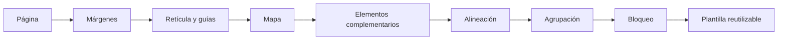
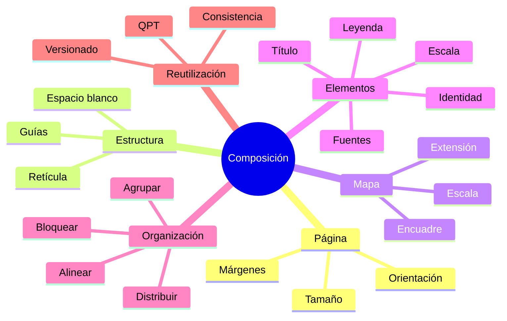
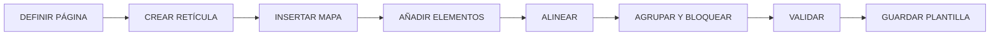

# 4.7 Diseñar una composición reutilizable

Un mapa puede estar bien simbolizado y bien etiquetado, pero todavía no ser:

```text
un producto cartográfico terminado
```

Para comunicarlo necesitamos organizarlo dentro de una composición que incluya:

```text
mapa
título
leyenda
escala
fuentes
notas
elementos institucionales
```

La dificultad aparece cuando cada nuevo mapa se construye:

```text
desde cero
```

Esto genera:

```text
inconsistencia
pérdida de tiempo
errores de alineación
variaciones entre productos
```

La idea central de esta lección es:

> **Una buena composición debe funcionar como sistema, no como una página improvisada.**

---

## Misión y mapa de aprendizaje

Durante esta lección construiremos una composición que pueda reutilizarse para distintos mapas sin reconstruir:

```text
márgenes
estructura
títulos
leyenda
pie
posición de elementos
```

### Ruta de aprendizaje



---

## 1. Del lienzo al Diseñador

El lienzo principal de QGIS sirve para:

```text
explorar
editar
analizar
simbolizar
```

Pero una composición cartográfica necesita:

```text
control editorial
```

Esto incluye:

```text
tamaño de página
posición exacta
márgenes
alineación
jerarquía
salida final
```

Para eso utilizamos:

```text
Diseñador de impresión
```

---

## 2. La página es parte del diseño

Antes de insertar el mapa debemos definir:

```text
tamaño
orientación
proporción
```

### Ejemplos

```text
A4 vertical
A4 horizontal
A3 horizontal
16:9
formato personalizado
```

La elección debe responder al:

```text
encargo cartográfico
```

definido en 4.1.

---

## 3. Vertical u horizontal

La orientación depende de:

```text
forma del territorio
cantidad de información
tipo de producto
```

### Vertical

Puede funcionar bien para:

```text
informes
fichas
documentos técnicos
```

### Horizontal

Puede favorecer:

```text
territorios alargados
presentaciones
mapas comparativos
```

---

## 4. Diseñar para el tamaño final

No diseñes pensando en:

```text
cómo se ve ampliado en pantalla
```

Diseña pensando en:

```text
cómo se leerá al tamaño final
```

### Ejemplo

Una leyenda que parece cómoda al 200 % puede resultar:

```text
demasiado pequeña
```

al imprimir.

---

## 5. Márgenes

Los márgenes crean:

```text
espacio de seguridad
```

entre el contenido y el borde.

### Funciones

```text
evitar recortes
mejorar equilibrio
crear respiración visual
```

### Ejemplo conceptual

```text
10 mm
15 mm
20 mm
```

según el producto.

---

## 6. No utilizar toda la página

Un error común consiste en extender el contenido hasta:

```text
los bordes
```

Esto produce:

```text
sensación de saturación
```

El espacio vacío también:

```text
organiza
```

---

## 7. Construir una retícula editorial

Antes de colocar elementos podemos dividir la página en:

```text
columnas
filas
áreas
```

### Ejemplo

```text
┌───────────────────────────────┐
│            TÍTULO             │
├───────────────────────┬───────┤
│                       │       │
│                       │LEYENDA│
│        MAPA           │       │
│                       │DATOS  │
│                       │       │
├───────────────────────┴───────┤
│          FUENTES              │
└───────────────────────────────┘
```

---

## 8. Guías

Las guías permiten definir posiciones de referencia.

Podemos utilizarlas para:

```text
márgenes
columnas
centros
límites de panel
```

### Ventaja

Los elementos dejan de colocarse:

```text
a ojo
```

---

### Captura prevista

!!! info "Captura pendiente · 4.7-01"

    - **Tipo:** PNG.
    - **Archivo:** `assets/images/modulo-04/4-7/4-7-01-guias-reticula.png`
    - **Mostrar:**
        1. página vacía;
        2. márgenes;
        3. guías;
        4. retícula editorial.
    - **Objetivo didáctico:** mostrar que la composición debe estructurarse antes de llenar la página.

---

## 9. Insertar el mapa

El elemento principal suele ser:

```text
Mapa
```

Pero no basta con insertarlo.

Debemos definir:

```text
posición
tamaño
extensión
escala
```

---

## 10. La extensión debe ser intencional

No utilices automáticamente:

```text
la extensión visible en el lienzo
```

Pregunta:

```text
¿qué territorio debe aparecer?
```

### Puede necesitar

```text
margen alrededor
contexto
encuadre específico
```

---

## 11. Escala fija

En algunos productos debemos mantener:

```text
escala exacta
```

Ejemplo:

```text
1:25 000
```

En otros:

```text
el encuadre
```

puede ser más importante.

---

## 12. Relación mapa–página

El mapa no debería ocupar el:

```text
100 % de la composición
```

porque necesitamos espacio para:

```text
título
leyenda
fuentes
escala
```

---

## 13. Título

El título debe responder a:

```text
qué muestra
dónde
cuándo
```

según el producto.

### Ejemplo débil

```text
Mapa 1
```

### Ejemplo mejor

```text
Densidad poblacional por distrito
Municipio de Sacaba · 2026
```

---

## 14. Subtítulo

Puede utilizarse para:

```text
periodo
unidad
escenario
metodología
```

Ejemplo:

```text
Habitantes por km² · Proyección 2026
```

---

## 15. Jerarquía del texto

Podemos organizar:

```text
TÍTULO
subtítulo
texto secundario
fuentes
```

mediante:

```text
tamaño
peso
espaciado
```

No mediante:

```text
muchas tipografías
```

---

## 16. Leyenda

La leyenda no debería mostrar automáticamente:

```text
todo lo que existe en el proyecto
```

Debe explicar:

```text
lo que necesita el lector
```

---

## 17. Editar contenido de la leyenda

Podemos:

```text
eliminar capas
renombrar
ordenar
agrupar
```

para que refleje:

```text
la lógica del mapa
```

---

## 18. Evitar nombres internos

No publiques:

```text
dens_hab_km2_v2
```

si el lector necesita:

```text
Densidad poblacional
```

---

## 19. Leyenda como parte de la jerarquía

La leyenda no debería dominar visualmente el mapa.

### Revisa

```text
tamaño
espaciado
símbolos
texto
```

---

## 20. Escala gráfica

Una escala gráfica es útil cuando el producto puede:

```text
ampliarse
reducirse
```

manteniendo proporcionalmente su relación con el mapa.

---

## 21. Escala numérica

Ejemplo:

```text
1:25 000
```

puede complementar:

```text
escala gráfica
```

Pero solo si el producto se mantiene a:

```text
tamaño físico previsto
```

---

## 22. Norte

No todo mapa necesita:

```text
flecha norte
```

Si:

```text
norte está arriba
```

y no existe ambigüedad, puede ser prescindible.

### El norte debe añadirse cuando

```text
aporte información
```

no simplemente por tradición.

---

## Checkpoint 1

Deberías poder explicar:

- [ ] por qué la página condiciona el diseño;
- [ ] para qué sirven los márgenes;
- [ ] qué función cumplen las guías;
- [ ] por qué el mapa no debe ocupar necesariamente toda la página;
- [ ] qué debe comunicar el título;
- [ ] por qué la leyenda debe editarse;
- [ ] cuándo una flecha norte puede ser innecesaria.

---

## 23. Fuentes

Una composición profesional debería identificar:

```text
origen de los datos
```

### Ejemplo

```text
Fuente: GAMS, INE, elaboración propia.
```

### Mejor aún

cuando corresponde:

```text
Fuente: INE, Censo 2024.
Elaboración: propia.
```

---

## 24. Fecha

Debemos diferenciar:

```text
fecha del dato
```

y:

```text
fecha de elaboración
```

No son lo mismo.

---

## 25. Autoría

Dependiendo del producto puede incluir:

```text
institución
unidad
autor
```

---

## 26. SRC

En productos técnicos puede ser necesario registrar:

```text
sistema de referencia
```

Ejemplo:

```text
SRC: WGS 84 / UTM zona XXS
```

---

## 27. Notas metodológicas

Si una característica necesita aclaración:

```text
puede incorporarse una nota breve
```

Ejemplo:

```text
La densidad se calculó sobre superficie terrestre.
```

---

## 28. No convertir el mapa en un informe

El mapa debe contener:

```text
información necesaria
```

pero no:

```text
párrafos extensos
```

La metodología completa puede ir en:

```text
documentación complementaria
```

---

## 29. Alineación

La alineación crea:

```text
orden visual
```

Los elementos deberían compartir:

```text
bordes
centros
ejes
```

cuando corresponda.

---

## 30. Evitar posicionar a ojo

Un desplazamiento de:

```text
1 o 2 mm
```

puede ser perceptible cuando:

```text
muchos elementos deberían alinearse
```

Utiliza herramientas de:

```text
alineación
```

---

## 31. Distribución

Si tenemos varios elementos:

```text
cajas
textos
símbolos
```

podemos distribuirlos con:

```text
espaciado regular
```

---

### Captura prevista

!!! info "Captura pendiente · 4.7-02"

    - **Tipo:** GIF.
    - **Archivo:** `assets/images/modulo-04/4-7/4-7-02-alinear-distribuir.gif`
    - **Mostrar:**
        1. elementos desalineados;
        2. seleccionar varios;
        3. alinear;
        4. distribuir;
        5. resultado.
    - **Objetivo didáctico:** sustituir posicionamiento visual impreciso por estructura editorial.

---

## 32. Tamaño uniforme

Cuando varios elementos cumplen:

```text
la misma función
```

pueden necesitar:

```text
mismo ancho
misma altura
```

Ejemplo:

```text
tres cajas informativas
```

---

## 33. Agrupación

Podemos agrupar elementos que funcionan como:

```text
una unidad
```

Ejemplo:

```text
logotipo
+
nombre institucional
```

---

## 34. Ventaja de agrupar

Podemos:

```text
mover
alinear
bloquear
```

varios elementos como:

```text
un conjunto
```

---

## 35. Agrupar no significa fusionar

Los elementos continúan siendo:

```text
editables
```

pero se gestionan conjuntamente.

---

## 36. Bloquear elementos

Una vez que una parte está correcta:

```text
bloquéala
```

Esto evita:

```text
moverla accidentalmente
```

---

## 37. Qué conviene bloquear

Por ejemplo:

```text
marco
logotipo
pie institucional
estructura base
```

---

## 38. Orden de elementos

La composición también posee:

```text
orden de superposición
```

Un elemento puede quedar:

```text
encima
debajo
```

de otro.

---

## 39. Panel de elementos

Cuando la composición crece, necesitamos controlar:

```text
nombres
visibilidad
bloqueo
orden
```

---

## 40. Nombrar elementos

Evita:

```text
Label 1
Label 2
Map 1
Rectangle 3
```

Prefiere:

```text
titulo_principal
mapa_principal
leyenda
fuente
logo_gams
```

---

## 41. Ventaja

Cuando existen:

```text
muchos elementos
```

los nombres permiten:

```text
encontrarlos rápidamente
```

---

## 42. Marcos

Los marcos pueden ayudar a:

```text
separar
agrupar
definir áreas
```

### Pero

demasiados marcos producen:

```text
fragmentación visual
```

---

## 43. Líneas divisorias

A veces una línea fina puede organizar mejor que:

```text
una caja completa
```

---

## 44. Espacio blanco

El espacio vacío permite:

```text
separar visualmente
```

sin necesidad de:

```text
bordes
fondos
líneas
```

---

## 45. Consistencia interna

Revisa que elementos equivalentes tengan:

```text
mismos márgenes
mismos tamaños
misma lógica tipográfica
```

---

## Checkpoint 2

Deberías poder explicar:

- [ ] por qué alinear mejora la composición;
- [ ] qué significa distribuir;
- [ ] para qué sirve agrupar;
- [ ] qué función cumple bloquear;
- [ ] por qué conviene nombrar elementos;
- [ ] por qué no necesitamos cajas alrededor de todo;
- [ ] qué aporta el espacio blanco.

---

## 46. Diseñar un sistema reutilizable

Ahora pasamos de:

```text
una composición
```

a:

```text
un sistema de composiciones
```

Queremos que diferentes mapas compartan:

```text
estructura
tipografía
posición
pie
márgenes
```

---

## 47. Qué debería permanecer fijo

Ejemplo:

```text
tamaño de página
márgenes
posición del título
posición del logotipo
pie institucional
fuentes
```

---

## 48. Qué debería poder cambiar

Por ejemplo:

```text
título
mapa
leyenda
fecha
fuente específica
```

---

## 49. Elementos fijos y dinámicos

Podemos pensar:

```text
PLANTILLA
=
estructura fija
+
contenido variable
```

---

## 50. No construir una plantilla demasiado específica

Si contiene:

```text
título fijo
nombre de un distrito fijo
leyenda rígida
```

puede ser difícil reutilizarla.

---

## 51. No construir una plantilla demasiado vacía

Si únicamente contiene:

```text
una página
```

no aporta:

```text
consistencia
```

---

## 52. El equilibrio

Una buena plantilla conserva:

```text
estructura editorial
```

pero permite cambiar:

```text
contenido cartográfico
```

---

## 53. Plantillas QPT

QGIS permite guardar composiciones como:

```text
plantillas
```

para reutilizarlas posteriormente.

La extensión utilizada es:

```text
.qpt
```

---

## 54. Qué puede conservar una plantilla

Conceptualmente puede conservar:

```text
página
elementos
posiciones
estilos
estructura de composición
```

---

## 55. Datos no necesariamente incluidos

Una plantilla no debe confundirse con:

```text
un proyecto completo
```

La plantilla define:

```text
la composición
```

no necesariamente:

```text
todos los datos que alimentan el mapa
```

---

## 56. Guardar plantilla

Cuando la composición esté:

```text
validada
```

podemos guardarla para:

```text
otros mapas
```

---

### Captura prevista

!!! info "Captura pendiente · 4.7-03"

    - **Tipo:** GIF.
    - **Archivo:** `assets/images/modulo-04/4-7/4-7-03-guardar-plantilla.gif`
    - **Mostrar:**
        1. composición terminada;
        2. guardar como plantilla;
        3. crear nueva composición;
        4. cargar plantilla.
    - **Objetivo didáctico:** mostrar la transición de diseño único a sistema reutilizable.

---

## 57. Carpeta de plantillas

Podemos organizar:

```text
plantillas/
├── mapa_a4_horizontal.qpt
├── mapa_a4_vertical.qpt
└── ficha_distrital.qpt
```

---

## 58. Versionar plantillas

Si cambias:

```text
estructura
marca
tipografía
```

puede ser útil usar:

```text
v01
v02
```

---

## 59. Plantilla institucional

Una plantilla institucional puede definir:

```text
márgenes
logotipo
pie
tipografía
fuentes
posición de leyenda
```

---

## 60. Consistencia entre productos

Si diez mapas pertenecen a la misma colección:

```text
no deberían parecer diez proyectos distintos
```

---

## 61. Reutilización y mantenimiento

Una plantilla reduce:

```text
tiempo
errores
variaciones
```

y facilita:

```text
actualizaciones
```

---

## 62. Composición y contenido dinámico

En esta lección dejaremos:

```text
algunos textos manuales
```

Pero en 4.9 aprenderemos a hacer que:

```text
título
fecha
fuente
nombre territorial
```

puedan actualizarse mediante:

```text
variables y expresiones
```

---

## 63. Antes de automatizar, diseñar bien

No automatices una composición que todavía:

```text
no funciona editorialmente
```

Primero:

```text
diseño estable
```

Después:

```text
automatización
```

---

## 64. Control editorial de la composición

Antes de convertirla en plantilla revisa:

```text
alineación
márgenes
tipografía
leyenda
espacios
fuentes
escala
```

---

## 65. Revisión a tamaño real

Exporta:

```text
PDF
```

o:

```text
imagen
```

y revisa al:

```text
100 %
```

---

## 66. Revisión impresa

Si el producto será impreso:

```text
imprime una prueba
```

antes de considerar:

```text
la plantilla final
```

---

## 67. Prueba de reducción

Si el mapa puede aparecer reducido en un informe:

```text
comprueba también esa versión
```

---

## 68. Elementos demasiado pequeños

Busca:

```text
textos
líneas
símbolos
```

que desaparezcan o pierdan legibilidad.

---

## 69. Elementos demasiado grandes

Busca elementos que:

```text
dominen sin necesidad
```

como:

```text
logo
norte
título
leyenda
```

---

## Laboratorio guiado · Crear una plantilla A4 reutilizable

!!! example "Escenario"

    Debemos producir una serie de mapas técnicos con:

    ```text
    mismo formato
    misma identidad
    diferentes temas
    ```

    Construiremos una plantilla:

    ```text
    A4 horizontal
    ```

### Fase 1 · Definir página

Configura:

```text
A4
horizontal
```

---

### Fase 2 · Crear márgenes

Define una zona segura.

Ejemplo:

```text
15 mm
```

---

### Fase 3 · Añadir guías

Crea referencias para:

```text
título
mapa
columna lateral
pie
```

---

### Fase 4 · Crear mapa principal

Debe ocupar:

```text
la mayor parte
```

de la composición.

---

### Fase 5 · Reservar panel lateral

Para:

```text
leyenda
datos complementarios
```

---

### Fase 6 · Crear título

Utiliza:

```text
texto provisional
```

---

### Fase 7 · Crear subtítulo

Reserva espacio para:

```text
unidad
periodo
```

---

### Fase 8 · Añadir leyenda

Edita:

```text
nombres
orden
contenido
```

---

### Fase 9 · Añadir escala

Comprueba:

```text
vinculación con el mapa correcto
```

---

### Fase 10 · Evaluar norte

Añádelo solo si:

```text
es necesario
```

---

### Fase 11 · Añadir fuentes

Incluye:

```text
fuentes
elaboración
fecha
```

---

### Fase 12 · Añadir identidad

Si corresponde:

```text
logo
unidad
institución
```

---

### Fase 13 · Alinear

Utiliza:

```text
herramientas de alineación
```

---

### Fase 14 · Distribuir

Normaliza:

```text
espacios
```

entre elementos relacionados.

---

### Fase 15 · Agrupar identidad

Agrupa:

```text
logo
nombre institucional
```

---

### Fase 16 · Bloquear estructura

Bloquea:

```text
marcos
logo
pie
```

---

### Fase 17 · Nombrar elementos

Ejemplo:

```text
mapa_principal
titulo
subtitulo
leyenda
escala
fuente
```

---

### Fase 18 · Exportar prueba

Exporta a:

```text
PDF
```

---

### Fase 19 · Revisar al 100 %

Comprueba:

```text
texto
alineación
peso visual
```

---

### Fase 20 · Guardar plantilla

Nombre:

```text
plantilla_mapa_a4_horizontal.qpt
```

---

### Evidencia

!!! info "Captura pendiente · 4.7-04"

    - **Tipo:** PNG.
    - **Archivo:** `assets/images/modulo-04/4-7/4-7-04-plantilla-final.png`
    - **Mostrar:**
        1. retícula;
        2. composición completa;
        3. estructura de elementos.
    - **Objetivo didáctico:** mostrar el resultado editorial reutilizable.

---

## Reto práctico · Crear una plantilla para los mapas del curso

!!! example "Reto 4.7"

    Debes diseñar una plantilla cartográfica que pueda reutilizarse en:

    ```text
    al menos tres mapas diferentes
    ```

### Requisito 1 · Formato

Define:

```text
tamaño
orientación
```

---

### Requisito 2 · Márgenes

Utiliza:

```text
márgenes consistentes
```

---

### Requisito 3 · Guías

Construye:

```text
retícula básica
```

---

### Requisito 4 · Mapa principal

Reserva:

```text
el área dominante
```

---

### Requisito 5 · Título

Define:

```text
posición
jerarquía
```

---

### Requisito 6 · Leyenda

Debe poder adaptarse a:

```text
distintos temas
```

---

### Requisito 7 · Escala

Debe estar:

```text
vinculada correctamente
```

---

### Requisito 8 · Fuentes

Reserva área para:

```text
fuente
fecha
elaboración
```

---

### Requisito 9 · Identidad

Si corresponde:

```text
logo
institución
unidad
```

---

### Requisito 10 · Alineación

No posiciones todo:

```text
a ojo
```

---

### Requisito 11 · Agrupación

Agrupa al menos:

```text
un conjunto de elementos
```

---

### Requisito 12 · Bloqueo

Bloquea:

```text
elementos estructurales
```

---

### Requisito 13 · Nombres

Renombra los objetos principales.

---

### Requisito 14 · Guardar QPT

Entrega:

```text
plantilla.qpt
```

---

### Requisito 15 · Probar reutilización

Crea:

```text
Mapa A
Mapa B
Mapa C
```

utilizando:

```text
la misma plantilla
```

---

### Requisito 16 · Comparar

Completa:

| Elemento | Mapa A | Mapa B | Mapa C |
|---|---|---|---|
| Plantilla | igual | igual | igual |
| Título | | | |
| Leyenda | | | |
| Tema | | | |
| Escala | | | |
| Fuente | | | |

---

### Requisito 17 · Evaluar consistencia

Pregunta:

```text
¿parecen parte de la misma colección?
```

---

### Requisito 18 · Conclusión

Redacta entre **220 y 300 palabras** explicando:

- qué tamaño elegiste;
- cómo definiste los márgenes;
- cómo organizaste la retícula;
- qué elementos permanecen fijos;
- qué elementos pueden cambiar;
- cómo utilizaste alineación;
- qué agrupaste;
- qué bloqueaste;
- qué problemas encontraste al reutilizar la plantilla;
- qué modificarías antes de convertirla en plantilla institucional.

---

### Entregables

```text
plantilla.qpt
mapa_A
mapa_B
mapa_C
captura_guias
captura_elementos
PDF_prueba
tabla_comparativa
conclusion
```

---

## Criterios de evaluación

??? success "Ver rúbrica"

    | Criterio | Se cumple si... |
    |---|---|
    | Página | Está definida según el encargo |
    | Márgenes | Son consistentes |
    | Guías | Estructuran la página |
    | Retícula | Organiza el contenido |
    | Mapa | Domina correctamente |
    | Título | Tiene jerarquía adecuada |
    | Leyenda | Es legible y editable |
    | Escala | Está vinculada correctamente |
    | Fuentes | Están identificadas |
    | Identidad | No domina innecesariamente |
    | Alineación | Es consistente |
    | Agrupación | Tiene lógica funcional |
    | Bloqueo | Protege estructura |
    | Nombres | Facilitan edición |
    | Plantilla | Puede reutilizarse |
    | Prueba | Funciona con varios mapas |
    | Resultado | Los productos forman una colección coherente |

---

## Errores frecuentes

=== "Empiezo colocando elementos al azar"

    Primero:

    ```text
    estructura
    ```

=== "Uso toda la hoja"

    El espacio blanco también:

    ```text
    organiza
    ```

=== "La leyenda muestra todas las capas"

    Debe mostrar:

    ```text
    lo necesario
    ```

=== "Siempre necesito flecha norte"

    No necesariamente.

=== "Pongo el logotipo muy grande"

    La identidad institucional no debería competir con:

    ```text
    el mensaje cartográfico
    ```

=== "Alineo visualmente"

    Utiliza:

    ```text
    herramientas de alineación
    ```

=== "Nunca bloqueo elementos"

    Eso aumenta:

    ```text
    desplazamientos accidentales
    ```

=== "Map 1 y Label 8 son nombres suficientes"

    No en composiciones complejas.

=== "Una plantilla debe contener todo"

    Debe contener:

    ```text
    estructura reutilizable
    ```

    no necesariamente:

    ```text
    contenido específico
    ```

=== "Si funciona para un mapa, ya es reutilizable"

    Debe probarse con:

    ```text
    varios productos
    ```

---

## Autoevaluación

??? question "1. ¿Qué controla el Diseñador de impresión?"

    La organización editorial y la salida cartográfica.

??? question "2. ¿Por qué definir página primero?"

    Porque tamaño y orientación condicionan toda la composición.

??? question "3. ¿Para qué sirven los márgenes?"

    Para crear espacio seguro y mejorar equilibrio visual.

??? question "4. ¿Qué función cumplen las guías?"

    Ayudan a posicionar elementos de forma consistente.

??? question "5. ¿Qué es una retícula editorial?"

    Una estructura de referencia para organizar la página.

??? question "6. ¿La leyenda debe mostrar todo?"

    No.

??? question "7. ¿Siempre se necesita norte?"

    No.

??? question "8. ¿Qué hace la alineación?"

    Ordena elementos respecto de bordes, centros o ejes comunes.

??? question "9. ¿Qué hace la distribución?"

    Regulariza el espacio entre varios elementos.

??? question "10. ¿Qué significa agrupar?"

    Gestionar varios elementos como un conjunto.

??? question "11. ¿Qué significa bloquear?"

    Evitar cambios o movimientos accidentales.

??? question "12. ¿Por qué nombrar elementos?"

    Para identificarlos fácilmente en composiciones complejas.

??? question "13. ¿Qué es una plantilla QPT?"

    Una composición reutilizable de QGIS.

??? question "14. ¿Una plantilla sustituye al proyecto?"

    No.

??? question "15. ¿Cuál es la secuencia principal?"

    ```text
    página
    → márgenes
    → guías
    → mapa
    → elementos
    → alineación
    → bloqueo
    → plantilla
    ```

---

## Cierre de la lección

### Mapa mental



### Secuencia principal



!!! quote "Idea central"

    Una composición reutilizable no consiste en:

    ```text
    copiar un mapa anterior
    ```

    sino en construir:

    ```text
    una estructura editorial estable
    ```

    donde:

    ```text
    el contenido puede cambiar
    sin perder coherencia visual
    ```

---

## Lo que viene

En **4.8 · Coordinar mapas y elementos complementarios** avanzaremos hacia composiciones más complejas.

Trabajaremos con:

```text
mapa principal
mapa localizador
vistas de detalle
temas de mapa
leyendas
escalas
cuadrículas
```

y resolveremos una dificultad nueva:

> **¿Cómo incluir varios mapas en una misma página sin que todos cambien cuando modificamos el proyecto principal?**

---

## Referencias

- [QGIS 3.44 — Diseñador de impresión](https://docs.qgis.org/3.44/es/docs/user_manual/print_composer/)  
  Herramientas para crear y organizar composiciones cartográficas.

- [QGIS 3.44 — Elementos del Diseñador](https://docs.qgis.org/3.44/es/docs/user_manual/print_composer/composer_items/)  
  Mapas, etiquetas, leyendas, escalas, formas y otros elementos de composición.

- [QGIS 3.44 — Gestión del diseño](https://docs.qgis.org/3.44/es/docs/user_manual/print_composer/overview_composer.html)  
  Configuración de páginas, guías, selección y administración de elementos.

- [QGIS 3.44 — Plantillas de composición](https://docs.qgis.org/3.44/es/docs/user_manual/print_composer/overview_composer.html)  
  Creación y reutilización de plantillas `.qpt`.

- [QGIS Training Manual](https://docs.qgis.org/3.44/es/docs/training_manual/)  
  Material oficial de formación de QGIS.