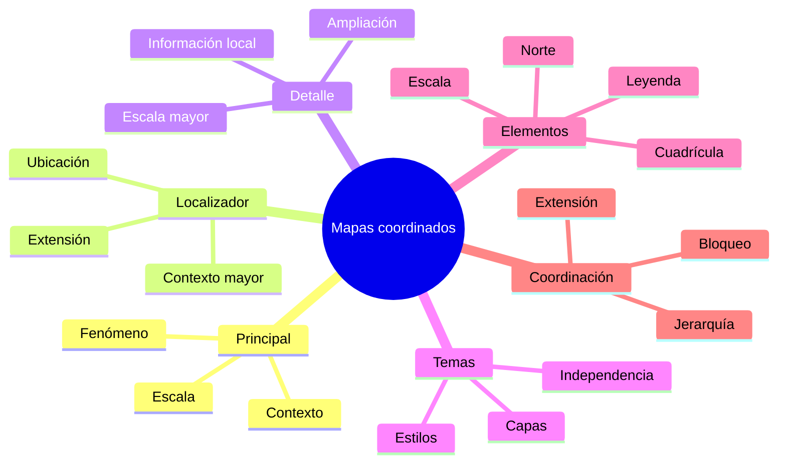
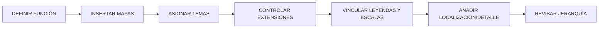

# 4.8 Coordinar mapas y elementos complementarios

Una composición puede contener más de un mapa.

Por ejemplo:

```text
mapa principal
mapa de localización
mapa de detalle
```

El problema aparece cuando todos comparten:

```text
las mismas capas
la misma extensión
la misma escala
la misma leyenda
```

Entonces dejan de cumplir funciones diferentes.

La idea central de esta lección es:

> **Cada mapa dentro de una composición debe tener una función específica y estar coordinado con los demás sin perder independencia.**

---

## Misión y mapa de aprendizaje

Construiremos una lámina con:

```text
mapa principal
localizador
vista de detalle
leyenda
escala
cuadrícula
```

y aprenderemos a coordinar:

```text
contenido
extensión
escala
temas de mapa
```

### Ruta de aprendizaje


---

## 1. Un mapa, una función

Antes de insertar varios marcos cartográficos debemos responder:

```text
¿para qué sirve cada uno?
```

### Mapa principal

Debe responder:

```text
la pregunta central
```

### Localizador

Debe responder:

```text
¿dónde está el área de estudio?
```

### Vista de detalle

Debe responder:

```text
¿qué ocurre en una zona específica?
```

!!! note "Principio"

    Si dos mapas cumplen exactamente la misma función:

    ```text
    probablemente uno sobra
    ```

---

## 2. Mapa principal

El mapa principal suele concentrar:

```text
fenómeno temático
```

y:

```text
contexto necesario
```

Debe dominar la composición.

### Ejemplo

```text
densidad poblacional por distrito
```

con:

```text
centros de salud
vías principales
```

como contexto.

---

## 3. Localizador

El localizador muestra:

```text
un territorio mayor
```

para ubicar el área principal.

Ejemplo:

```text
Bolivia
→ Cochabamba
→ Sacaba
```

### Debe ser simple

No necesita:

```text
toda la información temática
```

---

## 4. El localizador no es un mapa principal pequeño

Un error frecuente es copiar exactamente:

```text
todas las capas
```

del mapa principal.

El localizador necesita:

```text
menos detalle
más contexto
```

---

## 5. Vista de detalle

Una vista de detalle amplía:

```text
un sector específico
```

Ejemplo:

```text
centro urbano
zona crítica
intersección compleja
```

### Debe aportar

```text
información imposible de leer
```

en el mapa principal.

---

## 6. Relación entre escalas

Podemos tener:

```text
Mapa principal = 1:50 000
Detalle = 1:5 000
Localizador = 1:500 000
```

Cada escala responde a:

```text
una función distinta
```

---

## Checkpoint 1

Deberías poder explicar:

- [ ] qué función cumple el mapa principal;
- [ ] qué función cumple el localizador;
- [ ] qué función cumple una vista de detalle;
- [ ] por qué no deberían usar exactamente la misma escala;
- [ ] por qué cada mapa debe tener contenido específico.

---

## 7. Insertar varios mapas

En el Diseñador podemos añadir:

```text
varios elementos Mapa
```

Cada uno puede tener:

```text
su propia extensión
su propia escala
su propio contenido
```

### Nombrarlos ayuda

Evita:

```text
Map 1
Map 2
Map 3
```

Prefiere:

```text
mapa_principal
mapa_localizador
mapa_detalle
```

---

## 8. Evitar que cambien accidentalmente

Cuando ajustamos el proyecto principal:

```text
capas visibles
estilos
```

podemos afectar otros mapas.

Por eso conviene trabajar con:

```text
temas de mapa
```

---

## 9. Temas de mapa

Un tema de mapa guarda una combinación de:

```text
capas visibles
estilos
```

para poder reutilizarla.

Ejemplo:

```text
Tema 1 = Principal
Tema 2 = Localizador
Tema 3 = Detalle
```

---

## 10. Tema principal

Puede incluir:

```text
densidad
centros de salud
vías principales
distritos
```

---

## 11. Tema localizador

Puede incluir:

```text
límite nacional
departamentos
municipio destacado
```

---

## 12. Tema detalle

Puede incluir:

```text
edificios
calles
parcelas
equipamientos
```

---

## 13. Ventaja de los temas

Permiten que cada marco tenga:

```text
contenido controlado
```

sin tener que:

```text
encender y apagar capas manualmente
```

cada vez.

---

### Captura prevista

!!! info "Captura pendiente · 4.8-01"

    - **Tipo:** GIF.
    - **Archivo:** `assets/images/modulo-04/4-8/4-8-01-temas-mapa.gif`
    - **Mostrar:**
        1. crear tema principal;
        2. crear tema localizador;
        3. asignar temas diferentes a dos mapas.
    - **Objetivo didáctico:** demostrar independencia de contenido entre marcos.

---

## 14. Bloquear capas y estilos

En el Diseñador podemos controlar si un mapa utiliza:

```text
estado actual
```

o mantiene:

```text
contenido bloqueado
```

### Esto ayuda a evitar

```text
cambios involuntarios
```

cuando seguimos trabajando en el proyecto.

---

## 15. Localizador gráfico

El mapa localizador debe indicar:

```text
dónde está el área del mapa principal
```

Podemos mostrar:

```text
un rectángulo
```

o una geometría equivalente.

---

## 16. Indicador de extensión

Un localizador efectivo debe permitir:

```text
reconocer rápidamente
```

el área principal.

### Evita

```text
rectángulos demasiado gruesos
```

que oculten:

```text
el contexto
```

---

### Captura prevista

!!! info "Captura pendiente · 4.8-02"

    - **Tipo:** GIF.
    - **Archivo:** `assets/images/modulo-04/4-8/4-8-02-localizador.gif`
    - **Mostrar:**
        1. mapa principal;
        2. mapa localizador;
        3. añadir indicador de extensión;
        4. modificar marco.
    - **Objetivo didáctico:** conectar visualmente mapa principal y contexto.

---

## 17. Mapa de detalle

Una vista de detalle puede enfocarse en:

```text
un área crítica
```

### Ejemplo

```text
centro histórico
```

Mientras el mapa principal muestra:

```text
todo el municipio
```

---

## 18. Marco de detalle

Conviene indicar en el mapa principal:

```text
qué zona está ampliada
```

Puede hacerse mediante:

```text
rectángulo
polígono
marcador
```

---

## 19. Conexión visual

El detalle debe ser fácil de relacionar con:

```text
su posición original
```

### Podemos usar

```text
marco
línea
código
```

por ejemplo:

```text
Detalle A
```

---

## 20. No abusar de vistas de detalle

Si añadimos:

```text
cinco ampliaciones
```

la composición puede perder:

```text
jerarquía
```

---

## 21. Leyenda vinculada

Una leyenda puede estar asociada a:

```text
un mapa concreto
```

Esto es importante cuando existen:

```text
varios mapas
```

con contenido diferente.

---

## 22. Leyenda del mapa principal

Normalmente debería explicar:

```text
el fenómeno principal
```

No necesariamente:

```text
el localizador
```

---

## 23. Leyenda del detalle

Si el detalle introduce:

```text
simbología diferente
```

puede necesitar:

```text
su propia explicación
```

---

## 24. Evitar duplicación

Si ambas leyendas explican:

```text
lo mismo
```

puede existir:

```text
redundancia
```

---

## 25. Escala gráfica vinculada

Cada escala gráfica debe estar asociada al:

```text
mapa correcto
```

### Problema frecuente

Una escala puede estar vinculada al:

```text
localizador
```

cuando creemos que pertenece al:

```text
mapa principal
```

!!! warning "Siempre comprueba qué mapa alimenta cada elemento"

---

## 26. Escalas diferentes

Si hay dos mapas con escalas distintas:

```text
cada uno puede necesitar su propia escala
```

o:

```text
solo el principal
```

si el detalle no requiere medición.

---

## 27. Norte y varios mapas

Si los mapas tienen:

```text
misma orientación
```

una sola indicación puede ser suficiente.

Pero si alguno está:

```text
rotado
```

puede necesitar:

```text
su propio indicador
```

---

## Checkpoint 2

Deberías poder explicar:

- [ ] qué es un tema de mapa;
- [ ] por qué ayuda a varios marcos;
- [ ] qué hace un localizador;
- [ ] cómo relacionar un detalle con el mapa principal;
- [ ] por qué las leyendas deben vincularse correctamente;
- [ ] por qué las escalas deben estar asociadas al mapa adecuado.

---

## 28. Cuadrículas cartográficas

Una cuadrícula puede mostrar:

```text
coordenadas
```

sobre el mapa.

Puede ser útil en:

```text
mapas técnicos
cartografía topográfica
trabajo de campo
```

---

## 29. No todos los mapas necesitan cuadrícula

En una infografía o mapa ejecutivo puede:

```text
añadir ruido
```

sin aportar:

```text
valor real
```

---

## 30. Tipo de cuadrícula

Podemos trabajar con:

```text
coordenadas proyectadas
```

o:

```text
latitud / longitud
```

según el producto.

---

## 31. Intervalo

El intervalo debe estar relacionado con:

```text
escala
tamaño
```

### Ejemplo

Una cuadrícula cada:

```text
100 m
```

en un mapa regional sería:

```text
absurda
```

---

## 32. Etiquetas de coordenadas

Podemos decidir:

```text
qué lados
```

mostrarán coordenadas.

Ejemplo:

```text
izquierda
abajo
```

en lugar de:

```text
los cuatro lados
```

---

## 33. Marco de cuadrícula

Puede utilizarse:

```text
marco simple
marcas
líneas completas
```

### El objetivo

es apoyar lectura:

```text
sin dominar el mapa
```

---

### Captura prevista

!!! info "Captura pendiente · 4.8-03"

    - **Tipo:** PNG comparativo.
    - **Archivo:** `assets/images/modulo-04/4-8/4-8-03-cuadricula.png`
    - **Mostrar:**
        1. sin cuadrícula;
        2. cuadrícula excesiva;
        3. cuadrícula ajustada.
    - **Objetivo didáctico:** mostrar cómo el intervalo y el estilo afectan legibilidad.

---

## 34. Coordenadas y SRC

Una cuadrícula debe interpretarse en relación con:

```text
el sistema de referencia
```

### No asumir

que las coordenadas visibles son:

```text
latitud/longitud
```

si estamos trabajando en:

```text
UTM
```

---

## 35. Mapa principal y cuadrícula

La cuadrícula suele ser más útil en:

```text
mapa principal
```

que en:

```text
localizador pequeño
```

---

## 36. Elementos complementarios

Además de mapas podemos incluir:

```text
gráficos
tablas
texto
fotografías
diagramas
```

Pero cada uno debe responder a:

```text
una necesidad
```

---

## 37. Una tabla puede reemplazar etiquetas

Si necesitamos mostrar:

```text
muchos valores
```

quizá sea mejor una:

```text
tabla
```

que intentar colocarlos todos:

```text
sobre el mapa
```

---

## 38. Un gráfico puede mostrar comparación

Por ejemplo:

```text
población por distrito
```

puede representarse:

```text
espacialmente en el mapa
```

y:

```text
comparativamente en gráfico
```

---

## 39. Evitar repetir la misma información

Si mapa, tabla y gráfico dicen:

```text
exactamente lo mismo
```

quizá no sea necesario mostrar:

```text
los tres
```

---

## 40. Coordinación editorial

Una composición con varios elementos debe mantener:

```text
alineación
espaciado
jerarquía
consistencia tipográfica
```

---

## 41. Mapa principal debe dominar

En una lámina cartográfica:

```text
el mapa principal
```

normalmente debería tener:

```text
mayor superficie
```

que:

```text
localizador
detalle
```

---

## 42. Localizador discreto

Debe ser:

```text
fácil de encontrar
```

pero no:

```text
competir
```

con el mapa principal.

---

## 43. Detalle visible

La vista de detalle sí puede tener:

```text
más peso
```

si aporta información crítica.

---

## 44. Prueba de jerarquía

Mira la composición durante:

```text
3 segundos
```

Pregunta:

```text
¿qué mapa veo primero?
```

Debería ser:

```text
el principal
```

---

## 45. Error de sincronización

Un problema común:

```text
modificar capas
```

y después descubrir que:

```text
todos los mapas cambiaron
```

### Solución conceptual

```text
temas
bloqueo
control de contenido
```

---

## 46. Error de extensión

Otra situación:

```text
mover accidentalmente
```

la extensión de un localizador.

### Solución

Una vez validado:

```text
bloquear
```

el elemento.

---

## 47. Error de escala

El mapa detalle puede terminar accidentalmente en:

```text
misma escala que principal
```

y perder:

```text
su función
```

---

## 48. Error de leyenda

Una leyenda puede mostrar elementos que:

```text
no aparecen
```

en el mapa correspondiente.

Debemos revisar:

```text
vínculo
contenido
```

---

## 49. Error de cuadrícula

Una cuadrícula demasiado densa puede producir:

```text
más líneas que cartografía
```

---

## 50. Error de localizador

Un localizador demasiado pequeño puede ser:

```text
decorativo
```

pero no:

```text
informativo
```

---

## Laboratorio guiado · Lámina con mapa principal, localizador y detalle

!!! example "Escenario"

    Vamos a producir una composición A3 horizontal con:

    ```text
    mapa principal
    mapa localizador
    mapa de detalle
    leyenda
    escala
    cuadrícula
    ```

### Fase 1 · Abrir plantilla

Utiliza la estructura creada en:

```text
4.7
```

---

### Fase 2 · Insertar mapa principal

Nombre:

```text
mapa_principal
```

---

### Fase 3 · Definir extensión

Muestra:

```text
todo el territorio de análisis
```

---

### Fase 4 · Crear tema principal

Incluye:

```text
fenómeno
contexto necesario
```

---

### Fase 5 · Insertar localizador

Nombre:

```text
mapa_localizador
```

---

### Fase 6 · Crear tema localizador

Incluye:

```text
límites mayores
ubicación general
```

---

### Fase 7 · Añadir indicador de extensión

Relaciona:

```text
localizador
→ mapa principal
```

---

### Fase 8 · Insertar detalle

Nombre:

```text
mapa_detalle
```

---

### Fase 9 · Elegir zona crítica

Define una extensión más:

```text
detallada
```

---

### Fase 10 · Crear tema detalle

Incluye:

```text
capas locales
```

que no aparecen en el mapa principal.

---

### Fase 11 · Identificar detalle

Añade:

```text
Detalle A
```

en la composición.

---

### Fase 12 · Crear marco en principal

Indica:

```text
qué zona
```

está siendo ampliada.

---

### Fase 13 · Añadir leyenda

Vincúlala a:

```text
mapa_principal
```

---

### Fase 14 · Limpiar leyenda

Elimina:

```text
elementos innecesarios
```

---

### Fase 15 · Añadir escala gráfica

Vincúlala a:

```text
mapa_principal
```

---

### Fase 16 · Añadir cuadrícula

Configura:

```text
intervalo
marco
anotaciones
```

---

### Fase 17 · Revisar localizador

Pregunta:

```text
¿permite comprender dónde está el área?
```

---

### Fase 18 · Revisar detalle

Pregunta:

```text
¿muestra algo que el principal no permite leer?
```

---

### Fase 19 · Revisar jerarquía

Comprueba que:

```text
mapa principal
```

siga dominando.

---

### Fase 20 · Bloquear mapas

Cuando estén correctos:

```text
bloquea
```

extensiones y posiciones.

---

### Evidencia

!!! info "Captura pendiente · 4.8-04"

    - **Tipo:** PNG.
    - **Archivo:** `assets/images/modulo-04/4-8/4-8-04-lamina-final.png`
    - **Mostrar:**
        1. mapa principal;
        2. localizador;
        3. detalle;
        4. leyenda;
        5. cuadrícula.
    - **Objetivo didáctico:** mostrar la coordinación completa de varios elementos cartográficos.

---

## Reto práctico · Elaborar una lámina con dos mapas independientes

!!! example "Reto 4.8"

    Construye una composición con:

    ```text
    1 mapa principal
    1 mapa complementario
    ```

    donde ambos tengan:

    ```text
    contenido
    escala
    función
    ```

    diferentes.

### Requisito 1 · Mapa principal

Debe comunicar:

```text
el fenómeno central
```

---

### Requisito 2 · Mapa secundario

Puede ser:

```text
localizador
detalle
comparación
```

---

### Requisito 3 · Tema de mapa

Cada marco debe usar:

```text
un contenido controlado
```

---

### Requisito 4 · Escala independiente

Los mapas deben tener:

```text
escalas distintas
```

si sus funciones lo requieren.

---

### Requisito 5 · Leyenda

Debe estar vinculada al:

```text
mapa correcto
```

---

### Requisito 6 · Escala gráfica

Comprueba:

```text
qué mapa alimenta el elemento
```

---

### Requisito 7 · Localizador o vínculo

Si existe relación espacial entre mapas:

```text
hazla visible
```

---

### Requisito 8 · Cuadrícula

Incluye una solo si:

```text
aporta información
```

---

### Requisito 9 · Jerarquía

El lector debe identificar inmediatamente:

```text
qué mapa es principal
```

---

### Requisito 10 · Bloqueo

Bloquea:

```text
elementos terminados
```

---

### Requisito 11 · Comparación

Completa:

| Elemento | Principal | Secundario |
|---|---|---|
| Función | | |
| Escala | | |
| Tema | | |
| Capas | | |
| Leyenda | | |
| Cuadrícula | | |

---

### Requisito 12 · Conclusión

Redacta entre **200 y 280 palabras** explicando:

- qué función cumple cada mapa;
- por qué tienen extensiones distintas;
- cómo utilizaste temas de mapa;
- qué elementos compartieron;
- qué elementos fueron independientes;
- cómo vinculaste la leyenda;
- si utilizaste cuadrícula;
- cómo controlaste la jerarquía;
- qué errores evitaste al coordinar ambos mapas.

---

### Entregables

```text
composicion_final
captura_temas
captura_localizador
captura_detalle
tabla_comparativa
PDF_final
conclusion
```

---

## Criterios de evaluación

??? success "Ver rúbrica"

    | Criterio | Se cumple si... |
    |---|---|
    | Principal | Tiene función clara |
    | Secundario | Aporta información distinta |
    | Escalas | Son coherentes con cada función |
    | Temas | Mantienen contenido independiente |
    | Localizador | Ubica correctamente |
    | Detalle | Aporta información adicional |
    | Leyenda | Está vinculada correctamente |
    | Escala gráfica | Pertenece al mapa correcto |
    | Cuadrícula | Tiene intervalo adecuado |
    | Jerarquía | El principal domina |
    | Bloqueo | Evita cambios accidentales |
    | Resultado | Los elementos funcionan como sistema |

---

## Errores frecuentes

=== "Los dos mapas muestran lo mismo"

    Entonces probablemente:

    ```text
    uno sobra
    ```

=== "El localizador tiene todas las capas"

    Debe ser:

    ```text
    simple
    ```

=== "El detalle está a la misma escala"

    Entonces no aporta:

    ```text
    mayor información
    ```

=== "Cambio las capas y cambian todos los mapas"

    Utiliza:

    ```text
    temas
    ```

=== "La leyenda muestra capas del localizador"

    Revisa:

    ```text
    vínculo
    ```

=== "La escala pertenece al mapa incorrecto"

    Verifica:

    ```text
    mapa asociado
    ```

=== "La cuadrícula llena todo"

    Reduce:

    ```text
    frecuencia
    contraste
    ```

=== "El localizador es demasiado pequeño"

    Debe ser:

    ```text
    legible
    ```

=== "Los mapas tienen el mismo peso visual"

    Define:

    ```text
    principal
    secundario
    ```

---

## Autoevaluación

??? question "1. ¿Qué función cumple el mapa principal?"

    Comunicar el fenómeno central.

??? question "2. ¿Qué función cumple un localizador?"

    Mostrar dónde se encuentra el área de estudio dentro de un contexto mayor.

??? question "3. ¿Qué función cumple una vista de detalle?"

    Mostrar información que no puede leerse adecuadamente a la escala principal.

??? question "4. ¿Qué es un tema de mapa?"

    Una configuración guardada de capas visibles y estilos.

??? question "5. ¿Por qué utilizar temas?"

    Para mantener distintos contenidos en varios mapas.

??? question "6. ¿Qué es un indicador de extensión?"

    Un elemento que muestra en un mapa la extensión de otro.

??? question "7. ¿La leyenda puede estar vinculada a un mapa específico?"

    Sí.

??? question "8. ¿Por qué comprobar la escala gráfica?"

    Porque debe estar asociada al marco correcto.

??? question "9. ¿Todos los mapas necesitan cuadrícula?"

    No.

??? question "10. ¿Qué determina el intervalo de una cuadrícula?"

    Escala, tamaño y propósito.

??? question "11. ¿El mapa principal debe dominar?"

    Normalmente sí.

??? question "12. ¿Qué debemos hacer cuando las extensiones están terminadas?"

    Bloquearlas para evitar cambios accidentales.

??? question "13. ¿Dos mapas deben tener la misma simbología?"

    Solo cuando eso tenga sentido para la comparación.

??? question "14. ¿Un localizador necesita mucho detalle?"

    No.

??? question "15. ¿Cuál es la secuencia principal?"

    ```text
    definir función
    → crear mapas
    → asignar temas
    → coordinar extensiones
    → vincular elementos
    → revisar jerarquía
    ```

---

## Cierre de la lección

### Mapa mental



### Secuencia principal



!!! quote "Idea central"

    Incluir varios mapas no significa:

    ```text
    repetir el mismo mapa varias veces
    ```

    sino construir:

    ```text
    distintas vistas coordinadas
    ```

    donde cada una responde a:

    ```text
    una función específica
    ```

---

## Lo que viene

En **4.9 · Incorporar información dinámica** dejaremos de escribir manualmente:

```text
títulos
fechas
fuentes
nombres
valores
```

y comenzaremos a vincular la composición con:

```text
variables
expresiones
atributos
```

La pregunta central será:

> **¿Cómo hacer que una composición se actualice automáticamente cuando cambian los datos o la entidad representada?**

---

## Referencias

- [QGIS 3.44 — Diseñador de impresión](https://docs.qgis.org/3.44/es/docs/user_manual/print_composer/)  
  Creación y administración de múltiples mapas dentro de una composición.

- [QGIS 3.44 — Elemento mapa](https://docs.qgis.org/3.44/es/docs/user_manual/print_composer/composer_items/composer_map.html)  
  Configuración de extensión, escala, cuadrículas y localizadores.

- [QGIS 3.44 — Leyenda](https://docs.qgis.org/3.44/es/docs/user_manual/print_composer/composer_items/composer_legend.html)  
  Vinculación y configuración de leyendas.

- [QGIS 3.44 — Escala gráfica](https://docs.qgis.org/3.44/es/docs/user_manual/print_composer/composer_items/composer_scale_bar.html)  
  Configuración y asociación con mapas.

- [QGIS 3.44 — Temas de mapa](https://docs.qgis.org/3.44/es/docs/user_manual/introduction/general_tools.html)  
  Gestión de combinaciones de visibilidad y estilos.

- [QGIS Training Manual](https://docs.qgis.org/3.44/es/docs/training_manual/)  
  Material oficial de formación de QGIS.