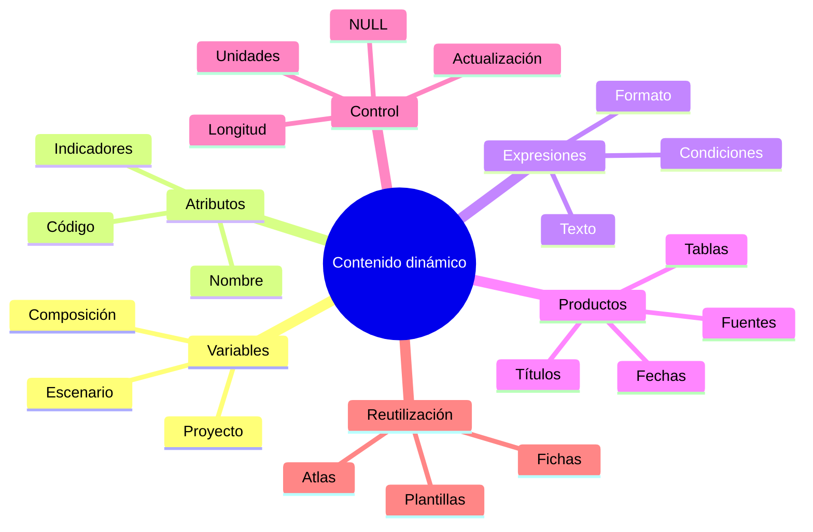

# 4.9 Incorporar información dinámica

Una composición puede estar bien diseñada y aun así requerir demasiado trabajo manual.

Por ejemplo, si cada vez que cambia el territorio debemos modificar:

```text
título
subtítulo
fecha
nombre del distrito
población
fuente
código
```

entonces la composición todavía depende demasiado de:

```text
edición manual
```

La idea central de esta lección es:

> **Una composición eficiente debe poder actualizar parte de su contenido automáticamente cuando cambian los datos, las variables o la entidad representada.**

---

## Misión y mapa de aprendizaje

En esta lección aprenderemos a transformar:

```text
texto fijo
```

en:

```text
contenido dinámico
```

mediante:

```text
variables
expresiones
atributos
```

### Ruta de aprendizaje


---

## 1. Texto fijo frente a texto dinámico

### Texto fijo

Ejemplo:

```text
Distrito 3
```

Si cambia el territorio a:

```text
Distrito 4
```

debemos editar:

```text
manualmente
```

---

### Texto dinámico

Podemos hacer que la composición obtenga:

```text
el nombre
```

desde:

```text
una variable
un atributo
una expresión
```

Así:

```text
el contenido se actualiza
```

sin reescribirlo.

---

## 2. Qué puede ser dinámico

Podemos automatizar:

```text
títulos
subtítulos
nombres territoriales
fechas
fuentes
unidades
códigos
estadísticas
números de página
escenario
```

---

## 3. Variables

QGIS utiliza variables que pueden existir en diferentes niveles.

Conceptualmente:

```text
global
proyecto
capa
composición
atlas
```

### Ejemplo

Podemos tener una variable de proyecto:

```text
gestion = 2026
```

y utilizarla en varios elementos.

---

## 4. Variable de proyecto

Supongamos que muchos productos necesitan mostrar:

```text
Gestión 2026
```

En lugar de escribir:

```text
2026
```

en diez lugares distintos, podemos almacenar el valor una vez.

### Ventaja

Si cambia a:

```text
2027
```

actualizamos:

```text
una sola variable
```

---

## 5. Expresiones en textos

En el Diseñador podemos insertar expresiones dentro de:

```text
etiquetas de texto
```

Conceptualmente:

```text
Título fijo + valor dinámico
```

Por ejemplo:

```text
Densidad poblacional · Gestión 2026
```

puede construirse a partir de:

```text
texto
+
variable
```

---

## 6. Concatenación

Podemos unir diferentes partes.

Ejemplo conceptual:

```qgis
'Densidad poblacional · Gestión ' || @gestion
```

Resultado:

```text
Densidad poblacional · Gestión 2026
```

---

## 7. Formatear texto

También podemos controlar:

```text
mayúsculas
minúsculas
decimales
fechas
```

mediante expresiones.

Ejemplo:

```qgis
upper('Distrito Central')
```

Resultado:

```text
DISTRITO CENTRAL
```

---

## 8. Fechas dinámicas

Una composición puede necesitar:

```text
fecha de elaboración
```

### Ejemplo conceptual

```qgis
format_date(now(), 'dd/MM/yyyy')
```

Resultado:

```text
18/09/2026
```

### Pero cuidado

Esto representa:

```text
fecha de generación
```

no necesariamente:

```text
fecha de los datos
```

---

## 9. Fecha del dato y fecha del producto

Debemos diferenciarlas.

### Fecha de dato

```text
Censo 2024
```

### Fecha de elaboración

```text
18/09/2026
```

No deben confundirse.

---

## Checkpoint 1

Deberías poder explicar:

- [ ] qué diferencia existe entre texto fijo y dinámico;
- [ ] qué es una variable;
- [ ] por qué una variable puede mejorar mantenimiento;
- [ ] cómo una expresión construye texto;
- [ ] por qué fecha de dato y fecha de elaboración no son iguales.

---

## 10. Variables del proyecto

Las variables de proyecto son útiles para información como:

```text
institución
gestión
autor
fuente principal
nombre del proyecto
```

### Ejemplo

```text
institucion = GAMS
gestion = 2026
autor = Unidad SIG
```

---

## 11. Ventaja

La composición puede reutilizar:

```text
los mismos valores
```

en:

```text
varios elementos
```

---

## 12. Evitar duplicación

Si la fuente aparece en:

```text
pie
ficha
metadatos
```

es mejor evitar:

```text
escribirla tres veces
```

---

## 13. Variables de composición

También podemos trabajar con valores propios de una composición.

Esto permite definir:

```text
producto
versión
escenario
```

específicos.

---

## 14. Variable de escenario

Ejemplo:

```text
escenario = COBERTURA_500M
```

Podemos mostrar:

```text
Escenario: Cobertura 500 m
```

automáticamente.

---

## 15. Contenido basado en atributos

Una composición también puede utilizar:

```text
atributos de una entidad
```

Esto será especialmente importante en:

```text
4.10 Atlas
```

---

## 16. Ejemplo

Supongamos una capa de distritos con:

```text
nombre
poblacion
superficie
densidad
```

Podemos construir una ficha que muestre:

```text
Distrito:
Población:
Superficie:
Densidad:
```

utilizando los valores del distrito activo.

---

## 17. Texto condicional

Una expresión puede cambiar el texto según:

```text
una condición
```

### Ejemplo conceptual

```qgis
CASE
    WHEN "densidad" > 3000 THEN 'Densidad alta'
    WHEN "densidad" > 1500 THEN 'Densidad media'
    ELSE 'Densidad baja'
END
```

---

## 18. Uso editorial

Podemos mostrar:

```text
Condición territorial: Densidad alta
```

sin escribirla manualmente.

---

## 19. No convertir expresiones en metodología oculta

Si una clasificación dinámica es importante:

```text
debe documentarse
```

No debería quedar únicamente:

```text
dentro de una expresión
```

---

## 20. Valores numéricos

Los valores deben formatearse pensando en:

```text
lectura
```

Ejemplo:

```text
15342.738294
```

puede mostrarse como:

```text
15 343
```

si no necesitamos decimales.

---

## 21. Separadores y unidades

Podemos mostrar:

```text
15 343 hab.
```

en lugar de:

```text
15343
```

---

## 22. Decimales

No utilices:

```text
4 decimales
```

si la precisión del dato no los justifica.

---

### Captura prevista

!!! info "Captura pendiente · 4.9-01"

    - **Tipo:** GIF.
    - **Archivo:** `assets/images/modulo-04/4-9/4-9-01-texto-dinamico.gif`
    - **Mostrar:**
        1. texto fijo;
        2. insertar expresión;
        3. usar variable;
        4. modificar variable;
        5. actualización automática.
    - **Objetivo didáctico:** demostrar el paso de contenido manual a contenido dinámico.

---

## 23. Títulos dinámicos

Un título puede combinar:

```text
tema
territorio
periodo
```

### Ejemplo

```text
Cobertura de salud · Distrito 3 · Gestión 2026
```

En lugar de escribir todo manualmente, podemos construirlo a partir de:

```text
texto fijo
+
atributo
+
variable
```

---

## 24. Títulos demasiado largos

La automatización puede generar:

```text
textos inesperadamente extensos
```

### Ejemplo

```text
Distrito Metropolitano Norte y Comunidades Adyacentes
```

Puede romper:

```text
la composición
```

### Por eso

el diseño debe prever:

```text
casos largos
```

---

## 25. Saltos de línea dinámicos

Podemos estructurar:

```text
título
subtítulo
```

para absorber variaciones.

---

## 26. Textos dependientes de condiciones

Ejemplo:

```text
si existe fuente secundaria
→ mostrarla

si no existe
→ no mostrar línea vacía
```

---

## 27. Variables de contexto

Una expresión puede acceder a información como:

```text
proyecto
mapa
composición
atlas
```

dependiendo del contexto.

### Esto permite

crear elementos:

```text
más inteligentes
```

---

## 28. No usar variables sin comprender el contexto

Una variable que funciona en:

```text
el proyecto
```

puede no tener el mismo significado en:

```text
el atlas
```

---

## 29. Expresiones y mantenimiento

Cuanto más compleja sea una expresión:

```text
más difícil será mantenerla
```

### Estrategia

Prefiere:

```text
expresiones claras
```

a:

```text
una sola expresión gigantesca
```

---

## Checkpoint 2

Deberías poder explicar:

- [ ] qué información conviene guardar en variables de proyecto;
- [ ] cómo utilizar atributos en textos;
- [ ] qué es texto condicional;
- [ ] por qué formatear números;
- [ ] por qué un título dinámico debe prever valores largos;
- [ ] por qué conviene mantener expresiones simples.

---

## 30. Fuentes dinámicas

Podemos guardar una fuente como:

```text
variable
```

### Ejemplo

```text
fuente_principal = INE, Censo 2024
```

Y mostrar:

```text
Fuente: INE, Censo 2024
```

---

## 31. Múltiples fuentes

Si el producto utiliza:

```text
INE
GAMS
elaboración propia
```

podemos combinar:

```text
varias variables
```

o construir:

```text
un texto controlado
```

---

## 32. Fuente no equivale a elaboración

Conviene diferenciar:

```text
Fuente:
```

de:

```text
Elaboración:
```

---

## 33. Metadatos dinámicos

Podemos mostrar información como:

```text
SRC
fecha
versión
código
```

si está disponible como:

```text
variable
atributo
```

---

## 34. Ficha territorial

Una ficha puede contener:

```text
nombre
código
población
superficie
densidad
```

y actualizarse según:

```text
la entidad activa
```

---

## 35. Tablas

Una composición puede incluir:

```text
tablas de atributos
```

vinculadas a capas.

Esto permite mostrar:

```text
registros
resúmenes
indicadores
```

sin reescribirlos.

---

## 36. Cuándo usar tabla

Es útil cuando necesitamos:

```text
varios valores estructurados
```

que serían incómodos como:

```text
etiquetas sueltas
```

---

## 37. Tabla no debe convertirse en base de datos completa

Evita mostrar:

```text
30 campos
```

si el lector necesita:

```text
5 indicadores
```

---

## 38. Seleccionar columnas

Mantén solo:

```text
campos relevantes
```

---

## 39. Renombrar encabezados

Evita:

```text
dens_hab_km2
```

Prefiere:

```text
Densidad
```

---

## 40. Formatear números

Ejemplo:

```text
15 342
```

en vez de:

```text
15342.000000
```

---

### Captura prevista

!!! info "Captura pendiente · 4.9-02"

    - **Tipo:** PNG.
    - **Archivo:** `assets/images/modulo-04/4-9/4-9-02-ficha-tabla.png`
    - **Mostrar:**
        1. ficha territorial;
        2. tabla de atributos;
        3. valores vinculados.
    - **Objetivo didáctico:** mostrar información cartográfica y alfanumérica integrada.

---

## 41. Actualización automática

El verdadero valor aparece cuando:

```text
cambia el dato
```

y:

```text
la composición se actualiza
```

---

## 42. Ejemplo

Actualizamos:

```text
población
```

en la capa.

La ficha debería mostrar:

```text
el nuevo valor
```

sin editar:

```text
el texto manualmente
```

---

## 43. Diferencia entre actualización y cálculo

Si una variable deriva de:

```text
un campo calculado
```

debemos saber si:

```text
ese campo también se actualiza
```

---

## 44. Dependencia

Una composición dinámica puede depender de:

```text
datos
expresiones
variables
```

Si alguno cambia:

```text
el producto cambia
```

---

## 45. Ventaja

Esto reduce:

```text
errores de copia
```

y:

```text
datos desactualizados
```

---

## 46. Riesgo

Una composición dinámica mal documentada puede producir:

```text
resultados inesperados
```

---

## 47. Validar antes de exportar

Nunca asumas que:

```text
porque es dinámico
```

está correcto.

Revisa:

```text
contenido
formato
unidad
fecha
fuente
```

---

## 48. Texto dinámico vacío

Una variable puede ser:

```text
NULL
```

y generar:

```text
espacios vacíos
```

o textos incompletos.

---

## 49. Manejar valores ausentes

Podemos usar lógica como:

```qgis
coalesce("campo", 'Sin dato')
```

---

## 50. Pero cuidado

```text
Sin dato
```

no siempre debe mostrarse.

A veces puede ser mejor:

```text
ocultar la línea
```

---

## 51. Espacios y separadores

Una concatenación puede producir:

```text
Distrito  - 2026
```

si falta un valor.

### Debemos controlar

```text
separadores condicionales
```

---

## 52. Ejemplo robusto

Conceptualmente:

```qgis
CASE
    WHEN "nombre" IS NOT NULL
    THEN 'Distrito: ' || "nombre"
    ELSE ''
END
```

---

## 53. Información institucional dinámica

Podemos reutilizar:

```text
unidad
responsable
gestión
```

en:

```text
varias composiciones
```

---

## 54. Versionado de producto

Puede ser útil mostrar:

```text
Versión 1.0
```

en ciertos productos técnicos.

---

## 55. Código del producto

Ejemplo:

```text
MAP-POA-001
```

puede integrarse mediante:

```text
variable
```

---

## Checkpoint 3

Deberías poder explicar:

- [ ] cómo una composición puede actualizarse con los datos;
- [ ] por qué una tabla puede ser dinámica;
- [ ] qué riesgo existe con NULL;
- [ ] cómo evitar separadores vacíos;
- [ ] por qué debe validarse el resultado aunque sea automático;
- [ ] qué información institucional puede automatizarse.

---

## 56. Datos dinámicos y estilos

No solo el texto puede cambiar.

También podemos controlar propiedades mediante:

```text
expresiones
```

por ejemplo:

```text
color
visibilidad
tamaño
```

---

## 57. Ejemplo de visibilidad

Un elemento puede aparecer solo cuando:

```text
se cumple una condición
```

Ejemplo:

```text
mostrar advertencia
```

si:

```text
datos incompletos
```

---

## 58. Ejemplo de color

Una caja informativa podría cambiar según:

```text
estado
```

aunque este tipo de automatización debe utilizarse con:

```text
moderación
```

---

## 59. Evitar automatización ornamental

No todo lo que puede ser dinámico:

```text
debe serlo
```

### Pregunta

> ¿La automatización reduce trabajo o errores?

Si no:

```text
puede ser complejidad innecesaria
```

---

## 60. Diseñar para reutilización

Una ficha dinámica debería funcionar con:

```text
diferentes entidades
```

sin romper:

```text
la estructura
```

---

## 61. Probar valores mínimos y máximos

Ensaya:

```text
nombre corto
nombre largo
valor pequeño
valor grande
NULL
```

---

## 62. Probar antes del atlas

Esto prepara directamente:

```text
4.10
```

porque un atlas repetirá:

```text
la misma composición
```

muchas veces.

---

## Laboratorio guiado · Crear una ficha territorial dinámica

!!! example "Escenario"

    Dispones de una capa de distritos con:

    ```text
    codigo
    nombre
    poblacion
    superficie_km2
    densidad
    ```

    Construiremos una ficha que muestre:

    ```text
    nombre
    población
    superficie
    densidad
    fecha
    fuente
    ```

### Fase 1 · Definir variables de proyecto

Crea:

```text
gestion
fuente_principal
institucion
```

---

### Fase 2 · Crear título

Construye:

```text
Ficha territorial · [nombre]
```

---

### Fase 3 · Crear subtítulo

Incluye:

```text
Gestión [gestion]
```

---

### Fase 4 · Crear población dinámica

Formato:

```text
Población: 15 342 hab.
```

---

### Fase 5 · Crear superficie

Formato:

```text
Superficie: 12,6 km²
```

---

### Fase 6 · Crear densidad

Formato:

```text
Densidad: 1 218 hab/km²
```

---

### Fase 7 · Crear fuente

Texto:

```text
Fuente: [fuente_principal]
```

---

### Fase 8 · Crear fecha

Diferencia:

```text
fecha del dato
```

y:

```text
fecha de elaboración
```

---

### Fase 9 · Gestionar NULL

Prueba al menos:

```text
un campo vacío
```

---

### Fase 10 · Crear tabla

Incluye:

```text
3–5 indicadores
```

---

### Fase 11 · Renombrar columnas

Usa nombres:

```text
legibles
```

---

### Fase 12 · Modificar dato

Cambia temporalmente:

```text
población
```

y comprueba:

```text
actualización
```

---

### Fase 13 · Cambiar variable

Modifica:

```text
gestion
```

y comprueba que:

```text
título/subtítulo
```

se actualizan.

---

### Fase 14 · Probar nombre largo

Comprueba:

```text
si rompe el diseño
```

---

### Fase 15 · Ajustar composición

Deja suficiente:

```text
espacio flexible
```

---

### Evidencia

!!! info "Captura pendiente · 4.9-03"

    - **Tipo:** GIF.
    - **Archivo:** `assets/images/modulo-04/4-9/4-9-03-ficha-dinamica.gif`
    - **Mostrar:**
        1. ficha inicial;
        2. cambiar variable;
        3. modificar atributo;
        4. actualización.
    - **Objetivo didáctico:** demostrar que una composición puede responder automáticamente a cambios.

---

## Reto práctico · Actualizar una ficha territorial al cambiar sus datos

!!! example "Reto 4.9"

    Construye una composición que contenga al menos:

    ```text
    1 título dinámico
    1 subtítulo dinámico
    3 indicadores
    1 fuente dinámica
    1 fecha
    1 tabla
    ```

### Requisito 1 · Variable de proyecto

Crea al menos:

```text
2 variables
```

---

### Requisito 2 · Atributos

Utiliza al menos:

```text
3 campos
```

---

### Requisito 3 · Expresión

Construye al menos:

```text
una expresión condicional
```

---

### Requisito 4 · Formato numérico

Controla:

```text
decimales
unidades
```

---

### Requisito 5 · NULL

Define qué ocurre cuando:

```text
falta información
```

---

### Requisito 6 · Título

Debe cambiar según:

```text
la entidad o variable
```

---

### Requisito 7 · Fuente

No la escribas repetidamente.

---

### Requisito 8 · Tabla

Muestra únicamente:

```text
campos relevantes
```

---

### Requisito 9 · Prueba

Modifica:

```text
un dato
```

y demuestra que:

```text
la ficha cambia
```

---

### Requisito 10 · Prueba de longitud

Utiliza:

```text
un nombre corto
un nombre largo
```

---

### Requisito 11 · Documentar dependencias

Registra:

| Elemento | Fuente |
|---|---|
| Título | |
| Gestión | |
| Población | |
| Fuente | |
| Fecha | |

---

### Requisito 12 · Conclusión

Redacta entre **200 y 280 palabras** explicando:

- qué elementos hiciste dinámicos;
- qué variables utilizaste;
- qué atributos utilizaste;
- qué expresiones construiste;
- cómo manejaste NULL;
- qué información siguió siendo fija;
- qué ocurrió al modificar datos;
- qué problemas produjo un nombre largo;
- qué ventajas tendría esta composición para una serie territorial.

---

### Entregables

```text
composicion_dinamica
captura_variables
captura_expresiones
captura_tabla
GIF_actualizacion
matriz_dependencias
conclusion
```

---

## Criterios de evaluación

??? success "Ver rúbrica"

    | Criterio | Se cumple si... |
    |---|---|
    | Variables | Se utilizan con propósito |
    | Expresiones | Son claras |
    | Atributos | Alimentan correctamente la ficha |
    | Título | Se actualiza |
    | Números | Tienen formato adecuado |
    | Unidades | Se muestran |
    | NULL | Se gestionan |
    | Fuentes | Son coherentes |
    | Fecha | Se interpreta correctamente |
    | Tabla | Contiene información relevante |
    | Longitud | El diseño tolera variaciones |
    | Actualización | Funciona al cambiar datos |
    | Trazabilidad | Se conocen las dependencias |
    | Resultado | Reduce edición manual |

---

## Errores frecuentes

=== "Escribo 2026 en todos lados"

    Mejor:

    ```text
    una variable
    ```

=== "La fecha automática es la fecha del dato"

    No necesariamente.

=== "Concateno todo en una sola expresión"

    Puede volverse:

    ```text
    difícil de mantener
    ```

=== "NULL aparece como texto vacío"

    Decide:

    ```text
    qué debería ocurrir
    ```

=== "La tabla muestra todos los campos"

    Selecciona:

    ```text
    lo necesario
    ```

=== "El nombre nunca será largo"

    Prueba:

    ```text
    casos extremos
    ```

=== "Si se actualiza automáticamente está correcto"

    No.

    Debe:

    ```text
    validarse
    ```

=== "Todo debe ser dinámico"

    Solo lo que aporte:

    ```text
    mantenimiento
    consistencia
    reducción de errores
    ```

---

## Autoevaluación

??? question "1. ¿Qué es contenido dinámico?"

    Información de la composición obtenida desde variables, atributos o expresiones.

??? question "2. ¿Qué ventaja tiene una variable?"

    Permite modificar un valor en un lugar y reutilizarlo en varios elementos.

??? question "3. ¿Qué puede contener una expresión de texto?"

    Texto fijo, variables, atributos y funciones.

??? question "4. ¿Fecha de elaboración y fecha del dato son iguales?"

    No.

??? question "5. ¿Por qué formatear números?"

    Para mejorar legibilidad y evitar falsa precisión.

??? question "6. ¿Qué función cumple `coalesce()`?"

    Permite devolver un valor alternativo cuando existe NULL.

??? question "7. ¿Qué es un título dinámico?"

    Un título cuyo contenido cambia según datos o variables.

??? question "8. ¿Por qué probar nombres largos?"

    Porque pueden romper la composición.

??? question "9. ¿Qué ventaja tiene una tabla dinámica?"

    Se actualiza con los datos y evita transcripción manual.

??? question "10. ¿Todo debe automatizarse?"

    No.

??? question "11. ¿Qué debemos hacer después de una actualización?"

    Validar el resultado.

??? question "12. ¿Por qué esta lección prepara el Atlas?"

    Porque el Atlas reutiliza una composición con contenido que cambia según la entidad.

??? question "13. ¿Qué debemos documentar?"

    De dónde obtiene cada elemento su contenido.

??? question "14. ¿Qué ocurre si cambia un dato fuente?"

    Los elementos dependientes pueden cambiar.

??? question "15. ¿Cuál es la secuencia principal?"

    ```text
    identificar dato
    → convertirlo en variable/atributo
    → construir expresión
    → vincular elemento
    → probar cambios
    → validar
    ```

---

## Cierre de la lección

### Mapa mental



### Secuencia principal


!!! quote "Idea central"

    Una composición dinámica no consiste en:

    ```text
    insertar expresiones por todas partes
    ```

    sino en conseguir que:

    ```text
    la información que cambia
    tenga una fuente controlada
    y pueda actualizarse sin reescribir el producto
    ```

---

## Lo que viene

En **4.10 · Producir un atlas territorial** utilizaremos exactamente esta lógica para generar:

```text
muchas páginas
```

desde:

```text
una sola composición
```

Cada página podrá cambiar automáticamente:

```text
territorio
extensión
título
indicadores
tablas
nombre de archivo
```

La pregunta central será:

> **¿Cómo producir una ficha cartográfica por distrito sin copiar, modificar y exportar manualmente cada mapa?**

---

## Referencias

- [QGIS 3.44 — Expresiones](https://docs.qgis.org/3.44/es/docs/user_manual/expressions/)  
  Funciones, operadores y variables utilizadas para construir contenido dinámico.

- [QGIS 3.44 — Diseñador de impresión](https://docs.qgis.org/3.44/es/docs/user_manual/print_composer/)  
  Configuración de elementos y propiedades dependientes de datos.

- [QGIS 3.44 — Elemento etiqueta](https://docs.qgis.org/3.44/es/docs/user_manual/print_composer/composer_items/composer_label.html)  
  Uso de texto y expresiones dentro de composiciones.

- [QGIS 3.44 — Tablas de atributos en composiciones](https://docs.qgis.org/3.44/es/docs/user_manual/print_composer/composer_items/composer_attribute_table.html)  
  Incorporación de tablas vinculadas a capas.

- [QGIS 3.44 — Variables](https://docs.qgis.org/3.44/es/docs/user_manual/expressions/expression.html)  
  Uso de variables de contexto dentro del motor de expresiones.

- [QGIS Training Manual](https://docs.qgis.org/3.44/es/docs/training_manual/)  
  Material oficial de formación de QGIS.