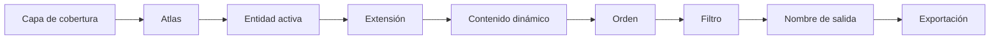
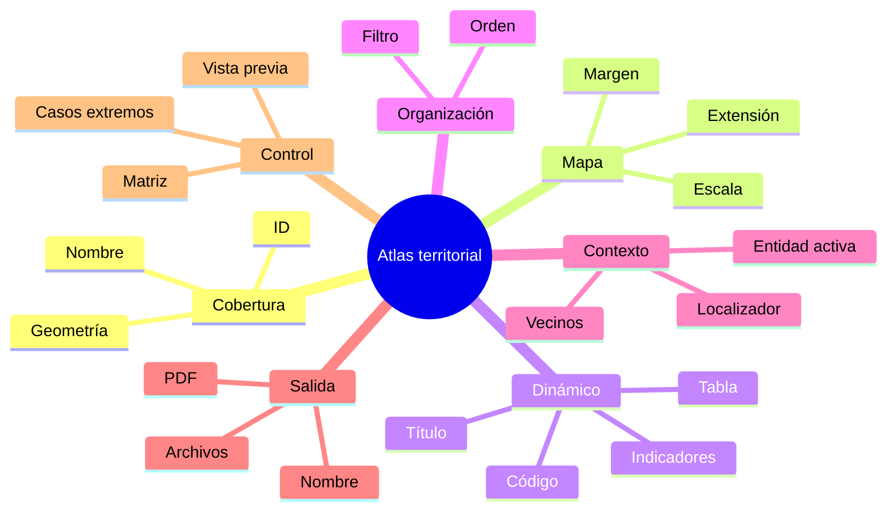

# 4.10 Producir un atlas territorial

Imagina que debes producir:

```text
12 fichas distritales
```

Cada una con:

```text
mapa
título
nombre del distrito
indicadores
escala
fuente
fecha
```

Podrías:

```text
copiar la composición 12 veces
cambiar la extensión
cambiar el título
cambiar los valores
exportar
```

Pero ese procedimiento es:

```text
lento
propenso a errores
difícil de actualizar
```

La alternativa es construir:

```text
un atlas
```

La idea central de esta lección es:

> **Un atlas permite generar múltiples productos cartográficos a partir de una sola composición, utilizando una capa que controla qué entidad se representa en cada página.**

---

## Misión y mapa de aprendizaje

En esta lección construiremos:

```text
una ficha por distrito
```

utilizando:

```text
una única composición
```

Cada página cambiará automáticamente:

```text
territorio
extensión
título
indicadores
nombre del archivo
```

### Ruta de aprendizaje



---

## 1. Qué es un atlas

Un atlas en QGIS permite recorrer:

```text
entidades
```

de una capa y generar:

```text
una salida diferente
```

para cada una.

### Ejemplo

Capa:

```text
DISTRITOS
```

con:

```text
12 polígonos
```

Podemos generar:

```text
12 páginas
```

Una para cada:

```text
distrito
```

---

## 2. La capa de cobertura

El atlas necesita una:

```text
capa de cobertura
```

Esta capa define:

```text
qué entidades generan páginas
```

### Ejemplos

```text
distritos
municipios
barrios
cuencas
parcelas
sectores censales
```

---

## 3. Una entidad, una página

Conceptualmente:

```text
Entidad 1 → Página 1
Entidad 2 → Página 2
Entidad 3 → Página 3
...
```

La composición:

```text
no cambia
```

Lo que cambia es:

```text
el contexto de la entidad activa
```

---

## 4. Requisitos de una buena cobertura

Conviene que la capa tenga:

```text
ID único
nombre
atributos relevantes
geometría válida
```

### Ejemplo

| id | distrito | poblacion | area_km2 |
|---|---|---:|---:|
| 1 | D1 | 22000 | 12.4 |
| 2 | D2 | 31500 | 18.7 |
| 3 | D3 | 18500 | 9.6 |

---

## 5. ID único

El identificador debe permitir distinguir:

```text
cada entidad
```

Evita depender solo de:

```text
nombres repetidos
```

---

## 6. Geometrías válidas

Una geometría dañada puede producir:

```text
extensiones incorrectas
páginas vacías
errores de encuadre
```

Antes de construir el atlas:

```text
valida la cobertura
```

---

## 7. Cobertura no significa mapa principal

La capa que controla el atlas:

```text
puede ser visible
```

o:

```text
puede no aparecer
```

en el producto final.

Su función principal es:

```text
controlar las páginas
```

---

## Checkpoint 1

Deberías poder explicar:

- [ ] qué es un atlas;
- [ ] qué es una capa de cobertura;
- [ ] qué función tiene un ID único;
- [ ] por qué las geometrías deben estar validadas;
- [ ] por qué la cobertura no tiene que dominar visualmente el mapa.

---

## 8. Activar el atlas

Dentro de la composición debemos:

```text
activar la generación de atlas
```

y seleccionar:

```text
la capa de cobertura
```

### Resultado

La composición comienza a trabajar con:

```text
una entidad activa
```

---

## 9. Vista previa

Antes de exportar podemos recorrer:

```text
las entidades
```

y comprobar:

```text
cómo cambia la composición
```

### Esto es fundamental

Porque permite detectar:

```text
nombres demasiado largos
extensiones incorrectas
leyendas vacías
errores de escala
```

---

### Captura prevista

!!! info "Captura pendiente · 4.10-01"

    - **Tipo:** GIF.
    - **Archivo:** `assets/images/modulo-04/4-10/4-10-01-activar-atlas.gif`
    - **Mostrar:**
        1. composición;
        2. activar atlas;
        3. elegir capa de cobertura;
        4. activar vista previa;
        5. recorrer entidades.
    - **Objetivo didáctico:** mostrar el principio de una composición que cambia según la entidad activa.

---

## 10. Extensión controlada por atlas

El mapa puede cambiar automáticamente para mostrar:

```text
la entidad activa
```

### Ejemplo

Página 1:

```text
Distrito 1
```

Página 2:

```text
Distrito 2
```

Página 3:

```text
Distrito 3
```

---

## 11. Margen alrededor de la entidad

Si ajustamos exactamente al borde:

```text
el polígono puede quedar pegado al marco
```

Conviene dejar:

```text
margen
```

alrededor.

### Ejemplo conceptual

```text
10 %
```

o:

```text
15 %
```

según el producto.

---

## 12. Extensión automática

Funciona bien cuando las entidades tienen:

```text
tamaños relativamente similares
```

---

## 13. Problema con entidades muy diferentes

Supongamos:

```text
Distrito A = 5 km²
Distrito B = 250 km²
```

La escala cambiará mucho si utilizamos:

```text
ajuste automático
```

---

## 14. Estrategias de escala

Podemos trabajar con:

```text
escala libre
escala fija
escalas predefinidas
```

según el objetivo.

---

## 15. Escala libre

Cada entidad utiliza:

```text
la escala necesaria
```

para caber.

### Ventaja

Todas las entidades ocupan bien:

```text
el marco
```

### Desventaja

No podemos comparar fácilmente:

```text
tamaños visuales
```

entre páginas.

---

## 16. Escala fija

Todas las páginas usan:

```text
la misma escala
```

### Ventaja

Permite:

```text
comparación directa de tamaño
```

### Problema

Entidades grandes pueden:

```text
no caber
```

y entidades pequeñas:

```text
verse diminutas
```

---

## 17. Escalas predefinidas

Podemos utilizar una serie como:

```text
1:5 000
1:10 000
1:25 000
1:50 000
```

y permitir que el atlas seleccione una apropiada.

### Ventaja

Mantiene:

```text
escalas cartográficamente ordenadas
```

---

## 18. Elegir estrategia

La decisión depende de:

```text
comparabilidad
legibilidad
forma de las entidades
propósito
```

!!! note "No existe una única estrategia correcta para todos los atlas"

---

## 19. Forma de las entidades

Dos polígonos con igual superficie pueden tener formas:

```text
muy diferentes
```

Por ejemplo:

```text
compacto
alargado
```

La extensión del mapa puede funcionar bien para uno y mal para otro.

---

## 20. Rotación

En casos excepcionales una entidad alargada puede aprovechar mejor el espacio si:

```text
se rota el mapa
```

Pero esto debe utilizarse con cuidado.

### Problema

Cada página puede terminar con:

```text
orientación diferente
```

lo que dificulta lectura.

---

## 21. Atlas no significa automatizar sin criterio

La automatización puede resolver:

```text
repetición
```

pero no garantiza:

```text
buen encuadre
```

---

## 22. Contenido dinámico

Ahora podemos utilizar lo aprendido en:

```text
4.9
```

para mostrar atributos de la:

```text
entidad activa
```

---

## 23. Nombre territorial

El título puede ser:

```text
Ficha territorial · Distrito 3
```

donde:

```text
Distrito 3
```

proviene de:

```text
la entidad actual del atlas
```

---

## 24. Variables del atlas

El contexto del atlas permite acceder a información relacionada con:

```text
la página actual
la entidad activa
el número de página
```

Esto permite construir:

```text
títulos
códigos
pies
```

dinámicos.

---

## 25. Indicadores por página

Podemos mostrar:

```text
población
superficie
densidad
código
```

del distrito activo.

---

## 26. Ejemplo conceptual

```text
DISTRITO 4

Población: 31 420 hab.
Superficie: 18,7 km²
Densidad: 1 680 hab/km²
```

La estructura permanece:

```text
igual
```

Los valores:

```text
cambian
```

---

## 27. Tabla vinculada

También podemos mostrar una tabla que cambie según:

```text
la entidad actual
```

Ejemplo:

```text
equipamientos dentro del distrito
```

---

## 28. Relacionar información secundaria

Supongamos:

```text
cobertura = distritos
```

y queremos mostrar:

```text
centros de salud
```

del distrito activo.

La tabla puede filtrar según:

```text
relación espacial
```

o:

```text
atributo común
```

---

## 29. No sobrecargar la ficha

El hecho de poder mostrar:

```text
20 indicadores
```

no significa que debamos hacerlo.

Mantén:

```text
solo información relevante
```

---

## Checkpoint 2

Deberías poder explicar:

- [ ] qué significa extensión controlada por atlas;
- [ ] diferencia entre escala libre y fija;
- [ ] qué ventaja tienen escalas predefinidas;
- [ ] cómo cambia el contenido dinámico;
- [ ] cómo una tabla puede responder a la entidad activa;
- [ ] por qué automatización no sustituye revisión cartográfica.

---

## 30. Orden del atlas

Las páginas no tienen que generarse en:

```text
orden arbitrario
```

Podemos definir:

```text
orden
```

según un atributo.

### Ejemplo

```text
1
2
3
4
5
```

---

## 31. Orden alfabético

También podría ser:

```text
Distrito Central
Distrito Este
Distrito Norte
```

---

## 32. Orden territorial

En algunos atlas puede ser útil ordenar según:

```text
código administrativo
```

o una secuencia:

```text
predefinida
```

---

## 33. Orden debe ser reproducible

Evita depender de:

```text
orden actual de la tabla
```

si ese orden puede cambiar.

---

## 34. Filtros

No siempre queremos generar:

```text
todas las entidades
```

Podemos limitar el atlas.

### Ejemplo

Solo distritos:

```text
urbanos
```

---

## 35. Filtro conceptual

```qgis
"tipo" = 'URBANO'
```

---

## 36. Filtro por estado

Ejemplo:

```qgis
"estado" = 'VALIDADO'
```

Esto permite evitar generar fichas para:

```text
entidades incompletas
```

---

## 37. Filtro temporal

Ejemplo:

```text
solo entidades actualizadas en 2026
```

---

## 38. Filtrar no significa eliminar

La capa conserva:

```text
todos los datos
```

pero el atlas genera:

```text
un subconjunto
```

---

## 39. Nombres automáticos de salida

Una producción manual puede terminar con archivos como:

```text
mapa1.pdf
mapa2.pdf
final2.pdf
final_final.pdf
```

Un atlas puede generar nombres:

```text
automáticamente
```

---

## 40. Nombre basado en atributo

Ejemplo:

```text
distrito_01.pdf
distrito_02.pdf
```

---

## 41. Nombre descriptivo

Podemos construir:

```text
ficha_D01_Distrito_Central.pdf
```

---

## 42. Evitar caracteres problemáticos

Los nombres territoriales pueden contener:

```text
/
\
:
*
?
```

o caracteres poco convenientes para nombres de archivo.

### Por eso

conviene construir:

```text
nombres seguros
```

---

## 43. Espacios

Podemos sustituir:

```text
espacios
```

por:

```text
_
```

para generar nombres como:

```text
distrito_central.pdf
```

---

## 44. Nombres repetidos

Si dos entidades tienen:

```text
el mismo nombre
```

podríamos sobrescribir archivos.

### Mejor

usar:

```text
ID + nombre
```

---

### Captura prevista

!!! info "Captura pendiente · 4.10-02"

    - **Tipo:** GIF.
    - **Archivo:** `assets/images/modulo-04/4-10/4-10-02-nombre-salida.gif`
    - **Mostrar:**
        1. expresión de nombre;
        2. vista previa;
        3. exportación;
        4. archivos resultantes.
    - **Objetivo didáctico:** automatizar una convención de nombres reproducible.

---

## 45. Numeración de páginas

Una colección puede mostrar:

```text
Página 3 de 12
```

Esto resulta útil en:

```text
PDF multipágina
```

---

## 46. Código de ficha

Podemos construir códigos como:

```text
FT-D03-2026
```

utilizando:

```text
ID
gestión
```

---

## 47. Versionado

Si el atlas se actualiza periódicamente podemos incluir:

```text
versión
```

o:

```text
fecha
```

en el nombre del archivo.

### Ejemplo

```text
FT_D03_2026_v02.pdf
```

---

## 48. Resaltar la entidad activa

En un atlas territorial puede ser útil:

```text
destacar el distrito actual
```

y dejar los demás como:

```text
contexto
```

---

## 49. Regla conceptual

```text
entidad actual
→ color destacado

otras entidades
→ gris claro
```

---

## 50. Ventaja

El lector reconoce inmediatamente:

```text
qué territorio corresponde a la ficha
```

---

## 51. Contexto circundante

No siempre debemos ocultar:

```text
territorios vecinos
```

Pueden ayudar a:

```text
orientar
```

---

## 52. Evitar aislamiento innecesario

Una ficha donde solo aparece:

```text
un polígono flotando
```

puede perder contexto territorial.

---

## 53. Mapa localizador dinámico

También podemos mantener un:

```text
localizador
```

y destacar en él:

```text
la entidad activa
```

Esto conecta:

```text
atlas + 4.8
```

---

## 54. Ventaja

Cada página muestra:

```text
dónde está el distrito
```

dentro del:

```text
territorio completo
```

---

## 55. Elementos que pueden mantenerse fijos

En todas las páginas podemos conservar:

```text
logo
fuentes
estructura
leyenda base
márgenes
```

---

## 56. Elementos variables

Pueden cambiar:

```text
título
mapa
indicadores
localizador
tabla
código
```

---

## 57. Diseño robusto

La composición debe tolerar:

```text
entidad pequeña
entidad grande
nombre corto
nombre largo
muchos registros
pocos registros
```

---

## 58. Atlas como prueba de resistencia

Un atlas revela problemas que una sola composición puede esconder.

Por ejemplo:

```text
títulos que no caben
tablas que crecen
escalas absurdas
geometrías extrañas
```

---

## Checkpoint 3

Deberías poder explicar:

- [ ] cómo ordenar páginas;
- [ ] para qué sirven los filtros;
- [ ] cómo crear nombres automáticos;
- [ ] por qué incluir ID en archivos;
- [ ] cómo resaltar la entidad activa;
- [ ] por qué un atlas exige un diseño robusto.

---

## 59. Exportación individual

Podemos generar:

```text
un archivo por entidad
```

Por ejemplo:

```text
12 PDF
```

---

## 60. Exportación multipágina

También podemos producir:

```text
un único PDF
```

con todas las páginas.

### Útil para

```text
atlas completo
informe
documentación
```

---

## 61. Elegir formato

Depende del uso.

### Archivos individuales

Útiles para:

```text
distribución separada
portal web
envío por distrito
```

### PDF único

Útil para:

```text
documento institucional
archivo
impresión
```

---

## 62. No exportar todo antes de probar

Antes de generar:

```text
100 páginas
```

revisa:

```text
algunas entidades diferentes
```

---

## 63. Seleccionar casos de prueba

Prueba al menos:

```text
entidad más pequeña
entidad más grande
nombre más largo
nombre más corto
```

---

## 64. Añadir caso irregular

Incluye una entidad:

```text
alargada
multipart
con huecos
```

si existe.

---

## 65. Control de calidad

Para cada página revisa:

```text
título
extensión
escala
leyenda
tabla
fuente
nombre de archivo
```

---

## 66. Muestreo

En atlas muy grandes puede ser inviable revisar:

```text
cada página manualmente
```

Podemos revisar:

```text
casos extremos
muestra aleatoria
páginas con alertas
```

---

## 67. Pero los atlas pequeños sí pueden revisarse completos

Si tenemos:

```text
12 distritos
```

es razonable revisar:

```text
las 12 fichas
```

---

## 68. Geometrías sospechosas

Si una página aparece:

```text
muy alejada
vacía
con escala extrema
```

revisa:

```text
geometría
SRC
entidades multipartes
```

---

## 69. Campos vacíos

Si aparece:

```text
Distrito:
```

sin nombre:

```text
el problema puede estar en los datos
```

---

## 70. Tablas excesivas

Una entidad puede tener:

```text
100 registros relacionados
```

y otra:

```text
2
```

La composición debe prever:

```text
desbordamiento
```

---

## 71. Consistencia editorial

Todas las fichas deberían parecer:

```text
parte de la misma colección
```

aunque cambien:

```text
los datos
```

---

## Laboratorio guiado · Generar una ficha por distrito

!!! example "Escenario"

    Dispones de una capa:

    ```text
    distritos
    ```

    con los campos:

    ```text
    id
    nombre
    poblacion
    superficie_km2
    densidad
    ```

    El objetivo es generar:

    ```text
    una ficha cartográfica por distrito
    ```

### Fase 1 · Revisar cobertura

Comprueba:

```text
IDs
nombres
geometrías
NULL
```

---

### Fase 2 · Abrir plantilla

Utiliza una composición preparada en:

```text
4.7
```

---

### Fase 3 · Activar atlas

Selecciona:

```text
distritos
```

como cobertura.

---

### Fase 4 · Activar vista previa

Recorre:

```text
varias entidades
```

---

### Fase 5 · Controlar mapa principal

Activa:

```text
extensión controlada por atlas
```

---

### Fase 6 · Definir margen

Evita:

```text
polígonos pegados al borde
```

---

### Fase 7 · Evaluar escala

Decide entre:

```text
libre
fija
predefinida
```

y documenta por qué.

---

### Fase 8 · Crear título dinámico

Ejemplo:

```text
Ficha territorial · [nombre]
```

---

### Fase 9 · Añadir código

Ejemplo:

```text
FT-D03-2026
```

---

### Fase 10 · Añadir indicadores

Muestra:

```text
población
superficie
densidad
```

---

### Fase 11 · Resaltar entidad actual

Haz que:

```text
el distrito activo
```

se diferencie de:

```text
los vecinos
```

---

### Fase 12 · Añadir localizador

Muestra:

```text
municipio completo
```

y resalta:

```text
distrito actual
```

---

### Fase 13 · Crear tabla relacionada

Por ejemplo:

```text
equipamientos del distrito
```

---

### Fase 14 · Definir orden

Utiliza:

```text
id
```

o:

```text
código
```

---

### Fase 15 · Definir filtro

Si corresponde, genera solo:

```text
entidades validadas
```

---

### Fase 16 · Crear nombre de salida

Ejemplo:

```text
FT_D03_Distrito_Central
```

---

### Fase 17 · Probar casos extremos

Revisa:

```text
más pequeño
más grande
nombre más largo
```

---

### Fase 18 · Corregir composición

Ajusta:

```text
títulos
escala
tablas
```

---

### Fase 19 · Exportar muestra

Genera:

```text
3 fichas
```

antes del atlas completo.

---

### Fase 20 · Exportar atlas

Produce:

```text
archivos individuales
```

o:

```text
PDF multipágina
```

---

### Evidencia

!!! info "Captura pendiente · 4.10-03"

    - **Tipo:** PNG comparativo.
    - **Archivo:** `assets/images/modulo-04/4-10/4-10-03-tres-fichas.png`
    - **Mostrar:** tres distritos con la misma plantilla y diferente contenido.
    - **Objetivo didáctico:** demostrar consistencia estructural y variación automática.

---

### Control final

!!! info "Captura pendiente · 4.10-04"

    - **Tipo:** PNG.
    - **Archivo:** `assets/images/modulo-04/4-10/4-10-04-atlas-final.png`
    - **Mostrar:**
        1. colección exportada;
        2. nombres de archivos;
        3. varias páginas.
    - **Objetivo didáctico:** visualizar el producto seriado final.

---

## Reto práctico · Producir un atlas territorial completo

!!! example "Reto 4.10"

    Construye un atlas para una capa que contenga al menos:

    ```text
    5 entidades
    ```

    El atlas debe producir una ficha independiente para cada una.

### Requisito 1 · Cobertura

Debe tener:

```text
ID único
nombre
geometría válida
```

---

### Requisito 2 · Mapa controlado por atlas

La extensión debe cambiar:

```text
automáticamente
```

---

### Requisito 3 · Estrategia de escala

Debes justificar si utilizas:

```text
libre
fija
predefinida
```

---

### Requisito 4 · Título dinámico

Debe identificar:

```text
la entidad
```

---

### Requisito 5 · Código

Genera:

```text
un código de ficha
```

---

### Requisito 6 · Indicadores

Incluye al menos:

```text
3 valores dinámicos
```

---

### Requisito 7 · Entidad resaltada

El territorio actual debe distinguirse de:

```text
sus vecinos
```

---

### Requisito 8 · Localizador

Incluye:

```text
contexto territorial
```

---

### Requisito 9 · Tabla

Incluye una tabla:

```text
vinculada o filtrada
```

si los datos lo permiten.

---

### Requisito 10 · Orden

Define:

```text
un orden reproducible
```

---

### Requisito 11 · Filtro

Utiliza un filtro si existe:

```text
una condición válida
```

para seleccionar páginas.

---

### Requisito 12 · Nombre de archivo

Incluye:

```text
ID
+
nombre
```

---

### Requisito 13 · Casos extremos

Prueba:

```text
entidad pequeña
entidad grande
nombre largo
```

---

### Requisito 14 · Exportación de prueba

Genera:

```text
3 páginas
```

antes de exportar todo.

---

### Requisito 15 · Exportación final

Entrega:

```text
atlas completo
```

---

### Requisito 16 · Matriz de control

Completa:

| Ficha | Nombre | Escala | Título | Indicadores | Archivo | Estado |
|---|---|---:|---|---|---|---|
| | | | | | | |
| | | | | | | |
| | | | | | | |

Usa estados:

```text
OK
REVISAR
ERROR
```

---

### Requisito 17 · Conclusión

Redacta entre **250 y 320 palabras** explicando:

- qué capa utilizaste como cobertura;
- por qué elegiste esa cobertura;
- cómo controlaste las extensiones;
- qué estrategia de escala utilizaste;
- qué contenido hiciste dinámico;
- cómo resaltaste la entidad;
- qué criterio utilizaste para ordenar;
- si aplicaste algún filtro;
- cómo construiste los nombres de archivo;
- qué problemas aparecieron en las entidades extremas;
- qué controles realizaste antes de exportar;
- qué ventaja supone el atlas frente a producir cada mapa manualmente.

---

### Entregables

```text
proyecto_qgis
composicion_atlas
atlas_pdf
fichas_individuales
captura_configuracion
captura_casos_extremos
matriz_control
conclusion
```

---

## Criterios de evaluación

??? success "Ver rúbrica"

    | Criterio | Se cumple si... |
    |---|---|
    | Cobertura | Es adecuada para generar páginas |
    | ID | Es único |
    | Geometría | Está validada |
    | Atlas | Recorre correctamente las entidades |
    | Extensión | Se adapta de forma coherente |
    | Escala | Tiene una estrategia justificada |
    | Título | Cambia con la entidad |
    | Indicadores | Cambian correctamente |
    | Entidad activa | Se distingue |
    | Localizador | Mantiene contexto |
    | Orden | Es reproducible |
    | Filtro | Tiene lógica |
    | Nombre de salida | Es único y legible |
    | Pruebas | Incluyen casos extremos |
    | Exportación | Produce la colección esperada |
    | Control | Detecta errores antes de entrega |

---

## Errores frecuentes

=== "Copio la composición varias veces"

    Si el producto es repetitivo:

    ```text
    probablemente necesitas un atlas
    ```

=== "Uso el nombre como identificador"

    Puede haber:

    ```text
    nombres repetidos
    ```

=== "Todas las páginas deben tener la misma escala"

    Solo si:

    ```text
    la comparabilidad lo requiere
    ```

=== "Cada entidad debe llenar completamente el mapa"

    Necesita:

    ```text
    margen y contexto
    ```

=== "El atlas resolverá automáticamente el diseño"

    No.

    Automatiza:

    ```text
    repetición
    ```

    no:

    ```text
    criterio cartográfico
    ```

=== "No necesito revisar la cobertura"

    Una geometría incorrecta puede producir:

    ```text
    una página incorrecta
    ```

=== "Exportaré las 500 páginas de una vez"

    Primero:

    ```text
    prueba casos representativos
    ```

=== "Un nombre largo no importa"

    Puede romper:

    ```text
    títulos
    tablas
    nombres de archivo
    ```

=== "Los archivos pueden llamarse mapa1, mapa2..."

    Usa:

    ```text
    nombres reproducibles
    ```

=== "Si el PDF se generó, está bien"

    La generación exitosa no garantiza:

    ```text
    calidad cartográfica
    ```

---

## Autoevaluación

??? question "1. ¿Qué es un atlas?"

    Un sistema para generar múltiples salidas desde una misma composición utilizando entidades de una capa de cobertura.

??? question "2. ¿Qué es la cobertura?"

    La capa cuyas entidades controlan las páginas del atlas.

??? question "3. ¿Por qué conviene un ID único?"

    Para identificar cada página y evitar ambigüedades.

??? question "4. ¿Qué puede controlar el atlas en el mapa?"

    La extensión correspondiente a la entidad activa.

??? question "5. ¿Qué diferencia existe entre escala libre y fija?"

    La libre puede cambiar por entidad; la fija mantiene la misma escala.

??? question "6. ¿Qué ventaja tienen escalas predefinidas?"

    Limitan el atlas a una serie controlada de escalas.

??? question "7. ¿Qué puede cambiar dinámicamente?"

    Títulos, indicadores, tablas, códigos, mapas y nombres de salida.

??? question "8. ¿Para qué sirve el orden?"

    Para generar las páginas en una secuencia reproducible.

??? question "9. ¿Para qué sirve el filtro?"

    Para limitar qué entidades producen páginas.

??? question "10. ¿Por qué incluir ID en el nombre del archivo?"

    Para mantener unicidad y trazabilidad.

??? question "11. ¿Por qué resaltar la entidad activa?"

    Para mostrar claramente qué territorio corresponde a la ficha.

??? question "12. ¿Para qué sirve el localizador?"

    Para mantener contexto territorial.

??? question "13. ¿Qué casos deberían probarse primero?"

    Entidades pequeñas, grandes, irregulares y con nombres largos.

??? question "14. ¿Atlas significa ausencia de revisión?"

    No.

??? question "15. ¿Cuál es la secuencia principal?"

    ```text
    cobertura
    → atlas
    → extensión
    → contenido dinámico
    → orden
    → filtro
    → salida
    → control
    ```

---

## Cierre de la lección

### Mapa mental



### Secuencia principal


!!! quote "Idea central"

    Un atlas no consiste en:

    ```text
    producir muchos mapas automáticamente
    ```

    sino en construir:

    ```text
    una sola composición suficientemente robusta
    para producir muchas páginas correctas
    ```

---

## Lo que viene

En **4.11 · Revisar y exportar para distintos usos** dejaremos de centrarnos en:

```text
cómo producir el mapa
```

y pasaremos a:

```text
cómo entregarlo correctamente
```

Trabajaremos con:

```text
PDF
SVG
PNG
JPG
resolución
DPI
vector
ráster
fuentes
transparencia
tamaño de archivo
revisión final
```

y responderemos:

> **¿Cómo exportar el mismo producto para impresión, informe digital, presentación o pantalla sin perder legibilidad ni calidad?**