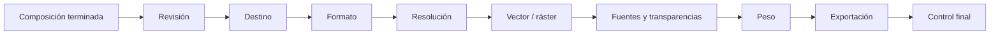
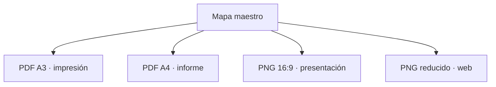
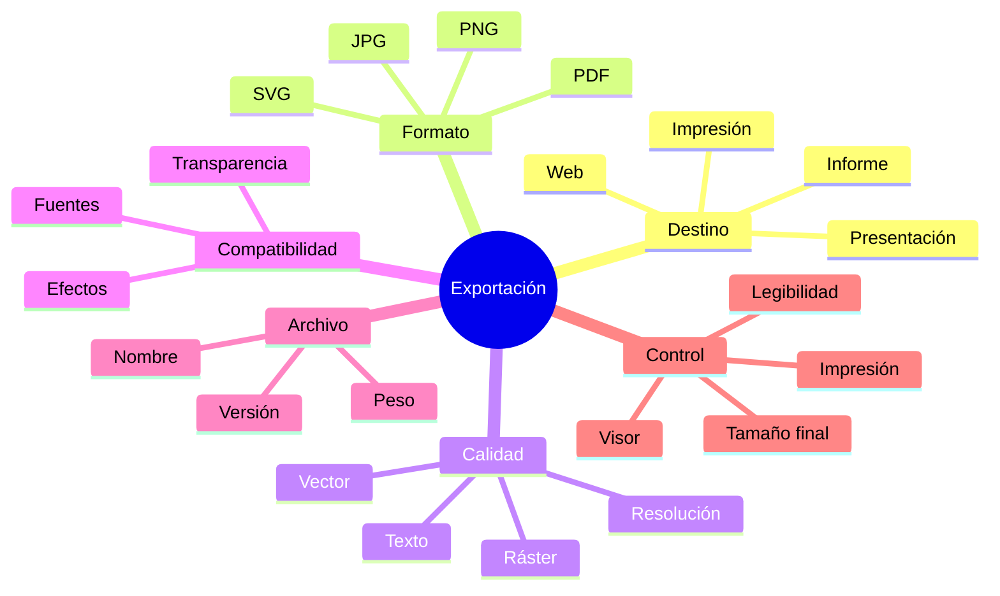
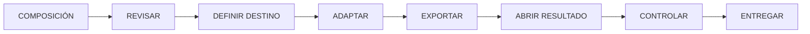

# 4.11 Revisar y exportar para distintos usos

Un mapa puede verse perfecto dentro de QGIS y fallar al momento de:

```text
imprimir
insertar en un informe
proyectar
compartir por web
```

La causa puede estar en:

```text
resolución
tamaño físico
fuentes
transparencias
elementos ráster
peso del archivo
formato de exportación
```

La idea central de esta lección es:

> **Exportar no es simplemente guardar. Es adaptar el producto cartográfico al medio donde será utilizado.**

---

## Misión y mapa de aprendizaje

En esta lección tomaremos una misma composición y produciremos versiones para:

```text
impresión
informe digital
presentación
pantalla
```

La lógica será:



---

## 1. Una composición no es todavía un producto final

Dentro de QGIS trabajamos en:

```text
un entorno de diseño
```

Pero el usuario recibirá:

```text
un archivo
```

Ese archivo puede ser:

```text
PDF
SVG
PNG
JPG
```

y cada formato tiene:

```text
ventajas
limitaciones
```

---

## 2. La primera pregunta es el destino

Antes de exportar pregunta:

> **¿Dónde se va a utilizar este mapa?**

Puede ser:

```text
impresión
informe PDF
presentación
sitio web
redes
documentación técnica
```

---

## 3. El destino condiciona la exportación

No necesitamos exactamente la misma salida para:

```text
A3 impreso
```

que para:

```text
una diapositiva 16:9
```

---

## 4. Impresión

Normalmente requiere:

```text
tamaño físico definido
buena resolución
legibilidad de texto
líneas suficientemente visibles
```

---

## 5. Informe digital

Puede necesitar:

```text
PDF
texto legible
peso moderado
capacidad de zoom
```

---

## 6. Presentación

El mapa puede verse:

```text
a varios metros de distancia
```

Por tanto:

```text
textos pequeños
líneas finas
detalles secundarios
```

pueden dejar de funcionar.

---

## 7. Pantalla o web

Aquí importan:

```text
dimensiones en píxeles
peso
tiempo de carga
legibilidad
```

---

## Checkpoint 1

Deberías poder explicar:

- [ ] por qué el destino debe definirse antes de exportar;
- [ ] por qué impresión y pantalla no requieren exactamente la misma salida;
- [ ] por qué una presentación necesita más síntesis;
- [ ] por qué el tamaño de archivo importa.

---

## 8. PDF

PDF suele ser una opción adecuada para:

```text
impresión
documentación técnica
informes
```

porque puede conservar:

```text
texto
vectores
geometrías
```

con alta calidad.

---

## 9. Ventaja del PDF vectorial

Los elementos vectoriales pueden mantenerse:

```text
nítidos
```

aunque el lector:

```text
amplíe
```

la vista.

Esto es especialmente útil para:

```text
líneas
texto
símbolos vectoriales
```

---

## 10. PDF no significa todo vectorial

Una composición puede contener:

```text
ortofoto
DEM
sombreado
mapa base ráster
```

Esos componentes seguirán siendo:

```text
ráster
```

dentro del PDF.

---

## 11. PDF híbrido

Un producto puede contener:

```text
vectores
+
ráster
```

simultáneamente.

Esto es normal.

---

## 12. Cuándo rasterizar

En algunos casos ciertos efectos pueden requerir:

```text
rasterización
```

por ejemplo:

```text
transparencias complejas
modos de mezcla
efectos avanzados
```

---

## 13. Rasterizar todo

Puede resolver algunos problemas de representación, pero convierte:

```text
toda la composición
```

en una imagen.

### Consecuencia

Al ampliar:

```text
texto
líneas
símbolos
```

pueden perder nitidez.

---

## 14. Decisión

Usa rasterización completa solo cuando:

```text
sea necesaria
```

y conozcas:

```text
la resolución final
```

---

## 15. SVG

SVG es un formato:

```text
vectorial
```

útil cuando queremos:

```text
editar posteriormente
```

en software de diseño vectorial.

---

## 16. Ventaja

Puede permitir editar:

```text
formas
texto
colores
```

posteriormente.

---

## 17. Limitaciones

Una composición compleja puede no conservar:

```text
todos los efectos
```

exactamente como se ven en QGIS.

---

## 18. Cuándo usar SVG

Puede ser útil para:

```text
edición editorial
diagramación
ajustes gráficos posteriores
```

---

## 19. PNG

PNG es un formato:

```text
ráster
```

con buena calidad y soporte de:

```text
transparencia
```

### Útil para

```text
presentaciones
web
documentación
```

---

## 20. JPG

JPG también es:

```text
ráster
```

pero utiliza:

```text
compresión con pérdida
```

### Puede ser útil para

```text
fotografías
fondos complejos
archivos ligeros
```

---

## 21. Problema de JPG en cartografía

Textos y líneas finas pueden mostrar:

```text
artefactos de compresión
```

Por eso suele ser menos adecuado que PNG cuando existen:

```text
muchos bordes
tipografía
símbolos
```

---

## 22. Tabla comparativa

| Formato | Naturaleza | Uso frecuente |
|---|---|---|
| PDF | Vector/raster híbrido | Impresión, informes |
| SVG | Vector | Edición posterior |
| PNG | Ráster sin pérdida | Web, presentaciones |
| JPG | Ráster con pérdida | Fondos/fotografía |

---

## 23. Resolución

En formatos ráster necesitamos definir:

```text
resolución
```

frecuentemente expresada en:

```text
DPI
```

---

## 24. Qué significa DPI

DPI indica:

```text
puntos por pulgada
```

en el contexto de salida física.

Cuanto mayor sea:

```text
la resolución
```

más píxeles tendremos para un mismo tamaño físico.

---

## 25. Ejemplo

Una página A4 a:

```text
300 dpi
```

tendrá muchos más píxeles que a:

```text
96 dpi
```

---

## 26. Más DPI no siempre significa mejor producto

Aumentar indefinidamente:

```text
DPI
```

genera:

```text
archivos más pesados
más tiempo de exportación
```

sin necesariamente aportar una mejora visible.

---

## 27. Resolución orientativa

Como punto de partida:

```text
pantalla → 96–150 dpi
impresión general → 300 dpi
impresión de alta exigencia → evaluar caso
```

No son reglas universales.

---

## 28. Tamaño físico y píxeles

Un archivo para pantalla puede definirse mejor mediante:

```text
ancho × alto en píxeles
```

Por ejemplo:

```text
1920 × 1080 px
```

---

## 29. No confundir tamaño físico con resolución

Dos imágenes pueden tener:

```text
mismo tamaño físico
```

pero:

```text
distinta resolución
```

---

## 30. Revisión prevista

!!! info "Captura pendiente · 4.11-01"

    - **Tipo:** PNG comparativo.
    - **Archivo:** `assets/images/modulo-04/4-11/4-11-01-resoluciones.png`
    - **Mostrar:**
        1. exportación baja;
        2. exportación adecuada;
        3. ampliación de texto y líneas.
    - **Objetivo didáctico:** demostrar el efecto práctico de la resolución.

---

## Checkpoint 2

Deberías poder explicar:

- [ ] qué diferencia existe entre PDF, SVG, PNG y JPG;
- [ ] qué significa DPI;
- [ ] por qué más resolución no siempre es mejor;
- [ ] por qué JPG puede perjudicar líneas y texto;
- [ ] por qué un PDF puede contener partes vectoriales y ráster.

---

## 31. Fuentes tipográficas

Una composición utiliza:

```text
tipografías
```

que deben reproducirse correctamente al exportar.

---

## 32. Problema

Una fuente puede:

```text
no estar disponible
```

en otro equipo.

Esto puede provocar:

```text
sustitución
cambio de ancho
cambio de saltos de línea
```

---

## 33. Resultado

Un título que cabía puede:

```text
desbordarse
```

en otro sistema.

---

## 34. Estrategia

Utiliza tipografías:

```text
estables
disponibles
bien soportadas
```

especialmente para productos institucionales.

---

## 35. Incrustación

Cuando el formato y flujo de trabajo lo permiten, conviene conservar la información tipográfica de forma que:

```text
el resultado sea reproducible
```

---

## 36. Convertir texto a curvas

En algunos flujos editoriales puede utilizarse:

```text
texto convertido a geometría
```

### Ventaja

Reduce problemas de fuentes.

### Desventaja

El texto deja de ser:

```text
editable como texto
```

y puede:

```text
aumentar el archivo
```

---

## 37. No convertir todo automáticamente

Debe utilizarse solo si:

```text
el flujo lo necesita
```

---

## 38. Transparencias

Los mapas modernos pueden incluir:

```text
capas transparentes
sombras
modos de mezcla
```

---

## 39. Problema

Algunos visores o flujos de impresión pueden manejar de forma distinta:

```text
transparencias complejas
```

---

## 40. Control

Después de exportar revisa:

```text
zonas transparentes
solapamientos
fondos
```

---

## 41. Efectos

Sombras y desenfoques pueden producir:

```text
rasterización parcial
```

---

## 42. Si algo cambia al exportar

No asumas que:

```text
el PDF está bien
```

solo porque:

```text
QGIS se veía bien
```

---

## 43. Peso del archivo

Un mapa puede terminar pesando:

```text
200 MB
```

sin necesidad.

---

## 44. Causas frecuentes

```text
ortofotos
ráster de alta resolución
DPI excesivo
transparencias
geometrías muy complejas
```

---

## 45. Peso y distribución

Un archivo para:

```text
correo
web
plataforma
```

puede necesitar ser más ligero que uno destinado a:

```text
archivo institucional
```

---

## 46. No comprimir sin comprobar

Una reducción de peso puede degradar:

```text
textos
líneas
fondos
```

---

## 47. Optimización

Busca equilibrio entre:

```text
calidad
peso
uso
```

---

## 48. Archivo maestro y archivo de distribución

Una práctica útil consiste en mantener:

```text
versión maestra
```

y producir:

```text
versiones derivadas
```

### Ejemplo

```text
mapa_A3_maestro.pdf
mapa_A3_web.pdf
mapa_presentacion.png
```

---

## 49. No sobrescribir el maestro

Conserva:

```text
la mejor versión
```

como referencia.

---

## 50. Convención de nombres

Evita:

```text
mapa_final.pdf
mapa_final2.pdf
mapa_final_ahora_si.pdf
```

---

## 51. Mejor

```text
densidad_distritos_2026_A3_v01.pdf
```

---

## 52. Nombre informativo

Puede contener:

```text
tema
territorio
fecha
formato
versión
```

---

## 53. Metadatos del archivo

También conviene conservar información sobre:

```text
autor
fecha
versión
fuente
```

dentro del sistema documental cuando corresponda.

---

## 54. Revisión a tamaño final

Este es uno de los controles más importantes.

No revises únicamente:

```text
ampliado al 200 %
```

---

## 55. Impresión al 100 %

Si el producto será impreso:

```text
imprime una prueba
```

a:

```text
tamaño real
```

---

## 56. Qué revisar

```text
tamaño de texto
grosor de líneas
contraste
leyenda
escala
márgenes
```

---

## 57. Distancia de lectura

Una lámina A0 puede verse desde:

```text
más distancia
```

que un A4.

El tamaño tipográfico debe considerar:

```text
contexto de lectura
```

---

## 58. Presentación

Para proyección:

```text
aléjate de la pantalla
```

y comprueba si todavía puedes leer:

```text
título
leyenda
elementos clave
```

---

## 59. Pantalla pequeña

Comprueba cómo se ve en:

```text
ventana reducida
```

o dispositivo con dimensiones similares al destino.

---

## Checkpoint 3

Deberías poder explicar:

- [ ] por qué revisar fuentes;
- [ ] qué riesgo tienen las transparencias;
- [ ] qué afecta el peso;
- [ ] por qué conviene una versión maestra;
- [ ] por qué debemos revisar al tamaño final;
- [ ] cómo cambia la lectura según distancia.

---

## 60. Control cartográfico antes de exportar

Antes de exportar revisa:

```text
título
leyenda
unidades
escala
fuente
fecha
```

---

## 61. Título

Pregunta:

```text
¿describe correctamente el mapa?
```

---

## 62. Leyenda

Comprueba:

```text
clases
colores
nombres
unidades
```

---

## 63. Fuente

Comprueba:

```text
si corresponde realmente a los datos usados
```

---

## 64. Fecha

Verifica:

```text
fecha de datos
fecha de elaboración
```

---

## 65. Escala

Si existe escala numérica, comprueba:

```text
que corresponda al tamaño final
```

---

## 66. SRC

Si el producto lo requiere:

```text
verifica su identificación
```

---

## 67. Nombres

Busca:

```text
errores ortográficos
abreviaturas inconsistentes
duplicados
```

---

## 68. Etiquetas

Revisa:

```text
no colocadas
solapamientos
cortes
```

---

## 69. Límites del mapa

Comprueba:

```text
objetos cortados
```

en:

```text
bordes
marcos
```

---

## 70. Imágenes

Comprueba que:

```text
logos
fotografías
```

no estén:

```text
pixelados
deformados
```

---

## 71. Transparencia

Verifica visualmente el:

```text
archivo exportado
```

no solo el diseñador.

---

## 72. Revisión técnica del archivo

Después de exportar revisa:

```text
peso
dimensiones
páginas
orientación
```

---

## 73. PDF multipágina

Comprueba:

```text
cantidad de páginas
orden
```

---

## 74. Atlas

Comprueba:

```text
páginas faltantes
nombres
escalas extremas
```

---

## 75. Abrir con otro visor

Cuando sea posible prueba:

```text
más de un visor
```

especialmente para:

```text
PDF
```

---

## 76. Control de impresión

Si el destino es imprenta:

```text
consulta requisitos de entrega
```

porque pueden existir especificaciones sobre:

```text
formato
sangrado
color
fuentes
resolución
```

---

## 77. RGB y CMYK

QGIS y muchos flujos digitales trabajan habitualmente en:

```text
RGB
```

Mientras algunos procesos de impresión profesional pueden requerir:

```text
CMYK
```

### Importante

No conviertas arbitrariamente sin conocer:

```text
el flujo de impresión
```

---

## 78. Apariencia en pantalla e impresión

Un color muy luminoso en pantalla puede:

```text
imprimirse diferente
```

---

## 79. Prueba física

Cuando el color sea crítico:

```text
la prueba impresa
```

es más confiable que asumir equivalencia perfecta con pantalla.

---

## 80. Exportación para pantalla

Para una diapositiva puede ser suficiente:

```text
PNG
```

con las dimensiones necesarias.

---

## 81. No exportar gigantesco para reducir después

Si el destino final es:

```text
1920 × 1080
```

conviene producir una salida coherente con ese uso.

---

## 82. Exportación para documentos

Si el mapa va dentro de un:

```text
informe
```

conviene evaluar:

```text
PDF vectorial
```

o:

```text
imagen de alta calidad
```

según el flujo editorial.

---

## 83. Exportación para web

Prioriza:

```text
peso
dimensiones
legibilidad
```

---

## 84. Texto en móviles

Un mapa complejo reducido a:

```text
600 px
```

puede volverse ilegible.

A veces necesitamos:

```text
una versión simplificada
```

no únicamente:

```text
una versión reducida
```

---

## 85. Un producto, varias salidas

Esta es una idea fundamental.

Podemos tener:

```text
un mismo contenido
```

pero producir:

```text
A3 impresión
A4 informe
16:9 presentación
PNG web
```

---

## 86. No siempre es suficiente cambiar el tamaño

Puede ser necesario cambiar:

```text
cantidad de etiquetas
detalle
tamaño de texto
leyenda
```

---

## 87. Derivados cartográficos

Podemos pensar en:

```text
producto maestro
→ productos derivados
```

---

## 88. Ejemplo



---

## Laboratorio guiado · Exportar el mismo mapa para impresión y pantalla

!!! example "Escenario"

    Utiliza una composición terminada del módulo.

    Debes producir:

    ```text
    Versión A = impresión
    Versión B = pantalla
    ```

### Fase 1 · Definir destino A

```text
A3
impresión
```

---

### Fase 2 · Revisar tamaño físico

Comprueba:

```text
tipografía
líneas
símbolos
```

---

### Fase 3 · Exportar PDF

Mantén:

```text
calidad adecuada
```

---

### Fase 4 · Abrir PDF

No evalúes únicamente:

```text
la vista previa de QGIS
```

---

### Fase 5 · Ampliar

Comprueba:

```text
líneas
texto
vectores
ráster
```

---

### Fase 6 · Revisar transparencias

Busca:

```text
cambios
artefactos
```

---

### Fase 7 · Registrar peso

Anota:

```text
MB
```

---

### Fase 8 · Crear destino B

Define:

```text
presentación 16:9
```

---

### Fase 9 · Adaptar composición

No limites el proceso a:

```text
reducir A3
```

Ajusta:

```text
texto
leyenda
detalle
```

---

### Fase 10 · Exportar PNG

Utiliza dimensiones apropiadas para:

```text
pantalla
```

---

### Fase 11 · Revisar a tamaño real

Muestra la imagen:

```text
sin ampliarla artificialmente
```

---

### Fase 12 · Comparar

| Criterio | Impresión | Pantalla |
|---|---|---|
| Formato | PDF | PNG |
| Tamaño | | |
| Resolución | | |
| Texto | | |
| Detalle | | |
| Peso | | |

---

### Fase 13 · Comprobar legibilidad

Pregunta:

```text
¿todo lo importante sigue siendo legible?
```

---

### Fase 14 · Crear versión web

Opcionalmente produce:

```text
una tercera versión
```

más ligera.

---

### Fase 15 · Comparar peso

Registra:

```text
maestro
impresión
pantalla
web
```

---

### Fase 16 · Revisar nombres

Utiliza convención consistente.

---

### Evidencia

!!! info "Captura pendiente · 4.11-02"

    - **Tipo:** PNG comparativo.
    - **Archivo:** `assets/images/modulo-04/4-11/4-11-02-impresion-pantalla.png`
    - **Mostrar:**
        1. versión de impresión;
        2. versión para pantalla.
    - **Objetivo didáctico:** demostrar que adaptar no equivale solo a cambiar resolución.

---

### Control del PDF

!!! info "Captura pendiente · 4.11-03"

    - **Tipo:** PNG.
    - **Archivo:** `assets/images/modulo-04/4-11/4-11-03-control-pdf.png`
    - **Mostrar:**
        1. PDF a tamaño normal;
        2. ampliación de líneas/texto;
        3. zona con ráster;
        4. transparencia.
    - **Objetivo didáctico:** enseñar a inspeccionar la salida real.

---

## Reto práctico · Crear una familia de salidas

!!! example "Reto 4.11"

    A partir de un mismo producto cartográfico crea:

    ```text
    3 versiones
    ```

### Versión 1

```text
impresión
```

### Versión 2

```text
informe digital
```

### Versión 3

```text
presentación o web
```

---

### Requisito 1 · Definir destino

Documenta:

```text
dónde se utilizará
```

cada versión.

---

### Requisito 2 · Elegir formato

Justifica:

```text
PDF
SVG
PNG
JPG
```

según corresponda.

---

### Requisito 3 · Definir tamaño

Registra:

```text
mm
```

o:

```text
px
```

---

### Requisito 4 · Definir resolución

Cuando corresponda.

---

### Requisito 5 · Revisar tipografía

Comprueba:

```text
legibilidad
```

---

### Requisito 6 · Revisar líneas

Comprueba:

```text
grosor
contraste
```

---

### Requisito 7 · Revisar ráster

Comprueba:

```text
pixelación
```

---

### Requisito 8 · Revisar transparencias

Comprueba:

```text
resultado exportado
```

---

### Requisito 9 · Revisar peso

Registra:

```text
tamaño de archivo
```

---

### Requisito 10 · Convención de nombres

Utiliza una nomenclatura consistente.

---

### Requisito 11 · Comparar

Completa:

| Variable | Impresión | Informe | Pantalla |
|---|---|---|---|
| Formato | | | |
| Tamaño | | | |
| Resolución | | | |
| Texto mínimo | | | |
| Peso | | | |
| Nivel de detalle | | | |

---

### Requisito 12 · Control editorial

Verifica:

```text
título
leyenda
unidad
fuente
fecha
escala
```

---

### Requisito 13 · Control técnico

Verifica:

```text
peso
páginas
dimensiones
apertura
```

---

### Requisito 14 · Conclusión

Redacta entre **220 y 300 palabras** explicando:

- qué formato utilizaste en cada caso;
- por qué lo elegiste;
- qué resolución utilizaste;
- qué diferencias introdujiste entre impresión y pantalla;
- qué elementos simplificaste;
- qué problemas encontraste con fuentes, transparencias o ráster;
- cuánto pesó cada versión;
- cuál fue el principal cambio necesario entre soportes;
- por qué no basta con exportar una sola versión y reutilizarla para todo.

---

### Entregables

```text
version_impresion
version_informe
version_pantalla
tabla_comparativa
captura_control_pdf
captura_control_raster
registro_pesos
conclusion
```

---

## Criterios de evaluación

??? success "Ver rúbrica"

    | Criterio | Se cumple si... |
    |---|---|
    | Destino | Está definido |
    | Formato | Corresponde al uso |
    | Resolución | Es apropiada |
    | Tamaño | Se controla |
    | Texto | Es legible |
    | Líneas | Mantienen jerarquía |
    | Ráster | Tiene calidad suficiente |
    | Transparencias | Se revisan |
    | Fuentes | Se reproducen correctamente |
    | Peso | Es razonable |
    | Nombres | Son consistentes |
    | Revisión | Se realiza sobre el archivo final |
    | Adaptación | Existen diferencias reales entre soportes |
    | Resultado | Funciona en su medio de destino |

---

## Errores frecuentes

=== "Exporto una sola versión para todo"

    Diferentes soportes pueden necesitar:

    ```text
    diferentes soluciones
    ```

=== "Más DPI siempre es mejor"

    No necesariamente.

=== "PDF significa completamente vectorial"

    No.

=== "SVG siempre conservará exactamente todo"

    No necesariamente.

=== "JPG y PNG son iguales"

    No.

=== "Si se ve bien en QGIS está listo"

    Debes revisar:

    ```text
    el archivo exportado
    ```

=== "El PDF pesa 300 MB, pero tiene buena calidad"

    Quizá existe:

    ```text
    una configuración innecesariamente pesada
    ```

=== "Para web reduzco simplemente el PDF"

    Puede ser necesario:

    ```text
    simplificar el diseño
    ```

=== "La fuente funcionará en cualquier equipo"

    No siempre.

=== "La impresión será igual que la pantalla"

    Puede existir:

    ```text
    diferencia de color
    contraste
    ```

=== "mapa_final_final2.pdf es un nombre válido"

    Técnicamente sí.

    Documentalmente:

    ```text
    no es recomendable
    ```

---

## Autoevaluación

??? question "1. ¿Qué debe definirse antes de exportar?"

    El medio de destino.

??? question "2. ¿Qué ventaja tiene PDF?"

    Puede conservar elementos vectoriales y combinar ráster.

??? question "3. ¿Qué ventaja tiene SVG?"

    Facilita edición vectorial posterior.

??? question "4. ¿Qué ventaja tiene PNG?"

    Mantiene buena calidad ráster y soporta transparencia.

??? question "5. ¿Qué problema puede tener JPG?"

    Compresión con pérdida y artefactos en texto o líneas.

??? question "6. ¿Qué significa DPI?"

    Resolución expresada como puntos por pulgada.

??? question "7. ¿Más DPI siempre mejora?"

    No.

??? question "8. ¿Qué debemos revisar en las fuentes?"

    Que se reproduzcan correctamente en la salida.

??? question "9. ¿Por qué revisar transparencias?"

    Porque el resultado exportado puede diferir del diseñador.

??? question "10. ¿Qué causa archivos pesados?"

    Ráster de alta resolución, DPI excesivo, geometrías complejas y efectos.

??? question "11. ¿Qué es una versión maestra?"

    La versión de referencia de mayor calidad desde la que se generan derivados.

??? question "12. ¿Por qué revisar al 100 %?"

    Para comprobar la legibilidad real.

??? question "13. ¿Un mapa web puede necesitar simplificación?"

    Sí.

??? question "14. ¿Por qué probar el archivo en otro visor?"

    Para detectar incompatibilidades de representación.

??? question "15. ¿Cuál es la secuencia principal?"

    ```text
    revisar
    → definir destino
    → elegir formato
    → ajustar resolución
    → exportar
    → abrir archivo
    → validar
    ```

---

## Cierre de la lección

### Mapa mental



### Secuencia principal



!!! quote "Idea central"

    Exportar correctamente no significa:

    ```text
    elegir el formato con mayor calidad posible
    ```

    sino producir:

    ```text
    la calidad adecuada
    para el medio adecuado
    con el peso y la legibilidad adecuados
    ```

---

## Lo que viene

En **4.12 · Taller editorial: publicar una colección coherente** integraremos todo el módulo.

Ya no trabajaremos con un mapa aislado, sino con:

```text
una pequeña colección cartográfica
```

que deberá mantener:

```text
simbología
tipografía
clasificación
leyendas
fuentes
fechas
unidades
metadatos
nomenclatura
estructura de entrega
```

El reto final será construir:

```text
1 mapa temático
1 atlas breve
1 ficha técnica
```

como partes de un mismo sistema editorial.

La pregunta final del módulo será:

> **¿Cómo convertir varios productos cartográficos en una colección consistente, verificable y lista para publicación?**