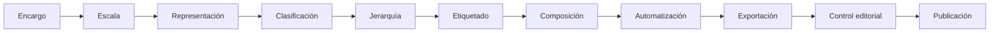

# 4.12 Taller editorial: publicar una colección coherente

Un buen mapa aislado no garantiza una buena colección.

Cuando varios productos pertenecen al mismo proyecto, institución o estudio, deberían compartir una lógica común:

```text
tipografía
simbología
jerarquía
estructura
nomenclatura
fuentes
fechas
unidades
criterios editoriales
```

Si cada mapa parece haber sido diseñado:

```text
por una persona distinta
en un momento distinto
con criterios distintos
```

la colección pierde:

```text
coherencia
credibilidad
eficiencia
```

La idea central de este taller es:

> **Publicar cartografía profesional significa controlar no solo cada mapa, sino también la coherencia entre todos los productos de una colección.**

---

## Misión y mapa de aprendizaje

El reto final consiste en producir:

```text
1 mapa temático
1 atlas breve
1 ficha técnica
```

como partes de:

```text
una misma colección editorial
```

La colección deberá mantener:

```text
criterios comunes
```

sin obligar a que todos los productos sean:

```text
idénticos
```

### Ruta de integración



---

## 1. Qué significa coherencia editorial

Coherencia no significa:

```text
copiar exactamente el mismo diseño
```

Significa que los productos comparten:

```text
una lógica reconocible
```

### Ejemplo

Tres mapas pueden tener:

```text
distinta variable
distinta escala
distinta composición
```

y aun así pertenecer claramente a:

```text
la misma colección
```

si conservan:

```text
familia tipográfica
estructura de títulos
tratamiento de fuentes
estilo institucional
convenciones gráficas
```

---

## 2. Identidad visual frente a uniformidad

Una colección coherente puede admitir:

```text
variación
```

cuando la función del producto cambia.

### Ejemplo

Un:

```text
mapa temático A3
```

puede tener una composición distinta de:

```text
una ficha territorial A4
```

pero ambos pueden compartir:

```text
tipografía
colores institucionales
pie
estructura de fuentes
nomenclatura
```

!!! note "Principio"

    Coherencia:

    ```text
    reglas comunes
    ```

    no:

    ```text
    diseños idénticos
    ```

---

## 3. Componentes que conviene normalizar

Podemos definir reglas comunes para:

```text
tipografía
tamaños
títulos
leyendas
fuentes
fechas
unidades
logotipos
límites
fondos
nombres de archivos
```

---

## 4. Tipografía de colección

Una colección puede utilizar:

```text
una familia principal
```

y varios pesos.

### Ejemplo

```text
Título → Bold
Subtítulo → Medium
Texto → Regular
Fuente → Regular pequeño
```

---

## 5. Evitar cambios arbitrarios

No debería ocurrir:

```text
Mapa 1 → Arial
Mapa 2 → Calibri
Mapa 3 → Times New Roman
```

sin una razón editorial.

---

## 6. Tamaños tipográficos

Los tamaños pueden variar según:

```text
formato
distancia de lectura
```

pero la relación jerárquica debería conservarse.

### Ejemplo

```text
Título > subtítulo > leyenda > fuente
```

en toda la colección.

---

## 7. Convenciones de color

Podemos definir convenciones para:

```text
agua
vías
límites
contexto
```

### Ejemplo

Si la hidrografía aparece en varios mapas:

```text
conviene mantener una lógica similar
```

---

## 8. Pero no fijar colores temáticos arbitrariamente

Una variable:

```text
densidad
```

puede necesitar una paleta distinta de:

```text
cambio temporal
```

La coherencia no debe destruir:

```text
el significado cartográfico
```

---

## Checkpoint 1

Deberías poder explicar:

- [ ] qué significa coherencia editorial;
- [ ] por qué coherencia no equivale a uniformidad;
- [ ] qué elementos conviene normalizar;
- [ ] qué elementos pueden variar según el producto;
- [ ] por qué la semántica cartográfica tiene prioridad sobre la decoración.

---

## 9. Construir una guía editorial mínima

Antes de producir la colección conviene documentar:

```text
reglas
```

### Ejemplo

| Elemento | Regla |
|---|---|
| Tipografía | Noto Sans |
| Título | Bold |
| Fuente | Regular |
| Límite principal | Mayor grosor |
| Límite secundario | Gris fino |
| Fuente cartográfica | Pie inferior |
| Fecha | Junto a fuente |
| Nombre archivo | tema_territorio_fecha_version |

---

## 10. Guía breve, no manual gigantesco

Para una colección pequeña puede bastar:

```text
1 página
```

con:

```text
convenciones principales
```

---

## 11. Ventaja

La guía reduce:

```text
decisiones repetitivas
```

y mejora:

```text
consistencia
```

---

## 12. Control de títulos

Los títulos deberían seguir:

```text
una estructura comparable
```

### Ejemplo

```text
[Variable]
[Territorio] · [Periodo]
```

---

## 13. Ejemplo

```text
Densidad poblacional
Municipio de Sacaba · 2026
```

---

## 14. Evitar títulos inconsistentes

Ejemplo problemático:

```text
Mapa de densidad 2026
POBLACION DISTRITO
Cobertura servicios en Sacaba
```

---

## 15. Unidades

Una colección debe utilizar:

```text
unidades consistentes
```

Ejemplo:

```text
km²
```

y no alternar arbitrariamente con:

```text
ha
m²
```

si estamos comparando productos relacionados.

---

## 16. Decimales

Define un criterio.

Ejemplo:

```text
Población → 0 decimales
Superficie → 1 decimal
Densidad → 0 decimales
```

---

## 17. Separadores

Mantén una misma convención para:

```text
miles
decimales
```

---

## 18. Fechas

Utiliza una estructura consistente.

Ejemplo:

```text
2026-09-18
```

o:

```text
18/09/2026
```

según el estándar del proyecto.

---

## 19. Fuente de datos

Debe permitir saber:

```text
de dónde proviene la información
```

---

## 20. Elaboración

También puede ser necesario registrar:

```text
quién procesó o elaboró
```

la representación.

---

## 21. Fuente no es metodología

Ejemplo:

```text
Fuente: INE, Censo 2024
```

no explica:

```text
cómo se calculó la densidad
```

---

## 22. Nota metodológica

Cuando sea importante:

```text
puede incluirse una nota breve
```

o una:

```text
ficha técnica
```

---

## 23. Trazabilidad

Un producto debería permitir recuperar:

```text
dato
proceso
responsable
fecha
versión
```

al menos cuando el contexto lo requiere.

---

## Checkpoint 2

Deberías poder explicar:

- [ ] por qué títulos deben seguir una lógica común;
- [ ] por qué unidades deben ser consistentes;
- [ ] por qué fuentes y metodología son diferentes;
- [ ] qué significa trazabilidad;
- [ ] por qué el versionado ayuda a controlar entregas.

---

## 24. La leyenda como contrato de lectura

La leyenda explica:

```text
qué significan los símbolos
```

Por tanto debe coincidir exactamente con:

```text
lo representado
```

---

## 25. Leyenda desactualizada

Puede ocurrir cuando:

```text
cambiamos simbología
```

pero no:

```text
actualizamos la leyenda
```

---

## 26. Control

Compara:

```text
mapa
↔
leyenda
```

categoría por categoría.

---

## 27. Orden lógico

La leyenda debería seguir:

```text
el orden conceptual
```

no necesariamente:

```text
el orden de capas
```

---

## 28. Nombres técnicos internos

Evita:

```text
riesgo_clase_v4
```

en la publicación.

Prefiere:

```text
Nivel de riesgo
```

---

## 29. Unidades visibles

Ejemplo:

```text
Densidad poblacional
hab/km²
```

---

## 30. Clases comparables

Si varios mapas forman:

```text
una serie
```

revisa si necesitan:

```text
mismos límites
```

---

## 31. Cambiar clasificación dentro de una serie

Puede destruir:

```text
comparabilidad
```

aunque cada mapa individual se vea bien.

---

## 32. Mapas comparables

Mantén, cuando corresponda:

```text
paleta
clasificación
orden
unidades
```

---

## 33. Cambios justificados

Si un mapa necesita:

```text
otra clasificación
```

debe quedar:

```text
documentado
```

---

## 34. Control de etiquetas

Revisa:

```text
ortografía
abreviaturas
jerarquía
etiquetas no colocadas
```

---

## 35. Topónimos

Los nombres deben ser:

```text
consistentes
```

entre productos.

---

## 36. Ejemplo problemático

```text
D-1
Distrito 1
DISTRITO UNO
```

para referirse al mismo territorio.

---

## 37. Convención

Define:

```text
una forma oficial o acordada
```

y reutilízala.

---

## 38. Abreviaturas

No cambies entre:

```text
Av.
Avenida
AV.
```

sin criterio.

---

## 39. Revisión lingüística

El control editorial también incluye:

```text
acentos
mayúsculas
ortografía
```

---

## 40. Control de mapas base

Si varios productos utilizan:

```text
mapa base
```

revisa:

```text
estilo
atribución
licencia
```

---

## 41. Fuente y licencia

Algunas fuentes requieren:

```text
atribución específica
```

No debemos eliminarla por razones estéticas.

---

## 42. Metadatos mínimos

Una ficha de producto puede registrar:

```text
nombre
código
tema
territorio
fecha
fuente
autor
versión
formato
```

---

## 43. Ejemplo

| Campo | Valor |
|---|---|
| Código | MAP-DEM-001 |
| Tema | Densidad poblacional |
| Territorio | Sacaba |
| Fecha | 2026-09-18 |
| Fuente | INE |
| Elaboración | Unidad SIG |
| Versión | 1.0 |
| Formato | PDF A3 |

---

## 44. Ventaja

Permite:

```text
inventariar
buscar
actualizar
auditar
```

productos.

---

## 45. Metadatos no tienen que ir todos dentro del mapa

Pueden existir en:

```text
ficha
catálogo
archivo complementario
```

---

## 46. Nomenclatura de archivos

Una colección necesita nombres:

```text
predecibles
```

---

## 47. Ejemplo

```text
MAP_DENSIDAD_SACABA_2026_v01.pdf
ATL_DISTRITOS_SACABA_2026_v01.pdf
FIC_D03_SACABA_2026_v01.pdf
```

---

## 48. Prefijos

Podemos definir:

```text
MAP = mapa
ATL = atlas
FIC = ficha
```

---

## 49. Evitar espacios si el flujo lo requiere

Ejemplo:

```text
mapa densidad final.pdf
```

puede convertirse en:

```text
MAP_DENSIDAD_SACABA_2026_v01.pdf
```

---

## 50. Versiones

Utiliza:

```text
v01
v02
v03
```

o un sistema:

```text
1.0
1.1
2.0
```

---

## 51. Versión no es fecha

Podemos necesitar:

```text
ambas
```

---

## 52. Borrador y aprobado

Un sistema simple podría utilizar:

```text
BORRADOR
REVISION
APROBADO
```

---

## 53. No insertar “FINAL” indefinidamente

Evita:

```text
FINAL
FINAL2
FINAL_OK
FINAL_AHORA_SI
```

---

## Checkpoint 3

Deberías poder explicar:

- [ ] por qué leyenda y mapa deben auditarse juntos;
- [ ] por qué los topónimos deben mantenerse consistentes;
- [ ] qué información puede incluir un metadato mínimo;
- [ ] por qué usar nomenclatura controlada;
- [ ] por qué “FINAL2” no es un sistema de versionado.

---

## 54. Estructura de entrega

La publicación no termina con:

```text
exportar archivos
```

También debemos organizar:

```text
la entrega
```

---

## 55. Carpeta propuesta

```text
entrega_cartografica/
│
├── 01_mapas/
│   ├── impresion/
│   └── pantalla/
│
├── 02_atlas/
│
├── 03_fichas/
│
├── 04_metadatos/
│
├── 05_fuentes/
│
└── README.md
```

---

## 56. Mapas

Podemos separar:

```text
maestros
distribución
```

si el flujo lo necesita.

---

## 57. Atlas

Incluye:

```text
PDF completo
```

y, si corresponde:

```text
fichas individuales
```

---

## 58. Metadatos

Puede contener:

```text
inventario
ficha técnica
diccionario de productos
```

---

## 59. Fuentes

Solo deben incluirse datos cuando:

```text
la licencia
confidencialidad
flujo de entrega
```

lo permitan.

---

## 60. README

Un archivo:

```text
README.md
```

puede explicar:

```text
estructura
nomenclatura
versiones
responsable
```

---

## 61. No entregar archivos temporales

Evita incluir:

```text
pruebas
capturas temporales
copias antiguas
```

---

## 62. Archivos ocultos

Revisa también:

```text
archivos auxiliares
```

que no correspondan a la entrega.

---

## 63. Separar editable y publicación

Puede ser útil:

```text
editable/
publicacion/
```

según el proyecto.

---

## 64. Producto reproducible

Idealmente deberíamos conservar:

```text
proyecto QGIS
plantillas
estilos
datos permitidos
```

para poder:

```text
actualizar
```

la colección.

---

## 65. Entrega no significa perder el proyecto fuente

Conserva:

```text
archivos de trabajo
```

en una estructura controlada.

---

## 66. Control de vínculos

Antes de archivar comprueba:

```text
rutas
capas
recursos externos
```

---

## 67. Empaquetado

Cuando sea necesario prepara:

```text
un proyecto transportable
```

con recursos correctamente organizados.

---

## 68. Revisión cruzada

El autor puede acostumbrarse tanto al mapa que deja de ver:

```text
errores evidentes
```

---

## 69. Segunda revisión

Cuando sea posible:

```text
otra persona
```

debería revisar:

```text
contenido
lectura
errores
```

---

## 70. Revisión técnica y editorial

Son distintas.

### Técnica

```text
datos
SRC
escala
clasificación
```

### Editorial

```text
texto
alineación
consistencia
ortografía
```

---

## 71. Lista de control

Antes de publicar debemos revisar:

```text
datos
mapa
composición
archivo
colección
```

---

## 72. Control del dato

- [ ] fuente identificada;
- [ ] fecha conocida;
- [ ] unidad correcta;
- [ ] NULL revisados;
- [ ] extremos revisados.

---

## 73. Control cartográfico

- [ ] representación adecuada;
- [ ] clasificación justificada;
- [ ] color coherente;
- [ ] jerarquía clara;
- [ ] etiquetas revisadas.

---

## 74. Control de composición

- [ ] título correcto;
- [ ] leyenda correcta;
- [ ] escala correcta;
- [ ] fuentes visibles;
- [ ] márgenes consistentes.

---

## 75. Control de archivo

- [ ] formato correcto;
- [ ] resolución correcta;
- [ ] peso razonable;
- [ ] nombre correcto;
- [ ] archivo abre correctamente.

---

## 76. Control de colección

- [ ] tipografía consistente;
- [ ] unidades consistentes;
- [ ] nomenclatura consistente;
- [ ] versionado correcto;
- [ ] estructura de entrega correcta.

---

## 77. Matriz editorial

Podemos convertir la revisión en:

```text
un proceso verificable
```

### Ejemplo

| Producto | Datos | Simbología | Leyenda | Fuente | Exportación | Estado |
|---|---|---|---|---|---|---|
| MAP-01 | OK | OK | OK | OK | OK | APROBADO |
| MAP-02 | OK | REVISAR | OK | OK | OK | REVISAR |
| ATL-01 | OK | OK | OK | OK | ERROR | ERROR |

---

## 78. Estados

Podemos utilizar:

```text
OK
REVISAR
ERROR
```

o:

```text
BORRADOR
REVISION
APROBADO
```

---

## 79. Publicar solo productos aprobados

El directorio final debería contener:

```text
solo productos validados
```

---

## 80. Registro de cambios

Para productos importantes puede mantenerse:

| Versión | Fecha | Cambio | Responsable |
|---|---|---|---|
| 1.0 | | Primera versión | |
| 1.1 | | Corrección de leyenda | |
| 1.2 | | Actualización de datos | |

---

## 81. Cambiar datos requiere nueva revisión

No asumas que:

```text
solo porque la plantilla es la misma
```

la nueva salida está automáticamente correcta.

---

## 82. Automatización y control

Cuanto más automatizamos:

```text
más importante es controlar entradas
```

---

## 83. Colecciones temporales

En series anuales:

```text
2025
2026
2027
```

la coherencia permite:

```text
comparar
```

---

## 84. Mantener clasificación

Si el objetivo es comparación temporal:

```text
mantener límites
```

puede ser crítico.

---

## 85. Mantener extensión

En mapas comparativos puede ser útil mantener:

```text
misma extensión
misma escala
```

---

## 86. Mantener leyenda

No cambies:

```text
orden
colores
unidades
```

sin necesidad.

---

## 87. Documentar cambios metodológicos

Si en 2027 cambia:

```text
la metodología
```

debe quedar explícito.

---

## 88. Una colección puede ser coherente y científicamente incorrecta

La consistencia visual:

```text
no sustituye
```

a:

```text
calidad de datos
criterio estadístico
metodología
```

---

## 89. Diseño no corrige un análisis incorrecto

Un mapa atractivo puede representar:

```text
una variable mal calculada
```

---

## 90. Control previo

Antes de aprobar un producto revisa:

```text
dato
método
representación
diseño
```

en ese orden.

---

## Laboratorio integrador · Construir una colección territorial

!!! example "Escenario"

    Debes publicar una colección compuesta por:

    ```text
    1 mapa temático
    1 atlas de distritos
    1 ficha técnica territorial
    ```

    Los tres productos deberán parecer parte de:

    ```text
    un mismo sistema editorial
    ```

---

### Fase 1 · Definir el encargo

Registra:

```text
destinatario
propósito
soporte
```

para cada producto.

---

### Fase 2 · Definir guía editorial

Crea una tabla con:

```text
tipografía
títulos
fuentes
fechas
límites
nomenclatura
```

---

### Fase 3 · Crear mapa temático

Debe utilizar:

```text
representación adecuada
clasificación justificada
jerarquía clara
```

---

### Fase 4 · Crear composición

Aplica la estructura desarrollada en:

```text
4.7
```

---

### Fase 5 · Crear atlas

Genera al menos:

```text
5 fichas territoriales
```

---

### Fase 6 · Crear ficha técnica

Incluye:

```text
mapa
indicadores
fuentes
fecha
```

---

### Fase 7 · Normalizar títulos

Comprueba:

```text
estructura común
```

---

### Fase 8 · Normalizar unidades

Comprueba:

```text
notación
decimales
```

---

### Fase 9 · Normalizar fuentes

Utiliza un:

```text
formato consistente
```

---

### Fase 10 · Revisar leyendas

Comprueba:

```text
mapa ↔ leyenda
```

---

### Fase 11 · Revisar etiquetas

Busca:

```text
errores
duplicados
no colocadas
```

---

### Fase 12 · Crear metadatos

Registra:

```text
código
tema
fuente
fecha
versión
responsable
```

---

### Fase 13 · Crear nomenclatura

Ejemplo:

```text
MAP_DENSIDAD_2026_v01.pdf
ATL_DISTRITOS_2026_v01.pdf
FIC_D03_2026_v01.pdf
```

---

### Fase 14 · Exportar impresión

Genera:

```text
versión maestra
```

---

### Fase 15 · Exportar pantalla

Genera:

```text
versión optimizada
```

cuando corresponda.

---

### Fase 16 · Crear estructura de entrega

Organiza:

```text
mapas
atlas
fichas
metadatos
```

---

### Fase 17 · Crear README

Incluye:

```text
descripción
estructura
convenciones
versionado
```

---

### Fase 18 · Ejecutar control editorial

Completa una matriz:

| Producto | Datos | Cartografía | Texto | Fuente | Archivo | Estado |
|---|---|---|---|---|---|---|
| | | | | | | |
| | | | | | | |
| | | | | | | |

---

### Fase 19 · Corregir

No publiques elementos con:

```text
REVISAR
ERROR
```

---

### Fase 20 · Publicar colección

Entrega únicamente:

```text
productos aprobados
```

---

### Evidencia

!!! info "Captura pendiente · 4.12-01"

    - **Tipo:** PNG.
    - **Archivo:** `assets/images/modulo-04/4-12/4-12-01-coleccion.png`
    - **Mostrar:**
        1. mapa temático;
        2. página del atlas;
        3. ficha técnica.
    - **Objetivo didáctico:** demostrar coherencia visual entre productos diferentes.

---

### Control editorial

!!! info "Captura pendiente · 4.12-02"

    - **Tipo:** PNG.
    - **Archivo:** `assets/images/modulo-04/4-12/4-12-02-matriz-control.png`
    - **Mostrar:** matriz de control con estados.
    - **Objetivo didáctico:** convertir la revisión editorial en un procedimiento verificable.

---

### Estructura de entrega

!!! info "Captura pendiente · 4.12-03"

    - **Tipo:** PNG.
    - **Archivo:** `assets/images/modulo-04/4-12/4-12-03-estructura-entrega.png`
    - **Mostrar:** árbol final de carpetas y archivos.
    - **Objetivo didáctico:** vincular cartografía con gestión documental.

---

## Reto final · Publicar una colección cartográfica coherente

!!! example "Reto 4.12"

    Debes entregar una colección compuesta por:

    ```text
    MAPA TEMÁTICO
    +
    ATLAS BREVE
    +
    FICHA TÉCNICA
    ```

    Los tres productos deben compartir:

    ```text
    lenguaje gráfico
    estructura editorial
    trazabilidad
    nomenclatura
    ```

---

### Producto A · Mapa temático

Debe incluir:

```text
variable correctamente elegida
representación adecuada
clasificación justificada
jerarquía
etiquetado
composición final
```

---

### Producto B · Atlas

Debe contener al menos:

```text
5 páginas
```

con:

```text
título dinámico
extensión dinámica
indicadores
nombre de salida controlado
```

---

### Producto C · Ficha técnica

Debe integrar:

```text
mapa
indicadores
fuente
fecha
código
```

---

### Requisito 1 · Guía editorial

Entrega una tabla con:

```text
tipografía
jerarquías
convenciones
unidades
fuentes
nomenclatura
```

---

### Requisito 2 · Coherencia

Los productos deben parecer:

```text
parte de la misma colección
```

---

### Requisito 3 · Metadatos

Cada producto debe tener:

```text
código
fecha
versión
```

---

### Requisito 4 · Nombres

Utiliza:

```text
nomenclatura reproducible
```

---

### Requisito 5 · Fuentes

Todas deben estar:

```text
correctamente identificadas
```

---

### Requisito 6 · Unidades

Mantén:

```text
criterio común
```

---

### Requisito 7 · Control cartográfico

Comprueba:

```text
clasificación
color
leyenda
etiquetas
escala
```

---

### Requisito 8 · Control editorial

Comprueba:

```text
tipografía
alineación
ortografía
fechas
```

---

### Requisito 9 · Control técnico

Comprueba:

```text
formato
peso
resolución
apertura
```

---

### Requisito 10 · Matriz de control

Utiliza estados:

```text
OK
REVISAR
ERROR
```

---

### Requisito 11 · Registro de cambios

Incluye:

```text
versión
fecha
cambio
responsable
```

---

### Requisito 12 · Estructura de entrega

Debe estar:

```text
ordenada
documentada
```

---

### Requisito 13 · README

Describe:

```text
contenido
estructura
versionado
```

---

### Requisito 14 · Versión maestra

Conserva:

```text
producto de mayor calidad
```

---

### Requisito 15 · Versión de distribución

Cuando corresponda, genera:

```text
versión optimizada
```

---

### Requisito 16 · Reflexión final

Redacta entre **300 y 400 palabras** explicando:

- qué reglas editoriales definiste;
- qué decisiones mantuviste constantes;
- cuáles tuvieron que variar;
- cómo aseguraste coherencia sin uniformar demasiado;
- cómo verificaste leyendas y unidades;
- cómo estructuraste fuentes y fechas;
- qué sistema de nomenclatura utilizaste;
- cómo controlaste versiones;
- qué errores detectó la matriz;
- qué correcciones realizaste;
- cómo organizaste la entrega;
- qué elementos permitirían actualizar la colección en el futuro.

---

### Entregables

```text
guia_editorial
mapa_tematico
atlas
ficha_tecnica
metadatos
matriz_control
registro_cambios
README
estructura_entrega
reflexion_final
```

---

## Rúbrica integradora

??? success "Ver rúbrica final"

    | Dimensión | Se cumple si... |
    |---|---|
    | Encargo | Cada producto responde a un propósito |
    | Escala | Es coherente con el contenido |
    | Variable | Está correctamente interpretada |
    | Representación | Corresponde al tipo de dato |
    | Clasificación | Está justificada |
    | Color | Tiene significado adecuado |
    | Jerarquía | El fenómeno principal domina |
    | Etiquetado | Es legible y selectivo |
    | Composición | Tiene estructura editorial |
    | Reutilización | Usa plantillas cuando corresponde |
    | Dinamismo | Reduce edición manual |
    | Atlas | Produce salidas consistentes |
    | Exportación | Responde al soporte |
    | Fuentes | Son trazables |
    | Unidades | Son consistentes |
    | Metadatos | Permiten identificar productos |
    | Nomenclatura | Es reproducible |
    | Versionado | Está controlado |
    | Organización | La entrega es comprensible |
    | Control | Solo se publican productos aprobados |

---

## Errores frecuentes

=== "Cada mapa puede tener su propio estilo"

    Puede hacerlo cuando:

    ```text
    el significado lo exige
    ```

    pero una colección necesita:

    ```text
    reglas compartidas
    ```

=== "Coherencia significa usar el mismo color"

    No.

=== "Si todos tienen el mismo logo ya son coherentes"

    No.

=== "La leyenda se genera sola"

    Debe:

    ```text
    revisarse
    ```

=== "La fuente está en el informe, no hace falta en el mapa"

    Depende del producto, pero la trazabilidad no debería perderse.

=== "Puedo cambiar de km² a hectáreas según el espacio"

    Solo si existe:

    ```text
    una razón clara
    ```

=== "Los mapas se llaman final.pdf"

    Necesitas:

    ```text
    nomenclatura
    ```

=== "FINAL2 ya indica la versión"

    No de forma controlada.

=== "Si exportó correctamente está aprobado"

    Exportación:

    ```text
    no equivale a validación
    ```

=== "Automatización elimina la necesidad de revisar"

    Al contrario:

    ```text
    exige controles sistemáticos
    ```

---

## Autoevaluación final

??? question "1. ¿Qué significa coherencia editorial?"

    Mantener reglas comunes entre productos sin eliminar las diferencias funcionales necesarias.

??? question "2. ¿Coherencia significa diseños idénticos?"

    No.

??? question "3. ¿Qué debería normalizarse?"

    Elementos como tipografía, estructura de títulos, fuentes, unidades y nomenclatura.

??? question "4. ¿Por qué revisar la leyenda?"

    Porque debe representar exactamente la simbología visible.

??? question "5. ¿Qué diferencia existe entre fuente y metodología?"

    La fuente indica origen; la metodología explica procesamiento o cálculo.

??? question "6. ¿Qué es trazabilidad?"

    La capacidad de reconstruir el origen, proceso, fecha y versión de un producto.

??? question "7. ¿Qué información puede tener un metadato?"

    Código, tema, territorio, fecha, fuente, responsable, versión y formato.

??? question "8. ¿Por qué utilizar nomenclatura?"

    Para identificar y organizar productos de forma reproducible.

??? question "9. ¿Qué problema tiene `FINAL2`?"

    No constituye un sistema claro de versionado.

??? question "10. ¿Qué debe contener una estructura de entrega?"

    Productos, metadatos y documentación organizados de forma comprensible.

??? question "11. ¿Para qué sirve un README?"

    Para documentar estructura, convenciones y uso de la entrega.

??? question "12. ¿Qué diferencia existe entre revisión técnica y editorial?"

    La técnica verifica datos y cartografía; la editorial verifica presentación y consistencia.

??? question "13. ¿Qué es una matriz de control?"

    Un instrumento para registrar el estado de revisión de cada producto.

??? question "14. ¿Automatizar elimina la revisión?"

    No.

??? question "15. ¿Qué debe ocurrir antes de publicar?"

    ```text
    validar
    corregir
    aprobar
    ```

---

## Cierre del Módulo 4

Durante este módulo recorrimos una secuencia completa:

```mermaid
flowchart LR
    A["ENCARGO"] --> B["ESCALA"]
    B --> C["VARIABLE"]
    C --> D["REPRESENTACIÓN"]
    D --> E["CLASIFICACIÓN"]
    E --> F["COLOR"]
    F --> G["JERARQUÍA"]
    G --> H["ETIQUETADO"]
    H --> I["COMPOSICIÓN"]
    I --> J["AUTOMATIZACIÓN"]
    J --> K["EXPORTACIÓN"]
    K --> L["CONTROL"]
    L --> M["PUBLICACIÓN"]
```



### 4.1

Aprendimos que el mapa comienza definiendo:

```text
para quién
para qué
```

### 4.2

Comprendimos que la escala condiciona:

```text
detalle
selección
generalización
```

### 4.3

Relacionamos:

```text
tipo de variable
↔
tipo de representación
```

### 4.4

Comprobamos que:

```text
clasificación
+
color
```

pueden modificar profundamente la interpretación.

### 4.5

Construimos:

```text
jerarquía visual
```

### 4.6

Aprendimos a tratar el texto como:

```text
información espacial
```

### 4.7

Convertimos el mapa en:

```text
composición editorial reutilizable
```

### 4.8

Coordinamos:

```text
varios mapas
```

dentro de una sola composición.

### 4.9

Introdujimos:

```text
variables
expresiones
contenido dinámico
```

### 4.10

Convertimos una composición en:

```text
una serie automática
```

mediante Atlas.

### 4.11

Adaptamos productos para:

```text
impresión
pantalla
documentación
```

### 4.12

Integramos todo en:

```text
una colección cartográfica coherente
```

---

## Competencias alcanzadas

Al finalizar el módulo deberías poder:

- [ ] definir un encargo cartográfico;
- [ ] adaptar información a la escala;
- [ ] seleccionar representación según variable;
- [ ] evaluar clasificaciones;
- [ ] elegir paletas coherentes;
- [ ] construir jerarquía visual;
- [ ] resolver etiquetado complejo;
- [ ] diseñar composiciones;
- [ ] reutilizar plantillas;
- [ ] coordinar múltiples mapas;
- [ ] crear contenido dinámico;
- [ ] producir atlas;
- [ ] exportar para diferentes soportes;
- [ ] controlar una colección editorial;
- [ ] documentar y publicar resultados.

---

## Idea final

!!! quote "Del SIG al producto cartográfico"

    QGIS no termina cuando:

    ```text
    el análisis produce una capa
    ```

    El trabajo cartográfico continúa hasta que esa información puede:

    ```text
    ser comprendida
    verificada
    reutilizada
    actualizada
    y publicada
    ```

    con criterios técnicos y editoriales consistentes.