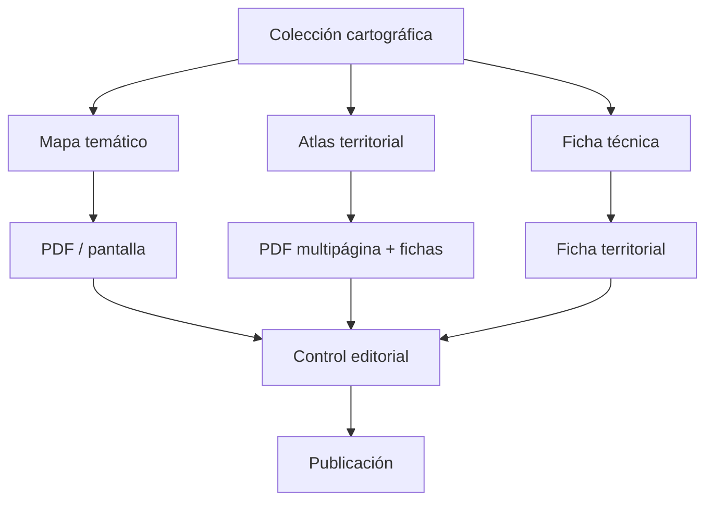
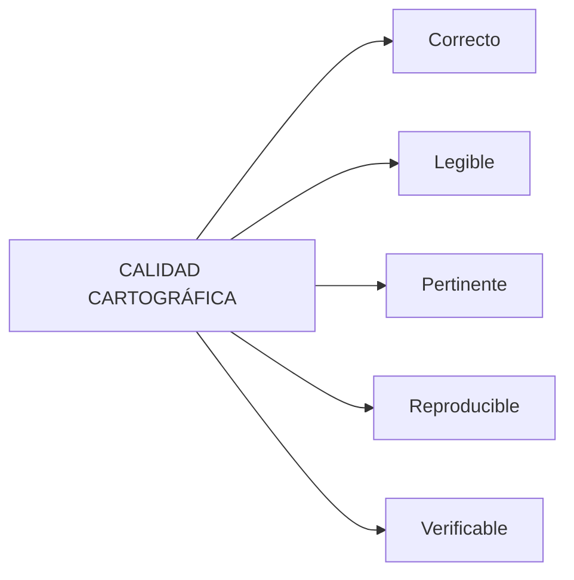
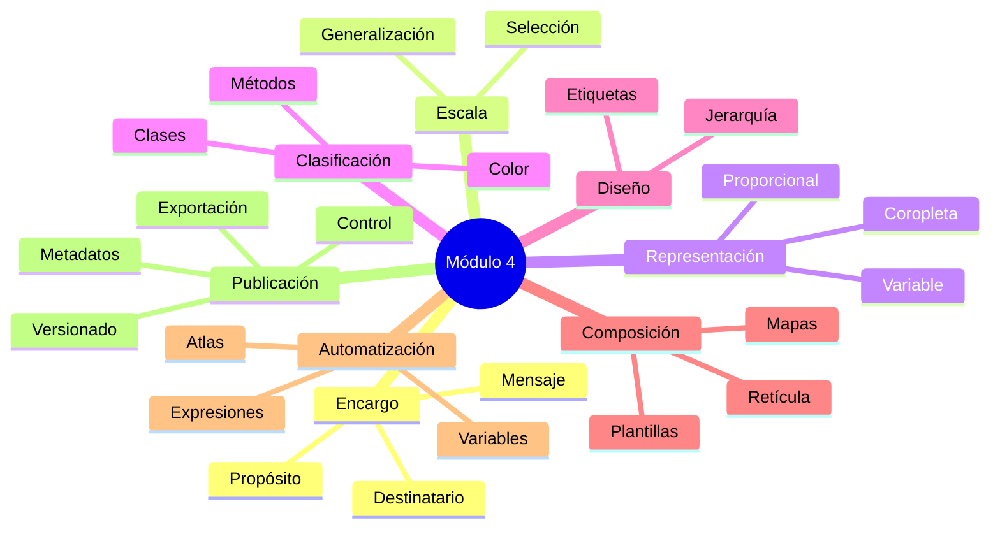

# Módulo 4 · Diseño cartográfico, composición y publicación

<div class="grid cards" markdown>

-   **Diseño cartográfico**

    ---

    Convertir información geográfica en:

    **mensajes territoriales comprensibles.**

-   **Representación temática**

    ---

    Elegir correctamente:

    **variables, símbolos, clases y colores.**

-   **Composición**

    ---

    Construir productos con:

    **estructura editorial y jerarquía visual.**

-   **Automatización**

    ---

    Reutilizar composiciones mediante:

    **variables, expresiones y Atlas.**

-   **Publicación**

    ---

    Preparar productos:

    **verificables, consistentes y adaptados al soporte.**

</div>

[Comenzar el módulo](01-definir-encargo-cartografico.md){ .md-button .md-button--primary }
[Ver proyecto integrador](#proyecto-integrador-del-modulo){ .md-button }

---

## Propósito del módulo

Hasta este punto del curso hemos trabajado principalmente con:

```text
datos
geometrías
atributos
consultas
relaciones espaciales
procesamiento
```

Pero producir un resultado analítico no significa necesariamente haber producido:

```text
un buen mapa
```

Una capa correctamente procesada puede terminar convertida en un mapa:

```text
difícil de leer
mal clasificado
sobrecargado
poco comparable
sin fuentes
sin jerarquía
```

En este módulo abordaremos el SIG desde otra perspectiva:

> **cómo transformar información territorial en productos cartográficos capaces de comunicar con precisión.**

El objetivo general será:

> **Diseñar productos cartográficos claros, rigurosos y reutilizables, capaces de comunicar información territorial a distintos públicos y soportes, aplicando principios de representación temática, jerarquía visual, etiquetado, composición, automatización y control editorial.**

---

## De los datos al producto cartográfico

El proceso no comienza seleccionando:

```text
colores
símbolos
tipografías
```

Comienza definiendo:

```text
qué queremos comunicar
```

La secuencia conceptual del módulo será:

```mermaid
flowchart LR
    A["ENCARGO"] --> B["ESCALA"]
    B --> C["VARIABLE"]
    C --> D["REPRESENTACIÓN"]
    D --> E["CLASIFICACIÓN"]
    E --> F["COLOR"]
    F --> G["JERARQUÍA"]
    G --> H["ETIQUETADO"]
    H --> I["COMPOSICIÓN"]
    I --> J["AUTOMATIZACIÓN"]
    J --> K["EXPORTACIÓN"]
    K --> L["CONTROL EDITORIAL"]
    L --> M["PUBLICACIÓN"]
```



Cada decisión condiciona a la siguiente.

Por ejemplo:

```text
una variable incorrecta
```

no se corrige con:

```text
una buena paleta de colores
```

Del mismo modo:

```text
un mapa mal jerarquizado
```

no se soluciona simplemente añadiendo:

```text
más elementos gráficos
```

---

## Principios que guiarán el módulo

### El mapa comienza con una pregunta

Antes de simbolizar debemos saber:

```text
para quién
para qué
qué debe comprender
```

---

### La representación modifica la lectura

Elegir entre:

```text
total
densidad
porcentaje
tasa
```

puede producir interpretaciones territoriales diferentes.

---

### La escala controla el detalle

Un territorio no debe representarse necesariamente con:

```text
el mismo contenido
```

a todas las escalas.

---

### No todo debe destacar

Una composición necesita:

```text
figura
contexto
jerarquía
```

---

### Etiquetar significa seleccionar

Más etiquetas no significan necesariamente:

```text
más información útil
```

---

### Automatizar no elimina la revisión

Una plantilla o Atlas puede producir cientos de páginas.

Eso no garantiza:

```text
cientos de páginas correctas
```

---

### Un producto terminado debe ser verificable

El lector debería poder reconocer, cuando corresponda:

```text
qué representa
qué unidad utiliza
de qué fecha son los datos
cuál es la fuente
cómo interpretar la leyenda
```

---

## Recorrido de aprendizaje

El módulo está organizado en doce lecciones.

<div class="grid cards" markdown>

-   **4.1 · Definir el encargo cartográfico**

    ---

    Antes de diseñar definiremos:

    ```text
    destinatario
    propósito
    mensaje
    soporte
    escala
    restricciones
    ```

    **Reto:** diseñar dos propuestas para públicos diferentes.

    [Abrir lección](01-definir-encargo-cartografico.md)

-   **4.2 · Preparar información para la escala de salida**

    ---

    Trabajaremos con:

    ```text
    selección
    generalización
    densidad visual
    visibilidad por escala
    ```

    **Reto:** adaptar el mismo territorio a dos escalas.

    [Abrir lección](02-preparar-informacion-escala-salida.md)

-   **4.3 · Elegir una representación temática adecuada**

    ---

    Diferenciaremos:

    ```text
    cantidades
    porcentajes
    tasas
    densidades
    categorías
    ```

    **Reto:** comparar población total y densidad.

    [Abrir lección](03-elegir-representacion-tematica.md)

-   **4.4 · Evaluar clasificaciones y colores**

    ---

    Compararemos:

    ```text
    intervalos iguales
    cuantiles
    rupturas naturales
    clasificación manual
    ```

    y paletas:

    ```text
    secuenciales
    divergentes
    cualitativas
    ```

    **Reto:** comprobar cómo cambia la interpretación sin cambiar los datos.

    [Abrir lección](04-evaluar-clasificaciones-colores.md)

-   **4.5 · Construir una jerarquía visual**

    ---

    Trabajaremos con:

    ```text
    figura y fondo
    contraste
    grosor
    tamaño
    transparencia
    orden
    ```

    **Reto:** destacar el fenómeno principal sin perder contexto.

    [Abrir lección](05-construir-jerarquia-visual.md)

-   **4.6 · Resolver el etiquetado de mapas complejos**

    ---

    Aplicaremos:

    ```text
    prioridades
    expresiones
    obstáculos
    escalas
    máscaras
    llamadas
    ```

    **Reto:** resolver una zona de alta densidad textual.

    [Abrir lección](06-resolver-etiquetado-mapas-complejos.md)

-   **4.7 · Diseñar una composición reutilizable**

    ---

    Construiremos:

    ```text
    página
    márgenes
    guías
    retícula
    alineación
    plantilla QPT
    ```

    **Reto:** crear una plantilla cartográfica reutilizable.

    [Abrir lección](07-disenar-composicion-reutilizable.md)

-   **4.8 · Coordinar mapas y elementos complementarios**

    ---

    Integraremos:

    ```text
    mapa principal
    localizador
    detalle
    temas
    leyendas
    escalas
    cuadrículas
    ```

    **Reto:** coordinar dos mapas independientes.

    [Abrir lección](08-coordinar-mapas-elementos-complementarios.md)

-   **4.9 · Incorporar información dinámica**

    ---

    Automatizaremos:

    ```text
    títulos
    fechas
    fuentes
    indicadores
    tablas
    ```

    mediante:

    ```text
    variables
    atributos
    expresiones
    ```

    **Reto:** construir una ficha territorial dinámica.

    [Abrir lección](09-incorporar-informacion-dinamica.md)

-   **4.10 · Producir un atlas territorial**

    ---

    Generaremos muchas páginas desde:

    ```text
    una sola composición
    ```

    controlando:

    ```text
    cobertura
    extensión
    escala
    orden
    filtro
    archivos de salida
    ```

    **Reto:** producir una ficha por distrito.

    [Abrir lección](10-producir-atlas-territorial.md)

-   **4.11 · Revisar y exportar para distintos usos**

    ---

    Compararemos:

    ```text
    PDF
    SVG
    PNG
    JPG
    ```

    y controlaremos:

    ```text
    resolución
    vector
    ráster
    fuentes
    peso
    ```

    **Reto:** producir versiones para impresión y pantalla.

    [Abrir lección](11-revisar-exportar-distintos-usos.md)

-   **4.12 · Taller editorial: publicar una colección coherente**

    ---

    Integraremos todo el módulo en:

    ```text
    mapa temático
    atlas
    ficha técnica
    ```

    con:

    ```text
    metadatos
    nomenclatura
    versionado
    control editorial
    ```

    **Reto:** publicar una colección cartográfica coherente.

    [Abrir lección](12-taller-editorial-publicar-coleccion-coherente.md)

</div>

---

## Competencias que desarrollarás

Al terminar el módulo deberías poder pasar de:

```text
“quiero hacer un mapa”
```

a un procedimiento técnicamente justificable.

### Diseño cartográfico

Serás capaz de:

- [ ] definir destinatario y propósito;
- [ ] formular el mensaje cartográfico;
- [ ] adaptar la información a la escala;
- [ ] identificar qué información debe dominar visualmente.

### Cartografía temática

Serás capaz de:

- [ ] diferenciar cantidades absolutas y variables normalizadas;
- [ ] elegir entre coropletas, símbolos proporcionales y categorías;
- [ ] evaluar diferentes métodos de clasificación;
- [ ] seleccionar esquemas cromáticos coherentes con la variable;
- [ ] tratar valores ausentes y extremos.

### Representación

Serás capaz de:

- [ ] construir jerarquía visual;
- [ ] controlar figura y fondo;
- [ ] utilizar simbología por reglas;
- [ ] construir estilos reutilizables;
- [ ] resolver problemas complejos de etiquetado.

### Composición

Serás capaz de:

- [ ] estructurar una página;
- [ ] utilizar márgenes y guías;
- [ ] alinear y distribuir elementos;
- [ ] coordinar varios mapas;
- [ ] construir localizadores y vistas de detalle;
- [ ] crear plantillas reutilizables.

### Automatización

Serás capaz de:

- [ ] utilizar variables;
- [ ] incorporar expresiones en composiciones;
- [ ] construir información dinámica;
- [ ] producir Atlas;
- [ ] crear nombres de salida automáticos.

### Publicación

Serás capaz de:

- [ ] seleccionar formatos de exportación;
- [ ] ajustar el producto al soporte;
- [ ] revisar resolución y legibilidad;
- [ ] establecer convenciones editoriales;
- [ ] gestionar versiones;
- [ ] controlar una colección antes de publicarla.

---

## Herramientas de QGIS que utilizaremos

Durante el módulo trabajaremos principalmente con:

| Área | Herramientas |
|---|---|
| Simbología | Categorizado, graduado, reglas, símbolos multicapa |
| Color | Rampas y edición de clases |
| Etiquetado | Expresiones, prioridades, obstáculos, máscaras y llamadas |
| Escala | Rangos de visibilidad y representación multiescala |
| Estilos | Guardado y reutilización |
| Diseñador | Mapas, textos, leyendas, escalas, imágenes y formas |
| Composición | Guías, alineación, distribución, agrupación y bloqueo |
| Mapas múltiples | Temas de mapa, localizadores y detalles |
| Expresiones | Texto dinámico, variables y formato |
| Tablas | Tablas de atributos en composiciones |
| Atlas | Cobertura, filtros, orden y exportación |
| Salida | PDF, SVG e imágenes |

!!! note "Enfoque"

    No aprenderemos estas herramientas como comandos aislados.

    Cada una aparecerá cuando resuelva:

    ```text
    un problema cartográfico concreto
    ```

---

## Preguntas que deberías poder responder al finalizar

Una forma de comprobar el aprendizaje será responder correctamente preguntas como:

### Sobre el encargo

> ¿Quién leerá el mapa y qué debe comprender?

### Sobre la escala

> ¿Cuánto detalle puede sostener realmente este producto?

### Sobre la variable

> ¿Estoy representando cantidad, proporción, tasa o densidad?

### Sobre la clasificación

> ¿Por qué estas entidades pertenecen a la misma clase?

### Sobre el color

> ¿La paleta comunica orden, divergencia o categorías?

### Sobre la jerarquía

> ¿Qué debería ver primero el lector?

### Sobre etiquetas

> ¿Qué nombres son realmente necesarios?

### Sobre composición

> ¿Cómo se organiza la lectura de la página?

### Sobre automatización

> ¿Qué información debería actualizarse sin intervención manual?

### Sobre Atlas

> ¿La misma plantilla funciona correctamente para todas las entidades?

### Sobre exportación

> ¿Este archivo funcionará en el soporte final?

### Sobre publicación

> ¿Puede otra persona verificar de dónde salió este producto?

---

## Metodología de trabajo

Cada lección seguirá, cuando corresponda, una secuencia de aprendizaje como:

```text
PROBLEMA
↓
PREDICCIÓN
↓
CONCEPTO
↓
DEMOSTRACIÓN
↓
COMPARACIÓN
↓
ERROR INTENCIONAL
↓
CHECKPOINT
↓
LABORATORIO
↓
RETO
↓
REVISIÓN
```

No se busca únicamente:

```text
repetir pasos
```

sino desarrollar capacidad para:

```text
diagnosticar
comparar
justificar
validar
```

---

### Antes de aplicar una herramienta

Preguntaremos:

```text
¿qué problema quiero resolver?
```

### Después de aplicarla

Preguntaremos:

```text
¿qué cambió en la lectura del mapa?
```

### Antes de aceptar el resultado

Preguntaremos:

```text
¿es correcto?
¿es legible?
¿es reproducible?
```

---

## Proyecto integrador del módulo

El módulo culminará con la publicación de una pequeña:

```text
colección cartográfica
```

compuesta por tres productos.

### Producto 1 · Mapa temático

Deberá demostrar:

```text
selección correcta de variable
representación temática
clasificación
color
jerarquía
etiquetado
```

---

### Producto 2 · Atlas territorial

Deberá generar:

```text
varias páginas
```

desde una sola composición utilizando:

```text
capa de cobertura
contenido dinámico
extensión automática
nombres de archivo
```

---

### Producto 3 · Ficha técnica territorial

Integrará:

```text
mapa
indicadores
fuentes
fecha
código
metadatos
```

---

### Los tres productos deberán compartir

```text
estructura editorial
tipografía
criterios cartográficos
nomenclatura
fuentes
versionado
```

---

### Producto final esperado



---

## Evidencias del módulo

Durante el desarrollo iremos construyendo:

```text
brief cartográfico
comparaciones multiescala
mapas temáticos
pruebas de clasificación
estilos
configuraciones de etiquetas
plantilla QPT
composición multimap
ficha dinámica
atlas
versiones de exportación
matriz editorial
```

### Organización sugerida

```text
modulo-04/
│
├── brief/
├── mapas/
├── estilos/
├── plantillas/
├── atlas/
├── fichas/
├── exportaciones/
└── control/
```

La estructura puede adaptarse al ejercicio.

El principio importante es mantener:

```text
orden
trazabilidad
```

---

## Criterios transversales de calidad

Durante todo el módulo utilizaremos cinco preguntas de control.

### 1 · ¿Es correcto?

```text
variable
unidad
clasificación
fuente
```

---

### 2 · ¿Es legible?

```text
texto
color
contraste
densidad
jerarquía
```

---

### 3 · ¿Es pertinente?

```text
¿cada elemento ayuda al propósito?
```

---

### 4 · ¿Es reproducible?

```text
¿podemos volver a generar el producto?
```

---

### 5 · ¿Es verificable?

```text
¿podemos rastrear los datos y decisiones?
```

Podemos resumirlo así:



---

## Antes de comenzar

Asegúrate de disponer de:

```text
QGIS 3.44
```

y de un proyecto que contenga al menos:

```text
una capa territorial de polígonos
una variable cuantitativa
una capa de puntos
una red lineal
```

Por ejemplo:

```text
distritos
población
equipamientos
red vial
```

Esto permitirá reutilizar los mismos datos en diferentes ejercicios y observar cómo cambia:

```text
la representación
```

sin cambiar necesariamente:

```text
el territorio
```

!!! tip "Trabajar con los mismos datos durante varias lecciones"

    Permite comprobar que un mismo conjunto de información puede generar productos muy diferentes dependiendo de:

    ```text
    propósito
    escala
    variable
    clasificación
    diseño
    ```

---

## Comenzar

La primera pregunta del módulo no será:

```text
¿Qué color utilizaremos?
```

Será:

> **¿Qué mapa necesitamos producir realmente?**

Comienza en:

[**4.1 · Definir el encargo cartográfico →**](01-definir-encargo-cartografico.md){ .md-button .md-button--primary }

---

## Referencias generales

- [QGIS 3.44 · Manual de usuario](https://docs.qgis.org/3.44/es/docs/user_manual/)  
  Documentación general de las herramientas utilizadas durante el módulo.

- [QGIS 3.44 · Diseñador de impresión](https://docs.qgis.org/3.44/es/docs/user_manual/print_composer/)  
  Referencia para composiciones, elementos cartográficos y Atlas.

- [QGIS 3.44 · Expresiones](https://docs.qgis.org/3.44/es/docs/user_manual/expressions/)  
  Funciones, operadores y variables para construir contenido dinámico.

- [QGIS Training Manual](https://docs.qgis.org/3.44/es/docs/training_manual/)  
  Material oficial de formación de QGIS.

- [ColorBrewer](https://colorbrewer2.org/)  
  Recurso de referencia para esquemas cromáticos aplicados a cartografía temática.

---

## Síntesis del módulo



!!! quote "Idea central del módulo"

    Un producto cartográfico no está terminado simplemente porque:

    ```text
    el mapa se ve bien
    ```

    Está terminado cuando:

    ```text
    comunica lo que debe comunicar,
    utiliza correctamente los datos,
    puede interpretarse,
    puede verificarse,
    y puede reproducirse.
    ```